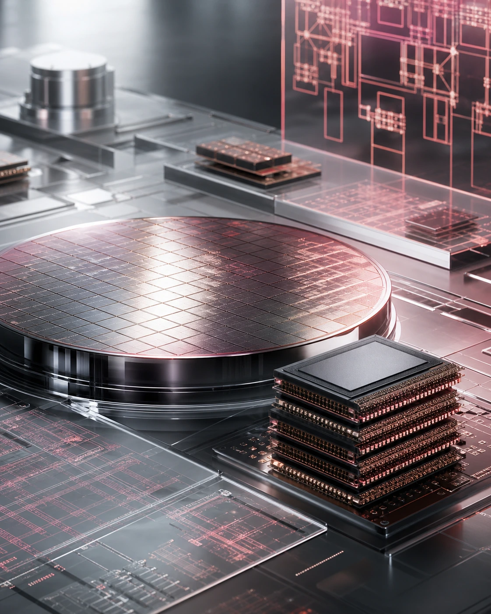
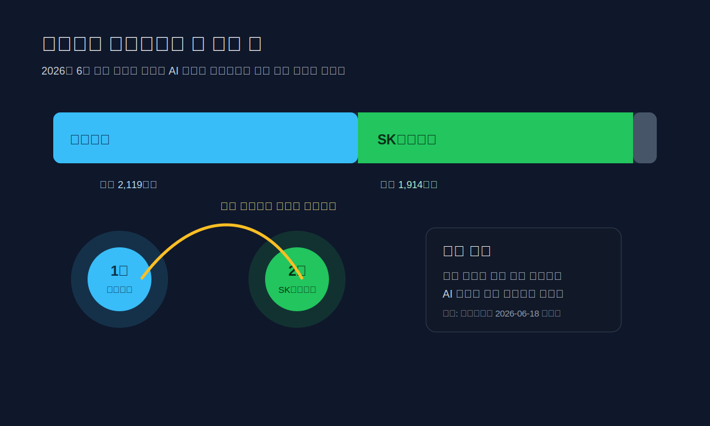
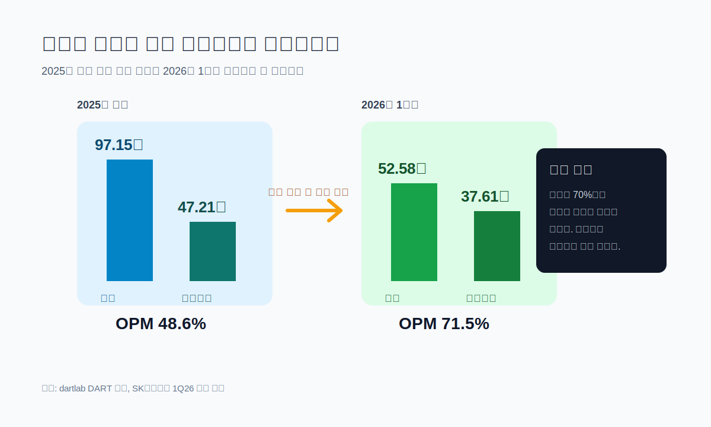
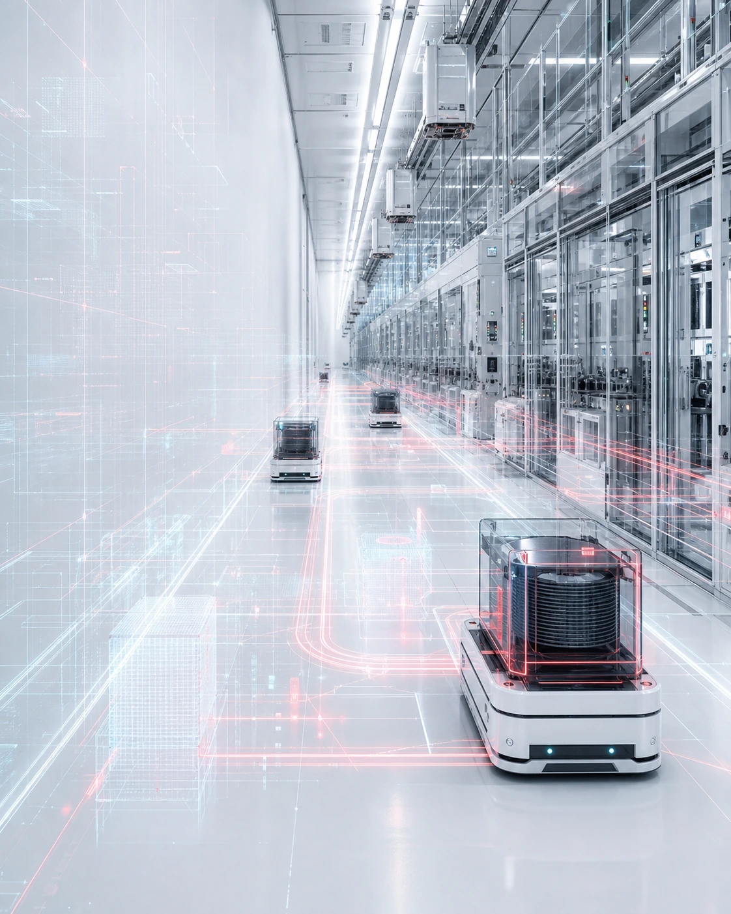
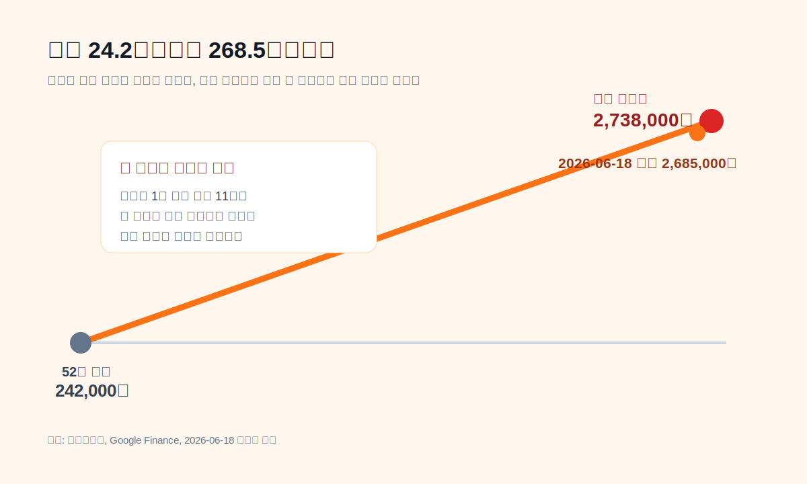
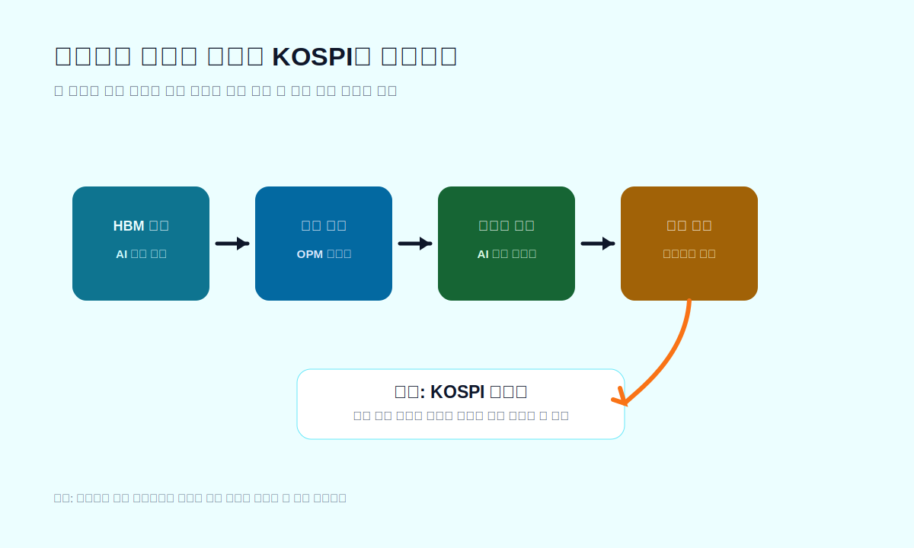
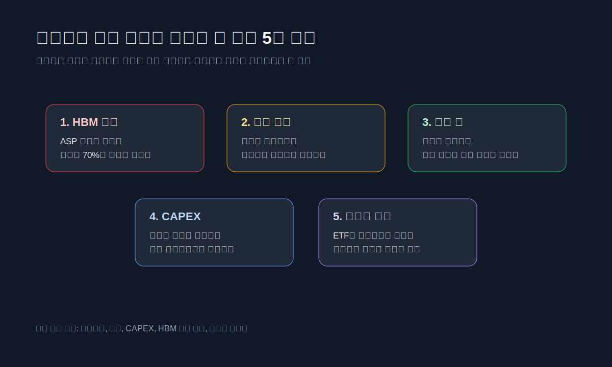
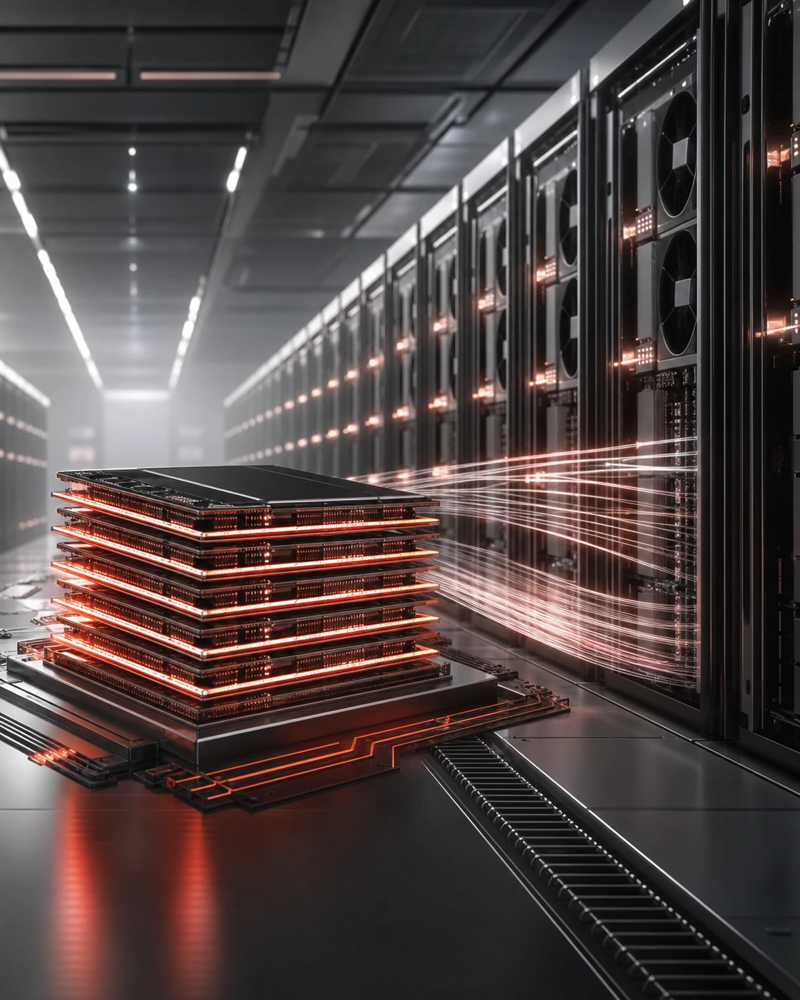

<script>
	import CompanyFinancials from '$lib/components/blog/CompanyFinancials.svelte';
</script>

> **주의**: 이 글은 투자 권유가 아니다. 목표가를 제시하지 않는다. "SK하이닉스가 대한민국 주식시장을 견인하는가"라는 질문을 **지수가 어떤 이익과 수급에 묶여 있는가**로 바꿔 읽는다.
>
> **데이터 기준**: 2026-06-18 KRX 장마감 주가 화면, SK하이닉스 2025년 사업보고서와 2026년 1분기 실적 발표, 2026-06-18 dartlab 실측.
>
> **핵심 숫자**: 주가 **2,685,000원** · 시가총액 **1,913.6조원** · KOSPI **9,063.84** · 2026년 1분기 매출 **52.58조원** · 영업이익 **37.61조원** · 1분기 영업이익률 **71.5%**.

---

## 프롤로그 - 한국장이 오른 것인가, 하이닉스가 한국장이 된 것인가

2026년 6월 18일 장마감 기준 SK하이닉스 주가는 2,685,000원이다. 네이버증권 화면의 동종업종 비교표는 삼성전자를 362,500원, SK하이닉스를 2,685,000원으로 나란히 놓는다. 더 눈에 들어오는 숫자는 시가총액이다. 삼성전자는 2,119조원, SK하이닉스는 1,913조원이다. 한국 주식시장에서 한때 "삼성전자와 나머지"라고 불리던 구도가, 이제는 "삼성전자와 하이닉스, 그리고 나머지"로 바뀌었다.

KOSPI도 같은 날 9,000선을 넘어섰다. Google Finance의 KOSPI 화면은 9,063.84, +2.25%를 보여준다. 지수가 여기까지 왔는데 질문이 "한국 경기가 좋아졌나"로만 흐르면 반쪽이다. 지금의 더 정확한 질문은 이쪽이다. **한국장이 오른 것인가, 아니면 SK하이닉스와 삼성전자가 한국장처럼 보이게 만든 것인가.**



이 질문은 단순한 종목 이야기가 아니다. 한국 주식시장 전체를 보는 방법의 문제다. 지수는 시가총액 가중 방식이다. 큰 회사가 더 많이 오르면 지수도 더 많이 움직인다. 그래서 SK하이닉스가 1,900조원대 시총으로 뛰면, 하이닉스 한 종목의 실적 서사가 시장 전체의 색을 바꾼다. AI 메모리, HBM, 서버 DRAM, eSSD, 외국인 수급, ETF 리밸런싱이 한 줄로 붙는다. 개별 기업 이익이 지수의 언어로 번역되는 순간이다.

그렇다고 결론이 "무조건 견인한다"로 끝나지는 않는다. 하이닉스가 한국장을 끌어올린다는 말은 동시에 한국장이 하이닉스의 HBM 사이클에 의존한다는 말이다. 의존은 랠리일 때는 힘이지만, 꺾일 때는 약점이다. 그래서 이 글의 결론은 날짜도 목표가도 아니다. **SK하이닉스는 지금 대한민국 주식시장을 견인하고 있다. 다만 그 견인력은 넓은 경기 회복보다 HBM 이익률, 외국인 수급, 시가총액 가중 효과에 기대고 있다.**



---

## 1막 - 왜 하필 지금 하이닉스인가

SK하이닉스는 원래 한국 반도체의 두 번째 이름이었다. 삼성전자가 절대 1위였고, 하이닉스는 메모리 사이클을 잘 타면 강하고 잘못 타면 흔들리는 회사로 읽혔다. 기존 [SK하이닉스 종합 글](/blog/000660-skhynix)에서도 핵심은 위기 탈출과 메모리 사이클이었다. 현대전자에서 출발해 채권단 관리, SK 인수, HBM 우위로 이어진 회사의 긴 변신이 그 글의 중심이었다.

이번에는 다르다. 회사가 좋아졌다는 이야기를 다시 쓰는 것이 아니다. 이미 좋아진 회사가 한국 주식시장 전체의 기준점이 되는지를 보는 글이다. 2025년에는 매출 97.1467조원, 영업이익 47.2063조원, 순이익 42.9479조원이 나왔다. dartlab이 DART 사업보고서에서 읽은 2025년 영업이익률은 48.59%다. 이 정도면 제조업이 아니라 병목을 파는 회사에 가깝다.

그런데 2026년 1분기는 더 이상했다. SK하이닉스 1Q26 실적 발표는 매출 52.5763조원, 영업이익 37.6103조원, 순이익 40.3459조원을 밝혔다. 영업이익률은 발표 기준 72%, dartlab 계산으로 71.5%다. 한 분기 영업이익이 37.6조원이다. 2022년 연간 매출이 44.6조원이었는데, 2026년 1분기 영업이익만 37.6조원이다. 숫자의 크기가 산업의 성격을 바꿔버렸다.

```python
import dartlab
c = dartlab.Company("000660")
c.select("IS", ["sales", "operating_profit", "net_profit"], freq="Y")
```

이 숫자가 시장을 움직이는 이유는 단순하다. 첫째, 이익의 크기가 너무 커졌다. 둘째, 이익률이 너무 높다. 셋째, 이익이 AI라는 글로벌 테마와 직접 연결돼 있다. 넷째, 한국 시장에서 이만한 시가총액을 가진 회사가 둘밖에 없다. 그래서 투자자는 SK하이닉스를 사면서 단일 종목을 사는 동시에 한국 AI 메모리 노출을 산다. 외국인은 한국을 살 때 이 이름을 피하기 어렵고, ETF는 지수 비중을 따라 이 이름을 더 담는다.

하이닉스의 랠리가 흥미로운 이유도 여기 있다. 좋은 회사가 오른 것이 아니다. **좋아진 회사가 너무 커져서, 그 회사의 실적 서사가 국가 지수의 서사로 번졌다.** 한국장을 설명하는 문장에서 "수출 회복", "밸류업", "환율", "금리"보다 HBM과 서버 메모리가 앞에 나오는 순간, 하이닉스는 이미 지수의 중심에 들어와 있다.



---

## 2막 - 지수 견인의 첫 번째 조건은 이익률이다

하이닉스가 한국장을 견인한다는 말을 가장 차갑게 검증하는 방법은 주가가 아니라 이익률이다. 주가는 기대를 섞는다. 이익률은 지금 벌고 있는 힘을 보여준다. 2026년 1분기 영업이익률 71.5%는 시장이 그냥 AI 테마를 산 것이 아니라, 실제 손익계산서에 찍힌 이익을 샀다는 근거다.

2025년에도 이미 강했다. 매출 97.15조원, 영업이익 47.21조원, 영업이익률 48.59%. 2024년 매출 66.19조원, 영업이익 23.47조원, 영업이익률 35.45%에서 한 단계 더 올라섰다. 2023년에는 영업적자 7.73조원이었다. 2년 전 적자 회사가 2025년에는 47조원 영업이익 회사가 됐고, 2026년 1분기에는 한 분기에 37.6조원 영업이익을 냈다. 그래서 주가가 과해 보이면서도 시장은 쉽게 놓지 못한다. 사이클이 아니라 구조 변화일 수 있다는 상상이 붙기 때문이다.

SK하이닉스가 공식 1Q26 발표에서 강조한 것도 이 지점이다. 회사는 고부가 제품 판매 증가와 강한 AI 수요가 분기 사상 최대 실적을 이끌었다고 밝혔다. HBM은 그냥 메모리 제품명이 아니다. AI GPU가 늘어날수록 같이 들어가야 하는 병목 부품이다. 병목은 가격결정력을 만든다. 가격결정력은 이익률을 만든다. 이익률은 다시 주가와 지수 비중을 만든다.

```python
profit = c.analysis("수익성")
profit["marginTrend"]["history"][0]
```

이 문장을 숫자로 바꾸면 이렇게 된다. 2026년 1분기 매출 52.58조원 중 영업이익이 37.61조원이다. 제품을 팔아 남긴 돈이 아니라, 산업의 병목을 들고 있을 때 가능한 숫자다. 일반 제조업은 원재료, 설비, 인건비, 감가상각이 이익률을 계속 누른다. 그런데 HBM 공급이 부족하고 고객이 AI 투자를 미루지 못하면, 메모리 회사가 갑자기 소프트웨어 같은 이익률을 보여준다. 이때 시장은 "메모리 회사는 사이클 주식"이라는 오래된 문장을 잠시 접는다.

물론 이것이 영구적이라는 뜻은 아니다. 메모리는 여전히 메모리다. 공급이 늘고 가격이 꺾이면 이익률은 빠르게 내려간다. 하지만 지수는 영구성을 기다리지 않는다. 지금 이익이 크고, 다음 몇 분기 이익 전망이 올라가면 지수는 먼저 반응한다. 그래서 하이닉스의 한국장 견인력은 현재형이다. 영원히 견인한다는 뜻이 아니라, **지금의 이익률이 너무 커서 시장 전체의 방향을 설명할 만큼 커졌다는 뜻**이다.



---

## 3막 - 두 번째 조건은 시가총액이다

이익이 아무리 좋아도 회사가 작으면 지수는 크게 움직이지 않는다. 하이닉스가 특별한 이유는 이익과 시가총액이 동시에 커졌기 때문이다. 2026년 6월 18일 네이버증권 동종업종 비교표의 SK하이닉스 시가총액은 19,136,058억원, 즉 약 1,913.6조원이다. 삼성전자는 약 2,119.3조원이다. 두 회사 합산 시총은 4,000조원을 넘는다.

한국 주식시장에서 이 숫자는 구조적인 의미가 있다. KOSPI가 시가총액 가중 지수라면, 두 회사가 같은 날 크게 오를 때 지수는 강하게 오른다. 반대로 두 회사가 같이 흔들리면 지수도 흔들린다. 한국장이 넓게 좋아져서 오른 것인지, 반도체 두 종목이 무거워져서 오른 것인지 구분해야 하는 이유다.

Google Finance의 000660 화면도 비슷한 그림을 보여준다. 52주 저점 242,000원, 52주 고점 2,738,000원, 2026년 6월 18일 장중 고점권. 가격만 보면 이미 한 번의 기업 재평가가 아니라 시장 구조 변경처럼 보인다. 주가가 10배 넘게 오른 회사가 지수 2위급 시총을 갖고 있다면, 그 회사의 상승은 더 이상 한 종목의 일이 아니다.



이 장면은 [삼성전자 랠리 후속 글](/blog/005930-samsung-rally)과 나란히 읽어야 한다. 삼성전자는 후발 회복과 DS 이익률 회복이 랠리의 본체였다. SK하이닉스는 한발 더 나가 있다. 삼성전자가 "다시 강해지는가"의 질문이라면, 하이닉스는 "너무 강해진 이익이 지수까지 끌고 가는가"의 질문이다.

한국장의 구조도 여기서 바뀐다. 과거에는 삼성전자 하나가 한국 시장의 대표 대형주였다. 투자자는 삼성전자로 한국 수출, 반도체, 환율, 글로벌 IT 수요를 압축해서 샀다. 이제는 SK하이닉스가 그 압축을 나눠 갖는다. 더 정확히 말하면, 삼성전자는 넓은 반도체·스마트폰·가전 복합체이고, SK하이닉스는 AI 메모리 병목에 더 날카롭게 걸려 있다. 시장이 AI 메모리 쪽을 더 높게 가격 매기면 하이닉스의 지수 영향력은 더 커진다.

BlackRock의 iShares MSCI South Korea ETF(EWY) 페이지도 한국 시장 노출의 성격을 보여준다. 2026년 6월 중순 기준 IT 섹터가 절반을 넘는 비중으로 표시된다. ETF나 글로벌 벤치마크를 통해 한국을 사는 투자자에게 한국은 더 이상 조선, 자동차, 화학, 은행이 고르게 섞인 시장이 아니다. 적어도 2026년 6월의 한국은 "AI 메모리와 전자 대형주가 무거운 시장"으로 보인다.

이 지점에서 "견인한다"는 말은 꽤 정확하다. 다만 좋은 의미만 담고 있지 않다. 지수를 끌어올릴 힘이 있다는 말은 지수를 끌어내릴 힘도 있다는 말이다. 시가총액 가중 지수의 장점은 승자가 지수를 밀어 올린다는 것이고, 단점은 승자가 너무 커진 뒤 흔들릴 때 지수가 같이 끌려 내려온다는 것이다.

---

## 4막 - 세 번째 조건은 외국인이 이해하기 쉬운 이야기다

외국인 투자자는 한국의 모든 개별 기업을 같은 깊이로 읽지 않는다. 지수를 사거나, ETF를 사거나, 글로벌 AI 공급망이라는 큰 틀에서 종목을 고른다. 이때 SK하이닉스의 장점은 이야기가 매우 쉽다는 데 있다. AI 투자가 늘어난다. GPU가 팔린다. GPU에는 HBM이 필요하다. HBM 공급은 제한적이다. SK하이닉스가 그 공급의 핵심이다. 그래서 이익률이 오른다.

이 이야기는 한국 내수, 정책, 지배구조, 복잡한 계열사 설명 없이도 통한다. 외국인에게 SK하이닉스는 한국 기업이면서 동시에 글로벌 AI 인프라 부품주다. 한국 시장에 투자하는 이유가 AI 공급망이라면, 하이닉스를 빼기 어렵다. 삼성전자는 더 크고 넓지만, 하이닉스는 더 뾰족하다. 뾰족한 이야기는 랠리에서 강하다.

```python
cash = c.analysis("현금흐름")
cash["cashFlowOverview"]["history"][:3]
```

현금흐름도 이 이야기를 받쳐준다. dartlab 기준 2025년 SK하이닉스의 영업활동현금흐름은 53.37조원, CAPEX는 28.58조원, FCF는 24.79조원이다. 2023년 FCF가 -4.50조원이었던 회사를 생각하면 극적인 변화다. 시장이 좋아하는 것은 흑자전환이 아니라 흑자전환 뒤 현금이 실제로 남는지다. 2025년에는 남았다.

다만 여기서 또 하나의 반전이 나온다. 현금이 남는다고 해서 주주에게 크게 돌아간 것은 아니다. 2025년 배당 지급은 5,220억원 수준이고, FCF 대비 총환원율은 dartlab 기준 2.11%다. 이 회사는 벌어들인 돈 대부분을 내부에 남기고, 설비와 재무구조에 쓰고 있다. 이 선택은 성장기에는 합리적이다. HBM 수요가 강하고 고객 주문이 보이면 CAPEX를 줄이는 것이 오히려 실수일 수 있다.

하지만 투자자 입장에서는 질문이 생긴다. 지금 시장은 하이닉스에 높은 가격을 준다. 그 가격은 높은 이익률과 높은 성장 투자를 같이 믿는 가격이다. 만약 CAPEX가 미래 수요에 정확히 맞으면, 하이닉스는 지수를 더 끌 수 있다. 반대로 CAPEX가 수요를 앞질러 공급과잉으로 돌아오면, 지금의 이익률은 다음 다운사이클의 감가상각 부담으로 바뀐다. 이것이 메모리 산업의 오래된 잔혹함이다.

그래서 외국인이 이해하기 쉬운 이야기는 강점이면서 약점이다. 쉬운 이야기는 돈을 빨리 모은다. 돈이 빨리 모이면 가격이 빨리 오른다. 가격이 빨리 오르면 같은 이야기가 조금만 흔들려도 빠져나가는 돈도 빨라진다. 하이닉스가 한국장을 견인하는 정도가 커질수록, 한국장은 외국인의 AI 메모리 해석 변화에 더 민감해진다.



---

## 5막 - 그런데 이것은 한국 경제 전체의 회복과 다르다

KOSPI가 9,000선을 넘었다고 해서 한국의 모든 산업이 같은 속도로 좋아졌다고 보면 안 된다. 시장 지수는 경제 전체의 평균이 아니라 상장 대형주의 가격이다. 특히 시가총액 가중 지수는 큰 회사의 가격 변화에 더 크게 반응한다. 하이닉스와 삼성전자가 동시에 오르면, 은행·철강·유통·건설·화학이 덜 좋아도 지수는 강해 보인다.

이 구분을 하지 않으면 글이 쉬워지지만 틀린다. "한국 주식시장이 강하다"와 "한국 기업 전반이 강하다"는 다르다. 2026년 6월의 한국장은 AI 메모리의 이익률이 너무 커져서 지수를 밀어 올리는 장면에 가깝다. [마이크론 글](/blog/MU-micron), [엔비디아 글](/blog/NVDA-nvidia), [브로드컴 글](/blog/AVGO-broadcom)과 이어서 보면 같은 축이 보인다. AI 인프라 투자가 칩 설계, 메모리, 네트워크, 소프트웨어 인프라의 이익 기대를 동시에 끌어올리고 있다.

문제는 한국 시장에서 그 기대를 받아낼 그릇이 좁다는 점이다. 미국에는 엔비디아, 브로드컴, AMD, 마이크론, 데이터센터 전력·냉각·소프트웨어 관련 종목이 여러 층으로 퍼져 있다. 한국에는 삼성전자와 SK하이닉스가 너무 무겁다. 한미반도체, 리노공업, 주성엔지니어링 같은 소부장도 있지만 지수 전체를 움직이는 무게는 다르다. 그래서 한국 AI 랠리는 폭보다 깊이가 먼저 보인다.

이것이 "하이닉스가 대한민국 주식시장을 견인하는가"라는 질문의 함정이다. 답은 그렇다. 하지만 정확히는 "하이닉스와 삼성전자가 시가총액 가중 지수를 강하게 견인한다"이다. 한국 시장의 모든 업종이 같은 정도로 좋아지는 것은 아니다. 지수만 보면 강세장이고, 종목 폭을 보면 더 좁은 장일 수 있다.

이 구분은 실전적으로 중요하다. 지수가 오르는데 내 종목이 안 오르는 상황은 이상한 일이 아니다. 지수 상승이 대형 반도체 중심이라면, 반도체 공급망에서 멀리 떨어진 종목은 지수와 따로 움직일 수 있다. 반대로 하이닉스가 흔들릴 때, 반도체와 관계없는 기업까지 지수 하락 때문에 같이 팔릴 수 있다. 지수는 시장 심리를 만들고, 시장 심리는 개별 종목의 할인율을 바꾼다.

따라서 이번 랠리를 읽는 가장 좋은 방법은 KOSPI 숫자 하나를 보는 것이 아니라, 하이닉스·삼성전자·반도체 소부장·비반도체 대형주를 나눠 보는 것이다. 지수가 오르는데 상승 종목 수가 줄어드는지, 외국인 매수가 반도체에만 몰리는지, 은행·자동차·조선·소비재가 같이 움직이는지를 봐야 한다. 시장이 넓어지면 랠리는 건강하다. 시장이 좁아지면 지수는 높아도 위험은 커진다.

---

## 6막 - 하이닉스가 시장을 끌고 간다는 말의 약점

하이닉스의 시장 견인력은 다섯 가지 조건 위에 있다. 첫째, HBM 가격과 출하가 유지돼야 한다. 둘째, 삼성전자와 마이크론의 추격이 하이닉스의 희소성 프리미엄을 크게 낮추지 않아야 한다. 셋째, CAPEX가 미래 수요를 앞지르지 않아야 한다. 넷째, 매출채권과 재고 증가가 매출 인식의 질을 훼손하지 않아야 한다. 다섯째, 외국인 수급이 한국 AI 메모리 바스켓을 계속 사야 한다.

dartlab의 종합 플래그도 이 부분을 경고한다. 부채비율은 약 36%로 매우 안정적이지만, 이익 변동성이 높고 매출채권 성장이 매출 성장보다 빠르며 재고 성장이 매출 성장보다 빠르다는 신호가 잡힌다. 이것은 당장 부실이라는 뜻이 아니다. 고성장 국면에서는 매출채권과 재고가 같이 늘 수 있다. 다만 메모리 산업에서는 이 두 항목이 다음 사이클을 보는 조기 경보가 될 때가 많다.

```python
flags = c.analysis("종합평가")["summaryFlags"]
flags
```

CAPEX도 양면적이다. 2025년 CAPEX는 28.58조원이고, 매출 대비 CAPEX는 29.42%다. 이 투자는 HBM 수요가 계속 강하면 성장 투자가 된다. 그러나 수요가 예상보다 둔화하면 고정비와 감가상각 부담이 된다. 메모리 산업의 역사는 이 장면을 반복했다. 좋은 사이클에는 모두가 투자하고, 나쁜 사이클에는 그 투자가 공급과잉으로 돌아온다.

삼성전자 추격도 변수다. [삼성전자 종합 글](/blog/005930-samsung)과 최근 랠리 글에서 봤듯, 삼성전자는 후발 회복의 서사를 갖고 있다. 만약 삼성전자가 HBM 승인과 공급에서 빠르게 따라오면, 한국 시장 전체에는 긍정일 수 있다. 하지만 하이닉스의 단독 희소성 프리미엄에는 부담이 된다. 시장이 "하이닉스만 살 수 있다"에서 "삼성도 산다"로 바뀌면 수급은 분산된다.

마지막은 가격 그 자체다. 네이버증권 기준 2026년 6월 18일 현재가 2,685,000원, Google Finance 기준 52주 저점 242,000원. 이 정도 상승 뒤에는 좋은 뉴스가 상당 부분 가격에 들어갔다고 봐야 한다. 좋은 회사가 비싸질 수 있고, 비싼 회사가 더 오를 수도 있다. 하지만 높은 가격에서는 작은 실망도 크게 보인다. 특히 이익률이 70%대일 때는 더 그렇다. 시장은 이미 기적 같은 분기 실적을 봤고, 다음 분기에도 비슷한 수준을 기대하기 시작한다.



---

## 7막 - 그래서 언제까지 견인할 수 있나

날짜로 답하면 약하다. 하이닉스가 한국장을 언제까지 견인할지는 달력이 아니라 숫자 조합으로 봐야 한다. 첫 번째 숫자는 HBM과 서버 DRAM의 가격이다. 회사가 직접 제품별 ASP를 모두 공개하지 않더라도, 매출총이익률과 영업이익률에서 방향은 보인다. 영업이익률이 70%대에서 60%대, 50%대로 내려가도 시장이 받아들일 수 있는지, 아니면 peak-out으로 해석하는지가 관건이다.

두 번째 숫자는 매출채권이다. 매출이 폭증할 때 매출채권이 같이 늘어나는 것은 자연스럽다. 하지만 매출보다 더 빨리 늘고 회수 기간이 길어지면, 시장은 매출의 질을 묻기 시작한다. 2026년 1분기처럼 수요가 강한 시기에는 문제가 묻힌다. 다운사이클이 오면 바로 보인다.

세 번째 숫자는 재고다. HBM과 고부가 서버 메모리는 부족하다고 하는데 재고가 동시에 많이 늘면 설명이 필요하다. 제품 믹스 전환 과정인지, 고객 주문 대응인지, conventional DRAM과 NAND 재고인지 구분해야 한다. 재고가 나쁘다는 뜻이 아니라, 재고의 질을 봐야 한다는 뜻이다.

네 번째 숫자는 CAPEX다. 2025년 CAPEX 28.58조원은 영업현금흐름으로 감당할 수 있었다. 문제는 2026년과 2027년이다. 고객 주문이 보이는 투자라면 시장은 환영한다. 수요를 앞선 선제 투자라면 사이클 리스크가 커진다. SK하이닉스가 "demand-aligned investment"를 강조하는 이유도 여기에 있다. 투자와 수요의 간격이 하이닉스 밸류에이션의 핵심이다.

다섯 번째 숫자는 외국인 보유율과 지수 폭이다. 네이버증권 동종업종 비교표는 SK하이닉스 외국인비율을 51.30%로 보여준다. 외국인이 이미 많이 들고 있다는 것은 신뢰이면서 동시에 포화 리스크다. 더 살 돈이 들어오면 강하고, 비중 제한이나 차익실현이 시작되면 약하다. KOSPI가 계속 올라가려면 하이닉스와 삼성전자만 오르는 장에서 다른 업종으로 상승 폭이 넓어져야 한다.

정리하면 이렇다. 하이닉스의 시장 견인력은 다음 조건에서 유지된다. HBM 수요가 강하고, 영업이익률이 높은 수준에서 버티고, CAPEX가 주문 기반으로 설명되고, 매출채권·재고가 통제되고, 외국인 수급이 한국 AI 메모리 노출을 계속 산다. 반대로 이 중 두세 개가 동시에 흔들리면, 하이닉스는 좋은 회사로 남아도 지수 견인력은 약해질 수 있다.

---

## 8막 - 투자자가 착각하기 쉬운 세 가지

첫 번째 착각은 "하이닉스가 한국장을 견인한다"를 "한국장이 모두 좋다"로 읽는 것이다. 지금 강한 것은 시가총액이 큰 AI 메모리 대형주다. 조선, 자동차, 금융, 소비재, 화학이 모두 같은 속도로 좋아지는 장면과는 다르다. 지수 수익률과 체감 수익률이 달라질 수 있다.

두 번째 착각은 "이익률이 높다"를 "영원히 높다"로 읽는 것이다. 메모리 산업의 이익률은 수요와 공급의 함수다. HBM이 구조적 성장 제품인 것은 맞지만, 구조적 성장 제품도 공급이 붙으면 가격은 변한다. 하이닉스가 강한 것은 사실이다. 하지만 강하다는 말이 사이클을 없애지는 않는다.

세 번째 착각은 "주가가 많이 올랐으니 끝났다"로 단정하는 것이다. 이것도 약하다. 주가는 많이 올랐지만 이익도 훨씬 더 많이 올라왔다. 2026년 1분기 EPS가 57,175원이다. 이를 단순 연환산하면 228,700원이고, 2,685,000원 주가는 약 11.7배가 된다. 반대로 후행 EPS 기준으로 보면 Google Finance는 P/E 25배 안팎을 보여준다. 같은 주가가 싸 보이기도 하고 비싸 보이기도 한다. 이유는 간단하다. 시장이 2026년 이익을 얼마나 반복 가능하다고 보는지가 아직 확정되지 않았기 때문이다.

그래서 이 글은 목표가를 쓰지 않는다. 목표가는 보기 쉽지만 틀리기 쉽다. 대신 조건을 남긴다. 다음 분기 실적에서 영업이익률이 70%대 근처에 남는가. 매출총이익률이 유지되는가. CAPEX 설명이 주문 기반인가. 매출채권과 재고가 매출 성장보다 과하게 빠른가. 외국인 보유율과 지수 상승 폭이 같이 움직이는가. 이 다섯 가지가 하이닉스가 한국장을 계속 끌 수 있는지의 실제 체크리스트다.

---

## 9막 - 결론: 하이닉스는 한국장을 끌고 있다, 그래서 더 조심해서 읽어야 한다

질문으로 돌아가자. SK하이닉스는 대한민국 주식시장을 견인하는가. 2026년 6월 18일 기준 답은 그렇다. 주가, 시가총액, KOSPI 9,000선, 1분기 영업이익률 70%대, 외국인 보유율, ETF의 한국 IT 비중을 같이 보면 부정하기 어렵다. 하이닉스는 이제 한국 시장의 한 종목이 아니라 한국 시장을 설명하는 핵심 변수다.

하지만 이 결론은 축하 문장으로 쓰면 안 된다. 하이닉스가 시장을 견인한다는 말은 한국 시장이 하이닉스의 HBM 이익률과 AI 메모리 주문에 강하게 연결됐다는 뜻이다. 시장이 넓게 좋아진 것과 좁게 강해진 것은 다르다. 좁게 강한 시장은 빠르게 오른다. 동시에 빠르게 흔들린다.

그래서 다음 공시에서 볼 것은 단순 매출 증가가 아니다. 매출은 이미 충분히 크다. 이제 봐야 할 것은 이익률의 질, 현금흐름의 질, CAPEX의 질, 재고와 매출채권의 질이다. 하이닉스가 한국장을 계속 견인하려면 좋은 숫자만 내면 부족하다. 좋은 숫자가 왜 지속될 수 있는지까지 설명해야 한다.

내 결론은 이렇다. **SK하이닉스는 지금 대한민국 주식시장을 끌고 간다. 그러나 그 힘은 한국 경제 전체의 넓은 회복이 아니라 HBM 병목과 AI 메모리 이익률에서 나온다. 다음 장은 주가 차트가 아니라 2분기 공시의 매출채권, 재고, CAPEX, 영업이익률이 쓴다.**



---

## 검증표

| 항목 | 확인값 | 해석 | 출처 |
|---|---:|---|---|
| SK하이닉스 주가 | 2,685,000원 | 52주 고점권, 저점 대비 10배 이상 | [네이버증권](https://finance.naver.com/item/main.nhn?code=000660), [Google Finance](https://www.google.com/finance/beta/quote/000660%3AKRX) |
| SK하이닉스 시가총액 | 약 1,913.6조원 | 삼성전자에 이어 한국 시장 2축 | [네이버증권](https://finance.naver.com/item/main.nhn?code=000660) |
| KOSPI | 9,063.84 | 9,000선 돌파 구간 | [Google Finance KOSPI](https://www.google.com/finance/beta/quote/KOSPI%3AKRX) |
| 2026년 1분기 매출 | 52.5763조원 | 분기 매출 50조원 돌파 | [SK하이닉스 1Q26 실적 발표](https://www.prnewswire.com/news-releases/sk-hynix-announces-1q26-financial-results-302750959.html), DART |
| 2026년 1분기 영업이익 | 37.6103조원 | 분기 영업이익률 71.5% | [SK하이닉스 IR](https://www.skhynix.com/ir/UI-FR-IR06/), DART |
| 2025년 매출 | 97.1467조원 | 사상 최대 연간 매출 | [SK하이닉스 IR](https://www.skhynix.com/ir/UI-FR-IR06/), DART |
| 2025년 영업이익 | 47.2063조원 | 연간 OPM 48.59% | DART, dartlab |
| 2025년 FCF | 24.7938조원 | CAPEX 이후에도 현금 창출 | dartlab |
| 2025년 CAPEX | 28.5793조원 | 매출 대비 29.42% 투자 | dartlab |
| EWY IT 섹터 비중 | 52%대 | 글로벌 ETF에서 한국 노출이 IT 중심 | [BlackRock EWY](https://www.ishares.com/us/products/239681/ishares-msci-south-korea-capped-etf) |

같이 읽을 글: [SK하이닉스 종합](/blog/000660-skhynix) · [삼성전자 종합](/blog/005930-samsung) · [삼성전자 랠리 후속](/blog/005930-samsung-rally) · [엔비디아](/blog/NVDA-nvidia) · [마이크론](/blog/MU-micron) · [브로드컴](/blog/AVGO-broadcom) · [SK스퀘어](/blog/402340-sk-square)

---

<CompanyFinancials code="000660" />
