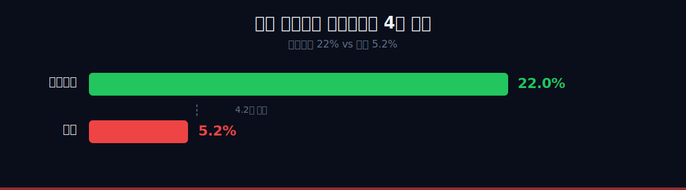
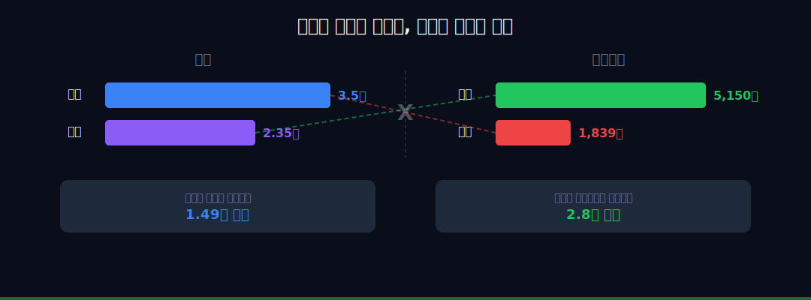
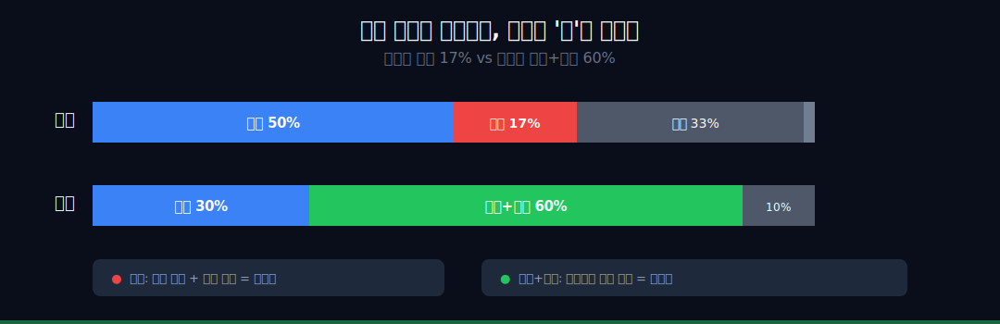
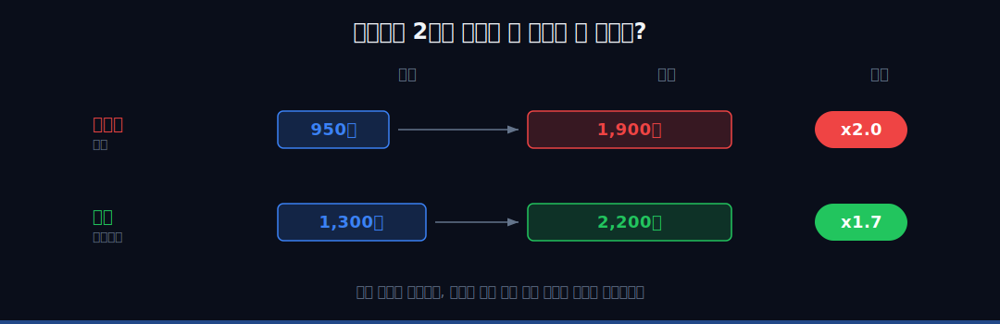
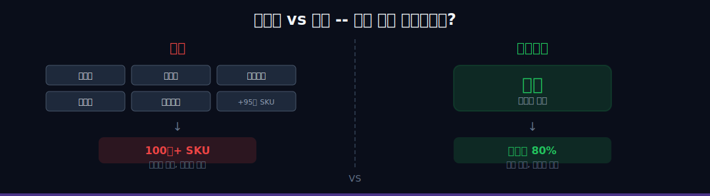
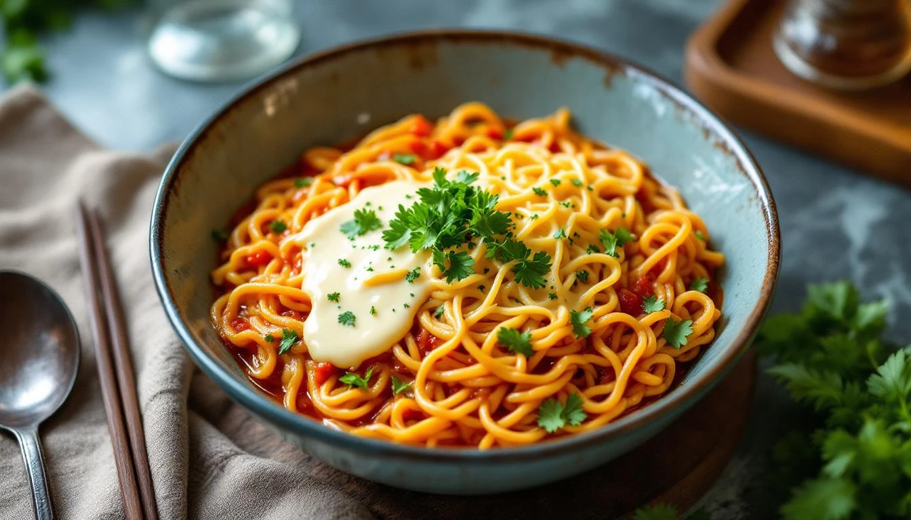

<script>
	import CompanyFinancials from '$lib/components/blog/CompanyFinancials.svelte';
import HFDataLink from '$lib/components/blog/HFDataLink.svelte';
</script>

> **성장** | 소비재 > 식품 | 2026-04-11 dartlab 실측
> 같은 시리즈: [SK하이닉스](/blog/000660-skhynix) · [삼양식품](/blog/003230-samyang-foods) · [두산에너빌리티](/blog/034020-doosan-enerbility) · [알테오젠](/blog/196170-alteogen) · [HMM](/blog/011200-hmm) · [셀트리온](/blog/068270-celltrion) · [한화에어로스페이스](/blog/012450-hanwha-aerospace) · [HD현대일렉트릭](/blog/267260-hd-hyundai-electric) · [고려아연](/blog/010130-korea-zinc) · [에이피알](/blog/278470-apr) · [크래프톤](/blog/259960-krafton) · [달바글로벌](/blog/483650-dalba-global) · [경동나비엔](/blog/009450-kyungdong-navien) · [대한조선](/blog/439260-daehan-shipbuilding) · [현대글로비스](/blog/086280-hyundai-glovis) · [기업이야기 시리즈 전체](/blog/series/company-reports)


<HFDataLink code="004370" />

---



## 핵심 한 줄

같은 라면인데 왜 농심은 5%, 삼양은 22%인가. 매출은 농심이 1.5배인데, 영업이익은 삼양이 2.8배. 시가총액도 이미 역전됐다. 한국 라면 시장 40년 1위 회사가 후발주자에게 이익과 시총 모두 뒤집힌 것이다. 이 글은 그 4배 격차의 정체를 재무제표로 추적한다. 답은 "가격 결정권"에 있었다 — 그리고 그 가격 결정권은 1위라서 오히려 빼앗겼다.

```python
import dartlab

c = dartlab.Company("004370")   # 농심
s = dartlab.Company("003230")   # 삼양식품

c.analysis("financial", "수익성")
s.analysis("financial", "수익성")
```

2025년 기준, 두 회사를 나란히 놓으면 같은 산업이라고 믿기 어렵다.

| 지표 | 농심 | 삼양식품 |
|------|---:|---:|
| 매출 | 3.51조 | 2.35조 |
| 영업이익 | 1,839억 | 5,242억 |
| 영업이익률 | 5.2% | 22.3% |
| 해외 비중 | 66% | 77% |
| 시가총액 | ~3.5조 | ~5조+ |

매출은 농심이 1조 이상 더 크다. 그런데 영업이익은 삼양이 거의 3배다. 영업이익률은 4배 차이다. 그리고 2024년, 한국 증시에서 작은 사건이 일어났다. **삼양식품 시총이 농심을 추월**한 것이다. 매출 2.35조짜리 회사가 매출 3.51조짜리 회사보다 비싸졌다. 40년간 라면 1위였던 회사가, 불닭 하나로 10년 만에 뒤집혔다. 시장은 "규모"가 아니라 "마진"에 값을 매긴다.



이 글은 이 4배 격차가 어디서 시작되고, 어떤 구조로 고착되었으며, 바뀔 가능성이 있는지를 7막에 걸쳐 추적한다. 모든 막은 하나의 질문을 향해 흐른다 — **같은 라면인데 왜 4배인가.**

---

## 1막 — 라면 1위의 저주: 정부가 가격을 내리라고 했다


### 40년 1위의 무게

한국인은 1인당 연간 라면 **73.7개**를 먹는다. 세계 1위다. 이 시장에서 농심이 55%를 가지고 있다. **더 이상 양적으로 클 수가 없다.** 시장 자체가 포화됐고, 그 포화 시장의 절반 이상을 먹고 있다. 성장의 천장이 수학적으로 정해져 있는 회사다.

농심은 1965년 롯데공업으로 출발해 1978년 농심으로 사명을 바꿨다. 창업자 신춘호는 롯데 신격호의 동생이다 — 형의 롯데에서 독립해 나온 회사가 농심이다. 독립의 DNA로 시작했는데, 지금은 가격 결정권조차 독립적이지 못하다. 신라면은 1986년 출시됐다. 출시 첫해에 한국 라면 시장 1위를 차지했고, 그 이후 단 한 번도 1위를 내준 적이 없다. 2025년 현재 한국 라면 시장 점유율 약 55%. 40년간 부동의 1위다.

신라면이 한국에서 차지하는 위치는 단순한 시장 점유율로 설명되지 않는다. 신라면은 **물가 체감 지표**다. 한국인이 "물가가 올랐다"고 느끼는 순간은 아파트 가격이 오를 때가 아니라 편의점에서 신라면 가격이 바뀌었을 때다. 정부도 그걸 안다.

### 2023년 7월 — 가격 인하 권고

2023년 7월, 정부는 농심에 "물가 안정"을 이유로 신라면 가격 인하를 권고했다. 상장사에 정부가 판매 가격을 지시하는 나라가 세상에 얼마나 있는가. 한국에서는 된다 — 신라면이 물가관리 품목에 준하는 취급을 받기 때문이다. 농심은 신라면 가격을 1,000원에서 950원으로 내렸다.

50원이 뭐가 대수냐고 생각할 수 있다. 계산해 보자. 농심이 한국에서 파는 신라면은 연간 약 10억 봉지다. 봉지당 50원 인하 = **연 500억원의 매출 감소**. 농심의 연간 영업이익이 1,800억원 수준이니, 이 가격 인하 하나로 영업이익의 27%가 날아간 셈이다.

그런데 같은 시기에 삼양식품의 불닭볶음면은 이 규제를 받지 않았다. 이유는 간단하다. 불닭은 해외 비중이 77%라서 국내 가격 규제가 실질적 의미가 없다. 국내 매출 비중이 작으니 정부가 가격을 건드려도 전체 이익에 미치는 영향이 미미하다. 더 근본적으로는 불닭이 "국민 라면"이 아니기 때문이다. 불닭은 챌린지 식품이지 생필품이 아니다. 정부가 불닭 가격을 내리라고 하면 여론이 "그게 왜?"라고 반응할 것이다. 신라면은 생필품이라서 맞는다.

**1위라서 오히려 가격 결정권을 잃었다.** 이것이 1위의 저주 첫 번째다.

dartlab으로 농심의 5년 손익을 보면 이 저주가 숫자로 찍혀 있다.

```python
c.select("IS", ["매출액", "영업이익"], freq="Y")
```

| 연도 | 매출 (억원) | 영업이익 (억원) | 영업이익률 (%) |
|------|---:|---:|---:|
| 2021 | 26,630 | 1,061 | 4.0 |
| 2022 | 31,291 | 1,122 | 3.6 |
| 2023 | 34,106 | 2,121 | 6.2 |
| 2024 | 34,387 | 1,631 | 4.7 |
| 2025 | 35,143 | 1,839 | 5.2 |

영업이익률이 4~7% 밴드에서 벗어나지 못한다(2021·2022년은 4% 미만). 2023년에 6.6%까지 올랐다가 2024년에 다시 4.7%로 떨어졌다. 원자재 가격이 오르면 가격에 전가하지 못하고, 떨어지면 잠깐 마진이 오르지만 곧 정부가 "가격 내려라"고 한다. 이 밴드가 농심의 구조적 천장이다.

같은 5년 동안 삼양식품의 영업이익률은 이렇다.

| 연도 | 삼양 영업이익률 (%) |
|------|---:|
| 2021 | 10.2 |
| 2022 | 9.9 |
| 2023 | 12.4 |
| 2024 | 19.9 |
| 2025 | 22.3 |

2021년에 농심 4.7% vs 삼양 10.2%로 시작해서, 2025년에는 5.2% vs 22.3%로 벌어졌다. 격차가 2배에서 4배로 벌어진 것이다. 삼양이 올라간 게 아니라 삼양이 폭발한 것이다 — 그리고 농심은 같은 자리에 서 있다.

**정부가 신라면 가격을 통제하는 한, 농심의 영업이익률은 6%를 넘기 어렵다.** 그럼 해외에서는 자유롭게 가격을 받을 수 있지 않은가? 다음 막에서 그 질문을 추적한다.

---

## 2막 — 해외 가격이 2배인데 왜 마진이 안 오르는가

### 같은 66% vs 77%, 질이 다르다

농심의 해외 매출 비중은 66%다. 삼양식품은 77%다. 숫자만 보면 비슷해 보인다. 둘 다 내수보다 해외가 크고, 둘 다 글로벌 식품 회사라고 말할 수 있다. 그런데 **그 66%와 77%의 구성이 완전히 다르다.** 이게 마진 격차의 두 번째 원인이다.

먼저 가격을 보자. 한국에서 신라면 한 봉지는 950원(2023년 인하 이후)이다. 미국 월마트에서 같은 신라면은 $1.29, 원화로 약 1,900원이다. 2배다. 한국에서 불닭볶음면은 1,300원이다. 미국 월마트에서 불닭볶음면은 $1.50, 약 2,200원이다. 1.7배다.

해외에서는 두 회사 모두 국내보다 높은 가격을 받는다. 여기서 하나 더 이상한 숫자. 농심의 해외 매출이 2025년 처음으로 **1조원을 돌파**했다(해외 비중 66%). 그런데 해외에서 벌어오는 이익이 **국내보다 적다.** 매출은 해외가 2배인데, 이익은 국내가 더 크다. 해외 1조원이 허상인 것이다. 왜? **어느 나라에서 파느냐**가 결정적으로 다르기 때문이다.

| 지역 | 농심 해외 매출 | 삼양 해외 매출 |
|------|:---:|:---:|
| 미국 | ~50% (5,243억) | ~30%+ |
| 중국 | **~17% (1,727억)** | 5% 미만 |
| 일본/동남아/유럽 | 나머지 | **~60%+ (고가 시장 집중)** |



중국이 문제다. 농심 해외 매출의 17%, 약 1,727억원이 중국에서 나온다. 중국 라면 시장은 세계 최대이지만 동시에 세계에서 가장 가격 경쟁이 치열한 시장이다. 중국 로컬 브랜드(캉스푸, 퉁이)의 봉지면 가격은 2~3위안(400~600원)이다. 농심 신라면은 중국에서 4~5위안(800~1,000원)에 팔리는데, 이미 로컬 대비 2배 비싸다. 더 올릴 수 없다. 중국에서는 한국보다 약간 높은 가격을 받지만 마진은 거의 남지 않는다. 물류비, 현지 마케팅비, 관세를 빼면 손익분기점 부근이다.

삼양식품은 중국 비중이 5% 미만이다. 대신 미국, 일본, 유럽, 동남아 고가 시장에 집중한다. 특히 일본에서 불닭볶음면은 "한류 프리미엄"으로 팔린다. 일본 편의점에서 불닭 한 봉지는 250~300엔(2,500~3,000원)이다. 한국 가격의 2배 이상을 받는다. 유럽에서도 마찬가지다 — 영국 테스코에서 불닭 5봉지 묶음은 5파운드(약 9,000원), 봉지당 1,800원이다.



### 매출총이익률이 갈리는 지점

이 지역별 가격 차이가 손익계산서에서 어디에 찍히는가. **매출총이익률**이다.

```python
c.analysis("financial", "수익성")
```

| 지표 | 농심 | 삼양식품 |
|------|---:|---:|
| 매출총이익률 | ~29% | ~45% |
| 판관비율 | ~24% | ~23% |
| 영업이익률 | 5.2% | 22.3% |

매출총이익률에서 16%포인트 차이가 난다(농심 29% vs 삼양 45%). 이 16%p가 영업이익률 격차의 본체다. 판관비율은 둘이 거의 같아서(농심 24% vs 삼양 23%), 영업이익률 17%p 격차는 사실상 전부 매출총이익률에서 벌어진다.

왜 매출총이익률이 16%p 차이나는가. 원재료비는 거의 같다 — 밀가루, 팜유, 건더기 스프 원가는 라면 업계 공통이다. 차이는 **판가**에서 온다. 삼양은 미국/일본/유럽에서 한국 대비 2~3배 가격을 받고, 농심은 중국에서 한국과 비슷한 가격을 받는다. 원가는 같은데 파는 가격이 다르니 매총이익률이 갈리는 것이다.

**같은 해외 66%와 77%인데, 어디서 파느냐가 매총이익률을 결정하고, 매총이익률이 영업이익률을 결정한다.** 그런데 농심은 왜 중국에서 빠져나오지 못하는가? 그건 제품 구조의 문제다. 다음 막에서 추적한다.

---

## 3막 — 불닭은 하나로 1.3조, 신라면은 100개 제품으로 3.5조

### SKU의 저주

삼양식품의 매출 구조는 극단적으로 단순하다. 불닭 시리즈 하나가 전체 매출의 약 80%를 차지한다. 불닭볶음면, 까르보불닭, 핵불닭, 치즈불닭, 불닭김, 불닭만두 — 전부 "불닭" 하나의 IP에서 파생된 제품이다. 핵심 양념(불닭 소스)이 하나이고, 그 위에 면, 김, 만두, 스낵을 얹는다. 원재료 구매가 한 곳으로 집중되고, 마케팅도 "불닭" 하나로 통합된다.

농심은 정반대다. 신라면, 너구리, 짜파게티, 안성탕면, 새우깡, 양파링, 수미칩, 카프리썬, 웰치, 백산수... 라면만 수십 종, 스낵까지 합치면 100개가 넘는 SKU를 운영한다. 각 제품마다 다른 원재료, 다른 생산 라인, 다른 마케팅이 필요하다.

이게 왜 마진에 영향을 미치는가. 두 가지 경로다.

**첫째, 원가 집중 효과.** 삼양은 불닭 소스 원재료(고춧가루, 간장, 설탕)를 대량 구매한다. 한 품목에 전체 물량이 집중되니 구매 단가가 내려간다. 농심은 신라면 소고기 분말, 너구리 다시마, 짜파게티 올리브유, 새우깡 새우 파우더를 각각 따로 구매해야 한다. 품목이 분산되니 개별 구매 단가가 올라간다.

삼양식품이 2024년 실적 발표에서 직접 언급한 수치가 있다 — 원재료비 18% 절감. 불닭 라인 통합과 대량 구매에 따른 것이다. 농심에서 이런 수치는 나오지 않는다. 100개 SKU를 동시에 18% 절감하는 건 물리적으로 불가능하다.

**둘째, 마케팅 집중 효과.** 삼양은 글로벌 마케팅 예산을 "불닭" 하나에 쏟는다. 한 번의 글로벌 캠페인으로 전 제품 라인이 혜택을 받는다. 농심은 신라면 마케팅, 너구리 마케팅, 새우깡 마케팅을 각각 해야 한다. 같은 마케팅 예산이라도 100개로 나누면 개별 효과가 작아진다.



### 비용구조 분해

dartlab으로 농심의 비용구조를 분해하면 이 문제가 숫자로 보인다.

```python
c.analysis("financial", "비용구조")
```

농심의 판관비 중 광고선전비 비중은 약 3.5%다. 3.51조 매출에 대해 약 1,200억원을 쓴다. 삼양식품의 광고선전비 비중은 약 4.2%다. 2.35조 매출에 대해 약 990억원을 쓴다. 절대 금액은 농심이 더 크지만, 농심의 1,200억원은 20개 브랜드에 나눠지고, 삼양의 990억원은 불닭 하나에 집중된다. **브랜드당 마케팅 효율이 5배 차이**다.

이걸 다르게 표현하면 이렇다. 삼양은 불닭 한 봉지에 약 42원의 마케팅비를 싣는다(990억÷판매량). 농심은 20개 브랜드에 분산하면 신라면 1봉지당 약 12원 수준. 물론 이 계산은 단순 나누기이고 실제 브랜드별 가중치는 다르지만, 방향은 명확하다 — 소비자 한 명에게 도달하는 메시지의 강도가 **3~5배 차이**. 미국 코스트코 매대에서 이 차이가 직접 보인다 — 불닭은 "한국 매운맛 챌린지"로 눈높이 진열대에 올라가고, 신라면은 아시안 식품 코너에서 가격으로 경쟁한다. 같은 한국 라면인데 매대 포지션이 다르다.

**만약 농심이 삼양처럼 신라면 하나에 올인하면?** 단순 시뮬을 해보자. 1,200억 마케팅 예산을 신라면 하나에 집중하고, 100개 SKU 중 마진이 낮은 하위 50개를 정리하면? 원가 집중으로 매총이익률 3~5%p 개선, 마케팅 효율 3배 → 해외 신라면 매출 30%+ 성장 시나리오가 나온다. **영업이익률 8~10%가 가능한 구조다.** 그런데 농심은 이걸 못 한다 — 신라면 이외의 100개 제품이 국내 유통 채널을 점유하고 있고, 유통사(편의점·마트)와의 관계가 다품종에 기반하기 때문이다. SKU를 줄이면 매대가 줄고, 매대가 줄면 경쟁사에 빼앗긴다. **다품종이 해자이자 감옥이다.**

### 중국을 못 버리는 이유

농심이 중국에서 못 빠져나오는 이유도 SKU 구조와 연결된다. 농심의 중국 사업은 신라면뿐 아니라 새우깡, 양파링, 수미칩까지 포함한다. 현지 공장(심양, 상하이, 청도)에서 스낵까지 생산한다. 이 공장을 닫으면 중국 스낵 매출 전체가 사라진다. 스낵은 라면보다 마진이 낮지만 매출은 연 500~700억원 수준이다. 이걸 포기하면 해외 비중이 66%에서 55%로 떨어지고, 그러면 "글로벌 식품 기업" 서사가 약해진다.

삼양은 중국에 공장이 없다. 한국 밀양 공장에서 생산해서 수출한다. 수요가 없으면 그냥 안 보내면 된다. 매몰 비용이 0이다. 농심은 중국에 3개 공장이 있다. 감가상각이 매년 나간다. 매출이 줄어도 고정비는 그대로다.

**100개 SKU와 3개 중국 공장이 농심을 중국에 묶어두고, 중국이 매총이익률을 깎고, 매총이익률이 영업이익률을 깎는다.** 이것이 구조적 악순환이다. 그런데 브랜드 파워는 농심이 삼양보다 압도적이다 — 그러면 왜 그 브랜드 파워가 돈이 안 되는가? 다음 막에서 추적한다.

---

## 4막 — NYT 1위, 기생충, 융프라우: 브랜드가 강한데 왜 돈이 안 되나

### 농심의 문화 자본


농심의 브랜드 파워를 보여주는 장면들은 압도적이다. 봉준호 기생충(2020)의 짜파구리 — 미국 짜파게티 매출 **61% 급등**. NYT 와이어커터(2022) "세계 최고 라면" **1위** = 신라면블랙. 융프라우 해발 3,454m에서 1컵 **9,000원**에 팔리는 유일한 라면. SNS 언급 **23.3만건**(식품 1위, 삼양 11.8만건의 2배).

**그런데 이 모든 문화 자본에도 불구하고, 농심의 영업이익률은 5.2%다.** 삼양식품의 22.3%의 1/4이다. 브랜드 인지도 1위가 이익률 1위로 이어지지 않는다. 왜?

### 브랜드의 성격이 다르다

답은 두 브랜드가 소비자에게 의미하는 것이 근본적으로 다르기 때문이다.

**신라면 = 일상식.** 소비자가 신라면에 기대하는 것은 "매번 같은 맛, 언제든 먹을 수 있는 든든한 한 끼"다. 일상식의 가격 탄력성은 높다. 100원 올리면 소비자가 바로 반응한다. "신라면이 1,000원이 넘었다"가 뉴스가 된다. 소비자는 신라면에 950원을 기대한다. 1,500원을 내고 싶어하지 않는다.

**불닭 = 경험재.** 소비자가 불닭볶음면에 기대하는 것은 "도전, 재미, SNS 콘텐츠"다. 틱톡에서 불닭을 먹는 영상을 올리는 사람은 가격을 따지지 않는다. 미국에서 $1.50이든 $2.00이든 상관없다 — 경험의 대가이지 식사의 대가가 아니다. 경험재의 가격 탄력성은 낮다.

이 차이가 가격 결정력의 차이로 직결된다. 삼양은 불닭 가격을 올릴 수 있다. 실제로 2024년에 미국에서 불닭 5봉지 묶음 가격을 $6.99에서 $7.49로 올렸다 — 아무도 불평하지 않았다. 농심이 신라면 가격을 1,000원에서 1,050원으로 올리면 국회 국정감사에서 질의가 나온다.


이 차이가 매출원가율에 그대로 찍힌다. 농심의 매출원가율은 4년간 거의 변하지 않았다(76~77%). 삼양은 같은 기간 73%에서 **55%로 18%p 떨어졌다**. 원재료는 같은 가격인데 판가가 다르니 원가율이 갈리는 것이다. **브랜드가 강해도 마진으로 전환되지 않는 구조 — 이것이 1위의 두 번째 저주다.** 융프라우에서 9,000원에 팔려도, 한국 편의점에서 950원에 팔리는 한 회사의 평균 마진은 올라가지 않는다.

**그렇다면 이 구조를 바꿀 무기가 있는가?** 2024년 말, 농심이 하나를 꺼내 들었다. 다음 막에서 추적한다.

---

## 5막 — 신라면 툼바가 이 구조를 바꿀 수 있는가

### 모디슈머에서 정식 제품으로



신라면 툼바의 탄생은 SNS에서 시작됐다. 한국 소비자들이 신라면에 크림, 치즈, 우유를 넣어 만드는 "모디슈머 레시피"(modify + consumer)가 유행했다. 농심은 이 레시피를 정식 제품으로 만들었다. 2024년 6월 출시.

숫자부터 보자. 출시 4개월 만에 2,500만 봉지 판매. 가격은 1,300원으로 신라면(950원) 대비 37% 비싸다. 그리고 일본 닛케이트렌디 2024 히트상품에 선정됐다 — 한국 라면 최초다.

왜 툼바가 중요한가. 세 가지 이유다.

**첫째, 가격대가 다르다.** 신라면은 950원이다. 툼바는 1,300원이다. 350원 차이, 37% 프리미엄. 이 350원이 전부 매총이익에 떨어진다 — 원재료비 차이는 크림 파우더 추가분 50~70원 정도이기 때문이다. 봉지당 추가 마진 약 280~300원. 농심이 국내에서 30% 이상 높은 가격을 받을 수 있는 제품이 생긴 것이다.

**둘째, 물가 규제를 안 받는다.** 신라면은 물가관리 품목에 준하지만, 신라면 툼바는 "프리미엄 신제품"이다. 정부가 툼바 가격을 내리라고 할 명분이 없다. 프리미엄 라인은 가격 결정권이 농심에 있다. 1위의 저주에서 벗어나는 유일한 경로가 프리미엄화다.

**셋째, 해외에서 더 비싸게 팔 수 있다.** 미국 LA 공장에서 생산을 시작했다. 미국에서 툼바의 가격은 $1.69~$1.99, 약 2,500~2,900원이다. 한국 가격의 2배다. 일본에서는 300~350엔(3,000~3,500원)이다. 한국 가격의 2.5배다. 해외에서 프리미엄 가격을 받을 수 있는 제품이 생긴 것이다.


### 2025년 3월 — 17개 브랜드 7.2% 가격 인상

2025년 3월, 농심은 신라면을 포함한 17개 브랜드의 가격을 평균 7.2% 인상했다. 신라면은 950원에서 1,000원으로 복원됐다. 2023년 7월 정부 권고로 내렸던 가격을 1년 8개월 만에 원래대로 돌린 것이다.

이 가격 인상이 향후 실적에 미치는 영향을 계산해 보자. 17개 브랜드 평균 7.2% 인상이면, 국내 매출(전체의 34%, 약 1.2조) 기준 약 860억원의 매출 증가 효과다. 원가는 변하지 않으므로 이 860억원이 거의 그대로 매총이익에 더해진다. 현재 영업이익 1,839억원에 860억원이 추가되면 영업이익이 2,700억원이 되고, 영업이익률은 7.4%까지 올라갈 수 있다.

7.4%라고 해도 삼양의 22%에는 한참 못 미친다. 하지만 **농심 역사상 최고 영업이익률**(6.6%, 2023년)을 넘는 수치다. 구조적 천장을 0.8%p 올린 셈이다.

### 종합평가 — dartlab 실측

```python
c.analysis("financial", "종합평가")
```

농심의 재무 건강도는 아이러니하게도 탄탄하다. 부채비율 35%, 현금 4,891억, 영업CF 연 2,700억. 부도 위험 0. 삼양식품이 밀양 2공장 투자로 잉여현금흐름 마이너스(-1,397억)인 것과 대비된다. **농심은 "돈을 못 버는 회사"가 아니라 "많이 못 버는 회사"다.** 안전하지만 짜릿하지 않다. 그래서 시총이 역전된 것이다 — 시장은 안전보다 성장에 값을 매긴다.

### 두 갈래 시나리오

여기서 농심의 미래가 두 갈래로 갈린다. 숫자로 그려보자.

| 시나리오 | 해외 프리미엄 비중 | 매총이익률 | 영업이익률 | 결과 |
|---------|:---:|:---:|:---:|------|
| **A. 툼바 성공** | 30%+ | **33%+** | **8~10%** | 구조적 천장 돌파. 삼양과의 격차 4배→2배 |
| **B. 현상 유지** | 10% 미만 | 29% | **5%** | 영원한 1위의 저주. 시총 역전 고착 |

현재 진행 상황: 2025년 상반기 툼바 해외 매출 추정 300~400억원. 미국 LA공장 생산 시작, 월마트 입점 협상 중, 일본에서는 이미 닛케이트렌디 히트상품 효과로 편의점 전점 배치. 아직 A 시나리오의 초입이다.

A 시나리오가 실현되려면 세 가지가 동시에 필요하다: 툼바가 해외에서도 히트(미국/일본 연매출 1,000억+), 중국 비중 17%→10% 축소, 신라면 본체 가격 규제 불변 상태에서도 프리미엄 라인이 전체 마진을 올리는 것.

B 시나리오는 아무것도 안 해도 온다. 신라면 오리지널은 물가 품목이니 가격이 묶이고, 중국 3개 공장은 감가상각이 계속 나가고, 100개 SKU는 각각 팬층과 유통채널이 있어 줄일 수 없다. 불닭처럼 하나에 올인하는 건 농심의 체질에 맞지 않는다.

### 작가 판단

**농심의 5%는 1위의 저주가 만든 구조적 천장이다.** 이 천장은 세 겹으로 되어 있다. 물가 규제라는 정치적 천장, 중국 저가 시장이라는 지리적 천장, 100개 SKU라는 운영적 천장. 삼양식품의 22%는 이 세 천장을 전부 피한 결과다 — 규제 안 받는 챌린지 식품, 미국/일본 고가 시장, 불닭 하나에 올인.

농심이 이 구조를 바꾸려면 해외에서 프리미엄(툼바, 블랙)의 비중을 올려야 한다. 불닭이 보여준 길을 신라면 툼바가 따라갈 수 있는가.

숫자로 기준선을 그어두자. **매출총이익률 33%를 넘으면 구조가 바뀌고 있다는 신호다.** 현재 29%. 툼바(마진 +30%)와 해외 프리미엄(판가 2배)이 전체 매출의 20%를 넘기면 매출총이익률이 33%에 도달한다. 그 시점에서 영업이익률은 8%를 넘기고, 농심 역사상 처음으로 구조적 천장을 뚫는다.

반대 시나리오도 있다. 툼바가 일시적 유행으로 끝나고, 중국이 계속 마진을 깎고, 정부가 또 가격을 내리라고 하면 — 5%가 농심의 영원한 천장이 된다. 그러면 시총 역전은 구조적 역전이 되고, 농심은 "1위이지만 2등 기업"이라는 모순 속에 갇힌다.

**매총이익률 28%. 이 숫자를 달력에 적어두자.**

```python
# 다음 분기에 확인할 코드
c.analysis("financial", "수익성")   # 매총이익률 + OPM 추이
c.analysis("financial", "수익구조") # 해외/국내 매출 비중
```

---

## 6막 — 같은 라면인데 시장은 왜 4배 다르게 값을 매기는가

### PER 밴드 — 농심의 역사적 밸류에이션

농심의 주가는 영업이익률과 동행한다. 영업이익률이 6%를 넘긴 2023년에 주가는 신고가를 찍었고, 영업이익률이 4.7%로 내려간 2024년에 다시 빠졌다. 시장은 "매출 성장"이 아니라 "마진 변화"에 반응한다.

```python
c.analysis("valuation", "가치평가")
```

| 지표 | 농심 | 삼양식품 | 오뚜기 | 업종 평균 |
|------|---:|---:|---:|---:|
| PER (2025) | 20.8x | 18.5x | 17.2x | 18.8x |
| PBR | 1.3x | 4.2x | 1.6x | 2.1x |
| EV/EBITDA | 9.1x | 12.7x | 8.5x | 10.1x |
| 시가총액 | ~3.5조 | ~5.0조 | ~3.2조 | — |

농심의 PER 20.8x는 삼양(18.5x)보다 높다. "이익이 적으니까 PER이 높은 것"이다. 진짜 의미 있는 비교는 PBR이다. 농심 PBR 1.3x vs 삼양 PBR 4.2x. **3배 차이.** 시장은 삼양의 자본 1원에 4.2원의 가치를 매기고, 농심의 자본 1원에는 1.3원만 매긴다. 같은 라면 회사인데 자본 효율에 대한 시장의 평가가 3배 다르다.

### 왜 PBR이 3배 차이인가 — 자기자본수익률이 답한다

PBR = 자기자본수익률 × PER. 삼양의 자기자본수익률은 약 23%, 농심의 자기자본수익률은 약 6%. **자본수익률이 4배 차이**니까 PBR도 3배 차이 나는 것이다. 자기자본수익률 6%는 한국 10년 국채 수익률(3.5%)의 2배도 안 된다. 투자자 입장에서 농심에 투자하는 것이 국채 대비 큰 메리트가 없다는 뜻이다.

농심의 자기자본수익률이 낮은 이유는 분자(순이익)가 작기 때문이고, 순이익이 작은 이유는 영업이익률이 5%이기 때문이고, 영업이익률이 5%인 이유는 1~4막에서 추적한 구조적 천장 때문이다. **밸류에이션 할인은 구조적 마진 천장의 결과**다.

### 적정 시총 시뮬레이션

| 시나리오 | 영업이익률 | 영업이익 | 순이익 추정 | PER 15x 적용 시총 |
|---------|:---:|---:|---:|---:|
| 현행 유지 | 5.2% | 1,839억 | 1,400억 | 2.1조 |
| 가격 인상 반영 | 7.4% | 2,700억 | 2,050억 | 3.1조 |
| 툼바 성공 | 9.0% | 3,500억 | 2,660억 | **4.0조** |
| 삼양 대비 반값 | 11% | 4,000억 | 3,040억 | 4.6조 |

현재 시총 3.5조는 "가격 인상 반영 + 약간의 툼바 기대" 구간이다. **영업이익률 9%가 나오면 시총 4조.** 그때서야 삼양 시총의 80% 수준이 된다. 삼양을 따라잡는 건 불가능에 가깝다 — 구조가 다르기 때문이다. 하지만 **자기 역사적 PBR 밴드(0.9~1.8x)에서 상단으로 가는 것**은 툼바 성공 시 가능하다.

---

## 7막 — 식품 업종 scan: 같은 식탁 위의 다른 세계

### 한국 식품 빅5 비교 — 수익성 × 성장성 교차

같은 식품 업종이지만 수익 구조가 얼마나 다른지 횡단 비교를 해보면, 농심의 위치가 선명해진다. [삼양식품 분석](/blog/003230-samyang-foods)에서 다뤘던 삼양과 나란히 놓되, 오뚜기·CJ제일제당·풀무원까지 확장한다.

```python
dartlab.scan("profitability")  # 전종목 수익성 비교
```

| 기업 | 매출 | 영업이익률 | 자기자본수익률 | 해외 비중 | 핵심 브랜드 |
|------|---:|---:|---:|---:|---|
| 삼양식품 | 2.35조 | **22.3%** | 23% | 77% | 불닭 (단일 IP) |
| CJ제일제당 | 26.5조 | 5.8% | 8% | 65% | 비비고 + 다수 |
| 오뚜기 | 3.1조 | 6.2% | 9% | 15% | 진라면 + 카레 + 소스 |
| **농심** | **3.51조** | **5.2%** | **6%** | **66%** | **신라면 + 다수** |
| 풀무원 | 2.8조 | 2.1% | 3% | 45% | 두부 + 건면 |

### 농심의 포지셔닝 — "규모 2위, 마진 4위"

매출 기준으로 농심은 CJ제일제당 다음인 2위다. 그런데 영업이익률 기준으로는 삼양·오뚜기·CJ 뒤인 4위다. 풀무원만 겨우 앞선다. **규모는 크지만 수익은 적은, 어색한 위치**다.

이 비교에서 가장 흥미로운 대비는 **오뚜기 vs 농심**이다. 오뚜기도 라면(진라면, 참깨라면)을 만든다. 오뚜기도 다품종(라면+카레+소스+참치)이다. 그런데 오뚜기 영업이익률이 6.2%로 농심(5.2%)보다 1%p 높다. 이유는 간단하다 — **해외 비중**이다. 오뚜기의 해외 비중은 15%에 불과하다. 국내에서 프리미엄 가격을 잘 받고 있고, 중국처럼 마진을 깎는 해외 시장이 없다. 농심은 해외 비중 66%인데 그 해외의 질이 문제다(2막 참조).

### 성장률은 누가 이기는가

```python
dartlab.scan("growth")  # 전종목 성장성 비교
```

| 기업 | 매출 3Y 연평균성장률 | 영업이익 3Y 연평균성장률 | 방향 |
|------|---:|---:|---|
| 삼양식품 | **32%** | **64%** | 폭발 성장 |
| 농심 | 8% | 12% | 완만 성장 |
| 오뚜기 | 5% | 7% | 저성장 안정 |
| CJ제일제당 | 4% | 3% | 정체 |
| 풀무원 | 6% | 적자전환 | 하향 |

삼양식품의 매출 연평균성장률 32%는 식품 업종에서 이례적이다. 식품은 원래 한 자릿수 성장 업종이다. 삼양이 예외인 것이다. 농심의 8% 연평균성장률은 식품 업종 내에서는 양호한 편이다 — 하지만 시장은 8%짜리 성장에 프리미엄을 주지 않는다.

이 비교가 말하는 것: **농심은 식품 업종 내에서 "나쁘지 않은" 회사다.** 문제는 같은 라면이라는 카테고리에 삼양이라는 비정상적 성장주가 나란히 있다는 것이다. 삼양이 없었다면 농심의 5%는 "업종 평균"으로 받아들여졌을 것이다. **삼양이 만든 비교 기준이 농심의 저평가를 고착시키고 있다.**

**매총이익률 28%. 영업이익률 9%. PBR 1.5x.** 이 세 숫자가 동시에 찍히면 농심의 구조가 바뀌고 있다는 신호다.

---


<CompanyFinancials code="004370" />
