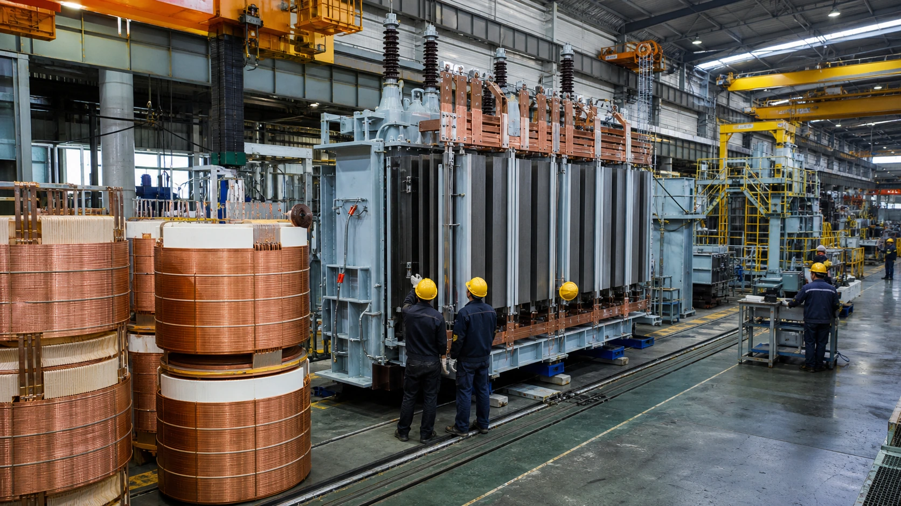
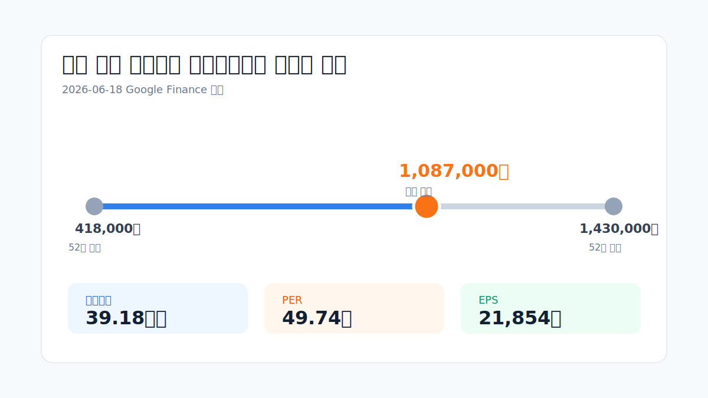
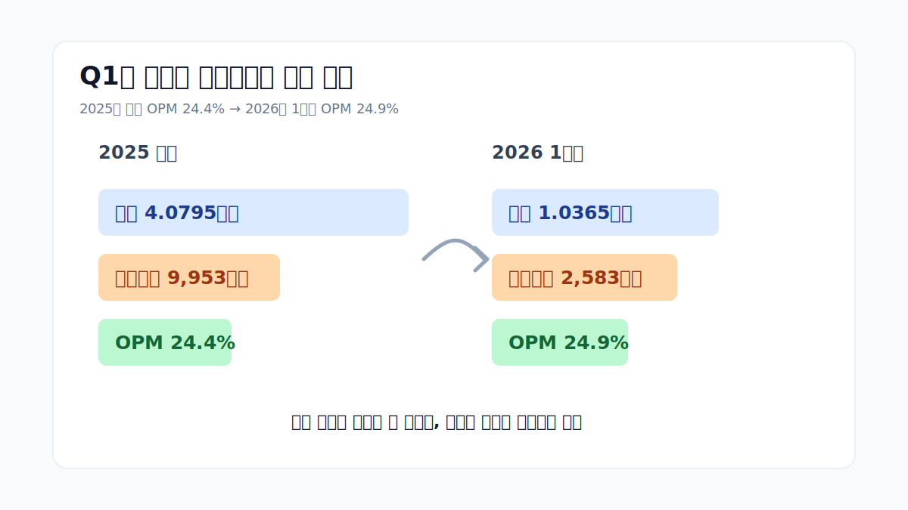
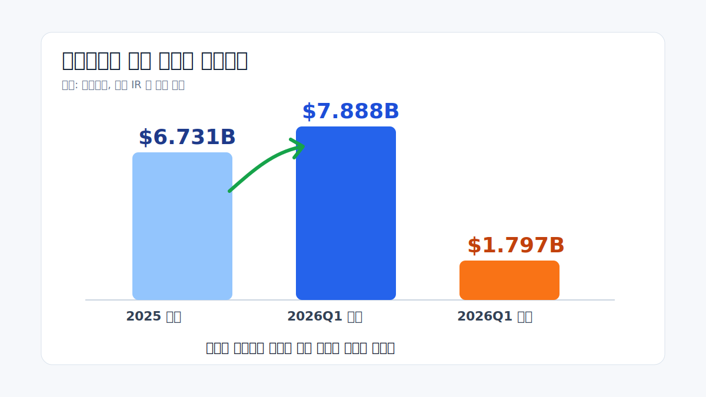
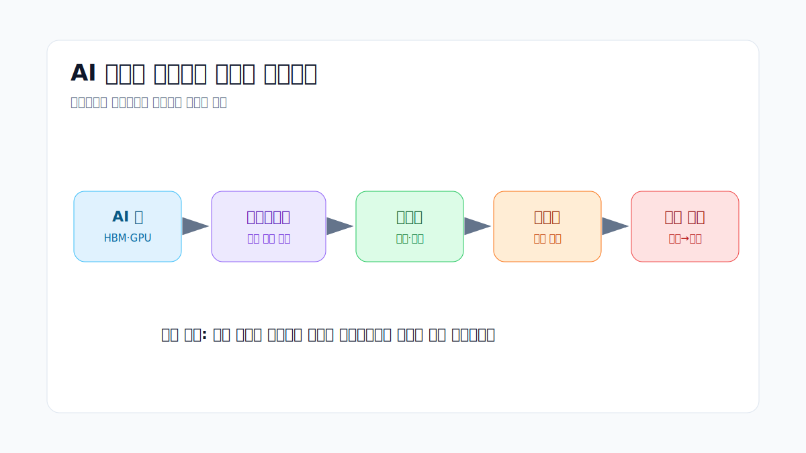
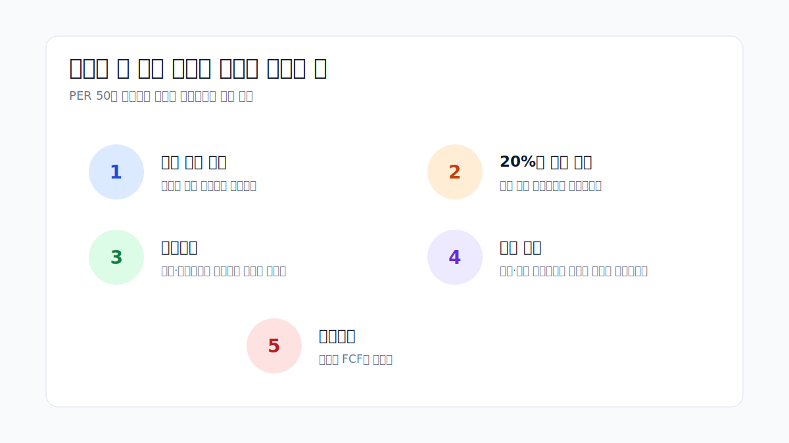
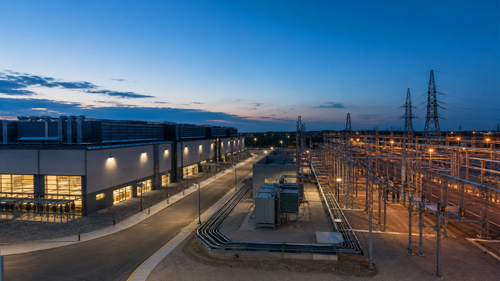
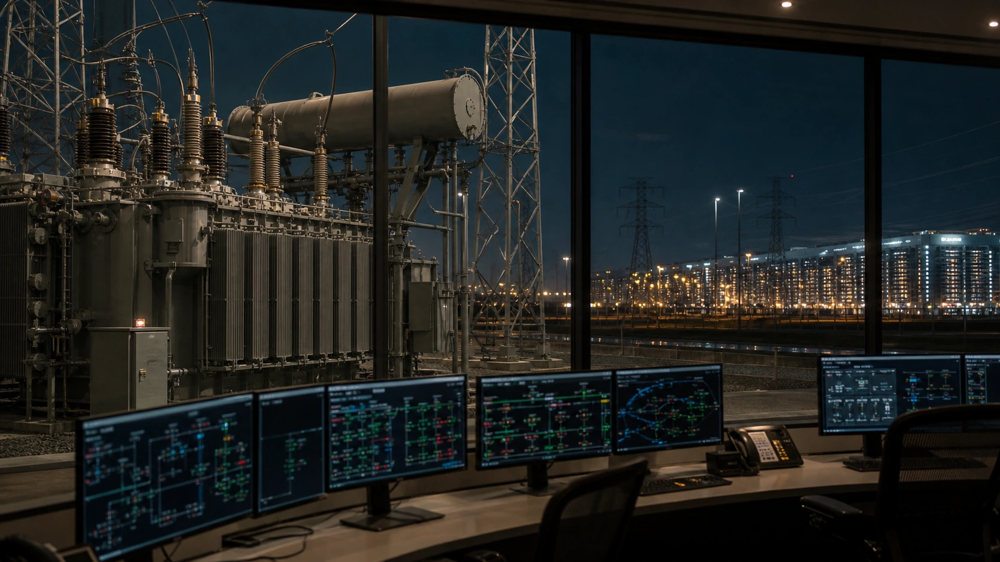

<script>
	import CompanyFinancials from '$lib/components/blog/CompanyFinancials.svelte';
</script>

> **주의**: 이 글은 투자 권유가 아니다. 목표가를 제시하지 않는다. "HD현대일렉트릭이 오른다/내린다"가 아니라, AI 전력 수요가 이미 높아진 가격을 어디까지 설명할 수 있는지 점검한다.
>
> **데이터 기준**: 2026-06-18 Google Finance 장중·마감 화면, HD현대일렉트릭 IR 자료, 2025년 사업보고서와 2026년 1분기보고서, 2026-06-18 dartlab 실측.
>
> **핵심 숫자**: 주가 **1,087,000원** · 시가총액 **39.18조원** · PER **49.74배** · 52주 고점 **1,430,000원** · 2025년 영업이익 **9,953억원** · 2026년 1분기 영업이익률 **24.9%**.

---

## 프롤로그 - AI는 칩만 먹는 게 아니라 전기를 먹는다

SK하이닉스와 삼성전자를 보고 나면 자연스럽게 이런 질문이 남는다. 한국 주식시장의 AI 랠리는 반도체에서 끝나는가, 아니면 전력기기까지 넓어지는가. AI 서버가 늘면 HBM이 필요하다. HBM을 꽂은 서버가 늘면 데이터센터가 필요하다. 데이터센터가 늘면 전기가 필요하다. 전기가 필요하면 송전망, 변전소, 변압기가 필요하다. 이 사슬의 끝에 HD현대일렉트릭이 있다.

그래서 이번 글은 기존 [HD현대일렉트릭 턴어라운드 글](/blog/267260-hd-hyundai-electric)을 다시 쓰는 글이 아니다. 그 글의 핵심은 적자 회사가 어떻게 변압기 병목주가 되었는가였다. 이번 질문은 다르다. **이미 좋은 회사라는 사실이 시장 가격에 꽤 많이 반영된 지금, 앞으로도 AI 전력난이 이 회사를 두 번째 주도주로 만들 수 있는가.**



2026년 6월 18일 [Google Finance](https://www.google.com/finance/beta/quote/267260%3AKRX)는 HD현대일렉트릭을 1,087,000원, 시가총액 39.18조원, PER 49.74배로 보여준다. 52주 저점은 418,000원, 52주 고점은 1,430,000원이다. 이 정도면 "AI 전력 수혜"라는 말만으로는 부족하다. 시장은 이미 전력난을 알고 있다. 문제는 전력난이 아니라 **전력난이 숫자로 얼마나 오래 남느냐**다.



좋은 산업, 좋은 회사, 좋은 숫자. 여기까지는 쉽다. 더 어려운 질문은 이 다음이다. 50배에 가까운 PER이 버티려면 2026년과 2027년에 무엇이 계속 확인되어야 할까. 수주잔고가 쌓이는 것만으로 충분할까. 아니면 실제 매출 인식과 현금흐름이 따라와야 할까. 이 글은 그 질문을 따라간다.

---

## 1막 - 이미 오른 가격이 먼저 묻는 질문

2026년 6월 18일 기준 HD현대일렉트릭 주가는 108만7000원이다. 이날 화면만 보면 전일 대비 -2.95%였지만, 더 큰 그림은 다르다. 52주 저점 41만8000원에서 보면 아직도 2.6배 수준이다. 52주 고점 143만원과 비교하면 조정이 있었지만, 시장이 이미 이 회사를 평범한 산업재로 보지 않는다는 사실은 변하지 않는다.

일반적인 산업재 기업이 PER 50배를 받으려면 두 가지 중 하나가 필요하다. 첫째, 아직 이익이 낮아서 앞으로 이익이 몇 배로 커질 수 있어야 한다. 둘째, 이미 이익이 높은데도 그 이익률이 오래 유지될 수 있어야 한다. HD현대일렉트릭은 두 번째에 가깝다. 2025년 영업이익률 24.4%, 2026년 1분기 영업이익률 24.9%다. 전력기기 회사가 소프트웨어 기업처럼 보이는 숫자를 찍고 있다.

하지만 시장은 숫자를 한 번 보고 끝내지 않는다. PER 50배의 핵심은 "올해 좋았다"가 아니라 "이 좋은 상태가 오래 간다"다. 특히 변압기는 주문에서 납품까지 시간이 길다. 수주가 곧바로 매출이 되지 않는다. 반대로 말하면, 수주잔고는 미래 매출의 가시성을 준다. 동시에 수주잔고가 실제 매출과 현금으로 바뀌는 데 시간이 걸린다는 뜻이기도 하다.

```python
import dartlab
c = dartlab.Company("267260")
c.filings().head(8)
```

dartlab이 DART에서 읽은 최근 공시는 2026년 1분기보고서와 2025년 사업보고서다. 최신 1분기보고서는 [DART 2026년 1분기보고서](https://dart.fss.or.kr/dsaf001/main.do?rcpNo=20260515002315), 직전 사업보고서는 [DART 2025년 사업보고서](https://dart.fss.or.kr/dsaf001/main.do?rcpNo=20260316000940)다. 이 글의 숫자는 이 공시와 회사 IR, 그리고 시장 화면을 함께 본다.

### 주가가 이미 반영한 미래

주가 108만7000원과 시가총액 39.18조원을 2025년 순이익 7,318억원으로 나누면 투자자가 무엇을 기대하는지 감이 온다. 단순 후행 기준으로는 50배를 넘는 이익 배수다. 이런 가격은 "내년에도 올해만큼 번다"가 아니라 "앞으로 몇 년 동안 더 벌고, 더 높은 품질로 벌고, 그 이익이 꺾이지 않는다"를 요구한다. 이 차이가 중요하다. 좋은 회사를 싸게 사는 구간과 좋은 회사를 이미 높은 기대 위에서 보는 구간은 읽는 방식이 다르다.

예를 들어 2025년 순이익 7,318억원이 2026년에 1조원으로 늘어도, 시가총액 39조원은 여전히 순이익의 39배다. 2026년 순이익이 1.3조원까지 늘어야 30배 근처가 된다. 즉 시장은 이미 "1조원 순이익 회사" 정도로는 충분하지 않다고 말하고 있다. 이 가격이 편해지려면 영업이익 1조원 돌파가 끝이 아니라, 1조원대 중후반의 영업이익과 두꺼운 FCF가 몇 년 동안 보이는 그림이 필요하다.

그렇다고 이 숫자가 무조건 비싸다는 뜻은 아니다. 중요한 것은 시장이 무엇을 선불로 냈는지 아는 것이다. 시장은 HD현대일렉트릭에 단순 제조업 배수를 주지 않고 있다. 변압기 공급 부족, 북미 노후 전력망, 데이터센터 전력 접속, 초고압 제품의 납기 병목을 합쳐서 "희소한 생산능력"에 값을 주고 있다. 다시 말해 시장이 사는 것은 올해 이익만이 아니다. 시장은 앞으로 몇 년간 공장 슬롯이 비어 있지 않을 가능성, 고마진 수주가 매출로 넘어올 가능성, 그리고 경쟁사가 갑자기 공급을 늘리기 어렵다는 가능성에 값을 주고 있다.

여기서 투자자의 실수는 두 방향으로 갈린다. 하나는 "PER 50배니까 끝났다"며 산업의 질을 무시하는 것이다. 다른 하나는 "AI 전력난이니까 가격은 상관없다"며 배수를 무시하는 것이다. 둘 다 부족하다. HD현대일렉트릭 같은 종목은 가격과 산업을 함께 읽어야 한다. 가격은 높고, 산업은 좋다. 그래서 결론도 단순할 수 없다. 숫자가 계속 올라오면 높은 가격은 사후적으로 설명될 수 있다. 숫자가 조금만 흔들려도 높은 가격은 먼저 흔들린다.

### 왜 산업재에 50배를 주는가

산업재의 전통적인 투자 논리는 싸게 사서 사이클 회복을 기다리는 쪽에 가깝다. 조선, 기계, 화학, 철강, 건설장비는 대개 수요가 좋을 때 주문이 몰리고, 모두가 증설하면 몇 년 뒤 공급이 늘어 마진이 눌린다. 그래서 시장은 산업재에 높은 영구 배수를 잘 주지 않는다. 이익이 피크라는 의심이 늘 따라붙기 때문이다.

HD현대일렉트릭이 다른 대우를 받는 이유는 사이클의 속도가 느리기 때문이다. 변압기는 반도체처럼 웨이퍼 투입량을 조절해 재고를 빨리 만들 수 있는 제품이 아니다. 고객은 유틸리티, 데이터센터, 송전 사업자다. 발주 전에는 설계와 인증이 필요하고, 발주 뒤에는 생산 슬롯, 테스트, 운송이 필요하다. 초고압 제품은 무게와 크기 때문에 물류 자체가 프로젝트가 된다. 이 느림이 가격결정력을 만든다. 빠르게 공급이 늘 수 없으니, 수요가 갑자기 커질 때 기존 생산능력의 가치가 커진다.

시장 입장에서는 이것이 일종의 시간 독점처럼 보인다. 특허 독점은 아니지만, "지금 당장 납품할 수 있는 회사가 제한적"이라는 시간의 독점이다. 새 진입자가 공장을 짓고 인증을 받고 숙련공을 길러 고객 신뢰를 얻는 데 몇 년이 걸린다면, 이미 생산 이력을 가진 회사의 수주 슬롯은 귀해진다. PER 50배는 바로 이 시간 독점에 대한 가격이다. 다만 시간 독점은 영원하지 않다. 시간이 지나면 고객은 공급처를 다변화하고, 경쟁사는 설비를 늘리고, 고객은 장기 계약에서 가격을 더 세게 협상한다. 그래서 이 배수가 오래 유지되려면 시간 독점이 실제 이익률로 계속 증명되어야 한다.

여기서 독자가 봐야 할 포인트는 단순하다. "전력기기 좋다"가 아니다. **전력기기가 좋다는 사실을 모두가 알고 난 뒤에도, 이 회사가 기대보다 더 좋은 숫자를 낼 수 있느냐**다.

---

## 2막 - Q1은 약한 게 아니라 기대가 너무 빨랐다

2026년 1분기 실적만 떼어놓고 보면 HD현대일렉트릭은 여전히 좋다. [The Elec](https://www.thelec.net/news/articleView.html?idxno=10065)은 2026년 1분기 연결 매출 1.0365조원, 영업이익 2,583억원, 전년 대비 각각 2.1%, 18.4% 증가를 보도했다. 영업이익률은 약 24.9%다. 2025년 연간 영업이익률 24.4%보다도 높다.

그런데 시장은 이 숫자를 무조건 환호하지 않았다. 이유는 간단하다. 주가가 먼저 뛰었기 때문이다. 숫자가 나쁜 것이 아니라, 기대가 앞서간 구간에서는 좋은 숫자도 "더 좋아야" 한다. 특히 전력기기 랠리에서는 매출 성장률보다 영업이익률과 수주잔고가 더 민감하게 읽힌다. 매출이 분기별로 흔들려도 마진이 유지되면 시장은 버틸 수 있다. 반대로 매출이 늘어도 마진이 내려가면 시장은 과거보다 차갑게 반응할 수 있다.



[HD현대일렉트릭 IR 자료실](https://www.hd-hyundaielectric.com/elect/en/IR/IRdata1.jsp)은 2026년 4월 29일 1Q 2026 실적 자료를 올렸다. 회사가 강조하는 방향은 과도한 수주 확대보다 수익성 중심의 선별 수주다. 이 표현은 투자자에게 중요하다. 변압기 공급 부족이 심하다고 무조건 물량만 늘리면, 나중에 원가와 납기 리스크가 되돌아올 수 있다. 선별 수주는 느리지만 마진을 지키는 방식이다.

문제는 선별 수주가 시장의 속도와 충돌할 수 있다는 점이다. 주가는 종종 "더 빨리, 더 많이"를 원한다. 회사는 "마진을 지키며 천천히"를 말한다. 이 둘 사이의 긴장이 앞으로의 변동성을 만든다. AI 전력난이 구조적이라는 사실과, 분기 실적이 매번 직선으로 커지지는 않는다는 사실이 동시에 존재한다.

```python
import dartlab
c = dartlab.Company("267260")
c.select("IS", ["sales", "operating_profit", "net_profit"], freq="Q")
```

dartlab 기준 2026년 1분기 매출은 1.0365조원, 영업이익은 2,582.7억원, 순이익은 2,076.9억원이다. 2025년 4분기 매출 1.1632조원, 영업이익 3,209.2억원보다 분기 대비로는 낮다. 하지만 전년 대비로는 성장했고, 영업이익률은 여전히 25% 근처다. 그래서 Q1을 "실망"으로만 읽는 것도, "완벽"으로만 읽는 것도 둘 다 거칠다. 정확한 표현은 이렇다. **분기 매출 인식은 흔들렸지만, 고마진 체력은 아직 살아 있다.**

---

## 3막 - 수주잔고는 매출보다 느리지만 더 무겁다

전력기기에서 가장 중요한 숫자는 수주잔고다. 매출은 이미 지나간 납품이고, 수주잔고는 앞으로 공장을 채울 일감이다. HD현대일렉트릭이 시장에서 높은 평가를 받는 이유도 여기에 있다. [Aju Press](https://m.ajupress.com/amp/20260206145470672)는 2025년 매출 4.0795조원, 영업이익 9,953억원, 영업이익 48.8% 증가를 보도했고, 연간 수주 42.74억달러와 수주잔고 67.31억달러도 함께 전했다.

2026년 1분기에는 수주잔고가 더 커졌다. 회사 IR 기준 1분기 신규 수주는 17.97억달러, 수주잔고는 78.88억달러로 제시됐다. 한화로 단순 환산하면 10조원을 훌쩍 넘는 일감이다. 이 숫자가 중요한 이유는 하나다. 데이터센터와 전력망 투자는 주문이 들어간 뒤 실제 납품까지 몇 년이 걸린다. 변압기는 갑자기 생산량을 두 배로 늘릴 수 있는 제품이 아니다. 인증, 숙련공, 설비, 시험, 운송이 모두 병목이다.



이 구조는 투자자에게 두 얼굴을 보인다. 좋은 얼굴은 가시성이다. 수주잔고가 두껍다는 것은 앞으로 몇 년간 공장이 비어 있을 가능성이 낮다는 뜻이다. 나쁜 얼굴은 속도다. 주가가 오늘 오르더라도 변압기는 오늘 만들어지지 않는다. 매출은 납품 시점에 인식된다. 그래서 이 회사의 실적은 주문 뉴스보다 한 박자 느리게 움직인다.

여기서 흥미로운 점은 HD현대일렉트릭이 단순한 "AI 테마주"가 아니라는 것이다. AI 데이터센터가 수요를 키웠지만, 노후 전력망 교체, 북미 유틸리티 투자, 중국산 전력장비 배제, 초고압 변압기 공급 부족이 겹쳐 있다. 즉 AI가 불을 붙였지만, 장작은 전력망 전체에 쌓여 있었다. 이 차이가 중요하다. AI 서버 발주가 한 분기 쉬어도, 전력망 교체 수요가 완전히 사라지는 것은 아니다.

다만 수주잔고가 늘어난다는 이유만으로 주가가 계속 오르지는 않는다. 시장은 다음 단계에서 더 까다롭게 묻는다. 그 수주잔고의 마진은 얼마인가. 원자재 가격 변동이 계약에 반영되어 있는가. 납기 지연이 없는가. 운전자본이 과도하게 묶이지 않는가. 고객 선수금이 충분히 들어오는가. 장기 수주 산업은 결국 손익계산서와 현금흐름표가 같이 맞아야 한다.

### 수주잔고의 질은 세 갈래로 갈린다

수주잔고 78.88억달러라는 숫자는 강하다. 하지만 수주잔고는 하나의 숫자로 보이지만 실제로는 세 가지 질문으로 나눠야 한다. 첫째는 가격이다. 과거 낮은 가격에 받은 수주가 많이 남아 있는지, 아니면 최근의 높은 단가와 에스컬레이션 조항이 반영된 수주가 많은지 봐야 한다. 같은 수주잔고라도 가격 조건이 다르면 미래 마진이 완전히 달라진다. 2025년과 2026년의 높은 영업이익률은 과거 저가 수주 부담이 줄고, 고마진 수주가 매출로 넘어오고 있음을 시사한다. 앞으로도 이 흐름이 이어지는지가 핵심이다.

둘째는 고객과 지역이다. 북미 유틸리티와 데이터센터 관련 수주는 시장이 높게 평가한다. 이유는 단순하다. 전력망 투자의 지속성이 크고, 중국산 장비 배제와 노후 교체 수요가 같이 작동하기 때문이다. 반면 특정 지역이나 특정 고객에 과도하게 집중되면 프로젝트 지연의 충격도 커진다. 수주잔고가 크더라도 고객이 몇 곳에 몰려 있거나 납기가 특정 연도에 집중되어 있으면, 매출 인식의 변동성은 커질 수 있다.

셋째는 납기와 생산능력이다. 수주잔고는 공장 슬롯의 예약표다. 예약표가 길다는 것은 좋지만, 예약표가 너무 길어도 고객은 불안해한다. 데이터센터 사업자는 전력 연결이 늦어지면 서버 투입도 늦어진다. 전력회사는 송전 프로젝트 전체 일정이 밀린다. 그래서 변압기 회사는 높은 가격을 받으면서도 납기 신뢰를 지켜야 한다. 가격만 올리고 납기가 흔들리면 고객은 다음 발주에서 다른 공급처를 찾는다.

이 세 가지가 합쳐져야 수주잔고가 진짜 강한 숫자가 된다. 금액은 크지만 마진이 낮으면 주가를 지탱하기 어렵다. 마진은 높지만 납기가 불안하면 고객 신뢰가 훼손된다. 납기는 좋지만 운전자본이 너무 커지면 현금흐름이 약해진다. 그래서 HD현대일렉트릭의 수주잔고를 볼 때는 "얼마나 쌓였나"보다 "어떤 조건으로 쌓였나"가 더 중요해진다.

### 변압기 수요가 느리게 식는 이유

AI 데이터센터 수요는 기술 투자 사이클에 민감하다. GPU 공급, 클라우드 CAPEX, 금리, 빅테크의 AI 투자 효율 논쟁에 따라 속도가 변할 수 있다. 그런데 전력망 투자는 한 번 시작되면 쉽게 멈추지 않는다. 데이터센터 부지 선정, 전력 인입 계약, 변전소 증설, 송전망 보강은 모두 긴 행정과 물리 공정을 동반한다. 서버 주문은 줄일 수 있어도, 이미 승인되고 착공된 전력 인프라 프로젝트는 갑자기 사라지기 어렵다.

이 점이 반도체와 전력기기의 리듬 차이다. 반도체 가격은 재고와 출하가 빠르게 반영된다. 메모리는 몇 분기 안에 가격이 급등락할 수 있다. 전력기기는 주문과 납품 사이의 시간이 길다. 그래서 수요 충격이 들어오면 실적 반영은 느리지만, 한 번 반영되면 오래 간다. 투자자가 HD현대일렉트릭을 보는 이유도 여기에 있다. AI 서버 사이클의 속도보다 전력망 병목의 속도가 더 느리기 때문이다.

다만 느림은 방어력인 동시에 위험이다. 수요가 둔화되기 시작해도 수주잔고가 커 보이면 시장이 늦게 알아차릴 수 있다. 반대로 수요가 살아 있어도 매출 인식이 늦으면 시장이 조급해질 수 있다. 그래서 전력기기 주식은 뉴스보다 공시가 중요하다. 신규 수주 보도도 중요하지만, 실제 매출, 영업이익률, 재고, 매출채권, 선수금이 함께 움직이는지 확인해야 한다.

---

## 4막 - 반도체 랠리의 다음 무대인가

SK하이닉스는 AI 랠리의 첫 번째 장면이었다. HBM이 없으면 AI 가속기가 돌아가지 않는다. 그래서 [SK하이닉스 시장 견인 글](/blog/000660-skhynix-kospi-driver)에서 본 핵심은 HBM 이익률과 KOSPI 시가총액 가중 효과였다. [삼성전자 랠리 후속 글](/blog/005930-samsung-rally)도 같은 질문을 다른 방식으로 다뤘다. 반도체의 실적이 한국장을 어디까지 끌고 가는가.

HD현대일렉트릭은 그 다음 장면에 있다. AI 서버가 늘면 데이터센터가 늘고, 데이터센터가 늘면 전력 인입과 변전 설비가 필요하다. 그래서 전력기기는 AI 랠리의 후행 인프라다. 반도체가 "계산을 가능하게 하는 병목"이라면, 변압기는 "전기를 공급하는 병목"이다. 두 병목은 서로 다르지만, 같은 데이터센터 CAPEX에서 나온다.



이 관점에서 HD현대일렉트릭은 [전력기기 4사 비교 글](/blog/power-equipment-supercycle)과 함께 읽어야 한다. 같은 전력 수요를 받아도 마진은 회사마다 다르다. [LS ELECTRIC](/blog/010120-ls-electric)은 배전·자동화·스마트 인프라가 넓고, HD현대일렉트릭은 초고압 변압기 비중이 더 선명하다. 제품이 다르면 가격결정력도 다르고, 가격결정력이 다르면 같은 매출 성장에서도 영업이익률이 달라진다.

전력기기 랠리의 또 다른 비교 대상은 해외다. GE Vernova 같은 회사는 발전, 전력망, 풍력, 전력전자까지 넓은 포트폴리오를 갖고 있다. [GE Vernova 글](/blog/GEV-ge-vernova)에서 보듯 미국 전력망 투자는 단일 기업이 아니라 전력 생태계 전체를 재평가하게 만든다. 한국에서는 그 중 변압기 병목을 가장 직접적으로 보여주는 회사가 HD현대일렉트릭이다.

하지만 "반도체 다음은 전력기기"라는 문장은 조심해야 한다. 반도체 랠리가 끝나면 전력기기가 자동으로 오른다는 뜻은 아니다. 더 정확하게는, AI CAPEX가 서버에서 전력망으로 번질 때 전력기기 숫자가 검증대에 오른다는 뜻이다. 시장의 관심은 이미 넘어왔다. 이제 필요한 것은 관심이 아니라 실적의 지속성이다.

---

## 5막 - 50배 PER이 버티려면 필요한 조건

PER 49.74배는 평범한 숫자가 아니다. 시장이 HD현대일렉트릭에 요구하는 조건은 꽤 분명하다. 첫째, 영업이익률 20%대 중반이 일시적이지 않아야 한다. 둘째, 수주잔고가 높은 마진의 매출로 인식되어야 한다. 셋째, 북미와 데이터센터 수요가 계속 유지되어야 한다. 넷째, 증설 과정에서 품질과 납기가 흔들리지 않아야 한다. 다섯째, 매출채권과 재고가 이익보다 빠르게 부풀지 않아야 한다.

dartlab의 종합평가 플래그는 이 지점에서 유용하다. 회사의 수익성은 강하지만, 매출채권과 재고가 매출보다 빠르게 늘어나는지 점검하라는 경고가 나온다. 이것은 곧바로 "나쁘다"는 뜻이 아니다. 수주 산업에서는 납품 준비와 운전자본 증가가 자연스럽게 나타날 수 있다. 다만 주가가 높은 구간에서는 이런 항목이 더 크게 해석된다.

```python
import dartlab
c = dartlab.Company("267260")
c.analysis("종합평가")
```

2025년 현금흐름은 좋았다. dartlab 기준 영업활동현금흐름은 9,595.7억원, CAPEX는 2,419.1억원, FCF는 7,176.6억원이다. 순이익 7,318.2억원과 비교해도 현금 전환이 나쁘지 않다. 이 점은 단순 테마주와 다르다. 높은 이익이 실제 현금으로도 상당 부분 이어졌다.

다만 앞으로의 핵심은 FCF의 방향이다. 2024년 FCF는 8,969.9억원, 2025년 FCF는 7,176.6억원이다. 여전히 크지만 줄었다. 증설과 운전자본이 커질수록 FCF는 흔들릴 수 있다. 시장이 높은 PER을 유지하려면 "수주잔고가 커졌다"뿐 아니라 "그 수주잔고가 현금을 망치지 않는다"까지 보여줘야 한다.



그래서 HD현대일렉트릭의 다음 체크리스트는 명확하다. 2026년 2분기와 하반기에 매출이 다시 올라오는가. 영업이익률이 20%대 중반을 지키는가. 북미 매출 비중과 신규 수주가 유지되는가. 수주잔고가 늘어도 재고와 매출채권이 과도하게 앞서가지 않는가. CAPEX가 미래 생산능력으로 바뀌는가. 이 다섯 가지가 맞으면 가격 부담은 완화된다. 반대로 둘 이상이 흔들리면 주가는 "AI 전력난"이라는 큰 이야기보다 분기 숫자에 더 민감해질 수 있다.

### 낙관 시나리오 - 이익이 먼저 가격을 따라잡는 경우

낙관 시나리오에서는 2026년 하반기부터 매출 인식이 다시 빨라진다. 2026년 1분기의 매출 둔화가 프로젝트 타이밍 문제였고, 2분기와 3분기에 납품이 정상화되는 그림이다. 이 경우 시장은 Q1을 일회성으로 해석할 수 있다. 더 중요한 것은 영업이익률이다. 매출이 늘면서 OPM이 24~25% 부근을 유지하면, 고마진 수주가 실제 손익으로 넘어오고 있다는 신호가 된다.

이 시나리오에서는 PER 부담이 시간이 지나며 낮아진다. 주가가 그대로 있어도 이익이 커지면 배수는 내려간다. 예를 들어 순이익이 1조원, 1.2조원, 1.4조원으로 올라가면 같은 시가총액의 의미가 달라진다. 시장은 현재의 높은 배수를 미래 이익으로 정당화할 수 있다. 여기에 수주잔고가 80억달러 이상에서 유지되고 북미 신규 수주가 계속 붙으면, 투자자들은 "전력난은 아직 가격에 덜 반영됐다"고 다시 말할 수 있다.

낙관 시나리오의 핵심은 주가 상승률이 아니라 실적의 추격 속도다. 이미 많이 오른 주식은 더 오르려면 기대를 또 이겨야 한다. 그래서 단순히 2분기 실적이 좋다는 것만으로 충분하지 않을 수 있다. 매출, 마진, 수주잔고, 현금흐름이 동시에 맞아야 한다. 특히 2025년 FCF 7,176.6억원 수준에서 현금 창출이 훼손되지 않고 증설이 진행된다면, 시장은 이 회사를 단기 테마가 아니라 고마진 인프라 병목 기업으로 계속 볼 가능성이 높다.

### 중립 시나리오 - 좋은 회사지만 주가가 쉬는 경우

중립 시나리오에서는 회사는 계속 좋지만 주가는 크게 움직이지 않는다. 이 상황이 오히려 가장 현실적일 수 있다. 매출은 성장하고 영업이익률은 20% 초반에서 중반 사이를 유지한다. 수주잔고도 높은 수준이다. 그런데 주가가 이미 그 좋은 숫자를 먼저 반영했기 때문에, 실적이 좋아도 시장 반응은 제한적이다. 투자자는 "알고 있던 이야기"라고 받아들인다.

이 구간에서는 기사 제목과 주가 반응이 어긋날 수 있다. "사상 최대 수주", "AI 전력 수요 지속", "북미 증설 순항" 같은 뉴스가 나와도 주가가 쉬면 이상해 보인다. 하지만 고평가 구간에서는 흔한 일이다. 뉴스가 새롭지 않으면 주가는 반응하지 않는다. 이미 가격에 들어간 이야기는 좋은 뉴스가 아니라 기본값이 된다.

중립 시나리오에서 중요한 것은 기간이다. 주가가 몇 달 쉬는 동안 이익이 따라오면 밸류에이션 부담이 줄어든다. 그러면 다음 상승의 기반이 생긴다. 반대로 주가가 쉬는 동안 이익도 정체하면 시장은 더 낮은 배수를 요구할 수 있다. 그래서 이 구간의 투자자는 가격 움직임보다 이익 추정치의 방향을 봐야 한다. 실적 전망이 위로 가는 동안 주가가 쉬면 건강한 조정이다. 실적 전망이 멈췄는데 주가만 버티면 위험한 정체다.

### 비관 시나리오 - 숫자가 이야기를 따라가지 못하는 경우

비관 시나리오는 두 가지 경로로 온다. 하나는 매출 인식 지연이다. 수주잔고는 큰데 분기 매출이 기대보다 느리게 나온다. 납기, 고객 일정, 시험, 물류, 부품 조달 중 어디선가 지연이 생길 수 있다. 이 경우 장기 수요는 살아 있어도 시장은 단기 실적을 먼저 본다. 높은 PER에서는 시간 지연도 리스크다.

다른 하나는 마진 훼손이다. 원자재 가격이 오르거나, 낮은 마진 수주가 섞이거나, 증설 초기 비용이 커지거나, 프로젝트 믹스가 바뀌면 영업이익률이 내려갈 수 있다. 24~25%에 익숙해진 시장에서 OPM이 20% 초반으로 내려오면 해석은 달라진다. 여전히 좋은 산업재일 수 있지만, PER 50배를 받을 회사인지는 다시 계산하게 된다.

비관 시나리오에서 가장 위험한 조합은 매출채권과 재고가 늘고 FCF가 줄어드는 그림이다. 손익계산서에는 이익이 남아 있는데 현금흐름이 따라오지 않는다면, 시장은 수주잔고의 질을 의심한다. 장기 수주 산업에서는 이런 의심이 한 번 생기면 회복에 시간이 걸린다. 그래서 다음 몇 분기는 영업이익률만 볼 것이 아니라, 현금흐름표와 재무상태표를 같이 봐야 한다.

---

## 6막 - 사람들이 놓치기 쉬운 세 가지 착각

첫 번째 착각은 "AI 전력 수요가 크니까 모든 전력기기 회사가 똑같이 오른다"는 생각이다. 실제로는 제품 위치가 중요하다. 초고압 변압기, 배전반, 차단기, 케이블, 전력 자동화는 같은 전력망 안에 있지만 마진 구조가 다르다. 케이블은 물량이 커도 원가 비중이 높을 수 있고, 배전반은 경쟁사가 많을 수 있다. 변압기는 납기와 인증, 숙련공 병목이 강하다. 그래서 같은 전력 수요라도 영업이익률이 다르게 나온다.

두 번째 착각은 "수주잔고가 크면 실적은 자동으로 좋아진다"는 생각이다. 수주잔고는 출발점이다. 매출은 납품과 검수 뒤에 인식된다. 장기 프로젝트에서는 원자재, 환율, 물류, 고객 일정, 품질 테스트가 모두 변수가 된다. 좋은 수주잔고는 미래를 보여주지만, 미래가 현재로 들어오는 과정은 늘 마찰을 만든다.

세 번째 착각은 "좋은 회사면 가격은 중요하지 않다"는 생각이다. 좋은 회사도 너무 비싸게 사면 수익률이 낮아질 수 있다. 특히 이미 시장이 구조적 성장을 알고 있는 종목은 실적이 좋아도 주가가 쉬는 구간이 생긴다. 2026년 6월의 HD현대일렉트릭은 바로 그 지점에 있다. 회사의 질보다 시장의 기대가 더 빠르게 움직였는지 확인해야 하는 구간이다.



이 세 가지 착각을 제거하면 결론이 더 선명해진다. HD현대일렉트릭은 전력기기 테마의 상징이 아니라, **전력망 병목이 실제 이익률로 전환된 사례**다. 그래서 강하다. 동시에 이미 그 강함을 시장이 알고 있기 때문에, 앞으로는 좋은 이야기보다 숫자의 지속성이 더 중요하다.

---

## 7막 - 다음 공시에서 볼 숫자

다음 공시에서 가장 먼저 볼 숫자는 매출이다. 2026년 1분기는 매출 1.0365조원이었다. 2025년 4분기 1.1632조원보다 낮았다. 계절성, 프로젝트 인식 시점, 납기 차이가 있을 수 있지만, 높은 주가는 매출 인식의 회복을 요구한다. 2분기와 3분기에 매출이 다시 올라오면 Q1의 흔들림은 "타이밍"으로 해석될 수 있다.

두 번째는 영업이익률이다. 20%대 중반의 마진이 유지되는지 봐야 한다. 전력기기 수요가 강하다는 이야기는 이미 가격에 반영됐다. 마진이 내려가면 시장은 "공급 부족 프리미엄이 줄고 있다"고 해석할 수 있다. 반대로 매출이 조금 흔들려도 OPM이 유지되면 회사의 가격결정력은 계속 인정받을 수 있다.

세 번째는 수주잔고와 신규 수주다. 수주잔고가 78.88억달러 수준에서 더 쌓이는지, 아니면 선별 수주 때문에 속도가 조절되는지 봐야 한다. 속도 조절 자체는 나쁜 것이 아니다. 마진이 유지되는 수주라면 더 느린 성장이 더 좋을 수 있다. 다만 시장은 수주잔고의 절대 크기와 마진의 질을 같이 요구할 것이다.

네 번째는 운전자본이다. 재고와 매출채권은 수주 산업에서 자연스럽게 늘 수 있다. 하지만 매출보다 너무 빠르게 늘면 현금흐름을 압박한다. 주가가 낮은 구간에서는 "성장을 위한 재고"로 봐줄 수 있다. 주가가 높은 구간에서는 "현금 전환 지연"으로 볼 수 있다. 같은 숫자도 가격 구간에 따라 해석이 달라진다.

다섯 번째는 증설이다. The Elec 보도에 따르면 회사는 울산과 북미 생산능력 확대를 차질 없이 마무리해 성장세를 유지하겠다는 입장이다. 증설은 성장의 조건이지만 동시에 실행 리스크다. 변압기는 숙련공, 시험 설비, 인증, 운송까지 맞아야 한다. 공장만 늘어난다고 바로 매출이 두 배가 되지 않는다.



### 다음 실적 발표를 읽는 순서

다음 실적 발표가 나오면 순서를 정해 읽는 것이 좋다. 먼저 매출이다. 2026년 1분기 매출 1.0365조원이 프로젝트 타이밍 문제였는지, 아니면 성장 속도 둔화의 시작인지 확인해야 한다. 분기 매출이 1.1조원대 이상으로 회복되면 Q1의 부담은 줄어든다. 반대로 매출이 다시 1조원 부근에 머물면 시장은 수주잔고가 왜 더 빠르게 매출로 오지 않는지 묻기 시작할 수 있다.

두 번째는 영업이익률이다. 매출이 회복돼도 OPM이 내려가면 해석이 복잡해진다. 증설 초기 비용, 제품 믹스, 원가 변동, 저마진 수주 인식이 섞였는지 봐야 한다. 매출이 조금 덜 나와도 OPM이 높으면 공급자 우위가 살아 있다는 신호다. 고평가 구간에서 투자자는 매출 성장률보다 마진 방어를 더 강하게 볼 가능성이 높다.

세 번째는 수주잔고의 방향이다. 잔고가 계속 늘면 좋지만, 무조건 많은 것이 최선은 아니다. 회사가 수익성 중심 선별 수주를 말한다면 신규 수주 증가율이 둔화될 수 있다. 이때 시장이 봐야 할 것은 잔고의 절대 증가보다 수주 단가와 수익성이다. 수주가 조금 느려져도 마진이 높다면 장기적으로 더 낫다. 반대로 수주 금액이 커도 마진이 낮으면 주가는 크게 반응하지 않을 수 있다.

네 번째는 영업현금흐름이다. 2025년에는 OCF 9,595.7억원, FCF 7,176.6억원이 나왔다. 이 정도면 손익의 질이 나쁘지 않다. 하지만 증설이 본격화되고 수주잔고가 커질수록 재고와 매출채권이 늘 수 있다. 이익은 좋은데 OCF가 약해지는지, 선수금이 충분히 들어오는지, CAPEX가 어느 정도 늘어나는지 봐야 한다. 고마진 수주 산업에서 진짜 방어력은 손익계산서가 아니라 현금흐름표에서 확인된다.

다섯 번째는 회사의 말투다. 경영진이 "수요가 강하다"고 말하는 것과 "고수익 중심 선별 수주를 유지한다"고 말하는 것은 다르다. 전자는 시장 규모에 대한 말이고, 후자는 가격결정력에 대한 말이다. 지금 시장이 HD현대일렉트릭에 값을 주는 이유는 후자에 더 가깝다. 전력 수요는 커도, 그 수요를 고마진으로 받을 수 있어야 한다.

### 주가가 흔들릴 때 봐야 할 것

주가가 조정받을 때 투자자가 먼저 확인해야 할 것은 뉴스의 종류다. 첫째, 전체 시장 조정인가. 둘째, 전력기기 업종 전체의 밸류에이션 조정인가. 셋째, HD현대일렉트릭 고유의 실적 문제인가. 세 가지를 구분하지 않으면 판단이 흐려진다. 시장 전체가 빠지는 날의 하락과, 마진 훼손 신호가 나온 뒤의 하락은 의미가 다르다.

전체 시장 조정이라면 실적 가정이 바뀌지 않았는지 확인하면 된다. 업종 전체의 밸류에이션 조정이라면 경쟁사와 비교해야 한다. 효성중공업, LS ELECTRIC, GE Vernova 같은 이름과 함께 움직이는지 본다. HD현대일렉트릭만 유독 약하다면 회사 고유 이슈를 찾아야 한다. 반대로 업종 전체가 쉬는데 회사의 수주와 마진이 유지된다면, 주가 조정은 밸류에이션 정상화일 수 있다.

고유 이슈는 대개 세 곳에서 나온다. 첫째, 수주 공시의 부재나 취소다. 둘째, 분기 마진 하락이다. 셋째, 운전자본 악화다. 이 세 가지가 동시에 나오면 단순 조정으로 보기 어렵다. 하나만 나오면 원인을 확인해야 한다. 특히 운전자본은 기사 제목으로 잘 드러나지 않는다. 재고, 매출채권, 계약부채, 선수금의 변화를 직접 봐야 한다. 이 숫자들이 실제로 공장과 고객 사이에서 돈이 어떻게 움직이는지 보여준다.

### 좋은 뉴스와 중요한 뉴스는 다르다

HD현대일렉트릭 같은 종목에서 좋은 뉴스는 많다. 데이터센터가 전기를 더 많이 쓴다. 북미 전력망이 낡았다. 초고압 변압기 납기가 길다. 수주잔고가 크다. 하지만 주가가 이미 오른 뒤에는 좋은 뉴스와 중요한 뉴스를 구분해야 한다. 좋은 뉴스는 이미 알고 있던 이야기의 반복일 수 있다. 중요한 뉴스는 숫자의 가정을 바꾸는 뉴스다.

예를 들어 "AI 데이터센터 전력 수요 증가"는 좋은 뉴스지만, 지금 시점에서는 새롭지 않을 수 있다. 반면 "고마진 북미 수주가 추가되었다", "증설이 예정보다 빠르게 매출 인식으로 이어졌다", "영업이익률이 25% 근처에서 유지됐다", "운전자본 증가 없이 FCF가 유지됐다"는 중요한 뉴스다. 이 네 가지는 단순한 산업 전망이 아니라 이익 추정치를 바꿀 수 있다.

반대로 나쁜 뉴스도 나눠야 한다. 주가가 많이 올랐기 때문에 단기 차익실현이 나오는 것은 가격의 문제다. 하지만 납기 지연, 특정 프로젝트 취소, 원가 전가 실패, 재고 증가, 매출채권 회수 지연은 사업의 문제다. 가격의 문제는 시간이 지나며 이익이 따라오면 완화될 수 있다. 사업의 문제는 이익 추정치를 낮춘다. 두 문제를 같은 방식으로 보면 안 된다.

그래서 이 종목을 읽을 때 가장 좋은 방식은 뉴스 제목을 바로 주가 판단으로 연결하지 않는 것이다. 먼저 그 뉴스가 매출, 마진, 수주잔고, 현금흐름 중 어느 숫자를 바꾸는지 본다. 아무 숫자도 바꾸지 않는 뉴스라면 이미 가격에 들어간 이야기일 가능성이 높다. 숫자를 바꾸는 뉴스라면 방향이 작아 보여도 중요하다. 주가가 높은 종목일수록 시장은 숫자의 작은 변화에도 민감하게 반응한다.

### 경쟁사와 비교할 때의 함정

전력기기 업종을 볼 때 HD현대일렉트릭, 효성중공업, LS ELECTRIC, 일진전기, 해외의 GE Vernova나 Hitachi Energy 관련 기업을 한 묶음으로 보는 경우가 많다. 같은 전력망 투자 수혜를 받기 때문이다. 하지만 비교할 때 가장 조심해야 할 것은 매출의 성격이다. 같은 전력기기라도 초고압 변압기, 배전반, 차단기, 케이블, 자동화 장비는 가격결정력과 원가 구조가 다르다.

HD현대일렉트릭의 강점은 제품 범위가 좁고 병목성이 강하다는 점이다. 반대로 제품 범위가 좁다는 것은 특정 제품 사이클에 더 민감하다는 뜻이기도 하다. LS ELECTRIC은 더 넓은 사업 포트폴리오를 갖지만, 그만큼 평균 마진이 낮을 수 있다. 효성중공업은 전력기기 외 사업이 섞여 있어 전력기기 호황이 연결 손익에 희석될 수 있다. 일진전기는 부품과 케이블 성격이 있어 완제품 변압기와 다른 배수를 받아야 할 수 있다.

따라서 "전력기기 PER이 몇 배인가"라는 비교는 반쪽이다. 진짜 비교는 "어떤 제품이 얼마의 마진으로, 얼마나 긴 수주잔고를, 얼마나 좋은 현금흐름으로 바꾸는가"다. HD현대일렉트릭이 높은 배수를 받는 이유도 여기 있다. 시장은 단순히 전력기기 업종 전체를 사는 것이 아니라, 초고압 변압기 병목이 손익계산서에 가장 선명하게 찍히는 회사를 사는 것이다. 다만 이 프리미엄은 숫자로 계속 증명되어야 한다.

---

## 결론 - 두 번째 주도주가 되려면 숫자가 이야기를 앞서야 한다

HD현대일렉트릭은 AI 전력난의 한국 대표 수혜주 중 하나다. 이것은 더 이상 과감한 주장도 아니다. 2025년 매출 4.0795조원, 영업이익 9,953억원, 영업이익률 24.4%, 2026년 1분기 영업이익률 24.9%, 수주잔고 78.88억달러. 이 숫자들은 전력망 병목이 실제 이익으로 바뀌고 있음을 보여준다.

다만 좋은 회사라는 설명은 이미 가격에 들어갔다. 2026년 6월 18일 주가 108만7000원, PER 49.74배, 시가총액 39.18조원은 이 회사가 앞으로도 높은 마진과 수주잔고를 유지해야 한다고 말한다. 투자자가 지금부터 봐야 할 것은 "AI 전력난이 온다"가 아니다. 이미 왔다. 더 중요한 질문은 이렇다. **AI 전력난이 HD현대일렉트릭의 손익계산서와 현금흐름표에 몇 년 동안 같은 강도로 남을 수 있는가.**

그래서 결론은 조건부다. HD현대일렉트릭은 AI 전력난의 두 번째 주도주가 될 수 있다. 하지만 그 자리는 테마로 얻는 자리가 아니라, 매 분기 숫자로 지켜야 하는 자리다. 수주잔고가 매출로 바뀌고, 매출이 20%대 중반의 영업이익률로 남고, 그 이익이 현금으로 전환될 때 주도주라는 이름이 유지된다. 하나라도 길게 어긋나면 시장은 빠르게 다시 계산할 것이다.

다시 말하면 이 회사의 핵심 질문은 "AI가 전기를 많이 쓰는가"가 아니다. 그건 이미 모두가 안다. 핵심은 "전기를 많이 쓰는 시대에 가장 병목인 장비를, 가장 높은 마진으로, 가장 안정적인 현금흐름으로 팔 수 있는가"다. HD현대일렉트릭은 지금까지 그 질문에 꽤 좋은 답을 냈다. 그래서 주가가 크게 올랐다. 앞으로의 문제는 그 답을 몇 분기 더 반복할 수 있느냐다.

독자가 이 글에서 가져갈 결론은 하나다. HD현대일렉트릭은 싸서 흥미로운 종목이 아니다. **비싼데도 계속 들여다봐야 하는 종목**이다. 비싼 종목은 나쁜 종목이라는 뜻이 아니다. 비싼 종목은 검증 기준이 더 높다는 뜻이다. 이 회사가 그 기준을 통과하면 AI 전력 인프라 랠리는 반도체 다음 장면으로 이어질 수 있다. 통과하지 못하면 시장은 "좋은 회사"와 "좋은 주식"을 다시 분리할 것이다.

그래서 다음 분기부터는 한 문장으로 판단하지 않는 편이 낫다. "수주잔고가 늘었다"는 문장 옆에 "마진이 유지됐는가"를 붙이고, "매출이 늘었다"는 문장 옆에 "현금도 들어왔는가"를 붙여야 한다. 이 두 문장이 동시에 맞을 때만, 높은 가격은 부담이 아니라 선반영된 미래로 해석될 수 있다.

이 기준이 흔들리지 않아야 독자도 주가보다 사업의 속도를 먼저 볼 수 있다.

같이 읽을 글: [HD현대일렉트릭 턴어라운드](/blog/267260-hd-hyundai-electric) · [전력기기 4사 비교](/blog/power-equipment-supercycle) · [LS ELECTRIC](/blog/010120-ls-electric) · [SK하이닉스 시장 견인](/blog/000660-skhynix-kospi-driver) · [삼성전자 랠리 후속](/blog/005930-samsung-rally) · [GE Vernova](/blog/GEV-ge-vernova) · [한화에어로스페이스](/blog/012450-hanwha-aerospace)

---

## 검증표

| 항목 | 숫자 / 내용 | 출처 |
|---|---:|---|
| 주가 | 1,087,000원, 2026-06-18 15:30 GMT+9 | [Google Finance](https://www.google.com/finance/beta/quote/267260%3AKRX) |
| 시가총액 | 39.18조원 | [Google Finance](https://www.google.com/finance/beta/quote/267260%3AKRX) |
| PER | 49.74배 | [Google Finance](https://www.google.com/finance/beta/quote/267260%3AKRX) |
| 52주 범위 | 418,000원 - 1,430,000원 | [Google Finance](https://www.google.com/finance/beta/quote/267260%3AKRX) |
| 2025년 매출 | 4.0795조원 | [Aju Press](https://m.ajupress.com/amp/20260206145470672), DART |
| 2025년 영업이익 | 9,953억원 | [Aju Press](https://m.ajupress.com/amp/20260206145470672), DART |
| 2025년 수주잔고 | 67.31억달러 | [Aju Press](https://m.ajupress.com/amp/20260206145470672) |
| 2026년 1분기 매출 | 1.0365조원 | [The Elec](https://www.thelec.net/news/articleView.html?idxno=10065), [HD현대일렉트릭 IR](https://www.hd-hyundaielectric.com/elect/en/IR/IRdata1.jsp) |
| 2026년 1분기 영업이익 | 2,583억원 | [The Elec](https://www.thelec.net/news/articleView.html?idxno=10065), DART |
| 최근 공시 | 2026년 1분기보고서, 2025년 사업보고서 | [DART](https://dart.fss.or.kr/dsaf001/main.do?rcpNo=20260515002315), [DART](https://dart.fss.or.kr/dsaf001/main.do?rcpNo=20260316000940) |

---

<CompanyFinancials code="267260" />
