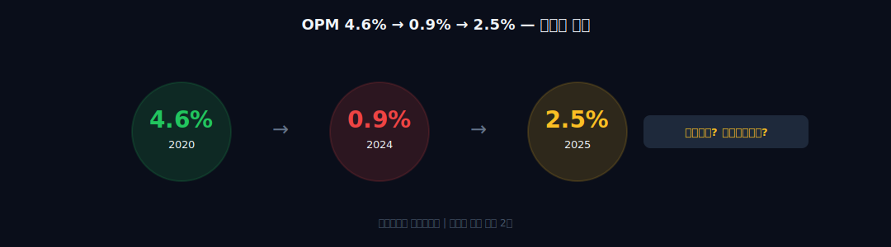
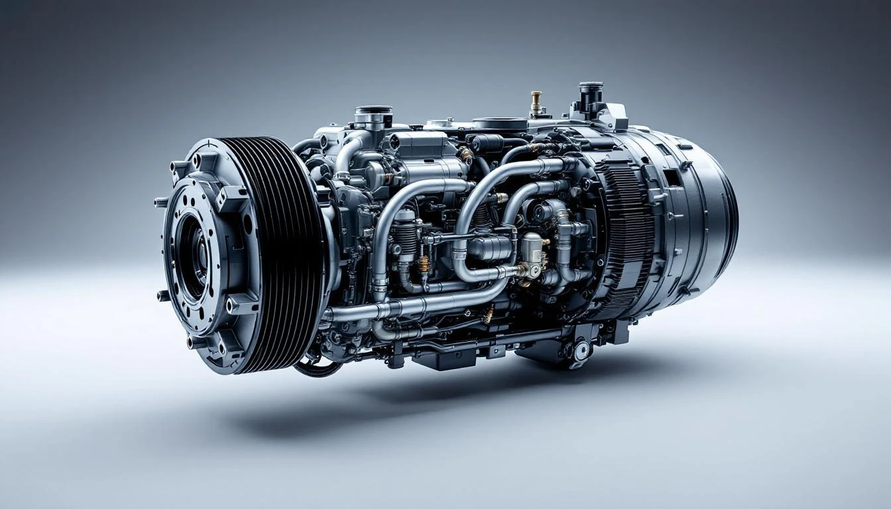
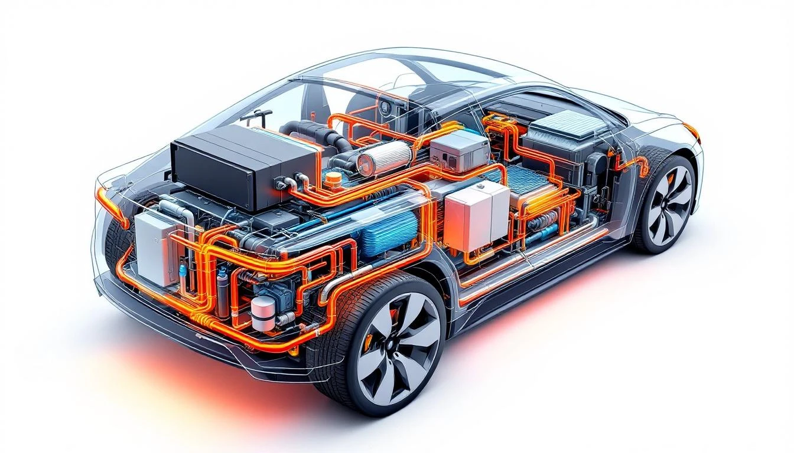
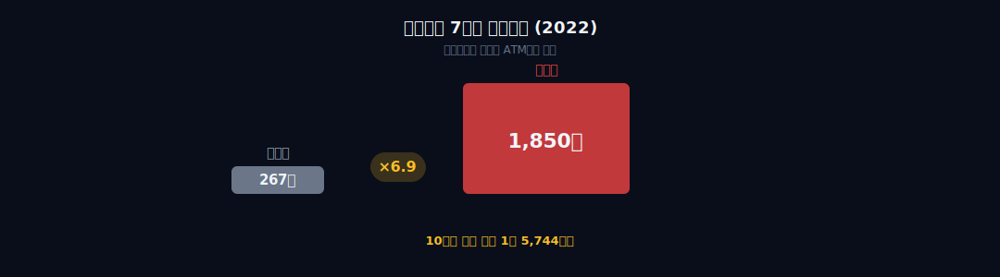
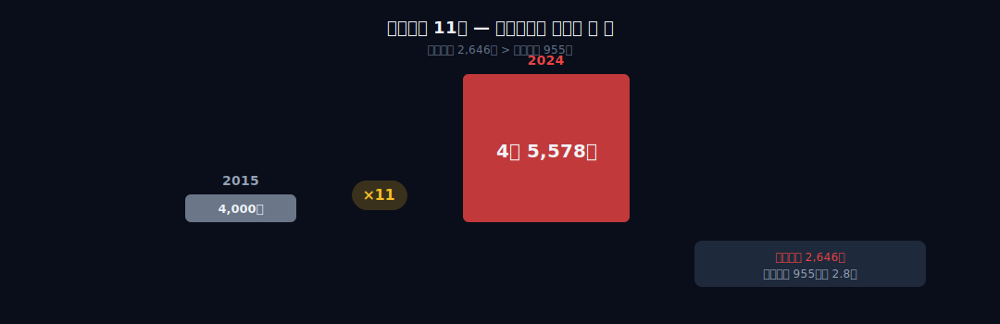
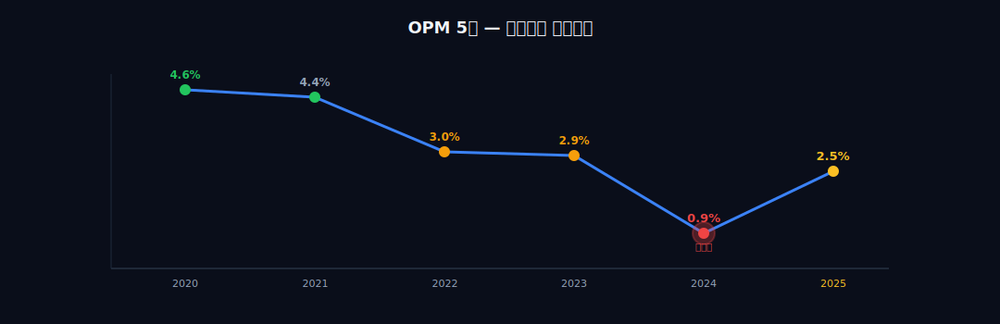
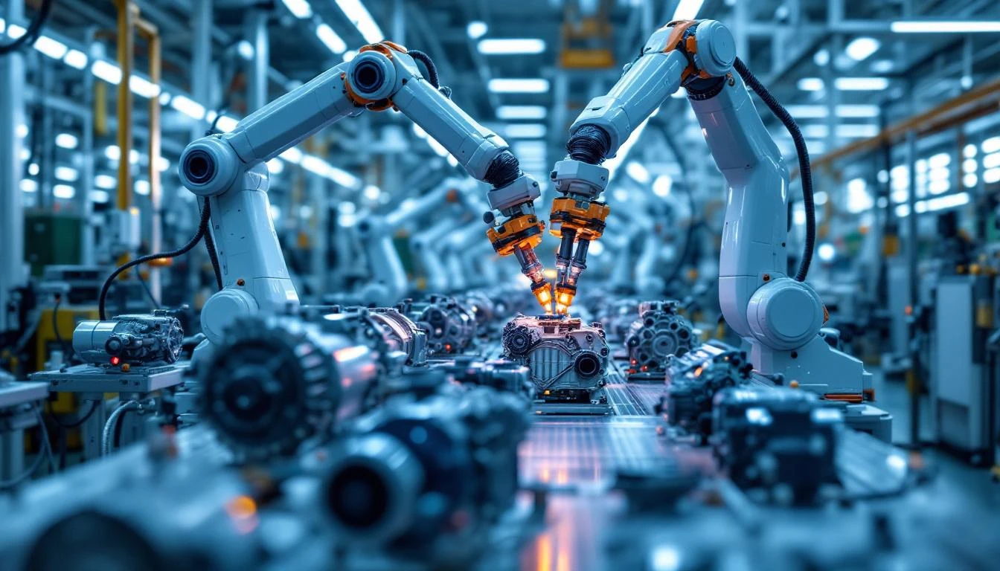
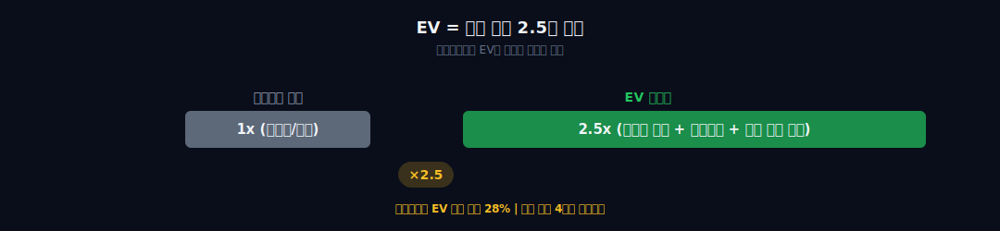

> **턴어라운드** | 제조 > 자동차부품 | 2026-04-11 dartlab 실측
> 같은 시리즈: [SK하이닉스](/blog/000660-skhynix) · [삼양식품](/blog/003230-samyang-foods) · [두산에너빌리티](/blog/034020-doosan-enerbility) · [알테오젠](/blog/196170-alteogen) · [HMM](/blog/011200-hmm) · [셀트리온](/blog/068270-celltrion) · [한화에어로스페이스](/blog/012450-hanwha-aerospace) · [HD현대일렉트릭](/blog/267260-hd-hyundai-electric) · [고려아연](/blog/010130-korea-zinc) · [에이피알](/blog/278470-apr) · [크래프톤](/blog/259960-krafton) · [달바글로벌](/blog/483650-dalba-global) · [경동나비엔](/blog/009450-kyungdong-navien) · [대한조선](/blog/439260-daehan-shipbuilding) · [현대글로비스](/blog/086280-hyundai-glovis) · [농심](/blog/004370-nongshim) · [기업이야기 시리즈 전체](/blog/series/company-reports)


---



## 핵심 한 줄

2022년 순이익 267억원인데 배당금 1,850억원을 줬다. **이익의 7배를 쥐어짰다.** 어떤 회사가 버는 것의 7배를 주주에게 돌려주는가. 그 주주가 사모펀드일 때, 회사에는 무슨 일이 생기는가. 10년간 누적 배당 1.6조. 총차입금 4,000억에서 4.5조로 11배. 2024년 4분기, 27년 만의 첫 영업적자. 자동차 공조 세계 2위 회사가 사모펀드의 ATM이 된 10년의 기록이다. 이 글은 그 10년이 남긴 빚의 무게와, 그 무게를 안고 EV 열관리라는 탈출구로 달릴 수 있는지를 추적한다.

```python
import dartlab

c = dartlab.Company("018880")   # 한온시스템

c.analysis("financial", "수익성")
c.analysis("financial", "자금조달")
c.analysis("financial", "자본배분")
```

한온시스템의 5년 손익을 보면, 매출은 꾸준히 올랐는데 OPM은 꾸준히 내려갔다. 그리고 2024년에 바닥을 찍고, 2025년에 반등한다. 전형적인 턴어라운드 궤적이다 — 단, 이 붕괴가 업황 때문이 아니라 **주주가 만든 것**이라는 점이 다르다.

| 연도 | 매출 | 영업이익 | OPM | 배당금 |
|------|---:|---:|---:|---:|
| 2020 | 6.87조 | 3,158억 | 4.6% | 1,050억 |
| 2021 | 7.57조 | 3,355억 | 4.4% | 1,360억 |
| 2022 | 8.69조 | 2,580억 | 3.0% | **1,850억** |
| 2023 | 9.56조 | 2,773억 | 2.9% | 1,560억 |
| 2024 | 10.0조 | **930억** | **0.9%** | 0 |

매출이 6.87조에서 10.0조로 45% 늘었는데, 영업이익은 3,158억에서 930억으로 70% 줄었다. 매출이 올라가는데 이익이 줄어드는 회사. 이건 원가 문제가 아니다. 이자비용 문제다. 그리고 그 이자비용을 만든 건 배당이다.

모든 막은 이 하나의 인과로 연결된다 — **사모펀드가 배당을 쥐어짰고, 배당을 메우려고 빚을 냈고, 빚의 이자가 이익을 먹었고, 이익이 사라지자 회사가 무너졌다.**

---

## 1막 — 사모펀드가 10년간 쥐어짠 것: 1.6조





### 40년간 4번 바뀐 주인

한온시스템의 역사를 한마디로 압축하면 **"주인이 바뀔 때마다 이름이 지워졌다"**이다.

1986년 설립 당시 이름은 **한라공조**였다. 만도기계에서 분사한 회사로, 정몽원 회장의 한라그룹 소속이었다. 자동차 에어컨 컴프레서를 만들었다. 한국 자동차 산업이 급성장하던 시기에 현대·기아의 공조 시스템을 독점 공급하면서 성장했다.

1997년 외환위기. 한라그룹이 해체됐다. 한라공조는 미국 자동차부품사 **비스테온(Visteon)**에 팔렸다. 이름이 **한라비스테온공조**로 바뀌었다. 한라라는 이름이 반쯤 지워진 것이다.

2014년, 비스테온이 보유 지분 70%를 사모펀드 **한앤컴퍼니**에 매각했다. 인수 대금 3.9조원. 이름이 다시 바뀌었다 — **한온시스템**. 한라도 떼고, 비스테온도 떼고, 완전히 새 이름이다.

2024년, 한앤컴퍼니가 보유 지분을 **한국타이어앤테크놀로지**에 매각했다. 4번째 주인이다. 이번에는 아직 이름을 바꾸지 않았다. 바꿀 수도 있고 아닐 수도 있다 — 하지만 40년간 이미 4번 바뀐 것이다.

이 회사의 비극은 주인이 자주 바뀐 것 자체가 아니다. **3번째 주인이 남기고 간 것**이 문제다.

### 인수금융의 메커니즘 — 회사 돈으로 인수 대금을 갚는다

한앤컴퍼니가 한온시스템을 3.9조에 인수했다. 사모펀드가 3.9조를 현금으로 가지고 있었을까. 아니다. **인수금융(LBO)**이다. 인수 대금의 상당 부분을 차입으로 조달하고, 인수 후에 대상 회사에서 배당을 받아 이자와 원금을 갚는 구조다.

사모펀드에게 피인수 기업은 투자 대상이 아니라 **현금 발생 장치**다. 장기적으로 기업가치를 키우는 것보다, 보유 기간 동안 최대한 많은 현금을 뽑아내는 것이 수익률 극대화의 핵심이다. 한온시스템이 바로 그 장치가 됐다.

dartlab으로 한온시스템의 자본배분을 뜯어보면, 인수 전후의 변화가 극명하다.

```python
c.analysis("financial", "자본배분")
```

인수 전(비스테온 시절) 연평균 배당은 약 **755억원**이었다. 인수 후(한앤컴퍼니 시절) 연평균 배당은 약 **1,555억원**이다. **2배로 뛰었다.** 그리고 2022년에 극단에 달한다.



2022년 한온시스템의 순이익은 **267억원**이었다. 그런데 배당금은 **1,850억원**을 지급했다. 순이익 대비 배당성향 **693%**. 이익의 7배를 배당으로 쥐어짠 것이다. 벌어서 준 게 아니다. 벌지 못한 돈을 빌려서 줬다.

10년간 누적 배당은 **약 1.6조원**이다. 한앤컴퍼니의 인수 대금 3.9조의 41%를 배당만으로 회수한 것이다. 나머지는 최종 매각(한국타이어에 3.3조)으로 회수했다. 합하면 배당 1.6조 + 매각 3.3조 = 4.9조. 3.9조에 사서 4.9조를 회수했다. 사모펀드의 입장에서는 **성공적인 딜**이다.

그런데 회사의 입장에서는? 10년간 1.6조의 현금이 빠져나갔다. 그 현금은 설비투자에 쓰일 수도, R&D에 쓰일 수도, 부채 상환에 쓰일 수도 있었다. 대신 사모펀드의 인수금융 이자를 갚는 데 쓰였다.

**사모펀드가 성공할수록 회사는 피폐해졌다.** 그리고 그 피폐함의 증거가 다음 막에 나온다 — 총차입금이라는 숫자로.

---

## 2막 — 총차입금 4,000억 → 4.5조: 빚이 메운 배당

### 순이익보다 많은 배당을 어떻게 주는가

순이익 267억인데 배당 1,850억을 줬다. 차액 1,583억은 어디서 나왔을까. 답은 간단하다. **빌렸다.** 이익잉여금을 까먹거나, 차입을 늘리거나, 둘 다. 한온시스템은 둘 다 했다.

dartlab으로 차입금 추이를 보면 소름이 끼친다.

```python
c.analysis("financial", "자금조달")
c.analysis("financial", "안정성")
```



인수 직전인 2013년, 한온시스템의 총차입금은 약 **4,000억원**이었다. 10년 후인 2024년, 총차입금은 **4.5조원**이다. **11배**가 됐다.

매출이 커지면서 운전자본이 늘어서 빚이 는 것일까. 아니다. 매출은 같은 기간 약 2배 늘었다. 빚은 11배 늘었다. 매출 증가분의 5배 이상을 빚이 뛰어넘은 것이다. 이 차이의 대부분은 배당 재원 확보를 위한 차입이다.

빚이 늘면 이자비용이 늘어난다. 2024년 한온시스템의 연간 이자비용은 **2,646억원**이다. 같은 해 영업이익은 **930억원**이다. 이자비용이 영업이익의 **2.8배**다.

**벌어서 이자도 못 갚는 구조.** 이자보상배율(ICR)이 1배 미만이라는 뜻이다. 영업으로 벌어들이는 돈으로 이자조차 감당하지 못한다. 기업 재무에서 ICR 1배 미만은 **위험 신호** 중 위험 신호다.

이걸 가장 극명하게 보여주는 비교가 있다. 한온시스템의 BS를 펼쳐보자.

```python
c.show("BS", freq="Y")
```

2024년 기준 부채 총계 **7.62조원**, 자본 총계 **3.0조원**. 부채비율 **254%**다. 부채비율 254% 자체가 치명적인 것은 아니다 — 제조업에서 부채비율이 높은 회사는 많다. 문제는 **부채의 구성**이다. 한온시스템의 부채 7.62조 중 차입금(이자가 붙는 부채)이 4.5조다. 매입채무나 선수금 같은 영업부채가 아니라, 금융기관에서 빌린 돈이 부채의 60%를 차지한다.

영업부채가 큰 회사(예: 대형 유통)는 구매력의 증거다. 하지만 차입금이 큰 회사는 다르다. 매달 이자를 내야 하는 돈이다. 그리고 한온시스템은 그 이자를 영업이익으로 감당하지 못하는 지경에 이르렀다.

| 항목 | 인수 전 (2013) | 인수 후 최고점 (2024) | 변화 |
|------|---:|---:|---:|
| 총차입금 | 4,000억 | **4.5조** | ×11 |
| 연간 이자비용 | ~200억 | **2,646억** | ×13 |
| 영업이익 | ~2,500억 | **930억** | ×0.38 |
| ICR(이자보상배율) | ~12배 | **0.36배** | 위험 |
| 부채비율 | ~80% | **254%** | ×3.2 |

차입금은 11배 늘었는데, 영업이익은 60% 줄었다. 이 두 방향이 교차하는 지점에서 ICR이 1배 아래로 떨어진다. 그 교차점이 2024년이다.

"벌어서 배당을 줬으면 빚이 안 늘었다. 빚을 내서 배당을 줬기 때문에 이자가 늘었다. 이자가 늘어서 이익이 줄었다. 이익이 줄었는데도 배당을 계속 줬다. 다시 빚을 내야 했다." 이건 **악순환**이다. 사모펀드 보유 10년간 이 악순환이 돌았다.

그리고 이 악순환의 최종 결과가 다음 막에서 터진다 — 27년 만의 첫 적자로.

---

## 3막 — 2024년 4분기, 27년 만의 첫 적자

### 빅배스 — 빚을 다 드러내고 다시 시작하겠다

2024년 4분기, 한온시스템은 영업적자 **-988억원**을 기록했다. 1997년 외환위기 이후 **27년 만의 첫 분기 적자**다. 연간으로도 영업이익이 930억원에 그쳤는데, 이건 4분기 적자를 나머지 3분기가 메운 결과다. 4분기만 떼어내면 **-988억**이다.

왜 갑자기 적자가 났을까. 영업이 갑자기 나빠진 것은 아니다. 한온시스템의 2024년 매출은 10.0조로 전년(9.56조) 대비 4.6% 성장했다. 매출은 여전히 올라가고 있었다. 적자의 원인은 **일회성 비용 인식**이다.

구조조정 비용 **652억원**, 기타 일회성 비용 **608억원**. 합쳐서 **1,260억원**의 비경상 비용이 4분기에 한꺼번에 인식됐다. 이 비용이 없었다면 4분기 영업이익은 약 +270억원으로 흑자였을 것이다.

이것이 **빅배스(Big Bath)**다. 회계에서 빅배스란, 경영진이 교체되거나 새 주인이 들어올 때 과거의 부실을 한꺼번에 드러내는 것을 말한다. 새 경영진 입장에서는 합리적인 행동이다. "이건 내가 만든 게 아니라 전 주인이 만든 부실"이라고 선을 긋는 것이다. 부실을 한꺼번에 털면 다음 분기부터는 숫자가 깨끗해진다.

한온시스템의 경우, 한국타이어가 2024년에 인수를 완료했다. 새 주인이 들어온 직후에 구조조정 비용 1,260억을 한꺼번에 인식했다. **"한앤컴퍼니가 10년간 쌓아둔 구조적 비효율을 우리가 치우겠다"**는 선언이다.

한라공조 → 한라비스테온공조 → 한온시스템. 주인이 바뀔 때마다 이름이 지워졌다. 정몽원 HL그룹 회장은 "한라공조를 되찾겠다"고 선언했지만 인수전에서 패배. 이제 HL그룹과 한온시스템은 무관한 회사다.

이 빅배스와 주인 교체가 숫자에 주는 의미는 명확하다. **2024년 4분기는 바닥이다.** 구조조정 비용 1,260억은 일회성이고, 새 주인은 과거 부실을 다 드러냈다. 문제는 이 바닥이 진짜 바닥인가, 아니면 더 밑이 있는가. 그 답은 다음 막 — 2025년 실적에서 확인된다.

---

## 4막 — 2025년, 구조조정이 숫자로 찍혔다



### OPM 0.9% → 2.5% — 방향은 확인됐다



2025년 한온시스템의 실적이 나왔다. 매출 **10.88조원**(+8.9%), 영업이익 **2,718억원**(+184%). OPM **2.5%**. 2024년의 0.9%에서 2.5%로 반등했다.

이게 진짜 회복인가, 빅배스 기저효과인가. 이 질문에 답하려면 분기별로 쪼개서 봐야 한다.

```python
c.show("IS")   # 분기별 손익
```

2025년 분기별 OPM 추이:

| 분기 | 매출 (억원) | 영업이익 (억원) | OPM |
|------|---:|---:|---:|
| 2025 Q1 | 24,766 | 409 | 1.7% |
| 2025 Q2 | 28,361 | 713 | 2.5% |
| 2025 Q3 | 28,002 | 967 | **3.5%** |
| 2025 Q4 | 27,694 | 629 | 2.3% |
| 연간 | 108,823 | 2,718 | 2.5% |

1분기 1.7%에서 시작해서 3분기에 3.5%까지 올랐다가 4분기에 2.3%로 소폭 하락했다. 4분기 하락은 계절적 요인(연말 재고 조정)이 반영된 것이다. 3분기 3.5%가 핵심이다. **2분기 연속 2.5% 이상을 유지**했다는 것은 기저효과만이 아닌 구조적 개선이 시작됐다는 신호다.

### 구조조정의 결론 = 원가율 1.7%p

구조조정의 세부 내용(생산거점 20% 축소, 4개 지역 BG 재편, 인력 구조조정)보다 중요한 건 **결과**다. 매출원가율이 91.5%에서 89.8%로 **1.7%p 떨어졌다.** 매출 10.88조 기준 1.7%p = **약 1,850억원의 비용 절감**. 이것이 영업이익 +184%의 핵심 동력이다. 사모펀드가 남기고 간 비효율을 들어내 원가를 깎은 것이다.

### 이자비용의 무게가 여전히 발목이다

OPM이 2.5%로 돌아왔지만, 이 2.5%의 의미를 제대로 이해하려면 이자비용을 같이 봐야 한다. 2025년에도 순이자비용은 여전히 **약 2,350억원** 수준이다. 전년(2,646억) 대비 약 **288억원 감소**했지만 여전히 거대하다.

영업이익 2,718억에서 이자 2,350억을 빼면 남는 것은 **368억원**이다. 매출 10.88조짜리 회사가 이자를 내고 나면 **368억원**밖에 안 남는다. 이자보상배율로 환산하면 **약 1.2배**다. 겨우 1배를 넘긴 것이다.

비교해 보자. 같은 자동차부품 업종의 현대모비스는 ICR이 약 15배다. 만도가 약 4배. 한온시스템의 1.2배는 업종 내에서도 바닥이다. 이 이자 부담이 사라지지 않는 한, OPM이 4%로 돌아가도 순이익은 미미할 수밖에 없다.

### EV 열관리 — 위기가 아니라 기회인 구조적 변화

그런데 한온시스템에게는 하나의 구조적 기회가 있다. **EV(전기차) 열관리 시스템**이다.

그런데 여기서 질문이 생긴다. **이자비용만 연 2,646억인 회사가, EV 열관리에 투자할 돈이 있는가?** 영업이익 2,718억에서 이자를 빼면 **72억밖에 안 남는다.** 이 회사는 이자를 겨우 갚고 있다. 그런데도 EV는 가야 한다 — 가지 않으면 죽기 때문이다.



숫자 하나만 기억하면 된다. 내연기관 공조 = 차량당 30~50만원. EV 열관리 = **80~150만원**. 부품값이 **2~3배**로 뛴다. 한온시스템은 이 기회에 **4세대 히트펌프**(기아 EV3 탑재, 세계 최초)로 답을 냈다. 겨울 주행거리 감소를 30~40%에서 10% 이내로 줄이는 기술이다.

2025년 기준 한온시스템의 EV 관련 매출 비중은 약 **28%**다. 글로벌 자동차 공조 시장에서 한온시스템은 **세계 2위**다. 1위 덴소(도요타 계열)가 약 20%, 한온시스템이 약 13%, 프랑스 발레오가 약 12%를 차지한다.

```python
c.analysis("financial", "수익구조")
```

EV 열관리 매출이 28%까지 올라왔다는 것은, 내연기관 공조(단가 낮음)에서 EV 열관리(단가 높음)로의 전환이 진행 중이라는 뜻이다. 이 전환이 완성되면 — 즉 EV 비중이 50%를 넘으면 — 한온시스템의 매출 믹스가 구조적으로 바뀌고, 마진도 따라올 수 있다.

**그런데 이 전환을 하려면 R&D와 설비투자가 필요하다.** 4세대 히트펌프를 양산하려면, 새로운 전기 컴프레서 라인을 깔아야 하고, 칠러/쿨러 모듈 R&D를 계속해야 한다. 돈이 필요하다. 그 돈은 어디서 나오는가. 이자를 내고 368억밖에 안 남는 회사에서.

이것이 다음 막의 질문이다 — 4.5조 빚을 안고 EV라는 기회를 잡을 수 있는가.

---

## 5막 — 4.5조 빚을 안고 EV를 잡을 수 있는가

### 유상증자 9,000억 — 빚을 줄이는 유일한 방법

한온시스템은 2025년 **9,000억원 규모의 유상증자**를 추진하고 있다. 주주배정 방식이다. 최대주주 한국타이어가 지분율에 따라 참여하면 약 5,000억원을 부담하게 된다.

이 유상증자의 목적은 명확하다. **차입금 상환**이다. 9,000억원을 빚 갚는 데 쓰면 총차입금이 4.5조에서 3.6조로 줄어든다. 이자비용이 연간 **500~600억원 감소**한다. 2025년 기준 이자비용 2,350억에서 500억이 줄면 1,850억이 된다. 영업이익 2,718억에서 이자 1,850억을 빼면 **868억원**이 남는다. 유상증자 전 368억 대비 2배 이상이다.

ICR로 보면 더 선명하다. 유상증자 전 ICR 1.2배 → 유상증자 후 예상 ICR **약 1.5배**. 여전히 낮지만 **방향은 맞다.**

OPM 관점에서도 의미가 있다. 이자비용 500억 감소는 매출 10.88조 기준 약 **0.5%p**의 추가 마진 개선 효과다. OPM 2.5%에 0.5%p를 더하면 3.0%. 구조조정 효과가 계속되면 3.5~4.0%까지도 가능하다.

### 한국타이어가 던진 도박 — 시총 2조에 3.3조

**타이어 회사가 왜 공조회사를 사는가?** 이것도 이상한 질문이다. 한국타이어는 타이어를 만드는 회사다. 자동차 공조와 타이어는 아무 관계가 없어 보인다. 그런데 한국타이어는 2014년부터 10년간 소수주주로 한온시스템에 있었다. 답은 "자동차 부품 플랫폼"이라는 비전이다 — 타이어(접지)+공조(열관리)를 합치면 자동차의 바닥과 실내를 동시에 장악하는 구조가 된다. 이 비전이 맞든 틀리든, 한국타이어가 던진 베팅의 규모는 충격적이다.

한국타이어앤테크놀로지가 한온시스템 지분을 인수한 대금은 **약 3.3조원**이다. 한온시스템의 인수 당시 시가총액은 약 **2조원**이었다. **시총의 1.65배를 주고 산 것이다.** 여기에 유상증자 참여분까지 합하면 총 투입 금액은 약 **3.8조원**에 달할 수 있다.

왜 이렇게 비싸게 샀을까. 한국타이어의 계산은 이렇다. 한온시스템은 자동차 공조 세계 2위다. 고객사는 현대·기아·BMW·포드·GM 등 글로벌 완성차 OEM 대부분을 포함한다. EV 전환이 가속되면 열관리 부품 단가가 2~3배로 올라간다. 지금은 빚 때문에 죽어가고 있지만, 빚만 줄이면 연간 3,000~4,000억의 영업이익을 낼 수 있는 기업이다 — 그게 과거(2020~2021년) 실적이 증명하는 바다.

한국타이어가 타이어에서 자동차부품으로 포트폴리오를 확장하는 것이기도 하다. 타이어 사업은 성장 천장이 있다. 내연기관이든 전기차든 타이어는 필요하지만, 타이어 자체의 부가가치가 올라가지는 않는다. 반면 EV 열관리는 **새로운 고부가가치 영역**이다. 한국타이어는 한온시스템을 통해 이 영역에 진입하겠다는 것이다.

하지만 리스크도 크다. 시총 2조짜리 회사에 3.3조를 투입했는데, 한온시스템이 기대만큼 회복하지 못하면 한국타이어의 투자는 좌초한다. 한국타이어 자체의 시가총액이 약 5조원인데, 거기서 3.3조를 한온시스템에 넣은 것이다. **전사 시총의 66%를 한 번의 베팅에 걸었다.**

### 경쟁 — 세계 2위의 의미

한온시스템이 빚과 씨름하는 동안, 경쟁자들은 쉬지 않았다.

| 순위 | 기업 | 점유율 | 특징 |
|---:|---|---:|---|
| 1 | 덴소 (일본) | ~20% | 도요타 계열, 하이브리드 열관리 강점 |
| 2 | **한온시스템 (한국)** | **~13%** | 현대·기아·BMW, 4세대 히트펌프 |
| 3 | 발레오 (프랑스) | ~12% | 유럽 OEM, 고전압 열관리 |
| 4 | 마레 (이탈리아) | ~8% | 스텔란티스 계열 |

덴소와의 격차가 7%p다. 덴소는 도요타 그룹의 자금력이 뒤에 있다. 발레오는 1%p 차이로 바로 뒤에서 쫓아오고 있다. 한온시스템이 빚 갚느라 투자를 못 하는 사이에 발레오가 추월하면, 세계 2위 자리도 위태롭다.

EV 열관리 시장은 아직 초기다. 글로벌 EV 보급률이 20%를 넘기면 열관리 시스템 시장 규모가 급팽창한다. 이때 누가 히트펌프 기술과 양산 능력을 확보하고 있느냐가 향후 10년의 판도를 결정한다. 한온시스템은 4세대 히트펌프로 기술은 확보했다. 문제는 양산 투자를 할 여유가 있느냐다.

### 작가 판단 — 이자보상배율 2배를 달력에 적어라

한온시스템의 이야기를 한 문장으로 압축하면 이렇다.

**"사모펀드가 10년간 1.6조를 쥐어짜서 빚 4.5조를 남겼다. 새 주인이 빅배스로 바닥을 확인했고, 구조조정으로 OPM을 0.9%에서 2.5%로 올렸다. 하지만 이자비용 2,350억이 영업이익 2,718억을 거의 다 먹고 있다."**

OPM 2.5%는 **회복이 아니라 출발선**이다. 한온시스템의 과거 OPM은 4.6%(2020년)였다. 이 수준으로 돌아가려면 이자비용이 절반으로 줄어야 한다. 유상증자 9,000억이 성공하면 이자비용이 약 500억 줄어 1,850억이 된다. 그래도 영업이익의 68%를 이자가 가져간다. 이자가 500억 이하가 되려면 차입금이 1조 아래로 내려가야 하는데, 현재 4.5조에서 그 수준까지 가려면 수년이 걸린다.

EV 열관리라는 구조적 성장 기회가 있다. 차량당 부품 단가가 2~3배로 뛰고, 한온시스템은 4세대 히트펌프로 기술 우위를 확보했다. 글로벌 공조 세계 2위의 고객 기반도 살아있다. **기회는 있다.**

하지만 4.5조 빚이라는 구조적 발목도 있다. 사모펀드가 남기고 간 빚의 무게가 이 회사의 모든 가능성 위에 걸려 있다. EV 열관리에 투자해야 하는데 이자를 내느라 투자를 못 하면, 기술이 있어도 양산에서 밀린다. 발레오가 1%p 뒤에서 쫓아오고 있다.

다음 재무제표에서 딱 하나만 보면 된다.

**이자보상배율(ICR)이 2배를 넘는가.**

2025년 현재 ICR은 약 1.2배다. 유상증자 성공 + 구조조정 지속으로 2026년에 ICR이 2배를 넘기면 — 영업이익으로 이자의 2배를 벌 수 있다는 뜻 — 이 회사는 빚의 무게에서 벗어나는 중이다. 2배를 넘지 못하면, 빚의 무게에 눌린 세계 2위로 남는다.

**"이자보상배율 2배." 이 숫자를 달력에 적어두자.**

```python
c.analysis("financial", "안정성")   # 이자보상배율 추이 확인
```


---

<!-- AUTO:START — sync_financials.py가 자동 생성. 수동 편집 금지 -->

<script>
import ComboChart from '$lib/components/blog/ComboChart.svelte';
import StackBar from '$lib/components/blog/StackBar.svelte';
</script>

## 공시 / Filings

| 기간 | 보고서 | 링크 |
|------|--------|------|
| 2025 | 사업보고서 (2025.12) | [DART에서 보기](https://dart.fss.or.kr/dsaf001/main.do?rcpNo=20260318000645) |
| 2025 | 분기보고서 (2025.09) | [DART에서 보기](https://dart.fss.or.kr/dsaf001/main.do?rcpNo=20251113000526) |
| 2025 | 반기보고서 (2025.06) | [DART에서 보기](https://dart.fss.or.kr/dsaf001/main.do?rcpNo=20250814001924) |
| 2025 | 분기보고서 (2025.03) | [DART에서 보기](https://dart.fss.or.kr/dsaf001/main.do?rcpNo=20250515001291) |
| 2024 | [기재정정]사업보고서 (2024.12) | [DART에서 보기](https://dart.fss.or.kr/dsaf001/main.do?rcpNo=20260318000466) |
| 2024 | 사업보고서 (2024.12) | [DART에서 보기](https://dart.fss.or.kr/dsaf001/main.do?rcpNo=20250321001829) |
| 2024 | 분기보고서 (2024.09) | [DART에서 보기](https://dart.fss.or.kr/dsaf001/main.do?rcpNo=20241114001534) |
| 2024 | [기재정정]반기보고서 (2024.06) | [DART에서 보기](https://dart.fss.or.kr/dsaf001/main.do?rcpNo=20240814003992) |
| 2024 | 반기보고서 (2024.06) | [DART에서 보기](https://dart.fss.or.kr/dsaf001/main.do?rcpNo=20240814002300) |
| 2024 | 분기보고서 (2024.03) | [DART에서 보기](https://dart.fss.or.kr/dsaf001/main.do?rcpNo=20240516000554) |

> 전체 공시 목록은 dartlab에서 확인:
> ```python
> import dartlab
> c = dartlab.Company("018880")
> c.filings()
> ```

## 재무제표 — 최근 5개년

> 아래는 최근 5개년 요약입니다. 전체 기간·분기별 데이터는 dartlab에서 직접 확인할 수 있습니다:
> ```python
> import dartlab
> c = dartlab.Company("018880")
> c.show("IS")              # 손익계산서 (분기)
> c.show("IS", freq="Y")    # 손익계산서 (연간)
> c.show("BS")              # 재무상태표
> c.show("CF")              # 현금흐름표
> c.show("SCE")             # 자본변동표
> c.show("ratios")          # 재무비율
> ```

### 손익계산서 (IS) — 단위 억원

<ComboChart data={[{year:"2025",매출액:108837,영업이익:2704,당기순이익:-1973},{year:"2024",매출액:99999,영업이익:930,당기순이익:-3586},{year:"2023",매출액:95593,영업이익:2773,당기순이익:589},{year:"2022",매출액:86277,영업이익:2566,당기순이익:267},{year:"2021",매출액:73514,영업이익:3258,당기순이익:3107}]} lineKeys={["매출액"]} barKeys={["영업이익","당기순이익"]} lineColors={["#22c55e"]} barColors={["#3b82f6","#f59e0b"]} title="매출(라인) vs 영업이익·당기순이익(막대)" unit="억원" />

| 항목 | 2025 | 2024 | 2023 | 2022 | 2021 |
|---|---:|---:|---:|---:|---:|
| 매출액 | 108,837 | 99,999 | 95,593 | 86,277 | 73,514 |
| 매출원가 | 98,738 | 91,894 | 86,511 | 77,806 | 65,024 |
| 매출총이익 | 10,099 | 8,106 | 9,082 | 8,471 | 8,490 |
| 판매비와관리비 | 7,395 | 7,175 | 6,309 | 5,905 | 5,232 |
| 영업이익 | 2,704 | 930 | 2,773 | 2,566 | 3,258 |
| 금융수익 | — | — | — | — | — |
| 금융비용 | — | — | — | — | — |
| 당기순이익 | -1,973 | -3,586 | 589 | 267 | 3,107 |

### 재무상태표 (BS) — 단위 억원

<StackBar data={[{year:"2025",segments:[{label:"부채",value:65793,color:"#ef4444"},{label:"자본",value:39130,color:"#22c55e"}]},{year:"2024",segments:[{label:"부채",value:76215,color:"#ef4444"},{label:"자본",value:29987,color:"#22c55e"}]},{year:"2023",segments:[{label:"부채",value:67359,color:"#ef4444"},{label:"자본",value:25085,color:"#22c55e"}]},{year:"2022",segments:[{label:"부채",value:67289,color:"#ef4444"},{label:"자본",value:23699,color:"#22c55e"}]},{year:"2021",segments:[{label:"부채",value:57571,color:"#ef4444"},{label:"자본",value:24767,color:"#22c55e"}]}]} title="부채 vs 자본 구조" unit="억원" />

| 항목 | 2025 | 2024 | 2023 | 2022 | 2021 |
|---|---:|---:|---:|---:|---:|
| 자산총계 | 104,922 | 106,203 | 92,444 | 90,988 | 82,337 |
| 유동자산 | 44,125 | 44,390 | 36,969 | 41,948 | 35,517 |
| 비유동자산 | 60,797 | 61,812 | 55,475 | 49,040 | 46,820 |
| 부채총계 | 65,793 | 76,215 | 67,359 | 67,289 | 57,571 |
| 유동부채 | 39,848 | 50,338 | 35,761 | 40,211 | 28,135 |
| 비유동부채 | 25,944 | 25,877 | 31,598 | 27,078 | 29,436 |
| 자본총계 | 39,130 | 29,987 | 25,085 | 23,699 | 24,767 |

### 현금흐름표 (CF) — 단위 억원

<ComboChart data={[{year:"2025",영업CF:1123,투자CF:-5470,재무CF:0},{year:"2024",영업CF:5693,투자CF:-7327,재무CF:0},{year:"2023",영업CF:5174,투자CF:-6773,재무CF:0},{year:"2022",영업CF:3783,투자CF:-6433,재무CF:0},{year:"2021",영업CF:6363,투자CF:-5573,재무CF:0}]} barKeys={["영업CF","투자CF","재무CF"]} barColors={["#22c55e","#ef4444","#3b82f6"]} title="영업·투자·재무 현금흐름" unit="억원" />

| 항목 | 2025 | 2024 | 2023 | 2022 | 2021 |
|---|---:|---:|---:|---:|---:|
| 영업활동현금흐름 | 1,123 | 5,693 | 5,174 | 3,783 | 6,363 |
| 투자활동현금흐름 | -5,470 | -7,327 | -6,773 | -6,433 | -5,573 |
| 재무활동현금흐름 | — | — | — | — | — |

### 자본변동표 (SCE) — 단위 억원

| 항목 | 2025 | 2024 | 2023 | 2022 | 2021 |
|---|---:|---:|---:|---:|---:|
| 지분법자본변동 | 0.0 | 0.0 | 0.0 | -56 | 31 |
| 기초자본 | 29,987 | 21,031 | 22,435 | -664 | 22,394 |
| 유상증자 | 348 | 145 | — | — | — |
| 현금흐름위험회피 | 167 | -203 | 0.0 | 9 | -255 |
| 배당 | 19 | 0.0 | 46 | 1,921 | 2,060 |
| 기말자본 | 39,130 | 28,535 | 534 | 481 | 481 |
| 자본변동합계 | — | — | — | — | — |
| 해외사업환산 | 5 | 0.0 | 793 | 212 | 1,373 |
| 연결범위내거래 | — | — | — | — | — |
| 당기순이익 | 0.0 | 0.0 | 0.0 | 204 | 3,107 |
| 기타포괄손익 | — | — | — | — | — |
| 기타(비지배주주의 자본불입) | — | — | — | — | — |
| 확정급여재측정 | 177 | -20 | 0.0 | 468 | 85 |
| 재평가잉여금 | — | — | 0.0 | — | — |
| 주식보상 | 0.0 | 0.0 | 17 | 12 | -1 |

*최종 갱신: 2026-04-13 | dartlab 실측 (DART 공시 기준)*

<!-- AUTO:END -->
