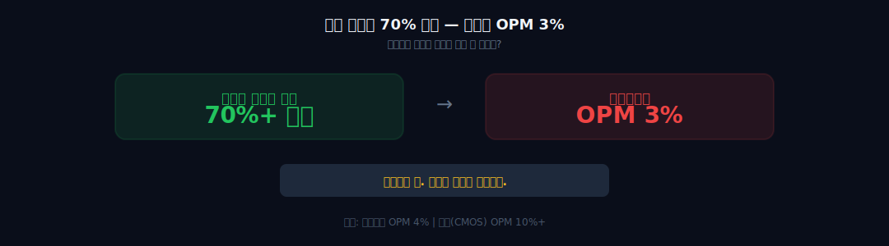
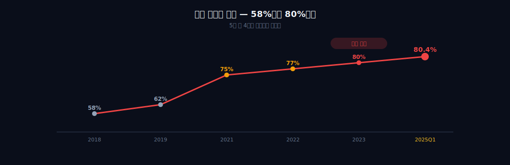
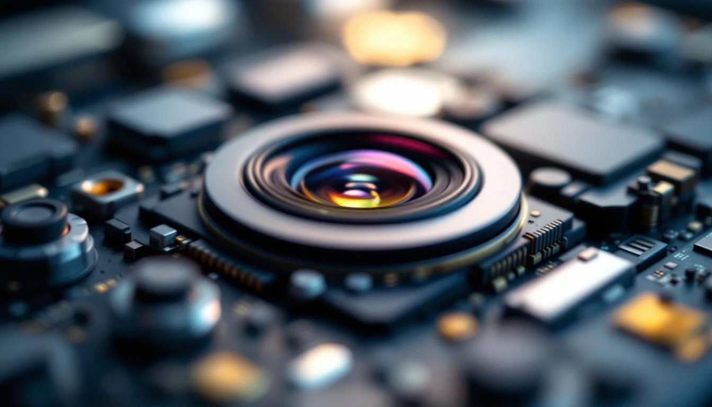
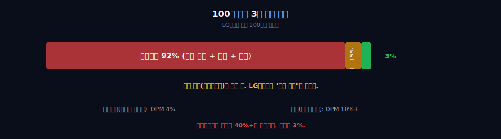
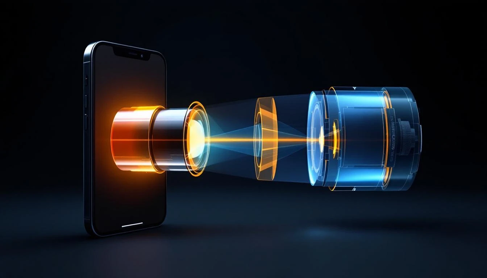
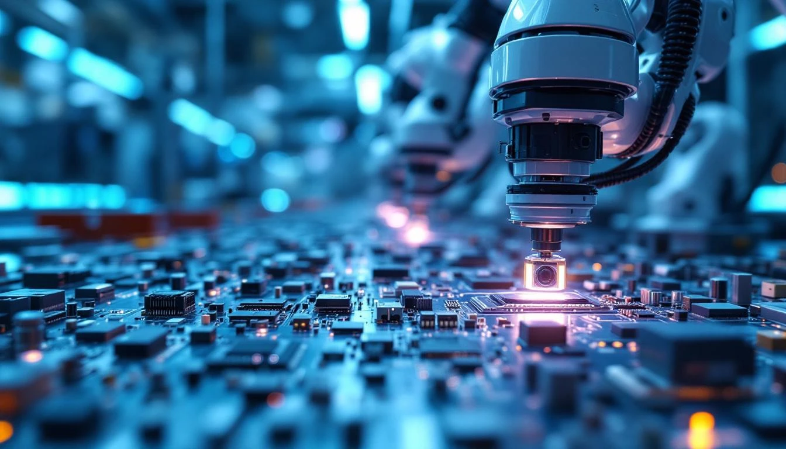

> **성장** | 전자 > 부품 | 2026-04-12 dartlab 실측
> 같은 시리즈: [SK하이닉스](/blog/000660-skhynix) · [삼양식품](/blog/003230-samyang-foods) · [두산에너빌리티](/blog/034020-doosan-enerbility) · [알테오젠](/blog/196170-alteogen) · [HMM](/blog/011200-hmm) · [셀트리온](/blog/068270-celltrion) · [한화에어로스페이스](/blog/012450-hanwha-aerospace) · [HD현대일렉트릭](/blog/267260-hd-hyundai-electric) · [고려아연](/blog/010130-korea-zinc) · [에이피알](/blog/278470-apr) · [크래프톤](/blog/259960-krafton) · [달바글로벌](/blog/483650-dalba-global) · [경동나비엔](/blog/009450-kyungdong-navien) · [대한조선](/blog/439260-daehan-shipbuilding) · [현대글로비스](/blog/086280-hyundai-glovis) · [농심](/blog/004370-nongshim) · [한온시스템](/blog/018880-hanon-systems) · [기업이야기 시리즈 전체](/blog/series/company-reports)


---



## 핵심 한 줄

아이폰 카메라 모듈의 70% 이상을 독점 공급한다. 매출의 80.4%가 애플에서 나온다. 경쟁사 두 곳이 2020~2021년에 알아서 탈락했다. **독점이다.** 그런데 영업이익률(OPM)이 3%다. 100원을 벌면 3원이 남는다. 독점이면 마진이 높아야 하는 거 아닌가. 이 글은 "독점인데 왜 을인가"라는 하나의 질문을 5막에 걸쳐 추적한다. 경쟁사가 자멸한 이야기, 카메라 모듈의 원가 구조가 만드는 함정, 세 겹의 기술 해자, 아이폰 사이클이라는 운명, 그리고 이 구조를 바꿀 수 있는 유일한 탈출구까지.

```python
import dartlab

c = dartlab.Company("011070")   # LG이노텍

c.analysis("financial", "수익성")
c.analysis("financial", "비용구조")
c.analysis("financial", "수익구조")
```

LG이노텍의 5년 손익을 펼쳐보면, 매출은 20조를 넘겼는데 영업이익은 1조를 넘기지 못한다. 매출이 커질수록 이익이 따라오는 보통의 성장주와 다르다. 매출은 커지는데 마진은 제자리이거나 오히려 줄어든다. 이 기이한 구조의 원인은 단 하나다 — **원가의 92%가 이미 정해져 있고, 그 가격을 정하는 건 애플이다.**

| 연도 | 매출 | 영업이익 | OPM | 매출원가율 |
|------|---:|---:|---:|---:|
| 2020 | 8.89조 | 5,868억 | 6.6% | 87.8% |
| 2021 | 10.46조 | 6,313억 | 6.0% | 88.4% |
| 2022 | 19.84조 | 9,447억 | 4.8% | 89.8% |
| 2023 | 20.40조 | 5,982억 | 2.9% | 91.7% |
| 2024 | 22.08조 | 6,684억 | 3.0% | 91.6% |

2020년에 OPM 6.6%였던 회사가 2024년에 3.0%다. 매출은 2.5배 늘었는데 OPM은 반 토막이 났다. 매출원가율이 87.8%에서 91.6%로 올라간 것이 전부를 설명한다. 판관비는 5% 내외로 일정하다. 원가가 이익을 먹은 것이다.

모든 막은 이 하나의 인과로 연결된다 — **독점하면 할수록 의존도가 올라가고, 의존도가 올라갈수록 가격 교섭력이 떨어지고, 가격 교섭력이 떨어질수록 마진이 줄어든다. 독점의 역설이다.**

---

## 1막 — 경쟁사가 알아서 무너졌다



### 싸워서 이긴 게 아니다 — 두 번의 행운

2020년까지 아이폰 카메라 모듈 시장은 3강 체제였다. LG이노텍(한국), 오필름(O-Film, 중국), 샤프(Sharp, 일본/폭스콘). 세 회사가 아이폰 후면 카메라 모듈을 나눠 공급했다. LG이노텍의 점유율은 약 50%였다. 높지만 독점은 아니었다.

그런데 2년 만에 두 경쟁사가 동시에 탈락했다.

**2020년, 오필름 퇴출.** 미국 정부가 중국 신장 위구르 자치구의 인권 문제를 이유로 오필름을 인권 제재 리스트(Entity List)에 올렸다. 애플은 공급망에서 제재 기업을 쓸 수 없다. 오필름은 하루아침에 애플 공급망에서 퇴출됐다. 기술 문제가 아니었다. 가격 문제가 아니었다. **지정학적 이유**로 하나가 사라졌다.

**2021년, 샤프 셧다운.** 코로나 델타 변이가 베트남을 강타했다. 샤프의 베트남 공장이 셧다운됐다. 아이폰 신모델 출시를 앞두고 납기를 맞추지 못했다. 애플에게 납기 실패는 치명적이다. 매년 9월 아이폰 출시에 수백만 대의 모듈이 동시에 필요한데, 한 번 납기를 놓치면 다음 해부터 물량 배분이 줄어든다. 샤프는 이후 점유율을 회복하지 못했다.

1년 사이에 경쟁사 두 곳이 사라졌다. LG이노텍의 점유율은 50%에서 **70% 이상**으로 뛰었다. **싸워서 이긴 것이 아니다. 경쟁사가 지정학과 팬데믹이라는 외부 충격으로 자멸한 것이다.**

이것이 첫 번째 "어?"다. 독점 지위를 얻는 과정이 기술 투자나 가격 경쟁력이 아니라, 순전히 **상대방의 불운**이었다는 것.

### 15년의 관계 — 그러나 의존도는 계속 올라갔다

LG이노텍과 애플의 관계는 2010년 아이폰4부터 시작됐다. 15년이 넘는 공급 관계다. 처음에는 여러 고객 중 하나였다. 2018년 애플 매출 비중은 **58%**였다. 높지만, 나머지 42%가 LG전자, 현대차 등 다른 고객이었다.

그런데 오필름과 샤프가 탈락한 후, 구조가 바뀌었다. 빈 물량을 LG이노텍이 전부 흡수하면서, 2024년 애플 매출 비중은 **78.6%**, 2025년 1분기에는 **80.4%**에 도달했다. 5원 중 4원이 애플에서 나오는 구조가 된 것이다.

공시를 보면 흥미로운 점이 있다. 사업보고서에는 "매출의 10% 이상을 차지하는 단일 고객이 있다"고만 쓴다. **고객명을 적지 않는다.** 증권사 리포트와 업계 보도를 통해서만 그 "단일 고객"이 애플이라는 것을 알 수 있다. 이 침묵 자체가 애플과의 NDA(비밀유지계약)의 강도를 보여준다. 매출의 80%를 차지하는 고객의 이름을 공시에 적지 못하는 관계. 이것이 "을"의 첫 번째 증거다.

| 연도 | 애플 매출 비중 | 비모바일 비중 | 총 매출 |
|------|---:|---:|---:|
| 2018 | 58% | — | 6.8조 |
| 2020 | 69% | 22% | 8.9조 |
| 2022 | 75% | 21% | 19.8조 |
| 2024 | 78.6% | 21.4% | 22.1조 |
| 2025 Q1 | **80.4%** | — | — |

```python
c.analysis("financial", "수익구조")
```

**경쟁사가 탈락하면서 독점이 되었고, 독점이 되면서 의존도가 올라갔다.** 의존도가 올라갈수록 교섭력이 약해진다는 것을 모를 리 없다. 그런데 왜 다변화를 못 했을까. 답은 다음 막에 있다 — 카메라 모듈의 원가 구조가 마진의 천장을 결정하기 때문이다.

---

## 2막 — 독점인데 왜 을인가: OPM 3%의 정체



### 카메라 모듈의 원가 구조 — 가치의 40%가 소니 것

아이폰 카메라 모듈을 분해하면, 가장 비싼 부품은 **소니의 CMOS 이미지센서**다. 모듈 원가의 40% 이상을 차지한다. 그 다음이 렌즈(라간 등 일본 업체), 액추에이터(OIS/AF 모터), 그리고 기판과 커넥터. 이 모든 부품의 가격과 사양은 **애플이 결정**한다.

LG이노텍이 하는 일은 무엇인가. **조립**이다. 소니 센서, 라간 렌즈, 알프스 액추에이터 — 이 부품들을 클린룸에서 정밀 조립하고, 각 모듈을 검사하여 수율을 관리하는 것이 LG이노텍의 역할이다.

핵심 부품의 지적재산(IP)은 소니에 있다. 설계 권한은 애플에 있다. LG이노텍은 **조립과 수율 관리를 담당하는 제조 파트너**다. 독점이라고 했지만, 독점하는 것은 "가치의 대부분"이 아니라 "조립 공정"이다. 카메라 모듈에서 가장 높은 마진을 가져가는 건 소니(센서 IP)와 애플(최종 제품 마진)이다. LG이노텍은 그 사이에서 조립 마진을 받는다.

이것이 OPM 3%의 구조적 원인이다. **독점이지만 가치 사슬에서의 위치가 낮다.** 삼성SDI가 배터리 셀에서 높은 마진을 가져가는 것은 셀 자체가 핵심 IP이기 때문이다. 하지만 LG이노텍은 남의 부품을 조립하는 위치에 있다.

### 애플이 가격을 정한다 — BOM 구조



일반적인 B2B 거래에서는, 공급업체가 원가에 마진을 얹어 납품가를 제시한다. "우리가 만드는 데 100원이 들고, 마진 20원을 붙여 120원에 납품합니다."

애플은 다르다. **애플이 BOM(Bill of Materials)을 설계**한다. "이 부품은 얼마, 저 부품은 얼마, 조립비는 얼마. 합해서 모듈 단가는 이만큼"을 애플이 정한다. 공급업체는 그 단가 안에서 이익을 만들어야 한다. 원가를 줄이면 마진이 늘고, 수율이 떨어지면 마진이 준다. 하지만 **납품 단가 자체를 올리는 것은 불가능에 가깝다.**

매년 애플은 ASP(평균판매가격)를 올리거나 유지하면서, 부품 단가는 내린다. 아이폰의 마진을 보호하기 위해 공급망의 마진을 쥐어짜는 것이다. "연간 Cost Reduction"이라고 부르는 이 관행은 애플 공급망 전체의 공통 조건이다. 매년 2~5%의 단가 인하 압력이 공급업체에 가해진다.

LG이노텍의 5년 매출원가율 추이를 보자.

```python
c.analysis("financial", "비용구조")
```

| 연도 | 매출원가율 | 판관비율 | OPM |
|------|---:|---:|---:|
| 2020 | 87.8% | 5.6% | 6.6% |
| 2021 | 88.4% | 5.6% | 6.0% |
| 2022 | 89.8% | 5.4% | 4.8% |
| 2023 | 91.7% | 5.4% | 2.9% |
| 2024 | 91.6% | 5.4% | 3.0% |

매출원가율이 87.8%에서 91.6%로 올라갔다. **100원 중 92원이 원가다.** 판관비 5원을 빼면 **3원**이 남는다. 이것이 OPM 3%의 정체다. 원가율이 올라간 이유는 복합적이다 — 원자재 가격 상승, 인건비 상승, 그리고 애플의 단가 인하 압력이 겹쳤다. 매출이 2.5배 늘었는데 마진이 반 토막 난 것은 규모의 경제가 작동하지 않는다는 뜻이다.

**왜 규모의 경제가 안 되는가.** 카메라 모듈은 세대마다 사양이 바뀐다. 아이폰14와 아이폰15의 카메라 모듈은 다르다. 새 모듈마다 새 라인 셋업, 새 지그, 새 검사 장비가 필요하다. 고정비가 줄어들 시간이 없이 다음 세대가 온다. 양이 늘어도 건당 비용이 줄어들기 어려운 구조다.

비교해보자. **소니의 이미지센서 사업부 OPM은 10% 이상**이다. 설계 IP를 가진 소니는 웨이퍼 단위로 양산하며, 규모의 경제가 작동한다. **삼성전기(갤럭시 카메라) OPM은 4%** 수준이다. 삼성전기도 조립 위치에 있지만, 갤럭시는 삼성전자 내부 거래이므로 단가 협상 강도가 다르다.

LG이노텍은 외부 고객(애플)에 대한 순수 조립업체다. **독점이지만, 가치 사슬에서의 위치가 이 마진을 결정한다. 이것이 "독점인데 을"의 핵심 구조다.**

여기서 농심(#16)과의 유사성이 드러난다. 농심의 신라면은 한국 라면 시장 점유율 1위다. 그런데 라면 가격을 올리려면 정부와 여론의 눈치를 봐야 한다. "국민 식품"이라는 지위 때문에 마진을 자유롭게 올릴 수 없다. LG이노텍도 마찬가지다. "애플 독점 공급업체"라는 지위 때문에 오히려 마진을 자유롭게 올릴 수 없다. 농심은 정부가 가격을 정하고, LG이노텍은 애플이 가격을 정한다. **독점이 반드시 고마진을 의미하지 않는다는 반례.**

그렇다면 왜 LG이노텍을 대체하지 못하는가? 마진 3%짜리 사업을 누가 뺏으려 하겠는가 — 라는 역설적 해자가 있지만, 진짜 해자는 따로 있다. 세 겹의 기술이다.

---

## 3막 — 그래도 대체 불가능한 이유: 세 겹의 기술 해자



### 첫 번째 해자: 테트라프리즘 잠망경 카메라

2023년 아이폰15 Pro Max에 처음 탑재된 5배 광학줌. 일반 카메라 모듈과 달리, 렌즈가 세로로 서 있지 않고 **가로로 누워 있다**. 빛을 프리즘으로 4번 꺾어(테트라프리즘) 광경로를 늘리는 기술이다. 스마트폰 두께 제약(8mm) 안에서 5배 광학줌을 구현하려면, 빛을 꺾는 것 외에 방법이 없다.

삼성전자가 갤럭시에서 먼저 "폴디드 줌(Folded Zoom)"을 적용했다. 삼성은 빛을 1번 꺾는 프리즘을 쓴다. 애플은 4번 꺾는 프리즘을 선택했다. 4번 꺾으면 더 긴 광경로를 더 작은 공간에 넣을 수 있지만, 정렬 정밀도가 극도로 높아야 한다. 프리즘 4개의 각도 오차가 수 마이크로미터 이내여야 한다.

이 테트라프리즘 모듈을 양산할 수 있는 회사는 현재 **LG이노텍뿐**이다. 아이폰15/16 Pro Max의 잠망경 모듈 초도물량을 단독 공급했다. 삼성전기와 자빌(Jabill)이 2차 벤더로 진입을 시도하고 있지만, 수율을 맞추지 못해 물량 배분을 받지 못하고 있다.

삼성전자의 폴디드 줌 특허를 우회한 설계라는 점도 중요하다. 삼성은 1회 반사, 애플/LG이노텍은 4회 반사. 특허 회피와 기술 구현을 동시에 달성한 것이다.

### 두 번째 해자: 3D 센싱 (Face ID)

아이폰의 Face ID는 3만 개의 적외선 도트(점)를 사용자 얼굴에 투사하고, 반사된 패턴을 읽어 3D 지도를 만든다. 이 **도트 프로젝터(Dot Projector)** 모듈을 만드는 것이 LG이노텍이다.

3만 개의 점을 서브밀리미터(0.1mm 이하) 정밀도로 투사하려면, 레이저 다이오드(VCSEL)와 마이크로렌즈 어레이의 정렬이 극도로 정밀해야 한다. 이 정밀 조립을 양산 규모로 수행할 수 있는 회사는 전 세계에 **3곳 미만**이다. LG이노텍은 그중 하나이며, 아이폰 초도물량의 대부분을 담당한다.

Face ID는 2017년 아이폰X부터 8년째 LG이노텍이 공급하고 있다. 이 8년의 양산 경험과 누적 수율 데이터가 그 자체로 해자다. 새 업체가 진입하려면 0에서 시작해야 하는 학습 곡선을 LG이노텍은 이미 올라와 있다.

### 세 번째 해자: FC-BGA (AI 반도체 기판)

카메라와 전혀 다른 영역이다. **FC-BGA(Flip Chip Ball Grid Array)**는 고성능 반도체 칩을 PCB에 연결하는 기판이다. CPU, GPU 같은 대형 칩이 올라가는 기판으로, Intel과 Qualcomm에 납품하고 있다.

왜 카메라 회사가 반도체 기판을 만드는가. LG이노텍의 원래 사업 중 하나가 **기판(Substrate)** 이었다. 스마트폰 SiP(System in Package) 기판을 만들던 기술력을 FC-BGA로 확장한 것이다. FC-BGA는 기판 중에서도 가장 고부가가치 영역이다. 레이어 수 20층 이상, 미세 회로 폭 10미크론 이하. 만들 수 있는 회사가 전 세계에 **이비덴(일본), 시마무라(일본), 삼성전기, LG이노텍** 정도다.

2024년 구미에 **"Dream Factory"** 착공. 2026년 서버용 FC-BGA 양산 시작. 2030년까지 이 사업을 **7억 달러(약 1조원)** 규모로 키우겠다고 선언했다. Intel/Qualcomm의 모바일 AP 기판에서 시작해서, AI 서버 GPU 기판으로 확장하겠다는 전략이다.

### 세 기술의 공통점

잠망경 카메라, 3D 센싱, FC-BGA. 이 세 기술의 공통점은 **"만들 수 있는 회사가 손에 꼽힌다"**는 것이다. 원천 기술(설계 IP)은 애플이나 Intel에 있을 수 있지만, **양산 기술**은 LG이노텍에 있다. 설계도를 줘도 수율 90% 이상으로 양산하는 것은 별개의 능력이다. 이것이 대체 불가능의 핵심이다.

V3 공장(베트남 하이퐁)에 **1.3조원** 투자. 기존 V1/V2에 더해 생산능력을 2배로 확대했다. 이 투자 규모 자체가 진입장벽이다. 연간 영업이익 6,000억원대인 회사가 1.3조를 한 공장에 넣는 것은 — 마진이 3%라도 볼륨이 거대하기 때문에 가능한 일이다. 매출 22조의 3% = 6,600억 영업이익. 절대액은 작지 않다.

**마진은 3%지만, 대체는 불가능하다. 이것이 LG이노텍의 역설이다.** 마진이 낮기 때문에 새로운 경쟁자가 들어오기 어렵고(3% 마진을 위해 1조 이상 투자할 회사가 몇이나 되겠는가), 동시에 기존 공급업체를 교체하기도 어렵다(수율 학습에 2~3년 소요). 낮은 마진 자체가 역설적으로 진입장벽 역할을 하는 것이다.

그런데 이 대체 불가능한 위치에도 불구하고, LG이노텍의 재무제표는 매년 같은 리듬을 반복한다. 9월에 아이폰이 나오면 터지고, 1월에 다시 바닥을 찍는다. 이것이 다음 막이다.

---

## 4막 — 아이폰 사이클이라는 운명: Q3에 모든 것이 걸린다



### 분기별 패턴: 3분기에 모든 것이 결정된다

애플은 매년 9월에 신형 아이폰을 출시한다. 출시 전 3~4개월부터 대량 양산이 시작된다. LG이노텍의 분기별 매출을 보면 이 사이클이 완벽하게 찍혀 있다.

```python
c.show("IS")   # 분기별 손익
```

| 분기 | 매출 (억원) | 영업이익 (억원) | OPM |
|------|---:|---:|---:|
| 2025 Q1 | 44,328 | 487 | 1.1% |
| 2025 Q2 | 48,756 | 984 | 2.0% |
| 2025 Q3 | 70,124 | 2,037 | 2.9% |
| 2025 Q4 | 62,187 | 1,691 | 2.7% |

Q1이 최저, Q3가 최고. Q3 매출이 Q1의 **1.58배**다. 같은 회사인데 분기에 따라 매출이 60% 가까이 차이 난다. 영업이익으로 보면 더 극적이다. Q3 영업이익 2,037억이 Q1의 **4.2배**다. 마진율도 Q1 1.1% → Q3 2.9%로 2.6배 차이.

이 패턴은 해마다 반복된다. 2024년도 같은 패턴이었고, 2023년도 같았다. **이 회사의 연간 실적은 Q3 하나에 달려 있다.** Q3에 아이폰 신모델이 잘 팔리면 연간 실적이 좋고, Q3에 수율 이슈가 터지면 연간이 망한다.

2025년 Q3의 영업이익 2,037억은 전년 동기 대비 **+56.2%** 성장이다. 아이폰17의 카메라 스펙 업그레이드(48MP 초광각, 테트라프리즘 확대 적용)가 물량 증가로 이어진 결과다. 이 +56.2%라는 숫자 하나가 시장에서 LG이노텍의 주가를 움직인다.

### 컨콜 중단 사건 — 세 번째 "어?"

2024년 실적 발표 컨퍼런스콜. 애널리스트가 물었다. "아이폰17 카메라 스펙 변경에 대해 어떻게 보시는지." IR 담당자가 답했다. **"고객사 관련 질문에는 답변드리기 어렵습니다."**

상장사의 실적 컨콜에서 매출의 80%를 차지하는 고객에 대한 질문에 답하지 못한다. 질문이 이어졌다. "그러면 비모바일 사업의 성장 방향은?" 이것도 답변 불가. 컨콜 분위기가 급격히 냉각됐다. 매출의 80%를 차지하는 사업에 대해 아무것도 말할 수 없는 IR. **이것이 "을"의 극단적 형태다.**

비교해보자. 삼성전기는 갤럭시 관련 질문에 "고객사의 전략을 말씀드리기 어렵지만, 프리미엄 스마트폰 시장의 카메라 트렌드는..." 하며 돌려 답한다. LG이노텍은 그마저도 못 한다. 애플의 NDA가 그만큼 엄격하다. 투자자 입장에서는 답답한 일이다 — 이 회사의 미래를 예측하려면 애플의 다음 행보를 예측해야 하는데, 회사 자체가 아무 정보도 주지 않는다.

### LG전자 폰 사업 철수 = 전화위복 — 네 번째 "어?"

2021년 4월, LG전자가 스마트폰 사업 철수를 선언했다. LG이노텍의 최대주주가 LG전자(지분 40.79%)다. "최대주주가 폰 사업을 접었는데, 카메라 모듈 회사는 괜찮은가?"라는 질문이 나왔다.

결과는 정반대였다. **LG전자가 폰을 접은 것이 LG이노텍에게는 전화위복**이었다. LG전자 폰 사업부에 공급하던 물량은 소규모였고(매출의 5% 미만), 마진도 낮았다. 오히려 LG전자 폰 사업이 사라지면서, LG이노텍은 **애플 올인 전략**을 공식화할 수 있었다. "모회사 제품 vs 외부 고객" 사이에서 리소스를 분배할 필요가 없어진 것이다.

모든 R&D를, 모든 생산 라인을, 모든 엔지니어를 **애플에 최적화**할 수 있게 됐다. V3 공장 투자도 이 맥락이다. LG전자 폰 사업부가 살아있었다면, 1.3조를 전부 애플 라인에 투자하는 결정이 쉽지 않았을 것이다.

최대주주가 같은 업종(스마트폰)에서 철수했는데 자회사가 더 잘 되는 것. 이것이 네 번째 "어?"다.

### 아이폰 사이클의 리스크

이 구조에는 근본적 리스크가 있다. **아이폰의 혁신이 멈추면 LG이노텍의 성장도 멈춘다.** 카메라 모듈의 단가는 스펙 업그레이드에 비례한다. 렌즈가 3개에서 4개로 늘면 모듈 단가가 올라간다. 화소수가 올라가면 센서가 커지고 모듈이 커진다. 잠망경이 추가되면 별도 모듈 하나가 더 붙는다.

하지만 스마트폰 카메라의 스펙 업그레이드에도 물리적 한계가 있다. 렌즈를 5개 이상 넣기는 어렵다. 화소수를 200MP 이상 올리면 센서가 너무 커진다. 잠망경도 이미 5배 줌이 구현되었고, 10배는 스마트폰 폼팩터에서 어렵다.

"다음 큰 업그레이드"가 무엇인가에 LG이노텍의 미래가 달려 있다. 현재 유력한 후보는 **언더디스플레이 카메라(UDC)**와 **가변 조리개**다. 둘 다 새로운 양산 기술이 필요하고, LG이노텍이 이미 개발 중이라는 보도가 있다.

**Q3에 모든 것이 걸리는 구조, 애플 NDA로 아무것도 말할 수 없는 IR, 모회사 폰 철수가 오히려 기회로 전환된 역설.** 이 세 가지가 LG이노텍의 분기 보고서를 읽는 핵심 포인트다. 그리고 마지막 질문이 남는다 — 이 구조가 바뀔 수 있는가.

---

## 5막 — 이 구조가 바뀔 수 있는가

### 리스크: 3번째 공급업체의 진입

경쟁사가 알아서 탈락해서 독점이 되었다고 했다. 그런데 애플은 **단일 소스(Single Source)를 싫어한다.** 한 공급업체에 100% 의존하는 것은 애플에게도 리스크다. LG이노텍 공장에 화재가 나면? 지진이 오면? 애플은 언제나 **듀얼 소스(Dual Source)** 이상을 유지하려 한다.

2026년 현재, 두 회사가 애플 카메라 공급망 진입을 시도하고 있다.

**중국 서니옵티컬(Sunny Optical).** 세계 최대 광학 부품 업체. 중저가 스마트폰 카메라 모듈에서는 이미 세계 1위다. 프리미엄 영역(아이폰급)으로 올라오려 하고 있다. 다만, 미중 갈등이 지속되는 한 애플이 중국 업체를 핵심 부품에 넣기는 어렵다. 오필름 퇴출의 선례가 있기 때문이다.

**럭셔어(LuxShare).** 폭스콘의 대안으로 아이폰 조립에 이미 진입한 중국 업체. 카메라 모듈 3번째 공급사로 진입을 시도하고 있다. 잠망경 모듈은 아직이지만, 일반 광각 모듈부터 시작할 가능성이 있다.

**LG이노텍의 독점이 영원하지 않을 수 있다.** 다만, 테트라프리즘과 3D 센싱 같은 최고난도 모듈에서는 수년간 단독 공급이 유지될 가능성이 높다. 위협은 일반 광각 모듈(상대적으로 기술 난도가 낮은)에서부터 시작될 것이다.

### 탈출구 1: FC-BGA — 아직은 작지만

FC-BGA 사업의 2024년 매출은 약 **4,000억원** 수준이다. 전체 매출 22조의 약 1.8%. 2030년 1조원 목표가 달성되더라도 매출 비중은 약 **4~5%**에 불과하다. 아이폰 매출 80%를 희석하기에는 한참 부족한 규모다.

하지만 FC-BGA의 의미는 **매출 비중이 아니라 마진**에 있다. FC-BGA는 카메라 모듈과 달리 **설계 주도권이 공급업체에 있다.** 반도체 기판의 층 구조, 미세회로 설계를 LG이노텍이 직접 한다. 애플이 가격을 정하는 구조가 아니다. 고객(Intel, Qualcomm, AI 서버 업체)과 사양을 협의하고, 난도에 따라 가격을 책정할 수 있다. **OPM 10~15%가 가능한 사업**이다.

FC-BGA가 1조원이 되면: 카메라 모듈 OPM 3% + FC-BGA OPM 15% → 전사 블렌디드 마진이 약 0.5%p 올라간다. 작은 수치처럼 보이지만, 22조 매출에서 0.5%p는 **1,100억원**이다. 현재 영업이익 6,684억의 16%에 해당한다.

### 탈출구 2: 차량용 카메라 — 자율주행이라는 메가트렌드

LG이노텍의 차량용 카메라 모듈 매출은 전체의 약 **9%**다. 자율주행 레벨이 올라갈수록 차량당 카메라 수가 늘어난다. 레벨2에서 6~8개, 레벨3에서 10~12개, 레벨4 이상에서 14개 이상. 그리고 차량용 카메라는 스마트폰 카메라보다 **마진이 높다.** 단가가 높고(모듈당 5~10만원 vs 스마트폰 2~3만원), 품질 인증 기간이 길어 진입장벽이 높고, 한 번 거래가 시작되면 모델 수명(5~7년) 동안 유지된다.

LG이노텍은 LG전자의 VS(Vehicle Component Solutions) 사업부를 통해 자동차 OEM에 접근하고 있다. 테슬라, 현대·기아, BMW 등이 고객이다.

### "비모바일 25%" 목표의 역설

LG이노텍은 2025년 경영 목표로 **비모바일(Non-Mobile) 매출 비중 25%**를 내걸었다. 광학솔루션(카메라) 외에 기판소재(FC-BGA 포함), 전장부품, 디스플레이 소재 등을 키워서 아이폰 의존도를 낮추겠다는 것이다.

그런데 현실은 반대로 가고 있다. 2024년 비모바일 비중은 **21.4%**로, 오히려 정체 내지 소폭 하락이다. 왜인가. **아이폰이 너무 잘 팔리기 때문이다.** 비모바일이 성장하는 속도보다 아이폰 카메라 매출이 성장하는 속도가 더 빠르다. 의존도를 낮추려면 비모바일이 아이폰보다 더 빠르게 성장해야 하는데, 잠망경 카메라 확대 적용으로 아이폰 모듈 매출이 급증하면서 오히려 의존도가 올라가고 있다.

**독점할수록 의존도가 올라간다.** 이것이 이 글 전체를 관통하는 역설이다.

### 작가 판단

LG이노텍의 OPM 3%는 **독점의 역설**이다. 독점할수록 의존도가 올라가고, 의존도가 올라갈수록 가격 교섭력이 떨어진다. 경쟁사가 사라져서 좋은 것 같지만, 애플 입장에서 "대안이 없는 공급업체"는 "더 쥐어짜도 떠나지 않는 공급업체"이기도 하다.

이 구조를 바꾸려면 **애플 밖에서 마진을 만들어야 한다.** FC-BGA가 AI 서버 시장에서 성공하면, 이 회사는 "애플의 조립업체"에서 "AI 반도체 기판 플레이어"로 재정의된다. 그때 OPM 3%가 5%가 되는 것이 아니라, **FC-BGA 사업이 OPM 15%+를 만들어 전사 마진을 끌어올리는 구조**다.

카메라 모듈의 OPM은 구조적으로 3~5%가 천장이다. 이것을 10%로 만드는 것은 불가능에 가깝다. 하지만 전사 OPM을 5%로 만드는 것은 가능하다 — FC-BGA와 차량용이 빠르게 성장하면.

**OPM 5%.** 이 숫자가 보이면 구조가 바뀌고 있다는 신호다. 카메라 모듈의 마진이 올라간 것이 아니라, 카메라 밖의 사업이 전사 마진을 끌어올리기 시작했다는 뜻이기 때문이다. 2024년 기준 OPM 3.0%. 2030년에 FC-BGA 1조 + 차량용 성장이 계획대로 되면, 전사 OPM **4.5~5.0%**가 산술적으로 가능하다.

그때까지, LG이노텍은 "독점인데 을"이라는 역설 안에서 버틴다. 버틸 수 있는 이유가 세 겹의 기술 해자이고, 그 해자가 유지되는 한 이 회사는 대체되지 않는다. 다만 마진 3%짜리 독점은, 투자자에게 인내심을 요구하는 독점이다.


---

<!-- AUTO:START — sync_financials.py가 자동 생성. 수동 편집 금지 -->

<script>
import ComboChart from '$lib/components/blog/ComboChart.svelte';
import StackBar from '$lib/components/blog/StackBar.svelte';
</script>

## 공시 / Filings

| 기간 | 보고서 | 링크 |
|------|--------|------|
| 2025 | 사업보고서 (2025.12) | [DART에서 보기](https://dart.fss.or.kr/dsaf001/main.do?rcpNo=20260312001270) |
| 2025 | 분기보고서 (2025.09) | [DART에서 보기](https://dart.fss.or.kr/dsaf001/main.do?rcpNo=20251113000635) |
| 2025 | 반기보고서 (2025.06) | [DART에서 보기](https://dart.fss.or.kr/dsaf001/main.do?rcpNo=20250813001108) |
| 2025 | [기재정정]반기보고서 (2025.06) | [DART에서 보기](https://dart.fss.or.kr/dsaf001/main.do?rcpNo=20250813001577) |
| 2025 | 분기보고서 (2025.03) | [DART에서 보기](https://dart.fss.or.kr/dsaf001/main.do?rcpNo=20250515000050) |
| 2024 | [기재정정]사업보고서 (2024.12) | [DART에서 보기](https://dart.fss.or.kr/dsaf001/main.do?rcpNo=20250318001384) |
| 2024 | 사업보고서 (2024.12) | [DART에서 보기](https://dart.fss.or.kr/dsaf001/main.do?rcpNo=20250313000721) |
| 2024 | 분기보고서 (2024.09) | [DART에서 보기](https://dart.fss.or.kr/dsaf001/main.do?rcpNo=20241113000400) |
| 2024 | [기재정정]반기보고서 (2024.06) | [DART에서 보기](https://dart.fss.or.kr/dsaf001/main.do?rcpNo=20240913000803) |
| 2024 | 반기보고서 (2024.06) | [DART에서 보기](https://dart.fss.or.kr/dsaf001/main.do?rcpNo=20240814002436) |

> 전체 공시 목록은 dartlab에서 확인:
> ```python
> import dartlab
> c = dartlab.Company("011070")
> c.filings()
> ```

## 재무제표 — 최근 5개년

> 아래는 최근 5개년 요약입니다. 전체 기간·분기별 데이터는 dartlab에서 직접 확인할 수 있습니다:
> ```python
> import dartlab
> c = dartlab.Company("011070")
> c.show("IS")              # 손익계산서 (분기)
> c.show("IS", freq="Y")    # 손익계산서 (연간)
> c.show("BS")              # 재무상태표
> c.show("CF")              # 현금흐름표
> c.show("SCE")             # 자본변동표
> c.show("ratios")          # 재무비율
> ```

### 손익계산서 (IS) — 단위 억원

<ComboChart data={[{year:"2025",매출액:218966,영업이익:6650,당기순이익:3413},{year:"2024",매출액:212008,영업이익:7060,당기순이익:4493},{year:"2023",매출액:206053,영업이익:8308,당기순이익:5652},{year:"2022",매출액:195894,영업이익:12718,당기순이익:9798},{year:"2021",매출액:149456,영업이익:12642,당기순이익:8883}]} lineKeys={["매출액"]} barKeys={["영업이익","당기순이익"]} lineColors={["#22c55e"]} barColors={["#3b82f6","#f59e0b"]} title="매출(라인) vs 영업이익·당기순이익(막대)" unit="억원" />

| 항목 | 2025 | 2024 | 2023 | 2022 | 2021 |
|---|---:|---:|---:|---:|---:|
| 매출액 | 218,966 | 212,008 | 206,053 | 195,894 | 149,456 |
| 매출원가 | 201,470 | 194,571 | 187,420 | 172,150 | 128,151 |
| 매출총이익 | 17,496 | 17,437 | 18,633 | 23,744 | 21,305 |
| 판매비와관리비 | 2,380 | 2,358 | 1,397 | 5,580 | -997 |
| 영업이익 | 6,650 | 7,060 | 8,308 | 12,718 | 12,642 |
| 금융수익 | — | — | — | — | — |
| 금융비용 | — | — | — | — | — |
| 당기순이익 | 3,413 | 4,493 | 5,652 | 9,798 | 8,883 |

### 재무상태표 (BS) — 단위 억원

<StackBar data={[{year:"2025",segments:[{label:"부채",value:61678,color:"#ef4444"},{label:"자본",value:57631,color:"#22c55e"}]},{year:"2024",segments:[{label:"부채",value:60243,color:"#ef4444"},{label:"자본",value:53539,color:"#22c55e"}]},{year:"2023",segments:[{label:"부채",value:64897,color:"#ef4444"},{label:"자본",value:47146,color:"#22c55e"}]},{year:"2022",segments:[{label:"부채",value:55278,color:"#ef4444"},{label:"자본",value:42658,color:"#22c55e"}]},{year:"2021",segments:[{label:"부채",value:44271,color:"#ef4444"},{label:"자본",value:33142,color:"#22c55e"}]}]} title="부채 vs 자본 구조" unit="억원" />

| 항목 | 2025 | 2024 | 2023 | 2022 | 2021 |
|---|---:|---:|---:|---:|---:|
| 자산총계 | 119,309 | 113,782 | 112,043 | 97,936 | 77,414 |
| 유동자산 | 67,784 | 58,531 | 53,490 | 47,138 | 41,134 |
| 비유동자산 | 51,525 | 55,251 | 58,553 | 50,798 | 36,280 |
| 부채총계 | 61,678 | 60,243 | 64,897 | 55,278 | 44,271 |
| 유동부채 | 45,072 | 39,549 | 42,191 | 42,704 | 33,103 |
| 비유동부채 | 16,606 | 20,695 | 22,706 | 12,574 | 11,169 |
| 자본총계 | 57,631 | 53,539 | 47,146 | 42,658 | 33,142 |

### 현금흐름표 (CF) — 단위 억원

<ComboChart data={[{year:"2025",영업CF:13314,투자CF:-7963,재무CF:0},{year:"2024",영업CF:11101,투자CF:-9695,재무CF:0},{year:"2023",영업CF:21041,투자CF:-19044,재무CF:0},{year:"2022",영업CF:15150,투자CF:-19967,재무CF:0},{year:"2021",영업CF:11776,투자CF:-10083,재무CF:0}]} barKeys={["영업CF","투자CF","재무CF"]} barColors={["#22c55e","#ef4444","#3b82f6"]} title="영업·투자·재무 현금흐름" unit="억원" />

| 항목 | 2025 | 2024 | 2023 | 2022 | 2021 |
|---|---:|---:|---:|---:|---:|
| 영업활동현금흐름 | 13,314 | 11,101 | 21,041 | 15,150 | 11,776 |
| 투자활동현금흐름 | -7,963 | -9,695 | -19,044 | -19,967 | -10,083 |
| 재무활동현금흐름 | — | — | — | — | — |

### 자본변동표 (SCE) — 단위 억원

| 항목 | 2025 | 2024 | 2023 | 2022 | 2021 |
|---|---:|---:|---:|---:|---:|
| 회계정책변경 | — | — | — | — | — |
| 기초자본 | 2,340 | 47,146 | 450 | 1,183 | 1,183 |
| 현금흐름위험회피 | 0.0 | -39 | -61 | 48 | 14 |
| 배당 | 0.0 | 618 | 982 | 710 | 166 |
| 기말자본 | 3,202 | 2,341 | 11,333 | 1,183 | 20,481 |
| 자본변동합계 | 4,092 | 6,393 | 4,488 | 9,210 | 8,266 |
| FVOCI평가 | 1,041 | — | 0.7 | -3 | 2 |
| 해외사업환산 | 0.0 | 1,886 | 104 | 254 | 585 |
| 연결범위내거래 | — | — | — | — | -0.0 |
| 당기순이익 | 0.0 | 4,493 | 5,652 | 9,798 | 0.0 |
| 확정급여재측정 | 313 | 671 | -225 | 125 | -449 |
| 총포괄손익 | — | — | — | — | — |

*최종 갱신: 2026-04-13 | dartlab 실측 (DART 공시 기준)*

<!-- AUTO:END -->
