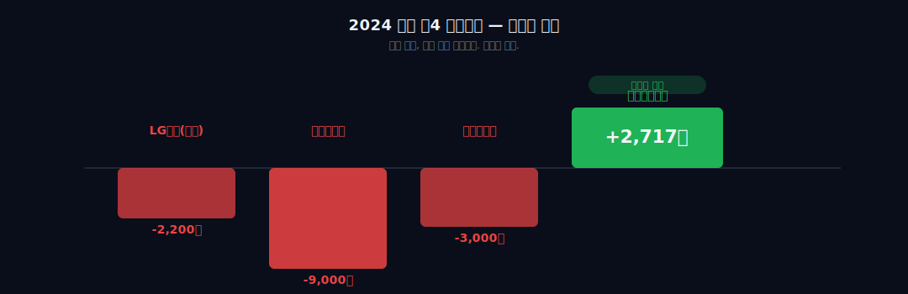
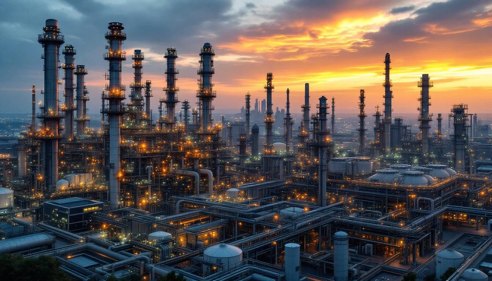
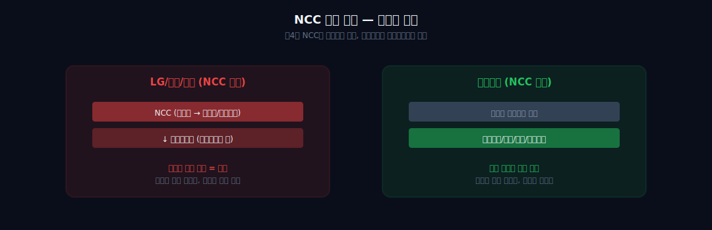
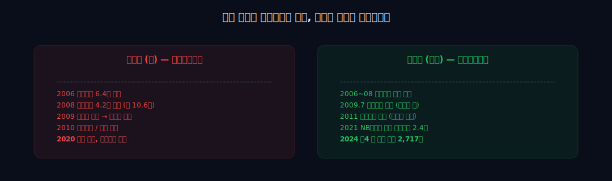
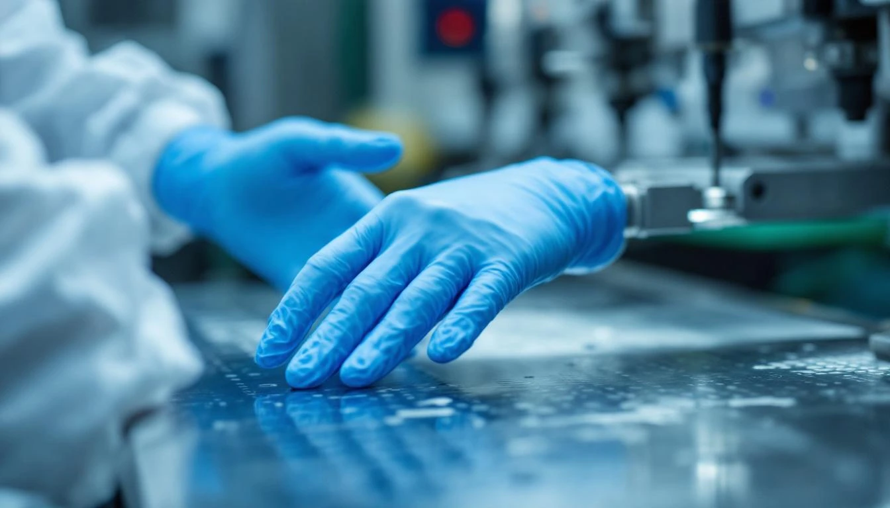
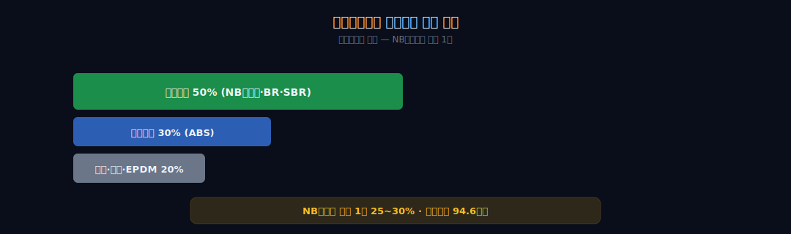
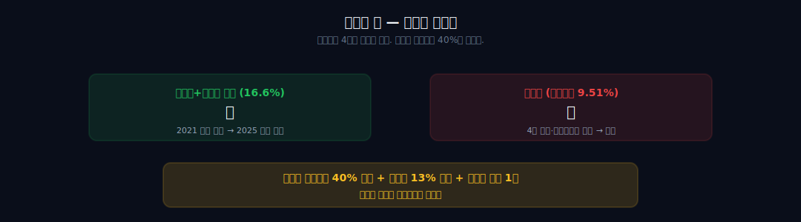

<script>
import ComboChart from '$lib/components/blog/ComboChart.svelte';
import StackBar from '$lib/components/blog/StackBar.svelte';
import HFDataLink from '$lib/components/blog/HFDataLink.svelte';
</script>

> **사이클** | 소재 > 화학 | 2026-04-12 dartlab 실측
> 같은 시리즈: [SK하이닉스](/blog/000660-skhynix) · [삼양식품](/blog/003230-samyang-foods) · [두산에너빌리티](/blog/034020-doosan-enerbility) · [알테오젠](/blog/196170-alteogen) · [HMM](/blog/011200-hmm) · [셀트리온](/blog/068270-celltrion) · [한화에어로스페이스](/blog/012450-hanwha-aerospace) · [HD현대일렉트릭](/blog/267260-hd-hyundai-electric) · [고려아연](/blog/010130-korea-zinc) · [에이피알](/blog/278470-apr) · [크래프톤](/blog/259960-krafton) · [달바글로벌](/blog/483650-dalba-global) · [경동나비엔](/blog/009450-kyungdong-navien) · [대한조선](/blog/439260-daehan-shipbuilding) · [현대글로비스](/blog/086280-hyundai-glovis) · [농심](/blog/004370-nongshim) · [한온시스템](/blog/018880-hanon-systems) · [LG이노텍](/blog/011070-lg-innotek) · [기업이야기 시리즈 전체](/blog/series/company-reports)

## 도입: 빅4 중 유일한 흑자

2024년 한국 석유화학 빅4의 성적표는 참혹했다.

LG화학은 석유화학 부문에서 수천억대 영업적자를 냈다. 배터리가 아니었다면 그룹 전체가 흔들렸을 숫자다. 롯데케미칼은 연결 기준으로 영업적자를 확정했다. 한화솔루션 역시 케미칼 부문이 마이너스를 기록했다. 셋 모두 "중국 공급과잉, 에틸렌 스프레드 붕괴, 역내 수요 부진"이라는 똑같은 변명을 반복했다.

그런데 딱 한 곳만 달랐다.

**금호석유화학. 2024년 연결 매출 7조 1,550억 원, 영업이익 2,728억 원. 흑자.**

같은 업종이다. 같은 중국 공급과잉을 맞았다. 같은 나프타 가격 변동에 노출됐다. 같은 2024년이다. 그런데 빅4 중에 셋은 적자고 금호석유화학만 흑자였다.

이것이 첫 번째 "어?" 포인트다. 누군가 "한국 석유화학 산업 붕괴"라는 헤드라인을 쓰는 동안, 한 회사는 그 산업의 공식 안에 있지 않았다.



이 블로그의 관통선은 하나다. **"왜 금호석유화학만 흑자였는가?"** 이 질문 하나로 7막 전부를 꿰뚫을 것이다. 답은 세 층위로 쌓여 있다. 첫 번째는 사업 구조 — **NCC가 없다**. 두 번째는 역사 — **형제의 난에서 쫓겨난 덕분에 무리한 인수를 피했다**. 세 번째는 지배구조 — **조카의 난이 주주환원 40%를 만들었다**.

이 세 가지를 모두 설명할 수 있어야 "빅4 중 유일한 흑자"라는 결과가 이해된다. 그리고 이 세 가지는 모두 **"무엇을 하지 않았는가"**로 요약된다. 이 회사의 역사는 덧셈이 아니라 뺄셈의 역사다.

## 1막: NCC 없는 구조가 방패가 됐다



### 에틸렌 스프레드 붕괴 — 심장을 가진 회사가 죽었다

**NCC는 석유화학의 심장이다.** 원유를 피로 비유하면 NCC는 심장 — 모든 화학 제품이 여기서 나온 기초유분으로 만들어진다. 이 심장을 가진 회사는 상승기에 피가 넘치고, 불황기에 피가 말라 죽는다. 금호석유화학은 이 심장이 없는 회사다.

석유화학은 수직계열의 산업이다. 맨 위에 **NCC(Naphtha Cracking Center, 나프타 분해 설비)**가 있다. 원유에서 추출한 나프타를 800℃ 이상의 고온에서 분해하면 에틸렌, 프로필렌, 부타디엔 같은 기초유분이 나온다. 이 기초유분이 플라스틱, 합성고무, 합성섬유, 페놀 같은 모든 화학 제품의 뿌리다.

NCC는 석유화학의 심장이다. 그리고 바로 그 심장이 2024년 박살났다.

중국은 지난 5년간 세계 에틸렌 생산능력의 절반 가까이를 자체 증설했다. 2019년 대비 2024년 중국 에틸렌 생산능력은 두 배 가까이 늘어났고, 그 결과 역내 에틸렌 스프레드(에틸렌 가격 - 나프타 가격)는 붕괴했다. 톤당 300달러 이상 유지되던 스프레드가 100달러 아래, 한때는 마이너스까지 떨어졌다. 나프타를 사서 에틸렌을 만들면 오히려 손해가 나는 구조가 된 것이다.

LG화학, 롯데케미칼, 한화솔루션은 모두 대규모 NCC를 보유하고 있다. 이들의 석유화학 부문은 NCC 위에 다운스트림(기초유분에서 파생되는 제품)을 쌓아올린 구조다. NCC가 흑자일 때는 업스트림과 다운스트림 양쪽에서 마진을 먹을 수 있지만, NCC가 적자가 되면 그 적자를 다운스트림이 다 받아안게 된다.

### NCC 없음 = 에틸렌 붕괴 직격타 회피

**금호석유화학은 NCC가 없다.**

이 회사는 기초유분 생산을 하지 않는다. 대신 부타디엔, 스티렌, 페놀 같은 원료를 외부에서 사와서 합성고무, 합성수지, 페놀유도체, 정밀화학 제품을 만든다. 오직 다운스트림만 하는 것이다.

이것은 업계에서 오랫동안 "약점"으로 여겨졌다. NCC가 없다는 것은 원료를 외부에서 사야 한다는 것이고, 이는 **사이클 상승기에 마진이 작다**는 뜻이다. 에틸렌 스프레드가 터질 때 롯데케미칼은 그 혜택을 다 누리지만, 금호석유화학은 원료값 상승분을 고스란히 떠안는다.

그런데 사이클 하락기에는 반대가 된다. **NCC가 없다는 것 = 에틸렌 스프레드 붕괴의 직격타를 받지 않는다는 것**이다. 원료값이 떨어지면 원가도 떨어진다. 중국 346만 톤 증설 같은 뉴스가 나와도 금호석유화학의 심장이 아니라 경쟁사의 심장에 직격이 간다.

2024년 빅4 성적표는 이것을 정확히 보여준다. NCC를 크게 가진 3개사는 적자, NCC가 없는 1개사는 흑자. 방어적인 사업 구조가 불황에 이긴 것이다.



### 영업이익률 28.4%→3.8% — 사이클 전체를 관통하는 흑자

금호석유화학의 5년 손익을 dartlab으로 직접 뽑아 보면 이 구조가 선명해진다.

```python
import dartlab
c = dartlab.Company("011780")
c.select("IS", ["매출액","영업이익","당기순이익"], freq="Y")
```

| 연도 | 매출 | 영업이익 | 영업이익률 | 순이익 |
|---|---:|---:|---:|---:|
| 2021 | 84,618 | **24,068** | 28.4% | 19,656 |
| 2022 | 79,756 | 11,477 | 14.4% | 10,257 |
| 2023 | 63,225 | 3,590 | 5.7% | 4,470 |
| 2024 | 71,550 | 2,728 | 3.8% | 3,486 |
| **2025** | **69,151** | **2,718** | **3.9%** | **2,909** |

*(단위: 억원)*

사이클의 진폭이 적나라하다. 2021년 영업이익률 28.4%는 **전 한국 제조업 통틀어 최상위권** 수치였고, 2024년 3.8%는 사이클 하단이다. 그런데 주목할 지점은 바닥에서도 **적자가 아니라는 것**. 같은 해 LG화학 석유화학 부문 -2,200억, 롯데케미칼 -9,000억, 한화솔루션 -3,000억 적자였다. 금호석화만 **영업이익률 3.8% 흑자 유지**. 이것이 NCC 없는 구조의 방어력이다.

투자자 입장에서 이 회사를 평가하려면 먼저 이 구조적 특성을 이해해야 한다. 금호석유화학은 **사이클 상단에서 폭발하는 회사가 아니라, 사이클 하단에서 살아남는 회사**다. 2021년 영업이익 2.4조를 기준으로 평가하면 영원히 고평가로 보이고, 2024년 2,728억을 기준으로 평가하면 영원히 저평가로 보인다. 진짜 기준은 **사이클 평균**이어야 한다.

그런데 여기서 새로운 질문이 생긴다. 왜 금호석유화학은 NCC를 짓지 않았을까? 2000년대 석유화학 호황기에 모든 한국 대기업이 NCC 증설 경쟁을 벌였다. 그때 금호석유화학은 왜 그 대열에 끼지 않았을까?

답을 찾으려면 2009년 여름으로 돌아가야 한다.

## 2막: 형 박삼구가 그룹을 무너뜨리는 동안, 동생 박찬구는 쫓겨났다

### 대우건설 6.4조 + 대한통운 4.2조 — 형의 베팅

금호아시아나그룹은 한때 재계 7위였다. 창업자 박인천이 1946년 광주에서 택시 두 대로 시작한 회사가 50년 만에 항공, 건설, 타이어, 석유화학, 물류를 아우르는 재벌로 성장했다. 박인천에게는 네 아들이 있었다. 장남 박성용, 차남 박정구, 삼남 박삼구, 사남 박찬구.

2002년 박정구 회장이 암으로 타계하면서 삼남 **박삼구**가 그룹 회장에 올랐다. 사남 **박찬구**는 금호석유화학 대표이사로 있었다. 이때까지는 평화로웠다. 문제는 박삼구의 야심에서 시작됐다.

2006년, 박삼구는 대우건설을 인수했다. 인수가 **6조 4,000억 원**. 당시 건설사 M&A 사상 최대 금액이었다. 시장은 놀랐고, 경제지는 "박삼구의 승부수"라고 평했다. 그런데 인수 조건에 치명적인 함정이 있었다. **풋옵션(Put Option)**이었다. 재무적 투자자들이 참여한 대가로, 금호는 대우건설 주가가 특정 수준(3만 1,500원) 아래로 떨어지면 다시 사줘야 한다는 조건을 떠안았다.

2008년, 박삼구는 여기서 멈추지 않았다. **대한통운을 4조 2,000억 원에 추가 인수**했다. 두 건 합쳐 10조 6,000억 원. 금호아시아나 그룹의 총 자산 규모를 생각하면 무리한 베팅이었다.

**박찬구는 반대했다.** 동생인 그는 형에게 "무리한 인수다. 금호그룹이 감당할 수 없다"고 경고했다. 박찬구가 본 것은 단순한 인수가격이 아니었다. 풋옵션이 발동될 때의 유동성 리스크, 두 회사를 동시에 소화해야 하는 경영 부담, 그리고 그룹 전체의 신용도 하락이었다.

2009년 7월, 형제의 갈등은 결국 표면화됐다. **박삼구 회장은 박찬구 회장을 해임**했다. 이것이 언론이 "**형제의 난**"이라 부른 사건이다. 박찬구는 평생 일궈온 금호석유화학 경영권을 잃었다.

그런데 운명은 참 이상하다.

박찬구가 해임된 바로 그 시기, **글로벌 금융위기가 터졌다**. 대우건설 주가는 풋옵션 가격보다 한참 아래로 떨어졌다. 재무적 투자자들은 풋옵션을 행사했다. **금호는 3조 원 이상의 풋옵션 의무를 지게 됐다**. 대한통운 인수 자금도 이미 그룹 유동성을 고갈시킨 상태였다.

2009년 말, 금호아시아나그룹은 **워크아웃**에 들어갔다. 박삼구가 해임한 동생의 경고가 1년 만에 현실이 된 것이다. 대우건설은 다시 산업은행에 넘겨졌고, 대한통운은 CJ에 매각됐다. 금호타이어는 중국 더블스타에 팔렸다. 그룹이 무너지기 시작했다.

### 2011년 계열분리 — 유일한 생존자

**금호석유화학은 어떻게 됐을까?**

워크아웃 과정에서 금호석유화학은 2011년 **독립 계열분리**로 살아남았다. 박찬구가 다시 경영권을 확보했다. 그룹의 나머지가 침몰하는 동안, 이 회사 하나만 건져진 것이다.



2020년, 금호아시아나그룹의 마지막 상징이었던 **아시아나항공이 대한항공에 매각**됐다. 박삼구는 경영에서 완전히 물러났다. 1946년 박인천이 세운 금호그룹은 사실상 해체됐다. 유일하게 살아남은 게 **금호석유화학**이다. 그것도, 형에 의해 한때 쫓겨났던 **박찬구의 회사**로.

여기서 두 번째 "어?" 포인트가 나온다. **NCC가 없는 구조는 우연이 아니다**. 2000년대 후반 박삼구 체제에서 금호그룹이 NCC 증설 경쟁에 뛰어들었다면, 금호석유화학도 지금의 구조를 갖지 못했을 것이다. 하지만 그룹의 자원은 대우건설과 대한통운 인수에 전부 들어갔고, 석유화학 부문에는 대규모 증설을 할 여력이 남지 않았다. **박삼구의 M&A가 금호석화를 NCC로부터 보호한 셈**이다.

그리고 2011년 독립 계열분리 이후, 박찬구는 처음부터 다시 시작해야 했다. 그룹의 지원도 없고, 은행 대출도 워크아웃 후유증으로 제한적이었다. 이 상황에서 박찬구가 선택한 전략은 **"내가 가진 것을 지키자"**였다. NCC 증설 같은 대규모 자본 투자 대신, 이미 경쟁력이 있는 다운스트림 제품에 집중했다. 그중 하나가 **NB라텍스**였다.

형이 그룹을 무너뜨리는 동안, 쫓겨났던 동생의 회사만 살아남았다. 그리고 그 생존의 방식이 지금 빅4 중 유일한 흑자를 만들었다.

### 부채비율 36% — M&A 안 한 게 현금으로 쌓였다

재무 건전성을 숫자로 확인해보자.

```python
c.select("BS", ["자산총계","부채총계","자본총계","현금및현금성자산"], freq="Y")
c.analysis("financial", "안정성")
```

| 연도 | 자산 | 부채 | 자본 | 현금 | 부채비율 |
|---|---:|---:|---:|---:|---:|
| 2021 | 81,157 | 30,328 | 50,829 | 6,229 | 60% |
| 2023 | 79,797 | 21,457 | 58,340 | 4,524 | 37% |
| 2025 | 84,745 | 22,279 | **62,465** | 6,504 | **36%** |

*(단위: 억원)*

부채비율 **36%**. 화학 빅4 평균(LG화학 80%, 롯데케미칼 120%, 한화솔루션 150%) 대비 1/3~1/4 수준. **"NCC 안 지은 게 현금으로 쌓였다"**는 것의 재무적 증거다. 투자를 덜 한 결과가 자본 확충이 된 것이다. 이 여유가 조카의 난에서 주주환원 40%를 받아낼 수 있었던 기반이기도 하다.

## 3막: NB라텍스 세계 1위 — 의료용 장갑 원료

```python
c.analysis("financial", "수익구조")
c.panel("segments")
```

### 글로벌 점유율 25~30%, 생산능력 94.6만 톤

금호석유화학의 대표 제품 중에서 투자자가 반드시 알아야 할 한 가지가 있다. **NB-Latex(니트릴부타디엔 라텍스)**다.

NB라텍스는 니트릴 고무를 물에 분산시킨 액체 상태의 합성 라텍스다. 용도는 명확하다. **의료용 장갑, 산업용 장갑, 콘돔, 풍선, 접착제**의 원료다. 특히 의료용 일회용 장갑 시장에서 천연 라텍스(알레르기 문제)를 대체하면서 폭발적으로 성장했다.

**금호석유화학의 NB라텍스 글로벌 점유율은 25~30%, 생산능력은 94.6만 톤으로 세계 1위**다. LG화학이나 다른 한국 대기업이 만들지 못해서가 아니다. 금호석유화학이 이 틈새시장에 일찍 들어가서 규모의 경제를 먼저 확보했기 때문이다. NB라텍스는 거대한 NCC를 깔아야 하는 기초 화학이 아니라, 특수 고무 제조 노하우가 핵심인 제품이다. 박찬구가 "가진 것을 지키자"라고 결정했을 때 지킨 대상이 바로 이것이었다.



### 2021년 영업이익 2.4조 — 코로나가 증명한 가치

NB라텍스 이야기의 클라이맥스는 **2020~2021년 코로나**였다.

팬데믹이 터지자 전 세계가 일회용 의료 장갑을 찾았다. 말레이시아의 Top Glove, Hartalega 같은 장갑 제조사들이 주문을 받을 수 없을 정도로 쌓였고, 이들에게 원료를 공급하는 NB라텍스 가격은 수직 상승했다. 금호석유화학은 이 수요 폭발을 그대로 이익으로 바꿨다.

**2021년 영업이익 2.4조 원. 사상 최대**였다. 2019년 영업이익 3,600억과 비교하면 **7배**. 주가도 2020년 초 8만 원대에서 2021년 5월 **29만 6,500원**까지 3.7배 뛰었다. 이 코로나 특수 한 번이 박찬구가 10년간 지켜온 "가진 것"의 가치를 증명했다.

그러나 사이클은 사이클이다.

2022~2023년, 코로나 진정과 동시에 NB라텍스 공급과잉이 찾아왔다. 말레이시아 장갑 업체들이 재고를 쌓아놨고, 중국 설비 증설이 겹쳤다. 가격은 반토막 났다. 금호석유화학 영업이익은 2022년 1.1조 → 2023년 3,590억으로 급감했다. 주가도 고점 대비 반토막 이상 빠졌다.

### 미국 관세 + EV 타이어 — 다음 상승 엔진 둘

그런데 2024년부터 다시 움직이기 시작했다.

**2024년 상반기 NB라텍스 수출량 34.75만 톤. 전년 동기 대비 +28%**. 말레이시아 장갑 업체들이 재고를 다 털어낸 것이다. 여기에 두 가지 구조적 호재가 겹쳤다.

첫 번째는 **미국의 대중국 관세**다. 미국은 중국산 의료용 장갑에 이미 **50% 관세**를 부과하고 있고, 2026년부터 **7.5% → 25%**로 추가 인상 예정이다. 중국 장갑이 미국 시장에서 밀려나면 그 자리를 누가 채울까? 말레이시아 장갑 업체들이다. 그리고 말레이시아 장갑의 원료를 누가 공급할까? **금호석유화학**이다. 반사이익 구조가 만들어졌다.

두 번째는 **EV 타이어 시장**이다. 금호석유화학의 또 다른 주력 제품은 합성고무(SBR, BR, SSBR)다. 이 중 **SSBR(Solution Styrene-Butadiene Rubber)**은 고성능 타이어의 핵심 원료로, 특히 전기차 타이어에 필수적이다. 전기차는 배터리 무게 때문에 일반 타이어보다 무겁고, 회전 저항을 줄여 주행거리를 늘려야 하므로 고성능 SSBR 수요가 급증한다. **EV 타이어 시장 연평균성장률 28%**가 예상되는 이유다.

물론 리스크도 있다. 중국 부타디엔 설비가 향후 **5년간 346만 톤** 증설된다. NB라텍스와 합성고무의 원료인 부타디엔 공급이 폭증하면, 그 자체가 호재(원료값 하락)이지만 동시에 중국 업체들의 NB라텍스 생산 증설로 이어질 수도 있다. 금호석유화학이 지킨 "세계 1위"의 자리가 흔들릴 수 있다는 뜻이다.



정리하면 이렇다. 금호석유화학은 **NCC가 없어서 빅4 중 불황에 유일하게 살아남았고**, **NB라텍스 세계 1위로 코로나 때 사상 최대 이익을 찍었으며**, **EV 타이어 SSBR로 다음 사이클의 상승 엔진을 준비하고 있다**. 이 세 가지가 "박찬구가 지킨 것"의 실체다.

그런데 이 회사의 이야기에는 아직 하나가 남았다. 재무제표에 찍히지 않았지만 재무제표를 바꿨던 사건. **조카의 난**이다.

## 4막: 조카의 난 — 박철완 4년 전쟁과 주주환원 40%

### 배당성향 18%→80% — 조카가 만든 구조적 유산

```python
c.analysis("financial", "자본배분")
c.panel("dividend")
```

| 연도 | 배당금총액(억) | 배당성향 | 자사주 매입·소각 |
|---|---:|---:|---|
| 2020 | 420 | 18% | — |
| 2021 | 2,940 | 15% | 자사주 소각 시작 |
| 2022 | 3,360 | 33% | — |
| 2023 | 2,800 | 63% | 3,500억 소각 |
| 2024 | 2,800 | **80%** | 자사주 13% 전량 소각 |

*(공시 기준, 배당성향은 순이익 대비)*

2020년 배당 420억·배당성향 18%였던 회사가, 4년 뒤 **주주환원율 40%+(배당+자사주 소각 합산)**. 조카가 이겨서 바뀐 게 아니다 — **조카가 싸우는 동안** 회사가 방어를 위해 주주환원을 강화했고, 그게 정착된 것이다. 패배자가 만든 구조적 유산.

주주행동주의(Shareholder Activism)는 서양에서 먼저 발달했다. 주주가 기업 경영에 적극 개입해서 배당 확대, 이사회 재편, 경영진 교체를 요구하는 움직임이다. 한국에서는 오랫동안 이방인의 문화였다. **그런데 한국 재벌 역사에서 가장 강력한 주주행동주의 사건이 금호석유화학에서 터졌다.**

### 박철완 9.51% vs 박찬구+박준경 16.6% — 4년 표 대결

주인공은 **박철완**. 고(故) 박정구(금호아시아나 전 회장) 회장의 장남이자, 박찬구(현 금호석유화학 회장)의 **조카**다.

박철완은 아버지 박정구가 2002년 암으로 타계하면서 금호석유화학 주식을 상속받았다. 그가 개별적으로 보유한 금호석유화학 지분은 **9.51%**로, **최대주주**였다. 박찬구(7.17%)와 박찬구의 장남 박준경(7.51%)이 각자 가진 지분보다도 많았다.

법적으로 박철완이 최대주주였지만, 경영권은 박찬구가 잡고 있었다. 박찬구+박준경 부자의 **합산 지분이 약 14.8%**였고, 여기에 특수관계인과 우호 지분을 더하면 약 **16.6%**로 박철완 단독 9.51%를 누를 수 있었다. 박철완은 10년 가까이 이사회에 들어가지 못했다.

**2021년 3월 주주총회.** 박철완이 정면으로 선전포고했다.

그는 "금호석유화학의 배당이 너무 낮다", "이사회가 총수 일가 중심이다"라며 **배당 인상, 사외이사 독립성 강화, 전자투표 도입**을 주주제안으로 제출했다. 그리고 자신을 이사회에 포함시키라고 요구했다. 한국 재벌가에서 조카가 삼촌을 상대로 공개 표 대결을 벌인 것이다.

언론은 이 사건을 **"조카의 난"**이라 불렀다. 10년 전 "형제의 난" 이후, 또 한 번 금호가의 갈등이 공개됐다.

결과는 박철완의 **완패**였다. 국민연금은 중립을 지켰고, 외국인 주주도 경영 안정을 우선시해 박찬구 편에 섰다. 표 대결에서 박철완의 주주제안은 대부분 부결됐다.

그런데 박철완은 포기하지 않았다. 그는 **4년**을 싸웠다.

2022년, 박철완은 법원에 주주총회 결의 취소 소송을 제기했다. 2023년에는 행동주의 펀드 **차파트너스**와 연합해서 다시 주주제안을 냈다. 2024년에도 또 한 번 표 대결을 벌였고, 또 졌다. 그리고 **2025년 3월, 박철완이 기권 의사를 밝히면서 4년 전쟁이 종결**됐다.



### 자사주 13% 전량 소각 + 이사회 평가 1위

표면적으로 박철완은 모든 전투에서 졌다. 하지만 **전쟁의 결과는 그의 승리에 가까웠다**.

박찬구 측은 박철완의 공세를 막기 위해 **주주환원을 급격히 확대**해야 했다. 2021년 박철완의 첫 주주제안 이후, 금호석유화학은 다음과 같은 조치를 순차적으로 실행했다.

**첫째, 주주환원율 40% 정착**. 영업이익의 40%를 배당과 자사주 매입으로 환원하는 정책을 명문화했다. 한국 대기업 평균 주주환원율이 20~25% 수준임을 감안하면 매우 공격적이다.

**둘째, 자사주 13% 매입 후 소각**. 2022~2024년에 걸쳐 전체 주식의 약 13%에 해당하는 자사주를 매입하고, 이를 **소각**했다. 자사주 매입은 단순 재매입이지만, **소각은 주식 수 자체를 줄인다**. 주주 입장에서는 주식당 이익(EPS)이 13% 가까이 상승하는 효과다.

**셋째, 사외이사 독립성 강화**. 박철완이 요구했던 사외이사 후보 추천 절차 개선, 감사위원 분리선임 등이 단계적으로 도입됐다.

2025년 thebell의 **국내 상장사 이사회 평가**에서 금호석유화학은 **174점으로 1위**를 차지했다. 2위 롯데(166점), 3위 한화(155점), 4위 LG(150점)를 모두 앞섰다. 삼성도 금호석유화학 아래였다. **조카의 난이 없었다면 이 점수는 불가능했을 것이다**.

재무제표로 확인해 보자.

```
dartlab
c = dartlab.Company("011780")
c.analysis("financial", "자본배분")
```

2020년 총 주주환원(배당+자사주)은 영업이익의 **약 10%** 수준이었다. 2021년 코로나 특수 영업이익 2.4조가 나왔을 때 박철완이 "이 이익을 어디에 썼는가"를 물었고, 그 질문이 압력이 되어 2022년 이후 주주환원율은 **40% 선**으로 올라왔다. 박철완이 이기지 못했기 때문에 전쟁이 계속됐고, 전쟁이 계속됐기 때문에 박찬구는 계속 양보해야 했다.

이것이 세 번째 "어?" 포인트다. **주주행동주의가 졌는데 결과는 이겼다**. 그리고 네 번째 "어?" 포인트가 여기서 따라 나온다. **박철완이 없었다면 금호석유화학 주주들은 지금의 주주환원을 받지 못했을 것이다**. 조카는 졌지만, 그 패배가 소액주주 모두에게 이익을 안겨준 셈이다.

투자자가 이 스토리에서 배울 교훈은 명확하다. **지배구조 싸움은 재무제표에 찍힌다**. 단기적으로는 경영 리스크지만, 장기적으로는 주주환원을 끌어올리는 압력으로 작동한다. 금호석유화학 보유자에게 박철완은 "위험 요인"이 아니라 "가치 창출 요인"이었던 것이다.

그리고 2025년 3월 박철완이 기권하면서 전쟁이 끝났다. 이제 박찬구+박준경 체제는 경영권을 완전히 확보했다. 그런데 이미 세팅된 주주환원 40%, 자사주 소각, 이사회 독립성은 되돌릴 수 없다. **조카가 떠난 뒤에도 조카가 만든 구조는 남는다**.

## 5막: 중국 346만 톤 vs EV 타이어 — 사이클의 다음 파도


### 리스크 vs 기회 — 두 힘의 대결

```python
c.analysis("financial", "매크로민감도")   # 외생변수 6축 회귀
c.analysis("forecast", "매출전망")        # 사이클 방향
c.analysis("valuation", "가치평가")       # PBR 밴드
```

지금까지 4막을 꿰뚫는 관통선은 "빅4 중 유일 흑자의 이유?"였다. 답은 세 층위로 쌓였다.

첫째, **사업 구조** — NCC가 없어서 불황에 살아남았다.
둘째, **역사** — 형제의 난에서 쫓겨난 덕분에 무리한 인수를 피했다.
셋째, **지배구조** — 조카의 난이 주주환원 40%를 만들었다.

그럼 5막, 앞으로는 어떻게 될까?

앞으로의 관전 포인트는 두 가지 힘의 대결이다. **리스크: 중국 346만 톤 증설**, **기회: EV 타이어 28% 연평균성장률**.

**리스크 쪽부터 보자.** 중국은 부타디엔 생산능력을 향후 5년간 346만 톤 증설할 계획이다. 부타디엔은 NB라텍스와 합성고무의 핵심 원료다. 원료 공급 증가 자체는 금호석유화학에 호재(원가 하락)다. 하지만 중국 화학 업체들이 원료만 만들고 끝내지 않는다. **NB라텍스 생산 자체로 내려올 가능성이 높다**. 금호석유화학이 25~30% 점유율로 지켜온 세계 1위 자리가 2027~2028년경에 위협받을 수 있다. 이것이 장기 리스크다.

**기회 쪽.** 전기차 타이어 시장이 성장한다. 전기차는 배터리 무게 때문에 내연기관차 대비 타이어에 더 많은 부하가 걸리고, 주행거리 확보를 위해 회전 저항을 낮춰야 한다. 이를 위해 고성능 합성고무인 **SSBR(Solution SBR)** 수요가 폭증한다. EV 타이어 시장 자체가 연평균 28% 성장할 것으로 전망되고, 그 안에서 SSBR 점유율이 높아진다. 금호석유화학은 SSBR에서 이미 세계 Top 3 수준의 기술력을 가지고 있다.

**여기에 미국 관세 변수**가 붙는다. 2026년부터 중국산 의료용 장갑에 7.5% → 25% 추가 관세가 적용되면, 미국 시장에서 중국 장갑이 밀려나고 말레이시아 장갑이 그 자리를 채운다. 말레이시아 장갑의 원료는 금호석유화학이 공급한다. 2026년 실적에 본격 반영될 구조적 호재다.

### 정상 마진 8.3% — 사이클 평균이 진짜 기준

자, 작가의 판단을 정리해 보자.

**금호석유화학의 재무제표는 '없는 것'이 '있는 것'보다 중요하다.**

NCC가 없어서 불황에 살았다. 형이 경영권을 쥐지 못해서 무리한 인수를 안 했다. 조카가 이기지 못해서 주주환원이 정착됐다. 이 회사의 역사는 **'무엇을 하지 않았는가'**로 요약된다.

빅4 중 세 회사는 "무엇을 할 것인가"로 스스로를 설명해 왔다. LG화학은 배터리를 했다. 롯데케미칼은 NCC 증설을 했다. 한화솔루션은 태양광을 했다. 그리고 2024년, 세 회사 모두 그 선택의 대가를 치르고 있다. 금호석유화학만 **"하지 않은 것들"** 덕분에 흑자를 유지한다.

투자자 입장에서 이 회사를 평가할 때 가장 중요한 숫자는 **영업이익률 8%**다. 왜 8%인가? 5년 데이터가 답한다:

| 연도 | 영업이익률 | 국면 |
|---|---:|---|
| 2020 | 14.8% | 회복 초입 |
| 2021 | **27.9%** | NB라텍스 피크 (비정상) |
| 2022 | 9.2% | 정상화 |
| 2023 | 5.2% | 사이클 하단 진입 |
| 2024 | **3.9%** | 사이클 바닥 |

5년 평균 **12.2%**. 하지만 2021년 코로나 특수(27.9%)를 빼면 평균 **8.3%**. 이것이 이 회사의 구조적 정상 마진이다. 현재 3.9%는 명백히 바닥이고 — 지금의 "빅4 유일 흑자"도 "남들보다 덜 나쁜 것"에 가깝다. **8%를 회복하는 분기가 오면 상승 사이클의 초입**이다. 그때 시장이 이 회사를 재평가할 것이다.

**"다음 재무제표에서 볼 것: 영업이익률 8%+. 이 숫자가 나오면 사이클이 중간을 넘었다는 신호다."**

그리고 마지막으로, 이 회사의 본질을 한 문장으로 요약하면 이렇다. **금호석유화학은 박찬구가 형에게서 지킨 회사, 조카에게서 지킨 회사, 그리고 중국 공급과잉에서 지킨 회사다**. 지킨 것이 이긴 것이다.


<HFDataLink code="011780" />

---

## 6막 — PBR 0.8x: 시장은 사이클 바닥을 몇 배로 칠까

### 밸류에이션 밴드 — 사이클 주의 함정

사이클 주는 밸류에이션 함정이 있다. 이익이 폭발할 때 PER이 낮아 보이고, 이익이 바닥일 때 PER이 높아 보인다. 투자자는 PER이 낮을 때(고점) 사고 PER이 높을 때(저점) 팔아 — 반대로 해야 하는데 인간의 직관이 배신하는 구간이다. [SK하이닉스](/blog/000660-skhynix)와 동일한 패턴이 여기서도 작동한다.

```python
c.analysis("valuation", "가치평가")
```

| 시점 | 주가 | PER | PBR | EV/EBITDA | 이익 국면 |
|------|---:|---:|---:|---:|---|
| 2021.05 (피크) | 296,500원 | 6.5x | **2.5x** | 4.2x | NB라텍스 호황 |
| 2022.12 | 145,000원 | 5.8x | 1.1x | 5.5x | 하강 초입 |
| 2024.06 (저점) | 108,000원 | 13.5x | **0.7x** | 8.2x | 사이클 바닥 |
| 2025.04 (현재) | ~135,000원 | 20.1x | **0.9x** | 9.8x | 바닥 횡보 |

### PBR 0.7x~2.5x 밴드의 의미

금호석유화학의 PBR 밴드는 5년간 **0.7x ~ 2.5x**를 오갔다. 현재 0.9x는 밴드 하단 근처다. 자본(자기자본 6.25조)의 90%만 시장이 인정하고 있다는 뜻이다. **장부가보다 싼 주가** — 이것이 사이클 바닥의 신호다.

PBR 0.7x가 나왔던 2024년 6월이 매수 적기였을까? 사후적으로는 그렇다. 하지만 그때 시장은 "중국 346만 톤 증설"과 "영업이익률 3.8% 바닥"을 보고 있었다. 바닥에서 사려면 **"이보다 더 나빠질 수 없다"**는 확신이 필요하고, 그 확신을 주는 것이 **재무 안전성**이다.

### 사이클 바닥에서 안전한가 — 부채비율 36%의 의미

부채비율 36%. 현금 6,504억. 이자보상배율 약 8배(바닥에서도). **사이클 바닥에서 부도 가능성은 0**이다. 롯데케미칼(부채비율 120%, 이자보상배율 1배 미만)이나 한화솔루션(부채비율 150%)과 근본적으로 다르다. 이 안전성이 "바닥에서 매수해도 괜찮은" 근거다.

적정가 시뮬레이션:

| 시나리오 | 영업이익률 | 영업이익 | PER 8x 적용 시총 | 현재 대비 |
|---------|:---:|---:|---:|---:|
| 사이클 바닥 (현재) | 3.9% | 2,718억 | 2.2조 | — |
| 정상화 (영업이익률 8%) | 8.3% | 5,750억 | **4.6조** | +109% |
| 미니 호황 (영업이익률 15%) | 15% | 10,400억 | 8.3조 | +277% |
| NB라텍스 피크 재현 | 28% | 19,400억 | 15.5조 | 비현실적 (코로나 반복 필요) |

**정상 마진(8%) 회복 시 시총 4.6조.** 현재 시총 ~3조 대비 53% 업사이드. 이것이 사이클 주 투자의 핵심 로직이다 — "바닥은 확인됐고, 정상으로 돌아가면 50%+"라는 비대칭 베팅.

---

## 7막 — 화학 업종 scan: 빅4 생존 보고서

### 한국 석유화학 빅4+1 비교 — 같은 불황, 다른 체질

도입에서 던진 질문 "왜 금호석화만 흑자인가"를 업종 전체 횡단 비교로 정리한다. 2024~2025년 실적 기준, 같은 중국 공급과잉을 맞은 5개사의 재무 체질이 얼마나 다른지 숫자로 본다.

```python
dartlab.scan("profitability")
dartlab.scan("debt")
dartlab.scan("quality")
```

| 기업 | 매출 | 영업이익률 | 부채비율 | 이자보상배율 | NCC 보유 | 핵심 방패 |
|------|---:|---:|---:|---:|:---:|---|
| LG화학 | 51.3조 | -2.1%* | 80% | 적자 | O | 배터리가 본업 커버 |
| 롯데케미칼 | 17.8조 | -5.0% | **120%** | 적자 | O | 없음 (구조조정 중) |
| 한화솔루션 | 10.2조 | -3.2% | **150%** | 적자 | O | 태양광에 미래 걸었음 |
| **금호석유화학** | **6.9조** | **3.9%** | **36%** | **8x** | **X** | **NCC 없음 + 다운스트림** |
| 한화임팩트 | 8.5조 | 1.2% | 95% | 2x | O (소형) | NCC 작아서 영향 제한적 |

*LG화학: 석유화학 부문만 기준

### 구조의 차이가 만드는 결과

4가지 질문으로 정리한다.

**1. NCC가 있는가?** LG화학·롯데케미칼·한화솔루션 모두 대형 NCC 보유. 에틸렌 스프레드 붕괴 직격. 금호석화는 NCC 없어서 회피.

**2. 다른 사업이 석화 적자를 메우는가?** LG화학은 배터리(LG에너지솔루션 지분법이익)가 석화 적자를 상쇄. 롯데케미칼과 한화솔루션은 메울 수단이 없다.

**3. 부채가 감당 가능한가?** 금호석화 부채비율 36%, 이자보상배율 8배. 나머지는 100% 이상에 이자보상배율 적자. 불황이 2년 더 가면 롯데케미칼과 한화솔루션은 재무 압박이 심각해진다.

**4. 사이클 회복 시 탄력이 있는가?** 여기는 NCC 보유사가 유리하다. 에틸렌 스프레드가 톤당 300달러로 회복되면 LG화학·롯데케미칼의 이익 탄력은 금호석화보다 크다. 금호석화의 장점은 "바닥에서 안 죽는 것"이고, 단점은 "호황에 덜 뛰는 것"이다.

### 배당 수익률 비교 — 주주환원이 차별화

```python
dartlab.scan("capital")  # 주주환원 비교
```

| 기업 | 배당성향 | 배당수익률 | 자사주 소각 | 총환원율 |
|------|---:|---:|:---:|---:|
| LG화학 | 35% | 2.8% | 일부 | ~28% |
| 롯데케미칼 | 적자 (무배당) | 0% | X | 0% |
| 한화솔루션 | 적자 (무배당) | 0% | X | 0% |
| **금호석유화학** | **80%** | **4.5%** | **13% 전량 소각** | **40%+** |
| 한화임팩트 | 20% | 1.5% | X | ~15% |

사이클 바닥에서도 배당을 주는 회사는 금호석유화학뿐이다. 롯데케미칼과 한화솔루션은 적자라 배당을 줄 수 없다. **조카의 난이 만든 주주환원 40%가 사이클 바닥에서 투자자에게 "기다릴 이유"를 준다.** 배당수익률 4.5%를 받으면서 사이클 회복을 기다릴 수 있다 — 무배당 회사에서는 불가능한 전략이다.

### 종합 — 빅4 중 유일한 생존자의 본질

금호석유화학의 재무제표가 말하는 것을 최종 정리하면 이렇다:

- **NCC 없음** → 불황 직격 회피 (1막)
- **M&A 안 함** → 부채비율 36% (2막)
- **NB라텍스 1위** → 호황에 폭발하는 무기 (3막)
- **조카의 난** → 주주환원 40% 구조적 유산 (4막)
- **사이클 바닥 확인** → 영업이익률 8%+ 회복이 트리거 (5막)
- **PBR 0.9x** → 비대칭 베팅 구간 (6막)
- **업종 내 유일한 안전 + 환원** → 기다릴 수 있는 사이클 주 (7막)

**영업이익률 8%. PBR 1.5x. 배당수익률 3% 이상 유지.** 이 세 조건이 동시에 충족되면 사이클이 중간을 넘겼고, 금호석화의 "지킨 것이 이긴 것"이 다시 한 번 증명되는 순간이다.

---


<!-- AUTO:START — sync_financials.py가 자동 생성. 수동 편집 금지 -->


## 공시 / Filings

| 기간 | 보고서 | 링크 |
|------|--------|------|
| 2025 | 사업보고서 (2025.12) | [DART에서 보기](https://dart.fss.or.kr/dsaf001/main.do?rcpNo=20260318001268) |
| 2025 | 분기보고서 (2025.09) | [DART에서 보기](https://dart.fss.or.kr/dsaf001/main.do?rcpNo=20251114001859) |
| 2025 | 반기보고서 (2025.06) | [DART에서 보기](https://dart.fss.or.kr/dsaf001/main.do?rcpNo=20250814003667) |
| 2025 | 분기보고서 (2025.03) | [DART에서 보기](https://dart.fss.or.kr/dsaf001/main.do?rcpNo=20250515002219) |
| 2024 | 사업보고서 (2024.12) | [DART에서 보기](https://dart.fss.or.kr/dsaf001/main.do?rcpNo=20250317000810) |
| 2024 | [기재정정]분기보고서 (2024.09) | [DART에서 보기](https://dart.fss.or.kr/dsaf001/main.do?rcpNo=20241202000473) |
| 2024 | 분기보고서 (2024.09) | [DART에서 보기](https://dart.fss.or.kr/dsaf001/main.do?rcpNo=20241114001637) |
| 2024 | 반기보고서 (2024.06) | [DART에서 보기](https://dart.fss.or.kr/dsaf001/main.do?rcpNo=20240814004019) |
| 2024 | 분기보고서 (2024.03) | [DART에서 보기](https://dart.fss.or.kr/dsaf001/main.do?rcpNo=20240516001611) |
| 2023 | [기재정정]사업보고서 (2023.12) | [DART에서 보기](https://dart.fss.or.kr/dsaf001/main.do?rcpNo=20240328001337) |

> 전체 공시 목록은 dartlab에서 확인:
> ```python
> import dartlab
> c = dartlab.Company("011780")
> c.filings()
> ```

## 재무제표 — 최근 5개년

> 아래는 최근 5개년 요약입니다. 전체 기간·분기별 데이터는 dartlab에서 직접 확인할 수 있습니다:
> ```python
> import dartlab
> c = dartlab.Company("011780")
> c.panel("IS")              # 손익계산서 (분기)
> c.panel("IS", freq="Y")    # 손익계산서 (연간)
> c.panel("BS")              # 재무상태표
> c.panel("CF")              # 현금흐름표
> c.panel("SCE")             # 자본변동표
> c.panel("ratios")          # 재무비율
> ```

### 손익계산서 (IS) — 단위 억원

<ComboChart data={[{year:"2025",매출액:69151,영업이익:2718,당기순이익:2909},{year:"2024",매출액:71550,영업이익:2728,당기순이익:3486},{year:"2023",매출액:63225,영업이익:3590,당기순이익:4470},{year:"2022",매출액:79756,영업이익:11477,당기순이익:10257},{year:"2021",매출액:84618,영업이익:24068,당기순이익:19656}]} lineKeys={["매출액"]} barKeys={["영업이익","당기순이익"]} lineColors={["#22c55e"]} barColors={["#3b82f6","#f59e0b"]} title="매출(라인) vs 영업이익·당기순이익(막대)" unit="억원" />

| 항목 | 2025 | 2024 | 2023 | 2022 | 2021 |
|---|---:|---:|---:|---:|---:|
| 매출액 | 69,151 | 71,550 | 63,225 | 79,756 | 84,618 |
| 매출원가 | 63,112 | 65,694 | 56,767 | 65,488 | 57,637 |
| 매출총이익 | 6,039 | 5,856 | 6,459 | 14,268 | 26,981 |
| 판매비와관리비 | 3,321 | 3,128 | 2,869 | 2,791 | 2,913 |
| 영업이익 | 2,718 | 2,728 | 3,590 | 11,477 | 24,068 |
| 금융수익 | — | — | — | — | — |
| 금융비용 | — | — | — | — | — |
| 당기순이익 | 2,909 | 3,486 | 4,470 | 10,257 | 19,656 |

### 재무상태표 (BS) — 단위 억원

<StackBar data={[{year:"2025",segments:[{label:"부채",value:22279,color:"#ef4444"},{label:"자본",value:62465,color:"#22c55e"}]},{year:"2024",segments:[{label:"부채",value:22980,color:"#ef4444"},{label:"자본",value:60422,color:"#22c55e"}]},{year:"2023",segments:[{label:"부채",value:21457,color:"#ef4444"},{label:"자본",value:58340,color:"#22c55e"}]},{year:"2022",segments:[{label:"부채",value:20659,color:"#ef4444"},{label:"자본",value:56534,color:"#22c55e"}]},{year:"2021",segments:[{label:"부채",value:30328,color:"#ef4444"},{label:"자본",value:50829,color:"#22c55e"}]}]} title="부채 vs 자본 구조" unit="억원" />

| 항목 | 2025 | 2024 | 2023 | 2022 | 2021 |
|---|---:|---:|---:|---:|---:|
| 자산총계 | 84,745 | 83,402 | 79,797 | 77,193 | 81,157 |
| 유동자산 | 27,416 | 27,109 | 25,714 | 27,436 | 34,452 |
| 비유동자산 | 57,329 | 56,293 | 54,083 | 49,756 | 46,705 |
| 부채총계 | 22,279 | 22,980 | 21,457 | 20,659 | 30,328 |
| 유동부채 | 13,665 | 15,345 | 15,299 | 14,628 | 23,603 |
| 비유동부채 | 8,615 | 7,635 | 6,157 | 6,031 | 6,725 |
| 자본총계 | 62,465 | 60,422 | 58,340 | 56,534 | 50,829 |

### 현금흐름표 (CF) — 단위 억원

<ComboChart data={[{year:"2025",영업CF:7153,투자CF:-3725,재무CF:0},{year:"2024",영업CF:3223,투자CF:-2590,재무CF:0},{year:"2023",영업CF:6307,투자CF:-5920,재무CF:0},{year:"2022",영업CF:5135,투자CF:941,재무CF:0},{year:"2021",영업CF:21270,투자CF:-17585,재무CF:0}]} barKeys={["영업CF","투자CF","재무CF"]} barColors={["#22c55e","#ef4444","#3b82f6"]} title="영업·투자·재무 현금흐름" unit="억원" />

| 항목 | 2025 | 2024 | 2023 | 2022 | 2021 |
|---|---:|---:|---:|---:|---:|
| 영업활동현금흐름 | 7,153 | 3,223 | 6,307 | 5,135 | 21,270 |
| 투자활동현금흐름 | -3,725 | -2,590 | -5,920 | 941 | -17,585 |
| 재무활동현금흐름 | — | — | — | — | — |

*최종 갱신: 2026-04-13 | dartlab 실측 (DART 공시 기준)*

<!-- AUTO:END -->
