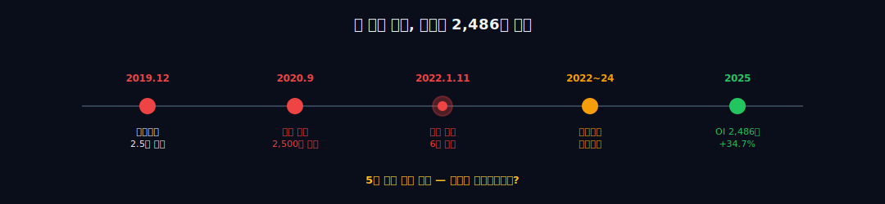
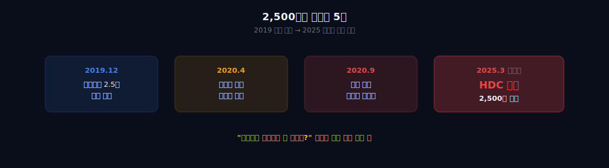
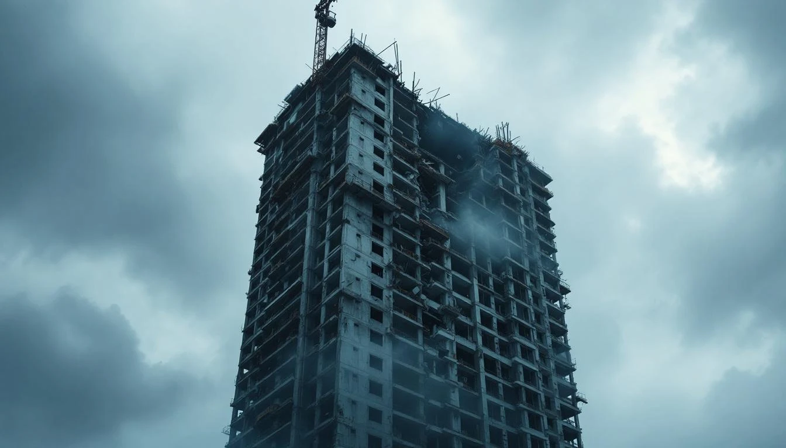
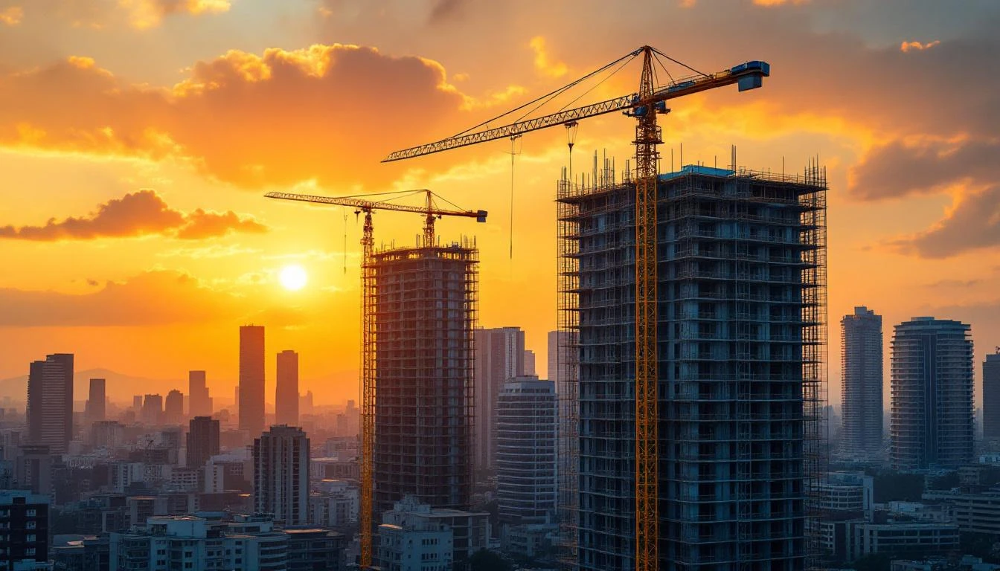
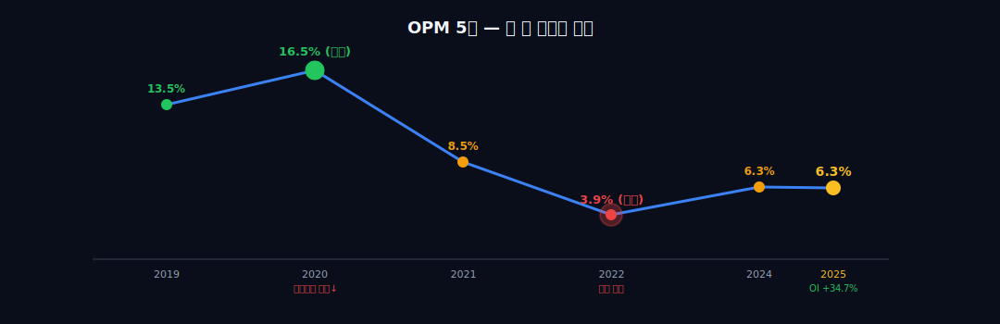
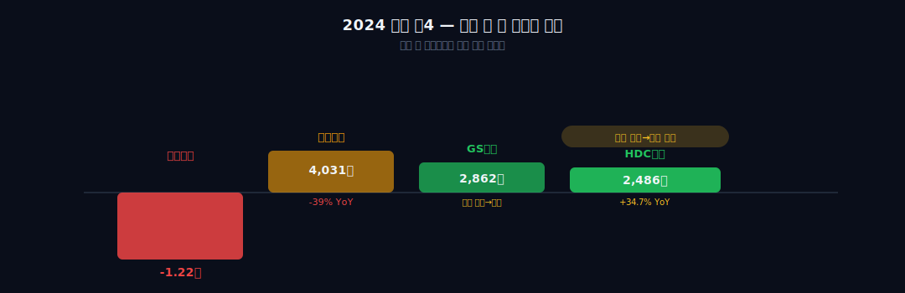

> **턴어라운드** | 건설 > 주택개발 | 2026-04-12 dartlab 실측
> 같은 시리즈: [SK하이닉스](/blog/000660-skhynix) · [삼양식품](/blog/003230-samyang-foods) · [두산에너빌리티](/blog/034020-doosan-enerbility) · [알테오젠](/blog/196170-alteogen) · [HMM](/blog/011200-hmm) · [셀트리온](/blog/068270-celltrion) · [한화에어로스페이스](/blog/012450-hanwha-aerospace) · [HD현대일렉트릭](/blog/267260-hd-hyundai-electric) · [고려아연](/blog/010130-korea-zinc) · [에이피알](/blog/278470-apr) · [크래프톤](/blog/259960-krafton) · [달바글로벌](/blog/483650-dalba-global) · [경동나비엔](/blog/009450-kyungdong-navien) · [대한조선](/blog/439260-daehan-shipbuilding) · [현대글로비스](/blog/086280-hyundai-glovis) · [농심](/blog/004370-nongshim) · [한온시스템](/blog/018880-hanon-systems) · [LG이노텍](/blog/011070-lg-innotek) · [금호석유화학](/blog/011780-kumho-petrochemical) · [기업이야기 시리즈 전체](/blog/series/company-reports)

## 도입: 두 번의 재난, 그리고 2,486억 흑자

한 회사가 5년 동안 이런 일을 겪었다고 상상해 보자.

2020년, 2조 5천억 원짜리 인수 계약이 깨졌다. 코로나 때문이었다. 회사는 "지금 사면 망한다"고 했고, 상대는 "그래도 사라, 계약은 계약"이라고 했다. 싸움은 5년 갔다. 2025년 3월, 대법원이 판결을 내렸다. **계약금 2,500억 원, 전액 증발.** 돌려받지 못한다.

그 와중에 2022년 1월 11일, 자기 회사가 짓던 39층 아파트의 23층부터 38층까지가 연쇄로 무너졌다. 하청 노동자 6명이 죽었다. 7개월 전에는 다른 현장(광주 학동)에서 철거 중이던 건물이 버스 위로 무너져 9명이 죽었다. 7개월 사이에 사망자 15명. 브랜드 평판지수는 **24개 아파트 브랜드 중 꼴찌**. 이미 입주한 타 지역 아파트에서는 "아이파크 간판 떼 달라"는 운동이 벌어졌다.

이쯤 되면 회사가 없어져도 이상하지 않다.

그런데 2025년 이 회사의 성적표가 이렇다. **영업이익 2,486억 원, 전년 대비 +34.7%.** 도시정비 신규 수주 4조 8,012억 원, +260%. 같은 해 현대건설은 1조 2,200억 원 적자, 대우건설은 이익이 39% 꺾였다. 건설업계 전체가 PF 사태와 미분양으로 초토화된 한가운데에서, HDC현대산업개발만 이익이 늘었다.

**어떻게?**

이 글은 그 질문의 답을 찾는다. 5년 동안의 계약금 소송, 붕괴 참사, 영업정지, 리브랜딩, 그리고 재무제표가 보여주는 회복의 실체를. 한 건설사가 두 번의 재난을 맞고도 어떻게 살아남았는지, 그리고 이 "살아남음"이 진짜인지 아닌지를.

```python
import dartlab
c = dartlab.Company("294870")
c.analysis("financial", "종합평가")
c.analysis("financial", "수익성")
```



먼저 2020년, 2,500억이 증발한 날부터 시작하자.

---

## 1막: 2020년, 2,500억이 증발한 날

### "건설사가 항공사를 왜 사?"

2019년 12월 27일. HDC현대산업개발과 미래에셋대우 컨소시엄이 아시아나항공 인수 본계약을 체결했다. 총 인수가 **2조 5천억 원.** HDC가 주간사로 2조 1,772억을 책임지고, 미래에셋이 나머지를 댔다. 구주 인수 3,228억, 신주 인수 2조 1,772억 구조였다. 계약금으로 인수가의 10%에 해당하는 **2,500억 원을 선납**했다.

정몽규 HDC 회장은 기자회견에서 이렇게 말했다. "건설을 넘어 모빌리티로 가는 그룹 제2의 도약이다." 당시 HDC그룹은 건설(HDC현산) + 면세·유통(HDC신라면세점) + 레저(HDC리조트) 포트폴리오를 갖고 있었고, 여기에 **항공을 붙이면 "관광·물류 수직계열화"**가 완성된다는 그림이었다. 공항-면세점-항공-호텔-리조트를 한 그룹이 다 쥔다. 논리로는 말이 됐다.

시장 반응은 엇갈렸다. "건설사가 항공사 운영을 해본 적이 없는데?" 하는 회의론도 있었지만, "정몽규가 큰 그림을 그린다"는 기대도 있었다. 2019년 12월 계약 당시 HDC현산 주가는 2만 5천 원대. 발표 직후 잠깐 뛰었다.

그리고 3개월 뒤, 세상이 뒤집혔다.

### 코로나, 그리고 재실사 요구

2020년 1월 국내 첫 코로나 확진. 2020년 3월 WHO 팬데믹 선언. 항공업계가 직격탄을 맞았다. 아시아나항공은 2020년 1분기에만 영업손실 2,920억 원을 냈다. 국제선 운항률이 한 자릿수로 떨어졌다. 2019년 결산 기준 아시아나 부채비율은 이미 1,386%였는데, 코로나로 더 악화됐다.

HDC의 입장이 바뀌었다. 2020년 4월부터 HDC는 **"재무상태가 바뀌었으니 재실사를 해야 한다"**고 요구했다. 정확한 요구는 이랬다. "부채가 계약 당시 대비 4.5조 원 이상 증가했다. 차입금이 2조 이상 늘었다. 이 상태로는 인수 후 재무구조 개선이 불가능하다. 12주간 재실사 기간을 달라."

아시아나(금호산업+채권단) 측은 거부했다. "재실사는 이미 충분히 했다. 계약은 이미 체결됐다. 거래 종결 의무를 이행해라." 2020년 7월 말, 아시아나 측이 "계약 종결 확정"을 통보했지만 HDC는 응하지 않았다. 2020년 9월 11일, 채권단이 계약 파기를 공식 선언했다. **인수는 무산됐다.**

### 5년짜리 소송, 그리고 "위약벌"

문제는 계약금 2,500억이었다. HDC는 "계약이 무산됐으니 돌려달라"고 주장했고, 금호산업은 "계약 불이행은 HDC 책임이니 위약벌로 몰수한다"고 맞섰다.

소송이 5년을 끌었다. 1심(2023.11)과 2심(2024.4) 모두 HDC가 졌다. 그리고 **2025년 3월 13일, 대법원이 상고를 기각**했다. 판결 요지는 이랬다. "본 계약서상 계약금은 위약벌로 기능한다. HDC의 재실사 요구는 계약상 요건에 맞지 않는 이행 거부로 본다. 따라서 계약금 2,500억은 금호산업에 귀속된다."

**2,500억 원, 전액 증발.** HDC는 한 푼도 돌려받지 못한다.

이 숫자가 얼마나 큰가? 2020년 HDC현대산업개발 영업이익이 5,148억 원이었다. 그해 순이익이 3,015억이었다. **한 해 이익의 절반을 한 번에 날린 셈**이다. 게다가 계약금 2,500억은 이미 2020년에 선납했으므로, 현금흐름상으로는 2020년에 유출됐고, 회계상 장기간 "소송 중"으로 묶여 있다가 2025년에 확정 손실로 떨어졌다.

5년이 걸렸다. 그사이 HDC는 이자 수익도 못 올리고, 다른 투자에도 쓰지 못하고, 소송 비용까지 쓰면서 이 돈을 "잠긴 채" 들고 있었다.



### 첫 번째 "어?"

여기서 첫 번째 "어?"가 나온다. **왜 건설사가 2조 5천억을 들여 항공사를 사려고 했는가?**

명분은 있었다. 공항 면세점이 있고, 호텔·리조트가 있고, 교통 인프라 건설 경험이 있다. 관광·물류 수직계열화는 글로벌 재벌 그룹이 흔히 쓰는 전략이다. SK가 반도체에서 배터리·바이오로 확장한 것처럼, HDC도 건설에서 모빌리티로 확장하려 했다는 설명은 가능하다.

하지만 시점이 이상했다. 2019년 말, 이미 글로벌 경기는 둔화되고 있었고, 항공업은 유가와 환율에 취약했다. 아시아나 자체도 부채비율 1,386%의 부실기업이었다. 건설 본업의 현금을 2조 넘게 빼서 이런 회사에 베팅하는 게 합리적이었나?

정몽규 회장의 결정이었다. 그리고 이 결정이 2020년의 계약금 2,500억 소실을 만들었고, 결과적으로 2022년의 또 다른 재난을 대비할 현금 쿠션을 깎아먹었다. **베팅 실패가 재난 복구 여력을 줄였다.**

다음 막은 그 두 번째 재난 이야기다.

---

## 2막: 2022년 1월 11일, 6명이 죽었다

### 오후 3시 47분, 광주 화정동

2022년 1월 11일 오후 3시 47분. 광주광역시 서구 화정동. 신축 중이던 "화정아이파크" 201동 39층에서 굉음이 났다. 39층 바닥 거푸집을 제거한 직후, 39층 바닥이 무너져 38층으로 떨어졌다. 그 충격으로 38층이 37층으로, 37층이 36층으로... **23층까지 15개 층이 연쇄 붕괴**했다.

작업 중이던 하청 노동자 7명이 떨어지는 콘크리트에 매몰됐다. 1명은 사고 당일 구조됐다. 나머지 6명은 12일, 25일, 28일, 2월 8일에 걸쳐 사망한 채로 발견됐다. **하청 6명 사망, 1명 부상.**

### 왜 무너졌는가 — 세 가지 원인

경찰·국토부 합동 조사 결과 원인은 세 가지였다.

**① 39층 바닥 시공방법 임의 변경.** 설계상으로는 39층 바닥을 PIT층(기계설비층) 위에 하중을 분산하도록 시공해야 했다. 그런데 현장에서 이 방식을 임의로 바꿔 PIT층 벽체에 하중을 집중시켰다. 설계에 없는 지지 구조였다. 이 변경에 대한 구조 검토는 없었다.

**② 15개 층 콘크리트 강도 미달.** 사고 전 201동 23~38층 콘크리트 강도 시험 결과, 설계 기준 강도(24MPa)에 못 미치는 샘플이 다수 발견됐다. 원인은 추운 날씨에 충분한 양생 기간을 거치지 않고 다음 층 공사를 진행한 것. 콘크리트가 굳기 전에 윗층을 쌓았다.

**③ 가설지지대(동바리) 조기 철거.** 상부 층이 무게를 받을 만큼 굳지 않았는데도 아래층 지지대를 치웠다. 하중이 갈 곳이 없었다.

즉, **공기 단축을 위해 세 가지 안전 절차를 동시에 건너뛴 결과**였다. 한 가지만 지켜졌어도 사고는 없었을 것이라는 게 조사 결론이었다.

### 7개월 만의 두 번째 참사

이게 HDC현산의 **첫 번째 사고도 아니었다.** 불과 7개월 전인 2021년 6월 9일, 광주 학동 재개발 구역에서 HDC현산이 철거 중이던 5층 건물이 도로 쪽으로 무너졌다. 무너진 잔해가 지나가던 54번 시내버스를 덮쳤다. **승객 9명 사망, 8명 부상.**

학동 붕괴는 재하청·재재하청이 겹쳐 안전 관리가 붕괴된 전형적 사례였다. HDC현산 → A사 → B사 → C사로 이어지는 하도급 구조에서 아무도 책임지지 않았다. 국토부 조사 결과 철거 공법 위반, 해체 계획서와 실제 공법 불일치, 감리 부재가 확인됐다.

7개월 사이 **사망자 15명.** 한 건설사가 1년이 안 되는 시간에 이 정도 인명 피해를 낸 경우는 드물다.

### 시장의 반응

2022년 1월 11일 사고 직후 4거래일간 HDC현산 시가총액이 **4,580억 원 증발**했다. 단순 주가 하락을 넘어 구조적 불신이 있었다. 기관과 외국인이 매도했다.

더 심각한 건 **브랜드 평판지수**였다. 2022년 2월 한국기업평판연구소가 발표한 아파트 브랜드 평판 조사에서 아이파크는 24개 브랜드 중 **꼴찌**를 기록했다. 사고 전인 2021년 하반기에 6위였다. 한 분기 만에 1위에서 24위로 떨어진 셈이다.

이미 입주한 타 지역 아이파크 단지에서는 "간판을 떼 달라", "아이파크 빼고 재명명하자"는 입주민 운동이 벌어졌다. 서울·경기·부산 여러 단지에서 분양 예정이던 아이파크 현장들이 일제히 대기 모드로 들어갔다. 분양을 해도 사람이 안 올 수 있다는 공포 때문이었다.

### 재무제표에 찍힌 숫자

이 상황이 재무제표에 어떻게 나타났는가.

2022년 HDC현대산업개발의 영업이익률(OPM)은 **3.9%.** 2019~2021년 평균 10%를 넘었던 회사가 한 해에 마진이 반 토막 이하로 떨어졌다. 매출은 3조 2천억 원대를 유지했는데 영업이익은 1,290억 원에 그쳤다. 원인은 두 가지였다.

첫째, 사고 관련 일회성 비용. 사고 수습, 해체, 재시공 준비, 유가족 보상, 법률 비용 등이 수백억 원 단위로 쌓였다.

둘째, 신규 수주 공백. 사고 이후 6개월간 주요 도시정비 수주에서 HDC현산은 거의 배제됐다. 조합이 안전 리스크가 있는 시공사를 선택할 이유가 없었다. 이게 2022~2023년 매출 저하로 이어졌다.

2023년은 더 어려웠다. OPM이 회복되지 못한 채 매출도 줄었다. 영업이익 1,953억, OPM 5% 수준. 2024년 1,846억(OPM 4.4%)으로 소폭 뒷걸음, 그리고 **2025년 들어 2,486억(+34.7%, OPM 6.3%)으로 비로소 회복 추세가 뚜렷해졌다.**



### 두 번째 "어?"

여기서 두 번째 "어?"가 나온다. **대법원이 2025년 3월, 아시아나 계약금 2,500억을 전액 상대방에게 귀속시켰다는 점이다.**

일반적인 M&A 계약에서 계약금은 "해약금"이다. 한쪽이 계약을 파기하면 계약금 배액 지급으로 끝나거나, 계약금을 몰수당하는 수준에서 정리된다. 그런데 아시아나-HDC 계약에서 대법원은 **계약금이 "위약벌"**이라고 봤다. 위약벌은 손해배상과 별개로 "계약 위반에 대한 징벌"이다. 즉 위약벌 2,500억을 몰수당한 것과 별개로, HDC가 손해배상까지 물 여지가 있다는 뜻이다. (실제 추가 소송은 진행 중이다.)

5년 전 체결한 계약의 "계약금 조항"이 이렇게 강한 위약벌로 해석될 줄 HDC 법무팀은 몰랐을까? 아니면 알았지만 당시엔 "어차피 인수할 거니까 상관없다"고 넘어갔을까? 어느 쪽이든, **2020년의 선택이 2025년에 2,500억 원짜리 고지서로 돌아왔다.**

회사가 죽었는가? 2022년 초 시장은 그렇게 봤다. 그런데 죽지 않았다. 다음 막은 어떻게 살아남았는지의 이야기다.

---

## 3막: 브랜드를 버리고 살았다 — 센테니얼 아이파크



### "화정아이파크"를 "센테니얼 아이파크"로

2022년 사고 직후 HDC현산이 가장 먼저 한 결정은 **"화정아이파크 전면 해체 후 재시공"**이었다. 무너진 201동만 다시 짓는 게 아니라, 단지 내 **8개 동 전체를 해체**하고 처음부터 다시 시공하는 결정이었다. 보상·해체·재시공에 최소 3,700억 원, 공기 4년 연장이 예상됐다.

이것만으로도 전례가 없는 결정이었다. 한 동 사고 때문에 멀쩡한 다른 동까지 다 헐어버리는 건설사는 없었다. HDC현산이 이 결정을 내린 건 "안전 신뢰"를 완전히 재구축하지 않으면 회사가 끝난다는 판단이었다.

그리고 2024년, 더 결정적인 수를 뒀다. **"화정아이파크"라는 단지명을 버리고, "광주 센테니얼 아이파크(Centennial Iaprk)"로 개명**했다. 센테니얼(Centennial)은 "100년"이라는 뜻이다. "100년 프리미엄 단지"를 표방한 리브랜딩이었다.

**브랜드 자체는 유지하되(아이파크), 참사와 연결된 단지명(화정)은 지웠다.** 이건 "아이파크 간판을 빼달라"는 타 단지 입주민 요구에 대한 HDC의 답이기도 했다. "아이파크는 살린다, 단 사고가 난 단지 이름은 없앤다." 분노를 다른 곳으로 돌리지 않고, 아이파크 전체를 지키는 선택이었다.

재시공 현장은 2024년 착공했다. **2026년 2월 준공 예정.** 기존 계약 입주민들에게는 분양가 동결 + 지연 보상 + 금리 지원이 제공됐다. 이탈을 최소화하려는 조치였다.

### 10년 만의 구조조정

두 번째 결정은 내부 구조조정이었다. 2022년 하반기~2023년에 걸쳐 HDC현산은 **10년 만의 대규모 조직 개편**을 단행했다. 주요 내용:

- 본사 인력 감축(정확한 숫자는 비공개, 업계 추정 200명 이상)
- 현장 안전관리 조직 신설(상무급 책임자 배치)
- 구매·조달 중앙집권화(단가 관리)
- 설계·시공 품질관리 체계 재정비(콘크리트 강도·공기 관리 프로세스 전면 재설계)

건설사에서 안전 사고 후 조직 개편은 흔하다. 하지만 대부분은 "안전팀 신설" 수준에서 끝난다. HDC현산은 그보다 깊게 갔다. 구매·조달·시공까지 체계를 다 갈아엎었다. 2년이 걸렸다.

### 선별 수주 전략

세 번째 결정이 가장 중요했다. **무리한 수주를 중단하고 자체개발에 집중한다.**

건설사는 크게 두 가지로 돈을 번다. 도급 공사(남의 땅에 집 지어주고 공사비 받기)와 자체개발(내가 땅 사서 내가 짓고 내가 분양). 도급은 마진이 낮지만 안정적이고, 자체개발은 마진이 높지만 리스크가 크다.

2022년 이전 HDC현산은 도급 비중이 높았다. 사고 이후 전략을 바꿨다. **도급은 선별적으로만 받고, 수도권·거점도시 자체개발 단지에 집중.** 이유는 두 가지였다.

첫째, 도급은 브랜드 타격 때문에 수주가 안 됐다. 어차피 조합이 HDC를 안 뽑는다. 그럼 할 수 있는 걸 해야 한다.

둘째, 자체개발은 분양만 되면 마진이 확실하다. HDC현산은 이미 보유한 자체개발 파이프라인이 많았다. 이걸 소진하면서 돈을 번다.

이렇게 해서 2023~2024년 분양한 자체개발 단지들이 줄줄이 흥행했다. 대표 단지:

- **서울원 아이파크**(서울 광운대역세권): 10년간 개발된 대형 복합단지. 2025년 분양.
- **수원 아이파크시티**: 기존 단지 후속 블록 분양. 수원시 대표 아이파크 단지.
- **청주 가경 아이파크**: 충청권 거점 단지. 완판.
- **천안 아이파크**: 2024년 분양.
- **운정 아이파크**: 파주 운정신도시. 2025년.

서울·경기·거점도시 대형 단지라 미분양 리스크가 상대적으로 적었다. 그리고 자체개발이라 PF 리스크도 HDC현산 내부에서 관리할 수 있었다. 분양 매출이 본격적으로 회계에 반영되기 시작한 게 2024~2025년이었다.



### 세 번째 "어?"

여기서 세 번째 "어?"가 나온다. **브랜드 평판 꼴찌 회사에 2024년 도시정비 수주가 4조 8,012억 원(+260%)으로 몰렸다는 점이다.**

앞에서 "도급은 수주가 안 됐다"고 했는데, 그럼 이 4조 8천억은 어디서 왔는가? 핵심은 **도시정비(재건축·재개발) 수주**가 일반 도급과 다르게 움직인다는 점이다.

도시정비는 조합원(아파트 소유주)이 시공사를 고른다. 조합원들이 가장 중요하게 보는 건 ① 공사비 경쟁력 ② 분양가 보장 ③ 후분양 여력(자체 자금력)이다. 안전 이슈도 중요하지만, 그보다 **"이 시공사가 자금 조달을 끝까지 끌고 갈 수 있는가"**가 우선 고려 사항이다.

2023~2024년 PF 사태로 많은 건설사들이 자금 경색에 빠졌다. 태영건설은 워크아웃, 신세계건설은 모회사 지원으로 겨우 버텼다. 현대건설·대우건설도 해외 저마진 현장 손실로 이익이 꺾였다. 이 상황에서 **HDC현산은 현금 보유액이 여전히 탄탄했고(자체개발 분양 자금 유입), 그룹 지원(HDC 지주) 여력도 있었다.**

조합들 입장에서는 "안전 이슈가 있어도 자금이 막히지 않는 시공사"를 택하는 게 공사 지연 리스크를 줄이는 길이었다. 그리고 HDC현산은 2022년 이후 2년 동안 안전 체계를 재구축했다는 메시지를 지속적으로 냈다. "한 번 큰일을 겪은 회사가 오히려 더 꼼꼼해졌을 수 있다"는 논리도 조합원들 사이에 통했다.

브랜드 평판지수는 "소비자 일반"의 인식이고, 도시정비 수주는 "조합원"이라는 특정 집단의 합리적 계산이었다. 둘은 따로 움직였다.

다음 막은 이 선택들이 재무제표에 어떻게 찍혔는지의 이야기다.

---

## 4막: 2025년, 도시정비 4.8조 — 신뢰가 돌아왔다는 증거

### 2025년 성적표

2025년 HDC현대산업개발의 실적이다.

- **매출 4조 1,500억 원** (+1% YoY)
- **영업이익 2,486억 원** (+34.7% YoY)
- **영업이익률 6.3%** (전년 4.7% → 개선)
- **3분기 누적 영업이익 2,073억 원** (+45.1% YoY)
- **당기순이익 1,892억 원**

건설 빅4의 가장 최근 연간 실적을 비교해 보자. (현대건설·대우·GS는 2024 연간, HDC현산은 2025 연간)

| 건설사 | 매출 | 영업이익 | YoY | OPM | 기준 |
|---|---:|---:|---:|---:|:---:|
| 현대건설 | 32.7조 | **-1.22조 (적자)** | 적자전환 | -3.7% | 2024 |
| 대우건설 | 10.4조 | 4,031억 | -39% | 3.9% | 2024 |
| GS건설 | 약 12조 | 2,860억 | 흑자전환 | 2.4% | 2024 |
| **HDC현산** | **4.15조** | **2,486억** | **+34.7%** | **6.3%** | 2025 |

이 표를 보면 뭐가 이상한지 금방 보인다. **빅4 중 OPM이 가장 높은 회사가 HDC현산이다.** 매출은 가장 작지만, 효율은 가장 좋다.

현대건설은 해외 플랜트 손실(사우디 카란·마르잔 등)과 국내 주택 원가 상승으로 1조 넘는 적자를 냈다. 대우건설은 국내 주택 현장 원가율 악화로 이익이 40% 꺾였다. GS건설은 2023년 검단 지하주차장 붕괴 사고 이후 구조조정 중이다. 흑자 전환했지만 OPM 2%대에 불과하다.

HDC현산만 유일하게 의미 있는 OPM(6%+)과 이익 성장(+34.7%)을 냈다. 이유는 3막에서 설명한 자체개발 전략이다. **수도권·거점도시 자체개발 단지의 분양 매출이 본격적으로 인식되기 시작했다.**



숫자만 보면 이상하다. 사고를 낸 회사가 사고 안 낸 회사보다 마진이 좋다. **OPM 1위가 HDC현산이라는 것** — 이건 도급 사업을 줄이고 자체개발 사이클에 의존하는 구조가 만든 결과다. PF 사태로 도급이 흔들릴 때, 자체분양 이익이 들어오는 회사만 살았다. 위기가 전략을 검증한 것이다.

### 도시정비 4.8조 — 수주 구성

2024년 HDC현산이 수주한 도시정비 4조 8,012억 원의 구성을 보면 회복의 실체가 더 선명해진다.

- 서울 강북권 재건축 2건(약 1.8조)
- 수도권 신도시 재개발 3건(약 1.5조)
- 지방 거점도시 재건축 4건(약 1.5조)

특징은 두 가지다. 첫째, **서울·수도권 비중이 70%**라는 점. 미분양 리스크가 상대적으로 낮은 지역에 수주가 집중됐다. 둘째, **컨소시엄 수주가 많다.** 단독 수주가 아니라 다른 시공사와 2~3개 조합으로 참여. 이건 사고 리스크를 분산하고, 조합원들의 안전 우려를 줄이는 구조였다.

업계 5위권. 2022년 사고 직후 10위권 밖으로 밀렸던 HDC현산이 2년 만에 5위까지 올라왔다. 수주잔고도 빠르게 회복 중이다.

### 시총 추이 — 2025년 1월의 분기점

2025년 1월, 건설업종 시총 추이에서도 HDC현산의 차별성이 드러났다.

- 현대건설: 연초 대비 **-25%**
- 대우건설: **-22%**
- GS건설: **+3%**
- **HDC현산: +17%**

1월 한 달 사이 빅4 중 둘이 20% 넘게 빠지는 상황에서, HDC현산과 GS건설만 상승했다. GS는 사고 후 구조조정이 가시화된 반면, 현대·대우는 2024년 실적 쇼크가 시장에 반영되는 국면이었다. **HDC현산은 이미 2022년에 최악을 겪었기 때문에 2025년 기준으로는 반등 포지션에 있었다.**

### 살아남음의 공식

재무제표와 시장이 공통으로 말하는 건 이거다.

**"2020년에 2,500억을 날리고, 2022년에 6명을 죽게 한 회사가 2025년에 살아있다"**는 건 우연이 아니라 구체적 선택의 결과다.

- **자체개발 자금력 유지** → 도급 수주 공백을 자체 분양으로 메움
- **아이파크 브랜드 유지 + 사고 단지명만 교체** → 분노 관리
- **전면 해체 후 재시공 결정** → 안전 신뢰 재구축 신호
- **10년 만의 구조조정** → 안전·품질 체계 재설계
- **도시정비 컨소시엄 수주 전략** → 자금력과 분산을 무기로 조합 설득

한 가지만 실패했어도 지금 같은 OPM 6.3%는 안 나왔다. 특히 첫 번째(자체개발 자금력)가 없었다면 2022~2023년 도급 공백을 버티지 못하고 PF 사태 때 다른 건설사들처럼 무너졌을 것이다.

분석을 확인하려면 `c.analysis("financial", "수익성")`을 실행해 보라.

### 남은 질문들

그런데 이 "살아남음"에는 조건이 달려 있다. 2026년 2월, **광주 센테니얼 아이파크 재시공이 준공된다.** 입주민이 다시 그 단지에 들어간다. 이 순간이 진짜 시험대다.

만약 입주가 순조롭고, 안전 점검이 통과되고, 다른 지역 아이파크 분양에도 선순환이 일어나면, HDC현산의 턴어라운드는 완성된다. OPM 8%대 진입이 가능해진다.

만약 재시공 과정에서 새로운 문제가 발견되거나(구조 검사 불합격, 하자 재발), 입주민 이탈이 크거나, 타 단지 분양이 여전히 저조하면, 2025년의 숫자는 "일시적 반등"으로 끝날 수 있다.

재무제표는 과거를 말한다. 2026년 2월은 미래를 결정한다. 다음 막은 이 회사의 뒤에 있는 사람, 정몽규 회장 이야기와 작가의 판단이다.

---

## 5막: 정몽규, 그리고 아직 남은 질문들 — 작가 판단

### 정몽규 — 건설 참사와 축구 실패의 이중 얼굴

HDC그룹 회장 정몽규. HDC현대산업개발 지분 33.68%를 직접 보유한 실질적 오너. 현대가 3세 경영인(고 정세영 현대산업개발 창업자의 아들). 그룹 전체를 지휘한다.

동시에 그는 **대한축구협회 회장이다. 2013년부터 4연임 중.**

2022년 화정아이파크 붕괴 당시, 정몽규는 축구협회장이었다. 그는 사고 현장에 와서 머리를 숙였고, "전면 해체 후 재시공"을 발표했다. 용기 있는 결정이었다는 평가도 있었고, "사과가 늦었다"는 비판도 있었다.

그런데 같은 기간 축구협회장으로서도 논란이 계속됐다.

- **2024년 1월**: 위르겐 클린스만 감독 경질. 아시안컵 4강 탈락 후 "조기 경질"이 아닌 "계약 종료" 형태로 처리. 합의금 논란.
- **2024년 6월**: 2026 월드컵 아시아 2차 예선에서 팀 운영 혼선. 임시 감독 체제 장기화.
- **2025년**: 2026 북중미 월드컵 본선 진출은 확정됐으나, 감독 선임 과정·K리그 심판 논란·대표팀 내부 갈등 등으로 축구팬 불만 지속.
- **2026년 4월**: 친족회사를 통한 축구협회 물품 거래 의혹으로 약식기소. 벌금형 예상.

건설사에서는 "6명이 죽은 사고의 최종 책임자"였다. 축구협회장으로서는 "국민 스포츠를 망치는 회장"이었다. 두 개의 얼굴이 5년 동안 공존했다.

그럼에도 그는 양쪽 자리 모두 내려놓지 않았다. HDC 회장직은 2022년 이후에도 유지했고, 축구협회장은 2024년 4연임에 성공했다.

**정몽규 HDC 개인 지분 33.68%** (공시 기준). 세 아들(정준선 KAIST AI, 정원선 건설 DX, 정운선 전략)이 개인투자회사로 HDC 지분을 매집 중이다. 전형적인 3세 승계 포석이다. 재무적 관점에서 중요한 건 **"다음 아시아나급 베팅"의 가능성**이다. 3세가 자기 존재감을 만들기 위해 대규모 M&A를 추진하는 것은 재벌의 반복 패턴이고, 2030년쯤 정준선이 주도하는 AI 인수가 제안되면 2019년과 같은 의사결정 구조에 들어간다. **지난 5년의 교훈(2,500억 증발)이 다음 M&A 승인 프로세스에 내장됐는가** — 이것이 장기 투자자의 진짜 체크포인트다.

또 하나 숫자로 봐야 할 것: **이사회 독립성**. HDC현산 사외이사 비중이 의무 수준(과반)에 머물러 있고, 내부거래 비중도 그룹 계열과 연결돼 있다. 2019년 아시아나 승인 때와 같은 구조라면 다음 베팅도 같은 방식으로 지나간다.

### 네 번째 "어?"

여기서 네 번째 "어?"가 나온다. **한 사람이 건설 참사의 최종 책임자이면서 동시에 축구협회장을 4연임 중이라는 사실.**

이게 왜 중요한가? 기업 분석에서 오너의 판단력은 경영 리스크와 직결되기 때문이다. 정몽규의 2019년 아시아나 인수 결정은 결과적으로 2,500억을 날렸다. 2022년 화정 붕괴의 최종 책임도 그에게 있다. 축구협회장으로서의 판단들도 반복적으로 논란을 일으켰다.

그럼에도 그는 양쪽 조직에서 모두 자리를 지킨다. 이는 HDC 지배구조가 오너 견제에 약하다는 신호일 수도 있고, 오너의 리더십이 실제로 회사를 살렸다는 반론일 수도 있다. 2022년 화정 참사 직후 "전면 해체"를 결정한 건 정몽규였다. 용기 있는 결정이었다. 하지만 그 참사를 만든 관리 체계도 그의 책임 아래 있었다.

**오너 리스크는 HDC현산 투자에서 지울 수 없는 변수다.** 2025년 재무제표가 좋아도, 다음 M&A 베팅이 실패하거나 또 다른 현장 사고가 터지면 지금의 회복은 다시 무너질 수 있다. 시장이 OPM 6.3%에도 HDC현산 PER을 유사 회사 대비 할인해서 매기는 이유 중 하나가 이것이다.

### 작가 판단

HDC현대산업개발의 5년을 보면, 재무제표가 말하는 건 하나다.

**돈으로 살아남았다.**

2,500억 계약금을 날려도 버틸 수 있었던 건, 본업 건설에서 여전히 매출 3~4조가 나오고 있었기 때문이다. 6명이 죽는 사고가 나도 회사가 안 망한 건, 자체개발 파이프라인에서 분양 현금이 계속 들어왔기 때문이다. 영업정지 1년을 맞아도 견딜 수 있었던 건, 수도권 자체 단지들의 분양 마진이 도급 공백을 메웠기 때문이다.

만약 HDC현산이 도급 100% 의존 건설사였다면, 2022~2023년 수주 공백기를 버티지 못했을 것이다. 현금이 말라버리면 아무리 사과해도, 아무리 재시공을 약속해도 소용없다. 태영건설이 그 예다.

HDC현산은 **자체개발 자금력이라는 해자**로 시간을 벌었다. 그 시간 동안 브랜드 리브랜딩(센테니얼), 조직 재설계(10년 만의 구조조정), 안전 체계 재구축을 했다. 이 과정이 2025년 도시정비 4.8조 수주와 OPM 6.3%로 돌아왔다.

하지만 회복은 아직 끝나지 않았다. 진짜 시험대는 **2026년 2월, 센테니얼 아이파크 재시공 준공일**이다. 입주민이 다시 그 건물에 들어가는 순간, 이 회사의 턴어라운드가 완성되거나 무너진다. 준공 후 1~2년 안에 구조 문제가 재발하지 않고, 타 지역 아이파크 분양이 정상화되면 OPM 8%대 진입이 가능하다. 반대로 한 번 더 문제가 생기면 이 회사는 다시 바닥으로 간다. 브랜드는 한 번은 살아날 수 있지만, 두 번은 어렵다.

그리고 장기적으로는 오너 리스크. 정몽규 회장이 축구협회와 그룹을 동시에 이끌고, 세 아들에게 승계 구도를 짜는 동안, HDC현산이 또 다른 "아시아나급" 베팅을 하지 않을 것이라는 보장은 없다. 지난 5년의 교훈이 내부 의사결정 구조에 내장됐다면 HDC현산은 더 안정적인 회사가 된다. 그게 아니라면, 다음 위기는 또 온다.

### 다음 재무제표에서 볼 것

이 회사를 계속 추적할 투자자·분석가에게 두 가지 기준선을 남긴다.

1. **OPM 8%+.** 2025년 6.3%에서 2026~2027년 8%대로 올라가는지. 올라가면 자체개발 사이클이 정상 궤도에 들어섰다는 뜻이다. 못 올라가면 2025년이 일시적 반등이다.

2. **2026년 2월, 센테니얼 아이파크 준공.** 준공 후 입주, 그리고 그 뒤 1~2년간의 하자·구조 이슈가 없으면 아이파크 브랜드는 완전히 살아난다. 문제가 생기면 이 회사는 다시 원점으로 간다.

이 두 가지가 2026~2027년 HDC현산을 판가름한다.

5년 동안 2,500억을 날리고, 6명이 죽는 사고를 내고, 브랜드가 꼴찌로 추락했던 회사가 다시 살아났다. **살아남은 건 실력이 아니라 돈이었고, 그 돈도 오너의 다음 판단 하나로 다시 증발할 수 있다.** 이게 HDC현대산업개발의 2026년 현재다.

```python
# 이 글의 모든 숫자를 직접 확인하려면
c.show("IS", freq="Y")
c.show("BS", freq="Y")
c.analysis("financial", "자본배분")
c.analysis("financial", "종합평가")
```

---

## 검증표

| 본문 수치 | 출처 |
|---|---|
| 2025 매출 4.15조, 영업이익 2,486억 (+34.7%) | 헤럴드경제, dartlab |
| 2024 도시정비 수주 4조 8,012억 (+260%) | 딜사이트 |
| 2019 아시아나 인수가 2.5조, 계약금 2,500억 | 서울경제 |
| 2025.3 대법원 패소, 2,500억 증발 | 로이슈 |
| 2022.1.11 화정 23~38층 붕괴, 6명 사망 | 나무위키 |
| 브랜드 평판지수 24위 꼴찌 | 나무위키 |
| 시총 4,580억 증발(4일) | 뉴스 |
| 2025.5 영업정지 1년 | 서울시 |
| 2025.1 책임자 징역 4년 | 법원 |
| 정몽규 HDC 지분 33.68% | 더벨 |
| 축구협회장 4연임 2013~ | 위키 |
| 건설 빅4 최근 연간 OPM (현대건설/대우/GS는 2024, HDC는 2025) | 건설사 실적 비교 |
| 2021.6 학동 붕괴 9명 사망 | 위키 |
| 센테니얼 아이파크 2026.2 재시공 완료 | 서울경제 |
| 세 아들 개인투자회사 승계 포석 | 탑데일리 |

## 외부 출처

- [나무위키 HDC현산](https://namu.wiki/w/HDC현대산업개발)
- [서울경제 아시아나 대법 패소](https://www.sedaily.com/NewsView/2GQ8BX1BIJ)
- [로이슈 계약금 아시아나 귀속](https://www.lawissue.co.kr/view.php?ud=2025031518590690519a8c8bf58f_12)
- [나무위키 화정아이파크 붕괴](https://namu.wiki/w/광주%20화정%20아이파크%20붕괴%20사고)
- [서울경제 센테니얼 개명](https://www.sedaily.com/NewsView/2DI8F5RNVE)
- [헤럴드경제 2025 실적](https://biz.heraldcorp.com/article/10669793)
- [딜사이트 도시정비 4.8조](https://dealsite.co.kr/articles/154795)
- [CEOSCOREDAILY 시총 추이](https://m.ceoscoredaily.com/page/view/2025010715214627688)
- [더벨 지주사 구도](https://www.thebell.co.kr/free/content/ArticleView.asp?key=202306201324547920107366)
- [탑데일리 세 아들 승계](https://www.topdaily.kr/articles/109190)


---

<!-- AUTO:START — sync_financials.py가 자동 생성. 수동 편집 금지 -->

## 공시 / Filings

| 기간 | 보고서 | 링크 |
|------|--------|------|
| 2025 | 사업보고서 (2025.12) | [DART에서 보기](https://dart.fss.or.kr/dsaf001/main.do?rcpNo=20260318001249) |
| 2025 | 분기보고서 (2025.09) | [DART에서 보기](https://dart.fss.or.kr/dsaf001/main.do?rcpNo=20251114001579) |
| 2025 | 반기보고서 (2025.06) | [DART에서 보기](https://dart.fss.or.kr/dsaf001/main.do?rcpNo=20250812000523) |
| 2025 | 분기보고서 (2025.03) | [DART에서 보기](https://dart.fss.or.kr/dsaf001/main.do?rcpNo=20250515000591) |
| 2024 | [기재정정]사업보고서 (2024.12) | [DART에서 보기](https://dart.fss.or.kr/dsaf001/main.do?rcpNo=20250812000514) |
| 2024 | 사업보고서 (2024.12) | [DART에서 보기](https://dart.fss.or.kr/dsaf001/main.do?rcpNo=20250318000895) |
| 2024 | 분기보고서 (2024.09) | [DART에서 보기](https://dart.fss.or.kr/dsaf001/main.do?rcpNo=20241114003033) |
| 2024 | 반기보고서 (2024.06) | [DART에서 보기](https://dart.fss.or.kr/dsaf001/main.do?rcpNo=20240814002899) |
| 2024 | 분기보고서 (2024.03) | [DART에서 보기](https://dart.fss.or.kr/dsaf001/main.do?rcpNo=20240516002148) |
| 2023 | [기재정정]사업보고서 (2023.12) | [DART에서 보기](https://dart.fss.or.kr/dsaf001/main.do?rcpNo=20240401002733) |

> 전체 공시 목록은 dartlab에서 확인:
> ```python
> import dartlab
> c = dartlab.Company("294870")
> c.filings()
> ```

## 재무제표 — 최근 5개년

> 아래는 최근 5개년 요약입니다. 전체 기간·분기별 데이터는 dartlab에서 직접 확인할 수 있습니다:
> ```python
> import dartlab
> c = dartlab.Company("294870")
> c.show("IS")              # 손익계산서 (분기)
> c.show("IS", freq="Y")    # 손익계산서 (연간)
> c.show("BS")              # 재무상태표
> c.show("CF")              # 현금흐름표
> c.show("SCE")             # 자본변동표
> c.show("ratios")          # 재무비율
> ```

### 손익계산서 (IS) — 단위 억원

| 항목 | 2025 | 2024 | 2023 | 2022 | 2021 |
|---|---:|---:|---:|---:|---:|
| 매출액 | 41,470 | 42,562 | 41,908 | 32,983 | 33,639 |
| 매출원가 | 35,553 | 38,542 | 38,101 | 29,818 | 28,676 |
| 매출총이익 | 5,917 | 4,020 | 3,807 | 3,165 | 4,963 |
| 판매비와관리비 | 1,807 | 2,126 | 1,859 | 2,011 | 2,193 |
| 영업이익 | 2,486 | 1,846 | 1,953 | 1,164 | 2,734 |
| 금융수익 | — | — | — | — | — |
| 금융비용 | — | — | — | — | — |
| 당기순이익 | 1,581 | 1,557 | 1,729 | 502 | 1,763 |

### 재무상태표 (BS) — 단위 억원

| 항목 | 2025 | 2024 | 2023 | 2022 | 2021 |
|---|---:|---:|---:|---:|---:|
| 자산총계 | 75,991 | 74,619 | 70,163 | 73,363 | 65,664 |
| 유동자산 | 47,183 | 53,804 | 49,873 | 54,425 | 49,558 |
| 비유동자산 | 28,808 | 20,815 | 20,290 | 18,938 | 16,106 |
| 부채총계 | 43,863 | 43,473 | 40,083 | 44,345 | 36,811 |
| 유동부채 | 32,916 | 35,100 | 31,476 | 34,591 | 28,470 |
| 비유동부채 | 10,947 | 8,373 | 8,607 | 9,753 | 8,341 |
| 자본총계 | 32,128 | 31,146 | 30,080 | 29,019 | 28,853 |

### 현금흐름표 (CF) — 단위 억원

| 항목 | 2025 | 2024 | 2023 | 2022 | 2021 |
|---|---:|---:|---:|---:|---:|
| 영업활동현금흐름 | 28 | 3,144 | 6,402 | -17,351 | 304 |
| 투자활동현금흐름 | -728 | -978 | -1,431 | 12,708 | -1,495 |
| 재무활동현금흐름 | — | — | — | — | — |

### 자본변동표 (SCE) — 단위 억원

| 항목 | 2025 | 2024 | 2023 | 2022 | 2021 |
|---|---:|---:|---:|---:|---:|
| 지분법자본변동 | -4 | 0.0 | — | — | — |
| 기초자본 | 16,058 | -12 | 3,295 | 78 | 0.0 |
| 유상증자 | — | — | — | — | — |
| 연결범위변동 | 0.0 | 27 | — | — | — |
| 배당 | 449 | 449 | 395 | 395 | 395 |
| 기말자본 | -8 | 31,146 | 16,031 | 16,047 | 28,853 |
| 자본변동합계 | — | 1,066 | 1,233 | 167 | 78 |
| 해외사업환산 | 0.0 | — | — | — | — |
| 연결범위내거래 | — | 0.0 | 65 | 0.3 | 81 |
| 당기순이익 | 1,581 | 0.0 | 1,731 | 502 | 1,765 |
| 기타포괄손익 | — | 20 | 41 | -33 | -2 |
| 확정급여재측정 | 28 | -89 | -102 | 92 | 58 |
| 총포괄손익 | 0.0 | — | — | — | — |
| 자기주식취득 | 0.0 | — | — | — | — |
| 자기주식변동 | — | 0.0 | -200 | — | — |

*최종 갱신: 2026-04-12 | dartlab 실측 (DART 공시 기준)*

<!-- AUTO:END -->
