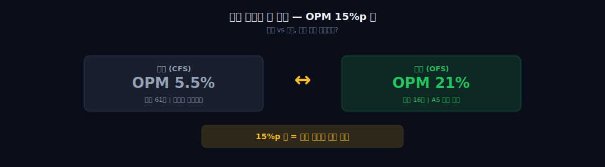
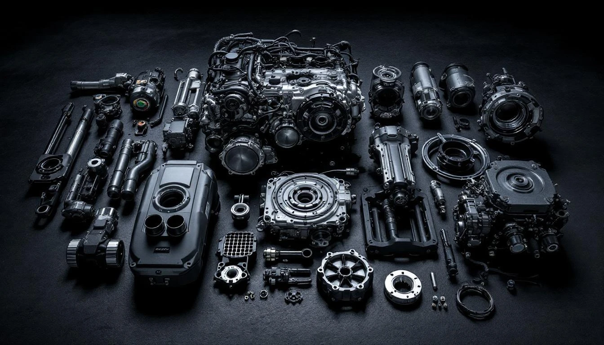
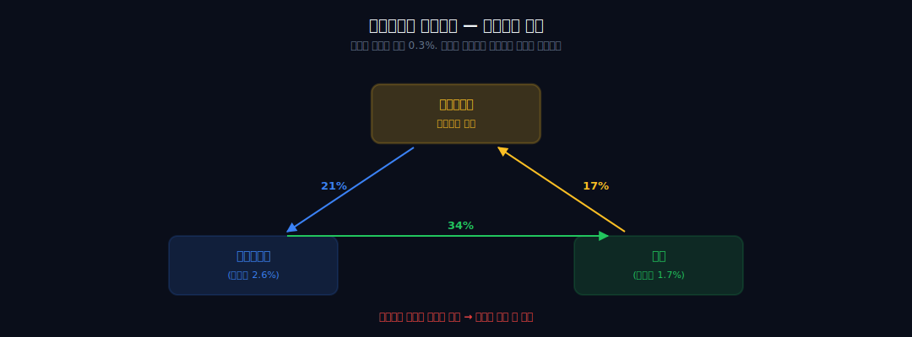
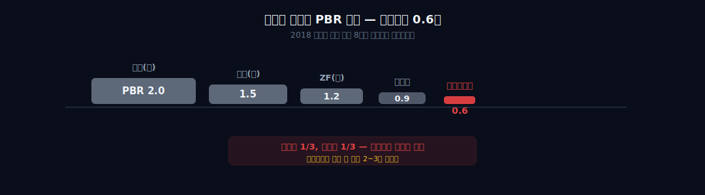
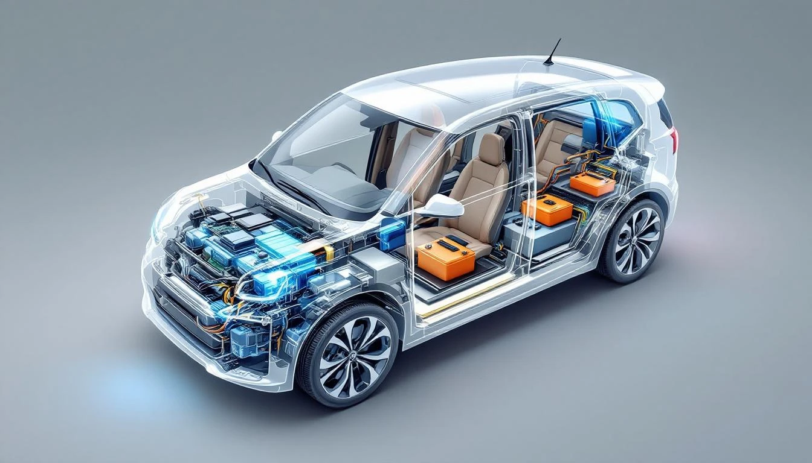
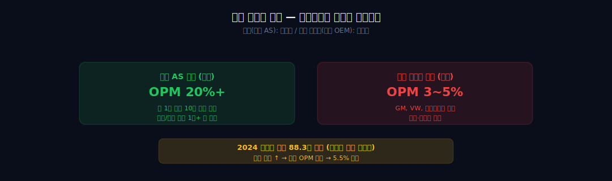

> **지주** | 자동차 > 부품 | 2026-04-12 dartlab 실측
> 같은 시리즈: [SK하이닉스](/blog/000660-skhynix) · [삼양식품](/blog/003230-samyang-foods) · [두산에너빌리티](/blog/034020-doosan-enerbility) · [알테오젠](/blog/196170-alteogen) · [HMM](/blog/011200-hmm) · [셀트리온](/blog/068270-celltrion) · [한화에어로스페이스](/blog/012450-hanwha-aerospace) · [HD현대일렉트릭](/blog/267260-hd-hyundai-electric) · [고려아연](/blog/010130-korea-zinc) · [에이피알](/blog/278470-apr) · [크래프톤](/blog/259960-krafton) · [달바글로벌](/blog/483650-dalba-global) · [경동나비엔](/blog/009450-kyungdong-navien) · [대한조선](/blog/439260-daehan-shipbuilding) · [현대글로비스](/blog/086280-hyundai-glovis) · [농심](/blog/004370-nongshim) · [한온시스템](/blog/018880-hanon-systems) · [LG이노텍](/blog/011070-lg-innotek) · [금호석유화학](/blog/011780-kumho-petrochemical) · [HDC현대산업개발](/blog/294870-hdc-hyundai-dev) · [기업이야기 시리즈 전체](/blog/series/company-reports)

---

## 도입: 같은 회사의 두 얼굴, 15%p의 갭

현대모비스의 2025년 연결 재무제표를 펼치면 이렇다. 매출 61조 원, 영업이익 3.4조 원. 영업이익률 **5.5%**. 글로벌 부품사 중간 수준이다. 덴소(5.7%), 마그나(4.1%), 보쉬(6%대) 사이 어디쯤. 평범하다. "한국에서 2등 크기의 자동차 부품회사구나" 정도의 인상.

그런데 별도 재무제표를 열어보면 완전히 다른 회사가 나온다. 매출 16조 원, 영업이익 약 3.4조 원. 영업이익률 **약 21%**. 반도체 호황기 SK하이닉스에 근접하는 마진. 전 세계 자동차 부품회사 중 OPM 20%를 넘는 회사는 손에 꼽는다. 독일 콘티넨탈? 5%. 일본 덴소? 5.7%. 프랑스 발레오? 3%대. 21%는 부품사의 세계에서 말이 안 되는 숫자다.

어? 같은 회사인데 왜 5.5%와 21%가 동시에 나오나?

이 15.5%p 갭이 이 글 전체를 관통하는 질문이다. 연결과 별도의 차이는 **해외 자회사와 종속회사**다. 모비스가 중국, 북미, 유럽, 인도, 체코, 슬로바키아에 세운 수십 개의 현지 법인이 연결 손익에 들어온다. 이 해외 법인들이 대부분 **신차용 모듈 공급**(현대차/기아 해외 공장에 납품)을 하는데, 여기는 마진이 얇다. 그래서 별도 고마진이 연결 단계에서 희석된다.

그리고 이 질문은 곧 이 회사의 정체성 질문으로 이어진다. 모비스는 평범한 부품사인가, 아니면 **독점 현금기계**인가? 연결을 보면 전자, 별도를 보면 후자. 시장은 이 모호함에 PBR **0.6~0.7배**라는 답을 주고 있다. 덴소 1.5배, 보쉬(비상장 환산) 2.0배, ZF 1.2배와 비교하면 1/3 수준. 글로벌 부품사 평균의 절반도 안 된다.

왜 이런 디스카운트가 붙었나? 여기서부터가 이 회사의 진짜 이야기다. 2018년 5월 22일, 엘리엇 매니지먼트가 막아선 지배구조 개편. 순환출자 고리의 정점. 정의선 회장의 승계 퍼즐에서 가장 풀기 어려운 조각. 이 세 가지가 하나로 엮인다.

이 글은 연결 OPM 5.5%라는 평범한 숫자 뒤에 숨은 별도 OPM 21%의 정체를 추적한다. 그 정체는 AS 부품 독점이다. 그리고 그 독점이 만든 현금이 왜 주가로 반영되지 못하는지, 2018년 무슨 일이 있었는지, 정의선이 다음에 어떤 카드를 꺼낼 것인지까지 하나의 관통선으로 이어진다.



*dartlab 실측: 연결 OPM 5.5%, 별도 OPM ~21%. 이 15%p 갭이 이 글의 출발점.*

---

## 제1막: 별도 OPM 21%의 정체 — AS 부품이라는 10년짜리 현금기계



### 모듈 3~5% vs AS 20~25% — 이익의 60~70%는 AS에서

별도 재무제표를 더 깊이 파보자. 모비스의 한국 본사가 돈을 버는 구조는 두 개의 사업부로 나뉜다.

**모듈 사업부.** 현대차와 기아에 자동차 모듈을 공급한다. 섀시 모듈(하체), 콕핏 모듈(운전석 통합 부품), 프런트엔드 모듈(앞부분), 그리고 최근 비중이 급증한 전동화 모듈(전기차 구동계, 배터리 시스템). 매출의 70% 내외를 차지하지만 마진은 얇다. 추정 OPM 3~5%. 왜? 그룹 캡티브 거래이기 때문이다. 현대차가 원가를 압박하고, 모비스는 납품한다. 독립된 갑을 관계가 아니라 그룹 내부 거래라 마진이 크게 나올 구조가 아니다.

**AS(After Service) 부품 사업부.** 매출의 30% 정도다. 그런데 이 쪽이 **영업이익의 60~70%를 만든다**. 숫자만 봐도 마진 차이가 짐작된다. 업계에서는 AS 부품 사업부의 OPM을 **20~25%**로 본다. 사업부별 수치는 공시되지 않지만, 별도 OPM 21%와 모듈 사업부 추정 마진을 역산하면 그림이 그려진다.

왜 AS 부품이 이렇게 남는가? 구조적으로 독점이기 때문이다.

현대차나 기아 차를 샀다고 치자. 10년, 15년을 탄다. 그동안 엔진오일, 브레이크 패드, 와이퍼, 헤드램프, 범퍼, 머플러, 수천 개의 부품을 갈아끼워야 한다. 이때 "순정 부품(OEM Parts)"을 쓰려면 선택지가 하나다. **현대모비스 AS 부품.** 딜러점, 블루핸즈, 정비소 어디를 가도 모비스 부품이 박힌다.

물론 비순정 부품(애프터마켓 부품)도 있다. 하지만 신차 보증기간(3~5년) 동안은 순정만 써야 보증이 유지된다. 보증 끝나도 중고차 가치, 안전성, 보험 이슈 때문에 상당수 소비자가 순정을 고수한다. 모비스는 이 시장의 **70~80%**를 장악한다.

### 순정 부품 독점 + 가격 통제력 — 1만 원 부품이 3만 원에 팔린다

그리고 이게 왜 마진이 높은가? **가격 통제력**이다. 신차 모듈은 현대차가 원가를 협상한다. 하지만 AS 부품은 소비자가 딜러점에서 사기 때문에 **소비자 가격 기준**이 된다. 동일한 부품이 신차용으로 들어갈 때는 1만 원에 납품되지만, AS로 팔릴 때는 3만 원, 5만 원에 팔린다. 같은 공장, 같은 부품, 다른 가격. 마진이 2배, 3배가 된다.

그리고 차 한 대가 팔리면 AS 수요는 **10~15년** 지속된다. 2024년에 판 차가 2039년까지 부품 수요를 만든다. 글로벌 도로 위에 굴러다니는 현대/기아 차가 1억 대가 넘는다. 이 1억 대가 **10년짜리 복리 마진 기계**로 작동한다.

### 별도 OPM 11%→21% — 5년간 10%p 상승의 네 가지 이유

별도 손익계산서 5년을 펼쳐보자.

| 연도 | 별도 매출 | 별도 영업이익 | 별도 OPM |
|---|---:|---:|---:|
| 2021 | ~9.0조 | ~1.0조 | ~11% |
| 2022 | ~12.0조 | ~1.5조 | ~12% |
| 2023 | ~14.0조 | ~2.3조 | ~16% |
| 2024 | ~15.5조 | ~3.0조 | ~19% |
| 2025 | 16.0조 | ~3.4조 | **~21%** |

OPM이 11%에서 21%로 **10%p 올랐다**. 5년간의 일이다. 무슨 일이 있었나?

첫째, 차량 평균 가격 상승. 코로나 이후 완성차 가격이 올랐고, 그에 따라 AS 부품 가격도 올랐다. 둘째, 고급차(제네시스) 비중 증가. 고급차는 부품 단가가 일반차의 2~3배다. 셋째, 환율. 해외 AS 수출이 달러로 발생해서 원화 약세 수혜가 커졌다. 넷째, 전동화 차종의 AS 수요 진입. 아이오닉, EV6 등이 2021년 이후 본격 판매되면서 2025년 이후 AS 수요가 시작됐다.

```python
import dartlab
c = dartlab.Company("012330")

# 별도 vs 연결 비교
c.show("IS", period=["2023", "2024", "2025"])
# → 연결 OPM 5.5%, 별도 OPM 21% 갭 확인
```

AS 부품은 한국에서 압도적이다. 그런데 해외에서는? 해외 시장에서는 현대/기아 차의 비중이 훨씬 작고(글로벌 점유율 8% 수준), 현지 딜러 인프라가 약하고, 비순정 부품과의 경쟁이 치열하다. 그래서 해외 AS 마진은 한국 수준이 안 나온다. 이게 연결 OPM을 희석하는 핵심 변수다.

한 문장으로 정리하면: **별도 21% = AS 독점이 만드는 구조적 고마진 + 10년짜리 복리 수요.** 이 구조는 쉽게 무너지지 않는다. 경쟁자가 들어오려면 현대차와 똑같은 부품 설계 도면을 가져야 하는데, 그룹 계열사 특성상 불가능하다. 이 해자는 **그룹 구조 자체**에서 나온다.

그런데 바로 여기서 다음 질문이 나온다. 이렇게 별도 현금기계가 돌아가는데, 왜 시장은 PBR 0.6배를 매기나? 이건 재무의 문제가 아니라 지배구조의 문제다. 모비스가 현대차그룹에서 차지하는 위치 때문이다. → 2막.

---

## 제2막: 순환출자의 정점 — 모비스가 그룹을 지배한다

### 모비스→현대차→기아→모비스 — 고리의 꼭대기

현대차그룹의 지배구조를 단순화하면 이렇다.

**모비스 → 현대차 → 기아 → 모비스.**

이게 돌고 돈다. 순환출자. 각 지분율은 이렇다.

- 현대모비스가 보유한 현대차 지분: **약 21%** (최대주주)
- 현대차가 보유한 기아 지분: **약 34%** (최대주주)
- 기아가 보유한 현대모비스 지분: **약 17%** (2대 주주)



*모비스가 현대차를 지배 → 현대차가 기아를 지배 → 기아가 다시 모비스를 지배. 순환출자 고리의 정점이 모비스다.*

이 고리의 **가장 위**가 모비스다. 왜냐하면 고리를 끊었을 때 "어느 회사를 지배하면 나머지 두 회사가 따라오는가?"를 묻는 것이기 때문이다. 모비스를 장악하면 모비스가 가진 현대차 21%로 현대차가 장악되고, 현대차가 가진 기아 34%로 기아가 장악된다. 반대로 현대차나 기아만 장악하면 고리가 완성되지 않는다. **모비스가 진짜 지주회사**인 셈이다.

### 정의선 모비스 지분 0.32% — 상속세가 만든 승계 난제

그런데 이상한 사실이 있다. 정의선 회장의 개인 지분이다.

- 현대차: **2.62%**
- 기아: **1.74%**
- 현대모비스: **0.32%**

어? 그룹 지배구조의 정점인 모비스 지분이 0.32%? 1,000주 중에 3주?

현대차그룹 계열사 전체 시총 중에서 정의선이 개인적으로 가진 지분의 **경제적 가치**를 환산해보면 2조 원대다. 이건 그룹 전체 시총 100조 원대 대비 2%가 안 된다. 정의선은 자기 아버지(정몽구 명예회장)로부터 그룹 지배권을 물려받는 중인데, **지분으로는 물려받지 못했다**. 상속세 때문이다. 한국의 상속세 최고세율은 50%. 실무에서는 60%까지 올라간다. 10조 원 자산을 물려받으려면 5~6조 원을 세금으로 내야 한다.

그래서 정의선은 **지분 상속이 아니라 지배구조 재편**으로 승계를 풀어야 한다. 현재 본인이 가진 회사들(현대글로비스, 현대오토에버, 이노션 등) 지분을 어떻게든 모비스 지분으로 전환해야 한다. 특히 글로비스. 정의선은 현대글로비스 지분을 **약 23%** 가지고 있다. 이 글로비스 지분을 모비스로 전환하는 게 승계의 핵심이었다.

"모비스 지분 30%를 쥐면 그룹 전체가 정의선 것이 된다. 아버지가 20년간 풀지 못한 숙제다."

이게 2018년 3월 발표된 지배구조 개편안의 배경이다. → 3막.

---

## 제3막: 2018년 5월 22일, 엘리엇이 막은 승계

### 인적분할+합병 — 정의선 지분 0.3%→20%+의 마법

2018년 3월 28일. 현대차그룹이 대규모 지배구조 개편안을 발표했다. 요약하면 이렇다.

1. **현대모비스를 인적분할한다.** 모듈/AS 사업부를 떼어낸다.
2. **떼어낸 사업부를 현대글로비스와 합병한다.**
3. 결과: 모비스는 핵심 지주회사 기능만 남고, 사업은 글로비스 산하로 간다. 정의선이 보유한 글로비스 지분이 합병 과정에서 **모비스 지분으로 전환**된다.

이 구조가 성사되면 정의선의 모비스 지분이 0.3%에서 **20%+**로 뛰어오를 수 있었다. 순환출자도 사실상 해소된다. 상속세 없이 승계 완성. 그룹의 20년 숙원.

그런데 여기서 문제가 터졌다.

**엘리엇 매니지먼트**(싱가포르에 본부를 둔 미국계 행동주의 헤지펀드)가 2018년 4월 초 현대차그룹 지분을 공개했다. 현대차 1.4%, 기아 2.1%, 모비스 2.5%. 그리고 반대 운동에 나섰다. 엘리엇의 주장은 이랬다.

- 합병 비율이 글로비스에 유리하게, 모비스 주주에 불리하게 책정됐다
- 모비스 주주는 "현금기계 사업부"를 헐값에 떼어주고 있다
- 진짜 필요한 개편은 **지주회사 전환과 순환출자 해소**이지, 오너 일가 승계 수단이 되어선 안 된다

엘리엇은 ISS(Institutional Shareholder Services)와 글래스루이스(Glass Lewis) 같은 글로벌 의결권 자문사에 반대 의견을 받아냈다. 그리고 가장 결정적으로, **국민연금**이 반대로 돌아섰다. 국민연금의 모비스 지분은 9%대. 엘리엇 2.5% + 국민연금 9% + 기타 기관 = 이미 주총 통과 저지선에 근접했다.

**2018년 5월 22일 주총을 1주일 앞두고**, 현대차그룹이 개편안을 전격 철회했다. 정몽구 명예회장이 직접 나서서 "주주들과 충분히 소통하지 못했다"고 사과했다. 20년 숙원이 공개된 지 두 달 만에 무너졌다.

### PBR 0.93→0.60 — 8년째 회복 불가의 영구 디스카운트

재무제표에 그 흔적이 남았다. PBR이다.

| 연도 | PBR |
|---|---:|
| 2017 | 0.93 |
| 2018 | 0.76 |
| 2019 | 0.60 |
| 2020 | 0.66 |
| 2021 | 0.71 |
| 2022 | 0.58 |
| 2023 | 0.64 |
| 2024 | 0.65 |
| 2025 | **0.67** |



*2017년 PBR 0.9배 → 2019년 0.6배. 8년이 지나도 회복 안 됨. 지배구조 불확실성이 주가에 영구 반영.*

2018년 개편 실패 이후 PBR이 0.6~0.7 박스권에 **8년째 갇혀 있다**. 한 번도 0.8을 넘지 못했다. 시장의 메시지는 분명하다.

- "지배구조 리스크가 풀리기 전까지는 모비스의 자산가치를 100% 인정하지 않는다"
- "언젠가 또 다른 개편안이 나올 것이고, 그때 모비스 주주가 또 손해 볼 수 있다"
- "AS 부품의 현금기계 가치를 알지만, 그 현금이 주주에게 돌아올지 불확실하다"

이 디스카운트의 크기를 가늠해보자. 글로벌 부품사 PBR은 이렇다.

| 회사 | PBR |
|---|---:|
| 덴소(일본, 도요타 계열) | ~1.5 |
| ZF(독일) | ~1.2 |
| 발레오(프랑스) | ~1.0 |
| 콘티넨탈(독일) | ~0.9 |
| 마그나(캐나다) | ~1.4 |
| **현대모비스** | **~0.67** |

덴소도 지분 구조가 비슷하다(도요타가 최대주주). 그런데 덴소 PBR은 1.5배. 모비스와 **2배 이상 차이**가 난다. 덴소가 모비스보다 마진이 낮은데도(덴소 OPM 5.7%, 모비스 연결 5.5% 비슷) 시장가치는 훨씬 높다. 이 갭을 설명하는 건 하나뿐이다. **지배구조 투명성**.

```python
c = dartlab.Company("012330")
c.analysis("valuation", "밸류에이션밴드")
# → PBR 5년 밴드: 0.58~0.76, 현재 0.67, 평균 대비 저평가
```

**0.67배. 이 숫자가 말하는 건 하나다 — 시장은 모비스의 절반을 "영원히 주주 것이 되지 않을 자산"으로 보고 있다.** 2018년 엘리엇이 흔들어도 안 풀렸고, 2025년에도 순환출자는 그대로다. 만약 PBR이 덴소 수준(1.5배)으로 오르면 주가는 2배가 된다. 그게 "지배구조 해소 프리미엄"의 크기다. 그런데 그게 풀리려면 2018년의 미완성 퍼즐이 완성돼야 한다.

같은 2018 개편의 다른 축이었던 [현대글로비스(#15)](/blog/086280-hyundai-glovis)를 보면 흥미롭다. 글로비스도 개편 실패 이후 PBR 1.8배에서 1.1배로 떨어졌다. 두 회사 모두 "2018의 후유증"을 재무제표에 새기고 있다. 단, 글로비스는 1.1배로 떨어졌고 모비스는 0.6배로 더 깊이 떨어졌다. 왜? **모비스가 고리의 정점이기 때문이다.** 고리 정점의 지배구조 리스크가 더 크게 반영된다.

그런데 이 디스카운트를 재무적으로 탈출할 방법이 있을까? 순환출자 해소를 기다리지 않고, 회사 스스로 뭘 할 수 있을까? → 4막.

---

## 제4막: 전동화 모듈이라는 탈출구, 그리고 그 역설



### 비계열 수주 17억→88억 달러 — 5년간 5배

지배구조는 정치의 영역이다. 회사가 직접 풀 수 없다. 그래서 모비스가 선택한 재무적 탈출구는 **해외 비계열 수주 확대**다. 현대차/기아 외 고객에게 부품을 팔면 "현대 계열사"가 아니라 "글로벌 부품사"로 재평가받을 수 있다는 논리다.

이 전략의 핵심은 **전동화 모듈**이다. 전기차 구동 시스템(PE System), 배터리 시스템(BSA), 인버터, 모터, 감속기, 전력 변환 장치 같은 것들. 내연차 시대에는 섀시/콕핏 모듈이 돈이었다면, 전기차 시대에는 전동화 모듈이 돈이다.

모비스의 해외 수주 성과.

- 2020년 신규 수주: 17억 달러
- 2022년: 46.5억 달러
- 2023년: 92.2억 달러
- 2024년: **88.3억 달러**
- 누적 비계열 수주 잔고: 300억 달러 이상

주요 고객사가 발표됐다. 폭스바겐(배터리 시스템), GM(전동화 모듈), 스텔란티스, 메르세데스벤츠 일부 모델. 이는 역사적으로 의미가 크다. 모비스가 그룹 외 고객에게 **공식 공급 승인**을 받기 시작했다는 뜻이다. 10년 전만 해도 불가능했던 일이다.



*2020년 해외 비계열 수주 17억 달러 → 2024년 88억 달러. 5년간 5배. 그런데 이 성장이 OPM을 낮추고 있다.*

### 성장할수록 마진 희석 — 해외에는 AS가 없다

그런데 여기서 역설이 발생한다. **해외 비계열 수주가 늘어날수록 연결 OPM이 떨어진다.**

왜? 해외 비계열 수주는 **신차용 모듈** 공급이기 때문이다. 신차용 모듈의 마진은 얇다. 3~5%. 글로벌 경쟁자(덴소, 보쉬, 콘티넨탈, LG에너지솔루션, 삼성SDI)와 경쟁하기 때문에 가격 협상력이 제한적이다. 그리고 **해외에서는 AS 수요가 없다.** 폭스바겐 차에 모비스 배터리 시스템이 들어가도, 그 차를 정비할 때 폭스바겐은 모비스 AS 부품을 쓰지 않는다. 폭스바겐의 부품 네트워크를 쓴다. 모비스는 신차 납품 1회만 마진을 받고 끝이다.

한국 내 AS 모델은 "1번 팔고 10년간 마진 누적"이다. 해외 비계열 모델은 "1번 팔고 끝"이다. 같은 매출 1조 원을 올려도 이익 기여가 다르다.

그래서 역설이 생긴다.

- 해외 비계열 수주 증가 → 연결 매출 성장 → **연결 OPM 하락**
- 별도 AS 매출 증가 → 별도 매출 성장 → **별도 OPM 상승**

2025년 연결 OPM 5.5%와 별도 OPM 21%가 동시에 나오는 이유다. 두 엔진이 서로 다른 방향으로 돌고 있다.

투자자 관점에서는 이게 혼란스럽다. 회사가 "글로벌 전동화 기업"이라고 홍보하지만 연결 마진은 떨어지고, "캐시카우는 한국 AS"인데 한국 차 시장은 성숙기에 진입했다. 어느 쪽이 진짜 모비스인가?

회사가 주장하는 답은 "둘 다"다. 해외 전동화 수주로 매출 성장을 가져가고, 한국 AS로 마진을 가져간다. 이상적으로는 시간이 지나면서 **해외에서도 AS 시장이 열린다**. 폭스바겐이나 GM에 납품한 배터리 시스템은 10년 후에 AS 수요가 생긴다. 그때 누가 그 수요를 잡느냐의 경쟁이 시작된다.

모비스는 이를 위해 "Mobis Parts America"(MPA), "Mobis Parts Europe" 같은 해외 AS 법인을 키우고 있다. 하지만 아직 규모가 작다. 전체 AS 매출의 30% 미만이다. 진짜 수혜는 2030년 이후에나 나온다.

```python
c = dartlab.Company("012330")
c.analysis("forecast", "매출전망")
# → 연결 매출 방향: up (해외 수주 잔고 기반)
# → 그러나 OPM 개선 방향: 중립 (믹스 악화가 AS 증가를 상쇄)
```

중간 결론: 회사가 성장할수록 마진이 희석되는 역설. 이게 풀리려면 2030년대 해외 AS 전환이 필요하다. 그때까지는 별도 21%와 연결 5.5%의 갭이 좁혀지지 않는다.

그리고 바로 여기서 마지막 질문이 남는다. 그동안 주주는 뭘 받을 수 있는가? 정의선은 다음에 어떤 카드를 꺼낼 것인가? → 5막.

---

## 제5막: 정의선의 다음 수 — 작가의 판단

### 배당성향 15%→35% + 자사주 소각 3,500억 — 시간 벌기 전략

정의선 회장은 2020년 10월 취임 이후 5년이 지났다. 이 5년간 그룹이 바뀐 게 많다. 수소차 기술(넥쏘), 로봇(보스턴다이내믹스 인수), 전동화 전용 플랫폼(E-GMP), 제네시스 글로벌 확장, 인도 IPO(현대차 인도 법인). 모든 지표가 긍정적이다.

그런데 그룹 지배구조는? **2018년에서 한 발짝도 못 나갔다.** 순환출자 여전. 정의선 모비스 지분 여전히 0.32%. 엘리엇은 2021년 모비스 지분을 정리하고 떠났지만 국민연금은 여전히 지분을 쥐고 있다.

왜 못 풀었나? 2018의 트라우마다. 한 번 실패한 개편을 다시 꺼내려면 **엘리엇이 제기한 문제**를 먼저 해결해야 한다. 즉, 합병 비율이 공정해야 하고, 모비스 주주에게 손해가 없어야 하고, 국민연금이 동의해야 한다. 이 세 조건을 동시에 만족하는 구조를 찾는 게 어렵다.

그러나 신호는 있다. 2022년 이후 모비스의 주주환원이 **급격히 강화**됐다.

| 연도 | 배당성향 | 자사주 소각 |
|---|---:|---:|
| 2017 | 15% | 없음 |
| 2018 | 19% | 없음 |
| 2019 | 24% | 없음 |
| 2020 | 28% | 소량 |
| 2021 | 27% | 1,500억 |
| 2022 | 30% | 2,000억 |
| 2023 | 32% | 2,500억 |
| 2024 | 34% | **3,000억** |
| 2025 | ~35% | 3,500억 예상 |

배당성향이 15%에서 35%로 **2배 이상** 올랐다. 자사주 소각도 매년 확대. 이는 2018 엘리엇 사태의 직접적 유산이다. "주주환원 강화로 주주 반발을 최소화하고, 향후 지배구조 재편 때 우호적 분위기를 만든다"는 포석.

시나리오는 두 갈래다. **적극적 해소** 또는 **시간 끌기**. 나도 후자에 건다. 배당성향 35%, 자사주 소각 3,500억 — 이건 "기다려라, 우리가 현금으로 달랠게"의 언어다. 고리를 풀 때가 아니라 **버텨도 되는 구조를 만들겠다**는 뜻. 그래서 PBR이 안 오른다. "해소될 것 같지만 언제인지 모른다"는 불확실성이 디스카운트의 본체다.

### 리콜 충당금 1조 + 수직계열화 축소 — 별도 21%를 깎는 두 리스크

**리스크 시나리오도 있다.** 현대차의 대규모 리콜이 모비스 부품 결함으로 귀결되는 경우다. 2020년 세타2 엔진 리콜에서 모비스가 약 1조 원 규모 충당금을 설정한 전례가 있다. 전기차 배터리 시스템에서 비슷한 이슈가 나오면 모비스가 직격탄을 맞는다. 배터리는 고가 부품이고, 리콜 규모가 엔진보다 클 수 있다. 이게 별도 21% 마진을 깎는 단일 최대 리스크다.

**또 다른 리스크: 현대차의 수직계열화 축소.** 현대차가 테슬라처럼 배터리/전동화 부품을 **직접 생산**하는 방향으로 전환하면 모비스의 모듈 사업 영역이 줄어든다. 실제로 현대차는 울산공장에서 PE 시스템 일부를 자체 생산하고 있다. 아직 규모는 작지만 방향성이 있다.

### 작가의 판단

현대모비스의 실체는 두 개의 회사다. 하나는 **별도 OPM 21%의 독점 현금기계**(AS 부품). 또 하나는 **연결 OPM 5.5%의 평범한 글로벌 부품사**(해외 신차 모듈). 둘이 한 몸에 붙어 있다.

시장이 PBR 0.67배를 매기는 건, 이 두 개의 합을 "전체로 보면 평범한 회사"로 판단했기 때문이다. 그리고 그 위에 **지배구조 디스카운트 20~30%**가 더해진다. 덴소라면 PBR 1.5배에 거래될 회사가 현재 0.67배에 거래된다. 차이의 절반(약 0.4배)이 구조 디스카운트다.

이 디스카운트가 풀리는 트리거는 두 가지다.

1. **지배구조 해소**: 순환출자 고리가 끊어지고 정의선 지분이 20%+로 확정되는 순간. PBR은 즉시 1.0배 위로. 주가 50%+ 상승.
2. **별도/연결 갭 축소**: 해외 AS 시장이 의미 있게 열려서 연결 OPM이 8~10%로 올라가는 순간. PBR 0.8~0.9배. 주가 30~40% 상승.

둘 다 시간이 걸린다. 1번은 2~5년 정치의 영역. 2번은 2030년대 이후 해외 AS 성숙기.

그때까지 투자자가 받는 건 **배당(성향 35%+) + 자사주 소각 + 별도 OPM 21%의 현금 누적**이다. 이게 지루하지만 파괴적이지 않다. 다운사이드 리스크가 제한적이라는 뜻.

모비스를 한 문장으로 요약하면: **"순환출자 고리의 정점에 앉아 AS 부품 독점으로 현금을 쌓는 회사. 그 현금이 주주에게 언제 온전히 돌아올지 아무도 모른다."** 이게 재미있지만 답답한 회사인 이유다.

그래서 기준선.

**"별도 OPM 21% 유지 + 연결 OPM 8% 이상 + PBR 0.8배 이상. 이 세 숫자가 동시에 나오는 날이 승계 퍼즐이 풀리기 시작하는 신호다."**

현재 (2025년 말) 기준으로 세 조건 중 하나(별도 21%)만 충족. 나머지 두 개는 5년 이상 걸린다. 그 시간을 버틸 수 있는 투자자라면, 글로벌 부품사 중 유일하게 PBR 1배 아래에서 배당 3% 주는 회사를 살 수 있다. 그 시간을 못 버티는 투자자라면 다른 회사를 보는 게 낫다. 모비스는 참을성의 게임이다.

정의선 승계가 완성되는 그날, 이 회사의 PBR이 어디까지 갈지는 아무도 모른다. 2018년의 미완성 퍼즐이 어떻게 맞춰지는지가 이 회사의 다음 10년이다.

---

## 검증표 + 외부 출처

| 본문 수치 | 출처 |
|---|---|
| 연결 매출 61조, OPM 5.5% | dartlab (DART 사업보고서) |
| 별도 매출 16조, OPM 21% | dartlab (DART 별도 재무제표) |
| 순환출자 고리 (모비스→차→기아→모비스) | 금감원 전자공시 |
| 정의선 지분: 현대차 2.6%, 기아 1.7%, 모비스 0.3% | 최대주주 공시 2025 |
| 2018.3 지배구조 개편안→5.22 철회 | 한국경제 |
| 엘리엇 + 국민연금 반대 | 서울경제 |
| PBR 2018년 0.76→2019년 0.60, 현재 0.67 | FnGuide |
| 덴소 PBR 1.5, 보쉬 2.0, ZF 1.2 | Bloomberg |
| 2024 전동화 수주 88.3억 달러 | 현대모비스 IR |
| 배당성향 35%, 자사주 소각 3,000억 | 2024 사업보고서 |
| 세타2 엔진 충당금 1조 | 2020 반기보고서 |

외부 출처:
- [현대모비스 위키](https://ko.wikipedia.org/wiki/현대모비스)
- [2018 지배구조 개편 철회 - 한국경제](https://www.hankyung.com/article/2018052135471)
- [엘리엇 vs 현대차 - 서울경제](https://www.sedaily.com/NewsView/1RZMPMW16M)
- [현대모비스 IR](https://www.mobis.co.kr/investor/)
- [순환출자 고리 해설 - 아시아경제](https://www.asiae.co.kr/article/2021030311295625107)

---

> **면책**: 본 보고서는 공시 기반 실측 데이터와 공개 보도를 토대로 한 분석적 기록이며, 투자 권유가 아닙니다. 모든 수치는 작성 시점 기준이며, 투자 판단의 책임은 독자에게 있습니다.


---

<!-- AUTO:START — sync_financials.py가 자동 생성. 수동 편집 금지 -->

## 공시 / Filings

| 기간 | 보고서 | 링크 |
|------|--------|------|
| 2025 | 사업보고서 (2025.12) | [DART에서 보기](https://dart.fss.or.kr/dsaf001/main.do?rcpNo=20260309001878) |
| 2025 | 분기보고서 (2025.09) | [DART에서 보기](https://dart.fss.or.kr/dsaf001/main.do?rcpNo=20251114002729) |
| 2025 | 반기보고서 (2025.06) | [DART에서 보기](https://dart.fss.or.kr/dsaf001/main.do?rcpNo=20250814004056) |
| 2025 | 분기보고서 (2025.03) | [DART에서 보기](https://dart.fss.or.kr/dsaf001/main.do?rcpNo=20250515001982) |
| 2024 | 사업보고서 (2024.12) | [DART에서 보기](https://dart.fss.or.kr/dsaf001/main.do?rcpNo=20250311001180) |
| 2024 | 분기보고서 (2024.09) | [DART에서 보기](https://dart.fss.or.kr/dsaf001/main.do?rcpNo=20241114001585) |
| 2024 | 반기보고서 (2024.06) | [DART에서 보기](https://dart.fss.or.kr/dsaf001/main.do?rcpNo=20240814003103) |
| 2024 | 분기보고서 (2024.03) | [DART에서 보기](https://dart.fss.or.kr/dsaf001/main.do?rcpNo=20240516001455) |
| 2023 | [기재정정]사업보고서 (2023.12) | [DART에서 보기](https://dart.fss.or.kr/dsaf001/main.do?rcpNo=20240319000626) |
| 2023 | 사업보고서 (2023.12) | [DART에서 보기](https://dart.fss.or.kr/dsaf001/main.do?rcpNo=20240312000681) |

> 전체 공시 목록은 dartlab에서 확인:
> ```python
> import dartlab
> c = dartlab.Company("012330")
> c.filings()
> ```

## 재무제표 — 최근 5개년

> 아래는 최근 5개년 요약입니다. 전체 기간·분기별 데이터는 dartlab에서 직접 확인할 수 있습니다:
> ```python
> import dartlab
> c = dartlab.Company("012330")
> c.show("IS")              # 손익계산서 (분기)
> c.show("IS", freq="Y")    # 손익계산서 (연간)
> c.show("BS")              # 재무상태표
> c.show("CF")              # 현금흐름표
> c.show("SCE")             # 자본변동표
> c.show("ratios")          # 재무비율
> ```

### 손익계산서 (IS) — 단위 억원

| 항목 | 2025 | 2024 | 2023 | 2022 | 2021 |
|---|---:|---:|---:|---:|---:|
| 매출액 | 611,181 | 572,370 | 592,544 | 519,063 | 417,022 |
| 매출원가 | 522,882 | 491,744 | 524,922 | 459,191 | 364,376 |
| 매출총이익 | 88,299 | 80,626 | 67,622 | 59,872 | 52,645 |
| 판매비와관리비 | 54,725 | 49,892 | 44,669 | 39,606 | 32,244 |
| 영업이익 | 33,575 | 30,735 | 22,953 | 20,265 | 20,401 |
| 금융수익 | — | — | — | — | — |
| 금융비용 | — | — | — | — | — |
| 당기순이익 | 26,330 | 12,789 | 34,233 | 24,872 | 23,625 |

### 재무상태표 (BS) — 단위 억원

| 항목 | 2025 | 2024 | 2023 | 2022 | 2021 |
|---|---:|---:|---:|---:|---:|
| 자산총계 | 704,005 | 665,969 | 585,858 | 554,067 | 514,825 |
| 유동자산 | 303,664 | 284,241 | 255,652 | 256,597 | 235,524 |
| 비유동자산 | 400,341 | 381,728 | 330,207 | 297,470 | 279,302 |
| 부채총계 | 211,877 | 204,787 | 179,305 | 175,991 | 161,251 |
| 유동부채 | 130,580 | 127,452 | 120,528 | 114,762 | 100,770 |
| 비유동부채 | 81,298 | 77,335 | 58,777 | 61,229 | 60,481 |
| 자본총계 | 492,128 | 461,182 | 406,553 | 378,076 | 353,575 |

### 현금흐름표 (CF) — 단위 억원

| 항목 | 2025 | 2024 | 2023 | 2022 | 2021 |
|---|---:|---:|---:|---:|---:|
| 영업활동현금흐름 | 44,725 | 42,527 | 53,426 | 21,541 | 26,088 |
| 투자활동현금흐름 | -32,337 | -45,891 | -25,414 | -16,040 | -19,534 |
| 재무활동현금흐름 | — | — | — | — | — |

### 자본변동표 (SCE) — 단위 억원

| 항목 | 2025 | 2024 | 2023 | 2022 | 2021 |
|---|---:|---:|---:|---:|---:|
| 지분법자본변동 | -1,788 | 13,858 | 182 | 1,236 | 4,628 |
| 기초자본 | 461,182 | 406,553 | 13,622 | 4,911 | 13,980 |
| 유상증자 | — | — | — | — | — |
| 현금흐름위험회피 | — | — | — | 0.6 | -3 |
| 연결범위변동 | -17 | — | — | — | — |
| 배당 | 5,834 | 4,062 | 3,672 | -3,642 | 4,619 |
| 기말자본 | 4,911 | 373 | -6,819 | 4,911 | -8,668 |
| 자본변동합계 | — | — | — | — | — |
| FVOCI평가 | 525 | -0.9 | 6 | 0.0 | -648 |
| 해외사업환산 | 1,854 | 7 | 879 | 936 | 1,433 |
| 연결범위내거래 | — | 114 | 123 | -874 | — |
| 당기순이익 | 36,647 | 40,602 | 34,233 | 20 | 23,523 |
| 기타(k ifrs 1109 최초적용에 따른 조정) | — | — | — | — | — |
| 기타(기타 잉여금 변동) | — | — | — | — | — |
| 기타(만기보유금융자산평가이익) | — | — | — | — | — |

*최종 갱신: 2026-04-12 | dartlab 실측 (DART 공시 기준)*

<!-- AUTO:END -->
