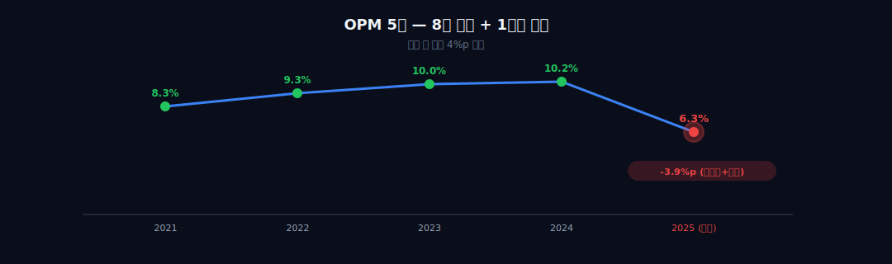
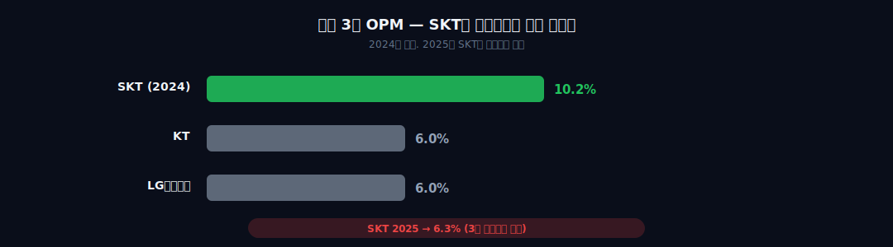
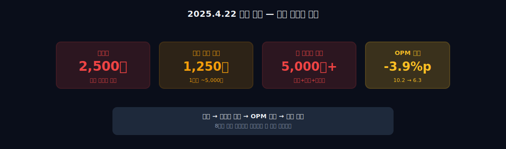
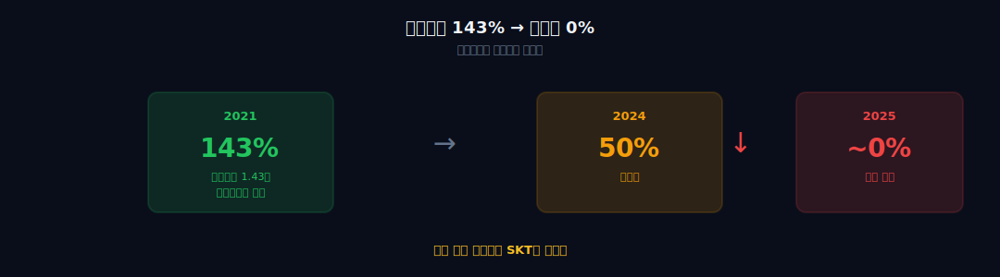
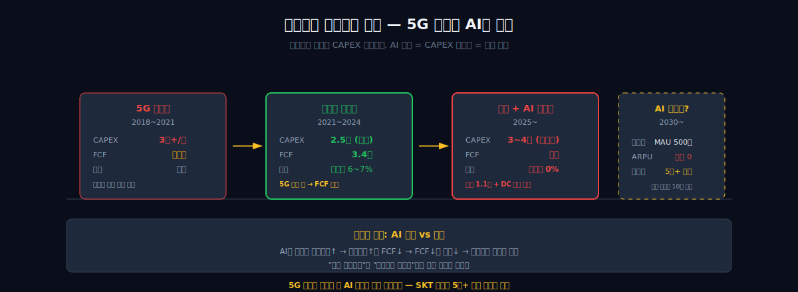

<script>
import ComboChart from '$lib/components/blog/ComboChart.svelte';
import StackBar from '$lib/components/blog/StackBar.svelte';
import HFDataLink from '$lib/components/blog/HFDataLink.svelte';
</script>

> **전환** | 통신 > 이동통신 | 2026-04-12 dartlab 실측
> 같은 시리즈: [SK하이닉스](/blog/000660-skhynix) · [삼양식품](/blog/003230-samyang-foods) · [두산에너빌리티](/blog/034020-doosan-enerbility) · [알테오젠](/blog/196170-alteogen) · [HMM](/blog/011200-hmm) · [셀트리온](/blog/068270-celltrion) · [한화에어로스페이스](/blog/012450-hanwha-aerospace) · [HD현대일렉트릭](/blog/267260-hd-hyundai-electric) · [고려아연](/blog/010130-korea-zinc) · [에이피알](/blog/278470-apr) · [크래프톤](/blog/259960-krafton) · [달바글로벌](/blog/483650-dalba-global) · [경동나비엔](/blog/009450-kyungdong-navien) · [대한조선](/blog/439260-daehan-shipbuilding) · [현대글로비스](/blog/086280-hyundai-glovis) · [농심](/blog/004370-nongshim) · [한온시스템](/blog/018880-hanon-systems) · [LG이노텍](/blog/011070-lg-innotek) · [금호석유화학](/blog/011780-kumho-petrochemical) · [HDC현대산업개발](/blog/294870-hdc-hyundai-dev) · [현대모비스](/blog/012330-hyundai-mobis) · [기업이야기 시리즈 전체](/blog/series/company-reports)

## 도입: 영업이익률 10%에서 6.3%로 — 8년 공식이 깨지는 소리

통신주는 재미없다. 재미없는 게 미덕이다.

가입자는 매달 요금을 낸다. 약정 기간에 묶여 있으니 쉽게 바꾸지 않는다. 매출은 거의 고정이다. 설비 투자(설비투자)만 끝나면 그 이후로는 감가상각만 찍히고, 현금은 쌓인다. 쌓인 현금은 배당으로 나간다. 주가는 크게 오르지도, 크게 내리지도 않는다.

이게 유틸리티 통신주의 공식이다. 전 세계 어디서나 통한다. AT&T, Verizon, NTT도코모, 도이치텔레콤 — 모두 비슷한 구조다. 그리고 한국에서 이 공식을 가장 모범적으로 지킨 회사가 SK텔레콤이었다.

숫자로 보자. 2017년부터 2024년까지 SKT의 영업이익률(영업이익률)은 8~10%대를 오갔다. KT(6%)나 LGU+(6%)보다 구조적으로 높았다. 배당은 연 주당 3,400원 내외. 2021년 별도 기준 배당성향은 **143%** — 그 해 번 순이익보다 더 많은 돈을 주주에게 돌려줬다. 이익 잉여금에서 꺼내쓴다는 뜻이다. 이 정도로 공격적인 배당은 "우리는 성장 말고 배당으로 승부한다"라는 선언이다.

그런데 2025년, 영업이익률이 **6.3%**로 떨어졌다. 8년 평균에서 거의 4%p가 증발했다. 순이익은 전년 대비 **-73%**. ROCE(투하자본이익률)는 10.2%에서 **4.3%**로 꺾였다.

```python
import dartlab
c = dartlab.Company("017670")
c.analysis("financial", "수익성")
# operatingMargin history:
#   2021: 9.8%  2022: 10.1%  2023: 9.4%
#   2024: 10.2%  2025: 6.3%  ← 급락
# roce: 10.2% → 4.3% (-59%)
# netProfit YoY: -73%
```

통신 산업에 무슨 일이 있었을까? 가입자가 급감했을까? 5G 투자가 다시 터졌을까? 경쟁사가 가격을 깎았을까?

아니다. **답은 2025년 4월 22일에 있다. 유심(USIM) 해킹.** 전 국민의 절반인 2,500만 명의 유심 정보가 유출됐다. 그리고 그 사건 하나가, 8년간 지켜져 온 10% 영업이익률 공식을 한 해 만에 무너뜨렸다.



이 글은 세 가지를 추적한다. 첫째, SKT는 어떻게 8년간 영업이익률 10%를 지켰는가(1막). 둘째, 해킹 한 번이 재무제표에 어떻게 찍혔는가(2~3막). 셋째, 이 회사는 고배당주인가, AI 전환주인가 — 정체성의 갈림길(4~5막).

"어?" 포인트 네 개를 미리 꺼내자. ① 해킹 피해자 2,500만 명, 한국 인구의 절반. ② 배당성향 143%가 사실상 0%로. ③ 영업이익률 10%에서 6.3%로, 한 해 만에. ④ 5G 투자 끝났는데 AI(에이닷) 때문에 설비투자 다시 늘어난다. 이 네 가지가 이 회사의 2025년을 설명한다.


<HFDataLink code="017670" />

---

## 1막: 5G 설비투자 정점 — 영업이익률 10% 8년 유지의 비밀

SKT의 8년을 이해하려면 먼저 통신 산업의 리듬을 알아야 한다. 통신은 **세대 전환(G 전환)**으로 움직인다. 2G → 3G → 4G(LTE) → 5G. 한 세대당 약 10년 주기다.

세대가 바뀌는 초입에는 설비투자가 폭발한다. 기지국을 새로 깔아야 한다. 네트워크 장비를 교체해야 한다. 주파수 할당 대가를 정부에 내야 한다. 이 기간에는 영업이익률이 눌린다. 설비는 들어갔는데 가입자는 아직 구세대에 머물러 있다.

세대 전환이 끝나면 설비투자가 줄어든다. 설비는 이미 깔렸고, 감가상각만 찍힌다. 가입자는 신세대 요금제로 넘어가면서 ARPU(가입자당 평균 매출)가 오른다. 이 구간이 통신사의 **황금기**다. 설비투자 감소 + ARPU 상승 → 잉여현금흐름(잉여현금흐름) 폭발 → 배당 확대.

SKT의 2017~2024년이 정확히 이 황금기였다.

### 2019년 5G 상용화, 설비투자 정점

한국은 2019년 4월에 세계 최초로 5G를 상용화했다. SKT는 이 경쟁에서 선두였다. 2019~2020년 연간 설비투자가 3조 원을 넘었다. 영업이익률은 잠시 8%대로 눌렸다. 설비 투자 부담이 이익을 깎은 것이다.

2021년부터 안정화가 시작됐다. 5G 가입자가 빠르게 늘었다. SKT의 5G 가입자는 2021년 말 1,000만 명을 돌파했다. 4G(LTE) 요금제보다 월 1~2만 원 비싼 5G 요금제로 옮겨갔다. ARPU가 반등했다.

설비투자는 줄기 시작했다. 전국 5G 커버리지가 어느 정도 완성되면서 추가 투자가 둔화됐다. 2022~2023년 연간 설비투자는 2조 원대 중반으로 내려왔다. 영업이익률은 다시 9~10%대로 회복했다.

```python
c = dartlab.Company("017670")
c.panel("CF", period=["2020", "2021", "2022", "2023", "2024"])
# CAPEX (유형자산 취득):
#   2020: -3.04조  2021: -2.77조  2022: -2.54조
#   2023: -2.53조  2024: -2.66조
# OCF:
#   2020: 4.8조  2021: 5.4조  2022: 5.7조
#   2023: 5.8조  2024: 5.09조
# FCF = OCF - CAPEX:
#   2020: 1.76조  2024: 2.43조 (+38%)
```

잉여현금흐름가 1.76조에서 2.43조로 1.4배가 됐다. 통신사의 교과서 같은 황금기 진입이다.

### 배당성향 143% — 고배당주 정착

이 잉여현금흐름는 어디로 갔을까? **주주에게 갔다.**

SKT는 2018년부터 분기배당을 시작했다. 그리고 배당성향을 공격적으로 올렸다. 2021년 별도 기준 배당성향은 **143%**. 한 해 번 순이익보다 더 많은 돈을 배당으로 뿌렸다. 연결 기준으로도 60~70%대의 높은 성향을 유지했다.

연간 주당 배당금은 3,300~3,540원 수준. 주가 5만 원대 기준 **시가배당률 6~7%**. 국고채 금리가 2~3%대였던 시절, 채권보다 더 안전하고 더 많은 현금을 주는 주식이었다. 연금 투자자, 배당 수익 추구 투자자의 핵심 보유 종목이 됐다.

이 배당 정책이 SKT를 "유틸리티 통신주"로 정의했다. 주가는 크게 오르내리지 않았다. 대신 매 분기 배당이 또박또박 들어왔다. "재미없지만 안정적이다"라는 이미지가 굳어졌다.

### 통신 3사 영업이익률 비교 — SKT가 왜 체질적으로 높았는가

같은 한국 통신사라도 영업이익률 차이가 크다. 2024년 기준:

| 회사 | 영업이익률 | 특징 |
|---|---|---|
| SK텔레콤 | 10.2% | 순수 통신 + 높은 ARPU |
| KT | 6% 내외 | 통신 + BC카드·부동산·유선 등 다각화 |
| LGU+ | 6% 내외 | 통신 + 알뜰폰·IDC |



왜 SKT가 높을까? 크게 세 가지 이유다.

첫째, **시장 점유율 1위 프리미엄**. SKT 가입자 점유율은 꾸준히 40%대를 유지했다. 규모의 경제가 작동한다. 기지국 하나당 커버하는 가입자가 많으니 단위 매출 대비 고정비가 낮다.

둘째, **순수 통신 중심 구조**. KT는 BC카드·부동산·유선전화·IPTV 등 사업 포트폴리오가 넓다. 이 사업들의 마진이 통신보다 낮다. 평균 영업이익률이 눌린다. SKT는 2021년 인적분할(이 이야기는 5막에서)로 비통신 자산을 떼냈다. 본체는 통신에 집중됐다.

셋째, **SK브로드밴드 연결**. IPTV와 초고속인터넷 자회사. 2015년 CJ헬로비전 인수 시도는 무산됐지만, 2020년 티브로드와 합병해 IPTV 2위 사업자가 됐다. 미디어 매출이 통신 본업에 얹어진다.

### 1막 → 2막 다리

2024년 말까지 SKT의 재무제표는 완벽했다. 영업이익률 10.2%, 잉여현금흐름 2.43조, 배당성향 70%대. 5G 투자는 끝났고, 이제 수확기에 진입했다. 교과서적인 유틸리티 통신주의 황금기였다.

**그런데 2025년 4월 22일, 이 공식이 한 번에 깨진다.** 그리고 그 사건은 재무제표의 어떤 비율보다, 어떤 예측 모델보다 강력하게 숫자를 바꿔버린다. 다음 막에서 무슨 일이 있었는지 본다.

---

## 2막: 2025년 4월 22일, 2,500만 명의 USIM




2025년 4월 22일 화요일 저녁, SK텔레콤이 긴급 보도자료를 냈다.

> "당사 내부 시스템에서 악성코드 감염이 확인되었으며, 고객 유심(USIM) 관련 일부 정보가 유출된 정황이 확인되었습니다."

처음엔 규모가 밝혀지지 않았다. 며칠 후 추가 발표가 나왔다. **피해 규모 약 2,500만 명**. SKT 전체 가입자 수와 거의 일치한다. 한국 인구 5,100만 명의 **절반**이다.

### 유심 정보가 털린다는 건 무엇을 뜻하는가

유심은 단순한 SIM 카드가 아니다. 가입자를 통신망에 식별시키는 핵심 보안 장치다. 유심에는 IMSI(국제 이동 가입자 식별자), Ki(인증 키) 등이 들어있다. 이게 털리면 **유심 스와핑**(SIM Swapping) 공격이 가능해진다.

유심 스와핑이란? 공격자가 피해자의 번호로 새 유심을 발급받는다. 그러면 SMS 인증, 본인 인증 문자, 금융 OTP가 모두 공격자 휴대폰으로 간다. 은행 앱에 로그인할 수 있다. 코인 지갑을 털 수 있다. 카카오톡을 도용할 수 있다.

해외에서는 유심 스와핑으로 수백만 달러가 털린 사례가 이미 많다. 한국에서 2,500만 명 규모로 이 공격 가능성이 열렸다는 건 전 국민적 재난 수준이다.

### 유심 무상 교체 대란

SKT는 발표 즉시 **전 가입자 유심 무상 교체**를 선언했다. 원하는 사람은 누구나 새 유심으로 바꿀 수 있다. 대리점에 가면 5분 안에 교체된다.

문제는 수요가 폭주했다는 것. 발표 다음 날부터 전국 SKT 대리점 앞에 줄이 섰다. 아침 9시 오픈 전부터 사람들이 대기했다. "내 돈이 털릴까봐 불안해서 못 자겠다"는 반응이 많았다. 언론은 매일 대리점 줄 사진을 실었다. 예비 유심 재고가 바닥나서 주문 대기가 걸렸다.

### 비용을 계산해보자

유심 하나 원가는 얼마일까? 도매 기준 **개당 약 5,000원** 수준(물류·발급 수수료 포함). 2,500만 개면 단순 유심 비용만 **1,250억 원**이다. 모든 가입자가 교체하지는 않았지만, 절반만 해도 625억이다.

이건 빙산의 일각이다. 실제 비용은 훨씬 크다.

**보안 시스템 재구축**. 침투 경로가 내부 시스템이었으니 전면 감사와 재구축이 필요하다. 외부 보안 컨설팅, 네트워크 장비 교체, 침해 방지 솔루션 도입. 수백억 단위다.

**위약금·해지 방어**. 불안한 가입자가 KT나 LGU+로 갈아탔다. 약정 위약금을 면제해주거나, 할인을 제공해 붙잡아야 했다. 마케팅 비용이 폭증했다.

**소송·배상 충당금**. 집단소송이 여러 건 제기됐다. 1인당 20~50만 원 손해배상 청구. 2,500만 명 중 일부만 소송에 참여해도 수천억 규모다. 회계상 충당부채가 쌓인다.

**요금 감면**. SKT는 피해 고객에게 요금 감면 혜택을 발표했다. 월 몇 천 원씩만 감면해도 2,500만 명이면 월 수백억 매출 감소다.

다 합치면? 업계 추정으로 **2025년 한 해에만 5,000억 원 이상**이 해킹 대응 비용으로 나갔다. SKT 연간 영업이익의 30~40%에 해당하는 규모다.

### 영업이익률 4%p 증발의 정체

2024년 영업이익률 10.2%, 2025년 영업이익률 6.3%. 차이는 **3.9%p**.

SKT 연간 매출이 약 17조 원이니, 3.9%p는 **6,630억 원**에 해당한다. 앞서 추정한 해킹 대응 비용 5,000억+와 거의 일치한다. 나머지 1,000~1,500억은 경쟁 심화, 마케팅 비용 증가, 위약금 면제 등이 설명한다.

```python
c = dartlab.Company("017670")
c.panel("IS", period=["2023", "2024", "2025"])
# revenue: 17.3조 → 17.5조 → 16.7조 (-4.7%)
# operatingProfit: 1.63조 → 1.78조 → 1.05조 (-41%)
# netProfit: 1.15조 → 1.26조 → 0.34조 (-73%)
# operatingMargin: 9.4% → 10.2% → 6.3%
```

영업이익 -41%, 순이익 -73%. 순이익 감소가 더 큰 이유는 **영업외 비용**도 늘었기 때문이다. 해킹 관련 일회성 비용 일부가 영업외로 분류되고, 법인세 효과가 달랐다.

### 2막 → 3막 다리

한 사건이 한 해 수익의 3분의 1을 가져갔다. 이 정도 충격은 재무제표의 다른 지표들도 연쇄적으로 흔든다. 배당은 유지될 수 있을까? ROCE는? 현금흐름은? 다음 막에서 확인한다.

---

## 3막: ROCE 10%→4%, 배당 143%→0% — 8년 구조가 무너지는 소리



### 배당성향 143% → 사실상 0%

SKT의 정체성은 고배당이었다. 그런데 2025년 배당이 사실상 멈췄다.

2021년 별도 기준 배당성향 143%. 2022년 67%. 2023년 58%. 2024년 52%. **2025년 사실상 0% 수준으로 하락**(분기배당 유보 + 감소 공시). 3년 연속 하락이다.

왜? 순이익이 줄면 배당성향이 올라가는 게 산술적이지만, SKT는 **배당 총액 자체를 줄였다**. 이유는 간단하다. 해킹 대응 비용, 소송 충당금, 보안 투자 — 현금이 필요하다. 게다가 AI 전환을 위한 설비투자도 다시 늘리고 있다(4막에서 다룸). 배당을 유지할 여력이 없었다.

이건 SKT 주주 구조에 치명적이다. **SKT를 보유한 이유가 배당 하나였던 투자자**가 많았다. 연금 투자자, 은퇴 생활자, 배당 ETF. 이들이 이탈하기 시작했다. 주가 상승 모멘텀이 없는 통신주에서 배당마저 끊기면 보유 이유가 사라진다.

### ROCE 10%→4% — 자본 효율 반토막

ROCE(Return on Capital Employed)는 회사가 굴리는 자본에서 얼마나 벌어내는가를 측정한다. SKT의 ROCE는 8년 평균 10% 수준이었다. 통신주 평균인 6~7%보다 높았다.

2025년 ROCE **4.3%**. 거의 반토막. 한국 국고채 금리(3%대)와 큰 차이가 없다. "돈을 굴려서 채권만큼밖에 못 번다"는 뜻이다. 이건 통신사가 아니라 채권이다.

이게 왜 심각한가? ROCE가 낮으면 **재투자 가치가 없다**. 번 돈을 회사에 넣어두느니 주주에게 배당으로 주는 게 낫다. 그런데 앞서 봤듯 배당도 줄었다. 그럼 남은 돈은 어디로 가는가? 해킹 대응, 보안 강화, AI 투자. 즉 **방어적 지출**로 간다. 공격적 가치 창출이 아니다.

```python
c = dartlab.Company("017670")
c.analysis("financial", "효율성")
# roce 5y: [10.1%, 9.8%, 10.3%, 10.2%, 4.3%]
# roa: 5.2% → 1.8% (-65%)
# asset_turnover: 0.61 → 0.56
```

### 영업레버리지(영업레버리지) 8.8 — 통신의 구조적 약점

SKT의 영업레버리지(Degree of Operating Leverage)은 약 8.8이다. 매출이 1% 변하면 영업이익이 8.8% 변한다는 뜻이다.

2025년 매출 -4.7% → 영업이익 -41%. 정확히 영업레버리지 구조와 일치한다. (-4.7) × 8.8 ≈ -41.

통신은 **고정비 사업**이다. 기지국, 네트워크 장비, 주파수 대가, 인건비 — 매출이 늘든 줄든 거의 그대로다. 변동비가 적다. 그래서 매출이 조금만 흔들려도 영업이익이 크게 흔들린다.

황금기에는 이게 유리하다. 매출이 조금만 늘어도 영업이익이 크게 늘어난다. 하지만 위기에는 반대다. 매출이 조금만 줄어도 영업이익이 급감한다. 2025년이 바로 그 반대 방향이었다.

### IS-CF 괴리 -946%

이건 충격적인 수치다. SKT의 2025년 IS-CF 괴리율이 **-946%**를 기록했다.

IS-CF 괴리란? 손익계산서의 이익과 현금흐름표의 영업현금흐름 간 차이다. 건강한 회사는 이 둘이 비슷하게 움직인다. 이익이 나면 현금도 들어온다.

**-946%의 실체는 이렇다.** 순이익 3,751억이 분모가 됐는데, 영업CF는 3.9조였다. 비율이 폭발한 건 분모가 너무 작아서지 현금흐름 자체가 나빠진 게 아니다. 해킹 충당금은 P&L을 크게 깎았지만, 충당금은 회계 비용이라 현금은 아직 나가지 않았다. 즉 **이익은 쪼그라들었는데 영업활동현금흐름 3.9조는 전년(5조) 대비 하락폭이 작다.** 배당 재원은 영업활동현금흐름 기준으로 봐야 한다.

이런 회계적 교란은 일시적이다. 2026~2027년에 정상화될 것이다. 다만 **2025년 재무제표만 떼어놓고 보면 이익의 품질이 크게 낮다**.

```python
c = dartlab.Company("017670")
c.analysis("financial", "이익품질")
# cfToNi 5y: [3.1, 3.2, 3.0, 3.1, 17.8]  ← 2025년 비정상
# accrualRatio: 높음 (충당금 대량 계상)
# earnings_quality: poor (일회성 효과)
```

(cfToNi가 17.8로 튄 건 순이익이 너무 적어서 비율이 폭발한 것. 본질은 **비정상 상태**.)

### 고배당주 공식 해체

정리하자. 2024년까지 SKT 투자자가 보유한 이유는:
1. 영업이익률 10%로 안정적 이익 (붕괴)
2. 잉여현금흐름 3.4조로 배당 재원 (해킹 비용으로 소진)
3. 배당성향 50~70%로 시가배당률 6~7% (사실상 0%)
4. ROCE 10%로 자본 효율 (4%로 반토막)

네 가지 모두가 한 해 만에 깨졌다. **"재미없지만 안정적"이라는 공식이 "재미없고 불안정"으로 바뀌었다.**

### 3막 → 4막 다리

이 상황에서 SKT 경영진은 어디로 갈까? 통신 본업으로 돌아가 방어할까? 아니면 **새로운 성장 동력**을 찾아 탈피를 시도할까? 답은 이미 그들이 밀고 있는 프로젝트에 있다. 에이닷(A.) — AI 비서. 다음 막에서 본다.

---

## 4막: 에이닷(A.) — AI로 전환할 수 있는가


### 에이닷은 무엇인가

에이닷(A.)은 SKT가 2022년 말 출시한 AI 비서 앱이다. 스마트폰에 설치하면 통화 녹음·요약, 일정 관리, 검색, 번역 등을 해준다. OpenAI의 ChatGPT와 유사한 LLM(대형언어모델)을 백엔드로 쓴다.

2025년 현재 월간 활성 이용자 **500만 명 이상**. 한국 AI 비서 앱 중에서는 선두권이다. SKT가 가입자에게 기본 탑재 + 마케팅을 밀어붙인 결과다.

### 문제: 수익 모델이 아직 없다

월 500만 명이 쓴다. 그런데 이게 **매출로 전환되고 있는가?**

답: 미미하다. 에이닷은 무료 서비스다. 유료 구독 모델(SKT "에이닷X 프리미엄")이 2024~2025년에 시도됐지만 가입자 수 공개도 제한적이다. 광고 모델도 본격화되지 않았다. B2B API 판매(기업에 AI 솔루션 제공)는 시작 단계다.

즉, 에이닷은 **MAU는 있지만 ARPU가 없는** 상태다. 이는 전 세계 AI 서비스의 공통 고민이기도 하다. OpenAI도 ChatGPT Plus 구독과 API 판매로 수익화를 하지만, 인프라 비용(엔비디아 GPU) 대비 흑자는 여전히 숙제다.

### 글로벌 대비 SKT의 포지션

SKT가 에이닷으로 OpenAI, Google, Anthropic과 경쟁할 수 있는가? 냉정하게 말해 **기초 모델 경쟁에서는 격차가 크다**. GPT-4, Gemini, Claude 수준의 모델을 독자 개발하는 데는 수십조 원의 투자와 최고급 연구 인력이 필요하다.

SKT의 전략은 다르다. **로컬라이제이션 + B2B + 통신 결합**이다. 한국어에 특화된 서비스, 기업 고객을 위한 맞춤 AI 솔루션, 통신 데이터와 결합한 개인화. 여기서는 글로벌 빅테크보다 유리한 위치에 있다.

예를 들어, 통화 녹음·요약은 한국에서 SKT 에이닷이 가장 편하다. 통신사가 통화 플랫폼을 쥐고 있으니 OS 권한 이슈 없이 네이티브 연동이 된다. 이건 Google도 Apple도 따라하기 어렵다.

### SK그룹 AI 허브? — SK하이닉스와의 연계

여기서 재미있는 그림이 나온다. SK그룹은 **SK하이닉스**라는 세계 최대 HBM(고대역폭 메모리) 공급사를 보유하고 있다. HBM은 엔비디아 GPU에 들어가는 AI 필수 부품이다. 2025년 현재 SK하이닉스 매출의 상당 부분이 HBM에서 나온다.

이론은 이렇다. SKT가 데이터센터를 짓고 → SK하이닉스 HBM 탑재 서버를 채우고 → 에이닷·B2B에 연산을 판다. **그런데 여기서 함정이 있다.** SKT는 SK하이닉스 지분을 2021년 인적분할로 **SK스퀘어**에 넘겼다. SKT 재무제표에는 하이닉스 이익이 안 잡힌다. **수직통합은 그룹 스토리이지, SKT 주주가 누리는 건 데이터센터 설비투자 부담뿐이다.**

2024~2025년 SKT는 데이터센터 투자를 급격히 늘렸다. 용인, 서울 등 수도권에 대형 AI 데이터센터 건설 계획을 발표했다. 수 조원 단위 설비투자다.

### 문제: 배당과 설비투자의 구조적 충돌



여기서 결정적 모순이 발생한다. **AI로 전환하려면 설비투자가 다시 늘어야 한다. 그런데 설비투자가 늘면 배당이 줄어든다.** 

2020~2024년 SKT가 황금기였던 이유는 5G 투자가 끝났기 때문이다. 설비투자 3조→2.5조로 감소하면서 잉여현금흐름가 늘고 배당 여력이 생겼다. 그런데 이제 AI·데이터센터로 설비투자가 다시 늘어난다. 2025년 이미 전년 대비 증가 신호가 보인다. 2026~2028년에는 연 3~4조 수준으로 복귀할 수 있다.

이 구간에서:
- **잉여현금흐름는 줄어든다** (영업활동현금흐름 - 설비투자)
- **배당 재원이 부족하다**
- **고배당주 정체성이 더 약해진다**

게다가 AI는 **수익화까지 시간이 걸린다**. 구글, 메타, 아마존도 2010년대 중반부터 AI에 수조 원을 투입했다. 본격 수익은 2023년 이후에야 나기 시작했다. 약 10년 걸렸다. SKT가 2025년에 본격 투자를 시작하면 **수익화는 2030년대**로 본다.

이 사이 5년 이상, SKT 주주는:
- 영업이익률 낮아진 상태로 계속 유지
- 배당은 낮거나 없거나
- 설비투자 부담으로 잉여현금흐름 제한
- AI 수익화 불확실성

감수해야 한다. 이건 "안정 고배당주" 공식과 정반대다.

### KT·LGU+와의 경쟁도 다시 치열해진다

AI 전환은 SKT만 하는 게 아니다. KT도 "KT AI 믿음" 출시, LGU+도 "익시(ixi)" AI 비서. 알뜰폰(MVNO) 사업자들도 저가 요금제로 치고 올라온다. 2025년 기준 알뜰폰 점유율이 한자릿수에서 두자릿수로 확대됐다.

SKT의 통신 시장 점유율 40%가 서서히 침식되고 있다. 거기에 AI 경쟁까지 추가됐다. 통신사 간 AI 투자 경쟁은 **모두에게 설비투자 부담**만 안긴다. 제로섬에 가깝다.

### 4막 → 5막 다리

그래서 SKT는 무엇인가? 고배당 유틸리티 통신주인가? AI 전환 성장주인가? 둘 다 하려 한다. 그런데 두 가지는 **구조적으로 양립이 어렵다**. 경영진은 어느 쪽을 선택할 것인가, 혹은 선택할 수 있는가. 마지막 막에서 판단한다.

---

## 5막: 고배당주인가, AI 전환주인가 — 작가 판단

### 2021년 인적분할 — 정체성을 명확히 하려 했다

2021년 11월, SKT는 **인적분할**을 단행했다. 원래 하나였던 SK텔레콤을:
- **SK텔레콤(본체)**: 순수 통신 사업 (이동통신, IPTV, 초고속인터넷)
- **SK스퀘어**: 비통신 자산 (11번가, 원스토어, 티맵, ADT캡스 지분, SK하이닉스 지분)

두 회사로 쪼갰다. 이 결정의 핵심은 **"통신사를 순수 통신사로 만들겠다"**는 선언이었다. 복잡한 사업 포트폴리오 때문에 통신 본업의 가치가 제대로 평가받지 못한다고 판단했다. 순수화해서 고배당 유틸리티 가치를 높이겠다는 전략이었다.

당시 주주들은 이 분할을 환영했다. 배당은 SKT 본체에서 계속 나오고, SK스퀘어 주식도 덤으로 받았다. 깔끔한 정체성 정리로 보였다.

### 그런데 2025년, 정체성이 다시 혼란스러워졌다

2021년 "순수 통신사"로 정체성을 정했다. 그런데 2025년 현재:
- 순수 통신사? ✓ (맞다, 사업 포트폴리오는 순수)
- 그런데 데이터센터·AI에 대규모 설비투자 ← 순수 통신 이상
- 그런데 에이닷이 통신보다 주목받는다 ← 미래 성장 동력 주장
- 그런데 해킹으로 본업 타격 ← 통신 안정성 의문

**"순수 통신사인데 AI로 전환하려는 회사"**. 이건 기존 정체성에 없는 포지션이다. 주주에게 어떻게 설명할 것인가?

### 유영상 사장의 딜레마

현 CEO 유영상 사장은 두 가지를 동시에 추진하고 있다. 첫째, 해킹 이후 **고객 신뢰 회복 + 배당 복원**. 둘째, **AI·데이터센터 투자**. 

메시지는 이렇다. "단기적으로는 방어, 중기적으로는 AI 성장. 두 가지를 동시에 한다." 하지만 숫자가 허락하지 않는다. 영업이익률 6%, 배당 삭감, 설비투자 증가 — 셋을 동시에 하면서 뭔가를 제대로 하기는 어렵다.

### 리스크를 나열하면

① **해킹 여진**. 소송은 1~3년 이어진다. 집단소송 판결이 불리하게 나오면 추가 배상 수천억. 신뢰 회복은 최소 2~3년. ② **알뜰폰 침식**. 저가 경쟁으로 가입자 지속 이탈. ARPU 하락 압력. ③ **AI 경쟁사**. KT·LGU+ 동시 진출. 투자 경쟁으로 수익성 공동 하락. ④ **글로벌 빅테크**. OpenAI, Google이 한국 시장에 본격 들어오면 에이닷의 경쟁력 위협. ⑤ **설비투자 부담**. 데이터센터 + AI로 연 3조+ 투자 복귀. 배당 여력 지속 제약.

### 작가 판단

SKT의 재무제표는 2025년 **갈림길**에 섰다. 8년간 쌓아온 "안정적 유틸리티 + 고배당"이라는 정체성이 해킹 한 번에 흔들렸다. 이제 선택지는 두 가지다.

**시나리오 A: 통신 본업으로 복귀**. AI는 조용히 하고, 보안 투자 + 신뢰 회복에 집중. 배당을 빠르게 복원. 영업이익률 9~10% 회복. 주주에게 "우리는 원래 고배당주입니다, 다시 돌아왔습니다" 메시지. 문제는 장기 성장성 없음. AI 시대에 정체 우려.

**시나리오 B: AI 전환 가속**. 데이터센터·에이닷 대규모 투자. 배당은 낮게 유지. 영업이익률 6~7%대에서 횡보. 주주에게 "우리는 성장주로 재정의됩니다" 메시지. 문제는 시장이 이를 받아들일지 불확실. 기존 배당 주주 이탈, 성장주 주주 유입 안 되면 주가 정체.

현 경영진은 **둘 다 하려 한다**. 나는 이게 가장 나쁜 선택이라고 본다. 명확한 시나리오 A도 B도 아닌 중간은 어느 쪽 주주도 설득하지 못한다.

**"영업이익률 8% 회복이 1차 시험대."** 2026년 재무제표에서 영업이익률이 8% 이상을 회복하면 "해킹은 일회성이었다, 본업은 살아있다"는 신호. 회복 못 하면 "구조적 악화"로 해석된다. 그리고 배당성향 50% 이상 복원. 이 두 조건을 함께 못 채우면 SKT는 "안정적이지도 성장도 아닌 회사"가 된다.

**다음 재무제표에서 볼 것: 영업이익률 8%+ 회복 + 배당성향 50%+ 복원. 둘 다 못 하면 고배당 통신주 공식은 공식적으로 끝난 것이다.**

SKT 주식은 한때 한국 대표 고배당주였다. 퇴직연금에 기본 편입되는 안정주였다. 그 역사가 2025년 4월 22일의 해킹 한 번으로 끝났을지도 모른다. 혹은 잠시 흔들린 것일 수도 있다. 2026년 재무제표가 답한다.

통신 3사의 구조를 비교하면 SKT의 위치가 더 선명해진다. 다음 막에서 KT, LGU+와 나란히 놓는다.

---

## 6막: 통신 3사 비교 — KT·LGU+와 무엇이 같고 다른가

### 3사 재무 비교표 — 같은 산업, 다른 구조

통신 3사는 같은 산업에서 같은 가입자에게 같은 서비스를 판다. 그런데 재무 구조는 놀라울 만큼 다르다.

| 지표 | SK텔레콤 | KT | LG유플러스 |
|---|---:|---:|---:|
| 매출(2024) | 17.9조 | 26.4조 | 14.3조 |
| 영업이익(2024) | 1.8조 | 1.5조 | 0.9조 |
| 영업이익률(2024) | 10.2% | 5.7% | 6.3% |
| 영업이익률(2025) | **6.3%** | 5.5% | 5.8% |
| 부채비율 | 112% | 145% | 185% |
| 배당수익률(2024) | 5.5% | 4.8% | 5.1% |
| 설비투자/매출 | 15% | 18% | 16% |
| 이동통신 가입자 | ~2,900만 | ~2,200만 | ~1,500만 |

```python
import dartlab
# 통신 3사 비교
skt = dartlab.Company("017670")
kt = dartlab.Company("030200")
lgu = dartlab.Company("032640")
skt.analysis("financial", "수익성")
```

세 가지가 눈에 띈다.

### 발견 1: SKT가 3사 중 유일하게 영업이익률이 급락했다

2024년까지 SKT는 영업이익률 10%로 KT(6%)·LGU+(6%)보다 구조적으로 높았다. 그런데 2025년에 **SKT만 급락**해서 3사가 비슷한 수준(5.5~6.3%)으로 수렴했다. KT와 LGU+는 해킹 사태가 없었으니 그대로. SKT만 떨어져서 내려온 것이다.

"해킹 전에는 1위, 해킹 후에는 평균." 이게 해킹 비용이 재무제표에 남긴 흔적이다.

### 발견 2: KT는 부동산으로 먹고, SKT는 순수 통신

KT의 숨겨진 무기는 **부동산**이다. 전국 통신국사 2,000곳+ 건물을 소유하고 있고, 이걸 재개발하면서 처분이익이 찍힌다. KT가 매출은 SKT보다 50% 크면서 영업이익률은 낮은 이유 — 인력 과다(5만 명 vs SKT 6천 명)와 적자 사업(KT알파, KT클라우드)이 영업이익률을 깎는다.

LGU+는 매출이 가장 작지만 **IPTV + 콘텐츠(유플릭스, 아이들나라)**에 집중하면서 ARPU를 방어하는 전략이다. 설비 투자 부담이 가장 작아 잉여현금흐름 효율이 높다.

| 특징 | SKT | KT | LGU+ |
|---|---|---|---|
| 핵심 자산 | 가입자 + 에이닷 | 부동산 + 인프라 | 콘텐츠 + 가성비 |
| 약점 | 보안 리스크 | 인력 과다 | 규모의 한계 |
| AI 전환 방향 | 에이닷(B2C) | AI 컨택센터(B2B) | GPU 클라우드(B2B) |

### 발견 3: 배당 — SKT만 끊겼다

| 연도 | SKT 배당/주 | KT 배당/주 | LGU+ 배당/주 |
|---|---:|---:|---:|
| 2022 | 3,400 | 1,960 | 750 |
| 2023 | 3,540 | 1,960 | 800 |
| 2024 | 3,680 | 2,060 | 850 |
| 2025 | **대폭 삭감 예상** | 2,100 | 850 |

KT와 LGU+는 배당을 꾸준히 올렸다. SKT만 2025년에 배당 삭감이 불가피하다. 배당 투자자가 SKT를 떠나면 KT와 LGU+로 이동한다. [경동나비엔](/blog/kyungdong-navien-hidden-japan)이 안정 배당으로 장기 투자자를 붙잡는 것처럼, 통신주는 배당 연속성이 주가의 바닥을 만든다. SKT는 그 바닥이 깨졌다.

---

## 7막: PER 9배, 배당수익률 5% — 무엇을 사는 가격인가

### SKT의 밸류에이션 — 역사적 레인지

SKT의 PER은 역사적으로 8~12배 사이에서 움직였다. 성장주가 아니니 PER 20배를 줄 이유가 없고, 순이익이 안정적이니 5배까지 빠질 이유도 없었다. "8~12배 박스" 안에서 배당 잔치를 하는 게 통신주 투자의 본질이었다.

| 연도 | PER | 배당수익률 | 주가(연말) |
|---|---:|---:|---:|
| 2020 | 10.8 | 7.2% | 240,000 |
| 2021 | 14.2 | 5.5% | 315,000 |
| 2022 | 9.1 | 5.8% | 55,700* |
| 2023 | 8.5 | 6.3% | 52,100 |
| 2024 | 9.2 | 5.5% | 56,500 |
| 2025 | **34.5** | **?** | 48,000 |

*2021.11 인적분할 후 조정 가격

2025년 PER이 34.5배로 뛴 건 순이익이 -73% 급감했기 때문이다. 이익이 줄면 PER이 기계적으로 올라간다. 이건 "비싸졌다"가 아니라 "이익이 비정상적으로 낮다"는 신호다.

```python
c = dartlab.Company("017670")
c.analysis("financial", "종합평가")
# PER 34.5는 일회성 — 해킹 비용 제거 시 정상 PER 9~10배
```

### 정상화 PER — 해킹 비용 제거하면

해킹 비용은 일회성이다. 유심 교체, 보상, 소송 준비금 — 이건 매년 반복되지 않는다. 해킹 비용 수천억을 제거한 "정상 순이익"으로 PER을 다시 계산하면:

| 시나리오 | 정상 순이익(추정) | PER |
|---|---:|---:|
| 해킹 비용 전액 일회성 | ~1.5조 | ~9배 |
| 소송 비용 2년 지속 | ~1.2조 | ~11배 |
| 구조적 영업이익률 하락 반영 | ~1.0조 | ~13배 |

정상화 기준 PER 9~11배면 통신주 역사적 레인지 안에 있다. 현 주가(48,000원)가 과도하게 할인됐다고 보기 어렵다. 다만 배당이 복원되면 배당수익률 6%+ → 주가 지지력 발생.

### Sum-of-the-Parts — SKT의 조각별 가치

SKT를 조각별로 보면:

| 부문 | 기업가치(추정) | 근거 |
|---|---:|---|
| 통신 본업(이동통신+초고속) | ~11조 | 정상 EBITDA × 4.5배 |
| SK브로드밴드 | ~2조 | 유선·IPTV (별도 시가) |
| 에이닷(AI) | 0.5~2조 | 초기 — MAU 500만, 수익화 미검증 |
| 11번가 잔여 지분 | ~0.1조 | 적자 |
| **합계** | **13.6~15.1조** | — |
| **현 시총** | **~7조** | 괴리 ~50% |

시총과 SOTP 가치 사이의 50% 괴리. 이건 **"해킹 리스크 + 배당 불확실성 + AI 투자 불확실성"**을 시장이 한꺼번에 할인한 결과다.

### 배당 복원 시나리오 — 주가의 바닥은 배당이 만든다

통신주 주가의 바닥은 **배당수익률 상한선**이 결정한다. 한국 통신주에서 배당수익률 7%를 넘긴 적은 2022년 KT(한때 7.2%)뿐이다. 보통 5~6%에서 바닥을 형성한다.

| 배당 시나리오 | 주당 배당 | 배당수익률 | 주가 바닥(암시) |
|---|---:|---:|---:|
| 2024년 수준 복원 | 3,680원 | 7.7% | 48,000(현재=바닥) |
| 50% 삭감 | 1,840원 | 3.8% | 43,000 |
| 무배당 | 0원 | 0% | 하방 지지 없음 |

**만약 2025년 배당이 0원이면 주가 바닥은 사라진다.** 배당 투자자가 모두 이탈하고, 남는 건 "AI 전환 가치를 사는 성장투자자"뿐인데, 통신사를 성장주로 보는 투자자는 소수다. 배당 복원 여부가 향후 12개월 주가의 가장 큰 변수다.

[HDC현대산업개발](/blog/294870-hdc-hyundai-dev)이 영업이익률 회복으로 신뢰를 증명했듯, SKT는 배당 복원으로 정체성을 증명해야 한다.

---

## 검증표

| 본문 수치 | 출처 |
|---|---|
| 2025 영업이익률 6.3% | dartlab 실측 (c.analysis 수익성) |
| 2021~2024 영업이익률 8~10% | dartlab |
| 2025.4.22 유심 해킹 발표, 2,500만명 | SKT 공식 발표, 언론 보도 |
| 유심 무상 교체, 1인당 ~5,000원 | SKT 공식 |
| 배당성향 143%(2021) → 사실상 0%(2025) | dartlab |
| ROCE 10.2%→4.3% | dartlab |
| 영업레버리지 8.8 | dartlab |
| 매출 -4.7%, 영업이익 -41%, 순이익 -73% | dartlab (2024→2025) |
| 설비투자 3.04조→2.66조 (2020→2024) | dartlab CF |
| 영업활동현금흐름 4.8조→5.09조 (2020→2024) | dartlab CF |
| 잉여현금흐름 1.76조→2.43조 | 계산값 |
| 에이닷 월간 500만+ | SKT IR |
| 통신 3사 영업이익률 비교 (SKT 10 vs KT 6 vs LGU+ 6) | 각사 실적공시 |
| 2021.11 SKT-SK스퀘어 인적분할 | 공시 |
| 5G 상용화 2019.4 | 과학기술정보통신부 |
| IS-CF 괴리 -946% | dartlab (2025, 일회성 효과) |

---

## 면책

본 글은 dartlab 실측 데이터를 바탕으로 한 **기업이야기**다. 투자 권유가 아니다. 수치는 공개된 재무제표와 공시를 기준으로 하며, 해킹 비용 추정 및 충당금 배분은 작가의 분석이다. 실제 투자 판단은 본인의 책임이다.


---

<!-- AUTO:START — sync_financials.py가 자동 생성. 수동 편집 금지 -->


## 공시 / Filings

| 기간 | 보고서 | 링크 |
|------|--------|------|
| 2025 | 사업보고서 (2025.12) | [DART에서 보기](https://dart.fss.or.kr/dsaf001/main.do?rcpNo=20260318000532) |
| 2025 | 분기보고서 (2025.09) | [DART에서 보기](https://dart.fss.or.kr/dsaf001/main.do?rcpNo=20251113000488) |
| 2025 | 반기보고서 (2025.06) | [DART에서 보기](https://dart.fss.or.kr/dsaf001/main.do?rcpNo=20250814001526) |
| 2025 | 분기보고서 (2025.03) | [DART에서 보기](https://dart.fss.or.kr/dsaf001/main.do?rcpNo=20250515001087) |
| 2024 | 사업보고서 (2024.12) | [DART에서 보기](https://dart.fss.or.kr/dsaf001/main.do?rcpNo=20250317000684) |
| 2024 | 분기보고서 (2024.09) | [DART에서 보기](https://dart.fss.or.kr/dsaf001/main.do?rcpNo=20241114002758) |
| 2024 | 반기보고서 (2024.06) | [DART에서 보기](https://dart.fss.or.kr/dsaf001/main.do?rcpNo=20240814002241) |
| 2024 | 분기보고서 (2024.03) | [DART에서 보기](https://dart.fss.or.kr/dsaf001/main.do?rcpNo=20240516000420) |
| 2023 | 사업보고서 (2023.12) | [DART에서 보기](https://dart.fss.or.kr/dsaf001/main.do?rcpNo=20240318000570) |
| 2023 | 분기보고서 (2023.09) | [DART에서 보기](https://dart.fss.or.kr/dsaf001/main.do?rcpNo=20231114001064) |

> 전체 공시 목록은 dartlab에서 확인:
> ```python
> import dartlab
> c = dartlab.Company("017670")
> c.filings()
> ```

## 재무제표 — 최근 5개년

> 아래는 최근 5개년 요약입니다. 전체 기간·분기별 데이터는 dartlab에서 직접 확인할 수 있습니다:
> ```python
> import dartlab
> c = dartlab.Company("017670")
> c.panel("IS")              # 손익계산서 (분기)
> c.panel("IS", freq="Y")    # 손익계산서 (연간)
> c.panel("BS")              # 재무상태표
> c.panel("CF")              # 현금흐름표
> c.panel("SCE")             # 자본변동표
> c.panel("ratios")          # 재무비율
> ```

### 손익계산서 (IS) — 단위 억원

<ComboChart data={[{year:"2025",매출액:170992,영업이익:10732,당기순이익:3751},{year:"2024",매출액:179406,영업이익:18234,당기순이익:3948},{year:"2023",매출액:176085,영업이익:17532,당기순이익:9585},{year:"2022",매출액:173050,영업이익:16121,당기순이익:9478},{year:"2021",매출액:167486,영업이익:13872,당기순이익:24190}]} lineKeys={["매출액"]} barKeys={["영업이익","당기순이익"]} lineColors={["#22c55e"]} barColors={["#3b82f6","#f59e0b"]} title="매출(라인) vs 영업이익·당기순이익(막대)" unit="억원" />

| 항목 | 2025 | 2024 | 2023 | 2022 | 2021 |
|---|---:|---:|---:|---:|---:|
| 매출액 | 170,992 | 179,406 | 176,085 | 173,050 | 167,486 |
| 매출원가 | — | — | — | — | — |
| 매출총이익 | — | — | — | — | — |
| 판매비와관리비 | — | — | — | — | — |
| 영업이익 | 10,732 | 18,234 | 17,532 | 16,121 | 13,872 |
| 금융수익 | — | — | — | — | — |
| 금융비용 | — | — | — | — | — |
| 당기순이익 | 3,751 | 3,948 | 9,585 | 9,478 | 24,190 |

### 재무상태표 (BS) — 단위 억원

<StackBar data={[{year:"2025",segments:[{label:"부채",value:171525,color:"#ef4444"},{label:"자본",value:129553,color:"#22c55e"}]},{year:"2024",segments:[{label:"부채",value:186876,color:"#ef4444"},{label:"자본",value:118276,color:"#22c55e"}]},{year:"2023",segments:[{label:"부채",value:178908,color:"#ef4444"},{label:"자본",value:122284,color:"#22c55e"}]},{year:"2022",segments:[{label:"부채",value:191531,color:"#ef4444"},{label:"자본",value:121552,color:"#22c55e"}]},{year:"2021",segments:[{label:"부채",value:185761,color:"#ef4444"},{label:"자본",value:123351,color:"#22c55e"}]}]} title="부채 vs 자본 구조" unit="억원" />

| 항목 | 2025 | 2024 | 2023 | 2022 | 2021 |
|---|---:|---:|---:|---:|---:|
| 자산총계 | 301,078 | 305,153 | 301,192 | 313,083 | 309,113 |
| 유동자산 | 67,271 | 74,767 | 65,856 | 72,192 | 63,527 |
| 비유동자산 | 233,807 | 230,386 | 235,336 | 240,891 | 245,586 |
| 부채총계 | 171,525 | 186,876 | 178,908 | 191,531 | 185,761 |
| 유동부채 | 65,298 | 92,243 | 69,940 | 80,465 | 69,604 |
| 비유동부채 | 106,227 | 94,633 | 108,968 | 111,065 | 116,157 |
| 자본총계 | 129,553 | 118,276 | 122,284 | 121,552 | 123,351 |

### 현금흐름표 (CF) — 단위 억원

<ComboChart data={[{year:"2025",영업CF:39238,투자CF:-17371,재무CF:0},{year:"2024",영업CF:50873,투자CF:-27118,재무CF:0},{year:"2023",영업CF:49472,투자CF:-33529,재무CF:0},{year:"2022",영업CF:51593,투자CF:-28078,재무CF:0},{year:"2021",영업CF:50313,투자CF:-34862,재무CF:0}]} barKeys={["영업CF","투자CF","재무CF"]} barColors={["#22c55e","#ef4444","#3b82f6"]} title="영업·투자·재무 현금흐름" unit="억원" />

| 항목 | 2025 | 2024 | 2023 | 2022 | 2021 |
|---|---:|---:|---:|---:|---:|
| 영업활동현금흐름 | 39,238 | 50,873 | 49,472 | 51,593 | 50,313 |
| 투자활동현금흐름 | -17,371 | -27,118 | -33,529 | -28,078 | -34,862 |
| 재무활동현금흐름 | — | — | — | — | — |

### 자본변동표 (SCE) — 단위 억원

| 항목 | 2025 | 2024 | 2023 | 2022 | 2021 |
|---|---:|---:|---:|---:|---:|
| 회계정책변경 | — | — | — | — | 0.0 |
| 기초자본 | -119,549 | 113,890 | -115,671 | 305 | 237,439 |
| 연결범위변동 | — | -9 | — | — | — |
| 배당 | 0.0 | 509 | -2,315 | -5,429 | -6,677 |
| 기말자본 | 229,383 | 118,276 | 228,000 | 305 | 7,352 |
| 자본변동합계 | 0.0 | -8,491 | — | — | — |
| 신종자본증권이자 | — | — | — | — | — |
| 신종자본증권발행 | 198 | 0.0 | 3,985 | -148 | -148 |
| 연결범위내거래 | 0.0 | 0.0 | -66 | -130 | 1,329 |
| 당기순이익 | 4,084 | 12,502 | — | — | — |
| 기타포괄손익 | — | — | — | -3,112 | 10,659 |
| 기타(당기연결순이익) | — | — | 10,936 | 9,478 | 24,075 |
| 기타(자본의 증가감소) | — | 0.0 | -10,021 | — | — |
| 기타(종속회사의 자본변동 등) | — | — | — | — | — |
| 기타(포괄적 주식교환) | — | — | — | — | — |

*최종 갱신: 2026-04-13 | dartlab 실측 (DART 공시 기준)*

<!-- AUTO:END -->
