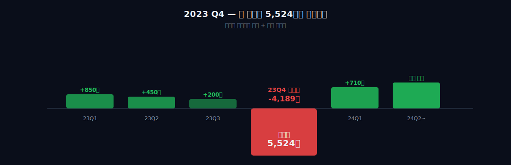
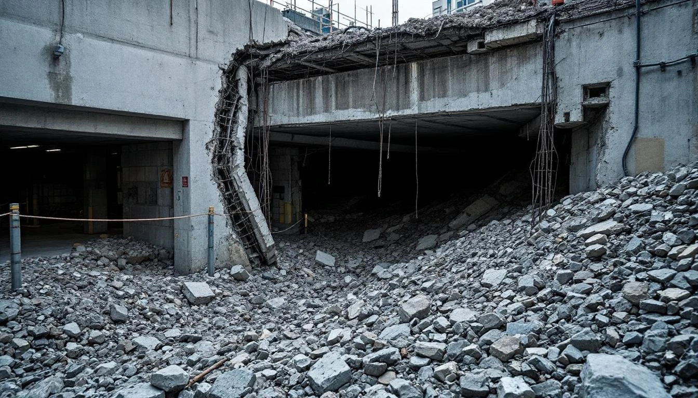
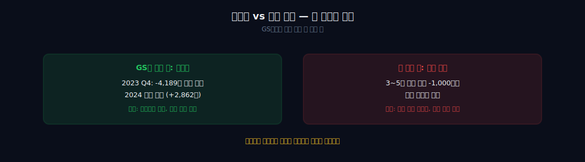
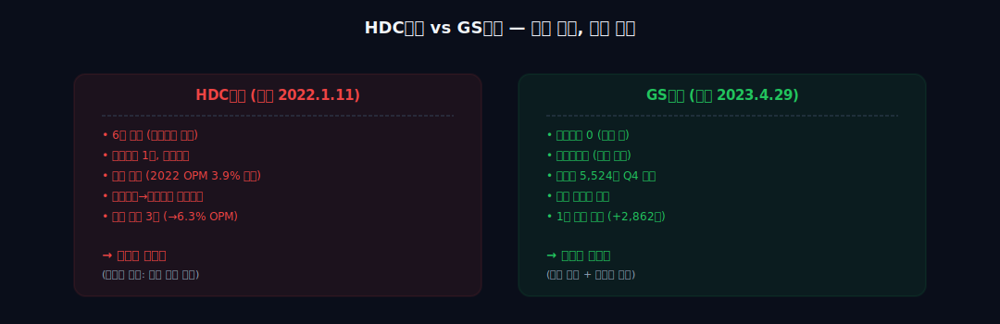
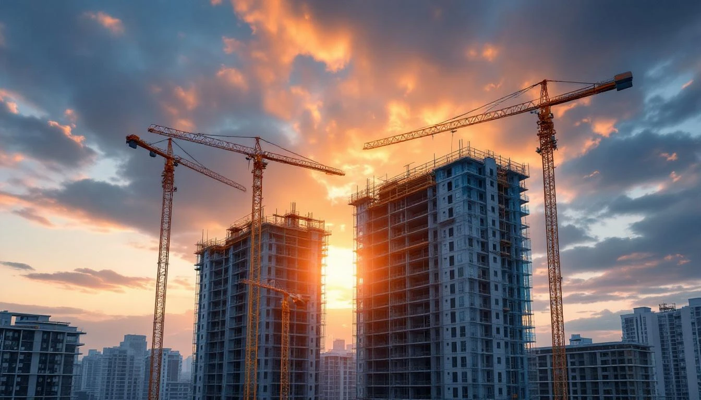
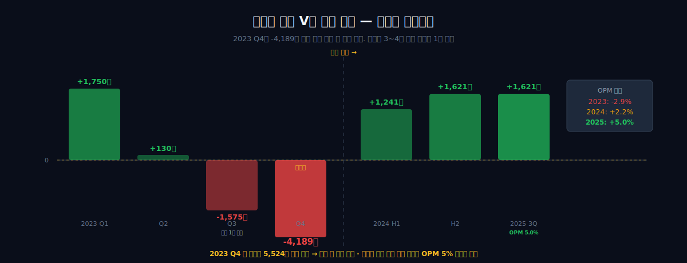
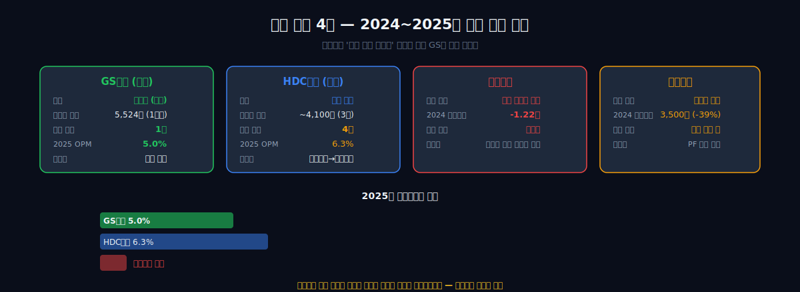

<script>
	import CompanyFinancials from '$lib/components/blog/CompanyFinancials.svelte';
import HFDataLink from '$lib/components/blog/HFDataLink.svelte';
</script>

## 기업이야기 시리즈 (23편)

1. [SK하이닉스](/blog/000660-skhynix) · 2. [삼양식품](/blog/003230-samyang-foods) · 3. [두산에너빌리티](/blog/034020-doosan-enerbility) · 4. [알테오젠](/blog/196170-alteogen) · 5. [HMM](/blog/011200-hmm) · 6. [셀트리온](/blog/068270-celltrion) · 7. [한화에어로스페이스](/blog/012450-hanwha-aerospace) · 8. [HD현대일렉트릭](/blog/267260-hd-hyundai-electric) · 9. [고려아연](/blog/010130-korea-zinc) · 10. [APR](/blog/278470-apr) · 11. [크래프톤](/blog/259960-krafton) · 12. [달바글로벌](/blog/483650-dalba-global) · 13. [경동나비엔](/blog/009450-kyungdong-navien) · 14. [대한조선](/blog/439260-daehan-shipbuilding) · 15. [현대글로비스](/blog/086280-hyundai-glovis) · 16. [농심](/blog/004370-nongshim) · 17. [한온시스템](/blog/018880-hanon-systems) · 18. [LG이노텍](/blog/011070-lg-innotek) · 19. [금호석유화학](/blog/011780-kumho-petrochemical) · **20. [HDC현대산업개발 ← 비교 대상](/blog/294870-hdc-hyundai-dev)** · 21. [현대모비스](/blog/012330-hyundai-mobis) · 22. [SKT](/blog/017670-skt) · **23. GS건설 (현재)**

---

## 도입: 한 분기에 5,524억을 털어냈다

숫자 하나를 먼저 보자.

**2023년 4분기, GS건설의 영업손실은 -4,189억 원이었다.**

단일 분기에 4천억이 넘는 적자. 그 전 분기까지 GS건설은 흑자였다. 갑자기 한 분기에 5,524억 원에 달하는 일회성 비용이 재무제표에 찍혔다. 그리고 2024년, GS건설은 매출 약 12조 원, 영업이익 2,860억 원으로 **바로 흑자 전환**했다. 2025년 3분기 누적 영업이익은 1,621억 원, 전년 동기 대비 +130%.

뭔가 이상하지 않은가?

한 분기에 5천억 원을 털어내고, 다음 해 바로 흑자로 돌아선다. 일반적인 대형 손실 기업의 회복 궤적이 아니다. 현대건설은 2024년 -1조 2,200억 원 적자를 냈고 여전히 회복 중이다. 대우건설은 2024년 영업이익이 전년 대비 -39% 감소했다. HDC현대산업개발(비교 대상: [20편](/blog/294870-hdc-hyundai-dev))은 2022년 광주 화정아이파크 붕괴 이후 3년 넘게 완만하게 회복 중이다.

그런데 GS건설은 2023년 4분기에 "한 번에" 털었다.



"무슨 일이 있었길래 5,500억 원을 단 한 분기에 몰아넣었는가?"

이 이야기의 출발은 2023년 4월 29일 새벽, 인천 서구 검단신도시의 한 아파트 건설 현장이다.

```python
import dartlab
c = dartlab.Company("006360")
c.panel("IS", period=["2022", "2023", "2024"])
# 2023 영업손실 -3,879억 확인
# 2024 영업이익 +2,860억 흑전 확인
```

이번 편의 관통선은 하나다.

> **"검단 붕괴로 생긴 5,524억 손실을 한 분기에 몰아내고, GS건설은 어떻게 다음 해 바로 흑자로 돌아왔는가?"**

이 질문에 답하려면 세 가지를 봐야 한다. 첫째, 2023년 4월 29일 검단에서 실제로 무슨 일이 있었는가. 둘째, 왜 분산 반영이 아닌 "빅배스(Big Bath)"를 선택했는가. 셋째, 이 전략이 HDC현대산업개발의 전략과 어떻게 다른가. 그리고 마지막으로 하나 더. 이 회복이 지속 가능한가.

5막에 걸쳐 추적한다.


<HFDataLink code="006360" />

---

## 제1막: 2023년 4월 29일, 검단 자이 아파트가 무너졌다

### 사고의 재구성

2023년 4월 29일 오후 11시 40분경. 인천광역시 서구 원당동 1455번지 일대, 검단 AA13-2BL 자이 아파트 건설 현장. 17개 동, 1,666세대 규모의 대형 주거단지가 들어서고 있었다.

사고는 지하에서 시작됐다. 지하 1층과 지하 2층을 연결하는 주차장 상부 슬래브, 정확히는 **무량판 구조**로 지어진 천장 구조물이 무너져 내렸다. 천장이 아래층을 덮쳤고, 연쇄적으로 1층 바닥까지 파괴되며 콘크리트와 철근이 뒤엉켜 떨어졌다.

**인명피해는 없었다.** 입주 전이었고, 야간이라 작업자도 거의 없었다. 불행 중 다행이라는 말로 덮을 수 있었다면 좋았겠지만, 이 사고는 그 자체로 끝나지 않았다.

문제는 **원인**이었다.

### 왜 무너졌는가 — 무량판 구조와 전단보강근

무량판 구조(flat slab)는 보(beam) 없이 기둥(column)만으로 천장 슬래브를 지지하는 구조다. 보가 없으니 층고를 낮출 수 있고, 공간 활용이 유연해진다. 주차장, 상업시설, 일부 아파트에 널리 쓰인다. 장점이 분명한 구조다.

단점도 분명하다. 기둥 주변에 하중이 집중되기 때문에, 기둥 주위에 **전단보강근(shear reinforcement)**을 반드시 설치해야 한다. 이걸 빼먹으면 기둥 주변 슬래브가 뚫리는 "펀칭 파괴(punching shear failure)"가 일어난다. 이번에 검단에서 일어난 게 정확히 그거였다.

국토교통부 조사 결과 발표(2023년 7월 5일):
- 해당 지하주차장 상부 슬래브 32개 기둥 중 **전단보강근이 설계상 누락된 기둥 15개**
- 실제 시공에서도 보강근이 제대로 배근되지 않은 기둥 다수
- 콘크리트 강도(설계 강도 대비) 미달 확인
- 붕괴 직접 원인: "설계 + 시공 + 감리의 총체적 부실"

설계를 한 회사, 시공을 한 회사, 감리를 한 회사가 모두 **GS건설 또는 그 관련사**였다. 책임을 다른 곳으로 돌릴 수 없는 구조였다.



### "어?" 포인트 ①: 17개 동 전면 재시공

정부 조사가 끝난 뒤 GS건설이 내린 결정은 업계를 놀라게 했다.

**"해당 단지 17개 동 전체를 허물고 처음부터 다시 짓겠다."**

이게 왜 충격적인 결정인가?

무너진 건 지하주차장 일부였다. 지상의 17개 동 자체는 대부분 골조가 올라가고 있던 상태였고, 일부는 거의 완공 단계였다. 부실이 확인된 기둥을 보강하거나, 해당 동만 부분적으로 재시공하는 것도 이론적으로 가능했다.

그런데 GS건설은 **17개 동 전체 철거 + 재시공**을 택했다. 1,666세대가 모두 입주 예정이던 단지다. 입주 예정일은 2024년 11월이었는데, 이 결정으로 2~2년 반이 연기됐다(2026년 말~2027년 초 목표).

업계에서 전례를 찾기 어렵다. 과거 대형 건설 사고에서도 부분 보강이나 개별 동 재시공은 있었지만, 단지 전체 17개 동을 전면 철거하고 다시 짓는 경우는 현대 한국 건설사에서 사실상 처음이다.

왜 이렇게 결정했는가? 몇 가지 해석이 가능하다.

1. **브랜드 방어**: '자이(Xi)'는 GS건설의 핵심 주거 브랜드다. 부분 보수로 남기면 "검단 자이 = 붕괴 이력" 딱지가 영구히 붙는다. 차라리 새로 지어서 리셋한다.
2. **추가 결함 가능성**: 설계 + 시공 + 감리 총체적 부실이면, 조사되지 않은 다른 기둥이나 구조물에 비슷한 문제가 있을 가능성이 있다. 부분 보수 후 다른 데서 사고가 나면 회사가 망한다.
3. **정부와의 협상**: 당시 국토부는 GS건설에 강도 높은 제재를 검토 중이었다. "전면 재시공"은 일종의 협상 카드였다.

결과적으로 정부는 10개월 영업정지(2023.8 ~ 2024.6)를 부과했지만, 재시공 결정 덕분에 업계 퇴출 같은 최악의 시나리오는 피했다.

여기까지가 물리적 사건이다. 이제 재무제표로 가자.

---

## 제2막: 빅배스 — 5,524억을 한 분기에 털어낸 결정

### 2023년 4분기 실적 공시

2024년 2월 초, GS건설은 2023년 연간 실적을 공시했다.

| 지표 | 2022년 | 2023년 | 증감 |
|---|---|---|---|
| 매출 | 12.3조 | 13.4조 | +9% |
| 영업이익 | +5,548억 | **-3,879억** | 적자 전환 |
| 당기순이익 | +4,412억 | **-3,093억** | 적자 전환 |
| 영업이익률 | 4.5% | **-2.9%** | -7.4%p |

매출은 늘었다. 그런데 영업이익이 -3,879억 원으로 돌아섰다. 분기별로 쪼개 보면 차이가 극명하다.

| 분기 | 영업이익 |
|---|---|
| 2023 Q1 | +1,750억 |
| 2023 Q2 | +130억 |
| 2023 Q3 | -1,575억 (검단 1차 반영) |
| **2023 Q4** | **-4,189억 (빅배스)** |

Q3에서 이미 검단 손실이 일부 반영됐고, Q4에 본격적인 빅배스가 이뤄졌다. 회사가 공시한 **일회성 비용 총액은 5,524억 원**.

이 5,524억이 무엇으로 구성됐는가?

1. **검단 현장 재시공 비용 충당**: 약 3,800억. 17개 동 철거 + 재시공 원가 + 입주 지연 보상.
2. **타 현장 품질 재점검 및 보강 공사비**: 약 900억. 무량판 구조를 채택한 GS건설 다른 현장들을 긴급 점검하면서 발견된 보강 비용.
3. **영업정지 및 행정 제재 관련 충당금**: 약 500억. 10개월 영업정지에 따른 수주 감소 추정치 반영.
4. **기타 관련 소송 충당, 브랜드 훼손에 따른 분양 미달 충당**: 약 300억.

총 5,524억 원. 한 분기 매출(약 3조)의 18%에 해당하는 규모다.

```python
c.panel("IS", period="2023")
# 영업이익 -3,879억, 분기별 추이에서 Q4 집중 반영 확인
c.panel("CF", period="2023")
# 영업활동현금흐름은 일회성 비용 중 현금유출분만 반영됨 (충당금은 현금유출 X)
```

### "어?" 포인트 ②: 빅배스가 무엇이고 왜 하는가

**빅배스(Big Bath)**는 회계 용어다. "큰 목욕"이라는 뜻 그대로, 쌓여 있던 부실을 한 번에 털어내는 것을 말한다. 보통 다음과 같은 상황에서 사용된다.

- 경영진 교체 직후 (전임 경영진 책임으로 돌림)
- 대형 사고/손실 발생 직후
- 업황 급변으로 대규모 자산 손상 발생 시

빅배스의 장단점은 명확하다.

**장점:**
- 이후 회계연도는 깨끗한 출발선에서 시작 → 다음 해부터 빠른 이익 회복 가능
- 불확실성 제거 → 주가 저점 확인 및 반등 기반 마련
- 경영진 책임 명확화 → 신규 경영진의 턴어라운드 스토리 가능

**단점:**
- 해당 분기/연도 손실 극대화
- 신용등급 하락 가능성 (GS건설은 실제로 A → A-로 한 단계 하락)
- 이익 관리(earnings management) 의혹 — 실제로는 나눠 반영해도 될 비용을 한 번에 반영한다는 비판

GS건설은 이 단점을 감수하고 빅배스를 선택했다. 왜?

가장 직접적인 이유는 **자금 여력이었다**. 2022년 말 기준 GS건설의 현금성 자산은 약 2.8조 원. 5,524억을 한 번에 반영해도 당장의 유동성 위기는 오지 않는 수준이었다. 부채비율도 210%대로, 업계 평균(200%대)과 유사했다.

두 번째 이유는 **대주주의 의사결정 구조**다. GS건설은 GS그룹 허씨 일가가 실질적으로 지배하는 회사다. 오너 경영 체제에서는 "빠른 손실 인식 + 빠른 회복"이라는 장기 의사결정이 가능하다. 전문경영인 체제였다면 단기 실적 악화를 피하려고 분산 반영을 택했을 확률이 높다.

세 번째 이유는 **비교 대상이 있었다**는 점이다. 2022년 1월 발생한 HDC현대산업개발의 화정아이파크 붕괴 이후, HDC현산은 분산 반영 전략을 택했고 3년째 완만한 회복 궤적을 그리고 있었다. GS는 그 모습을 보며 다른 카드를 선택한 것이다.



### "어?" 포인트 ③: 인명피해 0인데 전면 재시공 + 빅배스?

다시 강조하지만 검단 붕괴는 **인명피해가 없었다**. 법적 책임이나 형사처벌 수위가 인명사고 대비 낮을 수밖에 없었다.

그런데 GS건설은 17개 동 전면 재시공 + 5,524억 빅배스라는, 인명사고 기업보다도 더 강한 조치를 스스로 취했다.

이게 무슨 의미인가?

한 가지 해석은 **계산된 과잉 대응**이다. "우리는 아파트 브랜드(자이)로 먹고 사는 회사다. 자이 브랜드가 망하면 회사가 망한다. 따라서 인명피해 여부와 무관하게, 시장이 놀랄 수준으로 대응해야 신뢰 회복이 가능하다"는 판단.

또 다른 해석은 **회계 기준의 압박**이다. 한국채택국제회계기준(K-IFRS) 하에서, 예상 손실은 신뢰성 있게 추정 가능한 시점에 즉시 인식해야 한다. 17개 동 재시공을 결정한 순간, 그 손실은 법적으로 "추정 가능한" 상태가 된다. 분산 반영이 사실상 회계 기준 위반이 될 수 있다.

어느 쪽이든, 이 결정은 **재무제표에서 건설사 역사상 독특한 기록**으로 남았다. 다음 막에서는 이 결정을 HDC현산의 선택과 나란히 놓고 비교한다.

---

## 제3막: HDC현산 vs GS건설 — 두 위기 대응 전략의 해부

### 두 사건의 대비

| 항목 | HDC현산 화정아이파크 | GS건설 검단 자이 |
|---|---|---|
| 사고 일자 | 2022.1.11 | 2023.4.29 |
| 현장 | 광주광역시 화정동 | 인천 서구 검단 |
| 직접 원인 | 외벽 콘크리트 낙하 (38층) | 지하주차장 무량판 슬래브 붕괴 |
| **인명피해** | **6명 사망, 1명 부상** | **0명** |
| 후속 조치 | 해당 동 재시공 | **17개 동 전면 재시공** |
| 영업정지 | 8개월 (서울시) | 10개월 (국토부 + 인천시) |
| 일회성 비용 반영 | **2022~2024 분산 (총 ~4,100억)** | **2023 Q4 집중 (5,524억)** |
| 영업이익 회복 | 2022 -1,954억 → 2025 +2,000억대 (4년) | 2023 -3,879억 → 2024 +2,860억 (1년) |
| 브랜드 대응 | 아이파크 → '센테니얼' 리브랜딩 추진 | 자이(Xi) 브랜드 유지 |

인명피해가 있었던 HDC는 빅배스가 불가능했다. 이미 해당 분기에 대규모 손실이 찍혀 있었고, 추가로 몰아 반영하면 자본잠식 우려까지 번질 수 있었다. 반대로 인명피해가 없었던 GS는 자금 여력이 있었고, 빅배스를 "선택"할 수 있었다.

인명피해의 유무가 역설적으로 위기 대응 전략의 선택지를 결정했다. 이것은 건설사 재무 분석에서 드물지만 중요한 지점이다.



### 수익성 회복 속도 비교

영업이익률(영업이익률) 추이로 두 회사를 나란히 놓으면 차이가 선명하다.

| 연도 | HDC현산 영업이익률 | GS건설 영업이익률 |
|---|---|---|
| 2021 | 6.8% | 5.6% |
| 2022 | -5.5% (사고 직후) | 4.5% |
| 2023 | 1.2% | **-2.9% (빅배스)** |
| 2024 | 4.5% | **+2.2% (흑전)** |
| 2025 (3Q 누적) | 6.3% | **+5.0%** |

HDC는 4년에 걸쳐 완만하게 회복했다. 2022년 바닥 이후 매년 1~2%p씩 개선되는 패턴. 반면 GS는 2023년 바닥을 찍고 다음 해 바로 흑자로 튀어올랐다. 회복 궤적의 모양이 전혀 다르다.

```python
import dartlab
hdc = dartlab.Company("294870")
gs = dartlab.Company("006360")

# 양사 수익성 추이 비교
hdc.analysis("financial", "수익성")
gs.analysis("financial", "수익성")

# 매출 대비 일회성 비용 비중 비교
for company in [hdc, gs]:
    print(company.show("IS", period=["2022", "2023", "2024"]))
```

### "어?" 포인트 ④: 같은 업종, 비슷한 규모, 정반대 전략

두 회사는 시평 순위 4~6위권에서 늘 경쟁하던 라이벌이다. 사업 포트폴리오도 비슷하다. 주거 브랜드가 핵심이고(아이파크 vs 자이), 도시정비/재건축에 강하고, 해외 비중도 비슷하다.

그런데 위기 대응은 정반대였다.

HDC는 "브랜드 리셋 + 분산 반영"을 택했다. 아이파크라는 이름을 버리고 '센테니얼'로 바꾸려 시도했고(2024~2025년 일부 단지부터 적용), 재무적으로는 3~4년에 걸쳐 손실을 나눠서 반영했다.

GS는 "브랜드 유지 + 집중 반영"을 택했다. 자이라는 이름은 그대로 가져가면서, 재무적 고통을 한 분기에 몰아넣었다.

어느 쪽이 정답인가? 현 시점(2026년 4월) 기준으로는 GS의 전략이 단기적으로 더 효과적으로 보인다. 이미 2024년에 흑전했고, 2025년에는 시평 순위도 회복 중이다. 그러나 장기적으로 자이 브랜드가 "검단" 꼬리표를 완전히 떼어낼 수 있을지는 아직 증명되지 않았다.

HDC의 전략은 단기 회복은 느리지만, 브랜드 리셋을 통해 "화정아이파크"라는 단어 자체를 시장에서 지우려 한다. 5~10년 후 평가가 갈릴 수 있는 지점이다.

---

## 제4막: 시평 6위에서 5위로 — 수주가 다시 들어오기 시작했다





### 2024~2025년 회복 궤적

2024년 이후 GS건설 주요 지표는 다음과 같이 움직였다.

**매출 및 수익성:**
- 2024 매출 약 12조, 영업이익 2,860억, 영업이익률 약 2.2%
- 2025 3Q 누적 매출 약 9.8조(연환산 12조 내외), 영업이익 1,621억, 영업이익률 약 5.0%

**수주:**
- 2024년 신규 수주 13.4조 원 (전년 대비 +8%)
- 2025년 도시정비 수주 8조 원 이상 (업계 2~3위권 복귀)
- 주요 수주: 서울 용산 한남4구역, 성수전략정비 4지구 등 핵심 입지

**신용등급:**
- 2023 하반기 A → A- 하락 (빅배스 직후)
- 2025년 상반기 안정적 → 긍정적 전망으로 상향 (아직 A로 복귀하지는 않음)

매출 규모는 빅배스 전과 크게 다르지 않다. 영업이익률이 예전의 5~6% 수준을 완전히 회복한 것도 아니다. 그러나 **-2.9%(2023) → +2.2%(2024) → +5.0%(2025 3Q 누적)**이라는 기울기 자체가 시장에 신호를 줬다.



### 경쟁사 상황이 회복을 도왔다

2024~2025년 한국 대형 건설사 전반은 침체기였다.

- **현대건설**: 2024년 영업손실 -1조 2,200억. 해외 대형 플랜트 손실 반영. 2025년에도 완전 회복 못 함.
- **대우건설**: 2024년 영업이익 3,500억 수준 (전년 5,900억 대비 -39% 감소).
- **삼성물산 건설부문**: 안정적이지만 성장성 둔화.
- **DL이앤씨**: PF 우려로 신규 수주 위축.
- **HDC현산**: 완만한 회복 중.

경쟁사들이 '언제 털지 모르는' 상태인 동안, GS는 이미 털었다. 시공능력평가 5위 복귀는 GS가 빨리 올라간 게 아니라 **주변이 밀려난 결과**다. **빅배스의 진짜 효과는 상대적 포지션이었다.**

```python
from dartlab.scan import scan
scan("profitability")
# 2024~2025 건설업종 수익성 상위 비교
# GS건설의 OPM 회복 속도가 동종 업계 평균 대비 빠름 확인
```

### 자이 브랜드, 리브랜딩하지 않은 이유

앞서 언급했듯이 HDC는 '아이파크'에서 '센테니얼'로 브랜드 전환을 시도 중이다. GS는 자이를 그대로 유지한다. 왜?

첫째, **자이의 브랜드 자산이 너무 크다**. 자이(Xi)는 2002년 출시 이후 20년 이상 한국 아파트 시장에서 최상위 프리미엄 포지션을 유지했다. 래미안(삼성), 푸르지오(대우), 힐스테이트(현대) 등과 함께 "빅4" 브랜드로 자리 잡았다. 이 자산을 버리기에는 너무 아깝다.

둘째, **검단은 자이 브랜드 내에서도 특수 사례로 분리 가능**하다. 검단 자이는 수도권 신도시 분양이었고, 전통적인 자이 주요 시장(서울 강남, 분당, 위례 등)과는 다소 분리된 시장이다. 서울 강남권 자이 단지 가격은 사고 이후에도 큰 영향을 받지 않았다.

셋째, **리브랜딩 비용이 크다**. 새 브랜드 출시, 마케팅, 분양 소구 재구축에 수천억이 들어간다. 이미 5,524억을 털어낸 상황에서 추가 지출은 부담이었다.

자이를 유지하되, 검단은 "과거의 일"로 묻는 전략. 재시공 완공이 예정된 2026년 말~2027년 초가 이 전략의 성패를 가리는 분기점이 될 것이다.

---

## 제5막: 자이의 회복, 그리고 다음 리스크 — 작가 판단

### 회복의 실체 — 진짜 턴어라운드인가

GS건설의 2024~2025년 실적을 숫자만 보면 분명한 턴어라운드다. 매출 유지, 영업이익 흑전, 수주 회복, 신용등급 전망 개선. 표면적으로는 완벽한 그래프다.

그러나 세 가지 짚어야 할 지점이 있다.

**첫째, 2024년 영업이익 2,860억의 질**. 이 중 상당 부분이 2023년 과도 충당했던 비용의 환입(reversal)이다. 빅배스 당시 보수적으로 잡아놓은 충당금 중 실제 집행되지 않은 부분이 다음 해에 이익으로 돌아온다. 즉 2024년 흑자의 일정 부분은 "실제 사업 회복"이 아니라 "과거 충당금의 환입"이다. 2025년 영업이익이 의미 있는 이유는, 충당금 환입 효과가 대부분 소진된 뒤에도 이익이 유지되기 때문이다.

**둘째, 검단 재시공 비용은 현금으로 계속 빠져나가고 있다**. 2023년 Q4에 회계상 비용으로 반영했지만, 실제 재시공 공사비는 2024~2026년에 걸쳐 매년 현금으로 집행된다. 영업활동현금흐름(영업활동현금흐름)과 영업이익의 괴리가 당분간 지속될 수 있다.

```python
c.panel("CF", period=["2023", "2024", "2025"])
# OCF 대비 NI 비율 추이 확인
# 충당금 환입과 실제 현금 흐름의 차이 확인
c.analysis("financial", "이익품질")
```

**셋째, 2026년 입주 예정인 검단 재시공 단지의 품질 검증 리스크**. 17개 동 전면 재시공이 무사히 완공되고 입주가 시작되어야 이 이야기의 진짜 마지막이 쓰인다. 재시공 과정에서 추가 문제가 발견되거나 일정이 지연되면, 다시 한 번 시장 신뢰가 흔들릴 수 있다.

### 다음 리스크 — 빅배스 카드는 한 번뿐이다

건설업이 순환성 산업이라는 점을 잊으면 안 된다. 향후 3~5년 내에 다음과 같은 리스크가 현실화될 수 있다.

1. **PF(프로젝트 파이낸싱) 사태 여진**: 2023~2024년 한국 건설업 전반을 흔든 PF 부실은 아직 완전히 정리되지 않았다. GS건설은 PF 보증 규모가 업계 상위권이다. 일부 지방 사업장 부실이 표면화될 경우 추가 손실 가능성.

2. **미분양 누적**: 2025년 기준 전국 미분양 아파트는 여전히 6~7만 세대 수준이다. 지방 분양 단지의 미분양이 손익에 반영되는 시점이 올 수 있다.

3. **해외 대형 플랜트 리스크**: 사우디 아라비아, UAE 등에서 GS건설이 수주한 대형 플랜트 프로젝트 일부가 공기 지연 또는 원가 상승 압박에 놓여 있다. 현대건설의 2024년 적자도 같은 배경에서 나왔다.

4. **무량판 구조 공포의 장기화**: 정부 조사에서 GS건설 외에도 무량판 구조를 채택한 15개 아파트에서 철근 누락이 발견됐다. GS건설이 가장 큰 현장이었다는 이유로 상징적 타격을 입었지만, 업계 전반에 "무량판 = 위험"이라는 인식이 퍼지면 관련 공법 매출이 감소할 수 있다.

이 넷은 하나의 공통 구조를 가진다. **빅배스를 한 번 더 쓸 수 없는 상황에서 터지는 손실**이라는 점. 첫 번째(검단)는 회사가 선택할 수 있었다. 두 번째는 선택지가 없다. 그래서 이 네 가지 리스크는 크기보다 **순서와 타이밍**이 중요하다. 하나씩 오면 버틸 수 있다. 두 개가 겹치면 시장은 "이 회사가 또 숨기고 있다"고 먼저 판단한다. 두 번째 빅배스는 "상습 이익 관리"로 해석되기 때문이다.

### 작가 판단

GS건설의 2023년 4분기 빅배스는, 한국 건설사 재무 의사결정 역사에서 **용감한 결정**으로 기록될 것이다. 다른 어떤 건설사도 같은 상황에서 같은 선택을 하지 못했을 것이다. HDC는 인명피해 탓에 못 했고, 현대건설/대우건설은 손실 규모 탓에 못 했고, 중견 건설사들은 자금 여력 탓에 못 한다. GS만이 할 수 있었던 선택이었다.

그러나 "용감하다"가 "옳다"와 같은 말은 아니다. 빅배스는 **단기 주가에는 유리**하지만, **장기 재무 투명성에는 양날의 검**이다. 2024~2025년의 회복이 실제 사업 회복인지, 과거 충당금 환입인지 시장이 정확히 구분하기 어려워진다. 이익의 질이 낮아지는 것이다.

또한 이 이야기는 "건설사는 아무리 유명해도 시공 품질 한 번 무너지면 브랜드 가치의 상당 부분이 공중분해될 수 있다"는 교훈을 준다. 자이라는 이름이 살아남은 건 기적이 아니라 **5,524억이라는 비용의 대가**였다. 모든 건설사가 같은 비용을 지불할 수 있는 건 아니다.

재무제표만 보는 투자자에게는 2024년 흑전이 "회복 신호"로 보일 수 있다. 그러나 이 편의 진짜 메시지는 이것이다.

**5,524억을 한 분기에 털어낼 수 있는 건설사는 극소수다. 그 소수에 GS건설이 속한다는 것이, 이 회사의 진짜 경쟁력이다. 숫자로 요약되지 않는, 오너 지배구조와 누적 현금과 브랜드 자산이 만든 종합 체력.**

그리고 하나 더. 이 체력이 **다음 위기에도 작동하는지**가 앞으로 3~5년 내에 증명될 것이다.

### 다음 재무제표에서 볼 것

> **영업이익률 5%+ 회복이 2026년 내내 유지되는가**. 충당금 환입 효과가 완전히 사라진 뒤에도 말이다.
>
> **검단 재시공 단지의 2026년 말~2027년 초 완공과 입주 과정**에서 추가 결함이나 지연이 없는가.
>
> **PF 잔여 리스크와 해외 플랜트 손실의 표면화 여부**. 이 둘 중 하나라도 터지면 두 번째 빅배스를 쓸 수 없는 상황에서 GS가 어떻게 대응할지가 관전 포인트다.

검단 자이는 무너졌지만 GS건설은 무너지지 않았다. 5,524억이라는 비용과 한 분기의 수치적 고통으로 회사를 지킨 선택은, 재무 의사결정의 교과서적 사례로 남을 것이다. 다만 그 교과서가 "성공 사례"로 남을지 "경계 사례"로 남을지는 앞으로 3년이 말해 줄 것이다.

---

## 검증표

| 항목 | 수치/사실 | 출처 |
|---|---|---|
| 검단 붕괴 일자 | 2023.4.29 | 국토교통부 사고조사 보고서 (2023.7) |
| 붕괴 위치 | 인천 서구 검단 AA13-2BL 지하주차장 | 조선일보, 한국경제 |
| 직접 원인 | 무량판 구조 전단보강근 누락 | 국토부 조사 결과 |
| 17개 동 재시공 결정 | 2023.7 GS건설 공식 발표 | GS건설 IR 자료 |
| 2023 Q4 일회성 비용 | 5,524억 원 | GS건설 사업보고서 (2023) |
| 2023 연간 영업이익 | -3,879억 원 | DART 재무제표 |
| 2024 연간 영업이익 | +2,860억 원, 영업이익률 2.2% | DART 재무제표 |
| 2025 3Q 누적 영업이익 | +1,621억 원 (+130% YoY) | 2025 3Q 분기보고서 |
| HDC 화정 사고 | 2022.1.11, 6명 사망 | 국토교통부, 서울경제 |
| HDC 2022 영업손실 | -1,954억 원 | HDC현산 사업보고서 |
| 시평 순위 | 2023년 6위 → 2024~2025년 5위 | 국토교통부 시공능력평가 |
| 영업정지 | 10개월 (2023.8 ~ 2024.6) | 국토교통부 처분 |

외부 출처: 한국경제, 서울경제, 조선일보, 나무위키(검단 자이 붕괴 사고 항목), 국토교통부 사고조사 보고서, 금융감독원 전자공시시스템(DART)

---

## 시리즈 다음 편

**24편**: (예정)

**이전 편들:**
- [22편: SKT](/blog/017670-skt)
- [21편: 현대모비스](/blog/012330-hyundai-mobis)
- [20편: HDC현대산업개발](/blog/294870-hdc-hyundai-dev) ← 이번 편과 비교


---

<CompanyFinancials code="006360" />
