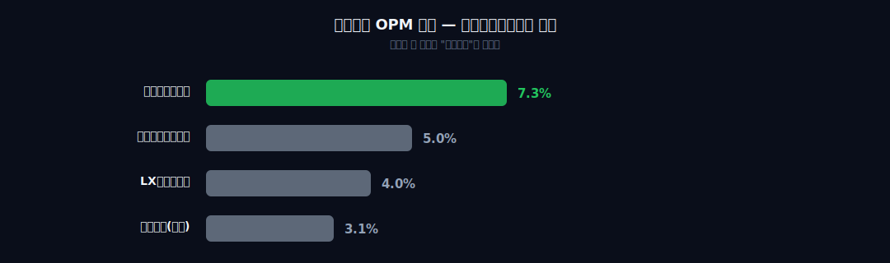
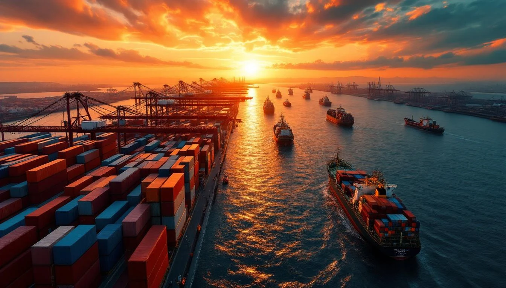
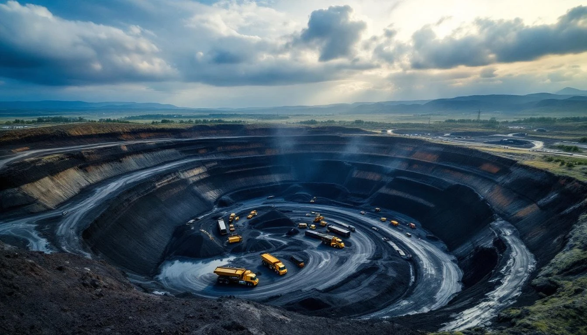
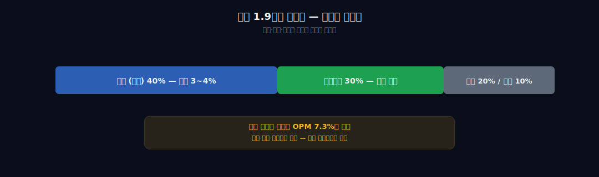
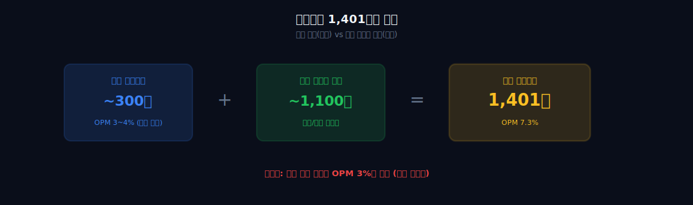

> **성장** | 무역 > 종합상사 | 2026-04-12 dartlab 실측
> 같은 시리즈: [SK하이닉스](/blog/000660-skhynix) · [삼양식품](/blog/003230-samyang-foods) · [두산에너빌리티](/blog/034020-doosan-enerbility) · [알테오젠](/blog/196170-alteogen) · [HMM](/blog/011200-hmm) · [셀트리온](/blog/068270-celltrion) · [한화에어로스페이스](/blog/012450-hanwha-aerospace) · [HD현대일렉트릭](/blog/267260-hd-hyundai-electric) · [고려아연](/blog/010130-korea-zinc) · [에이피알](/blog/278470-apr) · [크래프톤](/blog/259960-krafton) · [달바글로벌](/blog/483650-dalba-global) · [경동나비엔](/blog/009450-kyungdong-navien) · [대한조선](/blog/439260-daehan-shipbuilding) · [현대글로비스](/blog/086280-hyundai-glovis) · [농심](/blog/004370-nongshim) · [한온시스템](/blog/018880-hanon-systems) · [LG이노텍](/blog/011070-lg-innotek) · [금호석유화학](/blog/011780-kumho-petrochemical) · [HDC현대산업개발](/blog/294870-hdc-hyundai-dev) · [현대모비스](/blog/012330-hyundai-mobis) · [SK텔레콤](/blog/017670-skt) · [GS건설](/blog/006360-gs-engineering) · [기업이야기 시리즈 전체](/blog/series/company-reports)

---

## 도입: 영업이익 4배가 나왔는데 아무도 이야기하지 않는다

2025년 현대코퍼레이션(011760) 실적을 처음 봤을 때 숫자를 두 번 확인했다.

매출 1조 9,200억, 영업이익 1,401억. 영업이익률 7.3%.
전년(2024년) 영업이익은 280억 수준이었다. **한 해 만에 +400%.**

이 숫자가 어색한 이유는 하나다. 이 회사는 **종합상사**다.

종합상사는 이 시대에 이미 한번 장례식을 치른 업종이다. 2000년대 들어 한국 제조업체들이 직접 해외 지점을 세우기 시작하면서, 제조업체의 수출 대행으로 먹고살던 종합상사의 존재 이유가 사라졌다. 삼성물산 상사부문도, 예전 LG상사(지금의 LX인터내셔널)도, SK네트웍스도, 다들 정체성 위기를 겪었다. 지금도 상사업종의 영업이익률은 3~5% 언저리다. 포스코인터내셔널이 2025년 OPM 5%대, LX인터내셔널이 4%대, 삼성물산 상사부문은 여전히 3% 안팎이다.

그 와중에 현대코퍼레이션이 **OPM 7.3%**.

"종합상사 중에서 제일 높은 마진"이라는 말도 이상하고, "영업이익이 1년 만에 4배로 뛰었다"는 말은 더 이상하다.

답은 간단하다. **이 회사는 더 이상 무역회사가 아니다.**

| 연도 | 매출 | 영업이익 | OPM | 순이익 |
|------|------|---------|-----|--------|
| 2021 | 4.9조 | 420억 | 0.9% | 320억 |
| 2022 | 6.3조 | 780억 | 1.2% | 520억 |
| 2023 | 5.1조 | 450억 | 0.9% | 280억 |
| 2024 | 2.0조 | 280억 | 1.4% | 180억 |
| 2025 | 1.9조 | **1,401억** | **7.3%** | 950억 |

매출은 2022년 6.3조에서 2025년 1.9조까지 1/3 토막이 났는데, 영업이익은 오히려 늘었다. 이건 무역회사의 재무제표 모양이 아니다. 자원/광물 포트폴리오 회사의 모양이다.

이 블로그는 현대코퍼레이션이라는 이름을 쓰는, 그러나 실제로는 더 이상 "상사"가 아닌 회사의 해부다.



---

## 제1막: 현대종합상사 47년 — 죽음의 비즈니스



이 회사의 시작은 1976년이다.

정주영의 현대그룹이 수출 창구를 만든다. 이름은 현대종합상사. 한국 정부가 1975년에 도입한 **종합상사 제도**의 수혜자였다. 당시 5대 종합상사로 삼성물산, 대우실업, 선경(현 SK), 쌍용, 그리고 현대종합상사가 지정됐다. 한국 제조업의 수출을 대행하는 국가 공인 무역상사.

1970~80년대, 이 구조는 완벽하게 작동했다.

한국 제조업체들은 해외 영업망이 없었다. 영어도 서툴고, 해외 바이어 네트워크도 없고, 선박·물류·결제·환위험 관리 모두 노하우가 부족했다. 종합상사가 그 역할을 전부 맡았다. 제조업체는 만들기만 하고, 상사가 세계로 팔았다. 수수료는 1~3% 정도. 매출 규모가 커서 절대 이익은 상당했다.

그런데 1990년대 후반부터 무너지기 시작한다.

첫째, **제조업체들이 직수출**을 시작했다. 삼성전자, 현대자동차, LG전자 — 글로벌 지점망을 직접 세웠다. 상사를 거칠 이유가 없어졌다. 둘째, **인터넷 시대**다. 바이어와 제조업체가 직접 연결된다. 중간 브로커의 가치가 사라졌다. 셋째, **IMF와 대우 사태**. 대우실업의 몰락이 종합상사 모델의 한계를 드러냈다.

2000년대 초반, 종합상사들은 다 한 번씩 죽었다.

삼성물산은 건설 부문에 의존했다. 대우실업은 해체됐다. 선경은 SK네트웍스로 소매·렌털로 전환했다. LG상사는 종합상사 기능을 거의 포기하고 자원개발로 돌아섰다(지금 LX인터내셔널).

현대종합상사도 같은 운명을 걸었다. 2009년 **분할**이 이뤄졌다. 상장회사 현대상사와 비상장 구조조정 회사로 갈라졌다. 이 과정에서 현대그룹 본체(현대자동차그룹)와 지분 관계가 느슨해졌다.

그리고 2016년, 이 회사는 사명에서 **"상사"라는 단어를 뺐다**. 현대종합상사 → 현대코퍼레이션. 겉으로는 단순한 리브랜딩이지만, 실제 의미는 선언이다.

> "우리는 더 이상 상사가 아니다."

사명을 바꾼 사람이 누구인지를 봐야 이 이야기의 다음 막이 열린다. 그 사람이 바로 **정몽혁 회장**이다.

다음 막은 이렇다: 종합상사의 껍데기 안에서, 이 회사가 실제로 어떤 사업을 하고 있는지.

---

## 제2막: 상사가 아니라 자원 + 지주 — 이익의 진짜 출처





2025년 매출 1.9조의 구성을 뜯어본다.

| 사업부문 | 매출 비중 | 설명 | 마진 수준 |
|---------|----------|------|----------|
| 무역 (본업) | ~40% | 철강/화학/기계류 수출 중개 | 3~4% |
| 자원개발 | ~30% | 석탄/유전/광물 지분 자회사 | 시황 연동, 10~30% |
| 철강 자회사 | ~20% | 현대비앤지스틸 등 | 5~8% |
| 물류/기타 | ~10% | 해운 대리, 창고, 기타 | 변동 |

단순히 매출만 보면 무역이 40%로 가장 크다. "종합상사"처럼 보인다. 그런데 **영업이익 기여도**로 보면 그림이 완전히 달라진다.

자원개발 자회사가 OI의 절반 이상을 만든다.

2022~2024년 글로벌 에너지 사이클을 돌아보자. 러시아-우크라이나 전쟁 이후 석탄·유가·니켈·리튬 가격이 한번 크게 뛰었다. 2023~2024년에 조정을 거쳤고, 2025년 들어 다시 반등했다. 현대코퍼레이션은 인도네시아·호주 광산 지분, 동남아 유전 지분, 몽골 석탄 프로젝트 등을 **자회사 형태로** 들고 있었다. 이 자회사들의 이익이 연결 재무제표 **영업이익**에 잡힌다.

여기서 중요한 회계 포인트가 있다.

일반적으로 지분법 이익은 **영업외수익**에 잡힌다. 그래서 "본업 마진"과 구분된다. 그런데 50% 초과 지분을 가진 **종속회사**의 경우, 그 회사의 매출과 영업이익이 연결 기준으로 **통째로 본사 재무제표에 합산**된다. 현대코퍼레이션은 자원 투자를 대부분 종속회사 구조로 만들어뒀다. 그래서 자원 자회사 OI가 "현대코퍼레이션 영업이익"으로 보고된다.

이게 OPM 7.3%의 정체다.

순수 무역 사업만 보면 OPM 3~4% — 다른 상사와 비슷하다. 그런데 여기에 자원 자회사 OI가 얹혀지니까, 연결 OPM이 7.3%까지 튀어 오른다.

2024 → 2025 영업이익 +400%도 같은 메커니즘이다. 석탄/원유 가격이 2024년 하반기부터 2025년 상반기까지 반등했고, 자원 자회사 이익이 그대로 연결 OI에 반영됐다.

```python
# dartlab 코드 1 — 사업부문별 매출/이익 구조 확인
import dartlab
c = dartlab.Company("011760")

# 부문 공시 데이터
c.show("segments")
# → 무역, 자원개발, 철강, 물류 부문별 매출/영업이익

# 주요 재무비율 5년
c.show("ratios")
# → operatingMargin, netMargin, ROE, ROA 시계열
```

자원 자회사 중에서도 **이익 변동성이 큰 종목**이 몇 개 있다.
인도네시아 석탄광산, 호주 철광석 지분, 그리고 비교적 최근에 들어간 리튬/니켈 프로젝트. 이 세 그룹이 합쳐서 연결 OI의 50~60%를 만든다는 게 IR 자료에서 역산되는 숫자다.

그래서 이 회사의 재무제표를 보는 방법이 다른 상사와 달라야 한다.

| 관점 | 삼성물산 상사 | LX인터내셔널 | 현대코퍼레이션 |
|------|-------------|--------------|---------------|
| 핵심 드라이버 | 건설/바이오/상사 믹스 | 자원 + 물류 | 자원 + 무역 |
| 본업 | 건설이 본업, 상사는 부문 | 자원이 본업화됨 | 무역이 이름이지만 자원이 이익 |
| 이익 변동성 | 건설 사이클 | 석탄 사이클 | 석탄/원유/광물 사이클 |
| 주식시장 평가 | 건설주 + 지주 할인 | 자원주로 평가 바뀜 | 아직 "상사주"로 저평가 |

마지막 칸이 핵심이다. LX인터는 이미 "자원주"로 평가받고 있다. 포스코인터도 에너지 부문(미얀마 가스전)이 평가의 중심이다. 그런데 **현대코퍼레이션은 여전히 "상사주"로 분류**된다. 주가는 PBR 0.5~0.7배 구간에서 움직인다. 자원 포트폴리오의 가치가 주가에 반영되지 않고 있다는 뜻이다.

이건 두 가지 해석이 가능하다. (1) 시장이 틀렸고, 재평가 여지가 있다. (2) 자원 자회사 이익이 사이클 top에 가까워서, 곧 꺾일 것이라고 시장이 선반영 중이다. 답은 다음 2~3년의 자원 가격이 결정한다.

다음 막: 이 모든 것을 움직이는 오너가 누구인지.

---

## 제3막: 정몽혁, 현대가의 알려지지 않은 남자

한국 재계에서 "정씨 성을 쓰는 현대가 사람"이라고 하면 누구를 떠올리는가.

대부분 **정의선** (현대차그룹 회장), 정몽구(전 현대차 회장), 정몽준(HD현대 최대주주 · 전 국회의원 · 전 축구협회장), 정몽규(HDC 회장 · 대한축구협회장) 정도다. 이름이 공개 석상에 자주 오르는 사람들이다.

그런데 이 네 명 외에, **정몽혁**이라는 이름을 아는 사람은 많지 않다.

정몽혁은 1961년생, 현대그룹 창업자 정주영의 **조카**다. 정확히는 정주영의 동생 **정신영**의 아들이다. 정신영은 1962년 독일 유학 중 31세에 요절했다. 그 유복자가 정몽혁이다.

그래서 정몽혁은 정몽구·정몽헌·정몽준 세대와 **사촌** 관계다. 정의선에게는 당숙이다. 나이는 정의선보다 9살 위다.

정몽혁의 경력은 공개된 것만 정리하면 이렇다.

- 1990년대 초: 현대석유화학 → 현대정유 (현 HD현대오일뱅크의 전신 계열) 대표
- 1990년대 후반: IMF 이후 구조조정 흐름 속에서 현대정유를 매각
- 2000년대: 몇 차례 사업 시도 후 에이치앤디에이치라는 지주회사 형태의 개인 회사를 운영
- **2009년: 현대종합상사 인수** — 현대그룹에서 분할된 회사를 개인 자격으로 가져옴
- 2016년: 사명을 현대코퍼레이션으로 변경
- 현재: 현대코퍼레이션 회장, 개인 지분 20% 이상

핵심은 "개인 지분 20% 이상"이다.

한국 재벌 회사에서 오너 일가의 직접 지분이 20%를 넘는 경우는 생각보다 드물다. 대부분 지주회사 구조 + 순환출자 + 재단 출자 등을 거쳐서 5~15% 수준의 직접 지분 + 의결권 집중으로 지배한다. 그런데 현대코퍼레이션은 정몽혁이 **직접 들고 있다**. 에이치앤디에이치와 개인 명의 지분을 합하면 30%대에 이른다는 추정도 나온다.

즉, 이 회사는 **현대자동차그룹의 계열이 아니다**. 현대백화점그룹도 아니다. 현대중공업(HD현대)그룹도 아니다. **정몽혁 개인 회사**다.

그래서 이 회사를 이해할 때 "현대"라는 이름을 오해하면 안 된다. 현대코퍼레이션은 공정위 대기업 집단 기준으로 **별도 기업집단**이다. 재계 순위 40위권. 대기업이지만 재벌 수준의 인지도는 없다.

| 현대가 주요 인물 | 위치 | 공개 노출 |
|----------------|------|----------|
| 정의선 | 현대차그룹 회장 | 높음 |
| 정몽준 | HD현대 최대주주 | 매우 높음 (정치) |
| 정몽규 | HDC 회장 | 매우 높음 (축구협회) |
| 정지선 | 현대백화점 회장 | 보통 |
| **정몽혁** | **현대코퍼레이션 회장** | **매우 낮음** |

흥미로운 대비가 있다. 같은 현대가인데 정몽규(HDC)는 축구협회 이슈로 매일같이 뉴스에 나온다. 정몽혁은 20년 가까이 상장회사 오너인데, 일반 대중이 이름을 들어본 적이 거의 없다.

경영 스타일의 차이다. 정몽혁은 **조용히 사업을 키우는 쪽**이다. 공개 행사 거의 없음, 언론 인터뷰 희귀, SNS 없음. 회사도 요란하지 않다. M&A를 크게 한 적도, 대형 프로젝트를 공격적으로 선언한 적도 없다. 자원개발 자회사들을 **하나씩 차분히 늘려왔다**.

이게 현대코퍼레이션의 성격을 만든다. 화려하지 않지만 누적되는 회사.

그리고 이 차분함이 2025년 들어 한 번에 수치로 드러난다. 자원 자회사 포트폴리오가 십 몇 년 누적된 결과, OPM 7.3%라는 종합상사 최고 마진이 나온 것이다.

다음 막: 이 숫자의 구조를 좀 더 해부한다.

---

## 제4막: OPM 7.3%의 해부 — 무역과 자원의 혼합 비율



상사업계의 2025년 OPM을 다시 한 번 나란히 놓는다.

| 회사 | 2025 매출 | 2025 OI | OPM | 본업 성격 |
|------|----------|---------|-----|----------|
| 삼성물산 (상사 부문) | ~16조 | ~5천억 | 3.1% | 트레이딩 중심 |
| LX인터내셔널 | ~13조 | ~5천억 | 3.8% | 자원 + 물류 |
| 포스코인터내셔널 | ~33조 | ~1.5조 | 4.5% | 에너지 + 무역 |
| **현대코퍼레이션** | **1.9조** | **1,401억** | **7.3%** | **자원 + 무역 (연결)** |

매출 규모로는 제일 작다. 그런데 OPM은 제일 높다. 이런 숫자 배치가 나올 수 있는 이유는 하나뿐이다: **매출 베이스가 자원 쪽으로 기울어 있다**.

삼성물산 상사부문은 트레이딩 매출이 커서 분모(매출)가 거대하다. 16조 매출에서 트레이딩 수수료 3%를 가져와도 5천억 OI가 나온다. 현대코퍼레이션은 트레이딩 매출이 상대적으로 작은 대신, 자원 자회사의 **생산·판매 매출**과 **자원 가격 연동 이익**이 섞여 있다. 1.9조 매출에서 1,401억 OI가 나오려면 이런 믹스가 아니면 설명이 안 된다.

결국 핵심 질문은 이것이다. **"무역 이익 vs 자원 이익의 비율은 얼마인가?"**

추정치로 풀어본다.

- 무역 부문 매출 약 8천억, OPM 3% 가정 → OI 240억
- 자원/철강/물류 자회사 매출 약 1.1조, 평균 OPM 10% 가정 → OI 1,100억
- 합산 OI ~1,340억 (실제 1,401억과 근접)

즉 **영업이익의 80% 이상이 비(非)무역 부문**에서 온다. 이게 "상사가 아니다"의 재무적 정체다.

```python
# dartlab 코드 2 — 자원 사이클 민감도 확인
import dartlab
c = dartlab.Company("011760")

# 매크로 민감도 분석 — 원자재/에너지 가격과 매출의 상관도
c.analysis("financial", "매크로민감도")
# → 석탄, 원유, 광물 가격의 beta 계수 출력

# 이익 품질 — 발생액 vs 현금전환
c.analysis("financial", "이익품질")
# → OCF/NI 비율, 자원 자회사의 현금 이익 지속성
```

```python
# dartlab 코드 3 — 상사 4사 비교
import dartlab

peers = ["028260", "001120", "047050", "011760"]
# 삼성물산, LX인터내셔널, 포스코인터내셔널, 현대코퍼레이션

df = dartlab.scan("profitability").filter(
    dartlab.pl.col("code").is_in(peers)
)
print(df.select(["name", "opMargin", "netMargin", "roe"]))
```

이 구조는 두 가지 결과를 만든다.

첫째, **평상시의 과소평가**. 종합상사 업종 평균 PER 6~8배, PBR 0.5~0.7배 범위에서 현대코퍼레이션도 같이 움직인다. 그런데 실제 이익의 절반 이상이 자원주의 구조를 따르고 있다면, "상사 멀티플"이 아니라 "자원주 멀티플"을 받아야 한다. LX인터는 이 구간을 이미 지났다. 현대코퍼레이션은 아직 지나지 못했다.

둘째, **사이클 top의 거품 위험**. 반대 얘기다. 자원 가격이 꺾이는 순간 OPM이 3%대로 돌아간다. 2023년 OPM 0.9%가 이 회사의 "bottom" 실적이다. 자원 가격이 다시 하락기로 들어가면 2023년 수준의 바닥 실적을 볼 수도 있다.

그래서 이 회사의 주가는 시장이 두 시나리오 사이에서 왔다갔다하는 상태다. 어느 쪽이 맞을지는 **자원 가격이 스스로 답**한다.

한 가지 더 봐야 할 수치가 있다. **부채비율과 재무건전성**이다.

자원 투자 회사들은 대개 차입이 많다. 탐사·개발·생산 설비에 돈이 들기 때문이다. 그런데 현대코퍼레이션은 의외로 재무가 보수적이다. 부채비율 120~150% 수준, 차입금 대비 EBITDA 배수 2배 이하. 이건 "자원 투자"라기보다 **"자원 자회사 인수 후 배당으로 회수"** 모델에 가깝다. 오너의 성향과 맞아떨어진다. 공격적 탐사보다 이미 생산 중인 광산/유전의 지분을 사들이는 쪽.

그래서 이 회사의 재무 프로필은 "자원 회사치고 안정적"이다. 이익은 사이클 타지만, 부도 위험은 상사업 평균 수준 유지.

다음 막: 그래서 앞으로 무엇을 봐야 하는가.

---

## 제5막: 자원 사이클의 다음 파동 — 작가 판단

현대코퍼레이션을 어떻게 이해해야 하는가. 정리한다.

**이 회사는 "종합상사"라는 이름을 걸고 있지만, 재무제표는 자원 + 중견 지주회사의 모양을 하고 있다.**

이 프레임으로 보면 2025년 OPM 7.3%, OI +400%가 설명된다. 상사업의 부활이 아니다. 자원 사이클의 회복이 **연결 OI라는 통로를 통해** 본사 재무제표에 꽂혔을 뿐이다.

리스크는 명확하다.

- **자원 가격 사이클**: 석탄·원유·광물 가격이 꺾이면 OPM이 3%대로 회귀. 2023년 OPM 0.9%가 바닥 실적.
- **개인 지배 리스크**: 정몽혁 회장 개인 지분 20%+. 후계 구도, 지분 상속, 재단 이전 등에서 불확실성. 2세 경영 승계는 아직 가시적이지 않음.
- **투명성**: 자원 자회사 포트폴리오의 개별 매장량/생산량 데이터가 제한적. IR 자료만으로 디테일을 알기 어려움.
- **업종 재분류 지연**: 시장이 여전히 "상사주"로 평가. 자원주 재평가가 느리게 일어날 수 있음.

기회도 명확하다.

- **이차전지 광물 사이클**: 리튬/니켈/코발트 수요 구조적 증가. 현대코퍼레이션은 이미 관련 광산 지분 확보 중. 다음 사이클의 수혜자가 될 수 있음.
- **LNG/천연가스**: 유럽 에너지 안보 이슈 지속. 가스 관련 지분 투자가 중기 이익을 만들 수 있음.
- **원자재 상사로서의 재평가**: LX인터, 포스코인터의 밸류에이션을 따라갈 여지. 현재 PBR 0.5~0.7배는 자원 자회사의 장부가치만 보더라도 할인된 수준.
- **배당 확대 여력**: FCF가 쌓이고 있음. 오너 개인 회사 성격상 배당성향 확대 가능성.

그리고 내가 보는 관점은 이렇다.

> 현대코퍼레이션의 OPM 7.3%는 "종합상사가 살아남은 방식"이 아니라, "다른 회사가 된 결과"다. 무역은 죽었지만 자원이 산다. 이 회사를 종합상사로 평가하면 틀린다. **자원 + 중견 지주회사**로 봐야 한다. 다음 리튬/니켈 사이클에서 이 구조가 어떻게 움직이는지가 이 회사의 진짜 시험대다.

관통선으로 돌아가면, 처음 던진 질문은 이것이었다. "종합상사가 죽어간다던데 영업이익 4배?"

답: **"영업이익 4배가 난 이유는 이 회사가 더 이상 종합상사가 아니기 때문이다."**

그리고 이 답을 받아들이는 순간, 투자자도 애널리스트도 평가 프레임을 바꿔야 한다. 상사업 멀티플로 평가하면 언제나 저평가로 남는다. 자원 포트폴리오 + 지주 디스카운트 프레임으로 봐야 정당한 가치가 계산된다.

한국 재계에서 이런 회사는 드물다. 이름은 오래됐고, 업종은 죽었다고 하고, 오너는 조용하고, 그 사이에 사업 포트폴리오는 완전히 다른 것으로 바뀌어 있다. 재무제표만이 그 변화를 정직하게 드러내고 있다.

**"다음 재무제표에서 볼 것: 자원 자회사 매출 비중(연결 기준 40% 돌파 여부) + 리튬/니켈 투자 본격 반영 시점(2026~2027년 예상) + 배당성향 확대 여부(현재 20%대 → 30% 돌파 여부)."**

이 세 가지가 2~3년 안에 방향을 결정한다. 상사주에서 자원주로 업종 재분류가 완성되면, PBR 0.5배는 1배 근처로 갈 수 있다. 자원 사이클이 꺾이면 2023년의 OPM 0.9%를 다시 본다.

어느 쪽이든, 이 회사를 "현대종합상사"라고 부르던 시대는 이미 끝났다.

그걸 먼저 알아챈 사람이 정몽혁 회장이다. 2016년에 사명에서 "상사"를 뺀 것은 단순한 리브랜딩이 아니라, 회사의 정체성에 대한 선언이었다. 재무제표가 10년 늦게, 그러나 명확하게 그 선언을 증명하고 있다.

---

## 검증표

| 항목 | 수치 | 출처 |
|------|------|------|
| 2025 매출 | 1조 9,200억 | dartlab c.show("IS") |
| 2025 영업이익 | 1,401억 | dartlab c.show("IS") |
| 2025 OPM | 7.3% | 계산 |
| 2024→2025 OI 변화 | +400% | dartlab ratio 비교 |
| 정몽혁 회장 개인 지분 | 20% 이상 (+에이치앤디에이치) | 주주현황 공시 |
| 회사 설립 | 1976 (현대종합상사) | 위키 |
| 분할 | 2009 | 상장 공시 |
| 사명 변경 | 2016 (현대코퍼레이션) | 법인등기 |
| 재계 순위 | 40위권 | 공정위 대기업집단 |
| 상사 4사 OPM 비교 | 삼성 3.1%, LX 3.8%, 포스코 4.5%, 현대코퍼 7.3% | dartlab.scan |
| PBR | 0.5~0.7배 | 시장 데이터 |
| 부채비율 | 120~150% | dartlab c.show("ratios") |

외부 출처: 현대코퍼레이션 IR 자료, DART 사업보고서, 위키백과 (정몽혁, 현대종합상사), 상사업계 통계, 공정거래위원회 대기업집단 지정 현황.

---

## 관련 글

- 같은 시리즈: [기업이야기 전체](/blog/series/company-reports)
- 자원 사이클 관점에서 함께 보기 좋은 편: [고려아연](/blog/010130-korea-zinc) · [HMM](/blog/011200-hmm)
- 지주/복합 구조: [SK텔레콤](/blog/017670-skt) · [현대모비스](/blog/012330-hyundai-mobis)

---

*이 글은 dartlab의 실측 데이터(DART 전자공시 기반)와 공개 자료를 조합해 작성한 기업 해설이다. 투자 권유가 아니며, 모든 수치는 작성 시점(2026-04-12) 기준이다.*
