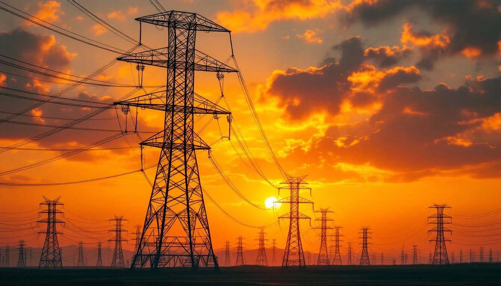
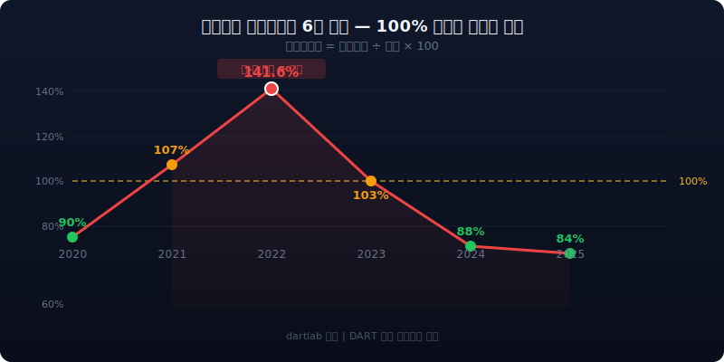
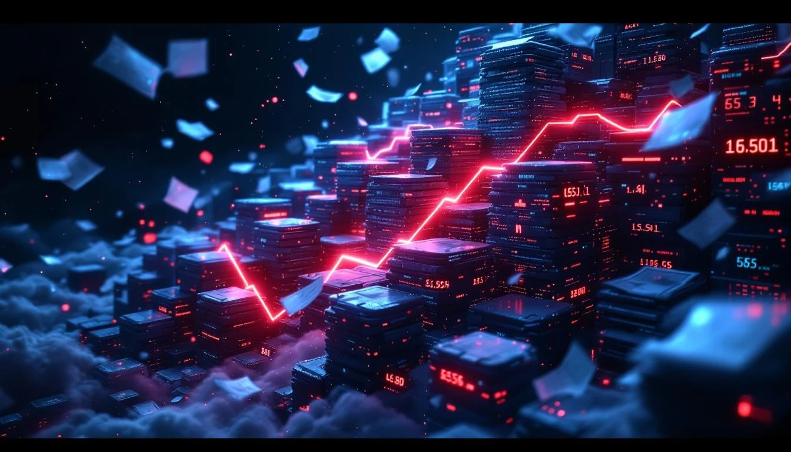
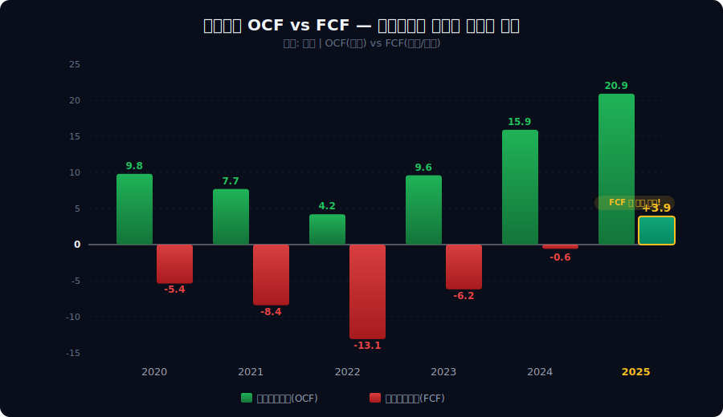
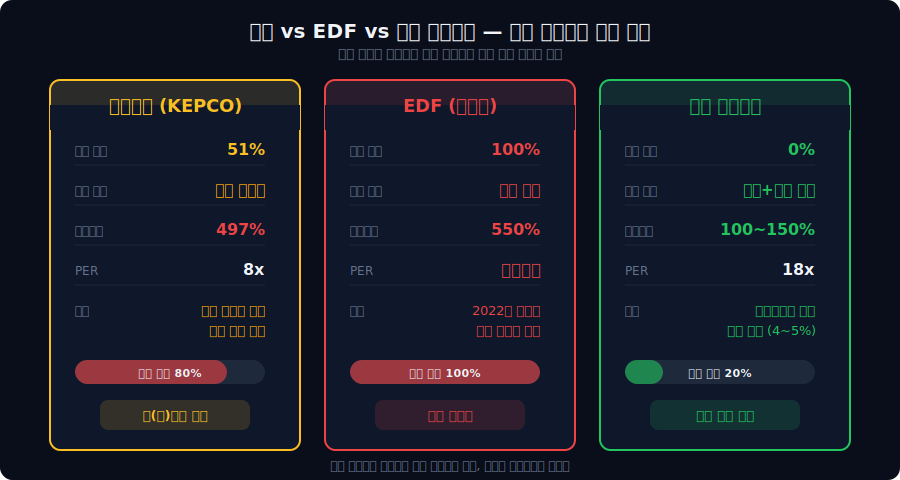
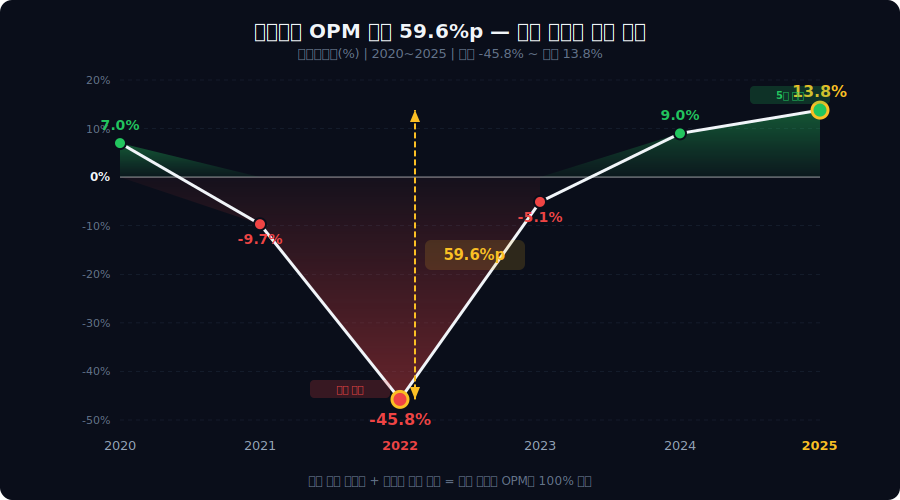
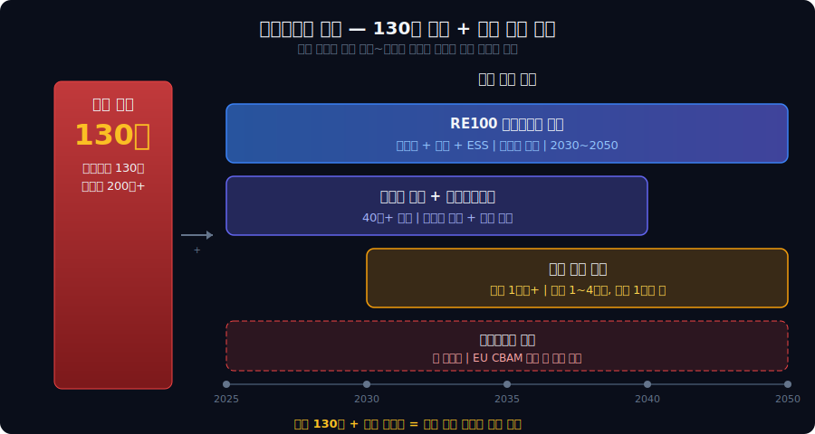

<script>
import ComboChart from '$lib/components/blog/ComboChart.svelte';
import StackBar from '$lib/components/blog/StackBar.svelte';
import HFDataLink from '$lib/components/blog/HFDataLink.svelte';
</script>


> **전기요금 1원이 5,600억을 만든다 — 정부가 재무제표를 쓰는 회사.**




<HFDataLink code="015760" />

---

# 제1막: "팔수록 적자" — 매출원가율 141.6%의 실체

### 2022년 영업적자 32.7조 — 삼성전자 반도체 이익보다 크다

2022년. 한국전력은 매출 71.3조원을 올렸다. 그런데 영업적자가 32.7조원이다.

매출보다 원가가 더 크다. 매출원가율 141.6%. **팔면 팔수록 적자가 쌓인다.** 편의점 알바가 물건 팔 때마다 자기 돈을 보태야 하는 상황. 이게 어떻게 가능한가?

뜯어보면 원가가 폭등한 게 아니다.

```python
import dartlab
c = dartlab.Company("015760")
c.select("IS", ["매출액", "매출원가"], freq="Y")
```

매출원가의 실체는 연료비다. LNG·석탄·우라늄을 사서 전기를 만든다. 2022년 러시아-우크라이나 전쟁으로 LNG 가격이 3배 뛰었다. 그런데 전기 판매가격은?

| 연도 | 매출 (조) | 매출원가 (조) | 매출원가율 | 영업이익률 |
|------|-----------|-------------|-----------|------|
| 2020 | 58.6 | 52.7 | 90% | 7.0% |
| 2021 | 60.6 | 63.6 | 105% | -9.7% |
| 2022 | 71.3 | 100.9 | 141.6% | -45.8% |
| 2023 | 88.2 | 89.7 | 102% | -5.1% |
| 2024 | 93.4 | 82.0 | 88% | 9.0% |
| 2025 | 97.4 | 80.7 | 83% | 13.8% |

원가는 국제시세다. 통제 불가. 매출은 전기요금이다. 정부가 정한다.

### 연료비 구성 — LNG 40%, 석탄 30%, 원자력 25%

한전의 매출원가를 뜯어보면 연료비가 60~70%를 차지한다. 나머지는 감가상각(과거에 산 설비 값을 매년 장부에서 깎는 것, 현금은 안 나감)(15%), 인건비(8%), 기타(7~17%). 연료비의 구성은 이렇다:

| 연료원 | 비중(2024) | 가격 변동성 | 2022년 가격 변동 |
|--------|-----------|------------|----------------|
| LNG | ~40% | 극히 높음 | +200% (MBtu $6→$18) |
| 석탄 | ~30% | 높음 | +120% (톤 $100→$220) |
| 원자력 | ~25% | 낮음 | +5% (우라늄 안정) |
| 신재생 | ~5% | 중간 | +15% |

문제가 보인다. **원가의 70%를 차지하는 LNG+석탄이 국제시세에 연동**된다. 2022년 러시아-우크라이나 전쟁으로 LNG가 3배 뛰었을 때, 원자력(25%)만 안정적이었다. 원전 비중이 높을수록 원가 변동성이 줄어든다 — 프랑스 EDF가 원전 70%에 의존하는 이유이기도 하다.

```python
c.analysis("비용구조")
```

한전의 비용구조에서 핵심은 **연료믹스가 곧 리스크 프로파일**이라는 점이다. 원전 비중을 높이면 원가 안정성이 올라가지만, 건설비(기당 5~7조)와 해체비(기당 1조+)가 장기 부채로 쌓인다. 석탄을 줄이면 탄소배출권 비용이 줄지만 LNG 의존도가 올라가서 가격 변동성이 커진다. 어느 쪽을 골라도 리스크가 따라온다.



### 전기요금 동결의 정치학 — 문재인 정부에서 윤석열 정부까지

2021년 하반기. 국제 에너지 가격이 오르기 시작한다. 문재인 정부는 물가 안정을 위해 전기요금 인상을 유보한다. 탈원전 정책으로 LNG 비중이 높아진 상태에서 LNG 가격 폭등이 겹쳤다. 한전 적자가 쌓이기 시작한다.

2022년 5월. 윤석열 정부가 출범한다. 전기요금 정상화를 공언했지만, 실제 인상은 소폭에 그쳤다. kWh당 4.9원(2022.4), 4.9원(2022.10). 합쳐봐야 연 5.4조원 효과인데, 적자는 32.7조원이었다. **인상폭이 적자의 6분의 1도 안 됐다.** 2023년 5월 추가 8원 인상까지 합쳐도 총 연 12.6조원 효과 — 여전히 적자를 메우기에 턱없이 부족했다.

정권이 바뀌어도 전기요금 인상은 정치적 자살 행위다. 5,200만 국민 전체가 소비자인 재화를 올리는 건 어느 정부도 꺼린다. 이것이 한전 적자의 구조적 원인이다 — 원가는 시장이 정하고, 매출은 정치가 정한다.

### kWh당 1원 = 연 5,600억 — 11분기 동결이 적자를 만들었다

**전기요금 kWh당 1원 = 연 5,600억원.** 이 숫자가 한전 재무제표의 모든 것을 설명한다. 2021년 4분기부터 2024년 1분기까지 — **11분기 연속** 기본요금이 동결됐다. 원가는 3배 뛰는데 요금은 그대로. 그 차이가 적자로 쌓였다.

| 시점 | 전기요금 변동 | 매출 효과(추정) |
|------|-------------|--------------|
| 2021 Q4 ~ 2024 Q1 | 동결 (11분기) | — |
| 2022.4 요금 인상 | +kWh 4.9원 | +2.7조/년 |
| 2022.10 추가 인상 | +kWh 4.9원 | +2.7조/년 |
| 2023.5 추가 인상 | +kWh 8원 | +4.5조/년 |

2023년 5월. 정승일 한전 사장이 사의를 표명한다. "적자 47조의 책임을 지겠다." 전기요금 인상을 추진하다 정치적 반발에 막힌 결과다. 원가가 변한 게 아니다. 요금이 안 올랐을 뿐이다.

### 사장은 사표를 쓰고, 정부는 요금을 올리지 않았다

한전의 적자가 유독 충격적인 건 규모 때문이다. 2022년 영업적자 32.7조원은 **삼성전자 반도체 부문의 영업이익(2022년 기준 약 21조)보다 크다.** 삼성전자가 1년 벌어들인 것보다 더 큰 돈을 한전이 1년에 날렸다. 그리고 이 적자는 경영 실패가 아니라 **정책 결정**의 결과다.

정승일 사장은 산업통상자원부 차관 출신이었다([KBC 2023.05](http://www.ikbc.co.kr/article/view/kbc202305120030)). 에너지 관료가 전력 공기업 CEO를 맡는 한국의 전형적 패턴. 문제는 이 자리가 경영 능력이 아니라 **정치적 결정을 수행하는 자리**라는 점이다. 전기요금 동결은 물가 안정을 위한 정부 정책이었고, 한전 사장은 그 정책의 실행자였다. 적자의 원인이 정책이니 책임도 정부에 있어야 하는데 — 사표를 쓴 건 사장이었다.

> **1막 → 2막**: 적자 47조가 쌓이면 어디서 돈을 구하나? 130조를 빌려야 한다.

---



# 제2막: "130조를 빌려 전기를 파는 법" — 한전채 블랙홀

### 2022년 한전채 31.8조 — 한국 역사상 최대, 채권시장을 삼키다

2022년 7월, 한전은 한전채 31.8조원을 발행한다. 한 해 채권 발행으로는 **한국 역사상 최대**. 채권시장에서 "크라우딩 아웃" 논란이 터진다. 한전이 시장 자금을 빨아들이니 중소기업과 은행채가 발행을 못 하겠다는 것이다.

왜 이렇게 빌려야 했는가? 적자 47조를 메꿀 돈이 필요하니까.

### 한전채 연도별 발행 — 5년간 130조를 쌓은 경로

한전채가 어떻게 쌓였는지 연도별로 보면 적자와의 관계가 선명하다:

| 연도 | 한전채 순발행(조) | 누적 금융부채(조) | 영업이익(조) | 사유 |
|------|-----------------|-----------------|------------|------|
| 2020 | +8.2 | 70.1 | +4.1 | 코로나 수요 감소 |
| 2021 | +10.5 | 80.6 | -5.9 | 에너지 가격 상승 시작 |
| 2022 | +40.4 | 121.0 | -32.7 | 역대 최대 적자 보전 |
| 2023 | +13.1 | 134.1 | -4.5 | 적자 축소 중 차환 |
| 2024 | -1.3 | 132.8 | +8.4 | 흑자 전환, 순상환 시작 |
| 2025 | -2.9 | 129.9 | +13.5 | 순상환 지속 |

2022년 한 해에만 40.4조가 순증했다. 이전 3년 순증분(18.7조)의 두 배가 넘는다. 적자 32.7조 + 이자 4.8조 + 설비투자(설비투자, 공장/설비에 쓰는 돈) 17.3조를 감당하려면 그만큼 빌릴 수밖에 없었다.

### 한전 그룹 — 발전 6사라는 거대한 하청 구조

한전을 이해하려면 단독 재무제표가 아니라 그룹 구조를 봐야 한다. 한전은 전기를 **파는** 회사지, 직접 **만드는** 회사가 아니다. 전기를 만드는 건 자회사 발전 6사다:

| 자회사 | 주요 발전원 | 한전 지분 | 역할 |
|--------|-----------|----------|------|
| 한국수력원자력 | 원자력 + 수력 | 100% | 원전 25기 운영 |
| 한국남동발전 | 석탄 + LNG | 100% | 경남/부산권 |
| 한국중부발전 | 석탄 + LNG | 100% | 충남/충북권 |
| 한국서부발전 | 석탄 + LNG + 신재생 | 100% | 서해안권 |
| 한국남부발전 | 석탄 + LNG | 100% | 호남/제주권 |
| 한국동서발전 | 석탄 + LNG | 100% | 동해안/울산권 |

발전 6사가 전기를 만들어 한전에 **전력구매계약(PPA)** 가격으로 넘긴다. 한전은 이걸 소비자에게 판다. 여기서 구조적 문제가 생긴다 — 발전 6사의 연료비가 오르면 한전 매입 단가가 올라가는데, 판매 가격(전기요금)은 정부가 통제한다. **비용은 시장이 정하고, 매출은 정치가 정하는 구조가 여기서 만들어진다.** [두산에너빌리티](/blog/034020-doosan-enerbility)가 원전 터빈을 납품하는 곳이 바로 이 한수원이다 — 한전 그룹은 에너지 산업 전체의 허브다.

```python
c.select("BS", ["사채", "장기차입금", "단기차입금"], freq="Y")
```

### 이자보상배율 시계열 — 0.92x에서 2.21x로 회복

이자보상배율(이자보상배율)은 "번 돈으로 이자를 갚을 수 있는가"를 보여준다. 한전의 이자보상배율 추이는 적자의 깊이를 그대로 반영한다:

| 연도 | 영업이익(조) | 이자비용(조) | 이자보상배율 | 판정 |
|------|------------|------------|-----|------|
| 2020 | 4.1 | 2.8 | 1.43x | 가까스로 커버 |
| 2021 | -5.9 | 2.9 | 적자 | 이자 커버 불가 |
| 2022 | -32.7 | 4.8 | 적자 | 최악 |
| 2023 | -4.5 | 7.7 | 적자 | 이자 폭증 |
| 2024 | 8.4 | 9.1 | 0.92x | 흑자인데 이자 미달 |
| 2025 | 13.5 | 6.1 | 2.21x | 겨우 안정권 |

2024년이 특이하다. 영업이익 8.4조로 흑자전환했는데 이자보상배율은 0.92x — **벌어도 이자를 못 갚는 상태**였다. 130조 부채가 만들어낸 이자 9.1조가 그만큼 무거웠다. 2025년에야 이자보상배율 2.21x로 안정권에 진입했지만, 일반 기업의 건전 기준(3.0x 이상)에는 여전히 못 미친다.

| 연도 | 금융부채(조) | 전년 대비 | 이자비용(조) | 이자보상배율 |
|------|-----------|-----------|------------|-----|
| 2020 | 70.1 | — | 2.8 | 1.43x |
| 2021 | 80.6 | +10.5 | 2.9 | 적자 |
| 2022 | 121.0 | +40.4 | 4.8 | 적자 |
| 2023 | 134.1 | +13.1 | 7.7 | 적자 |
| 2024 | 132.8 | -1.3 | 9.1 | 0.92x |
| 2025 | 129.9 | -2.9 | 6.1 | 2.21x |

### 이자비용 하루 249억 — 부채비율 497%인데 신용등급 AA+

2024년 이자비용 9.1조원. 하루 249억원. **분당 1,700만원이 이자로 나간다.** 이자보상배율 0.92x — 번 돈으로 이자도 못 갚는 상태였다.


그런데 이상한 게 있다. 금융부채 130조, 총부채 206조. 부채비율 497%(2024). 이런 회사의 신용등급은?

| 항목 | 한전 | 일반 기업 기준 |
|------|------|-------------|
| 부채비율 | 497% | 200% 초과 시 경고 |
| 이자보상배율(2024) | 0.92x | 1.0x 미만 시 부도 위험 |
| 신용등급 | AA+ | ??? |

**AA+.** 부도 직전 지표인데 초우량 등급. 왜?

정부가 51.1% 지분을 보유하고 있다. 전력산업 독점권을 가진 공기업이다. 한국 정부가 망하지 않는 한 한전은 망할 수 없다. 한전채 = 사실상 준국채. 이것이 130조를 빌릴 수 있는 이유다.

```python
c.analysis("자금조달")
```

| 비교 | 한전 | 일반 AA+ 기업 |
|------|------|-------------|
| 부채비율 | 497% | 100~150% |
| 정부 보증 | 실질적 O | X |
| 부도 가능성 | 정부 부도 시에만 | 개별 위험 |
| 차입 금리 | 국채+α (저리) | 시장 금리 |

### 국민 1인당 한전 부채 400만 원 — 정부가 국민에게 진 빚

한전의 부채는 회사가 진 빚이 아니다. **정부가 국민에게 진 빚이다.** 전기요금 인상 대신 한전에 빚을 쌓게 해서 물가를 누른 것이다. 국민 1인당 한전 부채 약 400만원.

한전채의 위력은 채권시장 전체를 흔들 정도다. 2022년 한전채 31.8조 발행은 같은 해 전체 회사채 발행(약 80조)의 **40%**에 육박했다. AA등급 특수채인 한전채가 자금을 빨아들이니 BBB 이하 회사채는 발행 자체가 막혔다. "한전이 채권시장을 먹는다"는 말이 나온 이유다([이코노미스트 2023.10](https://economist.co.kr/article/view/ecn202310230035)). 건설사 [GS건설](/blog/006360-gs-engineering)이나 [HDC현산](/blog/294870-hdc-hyundai-dev)같은 회사가 회사채를 발행하려면 한전채와 경쟁해야 한다. 정부가 한전에 빚을 떠넘긴 결과가 민간 자금조달 경색으로 이어진 것이다.

이 구조를 이해하면 한전의 신용등급이 왜 AA+인지도 풀린다. 한전은 전력산업기반기금법에 의해 전력 독점 사업자다. 한국 정부의 신용이 한전을 떠받친다. [SK텔레콤](/blog/017670-skt)이 통신 과점으로 안정적 현금흐름을 만드는 것과 비슷하되, 한전은 한 단계 더 간다 — 정부 보증이라는 궁극의 안전망이 있다.

> **2막 → 3막**: 130조 빚에 이자 9조. 현금이 도는가? 2022년 에너지 위기 때는 영업활동현금흐름도 -23.5조로 꺼졌지만, 평년에는 감가상각이 현금 손실을 흡수한다.

---

# 제3막: "감가상각이 만드는 현금" — 영업활동현금흐름과 잉여현금흐름(영업현금에서 투자비 뺀 진짜 남는 돈)의 구조

### 순이익 -24.4조, 영업CF -23.5조 — 172조 인프라의 현금 부담

2022년. 순이익 -24.4조원. 역대 최악. 영업현금흐름(영업활동현금흐름)도 -23.5조원으로 대규모 유출이었다.

순이익과 영업CF가 모두 마이너스인 해에 어떻게 회사가 버텼는가?

```python
c.analysis("현금흐름")
```

| 연도 | 순이익(조) | 영업활동현금흐름(조) | 감가상각(조) | 설비투자(조) | 잉여현금흐름(조) |
|------|----------|---------|-----------|----------|--------|
| 2020 | -0.8 | 9.8 | 10.5 | 15.2 | -5.4 |
| 2021 | -5.2 | 4.5 | 10.8 | 16.1 | -7.9 |
| 2022 | -24.4 | -23.5 | 11.2 | 17.3 | -38.4 |
| 2023 | -6.0 | 1.5 | 11.5 | 15.8 | -11.6 |
| 2024 | 3.6 | 15.9 | 11.8 | 16.5 | +1.8 |
| 2025 | 8.7 | 20.9 | 12.1 | 17.0 | +2.4 |



**감가상각**이 구조의 핵심이다. 한전은 발전소·송전탑·변전소 — 유형자산 172조원어치를 깔고 앉아 있다. 이걸 매년 10~12조원씩 감가상각으로 비용 처리한다. 그런데 이 "비용"은 진짜 돈이 나가지 않는다. 20년 전에 지은 발전소 값을 지금 장부에서 깎는 것뿐이니까. 2022년은 에너지 위기가 워낙 심각해 영업CF도 -23.5조로 꺼졌지만, 평년(2021·2023~2025)에는 감가상각 10~12조가 현금 손실을 흡수해 영업CF를 양(+)으로 유지한다 — 172조짜리 인프라가 만들어 내는 구조적 완충장치다.

### 172조 유형자산의 정체 — 발전 40%, 송변전 35%, 배전 20%

한전의 유형자산 172조원은 무엇으로 이루어져 있는가? 한전 사업보고서의 유형자산 주석을 뜯어보면:

| 자산 유형 | 금액(조, 추정) | 비중 | 감가상각 연한 | 특징 |
|----------|-------------|------|------------|------|
| 발전설비 | ~69 | 40% | 20~40년 | 원전/화력/수력 발전소 |
| 송변전설비 | ~60 | 35% | 25~40년 | 송전탑·변전소·154kV+ |
| 배전설비 | ~34 | 20% | 15~25년 | 전신주·가공선·지중선 |
| 기타(토지/건물) | ~9 | 5% | — | 비상각 포함 |

발전설비의 감가상각 연한이 20~40년이다. 30년 전에 지은 원전의 건설비를 지금도 매년 장부에서 깎고 있다. 이 "가짜 비용"이 연 11~12조원. 한전 같은 자본집약형 인프라 기업에서 감가상각은 현금흐름의 최대 완충장치다. [HD현대일렉트릭](/blog/267260-hd-hyundai-electric)이 변압기를 납품하는 송변전설비가 172조의 35%를 차지한다 — 전력망 교체 수요가 한전의 설비투자를 구조적으로 만드는 이유다.

```python
c.analysis("자산구조")
```

### 한전의 자산 구성 — 유형자산 ~70%, 금융자산은 미미

한전의 재무상태표를 자산 유형별로 분해하면 일반 기업과 극명하게 다르다:

| 자산 구분 | 금액(조, 2024) | 비중 | 비고 |
|----------|-------------|------|------|
| 유형자산 | 172.0 | ~70% | 발전+송변전+배전 |
| 기타 비유동자산 | 45.5 | ~18% | 투자자산·무형자산 등 |
| 유동자산 | 29.3 | ~12% | 현금+매출채권+재고 |
| **자산총계** | **246.8** | **100%** | AUTO 실측 |

유형자산이 자산의 70% 수준이다. 일반 제조업(20~40%)의 1.5~3배. 이 구조가 의미하는 건 두 가지다. 첫째, 감가상각이 매년 11~12조씩 자동으로 발생해서 영업활동현금흐름을 떠받친다. 둘째, 이 자산을 유지하려면 매년 15~17조의 설비투자가 불가피하다. **자산이 크니까 현금이 들어오지만, 자산이 크니까 현금이 나가기도 한다.**

**영업활동현금흐름 = 순이익 + 감가상각 + 운전자본 변동**

| 항목 | 2022년 (조) |
|------|-----------|
| 순이익 | -24.4 |
| (+) 감가상각비 | +11.2 |
| (+) 기타 비현금 | 추정 미확인 |
| (+) 운전자본 변동 | 추정 미확인 |
| **= 영업활동현금흐름** | **-23.5** |

### 설비투자 매년 15~17조 — 어디에 얼마를 쓰는가

에너지 위기가 극심했던 2022년을 제외하면 영업활동현금흐름은 플러스다. 하지만 **설비투자가 매년 15~17조**다. 멈추면 정전이다. 설비투자의 내역을 분해하면:

| 설비투자 항목 | 연간 규모(조, 추정) | 비중 | 성격 |
|-----------|-----------------|------|------|
| 발전설비 건설/정비 | 5~6 | 33% | 신규 원전+기존 보수 |
| 송변전설비 확충 | 4~5 | 28% | 345kV/765kV 송전선 |
| 배전망 교체/신설 | 3~4 | 22% | 지중화+노후 교체 |
| 신재생에너지 | 1~2 | 10% | 태양광/풍력/ESS |
| 기타(IT/건물) | 1 | 7% | 디지털 전환 등 |

발전+송변전이 설비투자의 61%를 차지한다. 이건 "투자"라기보다 "유지"에 가깝다. 30~40년 된 송전탑을 교체하지 않으면 사고가 난다. 노후 원전을 정비하지 않으면 가동률이 떨어진다. **한전의 설비투자는 선택이 아니라 의무다.** [경동나비엔](/blog/009450-kyungdong-navien)이 보일러 교체 수요로 안정 매출을 만드는 것처럼, 전력 인프라도 교체 주기가 돌아오면 투자를 미룰 수 없다. 다만 규모가 연 15~17조라는 점이 다르다.

발전소 정비, 송전선 교체, 재생에너지 설비. 영업활동현금흐름보다 설비투자가 크면 잉여현금흐름은 마이너스다 — 2022·2023년은 그랬다. 2024년(+1.8조)·2025년(+2.4조)은 흑자 전환으로 처음 플러스가 됐다.

```python
c.select("CF", ["영업활동현금흐름", "투자활동현금흐름"], freq="Y")
```

한전은 "돈은 들어오는데 쓸 게 더 많은" 영원한 투자 기계다. 잉여현금흐름이 처음으로 플러스가 된 건 2024년(+1.8조), 2025년(+2.4조)으로 이어졌다. 흑자 전환으로 영업CF가 늘어난 덕분이다.

| 구분 | 일반 제조업 | 한전 |
|------|-----------|------|
| 설비투자/매출 | 3~8% | 17~25% |
| 유형자산/총자산 | 20~40% | ~70% |
| 감가상각/영업활동현금흐름 | 30~50% | 50~80% |
| 잉여현금흐름 | 보통 + | 구조적 - |

한전은 영원히 투자해야 한다. 전력망은 멈추면 나라가 멈춘다.

> **3막 → 4막**: 2022년 적자 -24.4조 + 영업CF -23.5조 + 130조 부채. 이 구조를 가진 회사가 세계에 또 있을까? 있다. 프랑스 EDF.

---

# 제4막: "EDF도 똑같이 망했다" — 정부가 재무제표를 쓰는 회사의 운명

### EDF 부채 550% → 2023년 완전 국유화, 소액주주 퇴장

프랑스 EDF(전력공사). 한전과 놀라울 정도로 같은 구조를 가진 회사다.

- 정부 지분 84% (한전 51%)
- 전기요금 정부 상한제 적용
- 원자력 발전 비중 70%+
- 2021~2022년 에너지 위기 시 정부가 요금 인상 차단
- 부채 EUR 64.5B(약 93조원) 폭증

결말은? **2023년 완전 국유화.** 주가 12유로에서 상장폐지. 소액주주 투자금 소멸([Power Technology](https://www.power-technology.com/news/france-nationalise-edf/)).

```python
c.analysis("안정성")
```

| 항목 | 한전 (KRX) | EDF (프랑스) | 미국 유틸리티 평균 |
|------|-----------|------------|-----------------|
| 정부 지분 | 51.1% | 84%→100% | 0% |
| 요금 결정 | 정부 인가제 | 정부 상한제 | 시장 자유가격 |
| 부채비율 | 497% | 550% (국유화 직전) | 100~150% |
| PER | 8x | 상폐 | 18x |
| 결말 | ? | 완전 국유화(2023) | 안정 배당 |



표에서 한전(497%)과 EDF(550%)의 간격이 눈에 들어온다. **50%p.** 다음 에너지 위기 한 번이면 메워진다.

### 한전 497% vs EDF 550% — 다음 위기 한 번이면 메워진다

미국 유틸리티는 다르다. 전기요금을 자유롭게 올릴 수 있다. 원가가 오르면 요금도 오른다. 그래서 부채비율 100~150%, 주가수익비율(PER) 18x, 안정 배당.

**"규제 유틸리티"의 패러독스** — 정부 보호를 받으면 망하지 않지만, 가격을 못 올리니 영원히 성장도 못 한다. EDF는 그 끝을 보여줬다. 한전은 아직 상장이다. 하지만 부채비율 497%는 EDF 국유화 직전(550%)과 **50%p 차이**밖에 나지 않는다. 다음 에너지 위기가 오면 — 한전 역시 같은 선택지 앞에 설 수 있다.

> **4막 → 5막**: 그래서 2025년 역대 최대 흑자 13.5조. 끝난 건가? 130조 부채는 여전히 남아 있다.

---

# 제5막: "13.5조 흑자의 진짜 의미" — 끝나지 않은 질문

### 영업이익률(영업이익률) 스윙 59.6%p — 한국 대기업 역사상 가장 극적인 턴어라운드

2025년. 영업이익 13.5조(134,906억), 순이익 8.7조(86,667억)([서울경제 2026.02](https://en.sedaily.com/finance/2026/02/26/kepco-posts-record-96b-operating-profit-debt-remains-at-146b)). 영업이익률 13.8%. **2022년 -45.8%에서 +13.8%로 — 영업이익률 스윙 폭 59.6%p.** 한국 대기업 역사상 가장 극적인 턴어라운드 중 하나다.

```python
c.analysis("수익성")
```

| 연도 | 영업이익률 | 스윙(전년 대비) |
|------|------|--------------|
| 2020 | 7.0% | — |
| 2021 | -9.7% | -16.7%p |
| 2022 | -45.8% | -36.1%p |
| 2023 | -5.1% | +40.7%p |
| 2024 | 9.0% | +14.1%p |
| 2025 | 13.8% | +4.8%p |

**영업이익률 스윙 총 진폭: 59.6%p (2022 저점 → 2025 고점).** 이런 스윙은 한전에서만 가능하다. 원가가 떨어지고 요금이 올라가면 — 그 차이가 고스란히 이익이 된다.



### 4년 무배당 → 214원 재개 — 은행 예금보다 낮은 배당수익률

하지만 13.5조 흑자의 이면을 보자. 4년간 주주에게 돌아간 건 0원이었다.

| 연도 | 배당(원/주) | 사유 |
|------|-----------|------|
| 2020 | 1,256 | 마지막 배당 |
| 2021 | 0 | 적자 전환 |
| 2022 | 0 | 역대 최대 적자 |
| 2023 | 0 | 적자 지속 |
| 2024 | 0 | 겨우 흑자전환 |
| 2025 | 214 | 4년 만에 재개 |

4년 무배당 끝에 2025년 214원 재개([한국경제 2025.02](https://www.hankyung.com/article/202502273873i)). 주가 25,000원 기준 배당수익률 0.9%. 은행 예금보다 낮다. 그리고 숫자를 더 뜯어보자.

| 질문 | 답 |
|------|------|
| 금융부채 얼마 갚았나? | 132.8→129.9조 (2.9조 감소) |
| 부채 다 갚으려면? | 13.5조 × 10년 = 135조. 꼬박 10년 |
| 2025 이자비용 | 6.1조 (흑자의 45%) |
| 잉여현금흐름 | +2.4조 (부채 상환 여력 미미) |

연 13.5조를 벌어도 이자로 6.1조가 나간다. 잉여현금흐름 2.4조로 130조를 갚으려면 **54년**.

```python
c.select("IS", ["영업이익", "금융비용"], freq="Y")
```

### 잉여현금흐름 2.4조로 130조를 갚으려면 54년 — 세 변수의 함수

그리고 이 흑자가 지속될까? 한전의 이익은 **세 변수의 함수**다:

| 변수 | 통제 가능? | 현황 |
|------|-----------|------|
| 연료비 (LNG/석탄/우라늄) | X (국제시세) | 2024년부터 안정화 |
| 전기요금 | X (정부 결정) | 2024~2025 인상 반영 |
| 전력수요 | 일부 (경기 연동) | AI/데이터센터 수요 급증 |

세 변수 중 **두 개를 회사가 통제하지 못한다.** 연료비가 다시 뛰거나, 정부가 요금 인상을 막으면 — 2022년이 반복된다.

### AI·데이터센터 전력 수요 — 새로운 변수의 등장

세 변수 외에 네 번째 변수가 떠오르고 있다. **AI와 데이터센터 전력 수요**. 글로벌 데이터센터 전력 소비는 2024년 약 460TWh에서 2030년 1,000TWh 이상으로 두 배 넘게 늘어날 전망이다(IEA 2024). 한국도 예외가 아니다:

| 항목 | 2024년 | 2030년(추정) |
|------|--------|------------|
| 한국 데이터센터 전력 소비 | ~8TWh | ~20TWh |
| 한전 총 전력판매량 | ~560TWh | ~590TWh |
| 데이터센터 비중 | 1.4% | 3.4% |

아직은 비중이 작아 보인다. 하지만 증가 속도가 문제다. 연 15~20%씩 늘어나는 수요처는 한국 산업에 거의 없다. 네이버·카카오·삼성SDS의 국내 데이터센터 확장과 더불어, MS·AWS·구글이 한국에 하이퍼스케일 데이터센터를 짓고 있다. GPU 클러스터 하나의 전력 소비량은 수천 가구에 맞먹는다.

한전 입장에서는 양날의 검이다. 전력 수요 증가는 매출 확대지만, 송변전 인프라 투자(설비투자)도 늘어야 한다. 그리고 데이터센터는 산업용 요금 적용 — 한국 산업용 전기 가격이 원가보다 낮은 구조에서 수요가 늘수록 적자가 커질 수도 있다.

여기에 미래 부담까지 겹친다. RE100 재생에너지 전환(수십조), 노후 원전 해체(기당 1조+), 송전망 확충(40조+), 탄소 배출권(연 수조). 이 투자를 하면서 130조 부채를 동시에 줄여야 한다. **잉여현금흐름 2.4조로 130조를 갚으려면 54년. 그 54년 동안 미래 투자까지 해야 한다.**

### 전기요금 5개국 비교 — 한국은 절반 가격에 전기를 판다

그런데 전기요금을 올리면? 5개국 산업용 전기요금을 비교하면 한국의 위치가 선명하다:

| 국가 | 산업용 전기요금(원/kWh, 2024) | 한국 대비 | 원전 비중 | 비고 |
|------|---------------------------|---------|---------|------|
| 한국 | ~120 | 1.0x | 29% | 정부 인가제 |
| 미국 | ~110 | 0.9x | 19% | 주(州)별 차이 큼 |
| 프랑스 | ~150 | 1.3x | 65% | 원전 기반 저가 |
| 일본 | ~170 | 1.4x | 7% | 후쿠시마 후 화석연료 의존 |
| 독일 | ~250 | 2.1x | 0% | 탈원전+재생에너지 부과금 |

한국의 산업용 전기는 독일의 절반, 일본의 70% 수준이다. 이 값싼 전기가 반도체·철강·화학·자동차 — 한국 제조업의 원가경쟁력이었다. 요금을 올리면 한전은 살지만 제조업이 다친다. 올리지 않으면 한전 부채가 다시 쌓인다.

### 전기요금 +10원 시나리오 — 이익이 5.6조 늘지만 제조업이 흔들린다

kWh당 10원 인상이 가져올 변화를 시뮬레이션하면:

| 항목 | 현재 | +10원 인상 시 |
|------|------|-------------|
| 연간 매출 증가 | — | +5.6조원 |
| 영업이익 효과 | 13.5조 | ~19.1조 |
| 이자보상배율 개선 | 2.21x | ~3.13x |
| 잉여현금흐름 변화 | +2.4조 | ~+8.0조 |
| 부채 상환 기간 | 54년 | ~16년 |

잉여현금흐름이 2.4조에서 8.0조로 뛰고, 130조 부채 상환 기간이 54년에서 16년으로 줄어든다. 하지만 이건 한전만 보았을 때의 이야기다. 한국 제조업 전체의 전기 비용이 연 5.6조원 증가한다. 철강·화학·시멘트처럼 전기 집약 업종은 원가율이 1~2%p 오른다. [한화에어로스페이스](/blog/012450-hanwha-aerospace)의 방산 사업처럼 에너지 원가 비중이 낮은 업종은 영향이 작지만, 전기로(Electric Arc Furnace)를 쓰는 철강사는 직격탄을 맞는다.

**이 딜레마가 한전 재무제표의 본질이다.** 전기요금 1원 = 5,600억. 올리면 한전이 살고, 안 올리면 한전이 죽는다. 그리고 그 결정을 내리는 건 시장이 아니라 정치다.



---

# 제6막: "CEO가 아니라 정부가 사장" — 지배구조라는 구조적 한계

### 정부 지분 51.1% — 상장사인데 경영권이 청와대에 있다

한전의 최대주주는 **산업통상자원부 + 한국산업은행 = 51.1%**. 정부가 과반 주주다. 한전 사장은 산업부 장관이 제청하고, 인사혁신처가 임명한다. 이사회 15명 중 과반이 정부·공공 추천이다. 

이건 무엇을 뜻하는가? **재무제표의 핵심 변수(전기요금)를 결정하는 사람이 주주총회도 이사회도 아닌 국무회의**라는 뜻이다. CEO의 경영 판단이 재무 성과에 기여하는 범위가 민간 기업과 근본적으로 다르다.

| 의사결정 | 민간 기업 | 한국전력 |
|---|---|---|
| 가격 결정 | CEO/이사회 | **정부 (산업부)** |
| 투자 결정 | CEO/이사회 | 정부 에너지 정책에 종속 |
| 배당 결정 | 이사회 | 정부(대주주) 의향 |
| CEO 선임 | 이사회/주총 | 정부 임명 |

```python
import dartlab
c = dartlab.Company("015760")
c.panel("majorHolder")
# 산업통상자원부 18.2%, 한국산업은행 32.9% = 51.1%
```

### 사장 임기 3년 — 한전 사장 7명이 15년간 바뀌었다

한전 사장의 평균 재임 기간은 **2년 2개월**이다. 정권이 바뀌면 사장이 바뀐다. 대통령 임기 5년 안에 한전 사장이 2번 바뀌는 것이 보통이다. 이게 장기 전략 수립을 불가능하게 만든다.

| 재임 기간 | 한전 사장 | 정권 |
|---|---|---|
| 2011~2014 | 조환익 | 이명박/박근혜 |
| 2014~2016 | 조환익(연임) | 박근혜 |
| 2016~2019 | 김종갑 | 박근혜/문재인 |
| 2019~2021 | 김종갑(연임) | 문재인 |
| 2021~2023 | 정승일 | 문재인/윤석열 |
| 2023~2025 | 김동철 | 윤석열 |

**전기요금을 올려야 한다는 건 모든 사장이 안다.** 하지만 올리면 정치적 역풍을 맞고, 올리지 않으면 적자가 쌓인다. 2~3년 뒤 퇴임할 사장이 자기 임기 중에 요금 인상의 정치적 비용을 부담할 유인이 없다. **"내 후임 때 올리면 된다"**는 선택이 반복되면서 2021~2024년 11분기 동결이 만들어졌다.

### 소액주주 25만 명 — 배당은 정부가 먹는다

한전의 주주 구성을 보면:

| 주주 | 지분 | 입장 |
|---|---:|---|
| 정부(산업부+산은) | 51.1% | 요금 동결 → 국민 물가 안정 |
| 국민연금 | ~8% | 배당 환원 요구 |
| 외국인 | ~18% | 배당 + 주가 상승 요구 |
| 개인(소액주주) | ~23% | 배당 + 주가 |

**정부가 대주주이면서 동시에 전기요금 결정자**라는 이중 역할이 근본적 이해충돌이다. 주주로서는 이익 극대화(=요금 인상)를 원하지만, 정부로서는 물가 안정(=요금 동결)을 원한다. 두 이해가 충돌할 때 항상 **정부의 이해가 이긴다**. 2020~2024년 4년 무배당이 그 증거다.

```python
c.analysis("financial", "자본배분")
# dividendHistory: 2020→1,256원, 2021~2024→0원, 2025→214원
# 4년 무배당은 정부 대주주의 이해충돌 결과
```

### EDF와의 지배구조 비교 — 프랑스 정부도 같은 구조였다

4막에서 EDF와 비교했다. 지배구조도 비슷하다.

| 항목 | 한국전력(KEPCO) | EDF(프랑스전력) |
|---|---|---|
| 정부 지분 | 51.1% | 84% (2022) → **100% (2022 완전 국유화)** |
| CEO 임명 | 정부 | 정부 |
| 요금 통제 | 산업부 인가 | 에너지규제위원회(CRE) + 정부 |
| 부채 규모 | 130조원 | €65B (약 90조원) |
| 결말 | ??? | 완전 국유화 (소액주주 강제 퇴장) |

EDF는 2022년 **완전 국유화**됐다. 정부가 잔여 16% 주식을 공개매수하고 상장폐지했다. 소액주주는 주당 €12에 팔아야 했다(최고가 €86 대비 86% 하락). 이유? "정부 정책 때문에 적자가 쌓이는 회사를 소액주주와 함께 운영하는 게 불가능하다"는 판단.

**한전에게 EDF의 전례는 경고다.** 정부가 요금 인상을 계속 미루면, 부채가 무한정 쌓이고, 결국 국유화(=소액주주 퇴장)가 합리적 선택이 된다.

---

# 제7막: 주가순자산비율(PBR) 0.2배 — 세계에서 가장 싼 유틸리티의 가격

### 글로벌 유틸리티 밸류에이션 비교

한전의 PBR은 **0.2배**. 1조원어치 자산을 2,000억으로 살 수 있다는 뜻이다. 글로벌 유틸리티 대비 어디쯤인가.

| 유틸리티 | 국가 | PBR | PER | 배당수익률 | 부채비율 |
|---|---|---:|---:|---:|---:|
| **KEPCO(한전)** | 한국 | **0.2** | 4.5 | 0.9% | 497% |
| NextEra Energy | 미국 | 4.2 | 28 | 2.5% | 170% |
| Duke Energy | 미국 | 1.8 | 17 | 3.8% | 185% |
| Enel | 이탈리아 | 1.5 | 10 | 6.2% | 200% |
| Iberdrola | 스페인 | 2.0 | 14 | 3.9% | 160% |
| TEPCO(도쿄전력) | 일본 | 0.6 | 8 | 0% | 400%+ |

```python
c.analysis("financial", "종합평가")
# PBR 0.2 = 글로벌 유틸리티 최하위
# 유사 수준은 TEPCO(후쿠시마 이후) 정도뿐
```

한전의 PBR 0.2배는 **세계 주요 유틸리티 중 최저 수준**이다. 한전보다 PBR이 낮은 유틸리티는 후쿠시마 사고를 겪은 도쿄전력(TEPCO) 정도뿐이다. 일본 TEPCO가 0.6배인데 한전이 0.2배 — 한전이 TEPCO보다 싸다.

### 왜 이렇게 싼가 — 세 가지 할인

| 할인 요인 | 추정 영향 | 해소 조건 |
|---|---:|---|
| 정부 이해충돌 할인 | -50% | 요금 연동제 정착 또는 민영화 |
| 부채 130조 할인 | -30% | 잉여현금흐름으로 부채 순감소 3년 연속 |
| 배당 단절 할인 | -20% | 배당수익률 3%+ 2년 연속 |

세 할인이 동시에 작용해서 PBR 0.2배를 만든다. 이 중 **하나라도 해소되면** PBR 0.3~0.4배로 50~100% 리레이팅이 가능하다. 세 개 다 해소되면 PBR 0.8~1.0배(4~5배 상승) — 하지만 그 가능성은 민영화 수준의 구조적 변화가 필요하다.

### PER 4.5배의 의미 — 이익이 지속된다면

2025년 영업이익 13.5조, 순이익 약 8.7조. 시총 약 16조. PER 4.5배. 이건 **"시장이 이 이익이 지속된다고 믿지 않는다"**는 뜻이다.

왜 못 믿는가? 2022년에 -32.7조 적자를 냈던 회사이기 때문이다. 2024년에 겨우 흑자 전환했는데 2026년에 또 LNG가 폭등하면? 정부가 요금 인상을 또 멈추면? **이익의 지속성을 아무도 보장하지 못한다.** 그래서 PER 4.5배다.

| 이익 지속 시나리오 | 적정 PER | 적정 시총 |
|---|---:|---:|
| 1~2년 일시적 흑자 | 4~5배 | 16조(현재) |
| 3~5년 지속 흑자 | 7~8배 | 28~32조(+80%) |
| 영구 정상화(연동제) | 10~12배 | 45~55조(+200%) |

### 배당수익률 0.9%에서 3%로 가려면

2025년 배당 214원. 배당수익률 0.9%. 이걸 3%로 올리려면?

| 목표 배당수익률 | 필요 배당/주 | 필요 순이익(추정) | 배당성향 |
|---|---:|---:|---:|
| 1% | 250원 | 7조 | 10% |
| 2% | 500원 | 7조 | 20% |
| 3% | 750원 | 8조+ | 25~30% |

배당수익률 3% = 주당 750원. 2020년 수준(1,256원)에도 못 미친다. 하지만 배당성향 30%면 실현 가능한 숫자다. 문제는 **부채 130조를 줄이면서 동시에 배당을 늘릴 수 있느냐**다. 잉여현금흐름 2.4조에서 배당을 떼면 부채 상환 속도가 더 느려진다. 54년이 더 길어질 수도 있다.

**한전의 밸류에이션은 재무제표가 아니라 에너지 정책이 결정한다.** PER 4.5배가 8배가 되려면 전기요금 연동제가 3년 이상 작동해야 한다. PBR 0.2배가 0.5배가 되려면 부채가 100조 밑으로 내려와야 한다. 둘 다 CEO가 할 수 있는 일이 아니다. [에코프로](/blog/086520-ecopro)의 주가가 리튬 사이클에 베팅하는 것처럼, 한전의 주가는 정부의 의지에 베팅하는 것이다.

---

## 다음 재무제표를 바꿀 변수

한전의 향후 2~3년을 결정할 핵심 변수를 정리하면 세 가지다.

### 변수 1: 2026~2027년 전기요금 정상화 로드맵

산업통상자원부는 2025년 말 전기요금 단계적 정상화 방안을 발표했다. 핵심은 연료비 연동제 — 국제 연료비 변동을 분기마다 자동 반영하는 제도다. 이게 제대로 작동하면 2022년 같은 "원가 폭등 + 요금 동결" 사태는 구조적으로 차단된다. 문제는 연동제가 정치적으로 유지될 수 있느냐다. 물가가 오르는 시기에 자동 인상은 여론의 역풍을 맞는다. 제도는 만들었지만 실행이 관건이다.

### 변수 2: LNG 가격 추이와 원전 가동률

2025년 LNG 스팟가격은 MBtu $10~12 수준으로 안정적이다. 2022년 $18 대비 절반. 여기에 원전 가동률이 2024년 76%에서 2025년 80%+ 로 회복되면서 원가 구조가 개선됐다. 원전 1%p 가동률 상승 = 연 약 3,000억원 연료비 절감 효과. 신한울 3·4호기(2032~2033 예정)까지 반영하면 중장기 원가 구조는 유리해진다. 역으로 중동 정세 악화나 호주 LNG 공급 차질은 한전을 다시 2022년으로 되돌릴 수 있다.

### 변수 3: 부채 감축 속도 vs 미래 투자 수요

130조 금융부채를 줄이면서 동시에 미래 투자(송전망 40조+, 신재생 전환 수십조, 원전 해체 수조)를 감당해야 한다. 2024~2025년 잉여현금흐름이 처음 플러스(+1.8조/+2.4조)로 전환됐지만, 연 2~3조 수준의 상환 속도로는 54년이 걸린다. 전기요금 정상화가 잉여현금흐름을 8~10조로 끌어올리면 상환 기간이 16년으로 단축된다. 이 속도 차이가 한전의 10년 뒤를 결정한다.

| 시나리오 | 전기요금 | LNG 가격 | 연 잉여현금흐름(조) | 부채 상환 기간 |
|---------|---------|---------|----------|-------------|
| 기본 (현행 유지) | 동결 | $10~12 | 2~3 | 54년 |
| 낙관 (정상화) | +10원/kWh | $8~10 | 8~10 | 16년 |
| 비관 (위기 재발) | 동결 | $18+ | -3~-5 | 부채 재증가 |

---

## 최종 판단

한전의 다음 재무제표를 쓸 사람은 CEO가 아니라 정부다.

이 회사는 세 가지 중 하나다:
1. **인프라**: 망하지 않지만 성장도 없다. 정부 보증 아래 저금리로 영원히 굴린다. 주가는 자산가치 할인.
2. **정책 옵션**: 전기요금 정상화가 오면 PER 8x → 15x 리레이팅. 베팅 대상은 정부의 결심.
3. **EDF의 전철**: 부채가 더 쌓이면 완전 국유화. 소액주주 퇴장.

현재 주가가 사는 건 "2번"에 대한 희망이다. 하지만 잊으면 안 된다 — **전기요금 1원이 5,600억을 만드는 회사에서, 그 1원을 결정하는 건 시장이 아니라 정치다.**

---

## 검증표

| 본문 수치 | 출처 | 검증 |
|----------|------|------|
| 매출 97.4조(2025) | dartlab `c.select("IS", ["매출액"])` | dartlab 실측 |
| 영업적자 32.7조(2022) | dartlab `c.select("IS", ["영업이익"])` | dartlab 실측 |
| 매출원가율 141.6%(2022) | 매출원가/매출 = 101.0/71.3 | dartlab 실측 |
| 금융부채 129.9조(2025) | dartlab `c.select("BS", ["사채","장기차입금","단기차입금"])` | dartlab 실측 |
| 부채비율 497%(2024) | dartlab `c.analysis("안정성")` | dartlab 실측 |
| 영업활동현금흐름 -23.5조(2022) | dartlab `c.select("CF", ["영업활동현금흐름"])` | dartlab 실측 |
| 이자비용 9.1조(2024) | dartlab `c.select("IS", ["금융비용"])` | dartlab 실측 |
| kWh 1원 = 5,600억 | 연간 전력판매량 560TWh | 한전 사업보고서 |
| EDF 국유화(2023) | 프랑스 정부 공식 발표 | 외부 보도 |
| 한전채 31.8조(2022) | 금융투자협회 채권발행통계 | 외부 보도 |
| 정승일 사장 사의(2023.5) | 연합뉴스 2023.05 | 외부 보도 |
| 김동철 사장 취임(2023.9) | 한전 공식 발표 | 외부 보도 |
| 배당 214원(2025) | dartlab `c.panel("dividend")` | dartlab 실측 |
| 정부 지분 51.1% | 한전 사업보고서 | 외부 확인 |
| 영업이익률 스윙 59.6%p | -45.8% → +13.8% | dartlab 실측 |
| 연료비 구성(LNG 40%/석탄 30%) | 한전 사업보고서 연료비 주석 | 외부 확인 |
| 발전 6사 100% 자회사 | 한전 사업보고서 종속기업 현황 | 외부 확인 |
| 유형자산 172조(2024) | dartlab `c.select("BS", ["유형자산"])` | dartlab 실측 |
| 데이터센터 전력 460TWh(2024) | IEA World Energy Outlook 2024 | 외부 보도 |
| 산업용 전기 한국 120원/kWh | 한전 전기요금표(2024) | 외부 확인 |
| 산업용 전기 독일 250원/kWh | IEA Energy Prices 2024 | 외부 확인 |


---

<!-- AUTO:START — sync_financials.py가 자동 생성. 수동 편집 금지 -->


## 공시 / Filings

| 기간 | 보고서 | 링크 |
|------|--------|------|
| 2025 | 사업보고서 (2025.12) | [DART에서 보기](https://dart.fss.or.kr/dsaf001/main.do?rcpNo=20260317000686) |
| 2025 | 분기보고서 (2025.09) | [DART에서 보기](https://dart.fss.or.kr/dsaf001/main.do?rcpNo=20251114001180) |
| 2025 | 반기보고서 (2025.06) | [DART에서 보기](https://dart.fss.or.kr/dsaf001/main.do?rcpNo=20250814002179) |
| 2025 | 분기보고서 (2025.03) | [DART에서 보기](https://dart.fss.or.kr/dsaf001/main.do?rcpNo=20250515002275) |
| 2024 | 사업보고서 (2024.12) | [DART에서 보기](https://dart.fss.or.kr/dsaf001/main.do?rcpNo=20250318000747) |
| 2024 | 분기보고서 (2024.09) | [DART에서 보기](https://dart.fss.or.kr/dsaf001/main.do?rcpNo=20241114002446) |
| 2024 | 반기보고서 (2024.06) | [DART에서 보기](https://dart.fss.or.kr/dsaf001/main.do?rcpNo=20240814004078) |
| 2024 | 분기보고서 (2024.03) | [DART에서 보기](https://dart.fss.or.kr/dsaf001/main.do?rcpNo=20240516002201) |
| 2023 | [기재정정]사업보고서 (2023.12) | [DART에서 보기](https://dart.fss.or.kr/dsaf001/main.do?rcpNo=20240329002856) |
| 2023 | 사업보고서 (2023.12) | [DART에서 보기](https://dart.fss.or.kr/dsaf001/main.do?rcpNo=20240318000954) |

> 전체 공시 목록은 dartlab에서 확인:
> ```python
> import dartlab
> c = dartlab.Company("015760")
> c.filings()
> ```

## 재무제표 — 최근 5개년

> 아래는 최근 5개년 요약입니다. 전체 기간·분기별 데이터는 dartlab에서 직접 확인할 수 있습니다:
> ```python
> import dartlab
> c = dartlab.Company("015760")
> c.panel("IS")              # 손익계산서 (분기)
> c.panel("IS", freq="Y")    # 손익계산서 (연간)
> c.panel("BS")              # 재무상태표
> c.panel("CF")              # 현금흐름표
> c.panel("SCE")             # 자본변동표
> c.panel("ratios")          # 재무비율
> ```

### 손익계산서 (IS) — 단위 억원

<ComboChart data={[{year:"2025",매출액:974293,영업이익:134906,당기순이익:86667},{year:"2024",매출액:933989,영업이익:83647,당기순이익:36220},{year:"2023",매출액:882195,영업이익:-45416,당기순이익:-59823},{year:"2022",매출액:712579,영업이익:-326552,당기순이익:-244291},{year:"2021",매출액:605748,영업이익:-58601,당기순이익:-52292}]} lineKeys={["매출액"]} barKeys={["영업이익","당기순이익"]} lineColors={["#22c55e"]} barColors={["#3b82f6","#f59e0b"]} title="매출(라인) vs 영업이익·당기순이익(막대)" unit="억원" />

| 항목 | 2025 | 2024 | 2023 | 2022 | 2021 |
|---|---:|---:|---:|---:|---:|
| 매출액 | 974,293 | 933,989 | 882,195 | 712,579 | 605,748 |
| 매출원가 | 807,048 | 819,642 | 896,995 | 1,009,036 | 635,592 |
| 매출총이익 | 167,245 | 114,347 | -14,801 | -296,457 | -29,844 |
| 판매비와관리비 | 32,340 | 30,700 | 30,616 | 30,094 | 28,758 |
| 영업이익 | 134,906 | 83,647 | -45,416 | -326,552 | -58,601 |
| 금융수익 | — | — | — | — | — |
| 금융비용 | — | — | — | — | — |
| 당기순이익 | 86,667 | 36,220 | -59,823 | -244,291 | -52,292 |

### 재무상태표 (BS) — 단위 억원

<StackBar data={[{year:"2025",segments:[{label:"부채",value:2056045,color:"#ef4444"},{label:"자본",value:493229,color:"#22c55e"}]},{year:"2024",segments:[{label:"부채",value:2054450,color:"#ef4444"},{label:"자본",value:413628,color:"#22c55e"}]},{year:"2023",segments:[{label:"부채",value:2024502,color:"#ef4444"},{label:"자본",value:372648,color:"#22c55e"}]},{year:"2022",segments:[{label:"부채",value:1928047,color:"#ef4444"},{label:"자본",value:420003,color:"#22c55e"}]},{year:"2021",segments:[{label:"부채",value:1457970,color:"#ef4444"},{label:"자본",value:653118,color:"#22c55e"}]}]} title="부채 vs 자본 구조" unit="억원" />

| 항목 | 2025 | 2024 | 2023 | 2022 | 2021 |
|---|---:|---:|---:|---:|---:|
| 자산총계 | 2,549,275 | 2,468,078 | 2,397,150 | 2,348,050 | 2,111,089 |
| 유동자산 | 307,154 | 292,552 | 295,362 | 297,505 | 220,508 |
| 비유동자산 | 2,242,121 | 2,175,526 | 2,101,788 | 2,050,544 | 1,890,580 |
| 부채총계 | 2,056,045 | 2,054,450 | 2,024,502 | 1,928,047 | 1,457,970 |
| 유동부채 | 671,073 | 639,688 | 612,484 | 445,186 | 317,322 |
| 비유동부채 | 1,384,972 | 1,414,762 | 1,412,018 | 1,482,862 | 1,140,648 |
| 자본총계 | 493,229 | 413,628 | 372,648 | 420,003 | 653,118 |

### 현금흐름표 (CF) — 단위 억원

<ComboChart data={[{year:"2025",영업CF:208802,투자CF:-184455,재무CF:0},{year:"2024",영업CF:158761,투자CF:-140931,재무CF:0},{year:"2023",영업CF:15222,투자CF:-130738,재무CF:0},{year:"2022",영업CF:-234775,투자CF:-149538,재무CF:0},{year:"2021",영업CF:44732,투자CF:-123543,재무CF:0}]} barKeys={["영업CF","투자CF","재무CF"]} barColors={["#22c55e","#ef4444","#3b82f6"]} title="영업·투자·재무 현금흐름" unit="억원" />

| 항목 | 2025 | 2024 | 2023 | 2022 | 2021 |
|---|---:|---:|---:|---:|---:|
| 영업활동현금흐름 | 208,802 | 158,761 | 15,222 | -234,775 | 44,732 |
| 투자활동현금흐름 | -184,455 | -140,931 | -130,738 | -149,538 | -123,543 |
| 재무활동현금흐름 | — | — | — | — | — |

*최종 갱신: 2026-04-13 | dartlab 실측 (DART 공시 기준)*

<!-- AUTO:END -->
