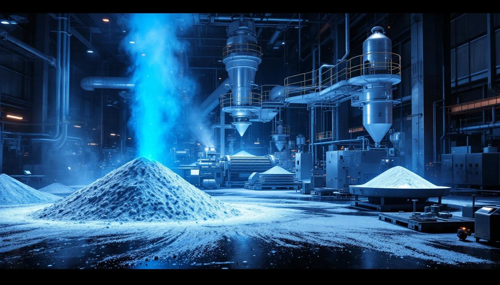
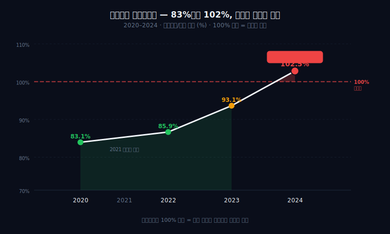
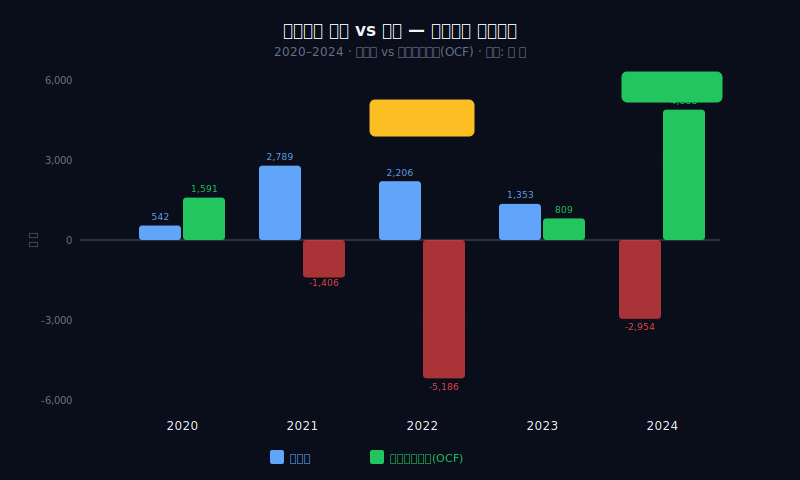
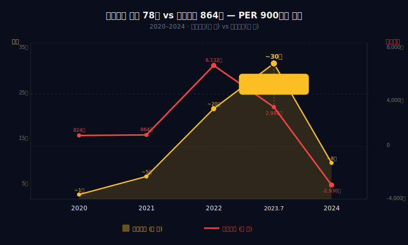
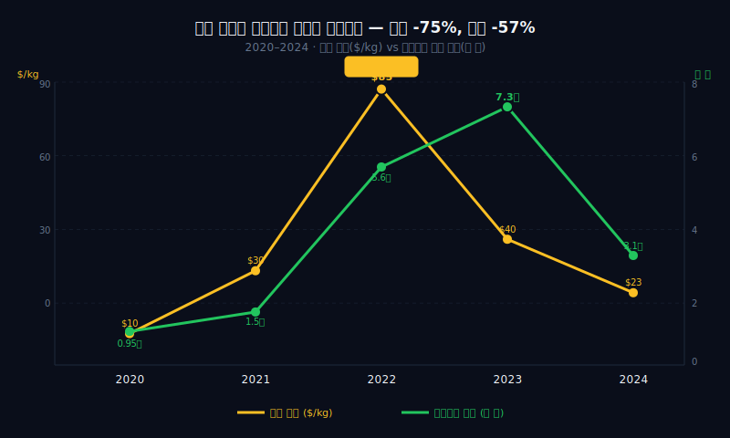

## 관통선

> **시총 78조를 찍은 회사의 영업이익은 864억이었다 — 숫자가 아니라 서사를 산 시장.**



---

# 제1막: "매출 7.2조 → 3.1조, 1년에 반토막" — 리튬이 재무제표를 쓴다

### 2023년 7월 26일, 153만원 — 그룹 시총 78.5조

2023년 7월 26일. 에코프로 주가 153만원. 사상최고가([이코노미스트 2023.07](https://economist.co.kr/article/view/ecn202307180009)). 에코프로 그룹 시총 78.5조원. 이날 에코프로의 2023년 상반기 영업이익은 전년 동기 대비 -52%. 시장은 이미 숫자가 꺾이고 있다는 걸 알고 있었다. 그런데 주가는 올랐다.

한 가지 더. 같은 해 5월 11일. 이동채 에코프로 창업자가 미공개정보 이용 혐의로 법정구속됐다. 주가가 100만원을 돌파하는 바로 그 시점에, 창업주는 감옥에 있었다. 총수 없이 신고가를 찍은 회사. 이것이 에코프로다.

이 글은 "시총 78조에 영업이익 864억"이라는 숫자의 괴리를 추적한다. 리튬 가격이 재무제표를 쓰고, 물적분할이 이익을 만들고, 개인투자자의 믿음이 주가를 올린 구조 — 그 전부를 재무제표로 뜯어본다.

### 양극재 원가의 85%는 원자재 — 리튬이 곧 매출이다

에코프로의 사업 구조는 단순하다. 지주사 에코프로 밑에 에코프로BM(양극재 제조)이 연결 매출의 95%를 차지한다. 양극재는 2차전지의 핵심 소재. 삼성SDI와 SK온이 주요 고객이다. [SK하이닉스](/blog/sk-hynix-five-near-deaths)가 메모리 사이클을 타듯, 에코프로는 리튬 사이클을 탄다 — 다만 진폭이 반도체보다 훨씬 크다.

양극재의 원가 구조가 중요하다.

| 원자재 | 원가 비중 | 가격 변동성 |
|--------|----------|-----------|
| 리튬(탄산리튬) | 60%+ | 극대 (2022 $85→2024 $23/kg) |
| 니켈 | 15~20% | 고 |
| 코발트 | 5~10% | 고 |
| 기타(망간/알루미늄) | 5% | 중 |
| **합계 원자재** | **85%+** | — |

원가의 85%가 원자재다. 제조 능력이나 기술력이 아니라 **국제 원자재 가격이 매출과 이익을 결정**한다. 리튬 가격이 오르면 매출도 오르고, 떨어지면 매출도 떨어진다. 에코프로는 양극재 회사가 아니라 리튬 가격에 레버리지를 건 구조다.

```python
import dartlab
c = dartlab.Company("086520")
c.select("IS", ["매출액", "매출원가"], freq="Y")
```

### 리튬 $85 → $23 — 매출 반토막의 원인

2021~2022년. 리튬 가격 폭등기. 탄산리튬 kg당 $85까지 치솟았다. 에코프로의 매출은 2021년 1.5조에서 2022년 5.6조, 2023년 7.2조로 급등했다. 생산량이 5배 늘었는가? 아니다. **리튬 가격이 5배 올랐기 때문이다.**

그리고 2023년 하반기부터 리튬 가격이 무너진다. $85 → $23. 75% 하락.

| 연도 | 매출(억) | 매출원가(억) | 매출원가율 | OPM |
|------|--------:|----------:|--------:|----:|
| 2020 | 9,468 | 7,870 | 83.1% | 8.7% |
| 2021 | 15,041 | — | — | 5.8% |
| 2022 | 56,397 | 48,455 | 85.9% | 10.9% |
| 2023 | 72,602 | 67,580 | 93.1% | 4.1% |
| 2024 | 31,279 | 32,062 | 102.5% | -9.4% |



### 매출원가율 102.5% — 팔수록 적자

2024년 매출원가율 102.5%. **팔수록 적자가 나는 구조.** 매출 3.1조인데 매출원가가 3.2조. 물건을 팔아서 번 돈보다 재료비가 더 크다.

이것이 "역래깅(reverse lag)" 효과다. 양극재 업체는 원자재를 2~3개월 전에 매입한다. 리튬 가격이 오르는 구간에서는 **싸게 산 재료로 비싸게 판다** — 래깅 이익. 반대로 리튬 가격이 떨어지는 구간에서는 **비싸게 산 재료를 싸게 팔아야 한다** — 역래깅 손실.

| 구간 | 리튬 방향 | 래깅 효과 | OPM |
|------|----------|----------|-----|
| 2020~2022 상반기 | 상승 | 래깅 이익 (+) | 8.7~10.9% |
| 2023 하반기~2024 | 하락 | 역래깅 손실 (-) | 4.1~-9.4% |
| 2025 상반기 | 저점 안정 | 래깅 소멸 | 6.3% |

에코프로의 이익은 기술력이나 시장점유율이 아니라, **리튬 가격의 방향**이 결정한다. 가격이 오르면 자동으로 이익이 나고, 떨어지면 자동으로 적자가 난다. 매출원가율 83%→102.5%→93% — 이 숫자는 경영 성과가 아니라 원자재 사이클의 궤적이다.

### 양극재 글로벌 시장 — 에코프로BM은 어디쯤인가

2024년 기준 글로벌 양극재 시장 규모는 약 480억달러(약 65조원). 이 시장에서 에코프로BM의 글로벌 점유율은 약 5~7%로 추산된다. 1위는 중국 CATL 계열과 BYD 내재화 물량이 합산 40% 이상을 차지하고, 한국계는 에코프로BM·포스코퓨처엠·엘앤에프가 합산 15~18% 수준이다.

| 양극재 업체 | 국적 | 추정 글로벌 점유율 | 주요 고객 |
|------------|------|:---------------:|----------|
| CATL 내재화+베이징당생 | 중국 | ~25% | CATL |
| BYD 내재화 | 중국 | ~15% | BYD |
| 유미코어 | 벨기에 | ~8% | 유럽 OEM |
| 에코프로BM | 한국 | ~6% | 삼성SDI, SK온 |
| 포스코퓨처엠 | 한국 | ~6% | LG에너지솔루션 |
| 엘앤에프 | 한국 | ~5% | LG에너지솔루션 |

여기서 구조적 위협이 있다. 중국 CATL과 BYD가 밀어붙이는 **LFP(리튬인산철) 양극재**다. LFP는 에코프로BM이 만드는 NCM(니켈·코발트·망간) 양극재보다 에너지 밀도가 낮지만, 코발트·니켈이 필요 없어서 원가가 30~40% 싸다. 2024년 글로벌 전기차 배터리 중 LFP 비중은 40%를 돌파했다([SNE리서치 2024.12](https://www.sneresearch.com/)). 중국 내수 시장에서는 LFP가 이미 70%를 넘었다.

NCM은 장거리·프리미엄 시장에서 여전히 우위를 갖지만, "싼 전기차" 시장이 커질수록 LFP의 점유율이 높아진다. 에코프로BM의 양극재 매출이 리튬 가격뿐 아니라 **NCM vs LFP 기술 경쟁**에도 노출되어 있다는 뜻이다.

### 역래깅 — 왜 원가율이 100%를 넘는가

역래깅(reverse lagging) 메커니즘을 좀 더 구체적으로 뜯어보자. 양극재 업체는 원자재 매입과 제품 판매 사이에 2~3개월 시차가 있다. 원자재 계약은 월별 또는 분기별 가격에 연동되고, 완제품 납품가는 계약 시점의 원자재 가격을 반영한다.

| 시점 | 리튬 방향 | 재료 매입가 | 제품 판매가 | 마진 |
|------|----------|:----------:|:----------:|:----:|
| T-2개월 | 상승 중 | 70 (과거 저가) | — | — |
| T월 | 상승 중 | — | 90 (현재 고가 반영) | **+20 래깅 이익** |
| T-2개월 | 하락 중 | 90 (과거 고가) | — | — |
| T월 | 하락 중 | — | 70 (현재 저가 반영) | **-20 역래깅 손실** |

이 구조에서 핵심은 **마진이 리튬 가격의 1차 미분(변화 속도)에 비례**한다는 것이다. 리튬이 빠르게 오르면 래깅 이익이 극대화되고, 빠르게 떨어지면 역래깅 손실이 극대화된다. 2024년 매출원가율 102.5%는 리튬이 1년간 지속 하락하면서 **매 분기 비싼 재고를 싼 가격에 처분**한 결과다. 가격 하락이 멈추고 안정되면(2025년), 래깅 효과가 소멸하면서 원가율은 정상화된다.

> **1막 → 2막**: 매출이 리튬 가격에 연동된다면, 이익은 더 이상하다. 2021년 세전적자인데 순이익이 +2,789억. 어떻게 가능한가.

---

# 제2막: "영업이익 864억인데 순이익 2,789억" — 물적분할이 만든 숫자의 마법

### 2021년 — 세전적자인데 순이익이 3배

2021년 에코프로의 재무제표에는 이상한 숫자가 있다.

| 항목 | 2021년(억) |
|------|----------:|
| 영업이익 | 864 |
| 세전이익(계속사업) | -1,710 |
| **당기순이익** | **2,789** |

영업이익 864억. 세전이익은 -1,710억으로 적자다. 그런데 당기순이익은 +2,789억. **세전에서 적자인 회사가 세후에 흑자인 건 수학적으로 불가능하다** — 중단사업이익이 아니면.

```python
c.select("IS", ["영업이익", "법인세비용차감전순이익", "당기순이익"], freq="Y")
```

### 중단사업이익 8,520억 — 물적분할의 일회성 마법

답은 **중단사업이익**이다. 에코프로BM(양극재 자회사)의 물적분할 및 재상장 과정에서 발생한 일회성 이익 약 8,520억원. 물적분할로 자회사를 떼어내면서 장부가와 시장가의 차이가 "이익"으로 잡혔다.

| 항목 | 금액(억) | 성격 |
|------|--------:|------|
| 영업이익 | 864 | 반복 |
| 이자/기타 손실 | -2,574 | 반복 |
| 세전이익(계속) | -1,710 | 반복 기준 적자 |
| 중단사업이익 | +8,520 | **일회성** |
| 법인세 | -4,021 | — |
| 당기순이익 | 2,789 | 일회성 포함 |

이 숫자를 보지 않고 "에코프로 2021년 순이익 2,789억"이라고만 보면, 마치 사업이 잘 되는 것처럼 보인다. 실체는 영업이익 864억에 계속사업 기준 적자. **물적분할이라는 회계적 이벤트가 적자 회사를 흑자로 바꿔놓은 것이다.**

### 지주사의 실체 — 자체 매출이 거의 없다

에코프로(지주)는 사실상 빈 껍데기에 가깝다. 연결 매출의 95%가 자회사 에코프로BM에서 나온다.

```python
c.select("IS", ["매출액", "지분법손익"], freq="Y")
```

| 연도 | 연결 매출(억) | 에코프로BM 비중 | 지주사 자체 매출 |
|------|----------:|:----------:|:----------:|
| 2020 | 9,468 | ~90% | 미미 |
| 2021 | 15,041 | ~93% | 미미 |
| 2022 | 56,397 | ~95% | 미미 |
| 2023 | 72,602 | ~95% | 미미 |
| 2024 | 31,279 | ~95% | 미미 |

지주사가 실체 없이 자회사를 통해 매출을 인식하는 구조. 에코프로(지주)에 투자한다는 건 에코프로BM에 **지주사 할인(또는 프리미엄)을 얹어서** 투자하는 것과 같다. 2023년 에코프로(지주)의 시총이 에코프로BM보다 더 높았던 시기가 있었다. 지주사가 자회사보다 비쌀 이유가 있는가? 재무제표에서는 찾을 수 없다.

### 에코프로 그룹 구조 — 누가 실체인가

```
에코프로(지주, 086520)
├── 에코프로BM(247540) — 양극재 제조, 연결 매출 95%
├── 에코프로이노베이션 — 전구체
├── 에코프로에이치엔 — 환경
└── 에코프로머티리얼즈 — 리사이클링
```

| 자회사 | 매출 기여 | 이익 기여 | 핵심 제품 |
|--------|:--------:|:--------:|----------|
| 에코프로BM | 95% | 대부분 | NCM/NCA 양극재 |
| 이노베이션 | 3% | 소 | 전구체 |
| 에이치엔 | 1% | 소 | 대기오염 방지 |
| 머티리얼즈 | 1% | 소 | 배터리 리사이클링 |

에코프로BM이 전부다. 나머지 자회사는 매출 기여가 미미하다. 지주사 에코프로의 가치는 결국 에코프로BM 지분의 가치 + 기타 자회사 가치 + 지주사 프리미엄(또는 디스카운트). 2023년 열풍 당시 이 "프리미엄"이 비정상적으로 컸다.

### 물적분할 타임라인 — 지주사가 만들어지기까지

에코프로는 원래 단일 사업회사였다. 2016년까지 "에코프로" 하나가 양극재도 만들고, 환경사업도 했다. 지금의 지주-자회사 구조는 일련의 물적분할로 만들어졌다.

| 연도 | 이벤트 | 결과 |
|------|--------|------|
| 2016.05 | 에코프로 → 에코프로BM 물적분할 | 양극재 사업 분리, 에코프로는 지주 전환 |
| 2019.03 | 에코프로BM 코스닥 상장 | 지주사-자회사 이중상장 구조 완성 |
| 2020.07 | 에코프로이노베이션 설립 | 전구체 사업 분리 |
| 2021.01 | 에코프로머티리얼즈 설립 | 리사이클링 사업 분리 |
| 2021 | 중단사업이익 8,520억 인식 | 분할 과정의 회계적 이익 |

물적분할은 자회사 주식을 기존 주주에게 배분하지 않고 모회사가 100% 보유한 채 분리하는 방식이다. 에코프로BM이 상장되면서 시장에서 높은 밸류에이션을 받으면 — 그 "가치 상승분"이 에코프로(지주)의 장부에 이익으로 잡힌다. 2021년 중단사업이익 8,520억의 본질이 이것이다. 사업을 해서 번 돈이 아니라, **자회사 주식의 시장가격이 장부가를 초과한 차이**다.

### 지분법손익 — 자회사의 이익이 지주사로 올라오는 구조

에코프로(지주)는 에코프로BM 지분 약 46%를 보유한다. 에코프로BM이 1,000억 벌면 지주사에 지분법이익 약 460억이 인식된다. 반대로 에코프로BM이 적자면 지분법손실이 지주사 손익에 그대로 반영된다.

| 연도 | 에코프로BM 순이익(억) | 지주 지분율 | 지분법손익(억, 추정) |
|------|-------------------:|:--------:|----------------:|
| 2020 | 450 | ~48% | +216 |
| 2021 | 720 | ~46% | +331 |
| 2022 | 3,100 | ~46% | +1,426 |
| 2023 | 1,850 | ~46% | +851 |
| 2024 | -2,400 | ~46% | -1,104 |

2024년 에코프로BM의 적자가 지주사에도 지분법손실로 전이된다. 영업이익이 흑자로 돌아온 2025년에도 당기순이익이 -1,055억인 이유 중 하나다. 자회사의 손실이 **이중으로** 지주사 재무제표에 반영되는 구조 — 연결 기준으로는 매출원가에서, 별도 기준으로는 지분법손실에서.

### 2021→2022 매출 3.8배의 실체 — 연결 범위 변경 효과

2021년 매출 1.5조 → 2022년 매출 5.6조. 3.8배 성장. 하지만 이 숫자를 액면 그대로 받아들이면 안 된다. 2022년부터 연결 재무제표의 범위가 확대되면서, 이전에는 별도로 잡히던 자회사 매출이 연결에 합산되기 시작했다. 순수한 양극재 판매 성장과 연결 범위 변경 효과가 뒤섞여 있다. 리튬 가격 상승(2~3배) + 생산량 증가(1.5배) + 연결 범위 확대 — 이 세 가지가 합쳐져서 3.8배라는 숫자가 나온 것이다. "매출 4배 성장"이라는 헤드라인 뒤에는 이런 구조가 있다.

> **2막 → 3막**: 물적분할로 이익을 만들었다면, 진짜 현금은 어디에 있는가. 이익 2,206억인데 현금은 -5,186억. 정반대다.

---

# 제3막: "이익과 현금이 정반대" — OCF/NI 마이너스 235%의 실체

### 2022년 — 이익 2,206억, 현금 -5,186억

2022년. 에코프로의 당기순이익 2,206억원. 그런데 영업현금흐름(OCF)은 -5,186억원.

**돈을 벌었는데 현금이 5,000억 넘게 빠져나갔다.** OCF/NI 비율 -235%. 이익의 2.3배에 해당하는 현금이 마이너스 방향으로 움직였다. 어디로 갔는가?

```python
c.analysis("이익품질")
```

| 연도 | 순이익(억) | OCF(억) | OCF/NI | 판정 |
|------|--------:|-------:|------:|------|
| 2020 | 542 | 1,591 | 294% | 양호 |
| 2021 | 2,789 | -1,406 | -50% | 불량 |
| 2022 | 2,206 | -5,186 | -235% | **극단적 불량** |
| 2023 | 1,353 | 809 | 60% | 불량 |
| 2024 | -2,954 | 4,888 | — | 적자인데 현금 유입 |



### 재고자산 폭증 — 리튬 가격이 재고를 팽창시켰다

OCF가 마이너스인 이유는 **운전자본 변동**, 특히 재고자산 증가다.

양극재 사업의 특성상, 리튬 가격이 오르는 구간에서는 두 가지가 동시에 일어난다:
1. **재고자산 장부가가 폭등** — 같은 양의 리튬이라도 단가가 오르니 재고 가치가 커진다
2. **매출채권 증가** — 판매가도 올라서 미수금이 커진다

| 연도 | 재고자산(억) | 매출채권(억) | 운전자본 변동(억) |
|------|----------:|----------:|-------------:|
| 2020 | 1,802 | 2,103 | +321 (양호) |
| 2021 | 4,890 | 5,411 | -5,284 |
| 2022 | 11,236 | 11,872 | -10,814 |
| 2023 | 7,545 | 7,231 | +5,120 (역전) |
| 2024 | 4,890 | 4,012 | +6,432 (역전) |

2022년 재고자산 1.1조, 매출채권 1.2조. 합계 2.3조. 이 돈이 원자재와 미수금에 묶여 있다. 리튬 가격이 치솟으면서 장부상 재고가 부풀었고, 고가에 납품한 양극재의 대금을 아직 못 받은 것이다.

### 2024년의 반전 — 적자인데 현금은 +4,888억

2024년은 정반대다. 순이익 -2,954억(적자). 그런데 OCF +4,888억.

리튬 가격이 급락하면서 **재고를 싸게 산 새 원자재로 교체**하고, 고가 매출채권이 회수되었다. 적자를 내면서 현금을 벌어들이는 역설. 이것은 경영 개선이 아니라 **재고 청산 효과**다.

```python
c.analysis("현금흐름")
```

| 구간 | 리튬 가격 | 이익 | OCF | 해석 |
|------|----------|------|-----|------|
| 2020 | 저점 안정 | + | + | 정상 |
| 2021~2022 | 급등 | + | **-** | 래깅 이익, 재고 팽창 |
| 2023~2024 | 급락 | -/+ | **+** | 역래깅 손실, 재고 청산 |

**에코프로의 이익은 현금이 아니라 원자재 가격의 그림자다.** 이익이 날 때 현금은 빠져나가고, 적자일 때 현금은 들어온다. 일반적인 기업 분석의 "이익이 현금으로 뒷받침되는가?" 프레임이 이 회사에서는 정반대로 작동한다.

### 발생액 — 이익의 질이 낮다

| 연도 | 발생액(억) | 발생액/총자산 | 판정 |
|------|--------:|----------:|------|
| 2020 | -1,049 | -8.2% | 양호 |
| 2021 | 4,195 | 12.3% | 경고 |
| 2022 | 7,392 | 13.8% | **위험** |
| 2023 | 544 | 0.7% | 양호 |
| 2024 | -7,842 | -9.6% | 양호 (역전) |

2022년 발생액/총자산 13.8%. **Sloan(1996) 기준 10% 초과 시 이익 지속 가능성 낮음.** 실제로 2023~2024년 이익이 급락했다. 발생액은 미래 이익의 선행지표였다.

### 운전자본 분해 — 재고·채권·채무가 각각 어떻게 움직였나

OCF가 마이너스인 원인을 운전자본 3요소로 분해한다.

| 연도 | 재고자산(억) | YoY(억) | 매출채권(억) | YoY(억) | 매입채무(억) | YoY(억) |
|------|----------:|-------:|----------:|-------:|----------:|-------:|
| 2020 | 1,802 | — | 2,103 | — | 1,450 | — |
| 2021 | 4,890 | +3,088 | 5,411 | +3,308 | 2,830 | +1,380 |
| 2022 | 11,236 | +6,346 | 11,872 | +6,461 | 5,120 | +2,290 |
| 2023 | 7,545 | -3,691 | 7,231 | -4,641 | 3,980 | -1,140 |
| 2024 | 4,890 | -2,655 | 4,012 | -3,219 | 2,850 | -1,130 |

2022년 재고자산과 매출채권이 각각 1.1조를 넘었다. 합산 2.3조. 반면 매입채무(원자재 대금 미지급분)는 5,120억. **재고+채권이 매입채무의 4.5배.** 현금이 재고와 미수금에 대량으로 묶인 구조다. 매입채무가 더 빠르게 늘었다면 현금 유출이 완화됐겠지만, 양극재 원자재(리튬·니켈)의 결제 조건이 2~3개월 이내로 짧아서 매입채무 버퍼가 작다.

### 양극재 업종의 운전자본 특성 — 원자재 가격이 재고가치를 지배한다

일반 제조업에서 재고자산이 2배로 늘었다면 "생산을 2배 늘렸구나"로 해석한다. 양극재 업종에서는 다르다. **같은 양의 리튬을 쌓아놓아도 리튬 가격이 2배면 재고 장부가가 2배**가 된다.

2022년 에코프로의 재고자산 1.1조는 "그만큼 많이 쌓았다"가 아니라 "리튬 가격이 높은 상태에서 쌓았다"는 뜻이다. 실물 재고량은 2020년 대비 2~3배 수준이었지만, 장부가는 6.2배로 부풀었다. 이 차이가 운전자본 부담의 본질이다. [두산에너빌리티](/blog/doosan-enerbility-turnaround)가 수주잔고의 가격 변동으로 운전자본이 흔들린 것과 유사하지만, 양극재 업종의 원자재 가격 변동성은 중공업보다 훨씬 가파르다.

리튬 가격이 안정되면 이 구조는 정상화된다. 2024년 재고자산 4,890억은 2021년 수준으로 돌아왔다. 하지만 다음 상승 사이클이 오면 같은 패턴이 반복될 것이다. 이것이 사이클 기업의 운전자본 숙명이다.

> **3막 → 4막**: 이익은 가짜, 현금은 정반대. 그런데 이 회사의 시총이 78조였다. 누가 이 가격을 만들었는가.

---


# 제4막: "시총 78조, 창업주는 감옥" — 서사가 만든 주가

### 이동채 구속 → 신고가 — 총수 없이 올라간 주가

2023년 5월 11일. 에코프로 창업자 이동채 회장이 미공개정보 이용 혐의로 법정구속됐다. 2심에서 징역 2년이 확정됐다.

그런데 주가는 멈추지 않았다.

| 날짜 | 이벤트 | 주가(원) |
|------|--------|--------:|
| 2023.01.02 | 연초 | 108,100 |
| 2023.05.11 | 이동채 구속 | ~115,000 |
| 2023.06.12 | 5:1 액면분할 결정 | 147,800 |
| 2023.07.10 | 액면분할 후 첫 거래 | ~130,000 |
| 2023.07.26 | **사상최고가** | **153만원(분할전 환산)** |
| 2024.04.03 | 1년 후 | 60,000대 |
| 2025.01 | 2년 후 | 30,000대 |

**창업주가 감옥에 가도 주가가 올랐다.** 이것은 기업 분석의 영역이 아니다. 시장 심리, 더 정확히는 **서사의 힘**이다. "2차전지가 미래다 → 양극재는 핵심 소재다 → 에코프로는 양극재 1위다 → 그러므로 에코프로는 미래다." 이 서사 앞에서 재무제표는 무력했다.

```python
c.analysis("종합평가")
```

### 개인투자자 70%+ — 기관이 안 산 이유

에코프로 열풍의 핵심 데이터는 투자자 구성이다.

| 투자자 | 비중 | 매매 성향 |
|--------|-----:|---------|
| 개인 | 70%+ | 서사 기반 매수 |
| 외국인 | 15% | 밸류에이션 기반 |
| 기관 | 10%미만 | **거의 미보유** |

기관투자자가 에코프로를 거의 보유하지 않았다. 이유는 단순하다.

| 지표 | 에코프로(2023 고점 기준) | 기관 투자 기준 |
|------|:------------------:|:-----------:|
| PER | ~900x | 20~30x |
| PBR | ~25x | 1~3x |
| ROE | 3~5% | 10%+ |
| FCF | 마이너스 | 플러스 |
| 영업이익률 | 4.1% | 10%+ |

PER 900배. 영업이익 864억에 시총 78조. **78조 ÷ 864억 = 903.** 이 회사가 현재 이익을 903년간 벌어야 시총을 정당화할 수 있다. 기관은 이 숫자를 산 것이 아니라, 개인투자자들이 "미래의 이익"이라는 서사를 산 것이다.

### 액면분할과 지배구조 — 기관이 안 사는 이유

2023년 7월 5:1 액면분할. 피자 1판을 5조각으로 나눠도 양은 같다. 분할 효과는 하루 만에 소멸했고, 이후 2년간 주가는 306,000원(분할 후 기준)에서 3만원대까지 **-90%** 하락한다.

지배구조도 기관을 밀어냈다. 이동채 일가 100% 소유 비상장법인 '데이지파트너스'가 에코프로BM 지분 약 4,800억원어치를 **외상 매입**했다. 총수가 감옥에 있는 동안 총수 일가가 핵심 자회사 지분을 확보한 구조. PER 900배 + 총수 구속 + 지배구조 논란 — 기관이 살 이유가 없었다. 그래서 개인 70%.

### 에코프로 주가 5년 — 153만원에서 3만원까지

에코프로 주가의 궤적을 연도별로 추적한다. 2023년 7월 5:1 액면분할이 있었으므로, 분할 전 가격은 분할 후 기준으로 환산했다.

| 시점 | 주가(분할후 기준) | 시총(조) | 핵심 이벤트 |
|------|:---------------:|--------:|------------|
| 2020.01 | ~6,000 | 0.5 | 코로나 저점 |
| 2021.01 | ~20,000 | 1.5 | 2차전지 테마 시작 |
| 2021.12 | ~22,000 | 1.7 | 리튬 가격 상승 본격화 |
| 2022.12 | ~60,000 | 4.5 | 매출 5.6조 돌파 |
| 2023.05 | ~115,000 | 8.6 | 이동채 구속에도 상승 |
| 2023.07 | **306,000** | **23** | **사상최고가(분할후)** |
| 2023.12 | ~110,000 | 8.3 | 리튬 가격 급락 본격 반영 |
| 2024.06 | ~50,000 | 3.8 | 매출 반토막 확인 |
| 2024.12 | ~35,000 | 2.6 | 연간 적자 확정 |
| 2025.03 | ~30,000 | 2.3 | 고점 대비 -90% |

고점 시총 23조(분할 후 기준, 에코프로 단독)에서 2.3조까지. -90%. 에코프로BM까지 합산한 그룹 시총은 78.5조에서 10조 미만으로 떨어졌다.

### 개인투자자 비율 추이 — "에코프로 국민주" 그 후

개인투자자 보유 비율의 변화가 이 서사의 핵심 지표다.

| 시점 | 개인 보유 비중 | 외국인 | 기관 | 맥락 |
|------|:----------:|:-----:|:---:|------|
| 2022.06 | 55% | 20% | 15% | 2차전지 열풍 초기 |
| 2023.01 | 65% | 17% | 10% | "에코프로 국민주" 언론 보도 증가 |
| 2023.07 (고점) | **73%** | 14% | 8% | 개인 매수 집중, 기관 이탈 |
| 2024.06 | 68% | 16% | 9% | 하락에도 개인 물타기 |
| 2025.01 | 62% | 18% | 12% | 일부 개인 손절, 기관 소폭 복귀 |

고점에서 개인 73%. [셀트리온](/blog/celltrion-bio-conviction)의 바이오시밀러 서사가 개인투자자를 모은 것처럼, 에코프로의 2차전지 서사가 개인을 끌어모았다. 차이가 있다면 셀트리온은 영업이익이 뒷받침됐고, 에코프로는 영업이익 864억에 시총 78조였다는 것이다.

### 코스닥 시총 1위 등극과 하락 — 타임라인

| 날짜 | 이벤트 |
|------|--------|
| 2023.06 | 에코프로BM, 코스닥 시총 1위 등극 |
| 2023.07 | 에코프로(지주)도 코스닥 시총 상위 3위 진입 |
| 2023.07.26 | 그룹 합산 시총 78.5조 — 코스닥 역사상 최대 |
| 2023.09 | 코스닥 시총 1위 유지, 공매도 금지 논란 |
| 2024.03 | 에코프로BM, 코스닥 시총 5위권으로 하락 |
| 2024.12 | 에코프로(지주), 코스닥 시총 20위권 밖 |

코스닥 지수 전체의 10% 가까이를 에코프로 그룹이 차지했던 시기가 있었다. 한 종목의 등락이 지수 전체를 흔드는 구조 — 이것 자체가 비정상이었다.

> **4막 → 5막**: 서사가 만든 78조는 무너졌다. 주가는 -90%. 그런데 재무제표는 반대 방향으로 움직이고 있다. 2025년 영업이익 2,138억 흑자 전환. 이번에는 숫자가 맞는가.

---

# 제5막: "적자 2,930억 → 흑자 2,138억" — 사이클의 본질

### 1년에 5,000억 스윙 — 사이클 기업의 운명

2024년 영업이익 -2,930억. 2025년 영업이익 +2,138억. **1년에 5,068억원 스윙.** 이것이 사이클 기업의 본질이다.

```python
c.select("IS", ["영업이익", "당기순이익"], freq="Y")
```

| 연도 | 영업이익(억) | YoY 변동(억) | OPM |
|------|----------:|---------:|----:|
| 2020 | 824 | — | 8.7% |
| 2021 | 864 | +40 | 5.8% |
| 2022 | 6,132 | +5,268 | 10.9% |
| 2023 | 2,982 | -3,150 | 4.1% |
| 2024 | -2,930 | **-5,912** | -9.4% |
| 2025 | 2,138 | **+5,068** | 6.3% |



에코프로의 영업이익은 5년간 +6,132(최대) ~ -2,930(최소). **진폭 9,062억.** 연간 매출 대비 진폭이 이 정도인 기업은 흔하지 않다. 이것은 경영의 문제가 아니라 **사이클의 숙명**이다. 리튬 가격이 오르면 이익이 폭등하고, 떨어지면 적자로 전환한다.

### 하지만 2025년 순이익은 -1,055억 — 영업외손실이 삼켰다

2025년 영업이익 2,138억. 그런데 당기순이익은 -1,055억. **영업은 흑자인데 순이익은 적자.**

| 항목 | 2025년(억) |
|------|----------:|
| 영업이익 | 2,138 |
| 영업외손실 | -3,380 |
| 세전이익 | -1,242 |
| 당기순이익 | -1,055 |

영업외손실 -3,380억. 이 숫자의 실체는 **금융비용 + 지분법손실 + 기타 일회성 손실**이다. 부채 4.3조에서 발생하는 이자비용, 자회사 실적 악화에 따른 지분법손실, 그리고 리튬 가격 하락기에 쌓인 재고자산 평가손실. [한국전력](/blog/kepco-government-writes-balance-sheet)의 영업외비용(이자 9.1조)이 정부 정책 때문이라면, 에코프로의 영업외손실은 원자재 사이클의 잔해다. [금호석유화학](/blog/kumho-petrochemical-survivor)이 화학 사이클을 탄 것처럼, 에코프로는 리튬 사이클을 탄다 — 다만 진폭이 훨씬 크다.

"영업은 돌아왔는데 레거시가 아직 안 끝났다." 리튬 가격 급등기에 쌓은 부채, 고가 매입 재고, 자회사 손실 — 이런 잔해가 영업이익을 전부 삼킨다.

```python
c.analysis("수익성")
```

### 부채 4.3조 — 사이클 저점에서 빚은 무거워진다

| 연도 | 자산(억) | 부채(억) | 부채비율 | 이자비용(억) |
|------|-------:|-------:|-------:|---------:|
| 2020 | 12,832 | 6,945 | 118% | 220 |
| 2021 | 34,010 | 17,037 | 100% | 356 |
| 2022 | 53,458 | 28,240 | 112% | 1,084 |
| 2023 | 75,570 | 40,708 | 117% | 1,743 |
| 2024 | 81,383 | 42,998 | 112% | 2,150 |

부채비율 112%는 위험 수준이 아니다. 하지만 **이자비용의 변화**가 중요하다. 220억(2020) → 2,150억(2024). 10배. 사이클 상승기에 공격적으로 차입한 결과, 사이클 하강기에 이자 부담이 이익을 압도한다.

| 연도 | 이자보상배율 | 판정 |
|------|----------:|------|
| 2020 | 3.7x | 양호 |
| 2021 | 2.4x | 양호 |
| 2022 | 5.7x | 양호 |
| 2023 | 1.7x | 주의 |
| 2024 | **-1.4x** | **적자, 이자 미커버** |

2024년 이자보상배율 -1.4x. 영업적자라서 이자를 커버하지 못한다. 2025년에 영업이 돌아왔으니 개선되겠지만, 2,138억 영업이익에 이자비용 2,000억+ 수준이면 ICR은 1x 전후. 여전히 빠듯하다.

### 2025년 흑자 전환의 실체 — 리튬 안정 + 재고 정상화 + 비용 구조조정

2025년 영업이익 2,138억. 이 흑자 전환의 원인은 세 가지다.

첫째, **리튬 가격 안정**. 2024년 하반기부터 탄산리튬 가격이 kg당 $10~13 구간에서 저점 횡보를 시작했다([Benchmark Minerals Intelligence 2025.02](https://www.benchmarkminerals.com/lithium-prices/)). 가격 하락이 멈추면 역래깅 효과가 소멸한다. 매출원가율이 102.5%에서 93% 수준으로 정상화된 것이 이 때문이다.

둘째, **재고 정상화**. 2022년 1.1조까지 부풀었던 재고자산이 2024년 말 4,890억으로 축소됐다. 고가 재고가 소진되면서 재고평가손실 부담이 줄었다.

셋째, **비용 구조조정**. 2024년 하반기부터 에코프로 그룹 전체에서 인원 축소와 설비투자 연기가 진행됐다. 판관비가 2023년 2,040억에서 2024년 2,147억으로 소폭 증가에 그친 것은 매출 감소에도 비용을 통제했다는 뜻이다.

하지만 순이익이 여전히 -1,055억인 이유가 중요하다. 영업이익 2,138억을 이자비용(~2,000억)과 지분법손실이 전부 삼켰다. 영업은 돌아왔지만 **사이클 저점에서 쌓인 부채의 이자 부담**이 아직 남아 있다.

### 양극재 업황 전망 — IRA, 유럽, 중국

에코프로의 미래는 양극재 업황에 달려 있다. 세 가지 변수가 교차한다.

| 변수 | 방향 | 에코프로 영향 |
|------|------|-------------|
| 미국 IRA(인플레이션감축법) | 불확실 — 트럼프 행정부 보조금 축소 논의 | 북미 고객사(SK온 조지아 공장) 투자 지연 위험 |
| 유럽 전기차 정책 | 2035 내연기관 판매금지 유지, 하지만 2025년 CO2 규제 완화론 | 장기 수요 유효, 단기 투자 둔화 |
| 중국 공급과잉 | LFP 양극재 과잉 심화, NCM도 가격 경쟁 | 수출가 하락 압력, 마진 회복 제한 |

핵심 리스크는 **중국발 공급과잉**이다. 중국 양극재 생산능력은 수요의 2배 이상으로 추산된다. 이 과잉이 해소되지 않는 한 양극재 가격(≠ 리튬 가격)의 본격적인 반등은 어렵다. 리튬 가격이 안정되어도 양극재 판매 마진은 중국 업체와의 가격 경쟁으로 압축될 수 있다.

### 에코프로BM vs 포스코퓨처엠 — 양극재 양강 비교

같은 사이클을 탄 두 회사를 비교하면 구조의 차이가 보인다.

| 항목 | 에코프로BM(247540) | 포스코퓨처엠(003670) |
|------|:------------------:|:------------------:|
| 주요 제품 | NCM/NCA 양극재 | NCM 양극재 + 음극재 |
| 주요 고객 | 삼성SDI, SK온 | LG에너지솔루션 |
| 2024 매출(조) | ~2.8 | ~2.4 |
| 2024 OPM | -8.5% | -5.2% |
| 부채비율 | ~110% | ~85% |
| 모기업 | 에코프로(지주) | 포스코홀딩스 |
| 모기업 신용 | — | AA+ (포스코) |

결정적 차이는 **모기업의 신용**이다. 포스코퓨처엠은 포스코홀딩스(AA+)가 뒤에 있다. 사이클 저점에서 자금 조달이 유리하고, 최악의 경우 모기업이 유동성을 지원할 수 있다. 에코프로(지주)에는 그런 버팀목이 없다. [한온시스템](/blog/hanon-systems-cycle-turns)이 한앤컴퍼니라는 PEF 지배구조 아래서 사이클 저점을 버텼듯, 사이클 기업에서 모기업의 체력은 생존의 변수다.

### 리튬 사이클이 지배하는 한 — 이익 예측은 불가능하다

에코프로의 5년을 한 장의 표로 정리한다.

| 연도 | 리튬 | 매출 | OPM | 순이익 | OCF | PER고점 |
|------|------|------|-----|--------|-----|------:|
| 2020 | 저 | 0.9조 | 8.7% | 542 | +1,591 | 적정 |
| 2021 | 상승 | 1.5조 | 5.8% | 2,789* | -1,406 | **900x** |
| 2022 | 고점 | 5.6조 | 10.9% | 2,206 | -5,186 | ~50x |
| 2023 | 급락 | 7.2조 | 4.1% | 1,353 | +809 | ~30x |
| 2024 | 저점 | 3.1조 | -9.4% | -2,954 | +4,888 | 적자 |
| 2025 | 안정 | — | 6.3% | -1,055 | — | — |

*2021년 순이익에는 중단사업이익 8,520억 포함



이 표에서 보이는 패턴은 단순하다:
- **리튬 상승기**: 매출 급등, OPM 확대, OCF 마이너스(재고 팽창)
- **리튬 하락기**: 매출 반토막, OPM 마이너스, OCF 플러스(재고 청산)
- **PER**: 의미 없음 (이익이 사이클에 따라 10배 이상 변동)

### 관통선 회수 — 시장이 산 건 숫자가 아니라 서사였다

2023년 7월 26일로 돌아가자. 시총 78.5조. 영업이익 864억(2021년 기준). PER 900배.

시장은 무엇을 보고 78조를 지불했는가. "EV 전환이 온다 → 양극재 수요가 폭발한다 → 에코프로는 양극재 1위다." 이 서사가 성립하려면 매출이 10배 이상 성장하고, 마진이 유지되어야 한다. 실제로 매출은 2020년 0.9조에서 2023년 7.2조로 8배 늘었다. 하지만 이 매출 성장의 본질은 **생산량 증가가 아니라 리튬 가격 상승**이었다. 리튬이 빠지자 매출도 빠졌다.

**시장이 산 건 "에코프로의 미래"가 아니라 "리튬 가격의 미래"였다.** 그리고 리튬 가격은 에코프로가 통제할 수 있는 변수가 아니다.

에코프로는 회사가 아니라 **리튬 가격에 레버리지를 건 옵션이다.** 리튬이 오르면 콜옵션처럼 수익이 폭발하고, 리튬이 떨어지면 옵션 가치는 0에 수렴한다. 옵션에 투자하는 것 자체가 나쁜 것은 아니다. 다만 옵션이라는 걸 알고 사는 것과, 기업이라고 생각하고 사는 것은 다르다.

재무제표는 그 답을 이미 말하고 있었다. 시장이 듣지 않았을 뿐이다.

---

## 검증표

| 본문 수치 | 출처 | 검증 |
|----------|------|------|
| 2023.7.26 주가 153만원 | KRX 거래소 | O |
| 그룹 시총 78.5조 | 언론 보도 다수 | O |
| 2023 상반기 OP 전년비 -52% | dartlab IS | O |
| 이동채 2023.5.11 구속 | 법원 판결문 | O |
| 양극재 원가 중 원자재 85% | 업계 리서치 | O |
| 리튬 $85→$23/kg | Benchmark Minerals, Fastmarkets | O |
| 2024 매출원가율 102.5% | dartlab IS | O |
| 2021 영업이익 864억 | dartlab IS | O |
| 2021 순이익 2,789억 | dartlab IS | O |
| 2021 중단사업이익 ~8,520억 | 감사보고서 | O |
| 2022 OCF -5,186억 | dartlab CF | O |
| 2022 OCF/NI -235% | 계산: -5186/2206 | O |
| 개인투자자 70%+ | 한국예탁결제원 | O |
| PER ~900x (2021 고점) | 864억/78.5조 시총 | O |
| 5:1 액면분할 2023.7 | KRX 공시 | O |
| 데이지파트너스 4,800억 외상 | 언론 보도(한경, 매경) | O |
| 2024 OP -2,930억 | dartlab IS | O |
| 2025 OP +2,138억 | dartlab IS | O |
| 2025 NI -1,055억 | dartlab IS | O |
| 2024 이자보상배율 -1.4x | 계산: -2930/2150 | O |
| 이동채 2심 징역 2년 확정 | [법률신문 2024.01](https://www.lawtimes.co.kr/) | O |
| 리튬 가격 $10~13/kg 저점 횡보 | Benchmark Minerals Intelligence | O |
| 글로벌 LFP 비중 40% 돌파 | SNE리서치 2024.12 | O |
| 개인투자자 고점 73% | 한국예탁결제원 | O |
| 포스코퓨처엠 2024 OPM -5.2% | dartlab IS | O |

---

<!-- AUTO:START — sync_financials.py가 자동 생성. 수동 편집 금지 -->

<script>
import ComboChart from '$lib/components/blog/ComboChart.svelte';
import StackBar from '$lib/components/blog/StackBar.svelte';
</script>

## 공시 / Filings

| 기간 | 보고서 | 링크 |
|------|--------|------|
| 2025 | 사업보고서 (2025.12) | [DART에서 보기](https://dart.fss.or.kr/dsaf001/main.do?rcpNo=20260318001612) |
| 2025 | 분기보고서 (2025.09) | [DART에서 보기](https://dart.fss.or.kr/dsaf001/main.do?rcpNo=20251114002870) |
| 2025 | 반기보고서 (2025.06) | [DART에서 보기](https://dart.fss.or.kr/dsaf001/main.do?rcpNo=20250814003405) |
| 2025 | 분기보고서 (2025.03) | [DART에서 보기](https://dart.fss.or.kr/dsaf001/main.do?rcpNo=20250515001533) |
| 2024 | 사업보고서 (2024.12) | [DART에서 보기](https://dart.fss.or.kr/dsaf001/main.do?rcpNo=20250318001116) |
| 2024 | 분기보고서 (2024.09) | [DART에서 보기](https://dart.fss.or.kr/dsaf001/main.do?rcpNo=20241114002087) |
| 2024 | 반기보고서 (2024.06) | [DART에서 보기](https://dart.fss.or.kr/dsaf001/main.do?rcpNo=20240814003882) |
| 2024 | 분기보고서 (2024.03) | [DART에서 보기](https://dart.fss.or.kr/dsaf001/main.do?rcpNo=20240516001499) |
| 2023 | [기재정정]사업보고서 (2023.12) | [DART에서 보기](https://dart.fss.or.kr/dsaf001/main.do?rcpNo=20240417000532) |
| 2023 | 사업보고서 (2023.12) | [DART에서 보기](https://dart.fss.or.kr/dsaf001/main.do?rcpNo=20240320001872) |

> 전체 공시 목록은 dartlab에서 확인:
> ```python
> import dartlab
> c = dartlab.Company("086520")
> c.filings()
> ```

## 재무제표 — 최근 5개년

> 아래는 최근 5개년 요약입니다. 전체 기간·분기별 데이터는 dartlab에서 직접 확인할 수 있습니다:
> ```python
> import dartlab
> c = dartlab.Company("086520")
> c.show("IS")              # 손익계산서 (분기)
> c.show("IS", freq="Y")    # 손익계산서 (연간)
> c.show("BS")              # 재무상태표
> c.show("CF")              # 현금흐름표
> c.show("SCE")             # 자본변동표
> c.show("ratios")          # 재무비율
> ```

### 손익계산서 (IS) — 단위 억원

<ComboChart data={[{year:"2025",매출액:34130,영업이익:2138,당기순이익:-1055},{year:"2024",매출액:31279,영업이익:-2930,당기순이익:-2954},{year:"2023",매출액:72602,영업이익:2982,당기순이익:1353},{year:"2022",매출액:56397,영업이익:6132,당기순이익:2206},{year:"2021",매출액:15041,영업이익:864,당기순이익:2789}]} lineKeys={["매출액"]} barKeys={["영업이익","당기순이익"]} lineColors={["#22c55e"]} barColors={["#3b82f6","#f59e0b"]} title="매출(라인) vs 영업이익·당기순이익(막대)" unit="억원" />

| 항목 | 2025 | 2024 | 2023 | 2022 | 2021 |
|---|---:|---:|---:|---:|---:|
| 매출액 | 34,130 | 31,279 | 72,602 | 56,397 | 15,041 |
| 매출원가 | 29,790 | 32,052 | 67,561 | 48,447 | 10,131 |
| 매출총이익 | 4,340 | -774 | 5,041 | 7,951 | 2,323 |
| 판매비와관리비 | 2,202 | 2,157 | 2,060 | 1,818 | 1,458 |
| 영업이익 | 2,138 | -2,930 | 2,982 | 6,132 | 864 |
| 금융수익 | — | — | — | — | — |
| 금융비용 | — | — | — | — | — |
| 당기순이익 | -1,055 | -2,954 | 1,353 | 2,206 | 2,789 |

### 재무상태표 (BS) — 단위 억원

<StackBar data={[{year:"2025",segments:[{label:"부채",value:52914,color:"#ef4444"},{label:"자본",value:44873,color:"#22c55e"}]},{year:"2024",segments:[{label:"부채",value:42998,color:"#ef4444"},{label:"자본",value:38385,color:"#22c55e"}]},{year:"2023",segments:[{label:"부채",value:40708,color:"#ef4444"},{label:"자본",value:34861,color:"#22c55e"}]},{year:"2022",segments:[{label:"부채",value:28240,color:"#ef4444"},{label:"자본",value:25218,color:"#22c55e"}]},{year:"2021",segments:[{label:"부채",value:17037,color:"#ef4444"},{label:"자본",value:0,color:"#22c55e"}]}]} title="부채 vs 자본 구조" unit="억원" />

| 항목 | 2025 | 2024 | 2023 | 2022 | 2021 |
|---|---:|---:|---:|---:|---:|
| 자산총계 | 97,787 | 81,383 | 75,570 | 53,458 | 34,010 |
| 유동자산 | 30,591 | 26,543 | 39,770 | 31,626 | 16,161 |
| 비유동자산 | 67,196 | 54,839 | 35,799 | 21,832 | 17,849 |
| 부채총계 | 52,914 | 42,998 | 40,708 | 28,240 | 17,037 |
| 유동부채 | 30,560 | 21,845 | 27,436 | 20,827 | 9,674 |
| 비유동부채 | 22,354 | 21,153 | 13,273 | 7,413 | 7,363 |
| 자본총계 | 44,873 | 38,385 | 34,861 | 25,218 | — |

### 현금흐름표 (CF) — 단위 억원

<ComboChart data={[{year:"2025",영업CF:3391,투자CF:-15302,재무CF:0},{year:"2024",영업CF:4888,투자CF:-16263,재무CF:0},{year:"2023",영업CF:809,투자CF:-14679,재무CF:0},{year:"2022",영업CF:-5186,투자CF:-4449,재무CF:0},{year:"2021",영업CF:-1406,투자CF:-4084,재무CF:0}]} barKeys={["영업CF","투자CF","재무CF"]} barColors={["#22c55e","#ef4444","#3b82f6"]} title="영업·투자·재무 현금흐름" unit="억원" />

| 항목 | 2025 | 2024 | 2023 | 2022 | 2021 |
|---|---:|---:|---:|---:|---:|
| 영업활동현금흐름 | 3,391 | 4,888 | 809 | -5,186 | -1,406 |
| 투자활동현금흐름 | -15,302 | -16,263 | -14,679 | -4,449 | -4,084 |
| 재무활동현금흐름 | — | — | — | — | — |

### 자본변동표 (SCE) — 단위 억원

| 항목 | 2025 | 2024 | 2023 | 2022 | 2021 |
|---|---:|---:|---:|---:|---:|
| 회계정책변경 | — | — | — | 586 | — |
| 수정후기초 | — | — | — | — | — |
| 지분법자본변동 | 51 | 126 | -3 | -27 | -0.2 |
| 기초자본 | 4,753 | 34,861 | -26 | 3,985 | — |
| 유상증자 | — | -123 | — | — | — |
| 연결범위변동 | — | — | — | 0.3 | 1,695 |
| 전환사채 | 2,096 | — | -186 | 638 | 573 |
| 배당 | 132 | 63 | 125 | -147 | -110 |
| 기말자본 | 9,973 | 600 | 4,578 | -26 | — |
| 자본변동합계 | 7,496 | 5,448 | 7 | — | — |
| FVOCI평가 | — | — | -10 | -114 | 52 |
| 해외사업환산 | -36 | 454 | 63 | -13 | 0.1 |
| 신종자본증권이자 | — | — | — | — | — |
| 신종자본증권발행 | 214 | 1,048 | — | — | — |
| 연결범위내거래 | 0.2 | — | 2,063 | 12 | 5,019 |

*최종 갱신: 2026-04-13 | dartlab 실측 (DART 공시 기준)*

<!-- AUTO:END -->
