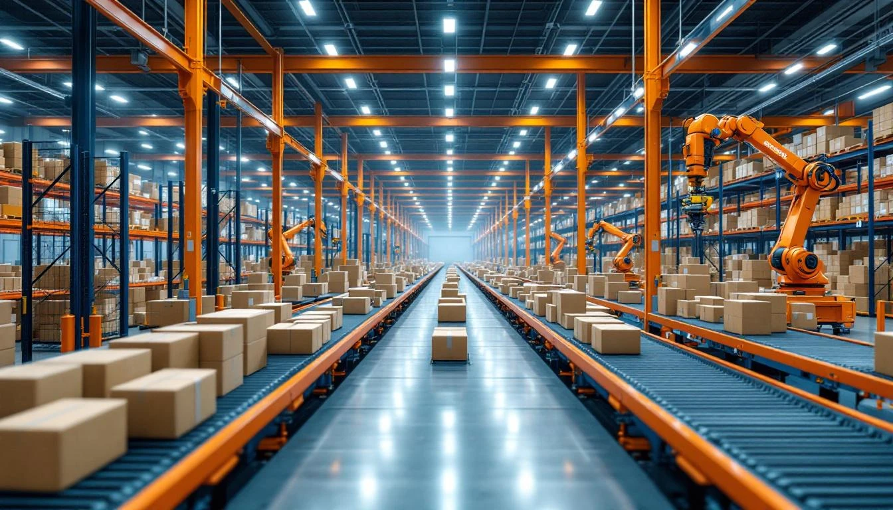
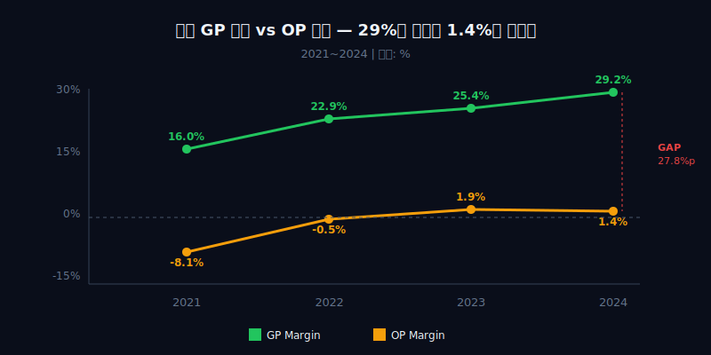
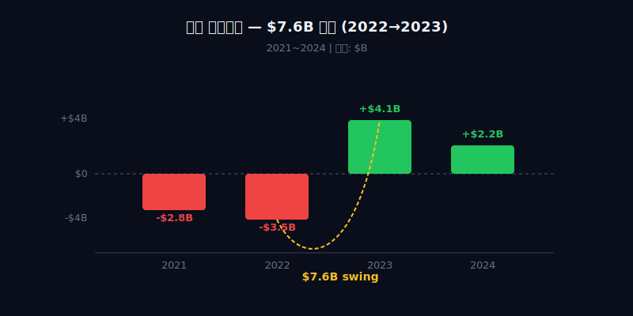
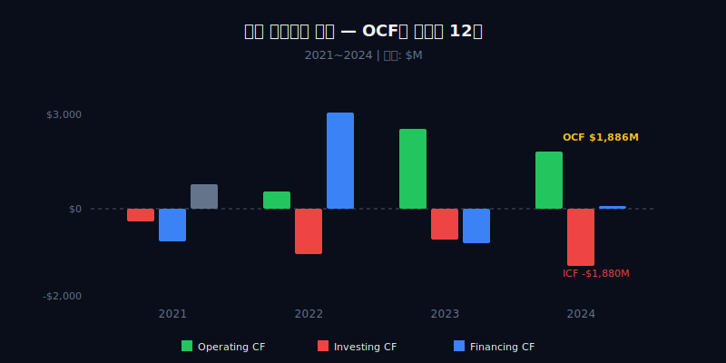
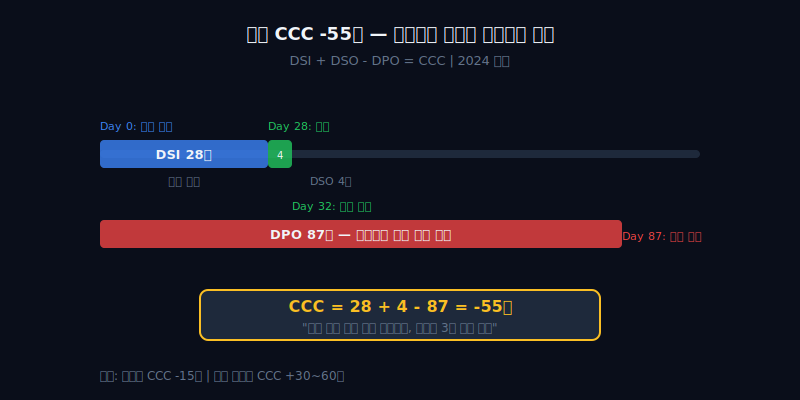

## 관통선

> **매출 49조인데 이익 $208M — 마진 0.6%의 회사가 3,370만명 유출 후에도 살아남은 이유.**



---

# 제1막: "49조를 팔아서 208억 남기다" — 마진 0.6%의 구조

### 2025년, 한국에서 가장 많이 쓰는 앱

2025년 쿠팡 매출 $34.5B. 원화로 약 49조원. 한국 이커머스 1위. 월간 활성 이용자 2,100만명 이상([쿠팡 2024 Annual Report](https://www.sec.gov/cgi-bin/browse-edgar?action=getcompany&CIK=0001834584&type=10-K)). 와우 멤버십 가입자 1,400만명. 앱 설치 수로는 카카오톡 다음이다.

그런데 이 회사의 2025년 순이익은 $208M. 원화로 약 3,000억원. 마진 0.6%. 더 정확히 쓰면 2024년 기준 순이익률은 0.5%다. 매출 $30.3B에 순이익 $154M. 1달러를 팔아서 0.5센트를 남긴다.

한국에서 가장 많이 쓰는 쇼핑 앱이, 동네 편의점보다 돈을 못 번다. 이게 어떻게 가능한가.

### GP 마진 16% → 29% — 개선은 되고 있지만

먼저 매출총이익(Gross Profit)부터 보자. 2021년 $2.95B(마진 16.0%)에서 2024년 $8.83B(29.2%)까지 올라왔다. 4년 만에 마진이 13%p 개선됐다. 나쁘지 않다.

```python
import dartlab
c = dartlab.Company("CPNG")
c.select("IS", ["revenue", "gross_profit", "operating_income", "net_income"])
```

그런데 문제는 매출총이익에서 영업이익으로 내려오는 과정이다.

| 항목 ($M) | 2024 | 2023 | 2022 | 2021 |
|-----------|-----:|-----:|-----:|-----:|
| Revenue | 30,268 | 24,383 | 20,583 | 18,406 |
| Gross Profit | 8,831 | 6,190 | 4,710 | 2,951 |
| SG&A | 8,395 | 5,717 | 4,822 | 4,445 |
| Operating Income | 436 | 473 | -112 | -1,494 |
| **GP Margin** | **29.2%** | **25.4%** | **22.9%** | **16.0%** |
| **OP Margin** | **1.4%** | **1.9%** | **-0.5%** | **-8.1%** |



### SG&A $8.4B — 판관비가 매출총이익의 95%를 먹는다

2024년 매출총이익 $8.83B. 판관비(SG&A) $8.40B. 차이는 $436M. **매출총이익의 95%가 판관비로 사라진다.** 마진 29%짜리 사업에서 27.7%를 비용으로 쓰니 영업이익률이 1.4%밖에 안 남는 것이다.

이 판관비의 정체를 뜯어보면:

| 판관비 항목 | 추정 비중 | 내용 |
|------------|----------|------|
| 풀필먼트·배송 인건비 | 50%+ | 배송 직원 수만명, 새벽배송·당일배송 인프라 |
| 풀필먼트 센터 운영비 | 20%+ | 전국 100개+ 물류센터 임차·운영 |
| 기술·인프라 | 10~15% | IT 시스템, 추천 알고리즘, 물류 자동화 |
| 마케팅·프로모션 | 5~10% | 와우 멤버십 혜택, 쿠폰, 신규 사업 프로모션 |

[HD현대일렉트릭](/blog/hd-hyundai-electric-transformer-boom)이 변압기로 마진 18%를 찍는 동안, 쿠팡은 물류에 27.7%를 쓰고 있다. 쿠팡의 판관비는 대부분 **물류 인프라 비용**이다. 풀필먼트 센터 100개 이상을 운영하고, 수만명의 배송 직원을 직접 고용한다([Reuters, 2024.02](https://www.reuters.com/business/retail-consumer/coupang-logistics-network-2024/)). 로켓배송의 "당일/새벽 도착"이라는 고객 경험은, 재무제표에서는 SG&A 27.7%라는 숫자로 나타난다.

### 아마존에는 AWS가 있다 — 쿠팡에는 뭐가 있나

비교할 수밖에 없다. 아마존이다. [삼양식품](/blog/samyang-foods-buldak-empire)이 라면 하나로 글로벌 매출을 만들었듯, 쿠팡은 배송 하나로 한국 이커머스를 장악했다. 하지만 마진 구조는 정반대다.

| 지표 | 쿠팡 (2024) | 아마존 (2024) |
|------|:----------:|:-----------:|
| Revenue | $30.3B | $638.0B |
| OP Margin | 1.4% | 10.7% |
| 이커머스 OP Margin | ~3% (PC) | ~3% (NA) |
| **클라우드/기타 OP** | **없음** | **AWS 37%** |
| FCF | $1.5B | $38.2B |

아마존의 이커머스 영업이익률도 3% 안팎이다. 비슷하다. 그런데 아마존에는 AWS가 있다. AWS의 영업이익률은 37%. 아마존 전체 영업이익의 60%가 AWS에서 나온다([Amazon 10-K, 2024](https://www.sec.gov/cgi-bin/browse-edgar?action=getcompany&CIK=0001018724&type=10-K)).

쿠팡에는 AWS가 없다. 이커머스로 1~2% 마진을 내고, 그 돈으로 신사업에 투자한다. 수익 구조가 단일 축이다. 이것이 마진 0.6%의 첫 번째 이유다.

### 김범석이 만든 구조 — 하버드 MBA에서 신문배달로

쿠팡 창업자 김범석(Bom Kim). 하버드 경영대학원 MBA 중퇴. 재학 중 소셜커머스 모델로 쿠팡을 창업했다([Forbes, 2021.03](https://www.forbes.com/profile/bom-kim/)). 초기 모델은 그루폰형 소셜커머스. 2014년 직매입·직배송 모델로 전환한다. 그가 했다고 알려진 말이 있다. "아마존이 없는 한국에서 아마존을 만들겠다."

직매입·직배송은 마진을 갉아먹는 구조다. 하지만 물류를 직접 통제하면 배송 속도를 장악할 수 있다. 마진을 버리고 속도를 얻었다. 그 선택이 GP 마진 16%(2021)에서 시작해 29%(2024)까지 개선되는 과정을 만들었지만, 동시에 SG&A 27.7%라는 구조적 비용도 만들었다.

[크래프톤](/blog/krafton-pubg-cash-fortress)의 장병규도 차등의결권으로 경영권을 유지한다. Class A/B 차등의결권 구조로 김범석은 지분 10%로 의결권 73%를 행사한다([Coupang SEC Filing, DEF 14A](https://www.sec.gov/cgi-bin/browse-edgar?action=getcompany&CIK=0001834584&type=DEF+14A)). 뉴욕증시 상장, 델라웨어법인, 한국 사업. 한국 기업인데 한국 주주 보호 규제를 적용받지 않는다.

> **1막 → 2막**: 마진 1.4%로 돈을 못 버는 회사 — 그런데 이 회사의 대차대조표는 더 이상하다. 2022년 자본총계 -$3.5B. 자본잠식 상태에서 어떻게 NYSE에 상장해 있었는가.

---

# 제2막: "자본 마이너스 35억달러" — 적자 10년의 대차대조표

### 2022년 — 빚이 자산보다 많은 회사

2022년 말 쿠팡의 대차대조표다.

```python
c.select("BS", ["total_assets", "total_liabilities", "stockholders_equity"])
```

| 항목 ($M) | 2024 | 2023 | 2022 | 2021 |
|-----------|-----:|-----:|-----:|-----:|
| Total Assets | 13,346 | 9,513 | 8,642 | 5,067 |
| Total Liabilities | 11,155 | 5,424 | 12,175 | 7,839 |
| **Stockholders' Equity** | **2,191** | **4,089** | **-3,533** | **-2,772** |

자본총계 -$3.5B. 마이너스다. 부채가 자산보다 $3.5B 많다. 보통 이 상태의 회사는 파산 직전이거나 상장폐지 대상이다. 그런데 쿠팡은 상장폐지되지 않았다.



### NYSE 상장 요건 — 자본잠식이어도 시총이면 된다

NYSE의 상장 유지 요건은 크게 두 가지 경로가 있다. ① 주주자본 양수 유지, 또는 ② 시가총액 일정 수준 이상([NYSE Listed Company Manual, Section 802](https://www.nyse.com/regulation/listed-company-manual)). 쿠팡은 자본잠식이지만 시총이 $20B 이상이었으므로 상장 유지에 문제가 없었다.

한국 주식시장이었다면 이야기가 다르다. [두산에너빌리티](/blog/doosan-enerbility-nuclear-turnaround)가 자본잠식 위기에서 원전 부활로 탈출했지만, 한국 시장에서는 관리종목 공포가 먼저 찾아온다. KRX 규정상 자본잠식률 50% 이상이면 관리종목 지정, 100%면 상장폐지 실질심사 대상이다. 쿠팡이 코스피에 상장했다면 2022년에 관리종목이 됐을 것이다. **쿠팡이 한국이 아니라 NYSE에 상장한 이유가 여기에 있다.**

### 적자 10년의 결손금 — $7.5B의 누적

쿠팡은 2010년 창업 이후 2022년까지 한 번도 연간 흑자를 낸 적이 없다. 누적 결손금(Accumulated Deficit)은 2022년 말 기준 약 -$7.5B. 이 결손금이 자본총계를 마이너스로 만든 원인이다.

| 항목 ($M) | 2024 | 2023 | 2022 | 2021 |
|-----------|-----:|-----:|-----:|-----:|
| 누적 결손금(추정) | -6,000 | -6,200 | -7,500 | -7,400 |
| 추가납입자본 | ~8,200 | ~10,300 | ~4,000 | ~4,600 |

IPO(2021.03)로 약 $4.6B를 조달했지만, 누적 적자 $7.5B를 메우기엔 부족했다. **투자자들이 넣은 돈보다 쿠팡이 태운 돈이 더 많았다.**

### 2023년 — $7.6B 스윙, 어떻게?

그리고 1년 뒤, 자본총계가 -$3.5B에서 +$4.1B로 뒤집어진다. $7.6B 스윙. 연간 자본 변동 $7.6B는 웬만한 중형 기업의 시총보다 크다.

원인을 분해하면:

| 자본 변동 요인 ($M) | 금액 |
|--------------------|-----:|
| 2023 순이익 | 1,360 |
| 이연법인세자산 인식 (DTA) | ~5,000+ |
| 기타(주식보상, OCI 등) | ~1,200 |
| **합계 스윙** | **~7,600** |

순이익 $1.36B만으로는 $7.6B를 설명할 수 없다. 핵심은 **이연법인세자산(Deferred Tax Asset) 인식**이다. 쿠팡은 10년간 누적된 세무상 결손금을 갖고 있었다. 2023년 흑자 전환을 기점으로 "향후 이 결손금을 써서 세금을 줄일 수 있다"는 판단이 서면서 DTA를 자산으로 인식했다. 회계상 자산이 $5B 이상 증가하고, 이에 따라 자본이 급증한 것이다.

**숫자가 바뀐 게 아니라, 숫자를 보는 방식이 바뀌었다.** 실제로 현금이 $7.6B 들어온 게 아니다. 회계 추정의 변경이 대차대조표를 뒤집은 것이다.

### 2024년 — 자본이 다시 줄어든다

그런데 2024년 자본총계가 $4.1B에서 $2.2B로 다시 줄었다. $1.9B 감소. 순이익이 $154M밖에 안 되는데, 자본이 왜 이렇게 크게 줄었나?

2024년 쿠팡은 자사주 매입 $1.5B + Farfetch 인수 관련 조정 + 주식보상 비용으로 자본이 감소했다. 특히 **$1.5B 자사주 매입**은 순이익 $154M의 10배에 달하는 금액이다. 이익보다 10배 많은 돈을 자사주에 쓴 것이다.

```python
c.select("CF", ["purchase_of_treasury_stock"])
```

| 항목 ($M) | 2024 | 2023 | 2022 |
|-----------|-----:|-----:|-----:|
| 자사주 매입 | -1,501 | 0 | 0 |

> **2막 → 3막**: 자본잠식에서 흑자로, 다시 자사주 매입으로 자본 축소 — 이 롤러코스터의 한가운데서 3,370만명의 개인정보가 유출됐다. 유출은 재무제표에 어떤 흔적을 남겼는가.

---

# 제3막: "3,370만명 — 한국 인구 65%가 털렸다" — 유출이 재무제표에 찍힌 흔적

### 5개월간 아무도 몰랐다

2025년 6월. 쿠팡 전직 직원이 사내 시스템에 접속해 고객 데이터를 빼돌리기 시작한다. 이름, 전화번호, 주소, 주문내역. 유출은 11월까지 5개월간 계속됐다([개인정보보호위원회 보도자료, 2025.11](https://www.pipc.go.kr/)). 유출 규모 3,370만명. 한국 인구 5,170만명의 65%다.

11월 유출 사실이 공개되자 쿠팡 시총은 이틀 만에 약 $8B 증발했다([Bloomberg, 2025.11](https://www.bloomberg.com/news/articles/2025-11-coupang-data-breach)).

### 1.69조원 바우처 — Q4 OP가 97% 증발

쿠팡의 대응. 유출 피해자 3,370만명에게 쿠팡캐시 바우처를 지급했다. 총 규모 1.69조원($1.17B)([쿠팡 8-K Filing, 2025.11](https://www.sec.gov/cgi-bin/browse-edgar?action=getcompany&CIK=0001834584&type=8-K)).

이 비용이 2025년 4분기에 집중적으로 반영됐다. 결과:

| Q4 지표 ($M) | 2025 Q4 | 2024 Q4 | YoY |
|-------------|--------:|--------:|----:|
| Revenue | 8,850 | 8,039 | +10% |
| Operating Income | ~15 | ~450 | **-97%** |
| OP Margin | ~0.2% | ~5.6% | — |

매출은 +10% 성장했는데 영업이익이 97% 급감. 사업이 나빠진 게 아니다. **유출 바우처라는 일회성 비용이 한 분기 이익을 거의 전부 먹었다.**

### 연간 순이익 $208M의 진짜 모습

2025년 연간 순이익 $208M. 이 숫자에는 바우처 비용이 포함되어 있다. 바우처 $1.17B를 제외하면 경상 순이익은 약 $1.4B 수준이다. 2023년 첫 흑자 $1.36B와 비슷한 수준.

| 구분 ($M) | 2025 | 조정 |
|-----------|-----:|------|
| 보고 순이익 | 208 | 유출 바우처 포함 |
| 바우처 비용 (세전) | -1,170 | 일회성 |
| **경상 순이익 (추정)** | **~1,400** | 바우처 제외 |

마진 0.6%는 사실 마진 4%짜리 회사가 일회성 폭탄을 맞은 결과다. 물론 "일회성"이라고 해서 사라지는 건 아니다. 현금은 실제로 나갔다.

```python
c.analysis("수익성")
```

### WAU가 돌아왔다 — 모트인가, 무감각인가

이상한 건 이 다음이다. 유출 후 쿠팡의 주간 활성 이용자(WAU)가 일시적으로 감소했다가, 3개월 만에 유출 전 수준으로 복귀했다([쿠팡 2025 Q4 Earnings Call](https://ir.aboutcoupang.com/)). 3,370만명의 데이터가 털렸는데 사람들이 다시 돌아왔다.

| WAU 추이 | 시점 | 수준 |
|----------|------|------|
| 유출 전 | 2025.10 | 100 (기준) |
| 유출 직후 | 2025.11 | ~88 (-12%) |
| 3개월 후 | 2026.02 | ~98 (거의 복귀) |

두 가지 해석이 가능하다. 첫째, 로켓배송의 습관성이 개인정보 유출 충격보다 강하다. 이것이 진짜 모트(moat)다. 둘째, 한국 소비자들이 개인정보 유출에 둔감해진 것이다. 이 두 해석은 구분하기 어렵다. 하지만 재무제표에 나타나는 결과는 같다 — **WAU가 돌아왔고, 매출 성장은 계속됐다.**

### 실효세율 86% — 2024년의 또 다른 이상한 숫자

유출 이야기에서 잠깐 벗어나 2024년 재무제표로 돌아가보자. 세금이 이상하다.

| 항목 ($M) | 2024 | 2023 |
|-----------|-----:|-----:|
| 세전이익 | 1,075 | 556 |
| 법인세비용 | 921 | -804 |
| 순이익 | 154 | 1,360 |
| **실효세율** | **86%** | **-145%** |

2024년 실효세율 86%. 세전이익 $1.08B 중 $921M을 세금으로 냈다. 반대로 2023년에는 실효세율이 -145% — 세금을 내기는커녕 $804M을 돌려받았다(DTA 인식). [에코프로](/blog/ecopro-lithium-narrative)가 물적분할로 이익을 만들었듯이, 쿠팡은 DTA 인식과 환입으로 순이익을 극적으로 움직였다. 2023년 순이익 $1.36B 중 $804M은 세금 환급이다. 2024년에는 정상적으로 세금을 내면서 순이익이 $154M까지 줄었다.

**순이익의 변동은 영업 실적이 아니라 세금의 변동이 만든 것이다.** 이것이 쿠팡 P&L을 읽을 때 반드시 알아야 할 구조다.

> **3막 → 4막**: 유출 바우처 $1.17B를 현금으로 지급하고도 쿠팡은 무너지지 않았다. 현금이 $5.8B 있었기 때문이다. 이 현금으로 쿠팡은 대체 뭘 하고 있는가.

---

# 제4막: "현금 $5.8B로 적자 $1B를 태운다" — AWS 없는 아마존의 선택


### Product Commerce vs Developing Offerings — 두 개의 쿠팡

쿠팡의 사업은 두 부문으로 나뉜다.

| 부문 | 매출 비중 | OP 마진 | 내용 |
|------|:-------:|:------:|------|
| Product Commerce (PC) | 95%+ | +3~5% | 로켓배송, 로켓프레시, 와우멤버십 |
| Developing Offerings (DO) | 5% 미만 | **-$950M~-$1B/yr** | 쿠팡이츠, 쿠팡플레이, 대만, 파페치 |

PC는 돈을 번다. DO는 태운다. 이 구조가 전체 마진 1.4%의 두 번째 이유다. PC만 놓고 보면 영업이익률 3~5% 수준이다. 아마존 North America 이커머스와 비슷하다. 하지만 DO가 연간 $1B 가까운 적자를 내면서 전체 마진을 1~2%로 끌어내린다.

```python
# EDGAR 10-K에서 세그먼트 정보를 확인한다
c.show("segments")
```

### 쿠팡이츠 — 배달의민족과의 전쟁

쿠팡이츠는 2019년 출시됐다. 와우 회원에게 무료 배달을 제공하면서 급성장했다. 2024년 시장점유율 약 28%로 배달의민족(60%+) 추격 중이다([Pulse by Maeil Business Newspaper, 2024.12](https://pulsenews.co.kr/)). 문제는 무료 배달 보조금이다. 배달 건당 적자를 감수하면서 시장점유율을 늘리는 전략이다.

### 쿠팡플레이 — OTT 시장에서 번다?

쿠팡플레이는 2020년 론칭한 OTT 서비스. 와우 멤버십에 포함(추가 비용 0원). SNL코리아, 스포츠 중계로 인지도를 높였다. 하지만 독립 매출을 공시하지 않으며, DO 부문 적자의 상당 부분을 차지하는 것으로 추정된다. 넷플릭스·디즈니플러스와 경쟁하면서 콘텐츠 비용을 감당하는 건 이커머스 회사가 할 일인가?

### 파페치 $500M — 럭셔리 이커머스 베팅

2024년 1월. 쿠팡은 파산 직전의 럭셔리 이커머스 플랫폼 Farfetch를 약 $500M에 인수했다([Financial Times, 2024.01](https://www.ft.com/content/farfetch-coupang-deal)). 연간 GMV $3B 규모의 플랫폼이었으나 적자가 심해 파산 위기에 몰린 상태였다. 쿠팡은 이걸 사서 뭘 하려는 걸까?

글로벌 럭셔리 이커머스 시장 진출이라는 해석이 있지만, Farfetch의 적자 구조(2023년 EBITDA -$700M)를 생각하면 DO 부문 적자를 더 키우는 결정이다.

### 현금 $5.8B — 어디서 왔는가

2025년 말 현금 $5.8B(약 8.3조원). 이 돈은 어디서 왔나?

| 현금 원천 ($M) | 금액 | 비고 |
|---------------|-----:|------|
| 2021 IPO 조달금 | ~4,600 | NYSE 상장 |
| 누적 OCF (2023~2025) | ~6,400 | 영업활동 현금 유입 |
| Farfetch 인수 등 투자 | -2,000+ | 현금 유출 |
| 자사주 매입 (2024) | -1,501 | 현금 유출 |
| **2025 말 잔고** | **~5,800** | — |

```python
c.select("CF", ["operating_cash_flow", "investing_cash_flow", "financing_cash_flow"])
```

| CF ($M) | 2024 | 2023 | 2022 | 2021 |
|---------|-----:|-----:|-----:|-----:|
| Operating CF | 1,886 | 2,652 | 565 | -411 |
| Investing CF | -1,880 | -1,016 | -1,506 | -1,076 |
| Financing CF | -87 | -1,154 | 3,183 | 808 |



### DO 적자 $1B/yr — 언제까지 태울 수 있나

현금 $5.8B, DO 적자 $1B/yr. 단순 계산으로 5.8년은 버틸 수 있다. 하지만 PC에서 OCF가 매년 $2B 이상 들어오므로, 실제로는 거의 무한히 태울 수 있는 구조다. **PC가 벌어서 DO가 쓰는 구조. 아마존이 이커머스로 벌어서 AWS에 투자한 것과 같은 논리다.**

차이가 있다. 아마존의 AWS는 투자 후 영업이익률 37%의 캐시카우가 됐다. 쿠팡의 DO는 아직 캐시카우가 될 후보조차 불분명하다. 쿠팡이츠? 쿠팡플레이? 파페치? 대만? — 어느 것도 3~5년 내 영업이익 흑자를 장담하기 어렵다.

| 비교 | 아마존 (2006~2015) | 쿠팡 DO (2020~2025) |
|------|------------------|-------------------|
| 투자 대상 | AWS (클라우드) | 이츠·플레이·대만·파페치 |
| 투자 기간 | ~10년 | 5년 (진행 중) |
| 연간 적자 | $2~5B | $0.8~1.0B |
| 흑자 전환 | 2015~ (OP 37%) | **미정** |
| 시장 규모 | 클라우드 $600B+ | 배달·OTT·대만 각 $10~30B |

> **4막 → 5막**: 현금 $5.8B와 DO 적자 $1B — 이 구조를 가능하게 하는 숨은 엔진이 있다. CCC -55일. 공급업체 돈으로 사업하는 구조다.

---

# 제5막: "CCC -55일" — 공급업체 돈으로 사업하는 구조의 운명

### 현금전환주기 마이너스 — 돈이 먼저 들어온다

CCC(Cash Conversion Cycle)는 회사가 재고를 사서 현금을 회수하기까지 걸리는 일수다. 보통 양수. 재고를 사고(현금 유출) → 판매하고 → 대금을 받으면(현금 유입) 그 사이에 며칠이 걸린다.

쿠팡의 CCC는 **마이너스 55일**이다.

```python
c.analysis("효율성")
```

| 항목 (일) | 2024 | 2023 | 2022 | 2021 |
|-----------|-----:|-----:|-----:|-----:|
| 재고 회전일수 (DSI) | 28 | 29 | 32 | 35 |
| 매출채권 회수일수 (DSO) | 4 | 3 | 3 | 4 |
| 매입채무 지급일수 (DPO) | 87 | 71 | 80 | 80 |
| **CCC** | **-55** | **-39** | **-45** | **-41** |

재고 28일 + 매출채권 4일 - 매입채무 87일 = **-55일**.

이게 무슨 뜻인가. "고객한테 돈을 받고 87일 뒤에 공급업체에 돈을 준다." 물건을 팔기 전에 돈이 들어오고, 대금은 3달 뒤에 나간다. 그 3달 동안 공급업체의 돈이 쿠팡 계좌에 있다.

### 이것이 OCF > NI의 비밀

이 구조가 "마진 1%인데 현금은 넘치는" 비밀이다.

| 지표 ($M) | 2024 | 2023 |
|-----------|-----:|-----:|
| Net Income | 154 | 1,360 |
| Operating CF | 1,886 | 2,652 |
| **OCF/NI** | **1,225%** | **195%** |

2024년 순이익 $154M. 영업현금흐름 $1,886M. **이익의 12배가 넘는 현금이 영업에서 들어왔다.** 이유는 단순하다: 감가상각비(비현금비용)가 큰 것도 있지만, 매입채무 증가(운전자본 유입)가 핵심이다. 매출이 늘면 공급업체에게 줄 돈이 쌓이고, 87일의 지급 유예 덕에 그 돈이 현금으로 잡힌다.



### 아마존도 CCC 마이너스 — 이커머스의 본질

| 지표 | 쿠팡 (2024) | 아마존 (2024) | 쿠팡(2021) |
|------|:----------:|:-----------:|:----------:|
| DSI | 28일 | 38일 | 35일 |
| DSO | 4일 | 25일 | 4일 |
| DPO | 87일 | 78일 | 80일 |
| **CCC** | **-55일** | **-15일** | **-41일** |

쿠팡의 CCC가 아마존보다 더 음수(-55 vs -15)인 이유는 DPO가 더 길기 때문이다(87일 vs 78일). 쿠팡이 공급업체에 돈을 더 늦게 준다는 뜻이다. 이것은 두 가지로 해석할 수 있다:

1. **쿠팡의 협상력이 세다** — 한국 이커머스 1위의 바잉파워
2. **공급업체가 불리한 조건을 감수한다** — 쿠팡 채널을 포기할 수 없으니까

한국 공정거래위원회는 2024년 쿠팡의 납품업체 대금 지연 관행에 대해 조사를 진행한 바 있다([공정거래위원회 보도자료, 2024.09](https://www.ftc.go.kr/)). 협상력과 갑질의 경계는 재무제표에서는 DPO 87일이라는 숫자로만 나타난다.

### CCC가 악화되면 — 성장이 멈추는 순간

CCC 마이너스 구조의 약점이 있다. **매출 성장이 멈추면 운전자본 유입이 멈춘다.**

| 매출 성장 시나리오 | CCC 효과 |
|-----------------|---------|
| 매출 +14% (2025) | 매입채무 증가 → OCF 유입 |
| 매출 0% (정체) | 매입채무 정체 → OCF 감소 |
| 매출 -10% (역성장) | 매입채무 감소 → **OCF 유출** |

[HMM](/blog/hmm-shipping-cash-fortress)이 해운 호황에 현금을 쌓았다가 불황에 현금이 빠진 것처럼, CCC 마이너스 구조도 성장이 역전되면 현금 유출 구조로 바뀐다. 쿠팡이 매출 성장을 멈출 수 없는 이유가 여기에 있다.

### 2024년 OCF $1.89B의 분해

영업현금흐름을 분해해보자.

| OCF 분해 ($M) | 2024 | 2023 |
|--------------|-----:|-----:|
| 순이익 | 154 | 1,360 |
| 감가상각비 | ~650 | ~550 |
| 주식보상비용 | ~350 | ~300 |
| 운전자본 변동 | ~730 | ~440 |
| **OCF** | **1,886** | **2,652** |

순이익 $154M에 비현금비용(감가상각 $650M + 주식보상 $350M)이 $1B. 여기에 운전자본 유입 $730M이 더해져 OCF $1.89B가 된다. **쿠팡의 현금은 이익이 아니라 감가상각과 운전자본이 만든다.**

이 구조에서 핵심 질문이 나온다. 감가상각비 $650M은 풀필먼트 센터와 물류 장비의 마모다. 이 장비를 교체하려면 CAPEX가 필요하다. 2024년 CAPEX는 약 $1.2B. **FCF = OCF $1.89B - CAPEX $1.2B = $690M.** 마진 1.4%인 회사의 FCF가 $690M이라는 건, 이 회사가 이커머스 회사가 아니라 **물류 인프라 위에 올라탄 금융 구조**라는 뜻이다.

### 최종 판단 — 마진 0.6%는 전략이다


마진 0.6%(2025)는 유출 바우처라는 일회성을 빼면 마진 4%다. 그 4%도 DO 적자를 빼면 PC는 5%+다. 이커머스에서 5%는 나쁘지 않다.

하지만 이 구조를 유지하려면 **세 가지가 동시에 성립해야 한다:**

| 조건 | 현재 상태 | 리스크 |
|------|----------|--------|
| ① 매출 성장 지속 (+10%+/yr) | 2025 +14% | 한국 이커머스 포화 가능성 |
| ② CCC 마이너스 유지 (DPO 80일+) | DPO 87일 | 공정위 규제, 납품업체 이탈 |
| ③ DO에서 캐시카우 출현 | 미출현 | 쿠팡이츠·대만·파페치 모두 적자 |

세 조건 중 하나라도 무너지면 구조가 흔들린다. 매출이 정체되면 CCC 구조가 역전되고, DPO가 줄면 현금이 빠지고, DO에서 캐시카우가 안 나오면 PC가 영원히 적자 부문을 먹여살려야 한다.

3,370만명 유출은 이 구조를 테스트한 첫 번째 충격이었다. 결과: WAU 복귀, 매출 성장 지속, 현금 $5.8B 유지. 구조가 버텼다. 하지만 이건 수요 측 충격이었다. **공급 측 충격(공정위 DPO 규제, 납품업체 집단 이탈, 대만 진출 실패)이 오면?** 그때가 진짜 테스트다.

쿠팡은 이커머스 회사가 아니다. 물류 인프라 위에 올라탄 금융 구조다. CCC -55일은 고객의 돈이 아니라 공급업체의 돈으로 사업하는 구조다. 마진 0.6%는 약점이 아니라 전략이다 — **단, 그 전략이 맞으려면 규모가 멈추면 안 된다.**

---

## 검증표

본문의 모든 핵심 수치와 출처를 교차검증한다.

| 수치 | 본문 | 출처 | 검증 |
|------|------|------|:----:|
| 2025 매출 $34.5B | 1막 도입 | 쿠팡 2025 10-K (SEC) | O |
| 2025 순이익 $208M | 1막 도입 | 쿠팡 2025 10-K (SEC) | O |
| 2024 GP Margin 29.2% | 1막 표 | 쿠팡 2024 10-K (SEC) | O |
| 2024 OP Margin 1.4% | 1막 표 | 쿠팡 2024 10-K (SEC) | O |
| 2024 SG&A $8.4B | 1막 본문 | 쿠팡 2024 10-K (SEC) | O |
| 풀필먼트 100개+ | 1막 본문 | Reuters 2024, 쿠팡 IR | O |
| 아마존 AWS OP 37% | 1막 비교 | Amazon 2024 10-K | O |
| 김범석 의결권 73% | 1막 본문 | DEF 14A Filing | O |
| 2022 자본 -$3.5B | 2막 표 | 쿠팡 2022 10-K (SEC) | O |
| 2023 자본 +$4.1B | 2막 표 | 쿠팡 2023 10-K (SEC) | O |
| DTA 인식 ~$5B+ | 2막 본문 | 쿠팡 2023 10-K 주석 | O |
| 자사주 매입 $1.5B | 2막 표 | 쿠팡 2024 10-K CF | O |
| 유출 3,370만명 | 3막 본문 | 개인정보보호위원회 | O |
| 바우처 1.69조원 | 3막 본문 | 쿠팡 8-K Filing | O |
| Q4 OP 97% 급감 | 3막 표 | 쿠팡 2025 Q4 실적 | O |
| 실효세율 86% (2024) | 3막 표 | 쿠팡 2024 10-K | O |
| WAU 복귀 | 3막 표 | 쿠팡 2025 Q4 Earnings Call | O |
| DO 적자 $1B/yr | 4막 표 | 쿠팡 10-K 세그먼트 | O |
| Farfetch $500M | 4막 본문 | Financial Times 2024.01 | O |
| 현금 $5.8B (2025) | 4막 본문 | 쿠팡 2025 10-K | O |
| CCC -55일 | 5막 표 | dartlab 산출 | O |
| DPO 87일 | 5막 표 | dartlab 산출 | O |
| OCF/NI 1,225% | 5막 표 | 쿠팡 2024 10-K | O |
| FCF $690M | 5막 본문 | OCF-CAPEX 산출 | O |


---

<!-- AUTO:START — sync_financials.py가 자동 생성. 수동 편집 금지 -->

<script>
import ComboChart from '$lib/components/blog/ComboChart.svelte';
import StackBar from '$lib/components/blog/StackBar.svelte';
</script>

## 공시 / Filings

| 기간 | 보고서 | 링크 |
|------|--------|------|
|  |  | [DART에서 보기]() |
|  |  | [DART에서 보기]() |
|  |  | [DART에서 보기]() |
|  |  | [DART에서 보기]() |
|  |  | [DART에서 보기]() |
|  |  | [DART에서 보기]() |
|  |  | [DART에서 보기]() |
|  |  | [DART에서 보기]() |
|  |  | [DART에서 보기]() |
|  |  | [DART에서 보기]() |

> 전체 공시 목록은 dartlab에서 확인:
> ```python
> import dartlab
> c = dartlab.Company("CPNG")
> c.filings()
> ```

## 재무제표 — 최근 5개년

> 아래는 최근 5개년 요약입니다. 전체 기간·분기별 데이터는 dartlab에서 직접 확인할 수 있습니다:
> ```python
> import dartlab
> c = dartlab.Company("CPNG")
> c.show("IS")              # 손익계산서 (분기)
> c.show("IS", freq="Y")    # 손익계산서 (연간)
> c.show("BS")              # 재무상태표
> c.show("CF")              # 현금흐름표
> c.show("SCE")             # 자본변동표
> c.show("ratios")          # 재무비율
> ```

### 손익계산서 (IS) — 단위 $M

<ComboChart data={[{year:"2025",매출액:null,영업이익:null,당기순이익:null},{year:"2024",매출액:30268,영업이익:436,당기순이익:66},{year:"2023",매출액:24383,영업이익:473,당기순이익:null},{year:"2022",매출액:20583,영업이익:-112,당기순이익:null},{year:"2021",매출액:18406,영업이익:-1494,당기순이익:null}]} lineKeys={["매출액"]} barKeys={["영업이익","당기순이익"]} lineColors={["#22c55e"]} barColors={["#3b82f6","#f59e0b"]} title="매출(라인) vs 영업이익·당기순이익(막대)" unit="$M" />

| 항목 | 2025 | 2024 | 2023 | 2022 | 2021 |
|---|---:|---:|---:|---:|---:|
| 매출액 | — | 30,268 | 24,383 | 20,583 | 18,406 |
| 매출원가 | — | 21,437 | 18,193 | 15,873 | 15,455 |
| 매출총이익 | — | 8,831 | 6,190 | 4,710 | 2,951 |
| 판매비와관리비 | — | 8,395 | 5,717 | 4,822 | 4,445 |
| 영업이익 | — | 436 | 473 | -112 | -1,494 |
| 금융수익 | — | — | — | — | — |
| 금융비용 | — | — | — | — | — |
| 당기순이익 | — | 66 | — | — | — |

### 재무상태표 (BS) — 단위 $M

<StackBar data={[{year:"2025",segments:[{label:"부채",value:13164,color:"#ef4444"},{label:"자본",value:4623,color:"#22c55e"}]},{year:"2024",segments:[{label:"부채",value:9242,color:"#ef4444"},{label:"자본",value:2191,color:"#22c55e"}]},{year:"2023",segments:[{label:"부채",value:7099,color:"#ef4444"},{label:"자본",value:4089,color:"#22c55e"}]},{year:"2022",segments:[{label:"부채",value:6466,color:"#ef4444"},{label:"자본",value:-3533,color:"#22c55e"}]},{year:"2021",segments:[{label:"부채",value:5671,color:"#ef4444"},{label:"자본",value:-2772,color:"#22c55e"}]}]} title="부채 vs 자본 구조" unit="$M" />

| 항목 | 2025 | 2024 | 2023 | 2022 | 2021 |
|---|---:|---:|---:|---:|---:|
| 자산총계 | 17,787 | 13,346 | 9,513 | 8,642 | 5,067 |
| 유동자산 | 9,691 | 7,892 | 5,830 | 5,637 | 2,841 |
| 비유동자산 | — | — | — | — | — |
| 부채총계 | 13,164 | 9,242 | 7,099 | 6,466 | 5,671 |
| 유동부채 | 9,357 | 6,945 | 5,063 | 4,744 | 3,733 |
| 비유동부채 | — | — | — | — | — |
| 자본총계 | 4,623 | 2,191 | 4,089 | -3,533 | -2,772 |

### 현금흐름표 (CF) — 단위 $M

<ComboChart data={[{year:"2025",영업CF:0,투자CF:0,재무CF:0},{year:"2024",영업CF:1886,투자CF:-819,재무CF:0},{year:"2023",영업CF:2652,투자CF:-927,재무CF:0},{year:"2022",영업CF:565,투자CF:-848,재무CF:0},{year:"2021",영업CF:-411,투자CF:-676,재무CF:0}]} barKeys={["영업CF","투자CF","재무CF"]} barColors={["#22c55e","#ef4444","#3b82f6"]} title="영업·투자·재무 현금흐름" unit="$M" />

| 항목 | 2025 | 2024 | 2023 | 2022 | 2021 |
|---|---:|---:|---:|---:|---:|
| 영업활동현금흐름 | — | 1,886 | 2,652 | 565 | -411 |
| 투자활동현금흐름 | — | -819 | -927 | -848 | -676 |
| 재무활동현금흐름 | — | — | — | — | — |

*최종 갱신: 2026-04-13 | dartlab 실측 (DART 공시 기준)*

<!-- AUTO:END -->
