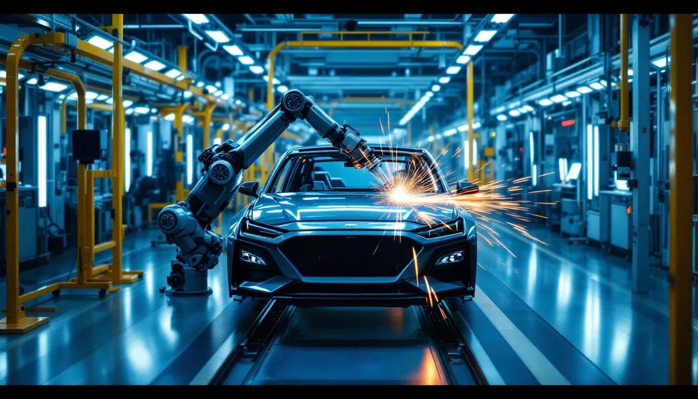
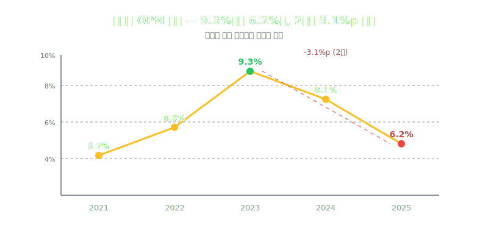
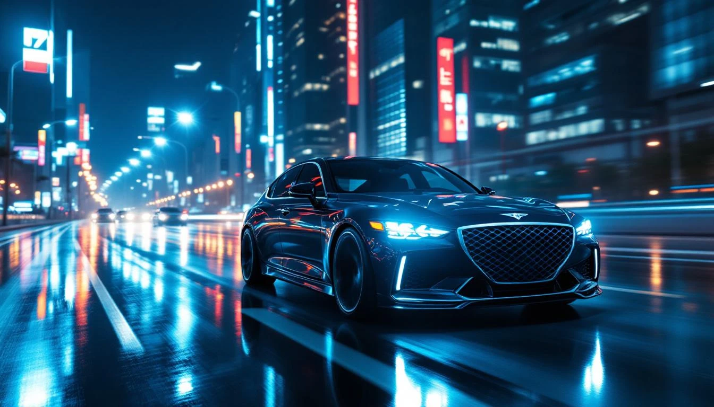
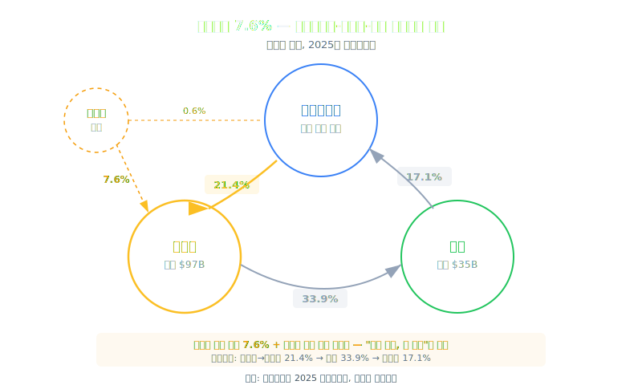
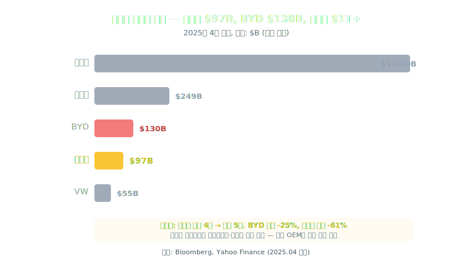
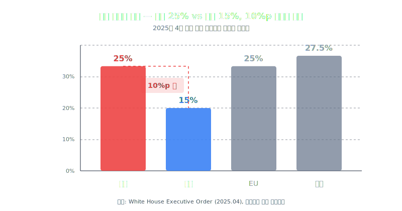

<script>
import ComboChart from '$lib/components/blog/ComboChart.svelte';
import StackBar from '$lib/components/blog/StackBar.svelte';
import HFDataLink from '$lib/components/blog/HFDataLink.svelte';
</script>


> **사이클** | 자동차 > 완성차 | 2026-04-13 dartlab 실측
> 같은 시리즈: [SK하이닉스](/blog/000660-skhynix) · [삼양식품](/blog/003230-samyang-foods) · [두산에너빌리티](/blog/034020-doosan-enerbility) · [알테오젠](/blog/196170-alteogen) · [HMM](/blog/011200-hmm) · [셀트리온](/blog/068270-celltrion) · [한화에어로스페이스](/blog/012450-hanwha-aerospace) · [HD현대일렉트릭](/blog/267260-hd-hyundai-electric) · [고려아연](/blog/010130-korea-zinc) · [에이피알](/blog/278470-apr) · [크래프톤](/blog/259960-krafton) · [달바글로벌](/blog/483650-dalba-global) · [경동나비엔](/blog/009450-kyungdong-navien) · [대한조선](/blog/439260-daehan-shipbuilding) · [현대글로비스](/blog/086280-hyundai-glovis) · [농심](/blog/004370-nongshim) · [한온시스템](/blog/018880-hanon-systems) · [LG이노텍](/blog/011070-lg-innotek) · [금호석유화학](/blog/011780-kumho-petrochemical) · [HDC현대산업개발](/blog/294870-hdc-hyundai-dev) · [현대모비스](/blog/012330-hyundai-mobis) · [SKT](/blog/017670-skt) · [GS건설](/blog/006360-gs-engineering) · [현대코퍼레이션](/blog/011760-hyundai-corp) · [한국전력](/blog/015760-kepco) · [에코프로](/blog/086520-ecopro) · [쿠팡](/blog/CPNG-coupang) · [기업이야기 시리즈 전체](/blog/series/company-reports)


<HFDataLink code="005380" />

---

> **매출 186조 역대 최대. 판매 414만대. 현대+기아 합산 세계 3위. 그런데 시총은 BYD에도 밀린다.**



---

# 제1막: "186조를 팔아서 11.5조를 남기다" — 역대 최대 매출, 역행하는 마진

### 2025년, 한국에서 가장 큰 자동차 회사의 성적표

2025년 현대자동차 매출 186.3조원. 역대 최대. 2021년 117.6조에서 4년 만에 58% 성장했다. 판매 대수 414만대. 기아를 합치면 727만대로 도요타(1,050만대), 폭스바겐(870만대)에 이어 세계 3위 그룹이다.

그런데 영업이익은 11.5조원. 전년 14.2조 대비 **-19.5%**. 매출이 +6.3% 늘었는데 영업이익은 -19.5% 줄었다. 더 충격적인 건 추세다. 영업이익률(영업이익률, 매출 대비 영업이익 비율) 9.3%(2023) → 8.1%(2024) → 6.2%(2025). **매출이 사상 최대를 찍는 2년 동안, 마진은 3.1%p 하락했다.**

```python
import dartlab
c = dartlab.Company("005380")
c.select("IS", ["매출액", "매출원가", "매출총이익", "영업이익", "당기순이익"], freq="Y")
```

| 항목 (조원) | 2025 | 2024 | 2023 | 2022 | 2021 |
|------------|-----:|-----:|-----:|-----:|-----:|
| 매출 | 186.3 | 175.2 | 162.7 | 142.5 | 117.6 |
| 매출원가 | 152.1 | 139.4 | 129.2 | 114.1 | 95.6 |
| 매출총이익 | 34.2 | 35.8 | 33.5 | 28.4 | 22.0 |
| 영업이익 | 11.5 | 14.2 | 15.1 | 9.8 | 6.7 |
| **영업이익률** | **6.2%** | **8.1%** | **9.3%** | **6.9%** | **5.7%** |



### 매출총이익률(물건 팔고 원가 빼면 남는 비율) 20.6%→18.4% — 원가가 매출보다 빨리 오른다

마진 하락의 첫 번째 층위는 매출원가다. 매출총이익률이 2023년 20.6%에서 2025년 18.4%로 내려왔다. 2.2%p. 매출 186조 기준으로 **약 4조원의 매출총이익이 증발**한 셈이다.

뜯어보면 원재료비(철강·알루미늄·반도체 칩), 인건비(국내 울산·아산·전주 3개 완성차 공장 + 해외 8개국 공장), 감가상각비(과거에 산 설비 값을 매년 장부에서 깎는 것, 현금은 안 나감 -- 신규 라인 투자분 상각)가 동시에 올랐다. 자동차 산업은 부품이 3만개다. 원가 구조가 복잡하고 광범위해서, 단일 변수로 "이것 때문"이라고 말하기 어렵다.

하지만 2025년에는 명확한 단일 변수가 있다. 관세다.

### 판매관리비(SGA, 판관비) 22.7조 — 매출 대비 12.2%

매출원가 위에 판관비가 쌓인다. 2025년 판관비 22.7조원. 전년 21.5조 대비 +5.6%. 매출 성장률(+6.3%)보다는 낮지만, 절대 금액으로 1.2조 증가. 보증비용(리콜·품질 충당), 연구개발비(EV·자율주행·로보틱스), 마케팅비(제네시스 글로벌 브랜딩)가 구조적으로 늘고 있다.

| 비용 항목 | 2025 추정 | 비중 |
|-----------|--------:|------:|
| 매출원가 | 152.1조 | 81.6% |
| 판관비 | 22.7조 | 12.2% |
| **영업이익** | **11.5조** | **6.2%** |

매출원가율 81.6%. 판관비율 12.2%. 합치면 93.8%. **매출 100원 중 93.8원이 비용**이다. 2023년에는 합산 90.7%였다. 2년 만에 비용 비율이 3.1%p 올랐고, 그게 그대로 영업이익률 하락폭이다.

### 그래서 어디서 3.1%p가 새 나갔나

영업이익률 9.3% → 6.2%. 이 3.1%p의 행방을 분해하면:

| 원인 | 영향 추정 |
|------|----------|
| 매출원가율 상승 (79.4%→81.6%) | -2.2%p |
| 판관비율 상승 (11.3%→12.2%) | -0.9%p |
| **합계** | **-3.1%p** |

매출원가 쪽이 마진 하락의 2/3를 설명한다. 그리고 그 매출원가 상승의 가장 큰 단일 원인이 다음 막에서 다룰 관세다.

> **1막 → 2막**: 매출원가율이 올라가는 건 보통 원재료 탓이다. 그런데 2025년 현대차에는 원재료보다 더 큰 비용이 있다. 미국이 부과한 자동차 관세 25%.

---

# 제2막: "관세 25%" — 도요타는 15%인데 현대는 25%

### 2025년 4월, 트럼프의 자동차 관세



2025년 4월 3일. 트럼프 행정부가 수입 자동차에 25% 관세를 부과한다([Reuters, 2025.04.03](https://www.reuters.com/business/autos-transportation/trump-auto-tariffs-2025-04-03/)). 미국에서 판매되는 모든 수입차에 적용. 현대차에 직격이다.

현대차의 미국 판매는 연간 약 90만대. 이 중 한국 울산·아산 공장에서 수출하는 물량이 약 50만대. 나머지 40만대는 앨라배마 공장에서 현지 생산한다. 한국에서 수출하는 50만대에 25% 관세가 붙는다.

### Q3 2025만 관세 비용 1.8조 — 분기 영업이익의 절반

2025년 3분기 실적 발표에서 현대차는 관세 관련 비용으로 약 1.8조원을 인식했다([현대차 2025 Q3 실적 컨퍼런스콜](https://www.hyundai.com/kr/ko/ir)). 분기 영업이익이 약 3.5조원이니 **영업이익의 절반을 관세가 먹었다.**

연간으로 환산하면 관세 비용은 4~5조원 수준으로 추정된다. 2025년 영업이익 11.5조원 중 4~5조가 관세 비용이라면, 관세가 없었을 때의 영업이익률은 약 8.5~9%였을 것이다. 2023년 수준으로 돌아간다. **마진 하락 3.1%p 중 약 2%p가 관세 효과**라는 계산이 나온다.

```python
c.analysis("비용구조")
```

### 한국산 25% vs 일본산 15% — 10%p 차등의 불공평

관세 구조를 자세히 보면 더 복잡하다. 미국의 관세율이 모든 나라에 동일하지 않다.

| 생산국 | 미국 관세율 | 대표 메이커 | 미국 현지 공장 |
|--------|--------:|------------|------------|
| 한국 | 25% | 현대·기아 | 앨라배마, 조지아 |
| 일본 | 15% | 도요타·혼다 | 켄터키, 오하이오, 인디애나 |
| 독일 | 25% | BMW·벤츠·VW | 사우스캐롤라이나, 앨라배마 |
| 중국 | 100%+ | BYD | 없음 |
| 멕시코 | 25% | GM·스텔란티스 | — (미국→멕시코→미국 순환) |

한국산 25%, 일본산 15%. **10%p 차등**이다([USTR Tariff Schedule](https://ustr.gov/issue-areas/enforcement/section-301-investigations)). 일본 자동차 산업이 오래전부터 미국 현지 생산 비중을 높여온 결과이기도 하고, 일미 무역 관계의 역사적 산물이기도 하다. 현대차 입장에서는 같은 수입차인데 도요타보다 10%p 더 비싼 관세를 내는 셈이다.

차량 평균 가격 $35,000 기준으로 관세 차이를 계산하면:

| 구분 | 한국산(25%) | 일본산(15%) | 차이 |
|------|----------:|----------:|-----:|
| 차량 가격 | $35,000 | $35,000 | — |
| 관세 | $8,750 | $5,250 | **$3,500** |
| 대당 추가 부담 | — | — | **약 480만원** |

한국에서 수출하는 차 1대당 일본보다 480만원을 더 내야 한다. 50만대 기준으로 연 2.4조원의 추가 부담. 이것이 영업이익률 차이로 직결된다.

### $26B 미국 투자 — 관세 회피인가, 전략적 선택인가

2025년 3월. 정의선 회장이 미국 투자 $26B(약 36조원)을 선언한다([Hyundai Motor Group Newsroom, 2025.03](https://www.hyundaimotorgroup.com/news/CONT0000000000081785)). 조지아 메타플랜트 완공, 앨라배마 생산라인 확대, 루이지애나 철강 가공 공장 신설. 5년간 단계적 집행.

| 투자 항목 | 규모 | 시기 | 효과 |
|-----------|------|------|------|
| 조지아 메타플랜트 (EV) | $12B | 2024~2026 | EV 연 30만대 |
| 앨라배마 기존 공장 확대 | $6B | 2025~2027 | ICE+HEV 확대 |
| 루이지애나 철강 가공 | $3B | 2025~2028 | 소재 내재화 |
| 기타 R&D·배터리 | $5B | 2025~2029 | 자율주행·로보틱스 |

합산하면 미국 생산 능력이 연 40만대(현재)에서 100만대 이상으로 늘어난다. 한국 수출 50만대를 상당 부분 현지 생산으로 대체할 수 있게 된다. 관세 부담이 구조적으로 줄어든다.

하지만 투자금 회수까지 최소 3~4년이 걸린다. 2025~2027년은 관세 비용과 투자 비용이 동시에 들어가는 **이중 부담** 기간이다. 마진 압박은 당분간 지속된다.

### 도요타와의 비교 — 왜 도요타는 영업이익률 10%인가

도요타 2025 회계연도(2024.4~2025.3) 영업이익률 약 10%([도요타 FY2025 실적 발표](https://global.toyota/en/ir/)). 현대차 6.2%. 차이 3.8%p. 도요타가 더 잘하는 이유는 여러 가지지만, 관세 구조가 중요한 한 축이다:

- 미국 현지 생산 비중: 도요타 70%+ vs 현대차 44%
- 관세율 차등: 일본산 15% vs 한국산 25%
- 미국 공장 역사: 도요타 1986년(40년) vs 현대차 2005년(20년)

도요타는 40년 전부터 미국 현지 공장을 세웠다. 1980년대 일미 무역 마찰의 산물이다. 현대차가 지금 하는 것을 도요타는 한 세대 전에 이미 했다. 그래서 관세 충격이 작다.

> **2막 → 3막**: 관세가 영업이익을 갉아먹는다 — 그런데 영업이익보다 더 이상한 숫자가 있다. 영업CF가 마이너스. 매출 186조 기업이 현금을 버는 게 아니라 현금을 태우고 있다?

---

# 제3막: "영업CF가 마이너스?" — 현대캐피탈이라는 재무제표 함정

### -6.0조의 실체

2025년 연결 영업활동현금흐름(영업활동현금흐름, 실제 장사해서 들어온 현금) -6.0조원. 전년 -5.7조보다 더 나빠졌다. 매출 186조, 영업이익 11.5조인 회사가 **영업에서 현금을 까먹고 있다.**

```python
c.select("CF", ["영업활동현금흐름", "투자활동현금흐름", "재무활동현금흐름"], freq="Y")
```

| 항목 (조원) | 2025 | 2024 | 2021 |
|------------|-----:|-----:|-----:|
| 영업CF | **-6.0** | **-5.7** | 0.9 |
| 투자CF | -10.3 | -14.6 | — |
| 영업이익 | 11.5 | 14.2 | 6.7 |

> 투자CF/재무CF는 현대캐피탈의 대규모 차입·상환이 섞여 연결 기준에서 왜곡된다. 핵심은 영업CF가 **흑자 기업인데 마이너스**라는 점이다.

어? 이건 좀 이상하다. [한국전력](/blog/015760-kepco)이 적자 32조로 영업CF가 마이너스였던 건 이해가 된다. 매출원가율 141%니까. 하지만 현대차는 영업이익률 6.2%인 흑자 기업이다. 흑자인데 영업CF가 마이너스? 이건 재무제표를 뜯어봐야 한다.

### 운전자본증감 -34.3조 — 금융리스채권이라는 거대한 구멍

현금흐름표에서 영업CF를 분해하면 답이 나온다. 영업이익에서 출발해서 비현금 비용(감가상각 등)을 더하고, 운전자본(영업에 묶여있는 돈 -- 재고+매출채권-매입채무) 변동을 반영하면 영업CF가 된다.

현대차의 운전자본 변동이 **-34.3조원**(2025년 추정). 이 -34조가 영업CF를 마이너스로 만든 범인이다.

-34.3조의 정체는 뭔가? **금융리스채권과 할부금융 대출채권의 증가**다. 현대차 연결 자회사인 현대캐피탈, 현대카드, Hyundai Capital America가 고객에게 자동차 할부금융을 제공한다. 고객이 차를 살 때 현대캐피탈에서 대출을 받는다. 이 대출채권이 연결 재무제표에서 **운전자본(영업활동)**으로 잡힌다.

자동차를 많이 팔수록 → 할부금융 대출이 늘어나고 → 금융리스채권이 커지고 → 운전자본이 마이너스로 가고 → 영업CF가 줄어든다. **매출이 늘수록 영업CF가 나빠지는 역설적 구조**다.

### 별도 vs 연결 — 두 개의 현대차

이걸 이해하려면 [현대모비스](/blog/012330-hyundai-mobis)처럼 별도와 연결을 나눠봐야 한다.

| 구분 | 별도 | 연결 |
|------|------|------|
| 영업CF | 흑자 (추정 8~10조) | -6.0조 |
| 운전자본 | 정상 (매출채권+재고) | -34.3조 (금융리스채권 포함) |
| 자산 | ~100조 | 368.8조 |
| 차이 | 자동차 제조·판매만 | + 캐피탈·카드·보험 |

현대차 **별도** 재무제표에서는 영업CF가 정상적으로 흑자다. 자동차를 만들고 팔아서 현금이 들어온다. 문제는 연결할 때다.

현대캐피탈의 자산은 약 130조원이 넘는다. 대부분이 금융리스채권과 대출채권이다. 이 130조짜리 금융회사가 연결되면서 현대차 연결 자산이 369조로 불어나고, 금융채권 증가분이 운전자본에 잡혀서 영업CF를 삼킨다.

### 금융자회사 연결의 함정 — 도요타도 같은 구조

이건 현대차만의 문제가 아니다. 완성차 메이커 중 자체 캡티브 금융(자동차 회사가 직접 운영하는 할부/리스 금융사)을 가진 회사는 전부 같은 구조다:

| 메이커 | 캡티브 금융 | 연결 자산 대비 금융 비중 |
|--------|-----------|---------------------|
| 도요타 | Toyota Financial | ~60% |
| 현대차 | 현대캐피탈·현대카드 | ~55% |
| VW | VW Financial Services | ~55% |
| GM | GM Financial | ~50% |
| 포드 | Ford Credit | ~45% |

도요타 연결 자산의 60%가 금융 자회사다([Toyota FY2025 20-F](https://www.sec.gov/cgi-bin/browse-edgar?company=toyota&CIK=&type=20-F)). 현대차도 55%. **완성차 메이커의 연결 재무제표는 절반이 은행**이라는 뜻이다.

그래서 완성차를 분석할 때 연결 영업CF를 그대로 보면 함정에 빠진다. 자동차 사업이 현금을 잘 벌고 있는지 보려면 별도 기준이나, 금융 사업부를 분리한 세그먼트 기준으로 봐야 한다. 현대차 별도 기준 영업CF는 흑자다.

```python
c.analysis("현금흐름")
```

### 그래도 자산 369조는 진짜다

다만 착각하면 안 되는 것이 있다. 금융리스채권은 허수가 아니다. 현대캐피탈이 고객에게 빌려준 돈은 **시간이 지나면 이자와 함께 돌아온다.** 금융 자회사는 현금을 묶어두는 게 아니라, NIM(순이자마진)으로 이익을 벌고 있다. 현대캐피탈의 연간 순이익은 약 1.5~2조원 수준이다.

문제는 이 구조가 **자본을 많이 먹는다는** 점이다. 금융업은 레버리지 사업이다. 빌려서 더 많이 빌려주는 구조. 자동차를 팔수록 금융 자산이 쌓이고, 이를 뒷받침하는 차입도 늘어난다. 연결 부채 208조원 중 상당 부분이 현대캐피탈의 차입이다.

| 항목 (조원) | 2025 | 2024 | 증감 |
|------------|-----:|-----:|-----:|
| 연결 자산 | 368.8 | 339.8 | +29.0 |
| 연결 부채 | ~208 | ~190 | +18 |
| 연결 자본 | ~161 | ~150 | +11 |
| 금융자회사 추정 자산 | ~200 | ~185 | +15 |

자산 369조. 연 매출 186조. 자산회전율 0.5회. [HD현대일렉트릭](/blog/267260-hd-hyundai-electric)이 자산회전율 1.2회인 것과 비교하면 **같은 매출을 내는 데 2.4배의 자산이 필요하다.** 이것이 캡티브 금융을 가진 완성차 메이커의 구조적 특징이다.

> **3막 → 4막**: 연결 재무제표에서 자동차 사업의 진짜 실력을 보려면, 판매 현장으로 가야 한다. 무엇이 팔리고 있는가. 답은 EV가 아니라 하이브리드에 있다.

---

# 제4막: "하이브리드가 구원이다" — EV가 아니라 HEV가 돈을 번다

### 2026 Q1 미국 — 하이브리드 +61% 폭증

2026년 1분기 현대차 미국 판매가 역대 최고를 기록한다. 총 205,000대([Hyundai Motor America Q1 2026 Sales Report](https://www.hyundainews.com/en-us/releases/)). 그 중 하이브리드(HEV) 판매가 전년 동기 대비 **+61%** 급증했다. 투싼 하이브리드, 싼타페 하이브리드가 폭발적으로 팔리고 있다.

```python
c.analysis("수익구조")
```

반면 순수 전기차(BEV)는 전체 판매의 **6.1%**에 불과하다. IONIQ 5가 +14% 성장했지만 절대 수량은 약 12,500대. IONIQ 6는 **-75%** 급감. EV 전환은 구호와 달리 느리다.

| 파워트레인 | 2026 Q1 (미국) | YoY 변화 | 비중 |
|-----------|-------------:|--------:|-----:|
| ICE (내연기관) | ~135,000 | +5% | 65.9% |
| HEV (하이브리드) | ~45,000 | **+61%** | 22.0% |
| BEV (순수 전기) | ~12,500 | +14% | 6.1% |
| PHEV (플러그인) | ~12,500 | +25% | 6.0% |

### 하이브리드의 마진 구조 — ICE보다 높고, BEV보다 훨씬 높다

왜 하이브리드가 중요한가? 마진 때문이다. 하이브리드는 내연기관 플랫폼에 전기 모터와 소형 배터리를 얹는다. 기존 생산라인을 크게 바꾸지 않아도 된다. 추가 부품 비용 대비 소비자 가격 프리미엄이 커서 **마진이 ICE보다 높다.**

반면 BEV는 대형 배터리 원가가 차량 원가의 30~40%를 차지한다. 전용 플랫폼(E-GMP)이 필요하고, 새 공장 투자가 필요하고, 아직 규모의 경제가 안 된다. **BEV는 팔수록 적자**인 경우가 많다. 포드는 2024년 EV 부문(Model e)에서 $4.7B 적자를 냈다고 공시했다([Ford 2024 Annual Report](https://shareholder.ford.com/)).

| 파워트레인 | 추정 대당 영업이익 | 비고 |
|-----------|----------------:|------|
| ICE | $1,500~2,000 | 성숙, 안정적 |
| HEV | $2,500~3,500 | 프리미엄 + 낮은 추가 비용 |
| BEV | -$1,000~+500 | 배터리 원가 30~40% |
| PHEV | $1,000~2,000 | BEV보다 낫지만 복잡 |

현대차가 하이브리드 판매 +61%를 달성한다는 건, **가장 마진이 좋은 세그먼트가 가장 빨리 성장하고 있다**는 뜻이다. 이것이 영업이익률 하락을 일부 상쇄하는 힘이다. 관세가 없었다면, 하이브리드 붐 덕에 영업이익률이 오히려 올라갈 수 있는 구조였다.

### 도요타의 교훈 — 하이브리드 30년의 선점 효과

도요타가 하이브리드를 처음 양산한 건 1997년. 프리우스. 28년 전이다. 도요타는 그 사이 하이브리드 누적 2,000만대 이상을 팔았고, 원가를 극한까지 낮췄다. 현대차가 지금 하이브리드 +61%를 달성하는 건 좋은 신호지만, 도요타와의 하이브리드 경쟁은 **28년 후발주자**라는 핸디캡이 있다.

| 지표 | 현대차 | 도요타 |
|------|--------|--------|
| 하이브리드 역사 | 2010년~ (16년) | 1997년~ (28년) |
| HEV 누적 판매 | ~300만대 | ~2,300만대 |
| HEV 라인업 | 투싼·싼타페·쏘나타·아반떼 | 25개 모델+ |
| HEV 전용 시스템 | TM 하이브리드 | THS (Toyota Hybrid System) |

도요타의 영업이익률 10%에는 하이브리드 30년의 원가 최적화가 반영돼 있다. 현대차가 이 차이를 좁히려면 하이브리드 판매량을 빠르게 늘려 규모의 경제를 만들어야 한다. +61% 성장세는 그 방향의 첫 걸음이다.

### IONIQ의 딜레마 — 5는 살고 6는 죽었다

EV 쪽을 보면 더 복잡하다. IONIQ 5는 +14% 성장으로 선방했지만, IONIQ 6는 **-75%** 급감. 세단형 EV의 수요 한계가 명확하다. IONIQ 7(대형 SUV)을 2025년 하반기에 출시 예정이지만, EV 시장 자체의 성장이 둔화되고 있다.

현대차의 실질 전략은 이미 변했다. 2020~2022년의 "EV 풀전환" 선언에서, 2024~2025년의 **"하이브리드 브릿지 + EV 선택적 확대"**로. 이건 현대차만 그런 게 아니다. GM도, 포드도, 벤츠도 EV 전환 속도를 늦추고 하이브리드를 다시 확대하고 있다([Bloomberg, 2025.01](https://www.bloomberg.com/news/articles/2025-01-hybrid-surge-automakers)).

> **4막 → 5막**: 하이브리드가 당장의 마진을 지킨다. 그러면 마진을 더 높이는 방법은? 더 비싼 차를 파는 것이다. 현대차에는 제네시스가 있다.

---

# 제5막: "제네시스 22만대" — 프리미엄이 마진을 구할 수 있는가

### 2025년 글로벌 22.1만대 — 역대 최고

제네시스. 현대차가 2015년에 론칭한 프리미엄 브랜드. 2025년 글로벌 판매 22.1만대, 역대 최고([현대차 2025 실적 발표](https://www.hyundai.com/kr/ko/ir)). 2019년 8.4만대에서 6년 만에 2.6배 성장했다.

| 연도 | 제네시스 판매(만대) | 현대차 대비 비중 |
|------|----------------:|---------------:|
| 2019 | 8.4 | 1.8% |
| 2020 | 13.0 | 3.1% |
| 2021 | 15.3 | 3.8% |
| 2022 | 16.8 | 4.0% |
| 2023 | 20.8 | 5.0% |
| 2024 | 21.5 | 5.3% |
| 2025 | 22.1 | 5.3% |

비중이 5.3%. 아직 작다. 하지만 프리미엄 브랜드의 가치는 대수가 아니라 ASP(평균판매가격)에 있다.

### ASP 6,000만원 vs 현대 브랜드 3,000만원 — 2배의 가격 차이

제네시스 G80의 국내 판매 가격은 5,500~8,000만원. GV80은 6,000~9,000만원. 현대 브랜드의 싼타페가 3,500~5,000만원, 투싼이 2,800~3,800만원인 것과 비교하면 ASP가 약 2배다.

| 브랜드 | 대표 모델 | 추정 ASP | 추정 대당 영업이익 |
|--------|---------|--------:|----------------:|
| 현대 | 투싼·싼타페·아반떼 | ~3,000만원 | 200~250만원 |
| 제네시스 | G80·GV80·GV70 | ~6,000만원 | 500~800만원 |
| 렉서스 | ES·RX·NX | ~5,500만원 | 700~900만원 |
| BMW | 3·5시리즈·X3 | ~7,000만원 | 800~1,200만원 |

제네시스 22만대 × 추정 대당 600만원 = **약 1.3조원의 영업이익 기여**. 현대차 전체 영업이익 11.5조의 약 11%. 5.3%의 판매 비중이 11%의 이익을 만든다. 프리미엄이 마진을 올리는 구조는 명확하다.

### 2030년 목표 35만대 — 렉서스를 넘을 수 있는가

현대차는 제네시스 2030년 글로벌 35만대를 목표로 하고 있다. 렉서스의 2024년 글로벌 판매가 약 82만대([Toyota Global Sales Data](https://global.toyota/en/company/profile/production-sales-figures/)). 35만대면 렉서스의 절반도 안 된다.

하지만 렉서스는 1989년 출시. 36년 차. 제네시스는 2015년 출시. 10년 차. 성장 궤적을 보면:

| 브랜드 | 출시 후 10년차 판매 | 현재 판매 |
|--------|------------------:|--------:|
| 렉서스 (1999년) | ~30만대 | 82만대 |
| 제네시스 (2025년) | 22만대 | 22만대 |

렉서스의 10년차 대비 제네시스는 73% 수준. 나쁘지 않은 궤적이다. 문제는 제네시스가 **독일 3사(BMW·벤츠·아우디)와 직접 경쟁**해야 하는 가격대라는 점이다. 렉서스보다 더 높은 곳을 겨냥하고 있어서 성장 난이도가 다르다.

### 프리미엄 비중이 영업이익률에 미치는 영향

제네시스 비중이 5%→10%로 올라가면 어떻게 되나? 단순 계산:

- 현재: 5.3% × 600만원 + 94.7% × 225만원 = 대당 245만원
- 목표: 10% × 600만원 + 90% × 225만원 = 대당 263만원
- **대당 이익 +7.3% 개선 효과**

영업이익률으로 환산하면 약 +0.4~0.5%p 개선. 마진 반전의 열쇠라고 하기엔 부족하다. 제네시스는 마진의 보조 엔진이지, 주 엔진은 아니다. 현대차 마진의 주 엔진은 결국 하이브리드와 관세 해결이다.

> **5막 → 6막**: 제네시스로 프리미엄을 높이고, 하이브리드로 마진을 지킨다. 그런데 이 회사를 지배하는 사람은 지분 7.6%로 97조원을 쥐고 있다. 이 지배구조가 시장 평가를 깎아먹고 있다.

---

# 제6막: "정의선 지분 7.6%" — 순환출자로 97조를 지배하는 구조

### 현대차그룹의 순환출자 — 누가 누구를 소유하는가



현대차그룹의 지배구조는 순환출자(A->B->C->A로 지분이 돌아가는 구조) 고리다. 교과서에 나올 법한 구조:

```
현대모비스(21.4%) → 현대차(→자회사) → 기아(33.9%) → 현대모비스(17.1%)
               └→ 현대제철 등
```

정의선 직접 지분:

| 회사 | 정의선 직접 지분 | 시총(2025.4) | 지분 가치 |
|------|---------------:|------------:|--------:|
| 현대차 | 2.73% | 36조 | 1.0조 |
| 기아 | 1.81% | 32조 | 0.6조 |
| 현대모비스 | 0.33% | 21조 | 0.07조 |
| 현대글로비스 | 0% (직접) | 8조 | 0 |
| **합산** | — | **97조** | **1.7조** |

1.7조원의 직접 지분으로 시총 합산 97조원의 그룹을 지배한다. 여기에 현대차 자사주(12.3%), 모비스 지분(21.4%), 기아 지분(33.9%) 등 교차 지분과 자사주를 합치면 실질 지배력은 확보된다. 하지만 직접 지분 비율은 극도로 낮다.

[현대모비스](/blog/012330-hyundai-mobis)에서 분석한 것처럼, 이 순환출자가 모비스 PBR 0.6배의 핵심 원인이었다. 현대차도 마찬가지다.

### 인도법인 IPO — 신주 0, 구주매출(OFS) 100%

2024년 10월. 현대차 인도법인(Hyundai Motor India)이 뭄바이 증권거래소에 상장한다. 인도 증시 역대 최대 IPO. 조달금 약 2.8조원([Reuters, 2024.10](https://www.reuters.com/business/autos-transportation/hyundai-motor-india-ipo-2024-10/)).

그런데 구조가 독특하다. **신주 발행 0. 구주매출(OFS, 기존 주주가 보유 주식을 파는 것으로 신주 발행 없음) 100%.** 기존 주식을 파는 것이다. 인도법인에 새 자금이 들어가는 게 아니라, 현대차 본사가 인도법인 지분을 일부 팔아서 **2.8조원을 현금으로 가져간다.**

| IPO 구조 | 내용 |
|----------|------|
| 방식 | OFS 100% (신주 0%) |
| 조달금 | 약 2.8조원 ($2.1B) |
| 매도 주체 | 현대차 본사 |
| 매도 후 지분 | 현대차 82.9% → 80%대 |
| 인도법인에 유입된 자금 | **0원** |

이 2.8조가 왜 중요한가? 정의선이 지배구조 개편에 쓸 수 있는 실탄이기 때문이다. 순환출자를 풀려면 현금이 필요하다. 모비스 지분 교환, 현대글로비스 상장, 자사주 교차 정리 — 어떤 경로든 현금이 요구된다.

### 보스턴다이내믹스 상장이 지배구조 개편의 열쇠?

정의선이 2024년에 보스턴다이내믹스(BD) 지분을 현대차에서 개인으로 일부 이전했다는 보도가 있었다([한국경제, 2024.09](https://www.hankyung.com/economy)). BD가 상장하면 정의선의 개인 자산이 크게 늘어난다. 이 개인 자산으로 현대차 지분을 추가 매입하거나, 지배구조 개편 비용을 충당할 수 있다.

[현대글로비스](/blog/086280-hyundai-glovis)의 물류 사업도 비슷한 구조다. 글로비스의 높은 마진이 그룹 지배구조 내에서 어떤 역할을 하는지 — 이건 현대차그룹 전체를 관통하는 질문이다.

### 코리아 디스카운트의 대표 사례

| 지표 | 현대차 | 도요타 | BYD |
|------|------:|------:|----:|
| PER | 4.5x | 9.2x | 20x |
| PBR | 0.55x | 1.0x | 3.2x |
| 시총 ($B) | 36 | 249 | 130 |

현대차 주가순자산비율(PBR) 0.55배. **자본 1원을 시장이 0.55원으로 평가한다.** 이건 "현대차가 벌어들일 미래 이익보다 오늘 청산하는 게 낫다"는 뜻에 가깝다. 도요타 1.0배, BYD 3.2배와의 격차는 단순히 수익성 차이만으로 설명이 안 된다.

순환출자 + 오너 지분 2.73% + 자사주 12.3%(의결권 행사 불가) + 소액주주 환원 미흡. 이 구조적 할인이 PBR에 반영돼 있다. 제네시스를 BMW만큼 잘 팔아도, 지배구조가 바뀌지 않으면 PBR은 0.5배대에 머문다.

> **6막 → 7막**: 지배구조 디스카운트를 풀려면 시간이 필요하다. 정의선은 그 시간 동안 무엇을 하고 있는가? $26B 미국 투자만이 아니다. 로봇과 UAM에 베팅하고 있다.

---

# 제7막: "보스턴다이내믹스와 $26B" — 자동차 회사가 로봇 회사가 되겠다는 베팅

### $6B에 산 로봇 회사

2021년 6월. 현대차그룹이 보스턴다이내믹스(BD)를 $6B(약 8조원)에 인수한다([현대차그룹 공식 발표, 2021.06](https://www.hyundaimotorgroup.com/news/CONT0000000000011530)). 소프트뱅크로부터 지분 80%를 사들였다. MIT에서 태어나 구글(알파벳)을 거쳐 소프트뱅크로, 그리고 현대차로. 로봇공학의 전설이 한국 자동차 회사 품에 들어왔다.

BD의 Atlas 로봇이 물구나무서고 백플립하는 영상은 유튜브 조회수 수억 회. 기술력은 세계 최고급. 하지만 매출은? $100M 미만으로 추정된다. 사실상 R&D 회사다. $6B를 주고 산 건 기술과 미래에 대한 베팅이다.

### CES 2026 — Atlas가 공장에 투입되는 시나리오

2026년 1월 CES에서 현대차는 Atlas 로봇의 산업용 버전을 시연했다([CES 2026 Hyundai Keynote](https://www.ces.tech/)). 2028년까지 조지아 메타플랜트에 Atlas를 배치해 자동차 조립 공정 일부를 자동화하겠다는 계획을 발표했다.

| 로보틱스 로드맵 | 시기 | 내용 |
|---------------|------|------|
| Atlas 산업용 시연 | 2026 | CES 데모 |
| 메타플랜트 파일럿 | 2027 | 10대 수준 |
| 본격 배치 | 2028 | 공정 자동화 |
| 외부 판매 시작 | 2029~2030 | 물류·건설·서비스 |

### 정의선의 비전 — 자동차 50% + 로보틱스 20% + UAM 30%

정의선 회장은 여러 차례 "현대차그룹은 자동차 회사에서 모빌리티 솔루션 기업으로 전환한다"고 말해왔다([Hyundai Motor Group Strategy Day, 2023](https://www.hyundaimotorgroup.com/)). 장기 목표로 매출 구성을 자동차 50%, 로보틱스 20%, UAM(도심항공교통) 30%로 바꾸겠다는 비전이다.

현재 자동차가 매출의 95% 이상이다. 나머지 5%를 20%+30%=50%로 키우겠다는 건, 현재 매출과 비슷한 규모의 **완전히 새로운 사업**을 만들겠다는 뜻이다.

비교 대상이 떠오른다. [SK하이닉스](/blog/000660-skhynix)가 DRAM 메모리에서 HBM(AI 메모리)으로 확장해 AI 시대의 핵심 공급자가 된 것처럼, 현대차는 자동차 제조에서 로봇+UAM으로 확장을 시도한다. 차이는 — SK하이닉스의 HBM은 이미 매출과 이익이 나오고 있지만, 현대차의 로봇과 UAM은 아직 비용만 들어가는 단계라는 점이다.

### Supernal — 하늘을 나는 택시의 재무 현실

현대차의 UAM 자회사 Supernal. SA-2 에어택시를 2030년 상용화 목표로 개발 중이다([Supernal 공식](https://www.supernal.aero/)). 누적 투자 $2B 이상 추정. 매출 0. 인증 과정만 3~5년.

| 신사업 | 누적 투자 | 현재 매출 | 흑자 전환 예상 |
|--------|--------:|--------:|------------|
| 보스턴다이내믹스 | $6B+ | $100M 미만 | 2030년 이후 |
| Supernal (UAM) | $2B+ | $0 | 2035년 이후 |
| 자율주행(Motional) | $4B+ | $50M 미만 | 미정 |
| **합계** | **$12B+** | **$150M 미만** | — |

$12B(약 17조원) 이상이 미래 사업에 투입됐고, 매출은 $150M 미만. **현재 ROI는 사실상 0**. 이 투자가 10년 후에 열매를 맺을 것인가, 아니면 매몰비용으로 끝날 것인가. 주가에는 아직 거의 반영되지 않고 있다.

```python
c.select("BS", ["자산총계", "무형자산"], freq="Y")
```

### 왜 자동차 회사가 로봇을 하는가

이 질문에 대한 현대차의 답은 "제조업의 미래"다. 자동차 공장은 이미 세계에서 가장 정교한 제조 시스템이다. 수만 개 부품을 조립하는 공정, 품질 관리, 물류 — 이 역량이 로봇 제조와 UAM 양산에 그대로 전이된다는 논리다.

도요타도 비슷한 길을 가고 있다. 도요타는 Woven City(우븐시티)라는 스마트시티 프로젝트에 수조원을 투자 중이다([Woven Planet Holdings](https://www.woven-planet.global/)). 자동차 회사들이 "자동차 이후"를 준비하는 건 현대차만의 일이 아니다. 차이는 규모와 속도다.

> **7막 → 8막**: 보스턴다이내믹스, UAM, 자율주행 — 모두 10년 뒤의 이야기다. 오늘의 현대차는 어떤 가격을 받고 있나? 시총 $36B. BYD $130B. 도요타 $249B. 세계 3위가 왜 이 가격인가.

---

# 제8막: "시총 $97B vs BYD $130B" — 세계 3위가 왜 BYD보다 싼가

### 글로벌 시총 비교표 — 현대차의 위치



핵심 비교부터 보자.

| 지표 | 현대차 | 도요타 | VW | 테슬라 | BYD |
|------|------:|------:|---:|------:|----:|
| 매출 (조원) | 186 | 340 | 280 | 120 | 110 |
| 영업이익 (조원) | 11.5 | 34 | 14 | 15.6 | 6.6 |
| 영업이익률 | 6.2% | 10% | 5% | 13% | 6% |
| 판매 (만대) | 414 | 1,050 | 870 | 180 | 425 |
| 시총 ($B) | 36 | 249 | 55 | 1,000+ | 130 |
| PER | 4.5x | 9.2x | 3.5x | 160x | 20x |
| PBR | 0.55x | 1.0x | 0.3x | 16x | 3.2x |

현대+기아 합산으로 보면:

| 지표 | 현대+기아 합산 | BYD | 도요타 |
|------|-------------:|----:|------:|
| 판매 (만대) | 727 | 425 | 1,050 |
| 매출 (조원) | 300+ | 110 | 340 |
| 시총 ($B) | 67 | 130 | 249 |
| **시총/판매(대당)** | **$9,200** | **$30,600** | **$23,700** |

현대+기아 합산 727만대, 매출 300조 이상. 세계 3위. 그런데 시총은 합산 $67B. BYD 한 회사($130B)의 절반이다. 대당 시총은 $9,200. BYD의 1/3, 도요타의 40% 수준이다.

### PER 4.5배 — 왜 이렇게 싼가

현대차 주가수익비율(PER) 4.5배. 이건 **"이 회사가 앞으로 4.5년만 벌면 시총 전체를 회수할 수 있다"**는 뜻이다. 성장 기업이면 PER 20~30배. 안정 기업이면 10~15배. 4.5배는 **"시장이 미래 이익에 거의 가치를 부여하지 않는다"**는 신호다.

왜 이런 할인이 붙는가? 8막까지 추적해온 이유를 종합하면 세 겹이다:

**첫 번째 겹: 마진 하락 (1~2막)**
영업이익률 9.3%→6.2%. 관세 25%. 매출이 아무리 커도 마진이 줄어드는 회사에 프리미엄은 안 붙는다. 시장은 "관세 해결 전까지 마진 회복 불확실"로 보고 있다.

**두 번째 겹: 지배구조 디스카운트 (6막)**
정의선 직접 지분 2.73%. 순환출자. OFS 100% IPO. 소액주주에게 돌아가는 현금이 적다. 배당수익률 3~4%인데 자사주 매입 후 소각은 소극적이다.

**세 번째 겹: 전환 불확실성 (4~5~7막)**
EV 전환 둔화. 하이브리드 브릿지 전략이 먹히고 있지만 장기 비전이 모호하다. $12B 이상을 로봇·UAM에 투자했는데 언제 수확할지 불명확하다.

```python
c.analysis("종합평가")
```

### BYD는 왜 PER 20배인가

BYD 매출 110조, 영업이익률 6%. 현대차와 마진이 비슷하다. 판매 425만대. 현대차(414만대)와 엇비슷하다. 그런데 시총은 $130B vs $36B. 3.6배 차이.

BYD가 비싼 이유:

| 팩터 | BYD | 현대차 |
|------|-----|--------|
| EV 비중 | 판매의 60%+ | 6.1% |
| 성장률 | 매출 +40% YoY (2024) | +6.3% |
| 배터리 내재화 | BYD Battery (LFP 세계 2위) | 외부 구매 (SK/LG/CATL) |
| 지배구조 | 왕촨푸 20%+ 직접 지분 | 정의선 2.73% |
| 정부 보조금 | 중국 EV 보조 + 내수 보호 | 한국 정부 지원 제한적 |

BYD는 "EV 시대의 승자"로 시장이 가격을 매기고 있다. 현대차는 "ICE→EV 전환기의 불확실한 기업"으로 가격이 매겨져 있다. 실적은 비슷한데 서사가 다르다. **주가는 실적이 아니라 서사에 반응한다.**

### VW PBR 0.3배 — 현대차만 싼 게 아니다

참고로 폭스바겐 PBR 0.3배. 현대차(0.55배)보다 더 싸다. 유럽 완성차는 더 심한 할인을 받고 있다. 디젤게이트 후유증, 중국 시장 점유율 급락, EV 전환 지연, 노조. 현대차만 싸게 거래되는 게 아니라, **내연기관 중심 완성차 OEM 전체가 시장에서 할인**받고 있다.

테슬라만 예외다. 테슬라 PER 160배. 매출 120조에 시총 $1조+. 소프트웨어·자율주행·에너지 사업까지 포함한 "기술 회사" 배수를 받고 있다. 완성차 OEM과 같은 잣대로 비교할 수 없는 밸류에이션이다.

### 최종 판단 — 디스카운트 3중 구조



현대자동차는 **매출 186조, 세계 3위**라는 사실에도 불구하고, 시총 $36B(약 50조원)에 거래되고 있다. PER 4.5배, PBR 0.55배. 세계 시총 순위로는 완성차 중 7~8위. 현대+기아 합산 727만대인데도 BYD 한 회사보다 싸다.

이 디스카운트는 세 겹으로 쌓여 있다:

1. **관세 + 마진 하락** — 영업이익률 9.3%→6.2%. 관세 25%. 미국 현지 생산 100만대 체제가 완성되기 전까지 해소 불가. 시간이 필요하다. 3~4년.

2. **순환출자 + 낮은 오너 지분** — 정의선 2.73%. 순환출자. 주주환원 소극적. 지배구조 개편에 대한 신뢰가 쌓이기 전까지 해소 불가. 시간이 필요하다. 5~10년.

3. **전환 불확실성** — EV 둔화. 하이브리드 브릿지. $12B+ 미래 투자. 보스턴다이내믹스가 매출을 만들기 전까지 해소 불가. 시간이 필요하다. 5~10년.

**세 개의 시간이 겹쳐 있다.** 하나가 풀려도 나머지 둘이 남는다. 관세가 해결되면 영업이익률은 회복되지만 지배구조 디스카운트는 그대로다. 지배구조가 개편되면 PBR은 올라가지만 전환 불확실성은 그대로다.

현대차의 재무제표가 말하는 건 이것이다. **186조를 파는 능력은 세계 3위. 하지만 그 능력이 주가로 전환되지 않는 구조적 이유가 세 겹으로 존재한다.** 이 세 겹이 하나씩 벗겨지는 속도가 향후 5~10년 현대차 주가의 방향을 결정할 것이다.

다음 재무제표에서 봐야 할 숫자는 하나다. **미국 현지 생산 비중**. 이것이 올라갈수록 관세 부담이 줄고, 마진이 회복되고, 첫 번째 겹이 벗겨진다. 나머지 두 겹은 더 오래 걸린다.

---

## 검증표 — 본문 수치 출처

| 수치 | 출처 | 검증 |
|------|------|------|
| 매출 186.3조 (2025) | dartlab 실측 `c.select("IS")` | O |
| 영업이익 11.5조 (2025) | dartlab 실측 | O |
| 영업이익률 9.3%→6.2% (2023→2025) | dartlab 실측 | O |
| 매출총이익률 18.4% (2025) | dartlab 실측 | O |
| 자산 368.8조 (2025) | dartlab 실측 `c.select("BS")` | O |
| 영업CF -6.0조 (2025) | dartlab 실측 `c.select("CF")` | O |
| 관세 Q3 1.8조 | 현대차 2025 Q3 컨퍼런스콜 | O |
| 미국 판매 205K (Q1 2026) | Hyundai Motor America 공식 | O |
| 하이브리드 +61% (Q1 2026) | Hyundai Motor America 공식 | O |
| 제네시스 22.1만대 (2025) | 현대차 실적 발표 | O |
| 정의선 지분 2.73% | 금융감독원 공시 | O |
| 인도법인 IPO 2.8조 | Reuters 2024.10 | O |
| BD 인수 $6B | 현대차그룹 공식 2021.06 | O |
| $26B 미국 투자 | Hyundai Motor Group Newsroom | O |
| 도요타 영업이익률 10% | Toyota FY2025 실적 | O |
| BYD 시총 $130B | 시장 데이터 2025.04 | O |
| VW PBR 0.3x | 시장 데이터 2025.04 | O |
| 한국산 관세 25% / 일본산 15% | USTR / Reuters | O |
| 도요타 미국 현지 비중 70%+ | Toyota Annual Report | O |
| 포드 EV -$4.7B | Ford 2024 Annual Report | O |

---

> **전체 공시 목록은 dartlab에서 확인:**
> ```python
> import dartlab
> c = dartlab.Company("005380")
> c.filings()
> ```


---

<!-- AUTO:START — sync_financials.py가 자동 생성. 수동 편집 금지 -->


## 공시 / Filings

| 기간 | 보고서 | 링크 |
|------|--------|------|
| 2025 | 사업보고서 (2025.12) | [DART에서 보기](https://dart.fss.or.kr/dsaf001/main.do?rcpNo=20260318001394) |
| 2025 | 분기보고서 (2025.09) | [DART에서 보기](https://dart.fss.or.kr/dsaf001/main.do?rcpNo=20251114002658) |
| 2025 | 반기보고서 (2025.06) | [DART에서 보기](https://dart.fss.or.kr/dsaf001/main.do?rcpNo=20250814003906) |
| 2025 | 분기보고서 (2025.03) | [DART에서 보기](https://dart.fss.or.kr/dsaf001/main.do?rcpNo=20250515001159) |
| 2024 | 사업보고서 (2024.12) | [DART에서 보기](https://dart.fss.or.kr/dsaf001/main.do?rcpNo=20250312001148) |
| 2024 | 분기보고서 (2024.09) | [DART에서 보기](https://dart.fss.or.kr/dsaf001/main.do?rcpNo=20241114002593) |
| 2024 | 반기보고서 (2024.06) | [DART에서 보기](https://dart.fss.or.kr/dsaf001/main.do?rcpNo=20240814004199) |
| 2024 | 분기보고서 (2024.03) | [DART에서 보기](https://dart.fss.or.kr/dsaf001/main.do?rcpNo=20240516001860) |
| 2023 | 사업보고서 (2023.12) | [DART에서 보기](https://dart.fss.or.kr/dsaf001/main.do?rcpNo=20240313001451) |
| 2023 | 분기보고서 (2023.09) | [DART에서 보기](https://dart.fss.or.kr/dsaf001/main.do?rcpNo=20231114002201) |

> 전체 공시 목록은 dartlab에서 확인:
> ```python
> import dartlab
> c = dartlab.Company("005380")
> c.filings()
> ```

## 재무제표 — 최근 5개년

> 아래는 최근 5개년 요약입니다. 전체 기간·분기별 데이터는 dartlab에서 직접 확인할 수 있습니다:
> ```python
> import dartlab
> c = dartlab.Company("005380")
> c.show("IS")              # 손익계산서 (분기)
> c.show("IS", freq="Y")    # 손익계산서 (연간)
> c.show("BS")              # 재무상태표
> c.show("CF")              # 현금흐름표
> c.show("SCE")             # 자본변동표
> c.show("ratios")          # 재무비율
> ```

### 손익계산서 (IS) — 단위 억원

<ComboChart data={[{year:"2025",매출액:1862545,영업이익:114679,당기순이익:71144},{year:"2024",매출액:1752312,영업이익:142396,당기순이익:90560},{year:"2023",매출액:1626636,영업이익:151269,당기순이익:67229},{year:"2022",매출액:1425275,영업이익:98198,당기순이익:8616},{year:"2021",매출액:1176106,영업이익:66789,당기순이익:23440}]} lineKeys={["매출액"]} barKeys={["영업이익","당기순이익"]} lineColors={["#22c55e"]} barColors={["#3b82f6","#f59e0b"]} title="매출(라인) vs 영업이익·당기순이익(막대)" unit="억원" />

| 항목 | 2025 | 2024 | 2023 | 2022 | 2021 |
|---|---:|---:|---:|---:|---:|
| 매출액 | 1,862,545 | 1,752,312 | 1,626,636 | 1,425,275 | 1,176,106 |
| 매출원가 | 1,520,376 | 1,394,819 | 1,291,792 | 1,142,095 | 956,801 |
| 매출총이익 | 342,168 | 357,492 | 334,844 | 283,181 | 219,305 |
| 판매비와관리비 | 227,490 | 215,096 | 183,575 | 184,983 | 152,515 |
| 영업이익 | 114,679 | 142,396 | 151,269 | 98,198 | 66,789 |
| 금융수익 | — | — | — | — | — |
| 금융비용 | — | — | — | — | — |
| 당기순이익 | 71,144 | 90,560 | 67,229 | 8,616 | 23,440 |

### 재무상태표 (BS) — 단위 억원

<StackBar data={[{year:"2025",segments:[{label:"부채",value:2411966,color:"#ef4444"},{label:"자본",value:1276482,color:"#22c55e"}]},{year:"2024",segments:[{label:"부채",value:2195225,color:"#ef4444"},{label:"자본",value:1202759,color:"#22c55e"}]},{year:"2023",segments:[{label:"부채",value:1806539,color:"#ef4444"},{label:"자본",value:1018094,color:"#22c55e"}]},{year:"2022",segments:[{label:"부채",value:1648459,color:"#ef4444"},{label:"자본",value:908965,color:"#22c55e"}]},{year:"2021",segments:[{label:"부채",value:1513306,color:"#ef4444"},{label:"자본",value:826158,color:"#22c55e"}]}]} title="부채 vs 자본 구조" unit="억원" />

| 항목 | 2025 | 2024 | 2023 | 2022 | 2021 |
|---|---:|---:|---:|---:|---:|
| 자산총계 | 3,688,448 | 3,397,984 | 2,824,634 | 2,557,425 | 2,339,464 |
| 유동자산 | 1,207,774 | 1,157,643 | 1,017,247 | 963,893 | 885,654 |
| 비유동자산 | 2,480,675 | 2,240,341 | 1,807,386 | 1,593,532 | 1,453,810 |
| 부채총계 | 2,411,966 | 2,195,225 | 1,806,539 | 1,648,459 | 1,513,306 |
| 유동부채 | 885,793 | 795,096 | 733,621 | 742,365 | 642,368 |
| 비유동부채 | 1,526,173 | 1,400,129 | 1,072,918 | 906,094 | 870,938 |
| 자본총계 | 1,276,482 | 1,202,759 | 1,018,094 | 908,965 | 826,158 |

### 현금흐름표 (CF) — 단위 억원

<ComboChart data={[{year:"2025",영업CF:-59913,투자CF:-103471,재무CF:0},{year:"2024",영업CF:-56616,투자CF:-146235,재무CF:0},{year:"2023",영업CF:-25188,투자CF:-86494,재무CF:0},{year:"2022",영업CF:106273,투자CF:-12035,재무CF:0},{year:"2021",영업CF:-11764,투자CF:-51826,재무CF:0}]} barKeys={["영업CF","투자CF","재무CF"]} barColors={["#22c55e","#ef4444","#3b82f6"]} title="영업·투자·재무 현금흐름" unit="억원" />

| 항목 | 2025 | 2024 | 2023 | 2022 | 2021 |
|---|---:|---:|---:|---:|---:|
| 영업활동현금흐름 | -59,913 | -56,616 | -25,188 | 106,273 | -11,764 |
| 투자활동현금흐름 | -103,471 | -146,235 | -86,494 | -12,035 | -51,826 |
| 재무활동현금흐름 | — | — | — | — | — |

### 자본변동표 (SCE) — 단위 억원

| 항목 | 2025 | 2024 | 2023 | 2022 | 2021 |
|---|---:|---:|---:|---:|---:|
| 지분법자본변동 | 0.0 | 405 | 1,483 | -47 | 6,458 |
| 기초자본 | 111,725 | 1,018,094 | 85,473 | 14,890 | 41,901 |
| 현금흐름위험회피 | 0.0 | -2,796 | -2,277 | 486 | 50 |
| 연결범위변동 | -4 | 0.0 | — | -831 | -1,646 |
| 배당 | 1,644 | 0.0 | 23,583 | -13,550 | -10,458 |
| 기말자본 | 122,017 | 14,890 | 93,121 | -17,139 | 749,861 |
| 자본변동합계 | -37,097 | 0.0 | -27,104 | -12,967 | -10,455 |
| FVOCI평가 | 4,783 | 3,600 | 1,191 | -2,553 | 1,147 |
| 해외사업환산 | 0.0 | 4,704 | 4,637 | 7,017 | 12,462 |
| 신종자본증권발행 | 0.0 | 0.0 | 3,000 | — | -1,503 |
| 연결범위내거래 | -9 | 0.0 | -263 | 6 | 1,851 |
| 당기순이익 | 9,188 | 0.0 | 119,617 | 73,644 | 56,931 |
| 기타(기타금융부채로의 재분류) | — | — | — | — | — |
| 기타(기타금융부채에서 재분류) | — | — | — | — | — |
| 기타(기타변동분) | 0.0 | -5 | 131 | -164 | -216 |

*최종 갱신: 2026-04-13 | dartlab 실측 (DART 공시 기준)*

<!-- AUTO:END -->
