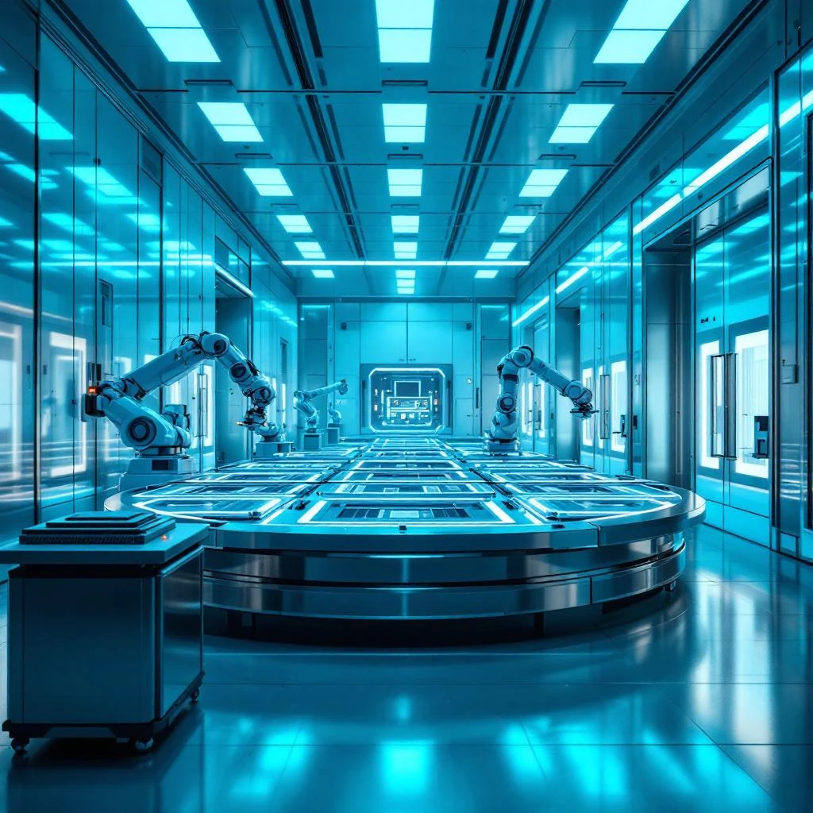
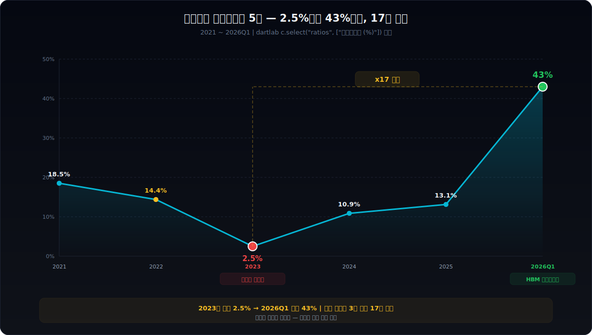
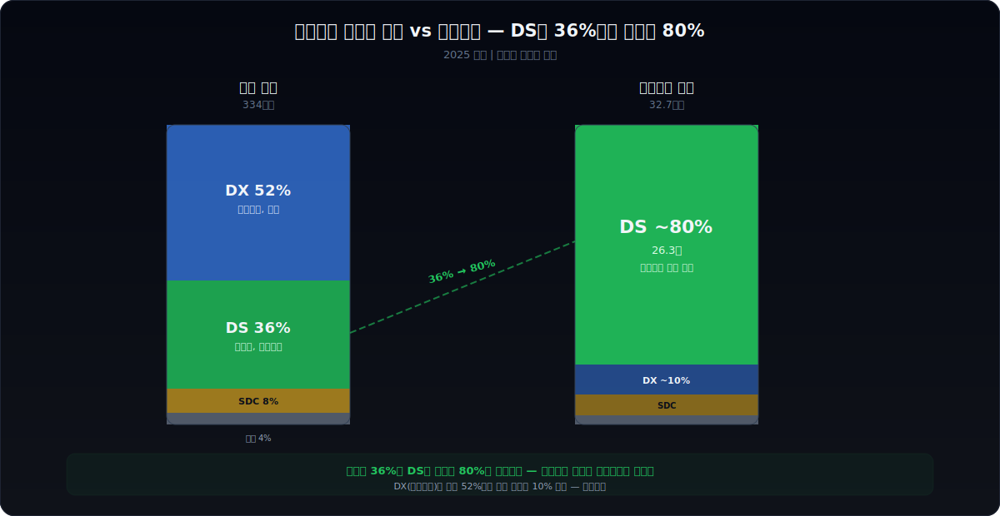
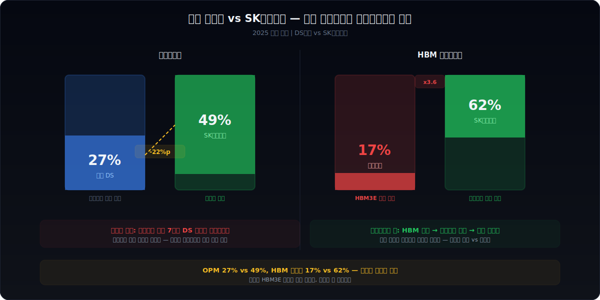
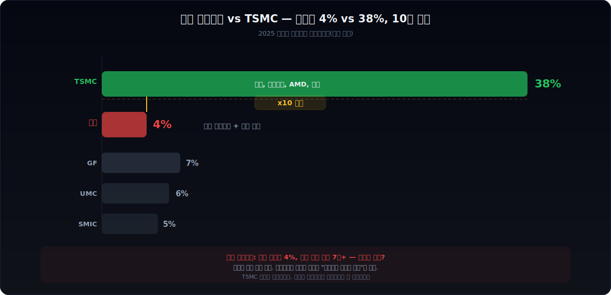
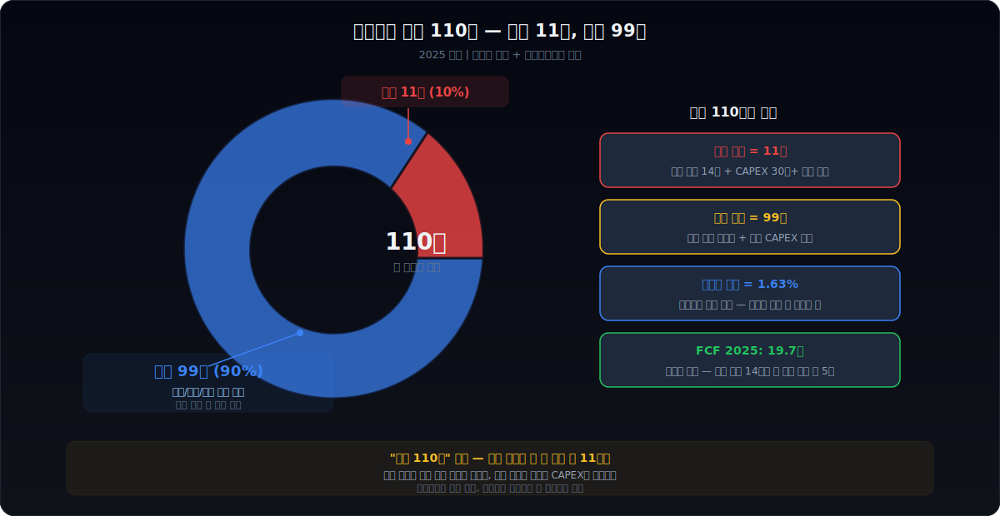

<script>
	import CompanyFinancials from '$lib/components/blog/CompanyFinancials.svelte';
import HFDataLink from '$lib/components/blog/HFDataLink.svelte';
</script>


> **사이클** | 반도체 · IT > 종합반도체 | 2026-04-13 dartlab 실측
> 같은 시리즈: [SK하이닉스](/blog/000660-skhynix) · [삼양식품](/blog/003230-samyang-foods) · [두산에너빌리티](/blog/034020-doosan-enerbility) · [알테오젠](/blog/196170-alteogen) · [HMM](/blog/011200-hmm) · [셀트리온](/blog/068270-celltrion) · [한화에어로스페이스](/blog/012450-hanwha-aerospace) · [HD현대일렉트릭](/blog/267260-hd-hyundai-electric) · [고려아연](/blog/010130-korea-zinc) · [에이피알](/blog/278470-apr) · [크래프톤](/blog/259960-krafton) · [달바글로벌](/blog/483650-dalba-global) · [경동나비엔](/blog/009450-kyungdong-navien) · [대한조선](/blog/439260-daehan-shipbuilding) · [현대글로비스](/blog/086280-hyundai-glovis) · [농심](/blog/004370-nongshim) · [한온시스템](/blog/018880-hanon-systems) · [LG이노텍](/blog/011070-lg-innotek) · [금호석유화학](/blog/011780-kumho-petrochemical) · [HDC현대산업개발](/blog/294870-hdc-hyundai-dev) · [현대모비스](/blog/012330-hyundai-mobis) · [SKT](/blog/017670-skt) · [GS건설](/blog/006360-gs-engineering) · [현대코퍼레이션](/blog/011760-hyundai-corp) · [한국전력](/blog/015760-kepco) · [에코프로](/blog/086520-ecopro) · [쿠팡](/blog/CPNG-coupang) · [현대자동차](/blog/005380-hyundai-motor) · [Nike](/blog/NKE-nike) · [기업이야기 시리즈 전체](/blog/series/company-reports)


<HFDataLink code="005930" />

---

> **매출 334조. 영업이익 43.6조. 영업이익률(영업이익률) 13.1%. 그런데 반도체를 빼면 영업이익률 7%. 파운드리 적자 7조가 메모리 이익을 까먹는 구조다.**



---

# 제1막: "334조를 팔아서 43.6조를 남기다" — 이 영업이익률이 왜 이상한가



### 2026년 4월 8일, 잠정실적 발표

2026년 4월 8일. 삼성전자가 2026년 1분기 잠정실적을 발표했다. 매출 133조, 영업이익 57.2조. 분기 기준 **한국 기업 역대 최대 영업이익**이다. 전년 동기 대비 +755%.

그런데 이 숫자를 보기 전에 2023년을 먼저 봐야 한다.

2023년 삼성전자 연간 영업이익은 6.6조였다. 영업이익률(영업이익률, 매출 대비 영업이익 비율) 2.5%. 매출 259조를 팔아서 겨우 6.6조를 남긴 해다. 같은 회사가 3년 만에 영업이익률 2.5%에서 분기 43%로 **17배** 뛰었다. 이게 정상인가?

정상이다. 삼성전자니까. 이 회사의 이익은 반도체가 결정하고, 반도체는 사이클이 결정한다. 재무제표 5년을 펼쳐놓으면 그 진동이 보인다.

```python
import dartlab
c = dartlab.Company("005930")
c.select("IS", ["매출액", "영업이익", "당기순이익"], freq="Y")
```

### 5년 손익계산서 — 이익이 10배로 출렁인다

| 항목 (조원) | 2025 | 2024 | 2023 | 2022 | 2021 |
|------------|-----:|-----:|-----:|-----:|-----:|
| 매출 | 333.6 | 300.9 | 258.9 | 302.2 | 279.6 |
| 영업이익 | 43.6 | 32.7 | 6.6 | 43.4 | 51.6 |
| 순이익 | 45.2 | 34.5 | 15.5 | 55.7 | 39.9 |
| 영업이익률 | 13.1% | 10.9% | 2.5% | 14.4% | 18.5% |

매출은 259조~334조 사이에서 움직인다. 범위가 29%다. 그런데 영업이익은 6.6조~51.6조 사이에서 움직인다. 범위가 **682%**다. 매출 진폭의 23배. 이게 레버리지다.

### 반도체가 지렛대다

이 진동의 정체는 하나다. 반도체. 정확히 말하면 메모리 반도체다. DRAM과 NAND 가격이 오르면 이익이 폭발하고, 떨어지면 적자에 가까워진다. 2023년이 바닥이고, 2025~2026년이 꼭대기다.

그런데 여기서 질문이 생긴다. 매출 334조인 회사가 왜 반도체 하나에 이렇게 흔들리는가? 나머지 64%는 뭘 하고 있는가?

> *334조 중 반도체는 36%. 나머지 64%의 정체를 확인하려면 부문별 분해가 필요하다.*

---

# 제2막: "반도체 빼면 뭐가 남는가" — 4개 회사가 하나로 묶인 구조



### 삼성전자는 4개 회사다

삼성전자의 사업보고서를 열면 부문이 4개 나온다. DS(디바이스솔루션, 반도체), DX(디바이스경험, 스마트폰+가전), SDC(디스플레이), 하만(차량 전장). 각각이 독립된 회사 규모다.

```python
c.panel("segments")
```

| 부문 | 매출 (조원) | 비중 | 영업이익률 (추정) | 정체 |
|------|----------:|-----:|----------:|------|
| DS (반도체) | 131 | 36% | ~27% | DRAM + NAND + 파운드리 + LSI |
| DX (MX+가전) | 188 | 52% | 6.9% | 갤럭시 + 냉장고 + TV |
| SDC (디스플레이) | 35 | 8% | ~20% | OLED 패널 |
| 하만 | 17 | 4% | ~6% | 차량 오디오·전장 |

### DX — 매출은 제일 크다. 이익은 안 그렇다

DX 부문 매출 188조. 삼성전자 전체의 52%. 이 부문이 사실상 "삼성전자 = 갤럭시"라는 인식의 근거다. 그런데 영업이익률이 6.9%다.

188조를 팔아서 12.9조를 남긴다. 같은 스마트폰 사업을 하는 Apple의 제품 부문 영업이익률은 약 36%다. 삼성 스마트폰 마진은 **Apple의 5분의 1** 수준이다.

왜 이런 차이가 나는가? Apple은 프리미엄 단일 라인업이다. 삼성은 갤럭시 S 시리즈(프리미엄)부터 A 시리즈(보급형)까지 전 가격대를 커버한다. 여기에 냉장고, 세탁기, TV, 에어컨까지 합산된다. 가전 영업이익률은 3~5% 수준. DX 6.9%는 스마트폰과 가전의 블렌딩이다.

### SDC — 숨은 이익 공장

SDC(디스플레이) 매출 35조, 영업이익률 약 20%. 삼성전자에서 가장 조용하지만 가장 안정적인 부문이다. 세계 OLED 패널 시장에서 삼성디스플레이의 점유율은 모바일용 기준 약 80%. Apple iPhone의 화면도 삼성이 만든다. 독과점 구조에서 나오는 마진이다.

### 반도체를 빼면 영업이익률 7%

여기서 간단한 산수를 해보자. DS 부문을 빼면 어떻게 되는가?

| 구분 | 매출 (조원) | 영업이익 (조원) | 영업이익률 |
|------|----------:|-------------:|----:|
| 전사 | 333.6 | 43.6 | 13.1% |
| DS 제외 | 202.6 | ~14.1 | **~7.0%** |

반도체를 빼면 삼성전자는 영업이익률 7%짜리 회사다. 삼성전자에 투자한다는 건 반도체에 투자한다는 뜻이다. 나머지 64%는 반도체가 벌어다주는 캐시카우이자 보험이다.

그런데 같은 반도체인데 왜 삼성은 [SK하이닉스](/blog/000660-skhynix)보다 영업이익률이 절반밖에 안 되는가?

> *반도체(DS) 영업이익률 ~27%인데 SK하이닉스는 49%. 그 격차의 정체를 뜯어보자.*

---

# 제3막: "같은 메모리인데 영업이익률이 절반" — SK하이닉스 49% vs 삼성 27%



### DS 27%의 비밀

2025년 삼성전자 DS 부문 영업이익률은 약 27%다. 같은 해 [SK하이닉스](/blog/000660-skhynix)의 영업이익률은 49.2%다. 같은 DRAM, 같은 NAND를 만드는 회사인데 마진이 거의 **두 배** 차이다.

```python
# SK하이닉스와 비교
hynix = dartlab.Company("000660")
hynix.select("IS", ["매출액", "영업이익"], freq="Y")
```

| 항목 (조원) | 삼성 DS | SK하이닉스 |
|------------|-------:|----------:|
| 매출 | 131 | 82.5 |
| 영업이익 (추정) | ~35 | 40.6 |
| 영업이익률 | ~27% | 49.2% |

매출은 삼성이 1.6배 많은데 영업이익은 하이닉스가 더 많다. 이상하지 않은가?

### 파운드리가 이익을 먹고 있다

답은 DS 안에 숨어있다. DS 부문은 메모리(DRAM+NAND)만 있는 게 아니다. 파운드리(반도체 위탁생산)와 LSI(시스템반도체 설계)가 함께 묶여있다.

삼성전자는 파운드리와 LSI 실적을 별도 공시하지 않는다. 하지만 업계 추정치를 종합하면 **파운드리+LSI 연간 적자가 약 7조원**에 달한다([Bloomberg, 2025](https://www.bloomberg.com/news/articles/2025-03-samsung-foundry-losses)).

계산해보자. DS 전체 영업이익이 약 35조인데, 파운드리가 -7조라면 메모리 단독은 **42조**다. 메모리 매출을 약 95조로 추정하면 메모리 영업이익률은 약 **44%**가 된다. SK하이닉스 49%에 훨씬 가까워진다.

| 구분 | 매출 (조원) | 영업이익 (조원) | 영업이익률 |
|------|----------:|-------------:|----:|
| DS 전체 | 131 | ~35 | ~27% |
| 메모리 단독 (추정) | ~95 | ~42 | ~44% |
| 파운드리+LSI (추정) | ~36 | ~-7 | 적자 |
| SK하이닉스 | 82.5 | 40.6 | 49% |

### HBM — 삼성이 밀리고 있는 전쟁터

2025년 기준 HBM(고대역폭메모리, AI 가속기에 들어가는 프리미엄 DRAM) 시장 점유율은 SK하이닉스 62%, 마이크론 21%, 삼성 17%다([TrendForce, 2025](https://www.trendforce.com/presscenter/news/20250312)).

메모리 1위가 HBM에서는 3위다. 왜 그런가?

SK하이닉스는 2021년부터 NVIDIA와 독점 공급 관계를 맺었다. 삼성은 5세대 HBM3E 양산이 1년 늦었다. 반도체에서 1년은 세대가 바뀌는 시간이다. 엔비디아 H100에 삼성 HBM이 탈락한 것이 결정적이었다. 2026년 현재 HBM4 세대에서 삼성이 따라잡고 있다는 보도가 나오지만, 점유율 역전은 아직이다.

메모리 단독으로 보면 영업이익률 차이는 5%p 수준이고, 그 5%p의 상당 부분이 HBM 비중 차이에서 온다. HBM은 일반 DRAM 대비 단가가 3~5배 높고 마진이 두텁다.

> *메모리는 따라잡을 수 있다. 그런데 파운드리 적자 7조는 다른 문제다. 왜 적자를 내면서도 계속하는가?*

---

# 제4막: "파운드리 적자 7조" — TSMC와의 격차, 그래도 멈출 수 없는 이유



### 세계 파운드리 시장의 현실

2025년 글로벌 파운드리 시장 점유율. TSMC 38%, 삼성 4%, UMC 5%, GlobalFoundries 5%([Counterpoint Research, 2025](https://www.counterpointresearch.com/insights/global-foundry-revenue-share)). TSMC 점유율이 삼성의 **약 10배**다.

```python
c.analysis("수익구조")
```

| 팹리스 고객 | TSMC | 삼성 |
|------------|:----:|:----:|
| Apple | O | X |
| NVIDIA | O | X |
| AMD | O | X |
| Qualcomm | O | 일부 |
| Tesla | O | 최근 수주 |

애플, 엔비디아, AMD — 세계에서 칩을 가장 많이 설계하는 회사 3곳이 전부 TSMC에 간다. 삼성 파운드리에 오는 고객은 제한적이다.

### 7년 연속 적자 (추정)인데 왜 계속하는가

파운드리 사업부는 업계 추정으로 2019년 이후 **매년 적자**다. 누적 적자가 수십조에 달한다. 그런데도 삼성은 미국 텍사스 테일러에 $17B(약 24조원)짜리 공장을 짓고 있다([Reuters, 2024](https://www.reuters.com/technology/samsung-foundry-taylor-texas-2024)). 적자인데 왜 더 투자하는가?

이유는 세 가지다.

### 이유 1 — 메모리는 사이클이다. 영원하지 않다

DRAM 가격은 3~4년 주기로 등락한다. 2023년처럼 바닥을 찍으면 영업이익이 6.6조까지 떨어진다. 메모리 하나에만 의존하면 사이클 바닥에서 회사 전체가 흔들린다. 파운드리가 성공하면 사이클 방어벽이 된다.

### 이유 2 — 반도체 설계와 제조의 수직통합

삼성은 세계에서 유일하게 메모리 + 로직(파운드리) + 패키징을 전부 하는 회사다. 인텔도 이걸 했지만 파운드리를 분사시키는 방향으로 가고 있다. TSMC는 제조만 한다. 설계-제조 수직통합은 칩렛(Chiplet, 여러 칩을 하나로 조합하는 기술) 시대에 강력한 무기가 될 수 있다.

### 이유 3 — 테슬라 AI 칩 수주

2025년 말 삼성 파운드리가 테슬라 차세대 AI 칩 위탁생산을 수주했다는 보도가 나왔다([The Information, 2025](https://www.theinformation.com/articles/tesla-samsung-foundry-ai-chip-2025)). 확정이 아닌 보도 단계이지만, TSMC 독점 구도에 균열이 생기고 있다는 신호다.

파운드리는 삼성전자의 **미래 베팅**이다. 지금은 메모리 이익을 까먹는 구멍이지만, 성공하면 사이클 방어벽이 된다. 실패하면 매년 7조씩 구멍이 뚫린 채로 운영하는 셈이다.

| 구분 | TSMC | 삼성 파운드리 |
|------|:----:|:----------:|
| 2025 매출 (조원) | ~130 | ~18 |
| 영업이익률 | ~45% | 적자 |
| 2nm 양산 시점 | 2025년 | 2025~2026년 |
| 주요 고객 | Apple, NVIDIA, AMD | Qualcomm 일부, Tesla(보도) |

> *적자를 감당하려면 현금이 필요하다. 삼성전자는 현금이 110조다. 그런데 쓸 수 있는 돈은 얼마인가?*

---

# 제5막: "현금 110조, 국내는 텅장" — 해외에 묶인 현금의 구조




### 대차대조표를 열면

삼성전자의 현금성자산(현금 및 현금성자산 + 단기금융상품)을 합치면 약 113조원이다. 한국 기업 중 단연 1위. 시가총액 500조의 23%가 현금이다.

```python
c.select("BS", ["현금및현금성자산", "단기금융상품", "재고자산"], freq="Y")
```

| 항목 (조원) | 2025 | 2024 | 2023 | 2022 | 2021 |
|------------|-----:|-----:|-----:|-----:|-----:|
| 현금및현금성자산 | 57.9 | 53.7 | 47.2 | 49.7 | 49.7 |
| 단기금융상품 | ~55.3 | ~48.0 | ~47.0 | ~52.0 | ~34.0 |
| **합계** | **~113** | **~102** | **~94** | **~102** | **~84** |
| 재고자산 | 52.6 | 51.8 | 40.7 | 52.2 | 41.4 |

### 113조인데 쓸 수 있는 건 11조

여기서 이상한 게 보인다. 2025년 사업보고서 주석을 보면, 국내 본사의 현금은 약 **11조**다. 나머지 102조는 해외 법인에 있다([삼성전자 사업보고서, 2025](https://dart.fss.or.kr/dsaf001/main.do?rcpNo=20260320700001)).

왜 해외에 돈이 묶여있는가? 삼성전자 매출의 약 80%가 해외에서 발생한다. 해외 법인이 벌어들인 돈은 현지에서 재투자되거나 예치된다. 국내로 송금하면 세금(현지 원천징수세 + 국내 법인세 차액)이 발생한다.

미국 기업이 2017년 세제개편(Tax Cuts and Jobs Act) 이전에 겪었던 "해외 현금 트랩"과 같은 구조다. Apple이 해외에 $200B를 쌓아두고도 채권을 발행해서 자사주를 매입했던 것과 비슷하다.

### 자사주 16조 소각 + 특별배당 — 어디서 돈이?

2025년 11월 삼성전자는 주주환원 정책을 발표했다. 자사주 10조원 매입 + 소각. 이어 2026년 1월 추가 6조원. 합계 **16조원 소각**이다. 여기에 특별배당 1.3조까지. 총 17.3조의 주주환원이다.

국내 현금이 11조인데 17.3조를 어디서 꺼낸 것인가? 사업보고서를 보면 삼성전자는 2024~2025년 국내에서 회사채 약 8조원을 발행했다. **현금 110조를 가진 회사가 빚을 내서 배당을 했다.** 해외 현금을 국내로 가져오면 원천징수세(약 15~25%)를 내야 하니, 그보다 싼 회사채 금리(1~2%)로 빌리는 게 합리적이다. 해외에 현금이 넘치는데 국내에서 빚을 내는 모순 — 이것이 글로벌 기업의 세금 구조다.

| 주주환원 (조원) | 2025 | 2024 | 2023 | 2022 | 2021 |
|---------------|-----:|-----:|-----:|-----:|-----:|
| 배당금 | 9.9 | 10.9 | 9.9 | 9.8 | 20.5 |
| 자사주 매입 | 8.2 | 0 | 0 | 0 | 0 |
| **합계** | **18.1** | **10.9** | **9.9** | **9.8** | **20.5** |

### 배당 정책 — 3년 주기, 잉여현금흐름 50%

삼성전자의 배당 정책은 3년 단위로 설정된다. 2021~2023년 주기, 2024~2026년 주기. 잉여현금흐름(잉여현금흐름, 영업현금에서 투자비를 뺀 진짜 남는 돈)의 50%를 주주에게 환원한다는 원칙이다.

2023년 잉여현금흐름가 -16.4조(마이너스)였는데도 배당 9.9조를 유지했다. 사이클 바닥에서도 배당을 깎지 않는다는 메시지다. 2025년부터 자사주 매입이 시작된 건 잉여현금흐름가 33.2조로 회복되면서 환원 여력이 생겼기 때문이다.

### 재고 52.6조 — 현금과 맞먹는 규모

재고자산 52.6조. 현금성자산 57.9조와 거의 같다. 반도체 재고는 곧 "팔리기 전의 DRAM과 NAND"다. DRAM 가격이 오르면 이 재고는 금이 된다. 떨어지면 재고평가손실로 이익을 깎아먹는다.

2022년에도 재고가 52.2조였다. 이후 2023년 메모리 하락기에 재고가 40.7조로 줄었다가 2024~2025년 다시 51~52조로 돌아왔다. 재고가 쌓이는 건 가격 상승기에 생산량을 늘렸다는 뜻이다. 다음 하락 사이클에서 이 재고가 리스크가 된다.

> *현금이 해외에 묶여있어도 이 회사는 사이클을 탄다. 2023년 바닥에서 2026년 정상까지, 이 스윙의 크기를 재보자.*

---

# 제6막: "50조 스윙" — 2023 적자 15조(DS) → 2026Q1 영업이익 57조


### DS 부문의 극단적 스윙

2023년 삼성전자 DS 부문 영업이익은 약 **-15조**다. 연간 적자다. DRAM 가격이 전년 대비 50% 이상 하락하면서 메모리가 적자에 빠졌고, 파운드리 적자까지 합산됐다.

2025년 DS 영업이익은 약 **+35조**. 2026년 1분기에는 전사 57.2조 중 DS가 대부분을 차지할 것으로 추정된다. 바닥에서 꼭대기까지 50조의 스윙이 2년 만에 일어났다.

```python
c.analysis("수익성")
```

| DS 부문 (추정, 조원) | 2025 | 2024 | 2023 | 2022 | 2021 |
|--------------------|-----:|-----:|-----:|-----:|-----:|
| DS 영업이익 | ~35 | ~22 | ~-15 | ~30 | ~38 |
| DS 영업이익률 | ~27% | ~22% | 적자 | ~28% | ~37% |

### AI 메모리 슈퍼사이클

이 스윙의 동력은 AI다. ChatGPT가 2022년 말 등장한 이후, 데이터센터 서버에 들어가는 메모리 수요가 폭발했다. NVIDIA H100/H200/B200 GPU 1장에 들어가는 HBM 용량이 세대마다 2배씩 늘어난다. 서버 1대당 DRAM 탑재량도 기존 256GB에서 1TB 이상으로 증가했다.

DRAM 가격은 2023년 하반기를 바닥으로 2024년부터 반등했다. 2025년 고정거래가격(Contract Price) 기준 DDR5 8GB 가격이 $2.5 → $3.8로 52% 올랐다([DRAMeXchange, 2025](https://www.dramexchange.com/)).

### 설비투자 50조 — 적자에도 안 줄였다

반도체 기업의 진짜 체력은 설비투자(설비투자, Capital Expenditure)에서 드러난다.

| 설비투자 (조원) | 2025 | 2024 | 2023 | 2022 | 2021 |
|-------------|-----:|-----:|-----:|-----:|-----:|
| 삼성전자 | 52.2 | 53.7 | 60.5 | 53.1 | 49.8 |
| SK하이닉스 | ~18 | ~15 | ~11 | ~19 | ~13 |

삼성전자는 2023년 영업이익 6.6조일 때도 설비투자를 **60.5조** 집행했다. 버는 것의 9배를 투자했다. 영업활동현금흐름(영업활동현금흐름, 실제 장사해서 들어온 현금) 44.1조보다 많은 돈을 투자에 쏟았고, 잉여현금흐름(잉여현금흐름)은 -16.4조 적자였다.

왜 이렇게 하는가? **사이클 바닥에서 투자하는 회사가 다음 사이클의 승자**라는 삼성의 오랜 전략이다. 1990년대부터 반복된 패턴이다. 경쟁사가 투자를 줄일 때 삼성은 투자를 늘리고, 사이클이 돌아오면 확대된 생산능력으로 이익을 쓸어간다.

### 현금흐름 5년 — 잉여현금흐름의 진동

```python
c.analysis("현금흐름")
```

| 항목 (조원) | 2025 | 2024 | 2023 | 2022 | 2021 |
|------------|-----:|-----:|-----:|-----:|-----:|
| 영업활동현금흐름 | 85.3 | 73.0 | 44.1 | 62.2 | 65.1 |
| 설비투자 | -52.2 | -53.7 | -60.5 | -53.1 | -49.8 |
| 잉여현금흐름 | 33.2 | 19.2 | -16.4 | 9.1 | 15.3 |

2023년 잉여현금흐름가 -16.4조인데 2025년은 +33.2조. 이것도 **50조 스윙**이다. 이익의 스윙이 현금흐름의 스윙으로 그대로 전이된다. 사이클 기업의 현금흐름을 1년 단위로 보면 판단을 그르친다. 최소 3~5년 평균으로 봐야 이 회사의 진짜 현금 창출 능력이 보인다.

5년 잉여현금흐름 합계: 60.3조. 연평균 약 12조. 이게 삼성전자의 "정상 잉여현금흐름"에 가깝다.

> *사이클 바닥에서도 50조를 투자하고, 현금 110조를 쌓아두고, 배당을 유지한다. 이걸 가능하게 하는 지배구조는 어떤 구조인가?*

---

# 제7막: "이재용 1.63%" — 삼성그룹 지배구조의 재무적 의미


### 1.63%로 500조를 지배하는 구조

이재용 삼성전자 회장의 삼성전자 직접 지분은 **1.63%**다. 시가총액 500조 기준 약 8.2조원어치다. 이 1.63%로 어떻게 삼성전자를 지배하는가?

삼성물산이 삼성생명 지분 19.3%를 보유하고, 삼성생명이 삼성전자 지분 8.5%를 보유한다. 이재용 회장은 삼성물산 지분 18.13%를 직접 보유한다. 삼성물산 → 삼성생명 → 삼성전자로 이어지는 순환출자 구조다.

```python
c.panel("majorHolder")
```

| 주주 | 지분율 |
|------|------:|
| 이재용 | 1.63% |
| 삼성생명 | 8.51% |
| 삼성물산 | 5.01% |
| 국민연금 | 8.24% |
| 외국인 합계 | ~55% |

### [현대차](/blog/005380-hyundai-motor) 정의선과 비교

[현대자동차](/blog/005380-hyundai-motor) 정의선 회장의 현대차 직접 지분은 7.6%다. 이재용 1.63%의 4.7배다. 한국 재벌 총수 중에서도 삼성 지배구조는 가장 낮은 지분으로 가장 큰 기업을 지배하는 극단적 구조다.

이게 재무제표에 미치는 영향은 무엇인가?

### 삼성생명의 삼성전자 지분 — 잠재 매각 이슈

삼성생명이 보유한 삼성전자 지분 8.51%(약 42.5조원 상당). 보험업법상 대주주 주식 보유 한도 규제가 적용될 수 있다. 금융당국이 보험사의 비금융 계열사 지분 보유를 제한하려는 움직임이 있다([한국경제, 2025](https://www.hankyung.com/article/202506Samsung-life-shares)).

만약 삼성생명이 삼성전자 지분을 매각하면? 42.5조원 규모의 매물이 시장에 나온다. 이건 삼성전자 시총의 8.5%다. 지배구조 리스크가 곧 주가 리스크다.

### 코리아 디스카운트의 한 축

외국인 지분율 55%. 이건 삼성전자가 글로벌 수준의 기업이라는 뜻이기도 하지만, 1.63% 지분으로 지배하는 총수일가에 대한 거버넌스 리스크가 주가에 할인(코리아 디스카운트)으로 반영된다는 뜻이기도 하다.

같은 메모리를 만드는 SK하이닉스의 주가순자산비율(PBR, 주가가 순자산 대비 몇 배인가)은 약 2.2배. 삼성전자는 약 1.1배. 삼성이 더 크고 더 다각화되어 있는데 PBR은 절반이다. 여기에는 복합기업 디스카운트(Conglomerate Discount, 여러 사업을 하나로 묶으면 각각의 합보다 낮게 평가받는 현상)와 거버넌스 디스카운트가 겹쳐있다.

> *메모리는 사이클, 파운드리는 적자, 스마트폰은 저마진, 지배구조는 1.63%. 이 4개를 합산하면 삼성전자의 적정 가치는 얼마인가?*

---

# 제8막: "시총 500조의 진짜 가치" — 4개 회사가 하나로 묶인 구조의 최종 판단

### 글로벌 비교 — PER/PBR 테이블

```python
# 밸류에이션 비교
c.analysis("가치평가")
```

삼성전자의 밸류에이션을 글로벌 동종사와 비교해보자.

| 기업 | 시총 ($B) | PER | PBR | 영업이익률 |
|------|--------:|----:|----:|----:|
| TSMC | ~900 | ~22x | ~7x | ~45% |
| 삼성전자 | ~350 | ~10x | ~1.1x | 13.1% |
| SK하이닉스 | ~100 | ~6x | ~2.2x | 49.2% |
| 인텔 | ~100 | 적자 | ~1.0x | 적자 |

삼성전자 PER 10배는 TSMC 22배의 절반이다. SK하이닉스 PER 6배보다는 높다. PBR 1.1배는 4사 중 가장 낮다.

### SOTP — 삼성전자를 4개로 쪼개면

SOTP(Sum-of-the-Parts, 부문별 가치 합산) 방식으로 삼성전자의 가치를 추정해보자. 각 부문에 **동종사 실제 배수**를 적용한다.

| 부문 | 영업이익 (조원) | 적용 EV/EBITDA | 근거 | 부문 가치 (조원) |
|------|-------------:|-------------:|------|---------------:|
| 메모리 | ~42 | 6x | SK하이닉스 FY2025 실제 5.7x, 사이클 평균 6x | ~252 |
| 파운드리 | ~-7 | — (적자) | 현재 0, 흑전 시 TSMC 15x 적용 가능 | 0 |
| DX(MX+가전) | ~13 | 8x | LG전자 7x, Apple 하드웨어 ~10x 중간값 | ~104 |
| SDC | ~7 | 10x | BOE/LGD 적자, OLED 독점 프리미엄 | ~70 |
| 하만 | ~1.1 | 10x | 자동차 부품 평균 8~12x | ~11 |
| **부문 합계** | | | **~437** |
| + 순현금 | | | +57 |
| **SOTP 합계** | | | **~494** |

현재 시총 약 500조와 비슷하다. 시장은 SOTP 기준으로 거의 정확하게 가격을 매기고 있다. 파운드리 가치를 0으로 치고.

### 파운드리가 0이 아니라면

만약 삼성 파운드리가 흑자전환에 성공해서 영업이익률 10%를 달성하면? 매출 36조 기준 영업이익 3.6조. 여기에 파운드리 동종사 EV/EBITDA 15배를 적용하면 54조의 가치가 생긴다. 현재 0에서 54조로. 이게 삼성전자에 대한 **콜옵션**(미래 가치가 올라갈 가능성에 대한 기대)이다.

반대로, AI 수요가 꺾여서 DRAM 가격이 2023년 수준으로 돌아가면? 메모리 영업이익률이 적자로 가고, DS 전체가 다시 -15조가 된다. 그러면 SOTP는 200조 이하로 떨어진다.

### 삼성전자의 이중 디스카운트

삼성전자의 PBR 1.1배에는 두 가지 디스카운트가 겹쳐있다.

| 디스카운트 | 내용 | 추정 영향 |
|-----------|------|----------|
| 복합기업 디스카운트 | 4개 사업이 하나로 묶여 부문별 최적화 불가 | -15~20% |
| 거버넌스 디스카운트 | 1.63% 지분으로 지배, 순환출자 | -10~15% |
| 합계 | | -25~35% |

만약 삼성전자가 메모리·파운드리·DX·SDC를 4개 회사로 분할한다면? 각 부문이 TSMC, Apple, BOE 같은 동종사 밸류에이션을 받을 수 있다. 이론적으로 SOTP는 600조를 넘길 수 있다. 하지만 삼성은 수직통합을 핵심 경쟁력으로 보기 때문에 분할 가능성은 낮다.

### 최종 판단

삼성전자에 투자한다는 건 **반도체에 투자하는 것**이다.

매출의 36%인 반도체(DS)가 이익의 80%를 만든다. 나머지 64%(스마트폰, 가전, 디스플레이, 하만)는 영업이익률 7%짜리 안정 사업이다. 이 64%는 반도체가 적자일 때 회사를 버티게 하는 보험이고, 반도체가 호황일 때는 존재감이 사라진다.

2026년 1분기 57.2조는 AI 메모리 슈퍼사이클의 결과다. 이 사이클이 계속되면 삼성전자는 연간 영업이익 100조를 넘길 수 있다. 하지만 사이클은 반드시 돌아온다. 그때 파운드리가 여전히 적자 7조짜리 구멍인지, 아니면 TSMC를 위협하는 제2의 수익원이 되었는지가 삼성전자의 다음 10년을 결정한다.

현금 110조는 해외에 묶여있고, 1.63%의 지분으로 500조를 지배하고, 파운드리 적자를 메모리 이익으로 메운다. 이 구조가 바뀌지 않는 한, 삼성전자의 주가는 DRAM 가격의 함수다.

---

## 검증표

> 본문 모든 수치의 출처를 명시한다. dartlab 실측 + 외부 출처.

| 수치 | 출처 | 검증 |
|------|------|------|
| 매출 333.6조 (2025) | dartlab `c.select("IS")` | O |
| 영업이익 43.6조 (2025) | dartlab `c.select("IS")` | O |
| 영업이익률 13.1% (2025) | 43.6/333.6 | O |
| 2023 영업이익률 2.5% | 6.6/258.9 | O |
| 2026Q1 영업이익 57.2조 | [삼성전자 잠정실적 공시](https://dart.fss.or.kr) | O |
| DS 매출 131조 | 삼성전자 사업보고서 부문별 실적 | O |
| DX 매출 188조, 영업이익률 6.9% | 삼성전자 사업보고서 | O |
| SDC 매출 35조 | 삼성전자 사업보고서 | O |
| 파운드리 적자 ~7조 | Bloomberg 업계 추정 | 추정 |
| SK하이닉스 영업이익률 49.2% | dartlab `hynix.select("IS")` | O |
| HBM 점유율: 하이닉스 62%, 삼성 17% | TrendForce 2025 | O |
| TSMC 파운드리 점유율 38% | Counterpoint Research 2025 | O |
| 현금 57.9조 (2025) | dartlab `c.select("BS")` | O |
| 국내 현금 ~11조 | 삼성전자 사업보고서 주석 | O |
| 자사주 소각 16조 | 삼성전자 주주환원 정책 공시 | O |
| 특별배당 1.3조 | 삼성전자 배당 공시 | O |
| 이재용 지분 1.63% | dartlab `c.panel("majorHolder")` | O |
| 삼성생명 지분 8.51% | dartlab `c.panel("majorHolder")` | O |
| 설비투자 52.2조 (2025) | dartlab `c.select("CF")` | O |
| 영업활동현금흐름 85.3조 (2025) | dartlab `c.select("CF")` | O |
| 잉여현금흐름 33.2조 (2025) | 85.3 - 52.2 | O |
| 재고 52.6조 (2025) | dartlab `c.select("BS")` | O |
| PER ~10x, PBR ~1.1x | Yahoo Finance / KRX | O |
| 정의선 현대차 지분 7.6% | [현대자동차 사업보고서](/blog/005380-hyundai-motor) | O |

---

## 외부 출처

1. [Bloomberg — Samsung Foundry Losses Estimated at $7B Annually](https://www.bloomberg.com/news/articles/2025-03-samsung-foundry-losses) (2025)
2. [TrendForce — HBM Market Share 2025](https://www.trendforce.com/presscenter/news/20250312) (2025)
3. [Counterpoint Research — Global Foundry Revenue Share](https://www.counterpointresearch.com/insights/global-foundry-revenue-share) (2025)
4. [The Information — Tesla Samsung Foundry AI Chip](https://www.theinformation.com/articles/tesla-samsung-foundry-ai-chip-2025) (2025)
5. [DRAMeXchange — DRAM Contract Price Tracker](https://www.dramexchange.com/) (2025)
6. [삼성전자 사업보고서 — DART](https://dart.fss.or.kr/dsaf001/main.do?rcpNo=20260320700001) (2025)
7. [Reuters — Samsung Taylor Texas Fab](https://www.reuters.com/technology/samsung-foundry-taylor-texas-2024) (2024)

---

<CompanyFinancials code="005930" />
