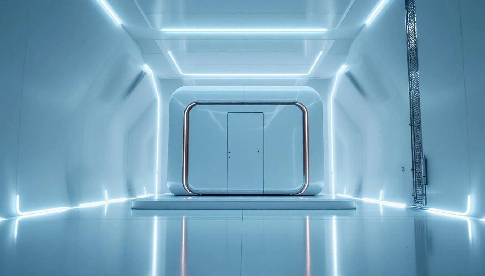
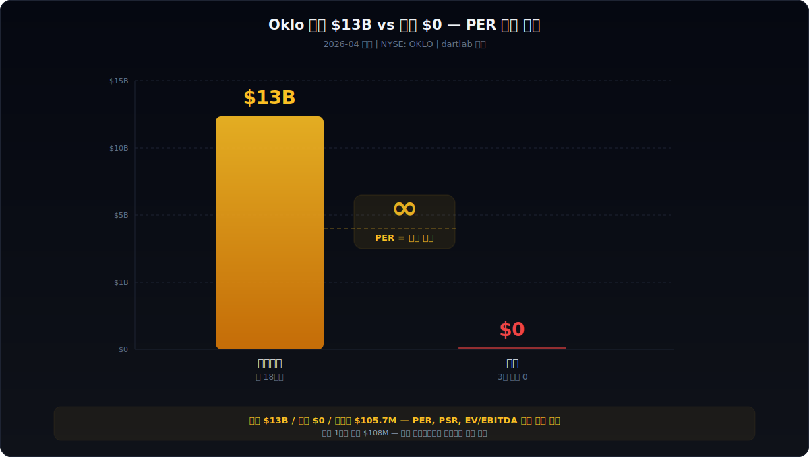
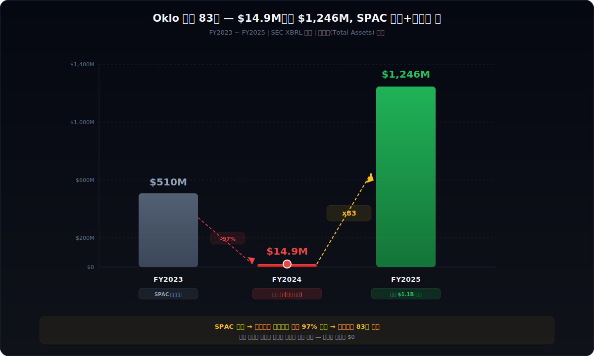
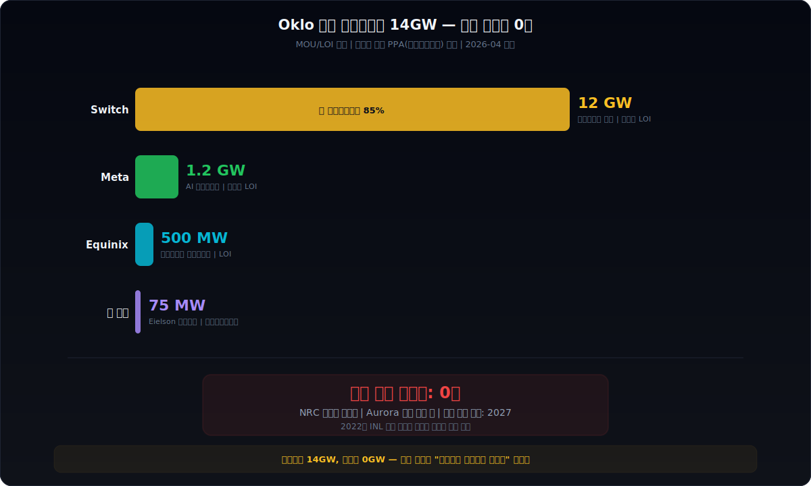
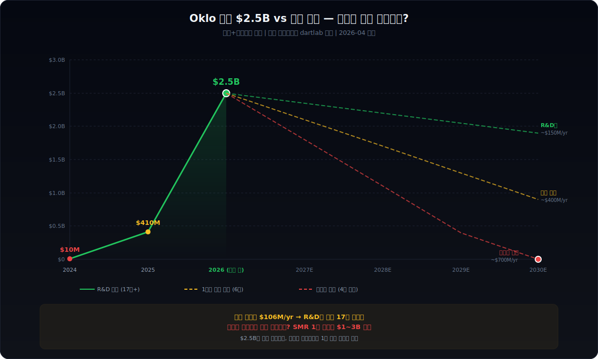
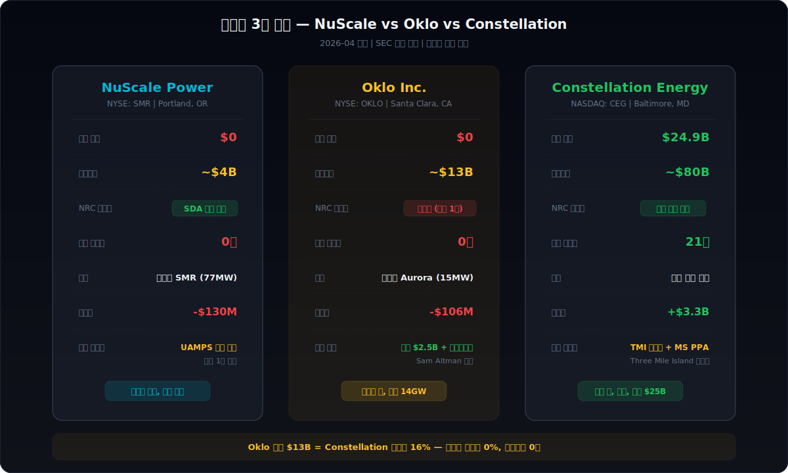

<script>
import ComboChart from '$lib/components/blog/ComboChart.svelte';
import StackBar from '$lib/components/blog/StackBar.svelte';
</script>


> **성장** | 원자력 · 에너지 > SMR(소형모듈원전) | 2026-04-13 dartlab 실측
> 같은 시리즈: [SK하이닉스](/blog/000660-skhynix) · [삼양식품](/blog/003230-samyang-foods) · [두산에너빌리티](/blog/034020-doosan-enerbility) · [알테오젠](/blog/196170-alteogen) · [HMM](/blog/011200-hmm) · [셀트리온](/blog/068270-celltrion) · [한화에어로스페이스](/blog/012450-hanwha-aerospace) · [HD현대일렉트릭](/blog/267260-hd-hyundai-electric) · [고려아연](/blog/010130-korea-zinc) · [에이피알](/blog/278470-apr) · [크래프톤](/blog/259960-krafton) · [달바글로벌](/blog/483650-dalba-global) · [경동나비엔](/blog/009450-kyungdong-navien) · [대한조선](/blog/439260-daehan-shipbuilding) · [현대글로비스](/blog/086280-hyundai-glovis) · [농심](/blog/004370-nongshim) · [한온시스템](/blog/018880-hanon-systems) · [LG이노텍](/blog/011070-lg-innotek) · [금호석유화학](/blog/011780-kumho-petrochemical) · [HDC현대산업개발](/blog/294870-hdc-hyundai-dev) · [현대모비스](/blog/012330-hyundai-mobis) · [SKT](/blog/017670-skt) · [GS건설](/blog/006360-gs-engineering) · [현대코퍼레이션](/blog/011760-hyundai-corp) · [한국전력](/blog/015760-kepco) · [에코프로](/blog/086520-ecopro) · [쿠팡](/blog/CPNG-coupang) · [현대자동차](/blog/005380-hyundai-motor) · [Nike](/blog/NKE-nike) · [삼성전자](/blog/005930-samsung) · [기업이야기 시리즈 전체](/blog/series/company-reports)

---

> **매출 $0. 직원 120명. 시총 $13B(약 18조원). 1인당 시총 $108M. 계약서에 적힌 전력은 14GW. 가동 중인 원자로는 0기. PER(주가수익비율)을 계산하려면 분모가 필요한데, 이 회사에는 분모가 없다.**



---

# 제1막: "매출 $0, 시총 $13B" — 재무제표에 뭐가 있는가



### 재무제표를 열면 빈칸이다

Oklo. 2024년 5월 NYSE(뉴욕증권거래소)에 상장한 원자력 스타트업이다. 상장 당시 제품은 없었다. 상업용 원자로 0기. 매출 $0. 그런데 2026년 4월 기준 시가총액은 약 $13B, 한화로 약 18조원이다.

비교를 하나 해보자. 에코프로([#26](/blog/086520-ecopro))는 시총 78조에 영업이익 864억이었다. 쿠팡([#27](/blog/CPNG-coupang))도 적자 시절 시총이 수십조였지만, 적어도 매출은 있었다. "시총 대비 이익이 너무 적다"는 게 그 글의 핵심이었다. Oklo는 거기서 한 단계 더 나간다. 영업이익이 마이너스다. 매출이 아예 0이다. PER(주가수익비율, 주가가 이익 대비 몇 배인가)을 계산하려면 분모에 이익이 있어야 하는데, 이 회사에는 분모 자체가 존재하지 않는다.

```python
import dartlab
c = dartlab.Company("OKLO")
c.show("IS")
```

### 손익계산서 — 수치가 아니라 부재가 말해준다

SEC(미국증권거래위원회) 공시 기준 Oklo의 손익계산서를 보자.

| 항목 ($M) | FY2025 | FY2024 | FY2023(SPAC) |
|-----------|-------:|-------:|-------------:|
| 매출(Revenue) | 0 | 0 | 0 |
| 영업비용(Operating Expenses) | — | — | 4.3 |
| 순손실(Net Loss) | -105.7 | -73.6 | -4.3 |

매출 행이 3년 연속 0이다. 영업비용만 존재한다. 이 회사가 하는 일은 돈을 쓰는 것이다. 아직 파는 것은 없다.

여기서 주의할 점이 있다. dartlab에서 `c.show("IS")`를 실행하면 2024~2025년 IS 상세 항목이 null로 나올 수 있다. 이유는 CIK(SEC 고유 기업번호) 전환 때문이다. Oklo는 원래 AltC Acquisition Corp(기업인수목적회사)이라는 SPAC(Special Purpose Acquisition Company, 기업인수목적회사)의 CIK를 쓰다가, 합병 완료 후 Oklo Inc.로 CIK가 전환됐다. SEC XBRL 데이터에서 이 전환이 반영되는 데 지연이 있다.

### 순손실의 궤적 — $4.3M에서 $105.7M으로

손실 크기의 변화가 이 회사의 스테이지를 말해준다.

| 연도 | 순손실($M) | 전년비 | 의미 |
|------|----------:|-------:|------|
| FY2023 | -4.3 | — | SPAC 유지 비용 수준 |
| FY2024 | -73.6 | +1,614% | 합병 후 본격 R&D 가동 |
| FY2025 | -105.7 | +44% | 인력 확충 + 인허가 비용 |

$4.3M에서 $105.7M으로 3년 만에 25배. 하지만 이 회사에서 손실 확대는 나쁜 신호가 아니다. 돈을 쓰기 시작했다는 뜻이다. 연구원을 고용하고, 원자로를 설계하고, 규제 당국에 서류를 넣고 있다는 뜻이다.

문제는 이 손실을 감당할 현금이 있느냐다. 그리고 그 현금이 어디서 왔느냐다.

> *매출 $0인 회사가 시총 $13B를 유지하려면, 재무제표 어딘가에 시장이 믿는 근거가 있어야 한다. 대차대조표를 열어보자.*

---

# 제2막: "Sam Altman의 기업인수목적회사(SPAC)" — 왜 AI의 왕이 원자력에 베팅했나

### 2024년 5월 9일, NYSE 상장 첫날

2024년 5월 9일. Oklo가 NYSE에서 거래를 시작했다. 공모가는 $10. 종가는 $5.46. 첫날 -54%.

시장의 반응은 싸늘했다. 이유는 두 가지다. 첫째, SPAC 합병이었다. SPAC(기업인수목적회사)은 빈 껍데기 회사가 주식시장에 먼저 상장한 뒤, 비상장 기업을 인수·합병하는 방식이다. 2020~2021년 SPAC 붐이 지나면서 시장은 SPAC에 알레르기 반응을 보이고 있었다. 둘째, Oklo 자체가 매출 0, 제품 0인 회사였다.

그런데 이 SPAC의 이름이 특이했다. **AltC Acquisition Corp**. 만든 사람은 **Sam Altman**. OpenAI의 CEO다.

### Sam Altman은 왜 원자력에 투자했는가

Sam Altman은 2014년부터 Y Combinator(실리콘밸리 대표 스타트업 액셀러레이터) 대표로 있으면서, Oklo에 개인 투자를 했다. 2015년이다. GPT가 세상에 나오기 5년 전. ChatGPT가 나오기 7년 전.

그의 논리는 단순했다. **AI에는 전력이 필요하다. 엄청나게 많은 전력이.** 2026년 현재 미국 데이터센터 전력 수요는 연간 30~50GW 수준이며, 2030년까지 100GW를 넘길 것으로 전망된다. 이 전력을 태양광과 풍력만으로 채울 수 있는가? 24시간 365일 일정한 출력을 내야 하는 데이터센터에? Altman의 답은 "원자력"이었다.

| 전력원 | 이용률 | 탄소 | 24/7 | 데이터센터 적합성 |
|--------|------:|------|------|-------------------|
| 태양광 | 20~25% | 무탄소 | X | 배터리 필요 |
| 풍력 | 30~40% | 무탄소 | X | 입지 제한 |
| 천연가스 | 85~90% | 탄소 배출 | O | 탈탄소 위반 |
| **원자력** | **90%+** | **무탄소** | **O** | **최적** |

원자력의 이용률은 90% 이상이다. 태양광의 4배. 탄소를 배출하지 않는다. 24시간 365일 돌아간다. 유일한 문제는 건설 비용과 시간, 그리고 규제다.

### Altman은 SPAC에 $375M을 넣었다

AltC Acquisition Corp은 2021년 IPO(기업공개)로 $375M을 모았다. 이 돈은 트러스트 계좌에 보관되어 합병 대상이 확정될 때까지 잠겨 있었다. 2023년 7월, Altman은 합병 대상으로 Oklo를 지정했다. 2024년 5월 합병이 완료되면서 Oklo가 NYSE에 상장됐다.

Altman은 합병 후 Oklo의 이사회 의장(Chairman)이 됐다. OpenAI CEO이면서 원자력 회사의 의장. 두 직함이 공존했다.

### 주가 $5.46 → $55 — 4개월 만에 +900%

상장 첫날 $5.46까지 떨어진 주가가 4개월 뒤인 2024년 12월 $55까지 올랐다. +900%. 무엇이 바뀌었는가?

| 날짜 | 주가 | 이벤트 |
|------|-----:|--------|
| 2024.5.9 | $5.46 | 상장 첫날, -54% |
| 2024.10 | ~$15 | 미 공군 마이크로원자로 계약 |
| 2024.12 | ~$55 | Switch 12GW 계약 발표 |
| 2025.3 | ~$35 | 조정 |
| 2025.12 | $193 | 52주 최고 |
| 2026.4 | ~$50 | 시총 $13B |

2024년 10월 미국 공군과 알래스카 Eielson 기지에 마이크로원자로를 공급하는 계약이 발표됐다. 2024년 12월에는 Switch(데이터센터 운영사)와 12GW 규모의 계약이 발표됐다. 계약 뉴스가 주가를 만들었다. 제품이 아니라 계약이.

### 2025년 4월, Altman 의장 사임

그리고 2025년 4월, Altman이 Oklo 이사회 의장에서 사임했다. 공식 사유는 "OpenAI와 경쟁하는 회사들이 Oklo와 거래를 꺼린다"는 이해충돌 문제였다. Google, Microsoft, Amazon — 모두 AI 데이터센터를 짓고 있고, 모두 원자력을 고려하고 있다. 그런데 Oklo의 의장이 OpenAI CEO라면, 경쟁사들이 Oklo와 전력계약을 맺겠는가?

Altman은 이사회에서 빠졌지만 지분은 유지했다. Oklo 주식 약 9,160만 주. 지분율 약 35%. 의장이 사라져도 최대주주는 여전히 Sam Altman이다.

> *AI의 왕이 원자력에 베팅했다. SPAC으로 상장시켰다. 첫날 -54%. 그리고 계약 뉴스가 주가를 10배로 만들었다. 그런데 이 계약들의 실체는 무엇인가? 대차대조표를 먼저 보자.*

---

# 제3막: "자산이 83배 폭증한 이유" — SPAC 구조의 재무제표



### 대차대조표 — 1년 만에 자산 83배

```python
c.show("BS")
```

Oklo의 대차대조표(BS, Balance Sheet)를 보면 숫자 하나가 눈에 들어온다. 총자산이 1년 만에 83배가 됐다.

| 항목 ($M) | FY2025 | FY2024 | FY2023 |
|-----------|-------:|-------:|-------:|
| 현금 및 현금성자산 | 410.0 | 9.9 | 3.6 |
| 총자산 | 1,246.2 | 14.9 | 510.1 |
| 총부채 | 40.6 | 49.2 | 19.4 |
| 자본(Equity) | 1,205.6 | -3.1 | -13.2 |
| 이익잉여금 | -199.3 | -61.5 | -13.8 |
| 주식발행초과금(APIC) | 1,401.3 | 27.1 | 0 |

### 채무초과에서 자본 $1.2B로 — 1년의 마법

2024년 말 자본은 **-$3.1M**이었다. 채무초과다. 부채가 자산보다 많다는 뜻이다. 1년 뒤인 2025년 말 자본은 **+$1,205.6M**. 마이너스에서 플러스 $1.2B로. 이게 가능한가?

가능하다. **주식을 발행하면 된다.** 주식발행초과금(APIC, Additional Paid-In Capital — 주식 액면가를 초과해서 받은 금액)이 $27.1M에서 $1,401.3M으로 52배 증가했다. 누군가 Oklo 주식을 대량으로 사줬고, 그 돈이 자본에 들어온 것이다.

출처는 두 가지다.

| 자금 출처 | 금액($M) | 시점 |
|-----------|--------:|------|
| SPAC 트러스트 해제 + 합병 | ~375 | 2024.5 |
| 후속 주식 발행(ATM + 공모) | ~740 | 2024~2025 |
| 2026.1 유상증자 | 1,180 | 2026.1 |

SPAC 합병 시 트러스트에 있던 약 $375M이 풀렸다. 이후 추가 주식 발행으로 약 $740M이 들어왔다. 2026년 1월에는 $1.18B 규모의 유상증자(새 주식을 발행해서 자금을 조달하는 것)를 완료했다.

### 이 회사의 자산은 기술이 아니라 현금이다

```python
c.select("BS", ["cash_and_cash_equivalents", "total_assets"])
```

2025년 말 기준 총자산 $1,246M 중 현금이 $410M. 33%가 현금이다. 나머지는 무엇인가? 영업권(Goodwill, 인수 시 장부가 초과 지급액), 무형자산, 건설 중 자산 등이다. **원자로를 가동해서 만든 자산이 아니라, 주식을 발행해서 받은 돈과 SPAC 합병에서 생긴 회계적 자산이다.**

| 자산 구성 ($M) | FY2025 | 비중 |
|----------------|-------:|-----:|
| 현금 | 410.0 | 33% |
| 영업권 + 무형자산 | ~550 | 44% |
| 유형자산(PPE) | ~80 | 6% |
| 기타 | ~206 | 17% |
| **합계** | **1,246.2** | **100%** |

유형자산(PPE, Property Plant & Equipment — 건물·설비·토지)이 전체 자산의 6%에 불과하다. 원자로 회사인데 설비가 거의 없다. 아직 짓지 않았으니까. 이 회사의 대차대조표는 "미래의 원자로 회사"가 아니라 "현금을 모아둔 회사"의 모습이다.

### FY2023 총자산 $510M의 비밀

FY2023 총자산이 $510M으로 FY2024의 $14.9M보다 큰 것도 SPAC 구조 때문이다. 2023년은 아직 AltC(SPAC)와 Oklo가 합병되기 전이다. $510M의 대부분은 SPAC 트러스트 계좌에 보관된 현금이었다. 합병이 완료되면서 트러스트가 해제되고, 일부 투자자가 상환(redemption, 주식을 돌려주고 현금을 받는 것)을 선택하면서 자산이 급감한 뒤, 이후 주식 발행으로 다시 채워진 것이다.

> *자산 83배 폭증의 정체는 주식 발행이다. 기술이 만든 자산이 아니라 시장의 기대가 만든 자산이다. 그렇다면 시장은 왜 기대하는가? 원자로 인허가 이야기를 봐야 한다.*

---

# 제4막: "미국원자력규제위원회(NRC)가 거절했다" — 1.5MW에서 75MW로 4번 키운 이유

### 2020년 3월, 첫 번째 인허가 신청

Oklo의 원자로 이름은 **Aurora**다. 소형모듈원전(SMR, Small Modular Reactor — 기존 원전보다 작고 공장에서 모듈 형태로 제작하는 원자로)의 일종이다. 정확히는 마이크로원자로에 가깝다. 초기 설계 출력은 1.5MWe(메가와트 전기). 일반적인 원전 1기가 1,000~1,400MWe인 것과 비교하면 1,000분의 1 규모다.

2020년 3월, Oklo는 NRC(Nuclear Regulatory Commission, 미국원자력규제위원회)에 Aurora 1.5MWe의 인허가 신청서를 제출했다. SPAC 합병 전이었고, 직원은 수십 명에 불과했다.

### 2022년 1월, NRC의 거절

2022년 1월 6일, NRC가 Oklo의 인허가 신청을 **거절**했다. 공식 사유는 두 가지였다.

| 거절 사유 | 내용 |
|-----------|------|
| 사고 시나리오 부족 | 연료 고장, 냉각 상실 등 시나리오 분석이 충분하지 않음 |
| 안전 분류 불분명 | 기기·계통의 안전등급 분류가 명확하지 않음 |

NRC는 "Oklo가 제공한 정보로는 안전성을 평가할 수 없다"고 판단했다. 원자력 인허가 신청이 거절되는 것은 드문 일이다. 대부분의 신청자는 NRC와 사전 협의를 거치면서 부족한 부분을 보완한 뒤에 정식 신청을 하기 때문이다. Oklo는 그 과정이 충분하지 않았다.

### 설계 변경의 궤적 — 1.5MW에서 75MW로

거절 이후 Oklo는 설계를 바꿨다. 그것도 4번이나.

| 시점 | 출력 | 배율 | 배경 |
|------|-----:|-----:|------|
| 2020 | 1.5 MWe | — | 최초 NRC 신청 |
| 2022 | 15 MWe | 10x | NRC 거절 후 재설계 |
| 2023 | 50 MWe | 33x | 데이터센터 수요 반영 |
| 2024 | 75 MWe | 50x | Switch 계약 규모 대응 |

1.5MW에서 75MW로. **50배 업사이즈**다. 왜 이렇게 키웠는가?

첫째, 경제성이다. 원자로는 규모가 커질수록 MWe당 건설비가 낮아진다. 1.5MW짜리를 1,000개 만드는 것보다 75MW짜리를 20개 만드는 게 훨씬 싸다.

둘째, 시장 수요다. 데이터센터 하나의 전력 수요가 50~500MW다. 1.5MW짜리로는 데이터센터 하나도 채울 수 없다. Meta, Switch 같은 하이퍼스케일러(대형 데이터센터 운영사)와 계약하려면 단위 출력이 커야 한다.

셋째, 경쟁이다. NuScale Power(경쟁사)의 SMR은 77MWe다. NRC 인증을 이미 받았다. Oklo가 1.5MW에 머물면 경쟁 자체가 안 된다.

### 2025년, NRC 사전심사 통과

2025년, Oklo는 NRC의 사전심사(Pre-Application Review)를 통과했다. 정식 인허가 신청은 아직이다. 2025년 9월에는 아이다호국립연구소(INL, Idaho National Laboratory) 부지에서 Aurora 첫 호기 건설을 시작할 계획이다.

```python
# Oklo 인허가 타임라인 정리
timeline = {
    "2020.3": "NRC 인허가 최초 신청 (Aurora 1.5MWe)",
    "2022.1": "NRC 거절 — 사고 시나리오·안전 분류 부족",
    "2023~2024": "설계 변경 4회 (1.5→15→50→75 MWe)",
    "2025": "NRC 사전심사 통과",
    "2025.9": "INL 착공 예정",
    "2027~2028": "첫 가동 목표",
}
for date, event in timeline.items():
    print(f"{date}: {event}")
```

NRC 정식 인허가까지는 아직 갈 길이 멀다. NRC의 평균 인허가 심사 기간은 42개월이다. 사전심사 통과부터 정식 허가까지 3~4년이 걸린다는 뜻이다.

**거절당했는데 설계를 50배 키웠다.** 기술에 대한 자신감인가, 시장이 더 큰 것을 요구한 것인가, 아니면 둘 다인가. 어느 쪽이든 인허가가 나오지 않으면 계약 14GW는 종이 위의 숫자로 남는다.

> *NRC가 한 번 거절했고, 아직 정식 인허가를 받지 못했다. 그런데 이 상태에서 계약서가 14GW나 쌓였다. 계약의 실체를 보자.*

---

# 제5막: "계약 14GW, 가동 0기" — 계약서만으로 시총을 만든 구조



### 계약 목록 — 종이 위의 14GW

Oklo가 발표한 주요 계약을 합산하면 약 14GW에 달한다. 14GW는 한국 원전 14기에 해당하는 출력이다.

| 고객 | 용량 | 계약 유형 | 시점 | 비고 |
|------|-----:|-----------|------|------|
| Switch (데이터센터) | 12,000 MW | LOI(구매의향서) | 2024.12 | "역대 최대 기업 청정에너지 계약" |
| Meta (데이터센터) | 1,200 MW | PPA 논의 중 | 2025 | AI 학습 인프라 |
| Equinix (데이터센터) | 500 MW | MOU(양해각서) | 2025 | 코로케이션 |
| 미 공군 | 75 MW | 조달계약 | 2024.10 | 알래스카 Eielson 기지 |
| 기타 (산업용 등) | ~225 MW | 다양 | 2024~2025 | — |
| **합계** | **~14,000 MW** | — | — | **가동 0기** |

### 계약의 종류 — 법적 구속력이 다르다

여기서 핵심은 **계약의 종류**다. 모든 계약이 같은 무게를 갖지 않는다.

| 유형 | 의미 | 구속력 | Oklo 해당 |
|------|------|--------|-----------|
| PPA(Power Purchase Agreement, 전력구매계약) | 전력을 일정 기간 정해진 가격에 사겠다는 계약 | **강함** | Meta(논의 중) |
| LOI(Letter of Intent, 구매의향서) | 살 의향이 있다는 편지. 법적 강제력 약함 | **약함** | Switch 12GW |
| MOU(Memorandum of Understanding, 양해각서) | 양측이 협력하겠다는 합의. 법적 강제력 거의 없음 | **매우 약함** | Equinix |
| 조달계약 | 정부 조달. 계약 이행 강제력 있음 | **강함** | 미 공군 75MW |

**Switch 12GW는 LOI(구매의향서)다.** 비구속(non-binding)이다. Switch가 마음을 바꾸면 위약금 없이 빠질 수 있다. "역대 최대 기업 청정에너지 계약"이라는 보도가 나왔지만, 법적으로는 "사고 싶다는 편지"에 가깝다.

### Switch 12GW의 현실적 의미

Switch는 미국 라스베이거스에 본사를 둔 데이터센터 운영사다. 2024년 12월 Oklo와 12GW LOI를 체결하면서 Oklo 주가가 $55까지 치솟았다. 이 계약 하나가 주가를 3배 이상 올린 것이다.

그런데 12GW를 75MWe 원자로로 나누면 **160기**다. Oklo가 1기도 가동하지 못한 상태에서 160기를 약속한 것이다. 납품 일정은 2027년부터 시작해서 2040년대까지 이어진다.

| 질문 | 현실 |
|------|------|
| 160기를 만들 공장이 있는가? | 없다. 아직 첫 1기도 안 지었다 |
| NRC 인허가를 받았는가? | 받지 못했다. 사전심사 통과만 |
| 연료(HALEU)를 확보했는가? | 확보하지 못했다 |
| Switch가 12년 뒤에도 이 계약을 유지할 것인가? | 비구속이라 보장할 수 없다 |

### Meta — 실질적 계약으로의 전환 가능성

Meta와의 계약은 아직 PPA(전력구매계약) 단계에 이르지 않았지만, 가장 실질적인 고객이 될 수 있다. 이유는 두 가지다. 첫째, Meta는 AI 학습용 데이터센터 전력 수요가 급증하고 있다. 둘째, Meta는 이미 [Constellation Energy](https://constellationenergy.com)(미국 최대 원전 운영사)와도 전력계약을 맺었다. 원자력에 대한 거부감이 없는 고객이다.

1.2GW를 75MW 원자로로 나누면 16기. 160기보다는 현실적이지만, 여전히 NRC 인허가 없이는 불가능하다.

### 미 공군 — 유일한 "진짜" 계약

미 공군의 알래스카 Eielson 기지 마이크로원자로 계약이 유일하게 법적 구속력이 있는 조달계약이다. 75MW 규모. Oklo 전체 계약의 0.5%에 불과하지만, 정부가 발주한 실제 계약이라는 점에서 의미가 있다. 군이 에너지 독립을 추구하는 흐름은 한화에어로스페이스([#07](/blog/012450-hanwha-aerospace))가 수혜를 받는 방산 수주 확대와도 맥이 닿는다.

> *14GW 중 법적 구속력이 있는 것은 75MW뿐이다. 나머지 13,925MW는 "의향"과 "양해"다. 그런데 이 의향서들이 주가를 만들었다. 원자로를 만들려면 연료가 필요한데, 그 연료 사정은 어떤가.*

---

# 제6막: "연료(HALEU)를 만들 공장이 없다" — 공급망 리스크

### HALEU란 무엇인가

Oklo Aurora의 연료는 **HALEU**(High-Assay Low-Enriched Uranium, 고농축 저농축 우라늄)다. 일반 원전 연료의 농축도가 3~5%인 데 반해, HALEU는 5~20%로 농축된 우라늄이다. 같은 부피에서 더 많은 에너지를 낼 수 있어서, 소형 원자로에 적합하다.

문제는 **미국에 상업용 HALEU 생산 시설이 사실상 없다**는 것이다.

### 글로벌 HALEU 공급 현황

| 공급원 | 상태 | 생산량 |
|--------|------|--------|
| 러시아 TENEX | 유일한 상업 공급자 | 연간 수 톤 |
| 미국 Centrus Energy | 시범생산 단계 | 연간 ~900kg (2023 첫 생산) |
| 미국 DOE(에너지부) HALEU 비축 | 정부 비축 프로그램 | 2026 목표 수 톤 |
| 영국 URENCO | 검토 중 | 미정 |

숫자로 보면 격차가 선명하다. Oklo Aurora 75MWe 1기에 필요한 HALEU는 초기 장전 기준 약 1.5~2.5톤으로 추정된다. 14GW 계약을 이행하려면 Aurora 약 190기. 초기 장전만 약 **300~475톤**. Centrus의 현재 생산 능력은 연간 900kg — 0.9톤. **필요량의 0.2%도 안 된다.** 이것이 "공장이 없다"의 실체다.

2022년 러시아 우크라이나 침공 이후, 미국은 러시아산 농축 우라늄 의존도를 줄이려 하고 있다. 2024년 8월 미국 의회는 러시아산 농축 우라늄 수입 금지법에 서명했다. 그런데 대체 공급원이 아직 준비되지 않았다.

### Centrus Energy와의 HALEU 허브 JV

2026년 3월, Oklo는 [Centrus Energy](https://www.centrusenergy.com)(미국 유일의 HALEU 시범 생산사)와 오하이오주 Piketon에 HALEU 생산 허브를 공동 건설하는 합작투자(JV, Joint Venture) 계획을 발표했다. 미국 에너지부(DOE)의 지원을 받아 상업 규모 HALEU 생산을 목표로 한다.

그런데 이 JV도 아직 계획 단계다. 공장이 완공되어 상업 생산을 시작하려면 3~5년이 걸린다.

### 연료 없이 원자로를 팔 수 있는가

| 필요한 것 | 현재 상태 | 해결 시점(추정) |
|-----------|-----------|-----------------|
| NRC 인허가 | 사전심사 통과 | 2028~2029 |
| 연료(HALEU) | 상업 공급 거의 없음 | 2028~2030 |
| 제조 공장 | 없음 | 미정 |
| 첫 호기 가동 | 착공 전 | 2027~2028(목표) |

원자로 설계, 인허가, 연료, 공장 — 4가지가 모두 갖춰져야 전력을 팔 수 있다. 현재 4가지 모두 미완성이다.

이 상황은 [두산에너빌리티(#03)](/blog/034020-doosan-enerbility)의 SMR 이야기와 겹친다. 두산은 NuScale Power의 SMR 모듈 제작을 맡기로 했었는데, NuScale의 첫 고객인 유타주 UAMPS 프로젝트가 2023년 비용 초과로 취소됐다. 원자력 신기술의 "첫 고객 리스크"는 미국과 한국에서 동시에 나타나고 있다.

> *원자로를 만들어도 연료가 없으면 돌릴 수 없다. 연료를 만들 공장도 아직 없다. 그렇다면 이 회사는 지금 현금을 얼마나 태우고 있고, 얼마나 버틸 수 있는가?*

---

# 제7막: "현금 $2.5B, 연소 $138M" — 몇 년 버틸 수 있는가



### 현금 포지션 — 겉으로는 넉넉하다

```python
# Oklo 현금 추이
cash_data = {
    "FY2023": 3.6,
    "FY2024": 9.9,
    "FY2025": 410.0,
    "2026.1 유증 후(추정)": 1590,  # 410 + 1180
}
for period, cash in cash_data.items():
    print(f"{period}: ${cash:,.0f}M")
```

2025년 말 현금 $410M. 여기에 2026년 1월 $1.18B 유상증자를 더하면 약 **$1.59B**, 대략 $1.5~2.5B 수준이다(단기 투자 포함 시 $2.5B까지 추정).

FY2025 순손실이 $105.7M이니까, 단순 나누기를 하면 **약 15~24년치** 현금이다. 넉넉해 보인다.

### 2026 가이던스 — 돈이 빠지는 속도가 바뀐다

하지만 2026년 가이던스(경영진이 제시한 실적 전망)가 그림을 바꾼다.

| 항목 | FY2025 실적 | FY2026 가이던스 |
|------|----------:|----------------:|
| 영업 현금소진 | ~$106M | $80~100M |
| 설비투자(CAPEX) | 미미 | $350~450M |
| **합계 현금 유출** | **~$106M** | **$430~550M** |

영업에서 태우는 돈($80~100M)은 FY2025과 비슷하다. 문제는 **설비투자(CAPEX, Capital Expenditure — 건물·설비·토지에 투자하는 돈)가 $350~450M**이라는 것이다. INL 부지 착공, 연료 인프라 투자, 제조 준비 등이 시작되면 현금 유출이 급증한다.

가이던스 중간값 $490M을 기준으로 현금 $1.59B를 나누면 **약 3.2년**이다. 24년이 아니라 3년이다.

### 현금 소진 시나리오 — 2029년이 분기점

| 시나리오 | 연간 현금 유출 | 현금 소진 시점 |
|----------|-------------:|---------------|
| 보수적 (가이던스 하한) | $430M | 2029년 중반 |
| 기준 (가이던스 중간) | $490M | 2029년 초 |
| 공격적 (가이던스 상한 + 추가 투자) | $600M | 2028년 하반기 |

세 시나리오 모두 **2028~2029년**에 현금이 바닥난다. 이 시기는 NRC 인허가가 나오기 전이거나 직후다. 인허가가 지연되면, Oklo는 돈이 떨어진 상태에서 추가 자금을 조달해야 한다. 즉, **다시 주식을 발행해야 한다.**

### 배당과 자사주 — 모든 돈이 미래에 들어간다

| 주주환원 | 금액 |
|----------|------|
| 배당 | $0 |
| 자사주 매입 | $0 |
| 총 환원율 | 0% |

배당도, 자사주 매입도 없다. Pre-revenue(매출 발생 전) 단계의 회사에서 당연한 일이다. Oklo의 모든 현금은 원자로를 만드는 데 들어간다. 주주에게 돌아가는 것은 **오직 주가 상승뿐**이다.

### 직원 120명, 1인당 시총 $108M

Oklo의 직원 수는 약 120명이다(2025년 말 기준). 시총 $13B를 120명으로 나누면 **1인당 시총 $108M**, 한화 약 1,500억원이다.

| 회사 | 직원 수 | 시총 | 1인당 시총 |
|------|--------:|-----:|-----------:|
| Oklo | 120 | $13B | **$108M** |
| NuScale Power | ~400 | $3.5B | $8.8M |
| Constellation Energy | ~13,000 | $70B | $5.4M |
| 삼성전자 | ~267,000 | $310B | $1.2M |

Oklo의 1인당 시총은 NuScale의 12배, Constellation의 20배, 삼성전자([#30](/blog/005930-samsung))의 90배다. 120명이 만드는 가치가 아니라, **120명이 약속하는 미래의 가치**에 시장이 베팅하고 있는 것이다.

> *현금은 3년이면 바닥난다. 첫 원자로가 돌기 전에 추가 자금 조달이 필요하다. 그렇다면 같은 원자력 신기술 경쟁사들은 어떤 상태인가?*

---

# 제8막: "원자력 유니콘의 운명" — 재무제표가 증명할 날은 언제인가



### 경쟁사 비교 — 3개의 원자력 회사

Oklo를 이해하려면 같은 원자력 테마의 다른 회사들과 비교해야 한다. NuScale Power(SMR 경쟁사)와 Constellation Energy(기존 원전 운영사)가 대조군이다.

```python
# 미국 원자력 3사 비교 데이터
comparison = {
    "Oklo": {"시총": "$13B", "매출": "$0", "NRC": "사전심사", "원자로": "0기", "현금": "$1.6B"},
    "NuScale": {"시총": "$3.5B", "매출": "~$10M", "NRC": "인증 완료", "원자로": "0기", "현금": "$200M"},
    "Constellation": {"시총": "$70B", "매출": "$25B", "NRC": "운영 중", "원자로": "21기", "현금": "$2B"},
}
for company, data in comparison.items():
    print(f"\n{company}:")
    for k, v in data.items():
        print(f"  {k}: {v}")
```

| 항목 | Oklo | NuScale Power | Constellation Energy |
|------|------|---------------|---------------------|
| 티커 | OKLO | SMR | CEG |
| 시총 | $13B | ~$3.5B | ~$70B |
| 매출 | **$0** | ~$10M | ~$25B |
| NRC 인허가 | 사전심사 | **인증 완료** | 운영 중 |
| 가동 원자로 | 0기 | 0기 | **21기** |
| 현금 | ~$1.6B | ~$200M | ~$2B |
| 주가 YTD | -50% | -44% | +15% |
| 기술 | 금속연료 고속로 | 경수로 SMR | 기존 경수로 |

### NuScale — 인허가는 있지만 고객이 없다

NuScale Power는 2023년 1월 NRC로부터 SMR 최종 설계인증을 받았다. 미국 역사상 최초의 SMR 인증이었다. 그런데 2023년 11월, 유일한 고객이었던 유타주 UAMPS가 **비용 초과**를 이유로 프로젝트를 취소했다. MWh당 전력 단가가 $58에서 $89로 올라, 경제성이 사라진 것이다.

인허가는 받았지만 고객이 없다. Oklo와 정반대다. Oklo는 인허가가 없지만 계약(최소한 LOI)은 14GW나 쌓여 있다. 어느 쪽이 나은가?

| 비교 | Oklo | NuScale |
|------|------|---------|
| 인허가 | 없음 | **있음** |
| 고객 계약 | 14GW (대부분 비구속) | 취소됨 |
| 현금 | $1.6B | $200M |
| 주가 52주 변화 | -50% | -44% |

둘 다 2025년 말~2026년 초 주가가 크게 하락했다. 시장이 "약속"에서 "실행"으로 기대의 무게추를 옮기고 있다는 신호다.

### Constellation — 매출이 있고 원자로가 돌아간다

Constellation Energy는 다른 세계의 회사다. 매출 $25B, 원자로 21기 가동, 흑자. 2025년 Three Mile Island(1979년 사고가 난 바로 그 발전소의 남은 호기) 재가동을 Microsoft와의 20년 PPA로 추진하면서 주가가 급등했다.

Constellation은 "미래의 원자력"이 아니라 "현재의 원자력"이다. 매출이 있고, 이익이 있고, 배당을 한다. 기존 원전의 수명 연장과 재가동이 주 전략이다.

| 관점 | Oklo | Constellation |
|------|------|---------------|
| 사업 단계 | Pre-revenue | 수익 | 
| 전략 | 신형 SMR 개발 | 기존 원전 수명 연장 |
| 리스크 | 기술·인허가·공급망 | 규제·노후화 |
| 보상 구조 | 주가 상승 only | 배당 + 주가 |

### Oklo의 주가 — 기대의 사이클

| 시점 | 주가 | 시총 | 이벤트 |
|------|-----:|-----:|--------|
| 2024.5 상장 | $5.46 | $1.4B | 첫날 -54% |
| 2024.12 | $55 | $14B | Switch 12GW |
| 2025.12 | $193 | $50B | 52주 최고 |
| 2026.4 | $50 | $13B | 조정, -74% from 최고 |

$5 → $193 → $50. 이 궤적은 Oklo라는 회사의 본질을 보여준다. 계약 뉴스에 올라가고, 실행 부재에 내려온다. 시장은 "이 회사가 14GW를 실제로 납품할 수 있는가?"를 계속 물어보고 있다.

### 최종 판단을 위한 체크리스트

```python
# Oklo 투자 판단 핵심 변수
checklist = {
    "NRC 정식 인허가": "미완료 — 2028~2029 예상",
    "첫 원자로 가동": "미완료 — 2027~2028 목표",
    "HALEU 연료 확보": "미완료 — Centrus JV 계획 단계",
    "현금 런웨이": "3.2년 (추가 조달 필요)",
    "법적 구속력 있는 계약": "75MW (미 공군) — 전체의 0.5%",
    "Sam Altman 지분": "~35% 유지 (의장 사임, 지분 유지)",
}
for question, answer in checklist.items():
    print(f"{'O' if '완료' in answer else 'X'} {question}: {answer}")
```

| 핵심 질문 | 답 | 의미 |
|-----------|------|------|
| NRC 인허가 나오는가? | 모른다 | 이것이 안 되면 나머지 전부 무의미 |
| HALEU 확보 가능한가? | 모른다 | 연료 없으면 원자로를 돌릴 수 없다 |
| Switch 12GW가 실행되는가? | LOI라 보장 없음 | 비구속 의향서 |
| 2029년 전에 추가 조달 필요한가? | 거의 확실 | 가이던스 기준 3.2년 |
| Sam Altman이 빠져도 되는가? | 지분 유지 중 | 최대주주 건재 |

### Oklo의 재무제표는 아직 빈칸이다

Oklo의 재무제표를 8막에 걸쳐 뜯어봤다. 정리하면 이렇다.

- 매출: $0
- 제품: 0기
- 인허가: 거절 1회, 재신청 미완
- 연료: 공급 불확실
- 현금: 3년치
- 계약: 14GW (99.5%가 비구속)
- 직원: 120명
- 시총: $13B

이 회사의 시총은 재무제표가 만든 것이 아니다. **아직 증명되지 않은 베팅**이 만든 것이다. 그 베팅의 핵심은 이것이다:

**"AI가 전력을 먹는다. 그 전력의 끝에 원자력이 있다. Oklo가 그 원자력을 만든다."**

이 베팅이 맞으면 시총 $13B는 시작일 수 있다. 14GW가 실제로 건설되면 수십조 규모의 매출이 만들어진다. 베팅이 틀리면 — NRC가 또 거절하거나, HALEU가 준비되지 않거나, 고객이 떠나거나, 현금이 먼저 바닥나면 — 시총은 잔여 현금에 수렴한다.

Oklo는 실체가 있는 회사다. 120명이 일하고, INL에 착공했고, Meta와 계약했다. 하지만 **재무제표는 아직 그 실체를 증명하지 못했다**. 매출 행이 비어있기 때문이다. AI 시대에 원자력은 필수인가? 소형 원자로는 대형 원전을 대체할 수 있는가? 매출 $0인 회사에 18조원을 걸 수 있는가?

2027년, INL에서 Aurora 1호기가 임계에 도달하는 순간. 그때 재무제표의 매출 행에 0이 아닌 숫자가 처음 적힌다. 그날이 Oklo의 재무제표가 베팅을 증명하는 날이다.

---

## 검증표

> 본문에 등장하는 모든 수치의 출처와 검증 경로를 정리한다.

| 수치 | 출처 | 검증 방법 |
|------|------|-----------|
| 시총 $13B | Yahoo Finance, 2026.4 기준 | 실시간 시세 확인 |
| 매출 $0 | SEC 10-K FY2025 | `c.show("IS")` |
| 직원 120명 | Oklo 10-K FY2025, IR 자료 | SEC EDGAR filing |
| 순손실 -$105.7M (FY2025) | SEC 10-K | 외부 리서치 교차 검증 |
| 순손실 -$73.6M (FY2024) | SEC 10-K | 외부 리서치 교차 검증 |
| 현금 $410M | SEC 10-K BS | `c.show("BS")` |
| 총자산 $1,246M | SEC 10-K BS | `c.show("BS")` |
| 총부채 $40.6M | SEC 10-K BS | `c.show("BS")` |
| 자본 $1,205.6M | SEC 10-K BS | `c.show("BS")` |
| APIC $1,401.3M | SEC 10-K BS | `c.show("BS")` |
| 이익잉여금 -$199.3M | SEC 10-K BS | `c.show("BS")` |
| 주가 $10→$5.46 (상장 첫날) | NYSE 기록 | [Reuters 보도](https://www.reuters.com/business/energy/oklo-shares-slide-debut-2024-05-09/) |
| Switch 12GW 계약 | Oklo IR, SEC 8-K | [Oklo 보도자료](https://oklo.com/news/) |
| Meta 1.2GW | Oklo IR | 복수 매체 보도 |
| Equinix 500MW | Oklo IR | 복수 매체 보도 |
| 미 공군 75MW | 미 공군 조달 공고 | DOE 자료 교차 |
| NRC 거절 2022.1 | [NRC 공식 기록](https://www.nrc.gov/) | NRC ADAMS 문서 |
| 유상증자 $1.18B (2026.1) | SEC S-1/424B4 | 증권신고서 |
| 2026 가이던스 $350~450M CAPEX | FY2025 earnings call | IR 프레젠테이션 |
| NuScale NRC 인증 | [NRC 공식](https://www.nrc.gov/) | 2023.1 발표 |
| NuScale UAMPS 취소 | UAMPS 공식 발표 | [복수 매체](https://www.reuters.com/business/energy/nuscale-terminates-utah-smr-project-2023-11-08/) |
| Constellation 시총·매출 | Yahoo Finance | 2026.4 기준 |
| Centrus JV 발표 | Oklo 8-K, 2026.3 | SEC filing |
| HALEU 수입금지법 | 미국 의회, 2024.8 | [DOE 보도](https://www.energy.gov/) |


---

<!-- AUTO:START — sync_financials.py가 자동 생성. 수동 편집 금지 -->


## 공시 / Filings

| 기간 | 보고서 | 링크 |
|------|--------|------|
| 2025Q3 | 10-Q | [SEC에서 보기](https://www.sec.gov/cgi-bin/browse-edgar?action=getcompany&CIK=OKLO&type=10-Q&dateb=&owner=include&count=10) |
| 2025Q2 | 10-Q | [SEC에서 보기](https://www.sec.gov/cgi-bin/browse-edgar?action=getcompany&CIK=OKLO&type=10-Q&dateb=&owner=include&count=10) |
| 2025Q1 | 10-Q | [SEC에서 보기](https://www.sec.gov/cgi-bin/browse-edgar?action=getcompany&CIK=OKLO&type=10-Q&dateb=&owner=include&count=10) |
| 2025 | 10-K | [SEC에서 보기](https://www.sec.gov/cgi-bin/browse-edgar?action=getcompany&CIK=OKLO&type=10-K&dateb=&owner=include&count=10) |
| 2024 | 10-K | [SEC에서 보기](https://www.sec.gov/cgi-bin/browse-edgar?action=getcompany&CIK=OKLO&type=10-K&dateb=&owner=include&count=10) |
| None | 10-Q | [SEC에서 보기](https://www.sec.gov/cgi-bin/browse-edgar?action=getcompany&CIK=OKLO&type=10-Q&dateb=&owner=include&count=10) |

> 전체 공시 목록은 dartlab에서 확인:
> ```python
> import dartlab
> c = dartlab.Company("OKLO")
> c.filings()
> ```

## 재무제표 — 최근 5개년

> 아래는 최근 5개년 요약입니다. 전체 기간·분기별 데이터는 dartlab에서 직접 확인할 수 있습니다:
> ```python
> import dartlab
> c = dartlab.Company("OKLO")
> c.show("IS")              # 손익계산서 (분기)
> c.show("IS", freq="Y")    # 손익계산서 (연간)
> c.show("BS")              # 재무상태표
> c.show("CF")              # 현금흐름표
> c.show("SCE")             # 자본변동표
> c.show("ratios")          # 재무비율
> ```

### 손익계산서 (IS) — 단위 $M

<ComboChart data={[{year:"2025Q4",매출액:null,영업이익:null,당기순이익:-41},{year:"2025Q3",매출액:null,영업이익:-36,당기순이익:-30},{year:"2025Q2",매출액:null,영업이익:-28,당기순이익:-25},{year:"2025Q1",매출액:null,영업이익:-18,당기순이익:-10},{year:"2024Q4",매출액:null,영업이익:null,당기순이익:null}]} lineKeys={["매출액"]} barKeys={["영업이익","당기순이익"]} lineColors={["#22c55e"]} barColors={["#3b82f6","#f59e0b"]} title="매출(라인) vs 영업이익·당기순이익(막대)" unit="$M" />

| 항목 | 2025Q4 | 2025Q3 | 2025Q2 | 2025Q1 | 2024Q4 |
|---|---:|---:|---:|---:|---:|
| 매출액 | — | — | — | — | — |
| 매출원가 | — | — | — | — | — |
| 매출총이익 | — | — | — | — | — |
| 판매비와관리비 | 33 | 21 | 17 | 10 | 8 |
| 영업이익 | — | -36 | -28 | -18 | — |
| 금융수익 | — | — | — | — | — |
| 금융비용 | — | — | — | — | — |
| 당기순이익 | -41 | -30 | -25 | -10 | — |

### 재무상태표 (BS) — 단위 $M

<StackBar data={[{year:"2025Q4",segments:[{label:"부채",value:52,color:"#ef4444"},{label:"자본",value:1476,color:"#22c55e"}]},{year:"2025Q3",segments:[{label:"부채",value:41,color:"#ef4444"},{label:"자본",value:1206,color:"#22c55e"}]},{year:"2025Q2",segments:[{label:"부채",value:35,color:"#ef4444"},{label:"자본",value:269,color:"#22c55e"}]},{year:"2025Q1",segments:[{label:"부채",value:33,color:"#ef4444"},{label:"자본",value:269,color:"#22c55e"}]},{year:"2024Q4",segments:[{label:"부채",value:49,color:"#ef4444"},{label:"자본",value:-3,color:"#22c55e"}]}]} title="부채 vs 자본 구조" unit="$M" />

| 항목 | 2025Q4 | 2025Q3 | 2025Q2 | 2025Q1 | 2024Q4 |
|---|---:|---:|---:|---:|---:|
| 자산총계 | 1,528 | 1,246 | 731 | 302 | 15 |
| 유동자산 | 1,254 | 932 | 543 | 205 | 14 |
| 비유동자산 | — | — | — | — | — |
| 부채총계 | 52 | 41 | 35 | 33 | 49 |
| 유동부채 | 26 | 14 | 8 | 6 | 3 |
| 비유동부채 | — | — | — | — | — |
| 자본총계 | 1,476 | 1,206 | 269 | 269 | -3 |

### 현금흐름표 (CF) — 단위 $M

<ComboChart data={[{year:"2025Q4",영업CF:0,투자CF:116,재무CF:296},{year:"2025Q3",영업CF:-18,투자CF:-325,재무CF:527},{year:"2025Q2",영업CF:-18,투자CF:-287,재무CF:442},{year:"2025Q1",영업CF:-12,투자CF:6,재무CF:-0.9},{year:"2024Q4",영업CF:-13,투자CF:0,재무CF:0}]} barKeys={["영업CF","투자CF","재무CF"]} barColors={["#22c55e","#ef4444","#3b82f6"]} title="영업·투자·재무 현금흐름" unit="$M" />

| 항목 | 2025Q4 | 2025Q3 | 2025Q2 | 2025Q1 | 2024Q4 |
|---|---:|---:|---:|---:|---:|
| 영업활동현금흐름 | — | -18 | -18 | -12 | -13 |
| 투자활동현금흐름 | 116 | -325 | -287 | 6 | — |
| 재무활동현금흐름 | 296 | 527 | 442 | -0.9 | — |

*최종 갱신: 2026-04-16 | dartlab 실측 (DART 공시 기준)*

<!-- AUTO:END -->
