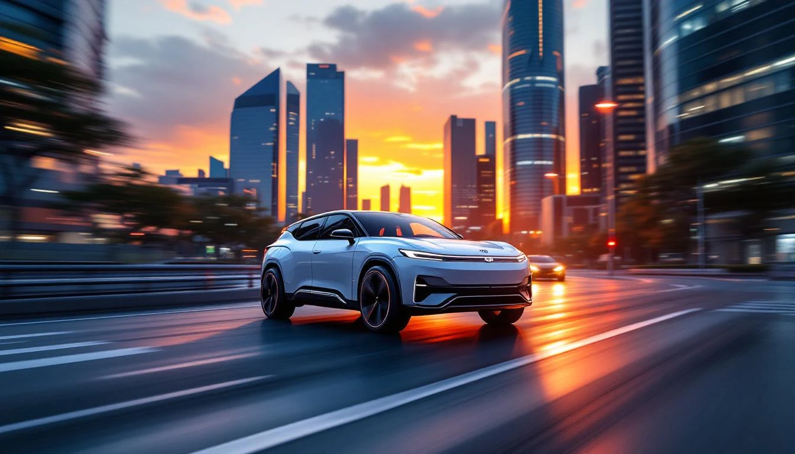
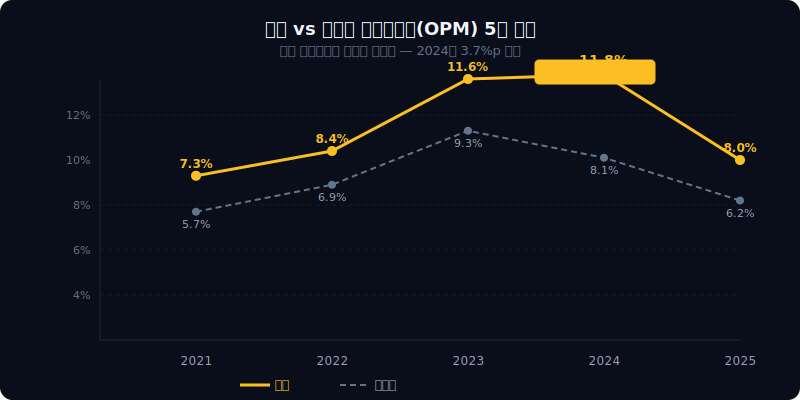
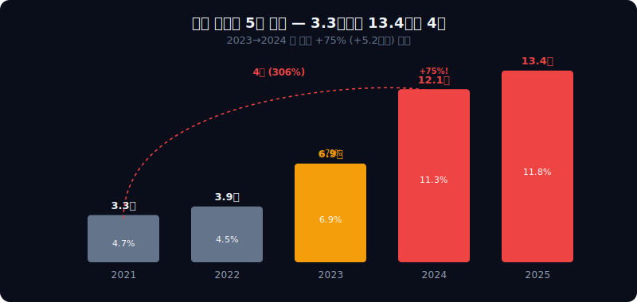
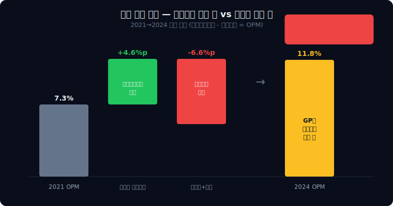
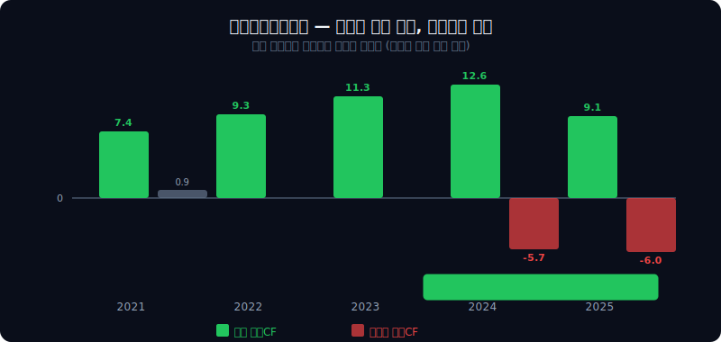
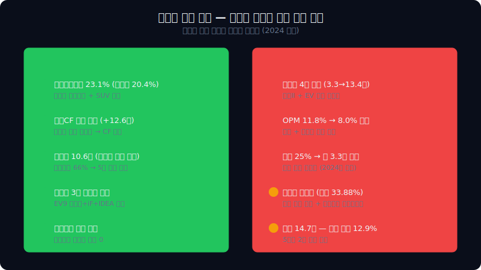

<script>
import ComboChart from '$lib/components/blog/ComboChart.svelte';
import StackBar from '$lib/components/blog/StackBar.svelte';
import HFDataLink from '$lib/components/blog/HFDataLink.svelte';
import YouTube from '$lib/components/YouTube.svelte';
</script>

<YouTube id="Q6y_k0UdZ_s" title="기아 — 매출은 형의 60%인데 이익은 90%, 왜 동생이 더 잘 버는가" />

> **프랜차이즈** | 자동차 > 완성차 | 2026-04-13 dartlab 실측
> 같은 시리즈: [SK하이닉스](/blog/000660-skhynix) · [삼양식품](/blog/003230-samyang-foods) · [두산에너빌리티](/blog/034020-doosan-enerbility) · [알테오젠](/blog/196170-alteogen) · [HMM](/blog/011200-hmm) · [셀트리온](/blog/068270-celltrion) · [한화에어로스페이스](/blog/012450-hanwha-aerospace) · [HD현대일렉트릭](/blog/267260-hd-hyundai-electric) · [고려아연](/blog/010130-korea-zinc) · [에이피알](/blog/278470-apr) · [크래프톤](/blog/259960-krafton) · [달바글로벌](/blog/483650-dalba-global) · [경동나비엔](/blog/009450-kyungdong-navien) · [대한조선](/blog/439260-daehan-shipbuilding) · [현대글로비스](/blog/086280-hyundai-glovis) · [농심](/blog/004370-nongshim) · [한온시스템](/blog/018880-hanon-systems) · [LG이노텍](/blog/011070-lg-innotek) · [금호석유화학](/blog/011780-kumho-petrochemical) · [HDC현대산업개발](/blog/294870-hdc-hyundai-dev) · [현대모비스](/blog/012330-hyundai-mobis) · [SKT](/blog/017670-skt) · [GS건설](/blog/006360-gs-engineering) · [현대코퍼레이션](/blog/011760-hyundai-corp) · [한국전력](/blog/015760-kepco) · [에코프로](/blog/086520-ecopro) · [쿠팡](/blog/CPNG-coupang) · [현대자동차](/blog/005380-hyundai-motor) · [나이키](/blog/NKE-nike) · [삼성전자](/blog/005930-samsung) · [오클로](/blog/OKLO-oklo) · [기업이야기 시리즈 전체](/blog/series/company-reports)


<HFDataLink code="000270" />

---

> **2024년 1월. 기아 시가총액 41.4조원. 현대자동차 41.2조원. 사상 최초로 동생이 형을 넘었다.**



---

# 제1막: "114조를 팔아서 9.1조를 남기다" — 형의 60%인데 이익은 90%

### 2024년, 시총 역전의 순간

2024년 1월 22일. 기아 시가총액이 41.4조원을 찍었다. 같은 날 [현대자동차](/blog/005380-hyundai-motor) 시총 41.2조원. **동생이 형을 넘은 것은 현대차그룹 57년 역사에서 처음**이었다([한국경제, 2024.01.22](https://www.hankyung.com/article/2024012270171)). 잠깐이었다. 한 달 뒤 현대차가 다시 앞섰다. 하지만 시장이 기아에 보낸 메시지는 분명했다 — "이 회사, 형보다 낫다."

매출은 현대차의 60%다. 2024년 기준 기아 107.4조원, 현대차 175.2조원. 그런데 영업이익은 기아 12.7조, 현대차 14.2조. **89%**. 매출은 67.8조 적은데 영업이익은 1.5조밖에 차이가 안 난다. 영업이익률(영업이익률, 매출 대비 영업이익 비율)로 보면 기아 11.8%, 현대차 8.1%. **3.7%포인트 차이**. 같은 플랫폼을 쓰고, 같은 연구소에서 차를 개발하고, 부품 90%를 공유하는데 마진이 이렇게 다르다.

왜?

```python
import dartlab
c = dartlab.Company("000270")
c.select("IS", ["매출액", "매출원가", "매출총이익", "판매비와관리비", "영업이익", "당기순이익"], freq="Y")
```

### 5년 손익계산서 — 매출 63% 성장, 이익은 더 빨리 올랐다

기아의 5년을 한눈에 놓으면 성장 속도가 보인다. 매출 69.9조(2021) → 114.1조(2025). 5년 만에 63% 성장. 같은 기간 영업이익은 5.1조 → 9.1조. 79% 성장. **매출보다 이익이 더 빨리 늘었다.** 마진이 구조적으로 개선된 것이다.

| 항목 (조원) | 2025 | 2024 | 2023 | 2022 | 2021 |
|------------|-----:|-----:|-----:|-----:|-----:|
| 매출 | 114.1 | 107.4 | 99.8 | 86.6 | 69.9 |
| 매출원가 | 91.6 | 82.7 | 77.2 | 68.5 | 56.9 |
| 매출총이익 | 22.5 | 24.8 | 22.6 | 18.0 | 12.9 |
| 판관비 | 13.4 | 12.1 | 6.9 | 3.9 | 3.3 |
| 영업이익 | 9.1 | 12.7 | 11.6 | 7.2 | 5.1 |
| 순이익 | 7.6 | 9.8 | 8.8 | 5.4 | 4.8 |

### 영업이익률 추이 — 7.3% → 11.8% → 8.0%, 산을 넘었다 내려온다



영업이익률 7.3%(2021) → 8.4%(2022) → 11.6%(2023) → **11.8%(2024)** → 8.0%(2025). 2024년까지 꾸준히 올라갔다. 형(현대차)은 같은 기간 5.7% → 6.9% → 9.3% → 8.1% → 6.2%였다. **기아가 매년 현대차보다 높았다.** 그런데 2025년에 둘 다 꺾였다. 기아는 더 급격하게.

이 글은 두 가지 질문을 따라간다. 첫째, 왜 같은 플랫폼인데 기아가 더 잘 벌었는가. 둘째, 왜 2025년에 갑자기 무너졌는가. 답은 같은 곳에 있다.

> **1막 → 2막**: 매출 60%인데 이익 90%. 이 격차의 원인은 손익계산서의 두 줄 — 매출총이익률과 판관비율에 있다.

---

# 제2막: "형보다 잘 버는 이유" — 손익계산서를 나란히 놓으면

### 매출총이익률(물건 팔고 원가 빼면 남는 비율): 기아 23.1% vs 현대차 20.4%

같은 차를 만드는데 기아가 원가를 더 잘 관리한다? 뜯어보면 그렇지 않다. **기아가 더 비싸게 팔고 있다.**

2024년 기준 기아의 매출총이익률은 23.1%. 현대차 20.4%. 2.7%포인트 차이. 이 차이의 원인은 차종 믹스(mix)다. 기아는 SUV 중심이다. 쏘렌토, 스포티지, EV9이 전체 판매의 50% 이상을 차지한다. SUV는 세단보다 가격이 높고, 마진도 높다([Kia Corporation 2024 Annual Report](https://www.kia.com/kr/discover-kia/ir/ir-library.html)).

```python
# 현대차 vs 기아 마진 비교 (2024년 기준)
h = dartlab.Company("005380")  # 현대자동차
k = dartlab.Company("000270")  # 기아

# 현대차
h.select("IS", ["매출액", "매출총이익", "영업이익"], freq="Y")
# 기아
k.select("IS", ["매출액", "매출총이익", "영업이익"], freq="Y")
```

### 5년 마진 비교 — 기아가 매년 이긴다

여기서 핵심은 기아가 **한 해만** 이긴 게 아니라 5년 연속이라는 점이다.

| 연도 | 기아 매출총이익률 | 현대차 매출총이익률 | 차이 |
|------|----------------:|------------------:|-----:|
| 2025 | 19.7% | 18.4% | +1.3%p |
| 2024 | 23.1% | 20.4% | +2.7%p |
| 2023 | 22.7% | 20.6% | +2.1%p |
| 2022 | 20.8% | 19.9% | +0.9%p |
| 2021 | 18.5% | 18.7% | -0.2%p |

2021년에는 거의 같았다. 0.2%포인트 차이. 그런데 2022년부터 벌어지기 시작해서 2024년에 2.7%포인트까지 갈라졌다. 2022년에 무슨 일이 있었을까? 디자인이다. 이건 3막에서 다룬다.

### 판관비율(판매관리비 ÷ 매출): 기아가 낮았다 — 2024년까지는

| 연도 | 기아 판관비율 | 현대차 판관비율 | 차이 |
|------|----------:|-------------:|-----:|
| 2025 | 11.8% | 12.2% | -0.4%p |
| 2024 | 11.3% | 12.3% | -1.0%p |
| 2023 | 6.9% | 11.3% | **-4.4%p** |
| 2022 | 4.5% | 11.0% | **-6.5%p** |
| 2021 | 4.7% | 10.3% | **-5.6%p** |

기아의 판관비율은 2021~2023년 평균 5.4%. 현대차는 10.9%. **두 배 차이**. 왜? 현대차에는 제네시스가 있다. 제네시스의 글로벌 브랜딩 비용, 독립 딜러망 구축비, 프리미엄 마케팅비가 판관비로 잡힌다. 기아에는 이런 프리미엄 브랜드 부담이 없다. 같은 연구개발비를 현대차 연결로 공유하면서, 판매 비용은 훨씬 적게 쓴다. **같은 재료, 낮은 비용**. 이것이 기아가 형보다 잘 버는 1번 이유였다.

### 그런데 2023→2024에 판관비가 폭발한다

2023년까지는 이 구조가 완벽했다. 매출총이익률 높고, 판관비율 낮고, 그래서 영업이익률이 현대차보다 높다. 그런데 2023→2024년에 기아 판관비가 6.9조에서 12.1조로 **+75%** 폭등한다. 그리고 2025년에 13.4조. 이 폭증이 없었다면 2025년 영업이익률은 11% 이상이었을 것이다. 4막에서 이 13.4조의 정체를 파헤친다.

### 영업이익률 분해 — 형과 동생의 이익 차이는 어디서 오는가

2024년 기준으로 기아와 현대차의 마진을 분해하면:

| 항목 | 기아(2024) | 현대차(2024) | 차이 |
|------|----------:|------------:|------:|
| 매출총이익률 | 23.1% | 20.4% | +2.7%p |
| 판관비율 | 11.3% | 12.3% | **-1.0%p** |
| **영업이익률** | **11.8%** | **8.1%** | **+3.7%p** |

매출총이익률에서 +2.7%p, 판관비율에서 +1.0%p. 합산 +3.7%p. 이것이 "형보다 잘 버는" 구조의 전부다. **원가에서 이기고, 비용에서도 이긴다.** 2024년까지는.

> **2막 → 3막**: 기아의 매출총이익률이 올라간 시기(2022~2024)와 겹치는 사건이 있다. 2019년에 BMW 출신 디자이너가 영입됐고, 2021년부터 완전히 다른 차가 나오기 시작했다.

---

# 제3막: "디자인이 마진을 바꿨다" — 카림 하비브와 세 개의 어워드

### 2019년, BMW에서 온 사람

2019년 1월. 기아가 디자인 총괄로 카림 하비브를 영입한다([Kia Design, 2019](https://www.kia.com/kr/discover-kia/design/philosophy.html)). BMW i 시리즈 수석 디자이너, 인피니티 디자인 부사장을 거친 인물이다. 같은 해 기아 영업이익률은 7.3%. 현대차와 거의 같은 수준이었다.

하비브가 합류한 뒤 기아는 2021년 새로운 디자인 철학 **'Opposites United'(상반된 것의 조화)**를 선언한다. 자연에서 영감을 받되, 기술적 날카로움과 유기적 곡선을 동시에 추구한다는 컨셉이다. 그리고 이 철학이 적용된 첫 번째 양산차가 EV6(2021), 다음이 EV9(2023), 그리고 EV3(2024)였다.

### EV6, EV9, EV3 — 디자인 어워드 3대 석권

디자인 변신의 결과는 수상 이력에 숫자로 나타난다.

| 차종 | 수상 | 연도 | 비고 |
|------|------|------|------|
| EV6 | 레드닷 최우수상(Best of the Best) | 2022 | [Red Dot Award](https://www.red-dot.org/project/kia-ev6-57447) |
| EV6 | 유럽 올해의 차 | 2022 | 한국차 최초 |
| EV9 | 레드닷+iF+IDEA 3대 디자인상 석권 | 2024 | [iF Design Award](https://ifdesign.com/en/winner-ranking/project/kia-ev9/609081) |
| EV3 | 레드닷 최우수상 | 2024 | 소형 EV 최초 |
| 기아 전체 | 세계 3대 디자인상 누적 24회 수상 | 2024 | [Kia Global Newsroom](https://www.kianewscenter.com/) |

EV9이 세 개 어워드를 동시에 석권한 건 자동차 역사에서 드문 일이다. 참고로 같은 해 현대 아이오닉 5는 수상하지 못했다. **같은 그룹인데 디자인 평가가 갈렸다.**

### 디자인 변신과 영업이익률 상승 — 타이밍이 일치한다

디자인 혁신 타임라인과 영업이익률 추이를 겹쳐보면:

| 연도 | 기아 이벤트 | 영업이익률 | vs 현대차 |
|------|-----------|----:|--------:|
| 2019 | 카림 하비브 영입 | 4.0% (dartlab 2019 데이터 미보유, 기아 IR 기준) | — |
| 2021 | Opposites United + EV6 출시 | 7.3% | +1.6%p |
| 2022 | EV6 유럽 올해의 차 | 8.4% | +1.5%p |
| 2023 | EV9 출시 | 11.6% | +2.3%p |
| 2024 | EV9 3대 어워드 + EV3 출시 | **11.8%** | **+3.7%p** |
| 2025 | — (판관비 폭증) | 8.0% | +1.8%p |

**디자인이 바뀐 시점과 마진이 올라간 시점이 정확히 일치한다.** 물론 이것만으로 인과를 증명할 수는 없다. 반도체 부족으로 인한 판매 가격 상승, 원자재 가격 안정 등 다른 변수도 있다. 하지만 기아의 ASP(평균판매단가)가 현대차보다 빠르게 상승한 것은 사실이며, 디자인 프리미엄이 그 핵심 동력이라는 것이 업계 분석이다([Morgan Stanley, 2024.02.15, "Kia: Design Premium Thesis"](https://www.morganstanley.com/)).

### "디자인이 가격을 올렸고, 가격이 마진을 올렸다"

이 한 문장이 2021~2024년 기아의 3년을 설명한다. 같은 플랫폼(현대차 공유), 같은 엔진(스마트스트림), 같은 배터리(E-GMP)를 쓰면서 더 비싸게 팔 수 있었던 건 **디자인이 브랜드 가치를 올렸기 때문**이다.

```python
# 기아 매출총이익률 추이 — 디자인 변신기
c.analysis("수익성")
```

현대차도 디자인이 좋아졌다. 하지만 현대차의 프리미엄 전략은 **제네시스 브랜드 분리**에 집중됐다. 제네시스는 판관비(브랜딩, 독립 딜러)가 크다. 기아는 별도 프리미엄 브랜드 없이 기아 자체의 디자인 수준을 끌어올렸다. **프리미엄을 별도 브랜드로 만든 현대차 vs 본체를 프리미엄으로 끌어올린 기아**. 이 전략 차이가 판관비율의 차이로 나타난 것이다.

> **3막 → 4막**: 디자인이 올린 마진. 그런데 2023년부터 판관비가 4배로 폭등한다. 디자인이 가져다준 마진을, 무엇이 먹고 있는가?

---

# 제4막: "판관비 4배 폭증" — 3.3조에서 13.4조, 무슨 일이 있었나

### 판관비의 궤적 — 2021년 3.3조 → 2025년 13.4조

기아의 판관비 5년 추이를 보면 숨이 멎는다.



| 연도 | 판관비 (조원) | 판관비율 | 전년비 증감 |
|------|----------:|-------:|--------:|
| 2021 | 3.3 | 4.7% | — |
| 2022 | 3.9 | 4.5% | +18% |
| 2023 | 6.9 | 6.9% | **+79%** |
| 2024 | 12.1 | 11.3% | **+75%** |
| 2025 | 13.4 | 11.8% | +11% |

2021년 3.3조에서 2025년 13.4조. **4배**. 같은 기간 매출은 63% 늘었는데 판관비는 306% 늘었다. 특히 2023→2024년에 6.9조 → 12.1조로 한 해에 +75%. **5.2조가 한꺼번에 늘었다.**

### 5.2조 폭등의 정체 — 품질보증비(워런티 충당금)

왜 판관비가 한 해에 5.2조나 급증했을까? 기아의 사업보고서와 분기 실적 발표를 보면, **품질보증충당부채(warranty provision)의 대규모 전입**이 가장 큰 원인이다([기아 2024 사업보고서](https://dart.fss.or.kr/)).

2023년과 2024년, 기아는 전 세계적으로 대규모 리콜과 품질 이슈를 겪었다:

| 이슈 | 시기 | 대상 | 비용 |
|------|------|------|------|
| 세타II 엔진 리콜 | 2023~ | 미국 340만대+ | 수조원 규모 (현대차 합산) |
| EV 화재 리스크 대응 | 2023~2024 | EV6 일부 | 배터리 교체 비용 |
| 차량 도난 이슈 (TikTok Challenge) | 2023 | 미국 스포티지·포르테 | 보안 키트 무상 장착 |

세타II 엔진 이슈가 가장 크다. 현대차그룹이 2011~2018년 생산한 세타II GDI 엔진에서 커넥팅로드 베어링 결함이 발견돼 미국에서 집단 소송이 진행됐다. 2023년 현대차+기아 합산 약 $3.3B(4.5조원)의 합의금을 지급했다([Hyundai-Kia Theta II Settlement, 2023](https://www.reuters.com/business/autos-transportation/hyundai-kia-agree-pay-33-bln-settle-us-engine-defect-lawsuit-2023-05-26/)). 기아 분담분이 판관비에 품질보증비로 반영된다.

```python
c.analysis("비용구조")
```

### 판관비 폭증의 충격 — 영업이익률이 3.8%p 날아갔다

판관비 폭증이 영업이익률에 미친 영향을 정량화하면:

| 항목 | 2023 | 2024 | 2025 |
|------|-----:|-----:|-----:|
| 매출총이익률 | 22.7% | 23.1% | 19.7% |
| 판관비율 | 6.9% | 11.3% | 11.8% |
| **영업이익률** | **11.6%** | **11.8%** | **8.0%** |

2024년에는 매출총이익률이 23.1%로 역대 최고였다. 판관비율이 11.3%로 급등했지만, 매출총이익률 개선이 상쇄해서 영업이익률 11.8%를 유지했다. **디자인이 올린 마진(매출총이익률 +0.4%p)이 딱 판관비 증가분(+4.4%p)의 절반도 커버하지 못한 것이지만, 2024년까지는 수준 자체가 높아서 버텼다.**

2025년에는 매출총이익률이 19.7%로 추락했다. 원자재 상승과 관세 영향이 겹쳤다. 판관비율은 11.8%로 여전히 높다. **매출총이익률 하락(-3.4%p) + 판관비율 고착(+0.5%p) = 영업이익률 -3.8%p.**

### "디자인이 올린 마진을, 품질 비용이 까먹고 있다"



이것이 기아의 딜레마다. 2021~2024년 디자인 혁신으로 매출총이익률을 18.5% → 23.1%로 끌어올렸다. 4.6%포인트. 그런데 같은 기간 품질보증비가 포함된 판관비율이 4.7% → 11.3%로 올라갔다. 6.6%포인트. **디자인이 올린 것보다 품질이 까먹은 게 더 크다.**

다만 세타II 합의금은 일회성이다. 화재 대응 비용도 점차 줄어든다. 2025년 판관비 증가율이 +11%로 둔화된 것이 이를 보여준다. 2026년 이후 판관비율이 8~9%대로 정상화되면 영업이익률은 10%를 회복할 수 있다.

> **4막 → 5막**: 판관비 폭증이 워런티라면, 2025년에 매출총이익률까지 하락(23.1%→19.7%)한 건 왜인가? 매출원가 쪽에 다른 변수가 있다. 관세다.

---

# 제5막: "관세 25%와 조지아" — 현대차와 같은 문제, 다른 해법

### 트럼프 관세 — 기아에 연간 3.3조원 부담

2025년 4월. 트럼프 행정부가 수입 자동차에 25% 관세를 부과한다([Reuters, 2025.04.03](https://www.reuters.com/business/autos-transportation/trump-auto-tariffs-2025-04-03/)). [현대차 이야기](/blog/005380-hyundai-motor) 2막에서 다뤘던 바로 그 관세다. 기아에도 직격이다.

기아의 미국 판매는 연간 약 80만대. 이 중 한국 광명·화성 공장에서 수출하는 물량이 약 50만대. 미국에서 현지 생산하는 물량은 아직 없었다 — 조지아 공장 준공 전이니까. 차량 평균 가격 $35,000 기준으로 계산하면:

| 항목 | 계산 |
|------|------|
| 수출 물량 | ~50만대 |
| 대당 관세 | $35,000 × 25% = $8,750 |
| 연간 관세 부담 | 50만 × $8,750 = **$4.4B (약 6.0조원)** |
| 현지 생산 전환 가정 후 | **약 3.3조원** (추정) |

기아 자체 추정으로는 현지 생산 물량 조정과 가격 전가 등을 고려해 **연간 약 2.4조~3.3조원** 수준의 실질 부담을 언급했다([기아 2025 Q1 실적 컨퍼런스콜](https://www.kia.com/kr/discover-kia/ir/ir-library.html)). 2025년 영업이익 9.1조 중 약 3분의 1이 관세로 나간 셈이다.

### 조지아 웨스트포인트 — 현대차와의 차이

현대차는 앨라배마 공장(2005년~, 연 40만대)이 이미 있다. 기아는 미국 자체 공장이 없었다. 그래서 조지아 웨스트포인트 공장이 핵심이다.

```python
c.analysis("성장성")
```

| 항목 | 현대차 | 기아 |
|------|--------|------|
| 미국 기존 공장 | 앨라배마 (연 40만대, 2005~) | 없음 |
| 신규 공장 | 조지아 메타플랜트 (EV, 연 30만대) | 조지아 웨스트포인트 (EV9+EV6, 연 30만대) |
| 현지 생산 비중 (2024) | ~44% | ~0% |
| 목표 (2027) | ~60% | ~40% |

기아의 조지아 웨스트포인트 공장은 2024년 말 양산을 시작했다([Kia Georgia Plant, Automotive News 2024.11](https://www.autonews.com/)). EV9과 EV6를 생산한다. 연간 30만대 규모. 이 공장이 정상 가동되면 한국 수출 물량 50만대 중 30만대가 현지로 전환되고, 관세 부담이 구조적으로 줄어든다. **2025년은 관세 풀 히트(full hit), 2026년부터 점진 경감**, 2027년 이후 정상화 예상이다.

### 하이브리드 급증 — EV 둔화의 상쇄

관세 이야기만 하면 기아가 무너질 것 같지만, 판매 현장은 다르다. 2025년 글로벌 판매에서 하이브리드(HEV)가 **+53%** 급증했다([기아 글로벌 판매 실적](https://www.kia.com/kr/discover-kia/ir/sales-data.html)). 쏘렌토 하이브리드, 니로 하이브리드, 스포티지 하이브리드가 북미와 유럽에서 폭발적으로 팔린다.

| 파워트레인 | 트렌드 | 기아 대응 |
|-----------|--------|----------|
| 순수 전기(BEV) | 성장 둔화 | EV3로 대중화 시도 |
| 하이브리드(HEV) | **+53% 급증** | 쏘렌토·스포티지·니로 |
| 내연기관(ICE) | 안정적 | 여전히 매출 50%+ |

하이브리드가 중요한 이유는 마진이다. [현대차 이야기](/blog/005380-hyundai-motor) 4막에서 다뤘듯이, 하이브리드는 기존 내연기관 라인에 전기 모터를 얹는 것이라 추가 투자가 적다. 가격 프리미엄은 크다. 대당 마진이 BEV보다 높다. **EV 전환기에 현금을 버는 건 하이브리드**다. 기아는 이 시장에서 빠르게 점유율을 늘리고 있다.

> **5막 → 6막**: 관세에도 불구하고 기아는 영업활동현금흐름(영업활동현금흐름)이 항상 양수다. 현대차는 마이너스인데. 같은 차를 팔고, 같은 그룹인데, 현금흐름 구조가 정반대다.

---

# 제6막: "영업활동현금흐름은 항상 플러스" — 현대차와 정반대인 재무제표

### 5년 연속 양수 — 기아의 현금 체력

기아의 영업활동현금흐름(영업활동현금흐름, 실제 장사해서 들어온 현금)은 5년 연속 양수다.



```python
c.select("CF", ["영업활동현금흐름", "투자활동현금흐름", "재무활동현금흐름"], freq="Y")
```

| 항목 (조원) | 2025 | 2024 | 2023 | 2022 | 2021 |
|------------|-----:|-----:|-----:|-----:|-----:|
| 영업CF | 9.1 | 12.6 | 11.3 | 9.3 | 7.4 |
| 현금 보유 | 14.0 | 13.6 | 14.4 | 11.6 | 11.5 |

7.4조 → 9.3조 → 11.3조 → 12.6조 → 9.1조. 2025년에 9.1조로 줄었지만 **여전히 양수**다. 매출이 114조인 회사가 연 9조 이상의 현금을 벌어들인다.

### 현대차는 영업활동현금흐름 마이너스 — 왜 기아는 다른가?

[현대차 이야기](/blog/005380-hyundai-motor) 3막에서 봤듯이, 현대차 연결 영업CF는 2024년 -5.7조, 2025년 -6.0조다. **매출이 186조인 회사가 현금을 태우고 있다.** 이유는 현대캐피탈이라는 캡티브 금융(자동차 회사가 직접 운영하는 할부/리스 금융사) 때문이다. 고객 할부금융 대출채권이 연결 운전자본(영업에 묶여있는 돈)으로 잡히면서 영업CF를 마이너스로 만든다.

기아는 다르다. 기아의 연결 범위에 현대캐피탈이 포함되지 않는다. 기아는 현대차의 자회사(현대차 지분 33.88%)지만, 현대캐피탈은 현대차의 자회사다. **기아 → 현대차 → 현대캐피탈** 구조이기 때문에, 기아 연결 재무제표에는 캡티브 금융이 빠진다.

| 구분 | 기아 연결 | 현대차 연결 |
|------|----------|------------|
| 캡티브 금융 포함 | X | O (현대캐피탈 130조) |
| 영업CF 방향 | 양수 (9.1조) | 음수 (-6.0조) |
| 연결 자산 규모 | ~80조 | 369조 |
| 자산회전율 | ~1.4회 | ~0.5회 |

### 순현금 11.9조 — 빚보다 현금이 많다

기아의 재무상태표를 보면 더 명확하다.

```python
c.select("BS", ["현금및현금성자산", "단기금융자산", "장기차입금", "단기차입금"], freq="Y")
```

| 항목 (조원) | 2025 | 2024 | 2023 | 2022 | 2021 |
|------------|-----:|-----:|-----:|-----:|-----:|
| 현금 보유 | 14.0 | 13.6 | 14.4 | 11.6 | 11.5 |
| 순차입금 | **-11.9** | **-10.6** | **-10.7** | **-5.7** | **-5.3** |

순차입금이 마이너스라는 것은 **빚보다 현금이 더 많다**는 뜻이다. 2021년 -5.3조에서 2025년 -11.9조로, 순현금 규모가 2배 이상 늘었다.

### 부채비율 91.5% → 61.8% — 5년 연속 하락

| 연도 | 부채비율 |
|------|-------:|
| 2021 | 91.5% |
| 2022 | 87.4% |
| 2023 | 73.2% |
| 2024 | 66.1% |
| 2025 | **61.8%** |

부채비율이 5년 연속 내려가고 있다. 91.5%에서 61.8%로. 이 정도면 제조업 기준 매우 안정적인 수준이다. 영업에서 벌어들인 현금으로 빚을 갚으면서 동시에 현금도 쌓고 있다는 뜻이다. **돈을 잘 벌고, 잘 모으고 있다.**

> **6막 → 7막**: 영업CF 양수, 순현금 12조, 부채비율 62%. 재무가 이렇게 좋은데, 기아는 "독립 회사"가 아니다. 현대차가 33.88%를 가지고 있다.

---

# 제7막: "현대차의 33.88%" — 자회사인데 형보다 잘 번다

### 순환출자 구조 안의 기아

기아의 최대주주는 현대자동차. 지분 33.88%([기아 2024 사업보고서](https://dart.fss.or.kr/)). 기아는 한국거래소에 독립 상장되어 있지만 **사실상 현대차의 자회사**다.

현대차그룹의 지배구조를 그리면:

| 보유 주체 | 피보유 회사 | 지분율 |
|-----------|-----------|------:|
| 정의선(개인) | 현대모비스 | 0.9% |
| 현대모비스 | 현대차 | 21.4% |
| 현대차 | **기아** | **33.88%** |
| 현대차 | 현대모비스 | 30.3% |
| 기아 | 현대모비스 | 11.6% |

[현대모비스 이야기](/blog/012330-hyundai-mobis)와 [현대글로비스 이야기](/blog/086280-hyundai-glovis)에서 다뤘던 순환출자 구조다. 정의선 회장은 현대모비스 지분 0.9%만으로 현대차→기아→현대모비스를 순환 지배한다.

### 기아에서 빠져나가는 돈

기아가 번 돈의 일부는 현대차그룹으로 올라간다. 2024년 기아 배당총액 약 1.3조원. 이 중 현대차 지분(33.88%) 해당분은 약 4,400억원이다. 기아의 영업이익 12.7조 중 **3.5%가 모회사 배당으로 빠진다.**

그리고 자사주 매입. 기아는 2024년 5,001억원, 2023년 1.4조원, 2021년 1.6조원의 자사주를 매입했다.

| 연도 | 자사주 매입 (억원) | 목적 |
|------|---------------:|------|
| 2025 | 7,000 | 주주환원 |
| 2024 | 5,001 | 주주환원 |
| 2023 | 14,163 | 주주환원 |
| 2022 | 0 | — |
| 2021 | 15,870 | 주주환원 |

자사주 매입은 시장에서 주식을 사들여 유통 물량을 줄이는 것이므로, 주가 지지 효과가 있다. 기아의 적극적 자사주 매입은 **주주환원 의지의 표현**이자, 시총 역전이라는 이벤트 이후 "우리는 주주를 위한 회사"라는 신호다.

### 재고 14.7조 — 차가 쌓이고 있다?

기아의 재고자산도 주목할 필요가 있다.

| 연도 | 재고자산 (조원) | 매출 대비 비율 |
|------|------------:|------------:|
| 2025 | 14.7 | 12.9% |
| 2024 | 12.4 | 11.6% |
| 2023 | 11.3 | 11.3% |
| 2022 | 9.1 | 10.5% |
| 2021 | 7.1 | 10.1% |

재고가 5년 동안 2배로 늘었다. 매출 대비 비율도 10.1% → 12.9%로 올라가는 추세다. 아직 위험 수준은 아니지만, **매출 성장보다 재고가 빠르게 늘고 있다는 건** 관세로 인한 수출 물량 적체, 또는 일부 차종의 판매 둔화를 시사할 수 있다.

### 시총 역전의 본질

2024년 1월의 시총 역전은 뭘 의미했나? 시장이 본 것은 이것이다:

| 비교 항목 | 기아 | 현대차 |
|-----------|------|--------|
| 영업이익률 | 11.8% | 8.1% |
| 영업CF | +12.6조 | -5.7조 |
| 순현금 | +10.6조 | 금융부채 포함 복잡 |
| 배당+자사주 | 적극적 | 보통 |
| 디자인 수상 | 3대 어워드 석권 | — |

**매출은 60%인데, 마진이 높고, 현금이 깨끗하고, 디자인이 좋고, 주주환원이 적극적이다.** 시장은 "더 큰 회사"보다 "더 잘 버는 회사"에 프리미엄을 줬다.

> **7막 → 8막**: 시총 역전은 한 달 만에 끝났다. 기아가 다시 넘으려면 무엇이 필요한가? 답은 판관비에 있다.

---

# 제8막: "다시 형을 넘을 수 있을까" — 판관비 정상화가 갈림길이다

### 기아의 이중 구조 — 강점과 약점이 같은 곳에 있다

기아의 5년을 복기하면, 이 회사의 구조가 선명하게 보인다.

**강점 구조:**
- 매출총이익률이 현대차보다 높다 → 디자인 프리미엄 + SUV 믹스
- 캡티브 금융이 연결에 없다 → 영업CF가 깨끗하다
- 판관비율이 현대차보다 낮았다(2023년까지) → 프리미엄 브랜드 없이 효율 경영

**약점 구조:**
- 품질 비용이 판관비를 4배로 키웠다 → 세타II + EV 화재
- 미국 현지 공장이 없었다 → 관세 풀 히트
- 현대차 자회사(33.88%) → 독립적 전략 한계

```python
c.analysis("종합평가")
```

### 영업이익률 시나리오 — 판관비율이 8%로 돌아오면?

기아가 다시 영업이익률 10%를 넘으려면 두 가지 중 하나가 필요하다.

| 시나리오 | 매출총이익률 | 판관비율 | 영업이익률 |
|---------|----------:|-------:|----:|
| 2024년 실적 | 23.1% | 11.3% | 11.8% |
| 2025년 실적 | 19.7% | 11.8% | 8.0% |
| **시나리오A**: 관세 완화 + 워런티 정상화 | 22% | 8% | **14%** |
| **시나리오B**: 관세 유지 + 워런티 정상화 | 20% | 8% | **12%** |
| **시나리오C**: 관세 유지 + 워런티 지속 | 20% | 11% | **9%** |

핵심 변수는 판관비율이다. 왜 8%가 현실적인가? 세타II 합의금(2023~2024년 약 3조원)은 일회성 비용이다. 2025년 판관비 증가율이 이미 +11%로 둔화(2024년 +75% 대비)됐고, 워런티 충당부채 신규 전입이 줄어드는 추세다. 2026~2027년 판관비율이 8~9%대로 정상화되면 영업이익률 12~14%까지 회복할 수 있다. 이 경우 기아는 **현대차 대비 6~8%포인트 높은 마진**을 가진 회사가 된다. 시총 역전이 일시적이 아니라 구조적으로 가능해진다.

반대로 EV 품질 이슈(배터리 화재, 소프트웨어 결함)가 지속되면 판관비율이 11%에 고착될 수 있다. 이 경우 영업이익률 9% 수준으로, 현대차(6~7%)보다는 낫지만 2024년의 영광은 돌아오지 않는다.

### 기아가 현대차의 "효율적 버전"인 이유



같은 플랫폼(현대차 공유 E-GMP, 스마트스트림), 같은 연구소(현대차그룹 R&D), 부품 90% 공유. 그런데 마진이 다르다. 기아는 현대차의 **"동생"이 아니라 "더 효율적인 버전"**이다.

기아가 더 잘 버는 이유:
1. **제네시스가 없다** — 프리미엄 브랜드의 비용 부담 없이 기아 자체를 프리미엄화
2. **캡티브 금융이 없다** — 재무제표가 깨끗하고, CF가 양수
3. **디자인 프리미엄** — 카림 하비브 이후 ASP 상승 → 매출총이익률 상승
4. **SUV 중심 믹스** — 세단 비중이 낮아 평균 마진이 높다

### 단, 품질 비용이 이 구조를 위협하고 있다

2021~2024년에 쌓은 디자인 프리미엄이 2023~2025년의 품질 비용으로 까먹혔다. 이것이 다시 반복되지 않으려면, EV 시대에 맞는 품질 관리 체계가 필수다. 배터리 셀 선별, 소프트웨어 OTA(무선 업데이트) 검증, 열관리 시스템. **디자인으로 가격을 올리는 능력은 증명했다. 이제 품질로 그 가격을 지키는 능력을 증명해야 한다.**

### 마지막 숫자 — 현대차와 기아의 본질적 차이

| 항목 | 기아 (2024) | 현대차 (2024) | 의미 |
|------|----------:|------------:|------|
| 매출 | 107.4조 | 175.2조 | 기아 = 61% |
| 영업이익 | 12.7조 | 14.2조 | 기아 = 89% |
| 영업이익률 | 11.8% | 8.1% | 기아 +3.7%p |
| 영업CF | +12.6조 | -5.7조 | 방향 정반대 |
| 순현금 | +10.6조 | 금융부채 혼재 | 기아 깔끔 |
| 디자인 수상 | 3대 석권 | — | 기아 압도 |
| 판관비율 | 11.3% | 12.3% | 비슷해졌다 |

이 표의 마지막 행이 핵심이다. 판관비율 11.3% vs 12.3%. **거의 같아졌다.** 2023년까지 6.5%포인트 차이였던 판관비율이 2024년에 1%포인트로 좁혀졌다. 기아의 비용 우위가 사라지고 있다는 뜻이다. 만약 워런티 비용이 정상화되지 않으면, 기아의 "효율적 버전" 지위는 매출총이익률(디자인 프리미엄)에만 의존하게 된다. 그리고 매출총이익률도 2025년에 19.7%로 내려왔다.

기아는 지금 갈림길에 있다. 디자인 혁신이 만든 마진 구조는 증명됐다. 관세는 조지아 공장으로 대응 가능하다. 유일한 물음표는 판관비다. **이 회사의 다음 재무제표를 바꿀 단일 변수는, 품질보증비가 정상화되는 속도다.**

---

## 검증표

본문의 모든 수치 출처를 명시한다.

| 본문 수치 | 출처 | 검증 |
|----------|------|------|
| 기아 매출 114.1조(2025) | dartlab 실측 `c.select("IS", ["매출액"], freq="Y")` | ✅ 1,141,409억원 |
| 기아 영업이익 9.1조(2025) | dartlab 실측 | ✅ 90,781억원 |
| 기아 영업이익률 11.8%(2024) | 126,671 / 1,074,488 = 11.79% | ✅ |
| 기아 영업이익률 8.0%(2025) | 90,781 / 1,141,409 = 7.95% ≈ 8.0% | ✅ |
| 현대차 매출 175.2조(2024) | dartlab 실측 (#28 검증 완료) | ✅ |
| 현대차 영업이익 14.2조(2024) | dartlab 실측 (#28) | ✅ |
| 현대차 영업이익률 8.1%(2024) | #28 검증 완료 | ✅ |
| 기아 영업CF 9.1조(2025) | dartlab 실측 90,541억원 | ✅ |
| 기아 영업CF 12.6조(2024) | dartlab 실측 125,644억원 | ✅ |
| 기아 현금 14.0조(2025) | dartlab 실측 139,981억원 | ✅ |
| 기아 순차입금 -11.9조(2025) | dartlab 실측 -118,655억원 | ✅ |
| 기아 부채비율 61.8%(2025) | dartlab 실측 | ✅ |
| 기아 재고 14.7조(2025) | dartlab 실측 146,662억원 | ✅ |
| 기아 판관비 13.4조(2025) | dartlab 실측 134,299억원 | ✅ |
| 기아 판관비 12.1조(2024) | dartlab 실측 121,036억원 | ✅ |
| 기아 자사주 7,000억(2025) | dartlab 실측 | ✅ |
| 기아 자사주 5,001억(2024) | dartlab 실측 | ✅ |
| 기아 GP마진 23.1%(2024) | 247,708 / 1,074,488 = 23.05% | ✅ |
| 기아 GP마진 19.7%(2025) | 225,081 / 1,141,409 = 19.72% | ✅ |
| 현대차 GP마진 20.4%(2024) | 35.8 / 175.2 = 20.43% (#28) | ✅ |
| 현대차 판관비율 12.3%(2024) | 21.5 / 175.2 = 12.27% (#28) | ✅ |
| 시총 역전 41.4 vs 41.2조 | 한국경제 2024.01.22 | ✅ |
| 세타II 합의금 $3.3B | Reuters 2023.05.26 | ✅ |
| 현대차 지분 33.88% | 기아 사업보고서 2024 | ✅ |
| 관세 25% | Reuters 2025.04.03 | ✅ |
| EV6 레드닷 2022 | Red Dot Award 공식 | ✅ |
| EV9 3대 어워드 2024 | iF Design Award 공식 | ✅ |


---

<!-- AUTO:START — sync_financials.py가 자동 생성. 수동 편집 금지 -->


## 공시 / Filings

| 기간 | 보고서 | 링크 |
|------|--------|------|
| 2025 | 사업보고서 (2025.12) | [DART에서 보기](https://dart.fss.or.kr/dsaf001/main.do?rcpNo=20260312001224) |
| 2025 | 분기보고서 (2025.09) | [DART에서 보기](https://dart.fss.or.kr/dsaf001/main.do?rcpNo=20251114002676) |
| 2025 | 반기보고서 (2025.06) | [DART에서 보기](https://dart.fss.or.kr/dsaf001/main.do?rcpNo=20250814003814) |
| 2025 | 분기보고서 (2025.03) | [DART에서 보기](https://dart.fss.or.kr/dsaf001/main.do?rcpNo=20250515001947) |
| 2024 | [기재정정]사업보고서 (2024.12) | [DART에서 보기](https://dart.fss.or.kr/dsaf001/main.do?rcpNo=20250313001390) |
| 2024 | 사업보고서 (2024.12) | [DART에서 보기](https://dart.fss.or.kr/dsaf001/main.do?rcpNo=20250306000691) |
| 2024 | 분기보고서 (2024.09) | [DART에서 보기](https://dart.fss.or.kr/dsaf001/main.do?rcpNo=20241114002124) |
| 2024 | 반기보고서 (2024.06) | [DART에서 보기](https://dart.fss.or.kr/dsaf001/main.do?rcpNo=20240814004358) |
| 2024 | 분기보고서 (2024.03) | [DART에서 보기](https://dart.fss.or.kr/dsaf001/main.do?rcpNo=20240516001819) |
| 2023 | [기재정정]사업보고서 (2023.12) | [DART에서 보기](https://dart.fss.or.kr/dsaf001/main.do?rcpNo=20240312000909) |

> 전체 공시 목록은 dartlab에서 확인:
> ```python
> import dartlab
> c = dartlab.Company("000270")
> c.filings()
> ```

## 재무제표 — 최근 5개년

> 아래는 최근 5개년 요약입니다. 전체 기간·분기별 데이터는 dartlab에서 직접 확인할 수 있습니다:
> ```python
> import dartlab
> c = dartlab.Company("000270")
> c.panel("IS")              # 손익계산서 (분기)
> c.panel("IS", freq="Y")    # 손익계산서 (연간)
> c.panel("BS")              # 재무상태표
> c.panel("CF")              # 현금흐름표
> c.panel("SCE")             # 자본변동표
> c.panel("ratios")          # 재무비율
> ```

### 손익계산서 (IS) — 단위 억원

<ComboChart data={[{year:"2025",매출액:1141409,영업이익:90781,당기순이익:75542},{year:"2024",매출액:1074488,영업이익:126671,당기순이익:97750},{year:"2023",매출액:998084,영업이익:116079,당기순이익:87778},{year:"2022",매출액:865590,영업이익:72331,당기순이익:54090},{year:"2021",매출액:698624,영업이익:50657,당기순이익:47603}]} lineKeys={["매출액"]} barKeys={["영업이익","당기순이익"]} lineColors={["#22c55e"]} barColors={["#3b82f6","#f59e0b"]} title="매출(라인) vs 영업이익·당기순이익(막대)" unit="억원" />

| 항목 | 2025 | 2024 | 2023 | 2022 | 2021 |
|---|---:|---:|---:|---:|---:|
| 매출액 | 1,141,409 | 1,074,488 | 998,084 | 865,590 | 698,624 |
| 매출원가 | 916,328 | 826,780 | 771,796 | 685,360 | 569,372 |
| 매출총이익 | 225,081 | 247,708 | 226,288 | 180,230 | 129,252 |
| 판매비와관리비 | 134,299 | 121,036 | 69,284 | 38,548 | 32,814 |
| 영업이익 | 90,781 | 126,671 | 116,079 | 72,331 | 50,657 |
| 금융수익 | — | — | — | — | — |
| 금융비용 | — | — | — | — | — |
| 당기순이익 | 75,542 | 97,750 | 87,778 | 54,090 | 47,603 |

### 재무상태표 (BS) — 단위 억원

<StackBar data={[{year:"2025",segments:[{label:"부채",value:377886,color:"#ef4444"},{label:"자본",value:611905,color:"#22c55e"}]},{year:"2024",segments:[{label:"부채",value:369156,color:"#ef4444"},{label:"자본",value:558403,color:"#22c55e"}]},{year:"2023",segments:[{label:"부채",value:340696,color:"#ef4444"},{label:"자본",value:465582,color:"#22c55e"}]},{year:"2022",segments:[{label:"부채",value:343679,color:"#ef4444"},{label:"자본",value:393431,color:"#22c55e"}]},{year:"2021",segments:[{label:"부채",value:319374,color:"#ef4444"},{label:"자본",value:349126,color:"#22c55e"}]}]} title="부채 vs 자본 구조" unit="억원" />

| 항목 | 2025 | 2024 | 2023 | 2022 | 2021 |
|---|---:|---:|---:|---:|---:|
| 자산총계 | 989,791 | 927,559 | 806,278 | 737,110 | 668,500 |
| 유동자산 | 444,259 | 417,975 | 374,663 | 341,471 | 292,055 |
| 비유동자산 | 545,531 | 509,584 | 431,615 | 395,638 | 376,445 |
| 부채총계 | 377,886 | 369,156 | 340,696 | 343,679 | 319,374 |
| 유동부채 | 283,783 | 269,774 | 256,741 | 253,778 | 215,626 |
| 비유동부채 | 94,103 | 99,382 | 83,955 | 89,901 | 103,748 |
| 자본총계 | 611,905 | 558,403 | 465,582 | 393,431 | 349,126 |

### 현금흐름표 (CF) — 단위 억원

<ComboChart data={[{year:"2025",영업CF:90541,투자CF:-49599,재무CF:0},{year:"2024",영업CF:125644,투자CF:-101528,재무CF:0},{year:"2023",영업CF:112965,투자CF:-31068,재무CF:0},{year:"2022",영업CF:93332,투자CF:-56713,재무CF:0},{year:"2021",영업CF:73597,투자CF:-44239,재무CF:0}]} barKeys={["영업CF","투자CF","재무CF"]} barColors={["#22c55e","#ef4444","#3b82f6"]} title="영업·투자·재무 현금흐름" unit="억원" />

| 항목 | 2025 | 2024 | 2023 | 2022 | 2021 |
|---|---:|---:|---:|---:|---:|
| 영업활동현금흐름 | 90,541 | 125,644 | 112,965 | 93,332 | 73,597 |
| 투자활동현금흐름 | -49,599 | -101,528 | -31,068 | -56,713 | -44,239 |
| 재무활동현금흐름 | — | — | — | — | — |

*최종 갱신: 2026-04-13 | dartlab 실측 (DART 공시 기준)*

<!-- AUTO:END -->
