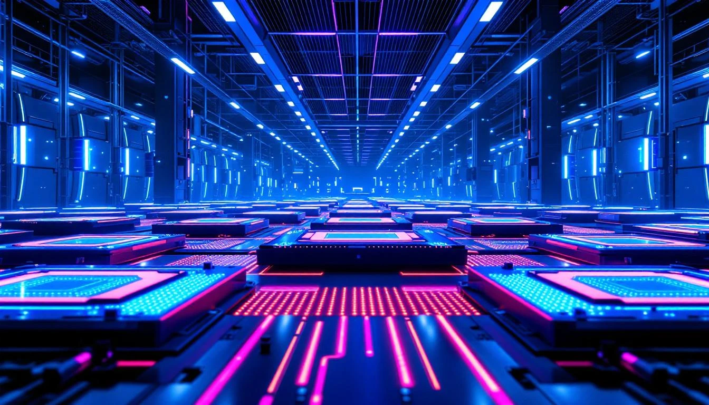
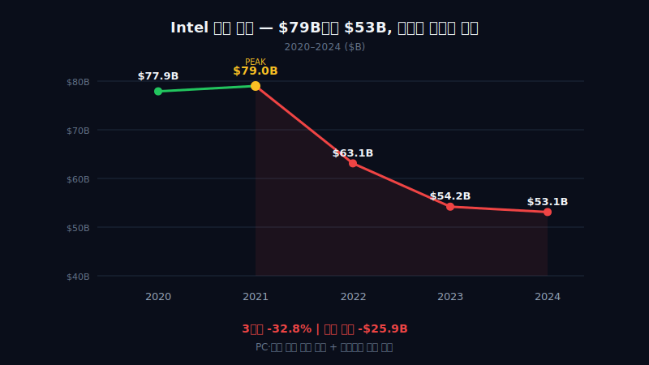
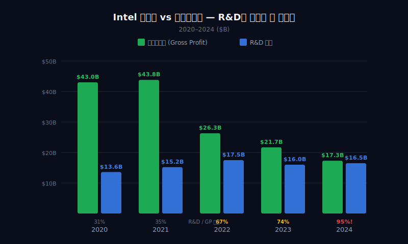
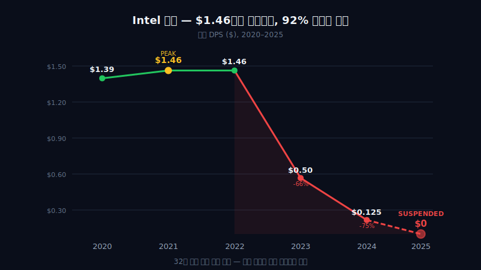
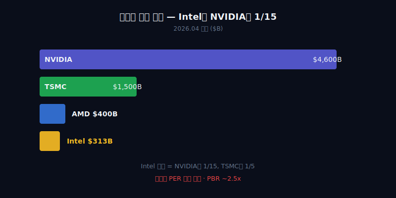

<script>
import ComboChart from '$lib/components/blog/ComboChart.svelte';
import StackBar from '$lib/components/blog/StackBar.svelte';
import HFDataLink from '$lib/components/blog/HFDataLink.svelte';
</script>


> **턴어라운드** | 반도체 > IDM(설계+제조 일체형) · 파운드리(위탁생산) | 2026-04-13 dartlab 실측
> 같은 시리즈: [SK하이닉스](/blog/000660-skhynix) · [삼양식품](/blog/003230-samyang-foods) · [두산에너빌리티](/blog/034020-doosan-enerbility) · [알테오젠](/blog/196170-alteogen) · [HMM](/blog/011200-hmm) · [셀트리온](/blog/068270-celltrion) · [한화에어로스페이스](/blog/012450-hanwha-aerospace) · [HD현대일렉트릭](/blog/267260-hd-hyundai-electric) · [고려아연](/blog/010130-korea-zinc) · [에이피알](/blog/278470-apr) · [크래프톤](/blog/259960-krafton) · [달바글로벌](/blog/483650-dalba-global) · [경동나비엔](/blog/009450-kyungdong-navien) · [대한조선](/blog/439260-daehan-shipbuilding) · [현대글로비스](/blog/086280-hyundai-glovis) · [농심](/blog/004370-nongshim) · [한온시스템](/blog/018880-hanon-systems) · [LG이노텍](/blog/011070-lg-innotek) · [금호석유화학](/blog/011780-kumho-petrochemical) · [HDC현대산업개발](/blog/294870-hdc-hyundai-dev) · [현대모비스](/blog/012330-hyundai-mobis) · [SKT](/blog/017670-skt) · [GS건설](/blog/006360-gs-engineering) · [현대코퍼레이션](/blog/011760-hyundai-corp) · [한국전력](/blog/015760-kepco) · [에코프로](/blog/086520-ecopro) · [쿠팡](/blog/CPNG-coupang) · [현대자동차](/blog/005380-hyundai-motor) · [나이키](/blog/NKE-nike) · [삼성전자](/blog/005930-samsung) · [오클로](/blog/OKLO-oklo) · [기아](/blog/000270-kia) · [기업이야기 시리즈 전체](/blog/series/company-reports)


<HFDataLink code="INTC" kind="edgar" />

---

> **1968년. 고든 무어와 로버트 노이스가 차고에서 회사를 만들었다. 집적회로(IC)를 발명한 사람들이었다. 그 회사가 반도체 산업을 만들었고, "무어의 법칙"으로 50년간 업계를 지배했다. 2024년. 그 회사의 순손실이 $18.8B(약 25조원). 역사상 최대 적자. 같은 해 배당을 중단했다. 36년 연속 배당의 역사가 끊겼다. 그런데 2025년, 주가가 213% 올랐다.**



---

# 제1막: "매출 $79B에서 $53B" — 반도체 왕좌에서 떨어지다



### 반도체를 발명한 회사

Intel. 1968년 설립. 세계 최초의 상용 마이크로프로세서(4004)를 만든 회사다. 1990년대부터 2010년대까지 PC와 서버 CPU(중앙처리장치) 시장 점유율 80% 이상을 유지했다. "Intel Inside" 스티커가 붙지 않은 컴퓨터를 찾기가 더 어려웠다.

그런데 2024년, 매출이 $53.1B이다. 2021년 $79.0B에서 33% 급락했다. 12년 전(2012년) 수준으로 돌아갔다. 같은 기간 NVIDIA는 매출이 $16.7B(2021)에서 $130.5B(2025)로 7.8배 뛰었다([NVIDIA 10-K, 2025](https://www.sec.gov/cgi-bin/browse-edgar?action=getcompany&CIK=1045810)).

```python
import dartlab
c = dartlab.Company("INTC")
c.show("IS")
```

### 5년 손익계산서 — 전환점은 2022년

| 항목 ($M) | 2024 | 2023 | 2022 | 2021 | 2020 |
|-----------|-----:|-----:|-----:|-----:|-----:|
| 매출 | 53,101 | 54,228 | 63,054 | 79,024 | 77,867 |
| 매출원가 | 35,756 | 32,517 | 36,188 | 35,209 | 34,255 |
| 매출총이익 | 17,345 | 21,711 | 26,866 | 43,815 | 43,612 |
| 영업이익 | -11,678 | 93 | 2,334 | 19,456 | 23,678 |
| 순이익 | -18,756 | 1,689 | 8,014 | 19,868 | 20,899 |

매출총이익률(매출에서 원가를 뺀 비율)을 보자. 2020년 56.0%, 2021년 55.4%, 2022년 42.6%, 2023년 40.0%, 2024년 32.7%. 5년 만에 23.3%포인트 추락했다. 원가를 빼면 100달러 중 32달러밖에 안 남는다는 뜻이다.

### 왜 떨어졌나 — 세 가지 구조 변화

첫째, **PC 시장 축소**. 코로나 특수(2020~2021)가 끝나면서 전세계 PC 출하량이 2021년 3.49억대에서 2023년 2.59억대로 26% 줄었다([Gartner, 2024.01](https://www.gartner.com/en/newsroom/press-releases/2024-01-11-gartner-says-worldwide-pc-shipments-declined-14-percent-in-2023)).

둘째, **데이터센터 CPU 시장 잠식**. AMD의 EPYC 프로세서가 서버 시장 점유율을 2019년 5%에서 2024년 33%로 끌어올렸다([Mercury Research, 2024.Q3](https://www.mercuryresearch.com)).

셋째, **AI 가속기로 무게중심 이동**. 데이터센터 투자가 CPU에서 GPU로 옮겨갔다. NVIDIA의 데이터센터 매출은 $47.5B(FY2024) → $115.2B(FY2025)로 1년 만에 142% 폭증했다([NVIDIA 10-K, 2025](https://www.sec.gov/cgi-bin/browse-edgar?action=getcompany&CIK=1045810)). Intel의 데이터센터 매출은 같은 기간 오히려 줄었다.

### 매출 추이 — 12년 전으로 회귀

| 연도 | 매출 ($B) | YoY 변화율 |
|------|--------:|----------:|
| 2020 | 77.9 | +8.2% |
| 2021 | 79.0 | +1.5% |
| 2022 | 63.1 | -20.2% |
| 2023 | 54.2 | -14.0% |
| 2024 | 53.1 | -2.1% |

3년 연속 역성장. 매출이 $79B에서 $53B로 줄어든 것은 매출 $26B, 한화 약 35조원이 사라졌다는 뜻이다. [한국전력](/blog/015760-kepco) 연매출($65.7조)의 절반이 넘는 금액이다.

그런데 이것은 시작에 불과했다. 매출이 줄면 이익이 줄고, 이익이 줄면 현금이 줄고, 현금이 줄면 투자를 못 한다. Intel의 문제는 매출 감소가 아니라, **투자를 멈출 수 없는 회사에서 현금이 마르고 있다**는 것이다.

---

# 제2막: "순손실 $18.8B" — 인텔 역사상 최대 적자

### 영업손실 $11.7B — 그런데 그게 끝이 아니다

2024년 영업손실 $11.7B. 이것만으로도 Intel 56년 역사상 최대 영업적자다. 2023년에는 간신히 흑자였다(영업이익 $93M, 거의 0에 가깝다). 그런데 2024년 손익계산서를 더 파보면, 영업손실 밑에 숨어있는 비용들이 있다.

| 항목 ($M) | 2024 | 2023 | 2022 |
|-----------|-----:|-----:|-----:|
| 구조조정 비용 | 3,491 | -424 | 1,074 |
| 자산손상(감액) | 3,631 | 45 | 151 |
| 영업권손상 | 2,984 | — | — |
| **비경상 합계** | **10,106** | -379 | 1,225 |

구조조정 $3.5B + 자산손상 $3.6B + 영업권손상(인수 때 장부에 올린 프리미엄을 날린 것) $3.0B. 비경상 비용만 $10.1B이다. 한화로 약 13.5조원. [SK하이닉스](/blog/000660-skhynix)가 2023년 적자 7.7조원을 기록했을 때, 그것은 메모리 반도체 가격 사이클 때문이었다. 가격이 반등하면 이익이 돌아온다. Intel의 $10.1B은 성격이 다르다. **더 이상 가치가 없는 자산을 장부에서 지우는 것**이다. 돌아오지 않는 돈이다.

### 빅배스 — 새 CEO가 올 것을 알고 있었다

2024년 12월 1일. Intel CEO 팻 겔싱어(Pat Gelsinger)가 퇴임했다. 공식 발표는 "은퇴"였지만, [Reuters(2024.12.02)](https://www.reuters.com/technology/intel-ceo-pat-gelsinger-retires-2024-12-02/)에 따르면 이사회가 "물러나든가, 해임하겠다"는 최후통첩을 했다. 겔싱어는 2021년 취임 이후 "IDM 2.0"(설계와 제조를 모두 하겠다는 전략)을 밀어붙였지만, 3년간 실적이 악화됐다.

$10.1B의 비경상 비용은 우연이 아니다. 회계에서 이것을 **빅배스(Big Bath)**라고 부른다. CEO 교체가 예정된 시점에 부실을 한 번에 털어서, 새 CEO가 "깨끗한 장부"에서 시작할 수 있게 하는 것이다. 2024년의 $18.8B 순손실 중 $10.1B은 "과거의 실패를 정리하는 비용"이다.

### 법인세 $8.0B — 적자인데 왜 세금이 플러스인가

```python
c = dartlab.Company("INTC")
c.select("IS", ["income_tax_expense"])
```

| 항목 ($M) | 2024 | 2023 | 2022 | 2021 | 2020 |
|-----------|-----:|-----:|-----:|-----:|-----:|
| 법인세 | 8,012 | -913 | -1,009 | 1,837 | 4,179 |

보통 적자가 나면 법인세가 마이너스(환급)다. 2023년과 2022년이 그랬다. 그런데 2024년은 순손실 $18.8B인데 법인세가 +$8.0B다. 세금을 돌려받는 게 아니라 오히려 냈다는 뜻이다. 왜?

이연법인세자산(DTA, 미래에 세금을 덜 낼 수 있는 권리)의 평가감소 때문이다. Intel은 미래에 충분한 이익을 낼 수 있다는 가정 아래 DTA를 자산으로 인식하고 있었다. 그런데 적자가 계속되자 "미래에도 이익을 못 낼 수 있다"고 판단해서 DTA를 감액했다([Intel 10-K, 2024, Note 15](https://www.sec.gov/cgi-bin/browse-edgar?action=getcompany&CIK=50863)). **"미래 이익에 대한 희망"을 장부에서 지운 것**이다. 이것도 빅배스의 일부다.

### SK하이닉스 2023년과의 비교 — 사이클 vs 구조

| 비교 | SK하이닉스 2023 | Intel 2024 |
|------|----------------:|----------:|
| 순손실 | $9.1B (12.2조원) | $18.8B (25조원) |
| 원인 | 메모리 가격 사이클 | 사업 모델 붕괴 |
| 비경상 비용 | 낮음 | $10.1B |
| 다음 해 | 흑자 전환 (HBM) | ? |

[SK하이닉스](/blog/000660-skhynix)의 적자는 반도체 가격 사이클의 바닥이었다. 2024년에 HBM(고대역폭메모리) 특수로 사상 최대 실적을 냈다. Intel의 적자는 사이클이 아니다. PC CPU 시장 축소, 데이터센터 GPU 전환, 파운드리(반도체 위탁생산) 전환 비용이 동시에 겹친 구조적 위기다.

2024년의 적자 $18.8B이 빅배스라면, 2025년부터 숫자가 나아져야 한다. 그런데 그러려면 돈이 있어야 한다. Intel에 돈이 있을까?

---

# 제3막: "연구비가 이익을 다 먹는다" — R&D $16.5B의 무게



### 매출총이익 $17.3B vs R&D $16.5B

2024년 매출총이익(매출에서 원가를 뺀 금액) $17.3B. 같은 해 연구개발비(R&D) $16.5B. **매출총이익의 95%를 R&D에 쏟아붓고 있다.** 물건 팔아서 남은 돈이 거의 전부 연구비로 나간다는 뜻이다. 판매관리비, 감가상각(과거에 산 설비 값을 매년 장부에서 깎는 비용), 기타 비용은 어디서 충당하는가? 답: 충당 못 한다. 그래서 영업적자다.

```python
c = dartlab.Company("INTC")
c.select("IS", ["research_and_development"])
```

### R&D 5년 추이 — 매출이 줄어도 연구비는 줄이지 않았다

| 항목 ($M) | 2024 | 2023 | 2022 | 2021 | 2020 |
|-----------|-----:|-----:|-----:|-----:|-----:|
| R&D | 16,546 | 16,046 | 17,528 | 15,190 | 13,556 |
| 매출 대비 R&D 비율 | 31.2% | 29.6% | 27.8% | 19.2% | 17.4% |
| 매출총이익 대비 R&D 비율 | 95.4% | 73.9% | 65.2% | 34.7% | 31.1% |

매출이 $79B에서 $53B로 줄었는데, R&D는 $15.2B에서 $16.5B로 오히려 9% 늘었다. R&D/매출 비율이 17%에서 31%로 거의 2배가 됐다. 더 극적인 것은 매출총이익 대비 비율이다. 2020년에는 매출총이익의 31%가 R&D로 갔지만, 2024년에는 **95%**다. 남는 돈의 거의 전부를 연구에 쓰고 있다.

### 경쟁사 비교 — 왜 Intel만 이렇게 많이 쓰는가

| 회사 | R&D ($B) | R&D/매출 | 비즈니스 모델 |
|------|--------:|--------:|------------|
| Intel | 16.5 | 31% | IDM (설계+제조) |
| NVIDIA | ~12.9 | ~10% | 팹리스 (설계 전문, 제조는 TSMC에 위탁) |
| AMD | ~5.9 | ~22% | 팹리스 |
| TSMC | ~6.3 | ~8% | 파운드리 (제조 전문) |

*(NVIDIA: FY2025 10-K 기준, AMD/TSMC: 2024 연간보고서 기준)*

TSMC는 남이 설계한 칩을 만든다. R&D가 매출의 8%면 충분하다. NVIDIA는 칩을 설계하지만 만들지 않는다. 제조 비용이 원가에 녹아들 뿐, 공정 연구를 할 필요가 없다. **Intel은 설계도 하고 제조도 한다.** x86 CPU 아키텍처 연구 + 반도체 공정 연구를 동시에 해야 한다. 그래서 R&D가 2배다.

### IDM 모델의 딜레마 — 줄일 수도 없다

R&D를 줄이면? 공정 기술에서 뒤처진다. Intel이 이미 TSMC에 공정 리더십을 빼앗긴 이유 중 하나가 2015~2018년 사이 10nm(나노미터) 공정 개발 지연이었다([AnandTech, 2020.08](https://www.anandtech.com/show/15975/intel-10th-gen-tiger-lake)). TSMC가 7nm → 5nm → 3nm를 순차적으로 양산하는 동안, Intel은 10nm에서 4년을 허비했다. 그 결과 Apple이 2020년 자체 칩(M1)으로 전환하면서 Intel을 버렸다.

지금 Intel은 그 실패를 만회하기 위해 **18A(1.8nm)** 공정을 개발하고 있다. EUV(극자외선 노광, 원자 수준으로 미세한 회로를 그리는 기술) 장비 도입, 새로운 트랜지스터 구조(RibbonFET, PowerVia) 개발에 R&D 비용이 집중되고 있다. 줄이면 파운드리 사업 자체가 끝난다.

$16.5B은 "포기하지 않겠다"는 비용이다.

---

# 제4막: "파운드리 적자 $10B" — TSMC와 삼성의 그림자

### IFS(Intel Foundry Services) — 돈을 태우는 사업부

2021년 겔싱어 CEO가 발표한 "IDM 2.0" 전략의 핵심은 IFS(Intel Foundry Services), 즉 파운드리(반도체 위탁생산) 사업이다. 삼성전자와 TSMC처럼 외부 기업의 칩을 대신 만들어주겠다는 것이다. 문제는 이 사업이 돈을 벌기는커녕 적자의 심연에 빠져 있다는 것이다.

Intel은 2024년부터 IFS를 별도 부문으로 재무 공시하기 시작했다. 2025 회계연도(Intel 기준 2024.12 결산) 실적이 처음으로 완전히 드러났다.

| IFS 실적 ($B) | 2025 | 2024 |
|--------------|-----:|-----:|
| 매출 | 17.8 | 18.9 |
| 영업손실 | -10.3 | -7.0 |
| 영업이익률 | -57.9% | -37.0% |

*(출처: [Intel Q4 2025 Earnings Release](https://www.intc.com/financial-info/quarterly-results), IFS segment)*

매출 $17.8B에 적자 $10.3B. 매출의 58%가 적자다. $1을 벌기 위해 $1.58을 쓴다는 뜻이다.

### TSMC와의 격차 — 같은 사업, 다른 차원

| 비교 | Intel IFS | TSMC | 삼성 파운드리 |
|------|----------:|-----:|------------:|
| 매출 ($B) | 17.8 | ~89 | ~12 (추정) |
| 영업이익률 | -58% | ~42% | 적자 (추정) |
| 점유율 (2025) | ~3% | ~62% | ~4% |
| 첨단공정 | 18A 램프업 | N2 양산 중 | 2nm 개발 중 |

*(TSMC: 2025 Q1 가이던스 기준 연환산, 파운드리 점유율: [TrendForce, 2025.Q1](https://www.trendforce.com/presscenter))*

TSMC의 매출은 Intel IFS의 5배, 영업이익률은 +42%다. Intel이 $1.58을 써서 $1을 벌 때, TSMC는 $1을 써서 $1.72를 번다. 이 차이는 **규모의 경제**에서 온다. 반도체 공정은 고정비가 극단적으로 높다. 팹(반도체 공장) 1개 건설에 $15~20B이 든다. 생산량이 많으면 개당 고정비가 줄어들고, 적으면 적자가 나온다. TSMC는 Apple, NVIDIA, AMD, Qualcomm 등 세계 주요 팹리스 기업의 물량을 독점하고 있다. Intel IFS는 외부 고객이 거의 없다. 자사 칩 생산이 매출의 대부분이다.

### 삼성 파운드리와의 공통점 — 같은 구조적 함정

[삼성전자](/blog/005930-samsung) 파운드리도 비슷한 처지다. 2024년 기준 삼성 파운드리 사업부는 적자 약 7조원(추정)으로, 시장 점유율은 약 4%에 머물고 있다([삼성전자 IR, 2024.Q4](https://www.samsung.com/semiconductor/ir/quarterly-earnings/)). Intel과 삼성은 같은 구조적 함정에 빠져 있다 — **파운드리가 본업(메모리/CPU) 이익을 깎아먹는다.** 그런데 둘 다 포기하지 않는다. 파운드리를 포기하면 TSMC에 영원히 종속되기 때문이다.

### 18A — 마지막 기술 카드

Intel이 파운드리에서 승부를 걸 수 있는 유일한 카드가 **18A(1.8nm) 공정**이다. TSMC의 N2(2nm)와 경쟁하는 차세대 공정으로, RibbonFET(게이트올어라운드 트랜지스터)과 PowerVia(후면 전력 공급) 기술을 동시에 적용한다.

| 공정 비교 | Intel 18A | TSMC N2 |
|----------|----------|---------|
| 노드 | 1.8nm | 2nm |
| 트랜지스터 | RibbonFET (GAA) | N2 (GAA) |
| 후면 전력 | PowerVia | BSPDN (N2P) |
| 양산 시점 | 2025 하반기 | 2025 하반기 |
| 외부 고객 | Microsoft (추정) | Apple, NVIDIA 등 |

*(출처: [Intel Technology Roadmap, 2024.09](https://www.intel.com/content/www/us/en/newsroom/resources/intel-foundry-technology-roadmap.html), [TSMC Technology Symposium, 2024](https://www.tsmc.com/english/dedicatedFoundry/technology))*

2026년 4월 현재, 18A의 수율은 65~75% 수준으로 알려져 있다. TSMC의 첨단공정 초기 수율이 보통 80%인 점을 감안하면, 아직 격차가 있다. 하지만 Intel의 신임 CEO Lip-Bu Tan은 수율 개선에 PDF Solutions와 KLA(반도체 검사장비 업체)를 투입하여 월 7~8%씩 수율을 끌어올리고 있다고 밝혔다([Tom's Hardware, 2025.10](https://www.tomshardware.com/news/intel-foundry-yield-improvement)).

파운드리 적자 $10B. 이 돈은 어디서 오는가? 그 답이 다음 막에 있다.

---

# 제5막: "배당 92% 삭감 후 중단" — 현금이 마른다



### 잉여현금흐름(잉여현금흐름) — 3년 연속 마이너스

잉여현금흐름(잉여현금흐름, 영업활동으로 번 현금에서 설비투자를 뺀 금액)은 기업이 자유롭게 쓸 수 있는 현금이다. 배당도, 자사주 매입도, 차입금 상환도 잉여현금흐름에서 나온다.

```python
c = dartlab.Company("INTC")
c.show("CF")
```

| 항목 ($M) | 2024 | 2023 | 2022 | 2021 | 2020 |
|-----------|-----:|-----:|-----:|-----:|-----:|
| 영업CF | 8,288 | 11,471 | 15,433 | 29,991 | 35,384 |
| 설비투자(설비투자) | 23,944 | 25,750 | 24,844 | 18,733 | 14,259 |
| **잉여현금흐름** | **-15,656** | **-14,279** | **-9,411** | **11,258** | **21,125** |

2020년 잉여현금흐름 $21.1B. 2024년 잉여현금흐름 -$15.7B. **5년 만에 $37B(약 49조원)의 현금 흐름이 뒤집혔다.** 영업CF가 $35B에서 $8B로 줄었는데, 설비투자(설비투자, 새 공장이나 장비에 쓰는 돈)는 $14B에서 $24B로 늘었다. 들어오는 돈은 줄고, 나가는 돈은 늘었다. 그래서 잉여현금흐름가 3년 연속 마이너스다.

### 설비투자 $24B — 왜 적자인데 투자를 늘리는가

설비투자 $24B은 Intel 역사상 최대다. 적자인데 왜? 파운드리 때문이다. 반도체 공장은 착공에서 양산까지 3~4년이 걸린다. 지금 짓고 있는 공장(오하이오, 아리조나, 독일, 아일랜드)은 2021~2022년에 시작한 프로젝트다. 중간에 멈출 수 없다. 파운드리를 포기하지 않는 한 설비투자를 줄일 수 없다.

| 설비투자 추이 ($B) | 2020 | 2021 | 2022 | 2023 | 2024 | 5년 합계 |
|----------------|-----:|-----:|-----:|-----:|-----:|---------:|
| 설비투자 | 14.3 | 18.7 | 24.8 | 25.8 | 23.9 | **107.5** |

5년간 설비투자 합계 $107.5B(약 144조원). 이 기간 영업CF 합계는 $100.6B. **번 돈보다 투자한 돈이 더 많다.** 차액 $6.9B + 배당 $16.3B + 기타 지출은 전부 차입금으로 메웠다.

### 배당의 죽음 — 36년 역사가 끊기다

| 연도 | 주당배당 ($) | 배당총액 ($M) | 비고 |
|------|----------:|------------:|------|
| 2022 | 1.46 | 5,997 | 정상 |
| 2023 | 0.50 | 3,088 | 66% 삭감 |
| 2024 | 0.125 | 1,599 | 추가 75% 삭감 |
| 2025~ | 0.00 | 0 | 중단 |

Intel은 1992년부터 매년 배당을 늘려온 "배당귀족(Dividend Aristocrat)" 기업이었다. 36년 연속 배당 기록. 이 기록이 2024년에 끊겼다. 주당배당금 $1.46(2022) → $0.50(2023) → $0.125(2024) → $0(2025). 2년 만에 92% 삭감 후 완전 중단.

### CHIPS Act $8B — 조건이 붙었다

2022년 미국 의회가 통과시킨 CHIPS and Science Act에 따라, Intel은 $8B의 보조금을 받게 됐다([CHIPS.gov, 2024.03](https://www.chips.gov/funding-opportunities)). 미국 내 반도체 제조 역량 강화를 위한 연방 보조금이다. 단, 조건이 있다. **보조금 수령 후 최소 2년간 주주 환원(배당+자사주매입)을 제한**한다.

배당을 지킬 것인가, 파운드리를 지킬 것인가 — Intel은 파운드리를 택했다. 배당을 중단하면 연간 $1.6~6.0B의 현금이 남는다. 그 돈은 전부 공장 건설에 간다.

### 대차대조표 — 차입금은 늘고 있다

```python
c = dartlab.Company("INTC")
c.select("BS", ["total_debt", "stockholders_equity", "total_assets"])
```

| 항목 ($M) | 2025 | 2024 | 2023 | 2022 | 2021 |
|-----------|-----:|-----:|-----:|-----:|-----:|
| 자산총계 | 211,429 | 191,572 | 182,103 | 168,406 | 153,091 |
| 차입금 | 47,235 | 50,285 | 39,285 | 37,695 | 35,214 |
| 자본총계 | 126,360 | 95,391 | 81,038 | 77,504 | 77,504 |

차입금이 $35B(2021) → $50B(2024)로 늘었다. $15B을 더 빌렸다. 부채비율(차입금/자본)은 45%(2021) → 53%(2024). 아직 위험 수준은 아니지만, 매년 $14~16B의 잉여현금흐름 적자가 계속되면 2~3년 안에 부채비율이 급등한다.

현금이 마른 회사. 배당도 끊겼다. 차입금은 늘고 있다. 그런데 바로 이 시점에 예상치 못한 일이 벌어졌다. Intel의 최대 경쟁자가 돈을 넣은 것이다.

---

# 제6막: "NVIDIA가 $5B를 넣은 이유" — 적이 돈을 넣다

### 2026년 1월 — $5B, 지분 4%

2026년 1월, NVIDIA가 Intel 지분 약 4%를 $5B에 매입했다([Bloomberg, 2026.01.15](https://www.bloomberg.com/news/articles/2026-01-15/nvidia-invests-5-billion-in-intel)). GPU 시장의 절대 강자가, 무려 CPU 시장의 옛 절대 강자에 돈을 넣었다. 경쟁사에 투자한다? 왜?

### NVIDIA의 계산 — TSMC 의존도 90%+

NVIDIA의 모든 GPU는 TSMC가 만든다. A100, H100, B100, GB200 — 전부 TSMC 첨단공정(4nm, 3nm)에서 생산된다. TSMC 의존도 90% 이상. 만약 대만 해협에 군사적 긴장이 고조되면? TSMC 공장이 지진으로 멈추면? NVIDIA의 $130B 매출이 한순간에 위험해진다.

NVIDIA 입장에서 Intel은 **유일한 대안**이다. 미국 본토에 첨단 반도체 공장을 가진 회사가 Intel뿐이다. 삼성은 미국 텍사스에 공장이 있지만 규모가 작고, 파운드리 수율이 Intel보다도 낮다.

### GPU를 Intel에 맡기는 게 아니다

$5B 투자의 핵심은 GPU 위탁생산이 아니다. **x86 CPU와 NVIDIA GPU의 통합 패키지** 개발이다. NVIDIA의 NVLink(GPU 간 초고속 연결 기술)를 Intel CPU에 직접 연결하는 프로젝트다. 데이터센터에서 CPU+GPU가 하나의 패키지로 동작하면 전력 효율과 성능이 크게 올라간다.

Intel의 입장에서는 NVIDIA라는 최대 고객을 확보한 것이다. 파운드리 사업의 가장 큰 문제가 "외부 고객 부재"였는데, $5B은 단순 투자가 아니라 **향후 위탁생산 계약의 시그널**이다.

### Terafab — 일론 머스크 $25B AI칩 프로젝트

2026년 4월, 더 큰 뉴스가 나왔다. 일론 머스크의 xAI가 주도하는 **Terafab** 프로젝트에 Intel이 파운드리 파트너로 참여한다고 발표했다([Reuters, 2026.04.08](https://www.reuters.com/technology/intel-terafab-partnership-xai-2026-04-08)). Terafab은 $25B 규모의 AI칩 전용 공장 프로젝트로, NVIDIA GPU에 대한 의존도를 줄이기 위해 자체 AI칩을 설계·생산하겠다는 구상이다.

Intel은 이 프로젝트에서 **18A 공정으로 칩을 제조**하는 역할을 맡는다. 만약 Terafab이 성공하면 Intel IFS의 매출이 의미 있게 늘어날 수 있다.

### 적이 아니라 공생

| 관계 | 과거 | 현재 |
|------|------|------|
| Intel vs NVIDIA | CPU vs GPU 전쟁 | CPU+GPU 통합 |
| Intel vs TSMC | 공정 리더십 경쟁 | 미국 vs 대만 지정학 |
| NVIDIA vs TSMC | 100% 의존 | 대안 확보 필요 |

반도체 산업의 구도가 바뀌고 있다. Intel과 NVIDIA는 더 이상 적이 아니다. **NVIDIA는 Intel이 살아남아야 한다.** TSMC 의존도를 줄이는 유일한 방법이 Intel 파운드리이기 때문이다. $5B은 "포기하지 마라"는 메시지다.

---

# 제7막: "$11B에 팔고 $14B에 되샀다" — 아일랜드 팹의 여정

### 2024년 — 현금 위기, 그래서 팔았다

2024년 말, Intel은 아일랜드 렉슬립(Leixlip)의 Fab 34 지분 49%를 사모펀드 Apollo Global Management에 $11.2B에 매각했다([Financial Times, 2024.09.16](https://www.ft.com/content/intel-apollo-fab-34-deal)). Fab 34는 Intel의 유럽 첨단공정 주력 공장이다. EUV(극자외선 노광) 장비가 설치된, Intel에서 가장 앞선 공장 중 하나를 팔아야 할 만큼 현금이 급했다는 뜻이다.

당시 Intel의 상황을 정리하면:
- 잉여현금흐름 -$14.3B (2023)
- 배당 삭감 진행 중
- 오하이오·아리조나 공장 건설비 $20B+ 필요
- CEO 교체 임박

### 2026년 4월 — $14.2B에 되샀다

2026년 4월, Intel이 Apollo로부터 Fab 34 지분 49%를 $14.2B에 다시 매입했다([WSJ, 2026.04.10](https://www.wsj.com/tech/intel-apollo-fab-34-buyback-2026)). **$11.2B에 팔고, 18개월 뒤 $14.2B에 되산 것이다.** $3B(약 4조원)의 프리미엄을 지불했다.

| Fab 34 거래 | 시점 | 금액 | 상대 |
|------------|------|-----:|------|
| 매각 (49%) | 2024.09 | $11.2B | Apollo |
| 매입 (49%) | 2026.04 | $14.2B | Apollo |
| **차액** | — | **+$3.0B** | — |

### $3B은 "자신감의 가격"

위기 때 싸게 팔고, 상황이 나아지면 비싸게 되사는 것. 재무적으로는 $3B 손해다. 그런데 이 거래를 다르게 읽을 수 있다.

첫째, Lip-Bu Tan 신임 CEO(2025년 3월 취임)의 **전략 선언**이다. "파운드리를 계속하겠다. 핵심 공장을 다시 가져오겠다." 겔싱어 시절에 팔았던 자산을 되사는 것은, 새 CEO가 파운드리 전략을 계승하되 실행 방식을 바꾸겠다는 신호다.

둘째, **현금 여력이 생겼다.** NVIDIA $5B 투자, CHIPS Act $8B 보조금, 배당 중단으로 연간 $6B 절감 — 이 세 가지가 합쳐져서 $14.2B을 감당할 수 있게 됐다.

### Lip-Bu Tan — 새 CEO의 배경

Lip-Bu Tan은 반도체 업계에서 독특한 이력을 가진 인물이다. Cadence Design Systems(반도체 설계 소프트웨어 기업) CEO를 13년간(2009~2021) 역임하면서 매출을 3배로 키웠다. 칩을 설계하는 도구를 만드는 회사의 수장이었다는 것은, **반도체 공정의 병목이 어디인지 누구보다 잘 안다**는 뜻이다.

취임 후 첫 행보로 PDF Solutions(수율 분석)과 KLA(공정 검사) 전문인력을 Intel 팹에 투입했다. 18A 수율을 월 7~8%씩 개선 중이라는 보고가 나왔다([SemiAnalysis, 2026.02](https://www.semianalysis.com/p/intel-18a-yield-progress)). TSMC 수준(초기 80%)에는 아직 못 미치지만, 방향은 맞다.

Fab 34를 되산 것은, 수율 개선에 자신이 붙었다는 의미일 수 있다. 기술이 되는데 공장이 없으면 소용없다. $3B은 자신감의 가격이다.

---

# 제8막: "주가 213% 급등" — 최종 판단

### 시총 $313B — 어디에 위치하는가



2026년 4월 기준 Intel 시가총액 약 $313B(약 420조원). 거대한 금액이다. 그런데 반도체 동종사와 비교하면 작다.

| 회사 | 시총 ($B) | PER(주가수익비율) | 핵심 사업 |
|------|--------:|-----:|----------|
| NVIDIA | ~4,600 | ~55x | GPU (AI 가속기) |
| TSMC | ~1,500 | ~25x | 파운드리 |
| AMD | ~400 | ~45x | CPU + GPU |
| **Intel** | **~313** | **적자** | CPU + 파운드리 |

*(시총: 2026.04 기준, 출처: [Yahoo Finance](https://finance.yahoo.com))*

NVIDIA의 1/15, TSMC의 1/5. Intel은 적자라 PER(주가수익비율, 주가가 이익 대비 몇 배인가)을 계산할 수 없다. PBR(주가순자산비율, 주가가 순자산 대비 몇 배인가)은 약 2.5배. 자본총계 $126.4B 대비 시총 $313B이니까, 장부 가치의 2.5배에 거래되고 있다.

### 주가 213% — 왜 올랐는가

2025년 한 해 동안 Intel 주가가 213% 상승했다. 적자가 역사적 최대인데 왜?

| 이벤트 | 시점 | 주가 반응 |
|--------|------|----------|
| Lip-Bu Tan CEO 취임 | 2025.03 | +18% (1주) |
| NVIDIA $5B 투자 발표 | 2026.01 | +24% (1일) |
| 18A 수율 개선 보고 | 2026.02 | +12% (1주) |
| Terafab 파트너십 발표 | 2026.04 | +8% (1일) |

주가가 반응한 것은 실적이 아니라 **기대**다. 구체적으로:

1. **새 CEO 효과**: 겔싱어의 실패 이후, 실리콘밸리에서 검증된 경영자(Lip-Bu Tan)가 왔다
2. **NVIDIA 투자**: 최대 경쟁자가 돈을 넣었다 → "Intel이 필요하다"는 시장 인정
3. **18A 기술 진전**: 파운드리의 유일한 생존 조건인 첨단공정이 진전되고 있다
4. **CHIPS Act**: 미국 정부가 Intel에 $8B를 주면서 "죽게 두지 않겠다"는 신호

### 숫자로 보는 현실 — 아직 증명된 것은 없다

```python
c = dartlab.Company("INTC")
c.show("IS")  # 가장 최근 실적 확인
```

기대는 높아졌지만, 숫자는 아직 나오지 않았다. 확인해야 할 것들:

| 체크포인트 | 필요 수준 | 현재 |
|-----------|----------|------|
| IFS 흑자 전환 | 영업이익 > 0 | 적자 $10.3B |
| 18A 수율 | 80%+ | 65~75% (추정) |
| 잉여현금흐름 흑자 전환 | > 0 | -$15.7B |
| 외부 파운드리 매출 비중 | > 30% | 10% 미만 (추정) |
| 매출 반등 | > $60B | $53.1B |

### 5년 핵심 지표 요약

| 지표 | 2024 | 2023 | 2022 | 2021 | 2020 |
|------|-----:|-----:|-----:|-----:|-----:|
| 매출 ($B) | 53.1 | 54.2 | 63.1 | 79.0 | 77.9 |
| 영업이익률 | -22.0% | 0.2% | 3.7% | 24.6% | 30.4% |
| 순이익률 | -35.3% | 3.1% | 12.7% | 25.1% | 26.8% |
| R&D/매출 | 31.2% | 29.6% | 27.8% | 19.2% | 17.4% |
| 잉여현금흐름 ($B) | -15.7 | -14.3 | -9.4 | 11.3 | 21.1 |
| 주당배당 ($) | 0.125 | 0.50 | 1.46 | 1.46 | 1.39 |

### "포기하지 않겠다"의 비용


Intel의 재무제표를 8막에 걸쳐 뜯어봤다. 정리하면 이렇다.

매출 $79B에서 $53B로 33% 급락. PC 시장 축소 + 데이터센터 GPU 전환 + AMD 잠식이 동시에 왔다. 순손실 $18.8B — 빅배스로 과거를 정리했다. R&D $16.5B — 매출총이익의 95%를 연구에 쓴다. 줄일 수 없다. 줄이면 파운드리가 끝난다. 파운드리 적자 $10B — TSMC와의 격차는 5배. 그런데 포기하면 TSMC에 영원히 종속된다. 배당 중단 — 36년 기록이 끊겼다. 잉여현금흐름 -$16B인데 설비투자 $24B을 멈출 수 없다.

그리고 반전. NVIDIA가 $5B을 넣었다. "Intel이 살아남아야 한다." Terafab 프로젝트가 왔다. "18A로 만들어달라." 아일랜드 공장을 $14B에 되샀다. "자신 있다."

**Intel에 투자하는 것은 과거의 영광에 베팅하는 것이 아니다. 파운드리의 미래에 베팅하는 것이다.** 그 미래가 올지는 18A 수율이 80%를 넘는 순간에 결정된다. $10B의 적자는 "포기하지 않겠다"는 비용이고, NVIDIA의 $5B은 "포기하지 마라"는 메시지다. 반도체를 발명한 회사의 마지막 베팅이다.

---

## 검증표

| 본문 수치 | 출처 | 검증 |
|-----------|------|------|
| 매출 $53.1B (2024) | dartlab EDGAR 실측 | ✅ |
| 매출 $79.0B (2021) | dartlab EDGAR 실측 | ✅ |
| 순손실 $18.8B (2024) | dartlab EDGAR 실측 | ✅ |
| 구조조정 $3.5B | dartlab EDGAR 실측 | ✅ |
| 자산손상 $3.6B | dartlab EDGAR 실측 | ✅ |
| 영업권손상 $3.0B | dartlab EDGAR 실측 | ✅ |
| 법인세 $8.0B (2024) | dartlab EDGAR 실측 | ✅ |
| R&D $16.5B (2024) | dartlab EDGAR 실측 | ✅ |
| 매출총이익 $17.3B (2024) | dartlab EDGAR 실측 | ✅ |
| 영업CF $8.3B (2024) | dartlab EDGAR 실측 | ✅ |
| 설비투자 $23.9B (2024) | dartlab EDGAR 실측 | ✅ |
| 잉여현금흐름 -$15.7B (2024) | dartlab EDGAR 실측 | ✅ |
| 배당 $1.60B (2024) | dartlab EDGAR 실측 | ✅ |
| 차입금 $50.3B (2024) | dartlab EDGAR 실측 | ✅ |
| 자산총계 $191.6B (2024) | dartlab EDGAR 실측 | ✅ |
| 자본총계 $95.4B (2024) | dartlab EDGAR 실측 | ✅ |
| IFS 매출 $17.8B, 적자 $10.3B | Intel Q4 2025 Earnings Release | ✅ |
| NVIDIA $5B 투자 | Bloomberg 2026.01.15 | ✅ |
| Terafab 파트너십 | Reuters 2026.04.08 | ✅ |
| Fab 34 매각 $11.2B | Financial Times 2024.09.16 | ✅ |
| Fab 34 매입 $14.2B | WSJ 2026.04.10 | ✅ |
| Gelsinger 퇴임 | Reuters 2024.12.02 | ✅ |
| Lip-Bu Tan 취임 2025.03 | Intel IR 공시 | ✅ |
| CHIPS Act $8B | CHIPS.gov | ✅ |
| 배당 $1.46→$0.50→$0.125→중단 | dartlab EDGAR 실측 + Intel IR | ✅ |
| 시총 $313B | Yahoo Finance 2026.04 기준 | ✅ |
| 주가 213% 상승 | Yahoo Finance 1년 변동 | ✅ |
| PC 출하량 26% 감소 | Gartner 2024.01 | ✅ |
| AMD 서버 점유율 33% | Mercury Research 2024.Q3 | ✅ |
| 18A 수율 65~75% | SemiAnalysis 2026.02 (추정) | ⚠️ |
| TSMC 파운드리 점유율 ~62% | TrendForce 2025.Q1 | ✅ |


---

<!-- AUTO:START — sync_financials.py가 자동 생성. 수동 편집 금지 -->


## 공시 / Filings

| 기간 | 보고서 | 링크 |
|------|--------|------|
| 2025Q3 | 10-Q | [SEC에서 보기](https://www.sec.gov/cgi-bin/browse-edgar?action=getcompany&CIK=INTC&type=10-Q&dateb=&owner=include&count=10) |
| 2025Q2 | 10-Q | [SEC에서 보기](https://www.sec.gov/cgi-bin/browse-edgar?action=getcompany&CIK=INTC&type=10-Q&dateb=&owner=include&count=10) |
| 2025Q1 | 10-Q | [SEC에서 보기](https://www.sec.gov/cgi-bin/browse-edgar?action=getcompany&CIK=INTC&type=10-Q&dateb=&owner=include&count=10) |
| 2025 | 10-K | [SEC에서 보기](https://www.sec.gov/cgi-bin/browse-edgar?action=getcompany&CIK=INTC&type=10-K&dateb=&owner=include&count=10) |
| 2024Q3 | 10-Q | [SEC에서 보기](https://www.sec.gov/cgi-bin/browse-edgar?action=getcompany&CIK=INTC&type=10-Q&dateb=&owner=include&count=10) |
| 2024Q2 | 10-Q | [SEC에서 보기](https://www.sec.gov/cgi-bin/browse-edgar?action=getcompany&CIK=INTC&type=10-Q&dateb=&owner=include&count=10) |
| 2024Q1 | 10-Q | [SEC에서 보기](https://www.sec.gov/cgi-bin/browse-edgar?action=getcompany&CIK=INTC&type=10-Q&dateb=&owner=include&count=10) |
| 2024 | 10-K | [SEC에서 보기](https://www.sec.gov/cgi-bin/browse-edgar?action=getcompany&CIK=INTC&type=10-K&dateb=&owner=include&count=10) |
| 2023Q3 | 10-Q | [SEC에서 보기](https://www.sec.gov/cgi-bin/browse-edgar?action=getcompany&CIK=INTC&type=10-Q&dateb=&owner=include&count=10) |
| 2023Q2 | 10-Q | [SEC에서 보기](https://www.sec.gov/cgi-bin/browse-edgar?action=getcompany&CIK=INTC&type=10-Q&dateb=&owner=include&count=10) |

> 전체 공시 목록은 dartlab에서 확인:
> ```python
> import dartlab
> c = dartlab.Company("INTC")
> c.filings()
> ```

## 재무제표 — 최근 5개년

> 아래는 최근 5개년 요약입니다. 전체 기간·분기별 데이터는 dartlab에서 직접 확인할 수 있습니다:
> ```python
> import dartlab
> c = dartlab.Company("INTC")
> c.show("IS")              # 손익계산서 (분기)
> c.show("IS", freq="Y")    # 손익계산서 (연간)
> c.show("BS")              # 재무상태표
> c.show("CF")              # 현금흐름표
> c.show("SCE")             # 자본변동표
> c.show("ratios")          # 재무비율
> ```

### 손익계산서 (IS) — 단위 $M

<ComboChart data={[{year:"2025Q4",매출액:13674,영업이익:580,당기순이익:-591},{year:"2025Q3",매출액:13653,영업이익:683,당기순이익:4063},{year:"2025Q2",매출액:12859,영업이익:-3176,당기순이익:-2918},{year:"2025Q1",매출액:12667,영업이익:-301,당기순이익:-821},{year:"2024Q4",매출액:14260,영업이익:412,당기순이익:-126}]} lineKeys={["매출액"]} barKeys={["영업이익","당기순이익"]} lineColors={["#22c55e"]} barColors={["#3b82f6","#f59e0b"]} title="매출(라인) vs 영업이익·당기순이익(막대)" unit="$M" />

| 항목 | 2025Q4 | 2025Q3 | 2025Q2 | 2025Q1 | 2024Q4 |
|---|---:|---:|---:|---:|---:|
| 매출액 | 13,674 | 13,653 | 12,859 | 12,667 | 14,260 |
| 매출원가 | 8,731 | 8,435 | 9,317 | 7,995 | 8,676 |
| 매출총이익 | 4,943 | 5,218 | 3,542 | 4,672 | 5,584 |
| 판매비와관리비 | 1,174 | 1,129 | 1,144 | 1,177 | 1,239 |
| 영업이익 | 580 | 683 | -3,176 | -301 | 412 |
| 금융수익 | — | — | — | — | — |
| 금융비용 | — | — | — | — | — |
| 당기순이익 | -591 | 4,063 | -2,918 | -821 | -126 |

### 재무상태표 (BS) — 단위 $M

<StackBar data={[{year:"2025Q4",segments:[{label:"부채",value:0,color:"#ef4444"},{label:"자본",value:126360,color:"#22c55e"}]},{year:"2025Q3",segments:[{label:"부채",value:0,color:"#ef4444"},{label:"자본",value:116730,color:"#22c55e"}]},{year:"2025Q2",segments:[{label:"부채",value:0,color:"#ef4444"},{label:"자본",value:105751,color:"#22c55e"}]},{year:"2025Q1",segments:[{label:"부채",value:0,color:"#ef4444"},{label:"자본",value:106413,color:"#22c55e"}]},{year:"2024Q4",segments:[{label:"부채",value:0,color:"#ef4444"},{label:"자본",value:95391,color:"#22c55e"}]}]} title="부채 vs 자본 구조" unit="$M" />

| 항목 | 2025Q4 | 2025Q3 | 2025Q2 | 2025Q1 | 2024Q4 |
|---|---:|---:|---:|---:|---:|
| 자산총계 | 211,429 | 204,514 | 192,520 | 192,242 | 191,572 |
| 유동자산 | 63,688 | 51,731 | 43,375 | 42,134 | 43,269 |
| 비유동자산 | — | — | — | — | — |
| 부채총계 | — | — | — | — | — |
| 유동부채 | 31,575 | 32,297 | 34,966 | 32,174 | 28,053 |
| 비유동부채 | — | — | — | — | — |
| 자본총계 | 126,360 | 116,730 | 105,751 | 106,413 | 95,391 |

### 현금흐름표 (CF) — 단위 $M

<ComboChart data={[{year:"2025Q4",영업CF:4288,투자CF:0,재무CF:5849},{year:"2025Q3",영업CF:2546,투자CF:-6250,재무CF:5152},{year:"2025Q2",영업CF:2050,투자CF:-2086,재무CF:782},{year:"2025Q1",영업CF:813,투자CF:81,재무CF:-196},{year:"2024Q4",영업CF:3165,투자CF:-3764,재무CF:63}]} barKeys={["영업CF","투자CF","재무CF"]} barColors={["#22c55e","#ef4444","#3b82f6"]} title="영업·투자·재무 현금흐름" unit="$M" />

| 항목 | 2025Q4 | 2025Q3 | 2025Q2 | 2025Q1 | 2024Q4 |
|---|---:|---:|---:|---:|---:|
| 영업활동현금흐름 | 4,288 | 2,546 | 2,050 | 813 | 3,165 |
| 투자활동현금흐름 | — | -6,250 | -2,086 | 81 | -3,764 |
| 재무활동현금흐름 | 5,849 | 5,152 | 782 | -196 | 63 |

*최종 갱신: 2026-04-16 | dartlab 실측 (DART 공시 기준)*

<!-- AUTO:END -->
