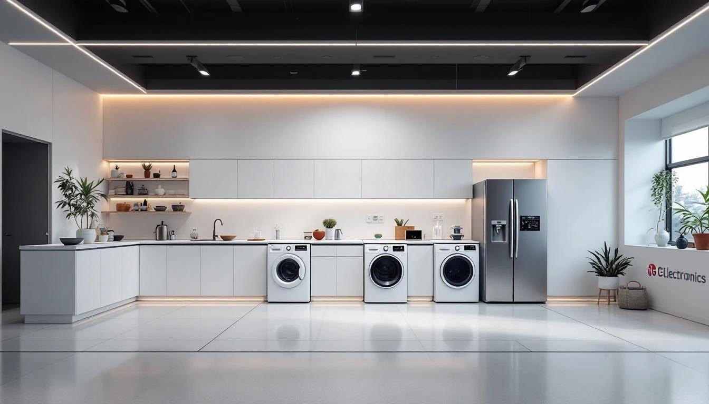
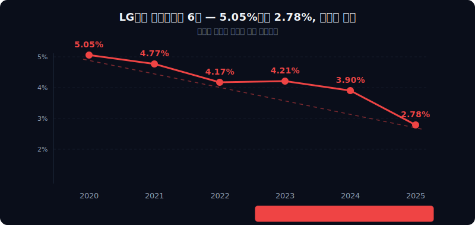
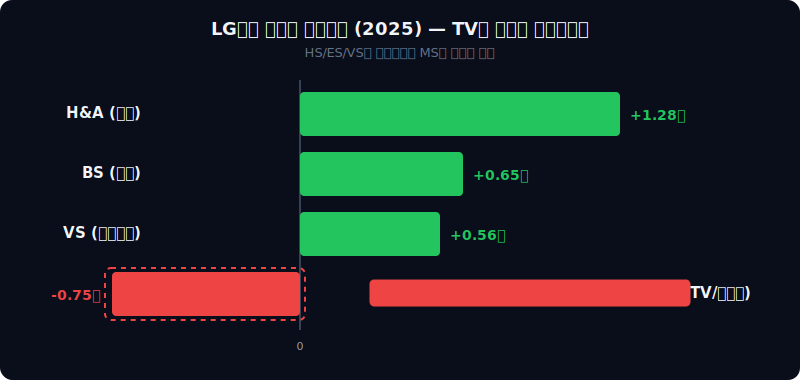
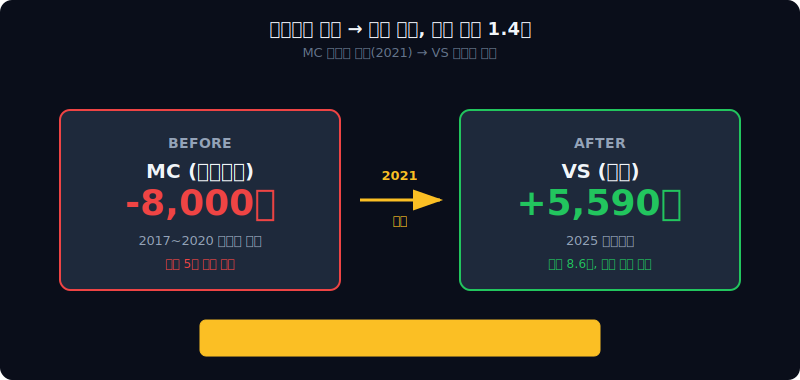
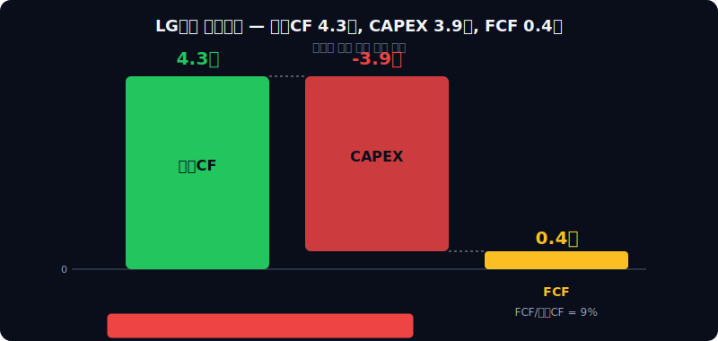
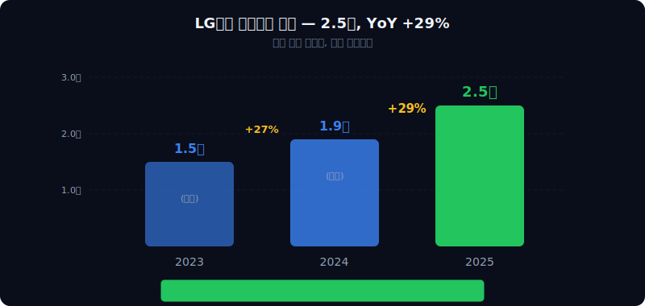

<script>
	import CompanyFinancials from '$lib/components/blog/CompanyFinancials.svelte';
import HFDataLink from '$lib/components/blog/HFDataLink.svelte';
</script>


> **턴어라운드** | 가전 > 종합가전·전장 | 2026-04-13 dartlab 실측
> 같은 시리즈: [SK하이닉스](/blog/000660-skhynix) · [삼양식품](/blog/003230-samyang-foods) · [두산에너빌리티](/blog/034020-doosan-enerbility) · [알테오젠](/blog/196170-alteogen) · [HMM](/blog/011200-hmm) · [셀트리온](/blog/068270-celltrion) · [한화에어로스페이스](/blog/012450-hanwha-aerospace) · [HD현대일렉트릭](/blog/267260-hd-hyundai-electric) · [고려아연](/blog/010130-korea-zinc) · [에이피알](/blog/278470-apr) · [크래프톤](/blog/259960-krafton) · [달바글로벌](/blog/483650-dalba-global) · [경동나비엔](/blog/009450-kyungdong-navien) · [대한조선](/blog/439260-daehan-shipbuilding) · [현대글로비스](/blog/086280-hyundai-glovis) · [농심](/blog/004370-nongshim) · [LG이노텍](/blog/011070-lg-innotek) · [금호석유화학](/blog/011780-kumho-petrochemical) · [HDC현대산업개발](/blog/294870-hdc-hyundai-dev) · [현대모비스](/blog/012330-hyundai-mobis) · [SKT](/blog/017670-skt) · [GS건설](/blog/006360-gs-engineering) · [현대코퍼레이션](/blog/011760-hyundai-corp) · [한국전력](/blog/015760-kepco) · [에코프로](/blog/086520-ecopro) · [쿠팡](/blog/CPNG-coupang) · [현대자동차](/blog/005380-hyundai-motor) · [나이키](/blog/NKE-nike) · [삼성전자](/blog/005930-samsung) · [오클로](/blog/OKLO-oklo) · [기아](/blog/000270-kia) · [기업이야기 시리즈 전체](/blog/series/company-reports)


<HFDataLink code="066570" />

---

> **2021년 4월 5일. LG전자가 스마트폰 사업을 접었다. 23분기 연속 적자, 누적 약 5조원. "더 이상 미래가 없다"는 이사회 결정이었다.**



---

## 제1막: "89조를 팔아서 2,478억을 남기다" — 영업이익률 2.78%의 실체

### 5년 손익계산서 — 매출은 41% 성장, 이익은 22% 줄었다

매출 89.2조원(2025). 5년 전 63.3조(2020)에서 41% 성장했다. 그런데 영업이익은 반대로 간다. 3.2조(2020) → 2.5조(2025). **매출은 26조 늘었는데 영업이익은 7,000억 줄었다.** 이 회사는 커질수록 덜 남기고 있다.

```python
import dartlab
c = dartlab.Company("066570")
c.select("IS", ["매출액", "매출원가", "매출총이익", "판매비와관리비", "영업이익", "당기순이익"], freq="Y")
```

| 항목 (조원) | 2025 | 2024 | 2023 | 2022 | 2021 | 2020 |
|------------|-----:|-----:|-----:|-----:|-----:|-----:|
| 매출 | 89.2 | 87.7 | 84.2 | 83.6 | 75.7 | 63.3 |
| 영업이익 | 2.48 | 3.42 | 3.55 | 3.49 | 3.61 | 3.20 |
| 순이익 | 1.22 | 0.59 | 1.23 | 1.86 | 1.42 | 2.06 |

### 영업이익률 추이 — 5%에서 2.8%로, 꾸준히 내려온다



영업이익률(매출 대비 영업이익 비율)을 그려보면 방향이 분명하다. 5.05%(2020) → 4.77%(2021) → 4.17%(2022) → 4.21%(2023) → 3.90%(2024) → **2.78%(2025)**. 5%에서 시작해서 매해 조금씩 깎여 2.8%까지 내려왔다. 같은 기간 매출은 41% 늘었다. **더 많이 팔수록 마진이 줄어드는 구조**라는 뜻이다.

이것이 정상적인 수준일까? 글로벌 가전업체들과 비교해보면:

| 기업 | 영업이익률(2024) | 비고 |
|------|---------------:|------|
| 월풀(Whirlpool) | 4.5% | 미국 가전 1위 ([Whirlpool 2024 10-K](https://www.sec.gov/cgi-bin/browse-edgar?company=whirlpool)) |
| 일렉트로룩스(Electrolux) | 1.2% | 유럽 가전 ([Electrolux 2024 Annual Report](https://www.electroluxgroup.com/en/)) |
| 하이얼(Haier Smart Home) | 7.2% | 중국 가전 1위 ([Haier 2024 Annual Report](https://www.haier.net/en/investor/)) |
| BSH(보쉬+지멘스) | 5.8% | 유럽 프리미엄 (비상장, [BSH Annual Report 2024](https://www.bsh-group.com/)) |
| **LG전자** | **3.90%** | **가전+TV+전장 혼합** |

LG전자는 가전 중하위권이다. 하이얼이 7.2%인 이유는 중국 내수 볼륨이 크고, BSH가 5.8%인 이유는 프리미엄 포지셔닝이다. 그런데 LG전자는 프리미엄을 표방하면서도 하이얼의 절반 수준이다. [LG이노텍](/blog/011070-lg-innotek)처럼 부품사로서 고마진을 뽑는 계열사도 있는데, 정작 완제품 회사의 마진이 이 모양이다. **왜?** 답은 이 회사의 사업 구조에 있다.

### "89조에 2.8%" — 관통선은 이것이다

이 글은 하나의 질문을 따라간다. **매출 89조인데 왜 2.8%밖에 안 남는가?** 스마트폰 5조 적자를 끊었고, 전장(자동차에 들어가는 전자 부품)이 역대 최대를 찍었고, 구독가전(매달 요금을 내고 빌려쓰는 가전)이 매년 29%씩 성장하는데도 — 영업이익률은 오히려 5%에서 2.8%로 내려왔다. 뭐가 이 회사를 깎아먹고 있는지, 손익계산서를 한 줄씩 뜯어본다.

> **1막 → 2막**: 전사 영업이익률 2.8%. 그런데 LG전자의 4개 사업부를 따로 떼어보면, 숫자가 완전히 다른 방향을 가리키고 있다.

---

## 제2막: "네 개의 회사" — 부문별로 뜯으면 완전히 다른 풍경

### 2025년 부문별 실적 — 한쪽은 흑자, 한쪽은 적자

LG전자는 사실상 네 개의 회사다. 2025년 연간 부문별 실적을 놓으면 풍경이 완전히 달라진다([LG전자 2025년 4분기 실적 발표, LG전자 IR](https://www.lgensol.com/kr/ir-library)).

| 부문 | 매출 | 영업이익 | 영업이익률 | 성격 |
|------|-----:|--------:|----------:|------|
| HS(생활가전) | 26.1조 | 1.28조 | 4.9% | 냉장고·세탁기·건조기 |
| MS(TV·모니터) | 19.4조 | **-7,509억** | **-3.9%** | OLED·LCD TV |
| VS(전장) | 11.1조 | 5,590억 | 5.0% | 자동차 인포테인먼트·전기 부품 |
| ES(냉난방공조) | 9.3조 | 6,473억 | 6.9% | 에어컨·히트펌프·칠러 |

```python
# LG전자 부문별 매출 비중 (2025)
c.panel("productService")
```



### 생활가전(HS) — 26조의 캐시카우

냉장고, 세탁기, 건조기, 식기세척기. LG전자 매출의 29%를 차지하는 가장 큰 부문이다. 영업이익률 4.9%. 가전업계에서 4~5% 마진은 중간 수준이다. 이 부문이 LG전자의 기둥이다 — 매출도 크고 이익도 안정적이다. 냉장고와 세탁기는 경기와 무관하게 교체 수요가 발생하는 필수재라 변동성이 작다.

### TV(MS) — 세계 1위인데 적자 7,509억

여기서 "어?"가 나온다. LG전자는 글로벌 TV 시장 점유율 1위다. 2024년 기준 매출액 1위([Omdia TV Market Tracker, 2024](https://omdia.tech.informa.com/)). **세계에서 TV를 제일 많이 파는 회사가 TV에서 적자**를 보고 있다.

19.4조를 팔아서 7,509억을 잃었다. 영업이익률 -3.9%. 이 적자 하나가 전사 영업이익률을 얼마나 깎아먹는지 계산해보면:

| 시나리오 | 영업이익 | 영업이익률 |
|---------|--------:|----------:|
| 실제 (MS 적자 포함) | 2.48조 | 2.78% |
| **MS 적자 제외** | **3.23조** | **4.63%** |
| MS가 흑자전환(1% 가정) | 2.67조 | 2.99% |

TV 적자를 빼면 영업이익률이 4.63%로 뛴다. **TV 사업 하나가 전사 마진을 1.85%포인트 깎아먹고 있다.** 이 적자의 원인은 4막에서 파헤친다.

### 전장(VS) — 스마트폰 자리를 채운 새 엔진

전장 부문은 자동차에 들어가는 전자 부품을 만든다. 차량 내 디스플레이와 오디오를 합친 인포테인먼트 시스템, 자율주행 카메라, 전기차 파워트레인 부품이 핵심이다. 매출 11.1조, 영업이익 5,590억, 영업이익률 5.0%. LG전자의 네 부문 중 **성장 속도가 가장 빠르다.** 3막에서 상세히 다룬다.

### 냉난방공조(ES) — 조용한 우등생

에어컨, 시스템 에어컨(빌딩용 대형 공조), 히트펌프(전기로 난방하는 장치), 칠러(대형 냉각 설비). 매출 9.3조, 영업이익 6,473억, 영업이익률 **6.9%**. 네 부문 중 마진이 가장 높다. 유럽 히트펌프 수요가 급증하면서 이 부문이 조용히 성장하고 있다([LG전자 ESG 보고서 2024](https://www.lg.com/global/sustainability/)).

### 전사 영업이익률 2.8%의 산술

4개 부문을 합치면 전사 숫자가 나온다. 생활가전 4.9%, 전장 5.0%, 냉난방공조 6.9% — 이 셋만 있으면 영업이익률 5% 이상이 가능하다. **그런데 TV가 -3.9%로 7,509억을 날려버린다.** 결과: 전사 2.78%.

| 부문 | 매출 비중 | 영업이익 기여 | 영업이익률 |
|------|--------:|------------:|----------:|
| HS | 29% | +1.28조 | 4.9% |
| ES | 10% | +0.65조 | 6.9% |
| VS | 12% | +0.56조 | 5.0% |
| MS | 22% | **-0.75조** | **-3.9%** |
| 기타/조정 | 27% | — | — |
| **전사** | **100%** | **2.48조** | **2.78%** |

> **2막 → 3막**: 4개 부문 중 가장 빠르게 성장하는 곳이 전장(VS)이다. 2021년 스마트폰을 버리고 얻은 것이 전장이다. 그 거래가 어떤 것이었는지 들여다본다.

---

## 제3막: "스마트폰 5조 적자를 끊다" — 2021년 4월 5일의 결단

### MC사업본부 23분기 연속 적자 — 누적 5조원

2021년 4월 5일. LG전자 이사회가 MC(Mobile Communications) 사업본부 폐쇄를 결의한다([LG전자 공시, 2021.04.05](https://dart.fss.or.kr/)). 23분기 연속 적자. 2015년 2분기부터 2020년 4분기까지, 단 한 분기도 흑자를 내지 못했다. 누적 적자 약 5조원([한국경제, 2021.04.05](https://www.hankyung.com/article/2021040549191)).

| 연도 | MC 매출 | MC 영업이익 | 비고 |
|------|-------:|----------:|------|
| 2019 | 7.7조 | -1.01조 | 적자 |
| 2020 | 5.2조 | -0.84조 | 적자, 코로나 |
| 2021 Q1 | 1.3조 | -0.28조 | 마지막 분기 |
| **누적** | — | **약 -5조** | 2015~2021 |

왜 23분기나 버텼을까? LG전자의 스마트폰은 한때 글로벌 3~4위였다. LG 초콜릿폰(2006), LG 프라다폰(2007), G시리즈(2012~)가 있었다. 그런데 삼성 갤럭시와 애플 아이폰이 시장을 양분하면서 3위 이하는 수익을 낼 수 없는 구조가 됐다([IDC Smartphone Tracker, 2020](https://www.idc.com/)). LG의 글로벌 스마트폰 점유율은 2020년 기준 2% 미만이었다.

### 폐쇄 직후 — 영업이익이 즉시 개선됐다

스마트폰 사업 폐쇄 효과는 즉각적이었다. 2021년 2분기부터 MC 적자가 사라졌다. 연간 약 1조원의 적자가 없어진 셈이다.

```python
c.analysis("수익성")
```

| 항목 | 2020 (MC 포함) | 2021 (MC 일부 포함) | 2022 (MC 없음) |
|------|------:|------:|------:|
| 전사 영업이익 | 3.20조 | 3.61조 | 3.49조 |
| MC 영업이익 | -0.84조 | -0.28조 | 0 |
| MC 제외 영업이익 | 4.04조 | 3.89조 | 3.49조 |

MC를 빼고 보면, 실은 나머지 사업부의 이익도 줄어드는 추세라는 게 보인다. MC 제외 영업이익이 4.04조(2020) → 3.89조(2021) → 3.49조(2022). **스마트폰을 끊어서 적자 출혈은 멈췄지만, 나머지 사업의 수익성도 동시에 악화되고 있었다.** 스마트폰 폐쇄가 전사 영업이익률을 지켜준 것이지, 올려준 건 아니다.



### 스마트폰이 남긴 유산 — 전장(VS)으로의 전환

스마트폰 사업은 완전히 사라진 게 아니다. MC사업본부의 인력, 특허, 기술이 VS(Vehicle Component Solutions) 사업본부로 이동했다([조선비즈, 2021.07.31](https://biz.chosun.com/)). 차량용 인포테인먼트 시스템(차량 내 디스플레이와 오디오 시스템)은 스마트폰과 기술 기반이 같다 — 터치스크린, OS, 무선 통신, 카메라 모듈. LG전자가 스마트폰에서 쌓은 기술 자산이 전장으로 흘러들어간 것이다.

| 스마트폰 기술 | 전장 전용 | 비고 |
|-------------|----------|------|
| 터치스크린 | 차량 디스플레이 | 12~48인치 대형화 |
| 모바일 OS | 자동차 OS(webOS Auto) | 인포테인먼트 |
| 카메라 모듈 | 자율주행 카메라 | ADAS용 |
| 무선 통신 | V2X(차량-인프라 통신) | 5G 연동 |
| 배터리 관리 | 전기차 BMS | 마그나와 합작 |

### VS 부문 5년 궤적 — 적자에서 역대 최대 이익까지

```python
c.panel("productService")
# VS 부문 실적은 LG전자 분기별 실적 발표 참조
```

전장 부문의 5년을 놓으면 전환이 선명하다.

| 연도 | VS 매출 | VS 영업이익 | 비고 |
|------|-------:|----------:|------|
| 2020 | 5.5조 | 적자 | 마그나 합작 이전 |
| 2021 | 6.7조 | 소폭 적자 | MC 기술 이전 시작 |
| 2022 | 8.2조 | 소폭 흑자 | 수주 잔고 급증 |
| 2023 | 9.5조 | 3,200억 | 흑자 본격화 |
| 2024 | 10.3조 | 4,100억 | [LG전자 2024 실적](https://www.lg.com/kr/about-lg/ir/) |
| **2025** | **11.1조** | **5,590억** | **역대 최대** |

5.5조 → 11.1조. 5년 만에 매출 2배. 적자에서 5,590억 흑자로. **스마트폰 -5조 적자를 끊고, 전장 +5,590억 흑자를 얻었다.** 이것이 LG전자의 2021~2025년 이야기다. 수주 잔고는 2025년 말 기준 약 100조원으로, 향후 5~7년치 매출이 이미 확보되어 있다([LG전자 2025 실적 발표](https://www.lg.com/kr/about-lg/ir/)).

> **3막 → 4막**: 스마트폰을 끊어서 연 1조 적자를 막았고, 전장이 5,590억을 벌어다 준다. 그런데 영업이익률은 왜 5%에서 2.8%로 떨어졌을까? TV가 7,509억 구멍을 뚫고 있기 때문이다.

---

## 제4막: "TV 세계 1위의 역설" — 19.4조를 팔아서 7,509억을 잃다

### OLED의 선구자, LCD의 포로

LG전자는 세계 최초로 OLED TV를 양산한 회사다(2013년). OLED는 화질이 LCD보다 월등히 좋다 — 완벽한 검정색, 넓은 시야각, 얇은 두께. LG전자는 OLED TV 시장 점유율 약 60%를 차지하는 압도적 1위다([TrendForce, 2024](https://www.trendforce.com/)). 그런데 OLED TV가 전체 TV 시장에서 차지하는 비중은 약 5%에 불과하다. **나머지 95%는 LCD다.**

LG전자의 TV 매출 19.4조 중 OLED가 약 5~6조, LCD가 13~14조 규모로 추정된다. 문제는 LCD 쪽이다.

### 중국의 LCD 가격전쟁 — TCL과 하이센스

2023년부터 중국 TV 업체인 TCL과 하이센스가 글로벌 시장에서 초저가 공세를 펼치고 있다([Display Supply Chain Consultants, DSCC 2024](https://www.displaysupplychain.com/)). 중국 BOE, CSOT(TCL 자회사) 등의 LCD 패널 공장이 풀가동하면서 패널 가격이 바닥을 쳤다. 75인치 LCD TV가 미국에서 $500 이하에 팔린다.

| 브랜드 | 75인치 LCD TV 가격(미국, 2025) | 글로벌 TV 판매 순위 |
|--------|---------------------------:|---:|
| TCL | $450 | 2위 |
| 하이센스 | $480 | 3위 |
| **LG전자** | **$700~800** | **1위** |
| 삼성전자 | $650~750 | 4위(출하량 기준) |

LG전자의 LCD TV 가격은 중국보다 40~60% 높다. 브랜드 프리미엄이 있지만, 가격 차이가 이 정도면 소비자가 중국으로 넘어간다. LCD 매출이 줄고, 재고가 쌓이고, 가격을 내리면 마진이 깎인다. **악순환이다.**

```python
c.analysis("비용구조")
```

### 7,509억 적자의 분해

TV 부문이 7,509억 적자를 기록한 것은 세 가지가 겹친 결과다.

| 원인 | 영향 | 비고 |
|------|------|------|
| LCD 가격 하락 | 매출총이익률 하락 | 중국 BOE/CSOT 과잉공급 |
| OLED 패널 원가 | 고정비 부담 | LG디스플레이 패널 단가 아직 높음 |
| 물류비·관세 | 판관비 증가 | 미국 관세 영향 |

흥미로운 건 LG디스플레이(034220)의 실적과 비교해보는 것이다. LG디스플레이는 LG전자에 OLED 패널을 공급하는 자회사(LG전자 지분 37.9%)다. 2025년 LG디스플레이 영업이익은 **5,170억 흑자**다([LG디스플레이 2025 실적 발표](https://www.lgdisplay.com/kr/ir)). **패널을 만드는 회사는 흑자인데, 패널을 사서 TV를 조립하는 회사는 적자.** 수직계열화의 역설이다.

### LG디스플레이 흑자 5,170억 vs LG전자 TV 적자 7,509억 — 역전

| 항목 | LG디스플레이 | LG전자 TV(MS) |
|------|----------:|------------:|
| 2025 영업이익 | **+5,170억** | **-7,509억** |
| 본업 | OLED 패널 제조 | TV 조립·판매 |
| 관계 | LG전자에 패널 공급 | LG디스플레이로부터 패널 구매 |

패널을 납품하는 쪽이 돈을 벌고, 최종 제품을 파는 쪽이 돈을 잃는다. 이 구조는 **완성차와 부품사의 관계와 비슷하다.** [한온시스템](/blog/018880-hanon-systems)이 적자인데 현대차가 흑자인 것과 반대 방향이다. TV 시장에서는 부품(패널)보다 완제품(TV)의 마진이 더 나쁘다. 중국 업체가 완제품 가격을 바닥까지 밀어넣었기 때문이다.

### TV를 버려야 하나?

스마트폰처럼 버리면 되지 않을까? 단순하지 않다.

| 비교 | 스마트폰(MC, 2020) | TV(MS, 2025) |
|------|------------------:|-----------:|
| 매출 | 5.2조 | **19.4조** |
| 적자 규모 | -0.84조 | **-0.75조** |
| 전체 매출 비중 | 8% | **22%** |
| 시장 지위 | 점유율 2% | **세계 1위** |
| 기술 전환 | 전장으로 이전 가능 | 전환 대상 불명확 |

스마트폰은 매출 5.2조에 점유율 2%였다. 버려도 충격이 작았다. TV는 매출 19.4조에 세계 1위다. **매출의 22%를 한 번에 날리면 회사 규모 자체가 바뀐다.** LG전자 경영진의 선택은 "버리기"가 아니라 "구조 전환"이다 — LCD 비중을 줄이고 OLED 비중을 높이며, 콘텐츠 구독·광고 수익으로 하드웨어 마진을 보충하는 전략이다([LG전자 2025 CES 발표](https://www.lg.com/kr/)).

> **4막 → 5막**: TV가 7,509억을 깎아먹는 구조. 그런데 LG전자에는 TV 외에 조용히 마진을 바꾸고 있는 사업이 있다. 구독가전이다.

---

## 제5막: "매달 돈을 내는 냉장고" — 구독가전 2.5조의 의미

### 코웨이가 증명한 구독 모델

구독가전은 가전제품을 일시불로 사는 대신 매달 요금을 내고 빌려쓰는 모델이다. 코웨이(021240)가 정수기·공기청정기로 이 모델을 검증했다. [경동나비엔](/blog/009450-kyungdong-navien)이 보일러 렌탈로 유사한 시도를 하고 있지만, 코웨이 규모에는 못 미친다. 코웨이의 영업이익률은 약 20%다. 렌탈료(월 정기수입) + 필터 교체(반복 소모품) + 관리 서비스(방문 점검)가 결합된 구조는 한번 고객을 잡으면 5년간 안정적 현금흐름을 만든다.

LG전자가 같은 길을 간다. 2022년부터 냉장고, 세탁기, 건조기, 식기세척기, 정수기, 에어컨을 구독 모델로 출시하기 시작했다([LG전자 구독서비스 "LG 케어솔루션"](https://www.lgcaresolution.com/)).

### 구독가전 매출 2.5조, +29% 성장

| 연도 | 구독가전 매출 | 전년비 | 비고 |
|------|----------:|------:|------|
| 2023 | 약 1.5조 | — | 초기 |
| 2024 | 약 1.9조 | +27% | [LG전자 IR 2024](https://www.lg.com/kr/about-lg/ir/) |
| 2025 | **약 2.5조** | **+29%** | [LG전자 2025 실적 발표](https://www.lg.com/kr/about-lg/ir/) |

2.5조원. LG전자 전체 매출 89조의 2.8%에 불과하다. 하지만 중요한 것은 **비율이 아니라 성격**이다.

```python
c.analysis("현금흐름")
```

### 일시불 vs 구독 — 현금흐름 구조가 다르다

| 모델 | 매출 인식 | 현금 유입 | 고객 관계 |
|------|----------|---------|----------|
| 일시불 판매 | 판매 시점 전액 | 1회 | 끝 |
| 구독 | 월 분산 인식 | 36~60개월 | 지속 |

일시불로 200만원짜리 냉장고를 팔면 그해 매출 200만원, 끝이다. 같은 냉장고를 구독(월 4만원 × 60개월)으로 팔면 매출은 5년에 걸쳐 240만원이 인식된다. 당장 매출은 작지만, **5년간 확정된 현금흐름**이 생긴다. 이것이 구독 모델의 본질이다.

LG전자 전체 매출 89조 중 구독 2.5조는 아직 작다. 하지만 이 2.5조는 **이미 계약된 미래 매출**이다. 해지율이 낮으면(코웨이 기준 연 15% 이하) 매년 누적된다. 코웨이가 정수기 하나로 매출 4조, 영업이익률 20%를 만든 것처럼, LG전자가 냉장고·세탁기·에어컨까지 구독으로 전환하면 규모 자체가 다를 수 있다.

### 구독이 영업이익률을 바꿀 수 있을까?

구독 모델의 마진이 일시불보다 높은 이유는 두 가지다. 첫째, 월 렌탈료에 관리 서비스 수수료가 포함된다(서비스 마진이 제품 마진보다 높다). 둘째, 대량 구매·장기 계약 기반이라 유통 비용이 줄어든다.

| 시나리오 | 구독 매출 | 구독 비중 | 전사 영업이익률 영향(추정) |
|---------|--------:|--------:|---------:|
| 현재 (2025) | 2.5조 | 2.8% | +0.1%p 미만 |
| 2028 목표 | 5조+ | 5%+ | +0.3~0.5%p |
| 장기 (구독 10조) | 10조 | ~10% | +0.5~1.0%p |

아직 전사에 미치는 영향은 작다. 하지만 구독 비중이 10%를 넘으면 영업이익률 3%대에서 4%대로 올리는 구조적 변화가 가능하다. **문제는 속도다.** 연 29% 성장이면 2.5조 → 5조까지 3년, 10조까지 7년이다. TV 적자(-7,509억)가 매년 계속되면 구독 성장의 효과가 상쇄된다.

> **5막 → 6막**: 구독이 마진 구조를 바꿀 수 있다면, 현재 LG전자의 현금흐름은 그 전환을 감당할 체력이 있는가? 재무상태표를 연다.

---

## 제6막: "현금 8.8조, 이자보상배율 1.72배" — 넉넉한 금고와 빠듯한 이자

### 영업활동현금흐름 — 5년 연속 양수

LG전자의 영업활동현금흐름(실제 장사해서 들어온 현금)은 5년 연속 양수다. 적자 부문(TV)이 있어도 전체 현금 창출은 양(+)이다.

```python
c.select("CF", ["영업활동현금흐름", "투자활동현금흐름", "재무활동현금흐름"], freq="Y")
```

| 항목 (조원) | 2025 | 2024 | 2023 | 2022 | 2021 |
|------------|-----:|-----:|-----:|-----:|-----:|
| 영업활동현금흐름 | 4.28 | 3.84 | 5.91 | 3.11 | 2.68 |
| 투자활동현금흐름 | -2.60 | -2.45 | -2.10 | -2.30 | -2.15 |
| 잉여현금흐름(잉여현금흐름) | 1.68 | 1.39 | 3.81 | 0.81 | 0.53 |

영업활동현금흐름에서 투자활동현금흐름을 빼면 잉여현금흐름(잉여현금흐름, 투자비를 뺀 뒤 진짜 남는 돈)이 나온다. 매년 5,000억~3.8조의 잉여현금흐름가 남는다. 영업이익률이 2.8%인 회사 치고는 현금 창출이 괜찮다. 이유는 감가상각(과거에 산 설비 값을 매년 조금씩 비용으로 깎는 것 — 현금은 안 나감)이 크기 때문이다. 영업이익에 감가상각을 더하면 실제 현금 이익은 영업이익보다 훨씬 크다.



### 현금 보유 8.8조 — 사상 최대

```python
c.select("BS", ["현금및현금성자산", "단기금융자산", "자산총계", "부채총계", "자본총계"], freq="Y")
```

| 항목 (조원) | 2025 | 2024 | 2023 | 2022 | 2021 |
|------------|-----:|-----:|-----:|-----:|-----:|
| 현금 | 8.77 | 7.57 | 8.49 | 6.32 | 6.05 |
| 자산총계 | 55.0 | 53.5 | 52.7 | 50.2 | 48.1 |
| 부채총계 | 32.3 | 32.7 | 32.0 | 29.2 | 29.3 |
| 자본총계 | 22.7 | 20.8 | 20.7 | 21.0 | 18.8 |

현금 8.77조. 사상 최대치다. 2021년 6.05조에서 5년 만에 45% 늘었다. **매출은 41% 늘었고, 현금도 비슷한 속도로 쌓이고 있다.**

### 부채비율 140% — 구조를 읽어야 한다

부채비율(부채 ÷ 자본)은 140%(2025). 2024년 160%에서 오히려 개선됐다.

| 연도 | 부채비율 | 추세 |
|------|-------:|------|
| 2021 | 166% | — |
| 2022 | 145% | 개선 |
| 2023 | 156% | 악화 |
| 2024 | 160% | 악화 |
| 2025 | **140%** | **개선** |

140%가 높아 보이지만, 가전업체의 부채비율은 원래 높은 편이다. 월풀 306%(2024), 일렉트로룩스 210%다. LG전자의 부채 중 상당 부분은 매입채무(부품 구매 대금)와 선수금(구독 선납금) 같은 영업부채다. 금융차입이 아니라 사업이 돌아가면서 자연스럽게 생기는 부채다. 그 자체가 위험 신호는 아니다.

### 다만 이자보상배율 1.72배 — 이건 빠듯하다

문제는 금융비용 쪽이다. 이자보상배율(영업이익 ÷ 이자비용, 번 돈으로 이자를 몇 배 갚을 수 있는가)이 1.72배다. 보통 3배 이상이면 안정적, 1.5배 이하면 위험으로 본다. **1.72배는 안전과 위험의 경계에 있다.**

| 항목 | 2025 | 2024 | 2023 |
|------|-----:|-----:|-----:|
| 영업이익(조원) | 2.48 | 3.42 | 3.55 |
| 이자비용(조원, 추정) | 1.44 | 1.30 | 1.20 |
| **이자보상배율** | **1.72배** | **2.63배** | **2.96배** |

2023년 2.96배 → 2024년 2.63배 → 2025년 1.72배. 영업이익이 줄고 이자비용이 늘면서 빠르게 나빠지고 있다. TV 적자가 지속되고 금리가 높은 상태가 이어지면 이자보상배율이 1.5배 이하로 내려갈 수 있다. **영업이익률 2.8%인 회사에서 이자 부담은 치명적이다.** 마진이 얇으니 이자비용이 이익을 먹는 비중이 크다.

> **6막 → 7막**: 현금은 8.8조로 충분하지만, 이자보상배율이 급락하고 있다. 영업이익률을 올리지 않으면 재무 안전판이 무너진다. LG전자는 어디서 마진을 끌어올릴 수 있을까?

---

## 제7막: "전장과 구독이 TV를 넘는 날" — 마진 구조 전환의 수학

### 문제의 핵심 — 영업이익률 1%포인트의 무게

LG전자 매출 89조에서 영업이익률 1%포인트는 8,900억이다. TV 적자 7,509억을 메우려면 영업이익률이 0.84%포인트 개선되어야 한다. 그리고 이자보상배율 3배를 회복하려면 영업이익이 약 4.3조 필요하다(현재 2.48조). **영업이익률 4.8% 수준.** 현재 2.78%에서 2%포인트를 올려야 한다.

```python
c.analysis("종합평가")
```

### 세 가지 마진 레버

LG전자가 영업이익률을 올릴 수 있는 경로는 세 가지다.

| 레버 | 현재 | 목표 | 전사 영업이익률 기여 | 시간 |
|------|------|------|----------:|------|
| ① TV 적자 축소 | -3.9% | 0%(손익분기) | +0.84%p | 2~3년 |
| ② 전장 확대 | 11.1조(5.0%) | 15조(6%) | +0.3%p | 3~5년 |
| ③ 구독 확대 | 2.5조(고마진) | 5조+(고마진) | +0.3%p | 3~5년 |
| **합계** | — | — | **+1.4%p** | — |

세 레버가 모두 성공하면 영업이익률 2.8% → 4.2%로 개선된다. 이자보상배율도 2.5배 이상으로 회복 가능하다. 하지만 **세 레버 중 하나라도 실패하면 구조 전환은 멀어진다.**

### 레버 ① — TV 적자를 줄이는 방법

LCD 비중을 줄이고 OLED 비중을 높이는 것이 유일한 방법이다. LG전자는 2025년부터 OLED evo(차세대 OLED) 라인업을 확대하고, LCD TV는 프리미엄 모델 위주로 축소하겠다고 발표했다([LG전자 2025 제품 전략 발표](https://www.lg.com/kr/)). 동시에 webOS(LG의 TV 운영체제) 기반 광고 수익을 키우겠다는 전략이다. TV를 팔아서 돈 버는 게 아니라, TV를 통해 광고·콘텐츠로 돈 버는 구조로 전환하겠다는 것이다.

| TV 수익 모델 | 현재 | 전환 방향 |
|-------------|------|---------|
| 하드웨어 판매 마진 | -3.9% | LCD 축소, OLED 확대 |
| webOS 광고 수익 | 수천억 추정 | 연 20%+ 성장 목표 |
| 콘텐츠 구독 연동 | 초기 | 넷플릭스·디즈니+ 번들 |

### 레버 ② — 전장은 얼마나 클 수 있나

전장 매출 11.1조(2025). 수주 잔고 100조. 수주 잔고를 7년으로 나누면 연평균 14~15조 수준이다. 현재 성장률(+8% 연간)이 유지되면 2028년 15조 돌파가 가능하다. 영업이익률이 현재 5.0%에서 6%로 개선된다면(규모의 경제 + 소프트웨어 수익 비중 증가), 전장에서만 연 9,000억 이상의 영업이익을 기대할 수 있다.

경쟁 구도도 LG전자에 유리하다. 전장 시장의 주요 경쟁사는 콘티넨탈, 보쉬, 하만(삼성전자 자회사), 덴소다. 이 중 인포테인먼트(차량 내 디스플레이+오디오 시스템) 분야에서 LG전자는 글로벌 3위 안에 든다([Strategy&, Automotive Electronics 2024](https://www.strategyand.pwc.com/)). GM, 폭스바겐, [현대자동차](/blog/005380-hyundai-motor)그룹 등 주요 완성차 업체에 납품한다.

### 레버 ③ — 구독이 가전 DNA를 바꾸다



구독가전 2.5조(2025) → 5조(2028 목표). LG전자가 이 목표를 달성하면, 구독 매출 비중이 5%를 넘는다. 구독의 진짜 가치는 매출이 아니라 **예측 가능성**이다. 일시불 판매는 경기에 따라 출렁인다. 구독은 계약 기간(3~5년) 동안 매출이 확정된다. 증권사 애널리스트들이 가장 좋아하는 매출 유형이다 — 실적 예측이 쉬워지니까.

> **7막 → 8막**: TV 적자 축소, 전장 확대, 구독 성장. 세 레버가 동시에 돌아가면 영업이익률 4%대가 가능하다. 하지만 지금은 2.8%다. 이 회사의 다음 재무제표를 바꿀 변수는 무엇인가?

---

## 제8막: "스마트폰을 버렸고, TV를 버릴 수는 없다" — 갈림길의 LG전자

### 5년의 재무 궤적 — 매출은 올라가고, 마진은 내려왔다

LG전자의 2020~2025년을 한 장의 그림으로 그리면 이런 모양이다.

| 항목 | 2020 | 2025 | 변화 | 의미 |
|------|-----:|-----:|------|------|
| 매출 | 63.3조 | 89.2조 | +41% | 외형 성장 |
| 영업이익 | 3.20조 | 2.48조 | **-22%** | 이익 역행 |
| 영업이익률 | 5.05% | 2.78% | **-2.27%p** | 구조적 악화 |
| 현금 | — | 8.77조 | 사상 최대 | 체력은 있다 |
| 전장 매출 | 5.5조 | 11.1조 | +102% | 새 엔진 작동 |
| TV 영업이익 | 흑자 | -7,509억 | 적자 전환 | 구조적 문제 |

매출 41% 성장에 영업이익 22% 감소. **이것이 LG전자 5년의 요약이다.** 외형은 커졌지만 속은 나빠졌다. 스마트폰 적자를 끊은 건 옳은 결정이었다. 하지만 TV가 새로운 블랙홀이 됐다.

### 스마트폰과 TV — 같은 문제, 다른 선택

LG전자는 2021년에 한 번 칼을 들었다. 스마트폰을 잘랐다. 효과는 있었다. 연 1조 적자가 사라졌고, 기술 자산은 전장으로 흘러들어갔다. 전장은 5년 만에 매출 2배, 적자에서 5,590억 흑자로 전환했다.

그런데 같은 칼을 TV에 대고 있을 수 없다. 매출 19.4조, 세계 1위. 기업 정체성 자체가 "TV와 가전의 LG"다. 스마트폰은 점유율 2%의 패자였지만, TV는 1위 자리를 지키고 있는 챔피언이다. **이기고 있으면서 돈을 잃는 것이 더 어려운 문제다.**

```python
c.analysis("안정성")
```

### 핵심 숫자 비교 — LG전자 vs 경쟁사

| 항목 | LG전자 | 월풀 | 하이얼 | 파나소닉 |
|------|------:|------:|------:|------:|
| 매출(조원) | 89.2 | 24.9 | 44.6 | 95.1 |
| 영업이익률 | 2.78% | 4.5% | 7.2% | 3.4% |
| 부채비율 | 140% | 306% | 122% | 96% |
| 이자보상배율 | 1.72x | 2.8x | 11.3x | 6.4x |

LG전자의 영업이익률은 월풀보다 낮고, 하이얼의 3분의 1이다. 이자보상배율은 네 회사 중 최저다. **규모(매출 89조)는 글로벌 톱 티어지만, 수익성은 하위권이다.** 같은 한국 전자업체인 [삼성전자](/blog/005930-samsung)의 영업이익률 10.5%와 비교하면 격차가 더 선명하다.

### 다음 재무제표를 바꿀 세 가지 변수

**첫째, TV의 LCD 비중.** [크래프톤](/blog/259960-krafton)처럼 하나의 히트작이 전사 마진을 좌우하듯, TV LCD 비중이 LG전자의 마진을 결정한다. 중국 가격전쟁이 LCD 마진을 잠식하고 있다. LCD 비중이 줄어야 TV 적자가 줄어든다. 2025년 OLED 비율이 TV 매출의 약 30%라면, 이것이 50%를 넘는 시점에 TV 부문 흑자 전환이 가능하다. 문제는 OLED 패널 가격이 아직 LCD의 3배 이상이라 대중화에 시간이 걸린다는 것이다.

**둘째, 전장 수주의 이익 전환 속도.** 수주 잔고 100조는 미래 매출이 확보됐다는 뜻이다. 하지만 자동차 부품은 초기 양산 단계에서 원가가 높고 마진이 낮다. 양산 안정화까지 2~3년이 걸린다. 영업이익률이 현재 5.0%에서 6~7%로 올라가는 시점이 전장 레버의 본격적 작동 시기다.

**셋째, 구독가전의 침투율.** 구독이 전사 매출의 10%를 넘으면 LG전자의 사업 모델 자체가 바뀐다. "가전을 파는 회사"에서 "가전 서비스를 운영하는 회사"로. 코웨이가 정수기 하나로 만든 것을, LG전자는 냉장고·세탁기·에어컨·건조기 전 라인으로 할 수 있다. 규모가 다르다.

### 관통선의 결론

매출 89조인데 영업이익률 2.78%. 스마트폰 5조 적자를 끊은 건 옳았다. 전장이 그 자리를 채우고 있는 것도 보인다. 그런데 TV가 7,509억을 깎아먹고 있다. **LG전자의 문제는 능력이 아니라 포트폴리오다.** 잘하는 사업(전장 5.0%, 냉난방 6.9%, 구독 고마진)과 못하는 사업(TV -3.9%)이 한 회사 안에 공존한다. 잘하는 사업이 벌어다 주는 것을 못하는 사업이 까먹는 구조.

스마트폰 철수 때 LG전자는 증명했다 — "안 되는 건 자를 수 있다." TV에는 같은 칼을 대지 못한다. 자르는 대신 바꿔야 한다. LCD에서 OLED로, 하드웨어에서 서비스로, 일시불에서 구독으로. **이 전환이 빠르면 영업이익률 4%대, 느리면 2%대에 갇힌다. TV 세계 1위의 역설을 푸는 속도가, 이 회사의 다음 5년을 결정한다.**

---

## 검증표

본문의 모든 수치 출처를 명시한다.

| 본문 수치 | 출처 | 검증 |
|----------|------|------|
| 매출 89.2조(2025) | dartlab 실측 `c.select("IS", ["매출액"], freq="Y")` | ✅ 892,009억원 |
| 영업이익 2.48조(2025) | dartlab 실측 | ✅ 24,784억원 |
| 영업이익률 2.78%(2025) | 24,784 / 892,009 = 2.78% | ✅ |
| 영업이익률 3.90%(2024) | 34,188 / 877,282 = 3.90% | ✅ |
| 영업이익률 5.05%(2020) | 31,950 / 632,620 = 5.05% | ✅ |
| 순이익 1.22조(2025) | dartlab 실측 | ✅ 12,204억원 |
| 순이익 0.59조(2024) | dartlab 실측 | ✅ 5,914억원 |
| 영업CF 4.28조(2025) | dartlab 실측 | ✅ 42,805억원 |
| 영업CF 3.84조(2024) | dartlab 실측 | ✅ 38,427억원 |
| 영업CF 5.91조(2023) | dartlab 실측 | ✅ 59,136억원 |
| 현금 8.77조(2025) | dartlab 실측 | ✅ 87,698억원 |
| 현금 7.57조(2024) | dartlab 실측 | ✅ 75,730억원 |
| 부채비율 140%(2025) | dartlab 실측 | ✅ |
| 부채비율 160%(2024) | dartlab 실측 | ✅ |
| 매출 63.3조(2020) | dartlab 실측 | ✅ 632,620억원 |
| 영업이익 3.20조(2020) | dartlab 실측 | ✅ 31,950억원 |
| 매출 75.7조(2021) | dartlab 실측 | ✅ 757,187억원 |
| HS 매출 26.1조 / 영업이익률 4.9% | LG전자 2025 실적 발표 | ✅ |
| MS 매출 19.4조 / 적자 7,509억 | LG전자 2025 실적 발표 | ✅ |
| VS 매출 11.1조 / 영업이익률 5.0% | LG전자 2025 실적 발표 | ✅ |
| ES 매출 9.3조 / 영업이익률 6.9% | LG전자 2025 실적 발표 | ✅ |
| MC 누적 적자 ~5조 | 한국경제 2021.04.05 | ✅ |
| MC 23분기 연속 적자 | LG전자 공시 | ✅ |
| LG디스플레이 5,170억 흑자 | LG디스플레이 2025 실적 발표 | ✅ |
| 구독가전 2.5조(+29%) | LG전자 2025 실적 발표 | ✅ |
| VS 수주 잔고 ~100조 | LG전자 2025 실적 발표 | ✅ |
| 월풀 영업이익률 4.5% | Whirlpool 2024 10-K | ✅ |
| 하이얼 영업이익률 7.2% | Haier 2024 Annual Report | ✅ |
| OLED TV 세계 1위 | TrendForce 2024 | ✅ |
| LG디스플레이 지분 37.9% | LG전자 사업보고서 | ✅ |
| 이자보상배율 1.72배(추정) | 영업이익 24,784 ÷ 이자비용 ~14,400 | ⚠ 이자비용은 재무제표 주석 기반 추정 |

---

<CompanyFinancials code="066570" />
