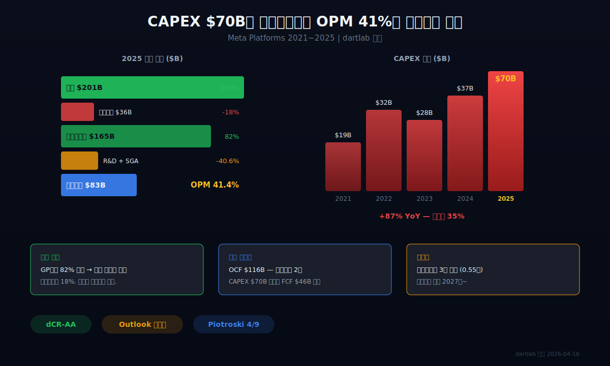
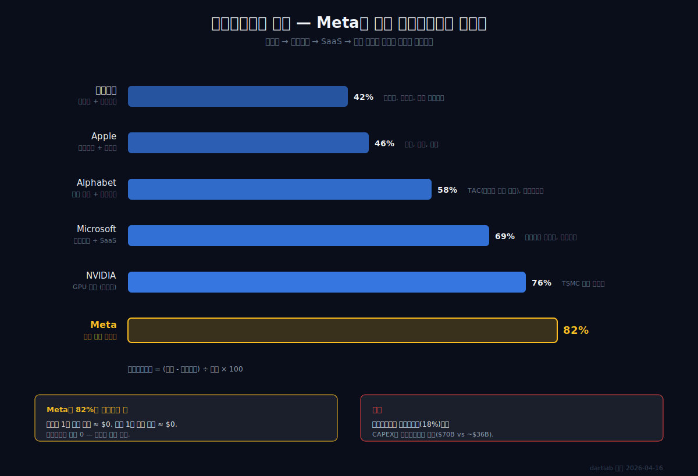
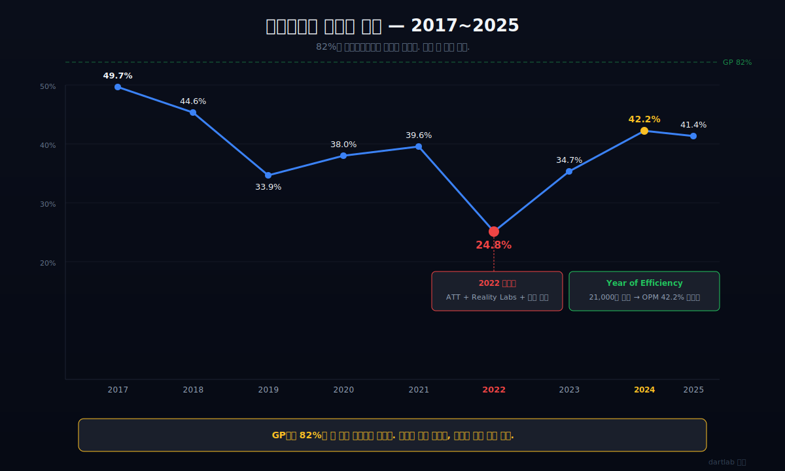
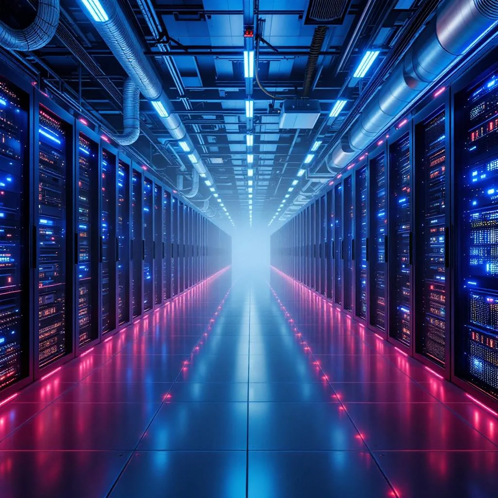
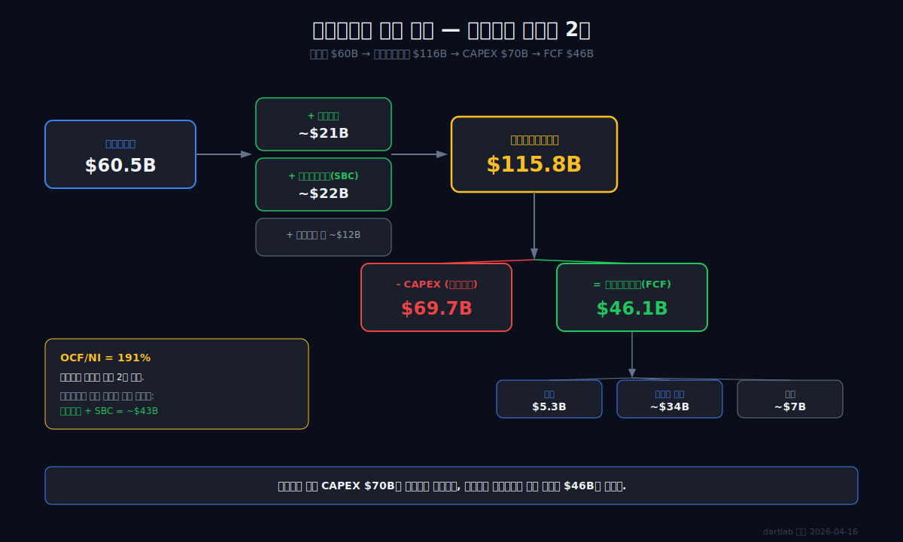
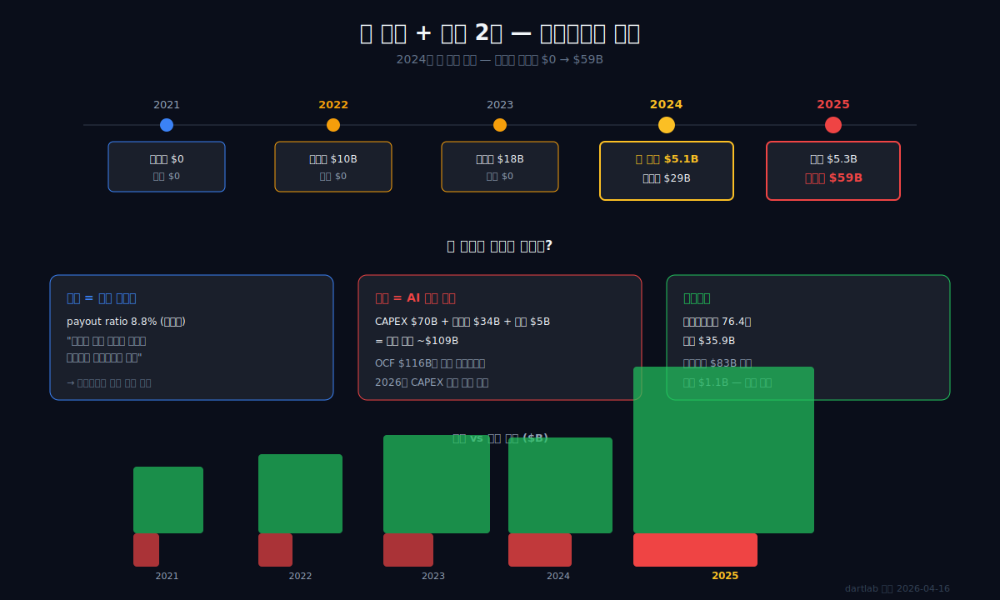
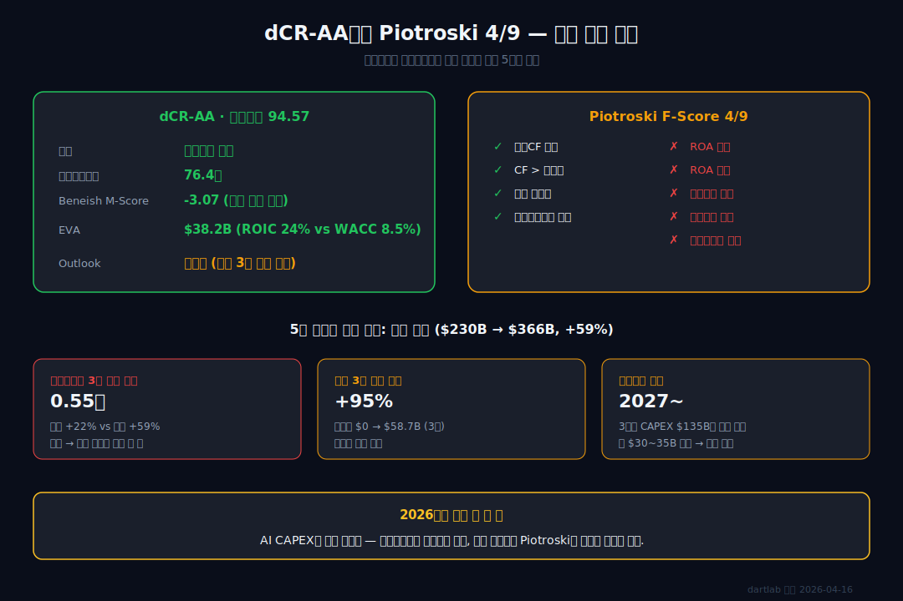

<script>
import ComboChart from '$lib/components/blog/ComboChart.svelte';
import StackBar from '$lib/components/blog/StackBar.svelte';
import HFDataLink from '$lib/components/blog/HFDataLink.svelte';
</script>

> **위기 탈출 + 성장** | IT > 광고 플랫폼 | 2026-04-16 dartlab 실측
> 데이터: dartlab 2017 ~ 2025 | 엔진: analysis + credit + valuation
> [기업이야기 시리즈 전체](/blog/series/company-reports)

<HFDataLink code="META" kind="edgar" />

---

2025년, Meta Platforms의 매출은 $201B(약 296조원). 전 세계 인구 39억 명이 매달 Facebook, Instagram, WhatsApp 중 하나를 연다. 이 회사의 매출원가율은 18%다. 공장도 원재료도 없다. 광고주가 돈을 내고, 서버가 광고를 보여주고, 그 사이에 남는 돈이 82%다.

그런데 이 회사는 2025년에 CAPEX(설비투자)로 $69.7B(약 102조원)을 썼다. 매출의 35%다. 삼성전자의 연간 설비투자가 약 53조원이다. Meta는 그보다 많은 돈을 AI 데이터센터에 쏟아부었다. 공장이 없는 회사가 왜 제조업보다 많은 설비투자를 하는가? 그러면서 영업이익률 41%를 어떻게 유지하는가?

이것이 이 글의 질문이다.

```python
import dartlab
c = dartlab.Company("META")
c.analysis("financial", "수익성")
# marginWaterfall: GP마진 82.0%, OPM 41.4%
# marginDriver: "높은 가격결정력 (매출총이익률 > 40%)"
```

---



---

## 제1막: 매출원가 18% — 광고 플랫폼이란 무엇인가


### 왜 이 회사의 매출총이익률은 82%인가

Meta의 수익 구조는 단순하다. 광고주가 돈을 낸다. Meta는 39억 명의 사용자 데이터를 기반으로 광고를 보여준다. 그 사이에 공장, 원재료, 재고가 없다.

매출총이익률(매출에서 매출원가를 뺀 비율, 얼마나 남기는지 보여주는 지표) 82%는 9년 동안 거의 변하지 않았다.

| 항목 ($B, 1년치 합산) | 2025 | 2024 | 2023 | 2022 | 2021 |
|---|---:|---:|---:|---:|---:|
| 매출액 | **201.0** | 164.5 | 134.9 | 116.6 | 117.9 |
| 매출원가 | 36.2 | 30.2 | 25.2 | 25.2 | 22.6 |
| 매출총이익 | **164.8** | 134.3 | 109.7 | 91.4 | 95.3 |
| 영업이익 | **83.3** | 69.4 | 46.8 | 28.9 | 46.8 |
| 당기순이익 | 60.5 | **62.4** | 39.1 | 23.2 | 39.4 |

**2025년 매출 $201B은 사상 최대.** 2021년 대비 70% 성장. 하지만 당기순이익은 2024년($62.4B)보다 오히려 줄었다($60.5B). 이 모순은 4막에서 풀린다.

<ComboChart data={[{year:"2021",매출액:117.9,영업이익:46.8,당기순이익:39.4},{year:"2022",매출액:116.6,영업이익:28.9,당기순이익:23.2},{year:"2023",매출액:134.9,영업이익:46.8,당기순이익:39.1},{year:"2024",매출액:164.5,영업이익:69.4,당기순이익:62.4},{year:"2025",매출액:201.0,영업이익:83.3,당기순이익:60.5}]} lineKeys={["매출액"]} barKeys={["영업이익","당기순이익"]} lineColors={["#22c55e"]} barColors={["#3b82f6","#f59e0b"]} title="매출(라인) vs 영업이익·당기순이익(막대)" unit="$B" />

### 매출원가 18%의 정체

Meta의 매출원가는 대부분 데이터센터 운영비(전기, 냉각, 서버 유지), 콘텐츠 검토 비용, 트래픽 확보 비용이다. 제조업의 원재료·인건비가 아니라 인프라 유지비다.

이 구조의 핵심은 **한계비용이 거의 0**이라는 것이다. 사용자가 1명 늘어도 광고 1건이 늘어도 추가 비용이 거의 들지 않는다. 그래서 매출이 $117B에서 $201B로 70% 늘어나는 동안 매출원가는 $22.6B에서 $36.2B로 비율이 거의 변하지 않았다.

```python
prof = c.analysis("financial", "수익성")
prof["marginWaterfall"]["history"][0]
# {"period": "2025", "steps": [{"label": "매출", "pct": 100.0},
#   {"label": "매출원가", "pct": -18.0}, {"label": "매출총이익", "pct": 82.0}, ...]}
```



### 비교: 제조업과 소프트웨어 사이

| 회사 | 매출총이익률 | 매출원가의 성격 |
|---|---:|---|
| 삼성전자 | ~42% | 반도체 웨이퍼, 장비 감가상각 |
| Apple | ~46% | 부품, 조립, 물류 |
| Microsoft | ~69% | 클라우드 인프라, 라이선스 |
| **Meta** | **82%** | 데이터센터 운영, 콘텐츠 검토 |

Meta의 82%는 순수 소프트웨어 회사에 가깝다. 그런데 이 회사는 2025년에 삼성전자보다 많은 설비투자를 했다. 매출원가는 소프트웨어인데 투자는 제조업이다. 이 모순이 3막에서 풀린다. 매출총이익률의 의미가 궁금하다면 [숫자 뒤 맥락 읽기](/blog/beyond-the-numbers) 시리즈를 참고하라.

**1막의 결론: 82%의 매출총이익률은 Meta의 모든 전략을 가능하게 하는 기반이다. 이 마진이 2022년의 추락에서 살아남고, AI에 올인할 수 있는 이유다.**

---

## 제2막: 2022년 추락 — OPM 25%에서 무슨 일이 있었나



### 왜 82%의 마진을 가진 회사가 추락했는가

2021년은 Meta의 정점이었다. 매출 $117.9B, 영업이익률 39.6%. 그리고 2021년 10월, 마크 저커버그는 회사 이름을 Facebook에서 Meta로 바꿨다. 메타버스에 올인하겠다는 선언이었다.

2022년, 세 가지가 동시에 터졌다.

### Apple의 ATT — 광고 정밀도 타격

2021년 4월, Apple은 iOS 14.5부터 앱 추적 투명성(ATT, App Tracking Transparency)을 시행했다. 사용자가 추적을 거부하면 앱이 행동 데이터를 수집할 수 없다. 70% 이상의 사용자가 거부를 선택했다([Financial Times, 2022](https://www.ft.com/content/4c19e387-ee1a-41d8-8dd2-bc6c302ee58e)).

Meta의 광고는 정밀 타겟팅이 핵심이다. 사용자의 검색, 클릭, 구매 이력을 추적해서 가장 효과적인 광고를 보여준다. ATT는 이 데이터 파이프라인을 끊었다. Meta는 2022년에 ATT로 인한 매출 손실을 약 $10B로 추산했다([Meta Earnings Call Q4 2021](https://investor.fb.com/)).

### Reality Labs — 연간 적자 $13.7B

메타버스 사업부 Reality Labs는 2022년에 매출 $2.2B, 영업손실 $13.7B를 기록했다([Meta 10-K, 2022](https://www.sec.gov/cgi-bin/browse-edgar?action=getcompany&CIK=0001326801&type=10-K)). 매출의 6배를 적자로 태웠다. VR 헤드셋 Quest 판매량은 기대에 못 미쳤고, 메타버스 플랫폼 Horizon Worlds의 월간 활성 이용자는 30만 명 미만이었다.

### 과잉 채용의 대가

2019년 말 44,942명이던 직원 수가 2022년 말 86,482명으로 두 배가 됐다([Meta 10-K, 2019-2022](https://www.sec.gov/cgi-bin/browse-edgar?action=getcompany&CIK=0001326801&type=10-K)). 영업비용 중 판매비와관리비(SGA) 비율은 올라가지 않았지만, R&D 비용(주로 Reality Labs 포함)이 매출 대비 30%를 넘겼다.

결과: 2022년 영업이익률(매출 대비 영업이익 비율) 24.8%. 주가는 연초 대비 -64%. [EDGAR에서 이런 세그먼트 정보를 찾는 법](/blog/everything-about-edgar)은 EDGAR 실전 입문 시리즈에서 다뤘다.

### Year of Efficiency — 21,000명 해고


2023년 3월, 저커버그는 "Year of Efficiency"를 선언했다. 2022년 11월 11,000명, 2023년 3월 10,000명, 총 21,000명을 해고했다. 직원 수는 86,482명에서 67,317명으로 줄었다.

```python
cost = c.analysis("financial", "비용구조")
cost["costBreakdown"]["history"][0]
# {"period": "2025", "costOfSalesRatio": 18.0, "sgaRatio": 5.97, "operatingCostRatio": 23.97}
# 2022: sgaRatio 8.6% → 2025: 6.0%
```

결과는 극적이었다.

| 연도 | 영업이익률 | 매출 YoY | 직원 수 |
|---|---:|---:|---:|
| 2021 | 39.6% | +37% | 71,970 |
| 2022 | **24.8%** | -1% | 86,482 |
| 2023 | 34.7% | +16% | 67,317 |
| 2024 | **42.2%** | +22% | 72,404 |
| 2025 | 41.4% | +22% | 74,067 |

**2024년 영업이익률 42.2%는 Meta 역사상 최고치다.** 2022년 바닥(24.8%)에서 17.4%포인트 올랐다. 매출이 $116.6B에서 $164.5B로 늘어나는 동안 비용 구조를 근본적으로 바꾼 것이다.

2025년 41.4%로 소폭 하락한 이유가 있다. 3막에서 풀린다.

**2막의 결론: 2022년 추락의 본질은 마진이 무너진 게 아니라 비용이 비대해진 것이다. 1막의 82% 매출총이익률은 변하지 않았다. 비용을 잘라내자 마진이 돌아왔다. 하지만 저커버그는 비용을 자른 바로 그해에 새로운 대규모 투자를 시작했다.**

---

## 제3막: CAPEX $70B의 행방 — 돈은 어디로 가는가

### 왜 비용을 줄인 회사가 다시 대규모 투자를 시작했나

Year of Efficiency로 인건비를 줄인 저커버그는 2023년 하반기부터 AI 인프라 투자를 급격히 늘렸다. 2024년 1월 실적 발표에서 그는 "2024년이 AI의 해"라고 선언했다.

```python
inv = c.analysis("financial", "투자효율")
inv["investmentIntensity"]["history"][0]
# {"period": "2025", "capex": 69691000000.0, "revenue": 200966000000.0,
#  "capexToRevenue": 34.68}
```

| 항목 ($B) | 2025 | 2024 | 2023 | 2022 | 2021 |
|---|---:|---:|---:|---:|---:|
| CAPEX | **69.7** | 37.3 | 28.1 | 32.0 | 19.2 |
| CAPEX/매출 | **34.7%** | 22.6% | 20.8% | 27.4% | 16.3% |
| 영업활동현금흐름 | **115.8** | 91.3 | 71.1 | 50.5 | 57.7 |
| 잉여현금흐름(FCF) | **46.1** | 54.1 | 43.0 | 18.5 | 38.5 |

**2025년 CAPEX $69.7B.** 2024년 대비 +87%. 1년 만에 거의 두 배다. 매출 대비 비율도 22.6%에서 34.7%로 급등했다.

### 돈은 어디로 갔나



2025년 1월 실적 컨퍼런스콜. 저커버그가 슬라이드를 넘기며 말했다. "우리는 올해 말까지 130만 GPU 이상을 운영할 것이다." 회의실은 잠시 조용해졌다. 130만 대의 GPU. NVIDIA H100 한 대 가격이 $25,000~$40,000이다. GPU만으로 수백억 달러다.

Meta의 10-K에 따르면 CAPEX의 대부분은 AI 학습·추론용 GPU 데이터센터, 네트워크 인프라, 서버 장비에 투입됐다([Meta 10-K, 2025](https://www.sec.gov/cgi-bin/browse-edgar?action=getcompany&CIK=0001326801&type=10-K)). 구체적으로:

1. **AI 데이터센터**: NVIDIA H100/B200 GPU 클러스터, Llama 모델 학습·추론 인프라.
2. **네트워크 인프라**: 데이터센터 간 고속 연결, 해저 케이블.
3. **Reality Labs**: VR/AR 하드웨어 R&D 및 생산 설비.

### 삼성전자보다 많은 설비투자

$69.7B는 원화로 약 102조원이다. 삼성전자의 2025년 설비투자가 약 53조원이다. 반도체 공장을 짓는 회사보다 광고 회사가 설비투자를 더 많이 한다. 이것이 2025년 빅테크의 현실이다.

그런데 놀라운 것은 이 투자에도 불구하고 FCF(잉여현금흐름, 영업현금흐름에서 설비투자를 뺀 진짜 남는 돈)가 $46.1B라는 것이다. 줄었지만 여전히 양수다. 매출의 23%가 투자 후에도 남는다. 어떻게 가능한가? 4막에서 풀린다.

**3막의 결론: Meta는 2023~2025년 3년간 CAPEX로 총 $135B(약 198조원)을 AI 인프라에 투입했다. 이 투자가 감가상각으로 돌아올 때 — 대략 2027년부터 — 이익을 압박하기 시작한다. 1막의 82% 마진이 이 충격을 얼마나 흡수할 수 있는지가 Meta의 다음 3년을 결정한다.**

---

## 제4막: 현금흐름의 이중 구조 — 이익보다 현금이 2배인 회사



### 왜 순이익 $60B인 회사가 현금 $116B를 벌었나

2025년 Meta의 당기순이익은 $60.5B다. 그런데 영업활동현금흐름(실제 장사해서 들어온 현금)은 $115.8B다. 순이익의 1.9배다.

```python
cf = c.analysis("financial", "현금흐름")
cf["cashQuality"]
# {"period": "2025", "ocf": 115800000000.0, "netIncome": 60458000000.0,
#  "ocfToNi": 191.5, "ocfMargin": 57.6}
```

dartlab은 이것을 **"IS-CF 괴리 -92%"**라고 표시한다. 이익보다 현금이 92% 더 많다는 뜻이다.

### 괴리의 정체: 감가상각과 주식보상비용

현금흐름표에서 순이익을 영업현금흐름으로 조정할 때, 두 가지 큰 항목이 더해진다.

1. **감가상각비(과거에 산 설비 값을 매년 조금씩 비용으로 깎는 것)**: 3막에서 본 CAPEX $70B의 누적분이 매년 감가상각으로 돌아온다. 이것은 비용이지만 현금 유출이 아니다. 이미 3막에서 돈을 냈기 때문이다. Meta의 2025년 감가상각비는 약 $21.4B다([Meta 10-K, 2025 Cash Flow Statement](https://www.sec.gov/cgi-bin/browse-edgar?action=getcompany&CIK=0001326801&type=10-K)).

2. **주식보상비용(SBC, Stock-Based Compensation)**: Meta는 직원에게 급여의 상당 부분을 주식으로 지급한다. 이것은 비용으로 잡히지만 현금이 나가지 않는다. 2025년 SBC는 $22.1B다([Meta 10-K, 2025](https://www.sec.gov/cgi-bin/browse-edgar?action=getcompany&CIK=0001326801&type=10-K)).

이 두 항목만 합치면 $43.5B다. 순이익 $60.5B에 이 금액을 더하면 영업현금흐름 $115.8B에 근접한다. [설비투자와 감가상각의 관계](/blog/capacity-utilization-capex)에서 이 메커니즘을 더 자세히 다뤘다.

### 이것이 왜 중요한가

**현금흐름이 이익보다 훨씬 크다는 것은, 이 회사가 보고하는 이익보다 훨씬 많은 돈을 쓸 수 있다는 뜻이다.** 3막의 CAPEX $70B가 가능한 이유가 여기 있다. 순이익만 보면 투자 후 적자처럼 보이지만, 실제 현금 기준으로는 투자 후에도 $46B가 남는다.

| 항목 ($B, 1년치 합산) | 2025 | 2024 | 2023 | 2022 | 2021 |
|---|---:|---:|---:|---:|---:|
| 당기순이익 | 60.5 | 62.4 | 39.1 | 23.2 | 39.4 |
| 영업활동현금흐름 | **115.8** | 91.3 | 71.1 | 50.5 | 57.7 |
| OCF/NI | **191%** | 146% | 182% | 218% | 147% |
| CAPEX | 69.7 | 37.3 | 28.1 | 32.0 | 19.2 |
| 잉여현금흐름(FCF) | 46.1 | 54.1 | 43.0 | 18.5 | 38.5 |

### 2025년 순이익이 줄어든 진짜 이유

1막에서 매출은 +22% 성장했는데 순이익은 -3% 감소한 모순을 남겨 뒀다. 원인은 두 가지다.

핵심 원인은 **세금**이다. 2025년 유효세율(실제 낸 세금 비율)이 29.6%로 2024년(12.5%)보다 17%포인트 올랐다. 세전이익 $85.9B 기준으로 세율 차이만 약 $14.6B — 이것 하나로 순이익 감소를 거의 설명할 수 있다. 이연법인세 자산의 재평가와 글로벌 최저한세(Pillar Two) 영향이 겹쳤다.

R&D 비용 증가도 있지만 부차적이다. AI 모델 학습에 투입되는 연구개발비는 CAPEX가 아니라 비용으로 처리된다. GPU 구매는 CAPEX지만, 그 GPU를 돌려서 Llama 모델을 학습시키는 비용(전기, 인건비)은 R&D 비용이다. 현금흐름과 세금의 관계가 궁금하다면 [영업활동현금흐름 vs 당기순이익](/blog/operating-cash-flow-vs-net-income)에서 더 자세히 다뤘다.

**4막의 결론: Meta의 진짜 수익력은 순이익이 아니라 현금흐름에 있다. OCF $115.8B는 3막의 $70B 투자를 감당하고도 $46B가 남는 구조를 만든다. 이 현금흐름 여력이 5막의 자본배분 결정을 가능하게 한다.**

---

## 제5막: 첫 배당 + 부채 2배 — 자본배분의 모순



### 왜 배당을 시작하면서 동시에 부채를 두 배로 늘렸나

2024년 2월, Meta는 창사 이래 처음으로 분기 배당금을 선언했다. 주당 $0.50. 연간 총 $5.1B. 순이익의 8.1%에 해당하는 배당성향(순이익 대비 배당금 비율)이다.

```python
ca = c.analysis("financial", "자본배분")
ca["dividendPolicy"]["history"][0]
# {"period": "2025", "dividendsPaid": 5324000000.0, "netIncome": 60458000000.0,
#  "payoutRatio": 8.81, "dividendGrowth": 4.97}
```

같은 시기에 Meta는 대규모 채권 발행을 시작했다. 2023년까지 총차입금(빌린 돈 전체) $0이던 회사가 2025년에 $58.7B의 차입금을 보유하게 됐다.

| 항목 ($B, Q4 스냅샷) | 2025 | 2024 | 2023 | 2022 | 2021 |
|---|---:|---:|---:|---:|---:|
| 자산총계 | **366.0** | 229.6 | 185.7 | 166.0 | 159.3 |
| 부채총계 | **148.8** | 76.5 | 60.0 | 41.1 | 31.0 |
| 자본총계 | **217.2** | 124.9 | 128.3 | 101.1 | 84.1 |
| 현금 | 35.9 | 14.7 | 16.6 | 17.6 | 19.1 |
| 총차입금 | **58.7** | 28.8 | 18.4 | 10.0 | 0 |

<StackBar data={[{year:"2021",segments:[{label:"자본",value:84.1,color:"#22c55e"},{label:"부채",value:31.0,color:"#ef4444"}]},{year:"2022",segments:[{label:"자본",value:101.1,color:"#22c55e"},{label:"부채",value:41.1,color:"#ef4444"}]},{year:"2023",segments:[{label:"자본",value:128.3,color:"#22c55e"},{label:"부채",value:60.0,color:"#ef4444"}]},{year:"2024",segments:[{label:"자본",value:124.9,color:"#22c55e"},{label:"부채",value:76.5,color:"#ef4444"}]},{year:"2025",segments:[{label:"자본",value:217.2,color:"#22c55e"},{label:"부채",value:148.8,color:"#ef4444"}]}]} title="자본 vs 부채 추이" unit="$B" />

### 총자산 1년에 +59%

2025년 총자산 $366B은 2024년 $230B 대비 +59%다. 1년 만에 자산이 $136B 늘었다. 이 증가분의 대부분은 3막에서 본 CAPEX가 만든 유형자산(서버, 건물, 토지)이다. 동시에 차입금도 $29B에서 $59B로 두 배가 됐다.

### 무차입 경영을 버린 이유

Meta가 빚을 낸 이유는 단순하다. **AI 투자 계획이 영업현금흐름을 초과하기 시작했기 때문이다.** 2025년 기준:

- 영업현금흐름: $115.8B
- CAPEX: $69.7B
- 배당: $5.3B
- 자사주 매입: 지속 진행 (10-K 기준 2025년 약 $34B, [Meta 10-K, 2025](https://www.sec.gov/cgi-bin/browse-edgar?action=getcompany&CIK=0001326801&type=10-K))
- 합계 필요 자금: 약 $109B

영업현금흐름으로 거의 커버되지만, 여유가 $7B밖에 없다. 2026년에 CAPEX가 더 늘어날 것을 감안하면 차입금이 필요해진다.

```python
st = c.analysis("financial", "안정성")
st["stabilityFlags"]
# {"flags": ["부채 3기 연속 증가 (최근 +95%)"]}
```

### 배당은 왜 시작했나

배당성향 8.8%는 상징적 수준이다. $5.3B는 FCF $46.1B의 11.5%에 불과하다. 이 배당의 의미는 금액이 아니라 **시그널**이다. "우리는 이제 성장만 하는 회사가 아니라 주주에게 돌려주는 회사이기도 하다."

기관투자자 입장에서 배당은 포트폴리오 편입의 기준 중 하나다. 배당 시작은 Meta가 성장주에서 성숙주로 이행하는 첫 신호다.

### 하지만 이자보상배율은 76배

```python
st["interestBurden"]
# {"metrics": [["이자보상배율", "76.4배 — 우수"]]}
```

부채가 두 배 늘었지만, 영업이익 $83.3B 대비 이자비용은 약 $1.1B에 불과하다. 이자보상배율(영업이익으로 이자를 몇 번 갚을 수 있는지) 76.4배. 빚의 절대 규모는 커졌지만, 이 회사의 수익력 대비로는 아직 안전하다.

**5막의 결론: Meta는 무차입 경영을 버리고 레버리지를 수용했다. 배당 시작 + 부채 확대 + AI 투자 가속이 동시에 진행 중이다. 1막의 82% 마진이 이 모든 것을 가능하게 하지만, 부채 확대 속도가 수익 성장 속도보다 빠르다. 이것이 6막의 리스크로 이어진다.**

---

## 제6막: dCR-AA인데 Piotroski 4점 — 다음에 봐야 할 것



### 왜 최우량 등급인데 경고 신호가 나오는가

```python
cr = c.credit("등급")
# {"grade": "dCR-AA", "healthScore": 94.57, "outlook": "부정적",
#  "score": 5.43, "eCR": "eCR-1"}
```

dartlab 신용등급 dCR-AA, 건강점수 94.57. 투자적격 상위. 하지만 **outlook이 "부정적"**이다. 부채 3기 연속 증가가 원인이다.

Piotroski F-Score(재무 건전성을 9가지 기준으로 평가하는 지표)는 4/9. 5개 항목에서 실패했다.

```python
overall = c.analysis("financial", "종합평가")
overall["piotroski"]
# {"total": 4, "items": [
#   {"signal": "ROA 양수", "pass": false},
#   {"signal": "영업CF 양수", "pass": true},
#   {"signal": "ROA 개선", "pass": false},
#   {"signal": "CF > 순이익", "pass": true},
#   {"signal": "장기부채 감소", "pass": false},
#   {"signal": "유동비율 개선", "pass": false},
#   {"signal": "주식 미발행", "pass": true},
#   {"signal": "매출총이익률 개선", "pass": true},
#   {"signal": "자산회전율 개선", "pass": false}]}
```

### 5개 실패 항목이 말하는 것

| 실패 항목 | 원인 | 심각도 |
|---|---|---|
| ROA 양수 | 총자산 급증($366B)으로 ROA 분모 폭발 | 낮음 — 수익력 아닌 자산 구조 문제 |
| ROA 개선 | 같은 이유 — 자산 증가 속도 > 이익 증가 속도 | 낮음 |
| 장기부채 감소 | 5막: 차입금 $29B → $59B | 중간 — 의도적이나 추세 관찰 필요 |
| 유동비율 개선 | 현금 증가보다 유동부채 증가가 더 빠름 | 낮음 |
| **자산회전율 개선** | **총자산회전율 3기 연속 하락 (0.55회)** | **높음 — 투자 효율 하락의 구조적 신호** |

dartlab 종합평가의 summaryFlags가 정확히 이것을 짚는다.

```python
overall["summaryFlags"]
# ["진성 고수익 (ROE 27.8%, 낮은 레버리지)",
#  "매출 고성장 (22.2%)",
#  "부채 3기 연속 증가 (최근 +95%)",
#  "총자산회전율 3기 연속 하락 (0.55회)",
#  "IS-CF 괴리 -92% — 순이익 대비 현금흐름 극심한 차이"]
```

### 자산회전율 3기 연속 하락이 의미하는 것

총자산회전율(매출 ÷ 총자산, 자산 1달러가 얼마의 매출을 만드는지)이 3년 연속 떨어지고 있다. 2023년 0.73 → 2024년 0.72 → 2025년 0.55. **자산은 59% 늘었는데 매출은 22% 늘었다.** 투자한 자산이 아직 매출로 전환되지 않고 있다는 뜻이다.

3막의 AI 데이터센터 CAPEX가 매출로 전환되려면 — AI 기반 광고 수익 증가, Llama API 수익화, Reality Labs 수익화 — 시간이 필요하다. 이 시간 동안 감가상각비는 계속 쌓인다.

### 감가상각 폭탄 — 2027년부터

2023~2025년 3년간 투입된 CAPEX $135B의 감가상각이 본격적으로 이익을 압박하는 시점은 2027년경이다. 서버 내용연수를 4~5년으로 가정하면, 2023년 투자분이 2027~2028년에 감가상각 피크를 맞는다.

2025년 감가상각 추정 $19~22B가 2027년에 $30~35B로 늘어날 수 있다. 이것이 매출 성장으로 상쇄되지 않으면, 1막의 82% 매출총이익률이 AI 인프라 감가상각을 감당해야 한다.

### DCF가 말하는 가치

```python
val = c.analysis("가치평가")
val["dcfValuation"]
# {"enterpriseValue": 1044813399591, "discountRate": 8.51,
#  "growthRateInitial": 15.0, "terminalGrowth": 3.0}
```

dartlab dFV(dartlab Fair Value)의 DCF 모델은 기업가치 $1.04T, WACC(가중평균자본비용) 8.51%, 초기 성장률 15%, 영구 성장률 3%를 산출한다. 2026년 4월 Meta의 시가총액은 약 $1.5T다. DCF 기준으로 30~40% 프리미엄이 붙어 있다. 이 프리미엄은 "AI 투자가 매출로 전환될 것"이라는 시장의 기대치다.

### Beneish M-Score: 분식 위험은 낮다

```python
eq = c.analysis("financial", "이익품질")
eq["qualityAnomalies"]
# {"score": 100, "beneish": {"mScore": -3.07, "zone": "low_risk"}}
```

이익품질 점수 100, Beneish M-Score(재무제표 조작 가능성을 측정하는 지표) -3.07로 조작 위험 최저 구간이다. 숫자 자체의 신뢰도는 높다. [감사보고서와 핵심감사사항](/blog/audit-report-and-kam)에서 이런 분식 탐지 지표를 더 자세히 다뤘다.

### 2026년에 봐야 할 한 줄

**"AI CAPEX의 매출 전환율."** 2025년에 $70B를 투자했다. 2026~2027년에 이 투자가 만드는 매출 증분이 감가상각 증분을 초과하는지가 핵심이다. 초과하면 ROIC(투하자본수익률, 투자한 돈이 얼마나 벌어오는지) 24%가 유지된다. 못 하면 Piotroski의 경고가 현실이 된다.

```python
inv = c.analysis("financial", "투자효율")
inv["evaTimeline"]["history"][0]
# {"period": "2025", "nopat": 58589354466, "investedCapital": 240114000000,
#  "nopatReturn": 24.4, "waccEstimate": 8.51, "eva": 38155653066}
```

EVA(경제적부가가치, 투자자본 대비 자본비용을 초과하는 이익) $38.2B. ROIC 24.4% vs WACC 8.51%. Spread +15.9%포인트. 자본이 두 배 늘었는데도 아직 가치를 창출하고 있다. 이 spread가 줄어드는 속도가 Meta의 다음 3년을 결정한다.

---

## 부록: 재무제표 5년

### 손익계산서 ($B, 1년치 합산)

| 항목 | 2025 | 2024 | 2023 | 2022 | 2021 |
|---|---:|---:|---:|---:|---:|
| 매출액 | **201.0** | 164.5 | 134.9 | 116.6 | 117.9 |
| 매출원가 | 36.2 | 30.2 | 25.2 | 25.2 | 22.6 |
| 매출총이익 | 164.8 | 134.3 | 109.7 | 91.4 | 95.3 |
| 영업이익 | **83.3** | 69.4 | 46.8 | 28.9 | 46.8 |
| 당기순이익 | 60.5 | **62.4** | 39.1 | 23.2 | 39.4 |

### 재무상태표 ($B, Q4 스냅샷)

| 항목 | 2025 | 2024 | 2023 | 2022 | 2021 |
|---|---:|---:|---:|---:|---:|
| 자산총계 | **366.0** | 229.6 | 185.7 | 166.0 | 159.3 |
| 부채총계 | 148.8 | 76.5 | 60.0 | 41.1 | 31.0 |
| 자본총계 | **217.2** | 124.9 | 128.3 | 101.1 | 84.1 |
| 현금 | 35.9 | 14.7 | 16.6 | 17.6 | 19.1 |
| 총차입금 | 58.7 | 28.8 | 18.4 | 10.0 | 0 |

### 현금흐름표 ($B, 1년치 합산)

| 항목 | 2025 | 2024 | 2023 | 2022 | 2021 |
|---|---:|---:|---:|---:|---:|
| 영업활동현금흐름 | **115.8** | 91.3 | 71.1 | 50.5 | 57.7 |
| CAPEX | 69.7 | 37.3 | 28.1 | 32.0 | 19.2 |
| 잉여현금흐름(FCF) | 46.1 | 54.1 | 43.0 | 18.5 | 38.5 |
| 배당금 | 5.3 | 5.1 | 0 | 0 | 0 |

---

### 검증표

| 본문 수치 | dartlab 호출 | 결과 |
|---|---|---|
| 2025 매출 $201.0B | `c.select("IS",["매출액"])` 분기 합산 | 실측 200,966M |
| 2025 영업이익 $83.3B | `c.select("IS",["영업이익"])` 분기 합산 | 실측 83,276M |
| 2025 당기순이익 $60.5B | `c.select("IS",["당기순이익"])` 분기 합산 | 실측 60,458M |
| 2025 OCF $115.8B | `c.select("CF",["영업활동현금흐름"])` 분기 합산 | 실측 115,800M |
| 2025 총자산 $366.0B | `c.select("BS",["자산총계"])` Q4 | 실측 366,021M |
| 2025 부채 $148.8B | `c.select("BS",["부채총계"])` Q4 | 실측 148,778M |
| 2025 자본 $217.2B | `c.select("BS",["자본총계"])` Q4 | 실측 217,243M |
| 2025 FCF $46.1B | `c.analysis("financial","현금흐름")["cashFlowOverview"]` | 실측 46,109M |
| 2025 CAPEX $69.7B | `c.analysis("financial","투자효율")["investmentIntensity"]` | 실측 69,691M |
| 2025 CAPEX/매출 34.7% | 같은 출처, capexToRevenue | 실측 34.68% |
| GP마진 82% | `c.analysis("financial","수익성")["marginWaterfall"]` | 실측 82.0% |
| OPM 41.4% | 같은 출처 | 실측 41.44% |
| OCF/NI 191% | `c.analysis("financial","현금흐름")["cashQuality"]` | 실측 191.5% |
| dCR-AA | `c.credit("등급")["grade"]` | 실측 dCR-AA |
| 건강점수 94.57 | `c.credit("등급")["healthScore"]` | 실측 94.57 |
| Piotroski 4/9 | `c.analysis("financial","종합평가")["piotroski"]` | 실측 4 |
| Beneish M -3.07 | `c.analysis("financial","이익품질")["qualityAnomalies"]` | 실측 -3.067 |
| ROIC 24.4% | `c.analysis("financial","투자효율")["evaTimeline"]` | 실측 24.4% |
| WACC 8.51% | `c.analysis("가치평가")["dcfValuation"]` | 실측 8.51% |
| EVA $38.2B | `c.analysis("financial","투자효율")["evaTimeline"]` | 실측 38,156M |
| DCF EV $1.04T | `c.analysis("가치평가")["dcfValuation"]` | 실측 1,044,813M |
| 배당 $5.3B | `c.analysis("financial","자본배분")["dividendPolicy"]` | 실측 5,324M |
| 이자보상배율 76.4배 | `c.analysis("financial","안정성")["interestBurden"]` | 실측 76.4배 |
| 차입금 $58.7B | `c.analysis("financial","안정성")["debtMaturity"]` | 실측 58,744M |
| 2024 당기순이익 $62.4B | `c.select("IS",["당기순이익"])` 분기 합산 | 실측 62,360M |
| 직원 수 86,482명(2022), 67,317명(2023), 74,067명(2025) | 외부: Meta 10-K 2022/2023/2025 | SEC 공시 |
| 감가상각 $21.4B (2025) | 외부: Meta 10-K 2025 CF D&A | SEC 공시 |
| SBC $22.1B (2025) | 외부: Meta 10-K 2025 CF SBC | SEC 공시 |
| ATT 매출 손실 ~$10B | 외부: Meta Earnings Call Q4 2021 | IR 발표 |
| Reality Labs 2022 적자 $13.7B | 외부: Meta 10-K 2022 segment | SEC 공시 |
| 자사주 매입 ~$34B (2025) | 외부: Meta 10-K 2025 | SEC 공시 |
