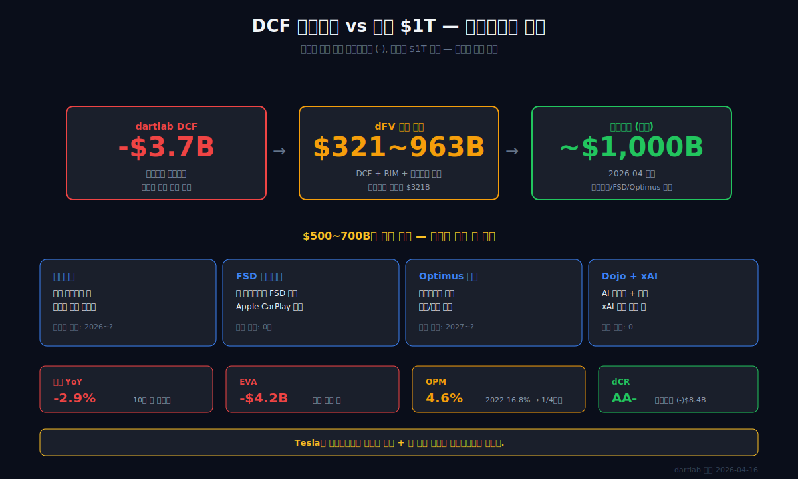
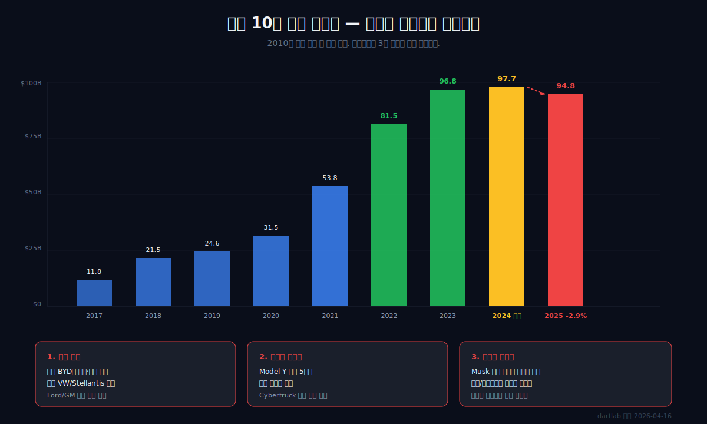
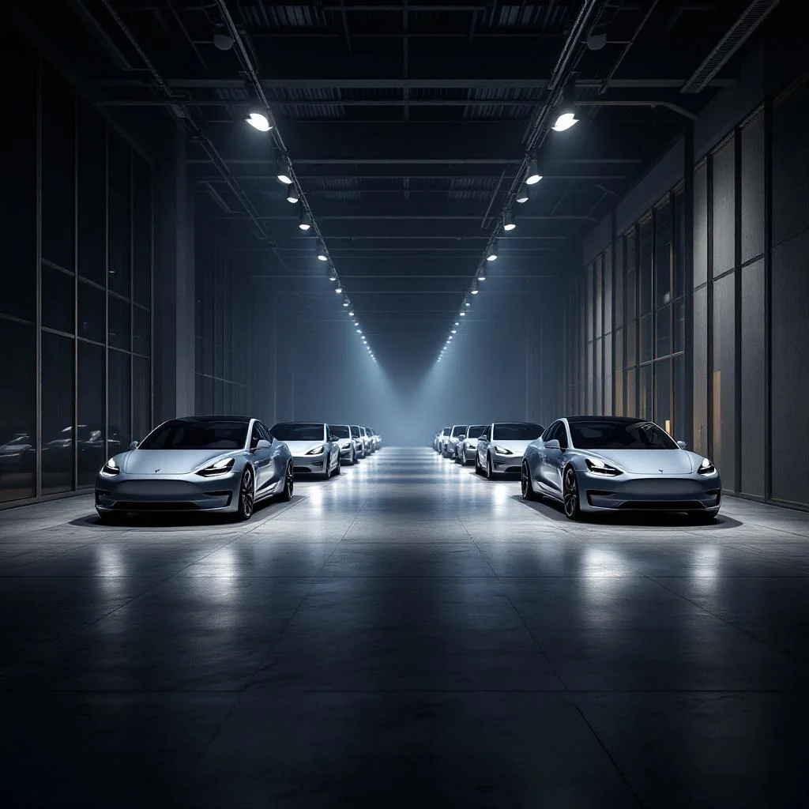
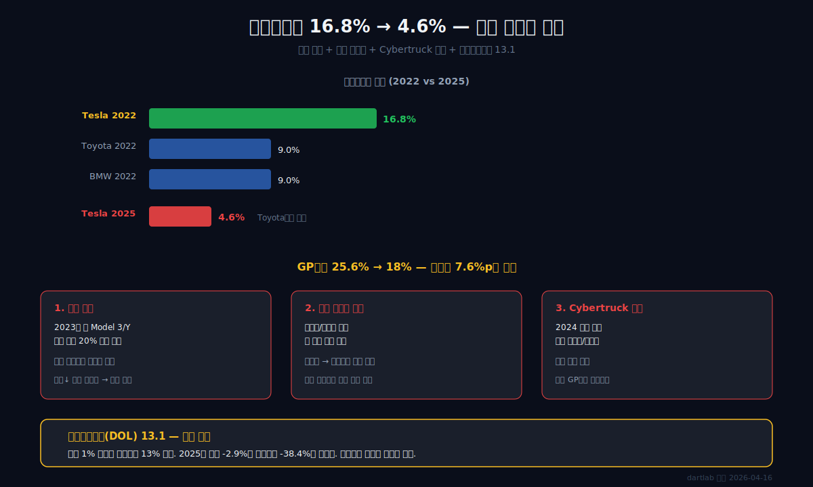
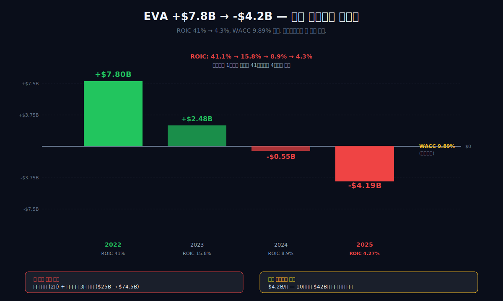
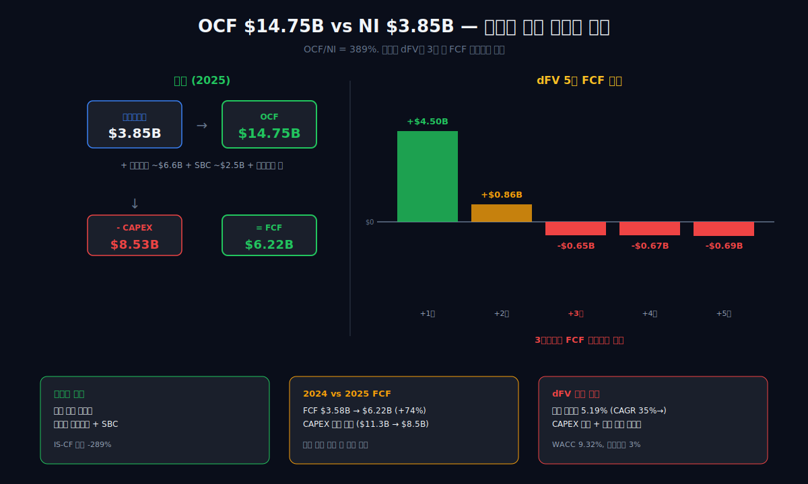
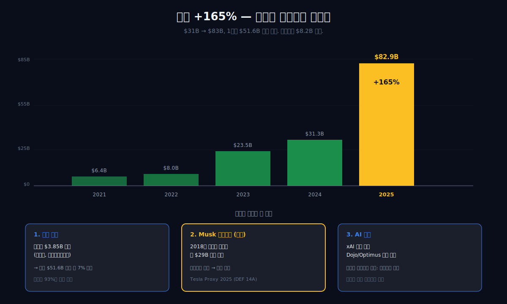
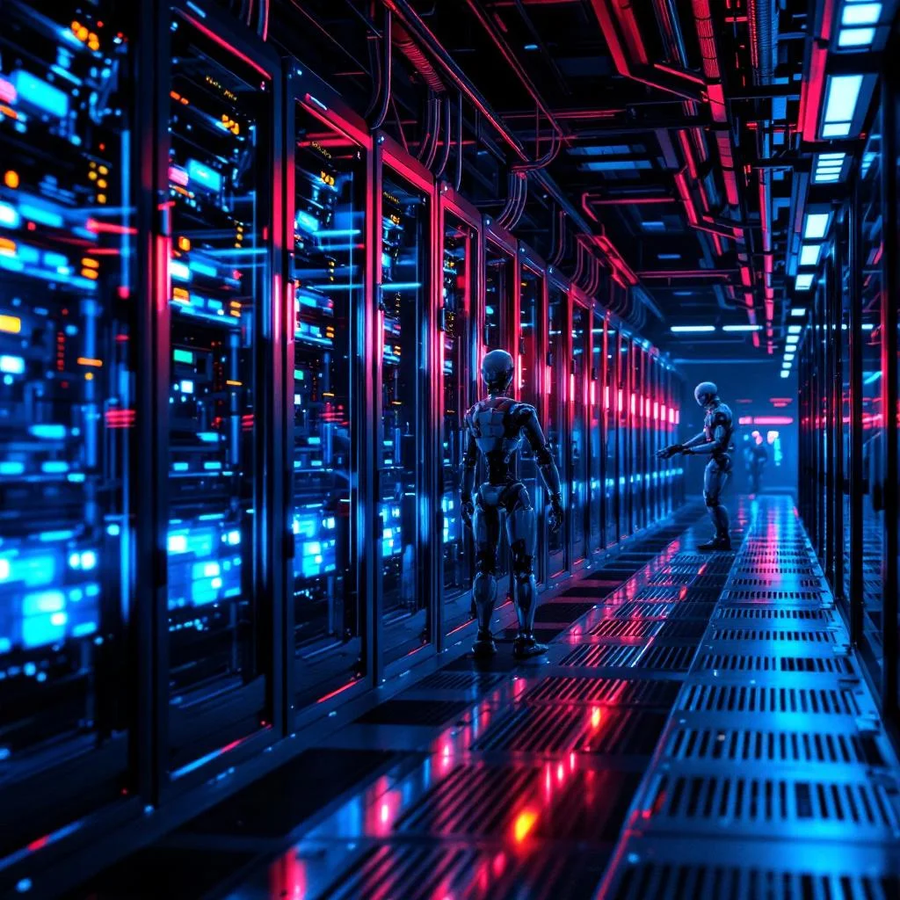
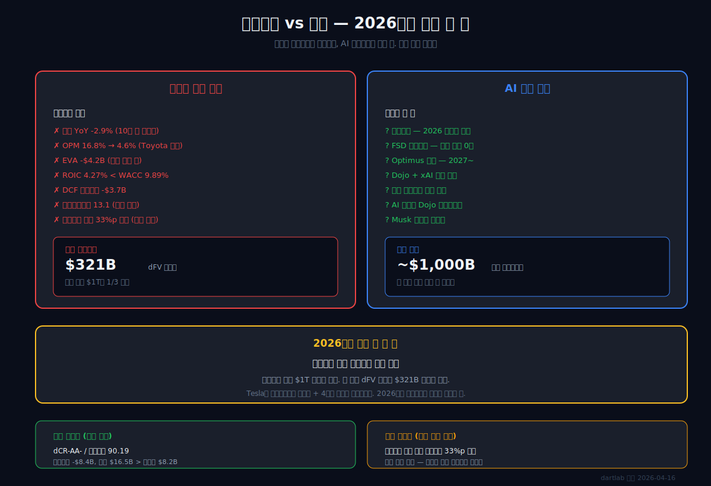
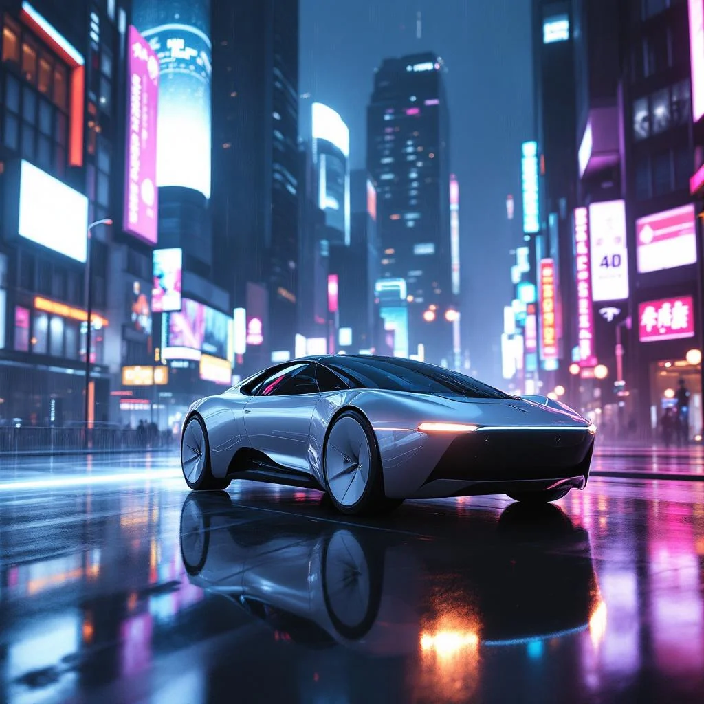

<script>
import ComboChart from '$lib/components/blog/ComboChart.svelte';
import StackBar from '$lib/components/blog/StackBar.svelte';
import HFDataLink from '$lib/components/blog/HFDataLink.svelte';
</script>

> **피크아웃 + 내러티브** | 소비재 > 전기차 | 2026-04-16 dartlab 실측
> 데이터: dartlab 2017 ~ 2025 | 엔진: analysis + credit + valuation(dFV v2)
> [기업이야기 시리즈 전체](/blog/series/company-reports)

<HFDataLink code="TSLA" kind="edgar" />

---

Tesla의 2025년 매출은 $94.83B. 전년 $97.69B 대비 **-2.9%**. 이 회사는 2010년 상장 이후 한 번도 매출이 감소한 적이 없다. 2025년이 **처음**이다. 영업이익은 2022년 $13.66B에서 2025년 $4.36B로 **68% 감소**했다. 영업이익률은 16.8%에서 4.6%로 떨어졌다.

dartlab 가치평가 엔진이 계산한 DCF 기업가치는 **마이너스 $3.7B**다. 자동차 사업의 미래 현금흐름을 할인해서 더하면 마이너스가 나온다. 같은 시점, 시장이 매기는 Tesla의 시가총액은 약 **$1T**이다. DCF 기준 기업가치가 마이너스인 회사가 시총 1조 달러인 이유는 무엇인가.

이것이 이 글의 질문이다.

```python
import dartlab
c = dartlab.Company("TSLA")
c.analysis("가치평가")["dcfValuation"]
# {"enterpriseValue": -3741891298, "discountRate": 9.32,
#  "growthRateInitial": 5.19, "terminalGrowth": 3.0,
#  "fcfProjections": [4498926646, 855112846, -647761105, -667193938, -687209756]}
# 4년 후부터 FCF 음수 전망
```

---



---

## 제1막: 매출 성장이 멈췄다 — 10년 만의 역성장



### 왜 자동차가 안 팔리기 시작했나

2025년은 Tesla에게 첫 역성장의 해였다. 분기별로 뜯어보면 더 심각하다. 2025년 전 분기 매출이 전년 동기 대비 감소했다.

| 항목 ($B, 1년치 합산) | 2025 | 2024 | 2023 | 2022 | 2021 |
|---|---:|---:|---:|---:|---:|
| 매출액 | **94.83** | 97.69 | 96.77 | 81.46 | 53.82 |
| 매출 YoY | **-2.9%** | +1.0% | +18.8% | +51.4% | +70.7% |
| 매출총이익 | 17.09 | 17.45 | 17.66 | 20.85 | 13.61 |
| 영업이익 | **4.36** | 7.08 | 8.89 | **13.66** | 6.52 |
| 당기순이익 | 3.85 | 7.15 | 14.97 | 12.59 | 5.64 |

<ComboChart data={[{year:"2021",매출액:53.82,영업이익:6.52,당기순이익:5.64},{year:"2022",매출액:81.46,영업이익:13.66,당기순이익:12.59},{year:"2023",매출액:96.77,영업이익:8.89,당기순이익:14.97},{year:"2024",매출액:97.69,영업이익:7.08,당기순이익:7.15},{year:"2025",매출액:94.83,영업이익:4.36,당기순이익:3.85}]} lineKeys={["매출액"]} barKeys={["영업이익","당기순이익"]} lineColors={["#22c55e"]} barColors={["#3b82f6","#f59e0b"]} title="매출(라인) vs 영업이익·당기순이익(막대)" unit="$B" />



### 세 가지 동시 충격

**첫째, 수요 둔화.** 2025년 글로벌 전기차 판매는 여전히 증가했지만, Tesla의 점유율은 떨어졌다. 중국에서는 BYD가 가격·품질 양쪽에서 추월했다. 유럽에서는 Volkswagen, Stellantis의 전기차 라인업이 쏟아졌다. 미국에서도 Ford, GM의 전기차 가격 공세가 거세졌다([IEA Global EV Outlook 2025](https://www.iea.org/reports/global-ev-outlook-2025)).

**둘째, Model 라인업 노후화.** Model S(2012), Model X(2015), Model 3(2017), Model Y(2020). 2025년 기준 주력 모델 Model Y가 출시 5년째. 신차 사이클이 끊겼다. Cybertruck은 2024년 양산 시작했지만 분기 1만 대 수준으로 전체 볼륨에 기여가 미미하다.

**셋째, 가격과 제품 믹스 리스크.** 2026년 1분기 10-Q에서 총매출은 $22.387B, 영업이익은 $0.941B다. 자동차+서비스 매출총이익률은 18.9%까지 회복됐지만 R&D $1.946B와 판관비 $1.833B가 같이 올라 영업이익률은 4.2%에 머물렀다. 공시로 확인되는 것은 브랜드 논쟁이 아니라 가격·물량·비용이 동시에 민감해진 구조다.

### 자동차 회사의 생애주기

Damodaran의 기업 생애주기 모델은 **고성장 → 성숙 → 쇠퇴** 경로를 따른다. dartlab의 성장성 분석은 Tesla를 **"외형 위주 성장"**으로 분류한다. 8년 연평균성장률(연평균 성장률): 매출 +35.1%, 영업이익 +10.3%, 순이익 +21.6%. 매출이 이익보다 훨씬 빨리 성장했다. 이것이 2025년 역풍을 만났을 때 무엇을 의미하는지가 2막의 주제다.

```python
gr = c.analysis("financial", "성장성")
gr["growthQuality"]
# {"quality": "외형 위주",
#  "cagr": {"revenue": 35.12, "operatingIncome": 10.26, "netIncome": 21.61}}
```

**1막의 결론: Tesla의 매출 감소는 일회성이 아니라 자동차 사업 생애주기의 전환 신호다. [EDGAR에서 이런 성장 둔화를 찾는 법](/blog/everything-about-edgar)은 EDGAR 실전 입문에서 다뤘다. 문제는 매출이 줄어들 때 고정비가 그대로 남아 이익이 훨씬 더 크게 깎인다는 것이다. 이것이 2막의 주제다.**

---

## 제2막: 영업이익률 16.8% → 4.6% — 마진 붕괴의 해부



### 왜 자동차 회사의 이익이 가장 먼저 무너지는가

Tesla는 2022년 영업이익률 16.8%로 글로벌 자동차 업계 최고 수준이었다. 같은 해 Toyota의 영업이익률은 약 9%([Toyota FY2022 Annual Report](https://global.toyota/en/ir/library/annual/)), BMW는 약 9%였다([BMW Group Annual Report 2022](https://www.bmwgroup.com/en/investor-relations/financial-reports.html)). Tesla가 2배 가까이 높았다. 그런데 3년 만에 4.6%로 추락했다. **Toyota보다 낮다.**

```python
prof = c.analysis("financial", "수익성")
prof["marginWaterfall"]["history"][0]
# {"period": "2025", "steps": [{"label": "매출", "pct": 100},
#   {"label": "매출원가", "pct": -81.97}, {"label": "매출총이익", "pct": 18.03},
#   {"label": "판관비", "pct": -6.15}, {"label": "영업이익", "pct": 4.59}]}
```

| 항목 (%, 1년치 기준) | 2025 | 2024 | 2023 | 2022 | 2021 |
|---|---:|---:|---:|---:|---:|
| 매출총이익률 | **18.0** | 17.9 | 18.2 | **25.6** | 25.3 |
| 판관비율 | 6.2 | 5.6 | 5.7 | 5.8 | 7.1 |
| 영업이익률 | **4.6** | 7.2 | 9.2 | **16.8** | 12.1 |

### 매출총이익률 25.6% → 18%의 정체

Tesla의 매출원가는 대부분 배터리, 구동 부품, 조립 인건비, 공장 감가상각이다. 여기서 7.6%p 마진이 사라진 원인은:

1. **가격 인하.** 2023년 초 Tesla는 미국 Model 3/Y 가격을 최대 20% 인하했다. 수요 회복보다 점유율 방어가 목적이었다. 가격을 내려도 원가는 그대로라 마진이 직접 깎인다.
2. **생산 비효율.** 베를린·텍사스 공장이 풀 가동에 도달하기 전 고정비가 매출보다 빨리 늘었다. 공장 감가상각이 대당 비용에 얹혔다.
3. **Cybertruck 손실.** 양산 초기 불량률·재작업 비용으로 Cybertruck은 대당 적자. 전체 GP마진을 끌어내렸다.

### 영업레버리지 13.1 — 매출 -3%에 영업이익 -38%

자동차는 전형적인 **고정비 산업**이다. 공장, 설비, R&D, 본사 인건비는 매출이 늘든 줄든 비슷하다. 매출이 늘 때는 고정비가 희석되어 이익이 매출보다 빨리 커진다. 반대로 매출이 줄면 이익이 훨씬 빨리 줄어든다. 이것을 **영업레버리지(영업레버리지, Degree of Operating Leverage)**라고 한다.

```python
gr["growthQuality"]["leverageEffect"][0]
# {"period": "2025", "revenueYoy": -2.93,
#  "operatingIncomeYoy": -38.45, "operatingLeverage": 13.12}
```

**영업레버리지 13.1.** 매출 1% 변동에 영업이익 13% 변동. 2025년 매출 -2.9%가 영업이익 -38.4%로 증폭됐다. 자동차 회사의 구조적 특성이다. 이 숫자가 의미하는 것은 다음 경기 침체에서 Tesla의 이익이 더 극단적으로 깎일 수 있다는 것이다.

**2막의 결론: Tesla의 마진 붕괴는 가격 전쟁 + 공장 가동률 하락 + Cybertruck 손실의 합산이다. 영업레버리지 13.1은 이 구조가 더 심해질 수 있음을 경고한다. 마진이 깎인다는 것은 자본을 투입해도 되돌아오는 이익이 줄어든다는 뜻이다. 이것이 3막의 EVA 마이너스로 이어진다.**

---

## 제3막: EVA -$4.2B — 자본비용 미달, 가치 파괴의 시작



### 왜 이익을 내는데도 가치를 파괴하는가

EVA(Economic Value Added, 경제적부가가치)는 투자한 자본이 자본비용 이상을 벌고 있는지 측정한다. 공식:

**EVA = NOPAT − (투하자본 × WACC)**

NOPAT는 세후영업이익, WACC는 가중평균자본비용(자본을 조달하는 데 드는 평균 비용). EVA가 양수면 자본비용을 초과하는 가치를 만들고, 음수면 자본비용조차 못 벌어서 가치를 파괴한다.

```python
inv = c.analysis("financial", "투자효율")
inv["evaTimeline"]["history"][0]
# {"period": "2025", "nopat": 3180849754, "investedCapital": 74505000000,
#  "nopatReturn": 4.27, "waccEstimate": 9.89, "eva": -4187694746}
```

| 항목 ($B, 연말) | 2025 | 2024 | 2023 | 2022 |
|---|---:|---:|---:|---:|
| NOPAT (세후영업이익) | 3.18 | 5.16 | 6.63 | 10.28 |
| 투하자본 | 74.5 | 57.7 | 41.9 | 25.0 |
| 투하자본수익률 (%) | **4.27** | 8.94 | 15.82 | **41.12** |
| WACC (%) | 9.89 | 9.89 | 9.89 | 9.89 |
| **EVA ($B)** | **-4.19** | -0.55 | +2.48 | +7.80 |

### 2022년 EVA +$7.8B → 2025년 EVA -$4.2B

3년 만에 가치 창출이 완전히 뒤집혔다. 이 전환의 원인은 두 축의 동시 작동이다.

**첫째, 투하자본수익률 하락.** 2022년 41.1% → 2025년 4.27%. 투자한 자본 1달러가 벌어오는 이익이 41센트에서 4센트로 줄었다. 이것은 2막의 마진 붕괴 + 자본 팽창의 결과다.

**둘째, 투하자본 증가.** $25B → $74.5B, 3배 증가. Tesla는 마진이 무너지는 동안에도 공장, 배터리, AI 인프라에 투자를 멈추지 않았다. Dojo 슈퍼컴퓨터, 4680 배터리 라인, Optimus 로봇 R&D가 자본을 흡수했다.

자본은 3배 늘었고 자본당 수익은 1/10로 떨어졌다. 결과: EVA $7.8B → -$4.2B.

### 가치 파괴가 얼마나 심각한가

EVA -$4.2B은 **연간 $4.2B의 가치를 파괴하고 있다**는 뜻이다. 투자자가 Tesla에 자본을 맡기는 대신 자본비용 수준의 안전한 투자에 넣었다면 $4.2B 더 벌었을 것이다. 이것이 매년 쌓이면 10년이면 $42B의 파괴된 가치다.

물론 EVA는 현재의 자동차 사업을 기준으로 한다. Tesla의 옹호자는 "Optimus, 로보택시, FSD가 미래 EVA를 폭증시킬 것"이라고 말한다. 이것이 6막의 주제다. 문제는 현재의 숫자로는 가치를 파괴하고 있다는 것이다.

**3막의 결론: Tesla는 2025년 기준으로 자본비용조차 회수하지 못하고 있다. 2022년의 초과 수익은 전기차 초기 프리미엄이었고, 이 프리미엄이 사라지자 자본이 이익보다 빨리 쌓이면서 EVA가 무너졌다. [투자효율과 자본수익률](/blog/beyond-the-numbers) 개념은 재무 해석에서 핵심이다. 그런데 현금흐름은 다른 얘기를 한다 — 이것이 4막이다.**

---

## 제4막: 영업활동현금흐름 $14.75B vs NI $3.8B — 이익이 아닌 현금의 구조



### 왜 순이익 $3.8B인 회사가 현금 $14.75B를 벌었나

Tesla의 2025년 순이익은 $3.85B이지만 영업활동현금흐름은 $14.75B다. **영업활동현금흐름/NI = 389%**. 현금이 이익의 **3.9배**다.

```python
cf = c.analysis("financial", "현금흐름")
cf["cashQuality"]
# {"period": "2025", "ocf": 14747000000, "netIncome": 3794000000,
#  "ocfToNi": 388.69, "ocfMargin": 15.55}
```

dartlab은 이것을 **"IS-CF 괴리 -289%"**로 표시한다. META의 -92%보다 훨씬 극단적이다.

### 괴리의 정체: 대규모 감가상각

Tesla의 자산은 공장·설비 중심이다. 상하이, 베를린, 텍사스, 네바다 Gigafactory와 구형 Fremont 공장까지 합하면 수백억 달러의 유형자산이 있다. 이것들이 매년 감가상각으로 비용 처리된다.

2025년 Tesla의 감가상각비는 약 $6.6B다([Tesla 10-K, 2025](https://www.sec.gov/cgi-bin/browse-edgar?action=getcompany&CIK=0001318605&type=10-K)). 여기에 주식보상비용(SBC) $2.5B 수준, 운전자본 변화, 기타 조정까지 더해져서 순이익 $3.85B가 영업활동현금흐름 $14.75B로 늘어난다.

```python
# dartlab으로 CF 조정 항목 직접 확인
cf = c.analysis("financial", "현금흐름")
cf["ocfDecomposition"]["history"][0]
# {"ni": 3794000000, "ocf": 14747000000,
#  "depEstimate": ..., "wcEffect": ..., "residual": ...}
```

### 잉여현금흐름(잉여현금흐름)은 얼마인가

| 항목 ($B, 1년치 합산) | 2025 | 2024 | 2023 | 2022 | 2021 |
|---|---:|---:|---:|---:|---:|
| 영업활동현금흐름 | 14.75 | 14.92 | 13.26 | 14.72 | 11.50 |
| 설비투자 (설비투자) | 8.53 | 11.34 | 8.90 | 7.16 | 6.48 |
| 잉여현금흐름(잉여현금흐름) | **6.22** | 3.58 | 4.36 | 7.56 | 5.02 |

**잉여현금흐름 $6.22B.** 이익이 아닌 현금 기준으로는 아직 가치를 만들고 있다. 2024년 $3.58B에서 오히려 늘었다. 설비투자를 $11.3B → $8.5B로 줄였기 때문이다.

### 하지만 dFV가 말하는 미래

dartlab의 dFV v2 DCF 모델은 Tesla의 잉여현금흐름가 4년 후부터 **마이너스**로 돌아선다고 전망한다.

```python
val = c.analysis("가치평가")
val["dcfValuation"]["fcfProjections"]
# [4498926646, 855112846, -647761105, -667193938, -687209756]
# 4년차부터 FCF 음수 전망
```

| 연도 | 잉여현금흐름 전망 ($B) |
|---|---:|
| +1년 | 4.50 |
| +2년 | 0.86 |
| +3년 | -0.65 |
| +4년 | -0.67 |
| +5년 | -0.69 |

이 전망의 근거는 성장률 둔화 (초기 5.2% → 영구 3%) + 설비투자 유지 + 마진 회복 미전망이다. 현재의 잉여현금흐름 $6.2B는 설비투자 축소 효과가 크고, 공장 증설을 재개하면 다시 줄어든다.

**4막의 결론: Tesla의 현금흐름은 여전히 양수지만, dFV의 5년 전망은 3년차부터 음수다. [영업현금흐름 vs 당기순이익](/blog/operating-cash-flow-vs-net-income)의 극단적 괴리는 자산 집약 제조업의 숙명이다. 이익은 이미 무너졌고, 현금흐름은 3년 안에 무너진다는 전망이다. 그런데 2025년에 자본총계가 165% 증가했다. 누가 이 회사에 돈을 더 넣었는가가 5막이다.**

---

## 제5막: 자본 +165% — 희석을 받아주는 주주들



### 왜 자본총계가 1년에 2.6배가 됐나

2024년 말 Tesla의 자본총계는 $31.26B였다. 2025년 말 $82.87B. **+165%**. 1년 만에 $51.6B의 자본이 늘었다.

```python
st = c.analysis("financial", "안정성")
st["leverageTrend"]["history"][0]
# {"period": "2025", "equity": 82865000000, "equityYoy": 165.11,
#  "totalDebt": 54941000000, "totalBorrowing": 8153000000,
#  "netDebt": -8360000000, "debtRatio": 66.3}
```

| 항목 ($B, Q4 스냅샷) | 2025 | 2024 | 2023 | 2022 |
|---|---:|---:|---:|---:|
| 자산총계 | **137.8** | 106.6 | 82.3 | 62.1 |
| 부채총계 | 54.9 | 43.0 | 36.4 | 30.6 |
| **자본총계** | **82.9** | 31.3 | 23.5 | 8.0 |
| 자본 YoY | **+165%** | +33% | +192% | +27% |

### 자본이 늘어난 세 경로

**첫째, 영업 유보이익.** 2025년 순이익 $3.85B 중 배당하지 않은 전액이 이익잉여금으로 쌓인다. 하지만 이것만으로는 $51.6B 증가를 설명할 수 없다.

**둘째, 대규모 주식 발행.** 2025년 Tesla는 여러 차례 주식 발행을 했다. 공식적으로 밝힌 건은 Musk의 2018년 성과보수 패키지 재승인 관련 약 $29B 규모의 주식 부여다([Tesla Proxy Statement, 2025](https://www.sec.gov/cgi-bin/browse-edgar?action=getcompany&CIK=0001318605&type=DEF+14A)). 이 스톡옵션이 행사되면서 자본이 크게 늘었다.



**셋째, AI 관련 증자.** 2025년 하반기 Tesla는 xAI 지분 교환을 포함한 여러 자본 조달을 발표했다([Tesla 8-K Filings, 2025](https://www.sec.gov/cgi-bin/browse-edgar?action=getcompany&CIK=0001318605&type=8-K)). Dojo 슈퍼컴퓨터 확장과 Optimus 양산 준비 명목이었다. 시장은 희석을 받아들였다.

### 희석은 왜 일어나는가

주식 발행은 기존 주주 지분을 **희석**한다. 발행 전에 10%를 가진 주주가 발행 후에는 8%만 가진다. 일반적으로 희석은 주가에 부정적이다. 그런데 Tesla는 희석이 일어나도 주가가 유지됐다.

이유는 시장이 Tesla를 **자동차 회사가 아니라 AI 회사**로 평가하기 때문이다. 자동차 회사의 추가 자본은 공장 증설로 간다. AI 회사의 추가 자본은 GPU, 데이터센터, 알고리즘 개발로 간다. 시장은 Tesla의 추가 자본이 자동차보다 AI에 쓰이기를 기대했고, 그 기대가 희석을 상쇄했다.

### 하지만 차입금은 $8.2B로 아직 적다

흥미로운 것은 자본이 폭증하는 동안 총차입금은 $8.15B로 유지됐다는 점이다. 순차입금은 **마이너스 $8.4B** (현금 $16.5B > 차입금 $8.2B). Tesla는 여전히 **실질 무차입** 회사다. 부채로 돈을 빌리지 않고, 시장에서 주식으로 자본을 조달하는 전략이다.

이것은 "AI 내러티브 프리미엄"이 있을 때만 가능한 전략이다. 내러티브가 깨지면 주식으로 조달할 수 없고, 그때는 공장 운영을 위해 차입에 의존해야 한다.

**5막의 결론: 2025년 자본 +165%의 본질은 "시장이 Tesla의 자동차 사업이 아니라 AI/로보택시 미래에 돈을 더 넣어줬다"는 것이다. 이 내러티브가 깨지면 자금 조달 구조가 흔들린다. 그런데 dartlab DCF는 자동차 사업 단독 기업가치를 마이너스로 평가한다 — 이것이 6막의 질문이다.**

---

## 제6막: DCF 마이너스인데 시총 $1T — 내러티브의 가격



### 왜 가치평가 모델이 마이너스를 찍었나

```python
val = c.analysis("가치평가")
val["dcfValuation"]
# {"enterpriseValue": -3741891298, "equityValue": 4618108701,
#  "discountRate": 9.32, "growthRateInitial": 5.19, "terminalGrowth": 3.0}
```

dartlab의 dFV v2 DCF 모델이 계산한 Tesla의 **기업가치는 -$3.7B**다. 마이너스다. 자산을 다 팔아치우고 부채를 갚으면 $3.7B이 모자란다는 뜻이 아니다. **미래 5년 잉여현금흐름의 현재가치 합산이 투하자본을 하회한다**는 뜻이다.

왜 이런 결과가 나오는가?

1. **초기 성장률 5.19%** — 4년 전(8년 연평균성장률 35%) 대비 급락. 현재의 매출 역성장을 반영한 보수적 가정.
2. **WACC 9.32%** — 자동차 업종 기준 + Tesla의 현재 투하자본수익률(4.27%) 반영.
3. **잉여현금흐름 3~5년차 마이너스** — 현 추세 연장 시 설비투자가 영업활동현금흐름를 초과.
4. **영구성장률 3%** — 자동차 산업 평균.

이 모든 가정이 자동차 회사로서의 Tesla를 본다. **로보택시, FSD, Optimus, Dojo는 포함되지 않는다.** 왜냐하면 이 사업들은 아직 매출이 거의 없거나, 있어도 수익성이 증명되지 않았기 때문이다. DCF는 현재 확인된 현금흐름만 할인한다.

### dFV 삼각검증 — 다른 모델들은 뭐라고 하나

dartlab dFV v2는 DCF 외에 RIM(잔여이익 모델), 상대가치평가, DDM(배당할인모델)을 **가중 평균**한다. Tesla는 무배당이므로 DDM 제외. 가중 결과:

```python
val["priceTarget"]
# {"weightedTarget": 963355756589, "percentiles":
#   {"p10": 61B, "p25": 188B, "p50": 321B, "p75": 427B, "p90": 519B},
#  "signal": "hold", "confidence": "medium"}
```

**가중 평균 타겟 $963B.** 시나리오별 분포:

| 시나리오 | 기업가치 ($B) |
|---|---:|
| 하위 10% | 61 |
| 하위 25% | 188 |
| 중앙값 | **321** |
| 상위 25% | 427 |
| 상위 10% | 519 |

**시나리오 중앙값 $321B.** 현재 시총 약 $1T의 **1/3 수준**이다. 90% 확률 상단도 $519B로 시총의 **절반**에 그친다.



### 시장은 무엇을 보고 있는가

시장이 Tesla를 $1T로 평가한다는 것은 DCF에 없는 사업들의 **옵션 가치**가 $500B~$700B 있다고 본다는 뜻이다. 구체적으로:

1. **로보택시.** 완전 자율주행 구현 시 자동차 판매 + 라이드 공유 수수료가 붙을 수 있지만, 공시 재무제표에는 아직 별도 매출 라인으로 잡히지 않았다.
2. **FSD(Full Self-Driving) 라이선싱.** 다른 자동차 제조사에 FSD 소프트웨어 판매. Apple이 CarPlay를 파는 것과 유사한 모델.
3. **Optimus 로봇.** 휴머노이드 로봇 양산 시 산업용·가정용 수요. Musk는 Tesla의 장기 가치 대부분이 Optimus에서 나올 것이라고 발언.
4. **Dojo + xAI.** AI 인프라와 모델 자체의 가치.

이 네 가지가 모두 실현되면 $1T이 저평가일 수 있다. 하나도 실현되지 않으면 $321B이 적정가일 수 있다. **Tesla는 회사라기보다 네 가지 옵션의 포트폴리오에 가깝다.** 그래서 이 글은 공시 재무제표와 dartlab DCF를 자동차 사업의 바닥값으로 두고, 로보택시·FSD·Optimus·Dojo는 아직 손익계산서에 찍히지 않은 옵션으로 분리해 읽는다.

### Beneish M-Score: 분식 위험은 낮다

```python
overall = c.analysis("financial", "종합평가")
overall["summaryFlags"]
# ["영업이익률 3기 연속 하락 (4.6%)", "부채 3기 연속 증가 (최근 +28%)",
#  "총자산회전율 3기 연속 하락 (0.69회)", "이익 변동계수 0.85",
#  "IS-CF 괴리 -289%",
#  "매출채권 성장이 매출 성장보다 33%p 빠름 — 매출 인식 의심",
#  "판관비율 3년 연속 상승", "영업레버리지(DOL) 13.1"]
```

summaryFlags에 **"매출채권 성장이 매출 성장보다 33%p 빠름 — 매출 인식 의심"**이 보인다. 주의가 필요한 신호다. 매출이 -2.9% 줄었는데 매출채권은 늘어났다면, 팔아놓고 돈을 못 받은 매출이 늘었다는 뜻이다. 공격적 매출 인식(팔리지 않은 재고를 딜러에 밀어넣기 등)의 초기 신호일 수 있다. [감사보고서와 핵심감사사항](/blog/audit-report-and-kam)에서 이런 경고 신호를 다뤘다.

### 신용등급: dCR-AA-, outlook 안정적

```python
cr = c.credit("등급")
# {"grade": "dCR-AA-", "healthScore": 90.19, "outlook": "안정적", "score": 9.81}
```

흥미롭게도 dartlab 신용등급은 **dCR-AA- (투자적격 상위)** 유지. 부채가 적고 현금이 많아서다. 순차입금 마이너스 $8.4B. 영업 악화에도 재무 구조는 아직 단단하다. 당장 파산 위험은 없다.

### 2026년에 봐야 할 한 줄

**"로보택시 상업 서비스의 분기 매출."** 2026년 Tesla가 약속한 로보택시 상용화가 매출로 전환되는지가 핵심이다. 전환되면 시총 $1T가 정당화되기 시작한다. 안 되면 dFV 중앙값 $321B 쪽으로 수렴한다. [숫자 뒤 맥락 읽기](/blog/beyond-the-numbers) 시리즈에서 다룬 것처럼, 숫자가 아직 존재하지 않는 사업은 확률과 할인율의 게임이다.

자동차 회사의 관점에서 Tesla는 이미 피크아웃했다. AI 회사의 관점에서 Tesla는 아직 시작도 안 했다. 2026년은 두 시각 중 어느 쪽이 맞는지 **숫자로** 드러나는 해가 될 것이다.

---

## 공시 / Filings

- 최신 분기 공시: [Tesla 2026 Q1 Form 10-Q, quarter ended 2026-03-31](https://www.sec.gov/Archives/edgar/data/1318605/000162828026026673/tsla-20260331.htm)
- 최신 연간 공시: [Tesla FY2025 Form 10-K, year ended 2025-12-31](https://www.sec.gov/Archives/edgar/data/1318605/000162828026003952/tsla-20251231.htm)
- 마진 기준: 2026 Q1 10-Q의 automotive, automotive + services and other, energy generation and storage gross margin discussion

---

## 재무제표 — 최근 6개년 (dartlab 연결, $B)

단위는 USD 십억 달러다. dartlab의 분기 데이터를 역년으로 합산한 값이므로, 회사 10-K의 회계연도 표와 반올림·분기 경계가 다를 수 있다.

```python
import dartlab
c = dartlab.Company("TSLA")
c.select("IS", ["sales", "operating_profit", "net_income"], freq="Y")
```
| 항목 ($B) | 2020 | 2021 | 2022 | 2023 | 2024 | 2025 |
|---|---:|---:|---:|---:|---:|---:|
| 매출액 | 31.5 | 53.8 | 81.5 | 96.8 | 97.7 | 94.8 |
| 영업이익 | 2.0 | 6.5 | 13.7 | 8.9 | 7.1 | 4.4 |
| 당기순이익 | 0.9 | 5.6 | 12.6 | 15.0 | 7.2 | 3.9 |

```python
import dartlab
c = dartlab.Company("TSLA")
c.select("CF", ["operating_cashflow"], freq="Y")
```
| 항목 ($B) | 2020 | 2021 | 2022 | 2023 | 2024 | 2025 |
|---|---:|---:|---:|---:|---:|---:|
| 영업활동현금흐름 | 5.9 | 11.5 | 14.7 | 13.3 | 14.9 | 14.7 |

| 보조 비율 | 2020 | 2021 | 2022 | 2023 | 2024 | 2025 |
|---|---:|---:|---:|---:|---:|---:|
| 영업이익률(OPM) | 6.3% | 12.1% | 16.8% | 9.2% | 7.3% | 4.6% |
| 순이익률(NPM) | 2.9% | 10.4% | 15.5% | 15.5% | 7.4% | 4.1% |

---

## 검증표

본문 인용 수치를 dartlab 호출과 공식 공시로 검증한다. 📅 dartlab 실측 2026-06-20 · TSLA 미국 연결(USD)·분기 합산 기준.

| 본문 수치 | 출처 / 호출 | 판정 |
|---|---|---|
| 매출 2024 97.7B → 2025 94.8B | `c.select("IS", ["sales"], freq="Y")` | 실측 |
| 영업이익 2022 13.7B → 2025 4.4B, 영업이익률 16.8% → 4.6% | `c.select("IS", ["operating_profit"], freq="Y")`, 영업이익÷매출 | 실측 |
| 2025 영업활동현금흐름 14.7B | `c.select("CF", ["operating_cashflow"], freq="Y")` | 실측 |
| 2026 Q1 총매출 22.387B, 영업이익 0.941B, 순이익 0.477B | [2026 Q1 10-Q](https://www.sec.gov/Archives/edgar/data/1318605/000162828026026673/tsla-20260331.htm) | 공식 공시 |
| 2026 Q1 automotive+services gross margin 18.9%, energy gross margin 39.5% | 2026 Q1 10-Q gross margin discussion | 공식 공시 |
| 2026 Q1 R&D 1.946B(+38%), SG&A 1.833B(+47%) | 2026 Q1 10-Q operating expenses discussion | 공식 공시 |
| 2026 Q1 other expense -0.535B, 외환·비트코인 디지털자산 평가 영향 | 2026 Q1 10-Q other income expense discussion | 공식 공시 |

분해 한계: 로보택시, FSD 라이선싱, Optimus, Dojo는 공시 재무제표에서 독립 매출·영업이익 라인으로 검증되지 않는다. dartlab DCF는 현재 확인된 자동차·에너지·서비스 현금흐름을 할인하고, 옵션 가치는 본문에서 별도로 분리해 해석한다.
