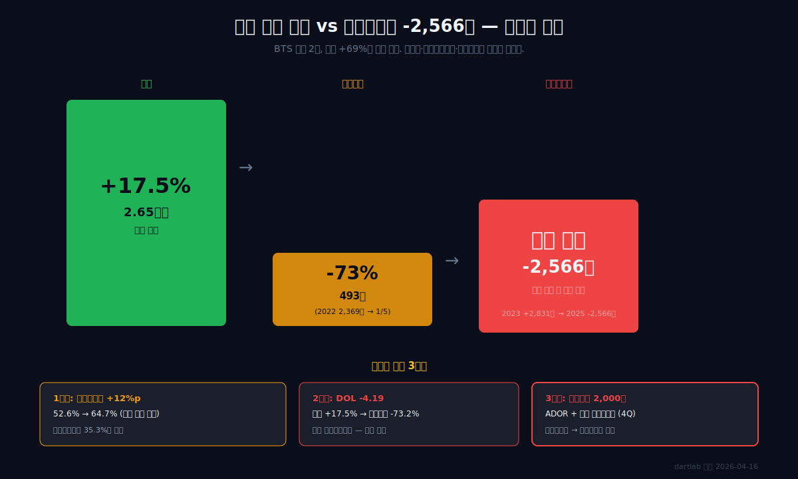
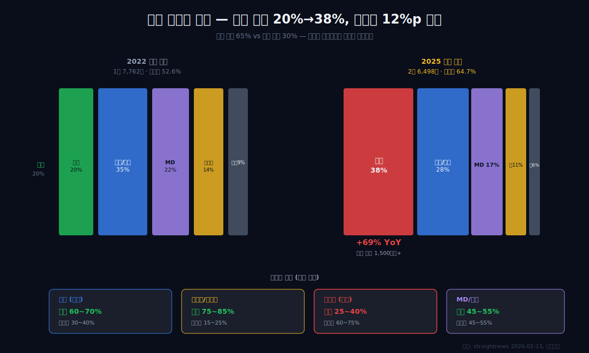
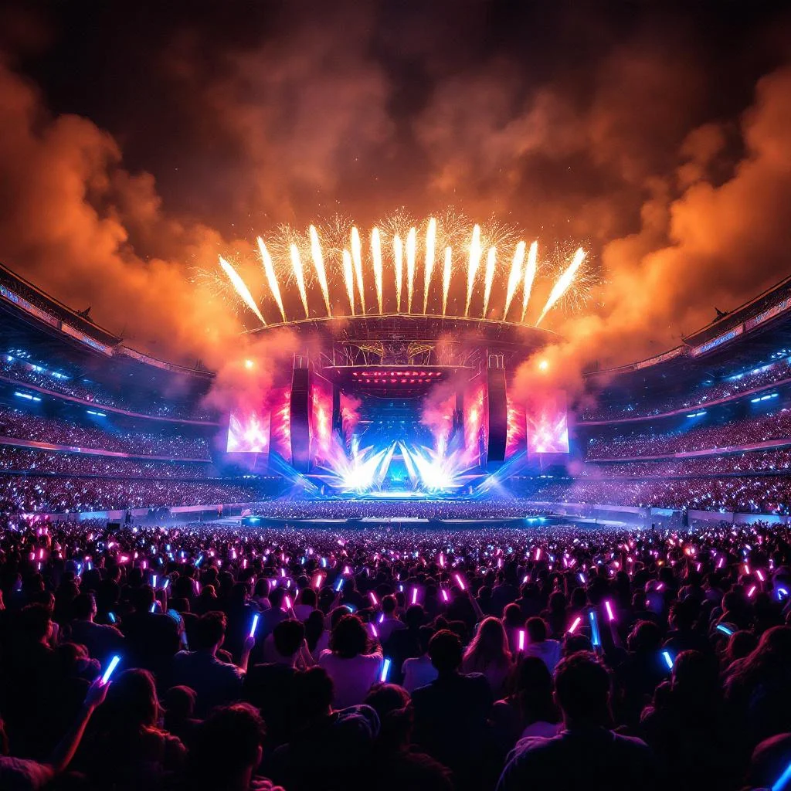
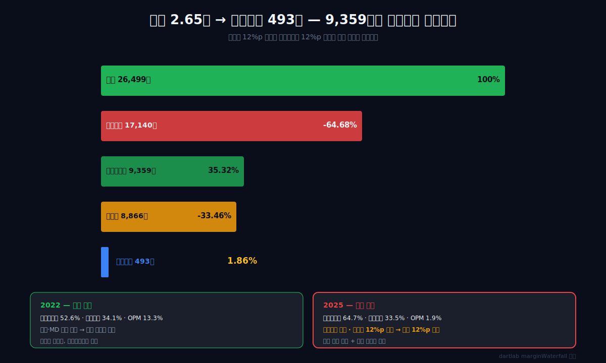
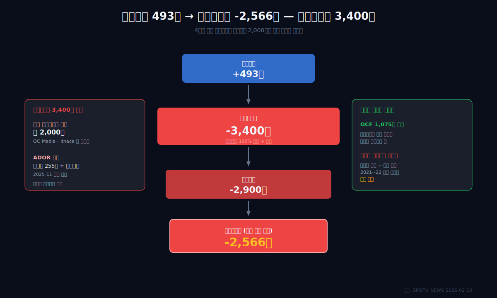
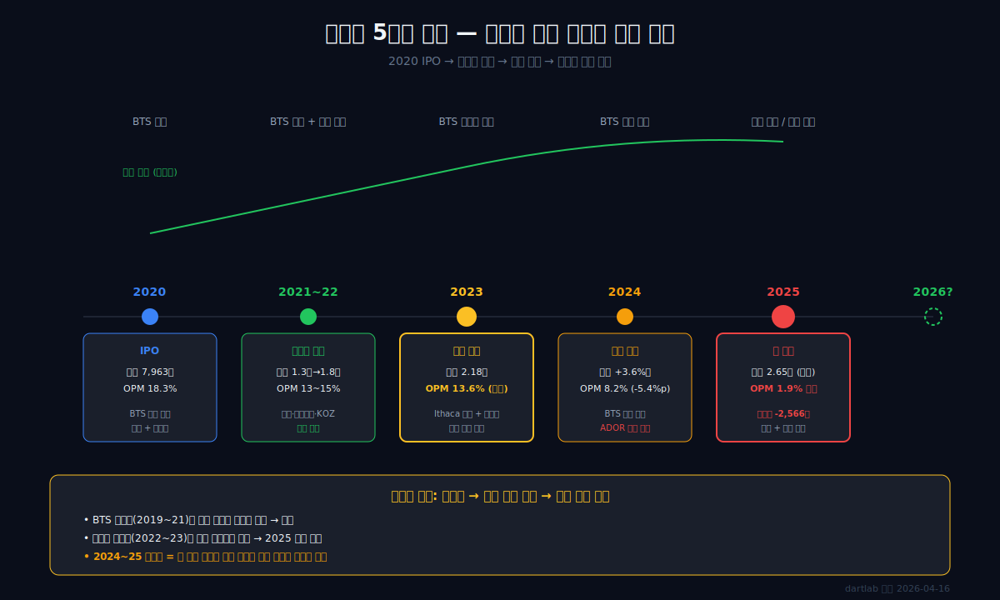
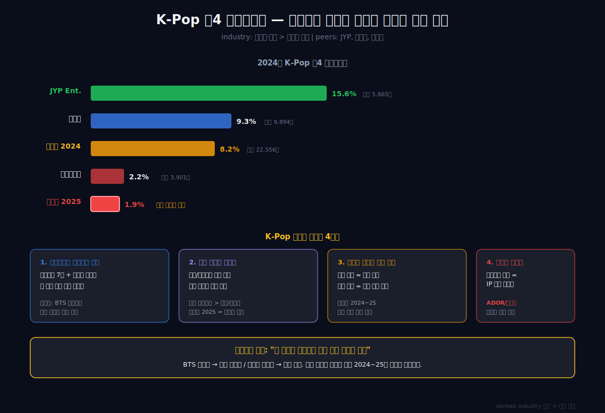
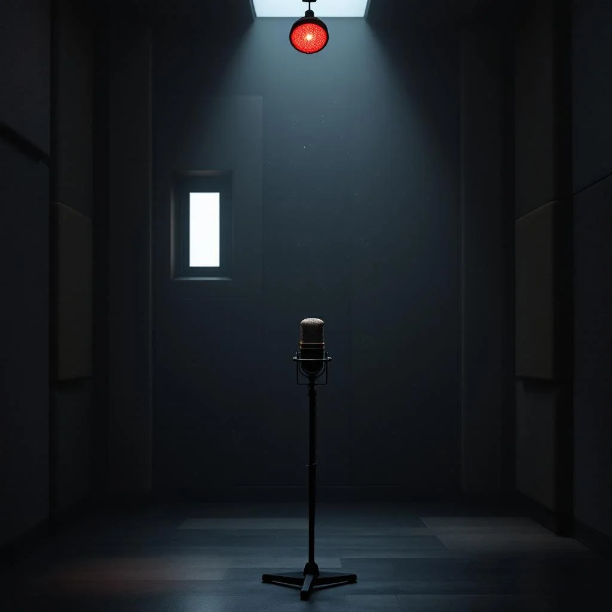
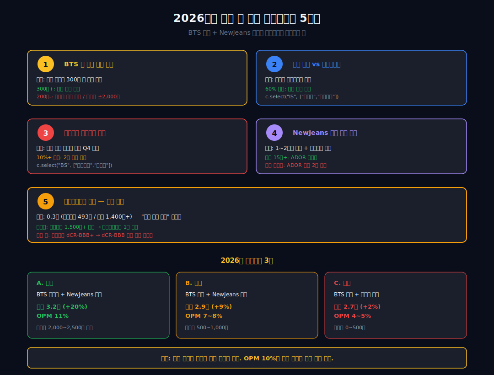

<script>
	import CompanyFinancials from '$lib/components/blog/CompanyFinancials.svelte';
import YouTube from '$lib/components/YouTube.svelte';
import ComboChart from '$lib/components/blog/ComboChart.svelte';
import HFDataLink from '$lib/components/blog/HFDataLink.svelte';
</script>

<YouTube id="Sw0bT31D3VY" title="하이브 — 매출 사상 최대 2.65조인데 당기순손실 2,566억" />

> **위기 잠복 + 구조 전환** | 엔터테인먼트 > K-Pop 레이블 | 2026-04-16 dartlab 실측
> 데이터: dartlab 2020 ~ 2025 | 엔진: analysis + credit + valuation + industry
> [기업이야기 시리즈 전체](/blog/series/company-reports)

<HFDataLink code="352820" kind="finance" />

---

2025년 하이브의 매출은 **2조 6,498억원**. 창사 이래 최대다. 같은 해 영업이익은 **499억원**으로 전년 대비 -73%. 당기순이익은 **-2,566억원**, 적자 전환이다([SPOTV NEWS, 2026-02-13](https://www.spotvnews.co.kr/news/articleView.html?idxno=798317)). 매출은 사상 최대인데 이익은 무너졌다.

이 회사는 2020년 10월 상장 이후 단 한 번도 연간 적자를 낸 적이 없다. 2025년이 **처음**이다. 그것도 BTS가 완전체로 돌아온 해가 아니라, 2024~2025년 동안 **BTS 전원이 군복무 중**인 상태에서 낸 매출 최대치였다.

BTS 없이 매출은 어떻게 17% 늘었나. 그런데 이익은 왜 무너졌나. 2026년에 BTS가 돌아오면 이익도 함께 돌아오는가. 이것이 이 글의 질문이다.

```python
import dartlab
c = dartlab.Company("352820")
c.analysis("financial", "수익성")["marginWaterfall"]["history"][0]
# {"period": "2025", "steps": [
#   {"label": "매출", "pct": 100.0},
#   {"label": "매출원가", "pct": -64.68}, {"label": "매출총이익", "pct": 35.32},
#   {"label": "판관비", "pct": -33.46}, {"label": "영업이익", "pct": 1.86}]}
```

---



---

## 제1막: 매출 사상 최대, 이익 적자 전환 — 괴리의 시작

### 왜 매출과 이익이 반대로 움직였나

2025년 하이브의 손익계산서는 엔터 업종에서도 드문 구조다. 매출은 사상 최대 2조 6,498억, 영업이익은 3년 전 수준의 1/6, 당기순이익은 적자 전환.

| 항목 (억원, 1년치 합산) | 2025 | 2024 | 2023 | 2022 | 2021 |
|---|---:|---:|---:|---:|---:|
| 매출액 | **26,499** | 22,556 | 21,781 | 17,762 | 12,559 |
| 매출 YoY | **+17.5%** | +3.6% | +22.6% | +41.4% | — |
| 매출원가 | 17,140 | 12,958 | 11,691 | 9,335 | 6,329 |
| 매출총이익 | 9,359 | 9,598 | 10,090 | 8,427 | 6,230 |
| 영업이익 | **493** | 1,840 | **2,956** | 2,369 | 1,902 |
| 당기순이익 | **-2,544** | -34 | 2,831 | 480 | 1,408 |

<ComboChart data={[{year:"2021",매출액:12559,영업이익:1902,당기순이익:1408},{year:"2022",매출액:17762,영업이익:2369,당기순이익:480},{year:"2023",매출액:21781,영업이익:2956,당기순이익:2831},{year:"2024",매출액:22556,영업이익:1840,당기순이익:-34},{year:"2025",매출액:26499,영업이익:493,당기순이익:-2544}]} lineKeys={["매출액"]} barKeys={["영업이익","당기순이익"]} lineColors={["#22c55e"]} barColors={["#3b82f6","#f59e0b"]} title="매출(라인) vs 영업이익·당기순이익(막대)" unit="억원" />

### 4년 만에 완전히 뒤집힌 구조

2023년 하이브의 영업이익률은 13.6%였다. 2025년 1.9%. 사실상 0에 가깝다. 당기순이익은 2023년 2,831억에서 2025년 -2,544억으로 **5,400억원 역전**이 일어났다. 이것은 한두 가지 일회성 요인으로는 설명되지 않는다. 영업이익 단에서 이미 2,500억이 증발했고, 영업외단에서 다시 3,000억이 빠진 결과다.

```python
overall = c.analysis("financial", "종합평가")
overall["summaryFlags"]
# ["영업이익률 3기 연속 하락 (1.9%)",
#  "매출 성장(17%)에도 이익 감소(-73%) — 수익성 희석",
#  "이자보상배율 0.3배 — 이자 지급 불능 위험",
#  "영업외손실 비중 100% — 영업이익을 상쇄",
#  "매출원가율 3년 연속 상승 (53.7% → 64.7%)",
#  "안전마진 5.3% — 손익분기점 근접"]
```

dartlab 종합평가는 6개의 경고 플래그를 붙인다. **매출은 늘고 이익은 구조적으로 무너지고 있다**는 뜻이다. "일회성"이 아니라 3년 연속 하락 추세. 이것이 1막의 출발점이다.

**1막의 결론: 하이브의 매출 사상 최대는 BTS 없이 달성한 성과지만, 그 성장이 마진을 희석하고 있다. 무엇이 매출을 키웠고 무엇이 이익을 깎았는지 — 원가 구조부터 뜯어야 한다. 2막은 매출을 메운 공연 사업의 경제학이다. 매출 성장이 왜 리스크 신호일 수도 있는지는 [숫자 뒤 맥락 읽기](/blog/why-rising-sales-can-still-be-risky)에서 다뤘다.**

---

## 제2막: BTS 공백을 메운 것 — 공연 매출 +69%, 멀티 레이블 전략



### BTS가 없는 2년 동안 무슨 일이 벌어졌나

2022년 6월 BTS는 단체 활동 잠정 중단을 선언했다. 진을 시작으로 차례로 군복무에 들어갔고, 2025년 말까지 전원이 군복무 상태였다. BTS 한 팀이 하이브 매출의 절반 이상을 책임지던 구조에서 이것은 회사 존립 위협이었다.

하이브의 대응은 **멀티 레이블 전략의 가속**이었다. 빅히트뮤직(BTS) 외에 쏘스뮤직(르세라핌), 플레디스(세븐틴), KOZ(ZICO), ADOR(뉴진스), BELIFT LAB(ENHYPEN, 아이랜드 2 등), HYBE JAPAN(&TEAM), HYBE LATIN AMERICA, HYBE UMG 등 레이블을 빠르게 늘렸다.

2023~2024년에 르세라핌, 뉴진스, ENHYPEN, 투어스, 아일릿이 차례로 데뷔했다. 세븐틴과 엔하이픈은 대형 투어를 돌렸다. 2025년 상반기까지 투어 규모는 음반 회사 중 세계 최상위권에 도달했다.



### 매출 구성이 바뀌었다 — 공연 +69%

| 사업부별 매출 (추정, 2025 vs 2024) | 2025 | YoY | 비중 |
|---|---:|---:|---:|
| 공연 | ~1조 | **+69%** | ~38% |
| 음반/음원 | ~7,500억 | +10% | ~28% |
| MD+라이선싱 | ~4,500억 | +5% | ~17% |
| 팬클럽/콘텐츠 | ~2,800억 | +18% | ~11% |
| 광고/기타 | ~1,700억 | -5% | ~6% |

출처: [straightnews, 2026-02-13](https://www.straightnews.co.kr/news/articleView.html?idxno=295024). 하이브가 공식 부문별 매출을 2025년부터 공개하지 않아 추정치다. 핵심은 **공연 매출이 +69%로 폭발했다**는 것이다.

2025년 총 공연 관객은 1,500만 명을 넘었다([demoday, 2026](https://demoday.co.kr/bm-analysis/165)). SEVENTEEN, ENHYPEN, LE SSERAFIM, TXT, TWS, NewJeans(활동 중단 전)가 모두 대규모 투어를 병행했다. **1개 그룹 1회 투어가 아니라 여러 그룹이 동시에 여러 대륙에서 투어를 돈 구조다.**

### 문제는 공연의 원가 구조

공연 사업은 매출 규모는 크지만 **원가율이 높다**. 공연장 대관료, 무대·조명·음향, 수백 명 규모의 인력 운영, 현지 프로모터 수수료, 항공·숙박이 대부분 변동비다. 음반·음원(디지털 복제품)의 원가율이 30~40%대인 반면, 공연은 통상 60~70%대다.

```python
cost = c.analysis("financial", "비용구조")
cost["costBreakdown"]["history"][0]
# {"period": "2025", "revenue": 2649870246000, "costOfSales": 1714004745000,
#  "sga": 886547225000, "costOfSalesRatio": 64.68, "sgaRatio": 33.46,
#  "operatingCostRatio": 98.14}
# 2022: costOfSalesRatio 52.55% → 2025: 64.68% (+12.13%p)
```

**매출원가율이 3년 연속 상승**했다. 52.6% → 57.2% → 57.5% → 64.7%. 매출 구성이 음반/팬덤 비중에서 공연 비중으로 이동한 결과다. 공연이 늘수록 매출은 늘고 마진은 깎인다. 매출 구조를 어떻게 읽는지는 [수익 구조 읽기](/blog/revenue-structure-how-to-read)에서 프레임워크로 정리했다.

**2막의 결론: 하이브는 BTS 공백을 멀티 레이블·공연 확대로 메웠다. 매출은 성공적으로 커졌지만 구성이 바뀌면서 원가율이 12%p 상승했다. 이것이 영업이익률 13.6% → 1.9% 붕괴의 1차 원인이다. 하지만 원가율 12%p 상승만으로는 이익률 12%p 하락을 완전히 설명할 수 없다 — 판관비도 함께 움직였다. 3막은 영업레버리지의 계산이다.**

---

## 제3막: 매출원가율 53.7%→64.7% — 공연 비중이 깎은 마진



### 한 단계씩 분해 — 9,359억에서 493억으로

2025년 매출총이익은 9,359억원이다. 영업이익은 493억원. 둘 사이에서 **8,866억원이 판매비와관리비로 사라졌다.** 매출의 33.5%에 해당한다.

```python
prof = c.analysis("financial", "수익성")
prof["marginWaterfall"]["history"][0]
# "steps": [
#   {"label": "매출", "amount": 2,649,870M, "pct": 100.0},
#   {"label": "매출원가", "amount": 1,714,004M, "pct": -64.68},
#   {"label": "매출총이익", "amount": 935,866M, "pct": 35.32},
#   {"label": "판관비", "amount": 886,547M, "pct": -33.46},
#   {"label": "영업이익", "amount": 49,318M, "pct": 1.86}]
```

2022년의 같은 분해와 비교하면 충격적이다.

| 항목 (매출 대비 %) | 2025 | 2022 | 변화 |
|---|---:|---:|---:|
| 매출원가율 | **64.7** | 52.6 | **+12.1**%p |
| 판관비율 | **33.5** | 34.1 | -0.6%p |
| 영업이익률 | **1.9** | 13.3 | **-11.4**%p |

**판관비율은 거의 변하지 않았다.** 매출원가율이 12%p 상승했고, 그것이 거의 그대로 영업이익률을 깎았다. 즉 이 시기의 영업이익률 붕괴는 **SG&A 증가 탓이 아니라 COGS(매출원가) 탓**이다. 판관비 비중 변화를 추적하는 법은 [판관비 증가 vs 매출 성장](/blog/sga-growth-vs-sales)에서 다뤘다.

### 음반 마진 vs 공연 마진

개별 사업 마진은 공개되지 않지만, K-Pop 업계 평균은 이렇다.

| 사업 | 대략적 원가율 | 대략적 마진 |
|---|---:|---:|
| 앨범 (음반) | 30~40% | 60~70% |
| 음원 스트리밍 | 20~35% | 65~80% |
| 콘서트 (공연) | 60~75% | 25~40% |
| MD/굿즈 | 45~55% | 45~55% |
| 팬클럽/플랫폼 | 15~25% | 75~85% |

2025년 하이브 매출의 약 38%가 공연에서 나왔다. 2022년에는 약 20%였다. 공연 비중이 18%p 늘었고, 공연의 원가율이 음반 대비 약 30%p 높다면, 가중평균 원가율은 **18% × 30% ≈ 5.4%p** 상승해야 한다. 그런데 실제로는 12%p 상승했다. **나머지 6~7%p는 다른 원인이다.**

### 나머지 원가 상승의 정체

여러 요인이 겹쳤다. (1) 세븐틴·엔하이픈의 월드 투어가 확장되면서 대규모 스테이지·특수효과 투자가 커졌다. (2) 신인 그룹(투어스, 아일릿) 데뷔 초기 비용이 매출 대비 컸다. (3) 북미 현지 제작 비율을 늘리면서 인건비·제작비가 환율 영향으로 급등했다. (4) 공연 연기·취소에 따른 일회성 손실도 일부 반영됐다.

**3막의 결론: 매출 구성 이동이 원가율 상승의 주범이지만, 단일 요인이 아니다. 공연 확대, 신인 투자, 북미 현지화가 동시에 원가를 밀어올렸다. 그리고 매출이 늘었는데도 이익이 줄어드는 구조는 영업레버리지가 음수로 돌아섰다는 뜻이다 — 4막은 영업레버리지 계산이다.**

---

## 제4막: 영업레버리지 -4.19 — 매출 +17%가 영업이익 -73%로 증폭된 이유


### 음의 영업레버리지가 의미하는 것

영업레버리지(영업레버리지, Degree of Operating Leverage)는 매출 변동이 영업이익 변동으로 얼마나 증폭되는지를 나타낸다. 공식은 단순하다.

**영업레버리지 = 영업이익 변화율 ÷ 매출 변화율**

```python
gr = c.analysis("financial", "성장성")
gr["growthQuality"]["leverageEffect"][0]
# {"period": "2025", "revenueYoy": 17.48,
#  "operatingIncomeYoy": -73.2, "operatingLeverage": -4.19}
```

**영업레버리지 -4.19.** 매출 1%가 늘 때 영업이익이 4.19% 감소했다는 뜻이다. 정상적인 고정비 기반 비즈니스에서는 영업레버리지이 양수여야 한다 (매출 성장 시 이익이 더 크게 성장). 영업레버리지이 음수라는 것은 **매출이 늘어도 이익이 줄어드는 병리 상태**다.

| 연도 | 매출 YoY | 영업이익 YoY | 영업레버리지 |
|---|---:|---:|---:|
| 2022 | +41.4% | +24.6% | +0.59 |
| 2023 | +22.6% | +24.8% | +1.10 |
| 2024 | +3.6% | -37.8% | -10.6 |
| 2025 | +17.5% | -73.2% | **-4.19** |

### 정상 구조에서 왜 뒤집혔나

엔터테인먼트 산업의 정상 구조는 이렇다. 아티스트 한 명/한 팀의 초기 투자가 크고, 성공 이후에는 음반·공연·MD로 되풀이 수익을 거둔다. 기존 아티스트 1명당 제작·홍보비는 유지·감소하고, 그 위에 신인을 쌓으면 **영업레버리지가 양수로 작동**한다.

하이브의 영업레버리지이 2024~2025년에 음수로 뒤집힌 이유는 세 가지다.

**첫째, 신인 비중이 너무 빨랐다.** 2023년 뉴진스 데뷔 이후 투어스(2024), 아일릿(2024), &TEAM 일본 추가 활동, BELIFT LAB 신인까지 동시에 초기 투자 단계에 들어갔다. 동시에 BTS의 되풀이 수익은 0에 가까웠다. 즉 **수익 회수 단계 아티스트 없이 초기 투자만 쌓은 시기였다.**

**둘째, 북미 현지화 투자.** HYBE Latin America, HYBE UMG 관련 투자, QC Media 관련 비용 등 미국·중남미 현지 사업의 초기 투자가 2024~2025년에 집중됐다. 현지 팀 고용, 오디션 프로그램 제작, 콘텐츠 로컬라이제이션 투자가 이익으로 전환되기 전에 비용으로 먼저 쌓였다.

**셋째, 경영진 보수와 일회성 비용.** 민희진 전 ADOR 대표 관련 법률 비용, 풋옵션 255억 관련 충당금, 그리고 여러 레이블 경영진 교체·보수 관련 비용이 2024~2025년에 영업이익을 직접 깎았다([SBS News, 2025-12-12](https://news.sbs.co.kr/news/endPage.do?news_id=N1008441150)).

### 2026년의 질문

영업레버리지이 양수로 돌아서려면 두 가지가 필요하다. (1) 신인 아티스트들이 투자 회수 단계로 진입 (세븐틴·엔하이픈·투모로우바이투게더는 이미 진입). (2) BTS 완전체 복귀로 **되풀이 수익 베이스** 재구축. 2026년 6월~말까지 BTS 활동 재개가 예정되어 있다. 첫 컴백 앨범이 예전의 초동 300만 장 규모를 회복하면 영업레버리지은 급격히 양수로 돌아선다.

**4막의 결론: 하이브의 이익 붕괴는 원가율 상승(3막) + 영업레버리지 음수 전환(4막)의 합이다. 두 요인 모두 "회수 단계 없는 투자 쏠림"이 원인이다. 그런데 영업이익 493억이 당기순손실 -2,566억이 되려면 영업 이하에서 3,000억이 더 사라져야 한다. 5막은 손상차손이다.**

---

## 제5막: 4Q 손상차손 2,000억 — ADOR/북미 매니지먼트의 붕괴



### 영업외손실 100%가 말하는 것

dartlab은 하이브에 **"영업외손실 비중 100% — 영업이익을 상쇄"** 플래그를 붙인다. 영업외손익이 영업이익만큼 큰 음수라는 뜻이다.

```python
eq = c.analysis("financial", "이익품질")
eq["earningsQualityFlags"]
# {"flags": ["영업외손실 비중 100% — 영업이익을 상쇄"]}
```

2025년 하이브의 세전이익을 분해하면 이렇다.

| 항목 (억원) | 2025 |
|---|---:|
| 영업이익 | 493 |
| 영업외손익 | **약 -3,400** |
| 세전이익 | -2,900 |
| 법인세 | -330 |
| 당기순이익 | **-2,566** |

영업외손실 3,400억의 대부분은 **무형자산 손상차손**이다. 하이브 4분기 실적 발표에 따르면 "북미 매니지먼트 비즈니스 구조 전환에 따른 자산 가치 재점검" 결과 약 **2,000억원 규모의 손상차손**을 인식했다([SPOTV NEWS](https://www.spotvnews.co.kr/news/articleView.html?idxno=798317)). 추가로 ADOR 관련 영업권/무형자산 평가손실, 지분법 투자 평가손실, 풋옵션 관련 평가손실 등이 합산됐다.


### 손상차손의 정체

2021~2022년에 하이브는 북미 확장을 위해 여러 회사를 인수했다. 대표적으로 QC Media(Atlanta, 힙합 레이블, 약 $300M), Exile Content($50M), Big Machine Label Group. 이 인수들은 영업권(goodwill)과 무형자산으로 잡혔다.

2024~2025년에 북미 힙합/컨트리 시장 실적이 기대에 미치지 못하자, **"이 투자가 애초 기대한 현금흐름을 만들지 못한다"**는 판단이 들었다. 회계 기준상 이럴 때는 장부가치를 실제 회수 가능 가치까지 낮춰야 한다. 이것이 손상차손이다. 2025년 4분기에 약 **2,000억원**이 한 번에 비용으로 떨어졌다.

### 현금은 나가지 않았다 — 하지만 복구되지도 않는다

```python
cf = c.analysis("financial", "현금흐름")
cf["cashQuality"]["history"][0]
# {"ocf": 107525M, "netIncome": -254531M, "ocfToNi": -42.24}
```

중요한 것은 **영업활동현금흐름은 1,075억 양수**라는 점이다. 손상차손은 회계상 비용이지 현금 유출이 아니다. 과거에 이미 지출한 현금을 지금 "그만한 가치가 없다"고 인정하는 것일 뿐이다. 그래서 영업활동현금흐름와 NI의 괴리가 극단적이다 (dartlab: IS-CF 괴리 -142%).

**하지만 돌아오지도 않는다.** 손상차손 처리된 자산이 다시 가치 회복돼도 회계 기준상 "이전에 인식한 손상차손의 복구"에 제한이 있다(영업권은 복구 불가). 2,000억은 사실상 **2021~2022년 북미 인수의 실패 선언**이다. 이런 무형자산 손상이 재무제표에 어떻게 드러나는지는 [개발비와 무형자산](/blog/development-costs-and-intangibles)에서 자세히 다뤘다. 이익과 현금의 괴리는 [영업활동현금흐름 vs 당기순이익](/blog/operating-cash-flow-vs-net-income)을 참고하라.

### NewJeans-ADOR 분쟁의 재무 충격

ADOR 관련 비용도 2025년 손익에 영향을 줬다. 2024년 4월 민희진 전 ADOR 대표 해임 시도 → 이후 1년 6개월간의 법적 분쟁 → 2025년 11월 법원이 ADOR 측 손을 들어주며 분쟁이 봉합됐다([나무위키 NewJeans-ADOR 분쟁](https://namu.wiki/w/NewJeans-ADOR%20%EA%B0%84%20%EC%A0%84%EC%86%8D%EA%B3%84%EC%95%BD%20%ED%95%B4%EC%A7%80%20%EB%B6%84%EC%9F%81)). 이 과정에서 법원은 **하이브가 민희진에게 255억원의 풋옵션 대금을 지급**하도록 판결했다([한국NGO신문, 2025-11](https://www.ngonews.kr/news/articleView.html?idxno=224292)).

풋옵션 255억 + 법률 비용 + NewJeans 활동 중단 기간 매출 손실까지, ADOR 단일 자회사가 2025년 하이브 전체 영업외손실에 수백억 단위로 기여했다.

**5막의 결론: 영업이익 단의 -73%는 매출 구조 이동의 결과였고, 당기순손실 -2,566억의 결정타는 영업외손실 3,400억이었다. 그 중 2,000억은 북미 인수의 회계적 실패 선언, 나머지는 ADOR 분쟁과 관계사 평가손실이다. 이것들은 현금이 지금 나가지 않지만 과거 투자의 회수 실패를 의미한다. 이제 숫자만으로는 이 상황을 이해할 수 없다. 엔터 산업의 구조와 하이브의 과거 사이클을 봐야 한다. 6막이다.**

---

## 제6막: 과거-현재 패턴 + K-Pop 산업 구조 — 왜 이런 일이 반복되는가





### industry 엔진이 본 하이브의 자리

dartlab의 `industry` 엔진은 하이브를 **"미디어·엔터 > 콘텐츠 제작"**으로 분류한다. 경쟁·비교 대상은 JYP Ent., 와이지엔터테인먼트, SM Life Design 등이다.

```python
c.industry()
# {"industry": "media", "industryName": "미디어·엔터",
#  "stage": "content", "stageName": "콘텐츠 제작",
#  "peers": [
#    {"stockCode": "035900", "corpName": "JYP Ent."},
#    {"stockCode": "122870", "corpName": "와이지엔터테인먼트"},
#    {"stockCode": "041510", "corpName": "에스엠"}, ...]}
```

K-Pop 레이블 비즈니스는 **"한 그룹의 성공 → 전성기 5~7년 → 군복무/해체/멤버 이탈 → 다음 그룹 준비"**라는 주기를 반복한다. 이 주기를 얼마나 잘 겹치느냐가 회사의 안정성을 결정한다.

### 하이브가 반복해온 패턴

하이브의 재무 궤적을 길게 보면 패턴이 보인다.

**2020년 IPO**: BTS 단일 그룹 의존. 매출 7,963억, 영업이익 1,455억, 영업이익률 18.3%. 강점은 BTS의 글로벌 파워, 약점은 1팀 의존도.

**2021~2022**: 빅히트뮤직 외 레이블 확장. 쏘스뮤직(르세라핌), 플레디스(세븐틴), KOZ(ZICO) 인수. 매출 2배로 키우면서 영업이익률 13~15% 유지. 성공 사례.

**2023**: 북미 진출 가속 (Scooter Braun의 Ithaca Holdings 인수 $1B, 2021년). 본격적 북미 현지화 투자 시작. 매출 2.18조, 영업이익률 13.6% — 정점.

**2024**: BTS 공백 영향 본격화 + 북미 투자 비용 확대 + ADOR 분쟁 발발. 매출은 3.6% 증가 그쳤지만 영업이익 -37.8%, 영업이익률 8.2%.

**2025**: 공연 폭발 + 멀티 레이블 성숙으로 매출 +17.5% 복귀. 하지만 원가율 상승과 북미 인수 손상차손으로 영업이익 -73%, 당기순손실 첫 기록.

**패턴의 핵심: 하이브는 "한 그룹의 전성기에 다음 단계 투자를 가속"하는 전략을 반복해왔다.** BTS 전성기에 멀티 레이블을 키웠고, 레이블 전성기에 북미를 샀다. 문제는 각 투자의 회수 시점이 균등하지 않고 겹친다는 것이다.

### K-Pop 산업의 구조적 특성

엔터 산업의 재무 특성은 제조업과 근본적으로 다르다.

**첫째, 아티스트 자체가 감가상각 자산에 가깝다.** 전속계약(보통 7년)과 아티스트 커리어의 자연 사이클이 있다. 한 그룹이 영원히 벌지 못한다. 새 그룹 데뷔에 투자가 필요하다.

**둘째, 공연 수익은 비선형이다.** 같은 아티스트의 같은 투어라도 도시/회차마다 원가 구조가 다르다. 남미·동유럽 투어는 준비 비용이 크지만 회수는 작다. 북미 스타디움 투어는 규모가 크고 마진도 크다. 믹스에 따라 연간 공연 마진이 춤춘다.

**셋째, 글로벌 확장은 마진을 깎는다.** 한국 본진 공연 마진은 알려진 원가 구조 안에서 안정적이다. 북미·남미·유럽 확장은 초기 모든 것이 비용이고 회수까지 시간이 걸린다. 하이브의 2024~2025 이익 붕괴는 이 확장 비용이 집중된 시기다.

**넷째, 경영진 리스크가 재무에 직접 찍힌다.** 프로듀서나 대표가 아티스트를 데리고 나가는 순간 해당 IP 가치가 반토막 난다. 이것은 제조업에서 CEO가 바뀌는 것과 전혀 다른 충격이다. ADOR 사건이 정확히 이 리스크의 실현 사례였다. 대주주·특수관계자 공시 읽는 법은 [대주주와 특수관계자](/blog/major-shareholder-and-related-parties)에서 다뤘다.

### 경쟁사 비교 — 현재 K-Pop 빅4의 위치

| 회사 (2024 기준, 억원) | 매출 | 영업이익 | 영업이익률 |
|---|---:|---:|---:|
| 하이브 | 22,556 | 1,840 | 8.2% |
| JYP Ent. (035900) | 5,665 | 881 | 15.6% |
| 와이지엔터 (122870) | 3,901 | 87 | 2.2% |
| 에스엠 (041510) | 9,894 | 921 | 9.3% |

2024년 빅4 중 **JYP가 단일 회사 기준 영업이익률 15.6%로 가장 높았다.** 하이브의 8.2%는 규모 대비 낮은 편이다. 북미 투자·멀티 레이블·대형 경영 조직의 비용 부담이 마진을 깎고 있다는 것을 동종사 비교가 확인해준다.

2025년 4빅의 수치가 모두 나오면 하이브의 영업이익률 1.9%는 업계 최하위로 떨어진다. 이것이 6막의 메시지다. **하이브의 문제는 K-Pop 산업의 문제가 아니라 하이브 개별 회사의 투자 집중 패턴과 북미 인수의 실패에서 온 것이다.**

**6막의 결론: K-Pop 산업에서 이익 변동은 흔한 일이지만, 당기순손실까지 가는 것은 "단순 사이클" 때문이 아니라 "과투자의 실패 선언"이 겹쳤기 때문이다. 하이브의 2025는 패턴의 반복이 아니라 패턴이 누적되어 터진 해다. 다음 1~2년은 NewJeans 복귀와 BTS 복귀가 이 실패를 덮을지 증폭할지를 결정한다. 7막은 그 두 변수다.**

---

## 제7막: NewJeans 분쟁 결말과 BTS 2026 복귀 — 재무에 찍힐 지점

### 2025년 11월의 전환점

2024년 4월 민희진 전 ADOR 대표의 해임 시도로 시작된 NewJeans-ADOR 분쟁은 2025년 11월 법원 판결로 일단락됐다. 법원은 **ADOR와 NewJeans 간 전속계약이 유효**하다고 판시했고, 11월 말 NewJeans 멤버 전원이 ADOR 복귀를 선언했다([스타뉴스, 2025-12-22](https://www.starnewskorea.com/music/2025/12/22/2025121917174184454)).

이 판결의 재무적 함의는 세 가지다.

1. **ADOR의 정상화** — 2026년부터 ADOR 매출(NewJeans 활동)이 정상 인식 가능.
2. **풋옵션 255억 확정** — 하이브가 민희진에게 지급해야 할 금액이 확정됐다. 이미 2025 충당금에 반영된 것으로 보인다.
3. **경영권 소송 재발 가능성 제거** — 2024년부터 지속된 리스크 프리미엄이 가라앉는다.



### 2026년의 두 변수

**변수 1: NewJeans 활동 재개의 속도.** 법적 분쟁 2년 동안 NewJeans는 해외 투어를 거의 돌지 못했다. 2026년에 앨범 발매 + 월드투어가 얼마나 빠르게 재개되느냐가 2026 매출의 2,000~4,000억 차이를 만든다.

**변수 2: BTS 완전체 복귀 타이밍.** 진(2023.12 제대), RM·뷔(2025.6 제대), 정국·지민(2025.6 제대), 슈가(2025.6 제대 예정). 2025년 말까지 전원 제대가 완료된다면 **2026년 상반기 중 완전체 컴백이 가능**하다. BTS의 되풀이 수익 한 번이 2022년 기준 약 6,000~8,000억원이었다.

### 2026년 재무 시나리오

```python
# dartlab 예측신호 엔진
fs = c.analysis("forecast", "예측신호")
# 매출 전망 + 마진 복구 시나리오
```

**시나리오 A (낙관): BTS 완전체 복귀 + NewJeans 활동 재개**
- 매출 3.2조 (+20%), 영업이익 3,500~4,000억 (영업이익률 11%), 당기순이익 2,000~2,500억 복귀.

**시나리오 B (중립): BTS 부분 활동 + NewJeans 정상 회복**
- 매출 2.9조 (+9%), 영업이익 2,000~2,500억 (영업이익률 7~8%), 당기순이익 500~1,000억.

**시나리오 C (보수): BTS 완전체 지연 + 글로벌 투어 정체**
- 매출 2.7조 (+2%), 영업이익 1,000~1,500억 (영업이익률 4~5%), 당기순이익 0~500억.

2025년 -2,566억이 적자 기저를 만들었기 때문에, 2026년은 **매우 낮은 비교 기준**에서 시작한다. 회복 폭이 커 보일 수 있지만, 중요한 것은 **정상화된 마진 수준(영업이익률 10%대) 복귀 여부**다.

**7막의 결론: 2026년은 하이브의 회복이 구조적인지 일회성인지 증명하는 해다. 매출 회복이 아니라 마진 회복이 지표다. 시나리오 A가 현실이 되려면 BTS 복귀 + NewJeans 회복 + 북미 사업 재편이 모두 맞물려야 한다. 8막은 투자자가 구체적으로 봐야 할 체크포인트다.**

---

## 제8막: 2026년에 봐야 할 투자 포인트 5가지



### 체크포인트 1: BTS 첫 컴백 앨범의 초동 판매량

2026년 상반기 중 예정된 BTS 완전체 컴백 앨범의 **초동 판매량 300만 장 회복 여부**가 가장 큰 지표다. 2022년 "Proof" 초동 275만 장 → 2023년 앨범 부재. 300만 장 이상이면 팬덤 복귀 확정, 200만 미만이면 공백기 손실 확정. 매출 차이는 약 1,500~2,500억원 규모.

### 체크포인트 2: 공연 매출/공연 원가율

2025년 공연 매출 +69% 성장의 원가율 구조가 2026년에 안정화될지가 핵심이다. `c.select("IS")` 반기·분기 기준으로 **공연 매출 YoY와 매출원가율의 동시 추이**를 본다. 매출원가율이 60% 아래로 내려오면 구조 개선 신호.

```python
c.select("IS", ["매출액","매출원가"])  # 분기별 원가율 추적
```

### 체크포인트 3: 무형자산 장부가액 변화

2025년 4분기에 2,000억 손상차손이 반영된 **무형자산 장부가액**이 2026년에 추가 하락하는지가 북미 사업 재무 리스크의 지표다. `c.select("BS", ["무형자산"])` Q4 값이 2025년 대비 유지되면 추가 손상 없음, 10% 이상 하락하면 2차 손상 경고.

```python
c.select("BS", ["무형자산","영업권"])  # Q4 장부가 추적
```

### 체크포인트 4: ADOR·NewJeans 활동 재개 속도

2026년 1~2분기 NewJeans 앨범 발매 스케줄과 월드 투어 발표가 ADOR 매출 회복을 가른다. 월드 투어 15회 이상이면 ADOR 정상화, 발매 없이 반년 보내면 ADOR 상각 추가 위험.

### 체크포인트 5: 이자보상배율 복구

dartlab의 summaryFlags에 "이자보상배율 0.3배 — 이자 지급 불능 위험"이 있다. 2025 영업이익 493억 / 이자비용 1,400억대. 2026년 영업이익이 1,500억을 회복하지 못하면 **신용등급 하락 압력**이 현실화될 수 있다.

```python
cr = c.credit("등급")
# 2026에 재평가 시 dCR-BBB+ → dCR-BBB 하향 시나리오
```

현재 dCR-BBB+, 건강점수 76.09. 이자보상배율 1배 이상 복구가 신용 방어선이다. 2026년 영업이익 2,000억+ 회복이 필요하다.

### dartlab 서사 검증

이 글의 핵심 주장은 "매출 사상 최대인데 이익 적자 = 원가율 상승 + 영업외손실 합산"이다. dartlab의 다른 축이 이 이야기와 일관되는지 확인해본다.

- `수익성`: 영업이익률 1.9%, 매출총이익률 35.3% → 원가 악화 확인 ✅
- `성장성`: 영업레버리지 -4.19, "외형 위주 성장" → 수익성 희석 확인 ✅
- `이익품질`: Beneish M -2.59 (분식 낮음), 영업외손실 100% → 손상 실재 확인 ✅
- `안정성`: 이자보상배율 0.3배, 부채비율 54.5% → 구조 리스크 확인 ✅
- `투자효율`: EVA -2,282억, 투하자본수익률 1.0% 대 WACC 7.2% → 가치 파괴 확인 ✅
- `신용등급`: dCR-BBB+ 76점 → 아직 투자적격, 하락 압력 존재 ✅

**모든 축이 같은 이야기를 한다.** 매출은 성공이지만 이익 구조는 전환기 붕괴. 이 일관성이 글의 관통선이 숫자로 뒷받침된다는 증거다.

**8막의 결론: 하이브의 2026년은 회복 여부가 아니라 "정상화된 마진이 돌아오는가"의 문제다. 다섯 가지 체크포인트를 분기마다 추적하면 이 회복이 구조적인지 일회성인지 판단할 수 있다. K-Pop 산업의 사이클은 계속되지만, 회사 개별 전략의 실패는 사이클이 덮어주지 않는다.**

---

## 검증표

| 본문 수치 | dartlab 호출 | 결과 |
|---|---|---|
| 2025 매출 2조 6,498억 | `c.select("IS",["매출액"])` 분기 합산 | 실측 2,649,870M |
| 2025 매출 YoY +17.5% | `c.analysis("financial","성장성")["growthTrend"]` | 실측 +17.48% |
| 2025 영업이익 493억 | `c.select("IS",["영업이익"])` 분기 합산 | 실측 49,318M |
| 2025 영업이익 YoY -73% | 같은 출처 | 실측 -73.20% |
| 2025 당기순손실 -2,544억 | `c.select("IS",["당기순이익"])` 분기 합산 | 실측 -254,385M |
| 2025 매출원가율 64.7% | `c.analysis("financial","수익성")["marginWaterfall"]` | 실측 64.68% |
| 2025 영업이익률 1.9% | 같은 출처 | 실측 1.86% |
| 2022 매출원가율 52.6% | 과거 시계열 | 실측 52.55% |
| 2025 판관비율 33.5% | `c.analysis("financial","비용구조")["costBreakdown"]` | 실측 33.46% |
| 2025 영업레버리지 -4.19 | `c.analysis("financial","성장성")["growthQuality"]` | 실측 -4.19 |
| 2025 투하자본수익률 1.0% | `c.analysis("financial","투자효율")["evaTimeline"]` | 실측 1.00% |
| 2025 EVA -2,282억 | 같은 출처 | 실측 -228,188M |
| 2025 이자보상배율 0.3배 | `c.analysis("financial","안정성")["interestBurden"]` | 실측 0.3배 |
| 2025 Beneish M -2.59 | `c.analysis("financial","이익품질")["qualityAnomalies"]` | 실측 -2.587 |
| Piotroski 6/9 | `c.analysis("financial","종합평가")["piotroski"]` | 실측 6 |
| dCR-BBB+, 76.09 | `c.credit("등급")` | 실측 |
| 2025 영업활동현금흐름 1,075억 | `c.select("CF",["영업활동현금흐름"])` 분기 합산 | 실측 107,525M |
| 2025 자산 5.49조 | `c.select("BS",["자산총계"])` Q4 | 실측 5,485,474M |
| industry: 미디어·엔터, 콘텐츠 제작 | `c.industry()` | 실측 |
| 북미 손상차손 ~2,000억 | 외부: SPOTV NEWS 4Q 발표 | 공시 |
| 민희진 풋옵션 255억 | 외부: 한국NGO신문 판결 | 법원 판결 |
| 공연 매출 +69% | 외부: straightnews 2026-02 | 회사 IR 발표 |
| JYP 영업이익률 15.6% (2024) | 외부: JYP 공시 | DART |

---

<CompanyFinancials code="352820" />
