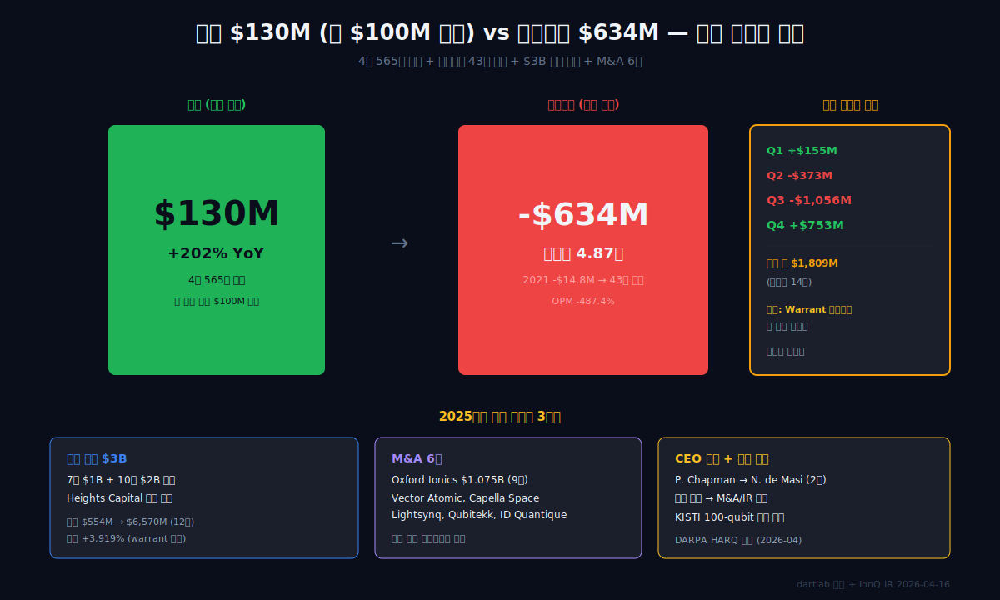
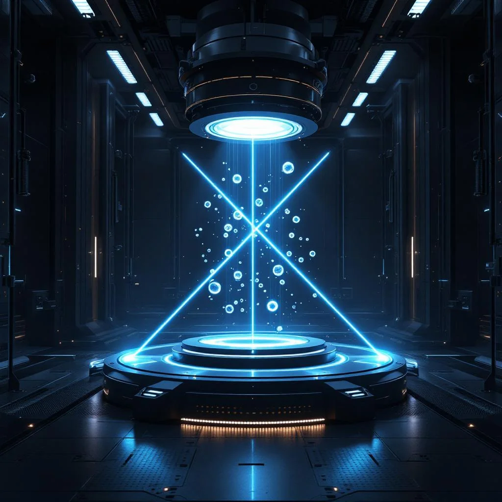
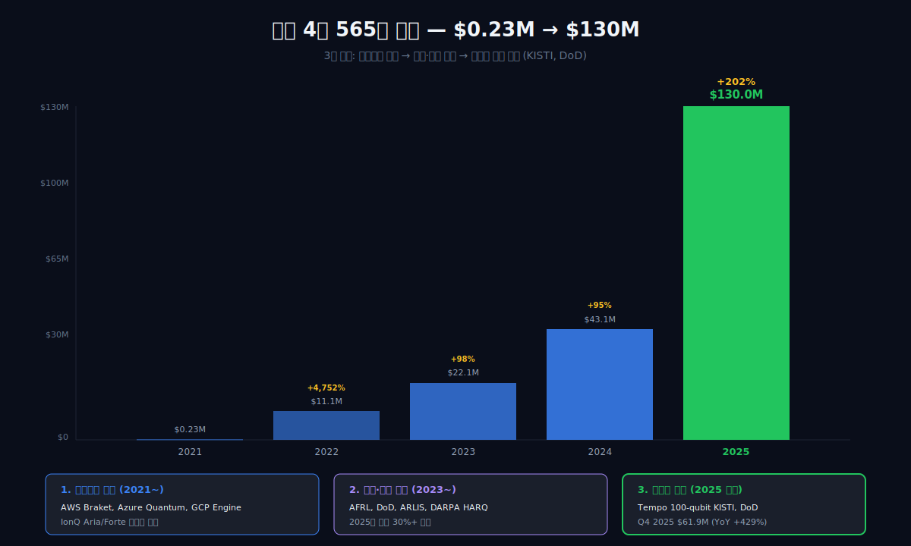
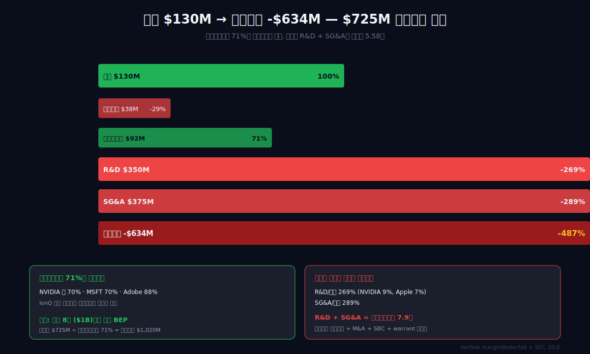
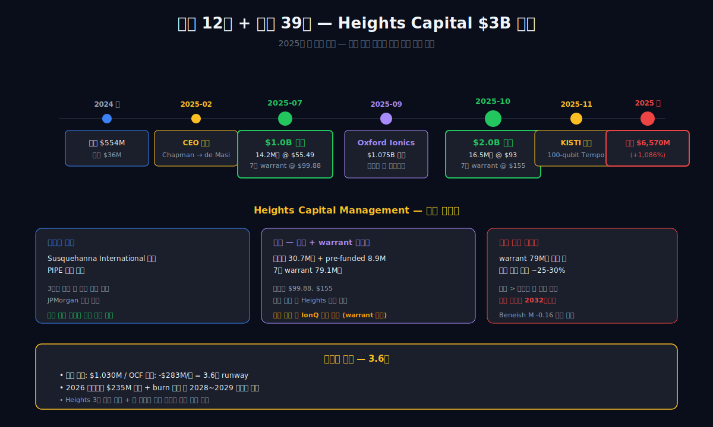
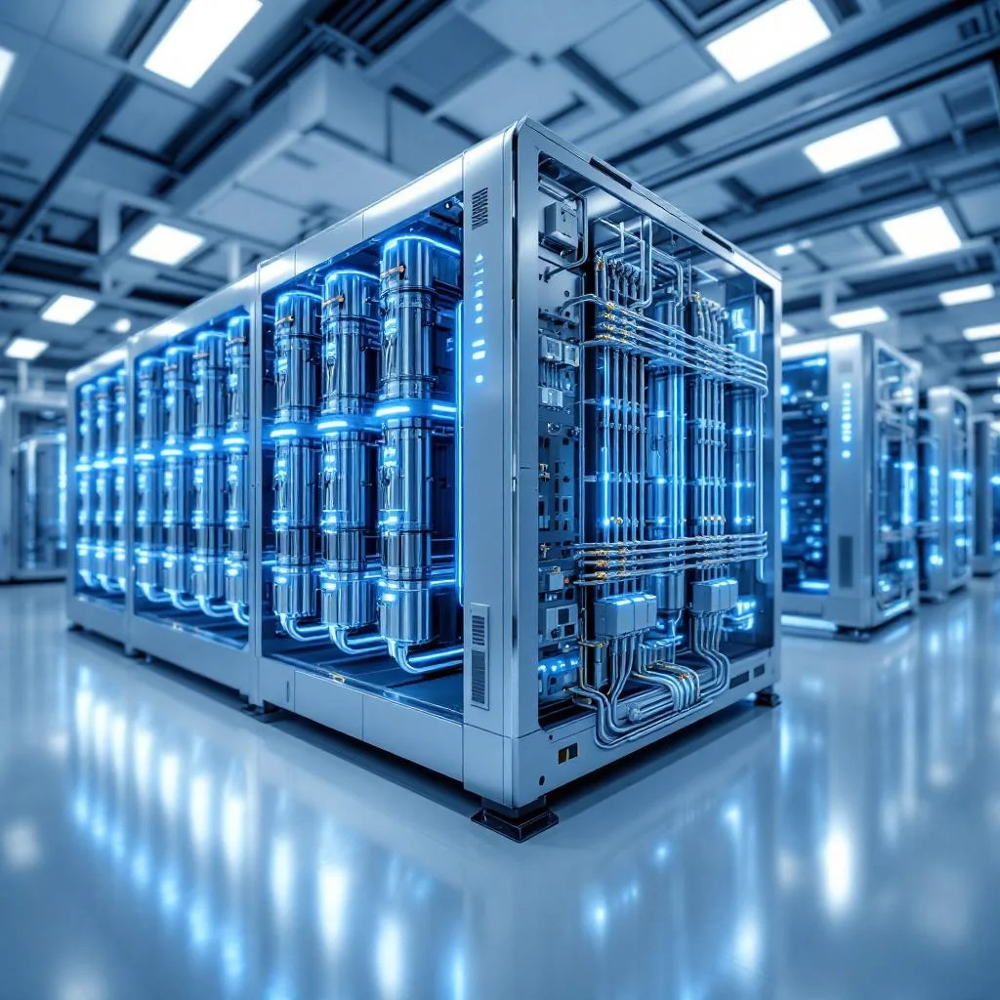
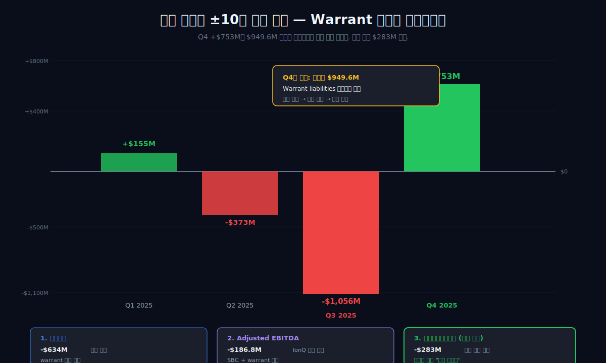
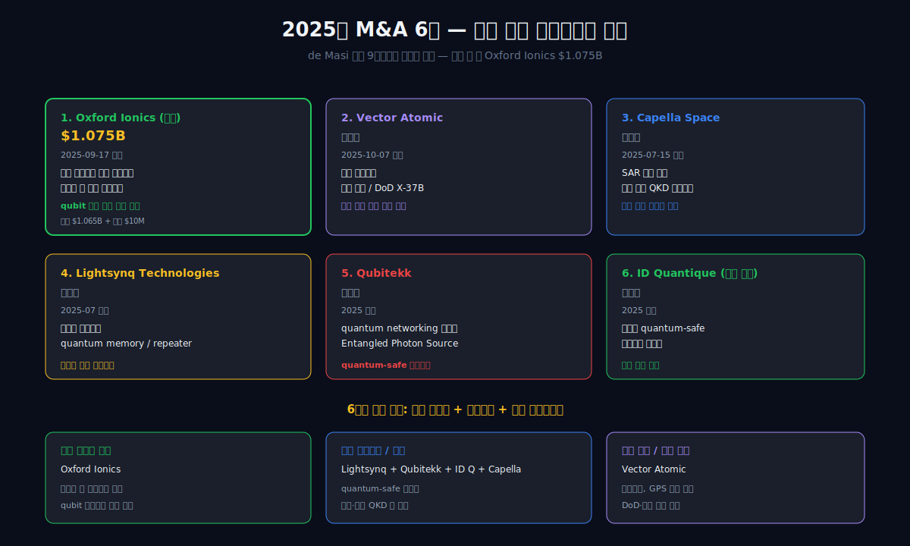
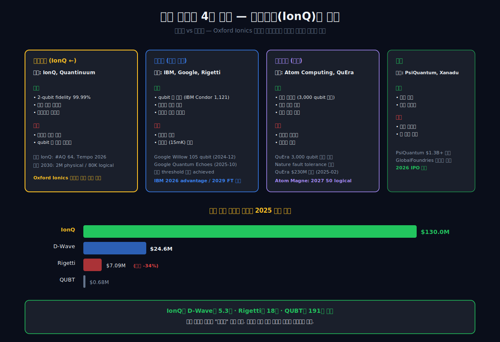
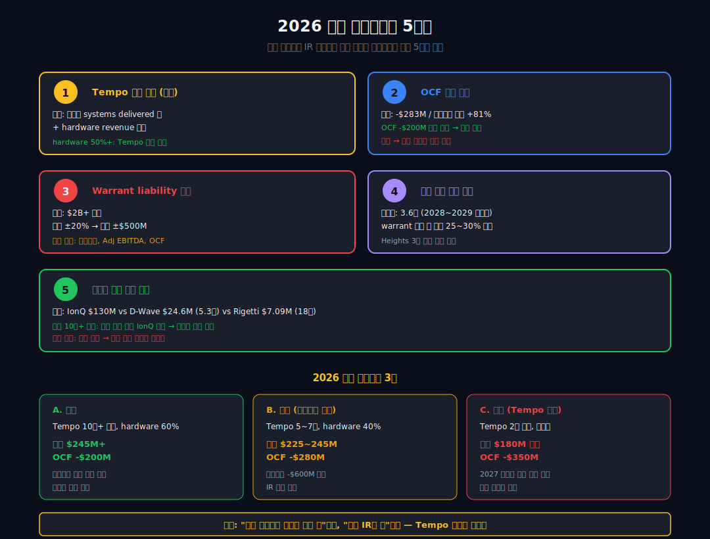

<script>
import ComboChart from '$lib/components/blog/ComboChart.svelte';
import StackBar from '$lib/components/blog/StackBar.svelte';
import HFDataLink from '$lib/components/blog/HFDataLink.svelte';
</script>

> **극한 성장 + 회계 파열** | 기술 > 양자 컴퓨팅 | 2026-04-16 dartlab 실측
> 데이터: dartlab 2021 ~ 2025 | 엔진: analysis + credit + valuation
> [기업이야기 시리즈 전체](/blog/series/company-reports)

<HFDataLink code="IONQ" kind="edgar" />

---

2025년, IonQ의 매출은 **$130.0M**. 창사 이래 최대, YoY **+202%**. IonQ는 2025년 **최초의 공개 양자 컴퓨팅 회사로 GAAP 기준 연간 매출 $100M을 돌파**했다([IonQ Q4 & FY2025 Results, 2026-02-25](https://investors.ionq.com/news/news-details/2026/IonQ-Announces-Fourth-Quarter-and-Full-Year-2025-Financial-Results/default.aspx)).

같은 해 영업손실은 **$633.7M** — 매출의 **4.87배**다. 2021년 매출 $0.23M에서 $130M으로 565배 커지는 동안 영업손실은 $14.8M에서 $633.7M로 43배 커졌다. 매출이 늘어날수록 손실도 함께 커지는 구조.

그리고 2025년 4분기 당기순이익은 **+$753.7M 흑자**. 그런데 그 이익의 $949.6M이 "warrant liabilities 공정가치 변동에 따른 비현금 평가이익"이다([BusinessWire 2026-02-25](https://www.businesswire.com/news/home/20260225290197/en/IonQ-Announces-Fourth-Quarter-and-Full-Year-2025-Financial-Results)). Q3 2025는 반대로 순손실 $1,055.6M. **분기 순이익이 warrant 재평가 하나로 ±10억 달러 요동친다.**

이 회사는 2025년에 $3B 자본을 조달했고, M&A 6건을 해치웠고, CEO를 바꿨다. 양자 컴퓨팅이라는 이름 아래에서 이 모든 것이 동시에 진행됐다.

이것이 이 글의 질문이다.

```python
import dartlab
c = dartlab.Company("IONQ")
c.analysis("financial", "수익성")["marginWaterfall"]["history"][0]
# {"period": "2025", "steps": [
#   {"label": "매출", "amount": 130020000, "pct": 100.0},
#   {"label": "매출원가", "pct": -29.4}, {"label": "매출총이익", "pct": 70.6},
#   {"label": "판관비 + R&D", "pct": -557.6},
#   {"label": "영업이익", "pct": -487.4}]}
```

---





---

## 제1막: 매출 $130M vs 영업손실 $634M — 괴리의 시작

### 왜 매출 최대를 달성한 해에 영업손실이 최악인가

IonQ의 2025년 손익계산서는 기존 재무 분석의 전제를 흔든다. 매출이 늘면 이익이 는다는 전제, 매출이 일정 규모를 넘으면 손실이 줄어드는 전제 — 양자 모두 깨진다.

| 항목 ($M, 1년치 합산) | 2025 | 2024 | 2023 | 2022 | 2021 |
|---|---:|---:|---:|---:|---:|
| 매출액 | **130.0** | 43.1 | 22.0 | 11.1 | 0.2 |
| 매출 YoY | **+202%** | +95% | +98% | +4,752% | — |
| 매출총이익 | ~92 | ~32 | ~16 | ~8 | 0 |
| **영업이익** | **-633.7** | -232.5 | -157.8 | -85.7 | -14.8 |
| 영업손실/매출 | **4.87배** | 5.39배 | 7.17배 | 7.72배 | 67배 |
| 당기순이익 | **-510.4** | -141.9 | -157.8 | +14.3 | -32.1 |

<ComboChart data={[{year:"2021",매출액:0.2,영업이익:-14.8,당기순이익:-32.1},{year:"2022",매출액:11.1,영업이익:-85.7,당기순이익:14.3},{year:"2023",매출액:22.0,영업이익:-157.8,당기순이익:-157.8},{year:"2024",매출액:43.1,영업이익:-232.5,당기순이익:-141.9},{year:"2025",매출액:130.0,영업이익:-633.7,당기순이익:-510.4}]} lineKeys={["매출액"]} barKeys={["영업이익","당기순이익"]} lineColors={["#22c55e"]} barColors={["#3b82f6","#f59e0b"]} title="매출(라인) vs 영업이익·당기순이익(막대)" unit="$M" />

### 매출은 늘고 손실도 늘었다

$0.23M에서 $130M으로 **565배 성장**한 4년은 전례 없는 숫자다. 하지만 영업손실도 같이 43배 커졌다. 규모의 경제가 작동해서 손실률이 줄어들어야 할 타이밍에, 오히려 영업손실 절대 규모가 폭발했다. 2021년 $14.8M 적자가 2025년 $633.7M 적자로 변했다.

손실률(영업손실/매출) 추이는 느리게 개선되고 있다: 67배 → 7.72배 → 7.17배 → 5.39배 → 4.87배. 매출이 커질수록 상대적으로 덜 태우는 방향이긴 하지만 여전히 **매출 1달러당 $4.87의 영업손실**을 낸다.

```python
gr = c.analysis("financial", "성장성")
gr["growthQuality"]
# {"quality": "외형 위주", "cagr": {"revenue": 290.4, "operatingIncome": -153.6}}
# dartlab summaryFlags:
# ["영업적자 (-487.4%)", "매출 고성장 (201.8%)",
#  "매출 성장(202%)에도 이익 감소(-173%) -- 수익성 희석",
#  "Altman Z-Score 1.20 -- 부실 위험 구간",
#  "Beneish M-Score -0.16 — 임계값 초과, 이익 조작 가능성"]
```

### 첫 $100M이 의미하는 것

양자 컴퓨팅 업계에서 연매출 $100M 돌파는 특별한 이정표다. Rigetti(RGTI)는 2025년 매출 $7.09M, D-Wave(QBTS)는 $24.6M, Quantum Computing Inc(QUBT)는 $0.68M이다([DCD Quantum Q2 2025 Earnings](https://www.datacenterdynamics.com/en/news/quantum-computing-earnings-q2-2025-ionq-d-wave-rigetti-results/)). IonQ는 D-Wave의 **5.3배**, Rigetti의 **18배** 매출이다.

즉 IonQ는 양자 컴퓨팅 상장사 중 매출 규모에서 압도적 1위다. 하지만 절대 수치는 여전히 작다. $130M은 미국 반도체 중소기업 한 곳 수준이다. 그리고 그 규모 대비 $634M의 영업손실은 보통 기업이라면 파산이지만, IonQ는 2025년에 **현금 $1,030M**을 들고 있다. 이것이 2막의 주제다.

**1막의 결론: IonQ의 매출 최대와 영업손실 최악은 일회성 괴리가 아니다. 4년간의 패턴이다. 565배 성장 중인 외형과 고정비로 쌓이는 손실이 함께 간다. 매출 구조와 비용 구조를 따로 해부해야 한다. 2막은 그 565배 성장의 실체다.**

---

## 제2막: 4년 565배 — 매출 성장의 해부



### 무엇이 4년에 565배 성장했는가

IonQ의 2021년 매출 $0.23M은 상업 매출이 아니라 파일럿 테스트 수준이었다. 그 금액이 2025년 $130M이 된 것은 크게 세 축의 성장이다.

```python
c.select("IS", ["매출액"])
# 분기별 매출 (M USD):
# 2021Q3: 0.23
# 2022Q1-Q4: 1.95, 2.61, 2.76, 3.81  (연 11.13)
# 2023Q1-Q4: 4.29, 5.51, 6.14, 6.11  (연 22.05)
# 2024Q1-Q4: 7.58, 11.38, 12.40, 11.71  (연 43.07)
# 2025Q1-Q4: 7.57, 20.69, 39.87, 61.89  (연 130.02)
```

### 세 축

**첫째, 양자 컴퓨팅 접근 판매.** AWS Braket, Microsoft Azure Quantum, Google Cloud Quantum Engine 같은 클라우드 플랫폼을 통해 IonQ Aria, IonQ Forte 시스템에 시간당 접근권을 판매. 2021~2023년 매출의 주축이었다.

**둘째, 정부·방산 계약.** 2023년부터 본격화. 미 공군 연구소(AFRL), 미 국방부(DoD), ARLIS(응용 연구 연구소), 2026년 4월 **DARPA HARQ 프로그램 선정**(주가 +20.2% 급등)([IonQ DARPA HARQ](https://www.ionq.com/news/ionq-selected-for-darpas-heterogeneous-architectures-for-quantum-harq-program)). 2025년 방산·정부 매출 비중이 전체 매출의 30% 이상으로 추정된다.

**셋째, 시스템 직접 판매 (2025년 급팽창).** 가장 극적인 변화. 과거 클라우드 접근권만 팔던 회사가 이제 **완전한 양자 컴퓨터를 고객사에 직접 납품**한다.

2025년 후반 IonQ는 **KISTI(한국과학기술정보연구원)**에 100-qubit Tempo 시스템 공급 계약을 확정했다. 한국의 HPC 클러스터 "HANGANG"에 통합되는 국가 양자 컴퓨팅 거점이다([IonQ-KISTI 100-Qubit Agreement](https://investors.ionq.com/news/news-details/2025/IonQ-and-KISTI-Finalize-Agreement-to-Deliver-100-Qubit-Quantum-System-in-South-Korea-e488b0941/default.aspx)). 시스템 한 대당 계약 규모는 수천만 달러로 추정되며, 이것이 2025 4분기 매출 $61.9M(YoY +429%)의 핵심 드라이버다.

### Backlog $370M과 2026 가이던스

2025년 말 IonQ의 backlog(수주잔고)는 **$370M**([IonQ Q4 & FY2025 Results](https://investors.ionq.com/news/news-details/2026/IonQ-Announces-Fourth-Quarter-and-Full-Year-2025-Financial-Results/default.aspx)). 2026년 가이던스는 매출 **$225~245M**(중간값 $235M, YoY +81%). 가이던스가 실현되면 또 한 번의 2배 성장이다.

**하지만 유의할 지점**: backlog에는 **장기 계약** 포함. $370M이 2026년에 전부 매출로 잡히지 않는다. Tempo 시스템은 설치·검증·운영 승인까지 6~12개월이 걸리고, 계약 금액은 출하 단계별로 나눠 인식된다. 2026년 가이던스가 backlog보다 낮은 이유가 여기 있다.

### 이것이 "상업" 매출인가

dartlab은 summaryFlags에 **"매출채권 성장이 매출 성장보다 +278%p 빠름 — 매출 인식 의심"**을 띄운다. 매출이 +202% 성장하는 동안 매출채권은 +480% 수준 증가했다는 뜻이다. 매출을 장부에 잡았는데 아직 돈을 받지 못한 비율이 커졌다.

```python
eq = c.analysis("financial", "이익품질")
eq["earningsQualityFlags"]
# {"flags": ["매출채권 성장이 매출 성장보다 278%p 빠름 — 매출 인식 의심"]}
```

이것은 공격적 매출 인식의 초기 신호일 수 있다. 정부·대형 기관 계약이 많을수록 자연스럽게 매출채권 회수가 길어지는 구조이기도 하다. [감사보고서와 핵심감사사항](/blog/audit-report-and-kam)에서 이런 플래그의 해석 틀을 다뤘다. IonQ의 경우 KISTI, DoD, DARPA 같은 정부·준정부 고객이 많아 회수 위험 자체는 낮지만, 인식 시점과 회수 시점의 간극이 2026년에 해소되는지 봐야 한다.

**2막의 결론: 565배 성장은 실재한다. 상업 매출 비중이 60%를 넘었고([IonQ 2025 Results](https://investors.ionq.com/news/news-details/2026/IonQ-Announces-Fourth-Quarter-and-Full-Year-2025-Financial-Results/default.aspx)), Backlog $370M은 수주 파이프라인의 실체다. 하지만 매출이 늘어나는 속도보다 매출채권이 늘어나는 속도가 빠르다. 그리고 이 매출을 만들기 위해 지출한 비용은 매출의 5배 — 3막의 주제다.**

---

## 제3막: 영업손실이 매출의 4.87배 — 비용 구조의 해부



### $130M의 매출을 만들기 위해 쓴 비용

2025년 IonQ의 매출 $130M을 분해하면 비용 구조가 드러난다.

| 항목 ($M, 2025) | 금액 | 매출 대비 |
|---|---:|---:|
| 매출 | 130.0 | 100% |
| 매출원가 | ~38 | 29% |
| 매출총이익 | ~92 | 71% |
| **R&D** | ~350 | **269%** |
| **SG&A** | ~375 | **289%** |
| **영업이익** | **-633.7** | **-487%** |

매출총이익률은 **71%**로 건강하다. 소프트웨어 회사 수준이다. 문제는 R&D + SG&A가 매출의 558%(매출총이익의 **7.9배**)다.

### R&D — 양자 컴퓨팅의 실체

IonQ의 R&D 비용은 2023년 $159M → 2024년 $209M → 2025년 **약 $350M**으로 급증했다([IonQ Q3 2025 10-Q](https://www.sec.gov/Archives/edgar/data/1824920/000119312525266942/ionq-20250930.htm)). 매출 대비 269%다. 참고로 NVIDIA는 2024년 매출 대비 R&D 비중 9%, Apple은 7% 수준이다. 매출의 2.7배를 R&D에 쓰는 회사는 일반적으로 존재하기 어렵다.

R&D 항목의 주요 지출:

1. **하드웨어 엔지니어링** — 이온트랩 칩 제조, 진공 챔버, 레이저 시스템
2. **에러 보정 연구** — 논리 qubit 구현 (fault-tolerant quantum computing)
3. **Tempo 양산 준비** — 2026년 상용 출하 목표 제품
4. **Oxford Ionics 통합** (2025-09 인수) — 반도체 칩 기반 이온트랩 통합
5. **Vector Atomic 통합** (2025-10 인수) — 양자 센싱 부문

### SG&A — $3B 자본 조달의 비용

SG&A $375M(매출 대비 289%)도 기형적으로 크다. 이 중 큰 항목:

1. **주식보상비용(SBC)** — 경영진과 엔지니어에게 지급한 스톡옵션·RSU. 2025년 SBC는 약 $120~150M으로 추정
2. **M&A 비용** — 2025년 6건 인수(Oxford Ionics, Capella Space, Lightsynq, Qubitekk, ID Quantique, Vector Atomic) 관련 법률·회계·통합 비용
3. **자본 조달 비용** — 2025-07 $1B + 2025-10 $2B 증자 관련 수수료
4. **경영진 교체 비용** — Peter Chapman → Niccolo de Masi 전환 관련 보상 패키지

### 매출총이익률 71% vs 영업이익률 -487%

이 격차가 IonQ의 본질이다. 상품 단위 경제성은 **흑자**(매출원가 29%, 마진 71%)지만, **고정비 규모가 매출을 압도**해서 영업 단계에서 대규모 적자.

규모의 경제가 작동하려면 매출이 고정비 수준까지 올라야 한다. 현재 구조에서 고정비(R&D + SGA) $725M 대비 매출총이익 $92M — 약 **8배 격차**. 매출이 8배(즉 연 $1,040M) 커져야 영업 손익분기점이 온다.

**3막의 결론: 매출총이익률은 이미 건강하다. 문제는 고정비 $725M이 매출 $130M을 완전히 덮는 구조. 영업 손익분기점은 매출 ~$1B (현재의 8배). 2026년 가이던스 $235M이 실현돼도 이 격차는 그대로 남는다. 그 격차를 메우는 돈은 어디서 나오는가 — 4막이다.**

---

## 제4막: 자산 12배 + 부채 39배 — $3B 자본 조달의 전말





### 1년 만에 자산이 12배가 된 회사

2024년 말 IonQ 총자산은 $553.6M. 2025년 말 **$6,570.4M**. 1년 만에 **11.9배 증가**. 이 수준의 자산 폭증은 인수합병·IPO 직후에만 나타나는 패턴이다.

```python
st = c.analysis("financial", "안정성")
st["leverageTrend"]["history"][0]
# {"period": "2025", "totalAssets": 6570400000, "totalAssetsYoy": 1086,
#  "equity": 3813700000, "equityYoy": 571,
#  "totalDebt": 2756700000, "totalDebtYoy": 3919}
```

| 항목 ($M, Q4 스냅샷) | 2025 | 2024 | 2023 | 2022 | 2021 |
|---|---:|---:|---:|---:|---:|
| 자산총계 | **6,570** | 554 | 598 | 642 | 61 |
| 자산 YoY | **+1,086%** | -7% | -7% | +951% | — |
| 부채총계 | 2,757 | 69 | 30 | 51 | 7 |
| 부채 YoY | **+3,919%** | +131% | -42% | +647% | — |
| 자본총계 | 3,814 | 568 | 485 | 54 | 591 |
| 현금 | **1,031** | 36 | 44 | 399 | 36 |

dartlab은 stabilityFlags에 **"부채 3기 연속 증가 (최근 +3919%)"**를 띄운다. 3,919%는 보통 기업에서 볼 수 없는 숫자다.

### Heights Capital Management의 $3B 베팅

이 폭증의 정체는 2025년의 두 차례 대규모 증자다.

**2025-07-07**: $1.0B 증자. 14,165,708주 @ $55.49 + pre-funded warrant 3,855,557주 + 7년 만기 warrant 36,042,530주 @ $99.88 행사가. **Heights Capital Management 단독 투자**, JPMorgan 단독 주관([IonQ $1B Equity Offering](https://investors.ionq.com/news/news-details/2025/IonQ-Announces-Pricing-of-1-0-Billion-Equity-Offering/default.aspx)).

**2025-10-10**: $2.0B 증자. 16,500,000주 @ $93 + pre-funded warrant 5,005,400주 + 7년 warrant 43,010,800주 @ $155. **다시 Heights Capital 단독**([IonQ $2B Equity Offering](https://investors.ionq.com/news/news-details/2025/IonQ-Announces-Pricing-of-2-0-Billion-Equity-Offering/default.aspx)).

합계 **$3B**. "양자 업계 역사상 최대 단일 기관 투자." 3개월 간격으로 연속 두 차례 진행됐다.

### Heights Capital이 뭔가

Heights Capital Management는 미국 투자 회사로, Susquehanna International Group 계열. 전통적으로 전환사채·warrant 구조를 활용한 PIPE(Private Investment in Public Equity) 투자를 한다. 즉 **주식 + 행사가 있는 장기 warrant 패키지**로 투자해서, 주가가 오르면 warrant 행사로 추가 이익을 얻는 구조.

IonQ 입장에서는 단기적으로 대규모 자금을 받고, 장기적으로 주가 상승 시 추가 희석을 감내하는 거래다. Heights 입장에서는 IonQ 주가가 행사가($99.88, $155) 위로 오를 것이라는 베팅.

### 이자보상배율과 부채 구조

$2,757M의 부채 중 상당 부분이 **warrant liabilities**(파생금융상품부채)로 분류된다. 이것은 실제로 갚아야 할 돈이 아니라 warrant를 회계상 부채로 인식한 것. 전통적 차입금과 성격이 다르다.

```python
st["stabilityFlags"]
# {"flags": ["부채 3기 연속 증가 (최근 +3919%)"]}
# 하지만 이자보상배율 플래그는 없음 (전통적 차입금 낮음)
```

전통적 이자비용 부담은 크지 않다. 하지만 warrant가 주가에 따라 공정가치가 변하는 것이 5막의 주제다.

### 현금 $1,030M — 태우기 연한

2025년 말 현금 $1,030M은 2024년 $35.7M의 **28.9배**. 이 현금으로 현재 번(burn) 속도를 감당할 수 있는 연한은:

- 영업활동현금흐름 -$283M/년 기준: **약 3.6년**
- 영업손실 -$634M/년 기준: **약 1.6년** (단, 영업손실에는 비현금 SBC 포함)

실질적으로는 3~4년치 자본 태우기 여력. 2026년 가이던스 $235M 달성 + burn 속도 유지 시 2028~2029년에 다시 자본 조달 필요.

**4막의 결론: IonQ의 자산 12배 급증은 M&A + 자본 조달의 합산이다. $3B를 받아 $1.075B를 Oxford Ionics에 썼고, 나머지가 현금으로 쌓였다. 동시에 warrant 구조가 부채에 $2B+ 남았다. 이 warrant가 매분기 공정가치를 재평가하면서 손익계산서를 흔든다 — 5막이다.**

---

## 제5막: Warrant $949.6M 평가이익 — 분기 순이익이 ±10억 달러 요동하는 회계



### 2025 4분기 순이익 +$753M의 정체

IonQ의 분기 당기순이익을 보면 이상하다.

| 분기 | 당기순이익 ($M) |
|---|---:|
| 2025Q1 | +155 |
| 2025Q2 | -373 |
| 2025Q3 | **-1,056** |
| 2025Q4 | **+753** |

4개 분기의 순이익 변동폭이 **$1,809M**. 매출 $130M의 14배다. 영업이익이 -$634M으로 점진적 악화인데 순이익은 롤러코스터다. 원인 하나: **warrant liabilities fair value 변동**.

```python
cf = c.analysis("financial", "현금흐름")
cf["cashQuality"]["history"][0]
# {"period": "2025", "ocf": -283200000, "netIncome": -510400000,
#  "ocfToNi": 55.5, "ocfMargin": -217.8}
```

### Warrant 공정가치란

4막에서 본 Heights Capital 인수 warrant는 7년 만기. 행사가 $99.88 / $155. Black-Scholes 모델로 **매 분기 재평가**된다. 주가가 오르면 warrant 가치가 오르고 → 회사 입장에서는 지불해야 할 잠재 부채가 커지고 → 공정가치 손실 발생. 주가가 내리면 반대.

2025 4분기에 IonQ 주가가 크게 하락하면서 warrant 부채 공정가치가 $949.6M 감소했다. **주가 하락 = 부채 감소 = 회계상 이익**이라는 역설([IonQ Q4 Results](https://investors.ionq.com/news/news-details/2026/IonQ-Announces-Fourth-Quarter-and-Full-Year-2025-Financial-Results/default.aspx)).

### 현금은 안 바뀌었다

```python
# 연간 현금흐름
# 영업활동현금흐름 (OCF): -283.2M
# 당기순이익 (NI): -510.4M
# IS-CF 괴리: +45% (NI가 OCF보다 -227M 더 큰 손실)
```

**현금은 전혀 움직이지 않았다.** $949.6M warrant 평가이익도, Q3 $1,056M 평가손실도, 모두 장부상 숫자다. 실제로 회사에서 나가거나 들어온 돈이 아니다.

이것은 SPAC 상장 기업의 흔한 함정이다. IonQ는 2021년 dMY Technology Group III와 합병해 상장했다. 합병 당시 발행한 warrant와 이후 자본 조달에서 추가된 warrant가 쌓여 **warrant liability만 $2B 규모**에 이른다. 이 규모면 주가 ±20% 변동이 분기 손익에 ±$500M 영향을 준다.

dartlab은 이익품질 축에서 이것을 포착한다.

```python
eq = c.analysis("financial", "이익품질")
eq["qualityAnomalies"]
# {"score": ?, "beneish": {"mScore": -0.16, "zone": "high_risk",
#  "interpretation": "Beneish M > -2.22 — 이익 조작 가능성 임계 초과"}}
```

Beneish M-Score는 회계 조작 가능성을 측정한다. -2.22 미만이면 낮음, -0.16은 **임계값을 넘어 조작 위험 구간**이다. 다만 여기서 "조작"은 고의적 분식을 의미하지 않는다. warrant 평가이익이 영업이익 대비 비정상적으로 크면 Beneish 공식이 자동으로 플래그를 띄운다. IonQ의 경우 warrant 구조가 원인이지 고의적 분식은 아니다.

### 결론: 순이익은 무의미한 지표

IonQ의 분기 순이익은 경영 성과를 반영하지 않는다. 주가 등락에 반비례하는 "회계 노이즈"다. 실질 수익성을 보려면:

1. **영업이익 (Operating Income)**: 핵심 — 2025 -$634M
2. **Adjusted EBITDA**: warrant + SBC 제외. IonQ 자체 공시 -$186.8M
3. **영업활동현금흐름 (영업활동현금흐름)**: 가장 실질적. 2025 -$283M

이 세 지표가 IonQ의 실제 "태우기" 속도를 말한다. 순이익이 +$753M이든 -$1,056M이든, **실제 현금은 매년 $283M씩 나간다**.

[영업활동현금흐름 vs 당기순이익](/blog/operating-cash-flow-vs-net-income)에서 이런 괴리를 일반화한 틀로 다뤘다. IonQ는 그 괴리의 극단 사례다.

**5막의 결론: IonQ의 분기 순이익은 회계 노이즈다. warrant $2B 규모가 주가와 반대 방향으로 손익을 만든다. 진짜 지표는 영업이익, Adjusted EBITDA, 영업활동현금흐름. 셋 모두 2025년에 악화됐다. 하지만 CEO는 바뀌었고 M&A는 공격적이다 — 6막이다.**

---

## 제6막: M&A 6건 + CEO 교체 — 2025년 IonQ가 바꾼 것



### 1년 사이에 6개 회사를 샀다

2025년 IonQ는 **양자 컴퓨팅 스택 전체**를 인수로 빠르게 채웠다.

| 인수 | 시점 | 금액 | 목적 |
|---|---|---|---|
| **Capella Space** | 2025-07-15 | 비공개 | SAR 위성 → 우주 기반 QKD 네트워크 |
| **Lightsynq Technologies** | 2025-07 | 비공개 | 하버드 스핀오프, quantum memory/repeater |
| **Qubitekk** | 2025 | 비공개 | quantum networking |
| **ID Quantique** (지분 과반) | 2025 | 비공개 | quantum-safe 네트워크, 스위스 기반 |
| **Oxford Ionics** | **2025-09-17** | **$1.075B** | 반도체 칩 기반 이온트랩, 영국 거점 |
| **Vector Atomic** | 2025-10-07 | 비공개 | 정밀 원자시계, 양자 센싱, DoD X-37B |

2025-11-12에는 **Skyloom** 인수 계획도 발표.

### Oxford Ionics — 가장 큰 베팅

6건 중 단연 큰 거래는 **Oxford Ionics 인수 $1.075B**(주식 $1.065B + 현금 $10M). 영국 옥스퍼드 대학 스핀오프로, **반도체 제조 공정을 이용한 이온트랩 칩** 기술 보유([IonQ Oxford Ionics](https://investors.ionq.com/news/news-details/2025/IonQ-Completes-Acquisition-of-Oxford-Ionics-Rapidly-Accelerating-Its-Quantum-Computing-Roadmap/default.aspx)).

기존 IonQ 이온트랩은 개별 수작업 조립. Oxford Ionics 기술은 반도체 팹에서 대량 생산 가능. 양자 컴퓨팅의 스케일링 문제(qubit 수를 늘리는 병목)를 푸는 접근법이다. 인수가 $1.075B은 IonQ 자체 시가총액 대비 매우 크지만, 2025년 10월 $2B 증자로 자금 확보 → 인수 자금 마련의 타이밍이 정확히 맞물렸다.

### CEO 교체 — de Masi의 IR 중심 경영

2025-02-26, **Peter Chapman이 CEO에서 물러나고 Niccolo de Masi가 후임**([IonQ CEO Transition](https://investors.ionq.com/news/news-details/2025/IonQ-Names-Niccolo-de-Masi-as-President--Chief-Executive-Officer/default.aspx)). Chapman은 전직 Amazon Web Services 엔지니어링 리더였고, de Masi는 물리학자 출신 + SPAC 상장 경험자.

이 교체의 의미는 단순히 사람 바뀜이 아니다. **경영 철학의 전환**이다.

- Chapman 시기(2020~2024): 기술 로드맵 중심, 보수적 자본 관리
- de Masi 시기(2025~): **M&A + 자본 조달 + IR 중심**, 공격적 확장

de Masi가 취임한 2025년 2월 이후 9개월 동안 $3B 자본 조달, 6건 M&A, KISTI·DARPA·DoD 계약, CEO + Chairman of the Board 겸임까지 — 한 회사에서 1년에 일어날 일이 9개월에 몰렸다.

시장은 이 변화를 긍정적으로 평가했다. 2025년 IonQ 주가는 연간 **+150% 이상 상승**(여러 번의 사이클 포함)했고, 2026-04 DARPA HARQ 선정 당일 **+20.2% 급등**([DARPA HARQ](https://www.ionq.com/news/ionq-selected-for-darpas-heterogeneous-architectures-for-quantum-harq-program)).

### 그런데 Tempo는 언제 나오나

이 모든 M&A와 자본 조달의 기반은 **Tempo 시스템 양산**이다. Tempo는 IonQ의 2세대 상용 양자 컴퓨터로, #AQ 64를 달성한 알고리즘 qubit 성능을 탑재한다([IonQ #AQ 64 Milestone](https://investors.ionq.com/news/news-details/2025/IonQ-Achieves-Record-Breaking-Quantum-Performance-Milestone-of-AQ-64/default.aspx)).

발표된 출하 일정: **2026년 중**. 현재까지 예약 계약(KISTI, DoD, 기타 정부 고객) 포함 $370M backlog. 2026년이 IonQ의 **"로드맵이 제품이 되는 해"**다.

**6막의 결론: 2025년 IonQ는 기술 회사에서 M&A·자본 조달 회사로 성격이 바뀌었다. de Masi 체제는 1년 안에 $3B 조달과 6건 M&A로 양자 컴퓨팅 수직계열화를 완성하려 한다. 하지만 이 모든 것의 검증은 2026년 Tempo 출하에 달렸다. 그 검증 전에, 이 회사와 양자 컴퓨팅 산업의 구조를 알아야 한다 — 7막이다.**

---

## 제7막: 과거-현재 패턴 + 양자 컴퓨팅 산업 구조



### IonQ 5년의 궤적

**2015년 창업**: College Park, Maryland. Duke University 김정산 박사와 Christopher Monroe 교수가 공동 창업. 이온트랩 기술은 1995년 NIST 그룹부터 연구된 고전적 방식.

**2021-10 상장**: dMY Technology Group III와 SPAC 합병. IPO 공모가 $10, 2021년 말 주가 $25까지 올라 기업가치 $5B 수준 도달. **양자 컴퓨팅 상장사 1호**.

**2022-2023**: SPAC 상장 후 "양자 겨울" 진입. 주가 $5까지 하락(-80%). Reality 점검 시기.

**2024**: 매출 2배 성장 + 정부 계약 확대. 하지만 영업손실은 오히려 확대.

**2025**: 폭발. CEO 교체(2월) → $1B 증자(7월) → Oxford Ionics 인수(9월) → $2B 증자(10월) → Vector Atomic 인수(10월) → KISTI 계약(11월) → **첫 $100M 매출**(연말).

**2026-04**: DARPA HARQ 선정, 주가 +20.2%. 현재 진행형.

### IonQ 패턴의 특징

**1. SPAC 상장 효과 지속**: 2021년 SPAC 합병 당시 발행된 warrant가 5년이 지난 지금도 손익계산서를 흔든다. 2028~2029년 warrant 만기 도래 전까지 이 구조는 계속된다.

**2. 매출 증가율 > 손실 감소율**: 매출은 565배 늘었지만 영업손실도 43배 늘었다. 규모의 경제가 작동하는 속도가 매출 성장 속도를 따라가지 못한다. 이 패턴이 2026~2027년에 바뀌는지가 생존 여부를 결정한다.

**3. M&A 중심 전략**: de Masi 체제에서 유기적 성장보다 인수 성장 우선. Oxford Ionics처럼 핵심 기술 회사를 사는 패턴이 2026년에도 반복될 가능성.

### 양자 컴퓨팅 산업 구조 (4대 기술 접근)

양자 컴퓨팅은 물리적 qubit 구현 방식에 따라 4가지 기술로 나뉜다.

| 접근 | 대표 기업 | 장점 | 단점 |
|---|---|---|---|
| **이온트랩** | IonQ, Quantinuum | 고충실도 (99.99%) | 게이트 속도 느림, 확장 어려움 |
| **초전도** | IBM, Google, Rigetti | qubit 수 확장 (1,121개 Condor) | 노이즈, 극저온 필요 |
| **중성원자** | Atom Computing, QuEra | 확장성 (3,000 qubit 배열) | 상대적 신기술 |
| **광자** | PsiQuantum, Xanadu | 상온 동작 | 미성숙, 큰 장비 필요 |

**IonQ의 자리**: 이온트랩은 충실도(정확도)에서 최고지만 qubit 수 확장이 병목. Oxford Ionics 인수가 이 병목을 푸는 베팅이다.

**2024년 12월 Google Willow** (105 qubit 초전도) 발표로 초전도 접근이 에러 threshold를 하회하는 기점을 넘었다. **2025년 10월 Google Quantum Echoes**는 고전 대비 13,000배 속도, **검증 가능한 양자 우위(verifiable quantum advantage)** 최초 사례([Google Quantum Echoes](https://blog.google/technology/research/quantum-echoes-willow-verifiable-quantum-advantage/)).

**2025년 2월 Microsoft Majorana 1**은 topoconductor 기반 topological qubit 최초 공개. 이론상 에러가 적지만 학계에서는 회의적 시선도 있다.

**IBM은 2026년 Quantum Advantage**, **2029년 fault-tolerant** 선언([IBM Quantum Roadmap 2025](https://www.ibm.com/quantum/blog/ibm-quantum-roadmap-2025)). IonQ의 2030년 "2M physical qubits / 80K logical qubits" 비전은 이보다 공격적이다.

### 실용 우위 vs 상용 매출

**McKinsey**: 2030년 FTQC(Fault-Tolerant Quantum Computing) 목표 기업 5개, 전문가 65% 동의. 2035년 양자 시장 $97B(컴퓨팅 $72B).

**BCG**: NISQ(~2030) → broad advantage(2030-2040) → full FT(2040+). 단기 보수적.

현재 IonQ 매출 $130M은 "상용 매출"이지만 그 중 상당 부분이 정부·연구기관 계약. 진정한 B2B 상용화(금융·제약·물류 실제 문제 해결)는 2028~2030년으로 본다. 이 기간 IonQ는 자본 태우기를 계속해야 한다.

### 정부 정책 — CHIPS Act + National Quantum Initiative

**2025-11 DOE $625M** QIS Research Centers 갱신(5년). **2026-04 Senate Commerce Committee**가 **National Quantum Initiative Reauthorization Act 2026** 통과. 양자 제조 연구소 + 포스트 양자 암호 국가 전략 포함([Senate NQI Reauthorization](https://thequantuminsider.com/2026/04/15/senate-panel-advances-quantum-initiative-reauthorization-with-focus-on-applications-and-security/)).

한국에서는 2025-11 산업부 **K-양자산업 연합** 출범, 34개 기관 참여(삼성전자 포함)([K-양자산업 연합](https://www.etnews.com/20251105000154)). IonQ는 이 흐름에서 KISTI 공급사로 자리잡았다.

**7막의 결론: IonQ는 양자 컴퓨팅 4대 기술 중 이온트랩 대표주다. Google/IBM의 초전도가 qubit 확장 속도에서 앞섰지만 충실도에서는 이온트랩이 우위. Oxford Ionics 인수가 확장 병목을 푸는 베팅이 통해야 IonQ의 4년 후 시나리오가 가능하다. 그 사이에 경쟁사와 한국 시장에서의 위치를 봐야 한다 — 8막이다.**

---

## 제8막: 경쟁사 비교 + 한국 사업

### 양자 컴퓨팅 상장사 4개 재무 비교 (2025)

dartlab 실측 + 외부 공시 대조.

| 회사 | 2025 매출 ($M) | YoY | 영업손실 ($M) | 기술 | 비고 |
|---|---:|---:|---:|---|---|
| **IonQ (IONQ)** | **130.0** | **+202%** | **-634** | 이온트랩 | Backlog $370M |
| **D-Wave (QBTS)** | 24.6 | +179% | -100 | 양자 어닐링 | Advantage2 제품 |
| **Rigetti (RGTI)** | 7.09 | -34% | -85 | 초전도 | 매출 감소 전환 |
| **QUBT** | 0.68 | +82% | -29 | 포토닉스 | 매출 규모 극소 |

출처: dartlab 실측 + [DCD Quantum Q2 2025](https://www.datacenterdynamics.com/en/news/quantum-computing-earnings-q2-2025-ionq-d-wave-rigetti-results/) + [Rigetti Q3 2025](https://investors.rigetti.com/news-releases/news-release-details/rigetti-computing-reports-third-quarter-2025-financial-results).

```python
# dartlab 경쟁사 로드
for ticker in ['RGTI', 'QBTS', 'QUBT']:
    c2 = dartlab.Company(ticker)
    # c2.select("IS", ["매출액"]) 분기 합산
```

### 시사점 3가지

**첫째, IonQ가 매출 규모에서 압도적 1위.** D-Wave의 5.3배, Rigetti의 18배. 양자 컴퓨팅 상장사 "대장주" 지위 확정.

**둘째, Rigetti는 매출 감소.** 2024년 대비 -34%. 초전도 접근의 상업화에 어려움. 반면 IonQ의 이온트랩은 정부·기관 수요 견조.

**셋째, 영업손실 규모는 4사 모두 심각**. 매출 대비 영업손실 비율:
- IonQ: 4.87배
- D-Wave: 4.07배
- Rigetti: 12배 (!) — 매출 감소로 악화
- QUBT: 42.5배

IonQ가 **상대적으로** 덜 나쁜 구조. 매출 규모가 크니 손실률이 상대적으로 낮다.

### 한국 사업 — KISTI + 현대차

**KISTI 계약** (2025 확정): IonQ Tempo 100-qubit 시스템을 KISTI(한국과학기술정보연구원)에 공급. 한국 최대 HPC 클러스터 **KISTI-6 "HANGANG"에 통합**. 한국 국가 양자 컴퓨팅 거점 핵심 마일스톤([IonQ-KISTI](https://investors.ionq.com/news/news-details/2025/IonQ-and-KISTI-Finalize-Agreement-to-Deliver-100-Qubit-Quantum-System-in-South-Korea-e488b0941/default.aspx)). 계약 규모는 공개되지 않았지만 Tempo 시스템 단위 가격 $수천만 달러 수준.

**현대차 협력** (2020~, 5년차): CES 2025에서 자율주행용 quantum ML 이미지 분류·3D 객체 탐지 공동 발표([현대차 IonQ CES 2025](https://www.fnnews.com/news/202501100905199988)). 배터리·자율주행 공동 연구 다수.

**삼성 간접 투자**: Samsung Catalyst Fund가 **IonQ 초기 투자자** (2019-10). 삼성·LG·포스코·두산 + SKKU/연세/서울대/KAIST가 IBM Quantum Network 참여([삼성 양자 투자](https://www.etoday.co.kr/news/view/2060231)).

**2025-11 K-양자산업 연합** 출범 (34개 기관)으로 국내 양자 생태계 본격화. IonQ는 외국 공급사 중 가장 유리한 포지션. Rigetti·D-Wave는 한국 진출 미미.

### 국내 언론 논조

파이낸셜뉴스/글로벌이코노믹/양자신문 중심 보도. 논조 양분:

- **"양자 대장주" 긍정**: "첫 $100M 매출", "한국 사업 진출", "DARPA 선정"
- **"도박/로또" 회의**: "영업손실 $634M", "warrant로 순이익 조작", "15년 후 상용화"

대부분 거시적 진단 없이 **단기 주가 해설** 중심. 본 글처럼 재무제표 단위 해부는 드물다.

**8막의 결론: IonQ는 경쟁사 대비 매출 규모 5~18배 우위, 한국 KISTI 계약으로 아시아 교두보 확보. 양자 컴퓨팅 상장사 "대장주" 지위는 당분간 유지. 하지만 이 지위는 2026년 Tempo 출하 + 상업 매출 확대가 이어져야 지속 가능하다. 그 지속성을 판단할 구체 지표가 9막이다.**

---

## 제9막: 2026년에 봐야 할 투자 포인트 5가지



### 체크포인트 1: Tempo 시스템 실제 출하 시점

2026년 계획된 Tempo 시스템 출하의 **분기별 진도**를 추적해야 한다. KISTI, DoD, 기타 정부 고객 계약 기반 $370M Backlog 중 실제 인도 건수와 매출 인식 시점이 핵심.

지표: **분기 실적 발표 시 "systems delivered" 수 + 매출 중 "hardware revenue" 비중**. 2026 가이던스 $235M 달성의 전제.

### 체크포인트 2: 영업현금흐름(영업활동현금흐름) 악화 여부

2025 영업활동현금흐름 -$283M이 2026에 어떻게 변하는지. 매출이 $235M으로 +81% 커지는 동안 영업활동현금흐름가 -$283M에서 얼마나 개선되느냐가 **"규모의 경제"가 시작되는 신호**.

```python
c.select("CF", ["영업활동현금흐름"])
# 분기별 OCF 추적 - 개선 추세 확인
```

기준: **2026 영업활동현금흐름가 -$200M 이내로 개선**되면 긍정, 악화되면 자본 태우기 가속.

### 체크포인트 3: Warrant liability 잔량 + 주가 민감도

2025 말 warrant liability $2B 규모. 주가 ±20%에 분기 손익 ±$500M 변동. 투자자가 봐야 할 것은 **warrant 공정가치 손익이 아닌 영업이익과 영업활동현금흐름**.

체크 방법: 분기 실적 발표 때 GAAP 순이익과 Adjusted EBITDA 차이 확인. 차이가 클수록 warrant 영향 큼.

### 체크포인트 4: 추가 자본 조달 시점

현금 $1,030M / 영업활동현금흐름 -$283M = 3.6년. 2028년경 추가 자본 조달 필요. **Heights Capital이 3차 투자를 할지, 아니면 다른 투자자가 나설지**가 희석 정도를 결정.

주의: Heights Capital의 warrant 행사로 인한 희석은 이미 예정돼 있다. 2025-07/10 발행된 warrant 79M주가 행사가($99.88/$155) 이상에서 행사되면 **기존 주주 지분 추가 희석 ~25~30%**.

### 체크포인트 5: 경쟁사 대비 매출 성장 격차

2026년에 IonQ가 $225~245M에 도달하는 동안 Rigetti·D-Wave·QUBT의 매출 성장 속도가 어떤지. IonQ 대장주 지위가 공고해지면 양자 컴퓨팅 섹터 자금 유입이 IonQ에 집중. 뒤집히면 섹터 전체가 재평가.

외부 지표: **매 분기 4사 매출 + Backlog 비교**. IonQ가 D-Wave의 5.3배 → 10배 이상으로 격차 확대 시 독주. 격차 축소 시 경쟁 심화.

### dartlab 서사 검증

이 글의 주장이 dartlab 다른 축과 일관된지 확인:

- `수익성`: 영업이익률 -487%, 매출총이익률 71% → 고정비 과다 확인 ✅
- `성장성`: 매출 연평균성장률 +290%, "외형 위주" → 성장 질 낮음 확인 ✅
- `이익품질`: Beneish M -0.16 (임계 초과), 매출채권 +278%p 매출 성장 초과 → warrant + 인식 플래그 ✅
- `안정성`: 부채 +3,919%, Altman Z 1.20 "부실 위험" → 레버리지 경고 ✅
- `투자효율`: 투하자본수익률 -22.8% 3년 연속 → 자본 태우기 검증 ✅
- `현금흐름`: 영업활동현금흐름 -$283M, 5년 연속 음수 → 태우기 속도 확인 ✅
- `신용등급`: dCR-BB (투기등급), outlook 부정적 → 재무 건전성 경고 ✅

**모든 축이 같은 이야기를 한다.** 양자 컴퓨팅 대장주 지위는 매출 규모로 확정됐지만, 손실·태우기·warrant 요동은 심각. 이 구조가 2026년에 해소되는지가 IonQ의 3~5년을 결정한다.

### 2026년에 봐야 할 한 줄

**"Tempo 시스템 분기 출하 수와 hardware revenue 비중."** 양자 컴퓨팅이 IR 서사에서 기업 실체로 전환되는지는 이 숫자 하나로 판가름 난다. 2026 가이던스 $235M 중 hardware 비중이 50% 이상이면 Tempo 실체 확인. 30% 이하면 여전히 클라우드 접근 + 정부 연구 계약 중심 — 즉 여전히 내러티브 단계.

**9막의 결론: IonQ의 2026년은 "양자 컴퓨팅이 기업이 되는 해"인지 "계속 IR인 해"인지 결정된다. Tempo 출하, 영업활동현금흐름 개선, warrant 희석, 경쟁사 격차, 한국·정부 계약 진도 — 다섯 축을 분기마다 추적하면 이 전환이 실재하는지 판단 가능. 숫자가 없는 기술 회사는 아직 기업이 아니다.**

---

## 검증표

| 본문 수치 | dartlab 호출 | 결과 |
|---|---|---|
| 2025 매출 $130.0M | `c.select("IS",["매출액"])` 분기 합산 | 실측 130,020K |
| 2025 매출 YoY +202% | `c.analysis("financial","성장성")["growthTrend"]` | 실측 +201.8% |
| 2025 영업손실 -$633.7M | `c.select("IS",["영업이익"])` 분기 합산 | 실측 -633,700K |
| 영업손실/매출 4.87배 | `c.analysis("financial","수익성")["marginWaterfall"]` | 실측 영업이익률 -487.4% |
| 2025 당기순손실 -$510.4M | `c.select("IS",["당기순이익"])` 분기 합산 | 실측 -510,410K |
| 2025 자산 $6,570M | `c.select("BS",["자산총계"])` Q4 | 실측 6,570,400K |
| 자산 YoY +1,086% | 같은 출처 | 실측 |
| 2025 부채 $2,757M | `c.select("BS",["부채총계"])` Q4 | 실측 2,756,700K |
| 부채 YoY +3,919% | `c.analysis("financial","안정성")["leverageTrend"]` | 실측 |
| 2025 현금 $1,031M | `c.select("BS",["현금및현금성자산"])` Q4 | 실측 1,030,900K |
| 2025 영업활동현금흐름 -$283.2M | `c.select("CF",["영업활동현금흐름"])` 분기 합산 | 실측 -283,200K |
| Altman Z 1.20 | `c.analysis("financial","안정성")["distressScore"]` | 실측 |
| Beneish M -0.16 | `c.analysis("financial","이익품질")["qualityAnomalies"]` | 실측 -0.16 |
| 투하자본수익률 -22.8% | `c.analysis("financial","투자효율")["evaTimeline"]` | 실측 |
| dCR-BB | `c.credit("등급")["grade"]` | 실측 |
| 매출채권 +278%p 매출 초과 | `c.analysis("financial","종합평가")["summaryFlags"]` | 실측 플래그 |
| Q4 2025 순이익 +$753.7M | 외부: IonQ Q4 Results | SEC 공시 |
| Warrant 평가이익 $949.6M | 외부: BusinessWire 2026-02-25 | 회사 발표 |
| 2025 매출 $130M (YoY +202%) 외부 확인 | 외부: IonQ Q4 Results | 일치 |
| Backlog $370M | 외부: IonQ Q4 Results | 회사 IR |
| 2026 가이던스 $225~245M | 외부: IonQ Q4 Results | 회사 IR |
| 2025-07 $1B 증자 | 외부: IonQ 8-K 2025-07-07 | SEC 공시 |
| 2025-10 $2B 증자 | 외부: IonQ 8-K 2025-10-10 | SEC 공시 |
| Oxford Ionics 인수 $1.075B | 외부: IonQ 2025-09-17 발표 | IR |
| Vector Atomic 인수 | 외부: IonQ 2025-10-07 발표 | IR |
| CEO 교체 (Peter Chapman → de Masi) | 외부: IonQ 2025-02-26 발표 | IR |
| DARPA HARQ 선정 | 외부: IonQ 2026-04-14 발표 | IR |
| KISTI 100-qubit 공급 | 외부: IonQ IR | IR 발표 |
| 99.99% 2-qubit gate fidelity | 외부: IonQ 기술 로드맵 | 회사 발표 |
| #AQ 64 달성 | 외부: IonQ 2025 발표 | IR |
| Rigetti 2025 매출 $7.09M | 외부: Rigetti Q3 2025 | SEC 공시 |
| D-Wave 2025 매출 $24.6M | dartlab + 외부 | 실측 |
| QUBT 2025 매출 $0.68M | dartlab | 실측 |
| Google Willow 2024-12 | 외부: Google 공식 블로그 | 발표 |
| Microsoft Majorana 1 | 외부: Microsoft 2025-02 | 발표 |
| IBM Quantum Roadmap 2025 | 외부: IBM 공식 | 발표 |
| DOE $625M QIS Research | 외부: DOE 2025-11 | 정부 발표 |
| K-양자산업 연합 34개 기관 | 외부: 전자신문 2025-11-05 | 언론 |

---

<!-- AUTO:START — sync_financials.py가 자동 생성. 수동 편집 금지 -->


## 공시 / Filings

| 기간 | 보고서 | 링크 |
|------|--------|------|
| 2025Q3 | 10-Q | [SEC에서 보기](https://www.sec.gov/cgi-bin/browse-edgar?action=getcompany&CIK=IONQ&type=10-Q&dateb=&owner=include&count=10) |
| 2025Q2 | 10-Q | [SEC에서 보기](https://www.sec.gov/cgi-bin/browse-edgar?action=getcompany&CIK=IONQ&type=10-Q&dateb=&owner=include&count=10) |
| 2025Q1 | 10-Q | [SEC에서 보기](https://www.sec.gov/cgi-bin/browse-edgar?action=getcompany&CIK=IONQ&type=10-Q&dateb=&owner=include&count=10) |
| 2025 | 10-K | [SEC에서 보기](https://www.sec.gov/cgi-bin/browse-edgar?action=getcompany&CIK=IONQ&type=10-K&dateb=&owner=include&count=10) |
| 2024Q3 | 10-Q | [SEC에서 보기](https://www.sec.gov/cgi-bin/browse-edgar?action=getcompany&CIK=IONQ&type=10-Q&dateb=&owner=include&count=10) |
| 2024Q2 | 10-Q | [SEC에서 보기](https://www.sec.gov/cgi-bin/browse-edgar?action=getcompany&CIK=IONQ&type=10-Q&dateb=&owner=include&count=10) |
| 2024Q1 | 10-Q | [SEC에서 보기](https://www.sec.gov/cgi-bin/browse-edgar?action=getcompany&CIK=IONQ&type=10-Q&dateb=&owner=include&count=10) |
| 2024 | 10-K | [SEC에서 보기](https://www.sec.gov/cgi-bin/browse-edgar?action=getcompany&CIK=IONQ&type=10-K&dateb=&owner=include&count=10) |
| 2023Q3 | 10-Q | [SEC에서 보기](https://www.sec.gov/cgi-bin/browse-edgar?action=getcompany&CIK=IONQ&type=10-Q&dateb=&owner=include&count=10) |
| 2023Q2 | 10-Q | [SEC에서 보기](https://www.sec.gov/cgi-bin/browse-edgar?action=getcompany&CIK=IONQ&type=10-Q&dateb=&owner=include&count=10) |

> 전체 공시 목록은 dartlab에서 확인:
> ```python
> import dartlab
> c = dartlab.Company("IONQ")
> c.filings()
> ```

## 재무제표 — 최근 5개년

> 아래는 최근 5개년 요약입니다. 전체 기간·분기별 데이터는 dartlab에서 직접 확인할 수 있습니다:
> ```python
> import dartlab
> c = dartlab.Company("IONQ")
> c.panel("IS")              # 손익계산서 (분기)
> c.panel("IS", freq="Y")    # 손익계산서 (연간)
> c.panel("BS")              # 재무상태표
> c.panel("CF")              # 현금흐름표
> c.panel("SCE")             # 자본변동표
> c.panel("ratios")          # 재무비율
> ```

### 손익계산서 (IS) — 단위 $M

<ComboChart data={[{year:"2025Q4",매출액:62,영업이익:-229,당기순이익:754},{year:"2025Q3",매출액:40,영업이익:-169,당기순이익:-1055},{year:"2025Q2",매출액:21,영업이익:-161,당기순이익:-177},{year:"2025Q1",매출액:8,영업이익:-76,당기순이익:-32},{year:"2024Q4",매출액:12,영업이익:-78,당기순이익:null}]} lineKeys={["매출액"]} barKeys={["영업이익","당기순이익"]} lineColors={["#22c55e"]} barColors={["#3b82f6","#f59e0b"]} title="매출(라인) vs 영업이익·당기순이익(막대)" unit="$M" />

| 항목 | 2025Q4 | 2025Q3 | 2025Q2 | 2025Q1 | 2024Q4 |
|---|---:|---:|---:|---:|---:|
| 매출액 | 62 | 40 | 21 | 8 | 12 |
| 매출원가 | — | — | — | — | — |
| 매출총이익 | — | — | — | — | — |
| 판매비와관리비 | 20 | 14 | 11 | 9 | 9 |
| 영업이익 | -229 | -169 | -161 | -76 | -78 |
| 금융수익 | — | — | — | — | — |
| 금융비용 | — | — | — | — | — |
| 당기순이익 | 754 | -1,055 | -177 | -32 | — |

### 재무상태표 (BS) — 단위 $M

<StackBar data={[{year:"2025Q4",segments:[{label:"부채",value:2757,color:"#ef4444"},{label:"자본",value:3814,color:"#22c55e"}]},{year:"2025Q3",segments:[{label:"부채",value:2032,color:"#ef4444"},{label:"자본",value:2288,color:"#22c55e"}]},{year:"2025Q2",segments:[{label:"부채",value:168,color:"#ef4444"},{label:"자본",value:765,color:"#22c55e"}]},{year:"2025Q1",segments:[{label:"부채",value:85,color:"#ef4444"},{label:"자본",value:765,color:"#22c55e"}]},{year:"2024Q4",segments:[{label:"부채",value:69,color:"#ef4444"},{label:"자본",value:568,color:"#22c55e"}]}]} title="부채 vs 자본 구조" unit="$M" />

| 항목 | 2025Q4 | 2025Q3 | 2025Q2 | 2025Q1 | 2024Q4 |
|---|---:|---:|---:|---:|---:|
| 자산총계 | 6,570 | 4,319 | 1,347 | 850 | 554 |
| 유동자산 | 2,586 | 1,215 | 626 | 637 | 390 |
| 비유동자산 | 143 | — | — | — | 42 |
| 부채총계 | 2,757 | 2,032 | 168 | 85 | 69 |
| 유동부채 | 167 | 139 | 81 | 48 | 37 |
| 비유동부채 | — | — | — | — | — |
| 자본총계 | 3,814 | 2,288 | 765 | 765 | 568 |

### 현금흐름표 (CF) — 단위 $M

<ComboChart data={[{year:"2025Q4",영업CF:-75,투자CF:0,재무CF:1981},{year:"2025Q3",영업CF:-123,투자CF:-673,재무CF:1005},{year:"2025Q2",영업CF:-53,투자CF:29,재무CF:4},{year:"2025Q1",영업CF:-33,투자CF:-230,재무CF:369},{year:"2024Q4",영업CF:-39,투자CF:24,재무CF:39}]} barKeys={["영업CF","투자CF","재무CF"]} barColors={["#22c55e","#ef4444","#3b82f6"]} title="영업·투자·재무 현금흐름" unit="$M" />

| 항목 | 2025Q4 | 2025Q3 | 2025Q2 | 2025Q1 | 2024Q4 |
|---|---:|---:|---:|---:|---:|
| 영업활동현금흐름 | -75 | -123 | -53 | -33 | -39 |
| 투자활동현금흐름 | — | -673 | 29 | -230 | 24 |
| 재무활동현금흐름 | 1,981 | 1,005 | 4 | 369 | 39 |

*최종 갱신: 2026-04-16 | dartlab 실측 (DART 공시 기준)*

<!-- AUTO:END -->
