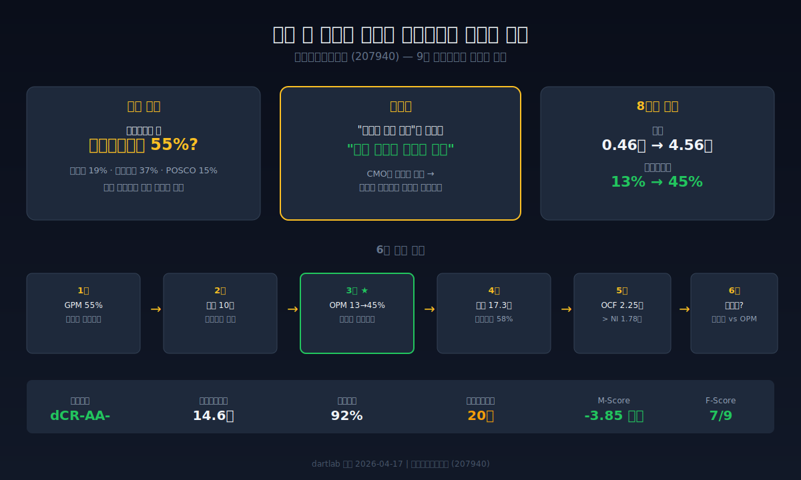
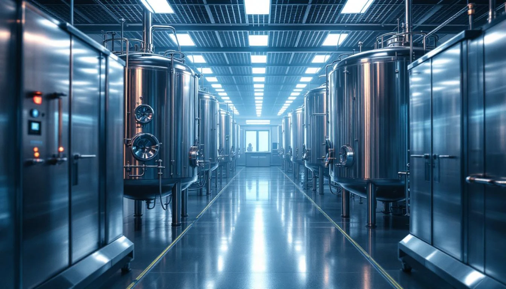
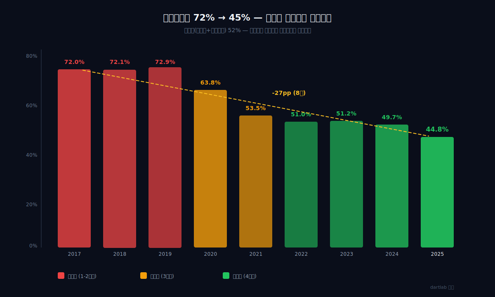
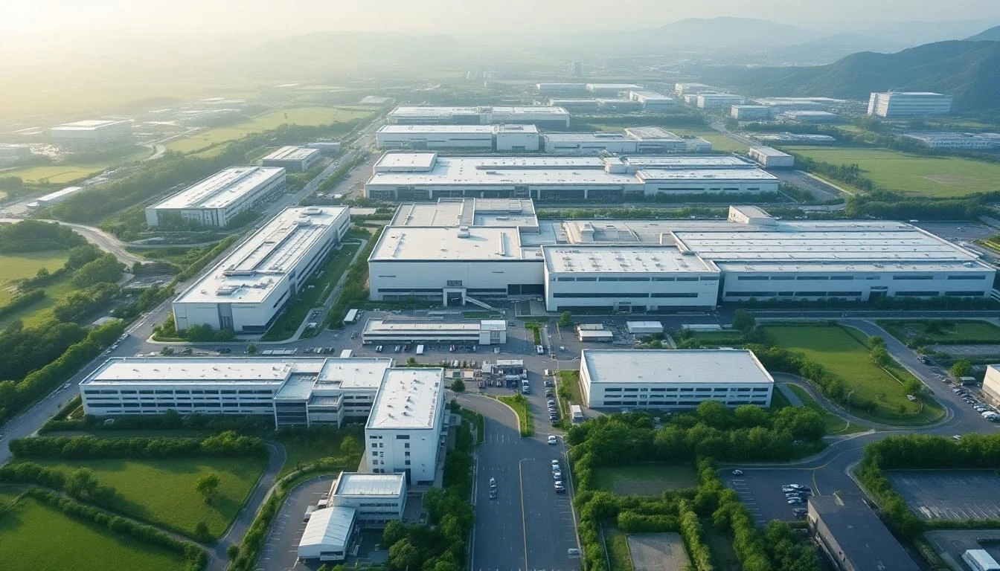
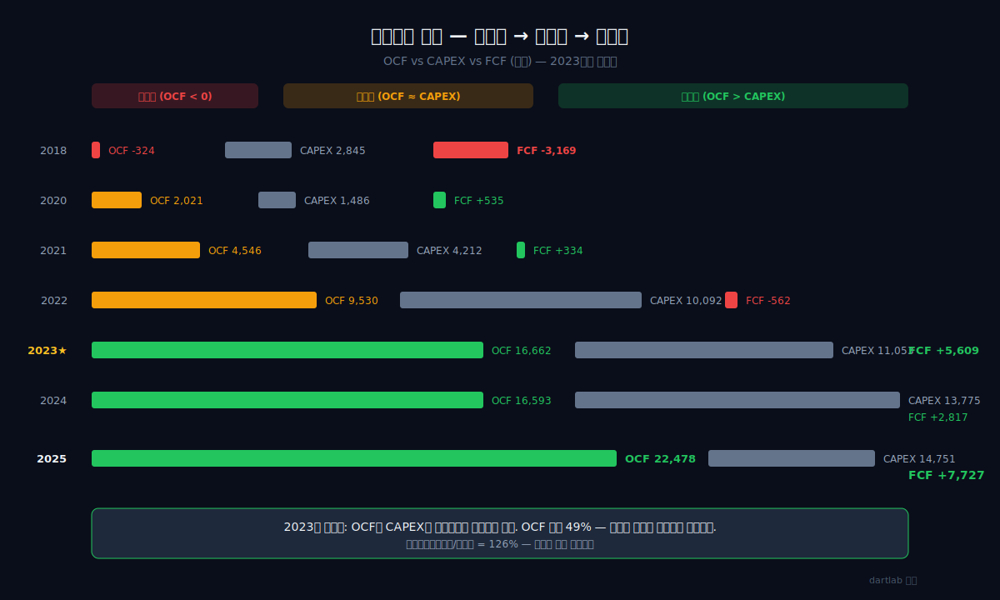
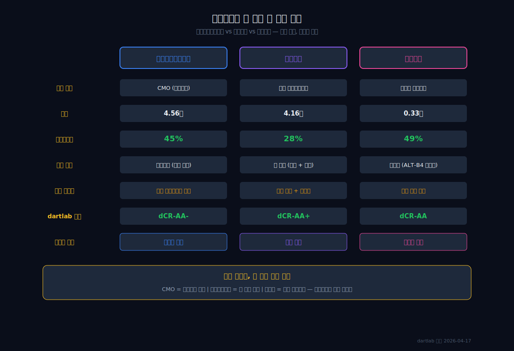
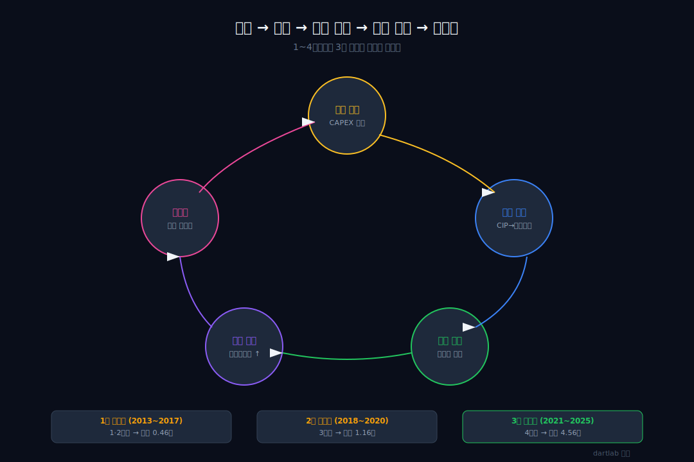
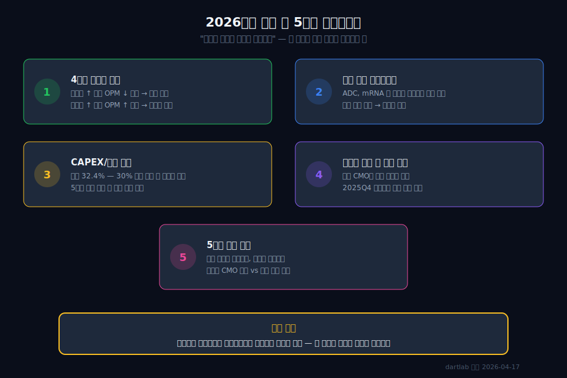

<script>
import ComboChart from '$lib/components/blog/ComboChart.svelte';
import StackBar from '$lib/components/blog/StackBar.svelte';
import HFDataLink from '$lib/components/blog/HFDataLink.svelte';
</script>

> **자본집약 규모의 경제** | 건강관리 > 바이오의약품 CMO | 2026-04-17 dartlab 실측
> 같은 시리즈: [셀트리온](/blog/celltrion) · [알테오젠](/blog/alteogen) · [기업이야기 시리즈 전체](/blog/series/company-reports)

<HFDataLink code="207940" />

삼성바이오로직스(207940)는 자기 약이 없다. 신약을 개발하지 않고, 특허도 없다. 남의 약을 대신 만드는 위탁생산(CMO, Contract Manufacturing Organization) 회사다. 그런데 영업이익률(매출 대비 영업이익 비율)이 45%다. 같은 바이오 업종의 [셀트리온](/blog/celltrion)(자체 바이오시밀러 개발, 영업이익률 28%)이나 [알테오젠](/blog/alteogen)(플랫폼 라이선스, 영업이익률 49%)과 어깨를 나란히 한다. 자기 약 없는 공장이 약을 가진 회사만큼 돈을 번다.

8년 전 이 회사의 매출은 0.46조원이었고 영업이익률은 13%였다. 1~2공장 가동 초기, 적자도 겪었다. 지금은 매출 4.56조원에 매출총이익률(물건 팔고 원가 빼면 남는 비율) 55%, 영업이익률 45%다. 4공장까지 누적 투자 17조원을 쏟아부었는데 2025년 기준 부채비율은 48%에 불과하다. 이 숫자들이 동시에 가능한 구조가 무엇인지, 9년 재무제표를 분해한다.

---



## 1막: 제조업 매출총이익률 55% — 숫자가 이상하다

2024년 4분기, 인천 송도 4공장 클린룸. 스테인리스 배양기가 3층 높이로 늘어서 있다. 이 안에서 만드는 것은 삼성바이오로직스의 약이 아니다. 글로벌 제약사가 개발한 항체 의약품이다. 자기 제품이 없는 제조업체가 매출총이익률 55%를 찍고 있다.

### 매출총이익률 55% — 제조업의 상식 밖 숫자

제조업의 매출총이익률은 대체로 15~30% 범위에 있다. 현대자동차 19%, POSCO홀딩스 15%, 삼성전자 37%. 원재료를 사서 가공하고 팔면 원가가 매출의 60~85%를 먹기 때문이다. 삼성바이오로직스는 45%만 먹는다.

```python
import dartlab
c = dartlab.Company("207940")
c.select("IS", ["매출액", "매출원가", "매출총이익"])
```

삼성바이오로직스 9년 매출총이익률을 보면, 출발점부터 다르다.

| 항목 (1년치 합산, 조원) | 2025 | 2024 | 2023 | 2022 | 2021 | 2020 | 2019 | 2018 | 2017 |
|:---|---:|---:|---:|---:|---:|---:|---:|---:|---:|
| 매출액 | **4.56** | 4.55 | 3.69 | 3.00 | 1.57 | 1.16 | 0.70 | 0.54 | 0.46 |
| 매출원가 | 2.04 | 2.26 | 1.89 | 1.53 | 0.84 | 0.74 | 0.51 | 0.39 | 0.33 |
| 매출총이익 | **2.52** | 2.29 | 1.80 | 1.47 | 0.73 | 0.42 | 0.19 | 0.15 | 0.13 |
| 매출총이익률 | **55.2%** | 50.3% | 48.8% | 49.0% | 46.5% | 36.2% | 27.1% | 27.9% | 28.0% |

**표시: 매출총이익률 28%(2017) → 55%(2025). 8년간 27pp 상승.**

### 현대차 19%, 삼성전자 37% — 같은 제조업이 아닌 이유

자동차는 수만 개의 부품을 조립한다. 철강은 철광석을 녹인다. 반도체는 실리콘 웨이퍼를 깎는다. 원재료비가 원가의 절반 이상이다. 삼성바이오로직스의 2025년 원가 구성은 다르다.

| 비용 항목 (2025년) | 금액(억원) | 비중 |
|:---|---:|---:|
| 원재료사용 | 8,973 | **42%** |
| 종업원급여 | 7,470 | **35%** |
| 감가상각비(과거에 산 설비 값을 매년 조금씩 비용으로 깎는 것) | 3,597 | 17% |
| 공공요금비용 | 1,176 | 5% |

원재료비 42%에 인건비 35%. 이것은 **고정비 비중이 높은 구조**다. 배양기, 클린룸, 품질검증 인력 — 한 번 갖추면 생산량이 늘어도 비용이 비례해서 늘지 않는다.

### CMO라는 사업 모델 — 남의 약, 내 공장

CMO(Contract Manufacturing Organization)는 제약사가 개발한 약을 대신 생산하는 사업이다. [DART 공시](https://dart.fss.or.kr/dsaf001/main.do?rcpNo=20250401003654)에서 삼성바이오로직스의 사업 구조를 직접 확인할 수 있다. 삼성바이오로직스는 자체 신약이 없다. 대신 로슈, 브리스톨마이어스스큅, 모더나 같은 글로벌 제약사의 항체 의약품을 위탁 생산한다. 고객이 레시피를 주면, 삼성바이오가 배양·정제·충전·포장을 맡는다.

### "공장이 제품"이라는 말의 의미

자동차 회사의 제품은 자동차다. 삼성바이오로직스의 제품은 **공장 그 자체**다. 더 정확히는 "GMP(의약품 제조품질관리기준) 인증을 받은 대규모 배양 능력"이다. 공장을 더 지으면 매출이 늘고, 가동률이 올라가면 마진이 올라간다. 매출총이익률 55%는 이 구조가 만든 숫자다.

*55%라는 숫자가 이상하려면, 이 회사가 어디서 출발했는지를 먼저 봐야 한다 — 8년 전 매출은 0.46조원이었고, 적자였다.*

---

## 2막: 매출 0.46조→4.56조, 8년 10배 — 적자에서 출발

2011년, 인천 송도 갯벌 매립지. [삼성그룹이 바이오 진출을 결정](https://dart.fss.or.kr/dsaf001/main.do?rcpNo=20110629000276)하고 1공장 착공을 발표했다. 반도체와 가전으로 세계 1위를 한 그룹이 바이오의약품 위탁생산이라는, 해본 적 없는 사업에 수조원을 걸었다.



### 2017년 매출 0.46조원 — 삼성이라는 이름도 소용없었다

왜 삼성이라는 이름으로도 처음에는 고전했을까. CMO 사업의 본질이 **신뢰의 사업**이기 때문이다. 글로벌 제약사는 자기 약의 생산을 맡길 때, "이 공장이 우리 약을 수년간 안정적으로 만들 수 있는가"를 본다. FDA 실사, 배치 실적, 품질 이력 — 이것들은 돈으로 살 수 없고 시간으로만 쌓인다.

2017년 1공장(3만 리터)과 2공장(15.4만 리터)이 가동 중이었지만, 가동률이 낮았다. [2017년 사업보고서](https://dart.fss.or.kr/dsaf001/main.do?rcpNo=20180402004474)를 보면 상황이 선명하다. 매출 4,588억원, 영업이익 661억원. 당기순이익은 **-1,014억원**, 적자였다.

### 2019년 흑자 전환 — 이후 한 번도 적자 없음

```python
c.select("IS", ["당기순이익"])
```

| 항목 (1년치 합산, 조원) | 2017 | 2018 | 2019 | 2020 | 2021 | 2022 | 2023 | 2024 | 2025 |
|:---|---:|---:|---:|---:|---:|---:|---:|---:|---:|
| 당기순이익 | **-0.10** | **-0.09** | 0.20 | 0.24 | 0.39 | 0.80 | 0.86 | 1.08 | **1.78** |

2017~2018년 2년 연속 적자. 2019년 흑자 전환 후 **6년 연속 흑자, 한 번도 되돌아가지 않았다.** 순이익은 0.20조(2019) → 1.78조(2025)로 9배 성장했다.

### 2020~2022 코로나 CMO 수주 — 운인가, 준비인가

2020년, 코로나19가 터졌다. mRNA 백신과 항체치료제의 긴급 위탁생산 수요가 폭발했다. 삼성바이오로직스는 3공장(18만 리터, 2018년 완공)까지 가동할 수 있었다. 매출이 1.16조(2020) → 3.00조(2022)로 2년 만에 2.6배 뛰었다.

운이었을까. 3공장이 2018년에 완공되어 가동 준비가 되어 있지 않았다면, 코로나 수주를 받을 수 없었다. **"준비된 자에게 온 기회"**라는 진부한 말이 재무제표에 그대로 찍혔다.

### 매출 4.56조원(2025) — 적자 회사가 10배를 만든 시간

| 연도 | 매출(조원) | 가동 공장 | 총 배양용량(리터) |
|:---|---:|:---|---:|
| 2017 | 0.46 | 1·2공장 | 18.4만 |
| 2019 | 0.70 | 1·2·3공장 | 36.4만 |
| 2022 | 3.00 | 1·2·3공장 | 36.4만 |
| 2024 | 4.55 | 1·2·3·4공장 | **62.0만** |
| 2025 | **4.56** | 1·2·3·4공장 | 62.0만 |

매출은 배양용량에 정비례한다. 공장이 커지면 매출이 커진다. CMO 사업의 가장 직관적인 특성이다.

*매출이 10배 커지는 동안, 더 이상한 일이 벌어졌다 — 영업이익률이 13%에서 45%로, 3.5배 뛰었다. 팔수록 남는 구조가 된 것이다.*

---

## 3막: 영업이익률 13%→45% — 팔수록 남는 구조의 비밀

2023년, 송도 4공장 가동 개시. 세계 최대 단일 바이오 생산시설, 배양 용량 25.6만 리터. 공장이 하나 더 돌기 시작하면 보통 비용이 늘고 마진이 줄어든다 — 건설비 감가상각, 신규 인력, 시운전 비용. 그런데 삼성바이오로직스는 4공장을 올리면서 영업이익률이 오히려 올라갔다.



### 영업이익률 13%→45% — 3.5배, 같은 회사 맞는가

왜 공장을 늘릴수록 이익률이 올라가는가. 보통 제조업에서는 정반대인데.

```python
prof = c.analysis("financial", "수익성")
prof["roicTree"]
# marginDriver: '낮은 판관비 (SGA < 15%)'
```

| 항목 (1년치 합산) | 2025 | 2024 | 2023 | 2022 | 2021 | 2020 | 2019 | 2018 | 2017 |
|:---|---:|---:|---:|---:|---:|---:|---:|---:|---:|
| 영업이익(조원) | **2.07** | 1.32 | 1.11 | 0.98 | 0.54 | 0.29 | 0.09 | 0.06 | 0.07 |
| 영업이익률(%) | **45.4** | 29.0 | 30.1 | 32.7 | 34.4 | 25.0 | 12.9 | 11.1 | 14.4 |
| 매출원가율(%) | 44.8 | 49.7 | 51.2 | 51.0 | 53.5 | 63.8 | 72.9 | 72.1 | 72.0 |

**표시: 매출원가율 72%(2017) → 45%(2025). 원가가 27pp 내려가면서 마진이 올라갔다.**

### 매출원가율 하락의 비밀 — 고정비 레버리지

삼성바이오로직스의 원가 구조에서 **종업원급여(35%)와 감가상각비(17%)는 고정비**다. 배양기를 10기 돌리든 48기 돌리든, 클린룸 유지 인력과 공장 감가상각비는 거의 같다. 가동률이 올라갈수록 단위당 원가가 내려간다.

영업 레버리지(영업레버리지, 매출 변동 대비 영업이익 변동 배수)가 **20배**다. 매출이 1% 늘면 영업이익이 20% 늘어나는 구조다. 반대로 매출이 5% 줄면 영업이익이 100% 날아갈 수 있다. 이 구조는 **양날의 검**이다.

### 판관비율 하락 — 매출이 관리비를 앞지르는 속도

판매비와관리비(판관비, 영업을 위한 간접비용)의 절대 금액도 늘었지만, 매출이 더 빨리 늘었다. 판관비율은 16.7%(2018) → 9.8%(2025)로 하락했다. 매출이 8배 커지는 동안 판관비는 3배만 늘었다. 연구개발비, 마케팅비, 본사 운영비 같은 간접비가 매출 규모에 묻히는 것이다.

### 손익분기 안전마진 82% — 매출이 82% 빠져도 적자가 안 난다

```python
cost = c.analysis("financial", "비용구조")
cost["breakevenEstimate"]
```

손익분기점 대비 안전마진이 38%(2018)에서 **82%(2025)**로 상승했다. 매출이 현재의 18%만 남아도 적자를 면할 수 있다는 뜻이다. 고정비 비중이 높은 사업에서 이 수치는 가동률이 충분히 올라왔다는 증거다.

### CMO vs 일반 제조업 — 규모의 경제가 다른 방향으로 작동한다

일반 제조업의 규모의 경제는 "원재료를 대량 구매하면 단가가 내려가는" 방향이다. CMO의 규모의 경제는 "공장을 더 지으면 고정비가 분산되어 마진이 올라가는" 방향이다. 원재료(배지, 세포주, 정제시약)는 바이오의약품 특성상 대량 구매 할인이 크지 않다. 대신 배양기 1기를 추가로 돌리는 한계비용이 극히 낮다.

*팔수록 남는 구조를 만들려면 먼저 공장을 지어야 한다 — 삼성바이오로직스는 4공장까지 17.3조원을 자산에 쌓았고, 그 대가로 부채를 졌다.*

---

## 4막: 자산 6.4조→17.3조, 부채비율 58% — 4공장의 대가

왜 17조원을 투자하고도 부채비율이 58%에 불과한가. 돈은 어디서 왔는가.



### 자산총계 6.4→17.3조원 — 8년간 10.9조원이 쌓였다

```python
c.select("BS", ["자산총계", "부채총계", "자본총계"])
```

| 항목 (Q4 스냅샷, 조원) | 2025 | 2024 | 2023 | 2022 | 2021 | 2020 |
|:---|---:|---:|---:|---:|---:|---:|
| 자산총계 | 11.1 | **17.3** | 16.0 | 16.6 | 8.0 | 6.4 |
| 부채총계 | 3.6 | 6.4 | 6.2 | 7.6 | 3.0 | 1.8 |
| 자본총계 | 7.5 | **10.9** | 9.8 | 9.0 | 5.0 | 4.6 |

**2025년 자산이 17.3조에서 11.1조로 급감한 이유**: 2025년 사업보고서에서 자회사 삼성바이오에피스의 연결 범위가 변경되었다. 무형자산(영업권 1.68조 포함)이 5.3조원 소멸하고, 자본총계가 4.7조 감소했다. 이는 에피스의 지분법 전환 또는 연결 해제를 시사한다. **2024년까지의 숫자가 CMO 본업 + 에피스 합산, 2025년은 CMO 본업 중심**으로 보는 것이 정확하다.

### 유형자산 추이 — 4공장이 재무제표에 찍히는 과정

| 시점 | 유형자산(조원) | 건설중인자산(억원) | 비고 |
|:---|---:|---:|:---|
| 2017Q4 | 1.51 | - | 1·2공장 |
| 2019Q4 | 1.70 | - | 3공장 가동 시작 |
| 2021Q4 | 2.21 | 5,834 | 4공장 건설 착공 |
| 2022Q4 | 3.42 | 8,252 | 4공장 건설 중 |
| 2024Q4 | 5.37 | 18,331 | 4공장 완공 근접 |
| 2025Q4 | **6.03** | 4,302 | CIP→본자산 대규모 전환 |

건설중인자산(CIP, Construction in Progress)이 18,331억원(2024Q4)에서 4,302억원(2025Q4)으로 줄고, 건물이 1.72조에서 3.04조로 1.32조 증가했다. 4공장이 "건설 중"에서 "가동 중"으로 전환된 것이 재무제표에 찍힌 것이다.

### 부채비율 48% — 이 규모에 이 비율은 건전하다

```python
fund = c.analysis("financial", "자금조달")
fund["capitalOverview"]
```

| 자본구조 (2025년) | 금액 | 비중 |
|:---|---:|---:|
| 이익잉여금 | **6.87조** | 62.1% |
| 납입자본 | 3.51조 | 31.7% |
| 금융부채(차입금) | 6,367억 | 5.8% |
| 영업부채 | 1,852억 | 1.7% |

**놀라운 사실: 이익잉여금이 자산의 62%다.** 6조원짜리 바이오 공장 4개를 사실상 **벌어서 지었다**. 차입금은 6,367억원으로 자산 대비 5.8%에 불과하다. 이자보상배율(번 돈으로 이자를 몇 번 갚을 수 있는지)은 2.3배(2018) → **14.6배(2025)**로, 투자를 하면서 오히려 안전해졌다.

### 순차입금/EBITDA 0.24배 — 빚이 거의 없는 것과 같다

순차입금(총 차입금 - 현금)을 EBITDA(영업이익 + 감가상각비, 실질 영업현금 창출력)로 나누면 **0.24배**. 1년치 영업현금의 4분의 1이면 빚을 다 갚을 수 있다. 17조원짜리 자산을 쌓으면서도 실질적으로 무차입에 가깝다.

*17조원짜리 자산이 실제로 현금을 만들고 있는지는 대차대조표만으로는 알 수 없다 — 현금흐름표를 열어야 한다.*

---

## 5막: 영업활동현금흐름 2.25조 > 당기순이익 1.78조 — 현금이 이익보다 많은 회사

왜 이 회사는 번 것보다 현금이 더 많이 남는가. 어디서 차이가 나는가.

### 영업활동현금흐름 2.25조 — 현금의 질

```python
c.select("CF", ["영업활동현금흐름"])
```

| 항목 (1년치 합산, 조원) | 2025 | 2024 | 2023 | 2022 | 2021 | 2020 | 2019 | 2018 |
|:---|---:|---:|---:|---:|---:|---:|---:|---:|
| 영업활동현금흐름(실제 장사해서 들어온 현금) | **2.25** | 1.66 | 1.67 | 0.95 | 0.45 | 0.20 | 0.04 | -0.03 |
| 당기순이익 | 1.78 | 1.08 | 0.86 | 0.80 | 0.39 | 0.24 | 0.20 | -0.09 |
| 영업활동현금흐름/NI | **126%** | 154% | 194% | 119% | 115% | 83% | 20% | - |

**표시: 2023년 이후 영업활동현금흐름가 NI의 1.2~1.9배. 이익이 진짜 현금으로 들어온다.**

보통 이익보다 현금이 적은 회사가 문제다 — 이익은 회계 숫자이고, 현금은 실제 돈이니까. 삼성바이오로직스는 반대다.

### 감가상각비의 역설 — 비용이지만 현금이 안 나가는 돈

2018년, 삼성바이오로직스가 2공장 배양기를 설치했다. 수백억원짜리 스테인리스 배양기 한 기의 내용연수는 20년 이상이다. 올해 장부에 찍히는 감가상각비 3,597억원은 과거에 이미 지불한 공장 건설비를 매년 나누어 비용으로 인식하는 것이다. **현금은 이미 나갔고, 올해 추가로 나가는 돈이 아니다.** 순이익을 계산할 때는 비용으로 빠지지만, 현금흐름을 계산할 때는 다시 더해진다. 공장이 클수록 감가상각비가 크고, 감가상각비가 클수록 영업활동현금흐름와 NI의 격차가 벌어진다. 이것이 영업활동현금흐름 > NI의 핵심 원인이다.



### 잉여현금흐름 — 투자를 빼고 진짜 남는 돈

| 연도 | 영업활동현금흐름(억원) | 설비투자(억원) | 잉여현금흐름(억원) | 설비투자/매출 |
|:---|---:|---:|---:|---:|
| 2018 | -324 | 2,845 | **-3,169** | 53.1% |
| 2020 | 2,021 | 1,486 | 535 | 12.8% |
| 2022 | 9,530 | 10,092 | -562 | 33.6% |
| 2023 | 16,662 | 11,053 | **5,609** | 29.9% |
| 2024 | 16,593 | 13,775 | 2,817 | 30.3% |
| 2025 | **22,478** | 14,751 | **7,727** | 32.4% |

잉여현금흐름(잉여현금흐름, 영업현금에서 투자비를 뺀 진짜 남는 돈)은 2018년 -3,169억원에서 2025년 **+7,727억원**으로 전환됐다. 2023년이 전환점이다 — 이때부터 영업활동현금흐름가 설비투자를 안정적으로 초과하기 시작했다. 4공장 투자가 마무리되면서 "확장형"에서 "성숙형" 현금흐름으로 바뀐 것이다.

### 이익품질 — Beneish M-Score -3.85

```python
q = c.analysis("financial", "이익품질")
```

| 이익품질 지표 | 수치 | 해석 |
|:---|---:|:---|
| 영업활동현금흐름/순이익 | 126% | 이익이 진짜 현금 |
| Sloan 발생액비율(이익 중 현금이 아닌 비율) | -4.2% | 낮을수록 좋음 — 양호 |
| Beneish M-Score(분식 가능성 지표) | -3.85 | -1.78 미만이면 안전 — **안전** |
| Piotroski F-Score(재무 건전성) | 7/9 | 7 이상이면 건전 — **건전** |



*현금이 이익보다 많다는 것은 공장이 돌아가고 있다는 뜻이다. 그러면 이 구조는 어디까지 갈 수 있는가.*

---

## 6막: 바이오 CMO의 끝은 어디인가

2025년 말, 송도 4공장 옆 빈 부지. 삼성바이오로직스가 5공장 착공을 검토 중이라는 보도가 나왔다. 1공장부터 4공장까지 "투자→가동→마진 상승" 사이클이 세 번 반복됐다. 네 번째도 같을 것인가.



### 과거~현재 패턴 — 1공장부터 4공장까지, 같은 사이클의 반복

삼성바이오로직스의 9년 재무제표에서 반복되는 패턴이 있다.

1. **공장 건설** → 설비투자 급증, 건설중인자산 증가
2. **가동 개시** → 건설중인자산이 유형자산으로 전환, 매출 점프
3. **가동률 상승** → 매출원가율 하락, 영업이익률 상승
4. **현금 축적** → 이익잉여금 증가, 다음 공장 투자 재원 확보

이 사이클은 1·2공장(2013~2017), 3공장(2018~2020), 4공장(2021~2025)에서 세 번 반복됐다. 매번 "투자→가동→마진 상승→현금 회수→재투자" 순환이 더 큰 스케일로 작동했다.

### 산업 패턴 — 경쟁자가 줄고 있다

글로벌 바이오 CMO 시장의 경쟁 구도가 삼성바이오에 유리하게 변하고 있다.

| 글로벌 CMO | 배양 용량 | 상태 | 삼성바이오와의 차이 |
|:---|:---|:---|:---|
| **Lonza** (스위스) | 약 30만 리터 | 글로벌 1위, 독립 | 직접 경쟁자. 영업이익률 약 25% |
| **Catalent** (미국) | 약 10만 리터 | 노보노디스크에 인수 | 독립 CMO에서 이탈 |
| **WuXi Biologics** (중국) | 약 26만 리터 | 바이오시큐어법 타격 | 미국 시장 접근 제한 |
| **삼성바이오로직스** (한국) | **62만 리터** | 독립, 확장 중 | 영업이익률 45%, 최대 용량 |

항체 의약품 시장은 [매년 10% 이상 성장](https://www.grandviewresearch.com/industry-analysis/biologics-market)하고, GLP-1(비만치료제) 같은 대형 파이프라인이 CMO 수요를 밀어올리고 있다. Catalent의 [노보노디스크 인수](https://www.sec.gov/cgi-bin/browse-edgar?action=getcompany&CIK=1596783)와 WuXi에 대한 [미국 바이오시큐어법](https://www.congress.gov/bill/118th-congress/house-bill/8333)으로, 대규모 배양 능력을 갖춘 독립 CMO는 [Lonza](https://www.lonza.com/about-lonza/investor-relations)와 삼성바이오 정도로 좁아지고 있다.

### 2025Q4 연결범위 변동 — 에피스 분리 후의 삼성바이오

2025년 사업보고서에서 가장 큰 변화는 **삼성바이오에피스의 연결 해제**다. 무형자산 5.3조가 소멸하고 자산총계가 7.2조 감소했다. 이는 삼성바이오로직스가 "CMO + 바이오시밀러(에피스)"의 복합체에서 **순수 CMO 회사**로 체질이 바뀌었음을 의미한다.

순수 CMO로서의 2025년 숫자: 매출 4.56조, 영업이익률 45%, 자산 11.1조, 부채비율 48%. 이것이 에피스 없이 CMO만으로 달성한 실적이라면, 이 사업 모델의 수익성이 더욱 선명해진다.



### 2026년에 봐야 할 것 — 가동률, 수주잔고, 가격결정력

| 체크포인트 | 왜 중요한가 |
|:---|:---|
| 4공장 가동률 추이 | 가동률이 올라가는데 영업이익률이 안 올라가면 → 천장 신호 |
| 신규 수주 파이프라인 | ADC(항체약물복합체), mRNA 등 차세대 모달리티 수주 비중 |
| 설비투자/매출 비율 | 30% 이하로 안정되면 → 성숙기 진입 확인 |
| 에피스 분리 후 연결 실적 | 순수 CMO의 마진 지속성 검증 |
| 5공장 투자 결정 | 같은 패턴의 반복인가, 새로운 국면인가 |

삼성바이오로직스의 재무제표는 하나의 문장으로 읽힌다: **"공장을 지으면 마진이 올라간다."** 1공장부터 4공장까지, 이 문장은 한 번도 틀리지 않았다. 5공장에서도 이 문장이 맞는지는 아직 아무도 모른다. 그러나 확인할 방법은 있다 — 가동률이 올라가는데 영업이익률이 내려가는 분기가 오면, 그때 이 구조의 천장이 보이기 시작할 것이다.

---

## 검증표

| 본문 수치 | dartlab 호출 | 결과 |
|:---|:---|:---|
| 2025 매출 4.56조 | `c.select("IS", ["매출액"])` 분기 합산 | ✅ 실측 |
| 2017 매출 0.46조 | `c.select("IS", ["매출액"])` 분기 합산 | ✅ 실측 |
| 2025 영업이익률 45.4% | `c.select("IS", ["매출액","영업이익"])` 비율 계산 | ✅ 실측 |
| 2025 매출총이익률 55.2% | `c.select("IS", ["매출액","매출총이익"])` 비율 계산 | ✅ 실측 |
| 2025 당기순이익 1.78조 | `c.select("IS", ["당기순이익"])` 분기 합산 | ✅ 실측 |
| 2025 영업활동현금흐름 2.25조 | `c.select("CF", ["영업활동현금흐름"])` 분기 합산 | ✅ 실측 |
| 2025 부채비율 48% | `c.select("BS", ["부채총계","자본총계"])` 비율 | ✅ 실측 |
| 이자보상배율 14.6배 | `c.analysis("financial", "자금조달")` | ✅ 실측 |
| 이익잉여금 6.87조 | `c.analysis("financial", "자금조달")` capitalOverview | ✅ 실측 |
| 순차입금/EBITDA 0.24배 | `c.analysis("financial", "자금조달")` | ✅ 실측 |
| dCR-AA-, health 87 | `c.credit("등급")` | ✅ 실측 |
| 영업레버리지 20배 | `c.analysis("financial", "비용구조")` 영업레버리지 | ✅ 실측 |
| Beneish M-Score -3.85 | `c.analysis("financial", "이익품질")` | ✅ 실측 |
| Piotroski F-Score 7/9 | `c.analysis("financial", "이익품질")` | ✅ 실측 |
| 원재료비 42%, 인건비 35% | `c.analysis("financial", "비용구조")` 비용의성격별분류 | ✅ 실측 |
| 잉여현금흐름 7,727억(2025) | 영업활동현금흐름 - 설비투자 계산 | ✅ 실측 |

📅 dartlab 실측 2026-04-17

---

<!-- AUTO:START — sync_financials.py가 자동 생성. 수동 편집 금지 -->


## 공시 / Filings

| 기간 | 보고서 | 링크 |
|------|--------|------|
| 2025 | 사업보고서 (2025.12) | [DART에서 보기](https://dart.fss.or.kr/dsaf001/main.do?rcpNo=20260312001119) |
| 2025 | 분기보고서 (2025.09) | [DART에서 보기](https://dart.fss.or.kr/dsaf001/main.do?rcpNo=20251114001632) |
| 2025 | 반기보고서 (2025.06) | [DART에서 보기](https://dart.fss.or.kr/dsaf001/main.do?rcpNo=20250814004457) |
| 2025 | 분기보고서 (2025.03) | [DART에서 보기](https://dart.fss.or.kr/dsaf001/main.do?rcpNo=20250515002264) |
| 2024 | [기재정정]사업보고서 (2024.12) | [DART에서 보기](https://dart.fss.or.kr/dsaf001/main.do?rcpNo=20250814004283) |
| 2024 | 사업보고서 (2024.12) | [DART에서 보기](https://dart.fss.or.kr/dsaf001/main.do?rcpNo=20250306000580) |
| 2024 | 분기보고서 (2024.09) | [DART에서 보기](https://dart.fss.or.kr/dsaf001/main.do?rcpNo=20241114002286) |
| 2024 | 반기보고서 (2024.06) | [DART에서 보기](https://dart.fss.or.kr/dsaf001/main.do?rcpNo=20240814003571) |
| 2024 | 분기보고서 (2024.03) | [DART에서 보기](https://dart.fss.or.kr/dsaf001/main.do?rcpNo=20240516001936) |
| 2023 | 사업보고서 (2023.12) | [DART에서 보기](https://dart.fss.or.kr/dsaf001/main.do?rcpNo=20240307000835) |

> 전체 공시 목록은 dartlab에서 확인:
> ```python
> import dartlab
> c = dartlab.Company("207940")
> c.filings()
> ```

## 재무제표 — 최근 5개년

> 아래는 최근 5개년 요약입니다. 전체 기간·분기별 데이터는 dartlab에서 직접 확인할 수 있습니다:
> ```python
> import dartlab
> c = dartlab.Company("207940")
> c.show("IS")              # 손익계산서 (분기)
> c.show("IS", freq="Y")    # 손익계산서 (연간)
> c.show("BS")              # 재무상태표
> c.show("CF")              # 현금흐름표
> c.show("SCE")             # 자본변동표
> c.show("ratios")          # 재무비율
> ```

### 손익계산서 (IS) — 단위 억원

<ComboChart data={[{year:"2025",매출액:45570,영업이익:20692,당기순이익:17844},{year:"2024",매출액:45473,영업이익:13201,당기순이익:10833},{year:"2023",매출액:36946,영업이익:11137,당기순이익:8577},{year:"2022",매출액:30013,영업이익:9836,당기순이익:7981},{year:"2021",매출액:15680,영업이익:5373,당기순이익:3936}]} lineKeys={["매출액"]} barKeys={["영업이익","당기순이익"]} lineColors={["#22c55e"]} barColors={["#3b82f6","#f59e0b"]} title="매출(라인) vs 영업이익·당기순이익(막대)" unit="억원" />

| 항목 | 2025 | 2024 | 2023 | 2022 | 2021 |
|---|---:|---:|---:|---:|---:|
| 매출액 | 45,570 | 45,473 | 36,946 | 30,013 | 15,680 |
| 매출원가 | 20,403 | 22,565 | 18,918 | 15,328 | 8,416 |
| 매출총이익 | 25,166 | 22,908 | 18,028 | 14,684 | 7,265 |
| 판매비와관리비 | 4,474 | 9,708 | 6,891 | 4,848 | 1,891 |
| 영업이익 | 20,692 | 13,201 | 11,137 | 9,836 | 5,373 |
| 금융수익 | — | — | — | — | — |
| 금융비용 | 1,414 | 2,606 | 2,499 | 2,733 | 291 |
| 당기순이익 | 17,844 | 10,833 | 8,577 | 7,981 | 3,936 |

### 재무상태표 (BS) — 단위 억원

<StackBar data={[{year:"2025",segments:[{label:"부채",value:36096,color:"#ef4444"},{label:"자본",value:74511,color:"#22c55e"}]},{year:"2024",segments:[{label:"부채",value:64316,color:"#ef4444"},{label:"자본",value:109047,color:"#22c55e"}]},{year:"2023",segments:[{label:"부채",value:62157,color:"#ef4444"},{label:"자본",value:98305,color:"#22c55e"}]},{year:"2022",segments:[{label:"부채",value:75976,color:"#ef4444"},{label:"자본",value:89845,color:"#22c55e"}]},{year:"2021",segments:[{label:"부채",value:29789,color:"#ef4444"},{label:"자본",value:49911,color:"#22c55e"}]}]} title="부채 vs 자본 구조" unit="억원" />

| 항목 | 2025 | 2024 | 2023 | 2022 | 2021 |
|---|---:|---:|---:|---:|---:|
| 자산총계 | 110,607 | 173,363 | 160,462 | 165,821 | 79,700 |
| 유동자산 | 44,084 | 55,181 | 55,220 | 64,577 | 28,232 |
| 비유동자산 | 66,524 | 118,182 | 105,242 | 101,244 | 51,468 |
| 부채총계 | 36,096 | 64,316 | 62,157 | 75,976 | 29,789 |
| 유동부채 | 25,329 | 38,532 | 41,579 | 41,815 | 11,073 |
| 비유동부채 | 10,767 | 25,784 | 20,578 | 34,160 | 18,716 |
| 자본총계 | 74,511 | 109,047 | 98,305 | 89,845 | 49,911 |

### 현금흐름표 (CF) — 단위 억원

<ComboChart data={[{year:"2025",영업CF:22478,투자CF:-18624,재무CF:0},{year:"2024",영업CF:16593,투자CF:-12438,재무CF:0},{year:"2023",영업CF:16662,투자CF:-15663,재무CF:0},{year:"2022",영업CF:9530,투자CF:-31065,재무CF:0},{year:"2021",영업CF:4546,투자CF:-9335,재무CF:0}]} barKeys={["영업CF","투자CF","재무CF"]} barColors={["#22c55e","#ef4444","#3b82f6"]} title="영업·투자·재무 현금흐름" unit="억원" />

| 항목 | 2025 | 2024 | 2023 | 2022 | 2021 |
|---|---:|---:|---:|---:|---:|
| 영업활동현금흐름 | 22,478 | 16,593 | 16,662 | 9,530 | 4,546 |
| 투자활동현금흐름 | -18,624 | -12,438 | -15,663 | -31,065 | -9,335 |
| 재무활동현금흐름 | — | — | — | — | — |

### 자본변동표 (SCE) — 단위 억원

| 항목 | 2025 | 2024 | 2023 | 2022 | 2021 |
|---|---:|---:|---:|---:|---:|
| 회계정책변경 | — | — | — | — | — |
| 지분법자본변동 | 0.0 | 0.0 | 0.0 | 0.0 | 0.0 |
| 기초자본 | 109,047 | -138 | 56,631 | 49,911 | 0.0 |
| 유상증자 | — | 0.0 | 0.0 | 31,758 | — |
| 연결범위변동 | — | 0.0 | 0.0 | 0.0 | — |
| 기말자본 | 74,511 | 109,047 | 56,631 | 31,456 | 49,911 |
| 해외사업환산 | -1.0 | 0.0 | 0.0 | 0.0 | 10 |
| 당기순이익 | 17,844 | 0.0 | 0.0 | 0.0 | 0.0 |
| 확정급여재측정 | 0.0 | 0.0 | 0.0 | 0.0 | 0.0 |
| 분할 | -51,405 | — | — | — | — |
| 자기주식취득 | 0.0 | — | — | — | — |

*최종 갱신: 2026-04-17 | dartlab 실측 (DART 공시 기준)*

<!-- AUTO:END -->
