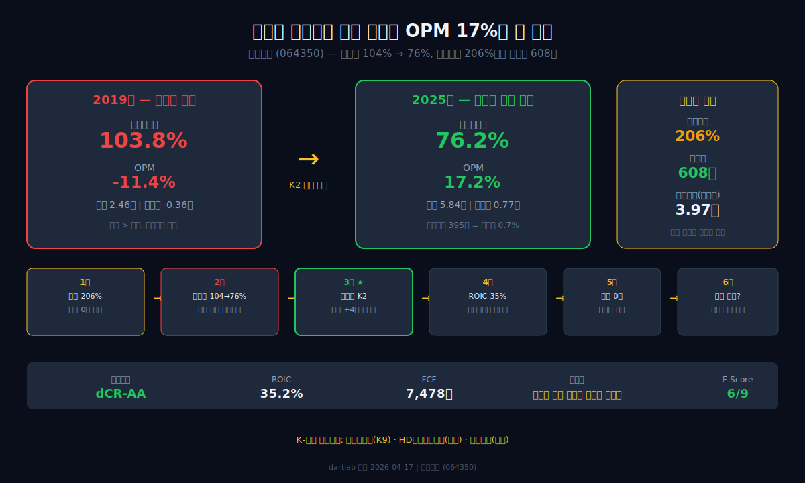
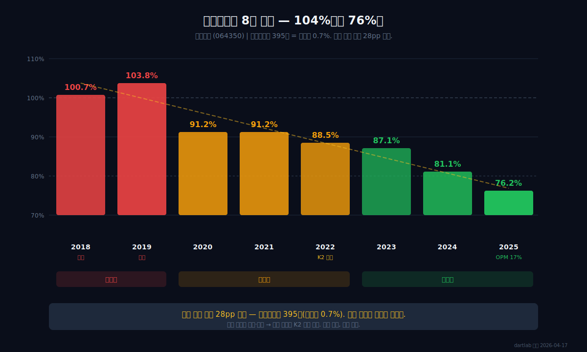
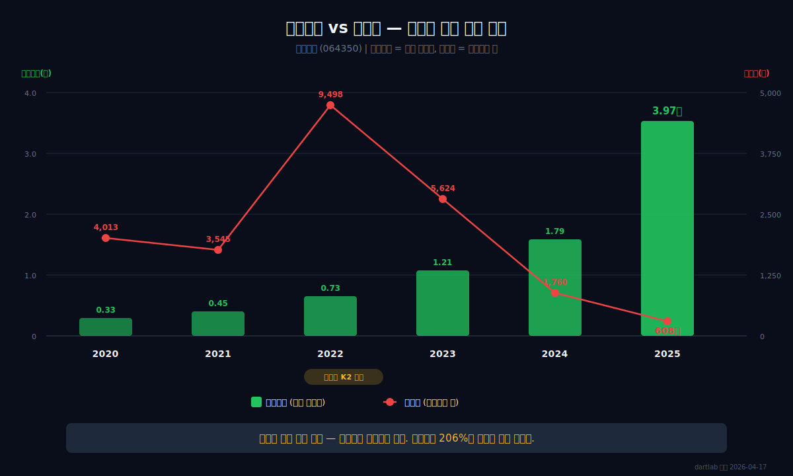
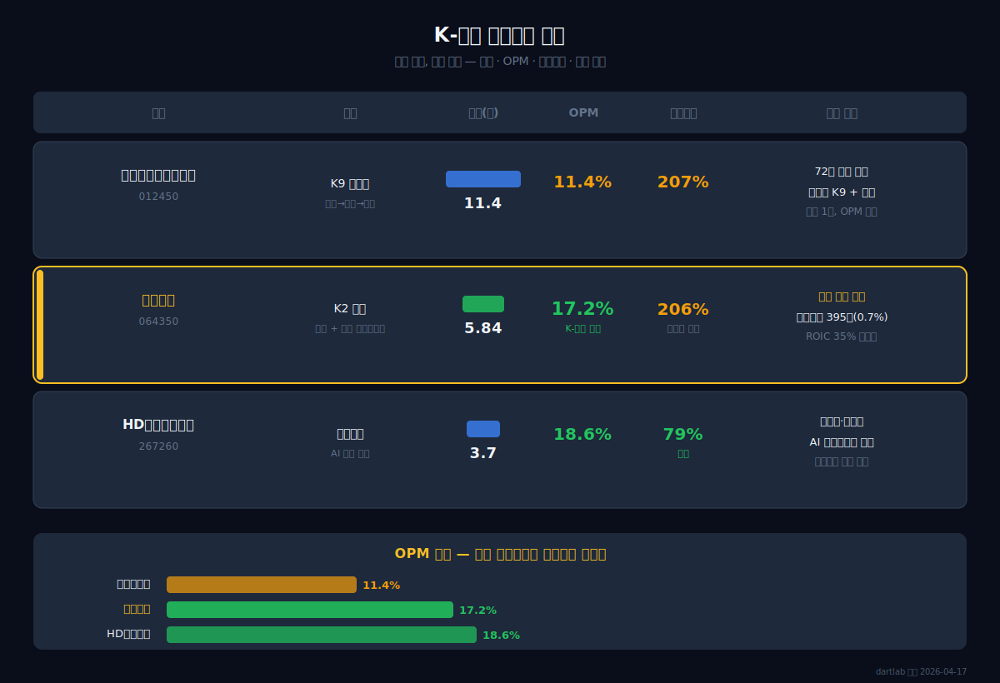
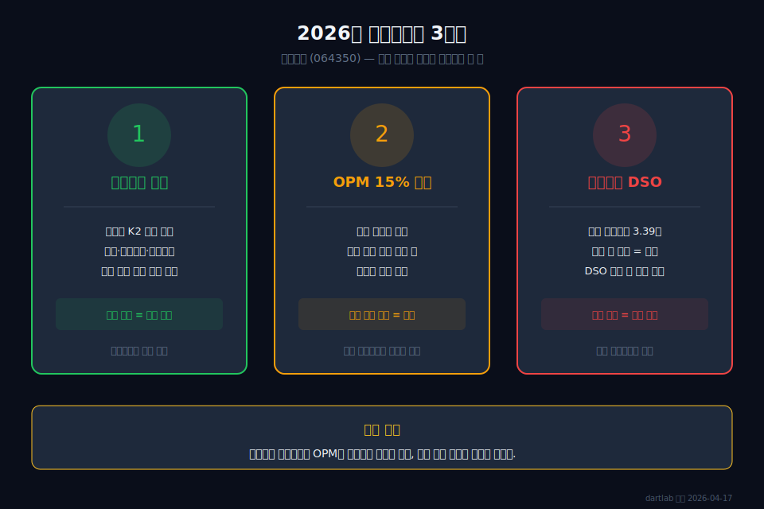

<script>
import ComboChart from '$lib/components/blog/ComboChart.svelte';
import StackBar from '$lib/components/blog/StackBar.svelte';
import HFDataLink from '$lib/components/blog/HFDataLink.svelte';
</script>

> **턴어라운드** | 산업재 > 방위산업 · 철도 | 2026-04-17 dartlab 실측
> 같은 시리즈: [한화에어로스페이스](/blog/hanwha-aerospace) · [HD현대일렉트릭](/blog/hd-hyundai-electric) · [대한조선](/blog/daehan-shipbuilding) · [삼성바이오로직스](/blog/samsung-biologics) · [기업이야기 시리즈 전체](/blog/series/company-reports)

<HFDataLink code="064350" />

2019년, 현대로템(064350)의 매출원가율(매출 대비 원가 비율)은 103.8%였다. 물건을 팔면 팔수록 적자가 나는 구조. 매출 2.46조원인데 원가가 2.55조원. 영업이익률(매출 대비 영업이익 비율) 마이너스 11.4%. 전차와 철도를 만드는 회사가 "방산은 안정적"이라는 통념을 정면으로 배신하고 있었다.

6년 뒤인 2025년, 같은 회사의 영업이익률은 17.2%다. 영업이익 1.01조원, 순이익 0.77조원. 매출은 2.4배 늘었는데 영업이익은 적자에서 1조로 뛰었다. 그 사이에 공장을 새로 짓지도 않았다. 감가상각비(과거에 산 설비 값을 매년 조금씩 비용으로 깎는 것) 395억원 — 매출 5.84조원의 0.7%에 불과하다. 무슨 일이 있었는가.

---



## 1막: 부채비율 206%인데 빚이 0원인 회사

현대로템의 2025년 [사업보고서](https://dart.fss.or.kr/dsaf001/main.do?rcpNo=20250401003177)를 처음 열면 부채비율 206%가 눈에 들어온다. 보통이라면 "위험한 회사"로 넘기겠지만, 한 줄만 더 내려가면 숫자가 뒤집힌다.

### 부채 6.28조, 차입금 608억 — 나머지 6.22조의 정체

```python
import dartlab
c = dartlab.Company("064350")
fund = c.analysis("financial", "자금조달")
fund["capitalOverview"]
```

| 자본구조 (2025년) | 금액 | 비중 |
|:---|---:|---:|
| 총자산 | 9.32조 | 100% |
| 총부채 | 6.28조 | **67%** |
| 자기자본 | 3.04조 | 33% |
| 순차입금 | 8,476억 | 순현금 |

부채비율 206%. 그런데 차입금(금융기관에서 빌린 돈)을 보면 **608억원** — 자산 9.32조의 0.65%에 불과하다. 2022년 9,498억원이었던 차입금이 3년 만에 608억으로 줄었다.

### 계약부채 3.97조 — 고객이 먼저 넣은 돈

나머지 6.22조의 핵심은 **계약부채**(고객이 납품 전에 먼저 보낸 돈, 선수금)다.

```python
c.select("BS", ["계약부채"])
```

| 항목 (Q4 스냅샷, 조원) | 2025 | 2024 | 2023 | 2022 | 2021 |
|:---|---:|---:|---:|---:|---:|
| 계약부채 | **3.97** | 1.79 | 1.21 | 0.73 | 0.45 |

**표시: 계약부채 0.45조(2021) → 3.97조(2025). 4년 만에 8.8배.** 고객이 "이 전차를 만들어달라"고 주문하면서 돈을 먼저 보내는 구조다. 이것은 빚이 아니라 **주문의 증거**다.

### dCR-AA, 건강점수 88 — 숫자가 말하는 진짜 안정성

```python
cr = c.credit("등급")
# grade: dCR-AA, healthScore: 87.94
```

dartlab 신용등급 dCR-AA, 건강점수 88. 부채비율 206%에도 불구하고 신용이 높은 이유가 여기에 있다. 차입금이 거의 없고, 이자보상배율(번 돈으로 이자를 몇 번 갚을 수 있는지)도 충분하다. [한화에어로스페이스](/blog/hanwha-aerospace)(dCR-A+, K9 자주포)와 비교하면, 같은 [K-방산](/blog/category/company-reports)이지만 재무 구조가 다르다.

*부채의 실체가 고객 선수금이라면, 대체 어떤 주문이 이 돈을 끌어왔을까.*

---

## 2막: 원가율 104% → 76% — 팔수록 적자에서 팔수록 남는 구조로

2018~2019년, 매출원가율 100~104%. 물건을 팔면 팔수록 돈이 나갔다. 2025년, 같은 공장에서 원가율 76%. 감가상각비는 395억으로 매출의 0.68%에 불과하다. 공장을 새로 짓지 않았는데 원가가 28pp 빠졌다.



### 매출원가율 104% → 76% — 설비 투자 없이 28pp 개선

왜 원가 구조가 바뀌었는가. 원가 구성을 보면 답이 나온다.

```python
cost = c.analysis("financial", "비용구조")
cost["costBreakdown"]
```

| 항목 (1년치 합산) | 2025 | 2024 | 2023 | 2022 | 2021 | 2020 | 2019 | 2018 |
|:---|---:|---:|---:|---:|---:|---:|---:|---:|
| 매출(조원) | **5.84** | 4.38 | 3.59 | 3.16 | 2.87 | 2.79 | 2.46 | 2.41 |
| 매출원가율(%) | **76.2** | 81.1 | 87.1 | 88.5 | 91.2 | 91.2 | **103.8** | 100.7 |
| 영업이익률(%) | **17.2** | 10.4 | 5.9 | 4.7 | 2.8 | 2.9 | -11.4 | -8.1 |

**표시: 매출 2.4배 증가 + 원가율 28pp 하락 = 영업이익 적자→1조.**

### 감가상각비 395억, 매출 대비 0.68% — 자산 경량형 방산

| 비용 항목 (2025년) | 금액(억원) | 비중 |
|:---|---:|---:|
| 원재료사용 | 24,810 | **51%** |
| 기타비용(현장설치·시운전 등) | 16,057 | 33% |
| 외주가공비 | 1,812 | 4% |
| 지급수수료 | 1,492 | 3% |
| 감가상각비 | **395** | **0.8%** |

감가상각비 395억원. 매출 5.84조원 대비 0.68%. [삼성바이오로직스](/blog/samsung-biologics)(감가상각 3,597억, 매출 대비 7.9%)와 비교하면, 현대로템은 **설비 투자가 거의 필요 없는 구조**다. 전차 조립은 거대한 클린룸이 아니라 조립 라인에서 이루어지고, 핵심 가치는 설비가 아니라 **설계 기술과 통합 능력**에 있다.

### 원재료 비중 42%→51%, 그런데 원가율은 내려갔다

원재료 비중이 오히려 올라갔는데 원가율은 내려갔다. 이것은 **가격결정력**이 생겼다는 뜻이다. 국내 방산은 정부 단가 통제로 마진이 낮지만, [해외 수출](https://www.dapa.go.kr/dapa/main.do)은 시장 가격으로 협상할 수 있다. 원재료를 더 쓰더라도 판매 가격이 더 크게 올라가면 원가율은 떨어진다.

### 지급수수료 1,492억 — 해외 수주의 보이지 않는 비용

2023년 903억이었던 지급수수료가 2025년 1,492억으로 65% 증가했다. 해외 방산 수출에는 현지 에이전트, 옵셋(기술이전) 컨설팅, 정부 간 협상 지원 등 보이지 않는 비용이 따른다. 이 비용이 늘어난다는 것 자체가 수출이 본격화되고 있다는 신호다.

*원가 구조가 바뀐 건 만드는 것이 바뀌었기 때문이다. 무엇을 팔기 시작한 걸까.*

---

## 3막: 폴란드 K2 — 한국 방산 역사를 바꾼 주문서

2022년, [폴란드와 K2 전차 수출 계약](https://www.dapa.go.kr/dapa/na/ntt/selectNttInfo.do?bbsId=326&nttSn=37866)이 체결됐다. 한국 방산 사상 최대 규모의 단일 수출 계약. 2017~2021년 매출이 2.4~2.9조원에서 정체하던 회사가, 이 주문 하나로 성장 궤도에 올라섰다.



### 총자산 +4.03조 — 유형자산은 고작 +0.13조

```python
c.select("BS", ["자산총계", "유형자산"])
```

| 항목 (Q4 스냅샷, 조원) | 2025 | 2024 | 2023 | 2022 | 2021 | 2020 |
|:---|---:|---:|---:|---:|---:|---:|
| 자산총계 | **9.32** | 5.29 | 5.16 | 4.80 | 4.14 | 4.16 |
| 유형자산 | 1.82 | 1.69 | 1.67 | 1.53 | 1.35 | 1.39 |

2024년 자산 5.29조 → 2025년 9.32조, **1년 만에 4.03조 증가**. 그런데 유형자산(공장·설비)은 1.69조 → 1.82조, 고작 +0.13조. 공장을 짓지 않았는데 자산이 4조 늘었다.

### 매출채권 3.39조 — 1년 만에 272% 폭증

자산 급증의 핵심은 **매출채권**(납품 후 아직 받지 못한 돈)이다. 0.91조(2024) → 3.39조(2025), 1년 만에 +2.48조. K2 전차 등 해외 방산 대형 계약의 인도·청구가 집중된 결과다. 방산 수출은 정부 간 계약이라 결제가 느리지만, 반대급부로 부도 위험은 극히 낮다.

### 계약자산 1.01조 vs 계약부채 3.97조 — 아직 납품 안 한 3조의 주문

계약자산(진행 중이지만 아직 청구하지 않은 매출)이 1.01조, 계약부채(받은 선수금 중 아직 납품하지 않은 부분)가 3.97조. **순계약부채 2.96조** — 고객이 먼저 돈을 넣고 기다리는 주문이 3조원어치 쌓여있다. 이것이 향후 매출로 전환된다.

### 매출 2.73조→5.84조, 8년 성장의 가속

| 연도 | 매출(조원) | 전년비 | 주요 수주 |
|:---|---:|---:|:---|
| 2017 | 2.73 | — | KTX-산천 |
| 2019 | 2.46 | -10% | **적자 바닥** |
| 2021 | 2.87 | +3% | K2 국내 후속 |
| 2022 | 3.16 | +10% | **폴란드 K2 계약** |
| 2023 | 3.59 | +14% | 호주 레드백 IFV |
| 2024 | 4.38 | +22% | K2 1차분 인도 |
| 2025 | **5.84** | **+33%** | K2 본격 납품 + 추가 수주 |

*수주가 쏟아지면 매출은 올라가지만, 현금은 묶인다. 그럼 진짜 현금은 얼마나 남았을까.*

---

## 4막: ROIC 35%, 레버리지 없는 고수익

왜 차입금 608억밖에 없는 회사에서 투하자본수익률(투자한 자본 대비 영업이익 비율)이 35%인가. [HD현대일렉트릭](/blog/hd-hyundai-electric)(적자→흑자 전환)과 비교하면, 현대로템의 턴어라운드 속도가 더 가파르다.

### 영업현금흐름 9,043억 — 이익의 117%가 현금으로 들어왔다

```python
c.select("CF", ["영업활동현금흐름"])
```

| 항목 (1년치 합산, 조원) | 2025 | 2024 | 2023 | 2022 | 2021 | 2020 |
|:---|---:|---:|---:|---:|---:|---:|
| 영업활동현금흐름(실제 장사해서 들어온 현금) | **0.90** | 0.14 | 0.73 | 0.72 | -0.06 | 0.06 |
| 당기순이익 | 0.77 | 0.41 | 0.16 | 0.19 | 0.05 | 0.02 |

영업활동현금흐름(OCF) 9,043억원, 당기순이익 7,705억원. OCF/NI = 117%. 이익이 실제 현금으로 들어오고 있다.

### 잉여현금흐름 7,478억 — 번 돈의 83%가 남는다

잉여현금흐름(FCF, 영업현금에서 투자비를 뺀 진짜 남는 돈)은 7,478억원. CAPEX(설비 투자)가 1,565억원에 불과하기 때문이다. 감가상각비 395억원이라는 자산 경량 구조가 여기서도 작동한다 — 공장에 돈을 쏟지 않으니 버는 돈이 거의 그대로 남는다.

### ROIC 35.2%, WACC 8.3% — 스프레드 27pp의 의미

투하자본수익률(ROIC, 영업에 투입한 자본 대비 세후 영업이익 비율) 35.2%. 가중평균자본비용(WACC, 자본 조달 비용) 8.3%. 스프레드(ROIC - WACC) **26.9pp**. 투자한 자본 대비 기대 수익을 27%p나 초과해서 벌고 있다. 그것도 금융 레버리지 없이(순현금 포지션).

### Sloan 발생액비율 -1.4% — 이익의 질이 높다

이익 중 현금이 아닌 비율(Sloan 발생액비율, 낮을수록 이익 품질이 높음)이 -1.4%. 이익 대부분이 실제 현금 유입에 기반한다.

*현금이 이렇게 남는데, 왜 주주에게는 한 푼도 돌아가지 않을까.*

---

## 5막: 순이익 7,705억, 배당 0원 — 수주가 만든 현금의 감옥

2021~2025년 순이익 누적 약 1.58조원. 배당 0원, 5년째. 2020년까지는 적자 속에서도 37억씩 배당했다. 흑자 전환 후 오히려 배당을 끊었다.

### 5년 연속 무배당 — 적자 때 배당하고 흑자 때 안 하는 역설

돈은 어디로 갔나. 운전자본(영업에 묶여있는 돈 — 매출채권+계약자산+재고)이 4.92조로 불어났다. 수주잔고를 소화하려면 원재료를 사고, 생산하고, 납품하고, 대금을 기다려야 한다. 이 과정에 현금이 묶인다. 수주가 쏟아지는 한 주주환원 여력은 제한적이다.

### 영업부채 48.5% — 자산의 절반이 고객 돈으로 조달

자산 9.32조 중 영업부채(계약부채+매입채무+기타영업채무) 4.52조, 비중 48.5%. 은행에서 빌린 돈이 아니라 고객이 넣은 선수금과 협력사에 줘야 할 매입채무로 사업이 돌아간다. [대한조선](/blog/daehan-shipbuilding)(#14, 조선업)도 비슷한 선수금 구조를 갖고 있다 — 방산·조선은 "고객이 먼저 돈을 대는" 사업이다.

### Piotroski F-Score 6점 — 장기부채 미감소, ROA 미개선이 걸렸다

재무 건전성 지표 Piotroski F-Score 6/9점. 순이익·OCF·매출총이익률·유동비율은 통과했지만, 장기부채 감소와 ROA 개선이 탈락했다. 부채비율 206%가 숫자상 높아 보이지만, 실체는 고객 선수금이므로 이 지표만으로 "위험하다"고 판단하면 본질을 놓친다.



### K-방산 클러스터 — 같은 방산, 다른 구조

| 회사 | 주력 | 매출(조) | OPM | 부채비율 | 핵심 차이 |
|:---|:---|---:|---:|---:|:---|
| [한화에어로스페이스](/blog/hanwha-aerospace) | K9 자주포 | 11.4 | 11.4% | 207% | 화약→방산→우주 72년 |
| **현대로템** | K2 전차 | 5.84 | **17.2%** | 206% | 전차+철도 턴어라운드 |
| [HD현대일렉트릭](/blog/hd-hyundai-electric) | 전력기기 | 3.7 | 18.6% | 79% | AI 전력 수요 |

현대로템의 OPM 17.2%는 K-방산 중에서도 높은 편이다. 한화에어로(11.4%)보다 6pp 높다. 전차의 단가가 자주포보다 높고, 폴란드 같은 대형 수출 계약이 가격결정력을 만들기 때문이다.

*배당 없이 수주를 소화하는 구조는 영속 가능한가. 다음 분기에 무엇을 봐야 하는가.*

---

## 6막: 전차 공장의 두 번째 질문

현대로템의 성적표는 특이하다. 성장 A, 수익 A, 현금 A — 그런데 안정성만 F. 부채비율 206% 때문이다. 하지만 앞서 본 대로 부채의 실체는 고객 선수금이다. 진짜 리스크는 다른 곳에 있다.



### 매출채권 3.39조의 회수 속도 — 분기별 DSO 추적 필수

매출채권(납품 후 아직 받지 못한 돈)이 3.39조. 방산 수출은 정부 간 결제라 부도 위험은 낮지만, 결제 지연은 있다. 분기별 DSO(매출채권 회수 기간)가 늘어나면 현금 순환에 병목이 생긴다.

### 계약부채 3.97조 → 향후 매출 전환율

계약부채(선수금) 3.97조가 향후 매출로 얼마나 빠르게 전환되는지가 핵심이다. 전환이 지연되면 선수금에 묶인 의무만 커지고 매출은 안 잡힌다. [방위사업청](https://www.dapa.go.kr/dapa/main.do) 수주잔고 공시를 분기별로 추적해야 한다.

### 수주 믹스의 지속 가능성 — 방산 고마진은 언제까지

원가율 104%→76%의 핵심 원인은 저마진 철도/플랜트에서 고마진 방산 수출로의 수주 믹스 전환이다. 폴란드 K2 후속 계약, [호주 레드백 IFV](https://www.army.gov.au/our-work/equipment-and-clothing/land-400-phase-3), 루마니아·노르웨이 등 추가 수출이 이어지는지가 마진의 지속성을 결정한다. 철도(GTX, KTX) 비중이 다시 높아지면 원가율이 올라갈 수 있다.

### 2026년에 봐야 할 3가지

| 체크포인트 | 왜 중요한가 |
|:---|:---|
| 수주잔고 증감 | 폴란드 후속 + 신규 수출 계약이 이어지는지 |
| OPM 15% 유지 여부 | 수주 믹스가 바뀌면 원가율이 다시 올라갈 수 있다 |
| 매출채권 DSO | 방산 수출 결제 속도가 현금 순환의 핵심 |

현대로템의 재무제표는 하나의 문장으로 읽힌다: **"만드는 것이 바뀌면 마진이 바뀐다."** 저마진 국내 방산·철도에서 고마진 방산 수출로 수주 믹스가 바뀌고, 고객이 먼저 돈을 넣는 계약 구조가 차입 없는 성장을 만들었다. 다음 질문은 하나: 이 수주가 계속 올 것인가. 가동률이 올라가는데 영업이익률이 내려가는 분기가 오면, 수주 믹스의 역전이 시작된 것이다.

---

## 검증표

| 본문 수치 | dartlab 호출 | 결과 |
|:---|:---|:---|
| 2019 매출원가율 103.8% | `c.analysis("financial","비용구조")` costBreakdown | ✅ 실측 |
| 2025 매출 5.84조 | `c.select("IS",["매출액"])` 분기 합산 | ✅ 실측 |
| 2025 영업이익 1.01조 | `c.select("IS",["영업이익"])` 분기 합산 | ✅ 실측 |
| 2025 OPM 17.2% | 영업이익/매출 비율 | ✅ 실측 |
| 2025 순이익 0.77조 | `c.select("IS",["당기순이익"])` 분기 합산 | ✅ 실측 |
| 부채비율 206% | `c.select("BS",["부채총계","자본총계"])` Q4 | ✅ 실측 |
| 차입금 608억 | `c.analysis("financial","자금조달")` borrowings | ✅ 실측 |
| 계약부채 3.97조 | `c.select("BS",["계약부채"])` Q4 | ✅ 실측 |
| 감가상각비 395억 | `c.analysis("financial","비용구조")` costByNature | ✅ 실측 |
| OCF 0.90조 | `c.select("CF",["영업활동현금흐름"])` 분기 합산 | ✅ 실측 |
| ROIC 35.2% | `c.analysis("financial","투자효율")` roicTimeline | ✅ 실측 |
| FCF 7,478억 | `c.analysis("financial","현금흐름")` | ✅ 실측 |
| dCR-AA, health 88 | `c.credit("등급")` | ✅ 실측 |
| 매출채권 3.39조 | `c.analysis("financial","이익품질")` receivables | ✅ 실측 |
| F-Score 6/9 | `c.analysis("financial","이익품질")` piotroski | ✅ 실측 |
| 원재료사용 24,810억 | `c.analysis("financial","비용구조")` costByNature | ✅ 실측 |

📅 dartlab 실측 2026-04-17

---

<!-- AUTO:START — sync_financials.py가 자동 생성. 수동 편집 금지 -->


## 공시 / Filings

| 기간 | 보고서 | 링크 |
|------|--------|------|
| 2025 | 사업보고서 (2025.12) | [DART에서 보기](https://dart.fss.or.kr/dsaf001/main.do?rcpNo=20260319001275) |
| 2025 | 분기보고서 (2025.09) | [DART에서 보기](https://dart.fss.or.kr/dsaf001/main.do?rcpNo=20251114002366) |
| 2025 | 반기보고서 (2025.06) | [DART에서 보기](https://dart.fss.or.kr/dsaf001/main.do?rcpNo=20250814004080) |
| 2025 | 분기보고서 (2025.03) | [DART에서 보기](https://dart.fss.or.kr/dsaf001/main.do?rcpNo=20250515002957) |
| 2024 | [기재정정]사업보고서 (2024.12) | [DART에서 보기](https://dart.fss.or.kr/dsaf001/main.do?rcpNo=20250321001612) |
| 2024 | 사업보고서 (2024.12) | [DART에서 보기](https://dart.fss.or.kr/dsaf001/main.do?rcpNo=20250318000847) |
| 2024 | 분기보고서 (2024.09) | [DART에서 보기](https://dart.fss.or.kr/dsaf001/main.do?rcpNo=20241114001739) |
| 2024 | 반기보고서 (2024.06) | [DART에서 보기](https://dart.fss.or.kr/dsaf001/main.do?rcpNo=20240814003140) |
| 2024 | 분기보고서 (2024.03) | [DART에서 보기](https://dart.fss.or.kr/dsaf001/main.do?rcpNo=20240516001877) |
| 2023 | 사업보고서 (2023.12) | [DART에서 보기](https://dart.fss.or.kr/dsaf001/main.do?rcpNo=20240320000873) |

> 전체 공시 목록은 dartlab에서 확인:
> ```python
> import dartlab
> c = dartlab.Company("064350")
> c.filings()
> ```

## 재무제표 — 최근 5개년

> 아래는 최근 5개년 요약입니다. 전체 기간·분기별 데이터는 dartlab에서 직접 확인할 수 있습니다:
> ```python
> import dartlab
> c = dartlab.Company("064350")
> c.show("IS")              # 손익계산서 (분기)
> c.show("IS", freq="Y")    # 손익계산서 (연간)
> c.show("BS")              # 재무상태표
> c.show("CF")              # 현금흐름표
> c.show("SCE")             # 자본변동표
> c.show("ratios")          # 재무비율
> ```

### 손익계산서 (IS) — 단위 억원

<ComboChart data={[{year:"2025",매출액:58390,영업이익:10056,당기순이익:5809},{year:"2024",매출액:43766,영업이익:4566,당기순이익:4053},{year:"2023",매출액:35874,영업이익:2100,당기순이익:1568},{year:"2022",매출액:31633,영업이익:1475,당기순이익:1945},{year:"2021",매출액:28725,영업이익:802,당기순이익:514}]} lineKeys={["매출액"]} barKeys={["영업이익","당기순이익"]} lineColors={["#22c55e"]} barColors={["#3b82f6","#f59e0b"]} title="매출(라인) vs 영업이익·당기순이익(막대)" unit="억원" />

| 항목 | 2025 | 2024 | 2023 | 2022 | 2021 |
|---|---:|---:|---:|---:|---:|
| 매출액 | 58,390 | 43,766 | 35,874 | 31,633 | 28,725 |
| 매출원가 | 44,470 | 35,476 | 31,230 | 27,979 | 26,197 |
| 매출총이익 | 13,920 | 8,290 | 4,644 | 3,654 | 2,528 |
| 판매비와관리비 | 3,864 | 3,725 | 2,544 | 2,179 | 1,726 |
| 영업이익 | 10,056 | 4,566 | 2,100 | 1,475 | 802 |
| 금융수익 | — | — | — | — | — |
| 금융비용 | 574 | 519 | 472 | 766 | 597 |
| 당기순이익 | 5,809 | 4,053 | 1,568 | 1,945 | 514 |

### 재무상태표 (BS) — 단위 억원

<StackBar data={[{year:"2025",segments:[{label:"부채",value:62768,color:"#ef4444"},{label:"자본",value:30412,color:"#22c55e"}]},{year:"2024",segments:[{label:"부채",value:32763,color:"#ef4444"},{label:"자본",value:20091,color:"#22c55e"}]},{year:"2023",segments:[{label:"부채",value:35945,color:"#ef4444"},{label:"자본",value:16470,color:"#22c55e"}]},{year:"2022",segments:[{label:"부채",value:33324,color:"#ef4444"},{label:"자본",value:14915,color:"#22c55e"}]},{year:"2021",segments:[{label:"부채",value:28389,color:"#ef4444"},{label:"자본",value:12682,color:"#22c55e"}]}]} title="부채 vs 자본 구조" unit="억원" />

| 항목 | 2025 | 2024 | 2023 | 2022 | 2021 |
|---|---:|---:|---:|---:|---:|
| 자산총계 | 93,180 | 52,854 | 52,415 | 48,239 | 41,072 |
| 유동자산 | 71,630 | 36,863 | 36,902 | 33,186 | 26,798 |
| 비유동자산 | 21,550 | 15,991 | 15,513 | 15,053 | 14,274 |
| 부채총계 | 62,768 | 32,763 | 35,945 | 33,324 | 28,389 |
| 유동부채 | 57,764 | 30,199 | 32,047 | 25,727 | 20,907 |
| 비유동부채 | 5,004 | 2,565 | 3,898 | 7,597 | 7,483 |
| 자본총계 | 30,412 | 20,091 | 16,470 | 14,915 | 12,682 |

### 현금흐름표 (CF) — 단위 억원

<ComboChart data={[{year:"2025",영업CF:9043,투자CF:-2318,재무CF:-2371},{year:"2024",영업CF:1425,투자CF:2326,재무CF:-2997},{year:"2023",영업CF:7342,투자CF:-2704,재무CF:-976},{year:"2022",영업CF:7162,투자CF:-4290,재무CF:-888},{year:"2021",영업CF:-627,투자CF:1461,재무CF:-996}]} barKeys={["영업CF","투자CF","재무CF"]} barColors={["#22c55e","#ef4444","#3b82f6"]} title="영업·투자·재무 현금흐름" unit="억원" />

| 항목 | 2025 | 2024 | 2023 | 2022 | 2021 |
|---|---:|---:|---:|---:|---:|
| 영업활동현금흐름 | 9,043 | 1,425 | 7,342 | 7,162 | -627 |
| 투자활동현금흐름 | -2,318 | 2,326 | -2,704 | -4,290 | 1,461 |
| 재무활동현금흐름 | -2,371 | -2,997 | -976 | -888 | -996 |

### 자본변동표 (SCE) — 단위 억원

| 항목 | 2025 | 2024 | 2023 | 2022 | 2021 |
|---|---:|---:|---:|---:|---:|
| 회계정책변경 | — | — | — | — | — |
| 수정후기초 | — | — | — | — | — |
| 지분법자본변동 | — | — | — | — | — |
| 기초자본 | 2,908 | 3,172 | 14,915 | 2,758 | 13,462 |
| 유상증자 | — | — | — | — | — |
| 현금흐름위험회피 | — | 0.0 | — | 13 | -13 |
| 연결범위변동 | — | — | — | — | 0.0 |
| 전환사채 | — | — | — | — | — |
| 배당 | 218 | 109 | — | — | — |
| 기말자본 | 14,342 | 20,450 | 5,198 | 1,677 | 5,198 |
| FVOCI평가 | 1 | 0.0 | 3 | 6 | -9 |
| 해외사업환산 | 0.0 | -14 | 98 | 48 | 104 |
| 신종자본증권이자 | — | — | — | — | -68 |
| 신종자본증권발행 | — | — | — | — | -1,510 |
| 연결범위내거래 | 0.0 | — | — | — | — |

*최종 갱신: 2026-04-17 | dartlab 실측 (DART 공시 기준)*

<!-- AUTO:END -->
