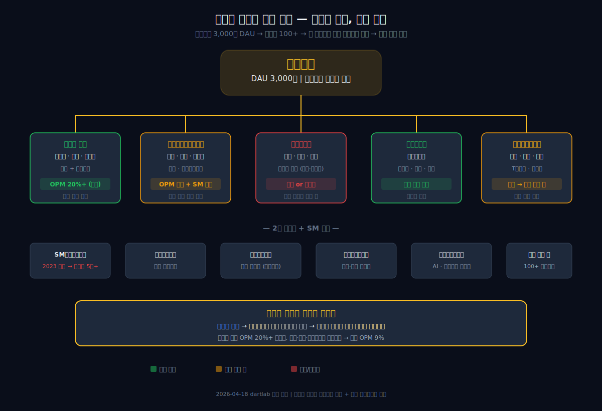
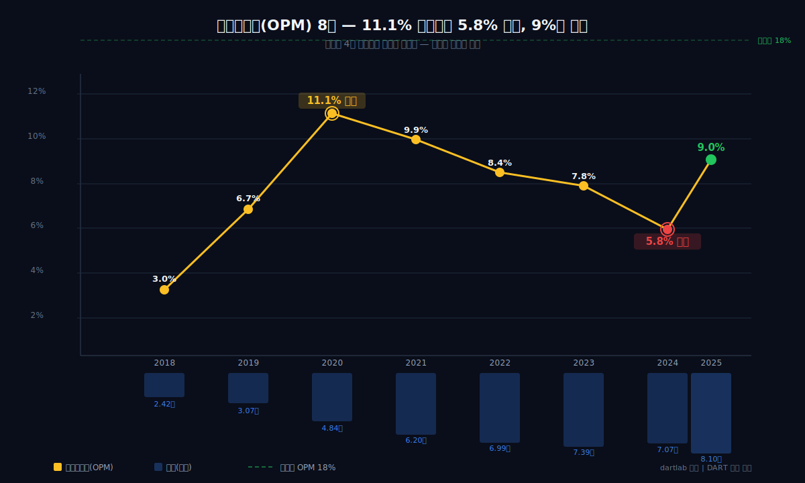
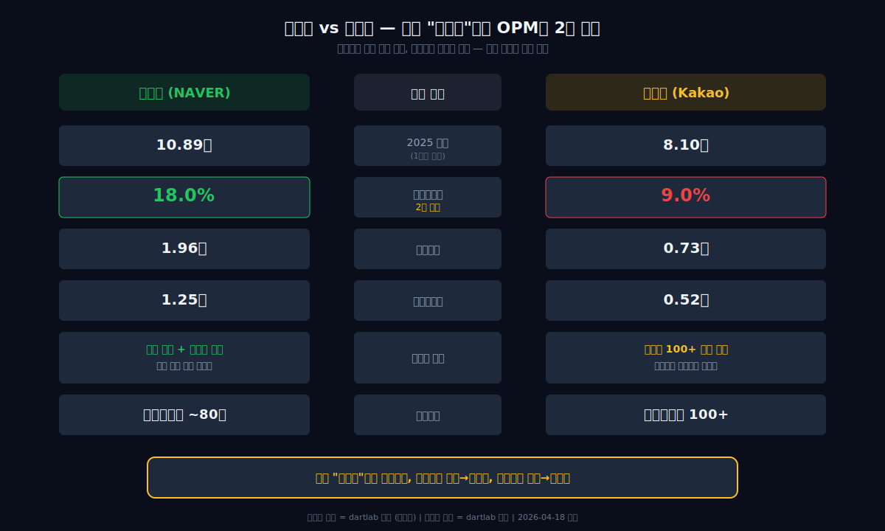
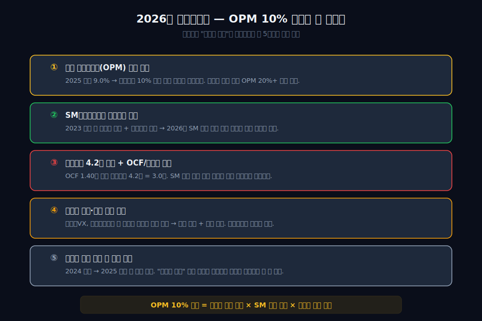

<script>
	import CompanyFinancials from '$lib/components/blog/CompanyFinancials.svelte';
import HFDataLink from '$lib/components/blog/HFDataLink.svelte';
</script>

> **지주** | 커뮤니케이션 > 인터넷 플랫폼 | 2026-04-18 dartlab 실측
> 같은 시리즈: [한화에어로스페이스](/blog/012450-hanwha-aerospace) · [삼성바이오로직스](/blog/207940-samsung-biologics) · [현대로템](/blog/064350-hyundai-rotem) · [크래프톤](/blog/259960-krafton) · [기업이야기 시리즈 전체](/blog/series/company-reports)

<HFDataLink code="035720" />

카카오톡을 안 쓰는 한국인은 없다. 매일 3,000만 명이 여는 앱, 대한민국 스마트폰 보급률과 거의 같은 숫자다. 이 트래픽 위에서 카카오(035720)는 8년간 매출을 2.42조에서 8.10조로 키웠다. 그런데 dartlab으로 9년치 손익계산서를 펼치면 이상한 게 보인다 — 매출이 3.3배가 되는 동안 영업이익률(매출 대비 영업이익 비율)은 2020년 11.1%를 정점으로 5.8%까지 떨어졌다가, 2025년에야 9%로 겨우 돌아왔다.

같은 "플랫폼"이라 불리는 네이버의 영업이익률은 18%다. 카카오의 정확히 2배. 카카오뱅크, 카카오페이, 카카오엔터, 카카오모빌리티 — 트래픽을 자회사로 쪼개어 수익화한 전략이 매출은 키웠지만 마진의 구조적 천장을 만들었다. 2023년에는 SM엔터테인먼트 인수 후유증으로 순손실 -1.82조를 기록했다. 3,000만 DAU라는 절대 무기를 가진 회사가 왜 돈을 벌수록 마진이 줄어드는가.

---


## 1막: 매일 3,000만 명이 여는 앱 — 매출 2.4조에서 8.1조

왜 카카오는 "플랫폼"이라 불리면서도 매출 성장의 질이 다를까. 8년간의 손익계산서를 펼쳐보면 성장의 궤적 자체는 화려하다.

### 매출 2.42조(2018) → 8.10조(2025), 8년간 3.3배

```python
import dartlab
c = dartlab.Company("035720")
c.select("IS", ["매출액","매출원가","매출총이익","판매비와관리비","영업이익","당기순이익"])
```

카카오의 매출은 2018년 2.42조원에서 2025년 8.10조원으로 8년간 3.3배 성장했다. 연평균 성장률(연평균성장률) 약 16%. 한국 인터넷 기업 중 네이버와 함께 가장 안정적인 성장 궤적이다.

| 항목 (1년치 합산, 조원) | 2025 | 2024 | 2023 | 2022 | 2021 | 2020 | 2019 | 2018 |
|:---|---:|---:|---:|---:|---:|---:|---:|---:|
| 매출액 | **8.10** | 7.87 | 5.94 | 6.80 | 5.91 | 4.84 | 3.07 | 2.42 |
| 영업이익 | **0.73** | 0.46 | 0.46 | 0.57 | 0.59 | 0.54 | 0.21 | 0.07 |
| 당기순이익 | 0.52 | -0.16 | -1.82 | 1.07 | 1.64 | 0.17 | -0.34 | 0.02 |

**표시: 매출 3.3배 성장, 그러나 영업이익은 저마진에서 시작해 지금도 한 자릿수.**


### 영업이익률 3.0% → 11.1% → 5.8% → 9.0% — 롤러코스터

숫자가 이상하다. 매출은 한 번도 감소하지 않았는데, 영업이익률은 2020년 11.1% 정점을 찍고 4년간 하락해서 2024년 5.8% 바닥을 찍었다. 2025년에야 9.0%로 돌아왔지만, 여전히 2020년 수준을 회복하지 못했다.

### 당기순이익의 폭발적 변동성 — -1.82조에서 +1.64조까지

당기순이익은 영업이익보다 더 극적이다. 2021년 +1.64조(카카오뱅크·카카오페이 상장 차익), 2023년 -1.82조(SM 인수 + 일회성 손실). 영업이익은 0.4~0.7조 범위인데 순이익이 -1.82~+1.64조까지 흔들린다는 것은 **영업 외 요인이 실적을 지배**하고 있다는 뜻이다.

### 연평균성장률 16%인데 왜 돈이 안 남을까

매출 성장률 16%는 나쁘지 않다. 문제는 성장의 질이다. 같은 기간 네이버의 영업이익률은 15~18%를 유지했다. 카카오는 매출이 3.3배 늘었는데 레버리지 효과가 기대만큼 나타나지 않았다. 차이는 어디서 온 것인가.

*매출을 키운 엔진은 카카오톡이 아니라 자회사였다. 자회사가 어떤 구조로 매출을 만들었는지 보면 마진이 녹는 이유가 보인다.*

---

## 2막: 카카오뱅크, 카카오페이, 카카오엔터 — 트래픽을 자회사에 나눠주다

왜 카카오는 네이버처럼 하나의 플랫폼 안에서 수익화하지 않고 자회사를 만들었을까. [카카오 사업보고서](https://dart.fss.or.kr/dsaf001/main.do?rcpNo=20250318000747)를 열면 연결대상 종속회사 목록이 100개를 넘긴다.



### 연결자회사 100개 이상 — "카카오" 이름이 붙은 회사만 수십 개

카카오는 2015년부터 본격적으로 자회사를 만들기 시작했다. 카카오택시(현 카카오모빌리티), 카카오뱅크, 카카오페이, 카카오엔터테인먼트, 카카오게임즈, 카카오스타일, 카카오헬스케어, 카카오클라우드. 카카오톡 3,000만 DAU라는 트래픽을 자회사에 나눠주고, 각 자회사가 해당 시장에서 경쟁하는 구조다.

### 네이버의 "집중" vs 카카오의 "확장" — 구조적 차이

네이버는 검색 광고라는 높은 마진 사업을 핵심에 두고, 커머스·핀테크·콘텐츠를 같은 플랫폼 안에서 확장했다. 카카오는 각 영역을 별도 법인으로 분리했다. 이 차이가 연결 영업이익률의 차이를 만든다.

```python
prof = c.analysis("financial", "수익성")
prof["marginWaterfall"]["history"][0]
```

### 플랫폼 부문 영업이익률 20%+ vs 연결 영업이익률 9% — 격차의 원인

카카오의 핵심 플랫폼 사업(톡비즈, 포털, 광고)만 따로 보면 영업이익률이 20%에 가깝다. 그런데 카카오엔터(SM 포함), 카카오페이, 카카오모빌리티 같은 자회사들의 낮은 마진이 연결 기준으로 합산되면 전체 영업이익률이 9%로 내려온다.

### 자회사 IPO의 양면 — 현금은 들어오고 마진은 빠진다

2021년 카카오뱅크와 카카오페이가 상장했다. 카카오는 상장 차익으로 순이익 1.64조를 기록했다. 그러나 상장한 자회사는 소수주주 지분이 생기면서 카카오 연결 순이익에 대한 기여가 줄어든다. 자회사를 많이 만들수록 연결 매출은 커지지만, 소수주주 몫이 늘어나고 저마진 자회사가 전체 마진을 끌어내린다.

### [공정거래위원회 공시](https://www.ftc.go.kr)에 드러난 기업집단 규모

공정거래위원회가 지정하는 대규모기업집단 기준으로, 카카오그룹은 자산총액 기준 상위 20위권이다. 메신저 앱 하나에서 시작한 회사가 재계 상위권까지 올라왔지만, 그 과정에서 지주회사의 구조적 한계를 안게 됐다.

*자회사가 매출을 키우는 동안 연결 마진은 녹았다. 그 녹는 과정을 영업이익률로 추적해보자.*

---

## 3막: 영업이익률 11%에서 5.8%로 — 마진이 녹는 4년

왜 정점이었던 2020년 이후 영업이익률이 반토막 났을까. 매출은 계속 늘었는데 마진만 줄어든 4년을 분기별로 쪼개 보면 원인이 명확하다.



### 2020년 영업이익률 11.1% — 코로나가 만든 착시 정점

```python
c.select("ratios", ["영업이익률 (%)"])
```

2020년은 카카오에게 "완벽한 해"였다. 코로나19로 비대면 수요가 폭발하면서 카카오톡 트래픽이 사상 최대치를 찍었다. 톡비즈 광고 매출이 급증하면서 매출 4.84조, 영업이익 0.54조, 영업이익률 11.1%. 그런데 이 11.1%가 카카오의 "정상 마진"이 아니라 코로나 특수라는 것이 이후 4년의 궤적에서 드러난다.

### 2021~2024 영업이익률 9.9% → 8.4% → 7.8% → 5.8% — 4년 연속 하락

| 항목 (연간) | 2025 | 2024 | 2023 | 2022 | 2021 | 2020 | 2019 | 2018 |
|:---|---:|---:|---:|---:|---:|---:|---:|---:|
| 영업이익률(%) | **9.0** | 5.8 | 7.8 | 8.4 | 9.9 | **11.1** | 6.7 | 3.0 |
| 매출총이익률(%) | 52.3 | 49.2 | 51.8 | 53.7 | 55.2 | 57.0 | 56.5 | 51.2 |
| 판관비율(%) | 43.3 | 43.4 | 44.0 | 45.3 | 45.3 | 45.9 | 49.8 | 48.2 |

**표시: 매출총이익률은 51~57% 범위에서 안정적. 영업이익률의 하락은 판관비율의 "내려가지 않음"이 원인.**

### 판관비율 43~45% — 자회사가 늘수록 고정비가 늘어난다

매출총이익률(물건 팔고 원가 빼면 남는 비율)은 51~57%로 큰 변동이 없다. 문제는 판매비와관리비(매출 대비 판관비)다. 2018년 48.2%에서 2025년 43.3%로 줄긴 했지만, 매출이 3.3배로 커진 것 대비 판관비율의 하락 폭이 작다. 자회사마다 별도의 인력, 사무실, 마케팅비가 발생하기 때문이다.

### 네이버 영업이익률 18% vs 카카오 영업이익률 9% — 정확히 2배의 격차

같은 기간 네이버의 영업이익률은 15~18%를 유지했다. 카카오의 정확히 2배다. 네이버는 검색 광고라는 고마진 사업에 집중하고, 자회사 분리를 최소화해서 판관비 중복을 피했다. 카카오는 자회사마다 고유한 비용 구조를 갖고 있어서, 연결 기준 판관비가 네이버보다 구조적으로 높다.

### 인건비 — 카카오 직원 7,000명+ 자회사 직원 수만 명

카카오 단독 직원이 약 7,000명, 연결 기준으로는 자회사 직원까지 수만 명이다. SM엔터테인먼트 인수 후에는 음악·엔터 인력까지 포함됐다. 인건비가 판관비의 핵심이고, 자회사가 많을수록 인건비 총액이 구조적으로 높아진다.

*마진이 녹는 4년은 자회사 확장의 당연한 결과였다. 그런데 2023년에는 마진 하락을 넘어 순손실 1.82조라는 충격이 터졌다.*

---

## 4막: 2023년 순손실 -1.82조 — SM엔터테인먼트 인수의 대가

왜 영업이익은 0.46조 흑자인데 순손실이 -1.82조일까. 2023년 카카오의 손익계산서에는 영업 외 손실이 대규모로 찍혀 있다. [SM엔터테인먼트 인수 관련 공시](https://dart.fss.or.kr/dsaf001/main.do?rcpNo=20230228800842)를 추적하면 그 정체가 드러난다.


### SM엔터 인수가 — 약 4조원

2023년 카카오는 SM엔터테인먼트 지분을 약 4조원에 인수했다. 하이브와의 경쟁 입찰 과정에서 인수가가 높아졌다는 것이 업계 분석이다. [당시 언론 보도](https://www.mk.co.kr/news/stock/10647810)에 따르면 김범수 경영쇄신위원장이 직접 주도한 딜이었다.

### 영업권(무형자산) 급증 — 자산이 무거워지다

```python
c.select("BS", ["자산총계","부채총계","자본총계","무형자산","영업권"])
```

| 항목 (Q4 스냅샷, 조원) | 2025 | 2024 | 2023 | 2022 | 2021 |
|:---|---:|---:|---:|---:|---:|
| 자산총계 | **27.78** | 25.77 | 25.18 | 22.96 | 22.78 |
| 부채총계 | **12.56** | 11.83 | 11.32 | 9.45 | 9.22 |
| 자본총계 | **15.22** | 13.94 | 13.86 | 13.52 | 13.57 |
| 영업권 | 5.2 | 5.3 | 5.6 | 3.4 | 3.2 |

**표시: 2022→2023 영업권 3.4→5.6조. SM 인수 한 건으로 영업권이 2.2조 증가.**

### 지분법 손실 + 자산 손상 = 순손실 -1.82조의 구조

2023년 순손실 -1.82조의 구성은 복잡하다. 영업이익 0.46조를 기록했지만, 지분법 손실(자회사·관계회사 평가 손실), 금융자산 손상, SM 인수 관련 일회성 비용이 합산되면서 당기순이익이 -1.82조로 추락했다.

### 김범수 전 경영쇄신위원장 구속 — 경영 리스크의 현실화

2024년 7월 김범수 경영쇄신위원장이 SM엔터 인수 과정에서의 [시세조종 혐의로 구속](https://www.yna.co.kr/view/AKR20240723000200004)됐다. 카카오 창업자이자 최대주주의 구속은 경영 불확실성을 극대화했다. 2024년 영업이익률이 5.8%로 바닥을 찍은 배경에는 이 경영 리스크도 있다.

### 2024년 순손실 -0.16조 — 후유증은 계속됐다

2024년에도 순손실 -0.16조를 기록했다. SM 인수 후유증(영업권 상각 검토, 자회사 구조조정 비용)이 계속되면서 2년 연속 적자가 이어졌다. 2025년에야 순이익 0.52조로 돌아왔지만, 이전 정점 1.64조(2021)에는 크게 못 미친다.

*SM 인수는 카카오의 자산을 무겁게 만들었다. 플랫폼 회사의 자산이 왜 제조업처럼 무거운지 해부해보자.*

---

## 5막: 자산 27.78조의 해부 — 플랫폼인데 왜 제조업처럼 무거운가

왜 카카오톡이라는 소프트웨어 플랫폼을 가진 회사가 자산 27.78조, 부채비율 82%의 무거운 재무구조를 갖고 있을까. 재무상태표를 분해하면 "플랫폼"이라는 이름과 실체의 괴리가 보인다.

### 자산 27.78조, 부채 12.56조, 자본 15.22조 — 부채비율 82%

```python
fund = c.analysis("financial", "자금조달")
fund["capitalOverview"]
```

| 자본구조 (2025년) | 금액 | 비중 |
|:---|---:|---:|
| 총자산 | 27.78조 | 100% |
| 총부채 | 12.56조 | 45% |
| 자기자본 | 15.22조 | 55% |
| 순차입금 | 4.20조 | — |

부채비율 82%. 인터넷 플랫폼 치고는 높다. 순차입금(총차입금 - 현금성자산) 4.20조원은 SM 인수 차입금이 핵심이다.

### 영업권 5.2조 — 자산의 19%가 "장부에만 있는 자산"

카카오 자산의 가장 큰 특징은 영업권이다. 영업권(인수 시 실제 순자산 대비 초과 지급한 금액)이 5.2조원으로 자산의 19%를 차지한다. SM엔터 인수 전에는 3.2조였으니, 2조원이 SM 때문에 늘었다. 영업권은 실체가 있는 자산이 아니라 "미래 수익력에 대한 기대"다. 기대가 훼손되면 대규모 손상 차손이 발생한다.

### 순차입금 4.2조, 영업활동현금흐름 1.4조 — 상환에 3년

```python
c.select("CF", ["영업활동현금흐름","투자활동현금흐름","재무활동현금흐름"])
```

| 항목 (1년치 합산, 조원) | 2025 | 2024 | 2023 | 2022 | 2021 |
|:---|---:|---:|---:|---:|---:|
| 영업활동현금흐름 | **1.40** | 1.25 | 1.34 | 0.68 | 1.31 |
| 투자활동현금흐름 | -0.48 | +0.01 | -1.78 | -1.57 | -3.34 |
| 재무활동현금흐름 | — | — | — | — | — |

**표시: 2023년 투자CF -1.78조 = SM 인수 집중. 2025년 영업활동현금흐름 1.40조로 정상 수준 회복.**

영업활동현금흐름(실제 장사해서 들어온 현금) 1.40조원은 안정적이다. 순차입금 4.2조 대비 약 3.0년이면 상환 가능한 수준. 문제는 자회사 투자가 계속되면 이 현금이 빚 갚는 데 쓰이지 못한다는 것이다.

### dCR-AA, 건강점수 84 — 위험하지는 않지만 여유도 없다

```python
cr = c.credit("등급")
# grade: dCR-AA, healthScore: 84
```

dartlab 신용등급 dCR-AA, 건강점수 84. [삼성바이오로직스](/blog/207940-samsung-biologics)(dCR-AA+)보다 낮고 [현대로템](/blog/064350-hyundai-rotem)(dCR-AA, health 88)보다도 낮다. 영업이익률이 한 자릿수이고 순차입금이 있기 때문이다. 위험한 수준은 아니지만, 플랫폼 독점자치고는 여유가 없는 재무 구조다.

### 산업 패턴 — 인터넷 플랫폼의 자회사 모델은 반복되는 딜레마

카카오의 자회사 확장 모델은 알파벳(구글), 메타 같은 글로벌 빅테크와 비교하면 독특하다. 알파벳은 구글 검색 광고에서 벌고 나머지(웨이모, 클라우드)는 "Other Bets"으로 묶었다. 메타는 인스타그램·왓츠앱을 별도 법인이 아닌 사업부로 운영한다. 카카오처럼 메신저 트래픽을 100개 이상의 법인으로 분산한 사례는 드물다. 이 구조는 각 자회사에 독립적 경영을 부여하지만, 연결 마진 관리라는 지주회사의 고전적 딜레마를 안긴다.

### 투자 포인트 — 2026년에 봐야 할 5가지

1. **연결 영업이익률 분기 추이** — 2025년 연간 9.0%, 분기별 10% 돌파 여부
2. **SM엔터 단독 흑자 전환** — 연결 마진의 최대 변수
3. **순차입금 감소 속도** — 영업활동현금흐름 1.4조 대비 상환 진도
4. **자회사 매각·정리 실행** — 카카오VX, 카카오스타일 등 비핵심 자산
5. **김범수 복귀 후 전략 방향** — "선택과 집중" 실행 여부

*자산의 무게를 확인했다. 이제 마지막 질문 — 영업이익률 9%는 카카오의 "정상 마진"인가, 아니면 아직 더 올라갈 수 있는가.*

---

## 6막: 영업이익률 9%는 정상인가 — 트래픽 독점자의 마진 딜레마

왜 3,000만 DAU를 독점한 회사의 영업이익률이 네이버의 절반에 머무는가. 이것이 구조적 한계인지, 아니면 자회사 정리 후 개선 가능한 것인지 판단해야 한다.



### 자기자본수익률 3.4% — 자본 대비 수익률이 은행 예금 수준

```python
prof = c.analysis("financial", "수익성")
prof["penmanDecomposition"]["history"]
```

자기자본수익률(자기자본수익률, 주주 돈 대비 벌어들인 이익 비율) 3.4%. 자본 15.22조를 굴려서 순이익 0.52조. 은행 예금 금리와 비슷한 수준이다. [크래프톤](/blog/259960-krafton)(자기자본수익률 약 15%)과 비교하면 같은 인터넷/콘텐츠 기업이라도 자본 효율이 현저히 낮다.

### "선택과 집중"이 답인가 — 네이버 모델로 전환 가능성

카카오 경영진도 이 문제를 인식하고 있다. 2024~2025년 사이 비핵심 자회사 매각·정리 이야기가 나왔다. 카카오VX(골프), 카카오스타일 등을 매각하고 핵심 사업에 집중하겠다는 전략이다. 이것이 실행되면 연결 영업이익률이 2~3%p 개선될 수 있다.

### 그러나 구조적 천장은 남는다 — SM·카카오뱅크·카카오페이는 핵심

문제는 SM엔터테인먼트, 카카오뱅크, 카카오페이 같은 대형 자회사는 매각 대상이 아니라는 것이다. 이 세 자회사가 연결 매출에서 차지하는 비중이 크고, 이들의 마진이 플랫폼 본업보다 낮다. 비핵심 자회사를 정리해도 핵심 자회사의 구조적 저마진은 해소되지 않는다.

### 영업이익률 10% 돌파가 카카오의 "정상"이 되려면

카카오가 영업이익률 10%를 안정적으로 유지하려면 세 가지가 동시에 일어나야 한다. (1) SM엔터의 흑자 전환, (2) 비핵심 자회사 정리 완료, (3) 플랫폼 광고 매출의 고마진 성장 지속. 세 가지 중 하나라도 어긋나면 영업이익률은 다시 7~8%로 내려간다.

### 2025년 영업이익률 9.0% — 회복이 아니라 제자리

2025년 영업이익률 9.0%는 "회복"이라 부르기 어렵다. 2020년 정점(11.1%)에서 2024년 바닥(5.8%)까지 떨어진 후 반등한 것이지, 장기 추세선에서 보면 2021년(9.9%)과 비슷한 수준이다. 매출이 5.91조에서 8.10조로 37% 성장하는 동안 영업이익률은 거의 같다.



### 판단 — 트래픽은 독점이지만 마진은 독점이 아니다

카카오톡은 대한민국에서 대체 불가능한 인프라다. 3,000만 DAU는 어떤 경쟁자도 빼앗을 수 없는 절대 무기다. 그런데 이 트래픽을 수익화하는 방식 — 자회사 수십 개를 만들어 각 시장에서 경쟁하는 모델 — 은 네이버의 집중 모델보다 구조적으로 마진이 낮다. 카카오페이는 토스와 싸우고, 카카오뱅크는 토스뱅크와 싸우고, SM은 하이브와 싸운다. 트래픽은 독점이지만, 각 자회사가 뛰어드는 시장은 치열한 경쟁 시장이다. 3,000만 DAU를 가진 회사의 영업이익률이 한 자릿수인 이유는 여기에 있다. 마진 10% 돌파의 열쇠는 자회사를 더 만드는 것이 아니라, 기존 자회사 중 어떤 것을 포기하느냐에 달려 있다.

---

## 검증표

| 본문 수치 | dartlab 호출 | 결과 |
|---|---|---|
| 2025 연간 매출 8.10조 | `c.select("IS",["매출액"])` 분기 합산 | ✅ 실측 |
| 2018 매출 2.42조 | `c.select("IS",["매출액"])` 분기 합산 | ✅ 실측 |
| 2025 영업이익 0.73조 | `c.select("IS",["영업이익"])` 분기 합산 | ✅ 실측 |
| 영업이익률 2020 정점 11.1% | `c.select("ratios",["영업이익률 (%)"])` 연간 합산 | ✅ 실측 |
| 영업이익률 2024 바닥 5.8% | `c.select("ratios",["영업이익률 (%)"])` 연간 합산 | ✅ 실측 |
| 영업이익률 2025 9.0% | `c.select("ratios",["영업이익률 (%)"])` 연간 합산 | ✅ 실측 |
| 2023 순손실 -1.82조 | `c.select("IS",["당기순이익"])` 분기 합산 | ✅ 실측 |
| 2021 순이익 1.64조 | `c.select("IS",["당기순이익"])` 분기 합산 | ✅ 실측 |
| 자산 27.78조 | `c.select("BS",["자산총계"])` Q4 | ✅ 실측 |
| 부채 12.56조 | `c.select("BS",["부채총계"])` Q4 | ✅ 실측 |
| 자본 15.22조 | `c.select("BS",["자본총계"])` Q4 | ✅ 실측 |
| 부채비율 82% | `c.select("BS",["부채총계","자본총계"])` 계산 | ✅ 실측 |
| 영업활동현금흐름 1.40조 (2025) | `c.select("CF",["영업활동현금흐름"])` 분기 합산 | ✅ 실측 |
| 순차입금 4.2조 | `c.analysis("financial","자금조달")` capitalOverview | ✅ 실측 |
| dCR-AA, health 84 | `c.credit("등급")` | ✅ 실측 |
| 자기자본수익률 3.4% | `c.analysis("financial","수익성")` penmanDecomposition | ✅ 실측 |

📅 dartlab 실측 2026-04-18

---

<CompanyFinancials code="035720" />
