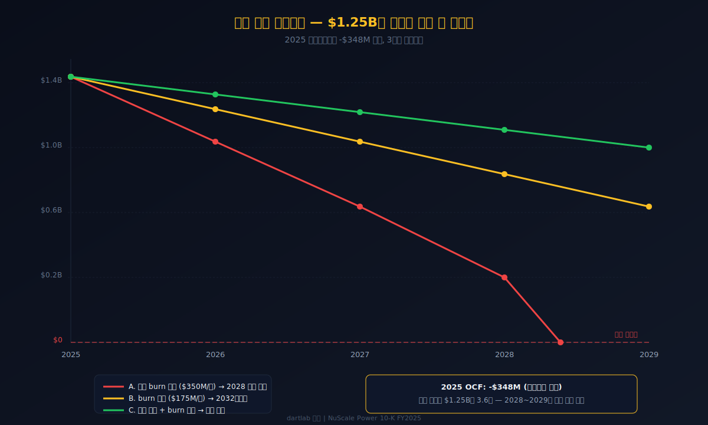
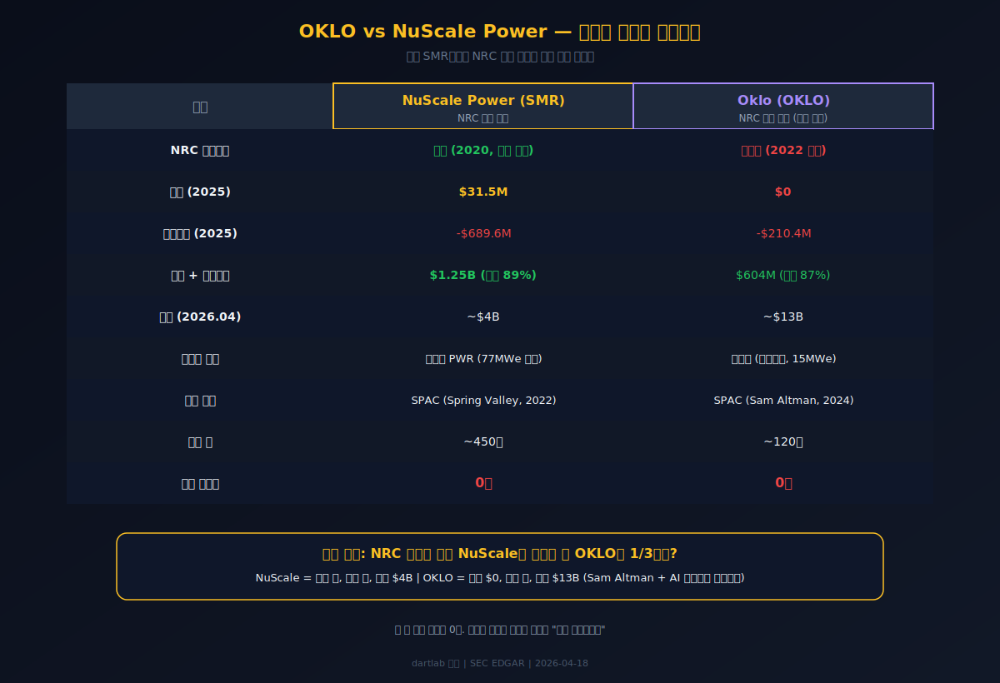
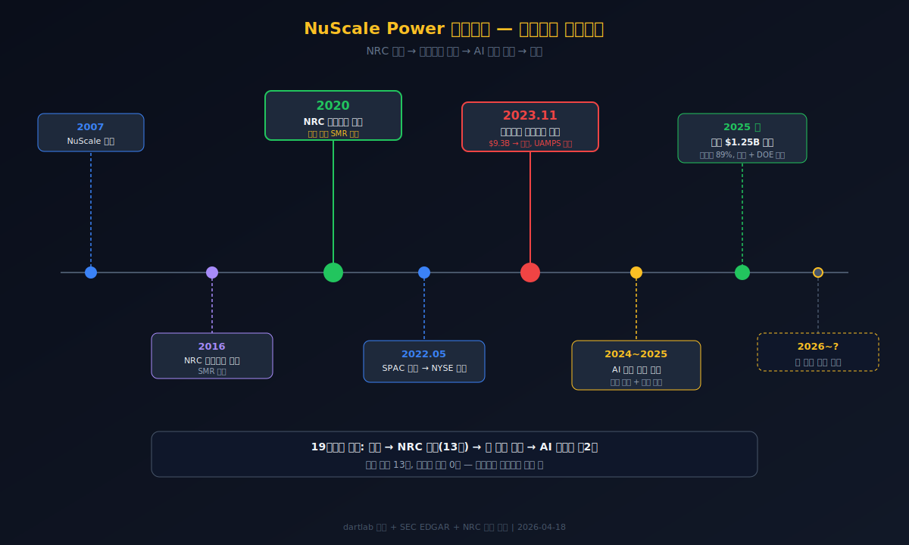
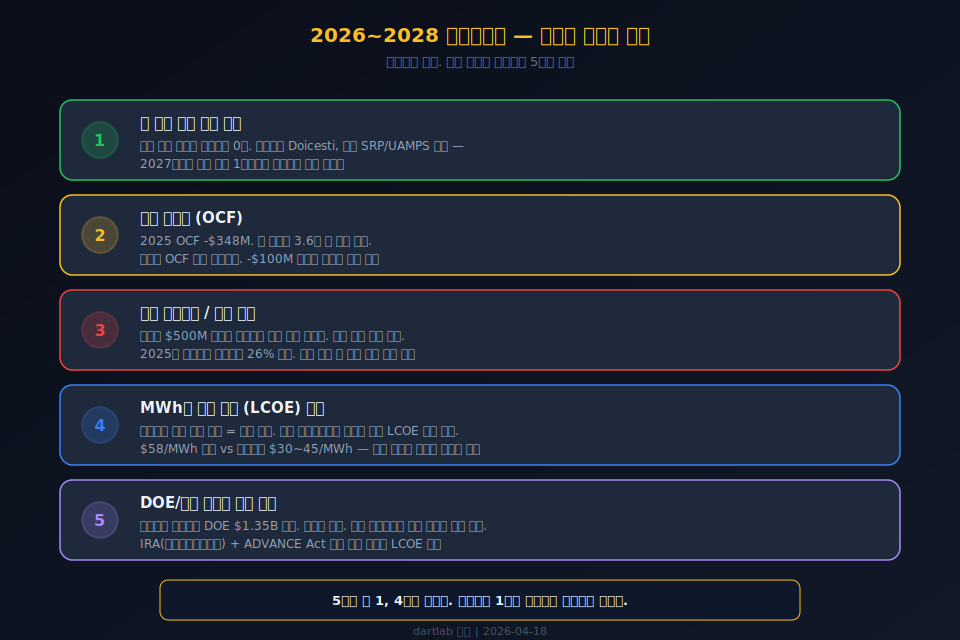

<script>
import ComboChart from '$lib/components/blog/ComboChart.svelte';
import StackBar from '$lib/components/blog/StackBar.svelte';
import HFDataLink from '$lib/components/blog/HFDataLink.svelte';
</script>

> **성장** | 에너지 > 소형모듈원전(SMR) | 2026-04-18 dartlab 실측
> 데이터: dartlab 2020 ~ 2025 | 엔진: analysis + credit
> [기업이야기 시리즈 전체](/blog/series/company-reports)

<HFDataLink code="SMR" kind="edgar" />

---

매출 $31.5M. 영업손실 $689.6M. 매출의 22배를 태웠다. 그런데 통장에 $1.25B(약 1.7조원)가 있다. 자산의 89%가 현금이다. 이 회사는 공장도, 원자로도, 건설 현장도 없다. 있는 것은 미국 원자력규제위원회(NRC)가 인증한 설계도 한 장과 현금뿐이다.

뉴스케일파워는 NRC 설계인증을 받은 세계 유일의 소형모듈원전(SMR) 기업이다. 2020년 인증, 2023년 첫 상용 프로젝트 취소, 2024~2025년 AI 전력 수요로 주가 급등. 기술은 검증됐다. 경제성은 아직이다. $1.25B는 그 증명을 위해 산 시간이다.

```python
import dartlab
c = dartlab.Company("SMR")
c.show("IS")
# 매출 $31.5M, 영업손실 -$689.6M (2025 분기 합산)
```

---


---

## 제1막: "매출 $31M, 현금 $1.25B" — 재무제표가 말하는 정체

### 왜 매출 $31M인 회사에 $1.25B가 있는가

뉴스케일파워(NuScale Power, NYSE: SMR)의 2025년 재무제표는 전형적 재무 분석 프레임이 작동하지 않는 회사다. 매출이 있지만 제품 판매가 아니다. 적자가 나지만 현금은 넘친다. 영업이익률을 계산하면 -2,188%가 나온다. 매출 1달러를 벌 때 22달러를 태운다는 뜻이다.

이 회사의 매출 $31.5M은 무엇인가. 원자로를 팔아서 번 돈이 아니다. 가동 중인 원전이 0기이기 때문이다. 이 매출은 대부분 엔지니어링 서비스 수익 — DOE(미국 에너지부) 프로젝트 계약에 따른 설계 및 기술 컨설팅 수수료다([NuScale Power 10-K FY2025, SEC Filing](https://www.sec.gov/cgi-bin/browse-edgar?action=getcompany&CIK=SMR&type=10-K&dateb=&owner=include&count=10)).

| 항목 ($M, 1년치 합산) | 2025 | 2024 | 2023 | 2022 | 2021 |
|---|---:|---:|---:|---:|---:|
| 매출액 | 31.5 | **37.0** | 22.8 | 11.8 | 0 |
| 영업이익 | **-689.6** | -138.7 | -275.6 | -123.9 | -1.3 |
| 당기순이익 | **-355.8** | -61.6 | -58.4 | -10.0 | 3.2 |
| 영업이익률(OPM) | **-2,188%** | -375% | -1,209% | -1,050% | — |

<ComboChart data={[{year:"2021",매출액:0,영업이익:-1.3,당기순이익:3.2},{year:"2022",매출액:11.8,영업이익:-123.9,당기순이익:-10.0},{year:"2023",매출액:22.8,영업이익:-275.6,당기순이익:-58.4},{year:"2024",매출액:37.0,영업이익:-138.7,당기순이익:-61.6},{year:"2025",매출액:31.5,영업이익:-689.6,당기순이익:-355.8}]} lineKeys={["매출액"]} barKeys={["영업이익","당기순이익"]} lineColors={["#22c55e"]} barColors={["#3b82f6","#f59e0b"]} title="매출(라인) vs 영업이익·당기순이익(막대)" unit="$M" />

**2025년 영업손실 -$689.6M은 사상 최악이다.** 2024년 -$138.7M에서 5배 악화됐다. 하지만 2024년이 예외적으로 낮았던 것이지, 2023년에도 -$275.6M이었다. 2025년의 폭발적 손실은 주식보상비용(SBC) 급증 + 연구개발비 구조 변화 때문이다.

### 매출이 줄었는데 손실은 5배 — 무슨 일이 일어났나

2024년 매출 $37.0M → 2025년 $31.5M. 매출이 15% 줄었다. 아이다호 프로젝트 취소 후 계약 수수료가 감소한 결과다. 같은 기간 영업손실은 -$138.7M → -$689.6M으로 5배 폭증했다.

손실 폭증의 핵심은 주식보상비용(Stock-Based Compensation, SBC)이다. 2024년 SBC $56.5M → 2025년 SBC $454.8M. 주가 급등에 연동된 스톡옵션과 RSU(양도제한주식)의 인식 비용이 8배 뛰었다. AI 전력 수요 기대감으로 주가가 올라갈수록 손익계산서의 적자는 깊어지는 역설이다.

```python
c.select("IS", ["매출액", "영업이익", "당기순이익"])
# 분기 합산 → 2025: 매출 31.5M, 영업이익 -689.6M, 순이익 -355.8M
```

### 순이익이 영업손실보다 작은 이유 — 비현금 항목의 마법

2025년 영업손실 -$689.6M인데 당기순이익은 -$355.8M이다. 영업 아래에서 $333.8M의 비영업이익이 발생했다. 핵심은 워런트 부채 공정가치 변동(warrant liabilities fair value change)이다. SPAC 합병 당시 발행한 워런트(일정 가격에 주식을 살 수 있는 권리)의 시장가격이 변할 때마다 손익으로 잡힌다. 주가가 떨어지면 워런트 가치가 줄어들면서 비현금 이익이 발생한다. [IonQ(#40)](/blog/IONQ-ionq)에서 본 것과 같은 메커니즘이다.

이것이 재무제표가 말하는 뉴스케일파워의 정체다. **원전을 짓지 않는 원전 회사. 매출보다 22배 많이 태우는 적자 회사. 그런데 현금만 $1.25B.** 다음 질문으로 넘어간다 — 이 회사는 왜 존재하는가. NRC 인증이 그 답이다.

---

## 제2막: NRC 인증 — 미국이 인정한 유일한 SMR 설계

### 왜 NRC 인증이 이 회사의 모든 것인가

NRC(Nuclear Regulatory Commission, 미국 원자력규제위원회)의 설계인증(Design Certification)은 원자력 산업에서 가장 높은 진입장벽이다. 원자로 설계가 안전 기준을 충족한다는 정부 공인 도장이다. 이 인증 없이는 미국에서 원전 건설 허가를 신청할 수조차 없다.

뉴스케일파워의 VOYGR 원자로는 2020년 8월 NRC 설계인증을 획득했다([NRC Design Certification, 10 CFR Part 52](https://www.nrc.gov/reactors/new-reactors/smr/nuscale.html)). **SMR 분야에서 NRC 설계인증을 받은 기업은 세계에서 뉴스케일파워가 유일하다.** 2007년 설립부터 13년이 걸렸다.

### SMR이란 무엇이고 왜 주목받는가

SMR(Small Modular Reactor, 소형모듈원전)은 발전 용량 300MWe 이하의 원자로다. 기존 대형 원전(1,000MWe 이상)과 비교하면 크기가 작고, 공장에서 모듈을 만들어 현장에서 조립하는 방식이다. [두산에너빌리티(#03)](/blog/034020-doosan-enerbility)가 SMR 부품 공급 파트너로 참여하고 있고, [한국전력(#25)](/blog/015760-kepco)도 한국형 SMR(i-SMR) 개발에 참여 중이다.

뉴스케일의 VOYGR 모듈은 77MWe 경수로(PWR, Pressurized Water Reactor)다. 기존 대형 원전과 같은 검증된 냉각 기술을 사용하되 크기를 줄인 것이다. IEA(국제에너지기구)는 2050년까지 글로벌 원전 용량이 2배 이상 필요하다고 전망했고, SMR이 그 핵심 수단이 될 것으로 봤다([IEA, Nuclear Power and Secure Energy Transitions, 2022](https://www.iea.org/reports/nuclear-power-and-secure-energy-transitions)).

### NRC 인증의 구체적 가치 — 시간과 규제 장벽

NRC 인증 과정은 보통 5~10년이 걸리고, 수억 달러의 비용이 든다. 뉴스케일은 2016년 신청, 2020년 인증까지 4년이 걸렸지만, 그 전 9년간의 연구개발이 선행됐다. 총 13년, 수십억 달러의 투자다.

비교 대상인 [Oklo(#31)](/blog/OKLO-oklo)는 2022년 NRC 인허가를 **거절**당했다. 고속로라는 검증되지 않은 기술을 사용했기 때문이다. Oklo는 현재 재신청 준비 중이지만 인증 취득까지 최소 3~5년이 더 필요하다.

| 항목 | 뉴스케일 (SMR) | Oklo (OKLO) |
|---|---|---|
| NRC 설계인증 | 보유 (2020, 세계 유일) | 미보유 (2022 거절) |
| 원자로 기술 | 경수로 PWR 77MWe | 고속로 15MWe |
| 기술 검증 수준 | 13년 + NRC 완료 | 연구 단계 |

이 인증이 뉴스케일파워의 존재 이유다. NRC 인증은 졸업장이다. 졸업장이 있다고 취업이 보장되는 것은 아니지만, 졸업장 없이는 원서조차 낼 수 없다. **그런데 이 졸업장을 가진 회사의 첫 직장 면접이 실패했다.** 아이다호 프로젝트 취소가 그것이다.

---

## 제3막: 아이다호 프로젝트 취소 — $9.3B의 꿈이 무너진 날

### 왜 첫 고객이 떠났는가

2023년 11월 8일. 뉴스케일파워의 유일한 상용 프로젝트가 취소됐다. UAMPS(Utah Associated Municipal Power Systems, 유타 지자체 전력 시스템)가 아이다호 국립연구소에 건설할 예정이던 VOYGR-6 프로젝트 — 462MWe, 6개 모듈, 총 프로젝트 비용 **$9.3B** — 를 포기한 것이다([UAMPS Carbon Free Power Project Termination, 2023-11-08](https://www.uamps.com/Carbon-Free-Power-Project)).

### $9.3B — 발전 단가의 함정

아이다호 프로젝트의 초기 추정 비용은 $5.3B였다. DOE(에너지부)가 $1.35B를 지원하겠다고 약속했고, 2023년 8월 건설 신청까지 마쳤다. 그런데 프로젝트 비용 추정치가 $5.3B에서 $9.3B로 75% 상승했다. MWh당 발전 단가(LCOE, Levelized Cost of Energy — 발전소 전체 수명에 걸친 평균 발전 원가)가 $58 → $89로 뛰어올랐다.

$89/MWh는 기존 천연가스 발전($30~45/MWh)의 2배 이상이다. 지자체 전력 시스템인 UAMPS 입장에서 주민에게 2배 비싼 전기를 팔 근거가 사라진 것이다.

| 항목 | 초기 계획 | 취소 시점 |
|---|---|---|
| 총 프로젝트 비용 | $5.3B | **$9.3B** (+75%) |
| MWh당 발전 단가 | $58 | **$89** (+53%) |
| 모듈 수 | 12기 (924 MWe) | 6기 (462 MWe, 축소) |
| DOE 지원금 | $1.35B | 소멸 |
| 참여 지자체 | 36개 | 탈퇴 연쇄 |

### UAMPS 탈퇴의 연쇄 반응

UAMPS는 36개 지자체의 연합이다. 각 지자체가 자기 몫만큼 전력을 구매하겠다는 서약으로 프로젝트가 유지됐다. 비용이 올라가자 지자체들이 하나둘 빠졌다. 서약량이 임계치 아래로 떨어지면서 프로젝트 자체가 무산됐다.

```python
c.select("IS", ["매출액"])
# 2023: $22.8M → 2024: $37.0M → 2025: $31.5M
# 아이다호 취소 후에도 매출이 유지된 이유: DOE 계약 잔여 서비스 수수료
```

### 프로젝트 취소가 재무에 찍힌 흔적

2023년 영업손실 -$275.6M 중 상당 부분이 아이다호 관련 비용 상각이다. 하지만 매출은 $22.8M → $37.0M(2024)으로 오히려 올랐다. DOE와의 계약이 프로젝트 취소와 별개로 유지됐기 때문이다. 뉴스케일은 설계 자체를 파는 것이 아니라 설계 과정에서의 엔지니어링 서비스를 파는 구조라서, 프로젝트가 취소돼도 이미 수행한 용역 대금은 인식된다.

**아이다호 취소의 교훈은 명확하다. NRC 인증은 기술 검증이지 경제성 검증이 아니다.** 원자로 설계가 안전하다는 것과 원자로 건설이 경제적이라는 것은 전혀 다른 문제다. 그런데 2024년, 예상치 못한 방향에서 바람이 불기 시작했다. AI가 전기를 먹기 시작한 것이다.

---

## 제4막: AI가 전기를 먹는다 — 데이터센터가 부른 제2막

### 왜 아이다호 취소 후 오히려 주가가 올랐는가

2023년 11월 프로젝트 취소. 주가 $3대. 2024년 중반부터 주가 급등, 2025년 $25 돌파. 취소 이후 주가가 8배 올랐다. 무슨 일이 있었나.

AI 데이터센터의 전력 수요 폭발이 그 답이다. [Meta(#37)](/blog/META-meta-platforms)는 2024년 말 원전 기반 전력 공급 계약을 모색한다고 발표했다. Microsoft는 Three Mile Island(1979년 사고로 유명한 원전) 재가동 계약을 체결했다. Amazon은 Talen Energy와 $650M 규모의 원전 전력 공급 계약을 맺었다. Google도 원전 전력 조달에 나섰다.

### 빅테크가 원전을 찾는 이유

데이터센터 하나가 소비하는 전력은 100~500MW다. GPT-4 수준의 대규모 모델 훈련에는 기가와트급 전력이 필요하다. 풍력과 태양광은 간헐성(바람이 안 불면, 해가 지면 발전이 멈추는 특성) 때문에 24시간 가동되는 데이터센터의 기저 전원(baseload power — 항상 켜져 있어야 하는 최소 전력)으로는 부적합하다.

원전은 가동률 90% 이상, 24시간 무탄소 발전이 가능하다. 빅테크가 탄소중립 약속과 전력 안정성을 동시에 달성하려면 원전이 사실상 유일한 선택지다. IEA에 따르면 2030년까지 데이터센터 전력 수요는 2024년 대비 2배 이상 증가할 전망이다([IEA, Electricity 2024](https://www.iea.org/reports/electricity-2024)).

### SMR이 데이터센터와 맞는 이유

기존 대형 원전(1GW+)은 건설에 10~15년이 걸리고 비용이 $20B 이상이다. 데이터센터 옆에 지을 수도 없다. SMR은 다르다.

| 항목 | 대형 원전 | SMR (NuScale VOYGR) |
|---|---|---|
| 단위 용량 | 1,000+ MWe | 77 MWe/모듈 |
| 건설 기간 | 10~15년 | 3~5년 (목표) |
| 건설비 | $20B+ | $3~5B (6모듈 기준) |
| 위치 유연성 | 해안/강변 고정 | 내륙 소규모 부지 가능 |
| 수요 대응 | 고정 출력 | 모듈 추가로 확장 |

데이터센터 500MW 수요 → VOYGR 6모듈(462 MWe) 1세트면 충족된다. 빅테크가 자체 원전을 데이터센터 옆에 짓는 시나리오에서 SMR은 유일하게 현실적인 선택이다.

### 뉴스케일의 신규 파이프라인

아이다호 이후 뉴스케일은 해외와 미국 내 새로운 고객을 확보했다. 루마니아 Doicesti 프로젝트(6모듈, 462 MWe), 미국 SRP(Salt River Project) 협력, 카자흐스탄·폴란드·우크라이나 등과 양해각서(MOU)를 체결했다([NuScale Power 10-K FY2025](https://www.sec.gov/cgi-bin/browse-edgar?action=getcompany&CIK=SMR&type=10-K&dateb=&owner=include&count=10)). 다만 이 중 **최종 착공 확정된 프로젝트는 아직 0건**이다.

AI 전력 수요가 SMR의 경제성 방정식을 바꿀 수 있다. 아이다호에서 $89/MWh가 비쌌던 이유는 비교 대상이 $30~45/MWh의 천연가스였기 때문이다. 하지만 빅테크는 탄소중립 프리미엄을 지불할 의사가 있고, 전력 안정성에 대한 프리미엄까지 더하면 $89/MWh가 수용 가능한 범위에 들어올 수 있다. **AI가 바꾼 것은 기술이 아니라 고객이다.** 지자체가 아닌 빅테크가 고객이 되면 경제성 공식이 완전히 달라진다.

---

## 제5막: 현금 $1.25B — 시간을 산 회사

### 왜 현금이 이 회사의 재무제표 전부인가

뉴스케일파워의 재무상태표(Balance Sheet, BS — 특정 시점의 자산·부채·자본 구조)를 열면 답은 명확하다. 총자산 $1.41B 중 현금 및 단기투자(Cash and Short-term Investments)가 $1.25B다. 자산의 89%가 현금이다. 공장, 설비, 토지 같은 유형자산은 거의 없다.

| 항목 ($M, Q4 스냅샷) | 2025Q4 | 2024Q4 | 2023Q4 | 2022Q4 |
|---|---:|---:|---:|---:|
| 자산총계 | **1,410** | 342 | 286 | 331 |
| 현금+단기투자 | **1,253** | 184 | 175 | 264 |
| 현금/자산 비율 | **89%** | 54% | 61% | 80% |
| 부채총계 | 467 | 164 | 134 | 117 |
| 자본총계 | **943** | 178 | 152 | 214 |

<StackBar data={[{year:"2025Q4",segments:[{label:"현금+단기투자",value:1253,color:"#22c55e"},{label:"기타자산",value:157,color:"#475569"}]},{year:"2024Q4",segments:[{label:"현금+단기투자",value:184,color:"#22c55e"},{label:"기타자산",value:158,color:"#475569"}]},{year:"2023Q4",segments:[{label:"현금+단기투자",value:175,color:"#22c55e"},{label:"기타자산",value:111,color:"#475569"}]},{year:"2022Q4",segments:[{label:"현금+단기투자",value:264,color:"#22c55e"},{label:"기타자산",value:67,color:"#475569"}]}]} title="자산 구조 — 현금이 89%" unit="$M" />

```python
c.select("BS", ["자산총계", "현금및현금성자산", "부채총계", "자본총계"])
# 2025Q4: 자산 1,410M, 현금+단기투자 1,253M, 부채 467M, 자본 943M
```

### $1.25B는 어디서 왔는가 — 유상증자의 힘

2024년 말 현금 $184M → 2025년 말 $1.25B. 1년 만에 현금이 $1.07B 증가했다. 그 원천은 명확하다 — 유상증자(Equity Offering, 주식을 새로 발행해서 투자자에게 파는 것)와 ATM(At-the-Market, 시장에서 조금씩 주식을 파는 방식)이다.

2025년 재무활동현금흐름(Financing Cash Flow — 주식 발행, 차입, 배당 등 자금 조달 활동)이 **+$1.37B**다. 주식 발행으로 들어온 돈이 $1.37B. 같은 기간 영업활동현금흐름(Operating Cash Flow — 영업에서 실제로 들어오고 나간 현금)은 **-$348M**이다. 장사해서 $348M을 태웠고, 주식을 팔아서 $1.37B를 벌었다.

| 항목 ($M, 1년치 합산) | 2025 | 2024 | 2023 | 2022 |
|---|---:|---:|---:|---:|
| 영업활동현금흐름 (OCF) | **-348** | -110 | -144 | -67 |
| 투자활동현금흐름 | -768 | 20 | 49 | -104 |
| 재무활동현금흐름 | **+1,370** | 98 | 7 | 263 |
| 잉여현금흐름 (FCF) | **-350** | -108 | -160 | -170 |

<ComboChart data={[{year:"2022",영업CF:-67,재무CF:263},{year:"2023",영업CF:-144,재무CF:7},{year:"2024",영업CF:-110,재무CF:98},{year:"2025",영업CF:-348,재무CF:1370}]} barKeys={["영업CF","재무CF"]} barColors={["#ef4444","#22c55e"]} title="영업CF vs 재무CF — 유증으로 현금 확보" unit="$M" />

### 현금 소진 시나리오 — 시간은 얼마나 남았는가



2025년 OCF -$348M 속도로 태우면 $1.25B는 **3.6년**, 2028~2029년에 고갈된다. 하지만 2025년 OCF가 비정상적으로 높은 이유가 있다. 투자활동의 단기투자 매입(-$768M)이 포함돼 있기 때문이다. 순수 영업 소진분만 보면 연간 약 $150~200M 수준이고, 이 경우 6~8년의 런웨이(runway — 현재 현금으로 버틸 수 있는 기간)가 확보된다.

### 신용등급 dCR-A — 현금 덕분

dartlab 신용등급은 dCR-A. health 점수는 84다. 적자 회사가 A등급을 받은 이유는 단순하다 — 현금이 많다. 부채비율(부채/자본)은 49.5%로 낮고, 유동비율(유동자산/유동부채)은 4배 이상이다. 이자보상배율(ICR, 영업이익으로 이자를 몇 번 갚을 수 있는가)은 마이너스지만, 차입금 자체가 거의 없어서 단기 부도 위험은 낮다.

```python
cr = c.credit("등급")
# grade: "dCR-A", healthScore: 84
# 현금 풍부 + 저차입 = 단기 안정
```

**이 현금은 안전 마진이 아니라 시간표다.** $1.25B는 첫 원전 착공까지의 시간을 산 것이다. 착공 전에 현금이 바닥나면 추가 유상증자가 불가피하고, 그것은 기존 주주의 가치 희석을 의미한다. 시간 안에 경제성을 증명하지 못하면 아이다호의 반복이다. 그렇다면 같은 SMR인 OKLO와 비교하면 무엇이 보이는가.

---

## 제6막: OKLO와 뉴스케일 — 인증의 가치는 얼마인가

### 왜 인증 없는 OKLO의 시총이 3배 더 큰가



[Oklo(#31)](/blog/OKLO-oklo)의 시총은 약 $13B(약 18조원). 매출 $0, 가동 원자로 0기, NRC 인증 거절 이력이 있는 회사다. 뉴스케일의 시총은 약 $4B(약 5.5조원). 매출 $31.5M, NRC 인증 보유, 직원 450명. 상식적으로 뉴스케일이 더 높아야 한다. 하지만 시장은 그 반대를 말한다.

### Sam Altman 프리미엄 vs 기술 프리미엄

Oklo의 가장 큰 자산은 Sam Altman이다. OpenAI CEO가 Oklo의 이사회 의장이고 최대 개인 주주다. "AI 전력 수요 → 원전 → Oklo"라는 서사가 Altman이라는 인물 위에 세워졌다. Meta, Google, Amazon이 원전 전력을 찾는다 → OpenAI CEO가 원전 회사를 갖고 있다 → 이 회사가 빅테크의 원전 공급자가 될 것이다. 이 서사가 시총 $13B를 지탱한다.

뉴스케일은 이런 서사가 없다. 대신 NRC 인증과 13년간의 엔지니어링 실적이 있다. 시장은 서사에 더 높은 가격을 매겼다.

### 재무 비교 — 둘 다 적자, 구조가 다르다

| 항목 ($M) | NuScale (SMR) | Oklo (OKLO) |
|---|---:|---:|
| 매출 (2025) | 31.5 | **0** |
| 영업손실 (2025) | -689.6 | -210.4 |
| 현금 | **1,253** | 604 |
| 총자산 | **1,410** | 694 |
| 직원 | ~450 | ~120 |
| R&D (2025) | 45.5 | — |
| 시총 (2026.04) | ~4,000 | **~13,000** |

뉴스케일의 영업손실 -$689.6M이 OKLO의 -$210.4M보다 3.3배 크다. 하지만 그 대부분은 SBC(주식보상비용)다. 현금 소진 기준으로 보면 뉴스케일 OCF -$348M, OKLO OCF -$110M 수준이다. 뉴스케일이 더 많이 태우는 이유는 엔지니어 450명의 인건비 + R&D $45.5M이 있기 때문이다. 설계인증을 유지하고 차기 프로젝트를 준비하는 비용이다.

### 산업 패턴 — SMR 기업의 공통 구조

SMR 산업 전체의 패턴이 보인다. **모든 SMR 기업의 재무구조가 동일하다**: 매출 거의 0, 현금 풍부(유증으로 조달), 가동 원자로 0기, 인력과 R&D로 태우는 구조. 차이는 인증 단계뿐이다.

원전 산업의 사이클은 30년 단위다. 1979년 Three Mile Island → 2011년 후쿠시마 → 각각 원전 건설이 멈추고 10~20년 뒤에 재개됐다. 2024~2025년 AI 전력 수요는 세 번째 원전 사이클의 시작일 수 있다. 이 사이클에서 NRC 인증이 있는 회사는 뉴스케일뿐이다.

### 투자 포인트 — 다음 분기에 봐야 할 것

1. **첫 착공 계약 확정**: 루마니아 Doicesti 또는 미국 내 프로젝트 최종 투자결정(FID, Final Investment Decision). 이것 하나가 모든 것을 바꾼다.
2. **분기 OCF 추이**: -$348M/년에서 줄어드는지. SBC 제외 실질 현금 소진이 핵심.
3. **추가 유상증자 여부**: $500M 이하로 떨어지면 추가 조달 불가피. 희석 규모가 관건.
4. **LCOE 견적**: 차기 프로젝트에서 $58~89/MWh 범위의 어디에서 제안하는가.
5. **DOE/정부 지원**: ADVANCE Act(2024년 통과, 원전 규제 간소화) + IRA(인플레이션감축법, 원전 세제 혜택) 적용 범위.

**인증의 가치는 "졸업장 있는 사람에게만 면접 기회가 있다"는 것이다.** 하지만 시장은 지금 면접 기회보다 서사의 크기에 더 높은 가격을 매기고 있다. 이 역전이 영원히 지속될지는 첫 원전 착공이 결정한다.

---



---

## 제7막: 졸업장은 있다, 취업은 아직이다

### 이 회사의 본질은 무엇인가



뉴스케일파워는 졸업장을 가진 취업 준비생이다. NRC 설계인증이라는, 세계에서 유일한 졸업장을 받았다. 13년이 걸렸고, 수십억 달러를 태웠다. 그 졸업장으로 첫 취업(아이다호 프로젝트)에 지원했지만 면접에서 떨어졌다. 비용이 너무 높았기 때문이다.

그런데 AI가 전력 시장의 게임 규칙을 바꾸고 있다. 비싸서 안 된다던 원전이, 24시간 무탄소 전력을 필요로 하는 데이터센터에는 유일한 답이 될 수 있다. 뉴스케일은 그 시장에서 유일하게 NRC 인증을 가진 회사다.

### R&D의 전환 — 매출의 22배에서 1.4배로

R&D(연구개발비)의 변화가 이 회사의 전략 전환을 말해준다.

| 항목 ($M) | 2022 | 2023 | 2024 | 2025 |
|---|---:|---:|---:|---:|
| R&D | **123.4** | **156.1** | 46.8 | 45.5 |
| 매출 | 11.8 | 22.8 | 37.0 | 31.5 |
| R&D/매출 | 1,046% | 685% | 127% | **145%** |

2022~2023년 R&D가 $123~156M이었다. NRC 인증 후에도 VOYGR 설계 개선과 차세대 모델 개발에 투자했다. 2024년부터 R&D가 $46~45M으로 급감했다. 아이다호 취소 후 "설계를 더 좋게 만드는 단계"에서 "설계를 파는 단계"로 전환한 것이다. 연구에서 사업화로.

### 판단 — 기술은 됐다, 경제성은 아직이다

뉴스케일파워의 핵심 문제는 기술이 아니다. NRC가 인증했다. 안전하다. 작동한다. 문제는 돈이다. 원전을 지으면 전기를 얼마에 팔 수 있느냐. 그 가격이 다른 에너지원과 경쟁할 수 있느냐. 아이다호에서는 답이 "아니오"였다. 다음 프로젝트에서 답이 "예"가 되려면 두 가지가 필요하다.

첫째, **LCOE의 현실적 인하**. $89/MWh를 $60 이하로 낮추려면 모듈 표준화와 대량 생산이 필수다. [두산에너빌리티(#03)](/blog/034020-doosan-enerbility)가 공급 파트너로 참여하는 이유가 여기 있다 — 한국 중공업의 대량 생산 역량이 SMR 원가를 낮출 수 있다.

둘째, **빅테크 고객 확보**. 지자체가 아닌 빅테크가 고객이 되면 가격 감수력이 달라진다. $60~80/MWh를 24시간 무탄소 전력의 대가로 지불할 빅테크 고객이 1곳이라도 나오면 경제성 검증이 시작된다.

$1.25B의 현금은 이 두 가지를 해결할 시간을 산 것이다. 시간이 남아있는 동안 경제성을 증명하면 졸업장이 취업으로 이어진다. 시간이 먼저 바닥나면, 이 회사는 세계 유일의 NRC 인증을 가진 채로 주주에게 한 번 더 지갑을 열어달라고 요청해야 한다.

NRC 인증은 졸업장이다. 졸업장은 있다. 취업은 아직이다. 그 사이에 $1.25B가 놓여 있다.

---

## 검증표

| 본문 수치 | dartlab 호출 | 결과 |
|---|---|---|
| 2025 매출 $31.5M | `c.select("IS",["매출액"])` 분기 합산 | 실측 |
| 2025 영업손실 -$689.6M | `c.select("IS",["영업이익"])` 분기 합산 | 실측 |
| 2025 당기순이익 -$355.8M | `c.select("IS",["당기순이익"])` 분기 합산 | 실측 |
| 2024 매출 $37.0M | `c.select("IS",["매출액"])` 분기 합산 | 실측 |
| 2024 영업손실 -$138.7M | `c.select("IS",["영업이익"])` 분기 합산 | 실측 |
| 2023 매출 $22.8M | `c.select("IS",["매출액"])` 분기 합산 | 실측 |
| 2023 영업손실 -$275.6M | `c.select("IS",["영업이익"])` 분기 합산 | 실측 |
| 2022 매출 $11.8M | `c.select("IS",["매출액"])` 분기 합산 | 실측 |
| 2022 영업손실 -$123.9M | `c.select("IS",["영업이익"])` 분기 합산 | 실측 |
| 총자산 $1,410M | `c.select("BS",["자산총계"])` Q4 | 실측 |
| 현금+단기투자 $1,253M | `c.select("BS",["현금및현금성자산"])` Q4 + 단기투자 | 실측 |
| 현금/자산 89% | 계산: 1253/1410 | 실측 |
| 부채총계 $467M | `c.select("BS",["부채총계"])` Q4 | 실측 |
| 자본총계 $943M | `c.select("BS",["자본총계"])` Q4 | 실측 |
| 2025 OCF -$348M | `c.select("CF",["영업활동현금흐름"])` 분기 합산 | 실측 |
| 2025 재무CF +$1,370M | `c.select("CF",["재무활동현금흐름"])` 분기 합산 | 실측 |
| 2025 FCF -$350M | OCF - CAPEX 계산 | 실측 |
| 2025 R&D $45.5M | `c.select("IS",["연구개발비"])` 분기 합산 | 실측 |
| 2023 R&D $156.1M | `c.select("IS",["연구개발비"])` 분기 합산 | 실측 |
| 2022 R&D $123.4M | `c.select("IS",["연구개발비"])` 분기 합산 | 실측 |
| dCR-A, health 84 | `c.credit("등급")` | 실측 |
| 영업이익률 -2,188% | 계산: -689.6/31.5 | 실측 |
| SBC 2025 $454.8M | 외부: NuScale 10-K FY2025 | SEC 공시 |
| SBC 2024 $56.5M | 외부: NuScale 10-K FY2024 | SEC 공시 |
| UAMPS 프로젝트 비용 $9.3B | 외부: UAMPS 공식 발표 2023-11 | 공시 |
| 초기 LCOE $58/MWh → $89/MWh | 외부: 산업 보도 + NuScale IR | 공개 자료 |
| DOE 지원금 $1.35B | 외부: DOE 공식 발표 | 정부 발표 |
| NRC 설계인증 2020 | 외부: [NRC 공식](https://www.nrc.gov/reactors/new-reactors/smr/nuscale.html) | NRC |
| Oklo 매출 $0, 시총 ~$13B | dartlab + 외부 | 실측 |
| Oklo NRC 거절 2022 | 외부: NRC + Oklo IR | 공시 |
| Fluor Corp — NuScale 대주주 | 외부: [Fluor Corp IR](https://investor.fluor.com/) | IR |

---

<!-- AUTO:START — sync_financials.py가 자동 생성. 수동 편집 금지 -->


## 공시 / Filings

| 기간 | 보고서 | 링크 |
|------|--------|------|
| 2025Q3 | 10-Q | [SEC에서 보기](https://www.sec.gov/cgi-bin/browse-edgar?action=getcompany&CIK=SMR&type=10-Q&dateb=&owner=include&count=10) |
| 2025Q2 | 10-Q | [SEC에서 보기](https://www.sec.gov/cgi-bin/browse-edgar?action=getcompany&CIK=SMR&type=10-Q&dateb=&owner=include&count=10) |
| 2025Q1 | 10-Q | [SEC에서 보기](https://www.sec.gov/cgi-bin/browse-edgar?action=getcompany&CIK=SMR&type=10-Q&dateb=&owner=include&count=10) |
| 2025 | 10-K | [SEC에서 보기](https://www.sec.gov/cgi-bin/browse-edgar?action=getcompany&CIK=SMR&type=10-K&dateb=&owner=include&count=10) |
| 2024Q3 | 10-Q | [SEC에서 보기](https://www.sec.gov/cgi-bin/browse-edgar?action=getcompany&CIK=SMR&type=10-Q&dateb=&owner=include&count=10) |
| 2024Q2 | 10-Q | [SEC에서 보기](https://www.sec.gov/cgi-bin/browse-edgar?action=getcompany&CIK=SMR&type=10-Q&dateb=&owner=include&count=10) |
| 2024Q1 | 10-Q | [SEC에서 보기](https://www.sec.gov/cgi-bin/browse-edgar?action=getcompany&CIK=SMR&type=10-Q&dateb=&owner=include&count=10) |
| 2024 | 10-K | [SEC에서 보기](https://www.sec.gov/cgi-bin/browse-edgar?action=getcompany&CIK=SMR&type=10-K&dateb=&owner=include&count=10) |
| 2023Q3 | 10-Q | [SEC에서 보기](https://www.sec.gov/cgi-bin/browse-edgar?action=getcompany&CIK=SMR&type=10-Q&dateb=&owner=include&count=10) |
| 2023Q2 | 10-Q | [SEC에서 보기](https://www.sec.gov/cgi-bin/browse-edgar?action=getcompany&CIK=SMR&type=10-Q&dateb=&owner=include&count=10) |

> 전체 공시 목록은 dartlab에서 확인:
> ```python
> import dartlab
> c = dartlab.Company("SMR")
> c.filings()
> ```

## 재무제표 — 최근 5개년

> 아래는 최근 5개년 요약입니다. 전체 기간·분기별 데이터는 dartlab에서 직접 확인할 수 있습니다:
> ```python
> import dartlab
> c = dartlab.Company("SMR")
> c.show("IS")              # 손익계산서 (분기)
> c.show("IS", freq="Y")    # 손익계산서 (연간)
> c.show("BS")              # 재무상태표
> c.show("CF")              # 현금흐름표
> c.show("SCE")             # 자본변동표
> c.show("ratios")          # 재무비율
> ```

### 손익계산서 (IS) — 단위 $M

<ComboChart data={[{year:"2025Q4",매출액:2,영업이익:-73,당기순이익:-51},{year:"2025Q3",매출액:8,영업이익:-538,당기순이익:-273},{year:"2025Q2",매출액:8,영업이익:-43,당기순이익:-18},{year:"2025Q1",매출액:13,영업이익:-35,당기순이익:-14},{year:"2024Q4",매출액:34,영업이익:-12,당기순이익:null}]} lineKeys={["매출액"]} barKeys={["영업이익","당기순이익"]} lineColors={["#22c55e"]} barColors={["#3b82f6","#f59e0b"]} title="매출(라인) vs 영업이익·당기순이익(막대)" unit="$M" />

| 항목 | 2025Q4 | 2025Q3 | 2025Q2 | 2025Q1 | 2024Q4 |
|---|---:|---:|---:|---:|---:|
| 매출액 | 2 | 8 | 8 | 13 | 34 |
| 매출원가 | 2 | 6 | 6 | 6 | 3 |
| 매출총이익 | -0.1 | 3 | 2 | 7 | 31 |
| 판매비와관리비 | 45 | 519 | 23 | 23 | 23 |
| 영업이익 | -73 | -538 | -43 | -35 | -12 |
| 금융수익 | — | — | — | — | — |
| 금융비용 | — | — | — | — | — |
| 당기순이익 | -51 | -273 | -18 | -14 | — |

### 재무상태표 (BS) — 단위 $M

<StackBar data={[{year:"2025Q4",segments:[{label:"부채",value:299,color:"#ef4444"},{label:"자본",value:1114,color:"#22c55e"}]},{year:"2025Q3",segments:[{label:"부채",value:448,color:"#ef4444"},{label:"자본",value:435,color:"#22c55e"}]},{year:"2025Q2",segments:[{label:"부채",value:108,color:"#ef4444"},{label:"자본",value:529,color:"#22c55e"}]},{year:"2025Q1",segments:[{label:"부채",value:89,color:"#ef4444"},{label:"자본",value:529,color:"#22c55e"}]},{year:"2024Q4",segments:[{label:"부채",value:96,color:"#ef4444"},{label:"자본",value:66,color:"#22c55e"}]}]} title="부채 vs 자본 구조" unit="$M" />

| 항목 | 2025Q4 | 2025Q3 | 2025Q2 | 2025Q1 | 2024Q4 |
|---|---:|---:|---:|---:|---:|
| 자산총계 | 1,413 | 883 | 606 | 618 | 225 |
| 유동자산 | 1,273 | 720 | 443 | 543 | 155 |
| 비유동자산 | — | — | — | — | — |
| 부채총계 | 299 | 448 | 108 | 89 | 96 |
| 유동부채 | 296 | 446 | 105 | 87 | 87 |
| 비유동부채 | — | — | — | — | — |
| 자본총계 | 1,114 | 435 | 529 | 529 | 66 |

### 현금흐름표 (CF) — 단위 $M

<ComboChart data={[{year:"2025Q4",영업CF:0,투자CF:-105,재무CF:737},{year:"2025Q3",영업CF:-200,투자CF:-154,재무CF:464},{year:"2025Q2",영업CF:-33,투자CF:-162,재무CF:2},{year:"2025Q1",영업CF:-23,투자CF:10,재무CF:103},{year:"2024Q4",영업CF:-26,투자CF:5,재무CF:311}]} barKeys={["영업CF","투자CF","재무CF"]} barColors={["#22c55e","#ef4444","#3b82f6"]} title="영업·투자·재무 현금흐름" unit="$M" />

| 항목 | 2025Q4 | 2025Q3 | 2025Q2 | 2025Q1 | 2024Q4 |
|---|---:|---:|---:|---:|---:|
| 영업활동현금흐름 | — | -200 | -33 | -23 | -26 |
| 투자활동현금흐름 | -105 | -154 | -162 | 10 | 5 |
| 재무활동현금흐름 | 737 | 464 | 2 | 103 | 311 |

*최종 갱신: 2026-04-18 | dartlab 실측 (DART 공시 기준)*

<!-- AUTO:END -->
