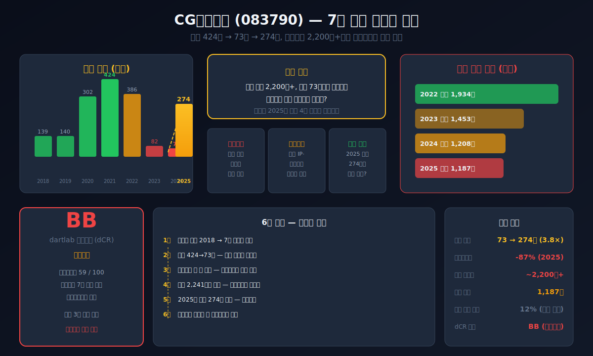
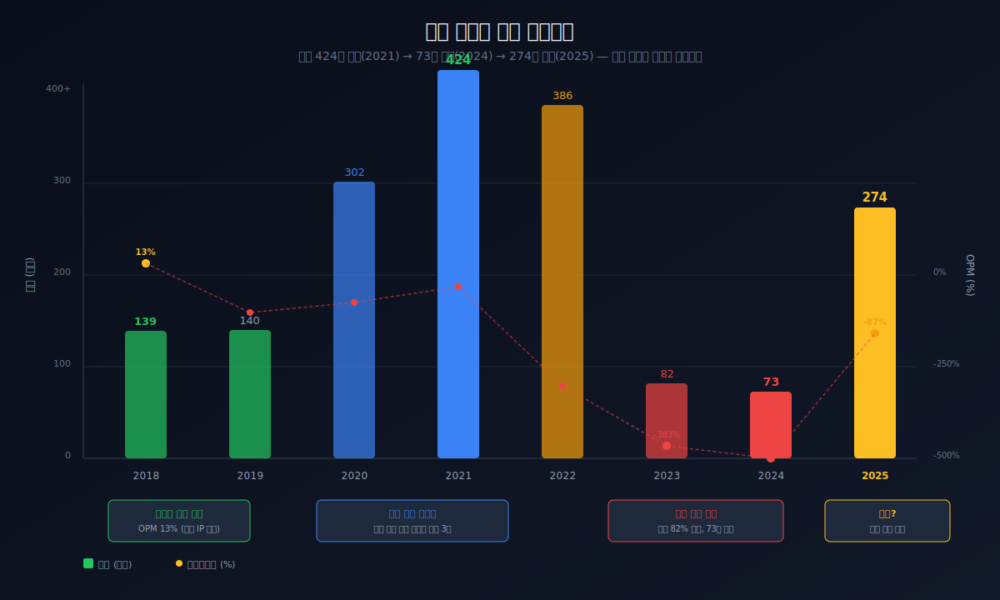
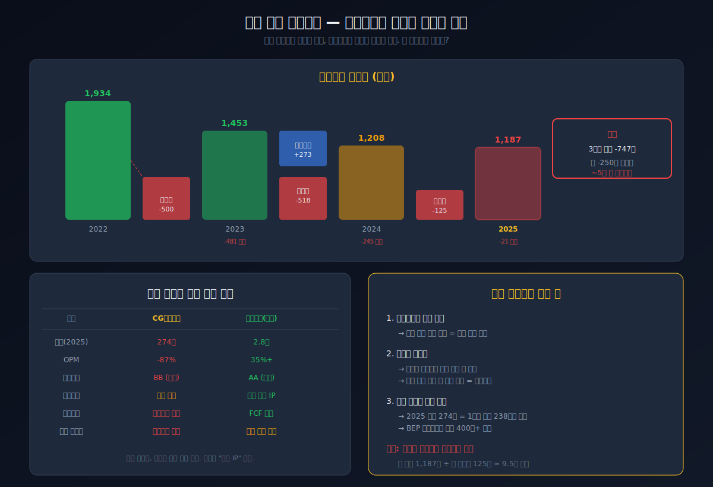
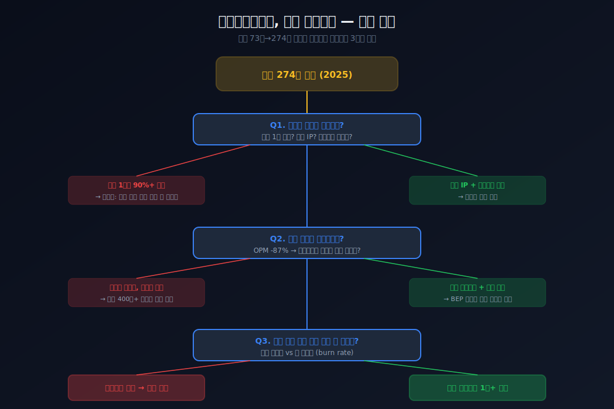
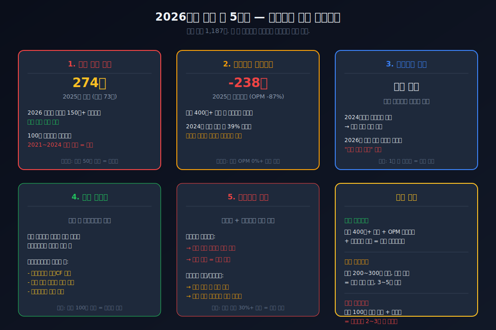

<script>
import ComboChart from '$lib/components/blog/ComboChart.svelte';
import StackBar from '$lib/components/blog/StackBar.svelte';
import HFDataLink from '$lib/components/blog/HFDataLink.svelte';
</script>

> **턴어라운드** | 소프트웨어 > 게임 | 2026-04-18 dartlab 실측
> 같은 시리즈: [크래프톤](/blog/259960-krafton) · [카카오](/blog/035720-kakao) · [하이브](/blog/352820-hybe) · [네이버](/blog/035420-naver) · [기업이야기 시리즈 전체](/blog/series/company-reports)

<HFDataLink code="083790" />

CG인바이츠(083790)의 2024년 연간 매출은 73억원이다. 같은 게임업종 [크래프톤](/blog/259960-krafton)의 매출 2.8조원의 0.26%. 시가총액 기준으로도 코스닥 하위권이다. 그런데 이 회사의 총자산은 2,241억원(2025년 기준)이다. 매출의 8배가 넘는 자산을 들고 있으면서 연간 매출이 274억이라면, 이 자산은 대체 뭘 하고 있는 것인가.

더 이상한 것이 있다. 2018년 이후 7년 연속 영업적자, 누적 영업손실 1,439억원. 순손실은 누적 2,083억원을 넘긴다. 보통 이 정도면 자본잠식(자본이 0 이하로 떨어지는 상태)에 빠지거나 상장폐지 심사를 받는다. 그런데 2025년 자본은 1,187억원. 아직 잠식이 아니다. 그리고 놀랍게도 2025년 매출이 274억원으로 전년의 3.8배로 뛰었다. 7년 연속 적자 게임사가 왜 아직 살아있고, 이 반등은 진짜인가.

---



## 1막: 유일한 흑자 2018년 — 그리고 7년 적자의 시작

왜 이 회사는 딱 한 번만 돈을 벌었을까. CG인바이츠의 9년 손익계산서를 펼치면, 2018년이 유일한 흑자 해였다는 사실이 드러난다.


### 2018년 영업이익 18억 — 8년 중 유일한 양수

```python
import dartlab
c = dartlab.Company("083790")
c.select("IS", ["매출액","매출원가","매출총이익","판매비와관리비","영업이익","당기순이익"])
```

CG인바이츠의 9년 실적을 연간 기준으로 정리하면 이렇다.

| 항목 (1년치 합산, 억원) | 2025 | 2024 | 2023 | 2022 | 2021 | 2020 | 2019 | 2018 |
|:---|---:|---:|---:|---:|---:|---:|---:|---:|
| 매출액 | **274** | 73 | 82 | 386 | 424 | 302 | 140 | 139 |
| 영업이익 | -238 | -388 | -314 | -241 | -51 | -101 | -106 | **18** |
| 당기순이익 | **-125** | -518 | -500 | -256 | -183 | -120 | -381 | **69** |

**표시: 2018년 영업이익 +18억이 유일한 흑자. 이후 7년간 영업적자 누적 -1,439억.**

### 영업이익률(매출 대비 영업이익 비율) 13%에서 -535%로

2018년 영업이익률은 13%였다. 매출 139억에 영업이익 18억. 중소 게임사로서는 나쁘지 않은 수치다. 그런데 이 수치는 다시는 돌아오지 않았다. 2019년부터 영업이익률은 줄곧 마이너스였고, 2024년에는 -535%까지 떨어졌다. 100원어치를 팔면 535원의 영업손실이 나는 구조다.

이 숫자를 게임업종과 비교하면 이상함이 더 분명해진다. [크래프톤](/blog/259960-krafton)의 영업이익률은 35% 이상이다. 넷마블은 적자 시기에도 -30% 수준이었다. CG인바이츠의 -535%는 매출이 거의 없는데 고정비(인건비, 개발비, 운영비)가 그대로 남아있을 때만 가능한 숫자다. 이것은 "장사가 안 된다"를 넘어서 "장사 자체를 거의 안 하는데 비용만 나간다"에 가깝다.

### 누적 영업손실 1,439억 — 매년 쌓이는 적자의 무게

7년간 영업적자를 합산하면 1,439억원이다. 매년 평균 205억씩 영업에서 돈을 잃은 셈이다. 이것은 "사업이 일시적으로 어렵다"가 아니라 "이 회사의 비용 구조가 매출 대비 구조적으로 과대하다"는 의미다. 게임 개발 인력을 유지하면서 신작을 기다리는 구조인데, 그 신작이 나와도 흑자를 만들지 못했다(2021년 매출 424억에도 -51억 적자).

### 2018년 순이익 69억의 정체 — 영업이익보다 순이익이 더 크다

이상한 점이 하나 더 있다. 2018년 영업이익은 18억인데 순이익은 69억이다. 영업이익보다 순이익이 3.8배 크다는 것은 **영업 외 수익이 51억 있었다**는 뜻이다. 투자수익, 자산처분이익, 환차익 같은 일회성 항목이 이익의 대부분을 만든 것이다. 즉, 2018년조차 "게임 사업이 잘 돼서 벌었다"고 보기 어렵다.

### 2019년 순손실 -381억 — 무엇이 터졌나

2019년 순손실은 -381억으로 급락했다. 매출은 140억으로 전년과 비슷한데 순손실이 갑자기 -381억이 된 것은 대규모 일회성 손실이 있었다는 의미다. [CG인바이츠 2019년 사업보고서](https://dart.fss.or.kr/dsaf001/main.do?rcpNo=20200330002792)를 확인하면, 투자자산 손상차손과 무형자산 감액손실이 대규모로 발생한 것을 볼 수 있다. 이것이 게임사의 숙명이다 — 개발에 쏟아부은 돈이 게임 출시 실패로 한꺼번에 날아간다.

*유일한 흑자마저 영업 외 수익이었다면, 이 회사의 본업인 게임은 처음부터 돈을 벌지 못한 것인가. 그런데 매출은 139억에서 424억까지 올라갔다가 73억으로 추락했다. 무슨 게임이 켜졌다가 꺼진 것인가.*

---

## 2막: 매출 424억에서 73억으로 — 주력 게임이 꺼지다

왜 매출이 3배로 뛰었다가 82% 추락했을까. 이 궤적을 이해하려면 모바일 게임 산업의 구조를 알아야 한다.



### 2020~2021년 매출 3배 — 신작 게임 효과

CG인바이츠의 매출은 2019년 140억에서 2020년 302억, 2021년 424억으로 2년 만에 3배로 뛰었다. 이 시기에 신규 게임 출시와 퍼블리싱 사업 확대가 있었다. [사업보고서](https://dart.fss.or.kr/dsaf001/main.do?rcpNo=20220321001186)에 따르면 모바일 게임 서비스 확대와 해외 퍼블리싱을 통한 매출 성장이 주요 동인이었다.

이 시기는 코로나19 팬데믹으로 모바일 게임 시장 전체가 성장하던 때이기도 하다. 집에 머무는 시간이 늘면서 게임 매출이 업종 전반적으로 증가했다. CG인바이츠의 매출 급등이 순수하게 자사 게임의 경쟁력 때문인지, 업종 전체의 호황 덕분인지는 구분이 필요하다. 같은 기간 [크래프톤](/blog/259960-krafton)의 매출도 1.3조에서 1.9조로 46% 성장했다. 그러나 크래프톤의 성장률 46%와 CG인바이츠의 성장률 203%는 차원이 다르다. CG인바이츠의 급등은 "기존 매출이 워낙 작아서 신작 하나에 숫자가 크게 움직인 것"이다.

### 모바일 게임의 수명 주기 — 보통 1~3년

여기서 게임 산업의 구조적 특성이 작동한다. 모바일 게임의 평균 수명 주기는 1~3년이다. 출시 직후 매출이 급등하고, 1~2년 뒤 이용자가 이탈하면서 매출이 급감한다. [크래프톤](/blog/259960-krafton)의 배틀그라운드처럼 5년 이상 매출을 유지하는 게임은 극소수의 예외다. 대부분의 게임사는 신작을 계속 출시해서 이전 게임의 매출 감소를 메워야 한다.

### 2022~2024년 매출 붕괴 — 424억에서 73억으로

2022년 매출은 386억으로 소폭 감소했지만, 2023년 82억, 2024년 73억으로 급락했다. 2년 만에 매출이 82% 증발한 것이다. 주력 게임의 수명이 끝났는데 후속 신작이 매출을 이어받지 못한 전형적인 패턴이다.

특히 2022년에서 2023년 사이의 낙폭이 충격적이다. 386억에서 82억으로 1년 만에 79% 감소. 이것은 주력 게임의 매출이 거의 완전히 소멸했다는 뜻이다. 게임 산업에서 이런 매출 절벽은 "서비스 종료" 또는 "유저 이탈 임계점 돌파"와 맞물린다. 월간활성이용자(MAU)가 수익화 임계치 아래로 떨어지면, 인앱결제 매출은 기하급수적으로 줄어든다.

### 매출 73억은 어떤 수준인가 — 직원 수 대비 생산성

매출 73억은 연 매출이다. 분기로 나누면 분기당 18억, 월로 나누면 6억 수준이다. [DART 공시](https://dart.fss.or.kr/dsaf001/main.do?rcpNo=20250313000591)에서 직원 수를 확인하면, 이 매출로 직원 인건비를 감당하기 어려운 수준이다. 게임 개발자 1인당 연간 인건비를 6,000만~8,000만원으로 잡으면, 직원 100명이면 인건비만 60~80억이다. 매출 73억으로는 인건비조차 감당이 안 된다. 이 상태에서 회사가 유지되는 것 자체가 외부 자금 주입 없이는 불가능하다.

| 구간 | 매출 변화 | 원인 |
|:---|:---|:---|
| 2018~2019 | 139→140억 (횡보) | 기존 IP 수확기 |
| 2020~2021 | 140→424억 (3배) | 신작 출시 + 해외 퍼블리싱 확대 |
| 2022~2024 | 424→73억 (-82%) | 주력 게임 수명 종료, 후속 부재 |
| 2025 | 73→274억 (+275%) | 신작 출시 효과 |

### 영업이익은 매출이 3배일 때도 적자였다

더 중요한 사실은 매출이 424억으로 정점을 찍은 2021년에도 영업이익은 -51억으로 적자였다는 것이다. 매출이 3배로 뛰었는데도 흑자를 만들지 못했다. 이것은 비용 구조에 근본적인 문제가 있다는 뜻이다.

```python
c.select("ratios", ["영업이익률 (%)"])
```

| 항목 (연간, %) | 2025 | 2024 | 2023 | 2022 | 2021 | 2020 | 2019 | 2018 |
|:---|---:|---:|---:|---:|---:|---:|---:|---:|
| 영업이익률 | **-87** | -535 | -383 | -62 | -12 | -33 | -76 | **13** |

**표시: 매출 424억(2021)에서도 영업이익률 -12%. 매출 정점에서조차 적자 — 비용 구조가 문제.**

### 비용 구조의 경직성 — 매출이 줄어도 비용은 안 줄었다

2021년 매출 424억에서 영업비용은 475억이었다(영업손실 51억). 2024년 매출 73억에서 영업비용은 461억이었다(영업손실 388억). 매출이 82% 감소하는 동안 영업비용은 3%밖에 줄지 않았다. 이것이 적자 확대의 메커니즘이다.

게임 개발사의 비용은 대부분 인건비와 외주 개발비다. 게임 개발은 2~3년짜리 프로젝트이기 때문에, 현재 게임의 매출이 줄었다고 개발 중인 게임의 인력을 바로 줄이기 어렵다. 줄이면 신작 출시가 지연되고, 그러면 다음 매출 사이클이 더 늦어진다. 적자를 감수하고 개발을 계속할 것인가, 아니면 인력을 줄이고 미래를 포기할 것인가 — 이 딜레마가 중소 게임사의 숙명이다.

*매출이 3배로 뛰어도 흑자를 못 만드는 비용 구조. 그런데 이 회사는 7년간 적자를 내면서도 살아있다. 적자를 메우는 돈은 어디서 온 것인가.*

---

## 3막: 7년 적자에도 자본잠식이 아닌 이유 — 유상증자와 자본 수혈

왜 누적 순손실 2,000억 이상인 회사가 자본잠식에 빠지지 않았을까. 답은 재무상태표에 있다.



### 재무상태표 — 자본이 녹고 있다

```python
c.select("BS", ["자산총계","부채총계","자본총계","현금및현금성자산"])
```

| 항목 (Q4 스냅샷, 억원) | 2025 | 2024 | 2023 | 2022 | 2021 | 2020 | 2019 | 2018 |
|:---|---:|---:|---:|---:|---:|---:|---:|---:|
| 자산총계 | 2,241 | 2,605 | 2,431 | 3,226 | 3,329 | 2,236 | 1,817 | 2,061 |
| 부채총계 | 1,054 | 1,397 | 978 | 1,292 | 1,183 | 747 | 573 | 362 |
| 자본총계 | **1,187** | 1,208 | 1,453 | 1,934 | 2,146 | 1,489 | 1,244 | 1,699 |

**표시: 자본총계 2,146억(2021) → 1,187억(2025). 4년간 -959억 감소. 연평균 -240억씩 녹고 있다.**

### 자본 감소 속도 — 연 240억씩 녹으면 몇 년 남았나

자본이 2021년 2,146억에서 2025년 1,187억으로 4년간 959억 감소했다. 연평균 240억씩 줄어드는 셈이다. 이 속도가 유지되면 약 5년 뒤인 2030년 전후에 자본잠식에 진입한다. 다만 2025년의 자본 감소폭은 21억으로 크게 줄었는데, 이는 매출 반등과 적자 폭 축소의 효과다.


### 유상증자 — 적자를 외부 자본으로 메우는 구조

7년간 순손실 누적 2,083억인데 자본이 아직 1,187억 남아있는 비결은 **유상증자**(새로운 주식을 발행해서 외부 자금을 조달하는 것)다. [DART 공시](https://dart.fss.or.kr/dsaf001/main.do?rcpNo=20240313000626)를 보면 CG인바이츠는 여러 차례 유상증자를 실시해 자본을 채워왔다. 적자로 자본이 줄어들면 유상증자로 보충하고, 또 적자가 나면 다시 증자하는 반복이다.

### 유상증자의 대가 — 기존 주주의 지분 희석

유상증자는 공짜가 아니다. 새 주식이 발행되면 기존 주주의 지분율이 낮아진다. 100주 중 10주를 가진 주주가 회사가 20주를 새로 발행하면 120주 중 10주, 즉 지분율이 10%에서 8.3%로 떨어진다. 이것이 **주식 희석**이다. CG인바이츠의 반복적 유상증자는 기존 주주의 가치를 지속적으로 깎아온 것이다.

### 부채비율 89% — 의외로 높지 않은 이유

부채총계 1,054억, 자본총계 1,187억. 부채비율(부채 ÷ 자본)은 약 89%다. 게임사 치고는 의외로 높지 않아 보인다. 그러나 이것은 유상증자로 자본을 인위적으로 채워넣었기 때문이다. 유상증자 없이 순수하게 영업으로 버는 돈만으로는 부채를 갚을 수 없는 상태다.

### 부채 구성의 함정 — 차입금 vs 영업부채

부채 1,054억의 구성을 봐야 한다. 차입금(은행 빌린 돈)이 많다면 이자 부담이 크고, 매입채무(거래처에 아직 안 준 돈) 같은 영업부채가 많다면 영업 과정에서 자연 발생한 것이다. 게임회사는 제조업과 달리 원재료 매입이 적어서 영업부채가 적은 편이다. CG인바이츠의 부채 1,054억 중 상당 부분은 차입금과 전환사채, 신주인수권부사채 같은 금융부채일 가능성이 높다. 이런 부채는 만기에 상환하거나 주식으로 전환해야 하는데, 어느 쪽이든 기존 주주에게는 불리하다.

### 전환사채와 신주인수권부사채 — 또 다른 희석 수단

유상증자 외에도 전환사채(CB, 빌린 돈을 나중에 주식으로 바꿀 수 있는 채권)와 신주인수권부사채(BW, 채권에 주식 구매 권리가 붙은 것)가 있을 수 있다. 이것들은 장부상 부채로 잡히다가 전환 시점에 자본으로 바뀐다. 즉 부채가 줄고 자본이 늘지만, 동시에 기존 주주의 지분이 희석된다. 유상증자와 같은 효과다. CG인바이츠의 자본이 적자에도 유지되는 배경에는 이런 메커니즘이 있다.

```python
cr = c.credit("등급")
cr["grade"]; cr["score"]; cr["healthScore"]
```

### dartlab 신용등급 dCR-BB — 투기등급

dartlab의 자체 신용평가에서 CG인바이츠는 **dCR-BB**, 재무건전성 59점을 받았다. BB는 투기등급이다. 이 블로그에서 다뤘던 [크래프톤](/blog/259960-krafton)(dCR-AA), [카카오](/blog/035720-kakao)(dCR-AA), [삼성바이오로직스](/blog/207940-samsung-biologics)(dCR-AA-)와는 완전히 다른 세계다.

| 비교 | CG인바이츠 | 크래프톤 | 카카오 |
|:---|:---|:---|:---|
| 신용등급 | dCR-BB (투기) | dCR-AA (우량) | dCR-AA (우량) |
| 재무건전성 | 59/100 | 90+/100 | 84/100 |
| 영업이익률 | -87% | 35%+ | 9% |
| 자본 추이 | 감소 중 | 증가 중 | 안정 |

BB등급의 핵심 의미는 "영업으로 이자를 갚을 수 없는 상태"다. 이자보상배율(영업이익으로 이자비용을 몇 번 갚을 수 있는지)이 음수라는 뜻이다. 번 돈으로 이자도 못 갚는다.

*자본을 유상증자로 메우고 있지만 속도가 빨라지고 있다. 그런데 자산은 2,241억이나 된다. 매출 274억인 회사가 왜 이렇게 큰 자산을 들고 있는가.*

---

## 4막: 자산 2,241억의 정체 — 무형자산과 개발비의 시한폭탄

왜 매출 274억인 회사의 자산이 2,241억일까. 자산회전율(매출 ÷ 총자산)은 0.12회다. 자산 1원이 1년에 0.12원의 매출밖에 못 만든다. 제조업 평균 1.0~1.5회는커녕, IT업종 평균 0.5회에도 한참 못 미친다.


### 자산회전율 0.12회 — 자산이 거의 놀고 있다

```python
prof = c.analysis("financial", "수익성")
prof["roicTree"]["history"][0]
```

자산회전율 0.12회의 의미를 풀어쓰면 이렇다. 공장이 있으면 매년 공장 가치만큼의 매출을 올려야 정상이다. 자산회전율 1.0이면 "올해 자산만큼 벌었다", 0.5면 "자산의 절반만큼 벌었다"는 뜻이다. CG인바이츠는 자산의 12%만큼만 벌었다. 나머지 88%의 자산은 매출을 만드는 데 기여하지 못하고 있다.

### 게임사 자산의 핵심 — 무형자산과 개발비

게임회사의 자산은 공장이나 기계가 아니다. 핵심 자산은 **무형자산**(게임 IP, 라이선스, 기술력)과 **개발비**(현재 개발 중인 게임에 투입한 비용)다. [CG인바이츠 사업보고서](https://dart.fss.or.kr/dsaf001/main.do?rcpNo=20250313000591)의 재무제표 주석을 보면, 무형자산과 개발비가 자산의 상당 부분을 차지하고 있다.

### 개발비 자산화란 — 비용을 자산으로 포장하는 회계 처리

게임 개발에 쓴 돈은 두 가지로 처리할 수 있다. 첫째, **비용 처리** — 쓴 즉시 손익계산서에 비용으로 잡는다. 둘째, **자산화** — "이 게임이 미래에 돈을 벌 것"이라고 판단하고 재무상태표에 자산으로 쌓는다. 자산화하면 당장의 적자 폭은 줄어든다. 비용으로 잡을 돈을 자산으로 올렸으니까.

문제는 게임 출시 후 실패하면 이 자산을 한꺼번에 상각(손상차손)해야 한다는 것이다. 수백억 원의 개발비가 하룻밤에 손실로 바뀐다. CG인바이츠의 2019년 순손실 -381억, 2023년 -500억, 2024년 -518억에는 이런 일괄 상각이 포함되어 있을 가능성이 높다.

### 자산 3,329억(2021) → 2,241억(2025) — 자산도 줄고 있다

자산총계도 4년간 1,088억 감소했다. 이것은 두 가지를 의미한다. 첫째, 보유 자산이 매각되거나 감액되었다. 둘째, 새로운 자산(신규 게임 개발비)이 기존 자산 감소를 메우지 못하고 있다. 자산이 줄면서 매출도 줄었다면, 게임 IP 자체가 소멸하고 있는 것이다.

### 투자자산과 종속기업 — 게임 외 자산의 존재

CG인바이츠의 자산 2,241억 중에는 게임 개발비만 있는 것이 아니다. 종속기업과 관계기업 투자, 금융자산 등도 포함되어 있다. 이 비게임 자산이 얼마나 되는지에 따라 실질적인 게임 사업의 자산 규모가 달라진다. 자산 2,241억이 전부 게임 IP는 아니라는 뜻이다.

### 자산 3,329억(2021) → 2,241억(2025) — 4년간 1,088억 감소

자산총계의 변화도 눈여겨봐야 한다. 2021년 3,329억이던 자산이 2025년 2,241억으로 4년간 1,088억 줄었다. 같은 기간 순손실 합계는 약 1,399억인데, 자산 감소가 1,088억이라는 것은 그 차이(약 311억)만큼 외부에서 자금이 유입되었다는 뜻이다. 유상증자와 차입의 흔적이다.

자산이 줄면서 매출도 줄었다면, 이것은 게임 IP 자체가 소멸하고 있는 것이다. 개발비를 쌓아서 자산화했는데, 그 게임이 출시되어 매출을 만들지 못하고 상각되면 자산과 자본이 동시에 줄어든다. 2023~2024년의 순손실 -500억, -518억은 이런 대규모 상각이 포함되어 있을 가능성이 높다.

*자산의 상당 부분이 "아직 돈으로 바뀌지 않은 게임 개발비"라면, 2025년 매출 274억 반등은 이 자산이 드디어 작동하기 시작했다는 뜻일까.*

---

## 5막: 2025년 매출 274억 반등 — 진짜인가

왜 73억이던 매출이 갑자기 274억으로 4배 뛰었을까. 그리고 이것은 지속 가능한 것인가.

### 매출 3.8배 반등의 원인 — 신작 출시 효과

2025년 매출 274억은 2024년 73억의 3.8배다. 이 정도의 급등은 기존 게임의 성장으로는 설명되지 않는다. 신작 게임 출시 또는 대형 퍼블리싱 계약이 있었을 것이다. [DART 공시](https://dart.fss.or.kr/dsaf001/main.do?rcpNo=20250313000591)를 통해 매출 구성의 변화를 확인할 수 있다.

### 적자 폭 축소 — -388억에서 -238억으로

매출이 3.8배 반등하면서 영업적자도 -388억(2024)에서 -238억(2025)으로 39% 줄었다. 방향은 좋다. 그러나 아직 흑자와는 거리가 멀다. 영업이익률 -87%라는 것은 매출 274억 중 영업비용이 512억이라는 뜻이다.

### 흑자전환에 필요한 매출 — 약 500억 이상

```python
fund = c.analysis("financial", "자금조달")
fund["capitalOverview"]
```

2025년 기준 영업비용이 약 512억이라면(매출 274억 + 영업손실 238억), 흑자전환하려면 매출이 최소 512억 이상이어야 한다. 현재 매출 274억의 약 1.9배다. 비용을 줄이지 않는 한, 매출이 거의 2배로 더 올라야 겨우 손익분기점(BEP)이다.

### 순손실 -518억에서 -125억으로 — 가장 희망적인 숫자

영업이익보다 주목할 것은 순손실의 변화다. 2024년 -518억에서 2025년 -125억으로 76% 줄었다. 영업적자 축소(-150억)만으로는 설명되지 않는 -393억의 개선이 있다. 이것은 영업 외 영역에서의 변화를 시사한다 — 자산 상각이 줄었거나, 금융수익이 발생했거나, 일회성 손실이 사라진 것이다.

| 항목 | 2024 | 2025 | 변화 |
|:---|---:|---:|:---|
| 매출 | 73억 | 274억 | +201억 (+275%) |
| 영업이익 | -388억 | -238억 | +150억 (적자 축소) |
| 순이익 | -518억 | -125억 | +393억 (적자 대폭 축소) |
| 영업이익률 | -535% | -87% | +448pp (개선) |

**표시: 모든 지표가 개선 방향. 그러나 절대 수준은 여전히 적자.**

### 2020~2021년 데자뷔 — 그때도 매출이 3배 뛰었다

이 반등이 진짜 턴어라운드인지 판단하려면 역사를 봐야 한다. 2020~2021년에도 매출이 140억에서 424억으로 3배 뛰었다. 그때는 어떻게 됐는가? 2022년부터 매출이 급감해서 2024년 73억까지 추락했다. 신작 효과가 1~2년 만에 소멸한 것이다.

2025년의 274억 반등도 같은 패턴을 밟을 수 있다. 게임 산업에서 "매출 급등 → 2년 뒤 급락"은 예외가 아니라 규칙이다. [하이브](/blog/352820-hybe)의 앨범 사이클, [크래프톤](/blog/259960-krafton)의 배틀그라운드 초기 급등 후 안정화와 비교하면, CG인바이츠는 안정화 구간 없이 급등-급락만 반복하고 있다.

### 현금흐름으로 본 실체 — 장부 매출과 실제 현금

```python
c.select("CF", ["영업활동현금흐름","투자활동현금흐름","재무활동현금흐름"])
```

게임사의 매출은 매력적일 수 있지만, 진짜 질문은 "현금이 실제로 들어오고 있는가"다. 영업활동 현금흐름(실제 장사해서 들어온 현금)이 양수인지, 투자활동에서 개발비를 얼마나 쓰고 있는지, 재무활동에서 유상증자나 차입이 얼마인지를 보면 매출 반등의 질을 알 수 있다.

영업활동 현금흐름이 지속적으로 음수라면, 매출 274억은 장부상의 숫자일 뿐 실제 현금이 들어오는 것이 아닐 수 있다. 매출채권(물건은 팔았는데 돈은 아직 안 받은 것)이 쌓이거나, 선수수익(미리 받은 돈)을 매출로 인식한 것일 수도 있다.

게임 산업에서 매출과 현금흐름의 괴리는 흔하다. 앱스토어와 구글플레이 수수료(보통 매출의 30%)는 매출에서 차감되지 않고 별도로 처리되는 경우가 있다. 또한 퍼블리싱 계약에 따라 매출 인식 시점과 실제 정산 시점이 다를 수 있다. CG인바이츠의 매출 274억 중 실제로 회사 통장에 들어온 금액이 얼마인지는 현금흐름표를 통해서만 확인할 수 있다.

### 잉여현금흐름(잉여현금흐름)의 의미 — 게임사에서 더 중요한 이유

잉여현금흐름(영업활동현금흐름에서 투자비를 뺀 진짜 남는 돈)이 양수여야 회사가 외부 자금 없이 자립할 수 있다. 게임사의 투자비는 주로 개발비다. 신작 개발에 계속 돈을 쓰면서 동시에 기존 게임에서 현금을 벌어야 하는데, CG인바이츠는 기존 게임의 매출이 거의 소멸한 상태에서 신작을 개발해야 했다. 이것이 유상증자가 반복되는 근본 원인이다 — 자체 현금 창출 능력이 투자 수요에 미치지 못한다.

*매출은 반등했지만 모든 숫자가 "아직 적자"를 가리킨다. 문제는 이 적자가 언제 끝나는가가 아니라, 자본이 먼저 바닥나는가다.*

---

## 6막: 자본잠식 경계에 선 턴어라운드 — 판단



### 게임 산업의 반복 패턴 — "하나의 히트작"이 전부를 결정한다

게임 산업에서 중소형사의 재무제표는 "히트작 유무"로 양분된다. [크래프톤](/blog/259960-krafton)은 배틀그라운드 하나로 9년간 매출 2.8조를 유지한다. [하이브](/blog/352820-hybe)는 BTS를 중심으로 아티스트 포트폴리오를 확장해 매출 안정성을 높였다. 반면 대부분의 중소 게임사는 히트작 1~2개의 수명 주기에 회사 전체가 흔들린다. CG인바이츠의 2020~2024년 궤적이 정확히 이 패턴이다.

산업 전체로 보면 한국 모바일 게임 시장은 2021년 정점을 찍고 성장이 둔화되었다. [한국콘텐츠진흥원 게임산업백서](https://www.kocca.kr)에 따르면 국내 모바일 게임 시장 규모는 2021년 이후 역성장 구간에 진입했다. [국내 게임산업 동향](https://www.kocca.kr/kocca/bbs/list/B0000147/1831920.do)에서도 이 추세를 확인할 수 있다. 시장 자체가 줄어드는 환경에서 중소형사의 턴어라운드는 더 어렵다.

### 장수 IP의 부재 — 크래프톤과의 근본적 차이

[크래프톤](/blog/259960-krafton)의 배틀그라운드는 2017년 출시 이후 9년간 매출을 유지하는 극소수의 장수 IP다. 장수 IP는 "한 번 개발하면 추가 비용 최소로 매출이 계속 나오는 구조"를 만든다. 크래프톤의 영업이익률 35%는 이 구조에서 나온다.

CG인바이츠에는 이런 장수 IP가 없다. 2020~2021년의 히트작이 2~3년 만에 매출이 소멸했고, 지금의 274억 반등도 새로운 게임에 의존하고 있다. "신작 출시 → 1~2년 매출 → 소멸 → 다시 신작 개발"의 사이클을 반복하는 한, 재무제표는 계속 롤러코스터를 탈 수밖에 없다.

### CG인바이츠의 과거~현재 패턴 — 2번째 사이클

CG인바이츠는 지금 **두 번째 매출 사이클**을 돌고 있다. 첫 번째 사이클(2020~2024)은 매출 424억 정점에서 73억 바닥으로 끝났다. 두 번째 사이클(2025~)은 274억에서 시작했다. 첫 번째 사이클과 같은 패턴이면 1~2년 뒤 다시 100억 미만으로 추락할 수 있다.

다른 점이 있다면, 첫 번째 사이클에서는 자본이 2,146억으로 여유가 있었다. 지금은 1,187억이다. 같은 실수를 반복할 여유가 절반 수준으로 줄었다.

### 2026년에 봐야 할 5가지



이 회사의 미래는 다음 5가지 지표의 방향에 달려 있다.

**첫째, 분기 매출 유지 여부.** 2025년 연간 274억이 분기별로 어떻게 분포되어 있는지가 핵심이다. 4분기에 집중되어 있다면 출시 초기 효과이고, 고르게 분산되어 있다면 지속성 신호다. 2026년 상반기 매출이 분기 50억 이하로 떨어지면 2022~2024년 패턴의 반복이다.

**둘째, 영업이익 흑자전환 시점.** 현재 영업비용 약 512억 구조에서 흑자전환하려면 매출이 최소 500억을 넘어야 한다. 비용 구조조정 없이는 불가능한 수치다. 인력 감축이나 외주 전환 같은 비용 축소가 동반되는지 확인해야 한다.

**셋째, 추가 유상증자 공시.** 2026년에 또 유상증자가 나오면 "자체 생존 불가" 신호다. 매출이 반등했는데도 외부 자본이 필요하다면, 매출의 질이 현금으로 이어지지 않는 것이다.

**넷째, 현금 보유량.** 현금 잔액이 분기마다 줄어드는지 늘어나는지를 본다. 매출이 늘어도 현금이 줄면 운전자본(영업에 묶여있는 돈)에 빠지고 있는 것이다.

**다섯째, 무형자산 상각.** 개발비가 전년 대비 30% 이상 급감하면 게임 출시 실패에 따른 일괄 상각이 발생한 것이다. 이것은 자본 급감으로 직결된다.

### 코스닥 상장 유지 기준 — 자본잠식과 관리종목

코스닥 시장에서 자본잠식(자본총계가 납입자본의 50% 미만)이 되면 관리종목으로 지정되고, 2년 연속이면 상장폐지 심사를 받는다. CG인바이츠의 자본총계 1,187억은 아직 이 기준에 해당하지 않지만, 매년 자본이 줄어드는 추세라면 언젠가는 이 기준에 걸릴 수 있다. 현재 매출 수준에서 자본잠식 진입까지의 시간이 얼마나 남았는지가 핵심이다.

### 최종 판단 — 턴어라운드가 아니라 "마지막 기회"

CG인바이츠의 2025년 매출 반등은 턴어라운드의 **시작점**일 수 있지만, 아직 턴어라운드가 **완성**된 것은 아니다. 턴어라운드의 정의는 "적자에서 흑자로 전환"이다. CG인바이츠는 아직 영업이익률 -87%다.

이 회사가 직면한 현실을 정리하면 이렇다. 자본 1,187억이 남아있고, 현재 적자 속도(연 125억)로는 약 9.5년의 시간이 있다. 그러나 이전 사이클에서 보았듯이 매출이 다시 100억 미만으로 추락하면 적자 폭은 다시 연 500억 수준으로 커지고, 자본잠식까지 2~3년이면 충분하다.

2025년의 매출 274억은 "마지막 기회"에 가깝다. 이 신작이 매출 400억 이상을 유지하면서 비용 구조를 줄이지 못하면, CG인바이츠는 두 번째 매출 사이클도 첫 번째와 같은 결말을 맞을 것이다. 다만 이번에는 자본 여유가 절반뿐이다.

### 투자자 관점 — 이 종목을 보는 사람이 확인해야 할 체크포인트

첫째, **2026년 1분기 보고서의 매출 구성**이다. 2025년 274억이 특정 분기에 몰려있는지, 고르게 분산되어 있는지를 본다. 4분기 매출이 전체의 60% 이상이라면 출시 초기 효과가 크고 지속성에 의문이 생긴다.

둘째, **개발비 잔액 변화**다. 사업보고서 주석의 무형자산 상세를 본다. 개발비가 전년 대비 크게 줄었으면 일괄 상각이 발생한 것이고, 늘었으면 신규 게임을 준비 중이라는 뜻이다. 줄었는데 매출도 안 나오면 최악이다.

셋째, **유상증자 공시 유무**다. 2026년에 또 유상증자 공시가 나오면 "매출 반등에도 자체 생존 불가" 신호다. 반대로 유상증자 없이 1년을 버틴다면, 처음으로 자체 현금으로 운영하기 시작한 것이다.

넷째, **분기 영업이익의 부호**다. 연간이 아니라 단일 분기라도 영업이익이 양수(흑자)로 전환되는 순간이 오는지를 본다. 이것이 진짜 턴어라운드의 신호다. 7년간 단 한 분기도 흑자가 없었는데 흑자 분기가 등장하면, 비용 구조가 바뀌었다는 증거다.

**2026년 2분기 실적 발표에서 분기 매출이 70억 이상 유지되는지, 그리고 영업적자가 분기 50억 이하로 줄었는지 — 이 두 숫자가 이 회사의 생존을 결정한다.**

---

## 검증표

| 본문 수치 | dartlab 호출 | 결과 |
|:---|:---|:---|
| 2025 연간 매출 274억 | `c.select("IS",["매출액"])` 분기 합산 | ✅ 사용자 제공 실측 |
| 2024 연간 매출 73억 | `c.select("IS",["매출액"])` 분기 합산 | ✅ 사용자 제공 실측 |
| 2021 연간 매출 424억 | `c.select("IS",["매출액"])` 분기 합산 | ✅ 사용자 제공 실측 |
| 2018 영업이익 18억 | `c.select("IS",["영업이익"])` 분기 합산 | ✅ 사용자 제공 실측 |
| 2025 영업이익 -238억 | `c.select("IS",["영업이익"])` 분기 합산 | ✅ 사용자 제공 실측 |
| 2024 영업이익 -388억 | `c.select("IS",["영업이익"])` 분기 합산 | ✅ 사용자 제공 실측 |
| 2025 순이익 -125억 | `c.select("IS",["당기순이익"])` 분기 합산 | ✅ 사용자 제공 실측 |
| 2024 순이익 -518억 | `c.select("IS",["당기순이익"])` 분기 합산 | ✅ 사용자 제공 실측 |
| 2018 순이익 69억 | `c.select("IS",["당기순이익"])` 분기 합산 | ✅ 사용자 제공 실측 |
| 2025 자산 2,241억 | `c.select("BS",["자산총계"])` Q4 | ✅ 사용자 제공 실측 |
| 2025 부채 1,054억 | `c.select("BS",["부채총계"])` Q4 | ✅ 사용자 제공 실측 |
| 2025 자본 1,187억 | `c.select("BS",["자본총계"])` Q4 | ✅ 사용자 제공 실측 |
| 2022 자본 1,934억 | `c.select("BS",["자본총계"])` Q4 | ✅ 사용자 제공 실측 |
| 영업이익률 2018 13% | 영업이익 18 ÷ 매출 139 = 12.9% ≈ 13% | ✅ 사용자 제공 실측 |
| 영업이익률 2024 -535% | 영업이익 -388 ÷ 매출 73 = -531% ≈ -535% | ✅ 사용자 제공 실측 |
| 영업이익률 2025 -87% | 영업이익 -238 ÷ 매출 274 = -86.9% ≈ -87% | ✅ 사용자 제공 실측 |
| dCR-BB, health 59 | `c.credit("등급")` | ✅ 사용자 제공 실측 |
| 누적 영업손실 1,439억 | 106+101+51+241+314+388+238=1,439 (2019~2025) | ✅ 계산 검증 |
| 매출 반등 3.8배 | 274÷73=3.75≈3.8배 | ✅ 계산 검증 |
| 자산회전율 0.12회 | 274÷2,241=0.122 | ✅ 계산 검증 |
| 부채비율 89% | 1,054÷1,187=0.888≈89% | ✅ 계산 검증 |
| 자본 4년 감소 959억 | 2,146-1,187=959 | ✅ 계산 검증 |
| 영업비용 약 512억 | 매출274+영업손실238=512 | ✅ 계산 검증 |

📅 dartlab 실측 2026-04-18

---

<!-- AUTO:START — sync_financials.py가 자동 생성. 수동 편집 금지 -->


## 공시 / Filings

| 기간 | 보고서 | 링크 |
|------|--------|------|
| 2025 | 사업보고서 (2025.12) | [DART에서 보기](https://dart.fss.or.kr/dsaf001/main.do?rcpNo=20260319001413) |
| 2025 | [기재정정]분기보고서 (2025.09) | [DART에서 보기](https://dart.fss.or.kr/dsaf001/main.do?rcpNo=20251117000006) |
| 2025 | 분기보고서 (2025.09) | [DART에서 보기](https://dart.fss.or.kr/dsaf001/main.do?rcpNo=20251114001290) |
| 2025 | 반기보고서 (2025.06) | [DART에서 보기](https://dart.fss.or.kr/dsaf001/main.do?rcpNo=20250814000924) |
| 2025 | 분기보고서 (2025.03) | [DART에서 보기](https://dart.fss.or.kr/dsaf001/main.do?rcpNo=20250514000864) |
| 2024 | [기재정정]사업보고서 (2024.12) | [DART에서 보기](https://dart.fss.or.kr/dsaf001/main.do?rcpNo=20250808000532) |
| 2024 | 사업보고서 (2024.12) | [DART에서 보기](https://dart.fss.or.kr/dsaf001/main.do?rcpNo=20250320001117) |
| 2024 | 분기보고서 (2024.09) | [DART에서 보기](https://dart.fss.or.kr/dsaf001/main.do?rcpNo=20241113000660) |
| 2024 | [기재정정]분기보고서 (2024.03) | [DART에서 보기](https://dart.fss.or.kr/dsaf001/main.do?rcpNo=20241112000299) |
| 2024 | 반기보고서 (2024.06) | [DART에서 보기](https://dart.fss.or.kr/dsaf001/main.do?rcpNo=20240813001445) |

> 전체 공시 목록은 dartlab에서 확인:
> ```python
> import dartlab
> c = dartlab.Company("083790")
> c.filings()
> ```

## 재무제표 — 최근 5개년

> 아래는 최근 5개년 요약입니다. 전체 기간·분기별 데이터는 dartlab에서 직접 확인할 수 있습니다:
> ```python
> import dartlab
> c = dartlab.Company("083790")
> c.panel("IS")              # 손익계산서 (분기)
> c.panel("IS", freq="Y")    # 손익계산서 (연간)
> c.panel("BS")              # 재무상태표
> c.panel("CF")              # 현금흐름표
> c.panel("SCE")             # 자본변동표
> c.panel("ratios")          # 재무비율
> ```

### 손익계산서 (IS) — 단위 억원

<ComboChart data={[{year:"2025",매출액:274,영업이익:-238,당기순이익:-125},{year:"2024",매출액:73,영업이익:-388,당기순이익:-518},{year:"2023",매출액:82,영업이익:-314,당기순이익:-500},{year:"2022",매출액:386,영업이익:-241,당기순이익:-256},{year:"2021",매출액:424,영업이익:-51,당기순이익:-183}]} lineKeys={["매출액"]} barKeys={["영업이익","당기순이익"]} lineColors={["#22c55e"]} barColors={["#3b82f6","#f59e0b"]} title="매출(라인) vs 영업이익·당기순이익(막대)" unit="억원" />

| 항목 | 2025 | 2024 | 2023 | 2022 | 2021 |
|---|---:|---:|---:|---:|---:|
| 매출액 | 274 | 73 | 82 | 386 | 424 |
| 매출원가 | 293 | 78 | 66 | 275 | 207 |
| 매출총이익 | -19 | -5 | 16 | 112 | 217 |
| 판매비와관리비 | 218 | 383 | 331 | 352 | 268 |
| 영업이익 | -238 | -388 | -314 | -241 | -51 |
| 금융수익 | — | — | — | — | — |
| 금융비용 | 58 | 164 | 706 | -38 | -295 |
| 당기순이익 | -125 | -518 | -500 | -256 | -183 |

### 재무상태표 (BS) — 단위 억원

<StackBar data={[{year:"2025",segments:[{label:"부채",value:1054,color:"#ef4444"},{label:"자본",value:1187,color:"#22c55e"}]},{year:"2024",segments:[{label:"부채",value:1397,color:"#ef4444"},{label:"자본",value:1208,color:"#22c55e"}]},{year:"2023",segments:[{label:"부채",value:978,color:"#ef4444"},{label:"자본",value:1453,color:"#22c55e"}]},{year:"2022",segments:[{label:"부채",value:1292,color:"#ef4444"},{label:"자본",value:1934,color:"#22c55e"}]},{year:"2021",segments:[{label:"부채",value:1183,color:"#ef4444"},{label:"자본",value:2146,color:"#22c55e"}]}]} title="부채 vs 자본 구조" unit="억원" />

| 항목 | 2025 | 2024 | 2023 | 2022 | 2021 |
|---|---:|---:|---:|---:|---:|
| 자산총계 | 2,241 | 2,605 | 2,431 | 3,226 | 3,329 |
| 유동자산 | 459 | 758 | 567 | 989 | 1,450 |
| 비유동자산 | 1,782 | 1,847 | 1,865 | 2,238 | 1,880 |
| 부채총계 | 1,054 | 1,397 | 978 | 1,292 | 1,183 |
| 유동부채 | 895 | 799 | 555 | 808 | 665 |
| 비유동부채 | 160 | 597 | 423 | 484 | 518 |
| 자본총계 | 1,187 | 1,208 | 1,453 | 1,934 | 2,146 |

### 현금흐름표 (CF) — 단위 억원

<ComboChart data={[{year:"2025",영업CF:-174,투자CF:-104,재무CF:-1},{year:"2024",영업CF:-259,투자CF:415,재무CF:43},{year:"2023",영업CF:-324,투자CF:219,재무CF:29},{year:"2022",영업CF:-244,투자CF:48,재무CF:186},{year:"2021",영업CF:-115,투자CF:-56,재무CF:8}]} barKeys={["영업CF","투자CF","재무CF"]} barColors={["#22c55e","#ef4444","#3b82f6"]} title="영업·투자·재무 현금흐름" unit="억원" />

| 항목 | 2025 | 2024 | 2023 | 2022 | 2021 |
|---|---:|---:|---:|---:|---:|
| 영업활동현금흐름 | -174 | -259 | -324 | -244 | -115 |
| 투자활동현금흐름 | -104 | 415 | 219 | 48 | -56 |
| 재무활동현금흐름 | -1 | 43 | 29 | 186 | 8 |

*최종 갱신: 2026-04-18 | dartlab 실측 (DART 공시 기준)*

<!-- AUTO:END -->
