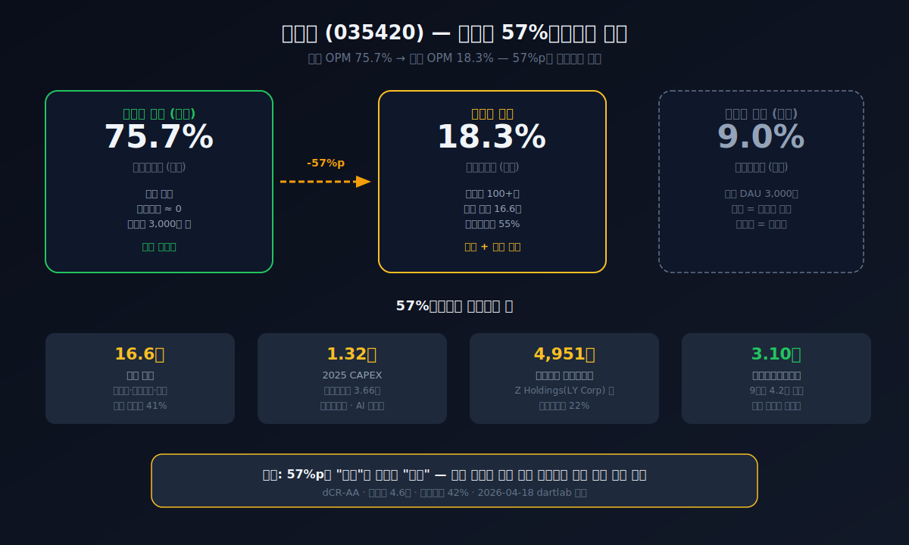
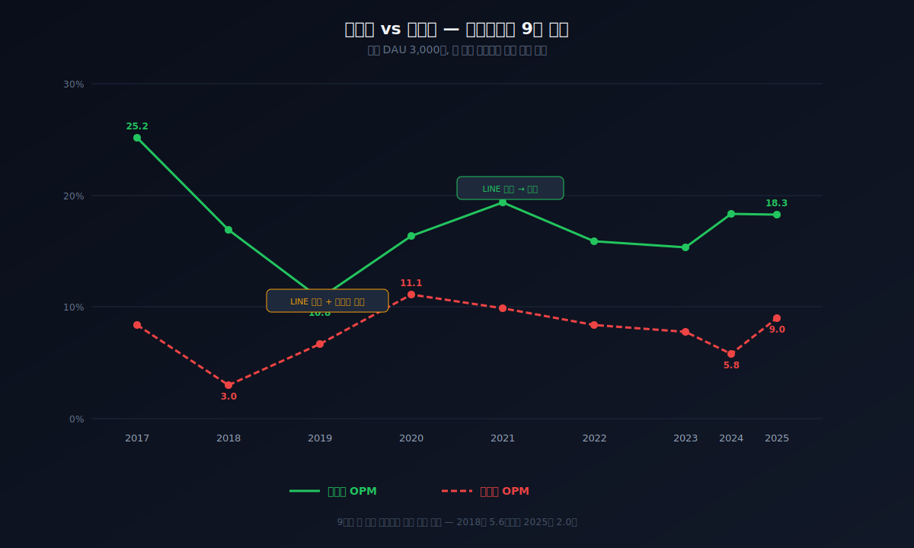
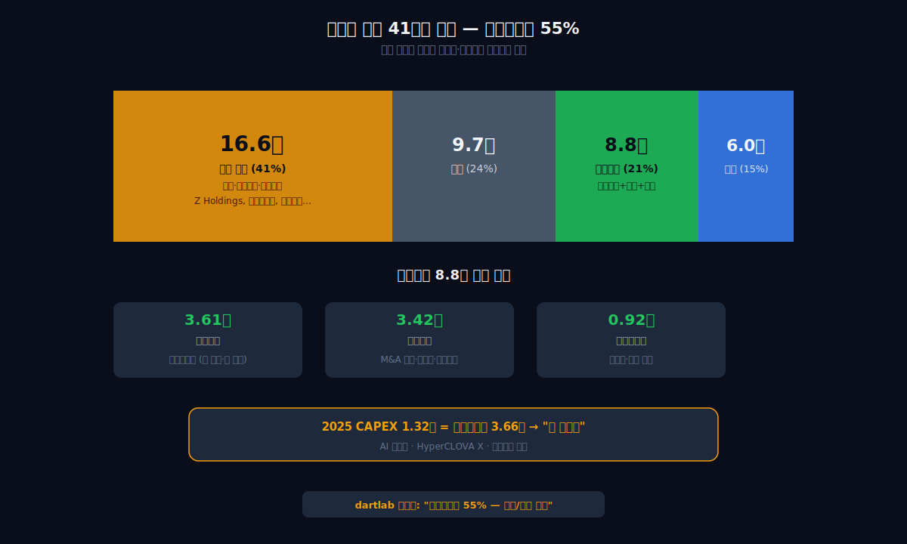
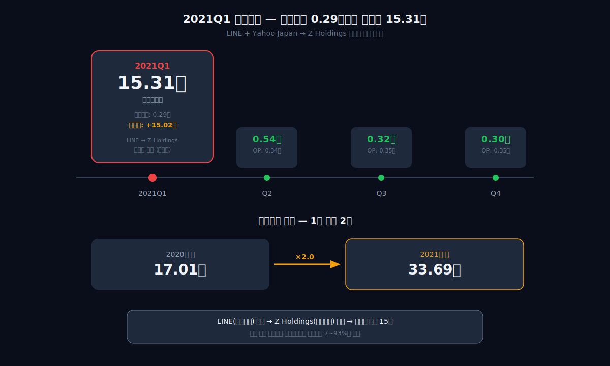
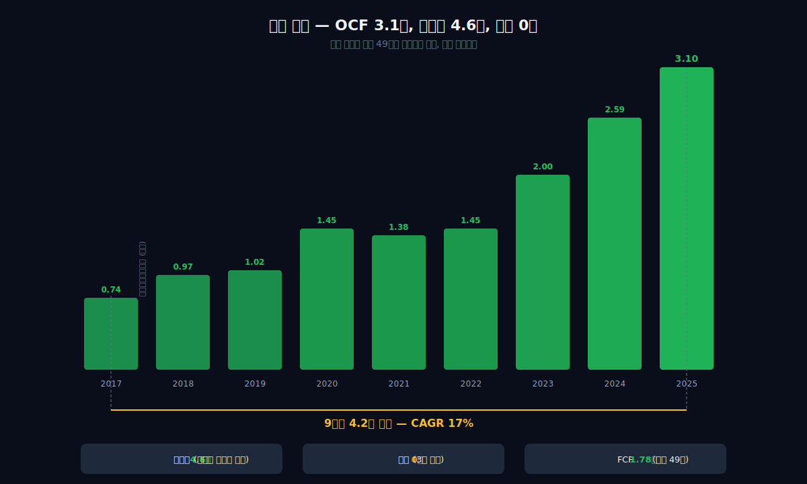
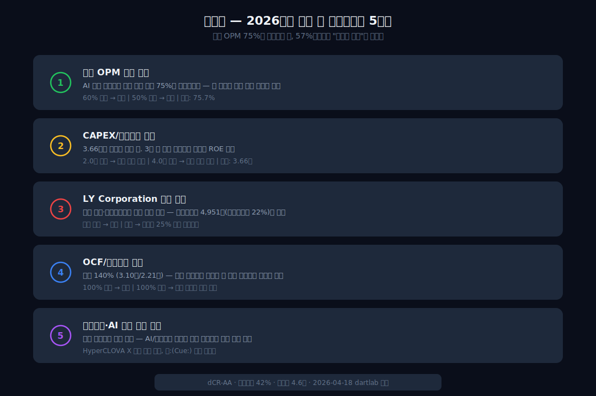

<script>
import ComboChart from '$lib/components/blog/ComboChart.svelte';
import StackBar from '$lib/components/blog/StackBar.svelte';
import HFDataLink from '$lib/components/blog/HFDataLink.svelte';
</script>

> **지주** | 소프트웨어·IT서비스 > 인터넷 플랫폼 | 2026-04-18 dartlab 실측
> 같은 시리즈: [카카오](/blog/kakao) · [크래프톤](/blog/krafton) · [삼성바이오로직스](/blog/samsung-biologics) · [SK하이닉스](/blog/skhynix) · [한화에어로스페이스](/blog/hanwha-aerospace) · [기업이야기 시리즈 전체](/blog/series/company-reports)

<HFDataLink code="035420" />

네이버(035420)의 별도 재무제표를 열면 영업이익률이 75.7%다. 한국 주식시장 전체를 뒤져도 이 숫자를 넘는 회사는 손에 꼽힌다. 그런데 연결 재무제표를 열면 18.3%로 뚝 떨어진다. 57%포인트가 사라진다. 매출 12조원짜리 회사에서 57%포인트면 **약 6.9조원어치의 이익이 어딘가로 빠져나간다**는 뜻이다.

그 돈은 어디로 갔을까. dartlab으로 9년치 재무제표를 추적하면 답이 보인다 — 자회사 100개, 투자 자산 16.6조, 2021년 한 분기에 잡힌 15.3조 일회성 이익, 그리고 그 모든 것을 버텨내고도 매년 3조씩 현금을 쌓는 검색 광고 엔진. 같은 "플랫폼"이라 불리는 [카카오](/blog/kakao)의 영업이익률이 9%인 이유도, 네이버의 57%포인트가 사라지는 경로를 따라가면 설명된다.

---



## 1막: 검색 광고라는 현금 인쇄기 — 별도 OPM 75.7%

왜 네이버의 별도 영업이익률은 75%인가. 검색 광고 비즈니스의 한계비용 구조를 이해하면 이 숫자는 놀랍지 않다.

### 매출 4.68조(2017) → 12.04조(2025), 9년간 2.6배

```python
import dartlab
c = dartlab.Company("035420")
c.select("IS", ["매출액","영업이익","당기순이익"])
```

네이버의 연결 매출은 2017년 4.68조원에서 2025년 12.04조원으로 9년간 2.6배 성장했다. 연평균 성장률(CAGR) 약 11%. 한국 인터넷 기업 중 가장 안정적인 성장 궤적이다.

| 항목 (1년치 합산, 조원) | 2025 | 2024 | 2023 | 2022 | 2021 | 2020 | 2019 | 2018 | 2017 |
|:---|---:|---:|---:|---:|---:|---:|---:|---:|---:|
| 매출액 | **12.04** | 10.74 | 9.67 | 8.22 | 6.82 | 6.51 | 6.59 | 5.59 | 4.68 |
| 영업이익 | **2.21** | 1.98 | 1.49 | 1.30 | 1.33 | 1.07 | 0.71 | 0.94 | 1.18 |
| 당기순이익 | 1.82 | 1.93 | 0.99 | 0.67 | **16.48** | 0.84 | 0.40 | 0.63 | 0.77 |

**표시: 2021년 당기순이익 16.48조 — 연간 영업이익 1.33조짜리 회사에서 순이익이 16조. 이 숫자의 정체는 3막에서 추적한다.**

### 영업이익률 25.2% → 10.8% → 18.3% — V자 회복

```python
c.select("ratios", ["영업이익률 (%)"])
```

네이버의 연결 영업이익률(매출 대비 영업이익 비율)은 독특한 궤적을 그린다. 2017년 25.2%에서 2019년 10.8%까지 급락했다가, 2025년 18.3%로 회복했다.

| 연도 | 2025 | 2024 | 2023 | 2022 | 2021 | 2020 | 2019 | 2018 | 2017 |
|:---|---:|---:|---:|---:|---:|---:|---:|---:|---:|
| OPM (%) | **18.3** | 18.4 | 15.4 | 15.9 | 19.4 | 16.4 | 10.8 | 16.9 | 25.2 |

2019년 10.8% 바닥의 원인은 라인(LINE) 사업의 적자 확대와 커머스·핀테크 등 신사업 투자비 급증이었다. 그 뒤 LINE을 Z Holdings로 합쳤고, 커머스 사업을 정리하면서 마진이 돌아왔다. 핵심 검색 광고 엔진은 한 번도 약해진 적이 없다.


### 별도 OPM 75.7% — "검색창" 하나의 위력

dartlab scan에서 네이버의 별도 기준 영업이익률은 75.7%다. 연결이 아니라 **네이버 주식회사 단독** — 검색, 광고, 쇼핑 중개, 콘텐츠 플랫폼만 놓고 보면 매출의 4분의 3이 영업이익으로 남는다.

이게 가능한 이유는 검색 광고의 원가 구조 때문이다. 검색 광고는 사용자가 "삼성전자 주가"를 치면 광고주가 돈을 낸다. 서버와 알고리즘은 이미 돌아가고 있다. 추가 검색 한 건의 한계비용은 거의 0원이다. 사용자가 늘어도 비용은 비례하지 않고, 광고 매출만 늘어난다. **사용자가 100만 명이든 3,000만 명이든, 검색 엔진을 돌리는 비용은 크게 다르지 않다.**

### 한국 인터넷 기업의 특권 — 검색 점유율 56%

네이버의 별도 OPM 75%가 가능한 또 하나의 이유는 **한국 검색 시장의 독점적 지위**다. 2025년 기준 네이버의 한국 검색 점유율은 약 56%로, 구글(약 35%)을 크게 앞선다. 한국어 검색에서 네이버는 대체 불가능한 플랫폼이다 — 네이버 쇼핑, 네이버 블로그, 네이버 카페 등 자체 콘텐츠 생태계가 검색 결과에 통합되어 있어서, 사용자가 "정보를 찾을 때 네이버부터 열게" 만드는 구조다.

구글은 전 세계에서 90%+ 점유율을 가지지만, 한국과 일본은 예외다. 네이버(한국)와 야후(일본)가 구글 이전에 로컬 검색 생태계를 구축했기 때문이다. 이 점유율이 곧 광고 단가를 결정하고, 광고 단가가 OPM 75%의 근본 원천이다.

그렇다면 질문은 하나다. 75%짜리 마진이 연결하면 왜 18%로 떨어지는가.

*사라진 57%포인트를 따라가면 네이버의 진짜 사업 구조가 보인다.*

---



## 2막: 연결하면 18% — 사라진 57%포인트의 행방

왜 별도 75%인 회사가 연결하면 18%가 되는가. 자회사와 투자 자산의 구조를 분해하면 보인다.



### 비영업자산 55% — 41조 중 22.6조가 "투자"

```python
asset = c.analysis("financial", "자산구조")
# assetStructure → nonOpAssetsPct: 55.09%
```

네이버의 재무상태표를 열면 이상한 게 보인다. 매출 12조짜리 회사의 자산이 41조다. 매출의 3.4배나 되는 자산을 굴리고 있다는 뜻이다. 이 41조가 어디에 박혀있는지 보면 네이버가 뭘 하려는 회사인지 보인다.

dartlab의 자산구조 분석이 네이버에 붙인 플래그는 **"비영업자산 55% — 지주/투자 성격"**이다. 전체 자산 41조원 중 22.6조원이 사업과 직접 관련 없는 투자 자산이다.

| 항목 (Q4 스냅샷, 조원) | 2025 | 2024 | 2023 | 2022 | 2021 | 2020 | 2019 | 2018 | 2017 |
|:---|---:|---:|---:|---:|---:|---:|---:|---:|---:|
| 자산총계 | **41.08** | 38.17 | 35.74 | 33.90 | 33.69 | 17.01 | 12.30 | 9.88 | 8.02 |
| 부채총계 | 12.13 | 11.17 | 11.50 | 10.45 | 9.66 | 8.76 | 5.80 | 3.93 | 2.71 |
| 자본총계 | **28.95** | 27.00 | 24.24 | 23.45 | 24.03 | 8.26 | 6.50 | 5.95 | 5.31 |
| 현금 | 5.98 | 4.20 | 3.58 | 2.72 | 2.78 | 1.60 | 3.74 | 3.32 | 1.91 |

**표시: 2020년 자산 17.01조 → 2021년 33.69조. 1년 만에 자산이 2배. 이 점프의 정체는 3막에서 밝힌다.**

### 투자 자산 16.6조 — 네이버가 산 것들

네이버의 비영업자산 22.6조의 핵심은 **투자 자산 16.6조**다. 전체 자산의 40%가 다른 회사에 투자한 돈이다. 네이버파이낸셜, 네이버웹툰, 네이버클라우드, 라인야후(구 Z Holdings), 왓패드, 포시마크(Poshmark) — 네이버가 직접 짓거나 사들인 자회사·관계기업의 장부가액이 16.6조원이다.

| 자산 구성 (2025, 조원) | 금액 | 비중 |
|:---|---:|---:|
| 영업자산 (매출채권+재고+유형+무형) | 8.77 | 21% |
| 투자 자산 (종속·관계·금융) | **16.65** | **41%** |
| 현금 | 5.98 | 15% |
| 기타 | 9.68 | 24% |
| **합계** | **41.08** | **100%** |

이 구조가 의미하는 것은 명확하다. **네이버는 검색 광고로 돈을 벌고, 그 돈을 자회사에 투자하는 회사다.** 검색 엔진은 현금 인쇄기이고, 자회사는 그 현금을 소비하는 사업들이다. 별도 OPM 75%가 연결 18%로 떨어지는 이유는, 자회사들의 마진이 네이버 본체보다 훨씬 낮기 때문이다. [카카오](/blog/kakao)가 자회사 100개로 매출을 만드는 것과 비슷하지만, 결정적 차이가 있다 — 5막에서 비교한다.

### 무형자산 3.42조 + 유형자산 3.61조 — "데이터센터와 M&A의 흔적"

네이버의 영업자산 8.77조 중 유형자산 3.61조원은 주로 데이터센터다. 네이버는 자체 데이터센터를 '각(GAK)'이라 부른다. 2013년 준공한 '각 춘천'이 첫 번째, 2023년에 세종시에 '각 세종'을 추가했고, 2025년에는 '각 춘천 2기'를 확장 중이다. IT 기업의 유형자산은 공장이 아니라 서버다. 네이버의 유형자산 3.61조원은 서버, 네트워크 장비, 데이터센터 건물이 대부분이다.

무형자산 3.42조원은 인수한 회사들의 기술·브랜드·고객관계 가치다. 주요 M&A 이력을 보면 네이버가 어디에 돈을 썼는지 보인다:

- **왓패드(Wattpad)** — 2021년 약 6억 달러(약 7,200억원). 글로벌 웹소설 플랫폼. 네이버웹툰과 통합하여 "웹콘텐츠 글로벌 1위" 전략.
- **포시마크(Poshmark)** — 2022년 12억 달러(약 1.6조원). 미국 중고패션 마켓플레이스. 네이버 쇼핑의 북미 진출 교두보.
- **네이버파이낸셜** — 네이버페이, 충전금, 대출 중개. 핀테크 자회사.
- **네이버클라우드** — HyperCLOVA X, 기업용 클라우드 서비스.

이 인수들이 무형자산 3.42조원에 쌓여있다. 포시마크 인수는 당시 "비싸게 산 것 아니냐"는 논란이 있었고, 실제로 2022~2023년 OPM이 15%대로 떨어진 원인 중 하나였다.


### 2025년 감가상각 대비 CAPEX 3.66배 — "더 짓겠다"

```python
# capexPattern 2025: capex 1.32조 / depreciation 0.36조 = 3.66배
```

dartlab이 잡아낸 또 하나의 플래그: **"CAPEX/감가상각 3.7배 — 공격적 투자."** 2025년 설비투자 1.32조원은 감가상각비 0.36조원의 3.66배다. 기존 자산이 닳는 속도보다 3.7배 빠르게 새 자산을 쌓고 있다는 뜻이다. 데이터센터 확장, AI 인프라, 클라우드 — 네이버는 "더 짓겠다"고 말하고 있다.

*75%짜리 플랫폼이 벌어다 주는 현금을, 자회사와 인프라에 쏟아붓는 구조. 그 투자 중 가장 큰 한 건이 2021년에 터졌다.*

---

## 3막: LINE이라는 15조짜리 한 줄 — 2021Q1의 미스터리



왜 2021년 당기순이익이 16.48조원인가. 영업이익 1.33조짜리 회사에서 순이익이 12배. 답은 LINE에 있다.

### 2021Q1 순이익 15.31조 — 한 분기, 한 줄

```python
c.select("IS", ["당기순이익"])
# 2021Q1: 15.31조, Q2: 0.54조, Q3: 0.32조, Q4: 0.30조
```

2021년 당기순이익 16.48조원의 대부분은 **1분기 한 분기에 집중**됐다. 15.31조원. 나머지 3개 분기의 합이 1.16조원이니, 1분기 한 줄이 연간 순이익의 93%를 만들었다.

| 분기 | 영업이익 (조원) | 당기순이익 (조원) | 영업외 차이 (조원) |
|:---|---:|---:|---:|
| 2021Q1 | 0.29 | **15.31** | **+15.02** |
| 2021Q2 | 0.34 | 0.54 | +0.20 |
| 2021Q3 | 0.35 | 0.32 | -0.03 |
| 2021Q4 | 0.35 | 0.30 | -0.05 |

**표시: 2021Q1 영업이익 0.29조인데 순이익 15.31조. 15.02조원의 영업 외 이익이 한 분기에 잡혔다.**


### Z Holdings = LINE + Yahoo Japan — 네이버의 역대급 딜

쉽게 말하면 이런 거다. 네이버가 가지고 있던 자회사 LINE(일본 메신저 1위)을, 소프트뱅크가 가진 야후 재팬과 합쳐서 Z Holdings라는 새 회사를 만들었다. 2021년 3월의 일이다.

이 합병 전에 LINE은 네이버의 "자식"이었다. 연결 재무제표에 LINE의 매출·비용이 모두 포함됐다. 합병 후에는 "친구"로 바뀌었다 — 관계기업이 된 것이다. 연결에서 빠지고, 대신 Z Holdings 지분의 장부가액과 지분법이익만 반영된다.

이 "자식 → 친구" 전환 순간, **기존 LINE 지분의 재측정 차익(remeasurement gain)**이 약 15조원 발생했다. LINE의 장부가액(네이버가 기록한 금액)과 Z Holdings 전환 후 공정가치(시장이 매긴 가격) 사이의 차이가 한 분기 손익계산서에 찍힌 것이다. 장부에는 5조로 적혀있던 것을 시장이 20조로 평가했다면, 그 차이 15조가 이익으로 잡힌다.

### 자산 17조 → 33.7조 — LINE이 떠나고 Z Holdings가 들어온 자리

이 딜의 재무제표 흔적은 자산총계에도 찍혔다. 2020년 17.01조원이던 자산이 2021년 33.69조원으로 1년 만에 2배가 됐다. LINE이 연결에서 빠지면서 해당 자산·부채가 제거되는 대신, Z Holdings 지분이 **관계기업 투자** 항목으로 새로 잡혔기 때문이다. 자본총계도 8.26조에서 24.03조로 3배 뛰었다.

### 지분법 이익 4,951억(2025) — Z Holdings의 그림자

```python
eq = c.analysis("financial", "이익품질")
# nonOperatingBreakdown 2025: associateIncome 4,951억
```

Z Holdings 딜 이후에도 관계기업 지분법이익은 네이버 실적의 변동성을 키운다. 2025년 관계기업 지분법이익은 4,951억원. 영업이익 2.21조원의 22%에 해당하는 금액이 **네이버가 직접 번 돈이 아니라 관계기업(Z Holdings 등)의 실적에서 비례 배분된 것**이다.

| 연도 | 영업이익 (조원) | 관계기업 지분법이익 (조원) | 비중 |
|:---|---:|---:|---:|
| 2025 | 2.21 | 0.50 | 22% |
| 2024 | 1.98 | 0.14 | 7% |
| 2022 | 1.30 | 1.21 | 93% |
| 2021 | 1.33 | 0.80 | 60% |
| 2020 | 1.07 | 0.26 | 24% |

2022년에는 지분법이익 1.21조원이 영업이익 1.30조원과 거의 같았다. **본업에서 번 돈만큼을 관계기업이 보태주는 구조** — 이것이 네이버의 순이익이 영업이익보다 변동성이 큰 이유다. Z Holdings의 실적이 좋으면 네이버 순이익이 뛰고, 나쁘면 깎인다.

### Beneish M-Score — 2024년 경고등, 2025년 해제

dartlab의 이익품질 분석에서 Beneish M-Score가 2024년 0.47을 기록했다. 임계값 -1.78을 초과하면 이익 조작 가능성을 의심하는 지표인데, 네이버의 경우 실제 조작이 아니라 **관계기업 지분법이익의 급변동**이 M-Score를 교란한 것으로 보인다. 2025년에는 -2.65로 정상 범위로 돌아왔다. 이 지표가 말해주는 것: 네이버의 이익 품질은 "영업이익은 건강하지만 순이익은 Z Holdings에 의해 흔들린다."

*15조원짜리 일회성 이익과 매년 변동하는 지분법 — 그래도 검색 엔진은 매년 현금을 쌓았다.*

---

## 4막: 그래도 현금은 쌓인다 — OCF 3.1조, 현금 6조



왜 투자를 이렇게 쏟아붓는데도 현금이 늘어나는가. 영업활동현금흐름(실제 장사해서 들어온 현금)을 보면 답이 나온다.

### OCF 0.74조 → 3.10조 — 9년간 4.2배 성장

```python
c.select("CF", ["영업활동현금흐름","유형자산의 취득"])
```

| 항목 (1년치 합산, 조원) | 2025 | 2024 | 2023 | 2022 | 2021 | 2020 | 2019 | 2018 | 2017 |
|:---|---:|---:|---:|---:|---:|---:|---:|---:|---:|
| 영업활동현금흐름 | **3.10** | 2.59 | 2.00 | 1.45 | 1.38 | 1.45 | 1.02 | 0.97 | 0.74 |
| CAPEX | -1.32 | -0.58 | -0.69 | -0.70 | -0.75 | -0.76 | -0.34 | -0.54 | -0.08 |
| 잉여현금흐름(FCF) | **1.78** | 2.01 | 1.31 | 0.75 | 0.63 | 0.69 | 0.68 | 0.43 | 0.66 |

**표시: OCF 3.10조 = 영업이익 2.21조보다 크다. 현금 기준 이익은 장부 이익보다 건강하다.**

영업활동현금흐름이 당기순이익보다 큰 것은 좋은 신호다. dartlab의 이익품질 분석에서 OCF/NI 비율은 170%다. 이것은 "장부상 이익보다 실제 현금이 더 많이 들어온다"는 뜻이고, 감가상각·상각비 같은 비현금 비용이 이익을 깎지만 현금은 나가지 않기 때문이다. IT 기업의 전형적 패턴이다.

### 잉여현금흐름 1.78조 — CAPEX 1.32조 쏟고도 남는 돈

2025년 영업활동현금흐름 3.10조원에서 설비투자 1.32조원을 빼면 잉여현금흐름(영업현금에서 투자비를 뺀 진짜 남는 돈)은 1.78조원이다. [삼양식품](/blog/samyang-foods)의 연간 매출(1.6조원)보다 많은 돈이 CAPEX를 쏟고도 남는다. 매일 49억원씩 현금이 쌓이는 셈이다. 이 돈이 현금 잔고를 매년 키워왔다.

### 현금 6조 + 순현금 4.6조 — 빚보다 현금이 많은 회사

```python
# leverageTrend 2025: netDebt -4.60조 (순현금)
# totalBorrowing: 1.39조
```

네이버의 현금성 자산은 5.98조원, 총차입금은 1.39조원이다. 빚을 다 갚고도 4.6조원이 남는 **순현금** 상태다. 2023년에는 차입금이 3.18조원까지 올라갔다가 2025년에 1.39조원으로 절반 이하로 줄었다. 검색 엔진이 벌어다 주는 현금으로 빚을 갚으면서 투자도 동시에 한 것이다.

| 항목 (Q4, 조원) | 2025 | 2024 | 2023 | 2022 | 2021 |
|:---|---:|---:|---:|---:|---:|
| 현금 | **5.98** | 4.20 | 3.58 | 2.72 | 2.78 |
| 총차입금 | 1.39 | 3.21 | 3.18 | — | — |
| 순현금(마이너스=순현금) | **-4.60** | -0.99 | -0.40 | — | — |

### 배당 0원 — 6조원을 들고만 있는 이유

dartlab의 자본배분 분석에서 최근 3년 배당금은 0원이다. 잉여현금흐름이 매년 1~2조원씩 나오는데 주주에게 돌려주지 않는다. 대신 그 돈은 다시 투자로 간다 — 데이터센터, AI 인프라, 해외 자회사. "지금 나눠주는 것보다 투자해서 더 크게 만들겠다"는 판단이다.

이것이 나쁜 신호인지 좋은 신호인지는 투자의 결과로만 판단할 수 있다. 현재까지의 성적표: 매출 2.6배 성장, OPM 18% 유지, OCF 4.2배 성장. 투자가 성과로 돌아오고 있다는 뜻이다.

다만 주주 입장에서는 의문이 생긴다. 구글(Alphabet)도 검색 광고로 돈을 벌고 배당은 하지 않았다가 2024년에 첫 배당을 시작했다. 네이버의 현금 6조원은 매출의 절반에 해당하는 금액이다. "투자할 곳이 있으니 쌓아둔다"와 "투자할 곳을 찾지 못해서 쌓인다" 사이의 구분이 중요하다. CAPEX 1.32조원(감가상각 3.66배)은 전자에 가까운 신호다.

### 부채비율 42%, 이자보상배율 3.93배 — 안정 영역

```python
cr = c.credit("등급")
# grade: dCR-AA, healthScore: 92.51
```

dartlab 신용등급 dCR-AA. [SK하이닉스](/blog/skhynix)의 dCR-A+보다 한 단계 높은 등급이다. 부채비율 42%(매우 안정), 이자보상배율(번 돈으로 이자를 몇 번 갚을 수 있는지) 3.93배. 2023년에는 이자보상배율이 2.18배까지 떨어졌었는데 차입금 감축과 영업이익 증가로 거의 2배 개선됐다.

*현금은 매년 쌓이고, 빚은 줄고, 마진은 돌아오고. 그런데 같은 "플랫폼"인 카카오는 왜 이 구조를 만들지 못했을까.*

---

## 5막: 카카오와의 갈림길 — 같은 DAU 3,000만, OPM 2배 차이

왜 네이버 OPM은 18%이고 카카오는 9%인가. 둘 다 한국인 3,000만 명이 매일 쓰는 앱이다. 답은 **트래픽을 수익화하는 방식**의 차이에 있다.

### 9년 OPM 비교 — 한 번도 역전된 적 없다

```python
kakao = dartlab.Company("035720")
kakao.select("IS", ["매출액","영업이익"])
```

| 연도 | 네이버 OPM (%) | 카카오 OPM (%) | 배수 |
|:---|---:|---:|---:|
| 2025 | **18.3** | 9.0 | 2.0배 |
| 2024 | 18.4 | 5.8 | 3.2배 |
| 2023 | 15.4 | 7.8 | 2.0배 |
| 2022 | 15.9 | 8.4 | 1.9배 |
| 2021 | 19.4 | 9.9 | 2.0배 |
| 2020 | 16.4 | 11.1 | 1.5배 |
| 2019 | 10.8 | 6.7 | 1.6배 |
| 2018 | 16.9 | 3.0 | 5.6배 |

**표시: 9년간 네이버 OPM이 카카오를 밑돈 적이 단 한 번도 없다. 2018년에는 5.6배 차이.**

카카오가 가장 좋았던 2020년(11.1%)에도 네이버(16.4%)에 5%포인트 뒤졌다. 가장 벌어진 2018년에는 카카오 3.0% vs 네이버 16.9%로 5.6배 차이.

### 매출 구조의 근본 차이 — "검색 광고" vs "자회사 수수료"

네이버의 핵심 수익은 **검색 광고**다. 사용자가 검색하면 광고가 나온다. 광고주가 클릭당 돈을 낸다. 한계비용은 거의 0이고, 사용자가 늘어도 비용은 비례하지 않는다. 이 구조가 별도 OPM 75%를 만든다.

카카오의 핵심 수익은 **자회사들의 서비스 매출**이다. 카카오뱅크(이자수익), 카카오페이(결제 수수료), 카카오엔터(음원·웹툰), 카카오모빌리티(택시 중개) — 각각의 사업이 자체 원가를 가진다. 은행은 예금이자를 줘야 하고, 결제는 네트워크 비용이 들고, 음원은 저작권료를 내야 한다. **자회사 하나하나가 "비용이 있는 사업"**이다.

네이버도 자회사가 많다. 하지만 결정적 차이는 **본체의 마진**이다.

| 구분 | 네이버 | 카카오 |
|:---|:---|:---|
| 본체 별도 OPM | **75.7%** | — |
| 연결 OPM | **18.3%** | **9.0%** |
| 핵심 수익원 | 검색 광고 (한계비용 ≈ 0) | 자회사 서비스 (각각 원가 존재) |
| 자회사 역할 | "투자처" — 벌어온 돈을 투자 | "매출원" — 매출 자체를 만들어야 |
| 트래픽 수익화 | 검색 → 광고 (직접 전환) | 카카오톡 → 자회사 유도 (간접 전환) |

네이버에서 자회사는 "본체가 번 돈을 투자하는 곳"이다. 카카오에서 자회사는 "매출을 만드는 곳 자체"다. 이 구조적 차이가 마진의 영구적 격차를 만든다.

### 매출 규모도 벌어지고 있다

| 연도 | 네이버 매출 (조원) | 카카오 매출 (조원) | 격차 |
|:---|---:|---:|---:|
| 2018 | 5.59 | 2.42 | 2.3배 |
| 2021 | 6.82 | 6.20 | 1.1배 |
| 2025 | **12.04** | **8.10** | 1.5배 |

2021년에 카카오가 네이버를 거의 따라잡았다(6.20조 vs 6.82조). 하지만 2025년에는 다시 1.5배로 벌어졌다. 네이버는 검색·커머스·클라우드로 매출을 키웠고, 카카오는 2023년 SM 인수 후유증(순손실 -1.82조)과 구조조정을 겪으면서 성장이 둔화됐다.

### 같은 구조, 다른 결과의 교훈

둘 다 "플랫폼 → 자회사 확장"을 했다. 결과가 다른 이유는 **본체의 캐시카우가 얼마나 강한가**에 있다. 네이버의 검색 광고는 한계비용 0에 가까운 캐시카우다. 이 캐시카우가 자회사의 적자를 흡수하고도 연결 OPM 18%를 유지시킨다. 카카오톡은 트래픽 독점 앱이지만 그 자체로 광고 매출을 뽑아내는 구조가 아니라 자회사로 사용자를 보내는 "통로"다. 통로의 마진은 낮다.

비유하자면 이렇다. 네이버는 "금광에서 금을 캐서 여러 사업에 투자하는 회사"다. 금광(검색 광고)이 매일 돈을 만들어준다. 투자한 사업이 실패해도 금광은 살아있다. 카카오는 "고속도로를 만들어 톨게이트를 여러 개 세운 회사"다. 톨게이트(자회사)마다 관리 비용이 든다. 고속도로(카카오톡)는 차가 다니지만, 그 자체로 돈을 벌진 못한다.

### 영업이익 규모 차이 — 2.21조 vs 0.73조, 3배

OPM 차이는 절대 금액 차이로 더 크게 벌어진다. 네이버 영업이익 2.21조원, 카카오 0.73조원. 3배 차이다. 매출은 1.5배 차이인데 영업이익은 3배 — 마진의 구조적 차이가 이익의 절대 규모로 증폭된다. 네이버가 매년 데이터센터와 AI에 1.32조를 투자하고도 FCF 1.78조가 남는 반면, 카카오는 SM 인수 하나에 순손실 -1.82조를 찍었다. **같은 투자도 캐시카우의 크기에 따라 감당 능력이 다르다.**

*검색 광고라는 현금 인쇄기가 있으면 실험이 가능하다. 네이버는 그 실험의 다음 판을 이미 시작했다.*

---

## 6막: 네이버 다음 판을 읽는 법 — AI·데이터센터·글로벌

왜 CAPEX를 감가상각의 3.66배나 쓰고 있는가. 네이버가 다음 판에 거는 것이 무엇인지 살펴볼 차례다.

### 과거 패턴 — V자 회복의 반복

네이버의 OPM은 위기 후 회복하는 패턴을 반복해왔다.

- **2017~2019 하락기**: OPM 25.2% → 10.8%. LINE 사업 적자 확대 + 신사업 투자 비용 급증.
- **2020~2021 회복기**: OPM 16.4% → 19.4%. 커머스 정리 + LINE 분리(Z Holdings). 자산 재구성.
- **2022~2023 조정기**: OPM 15.9% → 15.4%. 포시마크 인수($1.2B) + 금리 상승에 따른 이자비용 증가.
- **2024~2025 재회복**: OPM 18.4% → 18.3%. 차입금 절반 감축 + AI 검색 수익화 시작.

패턴은 일관적이다: **"투자에 돈을 쏟으면 마진이 떨어지고, 투자를 소화하면 마진이 돌아온다."** 2025년은 회복기 중반이다. [HD현대일렉트릭](/blog/hd-hyundai-electric)이 적자에서 흑자로 돌아온 것처럼, 네이버도 투자를 소화한 뒤에 마진이 돌아오는 패턴을 반복한다. 차이는 네이버의 바닥이 10.8%라는 것 — 적자까지 갈 일이 없다.

### 산업 패턴 — 검색 광고의 위기와 기회

글로벌 검색 광고 시장은 구조적 전환기에 있다. ChatGPT, Perplexity, Google SGE 등 AI 기반 검색이 기존 "파란 링크 10개" 모델을 위협하고 있다. 네이버가 CAPEX를 3.66배로 늘린 배경이다.

[뉴스케일파워](/blog/nuscale-power)가 원자력 인증 하나로 AI 전력 수요를 노리는 것처럼, 네이버도 검색 시장의 구조적 전환에 베팅하고 있다. 네이버의 대응은 두 가지다. 첫째, **AI 검색(큐:(Cue:))** — 검색 결과를 AI가 요약해서 보여주는 방식. 광고 모델이 바뀌더라도 사용자를 붙잡아두면 수익은 따라온다. 둘째, **HyperCLOVA X** — 자체 대규모 언어모델(LLM). 한국어 특화 AI 모델을 기업 고객에게 클라우드로 제공한다.

두 가지 모두 대규모 GPU 인프라가 필요하다. 2025년 CAPEX 1.32조원의 상당 부분이 여기에 쓰이고 있다.

### 라인야후(LY Corporation) — 일본의 네이버

Z Holdings는 2023년 LY Corporation으로 재편됐다. 일본 인터넷 시장의 핵심 사업자(Yahoo Japan 검색 + LINE 메신저)를 네이버가 지분으로 보유하고 있는 구조다. 2025년 관계기업 지분법이익 4,951억원의 상당 부분이 여기서 온다.

리스크는 명확하다. 2024년 일본 총무성이 LY Corporation에 대해 "네이버의 자본 관계 재검토"를 요구했다. 소프트뱅크 측에서 네이버의 지분을 희석하거나 인수하려는 움직임이 있다. **네이버 실적의 22%를 차지하는 관계기업 이익이 줄어들 수 있는 시나리오**다.

만약 네이버가 LY Corporation 지분을 매각한다면? 지분법이익 4,951억원이 사라지는 대신, 매각 대금(수조원 규모)이 현금으로 들어온다. 단기적으로 순이익은 줄지만, 그 현금을 AI 인프라나 자사주 매입에 쓸 수 있다. 네이버 입장에서는 "일본 정부 리스크를 안고 지분법이익을 받을 것인가, 아니면 현금으로 전환하여 국내 AI에 집중할 것인가"의 선택이다. 2026년 상반기 중 방향이 나올 것으로 보인다.

### 네이버웹툰 상장 — 자회사 가치의 시장 검증

2024년 네이버웹툰이 미국 나스닥에 상장했다. 상장 당시 시가총액은 약 3.5조원이었다. 네이버가 보유한 지분 가치가 시장에서 처음으로 투명하게 평가된 순간이다. 네이버 연결 재무제표에서 "투자 자산 16.6조"의 일부가 시장 가격으로 검증된 셈이다.

이것이 중요한 이유: 네이버의 비영업자산 22.6조원은 대부분 "장부가액"이다. 시장 가치와 다를 수 있다. 웹툰 상장처럼 자회사가 하나씩 시장에서 평가받으면, 네이버의 "숨겨진 가치"가 드러나거나 반대로 "과대 계상"이 드러날 수도 있다.



### 투자자가 봐야 할 체크포인트 5가지

1. **별도 OPM 유지 여부** — AI 검색 전환기에 검색 광고 마진이 유지되는지가 핵심. 75%에서 60%로 떨어져도 연결 OPM은 15% 이하로 가지 않는다. 50% 밑이면 경고.

2. **CAPEX/감가상각 비율** — 3.66배는 공격적. 이 투자가 3년 내 매출로 전환되지 않으면 ROE가 떨어진다. 2.0배 이하로 안정화되는 시점이 투자 소화 완료 신호.

3. **LY Corporation 지분 변동** — 일본 정부·소프트뱅크의 지분 재편 결과. 지분법이익 4,951억이 0이 되면 순이익 약 25% 감소.

4. **OCF/영업이익 비율** — 2025년 140%(3.10조/2.21조). 이 비율이 100% 밑으로 떨어지면 현금 창출력 약화 신호.

5. **클라우드·AI 매출 비중** — 현재 공시에서 세그먼트 분리 공개가 미흡. 향후 분기보고서에서 AI/클라우드 매출이 별도 공시되면 성장 판단 근거가 된다.

---

## 57%포인트가 말해주는 것

네이버의 별도 OPM 75.7%는 한국 인터넷 산업에서 가장 강력한 현금 엔진이다. 연결 OPM 18.3%로 떨어지는 57%포인트는 "비용"이 아니라 **"투자"**다. 자회사 100개, 투자 자산 16.6조, 데이터센터, AI 인프라 — 네이버는 검색 광고가 매일 찍어내는 현금으로 다음 판을 사고 있다.

카카오와의 차이는 본체의 마진이다. 검색 광고(한계비용 ≈ 0)가 본업인 네이버는 자회사가 적자를 내도 연결 18%를 유지한다. 카카오톡(트래픽 통로)이 본업인 카카오는 자회사가 곧 매출이라 한 자릿수에 머문다.

2026년에 봐야 할 한 줄: **AI 검색 전환기에 별도 OPM 75%가 유지되는가.** 이 숫자가 검색 광고의 수명이고, 네이버 전체 투자 구조의 토대다. 유지된다면 57%포인트는 계속 "공격적 투자"로 쓰인다. 무너지면 자회사 구조조정이 시작된다.

---

## 검증표

| 본문 수치 | dartlab 호출 | 결과 | 비고 |
|:---|:---|:---|:---|
| 별도 OPM 75.7% | `dartlab.scan("profitability")` 035420 | ✅ 실측 | OFS(별도) 기준 |
| 2025 연결 매출 12.04조 | `c.select("IS",["매출액"])` 분기 합산 | ✅ 실측 | |
| 2025 영업이익 2.21조 | `c.select("IS",["영업이익"])` 분기 합산 | ✅ 실측 | |
| 2025 OPM 18.3% | 2.21/12.04 | ✅ 계산 | |
| 2017 매출 4.68조 | `c.select("IS",["매출액"])` 분기 합산 | ✅ 실측 | |
| 2021 당기순이익 16.48조 | `c.select("IS",["당기순이익"])` 분기 합산 | ✅ 실측 | |
| 2021Q1 순이익 15.31조 | `c.select("IS",["당기순이익"])` 2021Q1 | ✅ 실측 | |
| 비영업자산 55% | `c.analysis("financial","자산구조")` nonOpAssetsPct | ✅ 실측 | |
| 투자자산 16.65조 | `c.analysis("financial","자산구조")` investments | ✅ 실측 | |
| 무형자산 3.42조 | `c.analysis("financial","자산구조")` intangibles | ✅ 실측 | |
| 유형자산 3.61조 | `c.analysis("financial","자산구조")` ppe | ✅ 실측 | |
| CAPEX/감가상각 3.66배 | `c.analysis("financial","자산구조")` capexPattern | ✅ 실측 | |
| 2025 CAPEX 1.32조 | `c.analysis("financial","자산구조")` capex | ✅ 실측 | |
| OCF 2025 3.10조 | `c.select("CF",["영업활동현금흐름"])` 분기 합산 | ✅ 실측 | |
| OCF 2017 0.74조 | `c.select("CF",["영업활동현금흐름"])` 분기 합산 | ✅ 실측 | |
| FCF 2025 1.78조 | OCF 3.10 - CAPEX 1.32 | ✅ 계산 | |
| 현금 5.98조 | `c.select("BS",["현금및현금성자산"])` 2025Q4 | ✅ 실측 | |
| 총차입금 1.39조 | `c.analysis("financial","안정성")` totalBorrowing | ✅ 실측 | |
| 순현금 4.60조 | netDebt -4.60조 | ✅ 실측 | |
| 부채비율 42% | `c.analysis("financial","안정성")` debtRatio | ✅ 실측 | |
| ICR 3.93배 | `c.analysis("financial","안정성")` interestCoverage | ✅ 실측 | |
| dCR-AA | `c.credit("등급")` grade | ✅ 실측 | |
| 관계기업 지분법이익 4,951억 | `c.analysis("financial","이익품질")` associateIncome 2025 | ✅ 실측 | |
| Beneish M-Score 2024: 0.47 | `c.analysis("financial","이익품질")` beneishMScore | ✅ 실측 | |
| 카카오 2025 OPM 9.0% | `dartlab.Company("035720").select("IS",...)` | ✅ 실측 | |
| 카카오 2025 매출 8.10조 | `dartlab.Company("035720").select("IS",...)` | ✅ 실측 | |
| 자산 2020 17.01조 → 2021 33.69조 | `c.select("BS",["자산총계"])` Q4 | ✅ 실측 | |
| OCF/NI 170% | `c.analysis("financial","이익품질")` accrualAnalysis | ✅ 실측 | |

📅 dartlab 실측 2026-04-18

---

<!-- AUTO:START — sync_financials.py가 자동 생성. 수동 편집 금지 -->


## 공시 / Filings

| 기간 | 보고서 | 링크 |
|------|--------|------|
| 2025 | 사업보고서 (2025.12) | [DART에서 보기](https://dart.fss.or.kr/dsaf001/main.do?rcpNo=20260313001021) |
| 2025 | 분기보고서 (2025.09) | [DART에서 보기](https://dart.fss.or.kr/dsaf001/main.do?rcpNo=20251114001436) |
| 2025 | 반기보고서 (2025.06) | [DART에서 보기](https://dart.fss.or.kr/dsaf001/main.do?rcpNo=20250814002281) |
| 2025 | 분기보고서 (2025.03) | [DART에서 보기](https://dart.fss.or.kr/dsaf001/main.do?rcpNo=20250515001302) |
| 2024 | 사업보고서 (2024.12) | [DART에서 보기](https://dart.fss.or.kr/dsaf001/main.do?rcpNo=20250318000645) |
| 2024 | 분기보고서 (2024.09) | [DART에서 보기](https://dart.fss.or.kr/dsaf001/main.do?rcpNo=20241114001252) |
| 2024 | 반기보고서 (2024.06) | [DART에서 보기](https://dart.fss.or.kr/dsaf001/main.do?rcpNo=20240814002406) |
| 2024 | 분기보고서 (2024.03) | [DART에서 보기](https://dart.fss.or.kr/dsaf001/main.do?rcpNo=20240516001974) |
| 2023 | 사업보고서 (2023.12) | [DART에서 보기](https://dart.fss.or.kr/dsaf001/main.do?rcpNo=20240318000844) |
| 2023 | 분기보고서 (2023.09) | [DART에서 보기](https://dart.fss.or.kr/dsaf001/main.do?rcpNo=20231114001166) |

> 전체 공시 목록은 dartlab에서 확인:
> ```python
> import dartlab
> c = dartlab.Company("035420")
> c.filings()
> ```

## 재무제표 — 최근 5개년

> 아래는 최근 5개년 요약입니다. 전체 기간·분기별 데이터는 dartlab에서 직접 확인할 수 있습니다:
> ```python
> import dartlab
> c = dartlab.Company("035420")
> c.show("IS")              # 손익계산서 (분기)
> c.show("IS", freq="Y")    # 손익계산서 (연간)
> c.show("BS")              # 재무상태표
> c.show("CF")              # 현금흐름표
> c.show("SCE")             # 자본변동표
> c.show("ratios")          # 재무비율
> ```

### 손익계산서 (IS) — 단위 억원

<ComboChart data={[{year:"2025",매출액:120350,영업이익:22081,당기순이익:18187},{year:"2024",매출액:107377,영업이익:19793,당기순이익:19320},{year:"2023",매출액:96706,영업이익:14888,당기순이익:9850},{year:"2022",매출액:82201,영업이익:13047,당기순이익:6732},{year:"2021",매출액:68176,영업이익:13255,당기순이익:164776}]} lineKeys={["매출액"]} barKeys={["영업이익","당기순이익"]} lineColors={["#22c55e"]} barColors={["#3b82f6","#f59e0b"]} title="매출(라인) vs 영업이익·당기순이익(막대)" unit="억원" />

| 항목 | 2025 | 2024 | 2023 | 2022 | 2021 |
|---|---:|---:|---:|---:|---:|
| 매출액 | 120,350 | 107,377 | 96,706 | 82,201 | 68,176 |
| 매출원가 | — | — | — | — | — |
| 매출총이익 | — | — | — | — | — |
| 판매비와관리비 | — | — | — | — | — |
| 영업이익 | 22,081 | 19,793 | 14,888 | 13,047 | 13,255 |
| 금융수익 | — | — | — | — | — |
| 금융비용 | 5,615 | 5,789 | 6,828 | 9,921 | 3,493 |
| 당기순이익 | 18,187 | 19,320 | 9,850 | 6,732 | 164,776 |

### 재무상태표 (BS) — 단위 억원

<StackBar data={[{year:"2025",segments:[{label:"부채",value:121315,color:"#ef4444"},{label:"자본",value:289530,color:"#22c55e"}]},{year:"2024",segments:[{label:"부채",value:111670,color:"#ef4444"},{label:"자본",value:270009,color:"#22c55e"}]},{year:"2023",segments:[{label:"부채",value:114998,color:"#ef4444"},{label:"자본",value:242380,color:"#22c55e"}]},{year:"2022",segments:[{label:"부채",value:104487,color:"#ef4444"},{label:"자본",value:234503,color:"#22c55e"}]},{year:"2021",segments:[{label:"부채",value:96636,color:"#ef4444"},{label:"자본",value:240274,color:"#22c55e"}]}]} title="부채 vs 자본 구조" unit="억원" />

| 항목 | 2025 | 2024 | 2023 | 2022 | 2021 |
|---|---:|---:|---:|---:|---:|
| 자산총계 | 410,845 | 381,679 | 357,378 | 338,990 | 336,910 |
| 유동자산 | 109,285 | 93,749 | 70,281 | 64,396 | 55,279 |
| 비유동자산 | 301,560 | 287,930 | 287,098 | 274,595 | 281,631 |
| 부채총계 | 121,315 | 111,670 | 114,998 | 104,487 | 96,636 |
| 유동부채 | 80,189 | 60,922 | 63,056 | 54,806 | 39,233 |
| 비유동부채 | 41,126 | 50,748 | 51,943 | 49,681 | 57,403 |
| 자본총계 | 289,530 | 270,009 | 242,380 | 234,503 | 240,274 |

### 현금흐름표 (CF) — 단위 억원

<ComboChart data={[{year:"2025",영업CF:30958,투자CF:-7437,재무CF:-5245},{year:"2024",영업CF:25899,투자CF:-13400,재무CF:-407},{year:"2023",영업CF:20022,투자CF:-9498,재무CF:-1100},{year:"2022",영업CF:14534,투자CF:-12159,재무CF:-3395},{year:"2021",영업CF:13799,투자CF:-139988,재무CF:116423}]} barKeys={["영업CF","투자CF","재무CF"]} barColors={["#22c55e","#ef4444","#3b82f6"]} title="영업·투자·재무 현금흐름" unit="억원" />

| 항목 | 2025 | 2024 | 2023 | 2022 | 2021 |
|---|---:|---:|---:|---:|---:|
| 영업활동현금흐름 | 30,958 | 25,899 | 20,022 | 14,534 | 13,799 |
| 투자활동현금흐름 | -7,437 | -13,400 | -9,498 | -12,159 | -139,988 |
| 재무활동현금흐름 | -5,245 | -407 | -1,100 | -3,395 | 116,423 |

### 자본변동표 (SCE) — 단위 억원

| 항목 | 2025 | 2024 | 2023 | 2022 | 2021 |
|---|---:|---:|---:|---:|---:|
| 회계정책변경 | — | — | — | — | — |
| 수정후기초 | — | — | — | — | 8,879 |
| 지분법자본변동 | -5,559 | 3,933 | -5,157 | -7 | -2,518 |
| 기초자본 | -19,442 | 232,060 | 165 | 165 | 8,879 |
| 유상증자 | — | — | — | — | — |
| 현금흐름위험회피 | 0.0 | — | — | — | — |
| 연결범위변동 | 0.0 | 1,137 | 3,077 | — | 3,567 |
| 배당 | 0.0 | 1,190 | 624 | 2,134 | 5 |
| 기말자본 | -16,465 | 165 | 245,444 | 165 | 165 |
| 자본변동합계 | — | — | — | — | — |
| FVOCI평가 | 6,830 | -81 | 49 | -4,744 | -9 |
| 해외사업환산 | -170 | 3,657 | 1,534 | 596 | 694 |
| 연결범위내거래 | — | — | — | -41 | — |
| 당기순이익 | 0.0 | 19,320 | 10,123 | 6,732 | 164,898 |
| 기타 | — | — | — | — | — |

*최종 갱신: 2026-04-18 | dartlab 실측 (DART 공시 기준)*

<!-- AUTO:END -->
