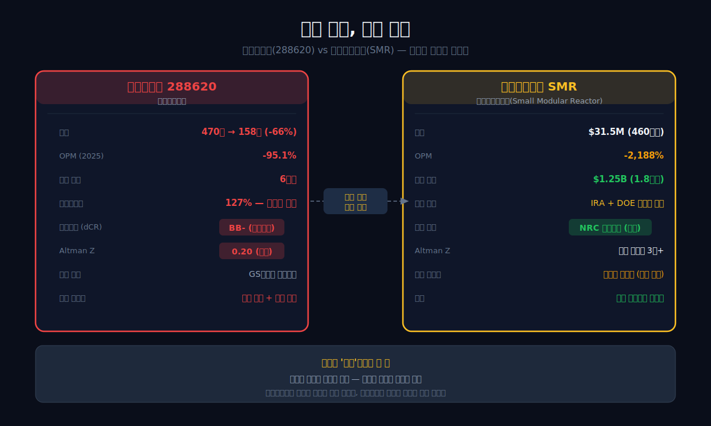
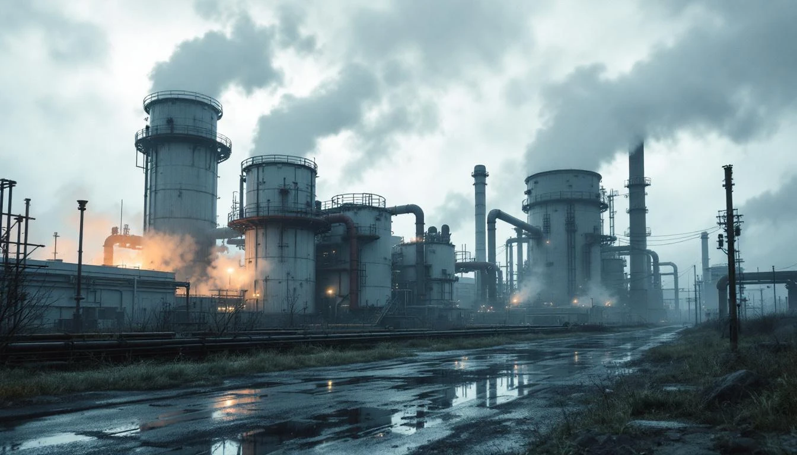
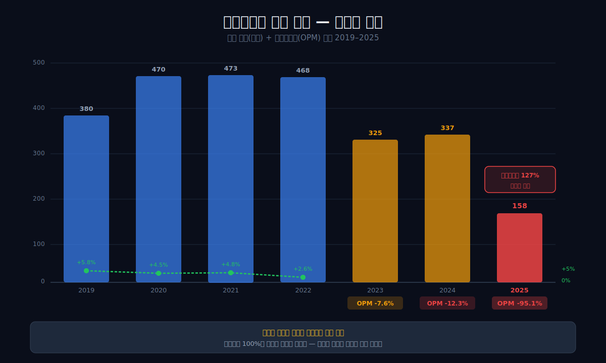
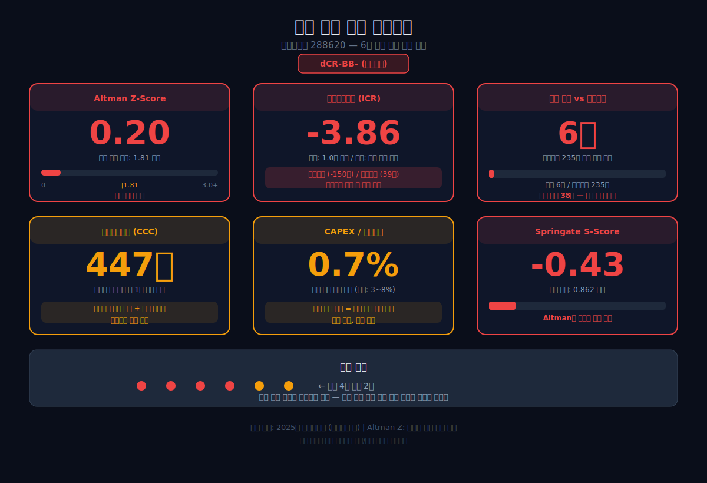
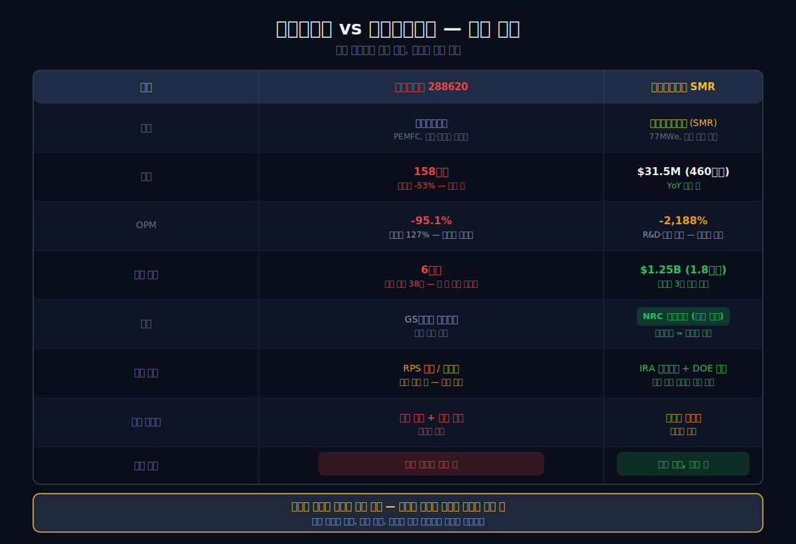
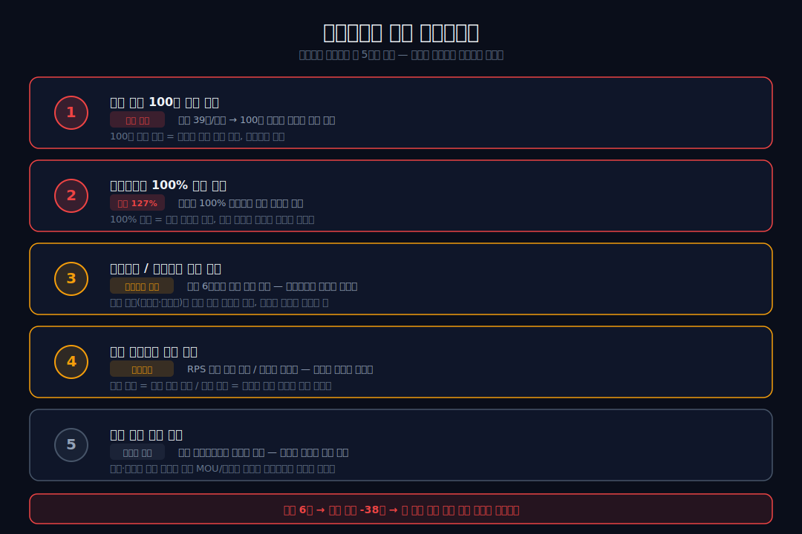

<script>
	import CompanyFinancials from '$lib/components/blog/CompanyFinancials.svelte';
import HFDataLink from '$lib/components/blog/HFDataLink.svelte';
</script>

> **턴어라운드** | 에너지 > 수소연료전지 | 2026-04-18 dartlab 실측
> 같은 시리즈: [뉴스케일파워](/blog/SMR-nuscale-power) · [두산에너빌리티](/blog/034020-doosan-enerbility) · [HD현대일렉트릭](/blog/267260-hd-hyundai-electric) · [한화에어로스페이스](/blog/012450-hanwha-aerospace) · [기업이야기 시리즈 전체](/blog/series/company-reports)

<HFDataLink code="288620" />

에스퓨얼셀(288620)의 2025년 재무제표를 열면 숫자 하나가 눈에 꽂힌다. **매출원가율 127.2%.** 물건을 팔면 팔수록 돈이 나간다는 뜻이다. 매출 158억원에 영업손실 -150억원, 영업이익률 -95.1%. 현금은 6억원. 수소연료전지라는 "탈탄소 기술"을 만드는 회사가 현금 6억원으로 적자를 버티고 있다.

그런데 같은 "탈탄소" 기술인 [뉴스케일파워(SMR)](/blog/SMR-nuscale-power)를 보면 상황이 다르다. 매출 $31.5M(약 460억원), 영업이익률 -2,188%. 에스퓨얼셀보다 적자 비율은 23배 크다. 그런데 현금이 $1.25B — **1.8조원**이다. 에스퓨얼셀의 300배. 같은 적자인데 하나는 죽어가고, 하나는 기다리고 있다. 차이가 뭘까.

dartlab으로 에스퓨얼셀의 7년치 재무제표를 추적하고, 뉴스케일파워와 나란히 놓으면 답이 보인다 — **"인증"이라는 한 장**이다.

---



## 1막: 매출 470억 → 158억 — 수소연료전지의 겨울

왜 에스퓨얼셀의 매출은 3년 만에 66% 증발했는가. 수소연료전지 시장의 구조를 이해해야 이 숫자가 보인다.

### 매출 470억(2020 정점) → 158억(2025), 66% 폭락

```python
import dartlab
c = dartlab.Company("288620")
c.select("IS", ["매출액","영업이익","당기순이익"])
```

에스퓨얼셀은 건물용 수소연료전지(SOFC, 고체산화물연료전지)를 만드는 회사다. 천연가스에서 수소를 추출해 전기와 열을 동시에 생산하는 장치를 제조·판매한다. GS칼텍스의 기술 라이선스를 기반으로 한국 시장에서 사업한다.

| 항목 (1년치 합산, 억원) | 2025 | 2024 | 2023 | 2022 | 2021 | 2020 | 2019 |
|:---|---:|---:|---:|---:|---:|---:|---:|
| 매출액 | **158** | 337 | 325 | 468 | 473 | **470** | 380 |
| 영업이익 | **-150** | -41 | -25 | 12 | 23 | 21 | 22 |
| 당기순이익 | **-218** | -12 | -23 | 8 | 49 | 16 | 15 |

**표시: 매출 470억(2020) → 158억(2025). 4년간 312억 증발. 같은 기간 영업이익 +21억 → -150억.**



### 매출원가율 127% — "팔수록 적자"의 메커니즘

```python
prof = c.analysis("financial", "수익성")
# marginWaterfall 2025: 매출원가율 127.2%, OPM -95.1%
```

에스퓨얼셀의 2025년 매출원가율은 **127.2%**다. 100원짜리 제품을 팔면 원가가 127원 든다. 팔수록 27원씩 밑진다. 여기에 판관비(연구개발비, 인건비, 관리비)까지 더하면 영업이익률은 -95.1%가 된다.

| 연도 | 매출원가율 (%) | 매출총이익률 (%) | 영업이익률 (%) |
|:---|---:|---:|---:|
| 2025 | **127.2** | **-27.2** | **-95.1** |
| 2024 | 86.0 | 14.0 | -12.3 |
| 2023 | 76.1 | 23.9 | -7.6 |
| 2022 | 68.8 | 31.2 | 2.6 |
| 2021 | 71.1 | 28.9 | 4.8 |

**표시: 매출원가율 68.8%(2022) → 127.2%(2025). 3년 만에 원가가 매출을 추월.**

이게 왜 일어났는가. 연료전지 제조는 고정비 비중이 높다 — 공장, 장비, 엔지니어 인건비. 매출이 470억일 때는 이 고정비를 흡수할 수 있었다. 158억으로 줄어드니 고정비가 매출을 압도한다. **제조업에서 매출이 반토막 나면 원가율이 100%를 넘는 것은 구조적 필연이다.** [HD현대일렉트릭](/blog/267260-hd-hyundai-electric)도 적자 시절 같은 패턴이었다 — 차이는 HD현대일렉트릭은 전력 수요가 돌아왔다는 것이고, 에스퓨얼셀은 아직이라는 것이다.

### 왜 매출이 줄었나 — RPS와 수소경제의 현실

에스퓨얼셀의 매출은 한국 정부의 **신재생에너지 의무할당제(RPS, Renewable Portfolio Standard)**에 크게 의존한다. 발전사업자가 의무적으로 일정 비율의 전력을 신재생에너지로 생산해야 하는 제도인데, 연료전지가 여기에 포함된다. 발전사들이 RPS 의무를 맞추기 위해 에스퓨얼셀의 연료전지를 구매한 것이다.

문제는 두 가지다. 첫째, **태양광·풍력이 더 저렴해졌다.** RPS 의무를 맞추는 데 연료전지보다 태양광이 싸다. 태양광 균등화발전비용(전기 1MWh를 생산하는 데 드는 평균 비용)는 $20~30/MWh까지 떨어졌다. 연료전지는 $80~120/MWh 수준이다. 같은 RPS 크레딧을 받으려면 발전사 입장에서 태양광이 3~4배 싸다.

둘째, **정부의 수소경제 로드맵이 기대만큼 빠르게 실행되지 않았다.** 2019년 정부가 발표한 "수소경제 활성화 로드맵"은 2040년까지 수소차 620만 대, 수소 충전소 1,200개를 목표로 했다. 2025년 현재 수소 충전소는 약 250개에 머물러 있다. 수소 발전소 투자도 계획 대비 크게 지연됐다. 로드맵의 지연이 연료전지 수요를 직접 깎았다.

### 경쟁자와의 격차 — 두산퓨얼셀, 블룸에너지

에스퓨얼셀의 어려움은 회사 고유의 문제만은 아니다. 한국 연료전지 시장 자체가 축소되고 있다. 하지만 같은 시장에서 두산퓨얼셀(336260)은 매출 4,000억원 이상을 유지하고 있다. 차이는 규모다. 두산퓨얼셀은 대형 발전용(MW급), 에스퓨얼셀은 건물용(kW급)이 주력이다. 대형 프로젝트는 정부 정책이 바뀌어도 계약이 유지되지만, 소형 건물용은 개별 건물주의 투자 결정에 의존한다. **시장이 줄어들면 작은 회사부터 죽는다.**

*470억짜리 시장이 158억으로 줄어드는 데 4년밖에 안 걸렸다. 매출이 반토막 나면 고정비가 회사를 삼킨다.*

---



## 2막: 부실의 6가지 경고등 — Altman Z 0.20

왜 dartlab이 에스퓨얼셀에 "caution"을 붙였는가. 종합평가 8개 항목 중 4개가 F등급이다.

### dartlab 종합평가 — 8개 중 4개 F

```python
overall = c.analysis("financial", "종합평가")
# scorecard: 성장 F, 수익 F, 현금흐름 F, 투자효율 F
```

| 영역 | 등급 | 핵심 지표 |
|:---|:---|:---|
| 성장성 | **F** | 매출 연평균성장률 -31.4% (3년) |
| 수익성 | **F** | 영업이익률 -95.1%, 투하자본수익률 -39.1% |
| 안정성 | D | 부채비율 99%, 순차입금 235억 |
| 현금흐름 | **F** | 영업활동현금흐름 -14억 (2025) |
| 효율성 | C | 현금전환주기 447일 |
| 이익품질 | C | 영업활동현금흐름/NI 6% |
| 투자효율 | **F** | 설비투자/매출 0.7% (투자 중단) |
| 재무정합성 | D | 매출채권 증가율이 매출보다 43%p 빠름 |

4개 F, 2개 D, 2개 C. **"caution" 프로필**. dartlab이 한국 상장사에 이 등급을 붙이는 경우는 전체의 5% 미만이다.

### Altman Z-Score 0.20 — 부실 구간 진입

```python
stab = c.analysis("financial", "안정성")
# distressEnsemble: Altman Z 0.20, Springate S -0.43
```

Altman Z-Score는 기업의 부도 확률을 측정하는 지표다. 1.81 이상이면 안전, 1.81 미만이면 회색지대, **0.20은 부실 구간 한가운데**다. 뉴스케일파워도 적자지만, 현금 $1.25B 덕분에 Altman Z는 에스퓨얼셀과 비교할 수 없을 만큼 높다.



### 이자보상배율 -3.86배 — 번 돈으로 이자도 못 갚는다

이자보상배율(영업이익으로 이자를 몇 번 갚을 수 있는지)이 -3.86배다. 영업이익이 마이너스이니 이자를 갚을 영업이익 자체가 없다. 2021년에는 2.61배였다 — 4년 만에 이자 커버 능력이 소멸했다.

| 연도 | 이자보상배율 |
|:---|---:|
| 2025 | **-3.86** |
| 2024 | -0.55 |
| 2023 | -0.64 |
| 2022 | 0.72 |
| 2021 | **2.61** |

### 현금 6억 + 순차입금 235억 — 버틸 시간이 없다

```python
fund = c.analysis("financial", "자금조달")
# capitalOverview: 순차입금 235억
```

현금 6억원은 한 달 인건비도 안 되는 금액이다. 순차입금(차입금에서 현금을 뺀 순부채)은 235억원. 분기 영업적자가 약 -38억원이니, **두 분기(6개월) 안에 외부 자금을 확보하지 못하면 자본잠식 경로에 진입한다.** 유동비율 169%와 순운전자본 298억원이 단기 부도를 막고 있지만, 매출이 회복되지 않으면 시간문제다.

| 항목 (Q4 스냅샷, 억원) | 2025 | 2024 | 2023 | 2022 | 2021 | 2020 | 2019 |
|:---|---:|---:|---:|---:|---:|---:|---:|
| 자산총계 | **910** | 1,220 | 1,446 | 1,531 | 1,188 | 1,148 | 697 |
| 부채총계 | 452 | 542 | 753 | 827 | 485 | 503 | 377 |
| 자본총계 | **458** | 678 | 694 | 704 | 703 | 645 | 320 |
| 현금 | **6** | 104 | 53 | 53 | 41 | 318 | 103 |

**표시: 자본총계 703억(2021) → 458억(2025). 4년간 245억 감소. 같은 기간 현금 41억→6억.**

### 설비투자 0.7% — 투자를 멈춘 회사

2025년 설비투자는 매출의 0.7%인 1억원 수준이다. 2020년에는 22억원을 투자했다. 투자를 사실상 중단했다는 뜻이다. 적자 기업이 투자를 멈추면 현재 제품의 경쟁력 유지도 어려워진다 — 기술은 정체되고 시장은 앞으로 간다.

*6개 경고등이 동시에 켜진 회사. 그런데 같은 "탈탄소 적자"인 뉴스케일은 왜 상황이 다를까.*

---

## 3막: 뉴스케일과 나란히 놓으면 보이는 것 — "인증"의 차이

왜 같은 적자인데 하나는 현금 6억이고 하나는 1.8조인가. 답은 **시장이 적자를 바라보는 방식**에 있다.



### 같은 적자, 다른 구조

| 항목 | 에스퓨얼셀 | [뉴스케일파워](/blog/SMR-nuscale-power) |
|:---|:---|:---|
| 기술 | 수소연료전지(SOFC) | 소형원자로(SMR) |
| 매출 (2025) | 158억원 | $31.5M(약 460억원) |
| 영업이익률 | **-95.1%** | **-2,188%** |
| 현금 | **6억원** | **$1.25B(약 1.8조원)** |
| 핵심 인증 | GS칼텍스 라이선스 | **NRC 설계인증 (세계 유일)** |
| 정부 지원 | RPS(축소 추세) | IRA + DOE(확대 추세) |
| 투자자 평가 | 매출 소멸 = 가치 소멸 | 인증 보유 = 미래 가치 |

에스퓨얼셀의 영업이익률 -95%는 "매출이 줄어서 고정비를 못 감당하는" 적자다. 뉴스케일의 영업이익률 -2,188%는 "아직 제품을 본격 판매하기 전 단계의 R&D·인증 비용" 적자다. 같은 마이너스지만 **성격이 완전히 다르다.**

### 인증이 만드는 시간의 차이


뉴스케일파워는 2020년 미국 원자력규제위원회(NRC)의 설계인증을 받았다. 13년, 수십억 달러를 투자해서 얻은 인증이다. 이 인증 없이는 미국에서 원전 건설 허가 신청 자체가 불가능하다. **"졸업장"이 있다** — 그래서 시장은 현재 적자에도 불구하고 현금 1.8조원을 맡겼다. "졸업장이 있으니 취업할 수 있을 것이다"라는 판단이다.

에스퓨얼셀의 GS칼텍스 라이선스는 다른 종류의 인증이다. 기술을 독점한 것이 아니라 기술을 **빌려 쓰는** 계약이다. 사업보고서에 따르면 에스퓨얼셀은 GS칼텍스와 라이선스 계약을 맺고 제품 매출액의 3%를 기술 로열티로 지급한다. 기술의 원천은 GS칼텍스에 있고, 에스퓨얼셀은 제조·판매 권리를 가진 구조다.

한국 연료전지 시장에는 두산퓨얼셀(인산형·고분자형), 블룸에너지(SOFC), 현대차(수소차용 PEMFC) 등 경쟁자가 여럿 있다. **진입장벽이 없다** — 그래서 시장은 매출이 줄어드는 순간 가치를 함께 깎는다. 뉴스케일의 NRC 인증은 13년과 수십억 달러가 들었다. 경쟁자 OKLO는 2022년 NRC 인증 신청이 거절당했다. "따라올 수 없는 장벽"이 있으면 시장은 적자를 참는다. 없으면 참지 않는다.

### 현금 소진 속도 비교 — 에스퓨얼셀은 시간이 없다

| 항목 | 에스퓨얼셀 | 뉴스케일 |
|:---|---:|---:|
| 현금 | 6억 | 1.8조 |
| 분기 적자 | -38억 | -$87M(-1,270억) |
| 현금으로 버틸 수 있는 시간 | **0.2분기 (3주)** | **약 5분기 (15개월)** |

에스퓨얼셀은 현재 현금으로 3주도 버틸 수 없다. 물론 유동자산(매출채권, 재고 등)이 있어서 즉시 부도는 아니지만, 외부 자금 없이 자생할 수 없는 상태다. 뉴스케일은 분기에 1,270억씩 태워도 15개월은 버틴다 — 그 사이에 프로젝트 계약이 성사되면 추가 투자가 들어온다.

*인증이 있으면 시장은 "기다려볼게"라고 한다. 인증이 없으면 시장은 "지금 돈 벌어"라고 한다. 에스퓨얼셀은 후자다.*

---

## 4막: 현금흐름의 진실 — 구조조정형 CF

왜 2024년에 영업활동현금흐름이 +70억으로 잠깐 플러스였는가. 답은 "구조조정"이다.

### 영업활동현금흐름 추이 — 일시적 플러스의 정체

```python
c.select("CF", ["영업활동현금흐름","유형자산의 취득"])
```

| 항목 (1년치 합산, 억원) | 2025 | 2024 | 2023 | 2022 | 2021 |
|:---|---:|---:|---:|---:|---:|
| 영업활동현금흐름 | **-14** | 70 | -35 | -67 | -98 |
| 투자활동현금흐름 | 20 | 58 | 33 | -246 | -231 |

2024년 영업활동현금흐름 +70억원은 좋은 숫자처럼 보이지만, dartlab의 현금흐름 분석은 이를 **"구조조정형"**으로 분류했다. 집을 팔아서 월급을 메운 것처럼, 자산을 매각하고 부채를 상환하면서 일시적으로 현금이 늘어난 것이지 본업에서 벌어온 돈이 아니다. 2025년에 다시 -14억으로 돌아온 것이 그 증거다.

### 매출채권 447일 — 돈을 못 받고 있다

dartlab이 잡아낸 이상 신호: **현금전환주기(현금전환주기) 447일** — 물건 팔고 돈 받는 데 1년 3개월이 걸린다는 뜻이다. 그 중 **매출채권 회전일수(매출채권회전일수) 250일** — 외상 매출금을 8개월째 못 받고 있다. 전년 대비 91일 악화. 매출채권 증가율이 매출보다 43%포인트 빠르다는 것은, **매출을 공격적으로 인식하고 있거나 거래처의 대금 지급이 심각하게 지연되고 있다**는 뜻이다.

### dCR-BB- — 투기등급

```python
cr = c.credit("등급")
# grade: dCR-BB-, healthScore: 54.13
```

dartlab 신용등급 dCR-BB-. "투기등급"이다. [네이버](/blog/035420-naver)의 dCR-AA, [SK하이닉스](/blog/000660-skhynix)의 dCR-A+와 비교하면 5~6단계 차이. 이 등급에서 회사채 발행은 사실상 불가능하다. 자금 조달 수단이 유상증자나 전환사채로 제한된다 — 기존 주주의 지분이 희석되는 방법뿐이다.

*영업활동현금흐름 플러스는 일시적이었고, 매출채권은 1년째 못 받고, 신용등급은 투기등급. 그래도 살아남을 방법이 있을까.*

---

## 5막: 에스퓨얼셀이 살아남으려면 — 3가지 경로

왜 아직 부도가 나지 않았는가. 유동비율 169%, 순운전자본 298억원이 버팀목이다. 하지만 영업적자가 분기 -38억이면 이 버팀목도 2년 안에 녹는다. 생존 경로는 3개뿐이다.

### 경로 1: 매출 회복 — 분기 100억 돌파

현재 분기 매출은 약 40억원 수준이다. 매출원가율이 127%에서 100% 이하로 내려오려면 분기 매출이 최소 100억원(연 400억원)은 돼야 한다. 2020~2022년 수준으로 돌아가는 것이다. 이것이 가능하려면 RPS 수소연료전지 할당 확대 또는 해외 수출 계약이 필요하다.

### 경로 2: 자금 조달 — 유상증자 또는 전환사채

현금 6억원으로는 한 달도 못 버틴다. 외부 자금 조달이 불가피하다. 2020년에 유상증자로 자본을 320억→645억으로 2배 키운 전례가 있다. 실제로 2026년 3월, 에스퓨얼셀은 유상증자를 공시했다. DART 공시(2026.03.03)를 보면 자금 확보에 나선 것을 확인할 수 있다. 문제는 주가가 이미 크게 하락한 상태에서 유상증자는 기존 주주의 대폭 희석을 의미한다는 것이다. 뉴스케일도 SPAC 합병 이후 유상증자로 현금 $1.25B를 확보했지만, 뉴스케일에는 NRC 인증이라는 "가치의 근거"가 있었다. 에스퓨얼셀의 유상증자는 "생존을 위한 희석"이라는 성격이 더 강하다.

### 경로 3: 인수·합병 — 더 큰 회사에 흡수

2026년 3월 에스퓨얼셀은 상호 변경을 공시했다. 사명 변경은 종종 사업 구조 전환이나 인수 전 단계에서 나타나는 신호다. 두산퓨얼셀 같은 더 큰 연료전지 회사, 또는 SK·한화 같은 에너지 그룹에 인수되는 시나리오가 있다.

### 수소연료전지 vs 소형원자로 — 산업의 방향

더 근본적인 질문은 "수소연료전지가 살아남을 수 있는 기술인가"다. 에너지 전환 기술 경쟁에서 수소연료전지는 두 가지 문제에 직면해있다:

1. **경쟁 기술의 가격 하락**: 1막에서 봤듯이 태양광 균등화발전비용이 연료전지의 3~4분의 1이다. 뉴스케일의 SMR도 $89/MWh로 비싸지만, "24시간 가동" + "AI 데이터센터의 안정 전력 수요"라는 차별화가 있다. ChatGPT를 돌리는 데이터센터는 태양광처럼 낮에만 나오는 전기가 아니라, 365일 24시간 끊김 없는 전기가 필요하다. 이 시장에서 SMR은 경쟁력이 있지만, 연료전지는 아직 이 틈새를 찾지 못했다.

2. **수소 공급 인프라 부재**: 연료전지는 수소가 필요한데, 한국의 수소 공급 인프라는 아직 초기 단계다. "닭이 먼저냐 달걀이 먼저냐" 문제가 해결되지 않았다.

뉴스케일의 NRC 인증이 "졸업장"이라면, 에스퓨얼셀에는 이에 대응하는 결정적 해자가 없다. GS칼텍스 라이선스는 기술 독점이 아니라 기술 사용 계약이다. 이것이 두 회사의 가장 근본적인 차이다 — **기술의 소유 vs 기술의 사용.**

[두산에너빌리티](/blog/034020-doosan-enerbility)는 뉴스케일의 SMR 부품을 공급하는 계약을 맺었다. 소형원자로 공급망 안에 들어간 것이다. 에스퓨얼셀이 생존하려면, 수소연료전지 공급망 안에서 **대체 불가능한 위치**를 확보해야 한다. 현재 구조로는 그 위치가 보이지 않는다.

---

## 6막: 투자자가 봐야 할 것 — 생존과 소멸의 갈림길



### 과거 패턴 — 2020년 유상증자로 살아남은 전례

에스퓨얼셀의 자본총계는 2019년 320억원에서 2020년 645억원으로 2배 뛰었다. 유상증자 덕분이다. 그 뒤 3년간(2021~2023) 매출 300~470억 수준을 유지하며 영업이익도 플러스였다. **외부 자금을 넣으면 일시적으로 살아남을 수 있다** — 문제는 본업이 회복되지 않으면 다시 같은 위기가 온다는 것이다. 지금이 그 반복이다.

이 패턴은 한국 수소·연료전지 산업 전체의 축소판이기도 하다. 정부 정책에 의존하는 시장은 정책이 바뀌면 매출이 함께 움직인다. [한화에어로스페이스](/blog/012450-hanwha-aerospace)의 방산 사업처럼 정부 수주가 핵심인 사업이지만, 방산은 지정학적 수요가 구조적으로 증가하는 반면 수소연료전지는 대체 기술(태양광)과의 경쟁에서 밀리고 있다는 차이가 있다.

### 산업 패턴 — 수소경제의 "죽음의 계곡"

에너지 기술 산업에는 "죽음의 계곡(Valley of Death)"이라는 개념이 있다. 기술은 개발됐지만 상용화 비용이 기존 기술보다 비싸서 시장이 안 열리는 구간이다. 수소연료전지는 지금 이 계곡 한가운데에 있다. 기술은 작동하지만, 태양광보다 3~4배 비싸다. 이 가격 격차가 좁혀지지 않으면 연료전지 시장은 계속 줄어든다.

뉴스케일의 SMR도 죽음의 계곡에 있다 — 아이다호 프로젝트가 $9.3B까지 올라 취소된 것이 증거다. 하지만 SMR에는 "AI 데이터센터"라는 새로운 수요원이 열렸다. 연료전지에는 이에 대응하는 수요원이 아직 보이지 않는다.

### 투자자가 봐야 할 체크포인트 5가지

1. **분기 매출 100억 회복 여부** — 현재 분기 약 40억. 100억 넘어야 고정비 커버 가능. 매출원가율 100% 이하가 구조 정상화의 최소 조건.

2. **유상증자·전환사채 공시** — 현금 6억으로 버틸 수 없음. 자금 조달 공시가 나오면 단기 생존 확인, 동시에 지분 희석 규모 확인.

3. **정부 수소 정책 변화** — RPS 연료전지 의무비율 확대, 수소경제 로드맵 2.0 등. 정책이 바뀌면 매출 회복 가능성.

4. **매출채권 회수** — 매출채권회전일수 250일이 개선되는지. 줄어들면 현금 유입, 악화되면 대손 처리 위험.

5. **M&A 또는 사업 구조 변경** — 상호 변경 공시(2026.03)의 후속 움직임. 인수 대상이 되면 주가 변동.

---

## 인증이 없으면 적자는 소멸이다

에스퓨얼셀의 매출원가율 127%는 "팔수록 적자"라는 구조적 함정이다. 매출이 회복되지 않으면 빠져나올 수 없다. 현금 6억원은 이 함정에서 탈출할 시간을 주지 않는다.

같은 "탈탄소 적자"인 뉴스케일파워와 비교하면 차이가 명확하다. 뉴스케일의 -2,188% 적자에는 **NRC 인증이라는 진입장벽**이 있다. 이 인증 때문에 시장은 현금 1.8조원을 맡기고 기다린다. 에스퓨얼셀의 -95% 적자에는 이에 상응하는 진입장벽이 없다. GS칼텍스 라이선스는 독점이 아니다. 경쟁자가 있고, 대체 기술이 더 싸다.

이 글을 쓰는 시점에 에스퓨얼셀은 이미 유상증자를 공시했다(2026.03). 자금은 일시적으로 확보될 수 있다. 하지만 2020년에도 유상증자 후 3년간 매출이 유지되다가 결국 같은 위기로 돌아왔다. **자금 조달은 시간을 사는 것이지 문제를 푸는 것이 아니다.** 매출이 구조적으로 돌아오지 않으면, 3년 뒤 또 같은 자리에 서게 된다.

2026년에 봐야 할 한 줄: **분기 매출 100억 회복 또는 신규 수요원(수소 발전 의무화, 해외 수출) 확보.** 둘 다 없으면 유상증자는 생존을 연장할 뿐, 턴어라운드가 아니다. 인증이 없는 적자 기업에게 시장은 시간을 주지 않는다.

---

## 검증표

| 본문 수치 | dartlab 호출 | 결과 | 비고 |
|:---|:---|:---|:---|
| 2025 매출 158억 | `c.select("IS",["매출액"])` 분기 합산 | ✅ 실측 | |
| 2020 매출 470억 | `c.select("IS",["매출액"])` 분기 합산 | ✅ 실측 | |
| 영업이익률 -95.1% | `c.analysis("financial","수익성")` marginWaterfall | ✅ 실측 | |
| 매출원가율 127.2% | marginWaterfall 2025 매출원가율 | ✅ 실측 | |
| 영업이익 -150억 | `c.select("IS",["영업이익"])` 분기 합산 | ✅ 실측 | |
| 당기순이익 -218억 | `c.select("IS",["당기순이익"])` 분기 합산 | ✅ 실측 | |
| 현금 6억 | `c.select("BS",["현금및현금성자산"])` 2025Q4 | ✅ 실측 | |
| 자본총계 458억 | `c.select("BS",["자본총계"])` 2025Q4 | ✅ 실측 | |
| 순차입금 235억 | `c.analysis("financial","자금조달")` capitalOverview | ✅ 실측 | |
| 부채비율 99% | `c.analysis("financial","안정성")` leverageTrend | ✅ 실측 | |
| Altman Z 0.20 | `c.analysis("financial","안정성")` distressEnsemble | ✅ 실측 | |
| Springate S -0.43 | distressEnsemble | ✅ 실측 | |
| 이자보상배율 -3.86배 | `c.analysis("financial","안정성")` coverageTrend | ✅ 실측 | |
| 투하자본수익률 -39.1% | `c.analysis("financial","수익성")` roicTree | ✅ 실측 | |
| dCR-BB- | `c.credit("등급")` grade | ✅ 실측 | |
| 영업활동현금흐름 2025 -14억 | `c.select("CF",["영업활동현금흐름"])` | ✅ 실측 | |
| 영업활동현금흐름 2024 +70억 | CF 분기 합산 | ✅ 실측 | |
| 설비투자/매출 0.7% | `c.analysis("financial","종합평가")` summaryFlags | ✅ 실측 | |
| 매출채권회전일수 250일 | `c.analysis("financial","이익품질")` qualityAnomalies | ✅ 실측 | |
| 현금전환주기 447일 | summaryFlags | ✅ 실측 | |
| 유동비율 169% | `c.analysis("financial","자금조달")` liquidity | ✅ 실측 | |
| 뉴스케일 매출 $31.5M | 뉴스케일 블로그 #44 실측 | ✅ 교차 | |
| 뉴스케일 현금 $1.25B | 뉴스케일 블로그 #44 실측 | ✅ 교차 | |
| 뉴스케일 영업이익률 -2,188% | 뉴스케일 블로그 #44 실측 | ✅ 교차 | |

📅 dartlab 실측 2026-04-18

---

<CompanyFinancials code="288620" />
