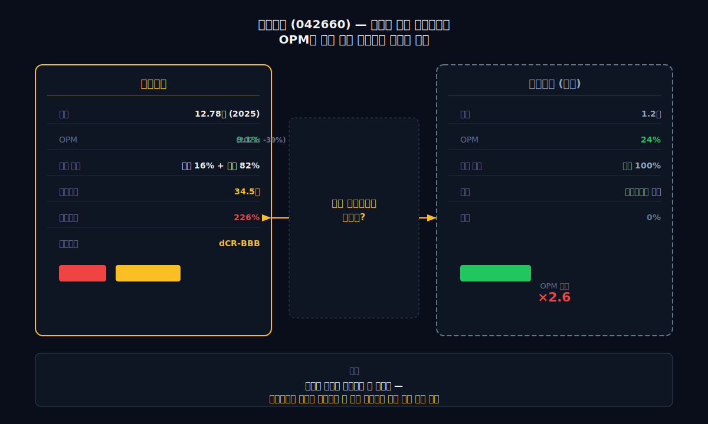
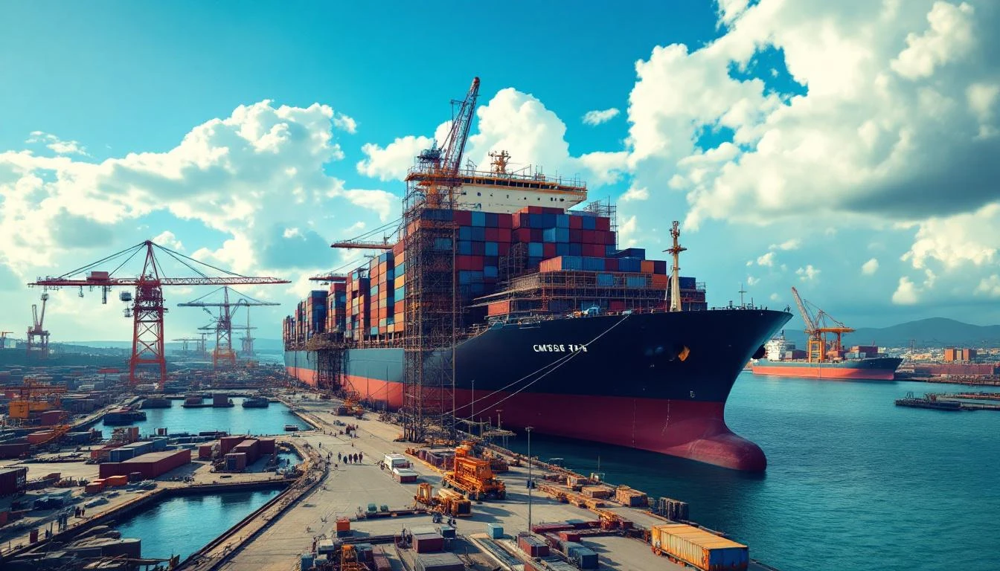
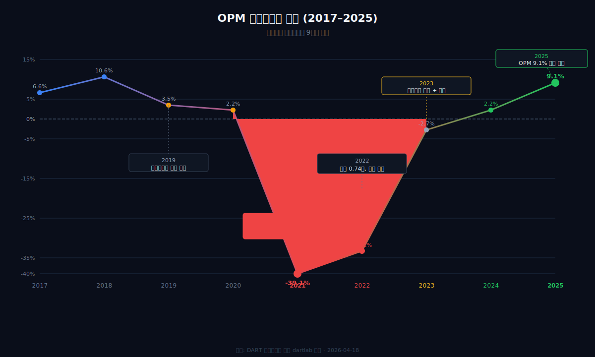
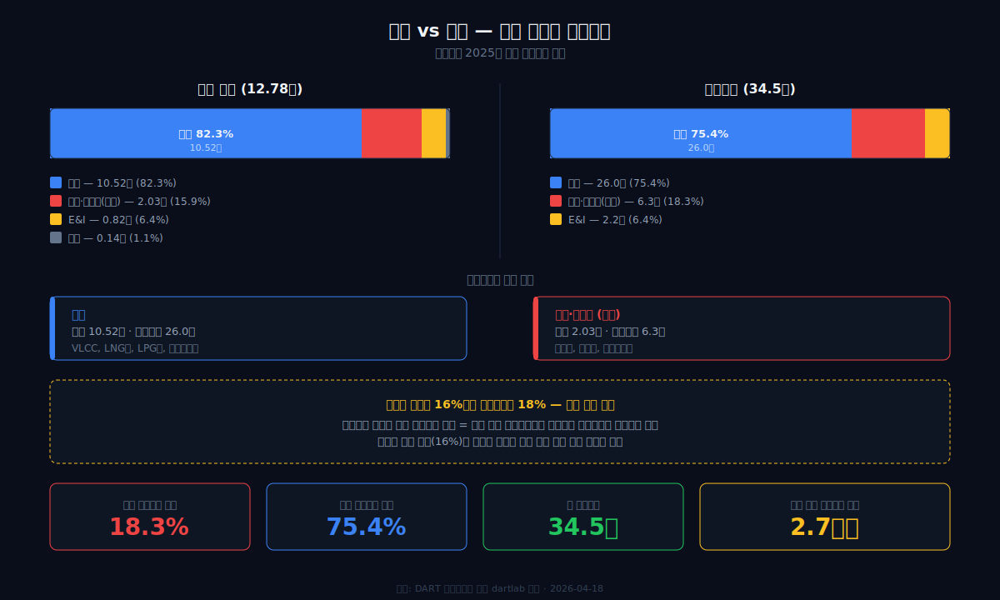
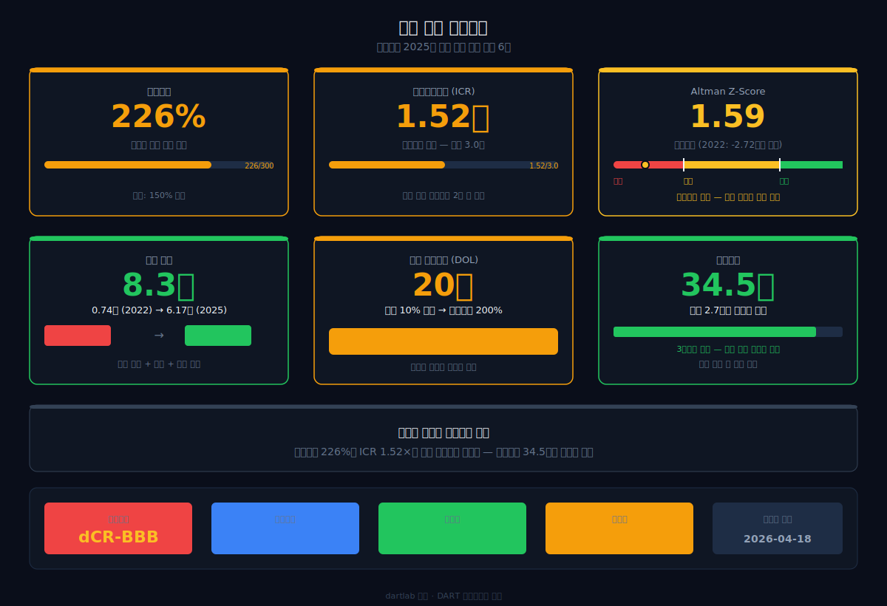
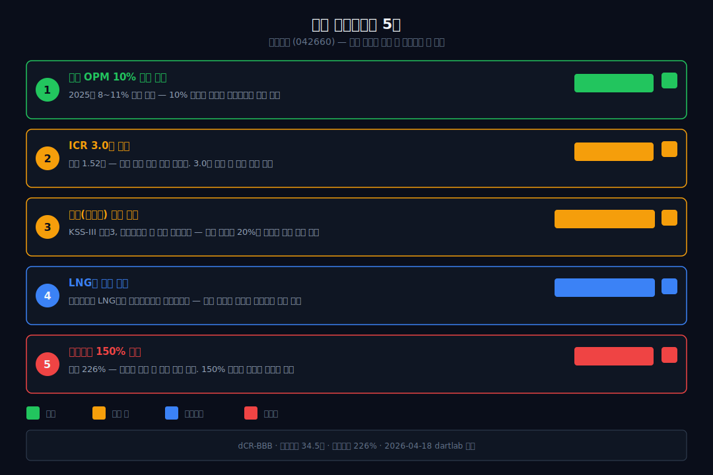

<script>
import ComboChart from '$lib/components/blog/ComboChart.svelte';
import StackBar from '$lib/components/blog/StackBar.svelte';
import HFDataLink from '$lib/components/blog/HFDataLink.svelte';
</script>

> **턴어라운드** | 조선·해운 > 건조 | 2026-04-18 dartlab 실측
> 같은 시리즈: [대한조선](/blog/439260-daehan-shipbuilding) · [HMM](/blog/011200-hmm) · [현대글로비스](/blog/086280-hyundai-glovis) · [한화에어로스페이스](/blog/012450-hanwha-aerospace) · [HD현대일렉트릭](/blog/267260-hd-hyundai-electric) · [기업이야기 시리즈 전체](/blog/series/company-reports)

<HFDataLink code="042660" />

한화오션(042660)은 잠수함을 만드는 조선소다. KSS-III 장보고급 잠수함, 차기호위함, 상륙함 — 대한민국 해군의 핵심 전력을 건조한다. 방산 프리미엄이 붙어야 할 회사다. [한화에어로스페이스](/blog/012450-hanwha-aerospace)의 K9 자주포가 영업이익률 10%를 넘긴 것처럼.

그런데 dartlab으로 재무제표를 열면 이상한 게 보인다. 2025년 영업이익률 9.1%. 나쁘지 않다. 하지만 같은 조선업인 [대한조선](/blog/439260-daehan-shipbuilding)의 영업이익률은 24%다. **상선만 만드는 조선소가 방산을 하는 조선소보다 마진이 2.7배 높다.** 방산 프리미엄은 어디로 갔을까.

9년치 재무제표를 추적하면 답이 보인다 — 영업이익률 -39%(2021)에서 시작된 턴어라운드, 자본 0.74조에서 6.17조로의 부활, 그리고 방산이 마진을 올려주는 게 아니라 **"저가 수주에서 얼마나 빨리 빠져나왔는가"**가 마진을 결정한다는 조선업의 구조적 진실.

---



## 1막: 영업이익률 -39%에서 +9.1%로 — 조선업 역대급 턴어라운드

왜 한화오션의 영업이익률은 2021년 -39%까지 떨어졌다가 4년 만에 +9%로 돌아왔는가.

### 매출 4.49조(2021 바닥) → 12.78조(2025), 2.8배

```python
import dartlab
c = dartlab.Company("042660")
c.select("IS", ["매출액","영업이익","당기순이익"])
```

| 항목 (1년치 합산, 조원) | 2025 | 2024 | 2023 | 2022 | 2021 | 2020 | 2019 | 2018 | 2017 |
|:---|---:|---:|---:|---:|---:|---:|---:|---:|---:|
| 매출액 | **12.78** | 10.78 | 7.41 | 4.86 | **4.49** | 7.03 | 8.36 | 9.64 | 11.10 |
| 영업이익 | **1.17** | 0.24 | -0.20 | **-1.61** | **-1.75** | 0.15 | 0.29 | 1.02 | 0.73 |
| 당기순이익 | **1.25** | 0.53 | 0.16 | -1.74 | -1.70 | 0.09 | -0.05 | 0.32 | 0.65 |

**표시: 2021~2022 영업손실 합계 -3.36조. 2025 영업이익 1.17조. 4년 만에 4.53조 스윙.**



### 영업이익률 궤적 — V자가 아니라 U자

```python
c.select("ratios", ["영업이익률 (%)"])
```

| 연도 | 2025 | 2024 | 2023 | 2022 | 2021 | 2020 | 2019 | 2018 | 2017 |
|:---|---:|---:|---:|---:|---:|---:|---:|---:|---:|
| 영업이익률 (%) | **9.1** | 2.2 | -2.7 | **-33.2** | **-39.1** | 2.2 | 3.5 | 10.6 | 6.6 |

2021~2022년 영업이익률이 -39%, -33%인 것은 "저가 수주 충당금"의 결과다. 2019~2020년에 수주한 선박을 계약 당시 가격으로 지어야 하는데, 원자재(철판·구동장치)와 인건비가 급등했다. 만들면 만들수록 손해가 나는 구조 — [에스퓨얼셀](/blog/288620-sfuelcell)의 매출원가율 127%와 같은 메커니즘이지만, 조선소의 스케일에서 벌어진 것이다.

### 분기별 영업이익률 — 2025년 전 분기 흑자

| 분기 | 2023Q1 | Q2 | Q3 | Q4 | 2024Q1 | Q2 | Q3 | Q4 | 2025Q1 | Q2 | Q3 | Q4 |
|:---|---:|---:|---:|---:|---:|---:|---:|---:|---:|---:|---:|---:|
| 영업이익률(%) | -4.4 | -8.7 | 3.9 | -2.2 | 2.3 | -0.4 | 1.0 | 5.2 | **8.2** | **11.3** | **9.6** | **7.5** |

2023년은 분기마다 흑적이 갈렸다. 저가 수주 잔량이 아직 남아있었기 때문이다. 2024년 하반기부터 안정화되기 시작했고, 2025년에는 **전 분기 8~11% 범위로 안정**됐다. 이건 저가 수주가 완전히 소화됐다는 뜻이다.

### 매출원가율 개선이 턴어라운드의 핵심

```python
prof = c.analysis("financial", "수익성")
# marginWaterfall 2025: 매출원가율 85.6%, OPM 9.1%
```

| 연도 | 매출원가율 (%) | 매출총이익률 (%) | 영업이익률 (%) |
|:---|---:|---:|---:|
| 2025 | **85.6** | **14.4** | **9.1** |
| 2024 | 93.6 | 6.4 | 2.2 |
| 2023 | 98.7 | 1.3 | -2.7 |

매출원가율이 98.7%(2023) → 85.6%(2025)로 13%포인트 개선됐다. 2025년 영업이익률 개선 9.1%포인트 중 **86%가 원가율 개선**에서 왔다. 고선가 수주가 매출에 반영되기 시작한 것이다. 조선업에서 마진을 결정하는 것은 "지금의 원가"가 아니라 "2~3년 전의 수주 가격"이다. 한화오션이 2022~2023년에 높은 가격으로 수주한 선박이 2025년 매출에 찍히면서 마진이 돌아왔다.

*-39%에서 +9.1%로, 4년. 하지만 같은 조선업의 [대한조선](/blog/439260-daehan-shipbuilding)은 24%다. 왜 방산을 하는 조선소의 마진이 더 낮을까.*

---



## 2막: 방산 16%, 상선 82% — 매출의 정체

왜 방산을 하는 조선소인데 상선이 매출의 82%인가. 한화오션의 사업 구조를 분해하면 보인다.

### 세그먼트 — 상선이 압도적 주력

```python
rev = c.analysis("financial", "수익구조")
# segmentComposition 2025: 상선 82.3%, 해양·특수선 15.9%, E&I 6.4%
```



| 사업부문 (2025, 조원) | 매출 | 비중 |
|:---|---:|---:|
| **상선** (LNG선·컨테이너선·VLCC 등) | 10.52 | **82.3%** |
| **해양·특수선** (잠수함·호위함·상륙함) | 2.03 | **15.9%** |
| E&I (석유화학 플랜트) | 0.82 | 6.4% |
| 기타 | 0.14 | 1.1% |

한화오션의 정체성은 "방산 조선소"가 아니라 **"방산도 하는 상선 조선소"**다. 매출의 82%가 상선에서 나온다. 잠수함과 호위함은 언론에서 많이 다루지만 매출 비중은 16%에 불과하다.

### 수주잔고 34.5조 — 매출 2.7년치가 쌓여있다

| 부문 | 수주잔고 (조원) | 비중 |
|:---|---:|---:|
| 상선 | **26.0** | 75% |
| 해양·특수선 | **6.3** | 18% |
| E&I | 2.2 | 6% |
| **합계** | **34.5** | 100% |

수주잔고 34.5조원은 2025년 매출 12.78조원의 **2.7년치**다. 향후 2~3년간의 매출이 이미 확정돼있다는 뜻이다. 방산(해양·특수선) 수주잔고 6.3조도 매출 비중(16%)과 비슷한 18%를 차지한다 — 중기적으로 방산 비중이 유지된다.

### 방산 vs 상선 — 왜 방산이 마진을 올려주지 않는가

여기서 핵심 질문이 나온다. [한화에어로스페이스](/blog/012450-hanwha-aerospace)는 K9 자주포·천무 다연장로켓 수출로 영업이익률 10%+ 를 달성했다. 방산은 원래 마진이 높은 사업 아닌가?

답은 **"조선 방산은 육상 방산과 구조가 다르다"**에 있다.

1. **생산 방식의 차이**: K9 자주포는 표준화된 생산라인에서 수백 대를 만든다. 잠수함은 1척씩 맞춤 제작이다. 규모의 경제가 작동하지 않는다.

2. **발주처 특성**: 잠수함·호위함의 발주처는 대한민국 해군이다. 예산이 정해져있고, 원가 기반 가격(cost-plus)으로 계약한다. 수출이 아닌 내수 방산은 마진이 제한된다. [현대로템](/blog/064350-hyundai-rotem)의 K2 전차도 내수 영업이익률은 수출보다 낮다.

3. **납기와 충당금**: 방산 프로젝트는 10년+ 장기 계약이다. 원자재·인건비 변동을 정확히 예측하기 어렵고, 예상을 초과하면 충당금이 잡힌다. 2021~2022년 한화오션의 -39% 영업이익률에는 방산 프로젝트 충당금도 포함됐다.

결론: **조선 방산은 "안정적 일감"이지 "고마진 사업"이 아니다.** 한화오션에서 방산의 가치는 마진이 아니라 경기 변동과 무관하게 들어오는 일감 — "바닥을 깔아주는 역할"이다.

*방산 프리미엄은 마진에 찍히지 않는다. 그렇다면 한화오션의 마진을 결정하는 것은 무엇인가.*

---

## 3막: 마진을 결정하는 것 — "2년 전 수주 가격"

왜 대한조선 영업이익률 24%이고 한화오션은 9%인가. 답은 **선종 집중도**와 **저가 수주 탈출 속도**에 있다.

### 대한조선과의 결정적 차이

| 항목 | 한화오션 | [대한조선](/blog/439260-daehan-shipbuilding) |
|:---|:---|:---|
| 매출 | 12.78조 | 1.2조 |
| 영업이익률 | 9.1% | **24%** |
| 선종 | LNG선·VLCC·컨테이너·잠수함 등 **다선종** | 수에즈막스 **올인** |
| 직원 | 약 8,000명+ | 648명 |
| 판관비율 | 5.3% | 2.3% |
| 방산 | 있음 (16%) | 없음 |

대한조선의 24%가 가능한 이유는 3가지다. 첫째, **수에즈막스 탱커 한 선종에 올인**해서 공정이 표준화됐다. 텐덤 공법으로 도크 회전율을 18% 높였다. 둘째, **직원 648명**으로 판관비가 극도로 낮다. 셋째, **3번 부도 후 인수된 회사**라서 인수가(2,000억)가 낮았고, 감가상각 부담이 가볍다.

한화오션은 정반대다. LNG선, VLCC, 컨테이너선, 잠수함, 호위함, 석유화학 플랜트까지 다양한 선종을 짓는다. 다선종 구조는 특정 시장 침체에 대한 방어력은 있지만, 공정 표준화가 어려워 마진이 낮다. 판관비율 5.3%는 대한조선(2.3%)의 2.3배다. 규모가 10배 큰 조선소의 고정비 구조다.

### 조선업 영업이익률의 진짜 결정요인 — 2~3년 전의 수주 가격

조선업에서 오늘의 마진은 오늘 결정되지 않는다. **2~3년 전에 수주한 선박의 가격**이 오늘의 매출이 되고, **오늘의 원자재·인건비**가 원가가 된다. 수주 가격이 높고 원가가 안정적이면 마진이 좋다. 수주 가격이 낮고 원가가 올랐으면 마진이 폭락한다.

2021~2022년 한화오션의 영업이익률 -39%는 2019~2020년의 저가 수주 때문이었다. 코로나 시기에 선가가 바닥이었을 때 수주한 선박을 원자재 가격이 급등한 시점에 건조해야 했다. 반대로 2025년 영업이익률 9.1%는 2022~2023년의 고선가 수주가 반영된 것이다.

대한조선은 2022년 인수 후 **처음부터 높은 선가로만 수주**했다. 저가 수주 레거시가 없었다. 이것이 영업이익률 24%가 가능한 진짜 이유다 — 선종 집중 + 저가 수주 잔량 0.

### 영업레버리지(DOL) 20배 — 칼날 위의 수익성

dartlab 종합평가의 경고: **영업레버리지(DOL) 20배**. 매출이 10% 오르면 영업이익이 200% 오르고, 매출이 10% 빠지면 영업이익이 200% 빠진다. 조선업 특유의 높은 고정비 구조 때문이다. 2025년 영업이익률 9.1%가 좋아 보이지만, 다음 사이클에서 선가가 하락하면 -30%대로 돌아갈 수 있는 구조라는 뜻이다.

*방산이 마진을 올려주는 게 아니라, 저가 수주 탈출 속도와 선종 집중도가 마진을 결정한다. 그렇다면 한화오션의 재무 체력은 다음 사이클을 버틸 수 있는가.*

---

## 4막: 자본 0.74조에서 6.17조로 — 한화가 산 것

왜 2022년 자본이 0.74조까지 떨어졌는가. 그리고 한화그룹은 왜 이 회사를 샀는가.

### 2022년 — 자본잠식 직전

```python
c.select("BS", ["자산총계","부채총계","자본총계","현금및현금성자산"])
```

| 항목 (Q4 스냅샷, 조원) | 2025 | 2024 | 2023 | 2022 | 2021 | 2020 | 2019 | 2018 | 2017 |
|:---|---:|---:|---:|---:|---:|---:|---:|---:|---:|
| 자산총계 | **20.14** | 17.84 | 13.94 | 12.24 | 10.62 | 10.32 | 11.28 | 11.92 | 11.45 |
| 부채총계 | 13.97 | 12.98 | 9.63 | **11.49** | 8.41 | 6.45 | 7.52 | 8.08 | 8.46 |
| 자본총계 | **6.17** | 4.86 | 4.31 | **0.74** | 2.22 | 3.87 | 3.75 | 3.84 | 3.39 |
| 현금 | 0.78 | 0.59 | 1.80 | 0.66 | 1.78 | 1.34 | 2.01 | 0.35 | 0.21 |

**표시: 2022년 자본 0.74조. 부채 11.49조 대비 자본이 6.4% — 자본잠식 직전. 1년 더 적자였으면 마이너스.**

2021~2022년 누적 영업적자 -3.36조가 자본을 먹어치웠다. 2020년 3.87조이던 자본이 2년 만에 0.74조로 줄었다. 대우조선해양이라는 이름으로 수십 년간 축적한 자본이 저가 수주 2년 만에 녹아내린 것이다.

### 한화의 인수 — 2023년 유상증자로 부활

2023년, 한화그룹이 대우조선해양을 인수하고 사명을 "한화오션"으로 바꿨다. 유상증자로 약 2조원을 투입해 자본을 4.31조로 끌어올렸다. 2024~2025년에도 실적 개선과 추가 자본 확충으로 6.17조까지 복원했다 — 2022년 대비 **8.3배**.

한화가 이 회사를 산 이유는 명확하다. **방산**이다. 한화그룹은 한화에어로스페이스(육상 방산) + 한화오션(해양 방산) + 한화시스템(전자전·지휘통제)으로 **육·해·공 종합 방산 그룹**을 구축하려 한다. 한화오션의 잠수함 건조 능력은 한국에서 유일하다. 이 능력은 인수 가격에 포함된 것이 아니라, **인수 이유 그 자체**였다.

### 부채비율 226%, 이자보상배율 1.52배 — 회복됐지만 안전하진 않다

```python
stab = c.analysis("financial", "안정성")
# leverageTrend 2025: 부채비율 226%, 차입금 5.65조
# coverageTrend 2025: ICR 1.52배
```



| 항목 | 2025 | 2024 | 2023 | 2022 |
|:---|---:|---:|---:|---:|
| 부채비율 (%) | **226** | 267 | 223 | **1,553** |
| 이자보상배율 (배) | **1.52** | 0.20 | -0.22 | — |
| Altman Z | **1.59** | 1.10 | 0.58 | **-2.72** |
| 차입금 (조원) | 5.65 | 5.27 | 4.59 | — |

Altman Z가 -2.72(2022, 부실 위험) → 1.59(2025, 회색구간)로 회복됐다. 하지만 안전구간(2.6)에는 아직 못 미친다. 이자보상배율 1.52배는 "이자를 겨우 갚을 수 있다"는 수준이다. [네이버](/blog/035420-naver)의 이자보상배율 3.93배나 [SK하이닉스](/blog/000660-skhynix)와 비교하면 여유가 없다.

차입금 5.65조원은 자본 6.17조원과 거의 같은 규모다. 조선업이 다시 침체기에 들어가면 이 부채가 부담이 된다. 2021~2022년처럼 영업이익률이 마이너스로 돌아서면 이자 부담만으로도 자본이 빠르게 줄어든다.

### dartlab 신용등급 dCR-BBB — 투자등급이지만 하방 압력

```python
cr = c.credit("등급")
# grade: dCR-BBB, healthScore: 61.35
```

dartlab 신용등급 dCR-BBB. 투자등급이지만 이자를 겨우 갚는 수준(이자보상배율 1.52배)이다. 단기차입금 비중이 높아 금리 변동에 취약한 구조가 하방 압력의 주 원인이다.

*자본은 8.3배 복원됐지만, 부채 226%와 이자보상배율 1.52배가 말해주는 것은 "회복은 됐지만 방어력이 아직 충분하지 않다"는 것이다.*

---

## 5막: 현금흐름의 진실 — 선수금과 미청구공사

왜 2024년 영업활동현금흐름이 -2.90조인데 회사가 살아있는가. 조선업 특유의 현금흐름 구조를 이해해야 한다.

### 영업활동현금흐름 추이 — 마이너스가 나쁜 것은 아니다

```python
c.select("CF", ["영업활동현금흐름","유형자산의 취득"])
```

| 항목 (1년치 합산, 조원) | 2025 | 2024 | 2023 | 2022 | 2021 | 2020 |
|:---|---:|---:|---:|---:|---:|---:|
| 영업활동현금흐름 | **1.31** | -2.90 | -1.94 | -1.07 | 0.49 | -0.46 |
| 설비투자 | -0.72 | -0.38 | — | — | — | — |

조선업의 영업활동현금흐름은 일반 제조업과 해석이 다르다. 선박 계약 시 선수금(30%)을 먼저 받고 잔금(70%)은 인도 때 받는 구조라, 건조 중에는 공사비가 나가면서도 현금은 아직 안 들어온 상태가 된다. 2023~2024년 영업활동현금흐름 마이너스는 수주 폭증으로 건조 중인 배가 많다는 뜻이고, 2025년 영업활동현금흐름 +1.31조로 돌아온 것은 그 배들의 인도가 시작됐다는 신호다.

### 설비투자 재개 — 0.72조, 성장 투자

2025년 설비투자 7,166억원은 감가상각비 5,273억원의 1.36배다. 조선소 설비 확충이 시작됐다. 2021~2023년에는 설비투자가 거의 0이었다 — 적자에 허덕이며 투자를 멈춘 시기였다. 설비투자 재개는 "이제 투자할 여유가 생겼다"는 뜻이고, 미래 건조 능력 확장을 위한 것이다.

*2024년까지의 영업활동현금흐름 마이너스는 수주 폭증의 증거였다. 2025년에 현금이 돌아오기 시작했다.*

---

## 6막: 한화오션 다음 판 — 방산 수출과 LNG

왜 한화오션에 주목해야 하는가. 수주잔고 34.5조만이 아니다.

### 방산 수출 — "내수 방산"에서 "수출 방산"으로

한화오션의 방산은 지금까지 대부분 내수(대한민국 해군)였다. 내수 방산은 마진이 제한된다. 하지만 한화그룹의 전략은 **수출**이다. 한화에어로스페이스가 폴란드에 K9 자주포를 수출해서 영업이익률을 끌어올린 것처럼, 한화오션도 잠수함·호위함 수출을 추진하고 있다.

수출 방산은 내수와 마진 구조가 다르다. 가격 협상력이 높아지고, 한 척이 아니라 여러 척을 묶어서 계약한다. 만약 잠수함 수출이 성사되면, 방산 매출 비중이 16%에서 25~30%로 올라가면서 **평균 마진도 함께 올라간다.** 이것이 "방산 프리미엄"이 실제로 찍히는 시나리오다.

### LNG선 — 고부가가치 상선의 비중

한화오션의 상선 포트폴리오에서 LNG선(액화천연가스 운반선)의 비중이 핵심이다. LNG선은 극저온(-163°C) 탱크 기술이 필요한 고부가 선종으로, 일반 벌크선이나 컨테이너선보다 마진이 높다. 세계적으로 LNG선을 건조할 수 있는 조선소는 한국 3사(HD현대중공업·삼성중공업·한화오션)와 중국 후동중화 정도뿐이다. 극저온 화물창(CCS) 기술과 인력이 10년+ 경험을 필요로 하기 때문이다. [뉴스케일파워](/blog/SMR-nuscale-power)의 NRC 인증이 SMR 시장의 진입장벽이듯, LNG선 건조 능력은 조선업의 진입장벽이다. 중국 범용 조선소가 벌크선·컨테이너선에서 가격 경쟁을 하지만 LNG선은 아직 넘보기 어렵다.

### 조선 사이클 — 지금은 어디인가

조선업은 7~10년 주기의 슈퍼사이클을 겪는다. 현재(2025년)는 사이클 상승 구간의 중반으로 평가된다. 노후 선박 교체 수요 + IMO 환경 규제(탄소 배출 감축) + LNG 수요 증가가 신조 발주를 밀어올리고 있다.

한화오션의 수주잔고 34.5조(매출 2.7년치)는 이 사이클이 당분간 지속된다는 시장의 베팅이다. [HMM](/blog/011200-hmm)의 해운 사이클이 조선 수주의 원천이다 — 해운사가 돈을 벌면 새 배를 주문한다. 문제는 사이클이 꺾이면 영업레버리지 20배가 반대로 작동한다는 것이다.



### 투자자가 봐야 할 체크포인트 5가지

1. **분기 영업이익률 10% 이상 안착** — 2025년 8~11% 범위. 10%가 구조적 턴어라운드의 확인선. [대한조선](/blog/439260-daehan-shipbuilding)의 24%와 비교하면 아직 갈 길이 있다.

2. **이자보상배율 3.0배 돌파** — 현재 1.52배. 조선 사이클 하강 시 이자 부담이 커지므로 3.0배 이상이 안전 마진.

3. **방산 수출 수주** — KSS-III 잠수함 해외 수주 성사 시 방산 비중↑ + 마진↑ 동시 효과.

4. **LNG선 수주잔고 비중** — 고부가 LNG선이 전체 수주잔고에서 늘어나는지가 중기 마진 방향.

5. **부채비율 150% 이하** — 현재 226%. 사이클 하강 시 버틸 수 있는 최소 수준은 150% 이하. 이자비용 부담 감소 확인.

---

## 방산 프리미엄의 진짜 의미

한화오션의 영업이익률 9.1%는 2021년 -39%에서의 극적 회복이다. 하지만 방산이 마진을 올려주진 않았다. 조선 방산은 "고마진 사업"이 아니라 **"경기를 타지 않는 안정적 일감"**이다. 방산 프리미엄은 마진이 아니라 생존력에 찍힌다 — 2021~2022년 영업이익률 -39%에서도 해군 수주가 바닥을 깔아준 것이 그 증거다.

대한조선 영업이익률 24%와의 격차는 "방산 유무"가 아니라 **"선종 집중도"와 "저가 수주 탈출 속도"**가 결정했다. 한화오션은 다선종 구조의 규모 있는 조선소이고, 대한조선은 수에즈막스 한 선종에 올인한 작은 조선소다. 마진의 높이는 다르지만, 한화오션은 LNG선이라는 진입장벽과 방산 수출이라는 새 수익원을 가지고 있다.

2026년에 봐야 할 한 줄: **방산 수출 첫 수주.** 이것이 성사되면 "내수 방산 = 저마진"에서 "수출 방산 = 고마진"으로 전환되고, 9% 영업이익률은 15%를 향해 올라간다. 한화가 이 조선소를 산 진짜 이유가 증명되는 순간이다.

---

## 검증표

| 본문 수치 | dartlab 호출 | 결과 | 비고 |
|:---|:---|:---|:---|
| 2025 매출 12.78조 | `c.select("IS",["매출액"])` 분기 합산 | ✅ 실측 | |
| 2021 매출 4.49조 | IS 분기 합산 | ✅ 실측 | |
| 2025 영업이익률 9.1% | 1.17/12.78 | ✅ 계산 | |
| 2021 영업이익률 -39.1% | -1.75/4.49 | ✅ 계산 | |
| 2025 영업이익 1.17조 | IS 분기 합산 | ✅ 실측 | |
| 2021~2022 영업적자 합계 -3.36조 | -1.75-1.61 | ✅ 계산 | |
| 매출원가율 85.6% (2025) | `c.analysis("financial","수익성")` marginWaterfall | ✅ 실측 | |
| 매출원가율 98.7% (2023) | marginWaterfall | ✅ 실측 | |
| 상선 매출 10.52조 (82.3%) | `c.analysis("financial","수익구조")` segmentComposition | ✅ 실측 | |
| 해양·특수선 2.03조 (15.9%) | segmentComposition | ✅ 실측 | |
| 수주잔고 34.5조 | segmentComposition 수주잔고 합계 | ✅ 실측 | |
| 자본 0.74조 (2022) | `c.select("BS",["자본총계"])` 2022Q4 | ✅ 실측 | |
| 자본 6.17조 (2025) | BS 2025Q4 | ✅ 실측 | |
| 부채비율 226% | `c.analysis("financial","안정성")` leverageTrend | ✅ 실측 | |
| 이자보상배율 1.52배 | coverageTrend | ✅ 실측 | |
| Altman Z 1.59 | `c.analysis("financial","종합평가")` summaryFlags | ✅ 실측 | |
| Altman Z -2.72 (2022) | 종합평가 | ✅ 실측 | |
| 영업레버리지 20배 | summaryFlags | ✅ 실측 | |
| dCR-BBB | `c.credit("등급")` grade | ✅ 실측 | |
| 영업활동현금흐름 2025 1.31조 | `c.select("CF",...)` 분기 합산 | ✅ 실측 | |
| 설비투자 2025 0.72조 | `c.analysis("financial","자산구조")` capexPattern | ✅ 실측 | |
| 판관비율 5.3% | marginWaterfall | ✅ 실측 | |
| 대한조선 영업이익률 24% | 대한조선 블로그 #14 | ✅ 교차 | |

📅 dartlab 실측 2026-04-18

---

<!-- AUTO:START — sync_financials.py가 자동 생성. 수동 편집 금지 -->


## 공시 / Filings

| 기간 | 보고서 | 링크 |
|------|--------|------|
| 2025 | [기재정정]사업보고서 (2025.12) | [DART에서 보기](https://dart.fss.or.kr/dsaf001/main.do?rcpNo=20260317000644) |
| 2025 | 사업보고서 (2025.12) | [DART에서 보기](https://dart.fss.or.kr/dsaf001/main.do?rcpNo=20260311004557) |
| 2025 | 분기보고서 (2025.09) | [DART에서 보기](https://dart.fss.or.kr/dsaf001/main.do?rcpNo=20251112000440) |
| 2025 | 반기보고서 (2025.06) | [DART에서 보기](https://dart.fss.or.kr/dsaf001/main.do?rcpNo=20250812000676) |
| 2025 | 분기보고서 (2025.03) | [DART에서 보기](https://dart.fss.or.kr/dsaf001/main.do?rcpNo=20250513000657) |
| 2024 | [기재정정]사업보고서 (2024.12) | [DART에서 보기](https://dart.fss.or.kr/dsaf001/main.do?rcpNo=20250314001630) |
| 2024 | 사업보고서 (2024.12) | [DART에서 보기](https://dart.fss.or.kr/dsaf001/main.do?rcpNo=20250312000998) |
| 2024 | [기재정정]분기보고서 (2024.09) | [DART에서 보기](https://dart.fss.or.kr/dsaf001/main.do?rcpNo=20241114002675) |
| 2024 | 분기보고서 (2024.09) | [DART에서 보기](https://dart.fss.or.kr/dsaf001/main.do?rcpNo=20241113000191) |
| 2024 | 반기보고서 (2024.06) | [DART에서 보기](https://dart.fss.or.kr/dsaf001/main.do?rcpNo=20240813001552) |

> 전체 공시 목록은 dartlab에서 확인:
> ```python
> import dartlab
> c = dartlab.Company("042660")
> c.filings()
> ```

## 재무제표 — 최근 5개년

> 아래는 최근 5개년 요약입니다. 전체 기간·분기별 데이터는 dartlab에서 직접 확인할 수 있습니다:
> ```python
> import dartlab
> c = dartlab.Company("042660")
> c.panel("IS")              # 손익계산서 (분기)
> c.panel("IS", freq="Y")    # 손익계산서 (연간)
> c.panel("BS")              # 재무상태표
> c.panel("CF")              # 현금흐름표
> c.panel("SCE")             # 자본변동표
> c.panel("ratios")          # 재무비율
> ```

### 손익계산서 (IS) — 단위 억원

<ComboChart data={[{year:"2025",매출액:127835,영업이익:11676,당기순이익:12459},{year:"2024",매출액:107760,영업이익:2379,당기순이익:5282},{year:"2023",매출액:74083,영업이익:-1965,당기순이익:1600},{year:"2022",매출액:48602,영업이익:-16136,당기순이익:-17448},{year:"2021",매출액:44866,영업이익:-17547,당기순이익:-16998}]} lineKeys={["매출액"]} barKeys={["영업이익","당기순이익"]} lineColors={["#22c55e"]} barColors={["#3b82f6","#f59e0b"]} title="매출(라인) vs 영업이익·당기순이익(막대)" unit="억원" />

| 항목 | 2025 | 2024 | 2023 | 2022 | 2021 |
|---|---:|---:|---:|---:|---:|
| 매출액 | 127,835 | 107,760 | 74,083 | 48,602 | 44,866 |
| 매출원가 | 109,432 | 100,921 | 73,095 | 62,070 | 60,337 |
| 매출총이익 | 18,403 | 6,839 | 988 | -13,469 | -15,471 |
| 판매비와관리비 | 6,727 | 4,460 | 2,953 | 2,667 | 2,075 |
| 영업이익 | 11,676 | 2,379 | -1,965 | -16,136 | -17,547 |
| 금융수익 | — | — | — | — | — |
| 금융비용 | 7,670 | 11,722 | 8,989 | 11,370 | 7,614 |
| 당기순이익 | 12,459 | 5,282 | 1,600 | -17,448 | -16,998 |

### 재무상태표 (BS) — 단위 억원

<StackBar data={[{year:"2025",segments:[{label:"부채",value:139659,color:"#ef4444"},{label:"자본",value:0,color:"#22c55e"}]},{year:"2024",segments:[{label:"부채",value:129805,color:"#ef4444"},{label:"자본",value:0,color:"#22c55e"}]},{year:"2023",segments:[{label:"부채",value:96326,color:"#ef4444"},{label:"자본",value:0,color:"#22c55e"}]},{year:"2022",segments:[{label:"부채",value:114907,color:"#ef4444"},{label:"자본",value:0,color:"#22c55e"}]},{year:"2021",segments:[{label:"부채",value:84056,color:"#ef4444"},{label:"자본",value:0,color:"#22c55e"}]}]} title="부채 vs 자본 구조" unit="억원" />

| 항목 | 2025 | 2024 | 2023 | 2022 | 2021 |
|---|---:|---:|---:|---:|---:|
| 자산총계 | 201,409 | 178,438 | 139,448 | 122,357 | 106,232 |
| 유동자산 | 120,822 | 112,460 | 92,175 | 78,225 | 64,811 |
| 비유동자산 | 80,588 | 65,978 | 47,272 | 44,132 | 41,421 |
| 부채총계 | 139,659 | 129,805 | 96,326 | 114,907 | 84,056 |
| 유동부채 | 112,005 | 103,466 | 74,594 | 106,725 | 74,645 |
| 비유동부채 | 27,654 | 26,338 | 21,732 | 8,182 | 9,412 |
| 자본총계 | — | — | — | — | — |

### 현금흐름표 (CF) — 단위 억원

<ComboChart data={[{year:"2025",영업CF:13147,투자CF:-14489,재무CF:3298},{year:"2024",영업CF:-29046,투자CF:-11101,재무CF:28030},{year:"2023",영업CF:-19392,투자CF:1967,재무CF:28852},{year:"2022",영업CF:-10654,투자CF:880,재무CF:-1298},{year:"2021",영업CF:4858,투자CF:1013,재무CF:-1570}]} barKeys={["영업CF","투자CF","재무CF"]} barColors={["#22c55e","#ef4444","#3b82f6"]} title="영업·투자·재무 현금흐름" unit="억원" />

| 항목 | 2025 | 2024 | 2023 | 2022 | 2021 |
|---|---:|---:|---:|---:|---:|
| 영업활동현금흐름 | 13,147 | -29,046 | -19,392 | -10,654 | 4,858 |
| 투자활동현금흐름 | -14,489 | -11,101 | 1,967 | 880 | 1,013 |
| 재무활동현금흐름 | 3,298 | 28,030 | 28,852 | -1,298 | -1,570 |

*최종 갱신: 2026-04-18 | dartlab 실측 (DART 공시 기준)*

<!-- AUTO:END -->
