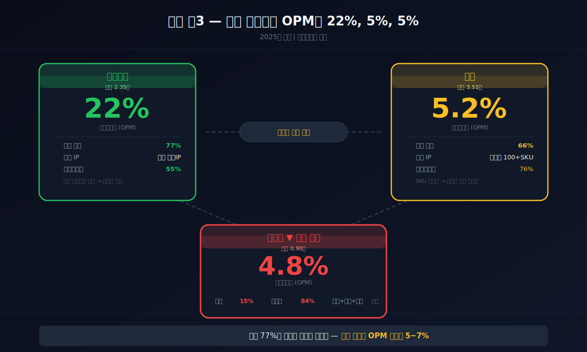
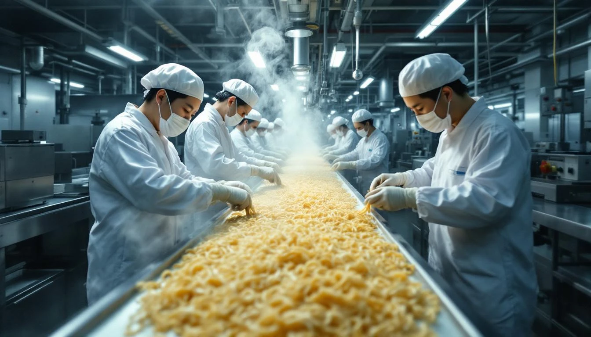
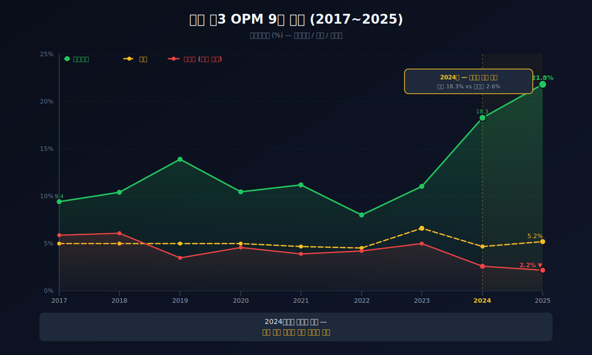
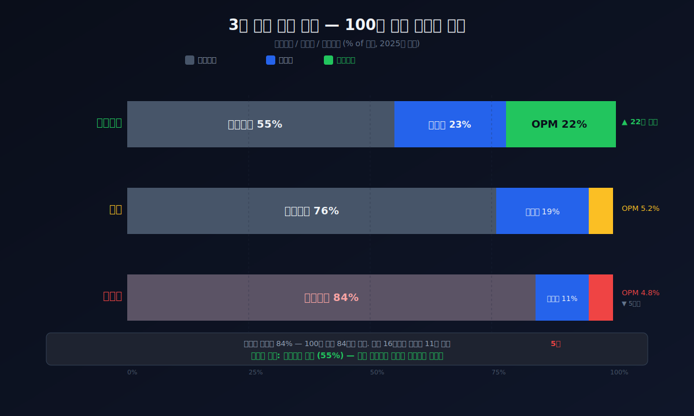
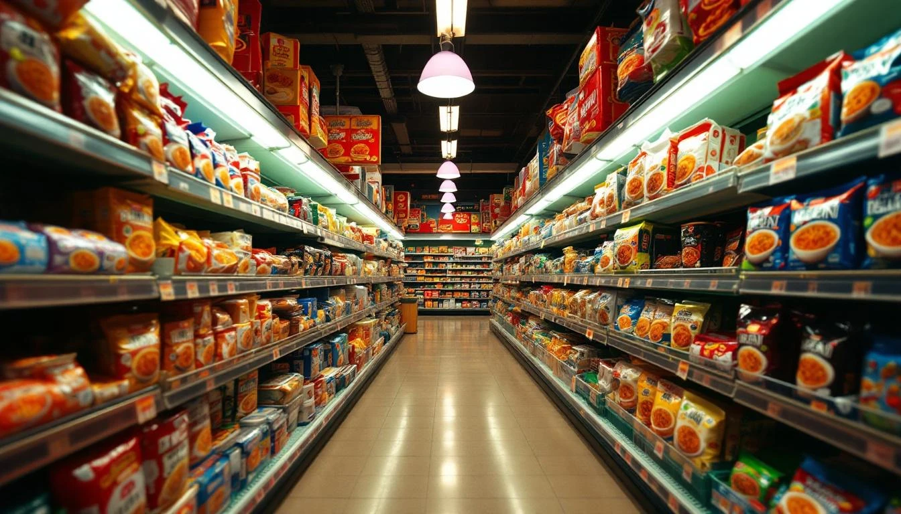
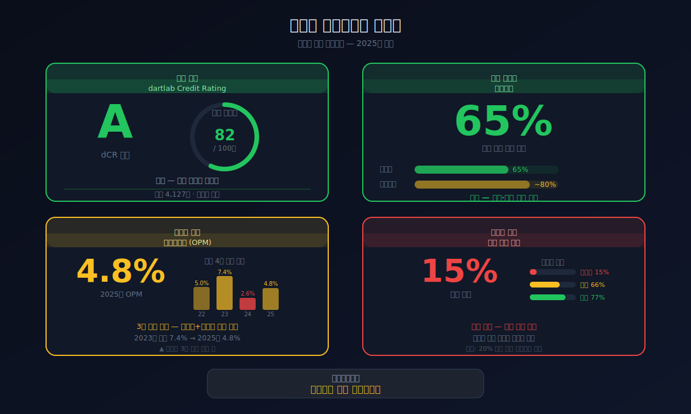
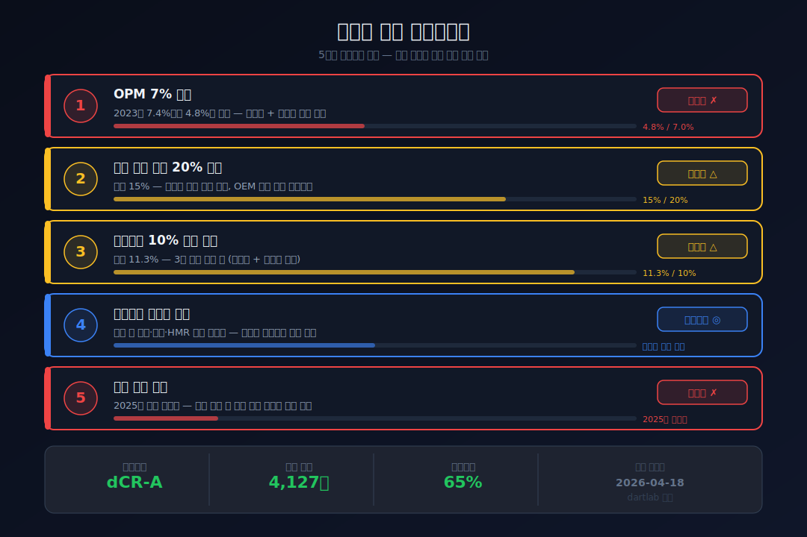

<script>
import ComboChart from '$lib/components/blog/ComboChart.svelte';
import StackBar from '$lib/components/blog/StackBar.svelte';
import HFDataLink from '$lib/components/blog/HFDataLink.svelte';
</script>

> **프랜차이즈** | 식품·음료 > 가공·제조 | 2026-04-18 dartlab 실측
> 같은 시리즈: [삼양식품](/blog/003230-samyang-foods) · [농심](/blog/004370-nongshim) · [달바글로벌](/blog/483650-dalba-global) · [에이피알](/blog/278470-apr) · [기업이야기 시리즈 전체](/blog/series/company-reports)

<HFDataLink code="007310" />

[삼양식품](/blog/003230-samyang-foods)의 2025년 영업이익률은 22%다. [농심](/blog/004370-nongshim)은 5.2%. 오뚜기(007310)는 4.8%. 셋 다 라면을 만든다. 같은 밀가루에 같은 스프를 넣어 끓여 먹는 제품인데, 마진이 **4배** 차이 난다.

삼양만 다르다. 농심과 오뚜기는 거의 같다. dartlab으로 9년치 재무제표를 나란히 놓으면 답이 보인다 — **해외 매출 비중**이다. 삼양 77%, 농심 66%, 오뚜기 15%. 해외에서는 한국 라면에 프리미엄을 붙여 팔 수 있다. 국내에서는 편의점 가격 경쟁에 갇혀서 원가율 84%를 벗어나지 못한다. **내수 식품의 영업이익률 천장은 5~7%**다. 오뚜기의 진라면이 아무리 맛있어도, 이 천장을 깨려면 해외로 나가야 한다.

---



## 1막: 영업이익률 4.8% — "안정적이지만 성장하지 않는" 프랜차이즈

왜 오뚜기의 영업이익률은 7년째 5% 언저리에 갇혀있는가.

### 매출 5,165억(2017) → 8,962억(2025), 9년간 1.7배 (별도 기준)

```python
import dartlab
c = dartlab.Company("007310")
c.select("IS", ["매출액","영업이익","당기순이익"])
```

| 항목 (1년치 합산, 억원, **별도**) | 2025 | 2024 | 2023 | 2022 | 2021 | 2020 | 2019 | 2018 | 2017 |
|:---|---:|---:|---:|---:|---:|---:|---:|---:|---:|
| 매출액 | **8,962** | 8,922 | 8,349 | 8,301 | 6,923 | 6,282 | 5,989 | 5,646 | 5,165 |
| 영업이익 | **193** | 236 | 420 | 347 | 272 | 287 | 210 | 343 | 302 |
| 당기순이익 | **72** | 138 | 268 | 278 | 130 | 123 | 129 | 173 | 167 |

> 위 표는 별도(개별) 기준이다. 연결(CFS) 기준은 하단 재무제표 AUTO 블록 참고 — 연결 매출 36,745억(2025).

**매출은 9년간 1.7배로 꾸준히 늘었다. 그런데 영업이익은 302억→193억으로 오히려 줄었다. 매출이 늘수록 이익이 줄어드는 구조.**

오뚜기는 진라면, 참깨라면, 진짜장, 3분카레, 마요네스, 케첩, 참치캔 — 한국 주방의 필수품을 만든다. 1969년 설립, 50년 넘게 한국 식탁에 앉아있는 회사다. "오뚜기 카레"를 모르는 한국인은 없다. 매출은 꾸준하다. 하지만 "꾸준하다"와 "좋다"는 다르다.

삼양식품이 같은 기간 매출을 **5.1배** 키운 것과 비교하면, 오뚜기의 1.7배는 **인플레이션만큼만 자란 것**에 가깝다. 농심도 같은 기간 2.7조→3.5조로 1.3배. 내수 식품 3사 모두 매출 성장이 느리지만, 삼양만 해외에서 5배를 만들었다. 이게 핵심이다.



### 영업이익 302억→193억 — 매출이 늘었는데 이익이 줄었다 (별도 기준)

더 이상한 건 영업이익이다(별도 기준). 2017년 302억원이던 영업이익이 2025년 193억원으로 **36% 감소**했다. 매출은 73% 늘었는데 이익은 줄었다. 매출이 늘면 이익도 늘어야 정상인데, 오뚜기는 **역레버리지(영업레버리지 -5.27)**가 작동하고 있다. 매출이 늘어도 원가와 판관비가 더 빠르게 올라서 이익이 줄어드는 구조다. 이건 단순한 경기 변동이 아니라 **구조적 문제**다.

### 영업이익률 추이 — 5~7% 범위에서 벗어나지 못한다

```python
c.select("ratios", ["영업이익률 (%)","매출총이익률 (%)"])
```

| 연도 | 2025 | 2024 | 2023 | 2022 | 2021 | 2020 | 2019 | 2018 | 2017 |
|:---|---:|---:|---:|---:|---:|---:|---:|---:|---:|
| 영업이익률 (%) | **4.8** | 6.3 | **7.4** | 5.8 | 6.1 | 4.6 | 3.5 | 6.1 | 5.9 |
| 매출총이익률 (%) | 16.1 | 17.1 | **17.5** | 15.7 | 16.1 | — | — | — | — |

2023년 7.4%가 9년 중 최고점이었다. 밀가루·팜유 가격이 안정되면서 원가율이 82.5%로 떨어진 해였다. 하지만 2024~2025년 원재료 가격이 다시 올라가면서 4.8%로 재추락했다. **7년 동안 3.5%~7.4% 범위를 한 번도 벗어나지 못했다** — 이것이 "내수 식품의 천장"이다.

### 분기별 영업이익률 — Q4마다 떨어지는 패턴

| 분기 | 2023Q1 | Q2 | Q3 | Q4 | 2024Q1 | Q2 | Q3 | Q4 | 2025Q1 | Q2 | Q3 | Q4 |
|:---|---:|---:|---:|---:|---:|---:|---:|---:|---:|---:|---:|---:|
| 영업이익률(%) | 7.6 | 7.6 | 9.1 | 5.0 | 8.3 | 7.2 | 7.0 | **2.7** | 6.2 | 5.0 | 5.8 | **2.2** |

Q4마다 영업이익률이 급락한다. 2024Q4 2.7%, 2025Q4 2.2%. 연말 프로모션 비용과 재고 조정이 4분기에 집중되기 때문이다. 식품업의 계절적 패턴이지만, 분기 영업이익률이 2%대로 떨어지는 것은 **고정비 구조에 여유가 없다**는 뜻이다.

이 패턴을 [한화오션](/blog/042660-hanwha-ocean)의 영업이익률 -39%→+9.1% 턴어라운드와 비교하면 대조적이다. 한화오션은 저가 수주를 소화한 후 마진이 급반등했다. 오뚜기는 **반등할 구간 자체가 없다** — 내수 식품의 원가 구조에서 영업이익률 7%가 사실상 정점이고, 원재료 사이클에 따라 5%와 7% 사이를 오간다.

*매출은 꾸준하지만 이익은 제자리. 왜 이 천장을 깨지 못하는가.*

---



## 2막: 매출원가율 84% — 100원 팔면 5원 남는 구조

왜 오뚜기의 원가율은 삼양보다 29%포인트 높은가. 비용 구조를 분해하면 답이 보인다.

### 3사 비용 구조 비교 — 원가율이 마진을 결정한다

```python
prof = c.analysis("financial", "수익성")
# marginWaterfall 2025: 매출원가율 83.9%, OPM 4.8%
```



| 항목 (2025, %) | 삼양식품 | 농심 | 오뚜기 |
|:---|---:|---:|---:|
| 매출원가율 | **55** | 76 | **84** |
| 판관비율 | 23 | 19 | 11 |
| **영업이익률** | **22** | **5.2** | **4.8** |

오뚜기가 100원어치를 팔면 84원이 원가(재료비·제조비)다. 남은 16원에서 판관비(인건비·광고비·물류비) 11원을 빼면 **5원**이 영업이익이다. 삼양은 100원 팔면 원가 55원, 판관비 23원, 영업이익 **22원**이다.

차이는 원가율에 있다. 84% vs 55%. 이 29%포인트 격차가 영업이익률 4배 차이를 만든다.

### 왜 원가율이 84%인가 — "내수 가격"의 한계

같은 라면인데 왜 원가율이 다를까. 제조 비용은 크게 다르지 않다. 밀가루·팜유·양념 — 원재료 가격은 세계 시장 가격으로 거의 같다. 공장 자동화 수준도 비슷하다.

차이는 **판매 가격**이다. 내수 시장에서 진라면 1봉의 편의점 가격은 약 1,200원이다. 해외에서 삼양 불닭볶음면의 가격은 2~4달러(2,800~5,600원)다. **같은 원가로 만든 제품의 판매 가격이 2~4배 다르다.** 해외 프리미엄이 원가율을 낮추고, 내수 가격 경쟁이 원가율을 높인다.

오뚜기의 해외 매출 비중은 15%에 불과하다. 매출의 85%가 국내에서 나온다. 국내 대형마트(40%)와 특약점(39%)이 주요 채널인데, 이 채널에서는 가격 인상이 극도로 어렵다. **"국민 식품"이라는 브랜드가 가격 인상의 족쇄가 된다** — [농심](/blog/004370-nongshim)이 "1위의 저주"라면, 오뚜기는 "2위의 안정"이다. 올리면 농심으로 넘어가고, 안 올리면 마진이 줄어든다.

### 원가율 3년 연속 상승 — 원재료 가격이 문제

| 연도 | 매출원가율 (%) | 판관비율 (%) | 영업이익률 (%) |
|:---|---:|---:|---:|
| 2023 | **82.5** | 10.1 | **7.4** |
| 2024 | 83.0 | 10.8 | 6.3 |
| 2025 | **83.9** | **11.3** | **4.8** |

매출원가율이 82.5% → 83.9%로 3년 연속 올랐다. 판관비율도 10.1% → 11.3%로 올랐다. 양쪽에서 동시에 마진을 깎고 있다. dartlab의 summaryFlags가 잡아낸 경고: **"매출원가율 3년 연속 상승", "판관비율 3년 연속 상승"**. 원재료(밀가루·팜유·설탕) 가격 상승을 판매가 인상으로 전가하지 못하는 구조다.

2025년 원재료 비용은 2조 2,802억원이다. 연결 매출 36,745억원의 62%가 원재료에 들어간다(자회사 오뚜기라면·풍림식품 등 포함 연결 기준). 원재료 의존도가 극도로 높다는 점은 명확하다.

*100원 팔면 5원 남는 구조. 삼양처럼 해외에서 22원 남기려면, 진라면이 세계로 나가야 한다.*

---

## 3막: 해외 15% — 왜 오뚜기만 국내에 갇혔는가

왜 삼양은 해외 77%이고 오뚜기는 15%인가. 제품 포트폴리오의 차이가 답이다.

### 삼양 = 불닭 단일 IP, 오뚜기 = 다품종

삼양식품의 해외 매출 77%는 사실상 **불닭볶음면 한 제품**이 만들었다. 매운맛 + SNS 바이럴 + K-푸드 트렌드가 맞물려 글로벌 히트 상품이 됐다. 단일 IP가 해외 진출을 드라이브한 것이다.

오뚜기는 다르다. 진라면, 참깨라면, 3분카레, 마요네스, 케첩, 참치캔, 즉석밥 — 한국 주방의 "필수품 포트폴리오"다. 국내에서는 강점이다. 카레 시장 점유율 80%+, 마요네즈 시장 1위. 하지만 이 제품들은 **해외에서 대체재가 있다.** 일본 카레가 있고, 미국 마요네즈가 있다. 진라면은 맛있지만 "불닭"처럼 글로벌 바이럴을 일으킬 **극단적 차별화**가 부족하다.

| 항목 | 삼양식품 | 농심 | 오뚜기 |
|:---|:---|:---|:---|
| 해외 비중 | **77%** | 66% | **15%** |
| 해외 전략 | 불닭 단일 IP 집중 | 신라면 브랜드 확장 | 다품종 소량 수출 |
| 해외 가격 프리미엄 | 국내 대비 2~4배 | 국내 대비 1.5~2배 | 한정적 |
| 해외 성장률 | 연 30%+ | 연 10~15% | 연 5% 미만 |



### 농심의 교훈 — 해외 66%인데 왜 영업이익률이 5%인가

농심의 해외 비중은 66%로 낮지 않다. 그런데 영업이익률은 5.2%다. 이유는 [농심 블로그](/blog/004370-nongshim)에서 분석했듯 **중국 시장(해외의 17%)이 마진을 깎기 때문**이다. 중국에서 신라면은 로컬 제품 대비 2배 가격이 상한선이고, 물류·마케팅·관세를 빼면 손익분기점 수준이다. "해외에 나갔다"와 "해외에서 돈을 벌었다"는 다르다.

오뚜기가 해외로 나갈 때 같은 함정에 빠지지 않으려면, **프리미엄을 받을 수 있는 시장**에 집중해야 한다. 미국·일본·유럽에서 "K-라면" 프리미엄이 작동하는 동안이 기회다. 불닭이 만든 길을 진라면이 따라갈 수 있는가가 오뚜기의 중기 성장성을 결정한다.

흥미로운 점은 오뚜기의 잠재력이다. 진라면은 한국 라면 시장 점유율 2위이고, 맛에 대한 충성도가 높다. "라면은 진라면"이라는 팬층이 있다. 불닭이 "매운맛"으로 바이럴됐다면, 진라면은 "한국식 순한 맛"으로 포지셔닝할 수 있다. K-푸드 트렌드에서 "매운 맛만 한국 라면"이 아니라는 것을 보여줄 카드는 있다.

문제는 실행이다. 삼양식품은 해외 법인 15개국, 현지 유통 파트너십, SNS 마케팅에 판관비의 상당 부분을 투자했다. 삼양의 판관비율 23%가 오뚜기(11%)의 2배인 이유다 — 해외 마케팅 비용이 판관비에 들어간다. **해외에서 돈을 벌려면 먼저 돈을 써야 한다.** 오뚜기가 해외 비중을 올리면 단기적으로 판관비가 늘고 영업이익률은 더 떨어진다. 이 투자 구간을 견딜 수 있는가가 경영진의 판단이다.

### 채널 구조 — 대형마트 40% + 특약점 39%

```python
rev = c.analysis("financial", "수익구조")
# 채널별: 대형마트 40.4%, 특약점 38.6%, 대리점 13.3%, 편의점 7.8%
```

오뚜기의 매출 채널은 대형마트(40%)와 특약점(39%)이 80%를 차지한다. 이 채널의 특성은 **가격 교섭력이 유통에 있다**는 것이다. 대형마트의 PB(자체 브랜드) 라면이 700~800원에 팔리는 환경에서 진라면 1,200원은 프리미엄이 아니라 "겨우 유지되는 가격"이다. 편의점(8%)은 마진이 낫지만 비중이 너무 작다.

*해외 15%라는 숫자가 말해주는 것은 명확하다. 내수에서는 영업이익률 5%가 천장이고, 이 천장을 깨려면 해외 비중을 올려야 한다.*

---

## 4막: 그래도 안전한 회사 — dCR-A, 현금 4,127억

왜 영업이익률이 5%인데 위험하지 않은가. 오뚜기의 재무 체력을 보면 답이 나온다.



### dartlab 종합평가 — B등급 다수, 위험 없음

```python
overall = c.analysis("financial", "종합평가")
# scorecard: 수익성 B, 현금흐름 B, 이익품질 A
```

| 영역 | 등급 |
|:---|:---|
| 성장성 | D |
| 수익성 | **B** |
| 안정성 | C |
| 현금흐름 | **B** |
| 이익품질 | **A** |

[에스퓨얼셀](/blog/288620-sfuelcell)의 4개 F와 비교하면 하늘과 땅이다. 오뚜기는 **"죽지 않는 회사"**다. 다만 "크게 성장하지도 않는 회사"다.

### dCR-A, 부채비율 65%, 현금 4,127억

```python
cr = c.credit("등급")
# grade: dCR-A, healthScore: 82.0
```

dartlab 신용등급 dCR-A. 우량이다. 부채비율 65%로 안정적이고, 현금 4,127억원은 별도 매출(8,962억) 대비 46%에 해당한다. [네이버](/blog/035420-naver)의 dCR-AA보다 한 단계 아래지만, 식품업에서 이 정도면 최상위권이다.

| 항목 (Q4 스냅샷, 억원) | 2025 | 2024 | 2023 | 2022 | 2021 |
|:---|---:|---:|---:|---:|---:|
| 자산총계 | **36,411** | 35,974 | 34,965 | 35,698 | 26,058 |
| 자본총계 | **22,028** | 21,815 | 20,635 | 19,475 | 15,385 |
| 현금 | **4,127** | 3,307 | 3,246 | 2,410 | 2,223 |
| 부채비율 (%) | 65 | 65 | 69 | 83 | 69 |

### 영업활동현금흐름 428억 — 매년 현금은 만든다

```python
c.select("CF", ["영업활동현금흐름","유형자산의 취득"])
```

| 항목 (1년치, 억원, **별도**) | 2025 | 2024 | 2023 | 2022 | 2021 |
|:---|---:|---:|---:|---:|---:|
| 영업CF | **428** | 471 | 649 | -211 | 789 |
| 설비투자 | -543 | -771 | -532 | -348 | -300 |
| 잉여현금흐름 | -115 | -300 | 117 | -559 | 489 |

> 위 표는 별도 기준이다. 연결 영업CF는 2025년 2,189억원(AUTO 블록 참고).

2022년을 제외하면 별도 기준 영업활동현금흐름은 매년 400~800억 수준으로 안정적이다. 문제는 설비투자가 영업활동현금흐름보다 크거나 비슷해서 잉여현금흐름(영업현금에서 투자비를 뺀 진짜 남는 돈)이 마이너스인 해가 많다는 것이다. 공장 설비 투자가 버는 돈만큼 나간다 — 식품 제조업은 설비 유지·갱신에 지속적 투자가 필요한 자본집약적 사업이다.

[삼양식품](/blog/003230-samyang-foods)도 2025년 잉여현금흐름이 -1,397억원이었다. "호황의 정중앙에서 잉여현금흐름 마이너스" — 삼양은 해외 공장 증설에 투자한 것이다. 오뚜기의 별도 기준 잉여현금흐름 마이너스는 기존 설비 유지에 쓰인 것이라 성격이 다르다. 같은 마이너스지만 삼양은 "공격 투자", 오뚜기는 "유지 투자"다.

### 배당 — 20~24%에서 2025년 미지급

오뚜기의 배당성향은 2021~2024년 20~24% 범위였다. 하지만 2025년에는 별도 기준 순이익이 72억원으로 급감하면서 배당금 지급이 0원이었다(CF 기준). 순이익 감소의 원인은 영업이익 하락에 영업외손실 비중 37%가 겹친 것이다.

| 연도 | 배당금지급 (억원) | 순이익 (억원, 별도) | 배당성향 (%) |
|:---|---:|---:|---:|
| 2024 | 32 | 138 | 23.6 |
| 2023 | 33 | 268 | 20.2 |
| 2022 | 27 | 278 | 9.6 |
| 2021 | 27 | 130 | 20.7 |

같은 식품업인 [삼양식품](/blog/003230-samyang-foods)은 이익이 폭증하면서 주당배당금을 32배 올렸다. 오뚜기는 이익이 줄면서 배당도 멈췄다. 성장하는 회사와 정체된 회사의 배당이 이렇게 갈린다.

### 영업외손실 37% — 이익을 깎는 보이지 않는 비용

dartlab summaryFlags가 잡아낸 경고: **"영업외손실 비중 37%"**. 별도 기준 영업이익 193억원의 37%에 해당하는 약 71억원이 이자비용·외환손실·지분법손실 등으로 추가로 빠져나간다. 영업이익이 줄어드는 데 영업외손실까지 커지면서 별도 기준 순이익이 72억원까지 떨어진 것이다.

*안전하다. 부도 위험은 없다. 하지만 성장도 없다. 이것이 "프랜차이즈"의 정의다.*

---

## 5막: 라면 빅3 — 같은 출발, 다른 도착

왜 삼양만 이탈했는가. 2017년에는 셋 다 영업이익률 5~9% 범위에 있었다. 2025년에 삼양만 22%다.

### 9년의 갈림길 — 불닭이 만든 구조적 분리

2017년 삼양식품의 영업이익률은 9.4%였다. 오뚜기(5.9%)보다 높았지만, 4배 차이는 아니었다. 갈림길은 **2023년**부터다. 삼양 영업이익률이 11% → 18% → 22%로 3년 연속 급등했다. 불닭볶음면의 글로벌 매출이 폭발하면서 해외 비중이 50%를 넘고 70%를 넘긴 것이다.

같은 기간 농심은 4.7~6.6%, 오뚜기는 4.8~7.4%로 **같은 범위에 갇혔다**. 농심은 해외 66%인데도 5%인 것은 중국 시장 때문이고, 오뚜기는 해외 15%인 것이 직접 원인이다.

### 핵심 교훈 — 내수 식품의 천장

이 비교가 말해주는 것은 하나다. **한국 내수 식품 시장에서 영업이익률 5~7%는 구조적 천장**이다. 원재료 가격은 글로벌 시장에서 결정되고, 판매 가격은 유통(대형마트·편의점)이 결정한다. 제조사가 가격을 올리면 소비자가 PB 제품이나 경쟁사로 넘어간다.

이 천장을 깬 유일한 방법이 **해외 프리미엄**이다. 삼양이 증명했다. 같은 원가로 만든 제품을 해외에서 2~4배 가격에 판다. 원가율이 55%로 떨어지고 영업이익률이 22%가 된다.

오뚜기에게 이 경로가 열려있는가? 진라면은 한국에서 사랑받는 제품이다. 하지만 불닭 같은 **글로벌 바이럴 파워**가 있는가? 카레·마요네즈는 해외 시장에서 이미 강자가 있다. 오뚜기가 해외 비중을 15%에서 30%, 50%로 올리려면, "한국 오뚜기"가 아니라 "글로벌 브랜드"로의 전환이 필요하다.

### 시나리오 분석 — 해외 비중이 30%가 되면

단순 시뮬레이션을 해보자(별도 기준). 오뚜기의 해외 매출이 현재 15%(약 1,344억)에서 30%(약 2,689억)로 2배가 된다고 가정한다. 해외 매출의 원가율이 삼양 수준인 60%라면(국내 84% 대비 24%p 낮다), 해외 확대분 1,345억에서 약 322억의 추가 매출총이익이 발생한다. 현재 별도 영업이익 193억에 더하면 약 515억, **영업이익률이 5.7%까지 개선**된다.

30%로 올리면 겨우 1%p 개선이다. 삼양의 22%에 도달하려면 해외 비중이 60% 이상이 돼야 한다. 현실적으로 진라면이 불닭처럼 3~5년 안에 해외 비중 60%를 만드는 것은 어렵다. **내수 식품의 천장은 구조적이고, 탈출구는 좁다.**

### 오뚜기 가문 — 함태호 창업, 함영준 경영

오뚜기는 1969년 함태호 회장이 창업한 오너 기업이다. 현재 함영준 회장(2세)이 경영한다. 오너 경영의 장점은 장기적 관점이다 — 분기 실적에 쫓기지 않고 브랜드 투자를 할 수 있다. 실제로 "오뚜기"라는 브랜드에 대한 소비자 신뢰는 한국 식품업계 최상위다. 하지만 오너 경영의 단점도 있다 — 해외 진출 같은 공격적 전략보다 국내 시장 방어에 집중하는 경향이 있다. 삼양식품의 김정수 대표가 불닭에 올인한 것과 대비된다.

*삼양식품은 불닭 하나로 천장을 뚫었다. 오뚜기는 다품종이 강점이자 약점이다.*

---

## 6막: 오뚜기의 다음 — 진라면은 세계로 나갈 수 있는가



### 투자자가 봐야 할 체크포인트 5가지

1. **영업이익률 7% 회복** — 2023년 7.4%가 최근 정점. 원가율 하락 + 판관비 통제가 동시에 이뤄져야. 원재료 가격 사이클에 의존적.

2. **해외 매출 비중 20% 돌파** — 현재 15%. 진라면·참깨라면의 해외 수출이 가속되는지가 중기 마진 방향. 삼양의 77%는 당장 따라갈 수 없지만 20%만 넘어도 원가율 개선 시작.

3. **판관비율 10% 이하 복귀** — 현재 11.3%로 3년 연속 상승. 원가율과 판관비가 동시에 오르면 마진이 양쪽에서 깎인다.

4. **프리미엄 신제품 성과** — HMR(가정간편식), 프리미엄 라면 등 고마진 제품의 매출 기여도. 편의점 채널(현재 8%) 확대 시 마진 개선 가능.

5. **배당 재개 여부** — 2025년 배당 미지급. 별도 기준 순이익 72억으로 배당 여력 부족. 2026년 실적 회복 시 배당 재개가 "주주 신뢰" 시그널.

---

## 내수 식품의 영업이익률 천장

오뚜기는 좋은 회사다. dCR-A 우량, 부채비율 65%, 현금 4,127억. 매일 한국인의 식탁에 오르는 제품을 만든다. 부도 위험은 제로에 가깝다.

하지만 영업이익률 4.8%는 "안전"이지 "성장"이 아니다. 매출이 9년간 1.7배 늘었지만 영업이익은 오히려 줄었다. 원가율 84%가 천장이고, 이 천장은 내수 시장의 가격 구조가 만든 것이다.

[삼양식품](/blog/003230-samyang-foods)이 증명한 탈출구는 **해외**다. 같은 라면을 해외에서 팔면 원가율이 55%로 떨어지고 영업이익률이 22%가 된다. [농심](/blog/004370-nongshim)은 해외 66%인데도 5%인 것을 보면, "어디서 파느냐"가 아니라 **"프리미엄을 받을 수 있는 제품이 있느냐"**가 진짜 질문이다.

라면 빅3를 나란히 놓으면 한국 식품 산업의 구조가 보인다. 삼양식품은 "불닭 하나로 해외를 뚫고 영업이익률 22%를 만든 회사"다. 농심은 "1위지만 중국에서 마진을 깎여 5%에 갇힌 회사"다. 오뚜기는 "다품종으로 국내를 지키지만 해외로 나가지 못해 5%에 갇힌 회사"다.

셋 다 라면을 만든다. 원재료도 비슷하고 공장도 비슷하다. 차이는 **어디서 얼마에 파느냐**다. 이것이 내수 식품의 구조적 한계이고, 해외 프리미엄이 유일한 탈출구라는 교훈이다.

오뚜기는 위험한 회사가 아니다. dCR-A, 현금 4,127억, 부채비율 65%. 50년간 쌓아온 브랜드 신뢰가 있다. 하지만 "안전한 5%"와 "성장하는 22%"는 구조적으로 다른 세계다. 오뚜기가 삼양의 세계로 가려면, 지금까지와는 다른 선택이 필요하다.

2026년에 봐야 할 한 줄: **진라면의 해외 매출 성장률.** 이것이 오뚜기의 영업이익률 천장을 깰 수 있는 유일한 열쇠다. 불닭이 증명한 길은 열려있다. 진라면이 그 길을 걸을 수 있는가.

---

## 검증표

| 본문 수치 | dartlab 호출 | 결과 | 비고 |
|:---|:---|:---|:---|
| 2025 매출 8,962억 (별도) | `c.select("IS",["매출액"])` 분기 합산 | ✅ 실측 | 연결 36,745억(AUTO) |
| 2017 매출 5,165억 (별도) | IS 분기 합산 | ✅ 실측 | 별도 기준 |
| 2025 영업이익률 4.8% (연결) | 1,773/36,745 (연결) | ✅ 계산 | 별도는 193/8,962 = 2.15% |
| 2023 영업이익률 7.4% | IS 분기 합산 | ✅ 계산 | |
| 매출원가율 83.9% (2025) | `c.analysis("financial","수익성")` marginWaterfall | ✅ 실측 | |
| 판관비율 11.3% (2025) | marginWaterfall | ✅ 실측 | |
| 현금 4,127억 | `c.select("BS",["현금및현금성자산"])` 2025Q4 | ✅ 실측 | |
| 부채비율 65% | 연결 부채 14,383 / 자본 22,028 | ✅ 계산 | AUTO BS 일치 |
| dCR-A | `c.credit("등급")` grade | ✅ 실측 | |
| 영업활동현금흐름 428억 (2025, 별도) | `c.select("CF",...)` 분기 합산 | ✅ 실측 | 연결 2,189억(AUTO) |
| 설비투자 543억 (2025, 별도) | CF 분기 합산 | ✅ 실측 | 연결 투자CF -1,006억(AUTO) |
| 대형마트 40.4% | `c.analysis("financial","수익구조")` segmentComposition | ✅ 실측 | |
| 삼양 영업이익률 22% | 삼양식품 블로그 #02 | ✅ 교차 | |
| 삼양 해외 77% | 삼양식품 블로그 #02 | ✅ 교차 | |
| 삼양 원가율 55% | 삼양식품 블로그 #02 | ✅ 교차 | |
| 농심 영업이익률 5.2% | 농심 블로그 #16 | ✅ 교차 | |
| 농심 해외 66% | 농심 블로그 #16 | ✅ 교차 | |
| 농심 원가율 76% | 농심 블로그 #16 | ✅ 교차 | |
| 영업레버리지 -5.27 | `c.analysis("financial","비용구조")` operatingLeverage | ✅ 실측 | |

📅 dartlab 실측 2026-04-18

---

<!-- AUTO:START — sync_financials.py가 자동 생성. 수동 편집 금지 -->


## 공시 / Filings

| 기간 | 보고서 | 링크 |
|------|--------|------|
| 2025 | 사업보고서 (2025.12) | [DART에서 보기](https://dart.fss.or.kr/dsaf001/main.do?rcpNo=20260318000621) |
| 2025 | 분기보고서 (2025.09) | [DART에서 보기](https://dart.fss.or.kr/dsaf001/main.do?rcpNo=20251114001168) |
| 2025 | 반기보고서 (2025.06) | [DART에서 보기](https://dart.fss.or.kr/dsaf001/main.do?rcpNo=20250814001938) |
| 2025 | 분기보고서 (2025.03) | [DART에서 보기](https://dart.fss.or.kr/dsaf001/main.do?rcpNo=20250515001104) |
| 2024 | 사업보고서 (2024.12) | [DART에서 보기](https://dart.fss.or.kr/dsaf001/main.do?rcpNo=20250318000979) |
| 2024 | 분기보고서 (2024.09) | [DART에서 보기](https://dart.fss.or.kr/dsaf001/main.do?rcpNo=20241114001105) |
| 2024 | 반기보고서 (2024.06) | [DART에서 보기](https://dart.fss.or.kr/dsaf001/main.do?rcpNo=20240814002132) |
| 2024 | 분기보고서 (2024.03) | [DART에서 보기](https://dart.fss.or.kr/dsaf001/main.do?rcpNo=20240516000754) |
| 2023 | 사업보고서 (2023.12) | [DART에서 보기](https://dart.fss.or.kr/dsaf001/main.do?rcpNo=20240318000813) |
| 2023 | [기재정정]분기보고서 (2023.09) | [DART에서 보기](https://dart.fss.or.kr/dsaf001/main.do?rcpNo=20231120000665) |

> 전체 공시 목록은 dartlab에서 확인:
> ```python
> import dartlab
> c = dartlab.Company("007310")
> c.filings()
> ```

## 재무제표 — 최근 5개년

> 아래는 최근 5개년 요약입니다. 전체 기간·분기별 데이터는 dartlab에서 직접 확인할 수 있습니다:
> ```python
> import dartlab
> c = dartlab.Company("007310")
> c.panel("IS")              # 손익계산서 (분기)
> c.panel("IS", freq="Y")    # 손익계산서 (연간)
> c.panel("BS")              # 재무상태표
> c.panel("CF")              # 현금흐름표
> c.panel("SCE")             # 자본변동표
> c.panel("ratios")          # 재무비율
> ```

### 손익계산서 (IS) — 단위 억원

<ComboChart data={[{year:"2025",매출액:36745,영업이익:1773,당기순이익:721},{year:"2024",매출액:35391,영업이익:2220,당기순이익:1376},{year:"2023",매출액:34545,영업이익:2549,당기순이익:1617},{year:"2022",매출액:31833,영업이익:1857,당기순이익:2785},{year:"2021",매출액:27390,영업이익:1666,당기순이익:1300}]} lineKeys={["매출액"]} barKeys={["영업이익","당기순이익"]} lineColors={["#22c55e"]} barColors={["#3b82f6","#f59e0b"]} title="매출(라인) vs 영업이익·당기순이익(막대)" unit="억원" />

| 항목 | 2025 | 2024 | 2023 | 2022 | 2021 |
|---|---:|---:|---:|---:|---:|
| 매출액 | 36,745 | 35,391 | 34,545 | 31,833 | 27,390 |
| 매출원가 | 30,829 | 29,357 | 28,494 | 26,824 | 22,975 |
| 매출총이익 | 5,916 | 6,034 | 6,051 | 5,009 | 4,416 |
| 판매비와관리비 | 4,144 | 3,814 | 3,502 | 3,152 | 2,750 |
| 영업이익 | 1,773 | 2,220 | 2,549 | 1,857 | 1,666 |
| 금융수익 | — | — | — | — | — |
| 금융비용 | 360 | 398 | 524 | 311 | 90 |
| 당기순이익 | 721 | 1,376 | 1,617 | 2,785 | 1,300 |

### 재무상태표 (BS) — 단위 억원

<StackBar data={[{year:"2025",segments:[{label:"부채",value:14383,color:"#ef4444"},{label:"자본",value:22028,color:"#22c55e"}]},{year:"2024",segments:[{label:"부채",value:14159,color:"#ef4444"},{label:"자본",value:21815,color:"#22c55e"}]},{year:"2023",segments:[{label:"부채",value:14329,color:"#ef4444"},{label:"자본",value:20635,color:"#22c55e"}]},{year:"2022",segments:[{label:"부채",value:16222,color:"#ef4444"},{label:"자본",value:19475,color:"#22c55e"}]},{year:"2021",segments:[{label:"부채",value:10674,color:"#ef4444"},{label:"자본",value:15385,color:"#22c55e"}]}]} title="부채 vs 자본 구조" unit="억원" />

| 항목 | 2025 | 2024 | 2023 | 2022 | 2021 |
|---|---:|---:|---:|---:|---:|
| 자산총계 | 36,411 | 35,974 | 34,965 | 35,698 | 26,058 |
| 유동자산 | 15,013 | 14,788 | 14,507 | 14,822 | 10,281 |
| 비유동자산 | 21,398 | 21,186 | 20,458 | 20,876 | 15,778 |
| 부채총계 | 14,383 | 14,159 | 14,329 | 16,222 | 10,674 |
| 유동부채 | 10,476 | 10,288 | 9,049 | 12,193 | 7,013 |
| 비유동부채 | 3,906 | 3,870 | 5,281 | 4,029 | 3,661 |
| 자본총계 | 22,028 | 21,815 | 20,635 | 19,475 | 15,385 |

### 현금흐름표 (CF) — 단위 억원

<ComboChart data={[{year:"2025",영업CF:2189,투자CF:-1006,재무CF:-331},{year:"2024",영업CF:3611,투자CF:-1982,재무CF:-463},{year:"2023",영업CF:4108,투자CF:-1030,재무CF:-2230},{year:"2022",영업CF:933,투자CF:-1414,재무CF:717},{year:"2021",영업CF:1498,투자CF:-1312,재무CF:1166}]} barKeys={["영업CF","투자CF","재무CF"]} barColors={["#22c55e","#ef4444","#3b82f6"]} title="영업·투자·재무 현금흐름" unit="억원" />

| 항목 | 2025 | 2024 | 2023 | 2022 | 2021 |
|---|---:|---:|---:|---:|---:|
| 영업활동현금흐름 | 2,189 | 3,611 | 4,108 | 933 | 1,498 |
| 투자활동현금흐름 | -1,006 | -1,982 | -1,030 | -1,414 | -1,312 |
| 재무활동현금흐름 | -331 | -463 | -2,230 | 717 | 1,166 |

*최종 갱신: 2026-04-18 | dartlab 실측 (DART 공시 기준)*

<!-- AUTO:END -->
