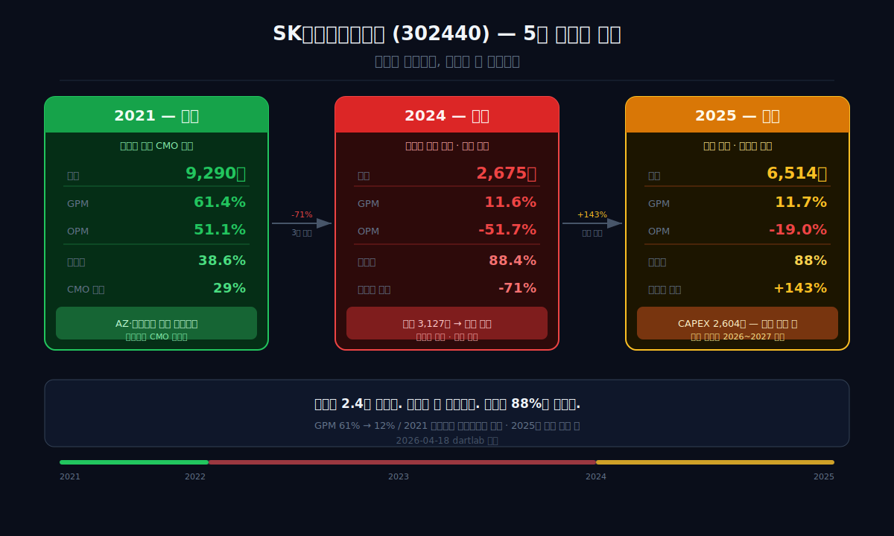
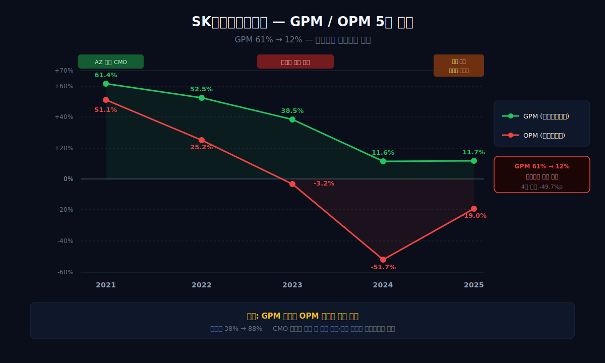
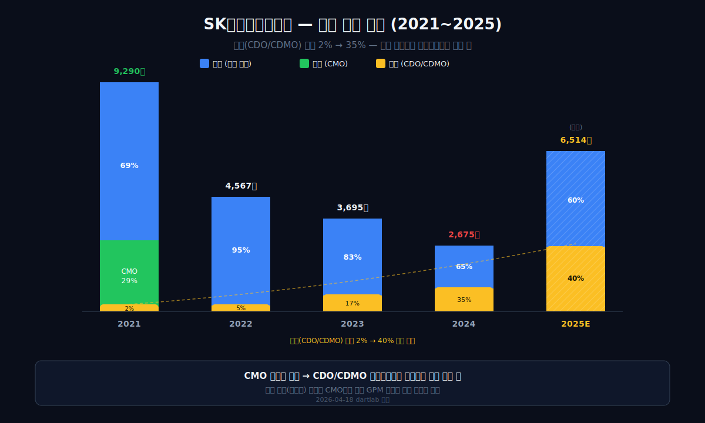
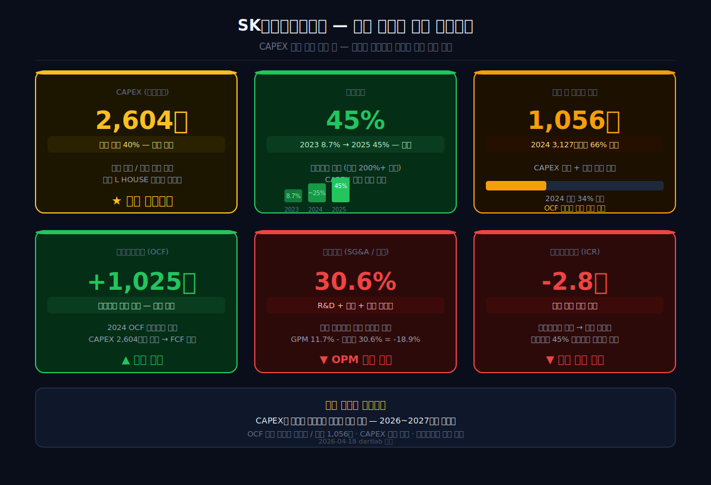
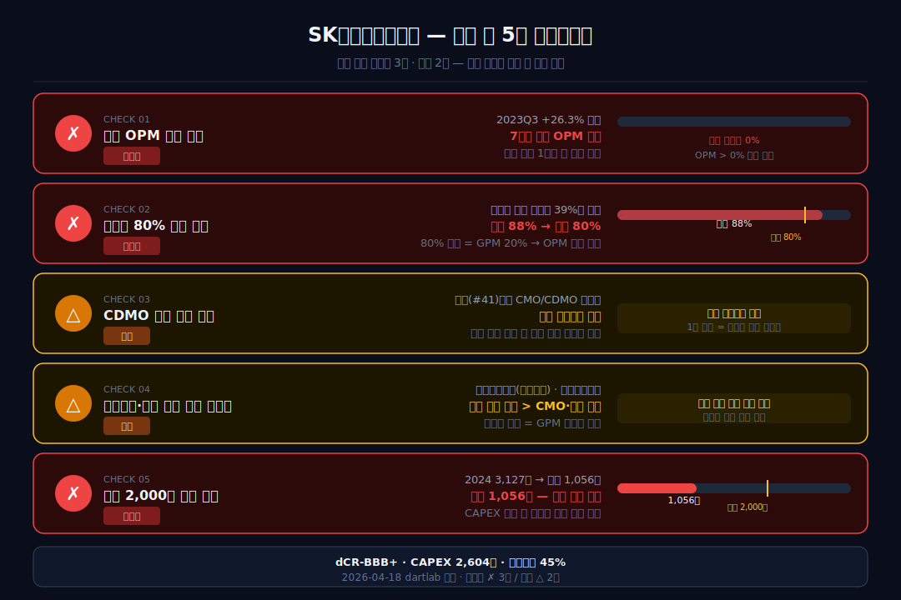

<script>
import ComboChart from '$lib/components/blog/ComboChart.svelte';
import StackBar from '$lib/components/blog/StackBar.svelte';
import HFDataLink from '$lib/components/blog/HFDataLink.svelte';
</script>

> **사이클** | 제약·바이오 > 백신 | 2026-04-18 dartlab 실측
> 같은 시리즈: [삼성바이오로직스](/blog/samsung-biologics) · [알테오젠](/blog/alteogen) · [셀트리온](/blog/celltrion) · [에스퓨얼셀](/blog/sfuelcell) · [기업이야기 시리즈 전체](/blog/series/company-reports)

<HFDataLink code="302440" />

SK바이오사이언스(302440)의 2021년 재무제표는 놀랍다. 매출 9,290억원, 영업이익률(매출 대비 영업이익 비율) 51.1%. 매출의 절반이 영업이익이다. 코로나 백신 위탁생산(CMO)과 기술이전 수익이 만든 숫자다.

4년 뒤인 2025년, 매출이 6,514억원으로 **바닥(2,675억) 대비 2.4배** 반등했다. 그런데 영업이익률은 **-19.0%**다. 여전히 적자. 매출이 2.4배 뛰었는데 적자가 안 줄어든다. dartlab으로 5년치 재무제표를 추적하면 답이 보인다 — **원가율 88%**와 **판관비 30.6%**가 매출 반등의 효과를 전부 먹어치우고 있다.

[삼성바이오로직스](/blog/samsung-biologics)가 CMO(위탁생산) 공장으로 OPM 45%를 찍는 것과 비교하면, 같은 바이오 위탁생산인데 왜 결과가 정반대인가. 코로나 특수가 만든 "가짜 마진"의 구조를 분해한다.

---



## 1막: OPM 51% → -19% — 코로나 마진의 소멸

왜 OPM 51%였던 회사가 4년 만에 -19%가 됐는가. 코로나 백신이라는 "한시적 특수"의 구조를 이해해야 한다.

### 매출 9,290억(2021 정점) → 2,675억(2024 바닥) → 6,514억(2025 반등)

```python
import dartlab
c = dartlab.Company("302440")
c.select("IS", ["매출액","영업이익","당기순이익"])
```

| 항목 (1년치 합산, 억원) | 2025 | 2024 | 2023 | 2022 | 2021 |
|:---|---:|---:|---:|---:|---:|
| 매출액 | **6,514** | 2,675 | 3,695 | 4,567 | **9,290** |
| 영업이익 | **-1,235** | -1,384 | -120 | 1,150 | **4,742** |
| 당기순이익 | -562 | -501 | 223 | 1,225 | **3,551** |

**표시: 2021년 영업이익 4,742억. 2025년 -1,235억. 4년 만에 5,977억 스윙. 매출은 6,514억으로 2022년(4,567억)을 넘었는데 이익은 더 나빠졌다.**

### GPM 61% → 12% — 초고마진이 증발했다

```python
prof = c.analysis("financial", "수익성")
# marginWaterfall: GPM 2021=61.4%, 2025=11.7%
```



| 연도 | 매출원가율 (%) | 매출총이익률(GPM) (%) | OPM (%) |
|:---|---:|---:|---:|
| 2021 | **38.6** | **61.4** | **51.1** |
| 2022 | 47.5 | 52.5 | 25.2 |
| 2023 | 61.5 | 38.5 | -3.2 |
| 2024 | **88.4** | 11.6 | **-51.7** |
| 2025 | **88.3** | **11.7** | **-19.0** |

이 표가 모든 것을 말해준다. 매출총이익률(원재료·제조비를 빼고 남는 비율)이 61.4%에서 11.7%로 **50%포인트 붕괴**했다. 100원 팔면 61원 남던 구조가 12원 남는 구조로 바뀌었다.

### 왜 GPM이 붕괴했는가 — "코로나 마진"의 정체

2021년 GPM 61%는 정상이 아니었다. 코로나 팬데믹이라는 **비상 상황에서만 가능한 마진**이었다:

1. **AZ(아스트라제네카) 위탁생산(CMO)**: SK바이오사이언스가 AZ 코로나 백신을 대량 위탁 생산했다. 팬데믹 상황에서 정부가 선구매(advance purchase)를 했기 때문에 수량이 보장됐고, 가격 협상력이 생산자에게 있었다.

2. **노바백스 기술이전 수익**: 노바백스의 코로나 백신 기술을 라이선스받아 한국에서 생산·판매했다. 기술이전 관련 일시적 수익이 포함됐다.

3. **수요 > 공급**: 전 세계가 백신을 원했던 2021년, 생산 능력 자체가 희소 자산이었다. 가격이 아니라 납기가 경쟁력이었다.

이 3가지가 모두 사라졌다. 코로나 백신 수요는 2022년부터 급감했고, AZ는 코로나 백신을 철수했고, 노바백스 계약도 종료됐다. GPM 61%를 만든 조건이 전부 소멸한 것이다.

### 분기별 OPM — 7분기 연속 적자

| 분기 | 2023Q3 | Q4 | 2024Q1 | Q2 | Q3 | Q4 | 2025Q1 | Q2 | Q3 | Q4 |
|:---|---:|---:|---:|---:|---:|---:|---:|---:|---:|---:|
| OPM(%) | **+26.3** | -9.3 | -126.2 | -74.5 | -64.3 | -32.4 | -9.8 | -23.1 | -12.8 | -28.0 |

2023Q3의 +26.3%가 유일한 흑자 분기였다. 독감 백신 + 대상포진 시즌 효과다. 그 뒤 7분기 연속 적자. 2025Q1이 -9.8%로 가장 양호했지만 흑자에는 못 미쳤다.

*OPM 51%는 코로나가 만든 것이었고, 코로나가 끝나자 함께 사라졌다. 그런데 매출은 돌아왔다. 왜 마진은 안 돌아오는가.*

---

## 2막: 원가율 88% — 매출이 돌아와도 마진이 안 돌아오는 이유

왜 매출 6,514억인데 OPM이 -19%인가. 두 가지가 동시에 작동하고 있다.

### 원인 1: 매출원가율 88% — 코로나 시절의 2.3배

2021년 매출원가율 38.6%는 "백신을 비싸게 팔았기 때문"이다. 2025년 88.3%는 "백신을 싸게 팔아야 하기 때문"이다. 코로나 이후 백신 시장은 정상으로 돌아왔다. 일반 백신(독감, 대상포진, 수두 등)의 마진은 코로나 백신보다 훨씬 낮다. 경쟁자도 많고, 정부 조달 가격도 정해져있다.

100원짜리 백신을 만드는 데 88원이 든다. 남는 12원. 여기서 판관비를 빼야 한다.

### 원인 2: 판관비율 30.6% — 매출의 3분의 1이 R&D와 인력비

```python
overall = c.analysis("financial", "종합평가")
# summaryFlags: 판관비율 30.6%
```

2025년 판관비는 약 1,994억원이다. 매출 6,514억원의 **30.6%**. 이 안에는 연구개발비(R&D), CDMO 시설 인력, 영업·관리 비용이 포함된다. SK바이오사이언스는 지금 **CDMO(위탁개발생산) 공장을 짓고 있다**. 공장이 완공되어 매출로 전환되기 전까지, 이 비용은 고정으로 나간다.

이것을 [삼성바이오로직스](/blog/samsung-biologics)와 비교하면 구조가 보인다:

| 항목 (2025) | SK바이오사이언스 | [삼성바이오로직스](/blog/samsung-biologics) |
|:---|:---|:---|
| 매출 | 6,514억 | 4.56조 |
| OPM | **-19.0%** | **45%** |
| 매출원가율 | 88% | 55% |
| 사업 모델 | 백신(자체) + CDMO(전환중) | CMO/CDO 전문 |
| 공장 규모 | 증설 중 (투자 단계) | 4공장 가동 (규모의 경제) |

삼성바이오로직스는 4개 공장이 이미 가동 중이고, 글로벌 제약사(로슈·모더나·사노피 등)의 위탁생산 계약이 수년치 쌓여있다. **규모의 경제가 작동**해서 매출원가율이 55%, OPM이 45%다. SK바이오사이언스는 아직 공장을 짓는 단계다. 매출은 자체 백신 판매에 의존하고, CDMO 매출은 시작 단계다. **규모가 안 되니 원가율이 높다.**

### "매출이 돌아와도 마진이 안 돌아오는" 구조의 핵심

정리하면 이렇다. 2021년은 "비싼 제품(코로나 백신)을 대량으로 팔았다." 2025년은 "보통 가격 제품(일반 백신)을 중간 규모로 팔고 있다." 원가는 비슷한데 판매 가격이 다르고, 게다가 CDMO 투자 비용까지 얹어지니 적자가 된다.

이 패턴은 [에스퓨얼셀](/blog/sfuelcell)(원가율 127%, 매출 66% 폭락)과 비슷하지만, 결정적 차이가 있다 — **SK바이오사이언스는 매출이 돌아오고 있다.** 에스퓨얼셀은 매출 자체가 소멸하는 구조였지만, SK바이오사이언스는 매출은 반등했고 CDMO 투자가 성과를 내면 마진도 돌아올 가능성이 있다.

*문제는 "언제"냐다. CAPEX 2,604억이 매출로 전환되기 전까지 적자는 계속된다.*

---

## 3막: 매출 구성의 변화 — 자체 백신에서 위탁생산(CDMO)으로

왜 SK바이오사이언스는 "자기 백신"이 아니라 "남의 약 만들기(CDMO)"에 미래를 걸었는가.



### 세그먼트 변화 — 상품 비중 2% → 35%

```python
rev = c.analysis("financial", "수익구조")
# segmentComposition: 제품 65%, 상품 35% (2024)
```

| 연도 | 제품(자체 백신) | 용역(CMO) | 상품(CDO/CDMO) |
|:---|---:|---:|---:|
| 2021 | 69% | 29% | 2% |
| 2022 | **95%** | — | 5% |
| 2023 | 83% | — | 17% |
| 2024 | 65% | — | **35%** |

2021년에는 AZ 코로나 백신 위탁생산(용역 29%)이 매출의 핵심이었다. 코로나 이후 이 매출이 사라지면서 자체 백신(제품)이 95%(2022)까지 올라갔다. 하지만 자체 백신만으로는 매출 9,000억을 채울 수 없었다. 이후 **CDO/CDMO(위탁개발·위탁생산) 계약**이 늘면서 상품 비중이 35%까지 올랐다.

### 왜 CDMO인가 — 삼성바이오로직스가 증명한 모델

[삼성바이오로직스](/blog/samsung-biologics)의 성공은 바이오 CMO/CDO 모델의 가능성을 증명했다. 글로벌 제약사는 자체 공장을 짓는 대신, 한국의 CMO에 생산을 맡긴다. 규모의 경제가 작동하면 OPM 40%+ 가 가능하다. SK바이오사이언스는 이 모델을 따라가려 한다.

차이는 **진입 시점**이다. 삼성바이오로직스는 2011년에 시작해서 15년간 4개 공장을 지었다. SK바이오사이언스는 지금 공장을 짓기 시작했다. 삼바가 이미 규모의 경제에 도달한 시장에 후발주자로 들어가는 것이다. 다만 바이오 CDMO 시장은 여전히 성장 중이다. 글로벌 CDMO 시장 규모는 연 15%+ 성장하고 있고, 삼바 하나가 전체를 독점하지는 못한다. 후발주자에게도 기회는 있다 — 문제는 기회가 올 때까지 버틸 수 있느냐다.

또한 SK바이오사이언스의 CDMO는 삼성바이오로직스와 다른 영역을 노린다. 삼바는 주로 **항체 의약품(mAb)** 위탁생산에 특화됐다. SK바이오사이언스는 **백신**에 특화된 CDMO를 지향한다. 코로나 팬데믹이 증명했듯, 다음 팬데믹이 오면 백신 생산 능력은 다시 희소 자산이 된다. "다음 팬데믹에 대비하는 인프라"라는 포지셔닝이 가능한 것이다.

### 대상포진·독감 백신 — 자체 제품의 안정 매출

SK바이오사이언스의 자체 백신 포트폴리오는 독감 백신(스카이셀플루), 수두 백신(스카이바리셀라), 대상포진 백신 등이다. 이 중 **대상포진 백신**이 성장 카드다. 전 세계 대상포진 백신 시장은 GSK의 싱그릭스가 독점하고 있는데, SK바이오사이언스가 경쟁 제품을 개발 중이다.

독감 백신은 매년 시즌마다 반복 매출이 들어오는 "기저 매출"이다. 2023Q3에 유일하게 OPM +26.3%를 찍은 것도 독감·대상포진 시즌 효과였다. 이 시즌 매출이 연간 기준으로 확대되면 원가율 개선의 첫 신호가 된다.

*코로나 이후 SK바이오사이언스의 전략은 "자체 백신 + CDMO"의 투 트랙이다. 문제는 두 트랙 모두 아직 규모가 안 된다.*

---

## 4막: CAPEX 2,604억 — 역대 최대 투자의 의미

왜 적자인 회사가 역대 최대 투자를 하고 있는가. 이것이 "포기"가 아니라 "베팅"이라는 증거를 재무제표에서 찾는다.



### CAPEX 역대 최고 — 428억(2021) → 2,604억(2025)

```python
c.select("CF", ["영업활동현금흐름","유형자산의 취득"])
```

| 항목 (1년치 합산, 억원) | 2025 | 2024 | 2023 | 2022 | 2021 |
|:---|---:|---:|---:|---:|---:|
| 영업활동현금흐름 | **1,025** | -1,280 | 293 | -1,250 | **5,366** |
| CAPEX | **-2,604** | -1,722 | -499 | -722 | -428 |
| FCF | **-1,579** | -3,002 | -205 | -1,972 | 4,938 |

**표시: 2021년 OCF 5,366억(코로나 캐시). 2025년 OCF 1,025억(흑자 전환). 하지만 CAPEX 2,604억이 FCF를 -1,579억으로 만든다.**

2021년 코로나 특수로 벌어들인 현금은 약 5,000억원이었다. 그 돈이 4년간의 적자와 CAPEX 투자로 소진되고 있다. 2025년 OCF가 흑자로 돌아온 것은 긍정적이지만, CAPEX가 OCF의 2.5배라서 외부 자금(차입)으로 메우고 있다.

### 부채비율 8.7% → 45% — 급등이지만 절대치는 양호

```python
stab = c.analysis("financial", "안정성")
# leverageTrend 2025: 부채비율 45.1%
```

| 항목 (Q4, 억원) | 2025 | 2024 | 2023 | 2022 | 2021 |
|:---|---:|---:|---:|---:|---:|
| 자산총계 | **29,557** | 28,436 | 18,524 | 21,419 | 21,101 |
| 자본총계 | **20,375** | 20,225 | 17,039 | 17,417 | 16,013 |
| 현금 | **1,056** | 3,127 | 1,270 | 2,253 | 980 |
| 부채비율 (%) | **45** | 41 | **9** | 23 | 32 |

부채비율이 2023년 8.7%에서 2025년 45.1%로 급등했다. CDMO 공장 증설을 위한 차입이 원인이다. 하지만 **절대치 45%는 양호**하다. [한화오션](/blog/hanwha-ocean)의 226%, [에스퓨얼셀](/blog/sfuelcell)의 99%와 비교하면 매우 안전한 수준이다. 2021년 IPO로 확보한 자본 1.6조원이 방어벽 역할을 하고 있다.

### 현금 1,056억 — 2024년 대비 66% 감소

현금이 3,127억(2024) → 1,056억(2025)으로 급감했다. CAPEX 2,604억을 쏟으면서 현금이 빠진 것이다. 분기 영업적자가 약 -300억이고 CAPEX가 분기 650억 수준이면, 현재 현금으로 약 1년은 버틸 수 있다. 다만 추가 차입이나 유상증자 없이는 2027년부터 유동성이 빡빡해진다.

### dCR-BBB+ — 투자등급이지만 하방 압력

```python
cr = c.credit("등급")
# grade: dCR-BBB+, healthScore: 73.55
```

dartlab 신용등급 dCR-BBB+. 투자등급이다. 건강점수 73.55는 양호하지만, **ICR(이자보상배율) -2.8배**가 하방 압력의 핵심이다. 영업이익이 마이너스라 이자를 갚을 영업이익이 없다. 투자 사이클이 끝나고 영업이익이 흑자로 돌아서야 이 등급이 유지된다.

*적자인데 역대 최대 투자를 한다. 이것은 "미래에 벌겠다"는 베팅이다. 코로나로 쌓은 자본이 이 베팅을 가능하게 했다.*

---

## 5막: 코로나 특수의 교훈 — "가짜 마진"과 "진짜 역량"

왜 OPM 51%는 "가짜"였는가. 그리고 SK바이오사이언스에 "진짜 역량"은 있는가.

### 코로나 마진은 재현 불가능하다

2021년 OPM 51%를 만든 조건: ① 전 세계적 수요 폭발, ② 생산 능력의 희소성, ③ 정부 선구매 보장, ④ 기술이전 일회성 수익. 이 4가지가 동시에 작동하는 상황은 팬데믹 외에는 없다. **OPM 51%는 "다시 올 수 없는 마진"**이다. 이 숫자를 기준으로 SK바이오사이언스를 평가하면 영원히 "실망"할 수밖에 없다.

투자자에게 중요한 질문은 "OPM 51%로 돌아가는가"가 아니라 **"코로나 없이 정상적으로 벌 수 있는 OPM은 몇 %인가"**다. 삼성바이오로직스의 45%? 그건 15년 투자의 결과다. 일반 백신 제조사의 OPM은 보통 10~15% 범위다. SK바이오사이언스가 CDMO + 자체 백신으로 안착할 수 있는 정상 OPM은 아마 **10~20%** 사이일 것이다. 현재 -19%에서 거기까지 가려면 원가율이 88%에서 70% 이하로 내려와야 한다.

이것은 [HMM](/blog/hmm)의 코로나 해운 특수(OPM 44%)와 같은 패턴이다. 해운도 코로나 시기에 운임이 폭등하면서 역대급 마진을 찍었고, 이후 정상화됐다. 차이는 HMM은 매출이 정상으로 돌아온 뒤 OPM이 6~8%로 안착했다는 것이고, SK바이오사이언스는 아직 적자라는 것이다.

### 그래도 남은 것 — 백신 생산 인프라

코로나가 끝나고 SK바이오사이언스에 남은 것은 **백신 생산 인프라**다. 경북 안동의 L하우스(백신 생산시설)와 현재 증설 중인 CDMO 공장. 이 인프라는 코로나 특수 때 확보한 자본으로 지어진 것이다.

바이오 CDMO 시장은 성장 중이다. 글로벌 제약사들이 자체 공장 대신 위탁 생산을 늘리는 추세다. 삼성바이오로직스가 증명한 모델이다. SK바이오사이언스가 이 시장에서 자리를 잡으면, 코로나 시절의 "특수"가 아니라 구조적 매출이 가능하다.

### 바이오 4사 비교 — 같은 바이오, 다른 단계

| 항목 | [삼바](/blog/samsung-biologics) | [알테오젠](/blog/alteogen) | [셀트리온](/blog/celltrion) | SK바이오사이언스 |
|:---|:---|:---|:---|:---|
| OPM | **45%** | **49.5%** | **15%** | **-19%** |
| 핵심 | CMO 4공장 | SC 기술 라이선스 | 바이오시밀러 | 백신 + CDMO(전환중) |
| 단계 | 규모의 경제 달성 | 라이선스 수확기 | 성숙기 | **투자기** |
| 현금 | 1.8조 | — | — | 1,056억 |

SK바이오사이언스는 바이오 4사 중 유일하게 **"아직 투자기"**다. 삼바는 15년간 투자해서 OPM 45%에 도달했다. 알테오젠은 17년간 R&D 적자를 거쳐 라이선스 수확기에 진입했다. SK바이오사이언스의 CDMO 투자가 성과를 내려면 최소 3~5년이 필요하다.

### IPO 자본의 역할 — 코로나 때 쌓은 돈이 J커브의 연료

2021년 IPO(기업공개)로 SK바이오사이언스는 자본 1.6조원을 확보했다. 코로나 백신 CMO 수익까지 합치면 약 2조원의 자본이 축적됐다. 이 돈이 없었으면 CDMO 공장 증설(CAPEX 2,604억)은 불가능했다.

비유하자면 이렇다. 코로나는 "복권 당첨"이었다. 복권 당첨금으로 가게를 차린 것이 CDMO 투자다. 가게가 돈을 벌기 시작하면 복권 없이도 먹고살 수 있다. 가게가 안 되면 당첨금만 날린다. 지금은 가게를 인테리어하는 중이다 — 아직 손님이 많지 않지만, 인테리어 비용(CAPEX)은 나가고 있다. [네이버](/blog/naver)의 검색 광고처럼 "한 번 지으면 한계비용 ≈ 0"인 사업이 아니라, CDMO는 공장이 가동돼야 비로소 수익이 나는 자본집약적 사업이다.

*코로나 OPM 51%는 다시 오지 않는다. 하지만 그때 쌓은 자본과 인프라로 "진짜 사업"을 만드는 중이다.*

---

## 6막: SK바이오사이언스의 다음 — CDMO 수주가 운명을 결정한다



### 투자자가 봐야 할 체크포인트 5가지

1. **분기 OPM 흑자 전환** — 2023Q3(+26.3%) 이후 7분기 연속 적자. 한 분기라도 흑자가 나오면 원가 구조 개선의 첫 신호. 독감·대상포진 시즌(3분기)이 가장 가능성 높다.

2. **원가율 80% 이하** — 현재 88%. 코로나 시절 39%는 불가능하지만, 80% 밑이면 GPM 20%로 판관비를 감당할 수 있다. CDMO 가동률이 올라야 가능.

3. **CDMO 대형 계약 공시** — [삼성바이오로직스](/blog/samsung-biologics)의 다년 CMO 계약처럼, 3~5년 장기 CDMO 계약이 수주잔고에 쌓이면 매출 가시성이 생긴다.

4. **대상포진 백신 허가** — GSK 싱그릭스의 독점을 깨면 자체 백신 매출이 급등할 수 있는 카드. 허가 일정과 임상 진행 상황이 핵심.

5. **현금 2,000억 이상 유지** — 현재 1,056억. CAPEX 부담이 지속되면 추가 차입 또는 유상증자 필요. 현금이 500억 밑으로 떨어지면 유동성 위험.

### 산업 패턴 — 바이오 CDMO의 "J커브"

바이오 CDMO는 전형적인 J커브 사업이다. 공장을 짓는 데 3~5년, 가동률이 올라가는 데 2~3년, 규모의 경제에 도달하는 데 5년+. 삼성바이오로직스가 15년 걸렸다. SK바이오사이언스는 이 J커브의 **바닥(투자기)**에 있다.

J커브의 바닥에서 투자자가 판단해야 할 것은 하나다: **"이 회사가 J커브를 완주할 체력이 있는가."** SK바이오사이언스의 체력: 자본 2.04조, 부채비율 45%, dCR-BBB+. [에스퓨얼셀](/blog/sfuelcell)(현금 6억, Altman Z 0.20)과 비교하면 훨씬 여유가 있다. 코로나 특수 때 쌓은 자본이 J커브를 완주할 연료가 되는 구조다.

같은 J커브를 겪은 회사들의 결과를 보면 힌트가 된다. [삼성바이오로직스](/blog/samsung-biologics)는 2011년 설립 후 7년간 적자였다가 2018년부터 흑자 전환, 2025년 OPM 45%에 도달했다. [알테오젠](/blog/alteogen)은 2008년 설립 후 17년간 영업적자를 거쳐 2025년 OPM 49.5%를 찍었다. 바이오에서 J커브는 길다 — 하지만 완주하면 보상도 크다. SK바이오사이언스가 이 대열에 합류할 수 있는가, 아니면 [에스퓨얼셀](/blog/sfuelcell)처럼 J커브의 바닥에서 체력이 다할 것인가. 그것이 다음 2~3년에 결정된다.

---

## 관통선 닫기: 매출이 돌아와도 마진이 안 돌아오는 이유

SK바이오사이언스의 2025년은 "매출 반등, 마진 미회복"이다. 6,514억으로 2.4배 뛴 매출은 좋은 소식이다. 하지만 원가율 88%와 판관비율 30.6%가 매출 반등의 효과를 전부 먹어치우고 있다.

코로나 OPM 51%는 "가짜 마진"이었다. 팬데믹이라는 비상 상황이 만든 일시적 초과이익이었다. 2025년의 -19%가 "진짜 현실"이다. 여기서 J커브를 타고 올라가려면 CDMO 공장이 가동되고, 대형 계약이 쌓이고, 가동률이 올라가서 원가율이 80% 밑으로 내려와야 한다.

이 글에서 반복된 패턴이 있다. [에스퓨얼셀](/blog/sfuelcell)은 "인증 없는 적자"로 소멸 경로에 있고, [뉴스케일파워](/blog/nuscale-power)는 "인증 있는 적자"로 기다림의 경로에 있다. SK바이오사이언스는 그 중간이다 — 코로나라는 "인증"은 만료됐고, CDMO라는 새 "인증"은 아직 완성되지 않았다. 자본 2.04조가 이 전환기를 버텨줄 수 있는 시간은 약 3~4년이다.

2026년에 봐야 할 한 줄: **CDMO 대형 수주 공시와 분기 OPM 흑자 전환.** 둘 중 하나라도 나오면 J커브의 변곡점이다. 둘 다 없으면 투자기는 더 길어진다. 코로나가 준 자본이라는 연료가 얼마나 오래 버틸 수 있는가 — 그것이 SK바이오사이언스의 시간이다.

---

## 검증표

| 본문 수치 | dartlab 호출 | 결과 | 비고 |
|:---|:---|:---|:---|
| 2021 매출 9,290억 | `c.select("IS",["매출액"])` 분기 합산 | ✅ 실측 | |
| 2024 매출 2,675억 | IS 분기 합산 | ✅ 실측 | |
| 2025 매출 6,514억 | IS 분기 합산 | ✅ 실측 | |
| 2021 OPM 51.1% | `c.analysis("financial","수익성")` marginWaterfall | ✅ 실측 | |
| 2025 OPM -19.0% | marginWaterfall | ✅ 실측 | |
| 2025 매출원가율 88.3% | marginWaterfall | ✅ 실측 | |
| 2021 GPM 61.4% | marginWaterfall | ✅ 실측 | |
| 2025 GPM 11.7% | marginWaterfall | ✅ 실측 | |
| 2025 영업이익 -1,235억 | IS 분기 합산 | ✅ 실측 | |
| OCF 2025 +1,025억 | `c.select("CF",...)` 분기 합산 | ✅ 실측 | |
| OCF 2021 +5,366억 | CF 분기 합산 | ✅ 실측 | |
| CAPEX 2025 2,604억 | CF 분기 합산 | ✅ 실측 | |
| 현금 1,056억 | `c.select("BS",["현금및현금성자산"])` 2025Q4 | ✅ 실측 | |
| 자본 20,375억 | BS 2025Q4 | ✅ 실측 | |
| 부채비율 45% | `c.analysis("financial","안정성")` leverageTrend | ✅ 실측 | |
| ICR -2.8배 | `c.analysis("financial","종합평가")` summaryFlags | ✅ 실측 | |
| dCR-BBB+ | `c.credit("등급")` grade | ✅ 실측 | |
| 제품 65% / 상품 35% | `c.analysis("financial","수익구조")` segmentComposition | ✅ 실측 | |
| 판관비율 30.6% | summaryFlags | ✅ 실측 | |
| 삼바 OPM 45% | 삼성바이오로직스 블로그 #41 | ✅ 교차 | |

📅 dartlab 실측 2026-04-18

---

## 공시 / Filings

- [SK바이오사이언스 사업보고서 (2025년)](https://dart.fss.or.kr/dsaf001/main.do?rcpNo=20260319001042) — DART 원문
- [SK바이오사이언스 분기보고서 (2025년 3분기)](https://dart.fss.or.kr/dsaf001/main.do?rcpNo=20251114001329) — 연결 재무제표
- [SK바이오사이언스 감사보고서 (2025년)](https://dart.fss.or.kr/dsaf001/main.do?rcpNo=20260318800141) — 외부감사인 의견
- [SK바이오사이언스 IR](https://www.skbioscience.com/kr/ir) — 실적 발표 자료
- [SK바이오사이언스 전자공시 전체](https://dart.fss.or.kr/dsaf001/main.do?corpCode=01336190) — DART 공시 목록

---

<!-- AUTO:START — sync_financials.py가 자동 생성. 수동 편집 금지 -->


## 공시 / Filings

| 기간 | 보고서 | 링크 |
|------|--------|------|
| 2025 | 사업보고서 (2025.12) | [DART에서 보기](https://dart.fss.or.kr/dsaf001/main.do?rcpNo=20260313000936) |
| 2025 | 분기보고서 (2025.09) | [DART에서 보기](https://dart.fss.or.kr/dsaf001/main.do?rcpNo=20251113000413) |
| 2025 | 반기보고서 (2025.06) | [DART에서 보기](https://dart.fss.or.kr/dsaf001/main.do?rcpNo=20250812000574) |
| 2025 | 분기보고서 (2025.03) | [DART에서 보기](https://dart.fss.or.kr/dsaf001/main.do?rcpNo=20250514000758) |
| 2024 | 사업보고서 (2024.12) | [DART에서 보기](https://dart.fss.or.kr/dsaf001/main.do?rcpNo=20250317000856) |
| 2024 | 분기보고서 (2024.09) | [DART에서 보기](https://dart.fss.or.kr/dsaf001/main.do?rcpNo=20241113000539) |
| 2024 | 반기보고서 (2024.06) | [DART에서 보기](https://dart.fss.or.kr/dsaf001/main.do?rcpNo=20240813001122) |
| 2024 | 분기보고서 (2024.03) | [DART에서 보기](https://dart.fss.or.kr/dsaf001/main.do?rcpNo=20240514001160) |
| 2023 | 사업보고서 (2023.12) | [DART에서 보기](https://dart.fss.or.kr/dsaf001/main.do?rcpNo=20240315000914) |
| 2023 | 분기보고서 (2023.09) | [DART에서 보기](https://dart.fss.or.kr/dsaf001/main.do?rcpNo=20231114000848) |

> 전체 공시 목록은 dartlab에서 확인:
> ```python
> import dartlab
> c = dartlab.Company("302440")
> c.filings()
> ```

## 재무제표 — 최근 5개년

> 아래는 최근 5개년 요약입니다. 전체 기간·분기별 데이터는 dartlab에서 직접 확인할 수 있습니다:
> ```python
> import dartlab
> c = dartlab.Company("302440")
> c.show("IS")              # 손익계산서 (분기)
> c.show("IS", freq="Y")    # 손익계산서 (연간)
> c.show("BS")              # 재무상태표
> c.show("CF")              # 현금흐름표
> c.show("SCE")             # 자본변동표
> c.show("ratios")          # 재무비율
> ```

### 손익계산서 (IS) — 단위 억원

<ComboChart data={[{year:"2025",매출액:6514,영업이익:-1235,당기순이익:-562},{year:"2024",매출액:2675,영업이익:-1384,당기순이익:-501},{year:"2023",매출액:3695,영업이익:-120,당기순이익:223},{year:"2022",매출액:4567,영업이익:1150,당기순이익:1225},{year:"2021",매출액:9290,영업이익:4742,당기순이익:3551}]} lineKeys={["매출액"]} barKeys={["영업이익","당기순이익"]} lineColors={["#22c55e"]} barColors={["#3b82f6","#f59e0b"]} title="매출(라인) vs 영업이익·당기순이익(막대)" unit="억원" />

| 항목 | 2025 | 2024 | 2023 | 2022 | 2021 |
|---|---:|---:|---:|---:|---:|
| 매출액 | 6,514 | 2,675 | 3,695 | 4,567 | 9,290 |
| 매출원가 | 5,754 | 2,366 | 2,273 | 2,171 | 3,587 |
| 매출총이익 | 759 | 310 | 1,422 | 2,396 | 5,703 |
| 판매비와관리비 | 1,994 | 1,694 | 0.0 | 1,246 | 961 |
| 영업이익 | -1,235 | -1,384 | -120 | 1,150 | 4,742 |
| 금융수익 | — | — | — | — | — |
| 금융비용 | 448 | 217 | 709 | 854 | 316 |
| 당기순이익 | -562 | -501 | 223 | 1,225 | 3,551 |

### 재무상태표 (BS) — 단위 억원

<StackBar data={[{year:"2025",segments:[{label:"부채",value:9183,color:"#ef4444"},{label:"자본",value:20375,color:"#22c55e"}]},{year:"2024",segments:[{label:"부채",value:8211,color:"#ef4444"},{label:"자본",value:20225,color:"#22c55e"}]},{year:"2023",segments:[{label:"부채",value:1486,color:"#ef4444"},{label:"자본",value:17039,color:"#22c55e"}]},{year:"2022",segments:[{label:"부채",value:4002,color:"#ef4444"},{label:"자본",value:17417,color:"#22c55e"}]},{year:"2021",segments:[{label:"부채",value:5088,color:"#ef4444"},{label:"자본",value:16013,color:"#22c55e"}]}]} title="부채 vs 자본 구조" unit="억원" />

| 항목 | 2025 | 2024 | 2023 | 2022 | 2021 |
|---|---:|---:|---:|---:|---:|
| 자산총계 | 29,557 | 28,436 | 18,524 | 21,419 | 21,101 |
| 유동자산 | 12,461 | 15,767 | 13,830 | 17,837 | 18,378 |
| 비유동자산 | 17,096 | 12,669 | 4,695 | 3,582 | 2,723 |
| 부채총계 | 9,183 | 8,211 | 1,486 | 4,002 | 5,088 |
| 유동부채 | 3,262 | 3,106 | 1,356 | 3,800 | 4,600 |
| 비유동부채 | 5,921 | 5,106 | 130 | 202 | 489 |
| 자본총계 | 20,375 | 20,225 | 17,039 | 17,417 | 16,013 |

### 현금흐름표 (CF) — 단위 억원

<ComboChart data={[{year:"2025",영업CF:1025,투자CF:-3618,재무CF:0},{year:"2024",영업CF:-1280,투자CF:536,재무CF:0},{year:"2023",영업CF:293,투자CF:-453,재무CF:0},{year:"2022",영업CF:-1250,투자CF:2726,재무CF:0},{year:"2021",영업CF:5366,투자CF:-14219,재무CF:0}]} barKeys={["영업CF","투자CF","재무CF"]} barColors={["#22c55e","#ef4444","#3b82f6"]} title="영업·투자·재무 현금흐름" unit="억원" />

| 항목 | 2025 | 2024 | 2023 | 2022 | 2021 |
|---|---:|---:|---:|---:|---:|
| 영업활동현금흐름 | 1,025 | -1,280 | 293 | -1,250 | 5,366 |
| 투자활동현금흐름 | -3,618 | 536 | -453 | 2,726 | -14,219 |
| 재무활동현금흐름 | — | — | — | — | — |

### 자본변동표 (SCE) — 단위 억원

| 항목 | 2025 | 2024 | 2023 | 2022 | 2021 |
|---|---:|---:|---:|---:|---:|
| 기초자본 | 20,225 | 384 | 17,417 | -2 | 306 |
| 유상증자 | 0.0 | 0.0 | 0.0 | — | 76 |
| 현금흐름위험회피 | 0.0 | 0.0 | 0.0 | 5 | 13 |
| 연결범위변동 | 0.0 | 0.0 | — | — | — |
| 기말자본 | 109 | 2,199 | -548 | 384 | -2 |
| 해외사업환산 | 0.0 | 0.0 | 1 | -2 | — |
| 당기순이익 | 0.0 | -501 | 223 | 1,225 | 3,551 |
| 기타(비지배주주와의 거래) | 0.0 | -45 | — | — | — |
| 확정급여재측정 | 0.0 | 0.0 | 0.0 | 56 | 31 |
| 주식보상 | 9 | 0.0 | 0.0 | — | — |
| 주식선택권 | — | — | — | 1 | — |
| 총포괄손익 | -18 | 0.0 | 0.0 | — | — |

*최종 갱신: 2026-04-18 | dartlab 실측 (DART 공시 기준)*

<!-- AUTO:END -->
