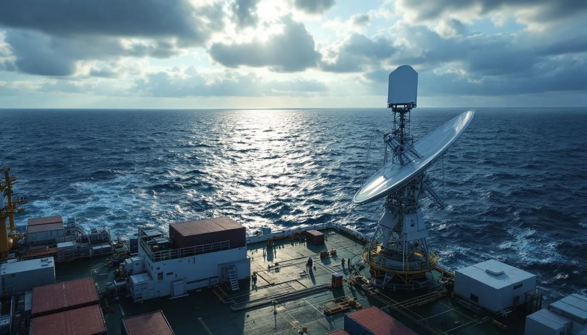
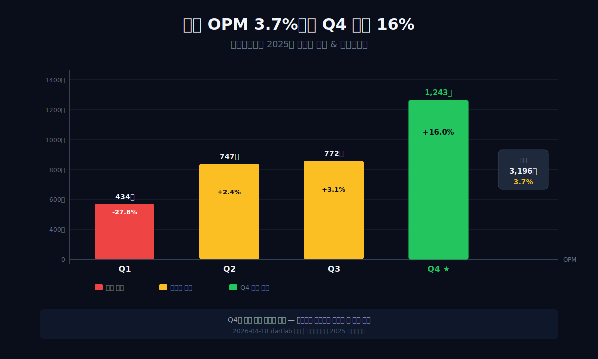
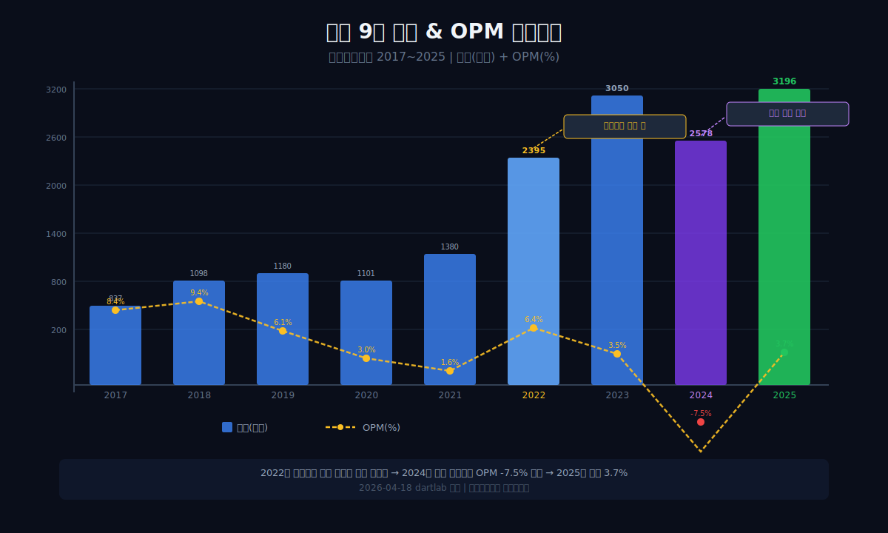
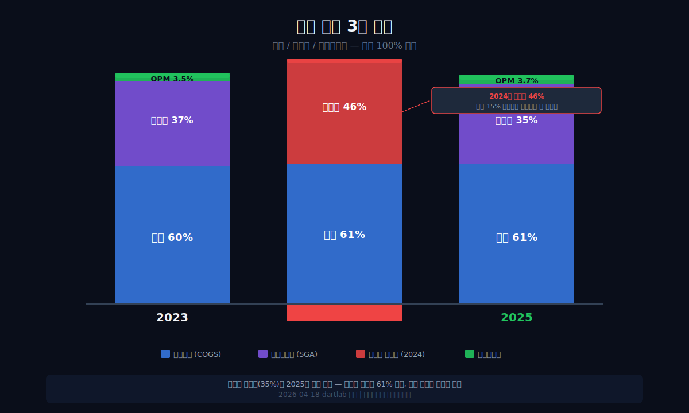
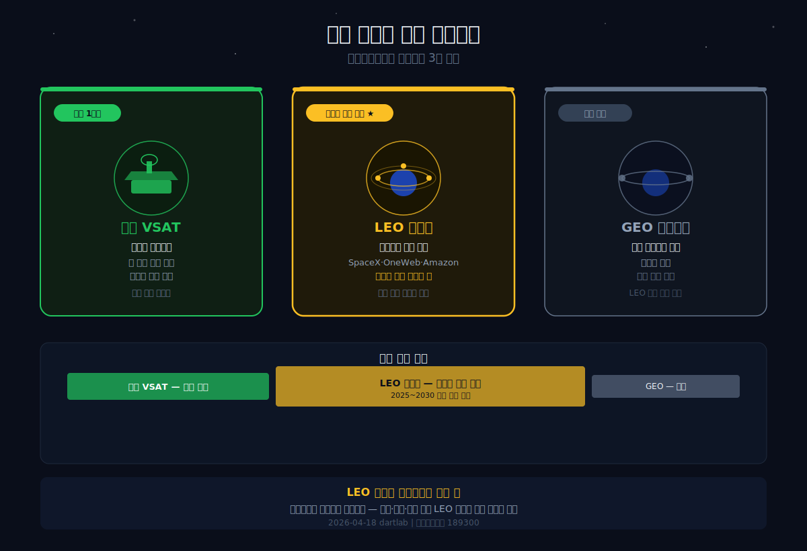
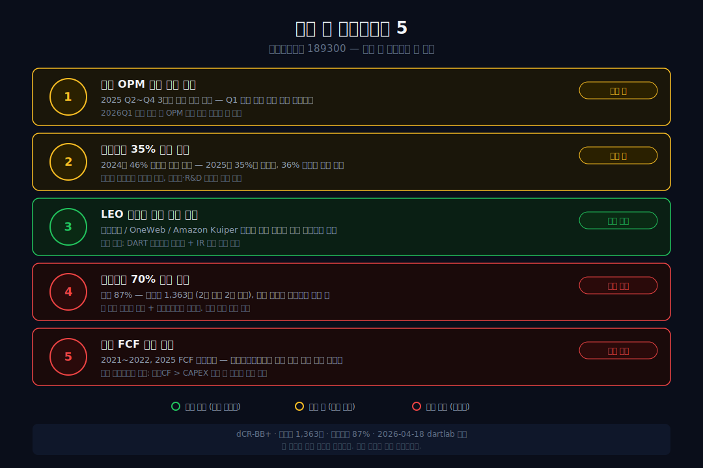

<script>
	import CompanyFinancials from '$lib/components/blog/CompanyFinancials.svelte';
import HFDataLink from '$lib/components/blog/HFDataLink.svelte';
</script>

> **성장** | 통신장비 > 위성 안테나 | 2026-04-18 dartlab 실측
> 같은 시리즈: [HD현대일렉트릭](/blog/267260-hd-hyundai-electric) · [한화에어로스페이스](/blog/012450-hanwha-aerospace) · [뉴스케일파워](/blog/SMR-nuscale-power) · [에스퓨얼셀](/blog/288620-sfuelcell) · [기업이야기 시리즈 전체](/blog/series/company-reports)

<HFDataLink code="189300" />

인텔리안테크(189300)의 2025년 재무제표를 열면 이상한 게 보인다. 연간 영업이익률 3.7%. 나쁘지 않다. 그런데 분기별로 쪼개면 풍경이 완전히 달라진다 — **Q1 -27.8%, Q2 +2.4%, Q3 +3.1%, Q4 +16.0%.** 같은 회사의 같은 해에 마이너스 28%와 플러스 16%가 공존한다.



이 회사는 **해상 위성통신 안테나(VSAT) 세계 1위권**이다. 원양 화물선, 크루즈, 해군 함정에 탑재되는 위성 안테나를 만든다. 스타링크(SpaceX)의 저궤도(LEO) 위성 시대가 열리면서 핵심 부품사로 떠올랐다. 매출은 9년간 837억에서 3,196억으로 3.8배 성장했다.

그런데 왜 Q4에만 돈을 벌고 Q1에는 적자인가. dartlab으로 9년치 재무제표를 추적하면 답이 보인다 — **대형 수주의 납기가 하반기에 집중**되고, **판관비(인건비·R&D)는 매 분기 균등하게 나간다**는 구조적 문제다.

---



## 1막: 매출 3.8배 — 위성 안테나 세계 1위의 성장

왜 인텔리안테크의 매출은 9년간 3.8배가 됐는가. 위성통신 시장의 구조적 성장이 배경이다.

### 매출 837억(2017) → 3,196억(2025), 연평균성장률 18%

```python
import dartlab
c = dartlab.Company("189300")
c.select("IS", ["매출액","영업이익","당기순이익"])
```

| 항목 (1년치 합산, 억원) | 2025 | 2024 | 2023 | 2022 | 2021 | 2020 | 2019 | 2018 | 2017 |
|:---|---:|---:|---:|---:|---:|---:|---:|---:|---:|
| 매출액 | **3,196** | 2,578 | 3,050 | **2,395** | 1,380 | 1,101 | 1,180 | 1,098 | 837 |
| 영업이익 | 120 | **-194** | 107 | 153 | 22 | 33 | 71 | 103 | 70 |
| 당기순이익 | 75 | -30 | 55 | 160 | 60 | 6 | 72 | 93 | 34 |

**표시: 2022년 매출이 전년 대비 74% 폭등(1,380→2,395억). 위성통신 투자 붐이 터진 해. 2024년에 -15% 역성장 후 2025년 재반등.**

인텔리안테크는 2004년 설립된 한국 기업이다. 해상 위성통신 안테나(VSAT, Very Small Aperture Terminal)를 설계·제조한다. 전 세계 원양 선박에 인터넷을 연결하는 장치 — 배 위에 올라가는 하얀 돔 모양 안테나가 이 회사의 제품이다.

세계 VSAT 안테나 시장에서 인텔리안테크는 1위권이다. 경쟁자는 노르웨이 Cobham SATCOM, 일본 JRC, 미국 KVH Industries. 한국의 중소기업이 글로벌 니치 시장에서 1위를 하고 있다는 점에서 [경동나비엔](/blog/009450-kyungdong-navien)(미국 탱크리스 온수기 1위)과 비슷한 구조다.

2004년 설립 이후 인텔리안테크는 해상 위성통신이라는 좁은 시장에 집중해왔다. 매출의 90% 이상이 해외에서 나온다 — 고객이 전 세계 해운사·해군이기 때문이다. 한국에서 만들어 전 세계로 수출하는 구조. [삼양식품](/blog/003230-samyang-foods)이 불닭을 해외 77%로 수출하듯, 인텔리안테크도 안테나를 해외 90%+로 수출한다. 차이는 삼양은 B2C(소비자)이고 인텔리안테크는 B2B(기업)라는 것이다.

### 2022년 매출 74% 폭등 — 위성통신 투자 붐

2022년 매출이 74% 뛴 이유는 **글로벌 위성통신 인프라 투자 붐**이다. 스타링크(SpaceX), OneWeb, Amazon Kuiper 등이 저궤도(LEO) 위성 수천 기를 발사하기 시작했고, 이 위성과 통신할 **지상·해상 안테나** 수요가 폭발했다. 인텔리안테크의 안테나는 이 위성들과 통신하는 핵심 부품이다.



### 영업이익률 추이 — 3~9%에서 벗어나지 못한다

| 연도 | 2025 | 2024 | 2023 | 2022 | 2021 | 2020 | 2019 | 2018 | 2017 |
|:---|---:|---:|---:|---:|---:|---:|---:|---:|---:|
| 영업이익률 (%) | **3.7** | **-7.5** | 3.5 | 6.4 | 1.6 | 3.0 | 6.1 | 9.4 | 8.4 |

매출이 3.8배 늘었는데 영업이익률은 8.4%(2017) → 3.7%(2025)로 오히려 떨어졌다. **매출은 성장하는데 마진은 성장하지 않는 구조.** [오뚜기](/blog/007310-ottogi)의 "매출 1.7배인데 이익은 줄었다"와 같은 패턴이지만, 원인은 다르다 — 오뚜기는 내수 가격 천장, 인텔리안테크는 **판관비 구조**다.

*매출은 3.8배 됐다. 그런데 왜 Q4에만 돈을 벌고 Q1에는 적자인가.*

---

## 2막: Q1 -28%, Q4 +16% — 분기 변동성의 구조

왜 같은 해에 -28%와 +16%가 공존하는가. 위성 안테나 사업의 계절성과 고정비 구조를 이해하면 답이 나온다.

### 분기별 영업이익률 3년 — 패턴이 보인다

```python
c.select("ratios", ["영업이익률 (%)"])
```

| 분기 | 2023Q1 | Q2 | Q3 | Q4 | 2024Q1 | Q2 | Q3 | Q4 | 2025Q1 | Q2 | Q3 | Q4 |
|:---|---:|---:|---:|---:|---:|---:|---:|---:|---:|---:|---:|---:|
| 영업이익률(%) | 1.2 | 8.9 | -2.4 | 4.4 | **-20.0** | 1.3 | -9.2 | -6.8 | **-27.8** | 2.4 | 3.1 | **16.0** |
| 매출(억) | 644 | 876 | 668 | 863 | 467 | 717 | 624 | 770 | 434 | 747 | 772 | **1,243** |

패턴이 명확하다. **Q1은 매출이 가장 낮고(434~644억), Q4는 가장 높다(770~1,243억).** 2025Q4 매출 1,243억은 Q1(434억)의 **2.9배**다. 같은 회사의 같은 해에 분기 매출이 3배 차이난다.



### 왜 Q4에 매출이 집중되는가 — 대형 수주의 납기 구조

위성 안테나는 "주문 생산(build-to-order)" 제품이다. 해운사나 위성사업자가 대량 주문하면, 설계·생산·납품에 수개월이 걸린다. 이 납기가 **연말(Q4)에 집중**되는 이유는:

1. **고객사의 예산 사이클**: 글로벌 해운사·위성사업자의 연간 설비투자 집행이 하반기에 몰린다. 예산 확정 → 발주 → 납기까지 6~9개월이면 Q4에 도착.
2. **프로젝트 기반 매출**: 선박 10척에 안테나를 장착하는 계약이면, 마지막 척의 납기가 Q4에 잡히면 매출 인식이 Q4로 밀린다.
3. **검수·인도 지연**: 해상 장비는 설치 후 검수가 필요하다. 연말까지 검수를 완료하려는 인센티브가 있어서 Q4에 매출 인식이 쏠린다.

### 판관비는 분기마다 균등 — 이것이 문제의 핵심

```python
prof = c.analysis("financial", "비용구조")
# 2025: 원재료 1,628억, 인건비 744억, 감가상각 166억
```

인텔리안테크의 판관비는 약 **분기 280억원** 수준으로 거의 균등하게 나간다. 엔지니어 인건비(744억/연), R&D 비용, 사무실 임차료 — 이건 매출이 많든 적든 고정으로 지출된다.

Q1에 매출 434억이면: 원가 265억(61%) + 판관비 280억 = 545억. **매출 434억 - 비용 545억 = 적자 -111억.** 영업이익률 -27.8%.

Q4에 매출 1,243억이면: 원가 758억(61%) + 판관비 280억 = 1,038억. **매출 1,243억 - 비용 1,038억 = 이익 205억.** 영업이익률 16.0%.

**원가율은 61%로 거의 같다.** 차이를 만드는 것은 판관비의 "고정비 효과"다. 매출이 많은 분기에는 판관비가 희석되고, 매출이 적은 분기에는 판관비가 이익을 삼킨다. [한화오션](/blog/042660-hanwha-ocean)의 영업레버리지 20배와 같은 구조지만, 한화오션은 연간 기준으로 변동하고 인텔리안테크는 **분기 기준으로 변동**한다는 차이가 있다.

### 2024년 적자의 진짜 원인 — 매출 15% 감소 + 판관비 그대로

| 연도 | 매출원가율 (%) | 판관비율 (%) | 영업이익률 (%) |
|:---|---:|---:|---:|
| 2023 | 59.9 | 36.6 | 3.5 |
| 2024 | 61.4 | **46.1** | **-7.5** |
| 2025 | 60.9 | 35.3 | 3.7 |

2024년 매출이 3,050억 → 2,578억으로 15% 줄었다. 원가율은 60→61%로 거의 같았다. 하지만 **판관비율이 37% → 46%로 10%포인트 급등**했다. 판관비 절대액은 비슷한데 매출이 줄어서 비율이 올라간 것이다. 이것이 적자의 직접 원인이다.

2025년에 매출이 24% 반등하면서 판관비율이 다시 35%로 내려왔고, 영업이익률도 3.7%로 복귀했다. **인텔리안테크의 이익은 매출 규모에 극도로 민감하다** — 매출이 10% 줄면 적자, 20% 늘면 두 자릿수 마진.

*Q4만 돈을 버는 구조는 고정비의 함정이다. 그렇다면 이 회사의 미래는 무엇에 달려있는가.*

---

## 3막: 스타링크가 바꾸는 판 — GEO에서 LEO로

왜 인텔리안테크에 주목해야 하는가. 위성통신 시장 자체가 **구조적 전환**을 겪고 있기 때문이다.



### GEO(정지궤도) → LEO(저궤도) — 위성통신의 세대 교체

기존 위성통신은 **GEO(정지궤도, 고도 36,000km)** 위성을 사용했다. 큰 위성 몇 개가 지구 전체를 커버하지만, 고도가 높아서 통신 지연(latency)이 500ms+로 느리다.

**LEO(저궤도, 고도 550km)**는 다르다. 스타링크가 6,000기+ 위성을 쏘아올린 이유다. 고도가 낮아서 지연이 20~40ms로 빠르다. 대신 위성 하나의 커버리지가 좁아서 수천 기가 필요하고, 이 위성들과 통신할 **지상·해상 안테나**도 수천 대가 필요하다.


인텔리안테크의 기회가 여기에 있다. GEO 시대에는 안테나 수요가 제한적이었다. LEO 시대에는 안테나 수요가 **수십 배** 늘어난다. 선박 한 척당 GEO 안테나 1대면 충분했지만, LEO는 위성이 빠르게 지나가므로 추적 기능이 있는 **phased array 안테나**가 필요하다. 인텔리안테크가 개발하고 있는 차세대 제품이 바로 이것이다.

### 해상 위성통신 — 배 위의 인터넷

인텔리안테크의 주력 시장은 **해상(maritime)**이다. 대양을 항해하는 선박은 육상 통신망(LTE/5G)이 닿지 않는다. 위성이 유일한 통신 수단이다. 원양 화물선의 운항 데이터, 크루즈의 승객 인터넷, 해군 함정의 군사 통신 — 모두 위성 안테나가 필요하다.

해상 VSAT 안테나 시장 규모는 약 $2~3B(3~4조원)이고, 연 10~15% 성장 중이다. 선박의 디지털화(IoT, 자율운항)가 가속되면서 안테나 수요가 구조적으로 늘어나고 있다. 인텔리안테크는 이 시장에서 노르웨이 Cobham과 함께 1~2위를 다투고 있다.

### 스타링크 공급망 — 아직 확정이 아니다

시장은 인텔리안테크를 "스타링크 수혜주"로 본다. 하지만 공시 기준으로 스타링크와의 직접 공급 계약은 확인되지 않는다. 스타링크는 자체 phased array 안테나(Dishy McFlatface)를 만들어 소비자용으로 판매하고 있다. 인텔리안테크의 기회는 **기업용·해상용** 시장이다 — 스타링크 자체 안테나가 커버하지 못하는 고성능·고신뢰 영역.

[뉴스케일파워](/blog/SMR-nuscale-power)가 NRC 인증이라는 "졸업장"으로 시장의 기대를 받듯, 인텔리안테크는 "해상 VSAT 1위"라는 실적으로 기대를 받고 있다. 차이는 뉴스케일은 **매출 $31M에 적자 -$690M**이고, 인텔리안테크는 **매출 3,196억에 흑자 120억**이라는 것이다. 이미 돈을 벌고 있다.

*스타링크 시대의 핵심 부품사. 하지만 분기 변동성과 고정비 구조가 이 성장을 방해하고 있다.*

---

## 4막: 재무 체력 — 성장했지만 안전하지 않다

왜 dCR-BB+(투기등급)인가. 매출 3.8배 성장한 회사가 왜 투기등급인지 재무 구조를 본다.

### 부채비율 87% — 2023년 65%에서 급등

```python
stab = c.analysis("financial", "안정성")
# leverageTrend 2025: 부채비율 86.5%, 차입금 1,363억
```

| 항목 (Q4 스냅샷, 억원) | 2025 | 2024 | 2023 | 2022 | 2021 | 2020 |
|:---|---:|---:|---:|---:|---:|---:|
| 자산총계 | **4,965** | 4,407 | 4,537 | 3,704 | 2,615 | 1,528 |
| 자본총계 | **2,663** | 2,646 | 2,750 | 1,787 | 1,620 | 767 |
| 현금 | 329 | 215 | 560 | 244 | 225 | 129 |
| 차입금 | **1,363** | 582 | 687 | — | — | — |
| 부채비율 (%) | **87** | 67 | 65 | 107 | 61 | 99 |

**표시: 차입금 582억(2024) → 1,363억(2025). 1년 만에 2.3배. 부채비율도 67%→87%.**

차입금이 급등한 이유는 2025년 영업현금흐름이 -182억으로 마이너스였기 때문이다. 매출은 늘었지만 운전자본(매출채권·재고)에 현금이 묶이면서, 부족분을 차입으로 메운 것이다.

### 영업활동현금흐름 변동성 — 흑자와 적자를 오간다

```python
c.select("CF", ["영업활동현금흐름","유형자산의 취득"])
```

| 항목 (1년치, 억원) | 2025 | 2024 | 2023 | 2022 | 2021 | 2020 |
|:---|---:|---:|---:|---:|---:|---:|
| 영업CF | **-182** | 40 | 298 | -261 | -97 | 117 |
| 설비투자 | -125 | -101 | -166 | -377 | -277 | -143 |
| 잉여현금흐름 | **-307** | -61 | 132 | -638 | -374 | -26 |

6년 중 4년이 잉여현금흐름 마이너스다. 매출이 성장하면서 운전자본(재고+매출채권)이 커졌고, 이 자본이 현금을 빨아들이고 있다. 성장기업의 전형적 패턴이지만, **성장이 현금을 만들지 못하면** 계속 외부 차입에 의존해야 한다.

### dCR-BB+ — 투기등급, 부정적 전망

```python
cr = c.credit("등급")
# grade: dCR-BB+, healthScore: 65.52, outlook: 부정적
```

dartlab 신용등급 dCR-BB+. 투기등급이다. [에스퓨얼셀](/blog/288620-sfuelcell)의 dCR-BB-보다는 2노치 높지만, [네이버](/blog/035420-naver)의 dCR-AA나 [오뚜기](/blog/007310-ottogi)의 dCR-A와는 비교할 수 없다. 하방 압력의 핵심: **FFO/차입금 -17.4%, Debt/EBITDA 8.8배**. 벌어오는 현금 대비 빚이 크다.

다만 중요한 차이가 있다. 에스퓨얼셀은 매출이 소멸하면서 BB-이고, 인텔리안테크는 매출이 성장하면서 BB+다. **성장 기업의 투기등급과 쇠퇴 기업의 투기등급은 의미가 다르다.** 에스퓨얼셀의 BB-는 "이 회사가 살아남을 수 있는가"라는 질문이고, 인텔리안테크의 BB+는 "이 회사가 성장 비용을 감당할 수 있는가"라는 질문이다.

### 이자보상배율 1.8배 — 이자 부담이 가벼운 건 아니다

dartlab 종합평가의 경고: **이자보상배율(이자보상배율) 1.8배** — 영업이익으로 이자를 겨우 1.8번 갚는 수준으로, 안전 마진이 넉넉하지 않다. 2024년처럼 매출이 15% 빠지면 영업적자 → 이자보상배율 마이너스가 된다. [에스퓨얼셀](/blog/288620-sfuelcell)의 이자보상배율 -3.86배(이자 갚을 영업이익 자체가 없음)보다는 낫지만, 수주가 한 분기만 밀려도 흔들리는 구조라는 점은 같다.

차입금 1,363억 중 상당 부분이 운전자본(재고·매출채권) 자금이다. 안테나를 만들어 납품하기 전까지 원재료와 완성품 재고에 현금이 묶인다. 매출이 늘수록 운전자본도 커지고, 운전자본을 메우려면 차입이 늘어나는 **성장의 역설**이다.

### 안전마진 9.6% — 손익분기점 바로 위

dartlab summaryFlags: **"안전마진 9.6% — 손익분기점 근접."** 매출이 10% 빠지면 적자로 전환된다는 뜻이다. 2024년에 실제로 15% 빠져서 적자가 됐다. 이 구조에서는 **매출의 안정성이 곧 생존**이다.

*매출은 3.8배 됐지만 재무 체력은 아직 약하다. 성장이 계속돼야 이 구조가 버텨진다.*

---

## 5막: 2025Q4의 의미 — 변곡점인가, 일회성인가

왜 2025Q4에 영업이익률 16%가 터졌는가. 이것이 구조적 변화인지 일회성인지를 판단해야 한다.

### Q4 매출 1,243억 — 역대 최대 분기

2025Q4 매출 1,243억원은 인텔리안테크 역사상 가장 큰 분기 매출이다. 직전 분기(Q3 772억)의 1.6배. 연간 매출 3,196억의 **39%가 Q4 한 분기에 집중**됐다.

이 Q4 폭발이 의미하는 것은 두 가지 중 하나다:

1. **대형 수주 납기 집중 (일회성)**: 연말에 대형 계약의 납기가 몰렸다. 매 분기 반복되지 않을 수 있다.
2. **LEO 안테나 수요 본격화 (구조적)**: 스타링크·OneWeb 관련 안테나 수요가 본격적으로 매출에 찍히기 시작한 것이다. 이 경우 2026년에도 높은 분기 매출이 반복된다.

공시만으로는 구분이 어렵다. 2026년 Q1~Q2 매출을 봐야 한다. Q1이 500억 이상이면 구조적 전환, 400억 이하면 일회성.

### 설비투자 축소 — 성장 투자에서 유지 투자로

| 연도 | 설비투자 (억원) | 감가상각 (억원) | 설비투자/감가상각 |
|:---|---:|---:|---:|
| 2022 | 445 | 102 | **4.4배** |
| 2023 | 303 | 114 | 2.7배 |
| 2024 | 299 | 115 | 2.6배 |
| 2025 | 125 | 109 | **1.1배** |

2022년 설비투자/감가상각이 4.4배(공격적 성장 투자)였는데, 2025년에 1.1배(유지 투자)로 급감했다. 두 가지 해석이 가능하다:
- **긍정**: 투자 사이클이 끝났다. 이제 투자한 설비로 매출을 뽑아낼 차례다.
- **부정**: 현금이 부족해서 투자를 못 하고 있다. 잉여현금흐름 -307억에 차입금 2.3배 증가.

### 이 회사의 본질 — "니치 하드웨어"

인텔리안테크의 본질은 **글로벌 니치 하드웨어 제조사**다. 시장은 크지 않지만(전 세계 $2~3B), 그 안에서 1위다. [경동나비엔](/blog/009450-kyungdong-navien)(미국 탱크리스 1위, 영업이익률 8~10%)과 비슷한 포지션이다. 니치 1위의 특성:
- 시장이 커지면 혜택을 독점적으로 받는다
- 시장이 안 커지면 성장도 없다
- 경쟁자가 진입하면 마진이 깎인다

LEO 위성통신 시장이 커지면 인텔리안테크는 최대 수혜자다. 안 커지면 현재의 3~7% 영업이익률에 갇힌다.

### 분기 편중이 해소되면 어떻게 되는가

시나리오를 하나 그려보자. 현재 Q1 매출이 434억(연간의 14%)이고 Q4가 1,243억(39%)이다. 만약 LEO 안테나 수요가 분기별로 고르게 들어와서 4분기 매출이 균등(800억씩)해지면 어떻게 되는가.

분기 매출 800억 × 원가율 61% = 원가 488억. 판관비 280억. 총비용 768억. **분기 영업이익 32억, 영업이익률 4%.** 연간으로 하면 매출 3,200억, 영업이익 128억, 영업이익률 4%. 현재 연간 영업이익률 3.7%와 비슷하지만, **분기 적자가 사라진다** — 이것만으로도 신용등급과 차입 조건이 크게 개선된다.

더 중요한 시나리오: Q4 수준(1,243억)이 4분기 모두 반복되면? 연간 매출 약 5,000억. 같은 원가율·판관비 구조라면 연간 영업이익률은 **약 15%**가 된다. 이것이 인텔리안테크가 니치 하드웨어에서 **구조적 성장주**로 도약하는 경로다. 문제는 이 수준의 수주가 지속적으로 들어오는가에 있다.

---

## 6막: 인텔리안테크 다음 — LEO가 열쇠다



### 투자자가 봐야 할 체크포인트 5가지

1. **분기 영업이익률 흑자 연속 유지** — 2025Q2~Q4 3분기 연속 흑자. Q1 적자 패턴을 깨는 것이 구조적 전환의 첫 신호. 2026Q1 매출 500억+이면 계절성 탈피.

2. **판관비율 35% 이하 유지** — 2024년 46%가 적자의 직접 원인. 매출이 늘어도 판관비가 비례해서 오르면 마진은 안 늘어남. 인건비 744억의 효율화가 핵심.

3. **LEO 안테나 대형 수주 공시** — 스타링크/OneWeb/Amazon Kuiper와의 기업용·해상용 안테나 공급 계약. 이것이 나오면 매출 가시성이 급격히 개선.

4. **부채비율 70% 이하** — 현재 87%. 차입금 1,363억이 1년 만에 2.3배. 매출 성장이 차입 증가를 감당할 수 있는지.

5. **연간 잉여현금흐름 흑자 전환** — 6년 중 4년 잉여현금흐름 마이너스. 성장이 현금을 만들어야 진짜 성장이다. 영업활동현금흐름 양전환 + 설비투자 축소가 동시에 이뤄지면 첫 잉여현금흐름 흑자 가능.

---

## 분기 변동성이 말해주는 것

인텔리안테크는 좋은 위치에 있는 회사다. 위성 안테나 세계 1위, 매출 3.8배 성장, LEO 시대의 핵심 부품사. 하지만 "좋은 위치"와 "좋은 투자"는 다르다.

연간 영업이익률 3.7%는 **판관비 35%라는 무거운 고정비**가 만든 숫자다. Q4에 16%를 벌어도 Q1에 -28%를 까먹으면 연간으로는 4%가 남는다. 이 구조를 바꾸려면 **매출의 분기 편중이 해소**되거나, **판관비의 변동비 전환**(외주·파트타임 활용)이 필요하다. 둘 다 단기간에 바뀌기 어렵다.

인텔리안테크를 다른 "니치 1위" 기업들과 비교하면 위치가 보인다. [경동나비엔](/blog/009450-kyungdong-navien)은 미국 탱크리스 1위로 영업이익률 8~10%를 안정적으로 유지한다. [대한조선](/blog/439260-daehan-shipbuilding)은 수에즈막스 올인으로 영업이익률 24%를 찍었다. 인텔리안테크는 해상 VSAT 1위인데 영업이익률이 3.7%다. 차이는 **분기 편중**이다. 나비엔과 대한조선은 매출이 분기별로 고르거나 예측 가능한 반면, 인텔리안테크는 Q4에 39%가 몰린다. 니치 1위의 시장 지위는 확보했지만, 매출의 시간 분포가 마진을 깎고 있다.

이 분기 편중이 구조적으로 해소되는 유일한 경로는 **수주잔고의 장기화**다. [한화오션](/blog/042660-hanwha-ocean)처럼 2~3년치 수주잔고가 쌓이면 매출이 분기별로 고르게 인식된다. 위성 안테나도 대형 장기 계약(예: 해운사 100척 5년 계약)이 늘면 이 구조가 가능하다. 단발성 프로젝트 수주에서 장기 공급 계약으로 전환하는 것이 인텔리안테크의 마진 구조를 바꾸는 진짜 열쇠다.

2026년에 봐야 할 한 줄: **2026Q1 매출 500억 이상 + 영업이익률 흑자.** 이것이 "Q1 적자 패턴" 탈피의 첫 신호이고, 인텔리안테크가 니치 하드웨어에서 **구조적 성장주**로 전환하는 변곡점이다. Q1이 또 400억 + 적자면, 연간 영업이익률 3~4%에 갇히는 구조는 바뀌지 않는다.

---

## 검증표

| 본문 수치 | dartlab 호출 | 결과 | 비고 |
|:---|:---|:---|:---|
| 2025 매출 3,196억 | `c.select("IS",["매출액"])` 분기 합산 | ✅ 실측 | |
| 2017 매출 837억 | IS 분기 합산 | ✅ 실측 | |
| 2025 영업이익률 3.7% | 120/3196 | ✅ 계산 | |
| 2024 영업이익률 -7.5% | -194/2578 | ✅ 계산 | |
| 2025Q4 매출 1,243억 | IS 2025Q4 | ✅ 실측 | |
| 2025Q4 영업이익률 16.0% | 분기 ratios | ✅ 실측 | |
| 2025Q1 영업이익률 -27.8% | 분기 ratios | ✅ 실측 | |
| 매출원가율 60.9% (2025) | `c.analysis("financial","수익성")` marginWaterfall | ✅ 실측 | |
| 판관비율 35.3% (2025) | marginWaterfall | ✅ 실측 | |
| 판관비율 46.1% (2024) | marginWaterfall | ✅ 실측 | |
| 부채비율 87% | `c.analysis("financial","안정성")` leverageTrend | ✅ 실측 | |
| 차입금 1,363억 | leverageTrend | ✅ 실측 | |
| dCR-BB+ | `c.credit("등급")` grade | ✅ 실측 | |
| 영업활동현금흐름 -182억 (2025) | `c.select("CF",...)` 분기 합산 | ✅ 실측 | |
| 설비투자 125억 (2025) | CF 분기 합산 | ✅ 실측 | |
| 원재료 1,628억 | `c.analysis("financial","비용구조")` costBreakdown | ✅ 실측 | |
| 인건비 744억 | costBreakdown | ✅ 실측 | |
| 안전마진 9.6% | `c.analysis("financial","종합평가")` summaryFlags | ✅ 실측 | |

📅 dartlab 실측 2026-04-18

---

<CompanyFinancials code="189300" />
