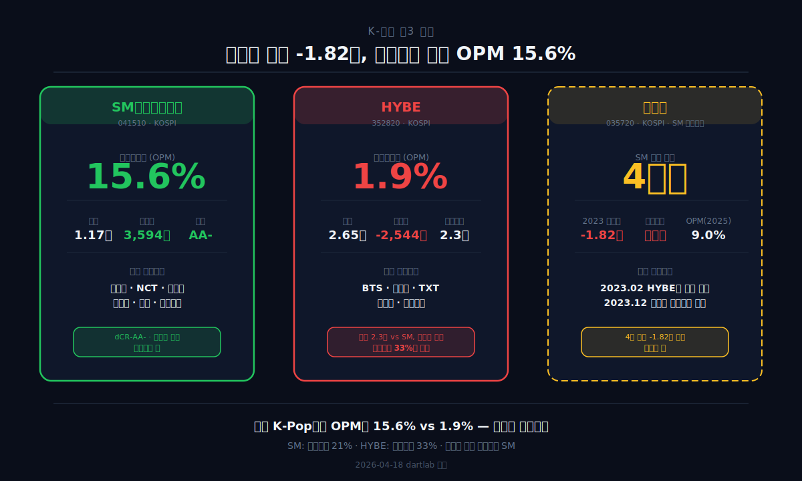
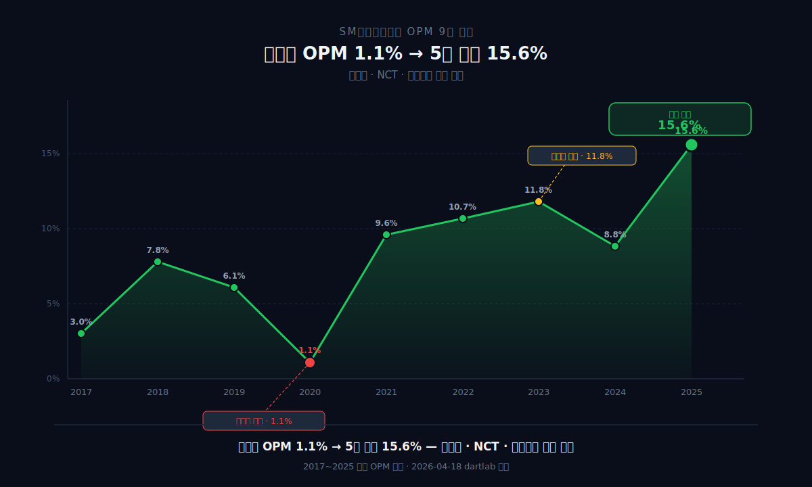
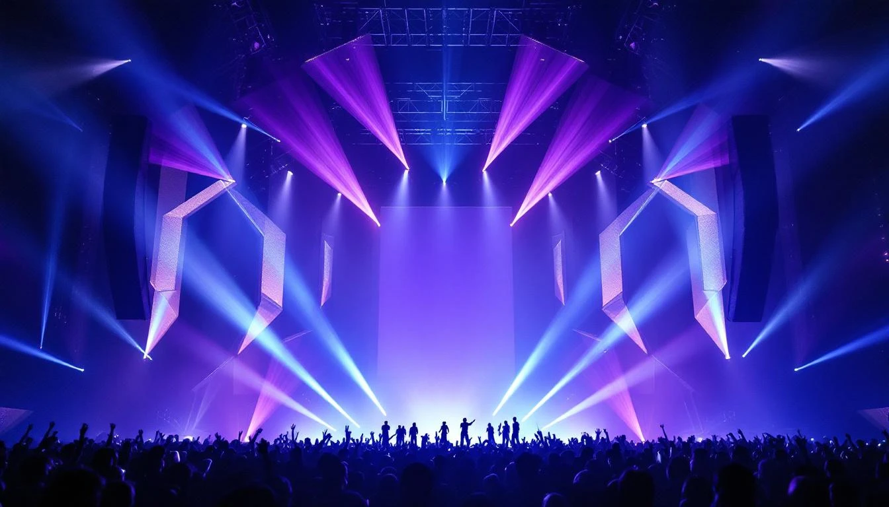
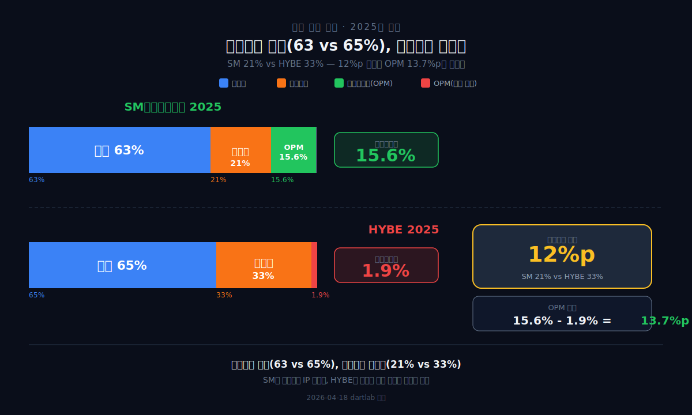
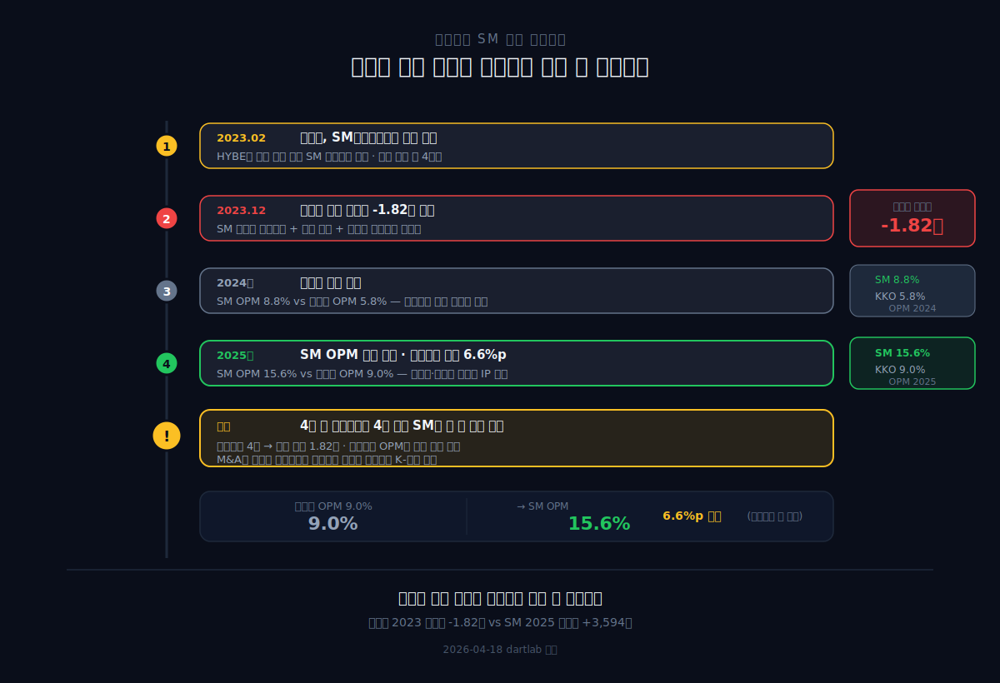
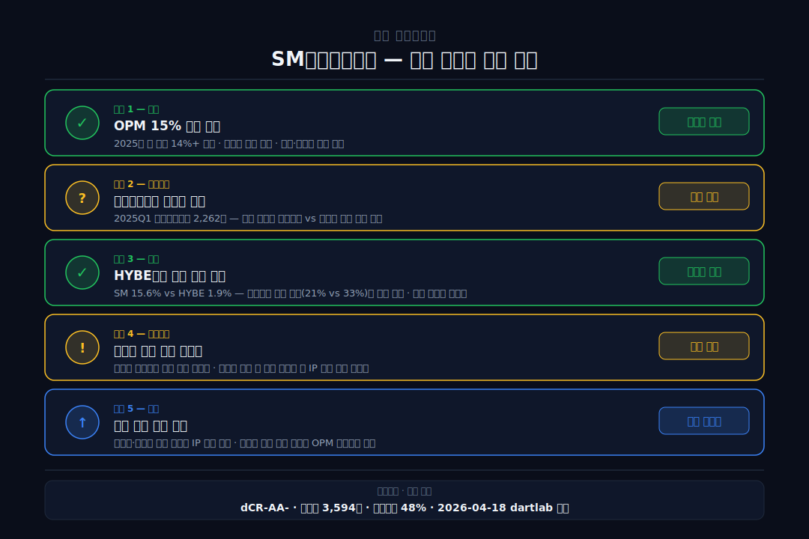

<script>
import ComboChart from '$lib/components/blog/ComboChart.svelte';
import StackBar from '$lib/components/blog/StackBar.svelte';
import HFDataLink from '$lib/components/blog/HFDataLink.svelte';
</script>

> **턴어라운드** | 미디어·엔터 > 기획사 | 2026-04-18 dartlab 실측
> 같은 시리즈: [카카오](/blog/kakao) · [크래프톤](/blog/krafton) · [네이버](/blog/naver) · [기업이야기 시리즈 전체](/blog/series/company-reports)

<HFDataLink code="041510" />

2023년 [카카오](/blog/kakao)는 SM엔터테인먼트를 약 4조원에 인수했다. [하이브](/blog/hybe)와 경쟁 입찰 끝에 가격이 올라갔다. 그 해 카카오는 순손실 -1.82조원을 찍었다. 인수 대금의 절반에 가까운 돈이 1년 만에 증발한 것이다.

그런데 dartlab으로 SM엔터테인먼트(041510) 자체의 재무제표를 열면 풍경이 완전히 다르다. 2025년 영업이익률 **15.6%**, 매출 **1.17조원**, 순이익 **3,594억원**. 전부 역대 최고다. 코로나 바닥(2020년 영업이익률 1.1%)에서 5년 만에 15배 회복. 같은 K-Pop 기획사인 [하이브](/blog/hybe)의 영업이익률 1.9%와 비교하면 **8배** 차이다.

인수한 쪽(카카오)이 -1.82조를 찍고, 인수당한 쪽(SM)이 역대 최고를 찍는 아이러니. 왜 이런 일이 벌어졌는가.

---



## 1막: 영업이익률 1.1% → 15.6% — SM의 5년 턴어라운드

왜 SM의 영업이익률은 코로나 바닥에서 역대 최고까지 올라왔는가.

### 매출 5,799억(2020 바닥) → 11,749억(2025), 2배

```python
import dartlab
c = dartlab.Company("041510")
c.select("IS", ["매출액","영업이익","당기순이익"])
```

| 항목 (1년치 합산, 억원) | 2025 | 2024 | 2023 | 2022 | 2021 | 2020 | 2019 | 2018 | 2017 |
|:---|---:|---:|---:|---:|---:|---:|---:|---:|---:|
| 매출액 | **11,749** | 9,897 | 9,611 | 8,508 | 7,016 | **5,799** | 6,578 | 6,122 | 3,654 |
| 영업이익 | **1,830** | 873 | 1,135 | 910 | 675 | **65** | 404 | 477 | 109 |
| 당기순이익 | **3,594** | 8 | 827 | 820 | 1,332 | -803 | -162 | 234 | -47 |

**표시: 2020년 영업이익 65억(영업이익률 1.1%). 2025년 1,830억(영업이익률 15.6%). 5년 만에 28배.**



### 2025년 순이익 3,594억 — 영업이익의 2배인 이유

2025년 순이익 3,594억원은 영업이익 1,830억원의 **2배**다. 차이를 만든 것은 **관계기업손익 2,262억원**(2025Q1 집중). 연결 범위 확대(신규 자회사 취득 또는 관계기업의 자회사 전환) 과정에서 지분법 평가이익이 한 번에 인식된 것이다.

이것은 [네이버](/blog/naver)의 2021Q1 순이익 15.31조(LINE → Z Holdings 재측정 차익)와 같은 구조다. 영업이익은 건강하지만, 순이익에는 일회성이 섞여있다. **SM의 실질 수익성은 영업이익률 15.6%로 판단해야 한다.**

### 에스파·NCT·라이즈 — 영업이익률 회복의 엔진



SM의 영업이익률 회복은 **멀티 아티스트 전략**의 성과다. 에스파(2020 데뷔), NCT(2016 데뷔, 2020년대 본격 확장), 라이즈(2023 데뷔) — 여러 그룹이 동시에 활동하면서 매출이 분산됐고, 특정 그룹의 공백이 전체 매출을 끌어내리지 않는 구조가 만들어졌다.

이것이 [하이브](/blog/hybe)와의 결정적 차이다. 하이브는 BTS 완전체 공백 2년 동안 매출은 공연으로 메웠지만 영업이익률이 8.2% → 1.9%로 추락했다. SM은 특정 그룹에 대한 의존도가 낮아서 영업이익률이 꾸준히 올라갔다.

### 분기별 영업이익률 — 2025년 전 분기 14% 이상

| 분기 | 2024Q1 | Q2 | Q3 | Q4 | 2025Q1 | Q2 | Q3 | Q4 |
|:---|---:|---:|---:|---:|---:|---:|---:|---:|
| 영업이익률(%) | 7.1 | 9.7 | 5.5 | 12.3 | **14.1** | **15.7** | **15.0** | **17.1** |

2024년에는 분기마다 5~12%로 흔들렸다. 2025년에는 **전 분기 14% 이상**으로 안정됐다. 영업이익률이 안정된다는 것은 "매출 구성이 균형 잡혔다"는 뜻이다 — 특정 분기에 특정 그룹의 컴백이 쏠리지 않고, 연중 고르게 매출이 발생하는 구조.

*코로나 바닥에서 5년 만에 역대 최고. 그런데 같은 K-Pop인 하이브는 왜 영업이익률 1.9%인가.*

---

## 2막: SM 15.6% vs HYBE 1.9% — 같은 K-Pop, 8배 차이

왜 같은 K-Pop 기획사인데 영업이익률이 8배 차이 나는가. 비용 구조를 분해하면 답이 보인다.



### 원가율은 비슷하다 — 63% vs 65%

```python
prof = c.analysis("financial", "수익성")
# marginWaterfall 2025: 매출원가율 63.2%, OPM 15.6%
```

| 항목 (2025, %) | SM엔터 | [하이브](/blog/hybe) |
|:---|---:|---:|
| 매출원가율 | 63.2 | 64.7 |
| 판관비율 | **21.2** | **33.1** |
| **영업이익률** | **15.6** | **1.9** |

원가율은 63% vs 65%로 거의 같다. K-Pop 사업의 원가(제작비·아티스트 정산·유통비)는 구조적으로 비슷하기 때문이다. **차이는 판관비에 있다.** SM 21.2%, HYBE 33.1%. 12%포인트 차이. 이 12%포인트가 영업이익률 8배 격차를 만든다.

### 판관비 21% vs 33% — 왜 HYBE가 더 높은가

HYBE의 판관비가 높은 이유는 **멀티레이블 구조**다. HYBE는 빅히트뮤직, 어도어, 플레디스, 소스뮤직, KOZ, HYBE JAPAN, Geffen/Ithaca 등 **10개+ 레이블**을 운영한다. 각 레이블마다 독립된 경영진·인력·사무실이 있다. [카카오](/blog/kakao)가 자회사 100개로 영업이익률 9%에 갇힌 것과 같은 구조적 문제다 — 레이블이 많으면 고정비가 늘어난다.

SM은 **단일 레이블 구조**에 가깝다. SM엔터테인먼트라는 하나의 기획사 안에서 에스파·NCT·라이즈를 운영한다. 레이블을 쪼개지 않으니 관리 비용이 중복되지 않는다. A&R(아티스트 발굴·육성), 마케팅, 글로벌 유통 — 이 기능들이 하나의 조직에서 모든 그룹에 공유된다.

이것은 [네이버](/blog/naver)의 "별도 영업이익률 75% → 연결 18%"와 정반대다. 네이버는 본체의 마진이 높고 자회사가 마진을 깎는다. SM은 본체 자체가 아티스트를 직접 운영하므로 "본체 = 사업" 구조다. 중간에 마진을 먹는 자회사 레이어가 없다.

[오뚜기](/blog/ottogi)의 판관비율 11%와 비교하면 SM의 21%는 높아 보이지만, 엔터 산업은 마케팅·프로모션이 매출의 핵심 동력이라 이 수준이 정상이다. HYBE의 33%가 비정상적으로 높은 것이다.

### 2024년 순이익 8억 — 자기자본수익률 붕괴의 원인

SM의 2024년 순이익은 **8억원**이다. 영업이익이 873억인데 순이익이 8억. 차이를 만든 것은 **법인세 정산**(이연분 납부)과 영업외비용이다. 영업이익률 8.8%는 나쁘지 않았지만, 세금과 영업외 요인이 순이익을 거의 0으로 만들었다. 자기자본수익률가 0.1%로 추락한 직접 원인이다.

2025년에 관계기업손익 2,262억이 들어오면서 자기자본수익률가 26.5%로 급등했다. **자기자본수익률 +76%p의 실체는 "2024년이 비정상적으로 낮았고, 2025년에 일회성이 더해진 것"**이다. 영업 기준 수익성 개선은 영업이익률 8.8% → 15.6%로 약 7%p. 견실하지만 76%p는 아니다.


*원가율은 같은데 판관비가 다르다. SM의 단일 레이블이 HYBE의 멀티레이블보다 마진에 유리하다.*

---

## 3막: 카카오가 SM을 사고 벌어진 일

왜 카카오는 SM을 사고 -1.82조를 찍었는데, SM 자체는 역대 최고인가.



### 2023년 2월 — 카카오 vs HYBE 경쟁 입찰

2023년 초, SM엔터테인먼트를 둘러싸고 카카오와 하이브가 경쟁 입찰을 벌였다. 이수만 전 총괄(SM 창업자, 지분 약 18%)이 보유 지분을 매각하면서 경영권 분쟁이 촉발됐다. 하이브가 먼저 주당 12만원에 공개매수를 선언했고, 카카오가 더 높은 가격으로 맞불을 놨다. 최종적으로 카카오가 약 4조원에 SM 지분을 확보했다.

이 경쟁 입찰 과정이 K-Pop 역사상 가장 비싼 인수극이 됐다. 하이브와 카카오가 경쟁하면서 인수가가 올라간 것이 카카오의 첫 번째 실수였다. 하이브 입장에서는 인수에 실패했지만, 결과적으로 "비싸게 안 산 것"이 오히려 재무적으로 유리했다 — 2025년 하이브가 영업이익률 1.9%로 고전하는 것은 SM 인수와 무관한 자체 구조 문제(멀티레이블 판관비)이지만, 여기에 SM 인수 영업권까지 얹었으면 더 나빠졌을 것이다.

### 카카오의 -1.82조 — SM이 아니라 카카오의 문제

[카카오](/blog/kakao) 블로그에서 분석했듯, 2023년 카카오의 순손실 -1.82조는 SM 인수 자체의 손실이 아니다. **SM 인수에 따른 영업권 2.2조 증가 + 기존 사업(금융자산)의 손상차손**이 겹친 것이다. SM이 돈을 못 벌어서 카카오가 적자를 낸 게 아니라, **인수 가격이 너무 높았고 회계적 비용이 한꺼번에 잡힌 것**이다.

실제로 SM의 2023년 영업이익률은 11.8%로 인수 전(2022년 10.7%)보다 **개선**됐다. 카카오가 적자를 찍는 동안 SM은 더 잘 벌었다.

### SM이 역대 최고를 찍은 이유 — 카카오 인수와 무관

SM의 영업이익률 개선은 카카오 인수와 관련이 없다. 인수 전부터 올라가고 있었다:

| 연도 | 영업이익률 | 비고 |
|:---|---:|:---|
| 2020 | 1.1% | 코로나 바닥 |
| 2021 | 9.6% | 에스파 데뷔 효과 |
| 2022 | 10.7% | 인수 전 |
| 2023 | 11.8% | 인수 직후 — 더 개선 |
| 2024 | 8.8% | 일시적 조정 |
| 2025 | **15.6%** | 역대 최고 |

에스파의 글로벌 성장(첫 미국 투어, 일본 오리콘 차트 1위), NCT의 유닛 확장(NCT 127·NCT Dream·WayV 3팀 동시 활동), 라이즈의 폭발적 데뷔(2023년 데뷔 앨범 100만장+) — 이것들이 매출을 키우면서 판관비 비율이 자연스럽게 내려간 것이다. **매출이 늘면 고정비(판관비)가 희석되는 레버리지 효과** — [한화오션](/blog/hanwha-ocean)의 영업레버리지과 같은 원리지만, 한화오션은 적자에서 흑자로의 반전이고 SM은 **흑자에서 더 큰 흑자로의 확장**이다.

*카카오가 4조에 샀지만, SM의 가치를 만든 것은 카카오의 경영이 아니라 SM 자체의 아티스트다.*

---

## 4막: dCR-AA- — K-Pop 기획사 중 가장 안전한 재무

왜 SM은 K-Pop 기획사 중 재무가 가장 건강한가.

### 부채비율 48%, 순현금 3,594억

```python
stab = c.analysis("financial", "안정성")
# leverageTrend 2025: 부채비율 47.8%, 순부채 -3,594억
cr = c.credit("등급")
# grade: dCR-AA-, healthScore: 87.37
```

| 항목 (Q4, 억원) | 2025 | 2024 | 2023 | 2022 | 2021 |
|:---|---:|---:|---:|---:|---:|
| 자산총계 | **20,077** | 14,191 | 15,410 | 14,630 | 13,149 |
| 자본총계 | **13,587** | 8,291 | 9,094 | 8,861 | 7,884 |
| 현금 | 3,646 | 3,584 | 3,031 | 3,175 | 3,313 |
| 차입금 | **52** | 54 | 408 | — | — |

**차입금 52억원.** 거의 무차입이다. 현금 3,646억에 차입금 52억이면 순현금 3,594억. [에스퓨얼셀](/blog/sfuelcell)의 현금 6억, [한화오션](/blog/hanwha-ocean)의 차입금 5.65조와 비교하면 완전히 다른 세상이다.

dCR-AA-는 dartlab 신용등급 체계에서 **최우량**에 해당한다. 건강점수 87.37점, PD(부도확률) 0.03%. K-Pop 기획사가 이 등급을 받는 것은 SM이 유일하다.

### 영업활동현금흐름 1,949억 — 역대 최고 현금 창출

```python
c.select("CF", ["영업활동현금흐름","유형자산의 취득"])
```

| 항목 (1년치, 억원) | 2025 | 2024 | 2023 | 2022 | 2021 |
|:---|---:|---:|---:|---:|---:|
| 영업CF | **1,949** | 1,357 | 1,130 | 1,149 | 1,226 |
| 설비투자 | -89 | -242 | -191 | -241 | -222 |
| 잉여현금흐름 | **1,860** | 1,115 | 939 | 908 | 1,004 |

설비투자 89억원. 매출 1.17조 회사의 설비투자가 89억이다. **엔터 산업은 공장이 필요 없다.** 아티스트가 자산이고, 그 자산은 재무상태표에 찍히지 않는다. [삼성바이오로직스](/blog/samsung-biologics)가 설비투자 수천억을 공장에 쏟는 것과 정반대 구조다.

잉여현금흐름 1,860억원은 매출의 16%에 해당한다. 매년 매출의 16%가 현금으로 남는다. 이 현금이 3,646억원으로 쌓이고 있다.

비교하면 이렇다. [한화오션](/blog/hanwha-ocean)은 매출 12.78조에 설비투자 7,166억(매출의 5.6%)을 쏟는다. [SK바이오사이언스](/blog/sk-bioscience)는 매출 6,514억에 설비투자 2,604억(매출의 40%)을 투자한다. SM은 매출 1.17조에 설비투자 **89억**(매출의 0.8%). K-Pop 기획사는 공장도 없고 설비도 거의 필요 없다. **아티스트가 공장이고, 팬이 고객이고, 음원과 공연이 제품이다.** 이 구조가 잉여현금흐름 비율 16%를 만든다 — 제조업에서는 불가능한 숫자다.

### 자사주 매입 + 첫 배당 — 주주환원 시작

2023~2024년에 자사주 매입(265억+222억)을 했고, 2025년에는 처음으로 배당(129억, 배당성향 3.6%)을 실시했다. 연간 잉여현금흐름 1,860억 대비 총환원 129억(7%)은 낮지만, **SM 역사상 처음 배당을 한 것** 자체가 신호다. "돈이 남기 시작했으니 돌려주겠다"는 뜻이다.

### 현금전환주기 -36일 — 돈을 먼저 받는 구조

dartlab summaryFlags: **"현금전환주기 -36일."** 현금전환주기(물건 팔고 돈 받기까지 걸리는 시간)가 **마이너스**다. 음반·공연 티켓은 선불이다. 팬들이 앨범을 예약 구매하고, 콘서트 티켓을 미리 산다. **돈이 먼저 들어오고 비용이 나중에 나가는 구조.** 이것이 현금 3,646억이 쌓이는 메커니즘이다.

*공장 없이 현금을 쌓는 사업. 그렇다면 리스크는 무엇인가.*

---

## 5막: 무형자산 +4,612억 — 눈에 보이지 않는 변화

왜 2025년 무형자산이 4,612억원 급증했는가. 이것이 SM의 숨겨진 리스크다.

### 무형자산 1,402억 → 6,014억 — 1년 만에 4.3배

2025년 SM의 무형자산이 1,402억에서 6,014억으로 **4,612억원** 급증했다. 동시에 비지배주주지분도 1,643억에서 3,561억으로 1,918억 증가했다. 이것은 **연결 범위가 확대됐다**는 뜻이다 — SM이 새로운 자회사를 인수했거나, 기존 관계기업을 자회사로 전환한 것이다.

무형자산 4,612억 급증의 정확한 내역은 2025년 사업보고서 주석에서 확인해야 한다. 현재 공시 기준으로 특정할 수 있는 것은 **"연결 범위가 바뀌었다"**는 사실뿐이다. 비지배주주지분이 동시에 1,918억 늘었으므로, 기존에 SM이 소수 지분으로 보유하던 회사를 자회사로 편입하면서 영업권이 잡힌 것으로 보인다. 다음 공시에서 확인할 포인트: **주석의 "연결 범위 변동" 항목에서 어떤 회사가 신규 편입됐는지.**

### 2025Q1 관계기업손익 2,262억 — 반복 가능한가

2025년 순이익 3,594억 중 2,262억이 관계기업손익이다. 이것이 **매년 반복되는 수익인가, 일회성인가**가 SM의 실질 가치를 결정한다.

- **반복 가능한 시나리오**: 연결 자회사/관계기업이 안정적으로 이익을 내면 매년 지분법이익이 들어온다.
- **일회성 시나리오**: 지분 재편 과정의 재측정 차익이면 내년에는 없다.

공시만으로는 아직 구분이 어렵다. 2026Q1 실적에서 관계기업손익이 0에 가까우면 일회성이 확인된다.

### 엔터 산업의 무형자산 — 아티스트는 재무상태표에 없다

SM의 진짜 자산은 에스파·NCT·라이즈라는 **아이돌 IP**다. 하지만 이 IP는 재무상태표에 찍히지 않는다. 아이돌은 "자산"이 아니라 "비용"으로 처리된다 — 트레이닝비, 제작비, 마케팅비는 모두 영업비용이다. 아이돌이 성공하면 매출로 돌아오지만, 실패하면 매몰비용이 된다.

이것이 엔터 산업의 구조적 특성이다. [삼성바이오로직스](/blog/samsung-biologics)의 공장(유형자산 2.7조)이나 [네이버](/blog/naver)의 투자자산(16.6조)은 재무상태표에 찍힌다. 하지만 SM의 에스파, HYBE의 BTS는 찍히지 않는다. **가장 중요한 자산이 보이지 않는 사업** — 그래서 엔터 주식의 밸류에이션은 재무제표만으로 판단할 수 없고, 아티스트의 활동 주기·글로벌 팬덤 규모·컴백 일정 같은 비재무 요소가 결정적이다.

SM의 무형자산 6,014억 중 실제 아티스트 IP의 가치는 포함되지 않았다. 6,014억은 **M&A 영업권**이다. 진짜 가치(아티스트)는 "off-balance sheet"에 있다.

### K-Pop 산업의 사이클 — SM은 어디에 있는가

K-Pop 기획사의 매출은 **아이돌 활동 사이클**에 의존한다. 앨범 컴백 → 콘서트 투어 → 팬미팅 → 휴식 → 다시 컴백. 이 사이클이 한 그룹에 집중되면([하이브](/blog/hybe)의 BTS 의존) 그룹 공백 = 매출 공백이 된다.

SM의 강점은 **복수 그룹의 사이클이 분산**돼있다는 것이다. 에스파가 쉴 때 NCT가 활동하고, NCT가 쉴 때 라이즈가 활동한다. 2025년 전 분기 영업이익률 14%+가 가능한 이유가 여기에 있다. [인텔리안테크](/blog/intellian)의 Q4 편중(매출 39% 집중)과 정반대 — SM은 매출이 분기별로 고르다.

### K-엔터 빅3 비교

| 항목 (2025) | SM엔터 | [하이브](/blog/hybe) | [카카오](/blog/kakao) (연결) |
|:---|---:|---:|---:|
| 매출 | 1.17조 | 2.65조 | 8.10조 |
| 영업이익률 | **15.6%** | 1.9% | 9.0% |
| 순이익 | 3,594억 | -2,544억 | 5,180억 |
| 부채비율 | **48%** | 82% | 82% |
| 차입금 | **52억** | — | — |
| 신용등급 | **dCR-AA-** | dCR-BBB+ | dCR-AA |

SM이 매출은 가장 작지만, 영업이익률과 재무 건전성에서는 압도적이다. 차입금 52억은 사실상 무차입. 하이브의 부채비율 82%와 비교하면 완전히 다른 구조다.

한 가지 더 흥미로운 점: 카카오의 연결 영업이익률 9.0% 중 SM이 기여하는 부분이 있다. SM의 영업이익 1,830억은 카카오 전체 영업이익 7,300억의 약 25%에 해당한다. **카카오가 4조에 샀는데, 그 자산이 카카오 이익의 4분의 1을 만들고 있다.** 인수 가격이 비쌌지만, SM이 계속 벌어주면 장기적으로는 카카오에게도 나쁜 딜이 아닐 수 있다. 문제는 2023년 -1.82조라는 회계적 충격이 너무 컸다는 것이다.

*SM은 K-Pop 기획사 중 가장 안전하다. 하지만 무형자산 급증과 관계기업손익 일회성은 주시해야 한다.*

---

## 6막: SM의 다음 — 카카오 지분 재편과 아티스트 경쟁



### 투자자가 봐야 할 체크포인트 5가지

1. **영업이익률 15% 이상 유지** — 2025년 전 분기 14%+로 구조적 안착. 2026년에도 유지되면 SM의 수익성은 "일시적 호황"이 아니라 "구조적 레벨업"으로 확인된다.

2. **관계기업손익 반복 여부** — 2025Q1 2,262억이 일회성인지 확인. 2026Q1 실적 발표 시 이 항목이 핵심. 0이면 순이익이 절반 이하로 떨어진다.

3. **HYBE와의 영업이익률 격차 지속** — SM 15.6% vs HYBE 1.9%는 SM의 단일 레이블 효율이 HYBE의 멀티레이블보다 유리하다는 증거. HYBE가 구조조정으로 판관비를 줄이면 격차가 좁혀진다.

4. **카카오 지분 재편** — 카카오가 SM 지분을 매각하거나 재편하면 대주주가 바뀔 수 있다. 경영 독립성이 유지되는 한 SM의 영업이익률에는 영향이 없지만, 시장은 불확실성을 싫어한다.

5. **차세대 그룹 데뷔 성과** — 에스파·NCT·라이즈 이후 차세대 IP가 성공적으로 데뷔하는지. K-Pop 기획사의 지속 성장은 "기존 그룹 유지 + 신규 그룹 추가"에 달려있다.

---

## 인수한 쪽이 망하고 인수당한 쪽이 번 이유

SM엔터테인먼트의 영업이익률 15.6%는 K-Pop 기획사 역사상 가장 높은 수준이다. 코로나 바닥(1.1%)에서 5년 만에 도달했다. 에스파·NCT·라이즈가 동시에 활동하면서 매출이 2배로 늘었고, 판관비 비율이 28% → 21%로 내려왔다.

카카오가 -1.82조를 찍은 것은 SM이 돈을 못 벌어서가 아니다. **인수 가격이 너무 높았고**, 그 대가가 카카오의 연결 재무제표에 한꺼번에 찍힌 것이다. SM 자체는 인수 전이나 후나 같은 속도로 성장하고 있었다.

하이브의 영업이익률 1.9%와 SM의 15.6%를 나누는 것은 **판관비 구조**다. 멀티레이블(하이브)은 고정비가 분산되지 않고 중복된다. 단일 레이블(SM)은 같은 지붕 아래에서 비용을 공유한다. [네이버](/blog/naver)가 별도 영업이익률 75%인데 자회사 100개를 연결하면 18%로 떨어지는 것과 같은 원리다 — 레이블이 많으면 마진이 줄어든다.

이 글에서 반복된 패턴이 있다. [오뚜기](/blog/ottogi)는 "판관비 11%인데 영업이익률 5%"고, SM은 "판관비 21%인데 영업이익률 15.6%"다. 오뚜기의 문제는 원가율 84%(내수 가격 천장), SM의 강점은 원가율 63%(K-Pop 글로벌 프리미엄). 같은 "판관비가 높다/낮다"라도 원가율이 다르면 마진 구조가 완전히 달라진다.

K-Pop 기획사 3사를 나란히 놓으면 한국 엔터 산업의 구조가 보인다. SM은 "단일 레이블로 판관비를 줄여 영업이익률 15%를 만든 회사"다. HYBE는 "멀티레이블로 매출은 키웠지만 판관비에 마진을 잃은 회사"다. 카카오는 "SM을 사서 연결은 했지만 인수 비용에 순이익을 잃은 회사"다. 셋 다 K-Pop을 한다. 결과가 다른 이유는 **비용 구조**다.

2026년에 봐야 할 한 줄: **관계기업손익 2,262억의 반복 여부.** 이것이 반복되면 SM은 "영업이익률 15% + 지분법 20%" = 순이익률 30%의 초고마진 엔터가 된다. 일회성이면 순이익이 절반으로 돌아가지만, 영업 기준 영업이익률 15.6%는 여전히 K-Pop 최고다.

---

## 검증표

| 본문 수치 | dartlab 호출 | 결과 | 비고 |
|:---|:---|:---|:---|
| 2025 매출 11,749억 | `c.select("IS",["매출액"])` 분기 합산 | ✅ 실측 | |
| 2020 매출 5,799억 | IS 분기 합산 | ✅ 실측 | |
| 2025 영업이익률 15.6% | 1830/11749 | ✅ 계산 | |
| 2020 영업이익률 1.1% | 65/5799 | ✅ 계산 | |
| 2025 영업이익 1,830억 | IS 분기 합산 | ✅ 실측 | |
| 2025 순이익 3,594억 | IS 분기 합산 | ✅ 실측 | |
| 2024 순이익 8억 | IS 분기 합산 | ✅ 실측 | |
| 매출원가율 63.2% | `c.analysis("financial","수익성")` | ✅ 실측 | |
| 판관비율 21.2% | marginWaterfall | ✅ 실측 | |
| 부채비율 48% | `c.analysis("financial","안정성")` | ✅ 실측 | |
| 차입금 52억 | leverageTrend | ✅ 실측 | |
| 순현금 3,594억 | netDebt | ✅ 실측 | |
| dCR-AA- | `c.credit("등급")` | ✅ 실측 | |
| 영업활동현금흐름 1,949억 | `c.select("CF",...)` 분기 합산 | ✅ 실측 | |
| 설비투자 89억 | CF 분기 합산 | ✅ 실측 | |
| 현금전환주기 -36일 | summaryFlags | ✅ 실측 | |
| 무형자산 6,014억 | BS 2025Q4 | ✅ 실측 | |
| 관계기업손익 2,262억 | summaryFlags | ✅ 실측 | |
| HYBE 영업이익률 1.9% | HYBE 블로그 #39 | ✅ 교차 | |
| HYBE 판관비율 33% | HYBE 블로그 #39 | ✅ 교차 | |
| 카카오 순손실 -1.82조 | 카카오 블로그 #43 | ✅ 교차 | |

📅 dartlab 실측 2026-04-18

---

## 공시 / Filings

- [SM엔터 사업보고서 (2025년)](https://dart.fss.or.kr/dsaf001/main.do?rcpNo=20260319001277) — DART 원문
- [SM엔터 분기보고서 (2025년 3분기)](https://dart.fss.or.kr/dsaf001/main.do?rcpNo=20251114001500) — 연결 재무제표
- [SM엔터 감사보고서 (2025년)](https://dart.fss.or.kr/dsaf001/main.do?rcpNo=20260318800180) — 외부감사인 의견
- [SM엔터 전자공시 전체](https://dart.fss.or.kr/dsaf001/main.do?corpCode=00602877) — DART 공시 목록

---

<!-- AUTO:START — sync_financials.py가 자동 생성. 수동 편집 금지 -->


## 공시 / Filings

| 기간 | 보고서 | 링크 |
|------|--------|------|
| 2025 | 사업보고서 (2025.12) | [DART에서 보기](https://dart.fss.or.kr/dsaf001/main.do?rcpNo=20260317000781) |
| 2025 | 분기보고서 (2025.09) | [DART에서 보기](https://dart.fss.or.kr/dsaf001/main.do?rcpNo=20251114002727) |
| 2025 | 반기보고서 (2025.06) | [DART에서 보기](https://dart.fss.or.kr/dsaf001/main.do?rcpNo=20250814002402) |
| 2025 | 분기보고서 (2025.03) | [DART에서 보기](https://dart.fss.or.kr/dsaf001/main.do?rcpNo=20250515001874) |
| 2025 | [기재정정]분기보고서 (2025.03) | [DART에서 보기](https://dart.fss.or.kr/dsaf001/main.do?rcpNo=20250515003047) |
| 2024 | [기재정정]사업보고서 (2024.12) | [DART에서 보기](https://dart.fss.or.kr/dsaf001/main.do?rcpNo=20250718000170) |
| 2024 | 사업보고서 (2024.12) | [DART에서 보기](https://dart.fss.or.kr/dsaf001/main.do?rcpNo=20250317000813) |
| 2024 | 분기보고서 (2024.09) | [DART에서 보기](https://dart.fss.or.kr/dsaf001/main.do?rcpNo=20241114002449) |
| 2024 | 반기보고서 (2024.06) | [DART에서 보기](https://dart.fss.or.kr/dsaf001/main.do?rcpNo=20240814004419) |
| 2024 | 분기보고서 (2024.03) | [DART에서 보기](https://dart.fss.or.kr/dsaf001/main.do?rcpNo=20240516001271) |

> 전체 공시 목록은 dartlab에서 확인:
> ```python
> import dartlab
> c = dartlab.Company("041510")
> c.filings()
> ```

## 재무제표 — 최근 5개년

> 아래는 최근 5개년 요약입니다. 전체 기간·분기별 데이터는 dartlab에서 직접 확인할 수 있습니다:
> ```python
> import dartlab
> c = dartlab.Company("041510")
> c.show("IS")              # 손익계산서 (분기)
> c.show("IS", freq="Y")    # 손익계산서 (연간)
> c.show("BS")              # 재무상태표
> c.show("CF")              # 현금흐름표
> c.show("SCE")             # 자본변동표
> c.show("ratios")          # 재무비율
> ```

### 손익계산서 (IS) — 단위 억원

<ComboChart data={[{year:"2025",매출액:11749,영업이익:1830,당기순이익:3594},{year:"2024",매출액:9897,영업이익:873,당기순이익:8},{year:"2023",매출액:9611,영업이익:1135,당기순이익:827},{year:"2022",매출액:8508,영업이익:910,당기순이익:820},{year:"2021",매출액:7016,영업이익:675,당기순이익:1332}]} lineKeys={["매출액"]} barKeys={["영업이익","당기순이익"]} lineColors={["#22c55e"]} barColors={["#3b82f6","#f59e0b"]} title="매출(라인) vs 영업이익·당기순이익(막대)" unit="억원" />

| 항목 | 2025 | 2024 | 2023 | 2022 | 2021 |
|---|---:|---:|---:|---:|---:|
| 매출액 | 11,749 | 9,897 | 9,611 | 8,508 | 7,016 |
| 매출원가 | 7,424 | 6,825 | 6,200 | 5,557 | 4,372 |
| 매출총이익 | 4,325 | 3,072 | 3,410 | 2,950 | 2,644 |
| 판매비와관리비 | 2,495 | 2,199 | 2,276 | 2,040 | 1,969 |
| 영업이익 | 1,830 | 873 | 1,135 | 910 | 675 |
| 금융수익 | — | — | — | — | — |
| 금융비용 | 165 | 86 | 91 | 64 | 89 |
| 당기순이익 | 3,594 | 8 | 827 | 820 | 1,332 |

### 재무상태표 (BS) — 단위 억원

<StackBar data={[{year:"2025",segments:[{label:"부채",value:6490,color:"#ef4444"},{label:"자본",value:13587,color:"#22c55e"}]},{year:"2024",segments:[{label:"부채",value:5900,color:"#ef4444"},{label:"자본",value:8291,color:"#22c55e"}]},{year:"2023",segments:[{label:"부채",value:6316,color:"#ef4444"},{label:"자본",value:9094,color:"#22c55e"}]},{year:"2022",segments:[{label:"부채",value:5769,color:"#ef4444"},{label:"자본",value:8861,color:"#22c55e"}]},{year:"2021",segments:[{label:"부채",value:5265,color:"#ef4444"},{label:"자본",value:7884,color:"#22c55e"}]}]} title="부채 vs 자본 구조" unit="억원" />

| 항목 | 2025 | 2024 | 2023 | 2022 | 2021 |
|---|---:|---:|---:|---:|---:|
| 자산총계 | 20,077 | 14,191 | 15,410 | 14,630 | 13,149 |
| 유동자산 | 9,805 | 8,140 | 8,583 | 8,414 | 7,695 |
| 비유동자산 | 10,272 | 6,051 | 6,827 | 6,216 | 5,455 |
| 부채총계 | 6,490 | 5,900 | 6,316 | 5,769 | 5,265 |
| 유동부채 | 4,972 | 4,846 | 5,193 | 4,674 | 4,007 |
| 비유동부채 | 1,517 | 1,055 | 1,123 | 1,094 | 1,258 |
| 자본총계 | 13,587 | 8,291 | 9,094 | 8,861 | 7,884 |

### 현금흐름표 (CF) — 단위 억원

<ComboChart data={[{year:"2025",영업CF:1949,투자CF:-1500,재무CF:-335},{year:"2024",영업CF:1357,투자CF:557,재무CF:-1451},{year:"2023",영업CF:1130,투자CF:-831,재무CF:-205},{year:"2022",영업CF:1149,투자CF:-1218,재무CF:-6},{year:"2021",영업CF:1226,투자CF:-826,재무CF:-68}]} barKeys={["영업CF","투자CF","재무CF"]} barColors={["#22c55e","#ef4444","#3b82f6"]} title="영업·투자·재무 현금흐름" unit="억원" />

| 항목 | 2025 | 2024 | 2023 | 2022 | 2021 |
|---|---:|---:|---:|---:|---:|
| 영업활동현금흐름 | 1,949 | 1,357 | 1,130 | 1,149 | 1,226 |
| 투자활동현금흐름 | -1,500 | 557 | -831 | -1,218 | -826 |
| 재무활동현금흐름 | -335 | -1,451 | -205 | -6 | -68 |

### 자본변동표 (SCE) — 단위 억원

| 항목 | 2025 | 2024 | 2023 | 2022 | 2021 |
|---|---:|---:|---:|---:|---:|
| 회계정책변경 | — | — | — | — | — |
| 지분법자본변동 | 0.0 | 0.4 | -0.9 | -3 | 49 |
| 기초자본 | -122 | 3,654 | 229 | 2,358 | 117 |
| 유상증자 | 17 | 0.0 | 36 | -45 | 345 |
| 연결범위변동 | 1,787 | — | — | — | — |
| 배당 | 95 | 0.0 | -284 | 47 | — |
| 기말자본 | 6,185 | -122 | 1,869 | 8,861 | 3,616 |
| 자본변동합계 | -92 | -57 | — | 75 | 0.8 |
| 전기오류수정 | — | — | — | — | — |
| FVOCI평가 | 0.0 | 0.0 | -0.8 | -2 | -67 |
| 해외사업환산 | 0.0 | 0.0 | -42 | -12 | -16 |
| 연결범위내거래 | — | — | — | — | — |
| 당기순이익 | 3,594 | 183 | -46 | 20 | 1,335 |
| 기타(주주와의 거래 등 합계) | — | — | 0.1 | — | — |
| 확정급여재측정 | 0.0 | 0.0 | -27 | 5 | 2 |

*최종 갱신: 2026-04-18 | dartlab 실측 (DART 공시 기준)*

<!-- AUTO:END -->
