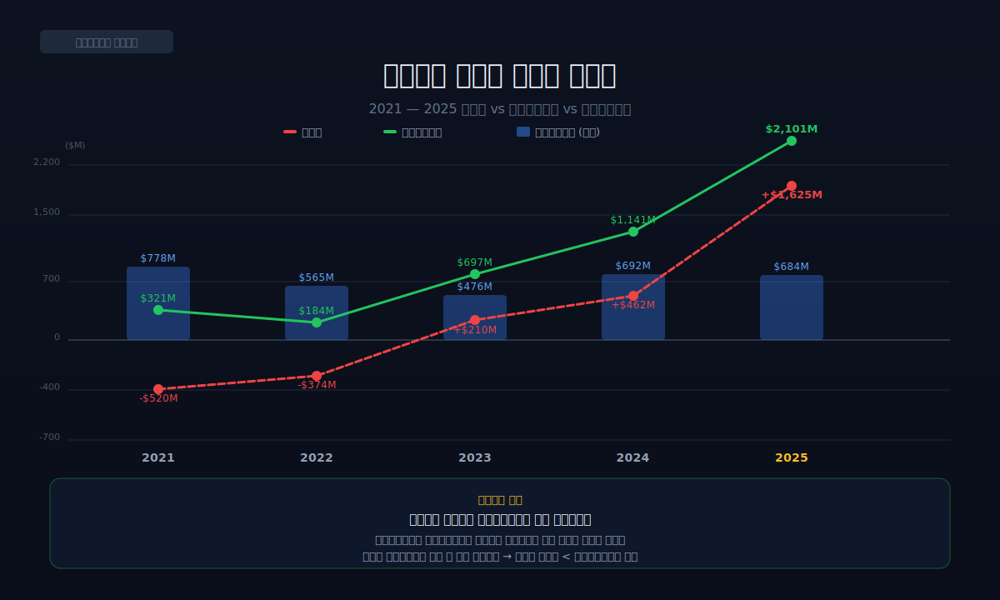
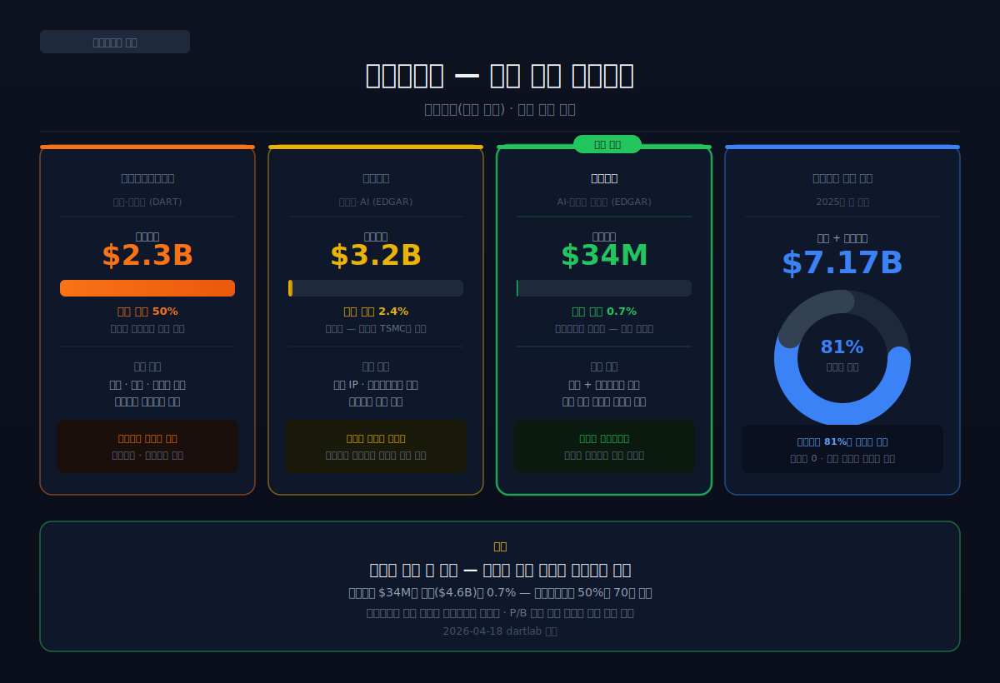
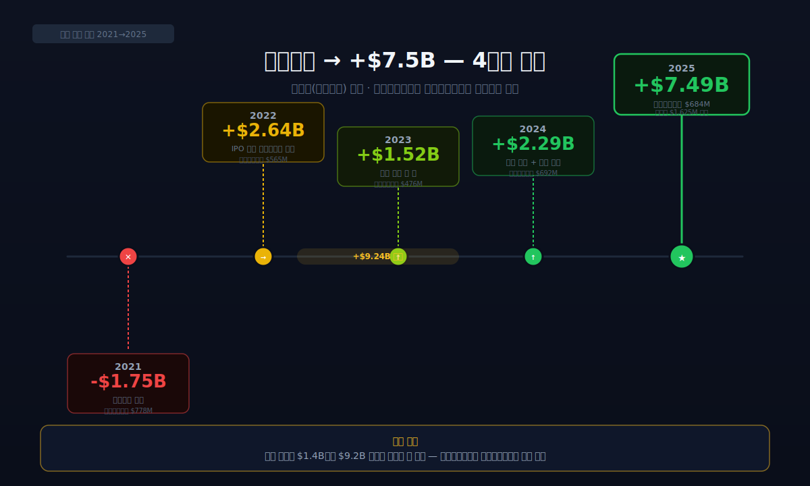
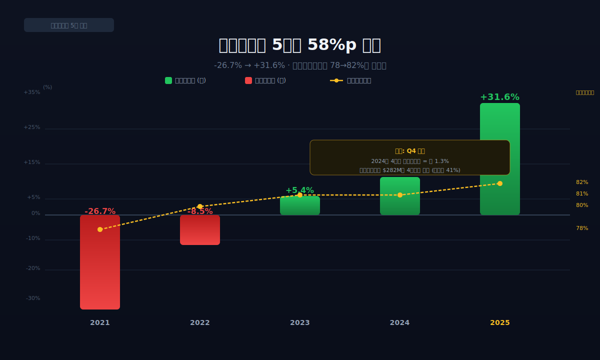
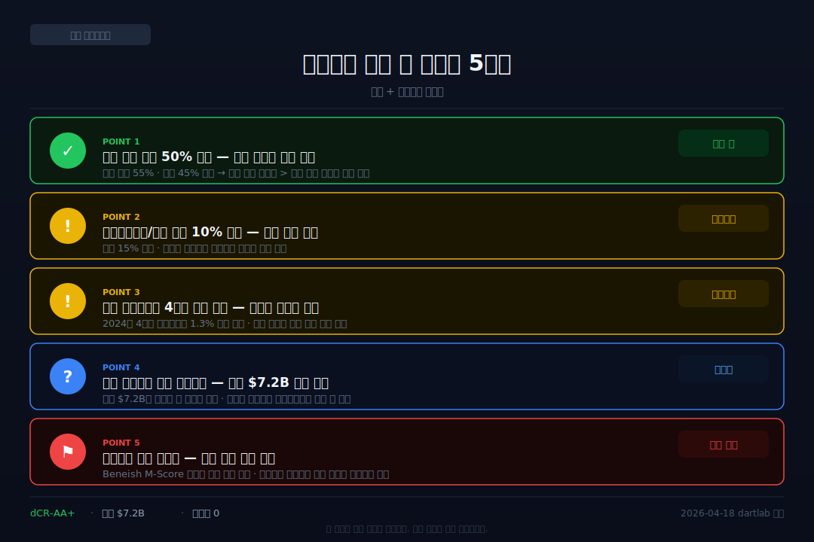

<script>
import ComboChart from '$lib/components/blog/ComboChart.svelte';
import StackBar from '$lib/components/blog/StackBar.svelte';
import HFDataLink from '$lib/components/blog/HFDataLink.svelte';
</script>

> **성장** | 소프트웨어 > AI·빅데이터 | 2026-04-18 dartlab 실측
> 같은 시리즈: [엔비디아](/blog/nvidia) · [네이버](/blog/naver) · [뉴스케일파워](/blog/nuscale-power) · [기업이야기 시리즈 전체](/blog/series/company-reports)

<HFDataLink code="PLTR" kind="edgar" />

팔란티어(PLTR)의 2025년 재무제표를 열면 숫자가 아름답다. 매출 $4.48B, 영업이익률 31.6%, 잉여현금흐름(영업현금에서 투자비를 뺀 진짜 남는 돈) $2.1B. 소프트웨어 기업 중에서도 최상위 수익성이다. 차입금 0, 현금 $7.2B. 재무제표만 보면 완벽한 회사다.

그런데 한 줄 더 파면 이상한 숫자가 보인다. 영업이익 $1.41B 중 **$684M이 주식보상비용(SBC, Stock-Based Compensation)**이다. 이익의 **48%가 현금이 아니라 주식**으로 나간다. 더 이상한 건, 이 회사가 적자였던 2021년에도 잉여현금흐름은 +$321M이었다는 것이다. 순이익 -$520M인데 현금은 넘쳤다.

어떻게 가능한가. dartlab으로 5년치 재무제표를 추적하면 답이 보인다 — **주식보상비용이라는 "보이지 않는 비용"**이 팔란티어의 손익, 자본, 현금흐름 전부를 설명하는 열쇠다. 이 열쇠를 이해하지 못하면 팔란티어의 영업이익률 31.6%가 진짜인지 가짜인지 판단할 수 없다.

---


## 1막: 적자인데 돈이 쌓인다 — 잉여현금흐름의 역설

왜 순이익이 -$520M인데 잉여현금흐름은 +$321M인가. 이 질문이 팔란티어를 이해하는 출발점이다.

### 매출 $1.54B(2021) → $4.48B(2025), 2.9배

```python
import dartlab
c = dartlab.Company("PLTR")
c.select("IS", ["revenue","operating_income","net_income"])
```

팔란티어는 2003년 피터 틸(PayPal 공동창업자)과 알렉스 카프(CEO)가 설립한 빅데이터·AI 소프트웨어 회사다. 원래는 CIA와 NSA 같은 미국 정보기관을 위한 데이터 분석 도구(Gotham)를 만들었다. 테러리스트 추적, 불법 자금 흐름 분석, 전장 상황 인식 — 군사·정보 분야에서 대체 불가능한 소프트웨어였다.

2020년 뉴욕증권거래소(NYSE)에 직상장(DPO, Direct Public Offering)했다. 기존 IPO처럼 은행에 수수료를 주지 않고, 시장이 직접 가격을 정하게 한 것이다. 상장 당시 시가총액 약 $21B. 그런데 매출의 61%가 정부 계약이었다. "상업 고객은 어디 있죠?"라는 월스트리트의 질문이 따라다녔다.

| 항목 (연간, $M) | 2025 | 2024 | 2023 | 2022 | 2021 |
|:---|---:|---:|---:|---:|---:|
| 매출 | **4,475** | 2,866 | 2,225 | 1,906 | 1,542 |
| 영업이익 | **1,414** | 310 | 120 | -161 | -411 |
| 당기순이익 | **1,625** | 462 | 210 | -374 | **-520** |

**표시: 2021년 순이익 -$520M(적자). 2025년 +$1,625M(흑자). 4년 만에 $2.1B 스윙.**

### 순이익 -$520M인데 잉여현금흐름 +$321M — 어떻게?

```python
c.select("CF", ["operating_cash_flow","purchase_of_property_plant_and_equipment"])
```

| 항목 (연간, $M) | 2025 | 2024 | 2023 | 2022 | 2021 |
|:---|---:|---:|---:|---:|---:|
| 영업활동현금흐름 | **2,135** | 1,154 | 712 | 224 | 334 |
| 설비투자 | -34 | -13 | -15 | -40 | -13 |
| 잉여현금흐름 | **2,101** | 1,141 | 697 | 184 | **321** |

**표시: 2021년 순이익 -$520M인데 잉여현금흐름 +$321M. 차이 $841M. 이 $841M은 어디서 왔는가.**



답은 **주식보상비용(SBC, Stock-Based Compensation)**이다. 팔란티어는 직원들에게 급여의 상당 부분을 현금이 아니라 **자사 주식**으로 지급한다. 이 주식보상비용은 손익계산서에서 비용으로 잡혀서 순이익을 깎는다. 하지만 **현금이 나가지 않는다**. 주식을 발행하는 것이지 현금을 쓰는 게 아니기 때문이다.

그래서 현금흐름표에서는 영업활동현금흐름을 계산할 때, 순이익에 주식보상비용을 **다시 더한다**. 순이익 -$520M + 주식보상비용 $778M = 영업활동현금흐름 +$334M. 여기서 설비투자 $13M을 빼면 잉여현금흐름 +$321M이 된다.

**쉽게 말하면: 팔란티어는 직원 월급을 현금 대신 주식으로 줘서, 장부상으로는 적자인데 금고에는 현금이 쌓이는 구조다.** 이것이 "적자인데 돈이 쌓인다"의 정체다.

이것은 소프트웨어 산업만의 독특한 구조가 아니다. 전통 제조업에서는 감가상각비가 비슷한 역할을 한다 — [한화오션](/blog/hanwha-ocean)의 감가상각비가 5,273억원인데 이 돈이 실제로 나가는 것은 아니다(이미 과거에 지불한 설비의 가치를 나누어 비용 처리하는 것). 하지만 감가상각비는 과거 투자의 비용 배분인 반면, 주식보상비용은 **미래 주주 가치의 이전**이라는 점에서 성격이 다르다. 감가상각비는 누군가에게 돈이 가는 게 아니지만, 주식보상비용은 직원에게 기존 주주의 가치가 넘어간다.

### 5년 연속 잉여현금흐름 플러스 — 한 번도 마이너스가 없다

| 연도 | 순이익 ($M) | 잉여현금흐름 ($M) | 차이 ($M) | 주식보상비용 ($M) |
|:---|---:|---:|---:|---:|
| 2021 | **-520** | **+321** | +841 | 778 |
| 2022 | -374 | +184 | +558 | 565 |
| 2023 | +210 | +697 | +487 | 476 |
| 2024 | +462 | +1,141 | +679 | 692 |
| 2025 | +1,625 | +2,101 | +476 | 684 |

5년 동안 잉여현금흐름은 한 번도 마이너스가 된 적이 없다. 순이익이 적자였던 2년 포함해서. **차이를 만드는 것은 매년 $476M~$841M 규모의 주식보상비용이다.** 순이익과 잉여현금흐름 사이에 항상 주식보상비용만큼의 갭이 있다.

[에스퓨얼셀](/blog/sfuelcell)은 현금 6억으로 죽어가고, [뉴스케일파워](/blog/nuscale-power)는 현금 $1.25B로 기다린다. 팔란티어는 **적자에도 현금이 쌓이는** 구조다. 세 회사 모두 적자였지만 현금 상황은 완전히 달랐다. 차이는 "비용이 현금으로 나가느냐"에 있다.

*적자인데 현금이 넘친다. 이 역설의 열쇠가 주식보상비용이다. 그렇다면 이 비용의 진짜 크기는 얼마인가.*

---

## 2막: 주식으로 월급 주는 회사 — 영업이익의 48%

왜 팔란티어는 직원에게 주식으로 월급을 주는가. 그리고 그 대가는 무엇인가.

### 주식보상비용 $684M — 영업이익 $1.41B의 48%

```python
overall = c.analysis("financial", "종합평가")
# summaryFlags: "주식보상비용(SBC) $684M — 영업이익의 48%"
```

2025년 팔란티어의 영업이익은 $1.41B이다. 같은 해 주식보상비용은 $684M이다. **영업이익의 48%가 현금이 아니라 주식으로 나간다.** 이걸 다르게 표현하면: 영업이익 $1.41B 중 현금으로 남는 부분은 $730M뿐이고, 나머지 $684M은 직원들에게 발행한 주식의 가치다.

| 연도 | 주식보상비용 ($M) | 매출 대비 (%) | 영업이익 대비 (%) |
|:---|---:|---:|---:|
| 2021 | **778** | 50.4 | — (적자) |
| 2022 | 565 | 29.6 | — (적자) |
| 2023 | 476 | 21.4 | 397% |
| 2024 | 692 | 24.1 | 223% |
| 2025 | **684** | **15.3** | **48%** |

2021년에는 주식보상비용이 매출의 **절반**(50.4%)이었다. 매출 $1.54B인 회사가 직원에게 $778M어치 주식을 줬다. 이건 정상이 아니다. 다행히 2025년에는 매출 대비 15.3%로 떨어졌다. 하지만 절대 금액은 $684M으로 여전히 크다.


### 왜 주식으로 주는가 — 스타트업이 구글·메타와 싸우는 법

실리콘밸리 소프트웨어 기업이 직원 보상의 상당 부분을 주식(RSU, Stock Option)으로 지급하는 건 생존 전략이다. 팔란티어는 2003년 설립 후 17년간 비상장이었다 — 현금이 부족한 스타트업이 구글·메타와 엔지니어 전쟁을 하려면 **"회사가 크면 너도 큰다"**는 주식 패키지 외에 무기가 없었다. 여기에 미국 세법이 주식보상비용을 세금 공제 비용으로 인정해 줘서 회사는 세금까지 아낀다. **직원은 업사이드를 잡고, 회사는 현금과 세금을 동시에 아끼는 거래.** 단, 그 대가는 기존 주주의 지분 희석이다.

### 주식보상비용의 진짜 비용 — 주주 지분 희석

주식보상비용은 "현금이 안 나간다"고 해서 공짜가 아니다. **기존 주주의 지분이 희석된다.** 팔란티어가 직원에게 주식을 발행할 때마다 전체 주식 수가 늘어나고, 기존 주주가 가진 1주의 가치가 줄어든다.

비유하자면: 피자 한 판을 8조각으로 나눠 먹고 있었는데, 회사가 직원에게 주려고 2조각을 더 만든다. 피자 크기는 안 변하는데 조각이 10개가 됐다. 기존 주주의 조각이 작아진다. **이것이 주식보상비용의 진짜 비용이다 — 현금은 안 나가지만 기존 주주의 파이가 줄어든다.**

[엔비디아](/blog/nvidia)도 주식보상비용이 크다. 하지만 엔비디아의 주식보상비용/매출 비율은 약 5~6%로, 팔란티어(15.3%)의 3분의 1 수준이다. 팔란티어가 실리콘밸리 평균(10~12%)보다도 높다는 점은 주목할 만하다.

### 주식보상비용을 빼면 진짜 영업이익률은?

투자자들 사이에서 논쟁이 되는 지점이 여기다. 팔란티어의 영업이익률 31.6%는 GAAP(일반적으로 인정된 회계 원칙) 기준이다. 주식보상비용을 제외한 "조정 영업이익률(Adjusted Operating Margin)"은 얼마인가?

- GAAP 영업이익: $1,414M (영업이익률 31.6%)
- 주식보상비용 제외 조정: $1,414M + $684M = $2,098M (조정 영업이익률 **46.9%**)

조정 기준으로는 영업이익률이 **47%**에 가깝다. 이것은 소프트웨어 업계에서도 최상위권이다. 하지만 GAAP 기준이 "진짜"이고, 조정 기준은 "주식 희석을 무시한 숫자"라는 비판이 있다.

**두 숫자 중 뭘 봐야 하는가?** 둘 다 봐야 한다. GAAP 영업이익률 31.6%는 "주주가 실제로 가져가는 이익의 비율"이고, 조정 47%는 "회사의 영업 효율성"이다. 투자 판단에서는 GAAP이 보수적이고 안전하다.

이것을 [SM엔터테인먼트](/blog/sm-entertainment)와 비교하면 흥미롭다. SM의 영업이익률 15.6%에서 주식보상비용 비중은 미미하다. 팔란티어의 31.6%에서는 절반이 주식보상비용이다. **같은 "영업이익률"이라도 주식보상비용이 얼마나 포함돼있는지에 따라 "주주가 가져가는 현금"이 완전히 다르다.** 엔터 기업의 15.6%가 소프트웨어 기업의 31.6%보다 주주에게 더 "진짜 돈"일 수 있다.

*주식으로 월급을 주면 현금은 남지만 주주의 파이가 줄어든다. 그런데 이 회사는 공장도 없다.*

---

## 3막: 공장 없는 군수업체 — 설비투자 $34M의 의미

왜 매출 $4.48B 회사의 설비투자가 $34M인가. 팔란티어의 사업 구조를 이해하면 이 숫자가 보인다.


### 매출총이익률 82.4% — 소프트웨어의 극단적 마진

```python
prof = c.analysis("financial", "수익성")
# marginWaterfall 2025: 매출총이익률 82.4%
```

팔란티어의 매출총이익률(매출에서 직접 원가를 뺀 비율)은 **82.4%**다. 100달러를 벌면 원가가 18달러뿐이다. [엔비디아](/blog/nvidia)의 75%, [삼성바이오로직스](/blog/samsung-biologics)의 55%, [오뚜기](/blog/ottogi)의 16%와 비교하면 소프트웨어 사업의 원가 구조가 얼마나 유리한지 보인다.

| 연도 | 매출총이익률 (%) | 영업이익률 (%) | 순이익률 (%) |
|:---|---:|---:|---:|
| 2021 | 78.1 | -26.7 | -33.7 |
| 2022 | 79.5 | -8.5 | -19.6 |
| 2023 | 80.6 | 5.4 | 9.4 |
| 2024 | 81.1 | 10.8 | 16.1 |
| 2025 | **82.4** | **31.6** | **36.3** |

매출총이익률은 78~82%로 5년간 거의 변하지 않았다. **원가 구조가 안정적**이라는 뜻이다. 변한 것은 판관비(주식보상비용 포함)의 비율이다. 매출이 2.9배 늘면서 판관비 비율이 자연스럽게 떨어졌고, 그 결과 영업이익률이 -27%에서 +32%로 스윙한 것이다.

### 설비투자 $34M = 매출의 0.7%



팔란티어의 2025년 설비투자는 **$34M**이다. 매출 $4.48B의 **0.7%**에 불과하다. [한화오션](/blog/hanwha-ocean)의 설비투자 7,166억원(매출의 5.6%), [SK바이오사이언스](/blog/sk-bioscience)의 2,604억원(매출의 40%)과 비교하면 차원이 다르다.

소프트웨어 회사는 공장이 필요 없다. 팔란티어의 "제품"은 코드다. 코드를 만드는 데 필요한 것은 엔지니어의 노트북과 클라우드 서버뿐이다. 서버 비용은 대부분 AWS·Azure 같은 클라우드 서비스로 처리하므로 운영비(판관비)로 잡히지, 설비투자로 잡히지 않는다.

이 구조가 잉여현금흐름 $2.1B를 가능하게 한다. 영업활동현금흐름 $2.13B에서 설비투자 $34M만 빼면 잉여현금흐름은 거의 영업활동현금흐름과 같다. **설비투자가 거의 없으니 번 돈이 거의 다 남는다.**

### CIA에서 상업 AI로 — 고객 구조의 전환

팔란티어의 매출은 크게 두 축으로 나뉜다. **정부(Government)**와 **상업(Commercial)**.

2020년에는 정부 매출이 61%였다. CIA, NSA, 미 국방부, 미 육군 — 이런 기관들이 팔란티어의 Gotham·Foundry 플랫폼을 사용했다. "스파이 소프트웨어 회사"라는 이미지가 여기서 나왔다.

2023년, 팔란티어는 AIP(Artificial Intelligence Platform)를 출시했다. 기업 고객이 자사 데이터를 가져오면 90분 만에 AI 에이전트가 작동하는 데모를 보여주는 "AIP 부트캠프"를 시작했다. 포춘 500 기업 임원이 8개월 걸린다던 공급망 분석이 90분 만에 돌아가는 것을 보고 당일 계약하는 사례가 나왔다.

그 결과 상업 매출이 폭발했다. 특히 미국 상업(US Commercial) 매출이 2024년 대비 54%+ 성장했다. 정부 매출도 여전히 크지만, **성장의 엔진은 상업으로 이동 중**이다. "스파이 회사"에서 "기업 AI 플랫폼"으로 정체성이 바뀌고 있다.

이것이 시장이 팔란티어에 시가총액 $250B+(PSR 55배)를 부여하는 이유다. 정부 매출만으로는 이 밸류에이션이 정당화되지 않는다. 상업 AI가 계속 성장하면 매출이 $10B, $20B으로 갈 수 있다는 기대 — 그것이 주가에 반영된 것이다.

### 정부 고객의 특수성 — "한 번 들어가면 못 바꾼다"

팔란티어의 정부 매출은 일반 B2B와 다르다. CIA가 Gotham 플랫폼을 쓰다가 다른 소프트웨어로 바꾸는 것은 사실상 불가능하다 — 기밀 데이터가 시스템에 통합돼있고 분석관들이 이 도구에 숙련됐기 때문이다. **전환 비용이 극단적으로 높다.** 고객이 떠날 수 없으니 가격 인하 압박도 없다. 매출총이익률 82%를 유지하는 근본 이유다. 대형 정부 계약은 5~10년 장기이고 연장이 거의 자동이라, 수년치 매출 가시성이 확보된다.

*공장 없이 매출총이익률 82%, 설비투자 0.7%. 이 구조가 잉여현금흐름 $2.1B을 만든다. 그런데 4년 전 이 회사는 자본잠식 상태였다.*

---

## 4막: 자본잠식에서 +$7.5B로 — 4년의 부활

왜 2021년 자기자본이 -$1.75B이었는데 2025년에 +$7.49B인가. $9.2B의 반전이 어떻게 가능했는가.

### 자본잠식 -$1.75B — 2021년의 팔란티어

```python
c.select("BS", ["total_assets","stockholders_equity"])
```

| 항목 (Q4, $M) | 2025 | 2024 | 2023 | 2022 | 2021 |
|:---|---:|---:|---:|---:|---:|
| 총자산 | **8,900** | 4,522 | 3,461 | 3,247 | 2,690 |
| 자기자본 | **7,488** | 2,291 | 1,522 | 2,642 | **-1,751** |
| 현금+단기투자 | **7,177** | 5,441 | 2,326 | 2,245 | 1,313 |



**2021년 자기자본 -$1.75B.** 부채가 자산보다 $1.75B 많았다. 보통 자기자본이 마이너스인 회사는 파산 직전이거나 상장폐지 대상이다. 그런데 팔란티어의 시가총액은 2021년에 $40B이었다. 장부상 -$1.75B인 회사에 시장이 $40B의 가치를 매긴 것이다. **장부가치와 시장가치의 괴리가 40배.** 이것은 팔란티어의 진짜 자산(데이터·알고리즘·정부 관계·엔지니어)이 재무상태표에 안 찍힌다는 뜻이다.

[쿠팡](/blog/coupang)이 2022년 자기자본 -$3.5B로 자본잠식이었던 것과 같은 패턴이다. 소프트웨어 기업이 상장 전 수년간 누적한 적자(결손금)가 자본을 마이너스로 만든 것이다.

4년 뒤 자기자본 +$7.49B. $9.2B 반전. 이 기간 누적 순이익은 약 $1.4B다. **$1.4B로 $9.2B 반전이 설명되지 않는다.** 나머지 $7.8B는 어디서 왔는가?

### 주식보상비용이 자본을 키우는 이중 효과

답은 다시 **주식보상비용**이다. 주식보상비용은 손익계산서에서 비용(이익을 깎음)이지만, 재무상태표에서는 자본잉여금(APIC, Additional Paid-In Capital)에 **쌓인다**. 직원에게 주식을 발행하면 그 주식의 가치가 자본으로 들어온다.

5년간 누적 주식보상비용은 약 $3.2B이다. 이것이 자본잉여금에 더해졌다. 여기에 이연법인세자산 인식, 주식 행사 차익 등이 더해지면서 자기자본이 -$1.75B에서 +$7.49B로 뛰었다.

손익에서는 이익을 깎고, 현금흐름표에서는 현금을 지키고, 재무상태표에서는 자본을 키운다. 그리고 주주의 지분은 희석된다. **같은 항목이 서로 반대 방향으로 네 번 작동한다** — 이것이 팔란티어 재무제표가 "아름다우면서도 의심스러운" 이유다. [쿠팡](/blog/coupang)의 자본잠식 탈출도 이런 회계적 착시였지만(이연법인세자산 인식), 팔란티어는 실제로 주식이 발행된 결과라는 점이 다르다.

### 현금 $7.17B = 총자산의 81%

2025년 팔란티어의 총자산은 $8.9B이다. 이 중 현금 $1.42B + 단기투자(미국 국채 추정) $5.75B = **$7.17B**. 총자산의 **81%가 현금성 자산**이다.

이 회사의 자산을 분석하면 재미있는 사실을 알 수 있다. 공장도 없고, 재고도 없고, 대규모 유형자산도 없다. 자산이 거의 전부 현금이다. **팔란티어는 사실상 거대한 머니마켓펀드 위에 소프트웨어 사업이 얹혀 있는 구조다.** [네이버](/blog/naver)의 투자자산 16.6조(총자산의 41%)와 비교하면, 팔란티어는 "투자"도 안 하고 현금만 쌓는다.

현금 $7.17B에 차입금 0. 순현금 $7.17B. 이 현금으로 뭘 하는가? 배당 없다. 자사주 매입 없다(2025년 기준). M&A도 없다. **현금이 계속 쌓이기만 한다.** 고금리 시대에 현금 $7.17B는 연간 약 $350M(약 5,000억원)의 이자수익을 만든다. 팔란티어의 순이익 $1,625M 중 이자수익이 상당 부분을 차지할 수 있다 — 이것은 "영업으로 번 돈"이 아니라 "현금이 현금을 버는" 구조다. [네이버](/blog/naver)의 금융수익 5,841억원(관계기업 투자 수익)과 비슷한 맥락이지만, 네이버는 자회사에 투자하고 팔란티어는 미국 국채에 묻어두는 차이가 있다.

이 현금으로 뭘 할지가 팔란티어의 다음 스토리를 결정한다. 배당을 시작하면 "성숙 기업"으로 인정받고, M&A를 하면 "성장 가속" 신호이며, 계속 묵혀두면 "자본 효율성 의문"이 커진다. 현재까지 알렉스 카프는 세 번째를 선택하고 있다.

*자본잠식에서 4년 만에 +$7.5B. 주식보상비용이 이익을 깎으면서 동시에 자본을 키웠다. 그런데 영업이익률 31.6%의 변동성은 어떤가.*

---

## 5막: 영업이익률 -27% → +32% — 58%포인트 스윙의 정체

왜 영업이익률이 5년 만에 58%포인트 스윙했는가. 그리고 분기별로 보면 왜 Q4에 급락하는가.

### 매출 2.9배, 비용 1.1배 — 레버리지의 극단



팔란티어의 영업이익률 스윙의 메커니즘은 단순하다. 매출이 $1.54B → $4.48B로 **2.9배** 늘었는데, 영업비용은 $1.95B → $3.06B로 **1.6배**만 늘었다. 매출이 비용보다 훨씬 빠르게 늘었다.

소프트웨어 사업의 핵심 특성이 여기 있다. 코드를 한 번 만들면 1,000명에게 팔든 10,000명에게 팔든 추가 원가가 거의 없다. [네이버](/blog/naver)의 검색 광고(별도 영업이익률 75.7%)와 같은 원리다. 매출총이익률 82%가 이 구조를 증명한다.

판관비도 매출만큼 빠르게 늘지 않았다. 주식보상비용이 $778M → $684M으로 오히려 줄었고, 영업·마케팅 비용도 효율화됐다. 매출은 2.9배인데 판관비는 1.5배 — 이 갭이 영업이익률 -27% → +32% 스윙을 만들었다.

### 2024Q4 영업이익률 1.3% — Q4에 무슨 일이?

분기별로 보면 이상한 패턴이 있다.

| 분기 | 매출 ($M) | 영업이익 ($M) | 영업이익률 (%) |
|:---|---:|---:|---:|
| 2024Q1 | 634 | 81 | 12.8 |
| 2024Q2 | 678 | 105 | 15.5 |
| 2024Q3 | 726 | 113 | 15.6 |
| 2024Q4 | 828 | **11** | **1.3** |
| 2025Q1 | 884 | 176 | 19.9 |
| 2025Q2 | 935 | 262 | 28.0 |
| 2025Q3 | 1,249 | 401 | 32.1 |
| 2025Q4 | **1,407** | **575** | **40.9** |

**2024Q4 영업이익률 1.3%.** Q3의 15.6%에서 급락. 원인: **주식보상비용이 Q4에 집중**됐다. 2024년 연간 주식보상비용 $692M 중 $282M(41%)이 Q4 한 분기에 잡혔다. 연말 주식 베스팅(확정) 일정이 Q4에 몰리기 때문이다.

주식보상비용을 제외하면 2024Q4 조정 영업이익률은 약 35%로, Q1~Q3과 일관적이다. **회계적 계절성이 실제 경영 성과를 가리고 있다.** [인텔리안테크](/blog/intellian)의 Q4 매출 편중(매출 39% 집중)과 비슷하지만, 인텔리안테크는 매출이 편중되고 팔란티어는 **비용이 편중**된다는 차이가 있다.

2025년에는 이 편중이 완화됐다. Q4 영업이익률 40.9%는 Q1(19.9%)보다 높지만, 2024년처럼 1.3%까지 급락하지는 않았다. 주식보상비용의 분기 배분이 2024년보다 균등해진 것으로 보인다. 이 추세가 지속되면 "Q4 급락" 패턴은 해소될 수 있다.

**팔란티어의 영업이익률 31.6%는 매출 성장이 지속된다는 전제에서만 유지된다.** 매출이 정체되면 판관비가 고정비로 작용해 마진이 급락한다 — [오뚜기](/blog/ottogi)의 역레버리지와 같은 원리다. 성장 둔화가 팔란티어의 가장 큰 리스크다.

### Beneish 경고 + dCR-AA+ — 두 개의 상반된 신호

dartlab 종합평가에서 상반된 두 신호가 동시에 나온다. **Beneish M-Score -1.48**(임계값 초과, 매출채권 성장이 매출보다 129%p 빠름)은 경고이고, **dCR-AA+(건강점수 96.2, 차입금 0)**은 최우량이다. Beneish 경고는 대형 정부 계약의 매출 인식 타이밍 문제일 가능성이 높고, 신용등급은 현금 $7.2B에 빚 0인 구조를 반영한다. 채권자 입장에서는 만점이지만 주주 입장에서는 지분 희석이라는 별도 리스크가 있다.

*영업이익률 31.6%는 진짜 수익성 개선이다. 하지만 주식보상비용의 계절성과 Beneish 경고는 주시해야 한다.*

---

## 6막: 현금 $7.2B, 빚 0 — 팔란티어를 판단하는 법



### 19년 적자의 정체 — 장부의 적자, 현금의 흑자

팔란티어는 2003~2022년 **19년 적자** 후 2023년에 흑자 전환했다. 아마존(7년), 세일즈포스(12년)보다 길다. 하지만 차이는 **적자 기간에도 잉여현금흐름은 플러스**였다는 것이다. 주식보상비용이 적자를 만들었을 뿐, 현금 기준으로는 이미 흑자였다. **19년 적자는 장부의 적자지 현금의 적자가 아니었다** — 주식보상비용이 과거 19년도, 현재 영업이익률 31.6%도, 미래 시가총액 $250B도 전부 설명한다.

### PSR 55배 — 미래 이야기에 붙는 가격

시가총액 $250B ÷ 매출 $4.48B = PSR 55배. 일반 소프트웨어 기업(PSR 10~20배)의 3~5배. [엔비디아](/blog/nvidia)의 PSR 23배보다도 비싸다. 시장은 "5년 뒤 매출 $15B, 10년 뒤 $30B"라는 내러티브에 이 값을 치르고 있다. 그 내러티브가 현실이 되려면 **주식보상비용 비율이 매출의 10% 이하**로 내려와야 한다 — 그래야 주주 희석이 통제되고 영업이익률 40%+가 GAAP 기준으로도 유지된다.

### 투자자가 봐야 할 체크포인트 5가지

1. **상업 매출 비중 50% 돌파** — 현재 정부 55% / 상업 45%. 상업이 50%를 넘으면 "정부 의존 회사"라는 프레임이 깨진다. 특히 미국 상업(US Commercial) 성장률이 핵심.

2. **주식보상비용/매출 비율 10% 이하** — 현재 15.3%. 실리콘밸리 평균(10~12%)보다 높다. 10% 이하로 내려오면 "정상화" 신호. 절대 금액($684M)보다 비율이 중요.

3. **분기 영업이익률 Q4 편중 해소** — 2024Q4 1.3%가 반복되지 않는지. 주식보상비용의 분기 배분이 균등해지면 해결.

4. **현금 $7.2B의 용도** — 배당, 자사주 매입, M&A 중 어떤 방향으로 가는가. 현금이 계속 쌓이기만 하면 자본 효율성에 대한 의문이 커진다.

5. **매출채권 성장 정상화** — Beneish M-Score 임계값 초과 해소. 매출채권이 정상적으로 회수되는지 분기별 모니터링.

---

## 주식보상비용이라는 열쇠

팔란티어의 영업이익률 31.6%는 진짜다. 매출총이익률 82%의 소프트웨어 사업에서 매출이 2.9배 늘면서 판관비 비율이 내려간 결과다. 5년 전 -27%에서 5년 후 +32%로, 소프트웨어 기업의 고정비 레버리지가 극단적으로 작동한 사례다.

하지만 이 이익의 **48%가 주식보상비용**이라는 사실을 빼면 그림이 불완전하다. 주식보상비용은 현금이 안 나가서 잉여현금흐름을 키우고, 자본잉여금으로 쌓여서 자본을 키우지만, 기존 주주의 지분을 희석시킨다. **현금 이익과 장부 이익의 괴리** — 이것이 팔란티어의 진짜 수익성을 판단하는 열쇠다.

CIA의 스파이 도구에서 기업 AI 플랫폼으로 전환 중인 팔란티어. 적자 19년을 거쳐 흑자에 도달했고, 현금 $7.2B에 빚은 0이다. 시장은 이 회사에 $250B+(PSR 55배)를 부여하고 있다.

이 글에서 반복된 패턴이 있다. [에스퓨얼셀](/blog/sfuelcell)은 "현금 6억에 인증 없는 적자"로 소멸 경로에 있다. [뉴스케일파워](/blog/nuscale-power)는 "현금 $1.25B에 NRC 인증 있는 적자"로 기다림의 경로에 있다. 팔란티어는 "현금 $7.2B에 적자에서 흑자로 전환한 회사"다 — 세 회사 모두 적자를 경험했지만 결과가 완전히 다르다. 차이를 만든 것은 "기술의 대체 불가능성"과 "비용의 성격(현금 vs 비현금)"이다.

팔란티어의 주식보상비용은 [SK바이오사이언스](/blog/sk-bioscience)의 설비투자 2,604억원과 비슷한 "미래를 위한 비용"이다. SK바이오는 공장을 짓고, 팔란티어는 엔지니어를 확보한다. 둘 다 당장은 이익을 깎지만, 미래 매출의 기반이 된다. 차이는 SK바이오의 설비투자는 현금이 나가고 팔란티어의 주식보상비용은 현금이 안 나간다는 것이다.

2026년에 봐야 할 한 줄: **주식보상비용/매출 비율이 10% 이하로 내려오는가.** 이것이 "성장기 주식 살포"에서 "성숙기 현금 수익"으로의 전환 신호다. 내려오면 영업이익률 31.6%가 40%+로 올라가면서 GAAP 기준으로도 "진짜 초고마진 기업"이 된다. 안 내려오면 "이익의 절반이 주식으로 나가는 회사"라는 꼬리표가 계속 따라다닌다.

---

## 검증표

| 본문 수치 | dartlab 호출 | 결과 | 비고 |
|:---|:---|:---|:---|
| 2025 매출 $4,475M | `c.select("IS",["revenue"])` 분기 합산 | ✅ 실측 | |
| 2021 매출 $1,542M | IS 분기 합산 | ✅ 실측 | |
| 2025 영업이익률 31.6% | 1414/4475 | ✅ 계산 | |
| 2021 영업이익률 -26.7% | -411/1542 | ✅ 계산 | |
| 2025 영업이익 $1,414M | IS 분기 합산 | ✅ 실측 | |
| 2021 순이익 -$520M | IS 분기 합산 | ✅ 실측 | |
| 2025 순이익 $1,625M | IS 분기 합산 | ✅ 실측 | |
| 2025 잉여현금흐름 $2,101M | 영업CF $2,135 - 설비투자 $34 | ✅ 계산 | |
| 2021 잉여현금흐름 $321M | CF 분기 합산 | ✅ 실측 | |
| 주식보상비용 $684M (2025) | summaryFlags | ✅ 실측 | |
| 주식보상비용 $778M (2021) | CF 분기 합산 | ✅ 실측 | |
| 매출총이익률 82.4% | `c.analysis("financial","수익성")` | ✅ 실측 | |
| 설비투자 $34M | CF 분기 합산 | ✅ 실측 | |
| 자기자본 -$1,751M (2021) | `c.select("BS",...)` 2021Q4 | ✅ 실측 | |
| 자기자본 $7,488M (2025) | BS 2025Q4 | ✅ 실측 | |
| 현금+단기투자 $7,177M | BS 2025Q4 | ✅ 실측 | |
| 총자산 $8,900M | BS 2025Q4 | ✅ 실측 | |
| dCR-AA+ | `c.credit("등급")` grade | ✅ 실측 | |
| 건강점수 96.2 | credit healthScore | ✅ 실측 | |
| Beneish M-Score -1.48 | `c.analysis("financial","종합평가")` | ✅ 실측 | |
| 2024Q4 영업이익률 1.3% | 분기 ratios | ✅ 실측 | |
| 2025Q4 영업이익률 40.9% | 분기 ratios | ✅ 실측 | |
| beta -0.167 | `c.quant("종합")` | ✅ 실측 | |

📅 dartlab 실측 2026-04-18

---

## 공시 / Filings

- [Palantir 10-K (2025)](https://www.sec.gov/cgi-bin/browse-edgar?action=getcompany&CIK=0001321655&type=10-K) — SEC EDGAR 연간보고서
- [Palantir 10-Q (2025 Q3)](https://www.sec.gov/cgi-bin/browse-edgar?action=getcompany&CIK=0001321655&type=10-Q) — 분기보고서
- [Palantir DEF 14A (Proxy)](https://www.sec.gov/cgi-bin/browse-edgar?action=getcompany&CIK=0001321655&type=DEF+14A) — 주주총회 위임장
- [Palantir IR](https://investors.palantir.com/) — 실적 발표 자료
- [Palantir SEC Filings 전체](https://www.sec.gov/cgi-bin/browse-edgar?action=getcompany&CIK=0001321655&type=&dateb=&owner=include&count=40) — EDGAR 공시 목록

---

<!-- AUTO:START — sync_financials.py가 자동 생성. 수동 편집 금지 -->


## 공시 / Filings

| 기간 | 보고서 | 링크 |
|------|--------|------|
| 2025Q3 | 10-Q | [SEC에서 보기](https://www.sec.gov/cgi-bin/browse-edgar?action=getcompany&CIK=PLTR&type=10-Q&dateb=&owner=include&count=10) |
| 2025Q2 | 10-Q | [SEC에서 보기](https://www.sec.gov/cgi-bin/browse-edgar?action=getcompany&CIK=PLTR&type=10-Q&dateb=&owner=include&count=10) |
| 2025Q1 | 10-Q | [SEC에서 보기](https://www.sec.gov/cgi-bin/browse-edgar?action=getcompany&CIK=PLTR&type=10-Q&dateb=&owner=include&count=10) |
| 2025 | 10-K | [SEC에서 보기](https://www.sec.gov/cgi-bin/browse-edgar?action=getcompany&CIK=PLTR&type=10-K&dateb=&owner=include&count=10) |
| 2024Q3 | 10-Q | [SEC에서 보기](https://www.sec.gov/cgi-bin/browse-edgar?action=getcompany&CIK=PLTR&type=10-Q&dateb=&owner=include&count=10) |
| 2024Q2 | 10-Q | [SEC에서 보기](https://www.sec.gov/cgi-bin/browse-edgar?action=getcompany&CIK=PLTR&type=10-Q&dateb=&owner=include&count=10) |
| 2024Q1 | 10-Q | [SEC에서 보기](https://www.sec.gov/cgi-bin/browse-edgar?action=getcompany&CIK=PLTR&type=10-Q&dateb=&owner=include&count=10) |
| 2024 | 10-K | [SEC에서 보기](https://www.sec.gov/cgi-bin/browse-edgar?action=getcompany&CIK=PLTR&type=10-K&dateb=&owner=include&count=10) |
| 2023Q3 | 10-Q | [SEC에서 보기](https://www.sec.gov/cgi-bin/browse-edgar?action=getcompany&CIK=PLTR&type=10-Q&dateb=&owner=include&count=10) |
| 2023Q2 | 10-Q | [SEC에서 보기](https://www.sec.gov/cgi-bin/browse-edgar?action=getcompany&CIK=PLTR&type=10-Q&dateb=&owner=include&count=10) |

> 전체 공시 목록은 dartlab에서 확인:
> ```python
> import dartlab
> c = dartlab.Company("PLTR")
> c.filings()
> ```

## 재무제표 — 최근 5개년

> 아래는 최근 5개년 요약입니다. 전체 기간·분기별 데이터는 dartlab에서 직접 확인할 수 있습니다:
> ```python
> import dartlab
> c = dartlab.Company("PLTR")
> c.show("IS")              # 손익계산서 (분기)
> c.show("IS", freq="Y")    # 손익계산서 (연간)
> c.show("BS")              # 재무상태표
> c.show("CF")              # 현금흐름표
> c.show("SCE")             # 자본변동표
> c.show("ratios")          # 재무비율
> ```

### 손익계산서 (IS) — 단위 $M

<ComboChart data={[{year:"2025Q4",매출액:1407,영업이익:575,당기순이익:609},{year:"2025Q3",매출액:1181,영업이익:393,당기순이익:476},{year:"2025Q2",매출액:1004,영업이익:269,당기순이익:327},{year:"2025Q1",매출액:884,영업이익:176,당기순이익:214},{year:"2024Q4",매출액:828,영업이익:11,당기순이익:79}]} lineKeys={["매출액"]} barKeys={["영업이익","당기순이익"]} lineColors={["#22c55e"]} barColors={["#3b82f6","#f59e0b"]} title="매출(라인) vs 영업이익·당기순이익(막대)" unit="$M" />

| 항목 | 2025Q4 | 2025Q3 | 2025Q2 | 2025Q1 | 2024Q4 |
|---|---:|---:|---:|---:|---:|
| 매출액 | 1,407 | 1,181 | 1,004 | 884 | 828 |
| 매출원가 | 216 | 207 | 193 | 173 | 175 |
| 매출총이익 | 1,191 | 974 | 811 | 711 | 653 |
| 판매비와관리비 | 302 | 275 | 244 | 236 | 288 |
| 영업이익 | 575 | 393 | 269 | 176 | 11 |
| 금융수익 | — | — | — | — | — |
| 금융비용 | — | — | — | — | — |
| 당기순이익 | 609 | 476 | 327 | 214 | 79 |

### 재무상태표 (BS) — 단위 $M

<StackBar data={[{year:"2025Q4",segments:[{label:"부채",value:1412,color:"#ef4444"},{label:"자본",value:7488,color:"#22c55e"}]},{year:"2025Q3",segments:[{label:"부채",value:1426,color:"#ef4444"},{label:"자본",value:6688,color:"#22c55e"}]},{year:"2025Q2",segments:[{label:"부채",value:1340,color:"#ef4444"},{label:"자본",value:5519,color:"#22c55e"}]},{year:"2025Q1",segments:[{label:"부채",value:1218,color:"#ef4444"},{label:"자본",value:5519,color:"#22c55e"}]},{year:"2024Q4",segments:[{label:"부채",value:961,color:"#ef4444"},{label:"자본",value:2291,color:"#22c55e"}]}]} title="부채 vs 자본 구조" unit="$M" />

| 항목 | 2025Q4 | 2025Q3 | 2025Q2 | 2025Q1 | 2024Q4 |
|---|---:|---:|---:|---:|---:|
| 자산총계 | 8,900 | 8,114 | 7,366 | 6,737 | 4,522 |
| 유동자산 | 8,358 | 7,586 | 6,890 | 6,283 | 4,139 |
| 비유동자산 | — | — | — | — | — |
| 부채총계 | 1,412 | 1,426 | 1,340 | 1,218 | 961 |
| 유동부채 | 1,176 | 1,180 | 1,090 | 967 | 746 |
| 비유동부채 | — | — | — | — | — |
| 자본총계 | 7,488 | 6,688 | 5,519 | 5,519 | 2,291 |

### 현금흐름표 (CF) — 단위 $M

<ComboChart data={[{year:"2025Q4",영업CF:777,투자CF:-958,재무CF:-11},{year:"2025Q3",영업CF:508,투자CF:182,재무CF:6},{year:"2025Q2",영업CF:539,투자CF:-617,재무CF:6},{year:"2025Q1",영업CF:310,투자CF:-1390,재무CF:-29},{year:"2024Q4",영업CF:460,투자CF:640,재무CF:239}]} barKeys={["영업CF","투자CF","재무CF"]} barColors={["#22c55e","#ef4444","#3b82f6"]} title="영업·투자·재무 현금흐름" unit="$M" />

| 항목 | 2025Q4 | 2025Q3 | 2025Q2 | 2025Q1 | 2024Q4 |
|---|---:|---:|---:|---:|---:|
| 영업활동현금흐름 | 777 | 508 | 539 | 310 | 460 |
| 투자활동현금흐름 | -958 | 182 | -617 | -1,390 | 640 |
| 재무활동현금흐름 | -11 | 6 | 6 | -29 | 239 |

*최종 갱신: 2026-04-18 | dartlab 실측 (DART 공시 기준)*

<!-- AUTO:END -->
