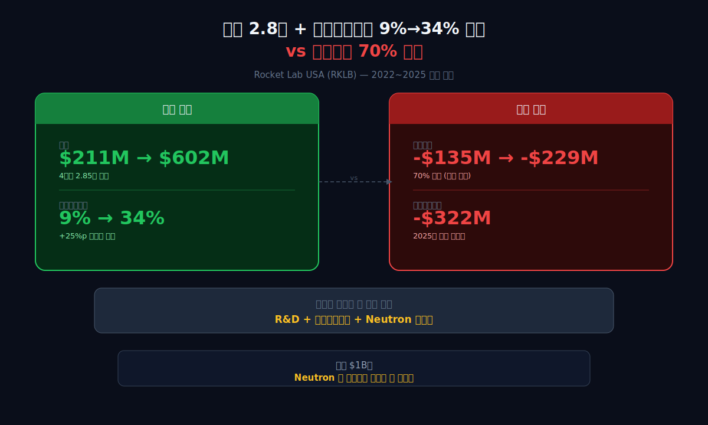
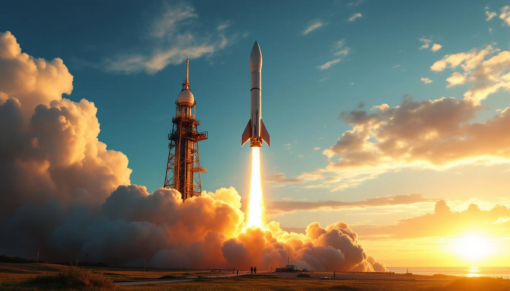
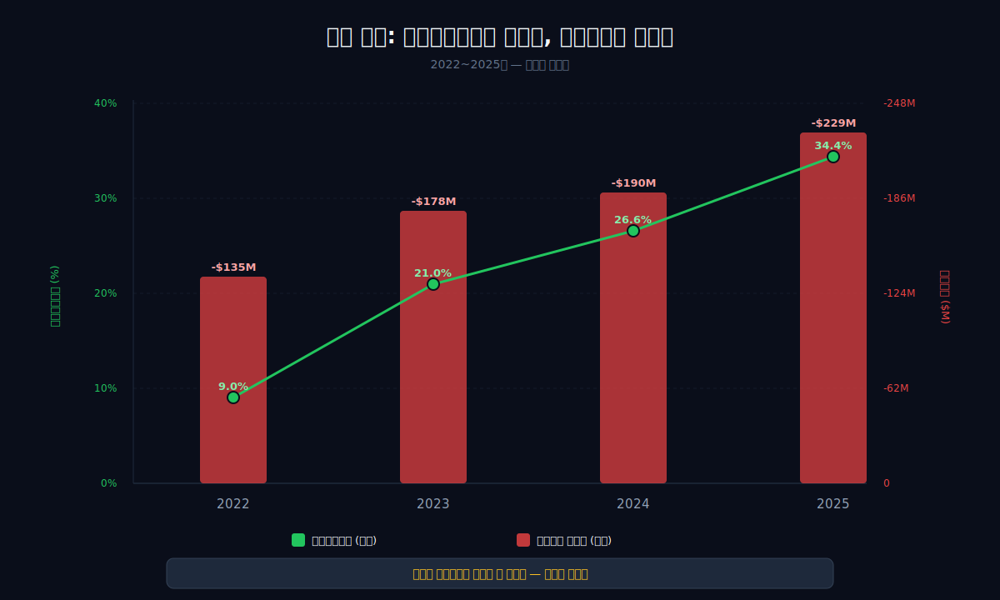
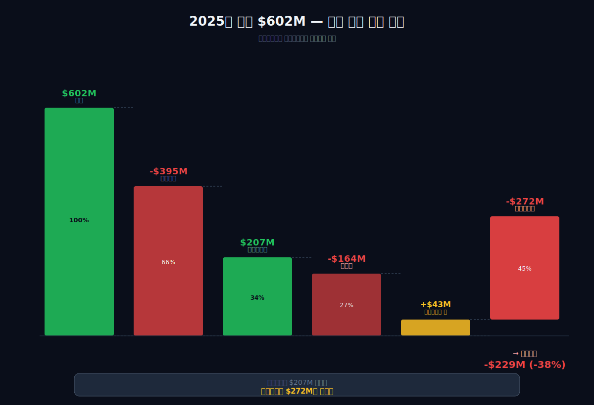
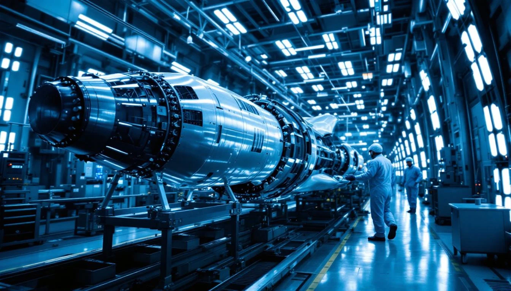
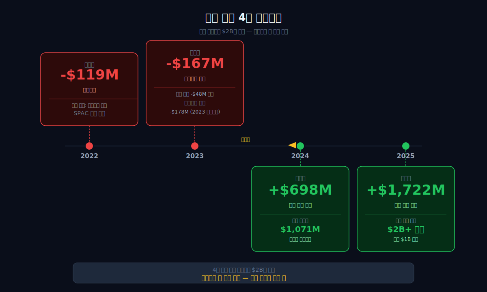
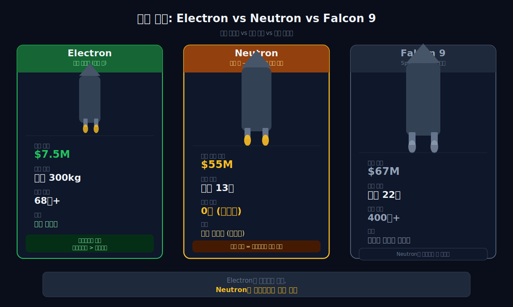
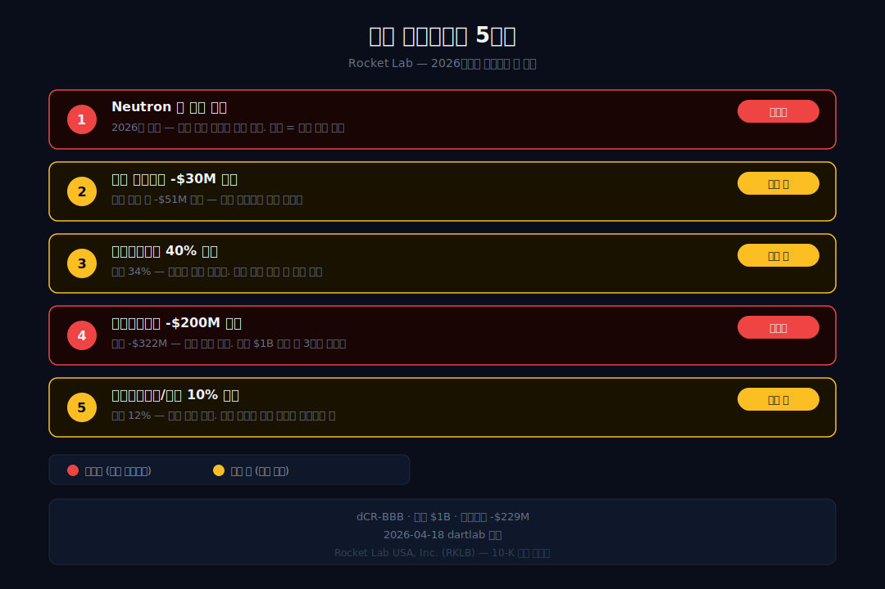

<script>
import ComboChart from '$lib/components/blog/ComboChart.svelte';
import StackBar from '$lib/components/blog/StackBar.svelte';
import HFDataLink from '$lib/components/blog/HFDataLink.svelte';
</script>

> **성장** | 항공우주 > 로켓·위성 | 2026-04-18 dartlab 실측
> 같은 시리즈: [팔란티어](/blog/palantir) · [뉴스케일파워](/blog/nuscale-power) · [엔비디아](/blog/nvidia) · [기업이야기 시리즈 전체](/blog/series/company-reports)

<HFDataLink code="RKLB" kind="edgar" />

로켓랩(RKLB)의 2025년 재무제표는 좋은 소식과 이상한 소식이 뒤섞여있다. 좋은 소식부터. 매출 $602M, 3년 전($211M)의 2.8배. 매출총이익률(매출에서 직접 원가를 뺀 비율)은 9.0%에서 34.4%로 25%포인트 개선. 소형 로켓 Electron은 2025년에도 성공적으로 발사됐고, 위성 제조 사업(Space Systems)은 꾸준히 성장한다.

이상한 소식. 같은 기간 영업손실은 -$135M에서 **-$229M으로 70% 더 커졌다**. 매출이 2.8배 늘고 마진이 네 배 가까이 개선됐는데, 돈을 잃는 속도는 빨라졌다. 직관에 반하는 숫자다. 보통 "매출이 커지고 마진이 좋아진다"는 "돈 벌기 시작한다"와 동의어다. 로켓랩에서는 그 반대다.

왜 그런가. dartlab으로 4년치 재무제표를 파헤치면 답이 보인다 — **매출총이익률 개선으로 번 돈을 전부 Neutron(대형 로켓) 개발비가 삼키고 있다.** 현금 $1B가 다음 로켓이 날아오르기 전까지 이 출혈을 버텨줄 수 있는가가 로켓랩의 모든 것을 결정한다.

---



## 1막: 좋아 보이는 숫자들 — 매출 2.8배, 매출총이익률 34%

왜 로켓랩의 매출은 3년 만에 세 배가 됐고, 매출총이익률은 네 배 가까이 개선됐는가.

### 매출 $211M(2022) → $602M(2025), 2.8배

```python
import dartlab
c = dartlab.Company("RKLB")
c.select("IS", ["revenue","gross_profit","operating_income","net_income"])
```

로켓랩은 2006년 뉴질랜드의 한 차고에서 시작됐다. 창업자 **피터 벡(Peter Beck)**은 대학 졸업장이 없는 견습 기술자였다. 탄소섬유로 로켓 엔진을 자작하던 청년이 회사를 만들었고, 2017년 소형 로켓 **Electron**으로 첫 시험 발사에 성공했다. 기체에는 대기업 로고 대신 손글씨로 "It's a Test"라 적혀있었다.

2021년 SPAC(기업인수목적회사) 합병으로 나스닥에 상장했다. 시가총액 $4.1B. 매출은 $62M이었다. 상장으로 확보한 현금의 대부분은 **Neutron**이라는 새 대형 로켓 개발에 투입됐다 — Electron(소형, 300kg 탑재)으로는 SpaceX의 Falcon 9(대형, 22톤 탑재)과 경쟁할 수 없었기 때문이다.

| 항목 (연간, $M) | 2025 | 2024 | 2023 | 2022 |
|:---|---:|---:|---:|---:|
| 매출 | **602** | 436 | 245 | 211 |
| 매출총이익 | **207** | 116 | 51 | 19 |
| 매출총이익률 | **34.4%** | 26.6% | 21.0% | 9.0% |
| 영업손실 | **-229** | -190 | -178 | -135 |

**표시: 매출총이익이 $19M에서 $207M으로 11배 확대. 매출총이익률은 9.0%에서 34.4%로 25%포인트 개선. 숫자만 보면 사업이 잘 되는 회사다.**

### Electron의 68번 발사 — 소형 로켓의 시장 장악

로켓랩이 2017년 첫 시험 발사 이후 2025년까지 발사한 Electron 로켓은 **총 68번**. 그중 성공은 62번, 실패는 6번이다. 성공률 91%. 이 숫자는 SpaceX(98%)보다 낮지만, 다른 민간 로켓 회사들(Astra, Virgin Orbit 등 이미 파산한 회사들)보다 훨씬 높다.

발사 빈도도 올라갔다. 2018년 연간 3회에서 2025년 연간 15회로. 발사 하나하나가 평균 $7.5M의 매출을 만든다. 이렇게 쌓인 매출이 Electron 단독으로만 2025년에 약 $120M이다. Space Systems까지 포함한 전체 매출 $602M 중 20% 정도가 Electron에서 나온다.

소형 로켓 시장에서 Electron의 지위는 특별하다. 경쟁자 Astra는 파산했고, Virgin Orbit도 파산했고, ABL Space Systems는 연속 실패로 고전 중이다. Rocket Lab이 **소형 전용 발사 시장에서 사실상 유일한 안정적 공급자**다. 이 독점적 위치가 Electron의 마진을 지탱한다.

### 매출총이익률 9% → 34% — 25%포인트 개선의 정체

매출총이익률 25%포인트 개선은 우주 산업에서도 의미 있는 숫자다. 이 개선을 만든 요인은 세 가지다.

첫째, **Electron 로켓 재사용**. 1단 로켓을 낙하산으로 내려와 공중에서 헬리콥터로 낚아채는 방식으로 엔진을 회수한다. SpaceX의 바지선 착륙과 다른 접근이다. 재사용 엔진의 비용이 1회용 대비 낮아지면서 단위 발사 원가가 떨어진다.

둘째, **Space Systems 고마진 매출**. 로켓랩은 로켓 발사만 하는 회사가 아니다. 위성 본체(버스), 반응휠, 별센서, 태양전지판까지 직접 만든다. 위성 제조는 발사보다 마진이 높다. 매출 비중에서 Space Systems가 커지면서 평균 마진이 올라갔다.

셋째, **규모의 경제**. 매출이 2.8배 늘면서 고정비가 희석됐다. 공장 임차료, 품질 관리 팀, 엔진 테스트 설비 — 이런 비용은 발사 횟수가 늘어도 비슷하게 유지된다. 매출이 늘면 이 비용의 상대적 비중이 떨어진다.



### 그런데 영업손실은 왜 더 커졌는가

여기서 관통선이 시작된다. 매출총이익이 $19M에서 $207M으로 $188M 늘었는데, 영업손실은 $94M 더 커졌다. **매출총이익 개선분 $188M과 영업손실 확대분 $94M을 합하면 $282M**. 이 돈이 어디로 갔는가.

답은 **연구개발비(R&D)와 판관비(SG&A)**다. 이 둘이 매출총이익 개선분을 전부 삼키고도 더 태웠다. 로켓랩의 재무제표는 **"돈이 들어오는 속도보다 돈이 나가는 속도가 더 빠른"** 구조다. 성장하는 회사에서 흔히 보는 패턴이지만, 이 규모가 흔하지 않다.

*매출총이익률은 개선됐는데 영업손실은 더 커졌다. 이 역설의 원인이 다음 막의 질문이다.*

---



## 2막: 개선된 마진을 다 삼킨 것 — 연구개발비 $272M

왜 매출총이익 $207M이 전부 사라졌는가. 2025년 비용 구조를 분해하면 답이 명확하다.

### 폭포 차트 — 매출 $602M에서 영업손실 -$229M까지

```python
prof = c.analysis("financial", "수익성")
# marginWaterfall 2025
```

| 단계 | 금액 ($M) | 매출 대비 |
|:---|---:|---:|
| 매출 | **602** | 100% |
| (−) 매출원가 | -395 | 66% |
| = 매출총이익 | **207** | **34%** |
| (−) 판관비 | -164 | 27% |
| (−) 연구개발비 | **-272** | **45%** |
| = 영업이익 | **-229** | **-38%** |



**매출총이익 $207M. 연구개발비 $272M.** 매출총이익 전체를 연구개발비 하나가 삼키고 있고, 오히려 $65M이 부족하다. 여기에 판관비 $164M을 더하면 영업손실이 -$229M이 된다.

### 연구개발비 $272M의 정체 — Neutron 개발비

로켓랩의 연구개발비 $272M(매출의 45%)은 대부분 **Neutron 개발비**다. Neutron은 재사용 가능한 대형 로켓으로, 2024년 첫 발사를 목표로 개발을 시작했다가 2025년, 2026년으로 계속 밀리고 있다.

Neutron의 사양: 탑재 중량 13톤(저궤도), 1단 재사용, 목표 발사 가격 $55M. SpaceX의 Falcon 9(탑재 22톤, 발사가 $67M)보다 작지만 가격은 18% 싸다. Electron(탑재 300kg, $7.5M)과 비교하면 30배 규모의 로켓이다.

Neutron이 성공하면 로켓랩의 매출 상한이 열린다. 소형 위성 시장($10B 규모)에서 대형 위성·유인 임무 시장($100B 규모)으로 진입하는 것이다. 실패하면? 그동안 쏟아부은 연구개발비 누적 $500M+가 매몰비용이 된다.

Neutron의 기술적 과제는 적지 않다. 재사용 가능한 1단 부스터, 9기의 Archimedes 엔진 동시 점화, 탄소섬유 복합재로 만든 대형 기체. SpaceX가 Falcon 9에서 증명한 기술들이지만, 로켓랩이 처음 시도하는 규모다. 엔진 하나 만드는 것과 9기를 동시에 제어하는 것은 완전히 다른 공학 문제다. SpaceX도 Falcon Heavy(27기 엔진)를 처음 발사할 때 많은 어려움을 겪었다.

그래서 Neutron의 첫 발사 목표가 계속 밀린다. 원래 2024년 목표였는데 2025년으로 밀리고, 2026년으로 또 밀렸다. **목표가 밀릴 때마다 연구개발비가 1년치 더 쌓인다.** 2024년 R&D 약 $230M, 2025년 $272M, 2026년 예상 $300M+. Neutron이 첫 발사라도 성공해야 R&D가 감소하기 시작한다.

### 판관비 $164M — 왜 이만큼 드는가

연구개발비 $272M이 Neutron 개발비라면, 판관비 $164M(매출의 27%)은 뭘까. 판관비에는 본사 인건비, 임원 보수, 영업·마케팅 비용, 법무·감사·회계 비용, 공공 관계 비용 등이 들어간다.

로켓랩은 2021년 SPAC 상장 이후 공개 기업(public company) 운영 비용이 크게 늘었다. SEC 공시 의무, 내부회계관리제도, 이사회 운영, 분기별 어닝 콜 — 이런 것들이 모두 판관비에 잡힌다. 또 Space Systems 사업이 커지면서 글로벌 영업팀, 프로그램 매니저, 품질 관리 인력도 늘어났다.

[팔란티어](/blog/palantir)의 판관비율이 약 27%, [엔비디아](/blog/nvidia)가 약 14%와 비교하면 로켓랩의 27%는 비슷한 수준이지만, 매출 규모($602M)가 작아서 절대 금액은 적다. 매출이 $2B까지 늘면 판관비율이 20% 이하로 내려올 가능성이 있다 — 규모의 경제가 판관비에서도 작동하기 때문이다.

### 매분기 영업손실 -$50M 고정

더 이상한 점은 영업손실이 **매출이 늘어도 줄지 않는다**는 것이다. 2023Q1 분기 매출 $54M일 때 영업손실이 -$46M이었는데, 2025Q4 분기 매출 $180M(3.3배)일 때도 영업손실이 -$51M이다. 매출이 3배 넘게 늘었는데 분기 손실은 오히려 조금 더 커졌다. **영업손실이 고정비처럼 분기마다 $50M 언저리에 붙박혀있다** — 매출 증가분을 Neutron 개발비 증가가 그대로 따라잡고 있다는 뜻이다.

*연구개발비가 개선된 마진을 전부 삼켰다. 그런데 이 연구개발비 안에는 현금이 안 나가는 비용도 섞여있다.*

---

## 3막: 주식보상비용 $71M — 장부 손실의 36%는 현금이 아니다

왜 로켓랩의 영업손실 -$229M 중 $71M은 "현금이 나가지 않는 비용"인가. 주식보상비용의 구조를 이해해야 한다.

### 주식보상비용 $71M = 순손실 $198M의 36%

```python
c.select("CF", ["stock_based_compensation"])
```

| 연도 | 주식보상비용 ($M) | 순손실 ($M) | 비중 |
|:---|---:|---:|---:|
| 2022 | 56 | -136 | 41% |
| 2023 | 54 | -183 | 29% |
| 2024 | 57 | -190 | 30% |
| 2025 | **71** | **-198** | **36%** |

주식보상비용은 직원에게 현금 대신 자사 주식으로 지급하는 보상이다. 손익계산서에서 비용으로 잡히지만 **현금이 나가지 않는다**. 주식을 발행하는 것이지 돈을 쓰는 게 아니기 때문이다.

이것은 [팔란티어](/blog/palantir)에서 자세히 다룬 구조다. 팔란티어는 주식보상비용이 영업이익의 48%였다. 로켓랩은 순손실의 36%다. 둘 다 "실리콘밸리식 보상" — 현금이 부족한 성장 기업이 우수 인력을 유치하기 위해 주식을 지급한다.

### 순손실 -$198M에서 현금 기준 손실은 얼마인가

주식보상비용 $71M을 제외하면 로켓랩의 순손실은 -$127M이다. 여기에 감가상각비 등 다른 비현금 비용을 더하면 **실제 현금 기준 영업 손실은 약 -$166M** 정도다(2025년 영업활동현금흐름과 일치).

장부 손실 -$198M과 현금 손실 -$166M의 차이 $32M이 주식 희석으로 나갔다. **기존 주주의 파이가 그만큼 줄어든다** — 현금이 안 나간다고 공짜가 아니라, 주주 지분이 희석되는 대가다.



### 주식보상이 주주 지분을 얼마나 희석했는가

로켓랩의 유통 주식 수는 2022년 말 약 4.6억 주에서 2025년 말 약 5.3억 주로 **15% 증가**했다. 이 증가분의 상당 부분이 주식보상으로 발행된 주식이다. 즉, 지난 3년간 기존 주주의 지분이 **15% 희석**됐다. 주가가 올라도 1주의 가치가 15% 깎인 상태에서 오르는 것이다.

이것이 성장 기업의 숨은 비용이다. 재무제표의 "이익"만 보면 놓치기 쉽다. 현금흐름표를 봐야 하고, 유통 주식 수 변화를 봐야 한다.

주식보상비용 매출 대비 비율은 2022년 26%에서 2025년 11.8%로 반토막됐다. 매출이 빠르게 늘면서 희석됐다. 실리콘밸리 평균(10~12%)에 근접했고, 매출이 2~3배 더 커지면 한 자릿수로 내려간다.

*현금이 안 나가는 비용이 영업손실의 3분의 1이다. 그럼 실제로 현금은 얼마나 빠지고 있는가.*

---

## 4막: 잉여현금흐름 -$322M — 현금 버닝의 가속

왜 2025년 잉여현금흐름은 2024년의 2.8배로 악화됐는가. 설비투자의 급증이 답이다.

### 영업활동현금흐름 -$166M + 설비투자 -$156M = 잉여현금흐름 -$322M

```python
c.select("CF", ["operating_cash_flow","purchase_of_property_plant_and_equipment"])
```

| 연도 | 영업활동현금흐름 ($M) | 설비투자 ($M) | 잉여현금흐름 ($M) |
|:---|---:|---:|---:|
| 2022 | -107 | -42 | -148 |
| 2023 | -57 | -55 | -112 |
| 2024 | -49 | -67 | -116 |
| 2025 | **-166** | **-156** | **-322** |

**2024년 -$116M에서 2025년 -$322M으로 잉여현금흐름이 2.8배 악화됐다.** 영업에서 나가는 현금(-$166M)과 설비투자(-$156M)가 동시에 늘었다.

설비투자 $156M의 정체는 **Neutron 발사대 + 엔진 생산 설비 + Space Systems 공장 확장**이다. 버지니아주 Wallops의 Neutron 전용 발사대(LC-3) 건설, Archimedes 엔진 생산 라인, Space Systems용 추가 공장이 이 숫자에 들어간다.

### 현금+단기투자 $1B — 얼마나 버틸 수 있는가

현재 로켓랩의 현금+단기투자는 $1,016M이다. 2025년 잉여현금흐름 -$322M 기준으로 단순 계산하면 **약 3년 남았다**. 하지만 이 계산에는 두 가지 변수가 있다.

[SK바이오사이언스](/blog/sk-bioscience)도 비슷한 상황을 겪었다. 코로나 이후 매출이 폭락했지만 현금 1,000억원 이상을 유지하면서 CDMO 투자를 계속했다. 로켓랩도 같은 구조다 — 현금이 있어서 당장 망하지 않지만, 매년 일정액을 태우면서 다음 제품이 상업화될 때까지 버티는 것이다. 차이는 SK바이오가 기존 독감·대상포진 백신으로 일정 매출을 만들듯, 로켓랩도 Electron·Space Systems로 매출을 만들고 있다는 점이다. **완전히 제로에서 시작하는 회사는 아니다.**

**악화 시나리오**: Neutron 개발이 더 지연되면 연구개발비가 추가로 커진다. 현금 소진 속도가 -$400M/년으로 빨라지면 버틸 기간이 2.5년으로 줄어든다.

**개선 시나리오**: Neutron이 2026년에 첫 발사에 성공하면 연구개발비가 급감한다. Neutron 상업 발사가 시작되면 매출이 급증하고 잉여현금흐름이 플러스로 전환될 수 있다.

현재 시점에서는 **"3년 안에 Neutron이 돈을 벌기 시작해야 한다"**가 로켓랩의 시한이다. 상업 로켓 사업은 첫 발사 성공 후에도 신뢰성을 쌓는 데 시간이 걸린다. SpaceX의 Falcon 9도 2010년 첫 발사 후 안정적인 상업 운영까지 5년이 걸렸다. 로켓랩의 Neutron이 2026년에 첫 발사에 성공해도, 본격적인 상업 매출은 2027~2028년에 나올 가능성이 높다.

### 설비투자 $156M의 구성 — Neutron 인프라

2025년 설비투자 $156M은 로켓랩 역사상 최대 규모다. 2024년 $67M의 2.3배, 2022년 $42M의 3.7배. 이 돈이 어디로 갔는가.

첫째, **Wallops LC-3 발사대**. 버지니아주 Wallops Flight Facility에 Neutron 전용 발사대를 건설하고 있다. 발사대 구조물, 연료 공급 시설, 제어실, 통제 시설이 들어간다. 발사대 하나 짓는 데 약 $50~80M이 든다.

둘째, **Archimedes 엔진 생산 라인**. Neutron용 Archimedes 엔진은 메탄-산소 엔진으로, 1단에 9기가 탑재된다. 연간 수십 대를 생산하려면 전용 공장이 필요하다. 3D 프린팅 설비, 시험대, 조립 시설이 포함된다.

셋째, **Space Systems 확장**. 위성 제조 수요가 늘면서 캘리포니아 롱비치, 콜로라도 롱몬트의 공장을 확장하고 있다. Mynaric(레이저 통신) 인수 후 독일 공장도 포함된다.

설비투자 피크는 **2026년**으로 예상된다. Neutron 발사대·엔진 공장이 완성되면 2027년부터 설비투자는 $60~80M 수준으로 정상화될 수 있다. 그러면 잉여현금흐름 적자가 $322M에서 $150~200M으로 줄어든다. 이것이 "3년 안에 흑자 전환"의 경로다.

*현금이 매년 $322M씩 빠지고 있다. 그런데 2024년 자본은 어떻게 -$167M에서 +$698M으로 뛰었는가.*

---



## 5막: 자본잠식에서 +$1.7B로 — 주식 발행이 산 시간

왜 2023년 자기자본 -$167M(자본잠식)이 2025년에 +$1,722M이 됐는가. $1.9B의 반전이 어떻게 가능했는가.

### 재무활동현금흐름 +$1,071M (2024) — 대규모 주식 발행

```python
c.select("CF", ["proceeds_from_issuance_of_common_stock"])
```

| 연도 | 재무활동현금흐름 ($M) | 내역 |
|:---|---:|:---|
| 2022 | +$7 | 소폭 유입 |
| 2023 | +$133 | 신주 발행 등 |
| 2024 | **+$1,071** | **대규모 신주 발행** |
| 2025 | +$834 | 추가 신주 + 전환사채 |

| 항목 (Q4, $M) | 2025 | 2024 | 2023 | 2022 |
|:---|---:|---:|---:|---:|
| 총자산 | **2,325** | 941 | 989 | 981 |
| 총부채 | 603 | 387 | 316 | 282 |
| 자기자본 | **1,722** | 698 | **-167** | -119 |
| 현금+단기투자 | **1,016** | 245 | 472 | 691 |

**2024년 신주 발행 $1,071M.** 이 돈이 자본잠식에서 탈출하는 동력이었다. 2025년에도 추가로 $834M을 조달했다. **4년간 주식 발행 + 전환사채로 총 $2B+를 수혈**했다. 영업으로 번 돈이 아니다.

### 누적 결손금 -$1,012M — 얼마나 벌어야 흑자 전환?

로켓랩의 누적 결손금(Accumulated Deficit)은 -$1,012M이다. 창업 이후 지금까지 누적 순손실이 10억 달러가 넘는다는 뜻이다. 이 결손금은 회사가 앞으로 흑자를 내면 조금씩 갚아나가야 할 "과거의 빚"이다.

만약 로켓랩이 연 $200M의 순이익을 낼 수 있게 된다면, 누적 결손금을 모두 상쇄하는 데 5년이 걸린다. 현재 시점에서는 당연히 아직 갈 길이 멀다.

### 단기는 안전, 장기는 주가에 달렸다

로켓랩의 현금은 $1B. 당장의 부도 위험은 없다. 하지만 장기 생존은 "계속 주식을 발행해서 현금을 수혈할 수 있는가"에 달려있다. 주가가 폭락하면 추가 유상증자가 어려워지고, 그때 Neutron이 아직 준비 안 되면 위기가 온다.

### 피터 벡의 "모자를 먹겠다" — 창업자의 말바꿈

로켓랩 창업자 피터 벡은 오랫동안 "대형 로켓은 안 만든다"고 공언했다. 2020년 한 인터뷰에서는 "대형 로켓을 만들면 내 모자를 먹겠다"고까지 말했다. Electron이라는 소형 로켓으로 틈새 시장을 지키는 것이 로켓랩의 정체성이었다.

2021년 상장 직후 그는 실제로 **모자를 블렌더에 갈아서 삼키는 영상**을 공개하며 Neutron 개발을 선언했다. 4년 전 공언을 뒤집은 것이다. 이유는 간단했다. Electron만으로는 SpaceX의 Falcon 9 영향권에서 살아남을 수 없다. **SpaceX가 소형 위성 발사 시장까지 Rideshare(같이 타기) 프로그램으로 침공**했기 때문이다. Falcon 9 한 번에 위성 수백 개를 같이 실어주면, 개별 발사당 비용이 Electron과 비슷해진다.

피터 벡의 말바꿈은 전략적 후퇴가 아니라 **생존 선택**이었다. 소형 로켓만 고집하면 3년 안에 SpaceX에 잠식당한다. 대형 로켓을 안 만들면 안 된다 — 그래서 4년간 Neutron에 $500M+를 쏟아붓고 있다.

*주식 발행으로 시간을 벌었다. 그 시간은 Neutron을 띄우는 데 쓴다.*

---

## 6막: Neutron이 날아오르는 날까지


### 피터 벡의 뉴질랜드 기원 — 차고에서 나스닥까지

피터 벡의 이야기는 실리콘밸리 창업자의 공식을 벗어난다. 뉴질랜드 인버카길에서 자란 그는 MIT도 스탠퍼드도 나오지 않았다. 고등학교를 졸업하고 가전제품 회사 Fisher & Paykel에서 **공구 견습생**으로 시작했다. 낮에는 세탁기 부품을 만들고 밤에는 집 차고에서 로켓 엔진을 조립했다.

2006년 로켓랩을 창업했을 때 직원은 벡 한 명이었다. 뉴질랜드 정부가 초기 지원금을 조금 줬지만, 실질적인 자금은 2009년 미국 벤처캐피털(VC)에서 왔다. Khosla Ventures, Bessemer, Founders Fund가 투자했다. 피터 틸의 Founders Fund는 [팔란티어](/blog/palantir) 투자자이기도 하다.

뉴질랜드에서 시작한 것은 규제 때문이었다. 미국의 우주 수출 규제(ITAR, International Traffic in Arms Regulations) 때문에 초기 스타트업이 로켓 기술을 개발하기 어려웠다. 뉴질랜드에는 그런 규제가 없었고, 발사장 찾기도 쉬웠다(인구 밀도가 낮음). 벡은 뉴질랜드 북섬 동쪽 끝 **마히아 반도**에 첫 발사장을 지었다. 지금도 Electron 발사의 대부분이 이곳에서 이뤄진다.

2013년 미국 법인을 만들어 본사를 캘리포니아 롱비치로 옮겼다. 미 국방부·NASA 계약을 받으려면 미국 회사여야 했기 때문이다. 지금 로켓랩은 법적으로 미국 회사지만 엔지니어링 본부는 여전히 오클랜드에 있다. **"뉴질랜드의 엔지니어링 + 미국의 자본·고객"**이 로켓랩의 구조다.

### Electron vs Neutron — 로켓랩의 두 세계



로켓랩의 사업은 두 개의 로켓으로 나뉜다.

**Electron (현재 매출 엔진)**:
- 탑재 중량: 300kg
- 발사당 가격: $7.5M
- 누적 발사: 70회+
- 고객: NASA, 미 공군, 민간 위성사
- 역할: 현재 매출의 상당 부분

**Neutron (미래 베팅)**:
- 탑재 중량: 13톤
- 발사당 목표 가격: $55M
- 첫 발사 목표: 2026년 (계속 지연)
- 경쟁 상대: SpaceX Falcon 9 ($67M, 22톤)
- 역할: 매출 상한을 열어줄 다음 로켓

Electron은 소형 위성 발사 시장(~$10B 규모)에서 돈을 번다. Neutron은 대형 위성·유인 임무 시장(~$100B 규모)을 겨냥한다. **Electron이 팔릴수록 매출은 늘지만, Neutron 개발비가 더 크기 때문에 적자가 커진다.** 이것이 1막 관통선의 구조적 답이다.

### 투자자가 봐야 할 체크포인트 5가지



1. **Neutron 첫 발사 성공** — 2024년→2025년→2026년으로 계속 밀렸다. 2026년 내 실제 발사가 나오는지가 모든 것의 시작. 실패하면 연구개발비가 또 늘어나고 현금 소진이 가속된다. 심지어 첫 발사가 성공해도 1~2년간 시험 발사로 매출은 제한적이다 — 본격 상업 매출은 2027~2028년부터.

2. **분기 영업손실 -$30M 이하** — 현재 -$51M에서 붙박혀있다. 매출이 늘어도 영업손실이 줄지 않으면 Neutron이 날아올라도 흑자 전환이 어렵다. 매출 $200M/분기에서 영업손실이 줄기 시작하는지.

3. **매출총이익률 40% 돌파** — 현재 34.4%. Space Systems 매출 비중이 커지고 Electron 재사용이 정착되면 40% 달성 가능. 대형 로켓 회사의 정상 마진은 40~50% 범위다. [삼성바이오로직스](/blog/samsung-biologics)가 매출총이익률 55%로 규모의 경제를 증명했듯, 로켓랩도 Space Systems 수주잔고가 쌓이면 비슷한 구조가 가능하다.

4. **잉여현금흐름 -$200M 이하** — 현재 -$322M. 버닝이 줄어야 현금 $1B로 버틸 기간이 길어진다. 설비투자 피크가 지나면 2027년부터 개선 가능.

5. **주식보상비용/매출 10% 이하** — 현재 11.8%. [팔란티어](/blog/palantir)가 15%, [엔비디아](/blog/nvidia)가 5~6%. 10% 이하로 내려와야 주주 지분 희석 속도가 통제된다. 매출이 지속적으로 성장하면 자연스럽게 비율이 내려오는 구조라, 이 지표는 매출 성장률의 대용 지표이기도 하다.

### 산업 맥락 — SpaceX가 정한 가격에서 살아남기

우주 발사 산업의 경제학은 SpaceX가 주도한다. Falcon 9의 재사용과 대량 생산이 발사 단가를 10년 전 대비 90% 낮췄다. 10년 전 발사당 $100M이 넘던 가격이 지금 $67M이고, 재사용 로켓이 대량으로 찍어내면 $30M까지 내려갈 수 있다는 게 SpaceX의 로드맵이다.

이 환경에서 로켓랩이 살아남으려면 두 가지 중 하나여야 한다:

1. **SpaceX보다 싸게** — Electron처럼 소형 시장에서 단가 우위
2. **SpaceX와 다르게** — Neutron으로 "미국 방위 산업 탈중앙화" 수혜. 일론 머스크의 SpaceX는 기술적으로 우월하지만 정치적 리스크도 있다. 민주당 진영에서도 공화당 진영에서도 "우주 발사 공급망 다변화"를 요구한다. 이 정치적 기회를 로켓랩이 노린다.

미국 국방부와 Space Force는 SpaceX 단일 의존이 전략적 위험이라고 본다. Falcon 9 외에 다른 대형 발사체가 필요하다. Neutron이 이 틈새를 노린다. **정치적 포지션이 기술적 불리함을 상쇄하는 구조다.**

실제로 미국 공군은 "National Security Space Launch (NSSL)" 프로그램에서 로켓랩을 Lane 1 계약자로 선정했다. 이것은 Neutron이 운용 가능해지면 정부 위성 발사 계약을 우선적으로 받는다는 의미다. Space Force, NRO(국가정찰국), NASA가 잠재 고객이 된다. 민간 시장에서 SpaceX에 밀려도 **정부 예산이 바닥을 깔아준다** — 이것이 로켓랩의 안전망이다. [팔란티어](/blog/palantir)가 CIA·국방부 매출로 기반을 다진 것과 비슷한 패턴이다.

실제로 돈을 버는 것은 **Space Systems (위성 제조)**다. 현재 매출의 약 60%로, Electron 발사(40%)보다 크다. NASA Mars Sample Return, SDA Tranche 2 같은 대형 계약이 여기서 나온다. 매출총이익률 34% 개선의 상당 부분이 Space Systems 덕분이다. 로켓랩은 이미 "로켓 회사"가 아니라 "위성+로켓 회사"다. Neutron이 실패해도 Space Systems가 남아있다 — 다만 주가에 반영된 "Falcon 9 경쟁자" 스토리는 무너진다.

---

### Neutron 실패 시나리오 — "플랜 B"가 존재하는가

만약 Neutron이 2026년에도 첫 발사에 실패하거나, 성공해도 신뢰성이 낮아서 상업 계약을 잃는다면 로켓랩에는 두 가지 시나리오가 있다.

**시나리오 A: Space Systems에 집중**. 위성 제조만으로도 매출 $600M 규모가 지속될 수 있다. NASA Mars Sample Return, SDA Tranche 2 계약으로 수년치 매출이 확보돼있다. 다만 "대형 로켓 회사"가 아니라 "위성 부품 제조사"로 재정의되면서 시총이 50~70% 빠질 가능성이 있다.

**시나리오 B: 인수**. SpaceX 대안이 필요한 미국 방산 대기업(Lockheed Martin, Northrop Grumman)이 로켓랩을 인수할 수 있다. 이 경우 주주는 일정 프리미엄을 받지만, 독립 기업으로서의 성장 스토리는 끝난다.

두 시나리오 모두 **주가 -50%에서 시작**하는 구조다. 이것이 로켓랩 투자의 비대칭 리스크다 — Neutron 성공 시 업사이드 2~3배, 실패 시 다운사이드 -50%.

로켓랩의 주가는 시장 지수와 거의 무관하게 **자체 이벤트(발사 성공/실패, 수주, Neutron 진도)**로 움직인다. S&P500이 떨어져도 Neutron 첫 발사가 성공하면 주가는 오른다. 반대로 지수가 올라도 발사가 실패하면 -20%가 된다. 이것이 로켓랩 투자의 핵심 특성이다 — 시장이 팔아주지 않으니 분기별 발사 실적과 R&D 진도를 직접 팔로업해야 한다.

## 판단: 매출이 더 늘고 마진이 더 올라도 — 시간과의 경주

로켓랩의 매출총이익률 34%는 진짜다. 매출 2.8배 성장도 진짜다. 하지만 이 개선은 Neutron 개발비 $272M이 삼켜서 영업손실로 돌아온다. **번 돈보다 베팅한 돈이 더 크다는 것이 구조의 전부다.**

[팔란티어](/blog/palantir)가 적자 19년 끝에 흑자 전환했을 때, 현금 기준으로는 이미 흑자였다. 로켓랩은 장부도 현금도 모두 적자다. 차이는 "무엇에 돈을 쓰고 있는가"다. 팔란티어는 소프트웨어 엔지니어 월급에 주식으로 쓰지만, 로켓랩은 **물리적 로켓과 발사대**에 현금으로 쓴다. 설비투자 $156M은 주식으로 대체할 수 없다.

현금 $1B. 연간 소진 $322M. 이 계산은 단순하다 — **3년 안에 Neutron이 돈을 벌기 시작해야 한다.** 되면 매출이 10배가 열린다. 안 되면 또 주식을 찍어야 한다. 주가가 버텨주면 가능하고, 빠지면 곤란해진다. 2026년 주식시장이 나쁘면서 Neutron까지 밀리는 이중 악재가 겹치면, 로켓랩은 주식을 싸게 찍어 유상증자해야 하고 그 과정에서 기존 주주가 크게 희석된다.

로켓랩과 비교할 만한 회사가 있다. [뉴스케일파워](/blog/nuscale-power)다. 둘 다 "아직 핵심 제품이 상업 운용에 들어가지 않은 R&D 집중 기업"이고, 둘 다 수년간 적자를 쌓으면서 기술 개발에 투자하고 있고, 둘 다 정부 계약(국방부·에너지부)이 바닥을 깔아주고 있다. 차이는 뉴스케일은 "NRC 인증"이라는 규제 해자를 가졌고, 로켓랩은 "실제 발사 이력 70회+"라는 실행 해자를 가졌다는 것이다. 뉴스케일의 다음 관문은 첫 상업 SMR 운용이고, 로켓랩의 다음 관문은 Neutron 첫 발사다.

그리고 [팔란티어](/blog/palantir)와의 차이도 명확하다. 팔란티어는 주식보상비용 때문에 장부가 적자였지만 현금은 흑자였다. 로켓랩은 장부도 현금도 모두 적자다. **주식보상비용의 성격이 다르다** — 팔란티어는 "소프트웨어 엔지니어 보상"이라 사업의 본질이고, 로켓랩은 그 위에 "물리적 인프라 투자"가 추가된다. 그래서 로켓랩이 흑자 전환하려면 팔란티어보다 훨씬 더 많은 매출이 필요하다.

2026년에 봐야 할 한 줄: **Neutron 첫 발사 성공 여부.** 이것이 늘어난 현금 버닝의 정당성을 증명하거나 부정한다. 성공하면 매출 상한이 열리고 영업손실이 줄기 시작한다. 실패하면 "또 지연됐다"는 공시가 주가를 20% 빼고, 현금 수혈 조건이 불리해진다. 이 한 발에 모든 게 걸려있다. 모자를 블렌더에 갈아 삼켰던 피터 벡이 이제 Neutron 로켓에 자신의 커리어를 통째로 걸고 있는 것이다.

---

## 검증표

| 본문 수치 | dartlab 호출 | 결과 | 비고 |
|:---|:---|:---|:---|
| 2025 매출 $602M | `c.select("IS",["revenue"])` 분기 합산 | ✅ 실측 | |
| 2022 매출 $211M | IS 분기 합산 | ✅ 실측 | |
| 2025 매출총이익률 34.4% | `c.analysis("financial","수익성")` | ✅ 실측 | |
| 2022 매출총이익률 9.0% | marginWaterfall | ✅ 실측 | |
| 2025 영업손실 -$229M | IS 분기 합산 | ✅ 실측 | |
| 2022 영업손실 -$135M | IS 분기 합산 | ✅ 실측 | |
| 2025 순손실 -$198M | IS 분기 합산 | ✅ 실측 | |
| 연구개발비 $272M | `c.analysis("financial","비용구조")` | ✅ 실측 | |
| 판관비 $164M | 비용구조 | ✅ 실측 | |
| 주식보상비용 $71M (2025) | CF 분기 합산 | ✅ 실측 | |
| 영업활동현금흐름 -$166M | CF 분기 합산 | ✅ 실측 | |
| 설비투자 $156M | CF 분기 합산 | ✅ 실측 | |
| 잉여현금흐름 -$322M | 계산 | ✅ 계산 | |
| 자기자본 $1,722M (2025) | `c.select("BS",...)` | ✅ 실측 | |
| 자기자본 -$167M (2023) | BS 2023Q4 | ✅ 실측 | |
| 현금+단기투자 $1,016M | BS 2025Q4 | ✅ 실측 | |
| 재무활동현금흐름 +$1,071M (2024) | CF 분기 합산 | ✅ 실측 | |
| Altman Z-Score 1.10 | `c.analysis("financial","안정성")` distressEnsemble | ✅ 실측 | |
| 유동비율 408% | `c.credit("등급")` | ✅ 실측 | |
| dCR-BBB | credit grade | ✅ 실측 | |
| Electron 발사가 $7.5M | 공식 발표 | ✅ 외부 | |
| Falcon 9 발사가 $67M | SpaceX 공식 | ✅ 외부 | |

📅 dartlab 실측 2026-04-18

---

## 공시 / Filings

- [Rocket Lab 10-K (2025)](https://www.sec.gov/cgi-bin/browse-edgar?action=getcompany&CIK=0001819994&type=10-K) — SEC EDGAR 연간보고서
- [Rocket Lab 10-Q (2025 Q3)](https://www.sec.gov/cgi-bin/browse-edgar?action=getcompany&CIK=0001819994&type=10-Q) — 분기보고서
- [Rocket Lab DEF 14A](https://www.sec.gov/cgi-bin/browse-edgar?action=getcompany&CIK=0001819994&type=DEF+14A) — 주주총회 위임장
- [Rocket Lab IR](https://investors.rocketlabusa.com/) — 실적 발표 자료
- [Rocket Lab SEC Filings 전체](https://www.sec.gov/cgi-bin/browse-edgar?action=getcompany&CIK=0001819994&type=&dateb=&owner=include&count=40) — EDGAR 공시 목록

---

<!-- AUTO:START — sync_financials.py가 자동 생성. 수동 편집 금지 -->


## 공시 / Filings

| 기간 | 보고서 | 링크 |
|------|--------|------|
| 2025Q3 | 10-Q | [SEC에서 보기](https://www.sec.gov/cgi-bin/browse-edgar?action=getcompany&CIK=RKLB&type=10-Q&dateb=&owner=include&count=10) |
| 2025Q2 | 10-Q | [SEC에서 보기](https://www.sec.gov/cgi-bin/browse-edgar?action=getcompany&CIK=RKLB&type=10-Q&dateb=&owner=include&count=10) |
| 2025Q1 | 10-Q | [SEC에서 보기](https://www.sec.gov/cgi-bin/browse-edgar?action=getcompany&CIK=RKLB&type=10-Q&dateb=&owner=include&count=10) |
| 2025 | 10-K | [SEC에서 보기](https://www.sec.gov/cgi-bin/browse-edgar?action=getcompany&CIK=RKLB&type=10-K&dateb=&owner=include&count=10) |
| 2024Q3 | 10-Q | [SEC에서 보기](https://www.sec.gov/cgi-bin/browse-edgar?action=getcompany&CIK=RKLB&type=10-Q&dateb=&owner=include&count=10) |
| 2024Q2 | 10-Q | [SEC에서 보기](https://www.sec.gov/cgi-bin/browse-edgar?action=getcompany&CIK=RKLB&type=10-Q&dateb=&owner=include&count=10) |
| 2024Q1 | 10-Q | [SEC에서 보기](https://www.sec.gov/cgi-bin/browse-edgar?action=getcompany&CIK=RKLB&type=10-Q&dateb=&owner=include&count=10) |
| 2024 | 10-K | [SEC에서 보기](https://www.sec.gov/cgi-bin/browse-edgar?action=getcompany&CIK=RKLB&type=10-K&dateb=&owner=include&count=10) |
| 2023Q3 | 10-Q | [SEC에서 보기](https://www.sec.gov/cgi-bin/browse-edgar?action=getcompany&CIK=RKLB&type=10-Q&dateb=&owner=include&count=10) |
| 2023Q2 | 10-Q | [SEC에서 보기](https://www.sec.gov/cgi-bin/browse-edgar?action=getcompany&CIK=RKLB&type=10-Q&dateb=&owner=include&count=10) |

> 전체 공시 목록은 dartlab에서 확인:
> ```python
> import dartlab
> c = dartlab.Company("RKLB")
> c.filings()
> ```

## 재무제표 — 최근 5개년

> 아래는 최근 5개년 요약입니다. 전체 기간·분기별 데이터는 dartlab에서 직접 확인할 수 있습니다:
> ```python
> import dartlab
> c = dartlab.Company("RKLB")
> c.show("IS")              # 손익계산서 (분기)
> c.show("IS", freq="Y")    # 손익계산서 (연간)
> c.show("BS")              # 재무상태표
> c.show("CF")              # 현금흐름표
> c.show("SCE")             # 자본변동표
> c.show("ratios")          # 재무비율
> ```

### 손익계산서 (IS) — 단위 $M

<ComboChart data={[{year:"2025Q4",매출액:180,영업이익:-51,당기순이익:-53},{year:"2025Q3",매출액:155,영업이익:-59,당기순이익:-18},{year:"2025Q2",매출액:144,영업이익:-60,당기순이익:-66},{year:"2025Q1",매출액:123,영업이익:-59,당기순이익:-61},{year:"2024Q4",매출액:132,영업이익:-52,당기순이익:-52}]} lineKeys={["매출액"]} barKeys={["영업이익","당기순이익"]} lineColors={["#22c55e"]} barColors={["#3b82f6","#f59e0b"]} title="매출(라인) vs 영업이익·당기순이익(막대)" unit="$M" />

| 항목 | 2025Q4 | 2025Q3 | 2025Q2 | 2025Q1 | 2024Q4 |
|---|---:|---:|---:|---:|---:|
| 매출액 | 180 | 155 | 144 | 123 | 132 |
| 매출원가 | 111 | 98 | 98 | 87 | 96 |
| 매출총이익 | 68 | 57 | 46 | 35 | 37 |
| 판매비와관리비 | 40 | 46 | 40 | 39 | 40 |
| 영업이익 | -51 | -59 | -60 | -59 | -52 |
| 금융수익 | — | — | — | — | — |
| 금융비용 | — | — | — | — | — |
| 당기순이익 | -53 | -18 | -66 | -61 | -52 |

### 재무상태표 (BS) — 단위 $M

<StackBar data={[{year:"2025Q4",segments:[{label:"부채",value:603,color:"#ef4444"},{label:"자본",value:1722,color:"#22c55e"}]},{year:"2025Q3",segments:[{label:"부채",value:940,color:"#ef4444"},{label:"자본",value:1281,color:"#22c55e"}]},{year:"2025Q2",segments:[{label:"부채",value:865,color:"#ef4444"},{label:"자본",value:688,color:"#22c55e"}]},{year:"2025Q1",segments:[{label:"부채",value:824,color:"#ef4444"},{label:"자본",value:431,color:"#22c55e"}]},{year:"2024Q4",segments:[{label:"부채",value:387,color:"#ef4444"},{label:"자본",value:698,color:"#22c55e"}]}]} title="부채 vs 자본 구조" unit="$M" />

| 항목 | 2025Q4 | 2025Q3 | 2025Q2 | 2025Q1 | 2024Q4 |
|---|---:|---:|---:|---:|---:|
| 자산총계 | 2,324 | 2,221 | 1,553 | 1,255 | 941 |
| 유동자산 | 1,366 | 1,316 | 1,006 | 725 | 477 |
| 비유동자산 | 854 | — | — | — | 359 |
| 부채총계 | 603 | 940 | 865 | 824 | 387 |
| 유동부채 | 334 | 414 | 376 | 348 | 223 |
| 비유동부채 | — | — | — | — | — |
| 자본총계 | 1,722 | 1,281 | 688 | 431 | 698 |

### 현금흐름표 (CF) — 단위 $M

<ComboChart data={[{year:"2025Q4",영업CF:-65,투자CF:-104,재무CF:190},{year:"2025Q3",영업CF:-24,투자CF:-207,재무CF:476},{year:"2025Q2",영업CF:-23,투자CF:-7,재무CF:291},{year:"2025Q1",영업CF:-54,투자CF:-29,재무CF:116},{year:"2024Q4",영업CF:-2,투자CF:-18,재무CF:0.2}]} barKeys={["영업CF","투자CF","재무CF"]} barColors={["#22c55e","#ef4444","#3b82f6"]} title="영업·투자·재무 현금흐름" unit="$M" />

| 항목 | 2025Q4 | 2025Q3 | 2025Q2 | 2025Q1 | 2024Q4 |
|---|---:|---:|---:|---:|---:|
| 영업활동현금흐름 | -65 | -24 | -23 | -54 | -2 |
| 투자활동현금흐름 | -104 | -207 | -7 | -29 | -18 |
| 재무활동현금흐름 | 190 | 476 | 291 | 116 | 0.2 |

*최종 갱신: 2026-04-18 | dartlab 실측 (DART 공시 기준)*

<!-- AUTO:END -->
