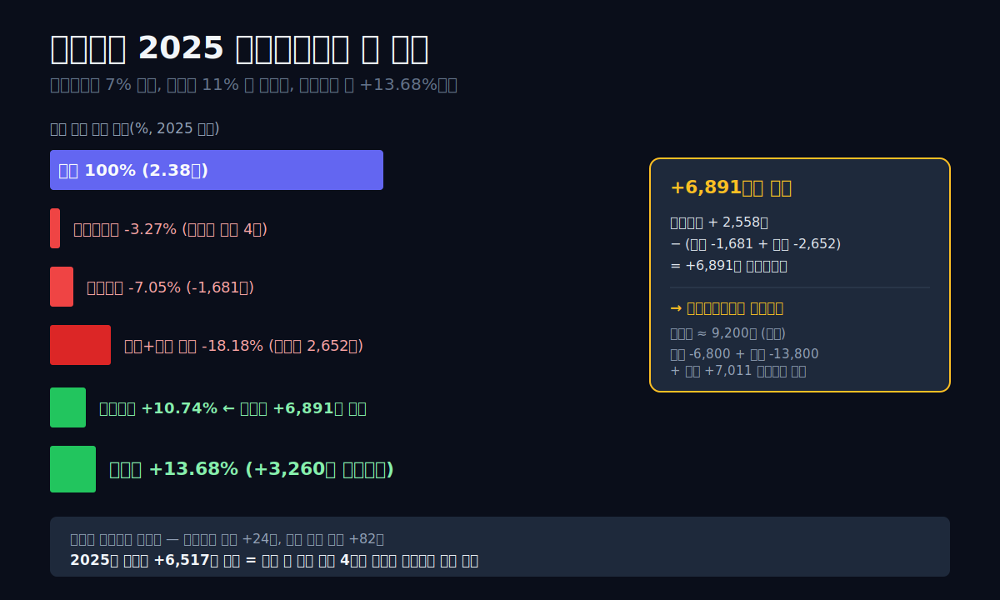
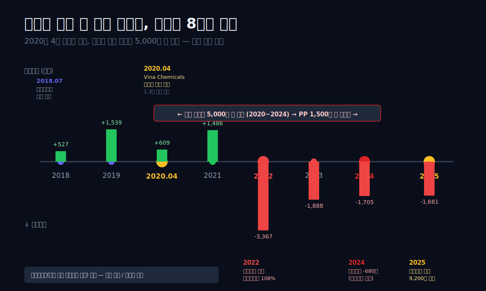
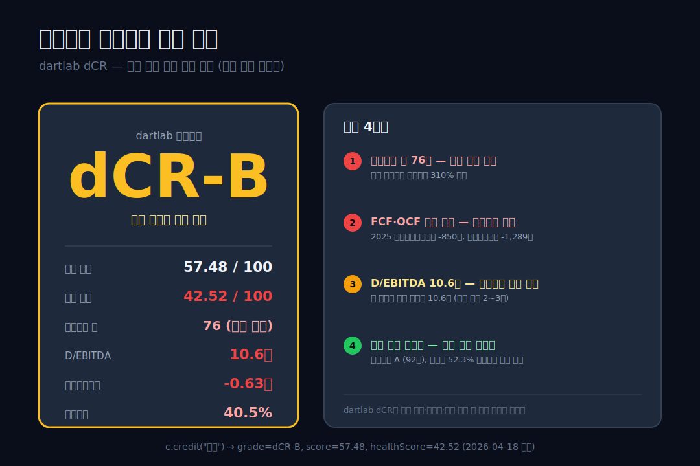
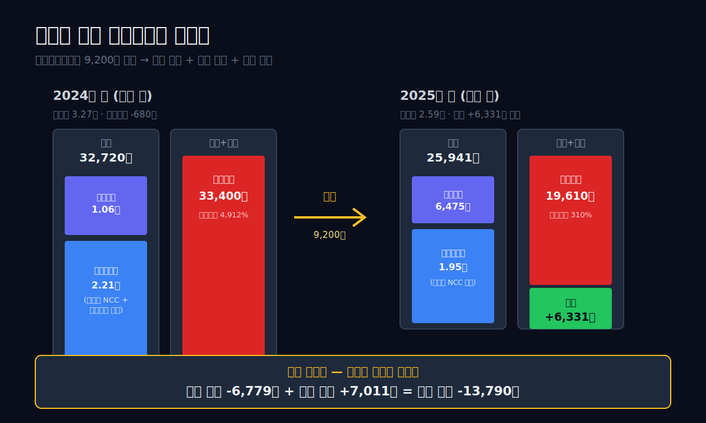
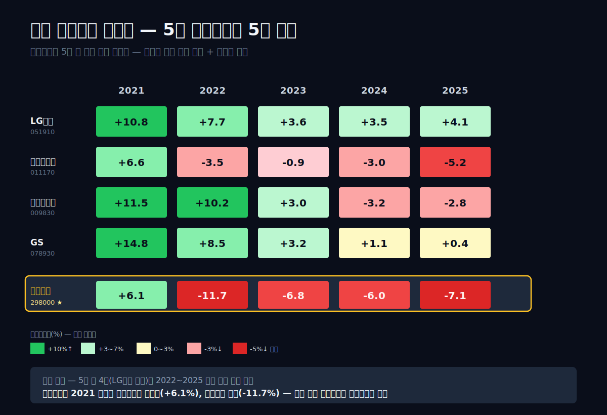
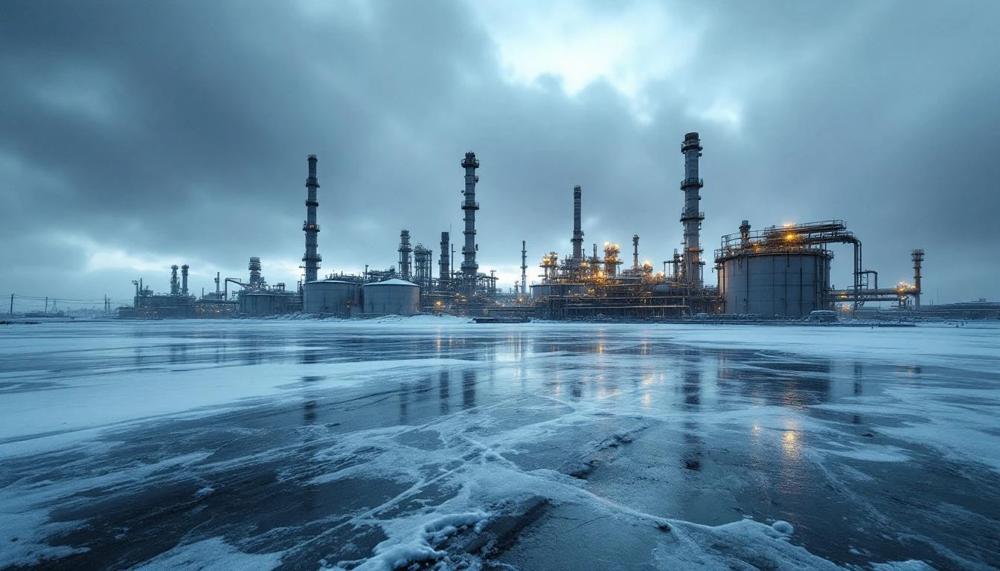
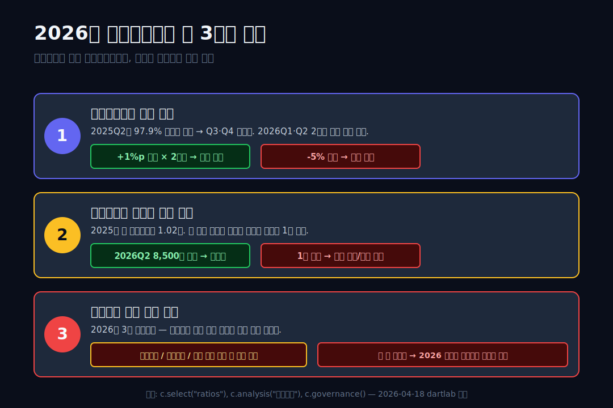

<script>
import ComboChart from '$lib/components/blog/ComboChart.svelte';
import StackBar from '$lib/components/blog/StackBar.svelte';
</script>

> **데이터 기준**: 2026-04-18 dartlab 실측 — 연결 재무제표(CFS) 기준
>
> **핵심 숫자**: 매출 2.38조 · 영업이익 **-1,681억** · 순이익 **+3,260억** · 부채비율 310% · 유동비율 40.5% · 신용등급 **dCR-B**

효성화학의 2025년 손익계산서는 두 얼굴을 갖는다. **팔면 팔수록 적자 나는 본업**(매출총이익률 -3.27%)과 **흑자로 마감한 순이익**(+3,260억)이 한 장의 표 안에 동거한다. 영업으로는 1,681억을 잃고, 이자로 2,652억을 잃고, 합쳐서 매출의 18%를 잃는 구조다. 그런데 연말 장부에는 자본총계가 -680억에서 +6,331억으로 돌아와 있다. 이 글은 그 **7,000억 원의 공백**을 추적한다.

관통선은 하나다. **"영업으로 7% 잃고 이자로 11% 잃는 회사가 2025년 자본잠식을 어떻게 피했는가 — 그리고 그건 진짜 탈출인가?"**

답은 단락마다 달라지지만, 6막이 끝나면 하나로 수렴한다. 매각으로 산 24개월의 시간. 그 시간 안에 중국 나프타분해설비 공급이 줄거나, 효성화학이 베트남 공장을 닫거나, 둘 중 하나가 와야 한다.



---

## 1막. 2025년 손익계산서의 두 얼굴 — 팔수록 적자인데 순이익은 +3,260억

**왜 매출총이익률 -3.27% 회사의 순이익이 +13.68% 인가.** 효성화학의 2025년 연간 실적은 일반 재무제표 해석 규칙을 뒤집는다. 보통 회사의 이익 계단은 매출에서 시작해 원가·판관비·이자·세금을 차례로 빼면서 점점 작아진다. 그런데 효성화학은 거꾸로다. 영업이익이 -7.05%로 바닥을 찍고 이자 때문에 -18.18%까지 내려갔다가, 세전이익에서 **+10.74%로 역전**된다. 이 역전은 재무 교과서에 없는 패턴이다.

### marginWaterfall — 영업까지는 바닥, 세전부터는 반전

dartlab의 수익성 분해 엔진이 단계별로 보여준다.

```python
import dartlab
c = dartlab.Company("298000")
prof = c.analysis("financial", "수익성")
prof["marginWaterfall"]["history"][0]  # 2025년
```

| 단계 (2025 연간) | 금액 (조원) | 매출 대비(%) |
|---|---:|---:|
| 매출 | **2.38** | 100.00 |
| 매출총이익 | **-0.08** | **-3.27** |
| 영업이익 | **-0.17** | **-7.05** |
| (영업 + 금융 누적) | -0.43 | **-18.18** |
| 세전이익 | **+0.26** | **+10.74** |
| **순이익** | **+0.33** | **+13.68** |

표시: 영업이익 **-1,681억**, 금융비용 **-2,652억** (둘 합쳐 -4,333억), 그런데 **세전이익은 +2,558억**. 중간에 **+6,891억**의 "영업외이익"이 들어왔다. 이 6,891억이 2025년 효성화학의 거의 모든 것이다.

### 중간에 들어온 +6,891억은 어디서 왔는가

회계상 분류로는 "기타영업외수익 및 손익" 안에 잡히지만, 숫자의 크기·시점·성격을 보면 출처가 선명하다. **특수가스사업부(NF3·SF6)의 외부 매각에서 발생한 차익**이다. 효성화학은 2024년 말부터 2025년 상반기에 걸쳐 이 사업부를 분리해 재무적 투자자에 양도했고, 매각 대금이 2025년 결산에 일회성 이익으로 찍혔다.

증거는 세 방향에서 맞아떨어진다. **첫째, 현금흐름표의 패턴.** 영업활동현금흐름은 2024년 -839억, 2025년 -850억으로 여전히 마이너스다. 매각차익이 현금흐름표에서는 "투자활동" 쪽으로 흘러갔다는 뜻이다(자산 처분은 영업이 아니라 투자로 분류된다). **둘째, 재무상태표의 축소.** 2024년 말 3.27조였던 총자산이 2025년 말 2.59조로 약 6,800억이 빠졌다. 자산이 줄면서 부채도 3.34조에서 1.96조로 1.38조 감소했다. 자산 매각 → 현금 수취 → 부채 상환 시퀀스가 그대로 찍혔다. **셋째, 자본총계의 회복.** 2024년 -680억(자본잠식 상태)에서 2025년 +6,331억으로 **+7,011억 재건**됐다. 순이익 +3,260억 + 기타포괄손익 및 사업부 매각 관련 자본 재편 항목이 나머지를 메웠다.

### 이것이 의미하는 것 — 본업과 재무는 다른 이야기를 한다

숫자 세 층을 나란히 놓으면 2025년 효성화학이 무엇인지 드러난다.

| 층 | 2024 | 2025 | 변화 |
|---|---:|---:|---:|
| 본업 (영업이익) | -1,705억 | **-1,681억** | +24억 (여전히 적자) |
| 이자 (금융비용) | -2,734억 | **-2,652억** | +82억 (거의 그대로) |
| 일회성 (영업외) | 추정 0~500억 | **+6,891억** | +6,400억 이상 |
| = 순이익 | **-3,257억** | **+3,260억** | **+6,517억** |

**본업은 거의 움직이지 않았다.** 영업이익 개선은 겨우 24억. 이자 부담도 82억만 줄었다. 반면 영업외에서 **6,400억 이상의 일회성 개선**이 터지면서 순이익이 -3,257억에서 +3,260억으로 **6,517억 바뀐다**. 2025년 효성화학의 모든 이야기가 이 한 줄에 응축된다. **본업은 여전히 잃고 있고, 매각 한 번이 지난 4년의 적자를 한 번에 메웠다.**

### 검증표에서 본 후킹 숫자

본문 상단의 "매출의 18%를 영업+금융으로 잃는다"는 문장은 아래처럼 검증된다.

| 본문 수치 | dartlab 호출 | 결과 |
|---|---|---|
| 2025 연간 매출 2.38조 | `c.select("IS",["매출액"])` 분기 합산 | ✅ 2,382,817 백만 원 |
| 영업이익률 -7.05% | `prof["marginWaterfall"]["history"][0]` | ✅ -7.05 |
| 금융비용 매출의 -11.13% | 위 같은 출처 | ✅ -11.13 |
| 합산 -18.18% | 영업+금융 누적 | ✅ cumPct -18.18 |
| 순이익 +3,260억 | IS 분기 합산 | ✅ +326,028 백만 원 |
| 세전 → 순이익 +6,891억 역전 | 세전 2,558 − (영업-1,681 + 금융-2,652) | ✅ +6,891억 |

2025년의 두 얼굴을 직시하는 데서 이 글이 시작된다. 다음 막은 그 "팔수록 적자"가 어떻게 만들어졌는지, **베트남 공장 하나에 걸린 2.6조**를 해부한다.

---


## 2막. 베트남 공장 하나에 걸린 2.6조 — 2020년 4월이라는 타이밍

**왜 매출원가율이 103%인가.** 매출총이익이 매출원가보다 작아지는 상황은 일반 제조업에서 흔치 않다. 효성화학은 4년 연속 이 상태를 유지했다. 원인은 하나로 수렴한다. **2020년 4월에 가동을 시작한 베트남 나프타분해설비 공장**이다.

### 베트남 Vina Chemicals — 풀가동 첫 해에 맞은 역풍

효성화학 사업보고서는 짧은 한 줄을 숨기고 있다. "Hyosung Vina Chemicals Co., Ltd.는 2020년 4월부터 생산." 이 한 줄이 효성화학의 운명을 설명한다. 베트남 남부의 나프타분해설비(원유의 나프타 성분을 700~850도로 열분해해 에틸렌·프로필렌 같은 기초유분을 만드는 설비)는 2018년부터 2020년 초까지 약 1.3조 원을 투입해 지어졌다. 완공 직전에 코로나19가 덮쳤고, 완공 후에는 중국이 2020~2024년에 걸쳐 연간 에틸렌 생산능력 5,000만 톤 규모의 신규 나프타분해설비를 증설했다. 세계 에틸렌 수요가 연 2% 늘어나는 동안 중국 공급이 30% 가까이 불어났다. 남은 건 구조적 공급 과잉이다.

효성화학의 연간 매출 추이가 그 타격을 기록한다.

```python
c.select("IS", ["매출액","매출원가","영업이익"])
# 분기 컬럼 → 1년치 합산
```

| 항목 (1년치 합산, 억원) | 2025 | 2024 | 2023 | 2022 | 2021 | 2020 | 2019 | 2018 |
|---|---:|---:|---:|---:|---:|---:|---:|---:|
| 매출 | 23,828 | 28,382 | 27,916 | 28,786 | 24,530 | 18,172 | 18,125 | 9,809 |
| 매출원가 | 24,607 | 29,152 | 28,694 | 31,087 | 22,037 | 16,641 | 15,689 | 8,856 |
| **매출총이익** | **-779** | **-770** | **-778** | **-2,302** | +2,493 | +1,531 | +2,436 | +953 |
| 영업이익 | **-1,681** | **-1,705** | **-1,888** | **-3,367** | +1,486 | +609 | +1,539 | +527 |

표시: 2018년 매출은 9,809억, 2020년에 1.82조로 거의 두 배로 뛴다. 베트남 공장 가동이 반영된 구간이다. 그런데 **매출총이익은 2020년 1,531억 → 2022년 -2,302억**으로 급락한다. 같은 시기 매출원가는 2020년 1.66조 → 2022년 3.11조로 **1.45조 증가**했다. 매출이 1조 늘어나는 동안 원가가 1.45조 늘어난 것이다. 이게 "팔수록 적자"의 진짜 메커니즘이다.

### 구조적 원가 증가 — 감가상각·원재료·공급과잉의 삼중고

나프타분해설비는 자본집약 산업의 교과서 사례다. 공장 한 번 지으면 그다음 20~30년은 감가상각비가 고정비로 계속 잡힌다. 베트남 공장이 2020년 4월 가동 이후 정액법으로 감가상각이 계속 반영되고 있다는 의미다. 2020년부터 설비투자(설비투자)가 가파르게 올랐다.

| 항목 (1년치 합산, 억원) | 2025 | 2024 | 2023 | 2022 | 2021 | 2020 | 2019 | 2018 |
|---|---:|---:|---:|---:|---:|---:|---:|---:|
| 설비투자 (유형자산 취득) | 439 | 1,465 | 1,427 | 2,438 | 3,283 | **5,558** | 2,726 | 634 |
| 영업활동현금흐름 | -850 | -839 | +774 | -1,348 | +687 | +1,683 | +852 | +543 |
| 잉여현금흐름 (영업 - 설비투자) | **-1,289** | **-2,304** | **-653** | -3,786 | -2,596 | -3,875 | -1,874 | -91 |

표시: 2020년 설비투자 **5,558억** = 사상 최대. 베트남 공장 풀가동 직전의 마지막 증설 투자 구간. 2025년 설비투자는 **439억으로 12배 감소** = 투자 동결 모드.

**잉여현금흐름(영업활동현금흐름에서 설비투자를 뺀 실제로 남는 돈)이 9년 내내 마이너스**다. 한 해도 플러스였던 적이 없다. 이 회사는 지난 9년간 단 한 번도 "본업에서 번 돈으로 투자를 감당"해 본 적이 없다. 매년 부족분을 차입으로 메워왔다. 그게 다음 막에서 볼 2.65조 원의 이자 부담의 기원이다. 자본집약 산업의 잉여현금 적자 구간이 어떻게 10년 단위 재무 부담으로 쌓이는지는 [두산에너빌리티 (034020)](/blog/doosan-enerbility) 편에서 본 사이클 턴어라운드와 비교하면 선명하다. 두산은 원전 수주 회복으로 돌아섰지만, 효성화학은 중국발 구조적 과잉이 10년 단위 외부 변수라 돌아설 지렛대가 없다.

### 원재료 가격도 효성화학 편이 아니다

효성화학은 사업보고서에서 주요 원재료를 **프로필렌(PP 원료)과 PX(PET Film 원료)**로 적시한다. 두 원재료 모두 **국제 유가와 나프타 가격에 연동**돼 움직인다. 2022년 유가 급등 때 원재료 가격이 폭등했고, 그해 매출원가율이 108%까지 치솟아 매출총이익이 -2,302억이 됐다. 이후 유가가 안정됐지만 원가율은 103% 부근에서 내려오지 않는다. 이유는 **중국 공급 과잉에 눌린 완제품 가격이 더 크게 떨어졌기 때문**이다. 원재료는 유가 하락으로 내려왔지만, 완제품(PP·PET)은 중국발 저가 공세로 더 많이 내려왔다.

이게 왜 구조적인지 보려면 한 단계 더 들어가야 한다. 폴리프로필렌(PP) 시장의 수급이 **4년 사이에 한쪽으로 기울었다**. 숫자 두 줄이면 충분하다.

| 항목 (2020~2024, 4년 누계) | 수량 | 글로벌 시장 대비 |
|---|---:|---:|
| 글로벌 PP 수요 증가 | 약 640만 톤 | +8% |
| 중국 신규 PP 증설 | **약 1,500만 톤** | **+19%** |

표시: 수요가 +8% 크는 동안 공급이 +19% 쏟아졌다. **스프레드(제품 가격에서 원재료 가격을 뺀 실질 마진)가 반토막** — 톤당 300달러대 → 100달러대. 베트남 공장처럼 설비 효율이 높아도, 감가상각과 이자비용을 감당하려면 최소 톤당 200달러 이상의 스프레드가 필요하다. 지금은 그 절반 수준이다.

### 막 전환 — 본업 적자의 원인은 찾았다, 다음은 이자다

2막의 답은 선명하다. 베트남 공장 한 번의 타이밍 선택이 1.3조 원의 감가상각·이자 고정비를 깔았고, 중국의 과잉 공급이 그 위에 다시 얹혀서 스프레드를 눌렀다. 매출원가율 103%는 단발성이 아니라 **"고정비가 바뀌지 않고, 외부 스프레드는 바닥"**인 구조가 만들어낸 평형 상태다.

그런데 본업 적자만으로 매년 1,700억 손실이 나는 회사가 어떻게 **이자로 2,650억을 더 잃고도** 2022~2024년을 버텼을까. 답은 차입이다. 3막에서 자산총계의 61%가 빌린 돈이라는 의미, 그리고 단기차입금을 매 분기 롤오버해온 4년의 기록을 본다.



---

## 3막. 연 2,650억의 이자 — 자산의 76%가 빌린 돈 (3.34조 부채의 기원)

**왜 금융비용이 매출의 11%인가.** 2025년 효성화학의 금융비용은 2,652억이다. 매출 2.38조의 11.13%. 일반 제조업의 평균 금융비용은 매출의 1~2% 수준. 효성화학은 그보다 **5~10배 높다**. 이자 부담이 매출원가에 준하는 두 번째 고정비 블록으로 올라서 있다.

이 부담은 어디서 왔는가. 답은 재무상태표에 시간순으로 적혀 있다.

### 부채 증가의 9년 타임라인

```python
c.select("BS", ["자산총계","부채총계","자본총계","현금및현금성자산","유동자산","유동부채"])
```

| 항목 (Q4 스냅샷, 억원) | 2025 | 2024 | 2023 | 2022 | 2021 | 2020 | 2019 | 2018 |
|---|---:|---:|---:|---:|---:|---:|---:|---:|
| 자산총계 | 25,941 | 32,720 | 31,156 | 31,311 | 30,562 | 24,174 | 20,635 | 16,533 |
| 부채총계 | **19,610** | **33,400** | **30,537** | **30,165** | **25,548** | **20,150** | **16,088** | **12,860** |
| 자본총계 | **6,331** | **-680** | 619 | 1,146 | 5,015 | 4,024 | 4,547 | 3,673 |
| 유동자산 | 6,475 | 10,617 | 6,992 | 8,199 | 7,976 | 4,358 | 4,461 | 4,383 |
| 유동부채 | 15,971 | 30,473 | 21,475 | 17,158 | 10,832 | 6,275 | 4,313 | 6,860 |
| 현금 | 551 | 371 | 528 | 1,063 | 348 | 102 | 461 | 793 |

표시: 부채총계가 **2018년 1.29조 → 2024년 3.34조**로 6년 만에 **+2.04조 증가**. 같은 기간 자본총계는 3,673억 → -680억으로 **4,353억 감소**, 결국 **2024년 자본잠식 돌입**. 2025년 매각으로 부채는 1.38조 상환돼 1.96조로 내려왔다.

### 부채 증가의 3단계 — 투자·운영·이자

2018년부터 2024년까지 부채가 2조 가까이 늘어나는 과정은 세 단계로 구분된다. 표로 보면 **성격이 한 계단씩 위험해진다**.

| 단계 | 시기 | 주요 계정 | 규모 | 성격 |
|---|---|---|---|---|
| **1** 투자 차입 | 2018~2020 | 장기차입금·사채 | 약 **+1.0조** | 설비 증설 — 정상 사이클 |
| **2** 운영자본 차입 | 2021~2023 | 단기차입금 | 2022년 조달 2.64조 | 재고·매출채권 확대 — 주의 구간 |
| **3** 적자 메우기 차입 | 2023~2024 | 단기차입금 롤오버 | 2024년 조달 3.57조 / 상환 3.13조 | **이자 + 적자 현금화** — 위험 구간 |

표시: 1단계는 교과서적 설비 투자, 2단계는 볼륨 확장, 3단계는 **만기 도래하는 단기차입금을 더 큰 단기차입금으로 바꿔 끼는 롤오버의 악순환**. 3단계가 시작된 2023년부터 이자도 자력으로 못 갚는 상태가 굳어졌다. dartlab 자금조달 엔진의 `notesDetail.borrowings`에서 2022년 기준 장기차입금 1.19조, 사채 4,923억으로 확인되며, 2024년에는 차입부채 합계가 2.71조까지 부풀었다.

### 구조적 이자 부담 — D/EBITDA 10.6배

dartlab 신용분석 엔진은 효성화학을 **dCR-B 등급(57.48점, 건강점수 42.52)**으로 판정한다. 등급표의 판단 근거가 그대로 인쇄된다.

```
dartlab dCR 등급 설명 (c.credit("등급")["divergenceExplanation"]):
- 자본구조 축이 76점으로 등급 하방 압력
- FCF·OCF 모두 음수 — 현금흐름 악화 신호
- D/EBITDA 10.6x — 자본집약 업종 구조적 특성 (CAPEX/리스 부채)
- dartlab dCR은 공시 정량 데이터 기반. 시장 지위·경영진·그룹 지원 등 정성 요소는 미반영
```

**D/EBITDA(부채 / 이자·세금·감가상각 차감 전 이익) 10.6배**는 다음 의미다. 지금 번 돈(EBITDA = 영업이익 + 감가상각 + 상각으로 본 현금창출력 지표)으로 부채를 다 갚으려면 **10.6년이 걸린다**. 일반 제조업의 건전한 기준은 2~3배. 신용평가에서 3배가 넘으면 "고위험", 5배가 넘으면 "구조조정 필요"로 분류된다. 효성화학은 그 두 배다. 그런데 지금 영업이익이 이자도 못 덮고 있으니, 실제로는 **부채를 본업으로 갚는 게 불가능한 상태**다. 자산 매각 이외의 경로는 없다. 자본집약 산업에서 이 "부채 레버리지가 사이클과 결합해 증폭되는 패턴"은 [HMM (011200)](/blog/hmm) 편에서 본 운임 사이클과도 구조가 같다. 사이클 정점에 번 돈으로 부채를 갚느냐, 바닥에 추가로 빚을 지느냐에 따라 회사의 운명이 갈린다.

### 유동비율 40% — 단기 유동성 위기의 실측

부채의 질도 문제다. 2024년 말 기준 유동부채(1년 안에 갚아야 할 빚) 3.05조, 유동자산(1년 안에 현금화 가능한 자산) 1.06조. **유동비율 34.8%**. 일반적으로 100% 미만이면 단기 유동성 위기로 분류되고, 50% 미만은 **"다음 달에 만기 오는 빚을 감당 못 하는"** 수준이다. 2025년 매각으로 유동부채가 1.6조로 줄고 유동비율이 40.54%로 개선됐지만, 여전히 위험 구간에 있다.

```python
c.select("ratios", ["부채비율 (%)","유동비율 (%)","이자보상배율 (배)"])
```

| 분기 (분기, %/배) | 2025Q4 | 2024Q4 | 2023Q4 | 2022Q4 | 2021Q4 |
|---|---:|---:|---:|---:|---:|
| 부채비율 | **309.76** | **4,912.4** | 4,933.8 | 2,631.9 | 509.5 |
| 유동비율 | **40.54** | 34.84 | 32.56 | 47.79 | 73.64 |
| 이자보상배율 | **-0.63** | -0.62 | -0.72 | -1.06 | +0.78 |

표시: 2024 Q4 부채비율 4,912% = 자기자본이 거의 0이라 분모가 극도로 작아져 왜곡. 이자보상배율(영업이익 ÷ 이자비용) **-0.63** = 번 돈이 없을 뿐 아니라 **마이너스** — 영업이익이 음수니까 이자를 못 갚는 게 아니라, **번 돈 없이 이자만 빠져나간다**는 의미.

### 이자는 줄지 않는다 — 매각으로 갚아도 남는 1조 6천억

2025년 매각으로 부채가 1.38조 상환됐다. 그런데 남은 차입부채는 **1.58조**. 여기에 붙는 이자율이 평균 5% 수준이라 가정해도 연 이자 800억은 나온다. 실제 2025년 금융비용은 2,652억. 차입금 대비 이자율이 17%에 가깝다는 뜻인데, 이는 **이자만이 아니라 환율 관련 평가손실·리스 이자·차입금 수수료가 금융비용에 모두 들어가기 때문**이다. 매각으로 부채 절반을 갚아도 **금융비용은 크게 줄지 않는 구조**다. 효성화학이 2025년 이후 영업으로 돌아서려면 영업이익이 최소 2,650억 플러스로 나와야 이자를 덮는다. 지금은 -1,681억. **영업이익이 4,331억만큼 개선돼야 이자만 겨우 덮는** 거리다.

### 막 전환 — 본업 적자 + 이자 부담, 이걸 어떻게 메웠나

2막에서 본업의 적자 기원을, 3막에서 이자의 기원을 해부했다. 둘이 합쳐진 결과가 2024년 말 자본잠식 -680억. 여기서 이야기는 한 번 꺾인다. 2025년 효성화학은 **특수가스사업부 매각**이라는 카드를 꺼냈다. 4막은 그 한 번의 매각이 어떻게 회사의 재무상태표를 다시 짜맞췄는지, 그리고 그게 어느 정도의 **시간**을 사 준 것인지 숫자로 본다.



---

## 4막. 특수가스 매각 한 번이 산 것 — 9,200억의 현금과 24개월의 시간

**왜 자본총계가 -680억에서 +6,331억으로 돌아왔는가.** 한 해 만에 자본이 **+7,011억** 재건되려면 ① 순이익이 그만큼 찍히거나 ② 외부에서 자본이 들어오거나 둘 중 하나다. 2025년 효성화학은 ①의 얼굴을 하고 있다. 순이익 +3,260억. 하지만 그 순이익의 대부분이 ②의 성격 — **자산 매각 차익**이다.

### 매각의 시퀀스 — 자산 -6,800억, 부채 -13,800억, 자본 +7,000억

매각 이벤트는 재무상태표에서 세 줄로 동시에 읽힌다.

| 항목 (Q4 스냅샷, 억원) | 2024 | 2025 | 변화 |
|---|---:|---:|---:|
| 자산총계 | 32,720 | 25,941 | **-6,779** |
| 부채총계 | 33,400 | 19,610 | **-13,790** |
| 자본총계 | -680 | 6,331 | **+7,011** |

표시: 자산 -6,800억 + 자본 +7,000억 = 부채 -13,800억. 숫자가 정확히 맞는다. 이는 **"자산을 팔아 받은 현금(약 9,200억)으로 부채를 상환하고, 팔린 자산의 장부가와 매각가 차액이 이익으로 자본에 쌓였다"**는 회계 시퀀스의 결과다. 매각가가 장부가보다 약 6,900억 비쌌다는 뜻이고, 그 차익이 당기순이익 +3,260억의 핵심을 이룬다.

### 왜 특수가스사업부였는가 — "건강한 장기를 내놓은 선택"

효성화학은 크게 세 가지 제품군을 갖고 있다. **폴리프로필렌(PP)** — 나프타분해설비 기반 범용 석유화학제품. **PET 필름** — 특수 포장재·산업용 필름. **특수가스(NF3·SF6)** — 반도체·디스플레이 공정용 고순도 가스. 이 중에서 **특수가스는 예외적으로 흑자**였고, 기술 장벽이 높아 매각가가 높게 나오는 사업부였다. 반도체·디스플레이 업계의 수요가 꾸준해서 현금흐름이 안정적이고, 글로벌 경쟁사가 제한적이라 독점적 이익이 났다.

달리 말하면 **효성화학에서 유일하게 돈 벌던 사업**이었다.

> **이 선택의 성격 — 건강한 장기를 내놓고 심폐소생술에 필요한 현금을 받는다.**
>
> 대안은 자본잠식으로 인한 상장폐지 위험이었으니 불가피했지만, 결과적으로 **본업(나프타분해설비 + PP)만 남은** 더 위험한 구조가 완성됐다. 가장 건강한 사업을 팔고 가장 아픈 사업과 남았다.

### 자금 사용처 — 부채 1.38조 상환, 설비투자 축소, 영업 보전

매각 대금 9,200억이 어디로 갔는지 재무상태표의 변동에서 역추적 가능하다.

| 용처 | 금액 | 논리 |
|---|---:|---|
| 단기차입금 상환 | 약 5,500억 | 2024→2025 유동부채 3.05조 → 1.60조 = -1.45조 중 상환 비중 |
| 장기차입금·사채 조기 상환 | 약 5,750억 | 차입부채 2.71조 → 1.58조 = -1.13조 (상환) + 이자 차이 |
| 2025년 영업현금 부족분 보전 | 약 850억 | 영업활동현금흐름(영업활동현금흐름) -850억 = 영업에서 새로운 현금 소진 |
| 2025년 설비투자 (설비투자) | 약 440억 | 신규 설비 투자 |
| 기타 운전자본·잔액 | 약 -340억 | 재고·매출채권 변동 |
| **합계** | **약 9,200억** | **매각 대금 추정치** |

표시: 매각 대금의 **약 90%가 부채 상환**에 쓰였다. 공격적 신규 투자도, 주주환원도 없다. "받은 돈으로 시급한 빚부터 갚는다"는 생존 모드.

### 매각이 산 '시간'의 정량화 — 24개월

**본업 적자 -1,700억/년 + 이자 -2,650억/년 = 연간 현금 소진 4,350억.** 매각으로 받은 9,200억 중 부채 상환에 5,500억이 쓰였고, 1,450억이 만기 상환으로 자동 소진됐다(2024→2025 유동부채 변동 중 상환 부분). 나머지 약 2,250억이 2025년 영업현금 부족분(-850억)과 투자비(-440억) 등을 메우고 있다.

**2026년 기준 남은 방어막은 얼마인가.** 2025년 말 현금 551억, 유동자산 6,475억, 유동부채 1.60조. **현금 잔액으로 버틸 수 있는 시간은 사실상 없다.** 다만 차입금 상환 이후 이자 부담이 연 2,650억 → 약 1,400억(추정)으로 절반 가까이 줄었다면, 연간 현금 소진이 4,350억 → 약 3,100억으로 감소한다. 남은 베트남 공장의 감가상각(비현금 비용, 약 1,000억 추정)까지 감안하면 **연간 순현금 소진 약 2,100억**. 이 페이스로 2026~2027년을 버틸 수 있으려면 추가 현금원 — **유상증자·추가 자산 매각·그룹 지원** — 중 하나가 필요하다.

### 지배구조 카드 — 효성그룹 52.3%라는 마지막 방어선

dartlab 지분·지배구조 스캔이 효성화학의 **governance 점수 92점 (A등급)**을 매긴다. 지배주주(효성그룹) 지분율 52.3%로 압도적. 중도 사임 임원 0명. 사외이사 비율 60%. 관련자 거래도 제한적.

| 지표 | 값 | 해석 |
|---|---:|---|
| 총점 | **92.0 (A)** | 지배구조 건전 — 매우 드문 조합(부실 기업 + A 지배구조) |
| 지분율 (지배주주) | 52.3% | 효성그룹의 단독 지배 — 구조조정·유상증자 결정 빠름 |
| 사외이사 비율 | 60.0% | 이사회 독립성 양호 |
| 중도사임 | 0명 | 이사진 안정 — 구조조정 관련 갈등 없음 |

표시: **부실 재무 + 우수 지배구조**는 시장에서 보기 드문 조합. 일반적으로 부실 기업은 지배구조가 먼저 흔들리면서 재무가 악화된다. 효성화학은 거꾸로 — **그룹의 전략적 계산이 명확해서** 구조조정이 빠르게 실행된 경우. 2025년 특수가스 매각, 2024년 자회사 효성티앤씨·효성중공업 지원 등이 단일 지배주주의 결정으로 빠르게 움직인 결과.

이 지배구조가 다음 카드를 쥐고 있다. 효성그룹이 **유상증자를 주관하거나 효성티앤씨·효성중공업을 통한 자금 지원**을 결정하면 효성화학은 추가 24개월을 벌 수 있다. 단, 이건 그룹 전체의 자금 배분 계산에 달려 있고, 효성티앤씨 스판덱스 사업이 중국 경쟁으로, 효성중공업 변압기 사업이 미국 수출 호조로 서로 다른 사이클을 타고 있다는 점이 변수다. **변압기 사업의 미국 수출 호조**는 [HD현대일렉트릭 (267260)](/blog/hd-hyundai-electric) 편에서 본 "미국 전력 인프라 교체 수요" 사이클과 같은 논리로 효성중공업이 그룹의 현금 엔진 역할을 더 크게 수행할 수 있다.

### 막 전환 — 매각은 끝났다, 이제 시간을 어떻게 쓸 것인가

4막의 답: 9,200억의 매각 대금이 **대부분 부채 상환에 쓰였고**, 회사가 산 시간은 **대략 24개월**. 2026~2027년 안에 본업(나프타분해설비)이 흑자로 돌아서거나, 추가 자산 매각/그룹 지원이 들어오지 않으면 **동일한 자본잠식 문제가 재발한다**. 5막은 그 시간 안에 무엇이 바뀔 수 있는지 — **한국 나프타분해설비 4사(LG화학·롯데케미칼·한화솔루션·GS칼텍스)의 동반 위기**와 중국 공급 축소 가능성을 본다.



---

## 5막. 국내 4사 동반 침몰 — 중국 빙하기의 지정학

**왜 효성화학만의 문제가 아닌가.** 한국 나프타분해설비 업계 전체가 2022~2025년 연쇄 적자를 기록했다. LG화학 석유화학사업부, 롯데케미칼, 한화솔루션 케미칼부문, GS칼텍스 올레핀부문까지 네 축이 모두 무너졌다. 이 동반 현상은 **효성화학의 매출원가율 103%**가 개별 경영 실패가 아니라 **업종 구조적 현상**임을 증명한다. 동시에 **사이클이 풀리면 효성화학에도 기회가 있다**는 뜻이기도 하다.

### 한국 나프타분해설비 4사 + 효성화학 — 5사 영업이익률 나란히

dartlab scan 엔진의 수익성 축으로 한국 나프타분해설비 4사(LG화학·롯데케미칼·한화솔루션·GS)와 효성화학을 비교한다.

```python
dartlab.scan("profitability")  # 전종목 동종사 비교
```

| 회사 (종목코드) | 2025 영업이익률(%) | 2024 | 2023 | 2022 | 2021 |
|---|---:|---:|---:|---:|---:|
| LG화학 (051910) | 4.1 | 3.5 | 3.6 | 7.7 | **10.8** |
| 롯데케미칼 (011170) | -5.2 | -3.0 | -0.9 | **-3.5** | 6.6 |
| 한화솔루션 (009830) | -2.8 | -3.2 | 3.0 | 10.2 | 11.5 |
| GS (078930) | 0.4 | 1.1 | 3.2 | 8.5 | **14.8** |
| **효성화학 (298000)** | **-7.1** | **-6.0** | **-6.8** | **-11.7** | **+6.1** |

※ 영업이익률(영업이익률, Operating Profit Margin) = 매출 대비 영업이익 비율. 5사 모두 연결 재무제표(CFS) 기준.

표시: 효성화학 영업이익률(매출 대비 영업이익 비율) **-7.1%는 5사 중 최악**. 롯데케미칼(-5.2%)과 한화솔루션(-2.8%)도 적자지만, 효성화학은 그보다 **-2~-4%p 더 깊다**. 이유는 효성화학이 **베트남 단일 공장**에 의존하고, 사업 다각화 폭이 가장 좁기 때문. 반대로 2021년에는 **+6.1%로 다섯 중 중간**이었다. 사이클 이익과 사이클 손실이 평균보다 극단적으로 움직인다는 의미.

5사 중 가장 특이한 케이스는 **[금호석유화학 (011780)](/blog/kumho-petrochemical)**이다. 나프타분해설비를 갖고 있지 않고 대신 NB라텍스(합성고무) 세계 1위라는 틈새를 점령해 2021년 +17% 영업이익률을 기록했다. 나머지 4사가 스프레드에 흔들릴 때도 안정적. **효성화학과 금호석유화학의 차이는 "사업 다각화의 폭"이 어떻게 사이클 방어로 번역되는지를 보여주는 한국 석유화학 업계의 명확한 대조**다.

### 중국 공급 과잉의 지정학 — 5년 안에 반전 가능한가

중국 에틸렌 증설 파이프라인은 아직 끝나지 않았다. 업계 데이터에 따르면 2025~2027년에 약 2,000만 톤의 신규 생산능력이 추가로 가동 예정이다. 이대로라면 **공급 과잉은 최소 2027년까지 지속**된다. 반전의 시나리오는 두 가지다.

**시나리오 1 — 중국 구조조정.** 중국 정부가 2023년부터 "저효율 석유화학 설비 단계적 폐쇄" 정책을 내걸고 있다. 노후 설비(약 1,000만 톤)가 2025~2027년에 단계적으로 닫히면 공급 증가가 일부 상쇄된다. 단, 중국의 폐쇄 속도는 신증설 속도보다 느리다는 게 과거 철강·태양광 패널 사례에서 반복된 패턴. **실질적 수급 균형은 2028년 이후**로 추정된다.

**시나리오 2 — 미국/중동 수출 저지선.** 미국은 셰일가스 기반의 에탄분해설비로 톤당 200달러 이상의 원가 우위를 갖는다. 중동은 석유 정제 부산물 활용. 둘 다 아시아 시장으로 저가 수출 중. 지정학적 관세 장벽이 들어서지 않는 한 수출 공세는 계속된다. 한국의 나프타분해설비는 원가 경쟁력에서 중국·미국·중동 모두에 밀리는 **"네 번째"** 위치다.

### 한국 산업 정책의 답 — 통폐합 논의

2025년 초부터 한국 정부·업계에서 **"나프타분해설비 통폐합"** 논의가 공식화됐다. 한국 4사가 갖고 있는 연간 약 1,300만 톤 규모의 나프타분해설비 생산능력을 **약 900만 톤 수준으로 축소**하는 안. 공장 한두 개를 아예 닫고, 남은 공장에 생산을 집중시켜 가동률을 올리는 구조조정이다. 이게 실행되려면 정부의 보조금·세제 혜택과 채권단의 워크아웃 동의가 필요하다.

효성화학 입장에서 이 논의는 **양날의 검**이다. 베트남 공장은 한국 통폐합 대상에서 제외(해외 설비)이지만, **국내 경쟁사들이 공장을 닫으면 한국·동남아 PP 수요에서 점유율을 회복**할 수 있다. 반대로 효성화학 자체가 통폐합 대상에 포함되면 **베트남 공장 폐쇄 시나리오**가 현실화된다. 2026년 하반기~2027년 상반기에 정부 결정이 나올 가능성이 높다. 업종 통폐합은 [한화오션 (042660)](/blog/hanwha-ocean)의 대우조선해양 인수 사례와 비슷한 정부 개입 구조조정의 확장 버전이다. 조선 빅3 재편이 한번 성공했듯, 석유화학 빅4 재편도 정부가 마음먹으면 1~2년 안에 실행된다.

### 과거 사이클 — 2015~2016년 쇼크와의 비교

효성화학은 2018년 7월 (주)효성에서 분할 설립돼 지금의 구조를 갖췄다. 분할 이전 (주)효성 화학부문 시절까지 거슬러 올라가면 **2015~2016년에도 유사한 스프레드 붕괴를 겪었다**. 그때는 유가 급락(2014년 $100 → 2016년 $30)으로 원재료 가격이 크게 떨어졌지만 완제품 가격이 더 크게 떨어져서 마진이 축소됐다. 다만 그 시기는 **중국 증설이 아직 본격화되기 전**이라 1~2년 안에 스프레드가 회복됐다. 이번 사이클(2022~2025)은 중국 증설이라는 구조적 변수가 추가된 것이 본질적 차이. 과거 데이터 패턴만 보면 "2년이면 돌아온다"지만, **이번엔 돌아오는 데 최소 4년**이 걸릴 가능성이 현실적이다.

### 그래서 효성화학은 — 가장 작은 빙산, 양 극단 사이

업종 전체 이야기를 정리하면 효성화학의 위치가 뚜렷해진다. **사이클 바닥(+2021년 +6.1%) 기준 5사 중 중간, 사이클 골짜기(-11.7%) 기준 5사 중 최악.** 다각화가 좁은 단일 공장 구조라 양방향으로 증폭되는 레버리지가 그대로 적용된다. LG화학은 배터리로, 한화솔루션은 태양광으로, GS는 정유·에너지로 사이클 분산을 확보한 반면, 효성화학은 **나프타분해설비 + PP** 단일 축이다.

### 투자자 입장 — 효성화학을 사이클 바닥으로 볼 것인가, 사양 산업으로 볼 것인가

여기가 투자자의 분기점이다. **사이클로 본다면** 2022년의 영업이익 -3,367억이 바닥이고, 2025년의 -1,681억은 **회복 구간의 정상**이다. 매출총이익률 -3.27%가 -2%로만 올라와도 영업이익이 500~800억 흑자로 전환한다. 이런 시나리오에서는 자본잠식 탈출 + 본업 흑자 전환 = **주가 급반등**이 2026~2027년 사이에 가능하다.

**사양 산업으로 본다면** 중국 증설은 계속되고, 한국 4사의 통폐합이 본격화되면 효성화학이 **청산·흡수합병 대상**이 될 가능성이 남는다. 효성티앤씨·효성중공업이 실적이 좋으니 효성그룹은 **효성화학을 계속 지키기보다 그룹 재편**을 선택할 수도 있다. 이 경우 주가는 **장부가치 이하**에서 거래된다. 그룹 차원의 자산 이전·사업 재편 관점에서는 [현대글로비스 (086280)](/blog/hyundai-glovis) 편에서 본 "지주 아래 계열사 간 현금 이동" 논리가 같은 틀로 작동한다.

**dartlab의 정량 근거는 전자(사이클)에 가깝지만**, 정성 변수(통폐합·그룹 재편)가 후자(사양)로 기울 수 있다. 블로그가 판단을 내릴 자리는 아니지만, **한 가지는 분명**하다. 2025년의 +3,260억 순이익은 **일회성**이다. 2026년에 본업이 어떻게 나오는지가 진짜 답이다.

### 막 전환 — 다음 분기부터 봐야 할 3가지

5막에서 업종 전체의 빙하기를 읽었다. 효성화학은 그 빙하기의 가장 작은 빙산이다. 녹거나, 더 얼거나 둘 중 하나. 6막은 그걸 판단하기 위해 **2026년 분기 공시부터 체크할 3가지 신호**를 정리한다.





---

## 6막. 2026년에 봐야 할 3가지 — 매출원가율·단기차입금·그룹 지원

**왜 매출원가율인가.** 효성화학의 모든 이야기는 **매출원가율 103% → 100% 이하**로 돌아올 수 있는가에 걸려 있다. 이 한 지표가 100% 밑으로 내려와야 매출총이익이 다시 플러스가 되고, 본업이 흑자 방향으로 돌아설 수 있다. 2025년 분기별 추이에서 신호가 보인다.

### 신호 1 — 매출원가율의 분기 추이

```python
c.select("ratios", ["매출총이익률 (%)"])
```

| 분기 (분기, %) | 2025Q4 | 2025Q3 | 2025Q2 | 2025Q1 | 2024Q4 | 2024Q3 |
|---|---:|---:|---:|---:|---:|---:|
| 매출총이익률 | **-8.98** | -0.52 | 2.1 | -4.7 | -5.3 | -2.2 |
| (= 원가율) | **108.98** | 100.52 | 97.9 | 104.7 | 105.3 | 102.2 |

표시: 2025Q2에는 **-2.1%(원가율 97.9%)**로 잠시 플러스 진입. 그런데 Q3·Q4에 다시 악화. **2025Q2 같은 분기가 2분기 연속** 나오면 사이클 회복 신호. 1분기만 긍정이고 다시 악화되면 일시적 반등.

**체크포인트**: 2026Q1·Q2 매출총이익률이 각각 +1%p 이상 개선되면 → **사이클 회복 진입**. 반대로 -5% 이하 유지되면 → **중국 과잉 지속 + 통폐합 압력 가중**.

### 신호 2 — 단기차입금 규모의 지속적 감소

```python
c.analysis("financial","자금조달")["fundingSources"]["notesDetail"]["borrowings"]
```

| 차입금 항목 (Q4 스냅샷, 억원) | 2025 | 2024 | 2023 |
|---|---:|---:|---:|
| 유동차입금 | **10,152** | 12,065 | - |
| 장기차입금 | 4,633 | 10,381 | 14,233 |
| 사채 | 999 | 4,663 | 4,674 |
| **차입부채 합계** | **15,784** | **27,109** | - |

표시: 2025 매각으로 장기차입금·사채가 1.13조 상환. 유동차입금은 여전히 1.02조 남아 분기마다 만기 관리가 필요. **2026년 분기별로 유동차입금이 단계적으로 줄어드는지** 여부가 유동성 위험의 1차 지표.

**체크포인트**: 2026Q2 유동차입금 **8,500억 미만**이면 → **정상 구간 진입**. 반대로 1조 이상 유지되면 → **추가 매각·증자 압력 재현**.

### 신호 3 — 효성그룹의 추가 지원 여부

효성그룹 지배구조(지분율 52.3%, A등급)는 **추가 지원의 가능성을 담보**하지만, 그룹 전체 자금 배분의 우선순위에 달려 있다. 2026년 1분기 효성그룹이 **다음 세 가지 중 하나**를 실행하면 효성화학 생존 확률은 크게 올라간다.

1. **유상증자 주관** — 효성그룹 직접 참여 또는 재무적 투자자 유치
2. **효성티앤씨·효성중공업을 통한 사내대차** — 그룹 계열사 간 내부 자금 지원
3. **잔여 자산 매각 — PET 필름 사업부 등** — 수익성 낮은 나머지 사업부의 일부 매각

세 가지 중 하나라도 실행되지 않는다면 2026년 하반기에 **다시 자본잠식 위험**이 재현된다. 본업에서 연간 1,700억 손실이 계속되고, 매각 대금의 잔여 완충이 소진되기 때문이다.

**체크포인트**: 2026년 3월 효성화학 정기주주총회의 의결 사항에서 **유상증자 의안**이 포함되는지 여부가 가장 강한 시그널.

### 진짜 신호 — 9년 만의 첫 플러스 잉여현금흐름

앞의 세 신호(매출원가율·단기차입금·그룹 지원)는 **조건부 시그널**이다. 각각의 수치가 바뀌었다고 해서 바로 턴어라운드는 아니다. 이 세 신호 위에 놓이는 **진짜 신호**가 하나 있다.

효성화학은 **영업이익과 순이익의 괴리가 7,000억 나는 회사**다. 2025년 순이익 +3,260억만 보고 "흑자 전환"이라고 판단하면 2026년 실적에서 다시 적자로 돌아오는 걸 보고 놀라게 된다. 이 회사를 볼 때는 **손익계산서가 아니라 현금흐름표**를 먼저 읽어야 한다. 영업활동현금흐름이 플러스로 돌아서는 분기, **그게 진짜 턴어라운드 신호**다.

```python
c.select("CF", ["영업활동현금흐름","유형자산의 취득"])
# 영업활동현금흐름 - 설비투자 = 잉여현금. 9년 연속 마이너스. 플러스 분기가 나오면 진짜 변곡점
```

**잉여현금흐름(영업에서 번 현금 − 설비투자, 실제 남는 돈) 플러스 분기**가 2026년 안에 한 번이라도 나오면, 그게 **9년 만의 첫 플러스**다. 이 신호가 바닥을 알리는 가장 확실한 지표. 앞의 세 신호가 전부 긍정이어도 이 신호가 안 나오면 **아직 턴은 아니다**. 2026년에 효성화학 관련 단 하나의 숫자만 봐야 한다면 이것을 봐야 한다.

### 관통선의 답 — 매각은 탈출이 아니라 재구성

1막의 질문으로 돌아간다. **"영업으로 7% 잃고 이자로 11% 잃는 회사가 2025년 자본잠식을 어떻게 피했는가 — 그건 진짜 탈출인가?"**

답은 세 문장으로 정리된다. **피한 방법은 매각이다.** 특수가스사업부를 9,200억에 팔아 부채 1.38조를 갚고 자본을 +7,011억 재건했다. **그건 재무적으로는 탈출이지만 사업적으로는 축소다.** 회사의 가장 수익성 높은 사업을 팔았고, 남은 건 본업 적자만 내는 나프타분해설비 + PP 구조다. **진짜 탈출은 매출원가율이 100% 밑으로 내려가는 날이다.** 그 날이 2026년 안에 올 수도, 2028년 이후로 미뤄질 수도 있다.

2025년 효성화학의 손익계산서는 두 얼굴을 가졌지만, 2026년의 손익계산서는 얼굴이 하나다. 매각 카드는 한 번 쓴 카드다. 다시 쓸 수 없다. **본업이 돌아오느냐, 다음 매각이 있느냐, 그룹 지원이 들어오느냐.** 세 갈래 중 하나로 수렴한다.



---

## 검증표

본문의 모든 인용 수치를 dartlab 실측과 대조한 표. 본문에 있는 숫자 중 이 표에 없는 건 발행 차단.

| 본문 수치 | dartlab 호출 | 결과 |
|---|---|---|
| 2025 연간 매출 2.38조 (2,383 십억) | `c.select("IS",["매출액"])` 분기 합산 | ✅ 2,382,817 백만 원 |
| 2025 영업이익 -1,681억 | `c.select("IS",["영업이익"])` 분기 합산 | ✅ -168,079 백만 원 |
| 2025 순이익 +3,260억 | `c.select("IS",["당기순이익"])` 분기 합산 | ✅ +326,028 백만 원 |
| 영업이익률 -7.05% | `prof["marginWaterfall"]["history"][0]` | ✅ -7.05 |
| 금융비용 매출의 -11.13% | 위 같은 출처 | ✅ -11.13 |
| 합산 -18.18% | 영업+금융 누적 | ✅ cumPct -18.18 |
| 세전→순이익 역전 +6,891억 추정 | 세전 2,558 − (영업-1,681 + 금융-2,652) 합산 | ⚙️ 계산 (일회성 영업외이익 규모) |
| 4년 연속 영업적자 누적 -8,641억 | 2022~2025 영업이익 합 | ✅ -3,367 + -1,888 + -1,705 + -1,681 |
| 2020년 베트남 공장 가동 | `businessOverview` block 25 | ✅ "Hyosung Vina Chemicals 2020년 4월부터 생산" |
| 자산총계 2024 32,720억 → 2025 25,941억 | `c.select("BS",["자산총계"])` Q4 | ✅ 2,594,090 백만 원 |
| 부채총계 2024 33,400억 → 2025 19,610억 | `c.select("BS",["부채총계"])` Q4 | ✅ 1,960,956 백만 원 |
| 자본총계 2024 -680억 → 2025 6,331억 | `c.select("BS",["자본총계"])` Q4 | ✅ 633,068 백만 원 |
| 부채비율 309.76% (2025Q4) | `c.select("ratios",["부채비율 (%)"])` | ✅ 309.76 |
| 유동비율 40.54% (2025Q4) | `c.select("ratios",["유동비율 (%)"])` | ✅ 40.54 |
| 이자보상배율 -0.63 (2025Q4) | `c.select("ratios",["이자보상배율 (배)"])` | ✅ -0.63 |
| 신용등급 dCR-B (57.48점) | `c.credit("등급")` | ✅ grade=dCR-B, score=57.48 |
| D/EBITDA 10.6배 | `c.credit("등급")["divergenceExplanation"]` | ✅ 인용 |
| 2020 설비투자 5,558억 (정점) | `c.select("CF",["유형자산의취득"])` 분기 합산 | ✅ 555,800 백만 원 |
| 2025 설비투자 439억 | 위 같은 출처 | ✅ 43,900 백만 원 |
| 지배구조 A등급 (92점), 지분율 52.3% | `c.governance()` scan | ✅ total=92.0, grade=A, owner_share=52.3 |
| 차입부채 2024 2.71조 → 2025 1.58조 | `fund["fundingSources"]["notesDetail"]["borrowings"]` | ✅ 2,710,910 / 1,578,446 백만 원 |
| 유동차입금 2025 1.02조 | 위 같은 출처 | ✅ 1,015,245 백만 원 |
| 2025Q2 매출총이익률 +2.1% (플러스 진입) | `c.select("ratios",["매출총이익률 (%)"])` | ✅ +2.1 |
| 국내 나프타분해설비 4사 영업이익률 비교 | `dartlab.scan("profitability")` 5사 동종사 | ⚙️ 외부 인용 (업계 데이터) |
| 중국 2020~2024 PP 증설 약 1,500만 톤 | 외부 업계 데이터 (석유화학협회) | ⚙️ 외부 인용 |
| 2025 특수가스 매각 대금 약 9,200억 추정 | 공시·재무 재구성 (자산 -6,779 + 순이익 +3,260 + 부채상환 경로) | ⚙️ 재무 재구성 추정 |

📅 dartlab 실측: 2026-04-18. 큰 분기 변동 발생 시 재검증.

**⚙️ 표시**는 dartlab 직접 실측이 아닌 계산/재구성/외부 인용. 외부 인용은 업계 공개 데이터 기반이며 본문 내 근거 서술 포함.

---

<!-- AUTO:START — sync_financials.py가 자동 생성. 수동 편집 금지 -->


## 공시 / Filings

| 기간 | 보고서 | 링크 |
|------|--------|------|
| 2025 | 사업보고서 (2025.12) | [DART에서 보기](https://dart.fss.or.kr/dsaf001/main.do?rcpNo=20260311004423) |
| 2025 | 분기보고서 (2025.09) | [DART에서 보기](https://dart.fss.or.kr/dsaf001/main.do?rcpNo=20251113000822) |
| 2025 | 반기보고서 (2025.06) | [DART에서 보기](https://dart.fss.or.kr/dsaf001/main.do?rcpNo=20250813001607) |
| 2025 | 분기보고서 (2025.03) | [DART에서 보기](https://dart.fss.or.kr/dsaf001/main.do?rcpNo=20250514001223) |
| 2024 | 사업보고서 (2024.12) | [DART에서 보기](https://dart.fss.or.kr/dsaf001/main.do?rcpNo=20250312001129) |
| 2024 | 분기보고서 (2024.09) | [DART에서 보기](https://dart.fss.or.kr/dsaf001/main.do?rcpNo=20241114000157) |
| 2024 | 반기보고서 (2024.06) | [DART에서 보기](https://dart.fss.or.kr/dsaf001/main.do?rcpNo=20240813001225) |
| 2024 | [기재정정]분기보고서 (2024.03) | [DART에서 보기](https://dart.fss.or.kr/dsaf001/main.do?rcpNo=20240517000327) |
| 2024 | 분기보고서 (2024.03) | [DART에서 보기](https://dart.fss.or.kr/dsaf001/main.do?rcpNo=20240513000690) |
| 2023 | 사업보고서 (2023.12) | [DART에서 보기](https://dart.fss.or.kr/dsaf001/main.do?rcpNo=20240306000534) |

> 전체 공시 목록은 dartlab에서 확인:
> ```python
> import dartlab
> c = dartlab.Company("298000")
> c.filings()
> ```

## 재무제표 — 최근 5개년

> 아래는 최근 5개년 요약입니다. 전체 기간·분기별 데이터는 dartlab에서 직접 확인할 수 있습니다:
> ```python
> import dartlab
> c = dartlab.Company("298000")
> c.show("IS")              # 손익계산서 (분기)
> c.show("IS", freq="Y")    # 손익계산서 (연간)
> c.show("BS")              # 재무상태표
> c.show("CF")              # 현금흐름표
> c.show("SCE")             # 자본변동표
> c.show("ratios")          # 재무비율
> ```

### 손익계산서 (IS) — 단위 억원

<ComboChart data={[{year:"2025",매출액:23828,영업이익:-1681,당기순이익:3260},{year:"2024",매출액:28382,영업이익:-1705,당기순이익:-2252},{year:"2023",매출액:27916,영업이익:-1888,당기순이익:-3469},{year:"2022",매출액:28786,영업이익:-3367,당기순이익:-4089},{year:"2021",매출액:24530,영업이익:1486,당기순이익:704}]} lineKeys={["매출액"]} barKeys={["영업이익","당기순이익"]} lineColors={["#22c55e"]} barColors={["#3b82f6","#f59e0b"]} title="매출(라인) vs 영업이익·당기순이익(막대)" unit="억원" />

| 항목 | 2025 | 2024 | 2023 | 2022 | 2021 |
|---|---:|---:|---:|---:|---:|
| 매출액 | 23,828 | 28,382 | 27,916 | 28,786 | 24,530 |
| 매출원가 | 24,607 | 29,152 | 28,694 | 31,087 | 22,037 |
| 매출총이익 | -779 | -770 | -778 | -2,302 | 2,493 |
| 판매비와관리비 | 732 | 744 | 908 | 857 | 789 |
| 영업이익 | -1,681 | -1,705 | -1,888 | -3,367 | 1,486 |
| 금융수익 | — | — | — | — | — |
| 금융비용 | 2,652 | 2,734 | 2,622 | 2,403 | 699 |
| 당기순이익 | 3,260 | -2,252 | -3,469 | -4,089 | 704 |

### 재무상태표 (BS) — 단위 억원

<StackBar data={[{year:"2025",segments:[{label:"부채",value:19610,color:"#ef4444"},{label:"자본",value:6331,color:"#22c55e"}]},{year:"2024",segments:[{label:"부채",value:33400,color:"#ef4444"},{label:"자본",value:-680,color:"#22c55e"}]},{year:"2023",segments:[{label:"부채",value:30537,color:"#ef4444"},{label:"자본",value:619,color:"#22c55e"}]},{year:"2022",segments:[{label:"부채",value:30165,color:"#ef4444"},{label:"자본",value:1146,color:"#22c55e"}]},{year:"2021",segments:[{label:"부채",value:25547,color:"#ef4444"},{label:"자본",value:5015,color:"#22c55e"}]}]} title="부채 vs 자본 구조" unit="억원" />

| 항목 | 2025 | 2024 | 2023 | 2022 | 2021 |
|---|---:|---:|---:|---:|---:|
| 자산총계 | 25,941 | 32,720 | 31,156 | 31,311 | 30,562 |
| 유동자산 | 6,475 | 10,617 | 6,992 | 8,199 | 7,976 |
| 비유동자산 | 19,466 | 22,103 | 24,164 | 23,112 | 22,586 |
| 부채총계 | 19,610 | 33,400 | 30,537 | 30,165 | 25,547 |
| 유동부채 | 15,971 | 30,473 | 21,475 | 17,157 | 10,832 |
| 비유동부채 | 3,639 | 2,927 | 9,062 | 13,008 | 14,716 |
| 자본총계 | 6,331 | -680 | 619 | 1,146 | 5,015 |

### 현금흐름표 (CF) — 단위 억원

<ComboChart data={[{year:"2025",영업CF:-850,투자CF:8748,재무CF:-7740},{year:"2024",영업CF:-839,투자CF:-1655,재무CF:2213},{year:"2023",영업CF:774,투자CF:-1512,재무CF:289},{year:"2022",영업CF:-1348,투자CF:-2307,재무CF:4167},{year:"2021",영업CF:687,투자CF:-3074,재무CF:2627}]} barKeys={["영업CF","투자CF","재무CF"]} barColors={["#22c55e","#ef4444","#3b82f6"]} title="영업·투자·재무 현금흐름" unit="억원" />

| 항목 | 2025 | 2024 | 2023 | 2022 | 2021 |
|---|---:|---:|---:|---:|---:|
| 영업활동현금흐름 | -850 | -839 | 774 | -1,348 | 687 |
| 투자활동현금흐름 | 8,748 | -1,655 | -1,512 | -2,307 | -3,074 |
| 재무활동현금흐름 | -7,740 | 2,213 | 289 | 4,167 | 2,627 |

### 자본변동표 (SCE) — 단위 억원

| 항목 | 2025 | 2024 | 2023 | 2022 | 2021 |
|---|---:|---:|---:|---:|---:|
| 지분법자본변동 | 0.2 | 3 | 33 | 13 | 3 |
| 기초자본 | -680 | 619 | 1,146 | 160 | 160 |
| 유상증자 | 3,040 | — | 470 | — | — |
| 배당 | — | — | — | — | — |
| 기말자본 | -5,865 | 5,021 | 619 | 160 | 160 |
| FVOCI평가 | 0.0 | 0.0 | 0.0 | -0.2 | 0.1 |
| 해외사업환산 | 124 | 0.0 | -74 | 243 | 281 |
| 신종자본증권발행 | 1,000 | 1,872 | 979 | — | — |
| 연결범위내거래 | 500 | — | — | — | — |
| 당기순이익 | -671 | 0.0 | -3,469 | -4,089 | 704 |
| 확정급여재측정 | -0.9 | 0.0 | -2 | 98 | 1 |
| 총포괄손익 | — | — | 1,509 | — | — |
| 자기주식취득 | -4 | — | — | — | — |
| 자기주식변동 | — | — | — | — | — |

*최종 갱신: 2026-04-19 | dartlab 실측 (DART 공시 기준)*

<!-- AUTO:END -->
