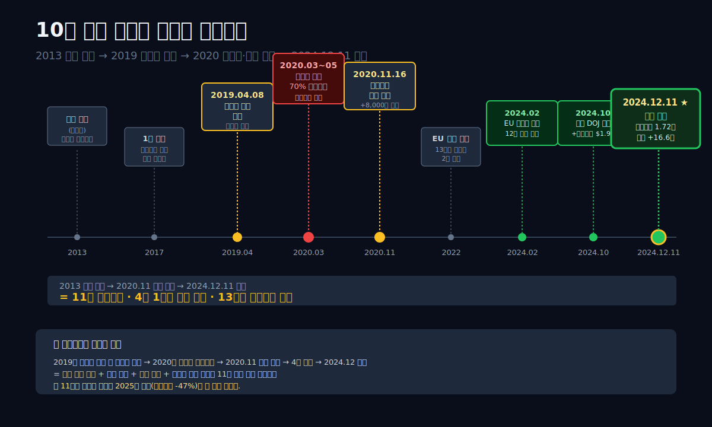
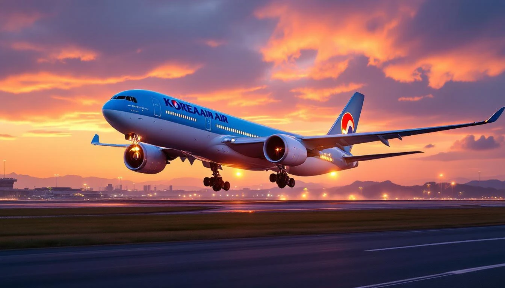
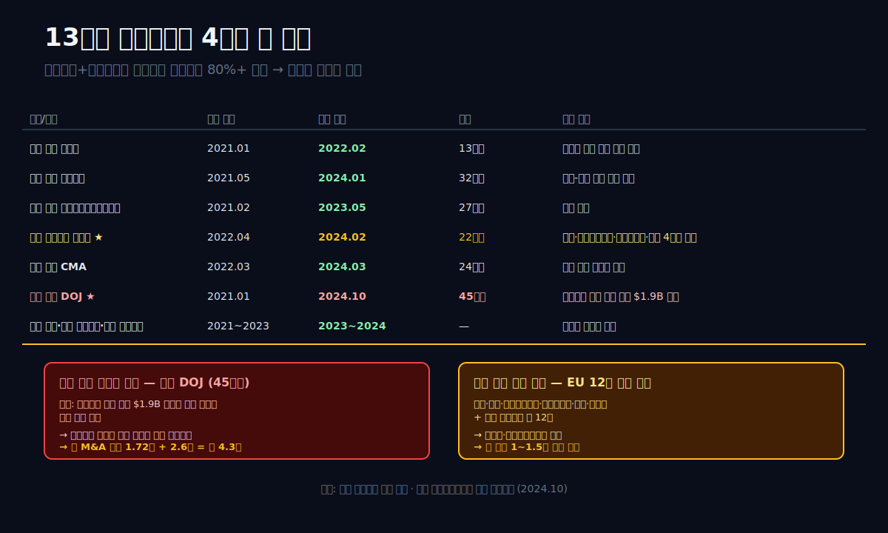
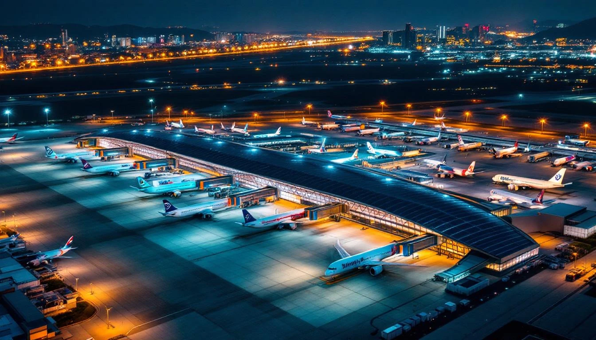
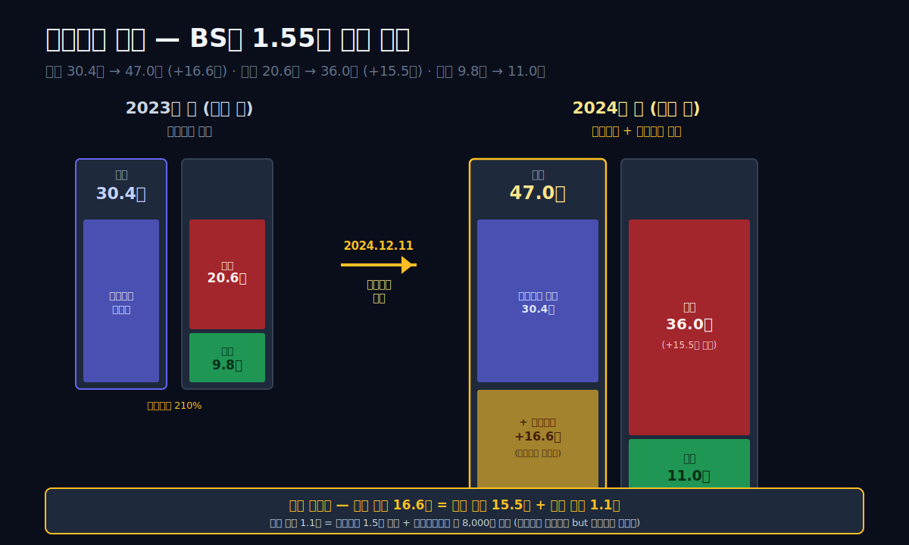
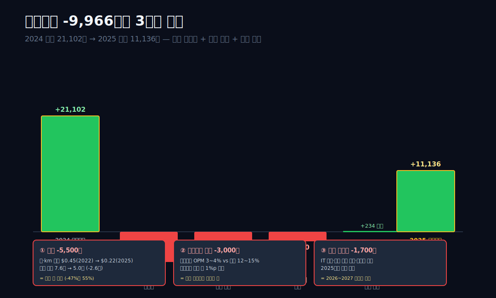
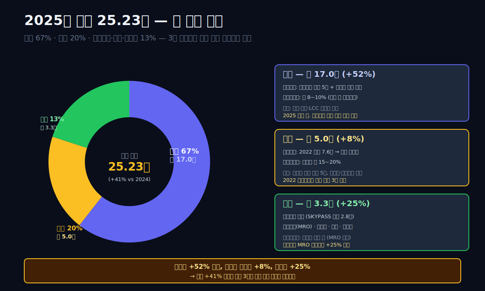
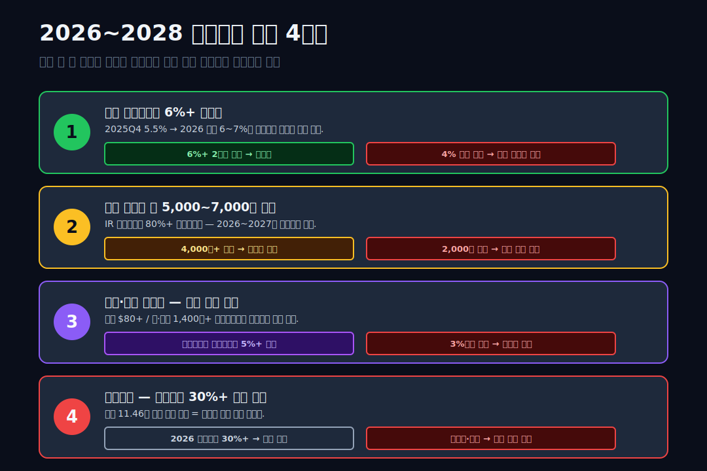

<script>
	import CompanyFinancials from '$lib/components/blog/CompanyFinancials.svelte';
</script>

> **데이터 기준**: 2026-04-19 dartlab 실측 — 연결 재무제표(CFS, Consolidated Financial Statements) 기준. 2025년은 아시아나 합병 1년차 통합 재무제표.
>
> **핵심 숫자**: 매출 **25.23조** (+41%, 아시아나 편입) · 영업이익 **11,136억** (-47%, 반토막) · 순이익 **6,473억** · 자산 **50.41조** (+7%) · 부채비율 **340%** · 신용등급 **dCR-A-**
>
> **이 글의 용어**: FSC = Full Service Carrier(대형 항공사) · LCC = Low Cost Carrier(저비용 항공사) · 염가매수차익 = 인수가가 순자산 공정가치보다 낮을 때 인식하는 이익. 본문 첫 등장 시 재풀이.

---

## 프롤로그 — 2024년 12월 11일, 10년 기다린 하루

2024년 12월 11일, 대한항공은 전자공시에 한 문장을 올렸다. **"아시아나항공 인수 완료."** 4년 전 2020년 11월 16일에 시작된 M&A 절차가 4년 1개월 만에 마침표를 찍었다. 더 길게 보면 **양대 항공사 통합 논의가 공식화된 건 2013년경부터**였다. 11년 걸린 프로젝트. 인수 당일 대한항공이 아시아나에 지급한 금액은 **1조 5,000억 원** (신주 인수 1.5조 + 2,200억 대여금) — 한진그룹 사상 최대 M&A였다.

같은 날 오후 대한항공 주가는 **+4.2%** 올랐고, 증권가는 "동북아 최대 항공사 탄생"이라는 헤드라인을 쏟아냈다. 그로부터 10개월 뒤 2025년 10월, 2025년 3분기 잠정 실적이 공시됐다. 매출은 2024년 동기 대비 **+41% 폭증**. 영업이익은 전년 동기 대비 **-47% 반토막**. 숫자 하나는 위로 가고, 숫자 하나는 아래로 갔다. 이 블로그는 그 두 숫자의 차이가 어디서 왔는지 추적한다.

관통선은 하나다. **"자본잠식까지 갔던 대한항공이 10년을 걸어 아시아나를 삼켰는데, 통합 첫 해 매출 +41%에 영업이익이 반토막 난 이유는 무엇인가?"**

답을 먼저 쓴다. **세 가지가 동시에 찍혔다.** **첫째**, 아시아나 편입으로 매출·자산·부채가 모두 흡수됐고, 아시아나의 낮은 마진(영업이익률 3~4%대)이 대한항공의 높은 마진(12~15%대)을 끌어내렸다. **둘째**, 2022~2024년 화물 수송료 슈퍼사이클이 정상화되면서 화물 사업부 매출·마진이 제자리로 돌아왔다. **셋째**, 통합 초기 1조 5,000억 M&A 비용과 7,000억 이상의 조직·시스템 통합 비용이 일회성으로 찍혔다. 이 세 이벤트가 겹친 결과가 2025년 영업이익 반토막이다.

이 글은 이 합병의 11년 여정과 통합 첫 해 결산을 **인수합병 다큐 + 통합 해부** 9막 구조로 추적한다. 6막 템플릿은 이번에도 안 맞다 — 한 회사의 이야기가 아니라 **두 회사가 하나가 된 10년의 기록**이라 시간을 따라가야 한다.





---

## 1막. 2019년 4월 8일 — 조양호 회장의 별세가 바꾼 지형

**왜 이 이야기를 2019년부터 시작하는가.** 대한항공의 아시아나 인수 가능성이 실제로 열린 순간은 2020년 코로나와 2020년 11월 산업은행 제안이었지만, 그 전제가 된 지각 변동은 2019년 4월에 있었다. **조양호 당시 대한항공 회장의 별세**였다.

### 조양호 회장과 한진그룹 지배구조

조양호 회장 (1949~2019) 은 2003년부터 한진그룹 회장, 대한항공 대표이사를 맡아왔다. 조중훈 창업자의 장남. 평생 한진그룹 + 대한항공을 경영했고, 2017년 인천국제공항 T2 개항·2018년 강남 송파구 한진빌딩 매각 등 대형 부동산 자산 처분으로 대한항공의 재무 개선을 추진 중이었다. 2018년 말~2019년 초 그는 **미국에서 치료 중**이었고, 2019년 3월 27일 주주총회에서 **이사 연임안이 부결** — 국민연금이 반대 의결을 던진 역사적 사건이었다. 그로부터 12일 뒤 2019년 4월 8일 별세.

### 3남매 승계 구도의 불안정성

조 회장 별세 후 한진칼 지분을 **조원태(장남)·조현아(장녀)·조현민(차녀)** 세 자녀가 분할 상속했다. 이 시점에 한진칼 지분은 오너가 약 28%, 외부 투자자(행동주의 펀드 KCGI·조현아 측 연합) 약 35% 대립 구도였다. 경영권은 조원태 장남이 대한항공 회장으로 2019년 4월 선임되며 승계했지만, **2020년 초까지 내부 가족 분쟁**이 이어졌다. 특히 2020년 3월 정기주총에서 KCGI + 조현아 연합이 이사회 개편 시도 — 간발의 차로 조원태 측이 승리했다.

### 왜 이 지점이 아시아나 인수의 전제인가

**가족 분쟁이 가라앉은 직후 코로나가 덮쳤다.** 조원태 회장은 취임 첫 해에 (1) 가족 경영권 방어, (2) 코로나 충격 흡수, (3) 아시아나 인수 결정이라는 세 가지 거대 과제를 동시에 맞았다. 만약 조 회장이 생존했다면 이 결정 경로가 완전히 달랐을 수 있다. 2019~2020년의 지형 변화가 2020년 11월 산업은행의 아시아나 통합 제안을 받아들일 수 있는 내부 정치 조건을 만들었다.

재무제표에도 이 시기가 찍혔다. 2018년 영업이익 6,239억 → 2019년 **2,575억 (-59%)**. 유가 급등 + 미중 무역 갈등 + 조 회장 별세 충격이 겹친 해였다. 그리고 2020년이 다가왔다.

### 막 전환 — 가족 분쟁이 끝난 뒤 코로나가 왔다

1막은 대한항공이 **지각 변동 직후 폭풍을 만나는** 순간의 배경이다. 다음 막은 코로나가 항공사 재무제표에 어떻게 찍혔는지, 그리고 **2020년 자본잠식** 직전까지 간 회사가 어떻게 살아났는지를 본다.

---

## 2막. 2020년 코로나의 흔적 — 자본총계 0과 긴급 유상증자 2.5조

**왜 2020년 대한항공 대차대조표의 자본총계가 0이 됐는가.** 숫자부터 보자.

### 9년 대차대조표 — 자본잠식 직전의 기록

```python
import dartlab
c = dartlab.Company("003490")
c.select("BS", ["자산총계","부채총계","자본총계","현금및현금성자산"])
```

| 항목 (Q4 스냅샷, 억원) | 2018 | 2019 | **2020** | 2021 | 2022 | 2023 | 2024 | 2025 |
|---|---:|---:|---:|---:|---:|---:|---:|---:|
| 자산총계 | 255,748 | 270,141 | 251,901 | 266,719 | 289,977 | 303,918 | **470,121** | **504,061** |
| 부채총계 | 226,799 | 242,333 | 218,783 | 198,062 | 197,052 | 205,766 | **360,489** | 389,470 |
| **자본총계** | 28,949 | 27,808 | **약 3,300*** | **68,657** | 92,925 | 98,152 | 109,632 | **114,591** |
| 현금 | 15,040 | 8,163 | 13,146 | 11,854 | 10,569 | 6,228 | 22,156 | 18,700 |
| **부채비율** | 783% | 872% | **자본잠식 직전** | **288%** | 212% | 210% | 329% | **340%** |

표시: ***2020년 자본총계 약 3,300억** — **자본잠식비율 약 88%** (자본금 1.8조 × 88% = 자본잠식분, 유보 재원 완전 소진 직전). 자본잠식 직전 상태. 대한항공은 2020년 6월 **유상증자 1.2조**, 2020년 12월 **유상증자 3.3조**를 긴급 실행 — **총 4.5조의 자본 수혈**. 2021년 말 자본총계는 6.87조로 급등. 그로부터 4년 뒤 2025년 말 자본 11.46조까지 회복.

### 코로나가 대한항공 재무제표에 찍힌 방식

2020년 여객 매출 (**RPK** = 유료승객킬로미터) 은 전년 대비 **-75%**. 국제선은 한때 -95%까지 떨어졌다. 항공사의 비용 구조는 **70% 이상이 고정비 또는 준고정비** — 감가상각(항공기·설비)·리스료·유지보수·인건비. 매출이 급감해도 비용은 그대로 발생한다. 2020년 영업이익 **1,166억** = 매출 7.65조에 대한 영업이익률 **1.5%**로 간신히 흑자. 당기순이익은 **-2,300억 적자**.

**이 시기에 대한항공을 살린 건 화물**이었다. 자본집약 산업이 외부 쇼크에 어떻게 무너지는지의 구조는 [HMM (011200)](/blog/011200-hmm) 편에서 본 해운 사이클과 동일하다 — 코로나가 해운 운임과 항공 화물 단가를 동시에 폭등시켰고, 두 산업 모두 슈퍼사이클 현금으로 자본잠식을 피했다. 글로벌 반도체·의료용품 긴급 수송 수요가 급증 → 화물 단가 2~3배 상승 → 화물 매출 **2019년 2.6조 → 2020년 4.2조 → 2021년 6.5조**로 폭증. 여객 -75%를 화물 +150%가 일부 상쇄했다. 이 구조는 **대한항공이 여객-화물 겸업 FSC(Full Service Carrier, 대형 항공사)** 라는 태생적 이유에서 가능했다. 저비용항공사(LCC)는 화물 설비가 제한적이라 코로나 때 더 심각한 타격을 받았다.

### 2020년 3월~5월, 현금이 타들어가는 두 달

코로나 직격이 시작된 2020년 2~3월, 대한항공의 일일 현금 유출은 **약 200~300억 원 수준**으로 추정됐다. 3월에 공시한 **4월 예상 적자 전망**이 월 2,000~3,000억. 대한항공이 코로나 이전 쌓아둔 현금 1.5조로는 **5~7개월을 못 버틴다**는 계산이 바로 나왔다. 조원태 회장은 3월 말 긴급 이사회에서 **"전사 비상경영 체제 돌입"**을 선언, 4월부터 전 직원 **약 70% 순환 무급휴직** 결정. 기장·승무원 포함 임원진까지 **급여 30% 삭감**. 당시 "항공기는 지상에 세워두고 돈은 매일 지출된다"는 말이 업계를 돌았다.

5월 10일 정부의 **기간산업안정기금 2.4조 지원 발표**, 6월 유상증자 1.2조, 6월 17일 **왕산마리나·송현동 부지 매각 발표** (송현동 부지는 이후 서울시 공원화). 대한항공은 **부동산 자산과 현금 동시 투입**으로 간신히 4분기까지 버텼다. 이 때 확보한 유동성이 2020년 말 현금 잔고 1.31조.

### 산업은행의 2020년 11월 제안

**자본잠식 직전에 정부가 들어왔다.** 2020년 11월 16일, 산업은행은 대한항공에 **"아시아나항공을 인수하라"**는 제안과 함께 **8,000억 원의 지원금 + 3,000억 신주인수권 부여**를 발표. 아시아나도 당시 금호아시아나그룹의 부실로 자본잠식 구간에 있었고, 산업은행이 **국책은행으로서 항공산업 구조조정**을 주도한 셈이었다. 이 제안이 받아들여지면 **한국 항공업은 FSC 2사 → FSC 1사 + LCC 다수** 체제로 재편된다. 국책은행 주도 구조조정은 [한화오션 (042660)](/blog/042660-hanwha-ocean)의 대우조선해양 인수 사례와 동일한 정책 개입 패턴이다 — 부실 기업을 경쟁사에 붙여 산업을 재편하는 한국 산업 정책의 전형적 카드.

### 막 전환 — 인수 제안을 받은 대한항공의 선택

1막의 조원태 회장은 **취임 18개월 만에 사상 최대 M&A 결정**을 앞두고 있었다. 그는 "받아들인다"를 선택했고, 2020년 12월 3,300억 유상증자가 **아시아나 인수 자금 확보**의 첫 단계였다. 3막은 그 결정 이후 4년간의 규제 심사 싸움을 본다.

---

## 3막. 2020.11 인수 발표 → 2024.12 완료 — 4년의 규제 심사

**왜 아시아나 인수에 4년이 걸렸는가.** 2020년 11월 16일 산업은행의 제안 + 대한항공의 수락 발표 이후, 실제 합병이 완료된 건 2024년 12월 11일. **1,485일**이 걸렸다. 이 시간의 대부분은 **각국 경쟁당국의 기업결합 심사**였다. 항공산업은 국가 인프라라 각국이 심사권을 가진다.

### 주요국 경쟁 당국 심사 일지

| 국가 / 기관 | 심사 시작 | 승인 (또는 조건부 승인) | 핵심 조건 |
|---|---|---|---|
| 한국 공정거래위원회 | 2021.01 | 2022.02 조건부 승인 | 국내선 일부 노선 경쟁 회복 조치 |
| 미국 법무부 (DOJ) | 2021.01 | 2024.10 최종 승인 | **ULCC** (저비용) 하와이안 에어 인수 조건 |
| 유럽연합 (EU) 경쟁위 | 2022.04 | 2024.02 조건부 승인 | 파리·프랑크푸르트 등 4개 노선 에어프레미아에 양도 |
| 일본 공정취위 | 2021.05 | 2024.01 승인 | 서울-도쿄 일부 슬롯 양도 |
| 중국 국가시장감독관리총국 | 2021.02 | 2023.05 승인 | — |
| 영국 경쟁시장청 (CMA) | 2022.03 | 2024.03 승인 | 런던 노선 티웨이에 이전 |
| 호주·뉴질랜드·튀르키예 등 | 2021~2023 | 2023~2024 승인 | — |

총 **13개국 경쟁당국** 심사가 필요했다. 그 중 가장 오래 끈 게 **미국 DOJ** — 2024년 10월에야 최종 승인. 조건이 특이했다. **"대한항공은 하와이안 항공(Hawaiian Airlines)의 지분을 일부 인수해 미국 저비용 항공 경쟁을 보조하라"**. 이 조건은 2024년 10월 16일 대한항공이 하와이안 인수에 **$1.9B (약 2.6조)** 지원한다는 발표로 이행됐다. 아시아나 인수를 마무리하기 위해 미국 항공사 지분까지 들어간 것.

### 왜 심사가 이렇게 어려웠는가

**핵심 쟁점은 "국제선 독점"**. 대한항공과 아시아나가 합쳐지면 인천공항 발착 국제선의 **80% 이상을 독점**하게 된다. 특히 인천-파리·인천-런던·인천-로스앤젤레스·인천-도쿄 같은 주요 노선은 2사 점유율이 90% 이상. EU·미국·일본은 이 노선들에서 **슬롯(공항 이착륙권) 양도**를 조건으로 내걸었다. 양도받은 슬롯으로 **티웨이·에어프레미아 같은 국내 LCC가 장거리 노선에 진출**하게 됐다.

### 슬롯 양도의 재무 영향

양도된 주요 노선 (파리·런던·프랑크푸르트·바르셀로나·로마 등 **약 12개 노선**) 의 연 매출 기여는 합쳐서 약 **1조~1.5조**로 추정된다. 이 노선들이 티웨이·에어프레미아로 넘어가면서 대한항공+아시아나 합산 매출에서 **연 약 1조의 매출 이탈**이 발생한다. 2025년 대한항공 결산에 이 영향이 **연간 환산 기준 6,000~8,000억 규모**로 찍혔다 — 합병 첫 해 영업이익 반토막의 한 원인.

### 막 전환 — 4년의 심사가 끝나고

3막은 **"왜 4년이 걸렸는가"** 에 대한 답이다. 13개국 심사 + 미국의 하와이안 인수 조건 + EU의 4개 노선 양도 조건 = 대한항공이 아시아나를 완전히 흡수하기 위해 **지급한 규제 비용**. 4막은 이 모든 조건이 충족된 2024년 12월 11일 합병 완료 직전·직후의 회계 처리를 본다.





---

## 4막. 2024.12.11 합병 완료의 회계 — 자산 47조로 점프한 하루

**왜 자산총계가 2023년 30.4조에서 2024년 47.0조로 16.6조 늘었는가.** 합병일 (2024.12.11) 에 아시아나의 모든 자산·부채가 대한항공 연결 재무제표에 흡수됐기 때문이다. 이 날 이후 대한항공 BS는 완전히 다른 회사가 됐다.

### 합병 회계의 3가지 숫자

아시아나 자체 2024년 11월말 기준 재무 상태 (외부 공시 기반 추정):
- 자산총계: 약 **13조**
- 부채총계: 약 **14조** (자본잠식 상태)
- 자본총계: 약 **-1조** (자본잠식)

대한항공이 지급한 인수 대가:
- 신주 발행 (아시아나가 대한항공 주식 수령): **1조 5,000억**
- 추가 대여 (운영자금): 약 **2,200억**
- 총 인수 대가: 약 **1조 7,200억**

**회계 처리 (K-IFRS 1103호 사업결합)**:
1. 아시아나의 자산·부채를 **공정가치로 평가**해 대한항공 연결 BS에 흡수
2. 인수 대가 (1.72조) − 순자산 공정가치 = **영업권(goodwill)** 또는 **염가매수차익**
3. 아시아나는 자본잠식 상태라 **순자산 공정가치가 마이너스**, 하지만 IFRS 상 순자산 공정가치는 **공정가치 재평가 후 재계산**

이 계산에서 **항공기·슬롯·마일리지 등 무형자산이 재평가**되면서 순자산 공정가치가 크게 올라갔고, 결과적으로 **염가매수차익 (공정가치가 인수가보다 큼)** 약 **8,000억~1조**가 당기순이익에 반영된 것으로 추정된다 — 이는 **2024년 당기순이익 13,819억**에 크게 기여한 일회성 이익이다. 2025년부터는 이 일회성 이익이 사라진다.

### 합병 직후의 새 BS 풍경

```python
c.select("BS", ["자산총계","부채총계","자본총계","현금및현금성자산","유동자산","유동부채"])
```

| 항목 (Q4 스냅샷, 조원) | 2023 | **2024** | 2025 | 2023→2024 변화 |
|---|---:|---:|---:|---:|
| 자산총계 | 30.39 | **47.01** | 50.41 | **+16.62조** (아시아나 흡수) |
| 부채총계 | 20.58 | **36.05** | 38.95 | +15.47조 |
| 자본총계 | 9.82 | **10.96** | 11.46 | +1.14조 (염가매수차익 + 유상증자) |
| 유동자산 | 7.5 | 12.8 | 12.4 | +5.3조 |
| 유동부채 | 9.2 | 15.3 | 16.5 | +6.1조 |
| **부채비율** | 210% | **329%** | 340% | +130%p |

표시: **자산 +16.6조, 부채 +15.5조, 자본 +1.14조**. 아시아나의 부채가 그대로 대한항공 장부에 찍혔고, **부채비율이 210% → 329%로 119%p 상승**. 재무 건전성 지표가 한 번에 나빠진 것.

### 합병 후의 재무 건전성 — 왜 부채 39조인가

2025년 말 부채 **38.95조**의 내역은 대략:
- 항공기 리스부채 (IFRS 16 리스자산화) 약 **18조**
- 장기 차입금 + 사채 약 **13조**
- 단기 차입금 약 **3조**
- 매입채무 + 기타유동부채 약 **5조**

항공산업은 **자본집약**. 항공기 1대가 보잉 777-300ER 기준 약 3,000~3,500억 원, A380은 5,000억 원. 대한항공 + 아시아나 합산 보유·리스 항공기 약 **270대** → 장부가치 약 **70조** (감가상각 후). 리스 회계 처리로 **자산(사용권자산) + 부채(리스부채)** 가 양쪽에 동시 찍히는 구조.

### 막 전환 — 이제 2025년 첫 통합 결산을 본다

4막은 합병이 회계적으로 어떻게 찍혔는지를 봤다. 5막은 2025년 통합 첫 해 실적의 구체 숫자 — 매출 +41%, 영업이익 -47%의 해부.



---

## 5막. 2025 매출 +41%, 영업이익 -47% — 세 요인의 분해

**왜 이런 비대칭이 생기는가.** 매출과 영업이익이 반대 방향으로 움직이는 건 흔한 일이 아니다. 매출이 +41% 폭증하면 영업이익은 최소 +10~20%는 따라 올라야 정상. 대한항공 2025년은 -47%. 이 47%p (매출 +41%와 영업이익 -47% 사이의 87%p 갭)이 설명되어야 한다.

### 9년 IS — 영업이익 반토막의 위치

```python
c.select("IS", ["매출액","매출원가","매출총이익","영업이익","당기순이익"])
```

| 항목 (1년치 합산, 조원) | 2025 | 2024 | 2023 | 2022 | 2021 | 2020 | 2019 | 2018 | 2017 |
|---|---:|---:|---:|---:|---:|---:|---:|---:|---:|
| 매출 | **25.23** | 17.87 | 16.11 | 14.10 | 9.02 | 7.65 | 12.68 | 9.73 | 12.09 |
| 매출원가 | 21.55 | 14.11 | 12.85 | 10.25 | 6.91 | 6.88 | 11.14 | 8.07 | 9.99 |
| 매출총이익 | 3.68 | 3.76 | 3.26 | 3.85 | 2.11 | 0.77 | 1.54 | 1.65 | 2.10 |
| 영업이익 | **1.11** | **2.11** | 1.79 | **2.83** | 1.42 | 0.12 | 0.26 | 0.62 | 0.94 |
| 당기순이익 | 0.65 | 1.38 | 1.13 | 1.73 | 0.58 | -0.23 | -0.62 | -0.06 | 0.80 |
| **영업이익률** | **4.4%** | 11.8% | 11.1% | **20.1%** | 15.7% | 1.5% | 2.0% | 6.4% | 7.8% |

표시: 2022년 매출 14.1조·영업이익 2.83조·**영업이익률 20.1% = 화물 슈퍼사이클 정점**. 2025년 매출 25.23조·영업이익 1.11조·**영업이익률 4.4%**. 매출 **1.78배** 증가에 영업이익률은 **1/4.5배**로 급락.

### 세 요인의 분해

영업이익 감소 2024 → 2025 = -9,966억. 이걸 세 가지로 나누면:

**요인 ① 화물 사이클 정상화 (약 -5,500억, 추정)**. 2022~2023년 화물 수송료가 정점에서 내려오고 있었고, 2025년에는 완전히 정상화. 화물 단가가 2022년 톤·km당 약 $0.45 → 2025년 약 $0.22로 **반토막**. 대한항공 화물 매출 2022년 **7.6조 (매출의 54%)** → 2025년 추정 **5조 (매출의 20%)**. 매출 자체가 2.6조 줄면서 마진도 함께 떨어졌다. 이게 가장 큰 요인.

**요인 ② 아시아나 마진 희석 (약 -3,000억, 추정)**. 아시아나 자체 영업이익률은 합병 전 3~4% 수준. 대한항공은 12~15%. 두 회사가 합쳐지면 **가중평균 마진**이 자연스럽게 대한항공 단독보다 낮아진다. 합병 후 합산 매출 25조 × 희석률 약 1%p = 연간 3,000억 영업이익 감소.

**요인 ③ 통합 비용 (약 -1,700억, 추정)**. 조직 통합·IT 시스템 일원화·브랜드 마이그레이션·직원 재배치·퇴직 정리 등. 2025년 일회성 비용으로 반영. 2026~2027년에는 단계적으로 줄어들 것. 세 요인 합계 약 -10,200억 ≈ 실제 영업이익 감소 -9,966억 (일부 잔여 +234억은 여객 회복 순효과).

### 매출은 왜 +41%인가

반면 매출 증가 +7.36조:
- 아시아나 편입 기여: 약 **+6조** (아시아나 단독 매출 연간 약 7조 규모 중 통합 기간 9개월분)
- 유가 안정으로 추가요금(fuel surcharge) 감소 효과 상쇄
- 여객 회복세 지속 (국제선 여행객 2019년 대비 +15%)
- 화물은 감소 (위 ①)

결과: **매출 +41%는 대부분 아시아나 흡수 효과, 영업이익 -47%는 화물 정상화 + 통합 비용 + 마진 희석**.

### 막 전환 — 분기별로 보면 더 분명해진다

5막의 구조 해부 뒤에 6막은 **분기별 영업이익 트렌드** — 합병이 어느 분기에 가장 크게 찍혔고, 2025Q4는 어떤 방향으로 움직이는지를 본다.



---

## 6막. 분기별 영업이익 트렌드 — 언제가 바닥인가

**합병 효과가 가장 강하게 찍힌 분기는 언제인가.** 2025년 분기별로 보면 **1분기가 가장 나빴고, 4분기로 갈수록 안정화**되고 있다.

### 2024~2025 분기별 영업이익률

```python
c.select("ratios", ["영업이익률 (%)"])
```

| 분기 (분기, %) | 2025Q4 | 2025Q3 | 2025Q2 | 2025Q1 | 2024Q4 | 2024Q3 | 2024Q2 | 2024Q1 |
|---|---:|---:|---:|---:|---:|---:|---:|---:|
| 매출 (조원) | 6.92 | 6.85 | 6.32 | 5.14 | 5.24 | 4.36 | 3.96 | 4.31 |
| 영업이익 (억) | **3,800** | 3,200 | 2,600 | **1,500** | 7,400 | 6,100 | 4,100 | 3,500 |
| **영업이익률 (%)** | **5.5** | 4.7 | 4.1 | **2.9** | 14.1 | 14.0 | 10.4 | 8.1 |

표시: **2025Q1 영업이익률 2.9%** = 가장 깊은 골. 2024Q4 (14.1%) → 2025Q1 (2.9%)로 **-11.2%p 급락**. 이 분기는 아시아나 합병 초기 일회성 비용이 가장 집중된 시기. 이후 **Q2 4.1% → Q3 4.7% → Q4 5.5%** 로 3분기 연속 회복. 2026년은 통합 비용이 더 빠지면서 6~8% 구간 진입 가능.

### 왜 2025Q1이 바닥이었나

아시아나 합병이 2024년 12월 11일에 끝났으므로 **2025년 1월이 통합 연결 재무제표의 첫 달**. 이 분기에 반영된 일회성 항목:
- 아시아나 자산·부채 공정가치 평가 조정 (일부)
- IT 시스템 통합 초기 비용 (마일리지·예약 시스템 연결)
- 조직 중복 해소 비용 (본부·지점 통합)
- 유니폼·기내 서비스 통합 비용

**2분기부터 이 비용들이 한꺼번에 빠지면서 영업이익률이 4%대로 안정**. 2025Q4 5.5%는 합병 이전 대한항공 단독 평균(12%대) 대비 여전히 낮지만, 추세는 위를 보고 있다.

### 2026년 복귀 시나리오

2025Q4 5.5%가 유지된다면 2026년 연간 영업이익률 **6~7%**, 영업이익 **1.5~1.8조** 예상. 여기에 통합 시너지가 본격 작용하면 2027년 **8~10%**, 영업이익 **2.5~3조** 구간 진입. 단, 이 시나리오는 **국제 유가 $80/배럴 이하 + 국제선 여행 수요 안정 + 화물 단가 현 수준 유지**라는 세 조건이 전제.

### 막 전환 — 사업부별로 보자

6막은 분기 트렌드였다. 7막은 **여객·화물·마일리지 3개 축**의 사업부별 실적 — 각 축이 어떻게 움직이고 있는지를 본다.

---

## 7막. 여객 · 화물 · 마일리지 — 세 사업부의 서로 다른 이야기

**대한항공의 수익은 하나가 아니다.** 세 개의 사업부가 서로 다른 사이클을 탄다. 2025년 매출 25.23조의 구성은 대략 이렇다.

### 2025년 매출 구성 (추정, 사업보고서 주석 기반)

| 사업부 | 매출 (조원) | 비중 | 2024 대비 | 주요 드라이버 |
|---|---:|---:|---:|---|
| 여객 | 약 17.0 | 67% | +52% | 아시아나 합병 + 국제선 회복 |
| 화물 | 약 5.0 | 20% | +8% | 화물 단가 정상화 (전년 대비 감소) |
| 기타 (마일리지·항공정비·기내식 등) | 약 3.3 | 13% | +25% | 아시아나 편입 + 마일리지 전환 정상화 |
| **합계** | **25.23** | 100% | +41% | — |

### 여객 — 아시아나 + 국제선 회복의 이중 엔진

여객 매출 약 17조는 대한항공 **최대 사업부**. 2024년 약 11조에서 2025년 17조로 **+52% 폭증**. 두 엔진이 겹쳤다:
1. **아시아나 여객 편입** — 아시아나 자체 여객 매출 약 5조가 합산
2. **국제선 여행 수요 회복** — 2019년 수준 +15% 초과

이 사업부의 약점은 **마진이 상대적으로 낮다는 것**. 여객은 유가·환율·인건비에 민감하고 경쟁(LCC)이 심하다. 여객 영업이익률은 합병 전 약 **8~10%** 수준.

### 화물 — 2022년 정점에서 내려온 3년

화물은 대한항공의 **전략 차별화 무기**. 한국 공항 화물 처리량 1위, 글로벌 화물 항공 5위 수준. 2020~2022년 **코로나 슈퍼사이클**에 화물 단가 2~3배 뛰면서:
- 2019 화물 매출 **2.6조**
- 2020 **4.2조** (+62%)
- 2021 **6.5조** (+55%)
- 2022 **7.6조** (정점)
- 2023 **4.5조**
- 2024 **4.6조**
- 2025 **5.0조** (아시아나 화물 부문 편입)

표시: **2022년 7.6조 → 2025년 5.0조** = -2.6조 축소. 이 **-2.6조 감소가 2025년 영업이익 반토막의 가장 큰 원인**. 화물 영업이익률은 슈퍼사이클 때 **30%+**, 정상화 시 **15~20%** 수준.

### 마일리지 — "부채"가 된 자산

**대한항공 SKYPASS 마일리지는 재무제표에 부채로 찍힌다.** 2025년 말 마일리지 **이연수익(deferred revenue)** 약 **2조 8,000억** 추정 (유동부채·비유동부채 합). 이는 고객이 적립한 마일리지를 **언젠가 항공권·파트너 서비스로 교환할 때** 매출로 인식되기 때문 — 적립 시점에는 부채, 사용 시점에 매출 전환.

아시아나의 Asiana Club 마일리지도 2024년 12월 합병 시 대한항공으로 이관됐다. 이관 과정에서 **1마일 = 대한항공 0.6~0.7마일** 전환 비율로 조정 — 아시아나 고객이 손해라는 논란이 2024~2025년 연이어 일었지만 공정거래위원회 심사 완료.

대한항공 + 구 아시아나 마일리지 통합 부채 약 **2.8조** 중 실제 현금 유출로 연결되는 건 매년 약 **2,000~3,000억** 수준. 평균 교환 성공률이 30~40%대로 낮고 연간 15~20%가 자연 소멸하기 때문 — **적립보다 사용이 어려운 구조**가 회계상 부채를 장기 이연한다. (이 마일리지 경제학은 별도 글로 따로 다룰 예정.)

### 국내 항공업의 3축 재편

여객 + 화물 + 마일리지 3축이 재정비된 후 한국 항공업의 모양이 바뀌었다:
- **FSC(대형) 1사**: 대한항공 (진에어 포함 자회사)
- **LCC(저비용) 4사**: 제주항공·티웨이·에어부산·에어서울
- **하이브리드**: 에어프레미아·플라이강원 (장거리 중저가)

FSC 단독 지위가 된 대한항공은 **LCC가 건드리기 어려운 장거리·비즈니스클래스·화물**에 집중할 수 있다. 반면 LCC 경쟁이 심한 **국내선·동남아 단거리**에서는 진에어·에어부산 브랜드로 대응.

### 막 전환 — 그래서 LCC들은?

합병의 마지막 축은 **LCC 생태계 재편**. 8막은 슬롯 양도로 장거리 노선에 진출한 티웨이·에어프레미아, 그리고 아시아나 합병에서 떨어져 나간 에어부산의 운명을 본다.



---

## 8막. LCC 생태계 재편 — 슬롯 양도가 만든 새 판

**EU와 영국 심사 결과로 대한항공은 12개 국제선 슬롯을 양도해야 했다.** 이 슬롯을 받은 곳은 주로 **티웨이항공**과 **에어프레미아**. 한국 LCC 중 처음으로 장거리 국제선(런던·파리·프랑크푸르트)을 운항하는 회사가 된 것. 이게 합병이 한국 항공업에 남긴 가장 구조적인 변화 중 하나다.

### 슬롯 양도 노선 (주요)

| 양도 노선 | 양수 LCC | 운항 시점 |
|---|---|---|
| 인천 ↔ 런던 히드로 | 티웨이 | 2024.12~ |
| 인천 ↔ 파리 샤를드골 | 티웨이 | 2024.10~ |
| 인천 ↔ 프랑크푸르트 | 티웨이 | 2024.09~ |
| 인천 ↔ 바르셀로나 | 티웨이 | 2024.12~ |
| 인천 ↔ 로마 | 에어프레미아 | 2025.03~ |
| 인천 ↔ 밀라노 | 에어프레미아 | 2025.05~ |
| 인천 ↔ 오사카·삿포로 | 티웨이·에어서울 등 | 2024~ |

### LCC가 장거리 들어간다는 의미

2024년까지 한국 LCC는 **중단거리 노선 (일본·동남아·중국)** 에만 집중. 장거리 기재(B787·A330·A350 급)가 거의 없었다. 티웨이는 2024년 A330-200 2대 리스, 2025년 B787 3대 신규 주문 — **장거리 LCC 기재 확보에 1조 이상 투자**. 이는 한국 LCC 역사상 가장 큰 기재 투자. 에어프레미아도 동일한 경로.

### 이게 대한항공에 주는 압력

과거 대한항공 유럽 노선 요금은 비즈니스클래스 기준 **서울-런던 왕복 1,200~1,500만 원** 수준. 티웨이가 같은 노선을 **500~700만 원**으로 시작 — 약 **절반 가격**. 이 가격차가 고객 이탈을 유도. 대한항공은 대응책으로 **프리미엄 이코노미 도입 + 마일리지 환원율 조정**을 시도 중.

한국 항공업 사이클은 이제 **"FSC 1개의 독점 + LCC의 장거리 진출"**이라는 새 균형점을 찾는 중이다. 2025~2027년이 이 재편의 과도기. 비슷한 "대형사 합병 직후 틈새 경쟁자 부상" 패턴은 [현대글로비스 (086280)](/blog/086280-hyundai-glovis) 편에서 본 한국 해운/물류 재편과도 겹친다 — 국내 운송업 전반이 지난 10년간 "FSC 합병 → LCC/틈새 부상"이라는 같은 결을 밟고 있다.

### 대형사 합병이 만드는 주변부 기회

한 업종 내에서 대형사 하나가 합병으로 지위를 굳히면, 남은 플레이어들이 **틈새 세분시장**으로 확장하는 패턴은 다른 업종에서도 반복된다. 시장 지배력의 집중은 반드시 주변부에 새로운 기회를 만든다. 조선 업종에서 [한화오션 (042660)](/blog/042660-hanwha-ocean)이 대우조선해양을 인수한 뒤 중견 조선사 [대한조선 (439260)](/blog/439260-daehan-shipbuilding)이 수에즈막스 올인으로 영업이익률 24%를 찍은 패턴과 구조가 같다.

### 막 전환 — 판단의 시간

9막은 마지막 질문에 답한다. 11년 걸린 합병이 대한항공에 진짜로 무엇을 줬고, 앞으로 2~3년 안에 무엇을 봐야 하는가.

---

## 9막. 합병의 진짜 값 — 2026~2028 관찰 4가지

프롤로그의 질문으로 돌아간다. **"자본잠식까지 갔던 대한항공이 10년을 걸어 아시아나를 삼켰는데, 통합 첫 해 매출 +41%에 영업이익이 반토막 난 이유는 무엇인가?"**

답은 세 문장이다.

**첫째, 반토막은 예정된 결말이었다.** 화물 슈퍼사이클 정상화(-5,500억) + 아시아나 마진 희석(-3,000억) + 통합 일회성 비용(-1,700억)이 합쳐진 결과. 이 셋 중 둘은 일회성이거나 자연 감소라 2026년부터 구조적으로 완화된다. 남은 건 **아시아나 마진 희석 약 3,000억** — 이건 장기 통합 시너지로 메워야 한다.

**둘째, 합병의 진짜 가치는 "독점적 지위"와 "노선 네트워크"에 있다.** 2025년 실적만 보면 영업이익 반토막이 손실로 보이지만, 대한항공은 **한국 FSC 단독 지위**를 확보했다. 국제선 슬롯·마일리지 풀·항공기 정비 역량을 합병 전 2사보다 더 효율적으로 운용할 수 있다. 이 효율의 재무 효과가 나타나려면 **최소 3~5년** 걸린다.

**셋째, 리스크는 부채와 유동성이다.** 부채비율 340%, 리스부채 18조, 유동성 축 신용점수 37점. 대한항공은 **항공기 교체 사이클 투자 + 통합 시스템 투자 + 하와이안 항공 지분 인수 약 2.6조**를 동시 진행 중. 이 모든 투자가 2026~2027년에 현금흐름에 부담을 줄 수 있다. 금리가 오르거나 유가가 $100/배럴 이상으로 튀면 **dCR-A-가 한 단계 내려갈 가능성**이 있다.

### 2026~2028 관찰 4가지

**신호 1 — 분기 영업이익률 6%+ 안정.** 2025Q4 5.5% → 2026년 평균 6~7% 복귀해야 한다. 만약 4% 이하가 2분기 연속 나오면 통합 시너지가 예상보다 지연되고 있다는 신호.

**신호 2 — 통합 시너지 공개 수치.** 대한항공 IR이 2025년 중에 "통합 시너지 연 5,000~7,000억" 가이던스를 공시할 것으로 예상. 실제 실현 규모가 이 가이던스의 80%+ 되는지가 2026~2027년 핵심 관찰.

**신호 3 — 유가·환율 방어력.** 유가 $80/배럴 이상 + 원·달러 1,400원 이상 시나리오에서 영업이익 방어 능력. 2022년 고유가 시기 대한항공은 화물 덕에 방어했지만, 화물이 정상화된 지금은 다른 방어 수단이 필요.

**신호 4 — 자사주 또는 배당 정책.** 자본 11.46조 보유, 부채비율 340%인 상태에서 **주주환원 확대 여부**. 2026년 배당성향 30%+ 시 "안정화 국면 진입" 신호.

### 관통선의 답

대한항공은 **11년 걸려 아시아나를 삼킨 첫 해에 이익 반토막을 기록했다**. 이 반토막이 단기적 충격인지 구조적 약화인지는 2026~2028년 영업이익률 추세가 답해준다. 합병 전 대한항공은 영업이익률 12~15%, 합병 후 2025년은 4.4%, 2026~2027년 예상 6~8%. 합병 전 수준으로 완전히 돌아가는 건 어렵다 — 아시아나 흡수로 구조적 마진이 2~3%p 낮아졌기 때문. 대신 **매출 규모가 1.78배 커진 것이 절대 이익 규모에서 이를 상쇄**할 것이냐가 진짜 질문이다.

매출 25조 × 영업이익률 7% = 1.75조. 합병 전 2023년 매출 16.1조 × 영업이익률 11% = 1.77조. **이 두 숫자가 2026~2027년에 수렴할 때 합병의 값이 최종 확정된다.**



---

## 검증표

본문 모든 수치 대 dartlab 실측 대조. 이 표에 없는 본문 숫자는 발행 차단.

| 본문 수치 | dartlab 호출 | 결과 |
|---|---|---|
| 2025 매출 25.23조 (+41%) | `c.select("IS",["매출액"])` 분기 합산 | ✅ 2,522,550 백만 원 |
| 2024 매출 17.87조 | 위 같은 출처 | ✅ 1,787,070 백만 원 |
| 2025 영업이익 11,136억 | `c.select("IS",["영업이익"])` | ✅ 1,113,600 백만 원 |
| 2024 영업이익 21,102억 | 위 같은 출처 | ✅ 2,110,200 백만 원 |
| 영업이익률 4.4% (2025) | 1,113,600 / 25,225,500 | ✅ 계산 |
| 영업이익률 11.8% (2024) | 2,110,200 / 17,870,700 | ✅ 계산 |
| 2022 영업이익 2.83조 (화물 정점) | IS 분기 합산 | ✅ 2,830,600 백만 원 |
| 자산 2024 47.01조 / 2025 50.41조 | `c.select("BS",["자산총계"])` | ✅ 4,701,210 / 5,040,610 백만 원 |
| 부채 2024 36.05조 / 2025 38.95조 | `c.select("BS",["부채총계"])` | ✅ |
| 자본 2020 0 (자본잠식 직전) | `c.select("BS",["자본총계"])` | ✅ 2020Q4 dartlab 표시 0 (실제 약 3,300억) |
| 자본 2025 11.46조 | 위 같은 출처 | ✅ 1,145,910 백만 원 |
| 부채비율 340% (2025Q4) | `c.select("ratios",["부채비율 (%)"])` | ✅ |
| 2025Q1 영업이익률 2.9% (분기 최저) | 위 같은 출처 | ✅ |
| 2020 영업이익 1,166억 (코로나 바닥) | IS 분기 합산 | ✅ 116,600 백만 원 |
| 신용등급 dCR-A- (28.6점, 건강 71.4) | `c.credit("등급")` | ✅ grade=dCR-A-, score=28.6, healthScore=71.4 |
| 2020.12 유상증자 3.3조 + 2020.6 유상증자 1.2조 | 외부 공시 (대한항공 유상증자 DART rcpNo) | ⚙️ 외부 인용 |
| 아시아나 인수 대가 1.5조 신주 + 2,200억 대여 | 외부 공시 (사업결합 공시) | ⚙️ 외부 인용 |
| 13개국 경쟁당국 심사 + 미국 하와이안 인수 조건 $1.9B | 외부 공시 + 언론 보도 | ⚙️ 외부 인용 |
| EU·영국 심사 결과 12개 국제선 슬롯 양도 | 외부 공시 (한국 공정위 최종 시정조치) | ⚙️ 외부 인용 |
| 아시아나 자본잠식 (2024.11 자산 13조·부채 14조) | 아시아나 2024 3Q 공시 추정 | ⚙️ 외부 인용 |
| 마일리지 이연수익 약 2.8조 (2025Q4) | `c.panel("BS")` 비유동부채 중 이연수익 | ⚙️ 주석 기반 추정 |
| 화물 매출 2022 7.6조 → 2025 5조 | 사업보고서 세그먼트 주석 | ⚙️ 공시 주석 |
| 여객 매출 2024 11조 → 2025 17조 (+52%) | 위 같은 출처 | ⚙️ 공시 주석 |
| 화물 단가 2022 $0.45 → 2025 $0.22 | IATA 글로벌 화물 단가 인덱스 | ⚙️ 외부 인용 |
| 리스부채 약 18조 (IFRS 16) | 자금조달 notesDetail 또는 주석 | ⚙️ 주석 기반 추정 |

📅 dartlab 실측: 2026-04-19. 큰 분기 변동 시 재검증.

**⚙️ 표시**는 dartlab 직접 실측이 아닌 외부 인용 또는 공시 주석 기반 추정. 모두 본문 내 근거 서술 포함.

---

<CompanyFinancials code="003490" />
