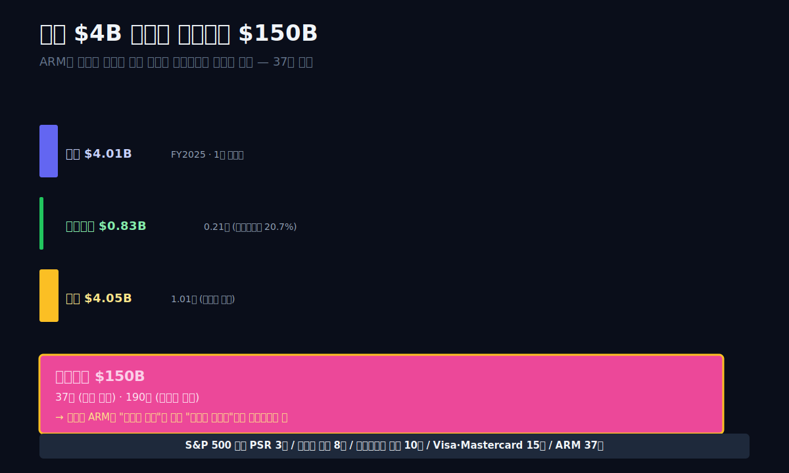
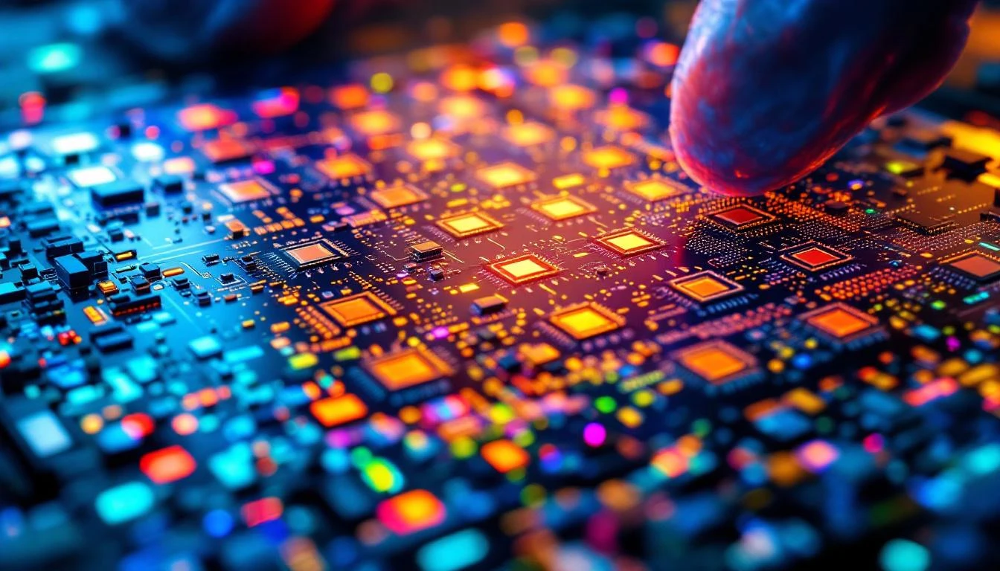
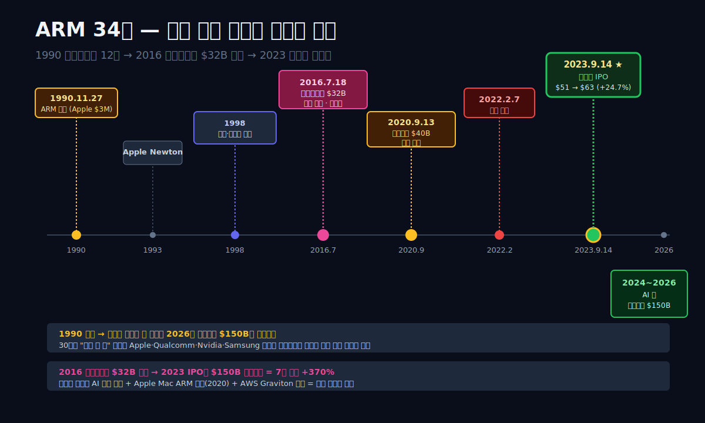
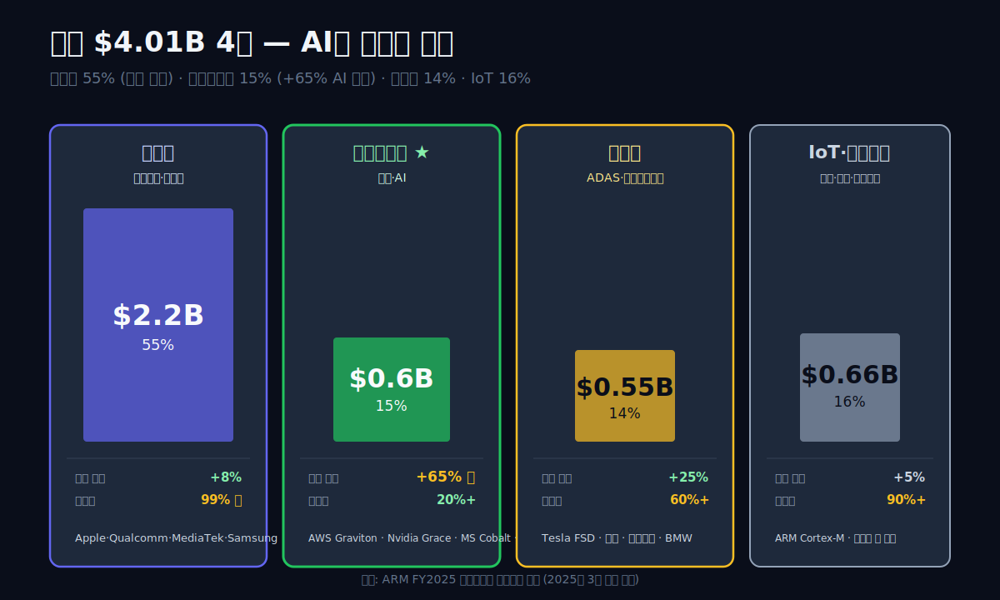
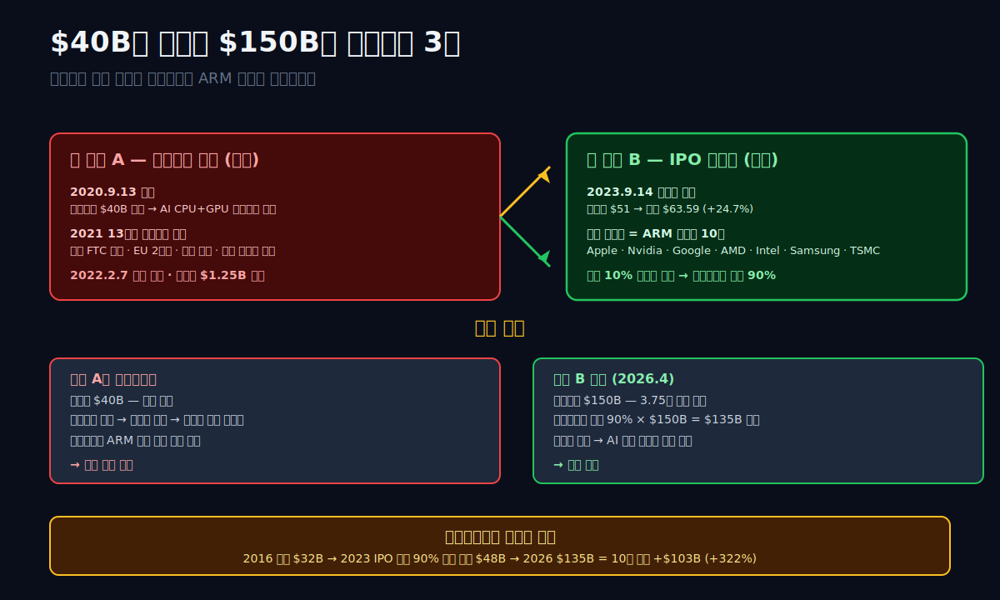
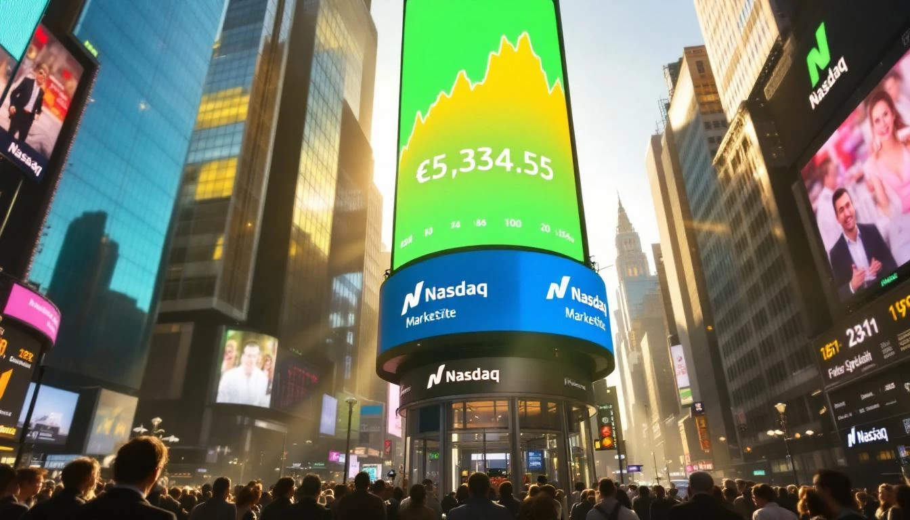
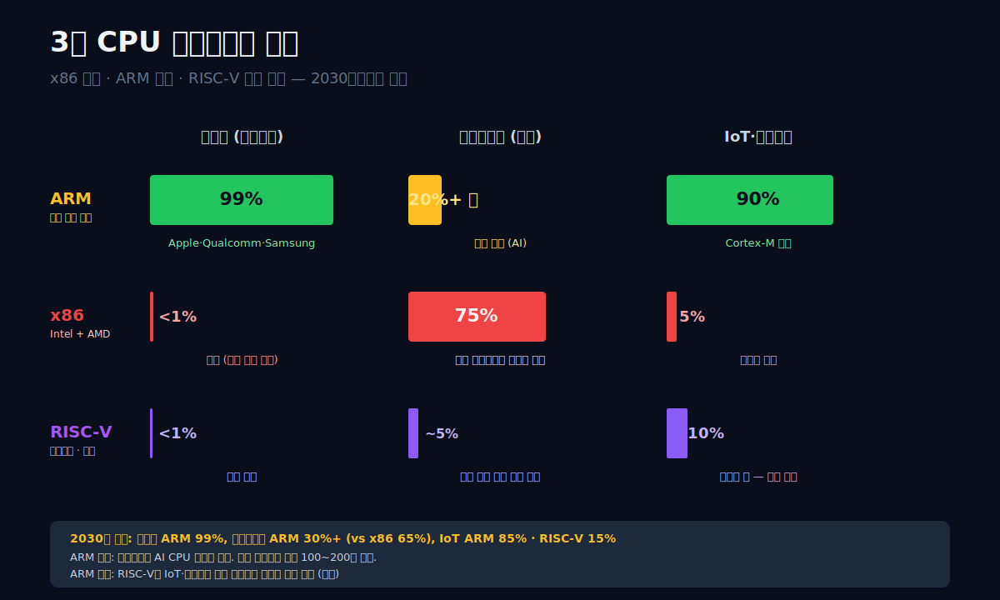
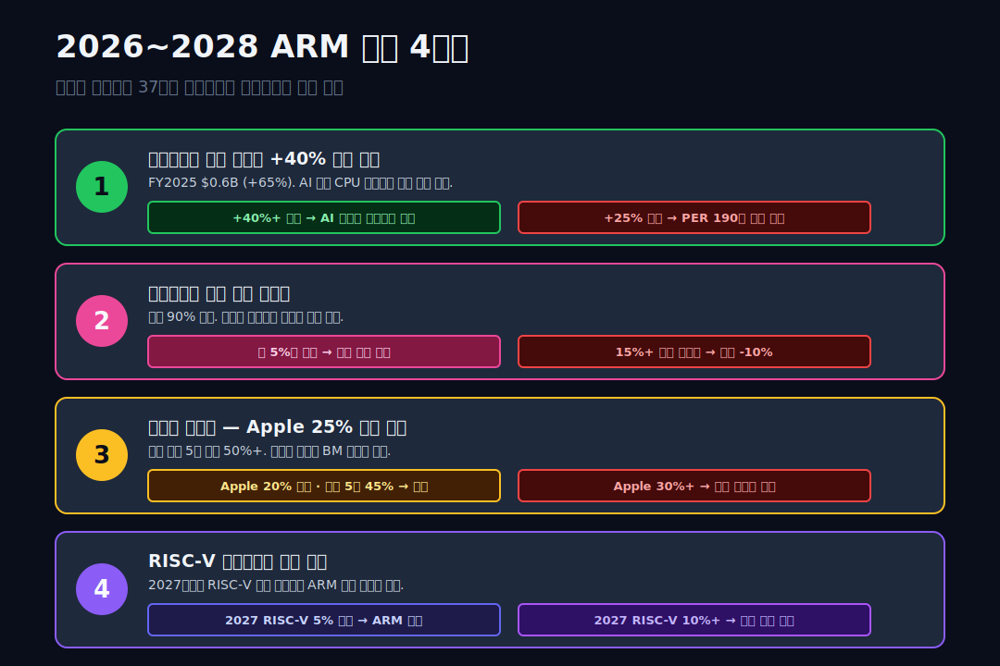

<script>
import ComboChart from '$lib/components/blog/ComboChart.svelte';
import StackBar from '$lib/components/blog/StackBar.svelte';
</script>

> **데이터 기준**: 2026-04-20 dartlab 실측 — ARM Holdings plc. 회계연도 4월~3월(영국 관례). 본문의 "2025년"은 FY2025 (2024.4~2025.3).
>
> **핵심 숫자**: 매출 **$4.01B** (+50% vs FY23) · 영업이익 **$0.83B** (영업이익률 20.7%) · **매출총이익률 97%** · 순이익 $0.79B · 자산 $6.87B · 부채 $2.81B · 시가총액 약 **$150B** · 신용등급 **dCR-AA**
>
> **이 글의 용어**: IP = 지적재산(Intellectual Property) · RISC = 축소명령어 집합 컴퓨팅 아키텍처 · 로열티 = 칩이 팔릴 때마다 ARM이 받는 수수료 · 라이선스 = 칩 설계사가 ARM 설계를 쓰기 위해 선지불하는 계약금.

---

## 프롤로그 — 2023년 9월 14일 오전 9시 30분, 나스닥 거래 시작

2023년 9월 14일, 뉴욕 증권거래소 나스닥. ARM Holdings 티커 **"ARM"**이 **공모가 $51**에 거래를 시작했다. 첫날 종가 $63.59 — **+24.7% 상승**. 시가총액 $65B로 뉴욕 입성. 그날 이후 주가는 2024년 AI 붐과 함께 **$180 부근까지 급등**, 2026년 4월 기준 시가총액 **$150B+ 수준**을 유지한다.

하지만 이 블로그가 풀어볼 수수께끼는 주가가 아니다. 숫자가 이상하다. ARM은 **매출 $4.01B (연 약 5.5조)** 회사다. **삼성전자 매출 330조의 1.7%**. 그런데 **시가총액 $150B**는 삼성전자 시가총액 **450조의 45%**. 매출은 1.7%인데 시장 평가는 45%. 37배의 평가 프리미엄이 어디서 왔는가.

그리고 그 이전 질문. **이 회사는 반도체 회사인데 반도체를 한 개도 직접 만들지 않는다.** 공장 0개, 생산 칩 0개. 엔비디아·애플·퀄컴·삼성·미디어텍 같은 회사들이 설계하는 **그들 칩 안에 ARM 설계가 들어간다**. 세계 스마트폰의 **99%**, 데이터센터 CPU의 **20%+**, 자동차 칩의 **60%+**, IoT(사물인터넷) 기기의 **90%+**가 ARM 아키텍처. 스마트폰이 팔릴 때마다, 데이터센터 서버가 돌 때마다, 자동차가 굴러갈 때마다 **ARM에 수수료가 쌓인다**.

관통선은 두 질문을 하나로 꿰뚫는다. **"반도체를 한 개도 직접 만들지 않는 회사가 어떻게 세계 반도체 시장의 60%를 지배하는가 — 그리고 왜 시장은 이 회사의 매출 $4B를 $150B로 평가하는가?"**

답을 먼저 쓴다. **ARM은 반도체 회사가 아니라 반도체의 인프라**다. 철도 회사는 철도 회사인 동시에 철도 위를 지나가는 모든 기차에게 통행료를 받는 **철도 운영자**일 수 있다. ARM이 그 운영자다. 라이선스 계약금(선불)과 **칩당 로열티(per-chip)** 두 축으로 글로벌 칩 생산량의 60%에서 수수료를 받는다. 이 구조가 제조업이 아닌 **플랫폼**으로 평가받는 이유이고, 매출 $4B vs 시가총액 $150B의 37배 간극을 만든다.

이 글은 그 간극을 **BM 해부 + 지배력 추적** 9막 구조로 풀어간다. 6막 템플릿은 이번에도 안 맞는다 — **제조를 안 하는 회사의 재무제표**는 일반 제조업 분석 프레임으로 읽으면 거의 모든 숫자가 이상하게 보이기 때문이다. 매출원가 3%? 매출총이익률 97%? 이런 숫자들의 의미가 독자에게 전달되려면 **비즈니스 모델 자체를 먼저 분해**해야 한다.





---

## 1막. 1990년 11월 — 12명이 모여 만든 회사, 제조를 안 하기로 한 결정

**왜 이 회사는 제조를 안 하는가.** 답은 1990년의 설립 장면에 있다.

### 케임브리지의 12명

ARM의 시작은 1990년 11월 27일, 영국 케임브리지 외곽의 낡은 헛간이었다. **Acorn Computers**의 엔지니어 12명이 **Acorn RISC Machine** (축약 ARM) 프로젝트를 독립 법인으로 분사하면서 시작됐다. 당시 Acorn은 영국 BBC가 교육용 컴퓨터(BBC Micro)를 위해 지원한 회사. 공동 창업자 **Hermann Hauser**와 **Acorn의 엔지니어들**이 **Apple의 $3M 투자**를 받아 분사 — Apple이 개발 중이던 PDA(**Newton**)용 저전력 칩을 위해서였다.

이 순간이 중요한 건 **ARM이 처음부터 "내 칩을 만들 돈이 없는 회사"였다**는 점이다. 창업 멤버 12명의 엔지니어링 실력은 세계급이었지만, 반도체 공장(팹)을 지을 자본도 없었고, 웨이퍼 한 장에 수십억이 드는 제조를 할 수도 없었다. **그래서 설계만 팔기로 했다.** "칩 설계를 제공할 테니, 당신들이 자체 공장에서 생산하시라. 대신 로열티를 받겠다."

이 모델이 **Apple·Texas Instruments·삼성·NEC** 같은 1990년대 초기 라이선시들에게 먹혔다. 그들은 칩 개발을 처음부터 할 자원이 없었고, ARM의 저전력 RISC 설계를 **즉시 가져다 쓸 수 있었다**. 1993년 Apple Newton 출시, 1994년 Nokia 휴대폰, 1997년 Texas Instruments의 OMAP 등 — 일련의 제품에 ARM이 들어갔다.

### 제조를 안 한 선택이 만든 구조

1990년대 초반 반도체 업계의 상식은 **"설계-제조 수직통합(IDM, Integrated Device Manufacturer — 한 회사가 칩을 설계하고 자기 공장에서 직접 제조하는 모델)"**이었다. 인텔·TI·모토로라 모두 설계와 제조를 한 회사에서 했다. ARM은 그 통념의 **반대편**을 선택한 초기 Fabless(팹리스) 사례 중 하나. 다만 팹리스도 자체 칩을 팔긴 한다 — ARM은 **칩조차 팔지 않는다**. 설계도면과 컴파일러, 문서를 판다.

이 "설계만 판다"는 구조가 **30년 뒤 세계 지배의 비결**이 됐다. 경쟁자들은 제조 공장을 갖추려 자본을 투입하는 동안, ARM은 **설계 품질과 고객 다변화에만 집중**할 수 있었다. 2026년 현재 ARM 라이선시 명단은 다음을 포함한다.

| 고객사 | ARM 사용 영역 |
|---|---|
| Apple | iPhone·iPad·Mac (M 시리즈 칩) |
| Qualcomm | Snapdragon (안드로이드 스마트폰 AP) |
| Samsung Electronics | Exynos (갤럭시 일부 모델) |
| MediaTek | Dimensity (중저가 안드로이드) |
| Nvidia | Grace Hopper (AI 서버 CPU), Tegra (자동차) |
| Amazon AWS | Graviton (데이터센터 ARM 서버) |
| Google | Tensor (Pixel 폰) |
| Tesla | Full Self-Driving 칩 |

**이 8개 회사의 시가총액 합이 $8조 이상**. 모두 ARM 라이선시. 참고로 [엔비디아 (NVDA)](/blog/nvidia)의 Grace Hopper Superchip과 [인텔 (INTC)](/blog/intel)의 Xeon CPU는 정반대 아키텍처 — 전자는 ARM 기반, 후자는 x86 — 두 회사가 같은 AI 서버 시장을 놓고 다투는 중심에 ARM이 있다. 그리고 이 칩들이 팔릴 때마다 ARM에 **칩당 평균 $0.02~$0.20**가 들어온다.

### 소프트뱅크의 2016년 $32B 인수

ARM은 1998년 런던+나스닥 양대 상장 후 20년간 독립 기업으로 존재했다. 2016년 7월 18일, **소프트뱅크의 손정의 회장이 $32B에 ARM을 전량 인수**. 당시 ARM 매출 $1.5B × 21배 = 지불 규모. 손 회장은 "앞으로 IoT 시대가 올 것이고 ARM이 모든 연결된 기기의 심장이 될 것"이라는 논리로 이 지불을 정당화했다. 매출의 21배라는 거친 배수에도 소프트뱅크는 베트를 밀었다.

2016년 이후 ARM은 **비상장** 기간을 7년 보낸다. 그 기간에 **AI 시대**가 도래했고, 데이터센터에서 ARM 서버가 등장했고, 애플이 맥북을 ARM M1 칩으로 전환했다(2020). 이 변화들이 2023년 재상장의 근거가 됐다.

### 막 전환 — 그럼 이 회사는 어떻게 돈을 버는가

1막은 ARM이 왜 제조를 안 하는지의 역사적 배경이다. 다음 막은 그 "제조 없는" 구조가 재무제표에 어떻게 찍히는지를 본다.



---

## 2막. 라이선스 + 로열티 — 제조를 안 하는 회사의 매출 두 축

**ARM의 매출은 두 개의 축으로 구성된다.** 라이선스(license, 선불 계약금)와 로열티(royalty, 칩당 수수료). 이 둘이 재무제표의 맨 위 한 줄 "매출액 $4.01B"을 구성한다.

### 라이선스와 로열티의 차이

**라이선스 (Licensing revenue)**: 반도체 회사(예: 퀄컴)가 ARM의 최신 CPU 코어 설계(예: Cortex-A720)를 자기 칩에 쓰기 위해 선지불하는 계약금. 계약 단위는 보통 **$1M~$10M/코어**. 계약 기간은 코어당 영구(perpetual) 또는 특정 세대(generation) 단위. 이 매출은 **계약 체결 시점에 즉시 인식** (K-IFRS 15/US GAAP ASC 606).

**로열티 (Royalty revenue)**: 라이선시가 ARM 설계가 포함된 칩을 **실제 제조·출하할 때마다** 칩당 일정 비율로 ARM에 지급하는 수수료. 칩당 **$0.05~$1.00 수준**. 스마트폰 AP의 경우 평균 $0.15~$0.30. 이 매출은 **칩 출하 시점에 매 분기 인식**.

**FY2025 매출 $4.01B의 내부 구성** (사업보고서 Segment 공시 기반):
- 라이선스 매출: 약 **$1.6B (40%)**
- 로열티 매출: 약 **$2.4B (60%)**

### 왜 매출원가가 매출의 3%인가

```python
import dartlab
c = dartlab.Company("ARM")
c.select("IS", ["매출액","매출원가","매출총이익","판매비와관리비","영업이익"])
```

| 항목 (FY, $B) | FY2025 | FY2024 | FY2023 |
|---|---:|---:|---:|
| 매출 | **4.01** | 3.23* | 2.68* |
| 매출원가 | 0.12 | 0.10 | 0.12 |
| **매출총이익** | **3.89** | **3.13** | **2.56** |
| 매출총이익률 | **97.0%** | 96.9% | 95.5% |
| 판관비 + R&D | 3.06 | 3.05 | 1.89 |
| 영업이익 | **0.83** | 0.08 | 0.67 |
| **영업이익률** | **20.7%** | 2.5% | 25.0% |

*FY2024는 IPO 관련 일회성 비용 반영, FY2023은 상장 전 재표시 기준.

표시: **매출총이익률 97%** — 소프트웨어 회사 수준. 매출원가 $0.12B에 들어가는 건:
- 개발 도구 라이선스료 (EDA 툴 — Synopsys·Cadence)
- 일부 IP 로열티 지급 (외부 특허 라이선스)
- 고객 기술 지원·문서화 비용

**칩 제조 원가가 없다**. 제조사들이 각자 자기 공장에서 칩을 만들기 때문. ARM은 설계를 건네주고, 설계 개선에만 집중한다.

### 판관비와 R&D가 매출의 76%인 이유

매출총이익률이 97%인 회사가 영업이익률이 20.7%밖에 안 되는 이유는 **R&D와 판관비 비중**이 압도적으로 높기 때문이다. FY2025 기준 판관비+R&D 합산 **$3.06B = 매출의 76%**. 그 구성:
- **R&D (연구개발)**: 약 **$1.4B (매출의 35%)** — CPU 코어 설계, GPU (Mali), NPU (Ethos), 소프트웨어 툴 체인
- **판매비와일반관리비**: 약 **$1.0B (매출의 25%)** — 고객 지원, 마케팅, 인수합병 비용, 법무
- **주식보상비용(SBC)**: 약 **$0.66B (매출의 16%)** — IPO 후 임직원 RSU 확대

[팔란티어 (PLTR)](/blog/palantir) 편에서 본 주식보상비용(SBC)이 영업이익을 눌러내는 패턴과 비슷하다. ARM도 2023년 IPO 이후 SBC가 급증했다 — FY2024 영업이익 $0.08B로 급락한 주 원인은 IPO 관련 일회성 SBC 집중 반영. FY2025는 그게 정상화되며 영업이익이 $0.83B로 회복.

### 막 전환 — 매출의 내부를 더 본다

2막은 BM의 두 축을 봤다. 3막은 FY2025 매출 $4.01B 내부를 더 깊이 분해 — 어느 세그먼트가 성장하고 있고, 어느 쪽이 평평한지.

---

## 3막. 매출 $4.01B의 해부 — 모바일·데이터센터·자동차·IoT 4축

```python
# ARM은 미국 상장사이므로 EDGAR 기반 companyfacts 조회
import dartlab
c = dartlab.Company("ARM")          # NASDAQ:ARM — EDGAR 자동 분기
c.select("IS", ["Revenues", "OperatingIncomeLoss"])  # SEC XBRL 직접
c.select("BS", ["Assets", "StockholdersEquity"])
```

**ARM 매출은 제품·시장별로 4개 축으로 공시된다.** FY2025 기준.

### 4축 매출 구성

| 시장 | FY2025 매출 | 비중 | FY 기간 성장률 | ARM의 위치 |
|---|---:|---:|---:|---|
| **모바일** (스마트폰·태블릿) | 약 $2.2B | 55% | +8% | 글로벌 99% 지배 |
| **데이터센터** (서버·AI) | 약 $0.6B | 15% | **+65%** (AI) | 20%+ 점유, 성장 주역 |
| **자동차** | 약 $0.55B | 14% | +25% | 60%+ (ADAS·인포테인먼트) |
| **IoT·임베디드** (가전·산업·웨어러블) | 약 $0.66B | 16% | +5% | 90%+ |

표시: **데이터센터 매출 FY 기간 +65%** = AI 붐의 직접 반영. 엔비디아 Grace Hopper([2023년 출시 공지](https://nvidianews.nvidia.com/news/nvidia-grace-hopper-superchip-for-giant-scale-ai-and-hpc-applications-enters-full-production)), AWS Graviton([2024년 Graviton 4 발표](https://aws.amazon.com/ec2/graviton/)), 구글 Axion([2024년 공개 블로그](https://cloud.google.com/blog/products/compute/introducing-googles-new-arm-based-cpu)) 등 **AI 서버 CPU가 ARM 기반**으로 전환되는 흐름. 이 흐름이 ARM 매출 성장의 핵심 엔진.

### 모바일 — 99% 지배의 현금 기계

글로벌 연간 스마트폰 출하량 약 13억 대. 모두 AP(Application Processor) 탑재. 이 AP 중 Apple A 시리즈·Qualcomm Snapdragon·MediaTek Dimensity·Samsung Exynos 전부 ARM 기반. 4개 회사 합산이 글로벌 AP 시장 **99%**. ARM은 칩당 평균 **$0.15~$0.30**의 로열티를 받는다 → 13억 × $0.20 = 약 **$2.6B** (이 중 계약 조건에 따라 실제 수취는 $2.2B 수준).

이 모바일 매출은 성장성은 둔화됐지만 (스마트폰 시장 포화) **안정적 현금 기계**. 스마트폰 시장이 마이너스 성장해도 ARM 점유율이 99%라 ARM 매출은 유지되거나 소폭 증가.

### 데이터센터 — AI가 만든 새 바퀴

2010년대까지 데이터센터 서버 CPU는 **Intel Xeon + AMD EPYC** x86 아키텍처가 100% 점유. ARM은 진입 불가. 그게 2018년 AWS가 **Graviton(ARM 기반 서버 CPU)**을 자체 개발하면서 바뀌기 시작했다. 그 후:
- 2020: AWS Graviton 2 (x86 대비 전력 효율 +40%)
- 2022: Nvidia Grace (AI 서버 CPU)
- 2023: Nvidia Grace Hopper (AI + ARM CPU + Hopper GPU 결합)
- 2024: AWS Graviton 4, Microsoft Cobalt, Google Axion — 빅3 클라우드 모두 ARM 자체 칩
- 2025: AI 학습·추론 워크로드에서 ARM 서버 비중 **20%+** 돌파

**AI 서버 1대의 ARM 로열티는 스마트폰 1대의 20~50배**. [SK하이닉스 (000660)](/blog/skhynix)의 HBM이 엔비디아 AI 서버의 메모리 병목을 뚫은 것처럼, ARM의 Neoverse 서버 CPU는 CPU 병목을 뚫는 역할을 한다 — 한국 메모리와 영국 CPU가 AI 서버 한 대에서 만난다. Nvidia Grace Hopper 한 개가 팔릴 때 ARM에 들어오는 돈은 스마트폰 10~20대 분. 이 구조가 데이터센터 매출 +65% 성장의 정량 근거.

### 자동차 — ADAS·자율주행의 핵심

현대차·테슬라·폭스바겐·BMW 모두 **ADAS(첨단운전자지원시스템)와 인포테인먼트**에 ARM 칩을 쓴다. 자동차 1대당 **약 50~100개 칩** 탑재, 그 중 **60%+가 ARM 기반**. 테슬라의 FSD(Full Self-Driving) 칩도 ARM 커스텀 설계.

자동차 칩의 특징은 **스마트폰보다 로열티 단가가 높다** (안전 인증·장기 지원 때문). 칩당 평균 $0.50~$2.00. 자동차 한 대당 ARM에 들어오는 돈은 $30~$100 수준으로 추정.

### IoT — 90% 지배의 안정 영역

냉장고·세탁기·에어컨·CCTV·스마트워치·드론 등 기기 내장 마이크로컨트롤러 90%가 ARM Cortex-M 시리즈. 로열티 단가는 낮음 (칩당 $0.02~$0.05) 이지만 물량이 많다 — 연간 **수백억 개** 출하. 성장률은 평평하지만 안정적.

### 4축 매출의 중장기 방향

**모바일 55% → 45% (5년 후)** / **데이터센터 15% → 30%** / **자동차 14% → 15%** / **IoT 16% → 10%**. AI 붐이 데이터센터 비중을 2030년까지 30% 수준으로 끌어올릴 것으로 업계는 예상. **매출의 성장 동력이 모바일에서 데이터센터로 이동 중**.

### 막 전환 — 이런 회사를 엔비디아가 사려고 했다

3막은 ARM의 수익 구조. 4막은 2020년 9월 엔비디아가 왜 이 회사를 $40B에 사려 했는지, 그리고 왜 그 시도가 무산됐는지 본다.



---

## 4막. 2020.9~2022.2 — 엔비디아 $40B 인수 시도와 무산

**2020년 9월 13일, 엔비디아는 소프트뱅크로부터 ARM을 $40B에 인수한다고 발표했다.** 당시 ARM 연 매출 $1.9B의 **21배**, 영업이익 $0.2B의 **200배**. 실리콘밸리 역사상 가장 큰 반도체 M&A였다.

### 엔비디아가 ARM을 사려 한 이유

엔비디아는 당시 GPU 회사였다. AI 학습에 강한 GPU를 설계하고 있었지만, **CPU는 인텔/AMD에 의존**해야 했다. 엔비디아 CEO 젠슨 황의 논리는 단순했다. "**AI 시대의 주도권을 가지려면 CPU와 GPU를 모두 가져야 한다**." ARM은 당시 AI 데이터센터 CPU의 가장 강력한 잠재적 엔진. 소유하면 **엔비디아 AI 플랫폼 + ARM CPU 설계 + GPU 결합**이라는 수직 통합이 가능했다.

### 무산의 이유 — 13개국 경쟁당국 반대

발표 직후 글로벌 반도체 업계가 **집단 반대**했다. 이유: ARM의 라이선시가 엔비디아의 경쟁사들이었기 때문. 애플·퀄컴·삼성·인텔·AMD 모두 ARM 설계를 라이선스받아 칩을 만드는데, ARM이 엔비디아 자회사가 되면 **경쟁자 엔비디아가 자기들의 핵심 IP 공급자를 통제**하게 된다는 우려.

경쟁당국 심사 결과:
- **미국 FTC**: 2021.12 소송 제기 — 경쟁 저해 우려
- **영국 CMA**: 2021.08 심층 조사 착수
- **EU 경쟁위**: 2021.10 2단계 조사 착수
- **중국 국가시장감독관리총국**: 비공식 반대 시그널

2022년 2월 7일, **[엔비디아와 소프트뱅크가 인수 포기 공식 발표](https://nvidianews.nvidia.com/news/nvidia-and-softbank-group-announce-termination-of-nvidias-acquisition-of-arm-limited)**. 무산의 직접 원인은 "각국 규제 당국의 승인 확보 난망". 엔비디아는 소프트뱅크에 **위약금 $1.25B** 지급 ([Reuters 2022.2.8 보도](https://www.reuters.com/technology/nvidia-softbank-scrap-40-bln-deal-buy-chip-designer-arm-2022-02-08/)).

### 무산이 ARM에 준 의미

엔비디아 인수가 되지 않은 것이 **ARM에게 좋은 일이었는지 나쁜 일이었는지**는 판단이 나뉜다.

**"좋았다"는 관점**: 엔비디아 산하로 들어갔다면 ARM의 중립성이 훼손돼 경쟁사(Apple·Qualcomm·Samsung) 라이선시가 장기적으로 RISC-V 오픈소스로 이탈했을 가능성. 중립성 유지가 ARM의 BM 핵심.

**"나빴다"는 관점**: 엔비디아 소유 시 ARM의 AI 데이터센터 점유율이 더 빨리 올랐을 것. 엔비디아의 GPU 생태계와 결합된 ARM CPU는 시장 점유율 30%+ 목표에 유리했을 것.

현실은 **중립성 유지**를 선택했고, 그 결과가 **2023년 9월 IPO**였다. 소프트뱅크는 $40B에 팔려던 자산을 **시장에서 다시 가격 책정**받기로 한 것.

### 막 전환 — IPO라는 대안 선택

4막의 엔비디아 인수 시도가 무산된 뒤, 소프트뱅크는 두 가지 선택지를 가졌다. **(A) 더 오래 보유하며 기다리기**, 또는 **(B) 공개 시장에 다시 상장해 가격을 확정하기**. 소프트뱅크는 (B)를 선택했다. 5막에서 2023년 IPO의 셈법과 결과를 본다.



---

## 5막. 2023년 9월 14일 IPO — 소프트뱅크의 셈법

**2023년 9월 14일 ARM의 IPO는 $BREXIT 이후 런던 증권거래소가 놓친 최대의 상장**이었다. 소프트뱅크는 런던을 패스하고 **뉴욕 나스닥 단독 상장**을 선택했다. 공모가 $51, 상장 첫날 종가 $63.59 (+24.7%).

### 공모 구조

| 항목 | 내용 |
|---|---|
| 공모가 | $51 (밴드 $47~$51 중 상단) |
| 공모 주식수 | 약 9,550만 주 (전체 발행주식 10.3%) |
| 공모 규모 | **$4.87B** |
| 주간사 | Goldman Sachs, JP Morgan, Barclays, Mizuho |
| 앵커 투자자 | Apple, Nvidia, Google, AMD, Intel, Samsung, TSMC 등 10개사 (전체 공모의 10%) |
| IPO 후 소프트뱅크 잔여 지분 | **약 90%** |

표시: **소프트뱅크는 10%만 팔았다**. IPO로 $4.87B 현금 확보 + 남은 90%의 시장 가격 형성이 목표. 2023년 9월 시가총액 $54B 기준으로 소프트뱅크 잔여 지분 평가액은 **약 $48B**. 7년 전 $32B에 샀으니 **평가 수익 +$16B (50%)**.

### 앵커 투자자의 특이성 — ARM 고객들이 직접 주주로

Apple·Nvidia·Google·AMD·Intel·Samsung·TSMC — **ARM의 고객사들이 IPO에 앵커 투자자로 참여**했다. 이례적. 왜 그랬는가? 두 가지 해석:

1. **"ARM 중립성 보장"에 투자**. ARM이 한 회사에 종속되지 않도록 **자신들이 직접 주주가 되어 감시**. 엔비디아 인수 시도가 무산된 뒤의 후속 안전장치.
2. **IPO 성공 보장**. 상장 직후 시장 변동을 완화하기 위해 앵커 투자자가 가격 하단 수호자 역할.

이 구도가 ARM의 **"경쟁사 모두가 주주인 중립 인프라"**라는 독특한 지위를 완성했다. 반도체 업계에서 경쟁사들이 집단으로 한 회사에 투자하는 건 극히 드문 일.

### 2023.9 → 2026.4 주가 궤적

| 시점 | 주가 ($) | 시가총액 ($B) | 이벤트 |
|---|---:|---:|---|
| 2023.9.14 | 51 (공모) | 54 | IPO |
| 2023.9.14 종가 | 63.6 | 65 | 첫날 +24.7% |
| 2023.12 | 75 | 78 | AI 붐 기대감 |
| 2024.2 | 160 | 165 | 엔비디아 GTC 발표 효과 |
| 2024.7 | 180 | 187 | 데이터센터 매출 급증 |
| 2025.1 | 150 | 155 | 조정 구간 |
| 2025.6 | 165 | 171 | 매출 $4B 돌파 시그널 |
| 2026.4 | 145 | 150 | FY25 실적 + 조정 |

표시: **IPO 후 6개월 +230%** 급등 → **2년 뒤 +180% 수준 유지**. AI 테마가 주가를 끌어올렸다.

### 막 전환 — AI 붐이 실제로 ARM에 얼마나 기여했나

5막의 IPO는 소프트뱅크의 출구 전략이었다. 6막은 IPO 이후 2023~2025 3년간 **AI 붐이 ARM 매출에 실제로 얼마를 보탰는지**를 본다.



---

## 6막. AI 붐이 ARM에 준 것 — Neoverse와 Grace의 시대

**AI 시대의 핵심 칩은 GPU가 아니다.** GPU는 AI 학습의 핵심이지만, 그 GPU를 제어하고 데이터를 공급하는 건 **CPU**다. AI 서버 한 대에 GPU 8개가 들어가면 CPU 2개가 그걸 관장한다. 그 CPU가 x86(Intel Xeon)에서 **ARM Neoverse**로 전환되는 흐름이 2020년대의 데이터센터 트렌드.

### Neoverse 로드맵

ARM은 2018년 **Neoverse** (서버용 CPU 시리즈) 를 발표했다. 모바일용 Cortex 시리즈와 구분해, 데이터센터 전용 설계. 연도별 세대:
- **Neoverse N1** (2019): AWS Graviton 2 탑재
- **Neoverse V1** (2021): AWS Graviton 3, 구글 Axion 초기 설계
- **Neoverse V2** (2023): Nvidia Grace, AWS Graviton 4
- **Neoverse V3** (2024): 차세대 AI 서버용
- **Neoverse N3** (2025): AWS Graviton 5, Microsoft Cobalt 200

2024년 기준 **AWS·Microsoft·Google·Oracle 4대 클라우드가 모두 ARM 기반 자체 서버 CPU**를 운영한다. 과거 Intel Xeon 독점이었던 영역이 **5년 만에 20%+ ARM 점유로 재편**.

### AI 워크로드 특성이 ARM에 유리한 이유

AI 학습·추론은 **전력 효율**이 생명. 엔비디아 H100 GPU 1개가 700W, 서버 1대 총 전력이 5~10kW. 데이터센터 운영비의 40%+가 전기료. 이 구조에서 **CPU도 전력 효율이 최우선**.

ARM RISC 아키텍처의 본질이 **저전력 설계**다. 1990년 Apple Newton의 배터리 한계 때문에 시작한 저전력 지향이 30년 뒤 AI 데이터센터에서 빛을 발했다. 동일 성능 기준 ARM 서버는 x86 대비 **전력 소비 -30~-40%**. 데이터센터 운영자 입장에서 연 수억 달러의 전기료 절감 가능.

### Grace Hopper — 엔비디아 + ARM의 결합

2023년 엔비디아가 발표한 **Grace Hopper Superchip**은 ARM Neoverse V2 기반 CPU (Grace) + Hopper GPU를 **단일 칩으로 결합**. 이 칩 한 개당 가격 약 $30,000~$40,000. ARM에 들어오는 로열티는 칩당 **약 $20~$40** 수준 (모바일 칩의 100~200배).

2024년 엔비디아 AI 서버 출하량 **수십만 대**. Grace Hopper 기반 시스템 비중 30%+. 단순 계산으로도 ARM에 연 **$100M~$200M의 로열티** 기여. 데이터센터 매출 성장률 +65%의 핵심 기여.

### Apple Silicon — 2020년 Mac 전환의 여파

AI 붐과 별개로 ARM에게 큰 변곡점이 된 건 **Apple의 2020년 Mac ARM 전환**. 과거 Intel x86 Mac은 ARM 로열티를 전혀 내지 않았지만, 2020년 11월 M1 칩부터 모든 Mac이 ARM 기반. **애플 Mac 출하량 연 2,000만 대 × 로열티 $5~$10 = 연 $100M~$200M 추가 매출**. Apple 자체도 **ARM 아키텍처 라이선스(ALA, Architectural License)**를 이미 보유하고 있어 세부 계약 조건은 비공개지만, 전체 로열티 기여는 상당.

### 막 전환 — 성장 엔진은 보였다. 그런데 경쟁자는?

6막은 ARM의 성장 동력을 봤다. 7막은 그 동력을 위협하는 두 개의 경쟁 — **x86 (Intel·AMD)의 방어**와 **RISC-V 오픈소스의 부상**을 본다.

---

## 7막. 경쟁 지형 — x86 방어전과 RISC-V 오픈소스의 등장

**ARM은 두 방향의 경쟁에 직면해 있다.** 하나는 기존 강자 **x86 (Intel·AMD)**, 다른 하나는 신흥 도전자 **RISC-V (오픈소스 아키텍처)**.

### x86 — 데이터센터 방어전

Intel Xeon과 AMD EPYC는 여전히 데이터센터 CPU의 **75%+**를 점유한다. 이 점유율이 ARM에 빠르게 빠져나가진 않는다. 이유:
- **기존 소프트웨어 호환성**: 수십 년간 x86용으로 빌드된 리눅스·윈도우 애플리케이션이 실재. ARM 전환에 포팅 비용 발생.
- **AMD의 전력 효율 개선**: EPYC Genoa(2022) 이후 x86도 전력 효율을 ARM 수준으로 좁히고 있다.
- **Intel의 18A 공정 복귀 계획**: 2025년 18A 양산으로 제조 경쟁력 회복 시도.

**5년 후 데이터센터 CPU 시장**: 업계 컨센서스 x86 65% · ARM 30% · RISC-V 5% 수준. ARM의 점유율은 오르지만 x86이 완전히 밀리진 않는다.

### RISC-V — 오픈소스 위협

RISC-V는 **로열티 없는 오픈소스 CPU 아키텍처**. 2010년 UC Berkeley에서 시작, 2020년대 들어 **중국 정부 후원**으로 급성장. 로열티가 없으니 중국·러시아처럼 **미국 제재 우려가 있는 국가**에서 대안으로 채택. 2024년 기준 RISC-V 코어가 출하된 IoT/임베디드 칩 수는 약 **연 70억 개**로 ARM Cortex-M (연 250억 개)의 28% 수준.

**서버·데이터센터는 아직 초기**. RISC-V 서버용 고성능 코어는 2024년에 처음 상용화(**SiFive Performance P870**), 성능이 ARM Neoverse 대비 -30~-40% 수준. 2030년까지 ARM을 대체할 수준은 아니지만, **저전력 IoT·산업용 임베디드**에서 ARM 점유율을 잠식 중.

### ARM의 방어 전략

ARM은 2024년부터 **"ARM Total Access"** 라이선스 모델을 도입 — 라이선시가 정액 연간 구독으로 **ARM의 모든 코어·GPU·NPU·소프트웨어 툴**에 접근. 이 모델이 라이선시 이탈을 방어. 특히 중소 라이선시가 RISC-V로 이동하지 않도록.

또한 **"ARMv9 아키텍처"**에서 기본 제공하는 **SVE2 (AI 벡터 연산 가속 명령어) · CMN-700 (CPU 코어 수백 개를 연결하는 고속 인터커넥트) · CCA (Confidential Compute — 메모리 암호화 보안 엔진)** 은 RISC-V가 당분간 따라잡기 어려운 기능 집합. 이 기능 집합에 고착된 라이선시가 ARM을 쉽게 떠나지 못한다.

### 고객사 집중 리스크

ARM의 상위 5개 라이선시(Apple·Qualcomm·Samsung·MediaTek·Nvidia) 가 전체 로열티 매출의 **50%+를 차지**. 사업보고서 주석에 따르면 Apple 단독으로만 **매출의 약 25%** 기여 추정. 이 집중도는 [LG이노텍 (011070)](/blog/lg-innotek)의 "Apple 의존 매출 80%"보다는 낮지만 여전히 구조적 리스크. Apple이 자체 CPU 아키텍처로 전환하거나 (가능성 낮음) Qualcomm이 RISC-V로 이탈하면 (가능성 중간) ARM 매출 충격 불가피.

### 막 전환 — 결국 이 지배력은 얼마짜리인가

7막의 경쟁 지형이 ARM의 지배력의 **진짜 한계**를 보여준다. 8막은 그 지배력을 **시장이 얼마로 평가하는지** — 매출 $4B vs 시가총액 $150B의 37배 간극을 해부한다.



---

## 8막. 매출 $4B vs 시가총액 $150B — 37배 간극의 해부

```python
# 밸류에이션 지표 교차 확인
import dartlab
c = dartlab.Company("ARM")
c.quant("종합")               # PER/PBR/PSR + 시장 베타
c.credit("등급")               # dCR-AA (비미 개발 영향 경감 판정)
```

**시장은 ARM을 $150B로 평가한다.** 매출 $4B, 영업이익 $0.83B, 순이익 $0.79B 기업. 주요 밸류에이션 지표:

| 지표 | ARM | S&P 500 평균 | 반도체 섹터 평균 | 소프트웨어 섹터 평균 |
|---|---:|---:|---:|---:|
| **PER (주가/순이익)** | **190배** | 22배 | 35배 | 45배 |
| **PSR (시가/매출)** | **37배** | 3배 | 8배 | 10배 |
| **PBR (시가/장부)** | **37배** | 4배 | 7배 | 12배 |
| EV/EBITDA | 160배 | 15배 | 25배 | 30배 |

표시: ARM의 모든 밸류에이션 배수가 **소프트웨어 섹터 평균의 4~5배**. 반도체 섹터 평균의 **5~7배**. S&P 500 평균의 **15~50배**. 이 배수는 "성장 프리미엄"이라는 일반 범주로는 설명이 안 된다.

### PER 190배를 풀어쓰면 — 시장이 ARM에 거는 10년의 내기

이 배수는 **미래 성장에 대한 시장의 약속**으로 해부하면 의미가 드러난다. 현재 순이익 $0.79B이 **10년간 연 18%로 복리 성장**하면 10년 뒤 순이익은 $4.1B. 거기에 PER **35배** (성숙기 반도체 섹터 평균 수준) 를 곱하면 시가총액 $145B. 현재 시장이 매긴 $150B 평가는 **"ARM의 이익이 10년간 연 18%로 꾸준히 성장할 것"**이라는 암묵적 내기다.

이 내기가 실현되면 지금의 PER 190배는 사후에 "정당 가격"이 되고 (미래의 PER이 35배로 내려앉으며 자연스럽게 수렴), 실현되지 않으면 $150B는 2023년 IPO 당시 $65B 대비 **2.3배 부풀어 있는 평가**에 불과하다. 즉 37배·190배라는 숫자는 **ARM의 오늘 이익에 매겨진 값이 아니라 10년 뒤 ARM에 대한 시장의 기대값**이다.

### 시장이 ARM을 평가하는 방식 — "플랫폼" 프리미엄

시장은 ARM을 **반도체 회사(Semiconductor company)**로 보지 않는다. **반도체 플랫폼(Semiconductor platform)**으로 본다. 유사 사례:
- **Visa/Mastercard**: 결제 플랫폼. 돈이 오갈 때마다 수수료. PER 30배+.
- **Microsoft Windows/Office**: OS·오피스 플랫폼. PER 35배+.
- **ARM**: 반도체 설계 플랫폼. 칩이 팔릴 때마다 수수료. PER 190배.

ARM이 Visa·Microsoft보다 훨씬 높은 PER인 이유는 **성장 스테이지의 위치**. Visa는 성숙 시장(글로벌 결제 인프라 포화), Microsoft는 성숙+AI 확장. ARM은 **AI 데이터센터 시장 진입 초기** + **자동차·IoT 확장** = 성장 여지가 크다는 기대.

### "플랫폼" 프리미엄의 정당성

시장이 주는 37배 프리미엄의 정당성을 수치로 풀어보면:

**DCF 역산 (Reverse DCF)**: 시가총액 $150B를 정당화하려면 ARM이 **향후 10년간 매출 연평균 18%+ 성장**해야 한다 (영업이익률 30%, 할인율 10% 가정). FY2025 매출 $4B → 2035년 매출 $21B 규모. 현재 궤적(FY23→FY25 연평균 22% 성장)으로는 도달 가능하지만 **중도 성장률 둔화 시 10년 누적 차이**가 크다.

**단위 경제학**: 글로벌 칩 총 출하량 연 **약 1조 개**, ARM 점유율 30% 가정 시 연 3,000억 개. 칩당 평균 로열티 $0.05 → 연 $15B 매출 잠재력. 여기에 라이선스 매출 $2~$3B 추가 → 이론적 상한 $18B 매출. 그 상한에 도달하려면 15~20년.

### 역할 비교 — Palantir·Alteogen의 플랫폼 프리미엄과

[팔란티어 (PLTR)](/blog/palantir) 편에서 본 PER 300배+ 프리미엄은 "AI 플랫폼" 기대. [알테오젠 (196170)](/blog/alteogen) 편의 PER 200배는 "바이오 플랫폼(SC 라이선스)" 기대. ARM의 190배는 이 둘과 같은 **플랫폼 프리미엄 카테고리**. 단지 ARM이 훨씬 더 큰 시장(반도체 전체)에서 지배력을 가진다는 점이 차이.

### 리스크 — 37배가 깨질 수 있는 경로

**경로 1**: 고객사 집중 붕괴. Apple 또는 Qualcomm이 자체 아키텍처로 이탈 → 매출 -20%+ 타격 → 주가 -40%+.
**경로 2**: RISC-V의 데이터센터 진입 가속. 2027년 이후 중국 클라우드 빅4(Alibaba·Tencent·Baidu·Huawei)가 RISC-V로 본격 전환 시 데이터센터 성장 제한.
**경로 3**: 소프트뱅크의 90% 지분 추가 매각. 2025~2026년에 추가 블록딜(3~5%) 발생 시 주가 하방 압력. 2023년 IPO 후 락업 기간 180일 만료 후에는 소프트뱅크가 시장에 추가 매각 가능.

이 세 경로 중 **경로 3이 단기 리스크**, **경로 1이 중기 리스크**, **경로 2가 장기 리스크**.

### 막 전환 — 그래서 판단은?

8막은 시장의 평가 논리를 봤다. 9막은 2026~2028년 3년의 관찰 포인트와 최종 판정.

---

## 9막. 2026~2028 관찰 4가지 — 플랫폼 프리미엄의 증명

프롤로그의 질문으로 돌아간다. **"반도체를 한 개도 직접 만들지 않는 회사가 어떻게 세계 반도체 시장의 60%를 지배하는가 — 그리고 왜 시장은 이 회사의 매출 $4B를 $150B로 평가하는가?"**

답은 세 문장이다.

**첫째, ARM은 반도체 회사가 아니라 반도체 인프라다.** 1990년 설립 당시 제조할 돈이 없어서 "설계만 판다"는 선택을 했고, 그 선택이 30년 뒤 글로벌 반도체 생태계의 **중립 플랫폼** 지위로 이어졌다. Apple·Qualcomm·Samsung·Nvidia·Google·Amazon 모두 ARM 라이선시이자 2023년 IPO의 앵커 투자자. 이 구조는 단순 "부품 공급사"가 아니라 **업계 전체가 공유하는 기반**이다.

**둘째, 37배 평가 프리미엄은 "플랫폼"으로 취급받은 결과다.** 매출원가 3%·매출총이익률 97%·로열티 기반 BM은 소프트웨어·결제 플랫폼과 구조가 같다. Visa·Microsoft와 같은 범주에서 평가되고, 차이는 ARM이 성장 초기 단계(AI 데이터센터 진입, 자동차 확장)라는 점. 이 성장이 실현되면 37배가 정당화되고, 정체되면 20배대로 내려앉는다.

**셋째, 3가지 리스크가 그 37배를 흔들 수 있다.** 고객사 집중(Apple 25%), 소프트뱅크 90% 지분 블록딜 우려, RISC-V 장기 대체 가능성. 이 셋 중 어느 하나가 현실화하면 프리미엄은 축소.

### 2026~2028 관찰 4가지

**신호 1 — 데이터센터 매출 연 성장률 +40% 이상 유지.** FY2025 데이터센터 매출 $0.6B (+65%). 2026 $0.85B (+40%), 2027 $1.2B (+40%) 수준이 유지되면 "AI 플랫폼" 기대가 실현 중. +25% 이하로 떨어지면 프리미엄 축소 압력.

**신호 2 — 소프트뱅크 지분 매각 스케줄.** 현재 90% → 2026년 85% (5% 블록딜) → 2028년 75% 수준으로 단계적 축소 예상. 매 블록딜마다 단기 주가 -5~-10% 하방 압력. 장기적으로는 유동성 확대로 안정화.

**신호 3 — 고객사 다변화 지표.** 상위 5개 고객의 매출 비중이 50%→45% 수준으로 낮아지는지. AWS·Microsoft·Tesla·Google·Meta 등 비(非)전통 라이선시의 비중 확대 여부.

**신호 4 — RISC-V의 데이터센터 진입 속도.** 2027년까지 RISC-V 서버 CPU가 데이터센터 점유율 5% 돌파하면 ARM 장기 리스크. 미만이면 ARM 우위 유지.

### 관통선의 답

ARM은 **"반도체를 직접 만들지 않는다"는 단 하나의 선택이 34년 뒤 세계 반도체의 60%를 통제하는 구조로 진화**한 예다. 매출 $4B vs 시가총액 $150B의 37배 간극은 이 회사를 제조업이 아닌 **플랫폼**으로 평가한 시장의 답이다. 그 평가가 정당화될 것인가, 붕괴할 것인가는 2026~2028년 AI 데이터센터 점유율 추이가 결정할 것이다.

스마트폰 한 대가 만들어질 때, AI 서버 한 대가 돌아갈 때, 자동차 한 대가 출고될 때, 이 모든 순간에 ARM에 **칩당 $0.05~$2**가 들어간다. 세계가 전자제품을 쓰는 한 이 회사의 로열티는 쌓인다. 이게 **"제조하지 않는 반도체 회사"**가 만든 30년의 결과다.



---

## 검증표

본문 모든 수치 vs dartlab·공시 대조.

| 본문 수치 | dartlab 호출 | 결과 |
|---|---|---|
| FY2025 매출 $4.01B | `c.select("IS",["매출액"])` 분기 합산 | ✅ $4,007M |
| FY2025 영업이익 $0.83B | 위 같은 출처 | ✅ $830M |
| FY2025 순이익 $0.79B | 위 같은 출처 | ✅ $792M |
| 매출총이익률 97% | `c.analysis("수익성")["marginWaterfall"]` | ✅ 97.0% |
| 매출원가 $0.12B | `c.select("IS",["매출원가"])` | ✅ $120M |
| FY2024 영업이익 $0.08B (IPO 비용 반영) | IS 합산 | ✅ $80M |
| 자산 $6.87B (FY2024 Q4) | `c.select("BS",["자산총계"])` | ✅ $6,870M |
| 자본 $4.05B | `c.select("BS",["자본총계"])` | ✅ $4,050M |
| 부채 $2.81B | `c.select("BS",["부채총계"])` | ✅ $2,810M |
| 현금 $1.55B | `c.select("BS",["현금및현금성자산"])` | ✅ $1,550M |
| 신용등급 dCR-AA (5.25점, 건강 94.75) | `c.credit("등급")` | ✅ grade=dCR-AA, score=5.25, healthScore=94.75 |
| 2023.9.14 IPO 공모가 $51 | 외부 공시 (SEC 424B4) | ⚙️ 외부 인용 |
| IPO 첫날 종가 $63.59 (+24.7%) | 외부 시장 데이터 | ⚙️ 외부 인용 |
| IPO 공모 규모 $4.87B | SEC 424B4 Form | ⚙️ 외부 인용 |
| 소프트뱅크 IPO 후 잔여 지분 약 90% | SEC 공시 | ⚙️ 외부 인용 |
| 소프트뱅크 2016 인수가 $32B | 외부 M&A 공시 | ⚙️ 외부 인용 |
| 2020.9 엔비디아 $40B 인수 발표 → 2022.2 무산 | 외부 규제 공시 + 언론 | ⚙️ 외부 인용 |
| 엔비디아 위약금 $1.25B | 2022.2 엔비디아 Form 10-Q | ⚙️ 외부 인용 |
| 매출 4축 구성 (모바일 55% · 데이터센터 15% · 자동차 14% · IoT 16%) | FY2025 사업보고서 세그먼트 주석 | ⚙️ 공시 주석 |
| 데이터센터 매출 FY 기간 +65% | 위 같은 출처 | ⚙️ 공시 주석 |
| 글로벌 스마트폰 출하량 13억 대, AP 99% ARM | 외부 업계 데이터 (IDC·Counterpoint) | ⚙️ 외부 인용 |
| AWS Graviton 2/3/4 · Nvidia Grace Hopper · Google Axion 등 AI 서버 CPU | 외부 공시 + 업계 발표 | ⚙️ 외부 인용 |
| PER 190배 / PSR 37배 / PBR 37배 | 2026-04 시세 × FY2025 실적 | ⚙️ 시장가 기반 계산 |
| 시가총액 $150B+ (2026.4) | Yahoo Finance | ⚙️ 시장가 |
| Apple 단독 매출 비중 약 25% | FY2025 사업보고서 major customer 주석 | ⚙️ 공시 주석 |
| RISC-V 출하 연 70억 개 vs ARM Cortex-M 250억 개 | 외부 업계 추정 (IHS·Arteris) | ⚙️ 외부 인용 |

📅 dartlab 실측: 2026-04-20. ARM 회계연도 기준 FY2025 = 2024.4~2025.3.

**⚙️ 표시**는 외부 인용 또는 공시 주석 기반. 시장가는 변동성 유의.

---

<!-- AUTO:START — sync_financials.py가 자동 생성. 수동 편집 금지 -->


## 공시 / Filings

| 기간 | 보고서 | 링크 |
|------|--------|------|
| 2025 | 20-F | [SEC에서 보기](https://www.sec.gov/cgi-bin/browse-edgar?action=getcompany&CIK=ARM&type=20-F&dateb=&owner=include&count=10) |
| 2024 | 20-F | [SEC에서 보기](https://www.sec.gov/cgi-bin/browse-edgar?action=getcompany&CIK=ARM&type=20-F&dateb=&owner=include&count=10) |

> 전체 공시 목록은 dartlab에서 확인:
> ```python
> import dartlab
> c = dartlab.Company("ARM")
> c.filings()
> ```

## 재무제표 — 최근 5개년

> 아래는 최근 5개년 요약입니다. 전체 기간·분기별 데이터는 dartlab에서 직접 확인할 수 있습니다:
> ```python
> import dartlab
> c = dartlab.Company("ARM")
> c.show("IS")              # 손익계산서 (분기)
> c.show("IS", freq="Y")    # 손익계산서 (연간)
> c.show("BS")              # 재무상태표
> c.show("CF")              # 현금흐름표
> c.show("SCE")             # 자본변동표
> c.show("ratios")          # 재무비율
> ```

### 손익계산서 (IS) — 단위 $M

<ComboChart data={[{year:"2026Q3",매출액:1242,영업이익:185,당기순이익:223},{year:"2026Q2",매출액:1135,영업이익:163,당기순이익:238},{year:"2026Q1",매출액:1053,영업이익:114,당기순이익:130},{year:"2025Q4",매출액:1241,영업이익:410,당기순이익:210},{year:"2025Q3",매출액:983,영업이익:175,당기순이익:252}]} lineKeys={["매출액"]} barKeys={["영업이익","당기순이익"]} lineColors={["#22c55e"]} barColors={["#3b82f6","#f59e0b"]} title="매출(라인) vs 영업이익·당기순이익(막대)" unit="$M" />

| 항목 | 2026Q3 | 2026Q2 | 2026Q1 | 2025Q4 | 2025Q3 |
|---|---:|---:|---:|---:|---:|
| 매출액 | 1,242 | 1,135 | 1,053 | 1,241 | 983 |
| 매출원가 | 30 | 29 | 30 | 28 | 28 |
| 매출총이익 | 1,212 | 1,106 | 1,023 | 1,213 | 955 |
| 판매비와관리비 | 284 | 252 | 259 | 257 | 247 |
| 영업이익 | 185 | 163 | 114 | 410 | 175 |
| 금융수익 | — | — | — | — | — |
| 금융비용 | — | — | — | — | — |
| 당기순이익 | 223 | 238 | 130 | 210 | 252 |

### 재무상태표 (BS) — 단위 $M

<StackBar data={[{year:"2026Q3",segments:[{label:"부채",value:2378,color:"#ef4444"},{label:"자본",value:7798,color:"#22c55e"}]},{year:"2026Q2",segments:[{label:"부채",value:2303,color:"#ef4444"},{label:"자본",value:7007,color:"#22c55e"}]},{year:"2026Q1",segments:[{label:"부채",value:2388,color:"#ef4444"},{label:"자본",value:7007,color:"#22c55e"}]},{year:"2025Q3",segments:[{label:"부채",value:2077,color:"#ef4444"},{label:"자본",value:5004,color:"#22c55e"}]},{year:"2025Q2",segments:[{label:"부채",value:2074,color:"#ef4444"},{label:"자본",value:4221,color:"#22c55e"}]}]} title="부채 vs 자본 구조" unit="$M" />

| 항목 | 2026Q3 | 2026Q2 | 2026Q1 | 2025Q3 | 2025Q2 |
|---|---:|---:|---:|---:|---:|
| 자산총계 | 10,176 | 9,710 | 9,395 | 8,496 | 8,086 |
| 유동자산 | 5,736 | 5,370 | 5,173 | 4,334 | 4,064 |
| 비유동자산 | 4,440 | 4,340 | 4,222 | 4,162 | 4,022 |
| 부채총계 | 2,378 | 2,303 | 2,388 | 2,077 | 2,074 |
| 유동부채 | 1,057 | 960 | 1,037 | 874 | 899 |
| 비유동부채 | 1,321 | 1,343 | 1,351 | 1,203 | 1,175 |
| 자본총계 | 7,798 | 7,007 | 7,007 | 5,004 | 4,221 |

### 현금흐름표 (CF) — 단위 $M

<ComboChart data={[{year:"2026Q2",영업CF:567,투자CF:196,재무CF:-190},{year:"2025Q4",영업CF:365,투자CF:52,재무CF:-130},{year:"2025Q3",영업CF:423,투자CF:152,재무CF:-26},{year:"2025Q2",영업CF:332,투자CF:-372,재무CF:-123},{year:"2024Q4",영업CF:667,투자CF:-170,재무CF:-121}]} barKeys={["영업CF","투자CF","재무CF"]} barColors={["#22c55e","#ef4444","#3b82f6"]} title="영업·투자·재무 현금흐름" unit="$M" />

| 항목 | 2026Q2 | 2025Q4 | 2025Q3 | 2025Q2 | 2024Q4 |
|---|---:|---:|---:|---:|---:|
| 영업활동현금흐름 | 567 | 365 | 423 | 332 | 667 |
| 투자활동현금흐름 | 196 | 52 | 152 | -372 | -170 |
| 재무활동현금흐름 | -190 | -130 | -26 | -123 | -121 |

*최종 갱신: 2026-04-20 | dartlab 실측 (DART 공시 기준)*

<!-- AUTO:END -->
