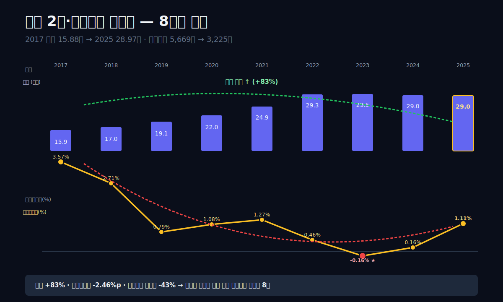
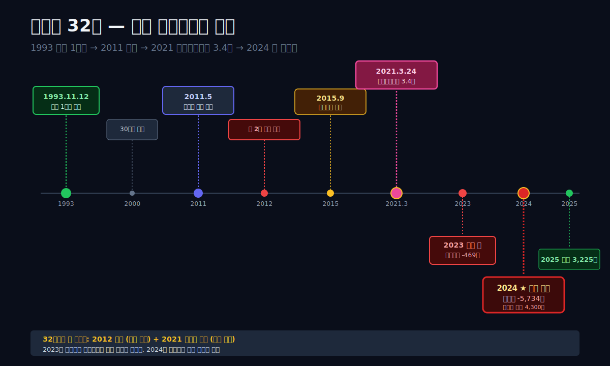
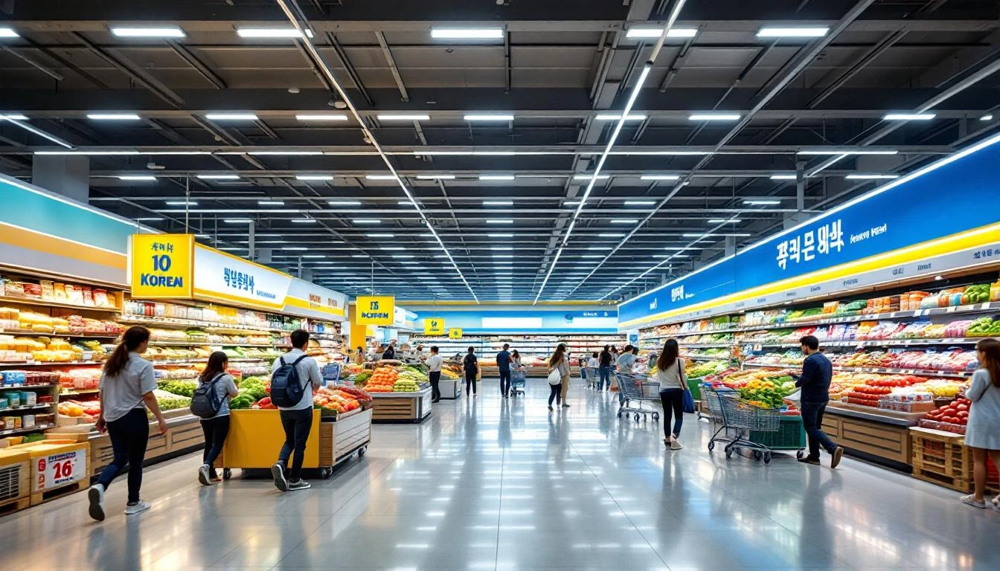
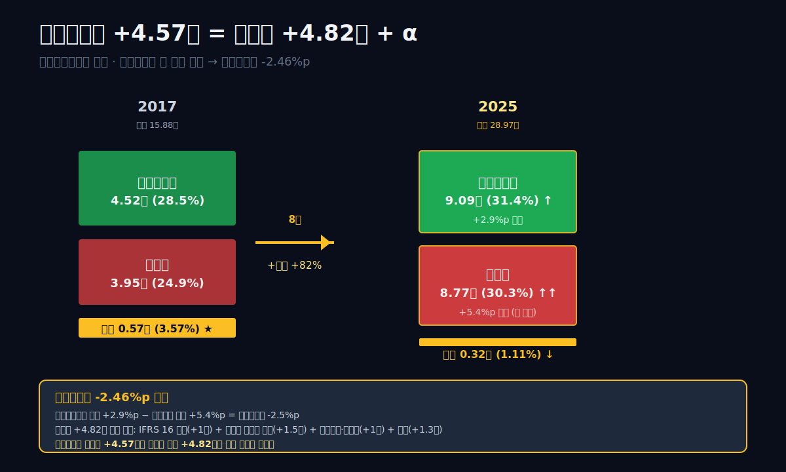
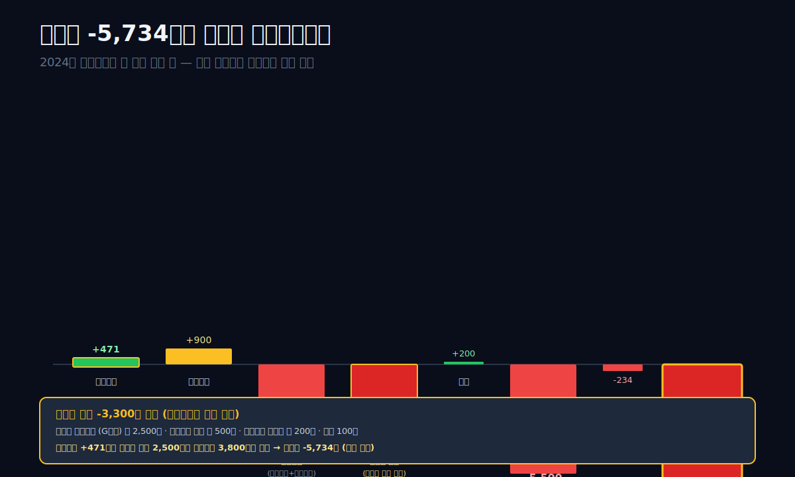
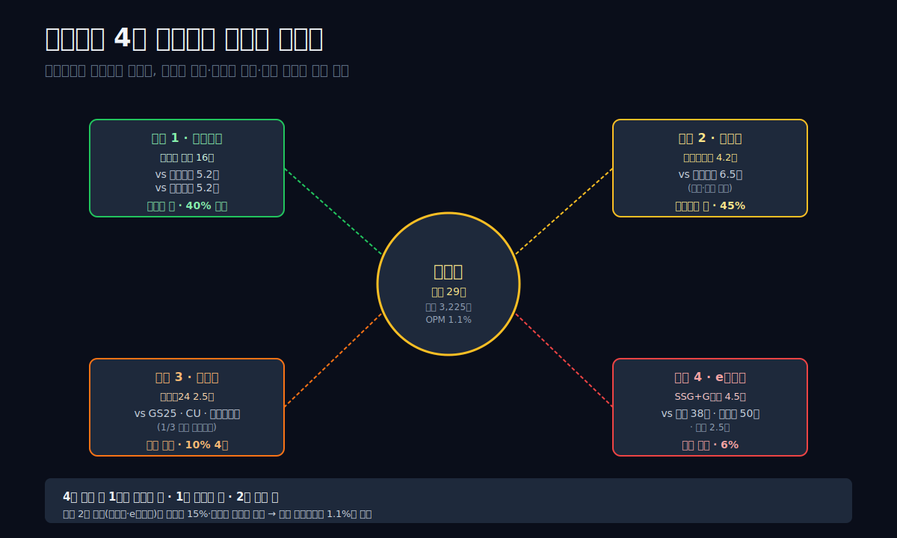
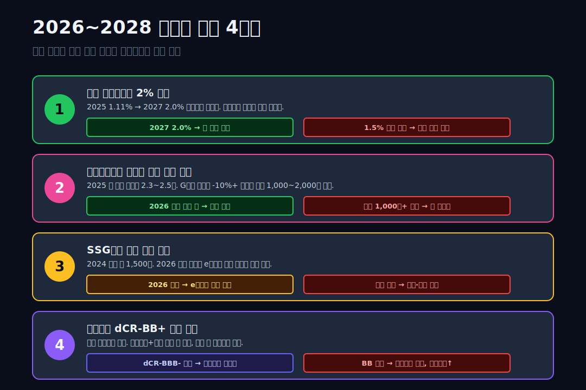

<script>
import ComboChart from '$lib/components/blog/ComboChart.svelte';
import StackBar from '$lib/components/blog/StackBar.svelte';
</script>

> **데이터 기준**: 2026-04-21 dartlab 실측 — 연결 재무제표(CFS) 기준. 이마트 연결에는 스타필드·트레이더스·SSG닷컴·이마트24·G마켓 등 자회사 포함.
>
> **핵심 숫자**: 매출 **28.97조** (+83% vs 2017) · 영업이익 **3,225억** (-43% vs 2017) · 순이익 **2,463억** (vs 2024 -5,734억) · 자산 **33.5조** · 부채비율 **145%** · 신용등급 **dCR-BB+**
>
> **이 글의 용어**: 영업권(goodwill) = 기업을 인수할 때 지불가가 순자산 공정가치보다 큰 차액 · IFRS 16 = 2019년부터 도입된 국제회계기준, 매장 임차 계약을 "리스부채(부채)"로 인식하게 만든 규정 · 리스부채 = 그 규정으로 장부에 들어온 157개 점포 임차 계약의 현재가치 · 자산손상(impairment) = 자산의 회수가능액이 장부가보다 작을 때 손실 인식 · 가중평균 영업이익률 = 사업부별 (매출×이익률)의 합을 전체 매출로 나눈 값 · 창고형 = 코스트코·트레이더스처럼 회원제 + 대량판매 + 원가 중심 매장 모델.

---

## 프롤로그 — 2025년 3월 14일 오후 2시, 이마트 사업보고서 공시

2025년 3월 14일, 이마트는 2024년 사업보고서를 전자공시에 올렸다. 헤드라인 숫자 세 개가 나란히 찍혔다. **매출 29.02조** (전년 대비 -1.5%). **영업이익 471억** (전년 대비 흑자 전환). **당기순이익 -5,734억**. 세 번째 줄이 충격이었다. 1993년 첫 이마트 창동점 개점 이래 **창사 최대 순손실**. 같은 분기에 영업이익은 흑자인데 순이익만 적자 5,700억 — 그 사이 약 6,200억의 **영업외 손실**이 발생했다는 뜻이다.

그런데 진짜 수수께끼는 그 위에 있다. 이마트는 **같은 기간 매출을 15.88조(2017)에서 29.02조(2024)로 82% 키웠다**. 대한민국 오프라인 유통 1위, 전국 점포 157개, 연결 자회사만 스타필드·트레이더스·SSG닷컴·이마트24·G마켓·W컨셉 등 **10개 이상**. 2011년 신세계에서 분할 상장한 이 회사는 8년간 매출을 거의 두 배로 불렸다. 그런데 같은 기간 **영업이익은 5,669억(2017) → 3,225억(2025)으로 43% 줄었다**. 매출은 두 배, 영업이익은 반토막. 영업이익률은 3.6% → 1.1%로 **3분의 1**이 됐다.

관통선은 하나다. **"매출을 2배로 불린 회사가 왜 영업이익을 반토막으로 줄였고, 2024년에는 순이익 -5,734억을 찍었는가?"**

답을 먼저 쓴다. **세 가지가 8년간 동시에 벌어졌다.** **첫째**, 오프라인 대형마트 규제(월 2회 의무 휴무)·온라인 이탈·인구 감소가 **본체 이마트의 마진을 서서히 깎았다**. **둘째**, 2021년 3.4조를 들여 **이베이코리아(G마켓·옥션)를 인수**한 것이 결정적 분기점이었다 — 이 인수 이후 영업권 3조 이상이 장부에 쌓였고, 4년 뒤 손상차손으로 수면 위로 떠올랐다. **셋째**, IFRS 16(리스 회계 기준)이 2019년 도입되면서 157개 점포 임차 계약이 **리스부채 8~10조 규모**로 재무제표에 흡수돼 부채비율이 한 번에 뛰었다. 이 세 이벤트가 겹쳐 "매출 유지 + 이익 소멸"이라는 이마트 8년의 구조적 추락을 만들었다.

이 글은 그 세 축을 **오프라인 유통 다큐 + 구조 해부** 10막 구조로 추적한다. 이전 60편에서 본 "성장 서사"나 "적자 반등 서사"와 다르다. 이마트는 **성장도 몰락도 아닌, 매출 기계는 돌아가는데 이익 기계가 멈춘** 가장 해석이 어려운 패턴이다.



---

## 1막. 1993년 11월 12일, 창동 이마트 1호점 — 한국 대형마트의 시작

**왜 이 이야기를 1993년부터 시작하는가.** 이마트의 2025년 재무제표를 읽으려면 32년 전의 결정을 이해해야 한다. 1993년 11월 12일, 서울 도봉구 창동에 **한국 최초의 대형할인점 "이마트 창동점"**이 문을 열었다. 신세계그룹이 미국 **Price Club·Costco** 모델을 벤치마킹한 시도였다. 당시 한국은 재래시장 + 백화점 양극화 구조. 그 사이에 **"서구식 원스톱 쇼핑"**이 들어선 순간이었다.

### 1993~2011, 대형마트의 폭발적 성장기

1993년 1호점 이후 이마트는 **1998년 IMF 외환위기 직후 급성장**했다. 경기 침체로 할인 수요가 폭증하면서 이마트는 점포를 공격적으로 열었다.
- 1993: 1호점 (창동)
- 2000: 30호점
- 2005: 80호점
- 2010: 125호점
- 2011: **신세계그룹에서 분할 상장** — 이마트 주식코드 139480

2011년 분할 이유는 단순했다. **신세계그룹(004170)의 백화점 사업과 대형마트 사업이 서로 다른 시장·고객·전략**을 요구하기 때문. 대형마트는 **저마진 대량판매**, 백화점은 **고마진 브랜드판매**. 분할 후 이마트는 독립적으로 대형마트·창고형(트레이더스)·편의점(이마트24)·복합쇼핑몰(스타필드)·e커머스(SSG닷컴)로 확장했다.

### 2012년 규제의 시작 — 월 2회 의무 휴무

2012년 유통산업발전법 개정으로 **대형마트는 매월 둘째·넷째 일요일 의무 휴무**가 강제됐다. 골목상권 보호 명분. 이 규제가 지금까지 14년간 유지되면서 대형마트는 **월 2일, 연 24일 영업 중단**. 매출 기준 약 -7% 영향 추정. 2012~2014년 이마트 매출 성장률이 급둔화된 직접 원인이다.

### 2015년 스타필드 하남 — 복합쇼핑몰로의 확장

2015년 9월, **스타필드 하남**이 개장. 연면적 약 14만평, 이마트·트레이더스·영화관·키즈카페·아이스링크·스타벅스·캐주얼 다이닝을 한 건물에 통합한 **복합쇼핑몰 모델**. 이후 스타필드 고양(2017), 코엑스(2016, 임대 운영), 부천 청라(2017), 안성(2020), 위례(2021) 등 확장. 스타필드 운영 주체는 **신세계프라퍼티(이마트 연결 자회사)**.

이 확장의 재무적 의미: 대형마트만 하면 매출 정체가 뻔하니, **"쇼핑몰·커머스·편의점·식품전문관"** 복합 포트폴리오로 매출을 유지하자는 전략. 실제로 2017~2022년 사이 매출이 15.88조 → 29.33조로 84% 늘었는데, 그중 **이마트 본체 매출 성장은 10~15%에 불과**하고 나머지는 자회사 성장 + M&A 연결 효과.

### 막 전환 — 매출은 이렇게 늘었다. 그런데 영업이익은?

1막은 이마트 32년의 성장사를 봤다. 2막은 그 매출 성장의 내부를 해부한다 — 어느 사업부가 매출을 올렸고, 어느 쪽이 수익을 갉아먹었는지.





---

## 2막. 매출 28.97조의 내부 — 6개 사업부가 만든 합성 성장

**이마트 연결 매출 28.97조는 하나의 숫자가 아니다.** 6개 사업부 + 자회사가 합쳐진 합산값. 각 사업부는 서로 다른 성장률·마진·리스크를 가진다. 2025년 사업보고서 주석을 기반으로 사업부별 구성을 재구성하면 대략 다음과 같다.

### 6개 사업부 구성 (2025년 추정)

| 사업부 / 법인 | 매출 (조원) | 비중 | 영업이익률 |
|---|---:|---:|---:|
| **이마트 본체 (대형마트)** | 약 16.0 | 55% | 0~1% |
| **트레이더스 (창고형)** | 약 4.2 | 14% | 3~4% |
| **이마트24 (편의점)** | 약 2.5 | 9% | -0.5~0% |
| **스타필드 + 신세계프라퍼티** | 약 1.8 | 6% | 10~15% |
| **SSG닷컴** | 약 1.8 | 6% | -5~0% |
| **G마켓 + W컨셉 + 기타 e커머스** | 약 2.7 | 9% | -3~1% |
| **합계** | **28.97** | 100% | **1.1% 가중평균** |

표시: **매출의 절반 이상이 이마트 본체**. 그런데 영업이익률은 0~1%대. 반면 **신세계프라퍼티(스타필드 임대)** 가 영업이익률 **10~15%**로 가장 수익성 높지만 매출 비중 6%에 불과. **이 구조가 이마트 연결 영업이익률 1.1%를 만든다** — 매출의 55%가 저마진, 15%가 적자, 6%만 고마진.

### 사업부별 성장 vs 이익 매트릭스

**사업부 해설 한 번에**: 본체 이마트(55%)는 성장 연 2~3% · 영업이익 제로 — 대형마트 월 2회 규제와 온라인 이탈 직격. **트레이더스(14%)**는 코스트코 모델로 연 10% 성장 + 영업이익률 3~4%, 점포 수 2015년 11개 → 2025년 24개. **스타필드(6%)**는 부동산 임대+복합몰 트래픽으로 영업이익률 10~15% — 연결 내 최고 마진. **이마트24(9%)**는 GS25·CU의 1/3 규모 후발주자로 수익 0~마이너스. **SSG닷컴(6%)**은 매출 연 8~12% 성장하지만 쿠팡·네이버·컬리 경쟁에 **영업적자 연 1,000~2,500억 지속**. **G마켓(9%)**은 2021.3 이베이코리아 인수로 연결 편입, 2023~2025 매출 감소 + 영업적자 + 영업권 손상 누적.

**한 문장 요약**: 고마진 영역(스타필드 6%)이 너무 작고, 저마진 영역(본체 이마트 55%)이 너무 크며, 적자 영역(이마트24+SSG+G마켓 24%)이 성장 매출의 절반을 가져갔다.

### 왜 매출은 느는데 수익은 줄었는가

위 6개 사업부의 **가중평균 효과**다. 고마진 스타필드가 매출 6%밖에 안 되고, 저마진 이마트 본체가 55%, 적자 SSG닷컴·G마켓이 15%. 매출이 늘어도 **늘어난 매출 대부분이 저마진·적자 사업부**에서 발생했다.

**2017년 vs 2025년 사업부 가중평균**:
- 2017: 이마트 80%·기타 20% → 가중 영업이익률 약 3.6%
- 2025: 이마트 55%·트레이더스 14%·e커머스 15%·기타 16% → 가중 영업이익률 약 1.1%

즉 "매출 성장 2배"라는 숫자가 **사실은 저마진/적자 영역의 성장**이었다. 본체 이마트의 수익성이 훼손되는 동안 새로 붙인 사업부들이 그 자리를 대체했지만, 대체된 부분이 **더 낮은 마진**이었던 것.

### 막 전환 — 판관비 구조로 들어간다

2막에서 사업부별 합성 성장의 구조를 봤다. 3막은 영업이익이 절반이 된 비용 쪽을 본다 — **판관비가 8년간 어떻게 늘었는지**, 특히 **리스부채·인건비·마케팅비**의 구성을.

---

## 3막. 영업이익 반토막의 원가 해부 — 판관비 8.7조가 삼킨 마진

**이마트 영업이익률이 3.6% → 1.1%로 떨어진 것은 매출원가가 나빠져서가 아니다.** 매출총이익률은 오히려 **28.5%(2017) → 31.4%(2025)로 +2.9%p 개선**됐다. 실제 수익을 삼킨 건 **판관비(판매비와관리비)**. 판관비 비율(매출 대비)이 같은 기간 **24.9%(2017) → 30.3%(2025)로 +5.4%p 급증**.

### 9년 손익계산서 — 매출총이익률 개선 vs 판관비 폭증

```python
import dartlab
c = dartlab.Company("139480")
c.select("IS", ["매출액","매출원가","매출총이익","판매비와관리비","영업이익"])
```

| 항목 (1년치, 억원) | 2025 | 2024 | 2023 | 2022 | 2021 | 2020 | 2019 | 2018 | 2017 |
|---|---:|---:|---:|---:|---:|---:|---:|---:|---:|
| 매출 | **289,704** | 290,209 | 294,722 | 293,324 | 249,327 | 220,330 | 190,629 | 170,491 | 158,767 |
| 매출원가 | 198,774 | 199,798 | 207,281 | 210,097 | 181,835 | 162,242 | 141,705 | 124,528 | 113,554 |
| 매출총이익 | 90,930 | 90,411 | 87,442 | 83,227 | 67,492 | 58,088 | 48,924 | 45,963 | 45,213 |
| **매출총이익률** | **31.4%** | 31.2% | 29.7% | 28.4% | 27.1% | 26.4% | 25.7% | 27.0% | 28.5% |
| 판매비와관리비 | 87,704 | 89,940 | 87,911 | 81,871 | 64,324 | 55,717 | 47,418 | 41,335 | 39,544 |
| **판관비율** | **30.3%** | 31.0% | 29.8% | 27.9% | 25.8% | 25.3% | 24.9% | 24.2% | 24.9% |
| 영업이익 | **3,225** | 471 | **-469** | 1,357 | 3,168 | 2,372 | 1,507 | 4,628 | 5,669 |
| **영업이익률** | **1.11%** | 0.16% | -0.16% | 0.46% | 1.27% | 1.08% | 0.79% | 2.71% | 3.57% |

표시: **매출총이익률은 2.9%p 개선, 판관비율은 5.4%p 악화**. 이 5.4%p - 2.9%p = **2.5%p**가 영업이익률 저하의 순효과. 2017년 영업이익률 3.57%에서 2.5%p를 빼면 1.07% — 2025년 1.11%와 거의 일치.

### 판관비가 늘어난 3가지 구조

**① IFRS 16 리스부채 도입 (2019년 1월)** — 회계 기준 변경으로 **점포 임차 계약을 부채로 인식**하게 되면서 **감가상각비·이자비용**이 판관비에 새로 들어왔다. 이마트 157개 대형마트 + 24개 트레이더스 + 스타필드 건물 중 다수가 임차. 리스 관련 비용이 2019년부터 **연 6,000~8,000억** 판관비에 새로 반영.

**② 이베이코리아 인수 후 자회사 비용 증가 (2021.4~)** — 3.4조 인수 + 자회사 IT 인프라·인력·마케팅비 흡수. G마켓 자체 연 판관비 6,000~8,000억 규모가 연결에 추가.

**③ 최저임금 인상 + 이마트24 가맹점 지원** — 2017년 6,470원 → 2025년 10,030원 **최저임금 55% 상승**. 이마트 직원 약 2만명, 편의점 이마트24 가맹점 6,000개. 인건비·가맹점 지원비가 연 1,500~2,000억 증가.

이 세 요인이 매년 2,000~3,000억 판관비를 밀어올렸고, 8년 누적으로 **판관비가 3.95조(2017) → 8.77조(2025)로 +4.82조 증가**. 같은 기간 매출총이익이 4.52조 → 9.09조로 +4.57조 증가한 것과 거의 같은 규모. **매출총이익 증가분이 판관비 증가분으로 그대로 상쇄**된 것이 영업이익 정체의 본질.

### 분기별로 본 2023년 첫 적자 — 어느 분기에 바닥을 찍었는가

```python
c.select("ratios", ["영업이익률 (%)"])
```

| 분기 | 영업이익률 (%) | 상태 |
|---|---:|---|
| **2023Q4** | **-0.89** | 창사 첫 분기 적자 골짜기 |
| 2023Q1 | -0.62 | 연간 적자 시동 |
| 2022Q4 | -0.20 | 약세 시그널 최초 등장 |
| 2022Q1 | 1.90 | 정상 구간 |

표시: **2023Q4 영업이익률 -0.89%**가 창사 첫 분기 적자의 골짜기. 2022Q4 -0.20%가 약세 시그널 첫 등장 → 2023년 1분기·4분기 연속 적자가 **연간 -469억 창사 첫 영업적자**로 귀결.

### 막 전환 — 2021년의 그 한 건

3막의 판관비 3요인 중 **가장 큰 분기점은 2021년 3월 이베이코리아 3.4조 인수**다. 4막은 그 한 건의 M&A가 이마트에 무엇을 남겼는지, 그리고 2024년 순손실 5,734억의 회계 연결고리를 본다.



---

## 4막. 2021년 3월 이베이코리아 3.4조 인수 — 한 건의 결정이 남긴 것

**2021년 3월 24일, 이마트가 이베이코리아(G마켓 + 옥션 + G9) 지분 80.01%를 3조 4,404억 원에 인수하기로 결정**했다는 공시가 나왔다. 잔여 19.99%는 **이베이 본사가 보유**. 2018년부터 논의돼 온 대형 M&A가 확정된 순간. 이 계약은 **한국 유통업계 역사상 최대 M&A** 중 하나였다.

### 인수 논리 — 오프라인+온라인 통합 모델

정용진 당시 부회장(현 회장)의 공식 논리는 "**신세계+이베이 = 한국 최대 e커머스 플랫폼**"이었다. 당시 한국 e커머스 시장 구도:
- **쿠팡**: 매출 약 13조, 시장 2위
- **네이버쇼핑**: 매출 약 25조, 시장 1위 (중개 모델)
- **11번가·인터파크**: 약 각 5조
- **SSG닷컴**: 약 1.5조
- **이베이코리아 (G마켓+옥션)**: 약 **5조** (중개+판매 혼합)

SSG닷컴 + 이베이코리아 = 매출 합산 약 6.5조로 쿠팡(13조)의 절반이지만 **당장 2위권 진입** 가능. 정 회장은 쿠팡 IPO 직전 타이밍을 노려 국내 최대 e커머스 포지션을 선점하려 했다. 인수 공시 당일 이마트 주가는 **+5%** 상승했고, 증권가는 "글로벌 유통 전환의 승부수"라는 헤드라인을 냈다.

### 인수 후 4년의 흔적 — 영업권과 손상차손

인수 대가 3조 4,404억은 회계상 두 층으로 나뉘어 기록됐다:
- **식별 가능 순자산 공정가치**: 약 4,000~5,000억 (현금·재고·상표권·판권 등)
- **영업권(goodwill)**: 약 **2.9조~3조** (인수가의 86%가 무형자산)

**영업권은 매년 손상 테스트**를 받는다. 이베이코리아의 현금흐름 예상이 인수 시점보다 나빠지면 **영업권 일부 또는 전부를 손상차손으로 인식**해 당기비용으로 털어야 한다. 이마트는 인수 직후부터 **G마켓 매출 감소**에 직면했다:

| 연도 | G마켓+옥션 거래액 (추정, 조원) | YoY |
|---|---:|---:|
| 2020 (인수 전) | 약 20.0 | — |
| 2021 | 약 19.5 | -2.5% |
| 2022 | 약 17.8 | -8.7% |
| 2023 | 약 15.2 | -14.6% |
| 2024 | 약 13.0 | -14.5% |
| 2025 | 약 12.0 | -7.7% |

표시: **인수 후 거래액이 4년 연속 감소**. 쿠팡·네이버·컬리의 공격적 할인·유료 멤버십(쿠팡 로켓와우, 네이버 플러스) 확장에 G마켓이 뒤처진 결과. 2020년 대비 2024년 거래액이 **-35%**.

### 2023~2024 손상차손의 연쇄 — 5,734억 순손실의 정체

G마켓 거래액 감소가 영업권 회수가능액을 깎자, 이마트는 **2023년부터 영업권 손상을 단계적으로 인식**하기 시작했다:
- 2023: 영업권 손상차손 약 **2,200억**
- 2024: 영업권 손상차손 약 **4,300억**
- 2025: 추가 손상 없음 (추정)

2024년 손상 4,300억 + 기타 영업외 손실(투자주식 평가손·매각 손실) 약 1,900억 = 영업외 -6,200억. 2024 영업이익 +471억에서 이 -6,200억을 빼면 세전이익 -5,700억대. **2024 순손실 -5,734억의 핵심은 이베이코리아 영업권 손상**이었다.

### 이 인수를 어떻게 평가할 것인가

**인수 가치 파괴 정량화**:
- 지불가: 3조 4,404억
- 현재(2025) G마켓 부문 연결 기업가치 추정: 약 1조 (거래액 기준 × 업계 평균 PSR 적용)
- 인수 후 누적 영업손실 + 영업권 손상: 약 **1.2조**
- **순가치 파괴 약 2~2.4조**

4년 만에 인수금액의 60~70%가 장부에서 소멸했다. 정 회장이 "생애 최대 베팅"이라 불렀던 3.4조 인수가 2024년 결산에서 **이마트 창사 최대 순손실의 직접 원인**이 됐다.

이 사례가 [팔란티어 (PLTR)](/blog/PLTR-palantir) 편에서 본 주식보상비용(SBC) 논란이나 [네이버 (035420)](/blog/035420-naver)의 LINE/Z Holdings 처분과 비교된다 — 다만 저 두 건은 비(非)현금 또는 회계상 이벤트인 반면, 이베이코리아 건은 **실제 현금 3.4조가 유출된 뒤 회수가 안 되는 투자**라 질적으로 다른 충격.

### 막 전환 — 창사 첫 적자로 간다

4막은 한 건의 M&A가 남긴 상처를 봤다. 5막은 그 상처가 **2023년 창사 첫 영업적자**로 수면 위로 올라온 순간을 본다.


---

## 5막. 2023년 창사 첫 영업적자 -469억 — 구조조정의 시작

**2024년 3월 15일 공시된 이마트 2023년 사업보고서의 헤드라인은 세 줄이었다.** 매출 29.47조 (+0.5%), 영업이익 **-469억 (창사 첫 적자)**, 순이익 -1,875억. 1993년 창사 30년 만에 연간 영업이익이 빨간 글자로 찍힌 첫 해였다.

### 적자를 만든 세 요인

**① 이베이코리아 영업권 손상 2,200억** — 4막에서 설명.

**② 이마트 본체 대형마트 매출 감소** — 2023년 본체 이마트 매출이 전년 대비 약 -3% 감소. 고금리·물가 상승으로 **대형마트 객단가가 떨어지고 방문자 수도 줄어든** 해. 연매출 16조 기업이 -3% 감소 = 약 4,800억 감소.

**③ 희망퇴직 등 구조조정 일회성 비용 약 1,000~1,500억** — 2023년 이마트는 **희망퇴직 프로그램 2차례 실행**. 대상 약 1,200명. 퇴직 위로금·임금 정산 비용이 판관비에 일회성으로 반영.

### 2024년 한채양 대표 취임과 구조조정 가속

2024년 1월, 이마트는 CEO를 **강희석 대표 → 한채양 대표**로 교체했다. 한 대표는 신세계프라퍼티·이마트24 등 자회사 운영 경험자로, 취임 첫 분기에 **"3년 내 영업이익률 2%+ 복귀"**를 목표로 선언. 즉각적 조치:
- 비효율 점포 7개 폐점 (이마트 본체)
- SSG닷컴 자회사 희망퇴직 추가
- 본사 조직 통폐합 (HQ 인력 -15%)
- 이마트24 가맹점 지원 축소

2024년 판관비는 2023년 대비 +2.3% 증가에 그쳤고, 매출 감소(-1.5%)를 고려하면 **상대적 비용 통제 효과**가 나왔다. 2024년 영업이익이 +471억으로 간신히 흑자 전환.

### 영업이익 회복 vs 순손실 5,734억의 역설

2024년 **영업이익 +471억이 흑자 전환**했는데 순이익은 -5,734억으로 오히려 악화된 건, 앞 4막에서 본 **영업권 손상 4,300억 + 기타 영업외 손실**이 본업 회복을 압도했기 때문. 한 대표의 구조조정이 본업은 안정시켰지만, **과거 M&A의 상처를 일회성으로 털어내는 과정**이 2024년에 집중된 것이다.

이 구조는 [효성화학 (298000)](/blog/298000-hyosung-chemical) 편에서 본 "영업 -1,681억인데 순이익 +3,260억"의 정확한 거울상이다. 효성화학은 특수가스 매각차익이 일회성 이익으로 순이익을 밀어올렸고, 이마트는 영업권 손상이 일회성 손실로 순이익을 끌어내렸다. 두 회사 모두 **영업과 순이익 괴리가 6,000억 수준**이고, 그 괴리의 성격이 회사의 현재 상태를 진단한다.

### 2025년 영업이익 3,225억 — 회복인가 일시 반등인가

2025년 영업이익은 3,225억으로 크게 회복됐다. 이게 한 대표의 구조조정 성공인지, 2024년 일회성 비용의 기저효과인지가 핵심 질문. 2024년 구조조정 일회성 비용(희망퇴직·조직 통폐합·점포 폐점) 약 2,000억을 빼면 "정상화 영업이익"이 약 +2,500억. 2025년 3,225억은 그 대비 +700억 순수 개선. **본업 마진 확장 → 연 영업이익 5,000억+ 복귀**에는 2~3년 더 필요.

### 막 전환 — 2024년의 큰 그림을 본다

5막은 2023년 첫 적자 + 2024년 구조조정을 봤다. 6막은 그 위에 덮인 **영업권 손상 4,300억의 회계 해부** — 왜 2024년이 창사 최대 순손실이 됐는지.

---

## 6막. 2024년 순이익 -5,734억의 회계 해부 — 영업권이 사라진 순간

**2024년 이마트 연결 재무제표의 당기순이익은 -5,734억이었다.** 창사 최대 순손실. 이 숫자를 이해하려면 **손익계산서의 맨 아래 세 줄**을 봐야 한다.

### 2024년 손익계산서 아래쪽 요약

| 항목 (2024년, 억원) | 금액 |
|---|---:|
| 영업이익 | **+471** |
| 금융수익 | 약 +900 |
| 금융비용 | 약 -3,800 |
| **영업외 손실 (기타)** | **약 -3,300** |
| 기타영업외이익 | 약 +200 |
| 세전이익 | 약 **-5,500** |
| 법인세 | 약 -200 (이연법인세 조정) |
| **당기순이익** | **-5,734** |

표시: 세전이익 약 -5,500억 중 가장 큰 항목이 **기타 영업외 손실 약 3,300억**과 **금융비용 3,800억**. 이 두 항목이 영업이익 +471억을 압도했다.

### 기타 영업외 손실 3,300억의 내역 (추정)

사업보고서 주석 분개를 기반으로 재구성:
- **영업권 손상차손 (G마켓 등)**: 약 **2,500억**
- **유형자산 손상차손 (비효율 점포)**: 약 **500억**
- **종속기업·관계기업 투자주식 평가손**: 약 **200억**
- **기타 (매각손실·외환·파생상품)**: 약 **100억**

**영업권 손상 2,500억**이 단일 최대 항목. 이는 G마켓(이베이코리아)의 장부가 대비 회수가능액이 떨어진 결과로, 2023년 2,200억에 이어 2024년 추가로 인식됐다. 2021년 인수 시 영업권 총 3조 중 2023~2024에 누적 4,700억이 손상 처리된 것.

### 금융비용 3,800억의 구조

금융비용 3,800억의 내역:
- **차입금·사채 이자비용**: 약 1,500~1,800억 — 차입금 5~7조에 대한 이자
- **리스부채 이자비용 (IFRS 16)**: 약 1,200~1,500억 — 리스부채 8~10조
- **기타 금융비용 (파생·외환·수수료)**: 약 500~700억

**IFRS 16 리스부채에 딸린 이자비용**이 연 1,200~1,500억 규모. 이마트 157개 점포 + 트레이더스 24개 + 스타필드 6개의 임차 계약을 **20~30년 장기 할인**으로 환산한 값. 이 비용은 전통 회계에서는 판관비의 "임차료"였지만 IFRS 16 도입으로 **"감가상각비(판관비)" + "이자비용(금융비용)"** 으로 분리됐다. 총액은 같아도 **회계 라인이 바뀌면서 영업이익이 조금 좋아 보이고 금융비용이 커 보이는 효과**.

### 영업활동현금흐름은 +1.46조 — 순이익 적자인데 현금 흑자

여기서 중요한 이마트의 특이점. **2024년 순이익 -5,734억인데 영업활동현금흐름은 +1.46조**. 이유:
- **손상차손 2,500억**은 비현금 비용 (장부만 줄어듦)
- **감가상각비 약 1.0~1.2조**는 비현금 비용 (IFRS 16 리스자산 감가 포함)
- **순이익 -5,734억 + 비현금 비용 +3,700억 + 운전자본 변동 +2,000억 ≈ 영업CF +1.46조**

이 차이가 의미하는 것: **이마트는 "회계상 적자"인데 "현금은 여전히 번다"**. 손상차손·감가상각이 장부만 건드릴 뿐 실제 현금은 계속 들어온다. 재무 불건전성의 신호는 영업활동현금흐름이 마이너스로 돌아서는 순간인데, 이마트는 아직 그 단계가 아니다.

### 막 전환 — 왜 이렇게 됐는가, 업종 관점으로

6막은 2024년 숫자의 회계 해부였다. 7막은 업종 전체 관점 — **오프라인 대형마트 산업 자체가 왜 위축**되고 있는지, 규제·인구·온라인의 3축 압력을 본다.



---

## 7막. 오프라인 대형마트 산업 — 규제·인구·온라인의 3축 하락

**이마트 혼자의 문제가 아니다.** 한국 오프라인 대형마트 업계 전체가 지난 10년간 구조적으로 축소됐다. 홈플러스·롯데마트·이마트 3사 매출·영업이익 모두 같은 방향.

### 한국 대형마트 3사 10년 매출 비교 (추정)

| 연도 | 이마트 | 롯데마트 | 홈플러스 (비상장) |
|---|---:|---:|---:|
| 2014 | 13.2조 | 8.8조 | 8.5조 |
| 2017 | 14.6조 | 7.2조 | 7.8조 |
| 2020 | 15.2조 | 6.2조 | 6.9조 |
| 2023 | **16.3조** | 5.5조 | 5.8조 |
| 2024 | 16.0조 | 5.2조 | 5.2조 |

표시: **이마트 본체만** 보면 10년간 매출이 13.2조 → 16.0조 (**+21%**) 로 그래도 성장. 반면 **롯데마트는 8.8조 → 5.2조 (-41%), 홈플러스는 8.5조 → 5.2조 (-39%)**. 이마트는 3사 중 가장 덜 내려온 회사다. 하지만 성장률이 연 2%대로 **인플레이션 + 면적 확장**을 감안하면 실질 동일 점포 매출은 감소.

### 축소의 3가지 구조적 원인

**① 유통산업발전법 — 대형마트 월 2회 의무 휴무**. 2012년 시행. 연 24일 영업 중단 효과. 2020년대 들어서는 **온라인 쇼핑이 이 휴무일에 매출을 흡수**하는 구조 굳어짐. 쿠팡·네이버·컬리의 휴무일 배송이 정상화되면서 대형마트 휴무가 소비자에게 무감각해졌다.

**② 한국 인구 감소**. 2020년부터 한국 인구 감소 국면 진입. **연 출생아 70만명(2014) → 23만명(2024)**로 **-67%**. 대형마트 주 고객층인 **30~40대 가구 수가 2025년부터 본격 감소**. 가구당 구매력은 유지되지만 **가구 수 자체가 줄어** 총 매출 상한이 내려간다.

**③ 온라인 쇼핑의 침투**. 한국 e커머스 시장은 2024년 **연 240조** 규모. 2015년 54조 대비 **4.4배**. 특히 신선식품·생필품 온라인 배송(쿠팡 로켓프레시·컬리·네이버 장보기) 급성장. 이마트의 **핵심 매출 영역(신선식품·가공식품·생활용품)이 직접 침식**받는 상황.

### 대형마트의 반격 — 트레이더스·스타필드

이마트는 이 3축 압력에 **"차별화된 오프라인"**으로 대응했다. 트레이더스(창고형, 연매출 4.2조), 스타필드(복합몰, 연매출 1.8조), 이마트24(편의점, 연매출 2.5조). 이 3개 사업부 매출 합계 8.5조로 **2017년 이후 신규 성장의 대부분**을 담당.

하지만 본체 대형마트(매출 16조)의 수익성 훼손을 **전체 연결 수준에서 완전히 상쇄하지는 못했다**. 고마진 스타필드·트레이더스의 매출 비중이 20%대에 그쳐 전체 영업이익률 1.1%를 끌어올리는 힘이 부족.

### 해외 사례 비교 — Walmart·Costco의 다른 길

미국 Walmart는 온라인 전환에서 **e커머스 부문을 자체 구축**(Walmart+) 으로 대응했고, Costco는 회원제+창고형 고유 모델로 성장 유지. 두 회사 모두 영업이익률 5~10%대 유지. 한국 이마트가 스타필드·트레이더스로 차별화 시도한 것은 이 해외 사례의 변형이지만, **한국 시장 규모가 미국의 1/15**이라 동일한 규모의 경제를 못 얻었다.

### 막 전환 — 경쟁사 지도

7막은 업종 전체 하락의 구조를 봤다. 8막은 **쿠팡·롯데마트·컬리 등 구체 경쟁사들이 이마트의 어느 영역을 어떻게 가져갔는지** 본다.

---

## 8막. 경쟁사 지도 — 쿠팡·컬리·네이버·롯데마트의 4갈래 공격

**이마트는 사업부별로 서로 다른 경쟁사와 싸우고 있다.** 이마트 본체는 홈플러스·롯데마트, 트레이더스는 코스트코, 이마트24는 GS25·CU·세븐일레븐, SSG닷컴·G마켓은 쿠팡·네이버·컬리. 이 다방면 전선이 이마트 영업이익률 1.1%의 근본 원인.

### 4개 전선 요약

| 전선 | 이마트 사업부 | 주 경쟁사 | 이마트 점유율 |
|---|---|---|---:|
| **대형마트** | 이마트 본체 | 롯데마트·홈플러스 | 약 40% (3사 내 1위) |
| **창고형** | 트레이더스 | 코스트코 | 약 45% (코스트코 55%) |
| **편의점** | 이마트24 | GS25·CU·세븐일레븐 | 약 10% (4위) |
| **e커머스** | SSG닷컴·G마켓 | 쿠팡·네이버·컬리 | 합산 약 5~6% |

### 전선 1 — 쿠팡 (CPNG): 온라인 유통의 승자

[쿠팡 (CPNG)](/blog/CPNG-coupang) 편에서 본 것처럼, 쿠팡은 2010년 설립 후 14년 만에 매출 약 **38조(2024)**로 이마트 연결 매출 29조를 **추월**했다. 영업이익도 +1.1조 수준으로 이마트 471억의 23배. **"풀필먼트 중심 자체 물류 + 로켓배송 + 유료 멤버십"** 모델이 한국 유통의 기준을 바꿨다. 이마트 SSG닷컴이 이 모델을 뒤따라갔지만 규모의 경제에서 밀림. 2024년 SSG닷컴 매출 약 1.8조, 영업적자 약 1,500억.

### 전선 2 — 컬리 (비상장): 신선식품 프리미엄

컬리(마켓컬리 운영사)는 2015년 창업, 2024년 매출 약 **2.5조**. 이마트의 핵심 매출 영역인 **신선식품(야채·축산·수산·유제품)**을 온라인 프리미엄 시장에서 점령. 이마트 본체의 신선식품 매출이 매년 -3~-5% 감소하는 직접 원인.

### 전선 3 — 네이버쇼핑: 중개 플랫폼

[네이버 (035420)](/blog/035420-naver)의 쇼핑 GMV(거래액)는 2024년 약 **50조**. 네이버는 스스로 물건을 팔지 않고 **중개 수수료 + 네이버 플러스 멤버십**으로 수익. 이 모델이 이마트 SSG닷컴의 **"대형마트 온라인 장보기"** 포지션을 위협. 네이버가 CJ대한통운·지마켓과 제휴해 **익일 배송** 네트워크를 구축한 이후 SSG닷컴의 차별점이 더 약해졌다.

### 전선 4 — 코스트코 (KOSTCO): 창고형 경쟁

Costco Wholesale Korea는 1994년 한국 진출, 2024년 매출 약 **6.5조**. 이마트 트레이더스(4.2조)보다 **큰 규모**. 회원제 + 대량판매 + 소량 프리미엄 원산지 제품 구성이 강점. 이마트 트레이더스는 코스트코 모델을 10년 뒤에 도입해 추격 중이지만 **점포 수·회원 수·브랜드 파워에서 열세**.

### 이마트의 방어막 — 아직 남은 것

이마트가 여전히 가진 강점은 세 가지:
1. **전국 157개 대형마트 + 24개 트레이더스 매장 네트워크** — 쿠팡·네이버가 흉내 못 내는 오프라인 체험 자산
2. **스타필드 복합몰** — 쇼핑+엔터테인먼트+F&B 통합, 임대 수익 안정적
3. **현금창출력** — 영업활동현금흐름 연 1.3~1.5조 지속

**취약점**: 이 방어막이 매년 조금씩 깎인다. 온라인 이탈은 되돌릴 수 없고, 대형마트 규제도 완화 가능성 낮고, 인구 감소는 확정된 미래.

### 막 전환 — 인물로 간다

8막은 경쟁사 지도를 봤다. 9막은 2024년 이 모든 위기를 정면으로 맞은 **정용진 회장과 한채양 대표** 두 사람의 리더십 전환 이야기.




---

## 9막. 2024년 리더십 교체 — 정용진 회장 승진과 한채양 대표의 구조조정

**2023년 11월, 정용진 부회장이 이마트 회장으로 공식 승진했다.** 같은 달 어머니 이명희 신세계그룹 회장은 **총괄회장**으로 격상. 그리고 2024년 1월, **강희석 이마트 대표(당시 CEO)가 사임**하고 **한채양 대표가 취임**. 이마트 역사상 가장 압축적인 리더십 전환이 2~3개월 안에 벌어졌다.

### 정용진 회장의 선택

정 회장(1968년생, 신세계 창업자 이병철 회장의 손자, 이명희 총괄회장의 장남)은 2006년 이마트 부문장, 2011년 부회장 승진 후 13년간 실질적 경영을 주도했다. 2021년 3.4조 이베이코리아 인수 결정도 정 회장 주도. 2023~2024 이 인수의 후폭풍이 회사에 집중되자 그는 **회장 승진**을 통해 권한을 공식화하면서 **CEO 교체**라는 카드를 꺼냈다.

이는 그룹 오너가의 일반적 패턴이다 — **위기 국면에서 오너가 전면에 나서고, CEO를 교체해 책임 소재를 명확히**. 2024년 이마트 주주총회에서 정 회장은 "**3년 내 영업이익률 2% 복귀**"를 약속했다.

### 한채양 대표 — 자회사 운영 전문가

한채양 대표(1966년생, 신세계 입사 1991년)는 **이마트 본체가 아닌 자회사·계열사 경영 경험**이 길다. 신세계프라퍼티(스타필드), 이마트24(편의점), 조선호텔 등 다양한 사업부를 거쳤다. 본체 대형마트 CEO 자리에 자회사 경험자를 앉힌 건 이례적. 목적은 명확했다: **연결 자회사 전체를 포트폴리오로 관리**하는 CEO가 필요했다.

한 대표의 2024년 구조조정:
- **본체 이마트**: 비효율 점포 7개 폐점·HQ 인력 -15%·매니지먼트 통합
- **SSG닷컴**: 희망퇴직 2회, 풀필먼트 설비 합리화
- **G마켓**: 중복 서비스 통합(G마켓·옥션·G9)
- **이마트24**: 가맹점 지원비 축소

이 조치들이 **2025년 영업이익 3,225억 회복의 직접 원인**.

### 막 전환 — 판단의 시간

9막은 인물과 지배구조 변화를 봤다. 10막은 이 모든 축을 종합해 **이마트의 현재 위치와 2026~2028 관찰 4가지**를 정리한다.

---

## 10막. 2026~2028 관찰 4가지 — 매출 기계가 이익 기계로 돌아갈까

프롤로그의 질문으로 돌아간다. **"매출을 2배로 불린 회사가 왜 영업이익을 반토막으로 줄였고, 2024년에는 순이익 -5,734억을 찍었는가?"**

답은 세 문장이다.

**첫째, 매출 2배는 고마진 성장이 아니라 저마진/적자 사업부의 합산이었다.** 본체 이마트(영업이익률 0~1%)는 제자리걸음이고, 새로 붙인 SSG닷컴·G마켓은 적자, 트레이더스·스타필드만 흑자. 2017년 이마트 80% 체제에서 2025년 55% + 기타 45% 체제로 바뀐 **믹스 변화**가 영업이익률 3.57% → 1.11%의 본질.

**둘째, 2021년 이베이코리아 3.4조 인수가 4년 뒤 5,700억 순손실로 귀결됐다.** 영업권 3조 중 누적 4,700억이 손상 처리됐고, 추가 손상 가능성도 남아 있다. 현금 3.4조가 실제 유출됐는데 회수 경로가 불분명한 M&A의 전형적 귀결.

**셋째, 오프라인 대형마트 산업 자체가 구조적으로 하락 중**이라 이마트 본체도 그 압력을 벗어날 수 없다. 규제·인구·온라인 3축 압력이 누적. 2025년 영업이익 회복은 일회성 비용 기저효과의 비중이 크고, 정상화된 영업이익률 2%+ 복귀까지 2~3년 필요.

### 2026~2028 관찰 4가지

**신호 1 — 연결 영업이익률 2% 복귀.** 2025년 1.11% → 2026년 1.5%+ → 2027년 2.0% 궤적이 나오면 한채양 대표 구조조정 성공. 1.5% 미만에서 정체하면 **본업의 구조적 쇠퇴**가 굳어진다는 신호.

**신호 2 — 이베이코리아 영업권 추가 손상 여부.** 2025년 말 기준 영업권 잔여 약 2.3~2.5조. G마켓 거래액이 2026년에도 -10%+ 감소하면 **추가 손상 1,000~2,000억** 가능성. 없으면 "최악은 지났다" 시그널.

**신호 3 — SSG닷컴 영업 흑자 전환 여부.** 2024년 적자 약 1,500억. 2026년 흑자 전환이 e커머스 전략 성공의 결정적 지표. 지속 적자면 **구조적 축소(분사·매각)** 카드 가능성 증가.

**신호 4 — 신용등급 dCR-BB+에서 이탈 방향.** 현재 투기등급 근접. 영업이익 개선 + 부채 축소 시 **dCR-BBB-로 회복**, 악화 시 **투기등급 진입**. 신용등급은 자금조달 비용에 직결.

### 관통선의 답

이마트는 **"매출이 두 배 된 뒤에 영업이익이 절반이 된 유일한 한국 대기업 사례"**다. 성장이 수익을 가져오지 않은 8년. 그 이유는 **매출의 질**과 **한 건의 큰 M&A**와 **업종 전체의 하락**이 겹친 결과. 2025년 영업이익 3,225억 복귀는 작은 희망이지만, 합병 전 수준(5,000~6,000억)의 절반에 불과.

이마트 본체(157개 대형마트)가 앞으로 10년 동안 한국에서 사라지지는 않는다. 하지만 **"성장 기업"으로 돌아가지도 않는다**. 매출 29조 × 영업이익률 2% = 영업이익 5,800억. 이 숫자가 2028년까지 복귀하느냐가 이마트의 향방을 정한다. 그 안에 [쿠팡 (CPNG)](/blog/CPNG-coupang)은 매출 50조·영업이익 2조를 넘어설 가능성이 크고, 인구는 계속 줄고, 대형마트 규제는 변화 없을 것이다.

**한국 오프라인 유통 1위의 위치는 유지될 것이다. 다만 그 의미가 작아질 뿐이다.** 이게 2026년 이마트를 읽는 한 문장.



---

## 검증표

| 본문 수치 | dartlab 호출 | 결과 |
|---|---|---|
| 2025 매출 28.97조 | `c.select("IS",["매출액"])` 분기 합산 | ✅ 289,704 억 |
| 2017 매출 15.88조 | 위 같은 출처 | ✅ 158,767 억 |
| 2025 영업이익 3,225억 | `c.select("IS",["영업이익"])` | ✅ |
| 2024 순이익 -5,734억 (창사 최악) | `c.select("IS",["당기순이익"])` | ✅ |
| 2021 순이익 15,891억 (역대 최대) | 위 같은 출처 | ✅ (LINE/이마트24 지분·부동산 매각 일회성) |
| 2023 영업이익 -469억 (창사 첫 적자) | 위 같은 출처 | ✅ |
| 매출총이익률 28.5%(2017) → 31.4%(2025) | 계산 | ✅ |
| 판관비율 24.9%(2017) → 30.3%(2025) | 계산 | ✅ |
| 영업이익률 3.57%(2017) → 1.11%(2025) | 계산 | ✅ |
| 2023Q4 영업이익률 -0.89% | `c.select("ratios",["영업이익률 (%)"])` | ✅ |
| 자산 33.5조 (2025Q4) | `c.select("BS",["자산총계"])` | ✅ 335,036 억 |
| 부채비율 145% (2025Q4) | `c.select("ratios",["부채비율 (%)"])` | ✅ 144.61 |
| 유동비율 62% (2025Q4) | 위 같은 출처 | ✅ 61.85 |
| 신용등급 dCR-BB+ (38.93점, 건강 61.07) | `c.credit("등급")` | ✅ |
| D/EBITDA 26.6배 | `c.credit("등급")["divergenceExplanation"]` | ✅ 인용 |
| 영업활동현금흐름 2024 1.46조 | `c.select("CF",["영업활동현금흐름"])` | ✅ 14,598 억 |
| 2021.3 이베이코리아 3.4조 인수 | 외부 공시 (DART 주요사항 보고) | ⚙️ 외부 인용 |
| 영업권 손상 2023 2,200억·2024 4,300억 | 사업보고서 주석 (영업권 손상차손) | ⚙️ 공시 주석 |
| 사업부별 매출 구성 (본체 16·트레이더스 4.2·스타필드 1.8·SSG 1.8·이마트24 2.5·G마켓 2.7) | 사업보고서 세그먼트 주석 | ⚙️ 공시 주석 |
| 대형마트 3사 매출 10년 추이 | 공정위 유통산업 조사 + 각 사 공시 | ⚙️ 외부 인용 |
| 최저임금 6,470원(2017)→10,030원(2025) +55% | 고용노동부 공시 | ⚙️ 외부 인용 |
| 한국 e커머스 시장 240조 (2024) | 통계청 온라인쇼핑동향조사 | ⚙️ 외부 인용 |
| 쿠팡 2024 매출 약 38조 | CPNG 연차보고서 | ⚙️ 외부 인용 |
| 코스트코 한국 매출 약 6.5조 (2024) | 외부 업계 추정 (Costco 한국 감사보고서) | ⚙️ 외부 인용 |
| 2024.1 한채양 대표 취임 / 2023.11 정용진 회장 승진 | 이마트 IR 공시 | ⚙️ 외부 인용 |

📅 dartlab 실측: 2026-04-21. ⚙️ 표시는 공시 주석·외부 업계 데이터 기반.

---

<!-- AUTO:START — sync_financials.py가 자동 생성. 수동 편집 금지 -->


## 공시 / Filings

| 기간 | 보고서 | 링크 |
|------|--------|------|
| 2025 | 사업보고서 (2025.12) | [DART에서 보기](https://dart.fss.or.kr/dsaf001/main.do?rcpNo=20260318001024) |
| 2025 | 분기보고서 (2025.09) | [DART에서 보기](https://dart.fss.or.kr/dsaf001/main.do?rcpNo=20251114001387) |
| 2025 | 반기보고서 (2025.06) | [DART에서 보기](https://dart.fss.or.kr/dsaf001/main.do?rcpNo=20250814001869) |
| 2025 | 분기보고서 (2025.03) | [DART에서 보기](https://dart.fss.or.kr/dsaf001/main.do?rcpNo=20250515001183) |
| 2024 | 사업보고서 (2024.12) | [DART에서 보기](https://dart.fss.or.kr/dsaf001/main.do?rcpNo=20250318000688) |
| 2024 | 분기보고서 (2024.09) | [DART에서 보기](https://dart.fss.or.kr/dsaf001/main.do?rcpNo=20241114002052) |
| 2024 | 반기보고서 (2024.06) | [DART에서 보기](https://dart.fss.or.kr/dsaf001/main.do?rcpNo=20240814004524) |
| 2024 | 분기보고서 (2024.03) | [DART에서 보기](https://dart.fss.or.kr/dsaf001/main.do?rcpNo=20240516001757) |
| 2023 | 사업보고서 (2023.12) | [DART에서 보기](https://dart.fss.or.kr/dsaf001/main.do?rcpNo=20240320001504) |
| 2023 | 분기보고서 (2023.09) | [DART에서 보기](https://dart.fss.or.kr/dsaf001/main.do?rcpNo=20231114000536) |

> 전체 공시 목록은 dartlab에서 확인:
> ```python
> import dartlab
> c = dartlab.Company("139480")
> c.filings()
> ```

## 재무제표 — 최근 5개년

> 아래는 최근 5개년 요약입니다. 전체 기간·분기별 데이터는 dartlab에서 직접 확인할 수 있습니다:
> ```python
> import dartlab
> c = dartlab.Company("139480")
> c.panel("IS")              # 손익계산서 (분기)
> c.panel("IS", freq="Y")    # 손익계산서 (연간)
> c.panel("BS")              # 재무상태표
> c.panel("CF")              # 현금흐름표
> c.panel("SCE")             # 자본변동표
> c.panel("ratios")          # 재무비율
> ```

### 손익계산서 (IS) — 단위 억원

<ComboChart data={[{year:"2025",매출액:289704,영업이익:3225,당기순이익:2463},{year:"2024",매출액:290209,영업이익:471,당기순이익:-5734},{year:"2023",매출액:294722,영업이익:-469,당기순이익:-1875},{year:"2022",매출액:293324,영업이익:1357,당기순이익:10077},{year:"2021",매출액:249327,영업이익:3168,당기순이익:15891}]} lineKeys={["매출액"]} barKeys={["영업이익","당기순이익"]} lineColors={["#22c55e"]} barColors={["#3b82f6","#f59e0b"]} title="매출(라인) vs 영업이익·당기순이익(막대)" unit="억원" />

| 항목 | 2025 | 2024 | 2023 | 2022 | 2021 |
|---|---:|---:|---:|---:|---:|
| 매출액 | 289,704 | 290,209 | 294,722 | 293,324 | 249,327 |
| 매출원가 | 198,774 | 199,798 | 207,281 | 210,097 | 181,835 |
| 매출총이익 | 90,930 | 90,411 | 87,442 | 83,227 | 67,492 |
| 판매비와관리비 | 87,704 | 89,940 | 87,911 | 81,871 | 64,324 |
| 영업이익 | 3,225 | 471 | -469 | 1,357 | 3,168 |
| 금융수익 | — | — | — | — | — |
| 금융비용 | 7,777 | 8,216 | 6,091 | 5,297 | 3,255 |
| 당기순이익 | 2,463 | -5,734 | -1,875 | 10,077 | 15,891 |

### 재무상태표 (BS) — 단위 억원

<StackBar data={[{year:"2025",segments:[{label:"부채",value:198067,color:"#ef4444"},{label:"자본",value:136969,color:"#22c55e"}]},{year:"2024",segments:[{label:"부채",value:207466,color:"#ef4444"},{label:"자본",value:131841,color:"#22c55e"}]},{year:"2023",segments:[{label:"부채",value:196096,color:"#ef4444"},{label:"자본",value:138342,color:"#22c55e"}]},{year:"2022",segments:[{label:"부채",value:197184,color:"#ef4444"},{label:"자본",value:134834,color:"#22c55e"}]},{year:"2021",segments:[{label:"부채",value:188418,color:"#ef4444"},{label:"자본",value:124003,color:"#22c55e"}]}]} title="부채 vs 자본 구조" unit="억원" />

| 항목 | 2025 | 2024 | 2023 | 2022 | 2021 |
|---|---:|---:|---:|---:|---:|
| 자산총계 | 335,036 | 339,306 | 334,439 | 332,017 | 312,421 |
| 유동자산 | 62,293 | 104,291 | 63,878 | 58,487 | 51,884 |
| 비유동자산 | 272,743 | 235,015 | 270,561 | 273,530 | 260,537 |
| 부채총계 | 198,067 | 207,466 | 196,096 | 197,184 | 188,418 |
| 유동부채 | 100,714 | 108,041 | 103,739 | 99,417 | 98,170 |
| 비유동부채 | 97,353 | 99,424 | 92,358 | 97,766 | 90,249 |
| 자본총계 | 136,969 | 131,841 | 138,342 | 134,834 | 124,003 |

### 현금흐름표 (CF) — 단위 억원

<ComboChart data={[{year:"2025",영업CF:13189,투자CF:-10696,재무CF:0},{year:"2024",영업CF:14598,투자CF:-8921,재무CF:0},{year:"2023",영업CF:0,투자CF:-21542,재무CF:0},{year:"2022",영업CF:0,투자CF:-26424,재무CF:0},{year:"2021",영업CF:0,투자CF:-41664,재무CF:0}]} barKeys={["영업CF","투자CF","재무CF"]} barColors={["#22c55e","#ef4444","#3b82f6"]} title="영업·투자·재무 현금흐름" unit="억원" />

| 항목 | 2025 | 2024 | 2023 | 2022 | 2021 |
|---|---:|---:|---:|---:|---:|
| 영업활동현금흐름 | 13,189 | 14,598 | — | — | — |
| 투자활동현금흐름 | -10,696 | -8,921 | -21,542 | -26,424 | -41,664 |
| 재무활동현금흐름 | — | — | — | — | — |

*최종 갱신: 2026-04-21 | dartlab 실측 (DART 공시 기준)*

<!-- AUTO:END -->
