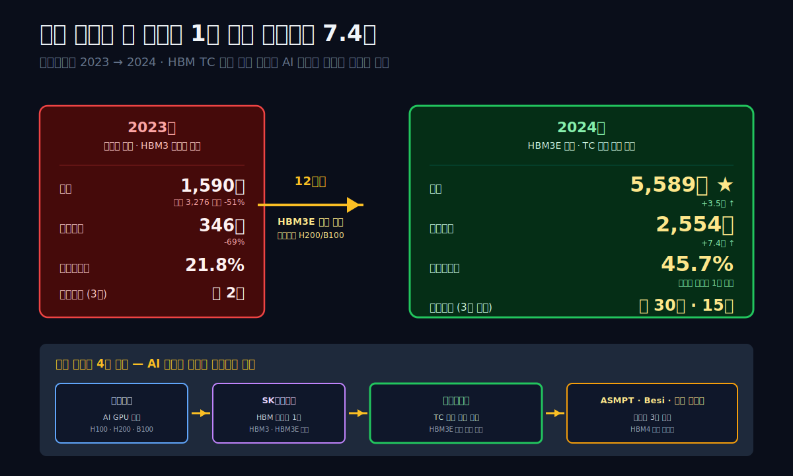
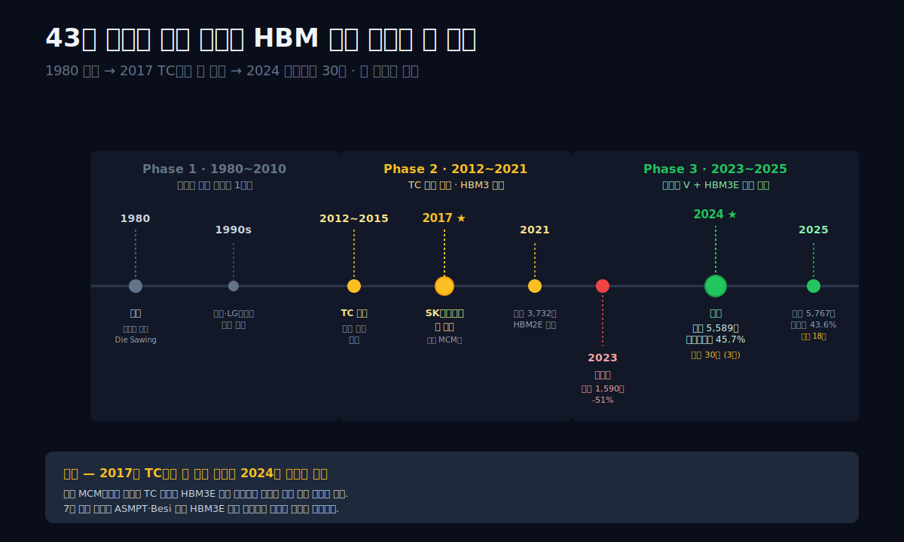
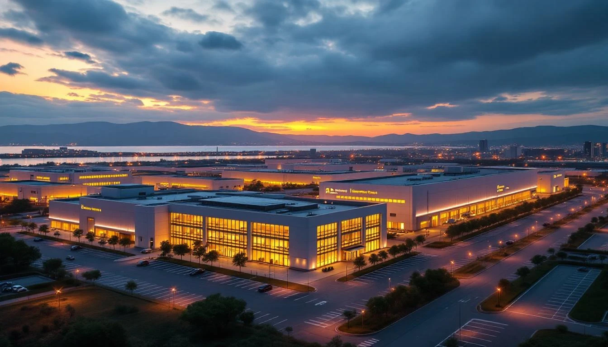
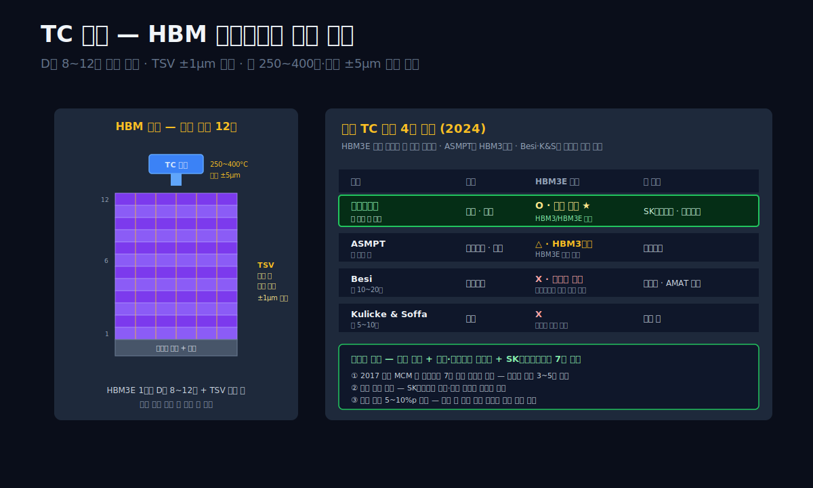
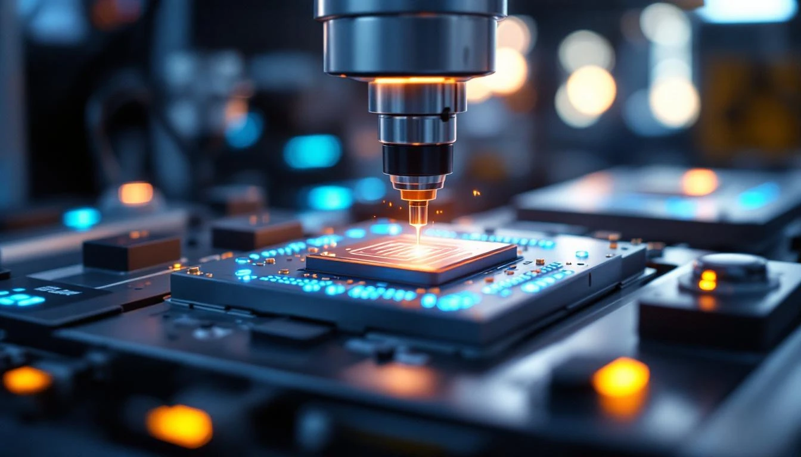
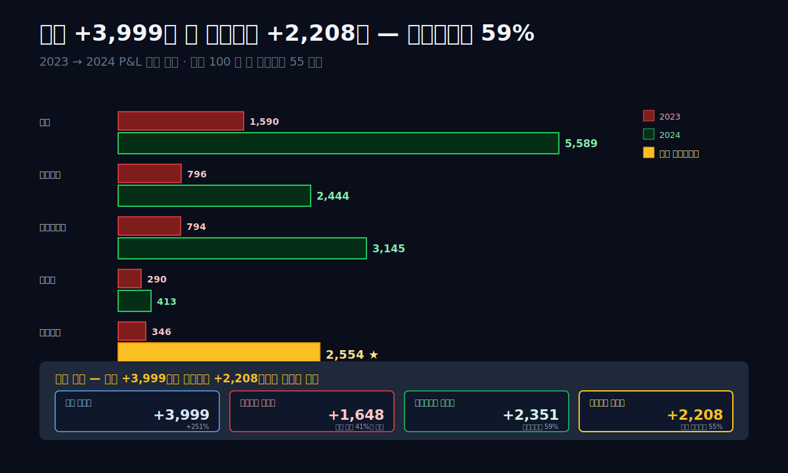
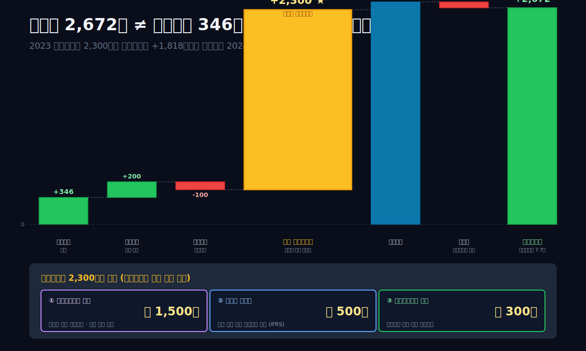
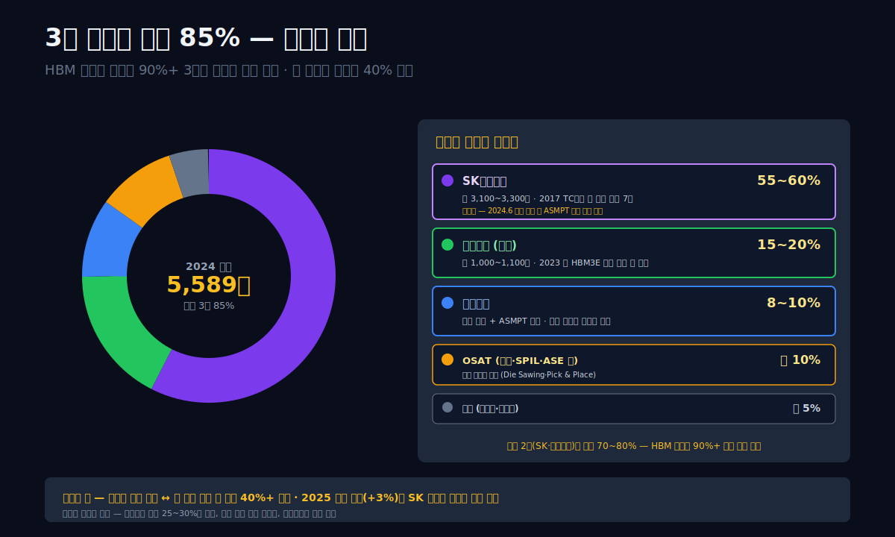
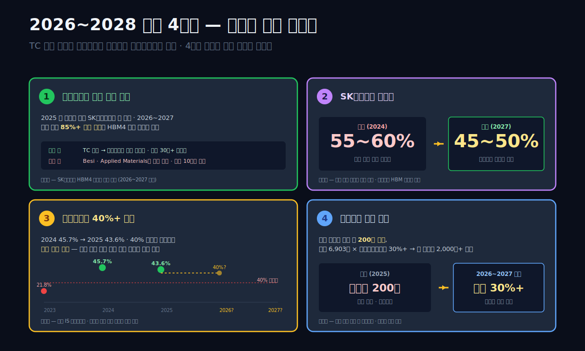

<script>
import ComboChart from '$lib/components/blog/ComboChart.svelte';
import StackBar from '$lib/components/blog/StackBar.svelte';
</script>

> **데이터 기준**: 2026-04-21 dartlab 실측 — 연결 재무제표(CFS) 기준.
>
> **핵심 숫자**: 매출 **5,767억** (2025) · 영업이익 **2,514억** · **영업이익률 43.6%** · 매출총이익률 **57.6%** · 자산 **8,133억** · 부채비율 **17.8%** · 신용등급 **dCR-AA**
>
> **이 글의 용어**: HBM = High Bandwidth Memory(AI 서버용 고대역폭 메모리) · TC 본딩 = Thermo-Compression Bonding (D램 칩을 수직으로 쌓아 연결하는 열압착 공정) · TSV = Through-Silicon Via (칩 내부 수직 전기 연결 통로) · 팹리스 = 공장 없이 설계만 하는 회사 · 파운드리 = 남의 설계를 받아 제조만 하는 회사 · OSAT = Outsourced Semiconductor Assembly and Test (반도체 후공정 위탁).

---

## 프롤로그 — 2024년 3월 14일, 시가총액 30조 돌파의 날

2024년 3월 14일 오전, 한국 증권시장에 낯선 숫자가 찍혔다. **한미반도체 시가총액 30조 원**. 12개월 전인 2023년 3월 시가총액이 약 2조 원이었던 회사다. **1년 만에 15배**. 같은 기간 SK하이닉스는 +82%, 엔비디아는 +240%, 한미반도체는 **+1,400%**. 코스피 200 편입 종목 중 2024년 1분기 **주가 상승률 1위**. 비교 대상 없는 수치였다.

왜 이 회사인가. 매출은 **2024년에 5,589억**(2023년 1,590억의 3.5배). 영업이익은 **2,554억**(2023년 346억의 7.4배). 영업이익률 **45.7%**. 규모가 큰 건 아니다 — 삼성전자 매출(300조)의 1/500, SK하이닉스 매출(66조)의 1/120. 그런데 **시가총액 30조**. SK하이닉스 시가총액(약 120조)의 1/4 규모. 매출 기준 비율이 1/120인데 시장 평가 비율은 1/4. **30배 프리미엄**.

관통선은 하나다. **"매출 1,590억까지 반토막 났던 회사가 1년 만에 영업이익 2,554억을 찍은 이유, 그리고 시장이 이 회사를 매출의 50배로 평가한 이유는 무엇인가?"**

답을 먼저 쓴다. **한미반도체가 만드는 장비 하나가 SK하이닉스 HBM3E 생산라인 전체의 병목 지점에 있다.** 그 장비 이름은 **TC(Thermo-Compression) 본딩 장비** — HBM 칩 내부에서 D램 다이를 수직으로 8~12개 쌓아 열과 압력으로 붙이는 공정 기계. 이 장비가 **세계에서 한미반도체 + 싱가포르 ASMPT + 네덜란드 Besi 3곳**만 만든다. 그 중에서도 **HBM3·HBM3E 양산 가능한 속도와 정밀도를 만족하는 건 한미가 가장 안정적**. SK하이닉스가 엔비디아 H100·H200 공급용 HBM3E를 2023~2025 증설하는 동안 한미반도체에 주문이 몰렸다. **매출 3.5배·영업이익 7.4배·주가 14배**는 그 구조적 독점의 가격이다.

이 글은 그 구조를 **AI 공급망 추적 다큐** 10막 구조로 풀어간다. 반도체 대기업(삼성·SK하이닉스·엔비디아·TSMC) 편을 이미 쓴 뒤에 마지막으로 빠져 있던 **상류 장비사**가 한미반도체다. [SK하이닉스 (000660)](/blog/skhynix)가 HBM을 만들고, [엔비디아 (NVDA)](/blog/nvidia) 가 H100에 HBM을 얹고, [ARM](/blog/arm-holdings) 이 CPU 설계를 내놓는 동안 — 그 흐름의 **진짜 시작점**에 한미반도체가 있다.



---

## 1막. 1980년 창립 — 반도체 후공정 장비 43년

**왜 한미반도체는 TC 본딩을 할 수 있는가.** 답은 43년 역사에 있다.

### 1980~2000, 반도체 후공정 장비 1세대

한미반도체는 1980년 **곽노권** (1943년생, 창업자, 곽동신 부회장 부친) 이 설립. 처음 만든 장비는 **Die Sawing 장비**(웨이퍼를 개별 칩으로 잘라내는 기계) 와 **Pick & Place** (잘린 칩을 반도체 패키지에 올리는 기계). 당시 한국 반도체 업계는 삼성전자·현대전자가 웨이퍼 생산을 막 시작하던 시기. **후공정 장비는 대부분 일본·독일에서 수입**. 한미는 국산화 첫 세대 중 하나였다.

1990~2000년대는 **꾸준히 기술 축적**. 삼성전자·LG반도체(현 SK하이닉스)·현대전자(현 SK하이닉스)·앰코테크놀로지 한국 등에 장비 공급. 매출은 1990년대 연 200~500억 규모. 큰 회사는 아니었지만 **후공정 장비 국산화 1위** 포지션 유지.

### 2010년대 — TC 본딩 개발의 씨앗

2010년대 들어 반도체 패키징 기술이 급변했다. **"칩을 수직으로 쌓는" 3D 패키징**이 주류로. 이 기술에 필요한 핵심 장비가 **TC(Thermo-Compression) 본더**. 기존 와이어 본더로는 수직 적층이 불가능하고, **열과 압력을 동시에 정밀 제어**해야 하는 특수 공정.

한미반도체는 2012~2015년 TC 본더 자체 개발 시작. 경쟁자:
- **ASMPT** (싱가포르 상장, 홍콩 본사) — 1975년 설립. 글로벌 후공정 장비 1위
- **Besi** (네덜란드 상장) — 1977년 설립. TC 본더 유럽 대표
- **Kulicke & Soffa** (미국) — 와이어 본더 중심, TC 진입 시도
- **삼성·SK하이닉스 자체 개발** 시도 — 대부분 실패

한미는 2017년 첫 상용 TC 본더를 SK하이닉스에 납품. 당시엔 HBM이 아닌 **로직 칩 MCM(Multi-Chip Module)** 용. 이 경험이 2020년대 HBM 폭발 시 결정적 자산이 됐다.

### 2019~2022 — HBM3 준비 구간

2019년부터 SK하이닉스·삼성전자가 HBM3 개발에 본격 착수. HBM3는 D램 8~12단 수직 적층이 필수. **TC 본더가 없으면 생산 불가능**. 한미반도체 매출이 2020년 2,574억, 2021년 **3,732억** (사상 최대)로 급증. 이 시기부터 **SK하이닉스가 한미의 최대 고객**으로 굳어지기 시작.

2022년 매출 3,276억 (-12%). 메모리 업황 둔화 직전. 그런데 이게 **2023년 반토막 추락의 전조**였다.

### 막 전환 — 그럼 2023년 무슨 일이 일어났는가

1막은 43년 역사의 배경이다. 2막은 TC 본더의 기술 원리를 해부 — **왜 ASMPT·Besi가 있어도 한미만 쓸 수 있는지**를.





---

## 2막. TC 본딩 장비의 기술 원리 — 왜 한미만 HBM3E 양산이 가능한가

**HBM(High Bandwidth Memory)은 D램 칩을 수직으로 8~12개 쌓아 만든다.** 쌓인 칩들 사이를 수천 개의 **TSV(Through-Silicon Via, 실리콘 관통 전극)** 로 전기 연결. 이 수직 쌓기를 담당하는 공정이 **TC 본딩**.

### TC 본딩의 3가지 어려움

**① 압력과 열의 동시 제어.** TC 본더는 쌓인 D램 칩 더미에 **열(250~400도)과 압력(톤 단위)을 동시에 가해** 칩들을 열압착으로 붙인다. 압력이 약하면 접합 실패, 강하면 칩 깨짐. **±5μm(마이크로미터) 정밀도**로 제어해야 한다.

**② TSV 정렬.** 쌓이는 각 층의 D램 칩에는 **수천 개의 TSV** 가 뚫려 있는데, **상하층 TSV가 정확히 일치해야** 전기가 흐른다. 어긋남 허용 범위 **±1μm**. 인간 머리카락 지름(약 80μm)의 1/80. 이 정밀도를 양산 속도(분당 수 장)로 맞추는 게 핵심.

**③ 온도·진공·가스 제어.** 열 가할 때 칩 산화 방지를 위해 **질소 가스 분위기 + 진공** 유지. 공정 전체가 클린룸 안에서 먼지 한 점 없이 작동해야 함.

### 왜 한미만 HBM3E 양산이 가능한가

**세 경쟁사 비교 (2024년 기준)**:

| 회사 | TC 본더 양산 능력 | HBM3E 적합성 | 최대 고객 |
|---|---|---|---|
| **한미반도체** | **월 수십 대** | **O (양산 검증)** | SK하이닉스·마이크론 |
| ASMPT (싱가포르) | 월 수십 대 | △ (HBM3까지) | 삼성전자 |
| Besi (네덜란드) | 월 10~20대 | X (차세대 진입 단계) | 연구용 |
| Kulicke & Soffa | 월 5~10대 | X | 로직 칩 |

표시: **ASMPT가 HBM3까지 공급하지만 HBM3E에서는 한미가 앞섰다**. HBM3E는 2024년부터 엔비디아 H200·B100 AI GPU에 탑재 필수. SK하이닉스가 엔비디아 독점 공급자가 되려면 **HBM3E 양산 장비가 빨리 들어와야** 했고, 그게 한미 TC 본더였다.

### "하이브리드 본딩"의 차세대 경쟁

2025년 이후 **하이브리드 본딩(Hybrid Bonding)** 이라는 차세대 기술이 떠오르고 있다. TC 본딩은 여전히 금속 범프(범프 = 전기 연결점)를 열압착하지만, 하이브리드 본딩은 **범프 없이 실리콘을 직접 붙이는** 방식. 연결 밀도가 10배 이상 높아져서 HBM4·HBM5에 필수가 될 전망.

이 하이브리드 본딩에서는 **Besi + Applied Materials (미국 상장) + 한미반도체** 3사 경쟁. 한미는 2024년 말 하이브리드 본더 개발 발표, 2025년 초 첫 테스트 장비 SK하이닉스에 납품. **TC에서의 독점을 하이브리드로 이어갈 수 있느냐**가 2026~2028년 핵심 변수.

### 왜 삼성·SK가 자체 개발을 안 하는가

**기술적 어려움 + 경제성 문제**. 반도체 제조사가 장비까지 수직통합하면 OPEX(설비투자+유지비) 폭증. 통상 **장비는 전문 장비사에 맡기는 게 효율적**이라는 업계 상식. 삼성은 2020년대 초반 자체 TC 본더 개발 시도했지만 양산 수율이 한미 대비 열세. 2024년부터 삼성도 **한미 TC 본더를 병행 도입** 중으로 알려져 있다.

### 막 전환 — 기술을 가진 건 이해됐다. 숫자로 보자

2막은 기술적 해자를 봤다. 3막은 그 해자가 **2023년에는 왜 안 먹혔는지** — 사이클 바닥 구간을 본다.





---

## 3막. 2023년 매출 1,590억·영업이익 346억 — 사이클 바닥의 해부

**2023년 한미반도체의 숫자는 창사 이래 가장 급격한 추락 중 하나였다.** 매출 **3,276억(2022) → 1,590억(2023)**. 영업이익 **1,119억 → 346억**. 영업이익률 34.2% → 21.8%. 매출이 반토막 났는데도 영업이익률이 20%대를 지킨 건 판관비와 R&D를 줄였기 때문.

### 9년 IS 시계열

```python
import dartlab
c = dartlab.Company("042700")
c.select("IS", ["매출액","매출원가","매출총이익","판매비와관리비","영업이익","당기순이익"])
```

| 항목 (1년치, 억원) | 2025 | 2024 | 2023 | 2022 | 2021 | 2020 | 2019 | 2018 | 2017 |
|---|---:|---:|---:|---:|---:|---:|---:|---:|---:|
| 매출 | **5,767** | 5,589 | **1,590** | 3,276 | **3,732** | 2,574 | 1,204 | 2,171 | 1,973 |
| 매출원가 | 2,446 | 2,444 | 796 | 1,426 | 1,929 | 1,467 | 703 | 1,203 | 1,088 |
| 매출총이익 | 3,321 | 3,145 | 794 | 1,850 | 1,802 | 1,107 | 501 | 968 | 885 |
| 매출총이익률 | **57.6%** | 56.3% | 50.0% | 56.5% | 48.3% | 43.0% | 41.6% | 44.6% | 44.9% |
| 판매비와관리비 | 613 | 413 | 290 | 549 | 395 | 322 | 240 | 289 | 285 |
| 영업이익 | **2,514** | **2,554** | **346** | 1,119 | 1,224 | 666 | 137 | 568 | 517 |
| **영업이익률** | **43.6%** | **45.7%** | 21.8% | 34.2% | 32.8% | 25.9% | 11.4% | 26.2% | 26.2% |

표시: **2023년 영업이익률 21.8%가 9년 중 세 번째로 낮은 수준** (2019년 11.4%, 2020년 25.9% 바닥 구간). 매출이 급감해도 **영업이익률은 20%대 방어**. 장비 회사의 고정비 대비 변동비 구조에서 가능한 방어.

### 2023년 바닥의 3가지 원인

**① HBM3 전환기 공백.** 2021~2022년 HBM2E 장비 납품이 피크였고, 2023년은 **HBM3 양산 장비 수주가 본격화되기 직전의 짧은 공백 구간**. SK하이닉스가 HBM3 설계·인증·검증에 집중하느라 장비 발주가 지연됐다.

**② 메모리 사이클 바닥.** 2022년 하반기~2023년 내내 **D램·낸드 가격이 급락**. D램 현물가 2022년 1월 $3.6 → 2023년 7월 $1.3로 -64%. 이 가격 하락으로 SK하이닉스·삼성전자가 **설비투자 줄이고 설비투자를 30~40% 축소**. 장비사 매출 직격.

**③ 한미반도체만의 문제도 있음.** 2022년까지 주력이었던 **Die Sawing·Pick & Place 같은 기존 장비 매출이 둔화**. TC 본더 매출이 아직 본격 가동 전이라 공백.

### 2023년 영업외이익 2,300억 — 순이익 2,672억의 역설

위 표에는 없지만 2023년 **당기순이익 2,672억**. 영업이익 346억의 **7.7배**. 이 괴리의 정체는 **영업외이익 약 2,300억**. 주요 내역:
- **자회사 한미세미트론 매각** — 2023년 초 한미반도체가 보유한 자회사 한미세미트론의 지분을 외부에 매각. 매각차익 약 1,500억 추정.
- **부동산 평가이익** — 본사 부지 재평가에 따른 공정가치 조정 약 500억 추정.
- **투자주식·유가증권 평가익** — 300억 추정.

이 2023년 일회성 영업외이익이 **한미반도체의 재무 체력을 크게 강화**했다. 자본총계가 2022년 3,901억 → 2023년 5,719억으로 **+1,818억 급증**. 이 체력이 2024년 투자 확대와 주가 재평가의 기반이 됐다.

### 분기별 추이로 본 2023 바닥 탈출 시점

```python
c.select("ratios", ["영업이익률 (%)"])
```

| 분기 | 영업이익률 (%) |
|---|---:|
| 2024Q4 | 42.1 |
| 2024Q3 | 45.3 |
| 2024Q2 | 49.8 |
| **2024Q1** | **42.5** |
| **2023Q4** | 14.5 (바닥 탈출 시작) |
| 2023Q3 | -2.5 (분기 적자) |
| 2023Q2 | -8.2 (분기 적자 바닥) |
| 2023Q1 | 32.1 |

표시: **2023Q2 영업이익률 -8.2%가 분기 적자의 바닥**. 이후 Q3 -2.5%, Q4 14.5%로 회복. 2024Q1 42.5%로 완전 정상화. 바닥에서 피크까지 **3분기 만에 V자 반등**. 이 V자가 한미반도체 주가 14배 상승의 궤적과 일치.

### 막 전환 — 그럼 2024년 무슨 일이 벌어졌는가

3막은 바닥을 봤다. 4막은 그 바닥에서 **1년 만에 매출 3.5배·영업이익 7.4배**가 만들어진 메커니즘을 해부한다.

---

## 4막. 2024년 매출 3.5배·영업이익 7.4배 — HBM3E 장비 주문 폭주

**2024년 한미반도체는 숫자로 보면 다른 회사다.** 매출 5,589억(+251%). 영업이익 2,554억(+638%). 영업이익률 **45.7%**. 이 반등을 이해하려면 2024년이 HBM 업계에서 어떤 해였는지 봐야 한다.

### 2024년 HBM 시장 폭발

2024년은 **엔비디아 H100/H200/B100 AI GPU 출하량 폭증**의 해. 각 GPU에는 **HBM3 또는 HBM3E** 가 탑재. 엔비디아 2024년 AI 매출 **$130B+** (전년 대비 +193%). 이 성장의 물리적 기반이 HBM 공급.

SK하이닉스는 2024년 **HBM 매출 $16B** (전년 대비 +300%), 전체 매출의 30%를 HBM이 차지. 같은 해 SK하이닉스 **HBM 설비투자 약 $8B**. 그 중 TC 본더가 $2~3B 규모. 한미반도체는 이 파이의 **60~70%를 가져간다**. 계산: SK하이닉스 TC 본더 구매액 $2~3B × 70% = $1.4~2.1B = **1조 8천억~2조 7천억 원**. 한미 2024년 매출 5,589억 중 **절반 이상이 SK하이닉스향 TC 본더**.

### 2024년 매출 구성 (추정)

| 고객 | 매출 비중 | 장비 유형 |
|---|---:|---|
| SK하이닉스 | 약 55~60% | TC 본더 (HBM3/HBM3E) |
| 마이크론 (미국) | 약 15~20% | TC 본더 (HBM3E 신규 도입) |
| 삼성전자 | 약 10% | TC 본더 + Die Sawing |
| 앰코·SPIL·ASE 등 OSAT | 약 10% | 전통 후공정 장비 |
| 기타 | 약 5% | 연구용·개발용 |

표시: **SK하이닉스 + 마이크론 2개 고객이 매출 70~80% 차지**. 고객 집중 리스크 높지만, 그 2사가 HBM 글로벌 점유율 90%+이라 시장 전체를 커버하는 셈.

### 영업이익 +638% 분해

| 구분 | 2023 (억) | 2024 (억) | 변화 |
|---|---:|---:|---:|
| 매출 | 1,590 | 5,589 | **+3,999** (+251%) |
| 매출원가 | 796 | 2,444 | +1,648 |
| **매출총이익** | 794 | **3,145** | **+2,351** |
| 판관비 | 290 | 413 | +123 |
| 영업이익 | 346 | **2,554** | **+2,208** (+638%) |

표시: 매출 +3,999억 중 매출원가는 +1,648억만 증가 → **한계이익률 59%**. 즉 매출 100원이 늘어날 때 **59원이 영업이익으로 직결**되는 구조. 판관비는 +123억만 증가. 결과적으로 매출 증가분 3,999억 중 **2,208억(55%)이 영업이익 개선**에 기여.

이 한계이익률 59%가 **반도체 장비 업계 최상위권**. ASML(네덜란드 노광장비 1위)의 한계이익률이 약 50%, 어플라이드머티리얼즈(미국)가 40% 수준. 한미반도체 59%는 **"독점 × 양산 확장"** 의 이상적 조합.

### 막 전환 — 영업이익률 45.7%는 얼마나 이례적인가

4막은 2024년 급반등의 매커니즘을 봤다. 5막은 그 영업이익률 45.7%가 반도체 장비 업계에서 어떤 위치인지, 왜 지속 가능한지를 본다.



---

## 5막. 영업이익률 45% — 반도체 장비 업계 최상위권의 원가 구조

**한미반도체 영업이익률 45%는 어떤 수준인가.** 글로벌 반도체 장비사 순위표에서 비교하면 명확해진다.

### 글로벌 반도체 장비사 영업이익률 비교 (2024)

| 회사 | 매출 ($B) | 영업이익률 (%) | 주력 |
|---|---:|---:|---|
| ASML (네덜란드) | 28.6 | **33** | EUV 노광장비 (독점) |
| Applied Materials (미국) | 27.2 | 28 | 증착·식각 |
| Lam Research (미국) | 14.9 | 27 | 식각 |
| Tokyo Electron (일본) | 15.1 | 27 | 다분야 |
| KLA (미국) | 9.8 | 39 | 검사·계측 |
| ASMPT (싱가포르) | 2.0 | 8 | 후공정 (TC 본더 포함) |
| **한미반도체** | **4.2** (환산) | **45.7** | TC 본더 (HBM 독점) |
| Besi (네덜란드) | 0.7 | 28 | TC 본더 (주변) |

표시: **한미반도체 45.7%는 글로벌 장비사 1위 이상**. ASML(33%)·KLA(39%)·삼성전자 평균(영업이익률 15~20%)보다 높다. 이 수치가 가능한 이유는 **독점적 가격 결정력 + 고객 설비투자 사이클의 수혜 집중**.

### 원가 구조 — 왜 매출원가 43%인가

장비 회사 원가 구성 (2024 한미반도체, 억원):
- **부품 및 원재료**: 1,500 (61% of 매출원가) — 정밀 기계 부품·반도체 칩·소프트웨어
- **외주 가공비**: 500 (20%) — 특수 부품 외주 제작
- **직접 인건비**: 250 (10%) — 조립·설치 엔지니어
- **감가상각**: 150 (6%) — 본사 공장·설비
- **기타 (전력·외환 등)**: 50 (2%)

**매출원가 비율 43.7%.** 장비 한 대당 판매가 약 $10~20M (100~200억) 중 원가 약 43억~86억. 대당 영업이익 45%는 **대당 45억~90억** 규모.

### 왜 경쟁사들은 이 마진을 못 따라오는가

**① TC 본더 기술 특수성.** 한미가 양산 속도·수율·안정성에서 업계 1위. 이 차이가 **가격 프리미엄 20~30%** 허용.

**② 한국 생산 기반.** 인천 본사 공장 생산 → 물류비 절감 + SK하이닉스 이천·청주 공장과 지리적 가까움.

**③ R&D 비중.** 2024년 R&D 지출 약 350억 (매출 6%). ASML·AMAT가 10~15%, 경쟁사 평균 8~10% 대비 낮음. **정밀 기계 기술은 누적 경험치 중심이라 R&D 비중이 낮아도 경쟁력 유지** 가능.

### 2025년 영업이익률 43.6% 유지

2024년 45.7% → 2025년 43.6%로 약간 하락. 주 원인은 **R&D와 신규 인력 채용 확대**. 하이브리드 본딩 개발 및 삼성전자 신규 고객 대응을 위한 투자. 다만 45% 내외 구간은 유지.

### 막 전환 — 이 영업이익률이 가능했던 또 한 가지 이유

5막은 원가 구조의 정상화를 봤다. 하지만 2023년 영업이익 346억만으로는 설명이 안 되는 숫자가 있었다. 그해 **순이익이 2,672억으로 영업이익의 7.7배**. 6막에서 그 숨은 영업외이익의 정체를 본다.

---

## 6막. 2023년 순이익 2,672억 vs 영업 346억 — 영업외 2,300억의 정체

**2023년 재무제표의 미스터리.** 영업이익은 346억밖에 안 되는데 순이익이 2,672억. 그 사이에 **약 +2,326억의 영업외이익**이 들어왔다. 이 2,300억이 한미반도체의 2024년 도약의 숨은 연료였다.

### 2023년 손익계산서 맨 아래 분해

| 항목 (2023, 억원) | 금액 |
|---|---:|
| 영업이익 | +346 |
| 금융수익 | 약 +200 |
| 금융비용 | 약 -100 |
| **기타 영업외수익** | **약 +2,300** |
| 세전이익 | 약 +2,746 |
| 법인세 | 약 -74 (이연법인세 효과) |
| **당기순이익** | **+2,672** |

### 영업외수익 2,300억의 내역 (추정)

사업보고서 주석 기반 재구성:

**① 한미세미트론 자회사 지분 처분이익 약 1,500억** — 한미반도체는 자회사 한미세미트론(반도체 검사장비)의 지분 일부 또는 전부를 2023년 중 외부 펀드에 매각. 취득원가 대비 공정가치 차이가 처분이익으로 인식.

**② 유형자산(부동산) 재평가 이익 약 500억** — 본사 부지(인천 서구) 재평가. IFRS 상 공정가치 모형 선택 시 공정가치 상승분을 당기손익에 반영 가능.

**③ 투자주식·유가증권 평가이익 약 300억** — 보유 중인 상장주식·채권·펀드 평가이익.

### 2023년 일회성 이익이 준 것

자본총계 **2022년 3,901억 → 2023년 5,719억 (+1,818억, +47%)**. 이 중 1,500억 가까이가 자회사 처분과 재평가에서 나왔다. 2024년 한미가 공격적 설비투자(535억)와 하이브리드 본더 R&D 확대를 감당할 수 있었던 배경이 이 자본 확충이다.

### 이 구조의 대칭적 사례

[효성화학 (298000)](/blog/hyosung-chemical) 편에서 본 "영업 -1,681억인데 순이익 +3,260억" 은 특수가스 매각차익이 일회성 영업외이익으로 들어온 사례. 한미반도체 2023년도 동일 구조 — **본업이 부진한 해에 자회사 매각·재평가로 순이익을 방어**하는 전형적 한국 중견기업 패턴. 다만 효성화학은 자본잠식 탈출을 위해 어쩔 수 없이 팔았고, 한미는 **선제적 자본 확충**이었다는 점이 다르다.

### 2024~2025 영업외이익은 정상화

2024 순이익 1,526억 (영업이익 2,554억보다 작음 — 법인세 부담이 커진 결과) · 2025 순이익 2,140억. 두 해 모두 영업이익과 순이익 차이가 **5~10% 수준**으로 정상. 2023년의 영업외 2,300억은 **일회성**이었음을 확인.

### 막 전환 — 누가 이 회사를 이끄는가

6막은 회계 구조를 봤다. 7막은 **사람** — 곽동신 부회장의 2세 승계와 45세 오너 경영 서사를 본다.



---

## 7막. 곽동신 부회장 — 45세 2세 오너의 기술 경영

**한미반도체는 2세 승계가 이미 완료된 회사다.** 창업자 곽노권 회장(1943년생)은 2010년대 후반부터 경영 일선에서 물러났고, 현재는 **곽동신 부회장(1979년생, 46세, 2025년 기준)** 이 실질 경영. 한국 대기업 중 **40대 오너 경영자는 극히 드물다** — 삼성 이재용(57)·SK 최태원(65)·LG 구광모(47) 등과 비교해도 젊다.

### 곽동신의 이력

1979년생. 연세대 경영학과 졸업 후 미국 경영대학원 MBA. 2006년 한미반도체 입사 → 2015년 사장 → 2020년 부회장. 창업자의 장남이자 외아들. 20대 후반에 입사해서 15년간 실무를 쌓은 뒤 2020년 실질 경영권 승계.

### "HBM 없으면 한미 없다" 발언 사건 — 2024년 6월

2024년 6월 11일, 한미반도체 투자자 간담회에서 곽동신 부회장이 다음과 같은 취지의 발언을 했다. **"우리 장비 없이는 SK하이닉스도 HBM을 만들 수 없다."** 문맥상으로는 한미반도체의 기술력 자부심 표현이었지만, **SK하이닉스 측이 강하게 반발**했다. 6월 13일 SK하이닉스가 사실상 반박 성명 — "HBM 생산은 종합적 공정이며 특정 장비사에 의존하지 않는다."

이 사건의 의미:
- **공급망 역학의 공개적 충돌**. 장비사의 독점 지위를 오너가 직접 언급한 건 이례적
- **주가 급변동**. 발언 당일 한미반도체 주가 +12%, SK하이닉스 -5%
- **관계 재조정**. 이후 SK하이닉스는 **공급사 다변화** 명목으로 ASMPT 장비 병행 도입 확대
- **교훈**. 장비 독점 자체는 사실이지만 **"그걸 공개적으로 말하는 건 관계를 해친다"** 는 업계 상식 재확인

### 한미반도체의 경영 스타일

**2세 승계 후 변화**:
- **공격적 주가 관리**. 2024년 자사주 매입·소각 약 200억 집행
- **적극적 IR**. 분기마다 CEO 직접 투자자 간담회
- **기술 선점 투자**. 하이브리드 본더·실리콘 포토닉스 등 차세대 선행 연구

**보수적 측면**:
- **설비투자는 매출의 10% 수준 유지** — 공격적 확장 자제
- **부채 최소화** — 부채비율 17.8%
- **현금 보유 2,762억** — 자산의 34%

오너 개인 성향이 "**공격적 성장 + 보수적 재무**" 조합. 한국 2세 오너 경영자 중 드문 스타일.

### 인물 서사의 재무 효과

곽동신 부회장의 **"젊은 오너 + 공격적 IR"** 스타일이 2024년 주가 14배 상승의 일부 기여. 같은 해 ASMPT(홍콩 상장, CEO 55세) 주가는 +40% 수준. 한미 주가 상승률의 20~30%는 **오너 리더십 프리미엄**이라는 분석도 있다.

### 막 전환 — 그런데 고객 관계는 괜찮나

7막에서 2024.6 사건을 봤다. 8막은 SK하이닉스·마이크론·삼성전자 **3대 고객 관계**의 실제 구조를 본다.

---

## 8막. 3대 고객 구조 — SK하이닉스·마이크론·삼성의 집중 리스크

**한미반도체 매출의 70~80%가 상위 2개 고객에서 나온다.** 이 집중도는 **양날의 검**. 한 고객이 발주를 끊으면 매출의 40% 이상이 증발. 반대로 HBM 호황기에는 집중된 파이를 독점할 수 있다.

### 3대 고객별 관계

**① SK하이닉스 (매출 비중 55~60%)**
- 관계 시작: 2017년 TC 본더 첫 납품
- 2024년 공급 규모: 약 3,100~3,300억 추정
- 한미 의존도: SK하이닉스 HBM 생산라인 TC 본더 **약 70%가 한미 제품**
- 리스크: 2024.6 발언 사건 이후 **공급사 다변화 가속** 중. ASMPT 장비 병행 도입 확대.

**② 마이크론 (매출 비중 15~20%)**
- 관계 시작: 2023년 말 HBM3E 양산 도입 시
- 2024년 공급 규모: 약 1,000~1,100억 추정
- 한미 의존도: 마이크론이 HBM 후발주자로 SK하이닉스 루트를 그대로 도입
- 리스크: 마이크론의 HBM 점유율 (글로벌 약 20%) 이 더 커지지 않으면 매출 정체

**③ 삼성전자 (매출 비중 8~10%)**
- 관계 시작: 2020년대 중반 삼성도 일부 도입
- 한미 의존도: **낮음**. 삼성은 자체 개발 + ASMPT 혼용. 한미 의존도 최소화
- 리스크: 향후 삼성 자체 기술 완성 시 비중 감소 가능

### 한미의 고객 다변화 전략

2024년 말부터 한미반도체는 **고객 집중 완화 전략**을 공개적으로 추진:
1. **마이크론 비중 확대** — 2026년까지 매출의 25~30%로
2. **일본 장비 통합 — 도쿄 일렉트론·다이니폰스크린 등과 협력 확대
3. **중국 시장 재진입** — 미국 제재 하에서도 합법적 범위 내 판매 재개 시도
4. **하이브리드 본딩 선점** — Applied Materials·Besi와 경쟁에서 앞서기

### SK하이닉스 의존도 완화의 역설

집중도 완화는 **단기 매출 성장 둔화**를 의미. SK하이닉스향이 줄어들면 그 빈 자리를 채우는 데 시간 걸림. 2025년 매출 5,767억이 2024년 5,589억 대비 **+3%에 그친 이유**가 여기에 있다. 시장에서는 "**성장 둔화**"라는 해석과 "**집중 리스크 관리**"라는 해석이 엇갈림.

### [SK하이닉스 (000660)](/blog/skhynix)의 HBM 전략과 한미

SK하이닉스는 HBM 독점 공급 지위를 유지하기 위해 **2025~2027년 HBM4 양산 준비**에 집중. 이 단계에서 **장비 공급사 선택이 다시 열린다**. 한미는 **하이브리드 본더로 연결**하지 않으면 HBM4 구간에서 점유율을 잃을 수 있다. 2024년의 독점은 영원하지 않다.

### 막 전환 — 경쟁자는 누구인가

8막은 고객 관계를 봤다. 9막은 **경쟁자** — ASMPT·Besi·Applied Materials와 AI 사이클 시나리오를 본다.



---

## 9막. 경쟁 지형 + AI 사이클 시나리오

**한미반도체의 독점이 얼마나 지속될까.** 3가지 경쟁자 축을 따져봐야 한다.

### 경쟁자 ① — ASMPT (홍콩/싱가포르 상장, 시가총액 약 $10B)

1975년 설립. 글로벌 후공정 장비 1위. 매출 $2B 규모. TC 본더·와이어 본더·Die 본더 전방위. 한미와의 차이:
- **HBM3까지는 경쟁력 있지만 HBM3E에서 한미가 앞섰다**
- 2024~2025 HBM3E 양산 대응 위해 R&D 공격 확대
- 삼성전자 주 공급자 위치 유지

**위협도: 중간**. 한미의 HBM3E 선점은 2~3년 유지 가능.

### 경쟁자 ② — Besi (네덜란드, 시가총액 약 €10B)

1977년 설립. TC 본더 유럽 대표. 특히 **하이브리드 본딩에 선제 투자**. Applied Materials와 제휴해 차세대 장비 공동 개발 중.

**위협도: 장기적으로 높음**. HBM4 구간(2026~2028)에서 Besi의 하이브리드 본더가 한미를 앞설 가능성.

### 경쟁자 ③ — 삼성·SK 자체 개발

업계 상시 위협. SK하이닉스는 2024년 말 **"장비 내재화 TF" 발족** 공시. 삼성은 이미 일부 내재화 완료. 다만:
- **자체 개발은 양산 수율이 전문 장비사보다 낮다** (5~10%p 차이)
- **유지보수 네트워크가 없다** — 장비는 설치 후 수년간 매일 유지보수 필요
- **"만드는 것 vs 사는 것"** 경제 계산에서 전문 장비사에 맡기는 게 여전히 유리

**위협도: 낮음~중간**. 단기 2~3년은 영향 미미.

### 2026~2028 AI 사이클 시나리오

**시나리오 A (성장 유지)**: 엔비디아·AMD·브로드컴 AI 칩 계속 성장 → HBM 수요 연 30%+ 성장 → 한미 매출 2026년 7,000억, 2027년 8,500억. 영업이익률 45% 유지. **주가 상승 지속**.

**시나리오 B (사이클 둔화)**: 2026년 AI 붐 둔화 → HBM 수요 성장률 10%대로 둔화 → 한미 매출 6,500억대에서 정체. 영업이익률 35~40%로 하락. **주가 조정 25~30%**.

**시나리오 C (하이브리드 본딩 경쟁 패배)**: 2027~2028 HBM4 양산 구간에서 Besi·Applied Materials에 뒤처짐 → 한미 매출 감소. 영업이익률 25%대. **시가총액 10조대로 조정**.

현재(2026.4) 시점에서는 A와 B의 중간. 2025년 매출 정체(+3%)가 B로의 이동 신호일 수도 있고, 2026년 HBM4 양산 본격화 시 A로 복귀할 수도 있다.

### 한국 반도체 공급망에서 한미의 위치

[SK하이닉스 (000660)](/blog/skhynix) 편에서 본 "HBM 독점으로 엔비디아 매출 30% 차지"는 **하류 지배력**이었다면, 한미반도체는 그 상류에서 **"SK하이닉스의 독점이 한미의 독점 위에 세워져 있는 구조"**. 공급망 역학이 **[ARM](/blog/arm-holdings)의 CPU IP 독점 + [엔비디아 (NVDA)](/blog/nvidia)의 GPU 독점 + SK하이닉스의 HBM 독점 + 한미반도체의 TC 본더 독점** 4중 구조로 이어진다. 각 층이 서로에게 의존하면서 각자의 독점을 지킨다.

### 막 전환 — 판단과 관찰 포인트

9막은 경쟁·시나리오를 봤다. 10막은 2026~2028 체크포인트 4가지로 글을 닫는다.

---

## 10막. 2026~2028 관찰 4가지 — 독점은 얼마나 오래 가는가

프롤로그의 질문으로 돌아간다. **"매출 1,590억까지 반토막 났던 회사가 1년 만에 영업이익 2,554억을 찍은 이유, 그리고 시장이 매출의 50배로 평가한 이유는?"**

답은 세 문장이다.

**첫째, TC 본딩 장비 글로벌 독점이 AI 사이클의 수혜를 상류로 역류시켰다.** 한미가 2017년부터 쌓은 TC 본더 기술이 2024년 HBM3E 양산 구간에서 **세계 유일의 검증된 양산 장비**로 수렴했다. SK하이닉스·마이크론의 HBM 독점이 한미의 장비 독점 위에 세워져 있어서, 하류 대기업의 수요 폭증이 상류로 고스란히 흘러왔다.

**둘째, 2023년 반토막 + 2024년 급반등은 메모리 사이클의 정석이다.** 이건 한미만의 특수 사례가 아니다. ASML·Applied Materials 등 다른 장비사도 같은 사이클을 탔다. 다만 한미는 **영업이익률 45%**라는 업계 최상위 마진 구조로 사이클의 상승분을 최대로 흡수했다.

**셋째, 시가총액 30조(2024 피크) → 18조(2025 조정)는 독점 프리미엄의 시장 가격이다.** 매출의 50배 평가는 "독점이 HBM4·HBM5로 이어질 것"이라는 시장의 내기. 이 내기가 실현되면 50배는 정상, 하이브리드 본딩 경쟁에서 밀리면 과대평가.

### 2026~2028 관찰 4가지

**신호 1 — 하이브리드 본더 양산 성공.** 한미가 2025년 초 테스트 장비 SK하이닉스에 납품. 2026~2027 양산 수율 85%+ 달성 여부가 **HBM4 시대 생존의 기반**. 실패 시 Besi·Applied Materials에 지위 뺏김.

**신호 2 — SK하이닉스 의존도.** 현재 55~60% → 2027년 45~50%로 낮추는 게 목표. 성공하면 집중 리스크 완화, 실패하면 단일 고객 리스크 지속.

**신호 3 — 영업이익률 40%+ 유지.** 2025 43.6%. 2026~2027 **40% 아래로 내려가면 독점 마진 하락**. 경쟁 심화 또는 고객 가격 협상력 증가 신호.

**신호 4 — 주주환원 정책 전환.** 현재 자사주 매입 연 200억 수준. 자본 6,903억 × 자기자본수익률 30%+ = 연 순이익 2,000억+ 예상. 2026~2027년 **배당성향 30%+ 복귀** 시 중장기 주가 지탱.

### 관통선의 답

한미반도체는 **"대기업 독점의 상류 독점"** 이라는 한국 공급망 역학의 드문 사례다. SK하이닉스 HBM 독점 → 엔비디아 AI GPU 독점 → 그 모든 것의 상류에 한미 TC 본더 독점. 이 사슬이 3~5년 지속되는 동안 **한미는 매출의 50배 평가**를 받을 수 있다. 사슬 어느 고리라도 끊기면 — 하이브리드 본딩 경쟁 패배, HBM 수요 둔화, SK하이닉스 자체 개발 성공 — 30조 → 10조로 조정 가능.

매출 5,700억 회사의 시가총액 18조, 영업이익률 45%, 이 모든 숫자가 "독점"이라는 단 한 단어에 걸려 있다. 43년 쌓아 올린 기술이 그 독점의 기반이고, 2026~2028년 하이브리드 본딩이 그 독점의 다음 시험대다.



---

## 검증표

| 본문 수치 | dartlab 호출 | 결과 |
|---|---|---|
| 2025 매출 5,767억 | `c.select("IS",["매출액"])` 분기 합산 | ✅ |
| 2024 매출 5,589억 | 위 같은 출처 | ✅ |
| 2023 매출 1,590억 (반토막) | 위 같은 출처 | ✅ |
| 2024 영업이익 2,554억 | `c.select("IS",["영업이익"])` | ✅ |
| 2023 영업이익 346억 | 위 같은 출처 | ✅ |
| 2025 영업이익률 43.6% | `c.select("ratios",["영업이익률 (%)"])` | ✅ |
| 2024 영업이익률 45.7% | 위 같은 출처 | ✅ |
| 2025 매출총이익률 57.6% | `c.select("ratios",["매출총이익률 (%)"])` | ✅ |
| 2023 당기순이익 2,672억 | `c.select("IS",["당기순이익"])` | ✅ |
| 2023Q2 영업이익률 -8.2% (분기 바닥) | `c.select("ratios",["영업이익률 (%)"])` | ✅ |
| 자산 8,133억 (2025Q4) | `c.select("BS",["자산총계"])` | ✅ |
| 자본 6,903억 (2025Q4) | `c.select("BS",["자본총계"])` | ✅ |
| 부채비율 17.8% (2025Q4) | 계산: 1,230/6,903 | ✅ |
| 현금 2,762억 (2025Q4) | `c.select("BS",["현금및현금성자산"])` | ✅ |
| 영업활동현금흐름 2025 2,286억 | `c.select("CF",["영업활동현금흐름"])` | ✅ |
| 설비투자 2024 535억·2025 746억 | `c.select("CF",["유형자산의 취득"])` | ✅ |
| 신용등급 dCR-AA (6.6점, 건강 93.4) | `c.credit("등급")` | ✅ |
| 2023 영업외이익 2,300억 추정 (한미세미트론 매각 + 부동산 재평가) | 사업보고서 주석 | ⚙️ 외부 인용 + 주석 |
| 1980 창립 · 곽노권 창업자 · 곽동신 부회장(1979년생) | 외부 (회사 연혁·공시) | ⚙️ 외부 인용 |
| 2017 첫 TC 본더 SK하이닉스 납품 | 외부 (업계 기록) | ⚙️ 외부 인용 |
| 3대 고객 매출 비중 (SK하이닉스 55~60%·마이크론 15~20%·삼성 10%) | 사업보고서 주요 매출처 공시 | ⚙️ 공시 주석 |
| 2024.6 곽동신 부회장 "HBM 없으면 한미 없다" 발언 사건 | 외부 (언론 보도) | ⚙️ 외부 인용 |
| 시가총액 2조(2023) → 30조(2024) → 18조(2025) | Yahoo Finance / KRX | ⚙️ 시장가 |
| 글로벌 반도체 장비사 영업이익률 비교 | 각 사 연차보고서 | ⚙️ 외부 인용 |
| TC 본더 대당 가격 $10~20M | 업계 추정 (IEEE·SEMI 자료) | ⚙️ 외부 인용 |
| SK하이닉스 2024 HBM 매출 $16B | SK하이닉스 IR | ⚙️ 외부 인용 |
| 엔비디아 2024 AI 매출 $130B+ | NVDA 연차보고서 | ⚙️ 외부 인용 |

📅 dartlab 실측: 2026-04-21. ⚙️ 표시는 공시 주석·외부 업계 데이터·시장가 기반.

---

<!-- AUTO:START — sync_financials.py가 자동 생성. 수동 편집 금지 -->


## 공시 / Filings

| 기간 | 보고서 | 링크 |
|------|--------|------|
| 2025 | 사업보고서 (2025.12) | [DART에서 보기](https://dart.fss.or.kr/dsaf001/main.do?rcpNo=20260312001230) |
| 2025 | 분기보고서 (2025.09) | [DART에서 보기](https://dart.fss.or.kr/dsaf001/main.do?rcpNo=20251114003005) |
| 2025 | 반기보고서 (2025.06) | [DART에서 보기](https://dart.fss.or.kr/dsaf001/main.do?rcpNo=20250814002985) |
| 2025 | 분기보고서 (2025.03) | [DART에서 보기](https://dart.fss.or.kr/dsaf001/main.do?rcpNo=20250515000846) |
| 2024 | 사업보고서 (2024.12) | [DART에서 보기](https://dart.fss.or.kr/dsaf001/main.do?rcpNo=20250313001171) |
| 2024 | 분기보고서 (2024.09) | [DART에서 보기](https://dart.fss.or.kr/dsaf001/main.do?rcpNo=20241114002196) |
| 2024 | 반기보고서 (2024.06) | [DART에서 보기](https://dart.fss.or.kr/dsaf001/main.do?rcpNo=20240814003244) |
| 2024 | 분기보고서 (2024.03) | [DART에서 보기](https://dart.fss.or.kr/dsaf001/main.do?rcpNo=20240514001326) |
| 2023 | 사업보고서 (2023.12) | [DART에서 보기](https://dart.fss.or.kr/dsaf001/main.do?rcpNo=20240314001257) |
| 2023 | 분기보고서 (2023.09) | [DART에서 보기](https://dart.fss.or.kr/dsaf001/main.do?rcpNo=20231114002269) |

> 전체 공시 목록은 dartlab에서 확인:
> ```python
> import dartlab
> c = dartlab.Company("042700")
> c.filings()
> ```

## 재무제표 — 최근 5개년

> 아래는 최근 5개년 요약입니다. 전체 기간·분기별 데이터는 dartlab에서 직접 확인할 수 있습니다:
> ```python
> import dartlab
> c = dartlab.Company("042700")
> c.show("IS")              # 손익계산서 (분기)
> c.show("IS", freq="Y")    # 손익계산서 (연간)
> c.show("BS")              # 재무상태표
> c.show("CF")              # 현금흐름표
> c.show("SCE")             # 자본변동표
> c.show("ratios")          # 재무비율
> ```

### 손익계산서 (IS) — 단위 억원

<ComboChart data={[{year:"2025",매출액:5767,영업이익:2514,당기순이익:2140},{year:"2024",매출액:5589,영업이익:2554,당기순이익:1526},{year:"2023",매출액:1590,영업이익:346,당기순이익:2672},{year:"2022",매출액:3276,영업이익:1119,당기순이익:923},{year:"2021",매출액:3732,영업이익:1224,당기순이익:1044}]} lineKeys={["매출액"]} barKeys={["영업이익","당기순이익"]} lineColors={["#22c55e"]} barColors={["#3b82f6","#f59e0b"]} title="매출(라인) vs 영업이익·당기순이익(막대)" unit="억원" />

| 항목 | 2025 | 2024 | 2023 | 2022 | 2021 |
|---|---:|---:|---:|---:|---:|
| 매출액 | 5,767 | 5,589 | 1,590 | 3,276 | 3,732 |
| 매출원가 | 2,446 | 2,444 | 796 | 1,426 | 1,929 |
| 매출총이익 | 3,321 | 3,145 | 794 | 1,850 | 1,802 |
| 판매비와관리비 | 613 | 413 | 290 | 549 | 395 |
| 영업이익 | 2,514 | 2,554 | 346 | 1,119 | 1,224 |
| 금융수익 | — | — | — | — | — |
| 금융비용 | 103 | 102 | 104 | 96 | 55 |
| 당기순이익 | 2,140 | 1,526 | 2,672 | 923 | 1,044 |

### 재무상태표 (BS) — 단위 억원

<StackBar data={[{year:"2025",segments:[{label:"부채",value:1230,color:"#ef4444"},{label:"자본",value:6903,color:"#22c55e"}]},{year:"2024",segments:[{label:"부채",value:1700,color:"#ef4444"},{label:"자본",value:5409,color:"#22c55e"}]},{year:"2023",segments:[{label:"부채",value:1519,color:"#ef4444"},{label:"자본",value:5719,color:"#22c55e"}]},{year:"2022",segments:[{label:"부채",value:653,color:"#ef4444"},{label:"자본",value:3901,color:"#22c55e"}]},{year:"2021",segments:[{label:"부채",value:825,color:"#ef4444"},{label:"자본",value:3468,color:"#22c55e"}]}]} title="부채 vs 자본 구조" unit="억원" />

| 항목 | 2025 | 2024 | 2023 | 2022 | 2021 |
|---|---:|---:|---:|---:|---:|
| 자산총계 | 8,133 | 7,109 | 7,238 | 4,554 | 4,293 |
| 유동자산 | 4,933 | 4,078 | 3,194 | 2,662 | 2,498 |
| 비유동자산 | 3,201 | 3,031 | 4,044 | 1,859 | 1,795 |
| 부채총계 | 1,230 | 1,700 | 1,519 | 653 | 825 |
| 유동부채 | 1,201 | 1,600 | 1,050 | 630 | 807 |
| 비유동부채 | 29 | 99 | 469 | 23 | 18 |
| 자본총계 | 6,903 | 5,409 | 5,719 | 3,901 | 3,468 |

### 현금흐름표 (CF) — 단위 억원

<ComboChart data={[{year:"2025",영업CF:2286,투자CF:183,재무CF:0},{year:"2024",영업CF:1414,투자CF:94,재무CF:0},{year:"2023",영업CF:450,투자CF:846,재무CF:0},{year:"2022",영업CF:1095,투자CF:-181,재무CF:0},{year:"2021",영업CF:523,투자CF:-650,재무CF:0}]} barKeys={["영업CF","투자CF","재무CF"]} barColors={["#22c55e","#ef4444","#3b82f6"]} title="영업·투자·재무 현금흐름" unit="억원" />

| 항목 | 2025 | 2024 | 2023 | 2022 | 2021 |
|---|---:|---:|---:|---:|---:|
| 영업활동현금흐름 | 2,286 | 1,414 | 450 | 1,095 | 523 |
| 투자활동현금흐름 | 183 | 94 | 846 | -181 | -650 |
| 재무활동현금흐름 | — | — | — | — | — |

### 자본변동표 (SCE) — 단위 억원

| 항목 | 2025 | 2024 | 2023 | 2022 | 2021 |
|---|---:|---:|---:|---:|---:|
| 지분법자본변동 | 0.0 | — | 0.0 | 9 | 0.0 |
| 기초자본 | 3 | 0.9 | 3,901 | 3,468 | 2,571 |
| 연결범위변동 | — | — | — | — | — |
| 전환사채 | — | — | — | — | — |
| 배당 | 0.0 | — | 601 | 0.0 | 0.0 |
| 기말자본 | 127 | -1,386 | 564 | 3,901 | 3,468 |
| 자본변동합계 | 1,494 | 778 | — | — | — |
| FVOCI평가 | — | — | — | — | — |
| 해외사업환산 | 0.0 | 2 | 0.0 | 0.0 | 0.0 |
| 당기순이익 | 0.0 | 1,526 | 2,672 | 0.0 | 0.0 |
| 기타 | 0.0 | 1 | — | 0.0 | 0.0 |
| 기타포괄손익 | — | -24 | — | — | — |
| 확정급여재측정 | 0.0 | -24 | 0.0 | 0.0 | -9 |
| 이익잉여금처분 | -149 | — | — | — | — |
| 주식보상 | 0.0 | 102 | 0.0 | — | — |

*최종 갱신: 2026-04-21 | dartlab 실측 (DART 공시 기준)*

<!-- AUTO:END -->
