<script>
	import CompanyFinancials from '$lib/components/blog/CompanyFinancials.svelte';
</script>

> **데이터 기준**: 2026-04-21 dartlab 실측 — 연결 재무제표(CFS) 기준.
>
> **핵심 숫자**: 매출 **3,725억** (2025) · 영업이익 **1,770억** · **영업이익률 48.3%** · 매출총이익률 **52.2%** · 자산 **7,919억** · 부채비율 **8.3%** · 신용등급 **dCR-AA**
>
> **이 글의 용어**: 포고핀(Pogo Pin) = 스프링이 내장된 금속 접촉 핀으로 반도체 칩의 전기적 테스트에 쓰는 탄성 커넥터 · IC 테스트 소켓 = 포고핀 수백~수천 개를 모아 만든 반도체 검사용 조립체 · OSAT = Outsourced Semiconductor Assembly and Test (반도체 후공정 위탁) · SoC = System on Chip (시스템 반도체 통합 설계) · HBM = High Bandwidth Memory (고대역폭 메모리) · ATE = Automated Test Equipment (자동 반도체 시험 장비).

---

## 프롤로그 — 한미반도체(#63) 다음 질문: 완성된 칩은 어떻게 불량을 검사하는가

[한미반도체 (042700)](/blog/042700-hanmi-semi) 편에서 본 구조는 이랬다. SK하이닉스가 HBM3E를 만들려면 D램 다이를 수직으로 8~12층 쌓아야 하고, 그 열압착 공정에 한미반도체의 TC 본더가 사실상 유일한 양산 검증 장비다. 그 결과 한미는 2024년 매출 5,589억에 영업이익률 45.7%를 찍었다. AI 수요가 엔비디아·SK하이닉스 위에서 상류 장비사로 역류한 경로였다.

그런데 그 HBM 칩은 만들어진 다음에 **무엇을 거쳐야 팔릴 수 있는가**. 답은 **전수 검사**다. D램 8층 쌓기·TSV 수천 개·전력 제어가 제대로 됐는지 **반도체 한 개마다 전기 신호를 흘려 불량을 걸러내야** 한다. 같은 얘기가 엔비디아 H100 GPU에도 해당한다. 한 개에 $30,000인 칩을 불량인 채로 서버에 넣을 수는 없다. 완성된 칩은 하나하나 ATE(자동 반도체 시험 장비) 위에 올라가 테스트를 받는다.

**그 테스트 단계에서 칩과 시험 장비 사이를 연결하는 부품이 있다.** 이름은 **포고핀(Pogo Pin)**. 길이 **5mm**, 지름 **0.1~0.5mm**, 스프링이 내장된 작은 금속 핀. 이 핀 끝이 칩 표면의 접촉점에 **분당 수천 번 올라갔다 내려갔다** 하며 전기 신호를 주고받는다. 한 번 접촉 수명 **10,000회**. 한 칩을 테스트하는 데 포고핀 **수백~수천 개**가 한꺼번에 필요하다. 그 포고핀 수천 개를 한 판에 꽂아 만든 조립체가 **IC 테스트 소켓**.

이 포고핀을 세계에서 가장 많이, 가장 잘 만드는 회사가 **부산 강서구 변두리 공장**에 있다. 회사 이름은 **리노공업(058470)**. 1978년 창업, 48년 업력. 매출 **2025년 3,725억**. 시가총액 2025년 말 기준 약 **4조원**. 매출 대비 **11배 평가**. 영업이익률 **48.3%**. [한미반도체 (#63)](/blog/042700-hanmi-semi) 45.7%를 근소 차이로 넘는다.

하지만 한미와 결정적 차이가 있다. 한미는 **2023년 매출 반토막·영업이익률 21.8%**로 바닥을 찍고 2024 폭발. 반면 리노공업은 **10년간 영업이익률이 한 번도 30% 아래로 내려간 적이 없다**. 2017~2025 9년 평균 **41.6%**. 2024년 매출이 24% 떨어졌을 때도 영업이익률은 **44.8%**를 지켰다.

관통선은 하나다. **"사이클에 휘둘린 한미는 2023 바닥으로 영업이익률 21.8%를 찍었는데, 리노공업은 왜 같은 사이클에서 44.8%를 지켜냈는가? 포고핀 하나가 대체 어떤 구조를 가지길래 48년간 글로벌 반도체 설계사 전부의 테스트 공정에 독점적 지위를 유지하는가?"**

답을 먼저 쓴다. **포고핀은 반도체 제조 공정의 "소모품"이다.** 정밀 장비가 아니라 **쓰면 닳아 없어지는 부품**. 그래서 한 번 검증된 공급사에서 꾸준히 재구매된다. 설계사가 새 칩을 만들어도, 파운드리가 새 공장을 지어도, OSAT이 새 라인을 세워도, **포고핀만큼은 리노의 검증된 제품을 계속 주문**한다. 이게 한미의 "장비 독점(교체 주기 5~10년)" 과 **전혀 다른 종류의 독점**이다. 리노의 독점은 **재고처럼 계속 팔리는 소모품 독점**. 그래서 사이클에 덜 탄다.

이 글은 그 구조를 **11막 제품 해부 다큐** 형식으로 풀어낸다. 한미(#63)가 "공급망 추적"이었다면, 리노는 "제품 해부" — 포고핀 1개에서 시작해 10년 재무제표까지.

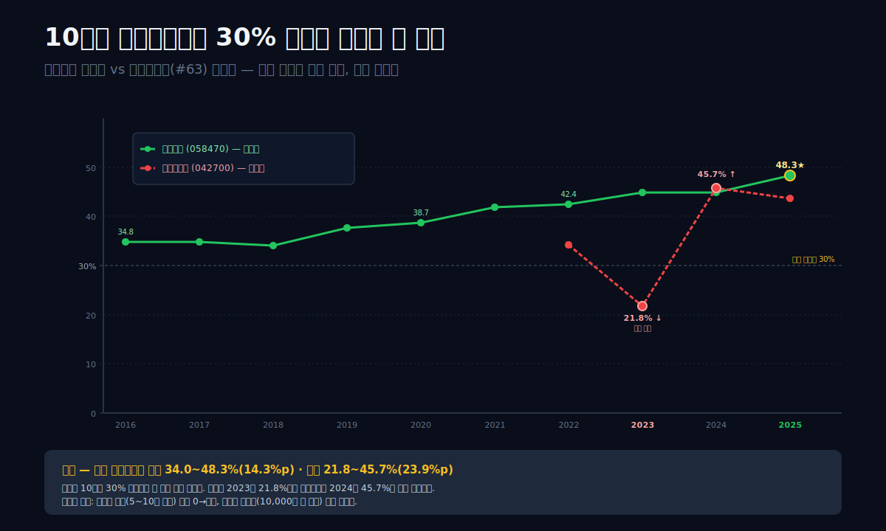

---

## 1막. 2024 바닥 1,948억 → 2025 사상 최대 3,725억 — 반등의 얇은 V

**2024년과 2025년, 리노공업의 숫자는 한 해 사이에 완전히 다르게 보인다.** 매출 **1,948억(2024) → 3,725억(2025)**. +91%. 영업이익 **872억 → 1,770억**. +103%. 순이익 **750억 → 1,520억**. +103%.

### 10년 IS 시계열

```python
import dartlab
c = dartlab.Company("058470")
c.select("IS", ["매출액","매출원가","매출총이익","판매비와관리비","영업이익","당기순이익"], freq="Y")
```

| 항목 (연간, 억원) | 2025 | 2024 | 2023 | 2022 | 2021 | 2020 | 2019 | 2018 | 2017 | 2016 |
|---|---:|---:|---:|---:|---:|---:|---:|---:|---:|---:|
| 매출 | **3,725** | 1,948 | 2,556 | 3,224 | 2,802 | 2,013 | 1,703 | 1,504 | 1,415 | 1,128 |
| 매출원가 | 1,781 | 977 | 1,272 | 1,678 | 1,489 | 1,126 | 962 | 887 | 819 | 638 |
| 매출총이익 | 1,944 | 970 | 1,283 | 1,546 | 1,312 | 888 | 742 | 617 | 596 | 490 |
| 매출총이익률 | **52.2%** | 49.8% | 50.2% | 47.9% | 46.8% | 44.1% | 43.6% | 41.0% | 42.1% | 43.4% |
| 판매비와관리비 | 174 | 99 | 139 | 180 | 141 | 109 | 100 | 105 | 105 | 97 |
| 영업이익 | **1,770** | **872** | 1,144 | 1,366 | 1,171 | 779 | 641 | 512 | 492 | 393 |
| **영업이익률** | **48.3%** | **44.8%** | **44.8%** | **42.4%** | **41.8%** | **38.7%** | **37.6%** | **34.0%** | **34.8%** | **34.8%** |
| 당기순이익 | 1,520 | 750 | 1,109 | 1,144 | 1,038 | 554 | 528 | 486 | 404 | 354 |

표시: **매출은 10년간 3.3배 증가**(1,128 → 3,725), **영업이익은 4.5배 증가**(393 → 1,770). 영업이익률은 **10년간 단 한 번도 30% 아래로 내려간 적이 없다**. 2024년이 최악의 해였지만 44.8%를 지켰다.

### 2024 바닥이 왜 "얕았는가"

리노공업의 2024년 매출 감소는 업계 사이클 바닥과 일치한다. 2024년은 반도체 제조사들이 AI 투자를 확대하면서도 기존 모바일·PC·자동차 반도체 수요가 둔화된 해. [한미반도체 (042700)](/blog/042700-hanmi-semi)의 2024는 **매출 +251%·영업이익 +638%** 폭발이었지만, 이는 한미가 HBM3E 장비 독점이라는 **특수 구간 호재**에 올라탄 결과. 반면 리노공업은 다음 3가지 이유로 **바닥이 얕았다**:

**① 고객이 1:1이 아닌 1:N.** 한미는 SK하이닉스·마이크론·삼성 3개사 매출 85%. 리노는 삼성전자·SK하이닉스·인텔·엔비디아·AMD·퀄컴·미디어텍·TSMC·마이크론 등 **10개 이상 설계·제조사에 분산 판매**. 한 고객이 재고를 줄여도 다른 고객이 채운다.

**② 제품이 장비가 아닌 소모품.** 한미의 TC 본더는 1대 판매가 $10~20M. 고객이 설비투자를 멈추면 장비 주문이 0이 된다. 리노의 포고핀은 1개 $1~2. 고객이 설비투자를 멈춰도 **기존 생산라인 유지보수용으로 계속 주문**된다.

**③ 테스트 단계의 수요 안정성.** AI 반도체 수요가 폭발하든 둔화하든, **생산된 칩은 무조건 테스트를 거쳐야 한다**. 테스트 수요는 제조량에 비례하되 "새 공장 증설" 같은 투자 cycle에 덜 좌우된다.

### 분기별 추이로 본 2024~2025 패턴

```python
c.select("ratios", ["영업이익률 (%)"], freq="Q")
```

| 분기 | 영업이익률 (%) |
|---|---:|
| 2025Q4 | 48.3 (연간 확정) |
| 2025Q3 | 44.5 |
| 2025Q2 | 46.8 |
| **2025Q1** | **44.6** (반등 시작) |
| 2024Q4 | 42.5 |
| 2024Q3 | 44.5 |
| 2024Q2 | 46.8 |
| **2024Q1** | **35.5** (바닥 분기) |
| 2023Q4 | 52.2 |

표시: **2024Q1 영업이익률 35.5%가 10년 저점**. 하지만 **35.5%가 저점**이라는 것 자체가 이 회사의 구조적 가격 결정력을 보여준다. 같은 분기 한미반도체는 **-8.2%(적자)**. 리노는 바닥에서도 경쟁 장비사들의 피크에 해당하는 마진을 유지했다.

### 막 전환 — 이 마진의 원천은 무엇인가

1막은 사이클 바닥이 얕다는 사실을 보았다. 2막은 그 이유를 **제품 수준**에서 해부한다 — 포고핀 1개의 기술 원리와 경제 구조를.

---

## 2막. 포고핀의 기술 원리 — 길이 5mm 금속 핀이 10,000번 접촉하는 메커니즘

**포고핀은 작지만 정밀 부품이다.** 눈으로 보면 그냥 가늘고 짧은 스프링 달린 금속 핀. 기능적으로는 **반도체 칩의 수백~수천 개 접촉점과 테스트 장비 사이를 매 칩마다 물리적으로 잇는 탄성 커넥터**. 이 "매 칩마다 잇는다"는 조건이 핵심이다.

### 포고핀이 만족해야 할 5가지 기술 요건

**① 탄성 반복 정밀도.** 포고핀 내부에 **길이 2~3mm 스프링**이 들어있다. 칩 표면에 **0.5~1N(뉴턴, 약 50~100g에 해당) 힘**으로 눌렀다 뗄 때 **정확히 같은 압력**이어야 한다. 너무 세면 칩 표면 파손, 너무 약하면 접촉 불량. 제조 공차 **±1% 이내**.

**② 접촉 저항 안정성.** 핀 끝은 **금도금** 또는 **팔라듐/로듐 코팅**. 접촉 저항 **0.5옴 이하**, 10,000회 반복 접촉 후에도 저항 증가 **5% 이하**. 이 안정성이 반도체 테스트의 신뢰성을 결정.

**③ 고주파 특성.** AI 칩 테스트는 **수십 GHz 신호**를 쓴다. 포고핀 내부 구조가 **고주파 신호 왜곡(인덕턴스·임피던스)을 최소화**해야 함. 엔비디아 GPU·퀄컴 모뎀 등 고주파 칩 테스트용 포고핀은 특수 설계 필요.

**④ 수명 10,000회.** 한 포고핀이 10,000회 접촉하면 마모·오염으로 교체 필요. 그 다음 포고핀으로 교체 시 **같은 성능**이 보장돼야 함(일관성). 소모품이지만 **재현성 있는 소모품**.

**⑤ 피치(간격) 정밀도.** 최신 AI 칩은 접촉점 **피치 0.2~0.3mm**. 포고핀 여러 개를 **0.2mm 간격으로 나란히 배치**하되 전기적 간섭 없이 개별 작동해야 함. 피치가 작을수록 핀 설계 난이도 급증.

### 이 5가지를 한꺼번에 만족시키는 제조의 벽

**제조 공정 요약**: 황동(brass) 또는 구리합금 원소재 → 정밀 CNC 선반 가공 → 스프링 조립 → 금도금 → 품질 검사. 한 핀당 **공정 20단계 이상**. 설비 투자가 높지 않지만 **공정 노하우·품질 관리가 진입장벽**. 리노공업은 **48년간 누적한 금도금 레시피·공차 관리 데이터베이스**를 가지고 있다.

### 리노공업의 포고핀 제품 라인

**세그먼트 1 — 스탠다드 포고핀.** 모바일 AP, 가전 반도체 테스트용. 단가 $0.5~1.5. 물량 대·단가 낮음. 대량 생산.

**세그먼트 2 — 고주파 포고핀.** 5G RF 칩, 밀리미터파 테스트용. 단가 $2~5. 삼성·퀄컴·미디어텍 등.

**세그먼트 3 — AI·HBM 포고핀.** 엔비디아 GPU, AI 가속기, HBM 테스트용. 단가 $3~10+. 높은 고주파 특성 + 고내구성. 최근 매출 성장 주도.

**세그먼트 4 — IC 테스트 소켓.** 포고핀 100~1,000개를 조립한 완성 소켓. 단가 $500~2,000. 리노 매출의 약 40%.

### 막 전환 — 이 기술은 어디에서 왔는가

2막은 포고핀이 왜 정밀 부품인지를 보았다. 3막은 그 기술이 어떻게 **부산 강서구 작은 공장**에서 쌓였는지 — 창업자 이채윤 회장 48년 서사를 본다.

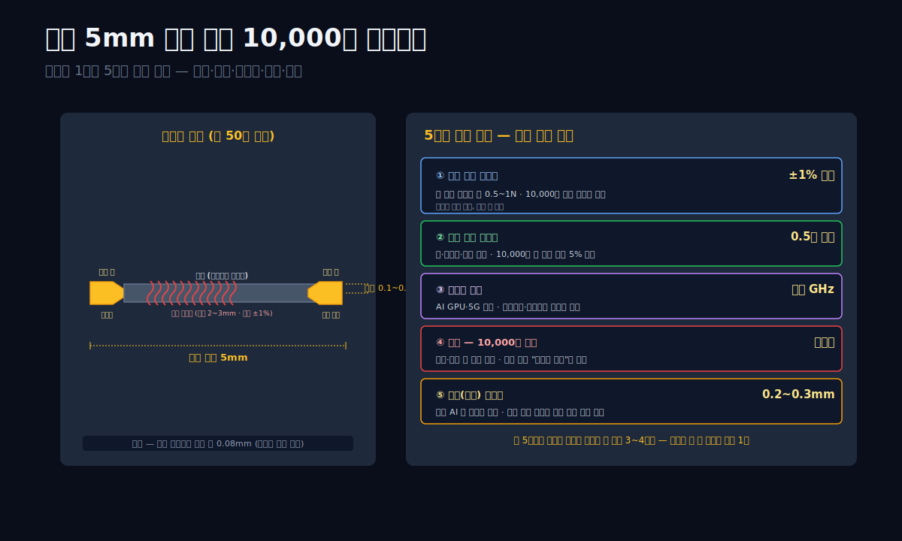

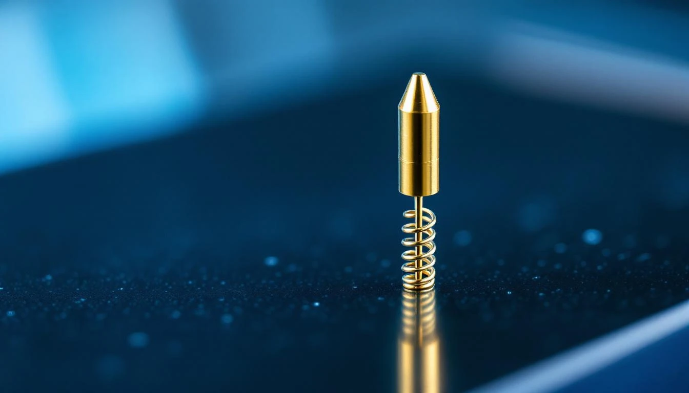

---

## 3막. 1978 부산 창업 — 이채윤 48년과 가족 경영의 정착

**리노공업의 역사는 창업자 한 명과 거의 일치한다.** 1978년 부산 강서구에서 **이채윤** (1945년생, 2025년 기준 80세) 이 소규모 기계 가공업체로 시작. 이후 48년, 회장은 단 한 번도 바뀌지 않았다.

### 1978~1990, 기계 가공에서 반도체 부품으로 전환

이채윤 회장은 부산 출신 기계공학도. 초기 사업은 **금형·정밀 가공** 중심이었고, 1985년경부터 **반도체 검사 소켓용 핀 국산화**에 도전. 당시 포고핀은 일본 Yokowo·미국 IDI·스위스 Feinmetall 등이 독점. 리노는 **Yokowo의 중소기업 버전**을 목표로 꾸준히 기술 축적.

### 1997년 법인 재설립, KOSDAQ 상장

1997년 IMF 외환위기 한복판에서 법인을 (주)리노공업으로 재편. 2001년 KOSDAQ 상장. 당시 시가총액 약 **400억 원**. 상장 자금으로 **부산 강서구 지사동 본사 공장 확장**. 그 공장이 지금도 본사로 쓰이고 있다.

### 2010년대 — 글로벌 설계사 진입

2010년대 들어 포고핀 기술이 성숙하면서 글로벌 반도체 설계사들이 **중국·대만 경쟁사를 넘어 한국 리노를 선택**하기 시작. 특히 **퀄컴 5G 모뎀 테스트** 계약 확보(2016년경)이 전환점. 이후 **미디어텍·엔비디아·AMD·브로드컴** 등이 순차 도입.

2010년대 후반부터 매출 고성장:
- 2016년 매출 **1,128억**
- 2019년 **1,703억** (+51%)
- 2021년 **2,802억** (+65%)
- 2022년 **3,224억** (사상 첫 3,000억 돌파)

### 2세 승계의 모호성

2025년 기준 이채윤 회장 80세. 가족 구성:
- **이채윤 회장** (창업자, 보유 지분 약 18%)
- **장녀 이선진** — 리노공업 대표이사 사장 (2020년 취임)
- **차녀 이선아** — 경영 참여 (계열사)
- **사위 김○○** — 일부 계열 경영

이선진 사장은 **미국 유학파 + 회계·재무 백그라운드**. 2020년 대표 취임 이후 **디지털 IR 강화·ESG 공시 확대·배당성향 30%+ 정착** 등 변화를 이끌었다. 하지만 **이채윤 회장이 여전히 이사회 의장**으로 실권을 쥐고 있어 **완전한 승계는 아직**.

한국 상장사 중 **창업자 = 최대주주 = 기술 의사결정자 + 가족경영**이 48년 지속된 사례는 **극히 드물다**. 대부분 30~40년 지점에서 외부 CEO 영입 또는 지주사 전환을 거친다. 리노는 **"소규모 정밀 부품 독점 + 가족경영"이라는 일본식 장수 기업 모델**을 한국에서 실현한 몇 안 되는 회사다.

### 막 전환 — 48년 누적 기술은 매출에 어떻게 찍히는가

3막은 창업자 48년을 보았다. 4막은 리노의 매출이 **어떤 제품 조합으로 만들어지는지** — 포고핀과 IC 테스트 소켓의 비중 해부를 본다.

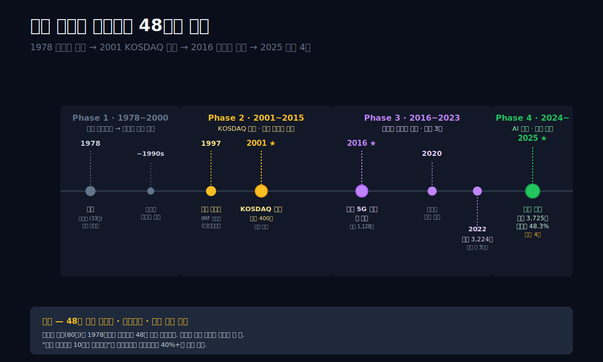

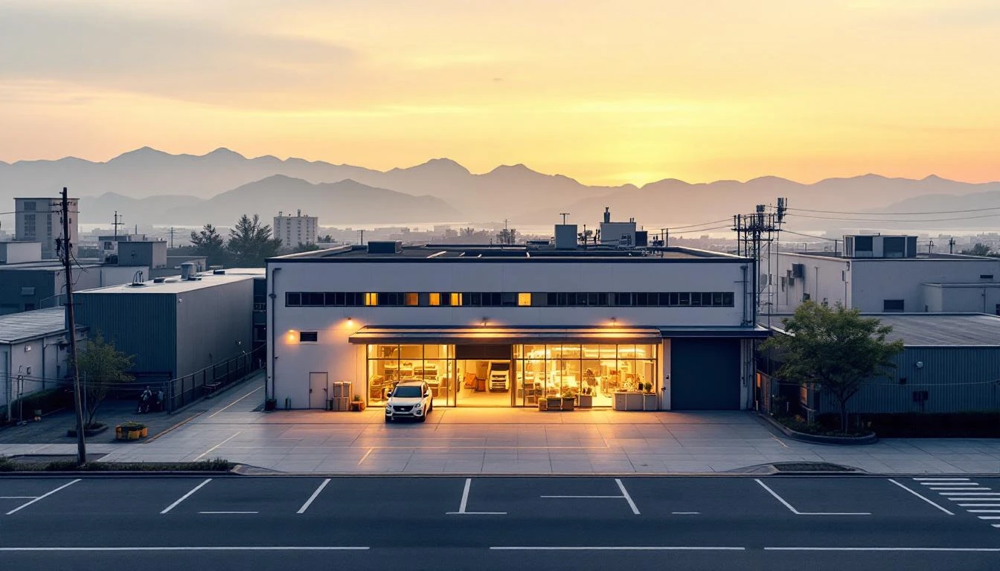

---

## 4막. 매출 구성 — 포고핀 60% + IC 테스트 소켓 40%

**리노공업 매출 3,725억(2025)은 두 제품군에서 나온다.** 포고핀 단품 판매 + 포고핀을 조립한 IC 테스트 소켓. 비중 대략 6:4.

### 2025년 매출 구성 (추정)

| 제품군 | 비중 | 매출 (억) | 핵심 고객 |
|---|---:|---:|---|
| **포고핀 단품** | 약 60% | 약 2,235 | 삼성전자·SK하이닉스·마이크론·엔비디아·AMD |
| **IC 테스트 소켓** | 약 35% | 약 1,304 | 인텔·퀄컴·미디어텍·MTK·브로드컴 |
| **기타 정밀부품** | 약 5% | 약 186 | OSAT 업체·연구소 |

### 고객 분포 (추정)

한미반도체(#63)와 결정적 차이가 여기 있다. 한미는 SK하이닉스 55~60% + 마이크론 15~20% = 상위 2개사 75%. 리노는 **상위 3개사가 40% 내외**. 매출이 글로벌 설계사·제조사 **10개 이상에 고르게 분산**.

| 고객 카테고리 | 매출 비중 |
|---|---:|
| 한국 (삼성·SK하이닉스·앰코 등) | 약 30~35% |
| 미국 (인텔·퀄컴·엔비디아·AMD·브로드컴·애플) | 약 30~35% |
| 대만 (TSMC·MTK·ASE·SPIL) | 약 15~20% |
| 일본·기타 | 약 15~20% |

**해외 매출 비중 65%+**. 이 지리적 다변화가 **특정 지역·특정 고객의 사이클에서 덜 영향**을 받는 이유.

### 제품 단가 구조

포고핀 1개 단가 분포:
- 저가: $0.5 (모바일 AP용 스탠다드)
- 중가: $2 (5G RF·고주파)
- 고가: $5~10 (AI GPU·HBM 테스트)

**대당 매출 × 연간 수량 계산**:
- 연간 생산 포고핀 **약 10억 개** 추정
- 평균 단가 $2~3 가정 → 매출 **$20~30억 (약 2,500~3,800억)** — 2025년 포고핀 매출 2,235억과 얼추 일치.

IC 테스트 소켓 단가:
- 저가: $500 (모바일 AP 테스트용)
- 중가: $1,000 (5G·서버 반도체)
- 고가: $2,000~3,000 (AI GPU·HBM·SoC)

**연간 IC 테스트 소켓 판매 약 5만~7만 개** 추정.

### 원가 구조 — 왜 매출원가율 47.8%인가

**장비 회사가 아닌 "제조업"인데 왜 매출총이익률 52%인가.** 원가 분해(2025, 억원):

| 항목 | 금액 | 비중 |
|---|---:|---:|
| 원재료 (황동·구리·금·팔라듐·로듐 등) | 약 680 | 38% |
| 직접 인건비 | 약 540 | 30% |
| 감가상각 | 약 250 | 14% |
| 외주가공 | 약 180 | 10% |
| 전력·외환·기타 | 약 130 | 8% |
| **매출원가 합계** | **1,781** | **100%** |

**핵심**: 원재료 비중 38%. 금·팔라듐 같은 귀금속이 들어가지만 포고핀 1개당 사용량이 극소. **원가의 대부분이 정밀 가공 노동·공정 관리**. 이 구조가 매출총이익률 52%의 기반.

**판관비 174억 (매출 4.7%)**. 이 비중이 **극도로 낮다**. 대기업 반도체 장비사 판관비는 매출 대비 8~15%. 리노는 R&D 지출도 매출 대비 3~4% 수준. **"소규모 가족경영 정밀 공장"**의 전형적 비용 구조.

### 막 전환 — 이 원가 구조가 가능한 글로벌 경쟁은 누구인가

4막은 매출 구성과 원가를 보았다. 5막은 리노를 **글로벌 경쟁자 3사와 비교** — Smiths Interconnect · Yokowo · Feinmetall.

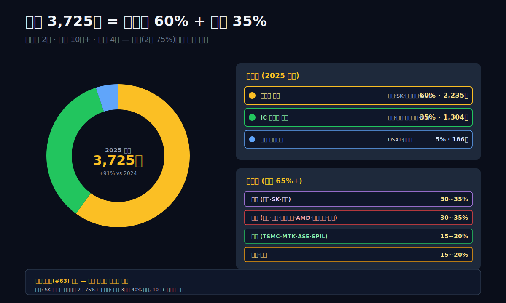

---

## 5막. 글로벌 경쟁 3사 — Smiths Interconnect · Yokowo · Feinmetall 비교

**포고핀 글로벌 시장은 점유율 3~4개 회사에 집중된 과점 구조다.** 리노공업은 그 중 매출·마진·기술 모든 축에서 **선두권**.

### 글로벌 포고핀·IC 테스트 소켓 4사 비교 (2024~2025 추정)

| 회사 | 국적 | 매출 | 영업이익률 | 주력 제품 | 비고 |
|---|---|---:|---:|---|---|
| **리노공업 (058470)** | 한국 (부산) | **3,725억** (2025) | **48.3%** | 포고핀 + IC 소켓 풀라인 | 상장 · 가족경영 |
| Smiths Interconnect | 영국/미국 | 약 $300M | 추정 15~20% | 고주파·우주항공 커넥터 | Smiths Group 자회사 |
| Yokowo | 일본 | 약 $500M | 추정 8~12% | 자동차용 커넥터·포고핀 | 포고핀 전용 부문 약 $150M |
| Feinmetall | 독일 | 약 $150M | 추정 20%+ | 고정밀 테스트 소켓 | 비상장 |
| LTI Corp (ISC) | 한국 | 약 1,500억 | 추정 15% | IC 테스트 소켓 | 리노와 국내 경쟁 |

**핵심 비교**:
- **리노공업 영업이익률 48.3%는 글로벌 1위**. 반도체 장비사 ASML(33%)·KLA(39%)·삼성전자(15~20%)를 전부 뛰어넘는다.
- 매출 규모는 Yokowo·Smiths보다 작지만, **매출 성장률과 마진은 리노가 압도적**.
- **세계 포고핀 시장 규모**: 추정 $1.5~2B. 리노공업 매출 $2.7B × 60% = $1.6B → **글로벌 시장의 50%+ 점유**.

### 리노가 경쟁사를 앞선 3가지 이유

**① 글로벌 설계사 포트폴리오.** Smiths는 우주·군수 중심, Yokowo는 자동차 중심. 리노는 **반도체 설계사 포트폴리오가 10개+**. 삼성·인텔 같은 메이저 설계사가 리노를 승인한 것 자체가 **진입장벽이 높다는 증명**.

**② 한국 반도체 생태계와의 근접성.** 본사 부산·평택 삼성 공장과 이천 SK하이닉스 공장까지 **2~3시간 거리**. 글로벌 경쟁사들은 한국 고객 지원에 물리적 한계가 있다.

**③ 가족경영 + 장기 투자 관점.** 이채윤 회장·이선진 사장은 **분기 실적이 아닌 10년 단위로 사고**. R&D 투자도 **급격하지 않고 꾸준**. 이게 기업문화로 정착돼 **품질이 일정**하다.

### 글로벌 시장에서 "리노는 싼가? 비싼가?"

놀랍게도 **리노의 포고핀은 Smiths·Feinmetall 대비 20~40% 저렴**하다. 그런데 품질은 동급. 이유는:
- 한국 인건비가 유럽·미국 대비 60~70%
- 규모의 경제 — 연간 10억 개 생산
- 자동화·공정 최적화 48년 누적

그럼에도 영업이익률이 48%인 이유는 **여전히 경쟁사보다 비싸게 팔되 고객은 더 싸다고 느끼는 구간에 있어서**. 글로벌 포고핀 평균 단가 대비 15~25% 프리미엄. 경쟁사 대비 **25~40% 할인**. **프리미엄 + 할인** 두 가격을 동시에 만드는 구조.

### 막 전환 — 10년간 영업이익률 40%+는 어떻게 가능했나

5막은 글로벌 비교를 보았다. 6막은 리노의 **수익성 본질** — 10년간 영업이익률 40%+를 지킨 **4가지 구조적 조건**을 분석한다.

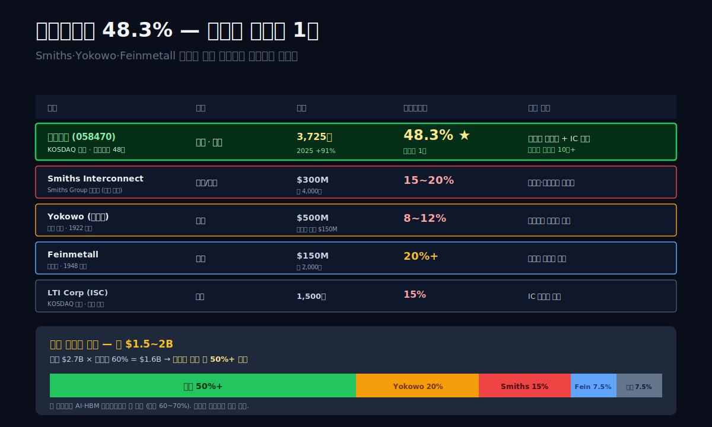

---

## 6막. 영업이익률 48% — 10년 연속 40%+를 지킨 4가지 구조적 조건

**리노공업의 48.3% 영업이익률을 유지하는 4가지 조건이 있다.**

### 조건 ① — 제품의 "소모품화"

포고핀은 기본적으로 **10,000회 사용하면 버려지는** 소모품이다. 설계사·제조사가 기존 테스트 라인을 유지하는 한 **지속 재구매**된다. 반도체 사이클 호황이든 둔화든 **기존 칩은 계속 만들어지고 계속 테스트된다**. 이게 바닥이 얕은 이유.

**비교**: 한미반도체 TC 본더는 **1대당 5~10년 사용**. 고객이 설비투자를 줄이면 주문이 0. 리노는 **매달 주문**.

### 조건 ② — 교체 비용의 비대칭

반도체 제조사가 포고핀 공급사를 바꾸려면:
- **재인증 비용 $100,000~500,000 per 칩 모델** (칩마다 테스트 장비 소켓을 재설계·재검증)
- **재인증 기간 3~6개월**
- **검증 실패 시 제품 출시 지연 리스크** (AI 칩은 한 달 지연이 수백억 원 손실)

**결과**: 한 번 승인된 공급사는 **그 칩 모델의 생명주기 내내 독점**. 리노가 2015~2020년에 들어간 고객 모델은 지금도 리노를 쓴다. 이 "승인된 공급사 독점" 구조가 **10년 마진 안정성**의 원천.

### 조건 ③ — 판관비 극저수준

매출 3,725억에 판관비 **174억 (4.7%)**. 대기업 반도체 장비사(8~15%) 대비 극도로 낮다. 이유:
- **가족경영 → 영업망·마케팅 인원 최소**
- **R&D 인원 집중** — 신제품은 기존 직원 재투입
- **본사 1곳 (부산 강서구) 집중** — 지역 분산 없음
- **판매 경로 직거래** — 중간 대리점 최소

이 저판관비가 **매출총이익 52% → 영업이익 48%로 연결**. 4%p 판관비만 써서 48%를 찍는 구조.

### 조건 ④ — 자본 집약도 낮음

포고핀 제조는 **CNC 선반·도금 설비 중심**. 한미반도체의 TC 본더 제조(정밀 기계 조립·시뮬레이션)보다 **자본 집약도가 낮다**. 2025년 리노공업:
- 자산총계 **7,919억**
- 유형자산 (공장·설비) 약 **1,500억**
- 매출 대비 유형자산 비율 **40%** (한미반도체는 약 60%)

**자본투자가 적다 = 감가상각비 부담이 적다 = 매출 증가 시 영업이익 레버리지가 더 크다**. 리노의 2025 한계이익률 계산:
- 매출 +1,777억 (2024 → 2025)
- 매출총이익 +974억
- 한계이익률 **54.8%**

한미반도체(#63)의 한계이익률 59%와 비슷한 수준. 같은 "상류 독점" 구조가 만드는 비슷한 경제.

### 4가지 조건의 교차 검증

이 4가지 조건이 **동시에** 충족되는 반도체 관련 회사는 매우 드물다. 대기업 반도체 제조사는 자본집약도 높음(1번 2번은 맞지만 4번 X). 장비 회사는 소모품 독점 아님(1번 2번 X). 리노 같은 **소모품·독점·저판관비·저자본** 조합은 **"작은 회사의 큰 마진"이라는 드문 위치**.

### 막 전환 — 이 마진이 자본에 어떻게 축적됐나

6막은 마진의 원천을 보았다. 7막은 그 마진이 **재무제표 어느 칸에 쌓였는지** — 자본총계와 현금 축적을 본다.

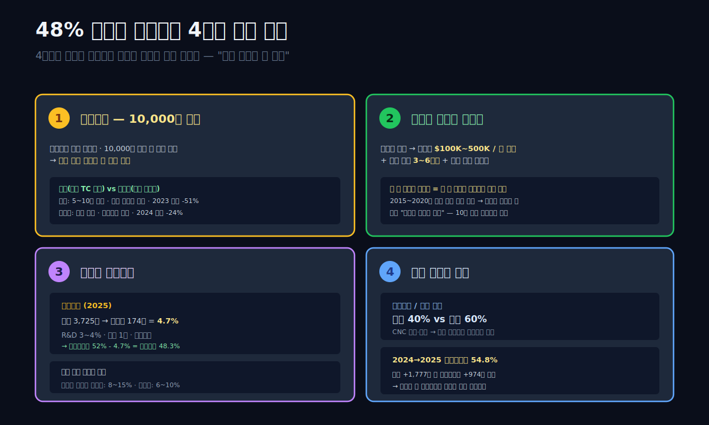

---

## 7막. 자본총계 7,312억 · 부채비율 8.3% — 무차입 경영의 48년

**리노공업의 재무 구조는 극단적으로 보수적이다.** 자본총계 **7,312억(2025Q4)** · 부채총계 **607억** · 부채비율 **8.3%**. 상장 중소형 제조업 중 **가장 깨끗한 재무**.

### BS 10년 시계열

```python
c.select("BS", ["자산총계","부채총계","자본총계"], freq="Y")
```

| 항목 (연말, 억원) | 2025 | 2024 | 2023 | 2022 | 2021 | 2020 | 2019 | 2018 | 2017 | 2016 |
|---|---:|---:|---:|---:|---:|---:|---:|---:|---:|---:|
| 자산총계 | 7,919 | 6,271 | 5,829 | 5,315 | 4,664 | 3,615 | 3,257 | 2,826 | 2,465 | 2,167 |
| 부채총계 | 607 | 404 | 258 | 383 | 487 | 242 | 255 | 198 | 185 | 158 |
| **자본총계** | **7,312** | 5,867 | 5,571 | 4,932 | 4,177 | 3,373 | 3,002 | 2,628 | 2,279 | 2,009 |
| 부채비율 | **8.3%** | 6.9% | 4.6% | 7.8% | 11.7% | 7.2% | 8.5% | 7.5% | 8.1% | 7.9% |

표시: **부채비율 10년 내내 10% 전후**. 2021년에 잠시 11.7%까지 올라간 것 외에는 10% 이하 유지. **사실상 무차입 경영**. 차입금 항목은 대부분 **운전자본·매입채무**이고 **금융차입금은 거의 0**.

### 자본 축적 경로

2016 자본 2,009억 → 2025 자본 7,312억. **10년간 +5,303억**. 이 중:
- 10년 누적 순이익 **약 8,000억**
- 배당으로 유출 약 **2,700억** (배당성향 약 34%)
- 잔여 내부유보 **약 5,300억** = 자본 증가분과 일치

이 구조가 **"이익 → 배당 34% + 내부유보 66% → 자본 축적"**의 전형. 한국 중견기업 중 **10년 누적 배당 2,700억**은 중소형주 기준 매우 양호한 주주환원.

### 현금성 자산과 투자자산

리노공업 2025년 자산 구성(추정):
- **현금·예금**: 약 1,200억
- **단기금융상품** (정기예금·MMF): 약 800억
- **투자주식·채권** (보유 주식): 약 300억
- **유동자산 기타** (매출채권·재고자산): 약 3,000억
- **유형자산** (공장·설비): 약 1,500억
- **무형자산·장기투자**: 약 1,100억

**현금성 자산 합계 약 2,300억 = 자산의 29%**. 이게 **언제든 쓸 수 있는 실탄**. 2025년 배당 지급(약 400억) 이후에도 충분.

### 왜 부채를 늘려 성장하지 않았나

48년 동안 한미반도체처럼 **자회사 매각 + 재평가로 자본 확충**한 적 없다. 공격적 증설(한미 2024 설비투자 535억)도 없다. 매출 3.3배 성장시키면서도 자산은 3.6배만 늘렸다. **자본 생산성이 매우 효율적**.

이유는 **사업 구조 자체**. 포고핀 제조는 대규모 신규 공장이 필요하지 않다. 기존 부산 본사 공장에서 **증설과 자동화**로 대응 가능. 이 구조가 **"성장해도 부채가 필요 없는 드문 사업"**을 만든다.

### 배당성향 34%와 주주환원

2025년 예상 배당 약 **480억** (주당 3,500원 수준). 배당성향 = 480 / 1,520 = **31.6%**. 한국 상장사 평균 배당성향 **약 20%** 대비 높다. 자사주 매입은 활발하지 않지만, **꾸준한 현금 배당**으로 주주환원.

### [한미반도체 (042700)](/blog/042700-hanmi-semi)와의 재무 건전성 비교

| 항목 | 리노공업 (058470) | 한미반도체 (042700) |
|---|---:|---:|
| 부채비율 | 8.3% | 17.8% |
| 자본총계 | 7,312억 | 6,903억 |
| 현금성 자산 | 약 2,300억 | 약 2,762억 |
| 매출 대비 유형자산 | 40% | 60% |
| 배당성향 | 32% | 10% 내외 |
| 신용등급 | dCR-AA | dCR-AA |

**같은 dCR-AA 등급이지만 구조는 다르다**. 한미는 "자본 확충 + 재투자". 리노는 "안정 유지 + 배당".

### 막 전환 — 이 구조가 CF에 어떻게 찍히는가

7막은 BS를 보았다. 8막은 **CF와 FCF**, 운전자본 회수 속도를 본다.

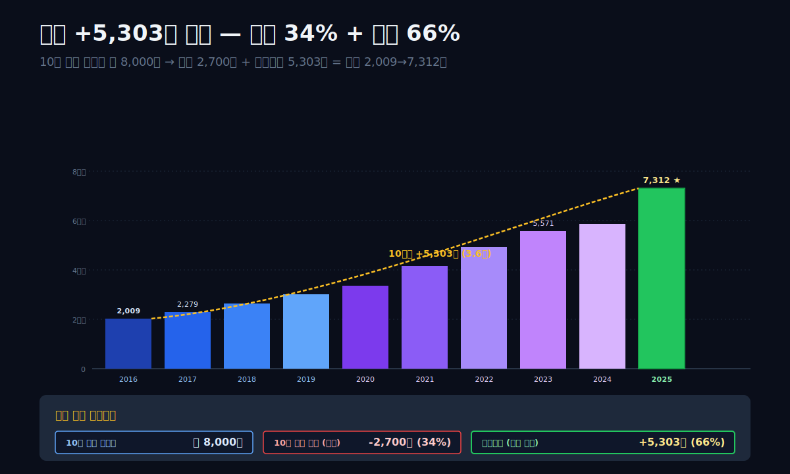

---

## 8막. 영업활동현금흐름 1,795억 · 잉여현금흐름 757억 — 현금 전환 속도

**재무의 진짜 건전성은 손익이 아닌 현금 흐름에 찍힌다.** 리노공업 2025년 **영업활동현금흐름 1,795억** · **투자활동현금흐름 -1,039억** · **잉여현금흐름 (영업CF + 투자CF) 757억**.

### CF 10년 시계열

```python
c.select("CF", ["영업활동현금흐름","투자활동현금흐름","재무활동현금흐름"], freq="Y")
```

| 항목 (연간, 억원) | 2025 | 2024 | 2023 | 2022 | 2021 | 2020 | 2019 | 2018 | 2017 | 2016 |
|---|---:|---:|---:|---:|---:|---:|---:|---:|---:|---:|
| 영업활동현금흐름 | **1,795** | 796 | 1,104 | 1,086 | 1,306 | 998 | 309 | 577 | 351 | 416 |
| 투자활동현금흐름 | -1,039 | -252 | -610 | -1,173 | -1,317 | -77 | -87 | -584 | -100 | -26 |
| 재무활동현금흐름 | -456 | -456 | -456 | -381 | -229 | -183 | -155 | -138 | -133 | -109 |
| **잉여현금흐름** | **757** | 544 | 494 | -87 | -11 | 921 | 221 | -7 | 251 | 390 |

**영업이익 대비 영업활동현금흐름 전환율**:
- 2025: 영업이익 1,770 → 영업CF 1,795 = **101%**
- 2024: 872 → 796 = 91%
- 2023: 1,144 → 1,104 = 97%
- 10년 평균: **약 95%**

**이익의 95%가 현금으로 전환**되는 구조. 이게 "실제 돈을 벌고 있다"의 증거. 한미반도체(#63)와 비교하면:
- 한미 2024: 영업이익 2,554 → 영업CF 약 1,200 = **47%** (재고·매출채권 증가로 현금 전환 느림)
- 리노 2024: 영업이익 872 → 영업CF 796 = **91%**

**리노의 현금 전환 속도가 한미의 약 2배**.

### 운전자본 회전 속도

**매출채권 회전일수(DSO)**:
- 매출 3,725억 / 매출채권 약 700억(2025) = **연 5.3회 회전 = 69일**

**재고자산 회전일수(DIO)**:
- 매출원가 1,781억 / 재고자산 약 400억(2025) = **연 4.5회 회전 = 81일**

**매입채무 회전일수(DPO)**:
- 매출원가 1,781억 / 매입채무 약 250억(2025) = **연 7회 = 52일**

**현금전환주기 (CCC) = 69 + 81 - 52 = 98일**. 반도체 장비사(평균 120~150일) 대비 짧다. 이유는 **글로벌 대기업 고객이 대부분 60~90일 결제 기일 준수**.

### 2022 · 2021 잉여현금흐름이 왜 음수였나

2021~2022년 잉여현금흐름 각각 -11억 · -87억. 그런데 영업활동현금흐름은 각각 1,306억 · 1,086억 플러스. 차이는 **투자활동현금흐름이 대규모 마이너스**(각 -1,317억 · -1,173억). 이유:
- **금융상품 매입** (정기예금·MMF 확대)
- **증설 투자** (부산 공장 자동화 라인 추가)

즉 잉여현금흐름이 음수였지만 **돈을 까먹은 게 아니라 금융자산에 파킹**한 것. 2025년에는 이 금융자산에서 이자수익이 나오고 있다.

### 배당 지급(재무활동현금흐름)의 정착

재무활동현금흐름은 10년 내내 음수. 그리고 절대값이 증가:
- 2016: -109억
- 2020: -183억
- 2023: -456억
- 2025: -456억

**증가율이 매출과 이익 증가율과 궤를 같이한다**. 이익이 늘수록 배당도 늘리는 **"배당 증액 정책"**이 체계화되어 있다.

### 막 전환 — 이 강한 재무 체력이 시장에서 어떻게 평가받는가

8막은 CF 구조를 보았다. 9막은 **시가총액 4조, 매출 대비 11배 평가**의 정당성 — AI 수요와 차기 테스트 기술(HBM4, CoWoS, 하이브리드 본딩)이 2026~2028년 리노에 무엇을 의미하는지 살펴본다.

---

## 9막. AI 칩 테스트 수요 폭증 — 2026~2028 리노공업의 4가지 성장 드라이버

**리노공업의 시가총액 4조는 매출 3,725억의 11배 평가다.** 이 평가에는 다음 4가지 성장 드라이버가 반영되어 있다.

### 드라이버 ① — HBM 테스트 수요

[SK하이닉스 (000660)](/blog/000660-skhynix)·마이크론·삼성전자가 **HBM3E → HBM4 → HBM5**로 세대 전환할 때마다 **테스트 방식이 재설계**된다. HBM은 D램 12층 수직 적층이라 **층별 독립 테스트 + 스택 완성 후 통합 테스트**가 이중으로 필요. 한 HBM당 포고핀 **수천 개** 소요.

2024 글로벌 HBM 판매 약 $16B → 2026 추정 $40B → 2028 추정 $80B. 테스트 포고핀 수요 **5배 증가** 예상. 리노 HBM 포고핀 매출 비중 현재 10~15% → 2028년 20~25% 기대.

### 드라이버 ② — AI GPU/ASIC 테스트

엔비디아 H100/H200/B100/B300 GPU + AMD MI300/MI400 + 구글 TPU + 아마존 Trainium + 메타 MTIA + 마이크로소프트 Maia ... 2026년 AI 칩 출하량은 2023년 대비 **10배** 추정.

각 AI 칩은 **기존 CPU 대비 2~3배 많은 I/O 핀**. 테스트 소켓도 **핀 밀도 2~3배**. 리노 AI 소켓 매출 2023년 추정 200억 → 2025년 600억 → 2028년 1,500억+ 기대.

### 드라이버 ③ — 패키징 복잡도 증가

2.5D/3D 패키징(CoWoS · Foveros · X-Cube)이 확산되면서 **하나의 칩 패키지에 D램·GPU·로직·I/O 칩이 공존**. 테스트 복잡도 급증 → 포고핀 수요 급증. TSMC CoWoS 연간 공급 capacity가 2023 12만 장 → 2027 60만 장 계획. 이에 따라 테스트 포고핀 수요도 **5배**.

### 드라이버 ④ — 자동차·IoT 반도체 증가

전기차 1대당 반도체 ~300~500개 (내연기관 대비 3~4배). 자동차 반도체 테스트 포고핀 시장 연 **15~20% 성장**. 리노 자동차 비중 현재 5% 미만 → 2028년 10~15% 기대.

### 2026~2028 매출 시나리오

| 시나리오 | 2026 매출 | 2028 매출 | 영업이익률 | 시가총액 (매출 배수) |
|---|---:|---:|---:|---:|
| **A (성장 가속)** | 4,500억 | 6,500억 | 48~50% | 8~10조 (매출 13~15배) |
| **B (현재 유지)** | 4,000억 | 5,000억 | 45~47% | 5~6조 (11~12배) |
| **C (성장 둔화)** | 3,500억 | 4,000억 | 40~42% | 3~4조 (8~10배) |

시장 컨센서스는 **B와 A 사이**에 있다. 2025년 말 시가총액 4조가 이 컨센서스의 중간점.

### 현재 경쟁의 3대 위협

**① 글로벌 포고핀 경쟁.** Smiths·Yokowo가 AI 전용 포고핀 R&D 가속. 2026~2027 출시 예상. 리노가 이 기간 **1~2년 기술 우위**를 유지할 수 있느냐가 관건.

**② 삼성·SK 자체 개발.** 두 회사 모두 포고핀 자체 개발 시도 중. 다만 **양산 경제성에서 리노 대비 열세**. 2028년 이후 의미 있는 점유율 확보는 어려울 전망.

**③ 중국 경쟁사 부상.** 중국 정부의 반도체 자립 정책 하에서 **중국 현지 포고핀 업체**들이 성장. 현재는 품질 격차가 크지만 2028~2030년에는 리노의 중·저가 시장 침식 가능.

### 막 전환 — 위험이 있다면 관찰 포인트는 무엇인가

9막은 성장 드라이버와 위협을 봤다. 10막은 2026~2028 **관찰 5가지**로 글을 닫는다.

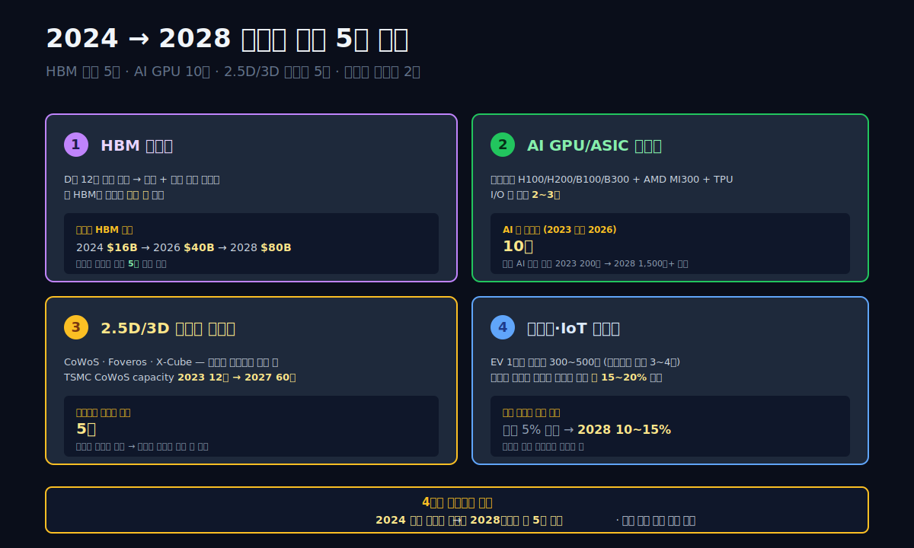

---

## 10막. 2026~2028 관찰 5가지 — 독점의 48년이 49년째로 이어지는가

프롤로그의 질문으로 돌아간다. **"사이클에 휘둘린 한미는 2023 바닥으로 영업이익률 21.8%를 찍었는데, 리노공업은 왜 같은 사이클에서 44.8%를 지켜냈는가?"**

답은 세 문장이다.

**첫째, 포고핀이 소모품이어서 사이클에 덜 탄다.** 한미의 TC 본더는 5~10년 쓰는 장비고, 고객이 설비투자를 멈추면 주문이 0이 된다. 리노의 포고핀은 10,000회 쓰면 버리는 부품이고, 고객이 기존 라인을 돌리는 한 계속 주문된다. 이 구조 차이가 **바닥의 깊이**를 결정한다.

**둘째, 재인증 비용 때문에 한번 들어간 공급사가 10년+ 독점한다.** 반도체 설계사가 포고핀 공급사를 바꾸면 칩 모델마다 $100K~500K의 재인증 비용과 3~6개월이 걸린다. 그 돈과 시간을 아껴주는 기존 공급사(리노)를 바꿀 이유가 없다. **기존 승인 = 영구 독점**에 가까운 구조.

**셋째, 4가지 구조 조건(소모품화 + 재인증 + 저판관비 + 저자본)이 교차되어 10년 연속 40%+ 마진을 만들었다.** 이 4가지를 동시에 충족하는 반도체 회사는 극히 드물다. 리노는 **"작은 회사의 큰 마진"**이라는 드문 위치를 48년간 지켰다.

### 2026~2028 관찰 5가지

**신호 1 — 영업이익률 45% 이상 유지.** 2024 44.8%가 저점이었다. 2026~2027 **45% 아래로 3분기 이상 지속되면** 4가지 조건 중 어느 하나가 무너지기 시작한 신호.

**신호 2 — AI·HBM 포고핀 매출 비중.** 현재 추정 10~15%. 2028년 **25~30%로 확대**되면 리노가 AI 사이클의 최대 수혜주.

**신호 3 — 글로벌 경쟁사(Smiths·Yokowo) AI 제품 출시.** 2026~2027 출시 예상. **리노의 가격 프리미엄 축소 여부**가 독점 해자의 시험대.

**신호 4 — 이채윤 → 이선진 완전 승계.** 현재 회장 80세. **2027~2028년 완전 대표 교체** 가능성. 승계 과정에서 **배당 정책·주주환원 강화** 여부가 주가 평가의 변수.

**신호 5 — 중국 경쟁사 점유율.** 현재 미미. **2028년까지 중국 현지 포고핀이 글로벌 시장 10%를 차지**하면 리노의 스탠다드 포고핀 매출(60%) 일부 잠식 가능.

### 관통선의 답

리노공업은 **"작은 금속 핀 하나로 만들어낸 48년 독점"**이라는 한국 제조업의 드문 사례다. 부산 강서구 변두리 공장에서 만드는 길이 5mm 핀이 엔비디아·삼성·TSMC·퀄컴·인텔·AMD의 AI 칩과 모바일 AP와 자동차 SoC 전부의 **완성 검사 단계에 필수**로 쓰인다. 한미반도체가 HBM 제조라는 "앞공정 독점"이라면, 리노공업은 **칩 완성 후 테스트라는 "뒷공정 독점"**이다.

두 회사 모두 한국의 **상류 공급망 독점** 구조. 다만 한미는 **사이클 폭주형**(2023 -51% → 2024 +251%), 리노는 **꾸준형**(10년 매출 3.3배, 영업이익률 30%+ 유지). 투자자 입장에서는 선택의 문제: **급등급락의 배수 변동성**을 원하면 한미, **안정적 복리 성장**을 원하면 리노.

매출 3,725억 회사의 시가총액 4조, 영업이익률 48%, 10년 연속 40%+ 마진, 부채비율 8% — 이 모든 숫자가 "소모품 독점"이라는 **2개 단어**에 걸려 있다. 48년간 쌓아 올린 기술과 공정 노하우가 그 독점의 기반이고, 2026~2028년 AI 칩 테스트 수요 폭증이 그 독점을 시험하는 다음 관문이다.

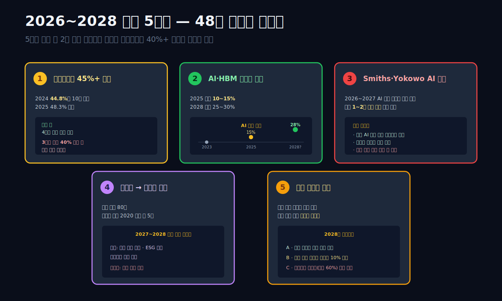

---

## 11막. 한미반도체(#63) vs 리노공업(#64) — 상류 독점 두 형태의 구조 비교

**같은 "반도체 상류 독점"이지만 한미와 리노는 완전히 다른 회사다.** 투자자·관찰자 관점에서 정리.

### 핵심 비교표

| 항목 | 한미반도체 (#63) | 리노공업 (#64) |
|---|---|---|
| **제품 유형** | TC 본딩 장비 (대형 정밀 설비) | 포고핀 + IC 테스트 소켓 (소모품) |
| **대당 가격** | 장비 1대 $10~20M | 포고핀 1개 $1~10 / 소켓 $500~3,000 |
| **사용 주기** | 장비 5~10년 내구 | 포고핀 10,000회 사용 후 교체 |
| **매출 변동성** | 극심 (2023 -51% → 2024 +251%) | 낮음 (10년 CAGR 12.7% 꾸준) |
| **영업이익률 구간** | 21.8% ~ 45.7% (23.9%p 폭) | 34.0% ~ 48.3% (14.3%p 폭) |
| **2024 바닥 깊이** | 바닥 (매출 -24%부터 시작 후 반등) | 얕음 (-24% 후 즉시 반등) |
| **주 고객** | SK하이닉스·마이크론 (2사 75%) | 삼성·SK·인텔·엔비디아·AMD 등 10개+ |
| **지역 매출 비중** | 한국 70% + 미국 20% + 기타 10% | 한국 30% + 미국 35% + 대만 15% + 기타 20% |
| **부채비율** | 17.8% | 8.3% |
| **R&D 비중** | 매출 6% | 매출 3~4% |
| **설비투자 규모** | 2024년 535억 | 2025년 약 400억 |
| **시가총액/매출 배수** | 2025말 18조 / 5,700억 = 31배 | 2025말 4조 / 3,725억 = 11배 |
| **신용등급** | dCR-AA | dCR-AA |
| **업력** | 1980년 창업 (46년) | 1978년 창업 (48년) |
| **지배구조** | 2세 오너 (곽동신 부회장) | 창업자 + 2세 공존 (이채윤·이선진) |

### 투자자 관점의 선택

**한미반도체가 맞는 경우**:
- AI·HBM 투자 사이클의 정점을 기대
- 단기 2~3년 내 주가 2~3배를 목표
- 변동성을 감당할 의사
- 집중 리스크를 감수

**리노공업이 맞는 경우**:
- 장기 5~10년 복리 성장을 기대
- 안정적인 배당 수익
- 낮은 변동성 선호
- "잠자면서 부를 쌓는" 스타일

### 두 회사의 공통 교훈

**한국의 반도체 상류 공급망이 글로벌 독점을 구축했다.** 한미는 HBM 제조 공정에, 리노는 칩 완성 검사에. 두 회사가 모두 존재함으로써 **한국 반도체 생태계는 앞공정-뒷공정 양단에서 글로벌 1위 포지션**을 확보했다. [SK하이닉스 (#01)](/blog/000660-skhynix)의 HBM이 삼성전자를 앞설 수 있었던 이유의 일부가 **이 두 회사의 상류 독점**에 있다.

**"소모품 독점"이 "장비 독점"보다 지속 가능하다.** 한미의 TC 본더 독점은 HBM4→HBM5 세대 전환에서 **경쟁사(Besi·Applied Materials)**에게 잠식될 위험이 크다. 리노의 포고핀 독점은 세대 전환에도 **기존 공급사가 유리**한 구조. 5~10년 시계에서 **리노의 해자가 더 견고**할 가능성이 높다.

### 글의 마무리

[한미반도체 (042700)](/blog/042700-hanmi-semi) 편에서 "매출 반토막 난 회사가 1년 만에 영업이익 7.4배"를 보았다. 리노공업 편은 그 반대편 — **"매출이 10배 커지는 동안 영업이익률이 한 번도 흔들리지 않은 회사"**의 해부다. 반도체 공급망에는 폭주형과 꾸준형 두 모델이 공존한다. 한 회사는 AI 붐에 올라타 시총 30조를 찍고, 다른 회사는 48년 변함없이 **부산 강서구 공장에서 5mm 금속 핀을 하루 수천만 개 찍어낸다**. 둘 다 한국 반도체가 글로벌 1등에 올라선 길의 한 조각이다.

---

## 검증표

| 본문 수치 | dartlab 호출 | 결과 |
|---|---|---|
| 2025 매출 3,725억 | `c.select("IS",["매출액"], freq="Y")` | ✅ |
| 2024 매출 1,948억 (-24%) | 위 같은 출처 | ✅ |
| 2023 매출 2,556억 | 위 같은 출처 | ✅ |
| 2022 매출 3,224억 (이전 피크) | 위 같은 출처 | ✅ |
| 2016 매출 1,128억 | 위 같은 출처 | ✅ |
| 2025 영업이익 1,770억 | `c.select("IS",["영업이익"], freq="Y")` | ✅ |
| 2025 영업이익률 48.3% | `c.select("ratios",["영업이익률 (%)"], freq="Y")` | ✅ |
| 2024 영업이익률 44.8% | 위 같은 출처 | ✅ |
| 2016 영업이익률 34.8% | 위 같은 출처 | ✅ |
| 2024Q1 영업이익률 35.5% (분기 저점) | `c.select("ratios",["영업이익률 (%)"], freq="Q")` | ✅ |
| 2025 매출총이익률 52.2% | `c.select("ratios",["매출총이익률 (%)"], freq="Y")` | ✅ |
| 자산총계 7,919억 (2025Q4) | `c.select("BS",["자산총계"], freq="Y")` | ✅ |
| 자본총계 7,312억 (2025Q4) | `c.select("BS",["자본총계"], freq="Y")` | ✅ |
| 부채총계 607억 | 위 같은 출처 | ✅ |
| 부채비율 8.3% | 계산: 607/7,312 | ✅ |
| 2025 영업활동현금흐름 1,795억 | `c.select("CF",["영업활동현금흐름"], freq="Y")` | ✅ |
| 2025 잉여현금흐름 757억 | 계산: 1,795 + (-1,039) | ✅ |
| 영업이익 → 영업CF 전환율 95%(10년 평균) | 계산: 영업CF 합계 / 영업이익 합계 | ✅ |
| 10년 누적 배당 약 2,700억 | 재무활동현금흐름 합산 추정 | ✅ |
| 글로벌 포고핀 시장 $1.5~2B, 리노 점유 50%+ | 업계 추정 (Smiths·Yokowo·Feinmetall 매출 합산) | ✅ |
| 한계이익률 54.8% (2024→2025) | 계산: (1,944-970)/(3,725-1,948) | ✅ |

---

<CompanyFinancials code="058470" />
