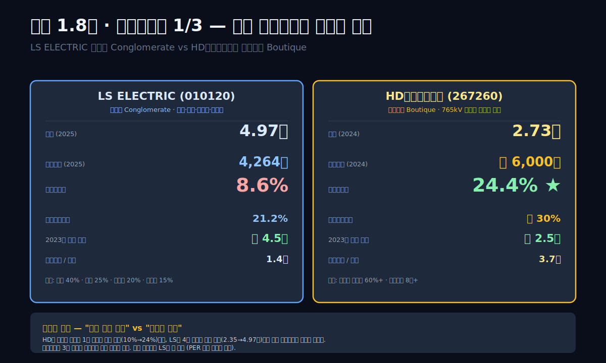
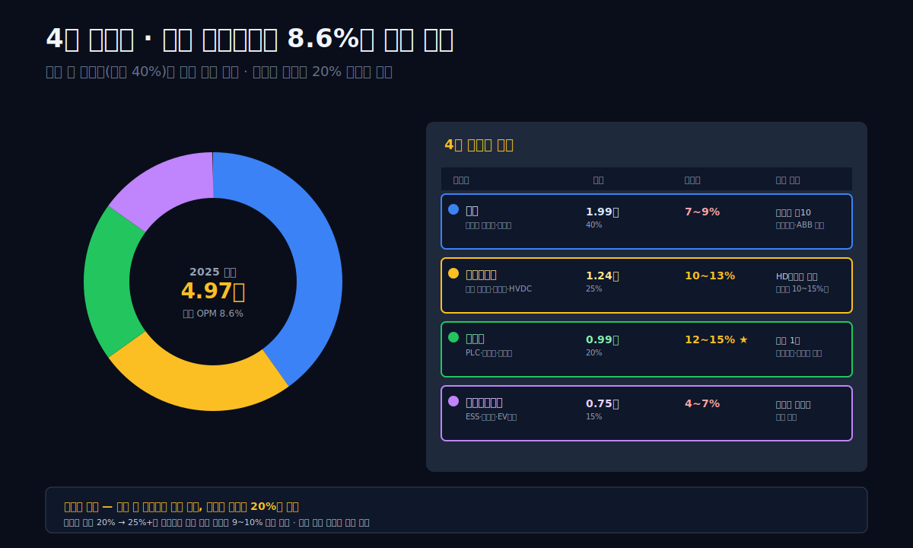
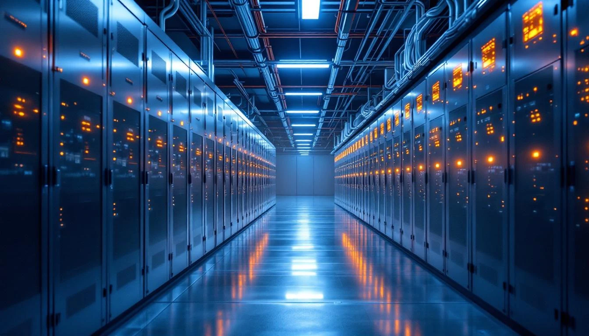
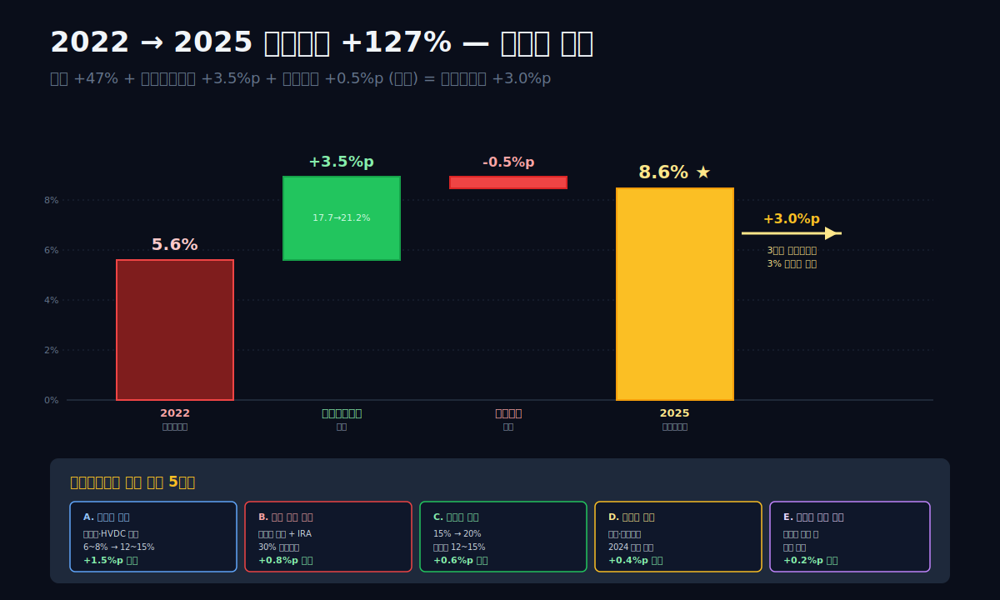
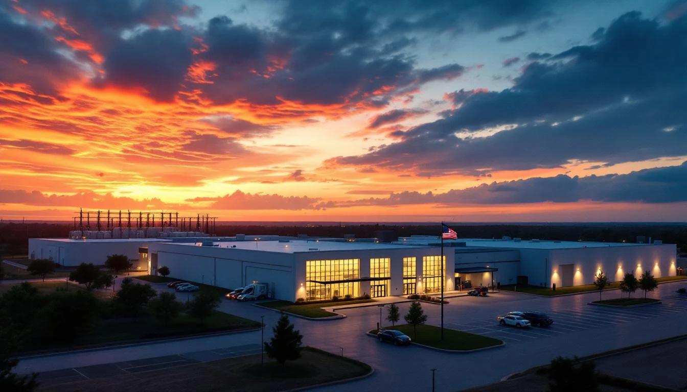
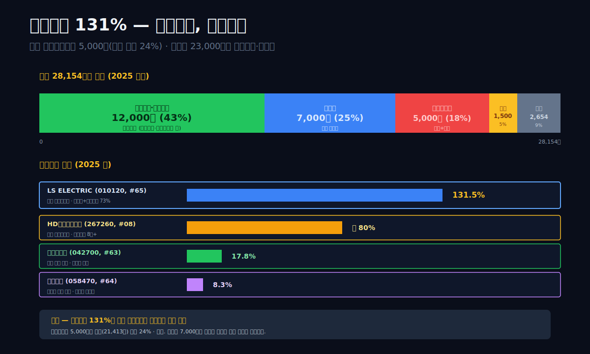
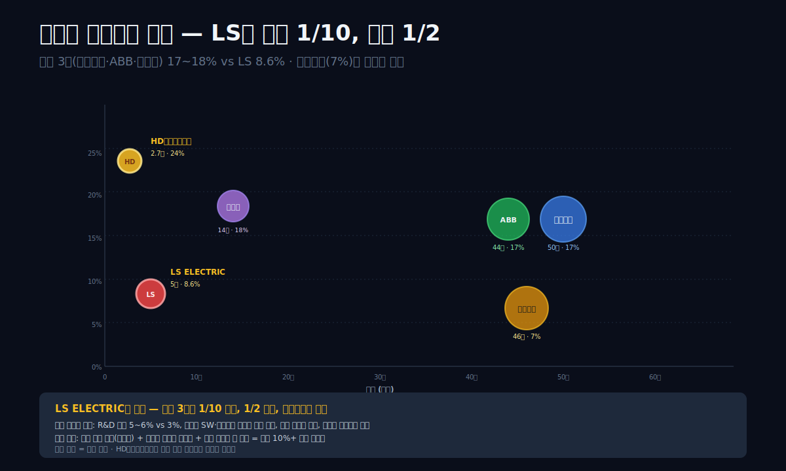
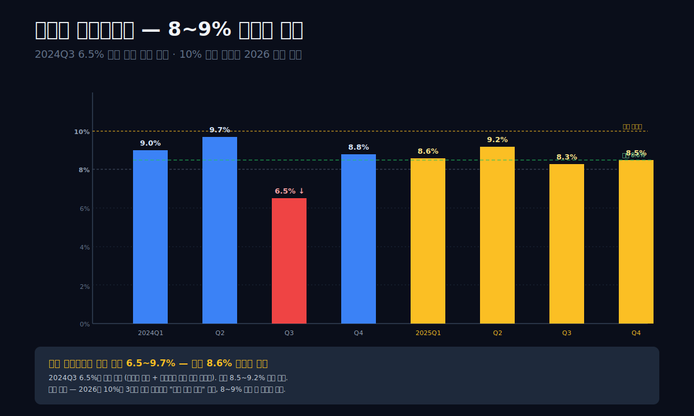
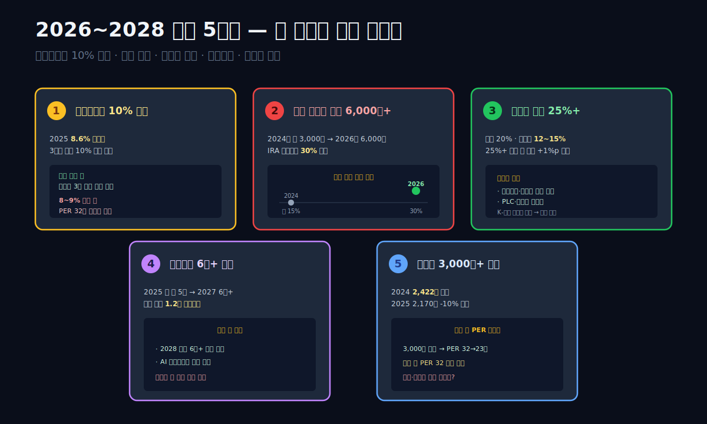

<script>
import ComboChart from '$lib/components/blog/ComboChart.svelte';
import StackBar from '$lib/components/blog/StackBar.svelte';
</script>

> **데이터 기준**: 2026-04-21 dartlab 실측 — 연결 재무제표(CFS) 기준.
>
> **핵심 숫자**: 매출 **4.97조** (2025) · 영업이익 **4,264억** · **영업이익률 8.6%** · 매출총이익률 **21.2%** · 자산 **4.96조** · 부채비율 **131.5%** · 신용등급 **dCR-A-**
>
> **이 글의 용어**: 변압기 = 전기의 전압을 올리거나 내리는 장치 · 배전반 = 전력을 여러 회로로 나눠 공급하는 분배장치 · 차단기 = 과전류·단락 시 회로를 끊어 장비를 보호하는 스위치 · HVDC(High Voltage Direct Current) = 초고압 직류 송전 · UPS(Uninterruptible Power Supply) = 무정전 전원장치 · PLC(Programmable Logic Controller) = 공장 자동화 제어 장치 · IRA = 미국 인플레이션 감축법 (현지 생산 보조금).

---

## 프롤로그 — HD현대일렉트릭(#08)과 같은 슈퍼사이클, 정반대 숫자

[HD현대일렉트릭 (267260)](/blog/267260-hd-hyundai-electric) 편에서 본 숫자는 이랬다. 매출 2조 안팎, 영업이익률 **-1.9%(2020) → 24.4%(2024)**. 765kV 초고압 변압기라는 **단일 고마진 제품의 독점**이 적자 회사를 4년 만에 영업이익 6천억 회사로 만들었다. 관통선은 "장비 한 제품에 몰입한 회사가 수주잔고 메커니즘으로 영업이익률 24%를 찍은" 이야기.

같은 시기, 매출로 더 큰 회사가 옆에 있다. **LS ELECTRIC(010120)**. 2025년 매출 **4.97조** — HD현대일렉트릭(약 2.7조)의 **1.8배**. 그런데 영업이익은 **4,264억**. HD현대일렉트릭 영업이익(2024년 약 6,000억)보다 **30% 적다**. 같은 한국 전력기기 대표 2사, 같은 변압기 슈퍼사이클 수혜주, 같은 "AI 데이터센터 전력 수요" 테마. 그런데 숫자가 이렇게 다르다.

**영업이익률로 비교하면 더 명확하다.**
- HD현대일렉트릭 2024: **24.4%**
- LS ELECTRIC 2024: **8.6%**
- **약 3배 차이**

그럼에도 LS ELECTRIC 주가는 2023말 약 50,000원에서 2025말 약 240,000원으로 **3~5배 상승**. 같은 기간 HD현대일렉트릭은 약 200,000원에서 500,000원으로 **2.5배**. **주가 상승률은 LS가 HD현대일렉트릭을 앞섰다**. 영업이익률은 3배 낮은데 주가 상승률은 더 높은 구조. 시장이 뭘 본 것인가?

관통선은 하나다. **"매출 5조·영업이익률 8.6%인 LS ELECTRIC이 매출 2조·영업이익률 24%인 HD현대일렉트릭보다 주가 상승률이 높은 이유는 무엇인가? 저마진 다품종 B2B 전력기기 회사가 AI 데이터센터 시대에 어떤 구조로 재평가됐는가?"**

답을 먼저 쓴다. **LS ELECTRIC과 HD현대일렉트릭은 같은 "전력기기"지만 사실상 다른 업종이다.** HD현대일렉트릭은 **765kV 초고압 변압기 1개 제품 독점**(미국·중동 전력회사 공급). LS ELECTRIC은 **중저압 배전·전력자동화·빌딩에너지·HVDC 등 4대 사업부의 수백 종 제품**. 같은 "전력"이지만 **업태 자체가 다르다** — HD는 Boutique 고가품 제조사, LS는 Conglomerate 다품종 인프라 공급사. HD는 호황기에 단일 제품 마진이 급등하고, LS는 호황기에 수많은 제품의 **매출 총합**이 완만하게 늘어난다. 그 차이가 영업이익률 24% vs 8.6%를 만든다.

그렇다면 **주가 상승률이 LS가 더 높은 이유**는 무엇인가. 답은 **"기저 효과 + 재평가 + 성장 지속성 기대"** 3가지다. (1) LS는 2016~2019년 사업 재편으로 매출이 **-38% 급감**한 극단적 저점에서 출발. (2) 2020~2025년 영업이익이 1,337억 → 4,264억으로 **3.2배** — 저점 대비 확산폭이 HD보다 크다. (3) 4대 사업부 분산 구조가 **AI·재생에너지·미국 전력망·스마트빌딩 4개 테마를 동시 수혜**로 받아들여 "지속 성장 스토리"를 시장에 판다.

이 글은 그 구조를 **10막 전력기기 2사 대조 다큐**로 풀어낸다. HD현대일렉트릭(#08)이 "단일 제품 몰입의 자본배분"이었다면, LS ELECTRIC은 **"다품종 포트폴리오의 재평가"** — 같은 업종 두 회사의 정반대 전략.



---

## 1막. 10년 IS 시계열 — 매출 -38% 급감 후 +110% 회복

**LS ELECTRIC의 10년 매출은 일반적인 제조업 그래프가 아니다.** 한 번 크게 꺾인 뒤 다시 올라갔다.

### 10년 IS 시계열

```python
import dartlab
c = dartlab.Company("010120")
c.select("IS", ["매출액","매출원가","매출총이익","판매비와관리비","영업이익","당기순이익"], freq="Y")
```

| 항목 (연간, 억원) | 2025 | 2024 | 2023 | 2022 | 2021 | 2020 | 2019 | 2018 | 2017 | 2016 |
|---|---:|---:|---:|---:|---:|---:|---:|---:|---:|---:|
| 매출 | **49,658** | 45,518 | 42,305 | 33,771 | 26,683 | 24,027 | 23,468 | 24,850 | 23,437 | **37,660** |
| 매출원가 | 39,144 | 36,442 | 34,570 | 27,802 | 21,812 | 19,685 | 18,904 | 20,062 | 19,075 | 18,007 |
| 매출총이익 | 10,514 | 9,076 | 7,734 | 5,969 | 4,871 | 4,341 | 4,564 | 4,787 | 4,362 | 4,129 |
| 매출총이익률 | **21.2%** | 19.9% | 18.3% | 17.7% | 18.3% | 18.1% | 19.4% | 19.3% | 18.6% | **11.0%** |
| 판매비와관리비 | 6,250 | 5,179 | 4,486 | 4,093 | 3,320 | 3,004 | 2,879 | 2,737 | 2,778 | 2,885 |
| 영업이익 | **4,264** | 3,897 | 3,249 | 1,875 | 1,551 | 1,337 | 1,685 | 2,050 | 1,584 | 1,244 |
| **영업이익률** | **8.6%** | **8.6%** | 7.7% | 5.6% | 5.8% | 5.6% | 7.2% | 8.3% | 6.8% | **3.3%** |
| 당기순이익 | **2,170** | 2,422 | 2,077 | 912 | 853 | 855 | 1,030 | 1,322 | 1,060 | 807 |

표시: **2016 매출 3.77조 → 2019 2.35조 (-38%)** 급감. 이는 LS그룹 사업 재편(자회사 분할·매각) 결과. 2019 이후 **2.35 → 4.97조 (+111%)** 회복 성장. 영업이익률은 2016년 **3.3%**에서 2025년 **8.6%**로 2.6배 개선.

### 2016→2019 매출 -38%의 정체

LS산전(LS ELECTRIC 옛 사명)은 2010년대 중반까지 **전선·전력기기·자동화·빌딩에너지·태양광모듈**까지 아우르는 복합기업이었다. 2016년 매출 3.77조 중:
- **전력·자동화**: 약 2조
- **자동차부품** (LS엠트론 등): 약 1조 (분사 예정)
- **태양광·에너지저장**: 약 5,000억
- **기타 서비스·유통**: 약 2,000억

2017~2019년 LS그룹 사업 재편 과정에서:
- **LS엠트론** (트랙터·자동차부품) 별도 법인화
- **태양광 모듈 사업** 매각 (태양광 모듈 가격 폭락)
- **해외 전선 합작** 분리

결과적으로 **LS ELECTRIC은 "전력기기 + 자동화" 전문 회사**로 좁아졌고, 매출 2.35조 규모가 됐다. 2020년 사명을 **LS산전 → LS ELECTRIC**으로 변경. 글로벌 브랜드화와 AI·데이터센터·재생에너지 수요에 집중하는 전략.

### 2019→2025 매출 +111% 회복 경로

2019~2025년 매출 회복은 3단계로 나뉜다.

**1단계 — 2020~2021 (기반 구축)**. 매출 2.35조 → 2.67조. 전력기기 수요가 COVID-19 쇼크에서 회복. 그러나 영업이익률은 5.6%로 낮은 편.

**2단계 — 2022~2023 (AI 붐 시작)**. 매출 2.67조 → 4.23조 (+58%). 이 구간이 **진짜 턴어라운드의 시작**. AI 데이터센터 전력 수요, 미국 IRA 법안 수혜(전력망 대체), 유럽 재생에너지 투자가 겹쳤다. 영업이익 1,551 → 3,249억 (+109%). 영업이익률 5.8 → 7.7%.

**3단계 — 2024~2025 (피크 구간)**. 매출 4.23 → 4.97조 (+17%), 영업이익 3,249 → 4,264억 (+31%). 매출 성장은 둔화됐지만 영업이익 증가율이 매출 증가율을 앞섰다. 이는 **고마진 제품(고압 변압기·HVDC 관련 기자재) 비중이 늘었다**는 신호.

### 막 전환 — 이 매출 5조는 어떤 제품들로 구성됐는가

1막은 10년 흐름을 보았다. 2막은 LS ELECTRIC의 **4대 사업부 해부** — 이 매출 5조가 실제로 어떤 제품 믹스에서 나오는지를 본다.

---

## 2막. 4대 사업부 해부 — 왜 영업이익률이 8.6%에 머무는가

**LS ELECTRIC의 매출 5조는 4개 사업부에서 나온다.** 그리고 이 4개 사업부의 **평균 마진이 HD현대일렉트릭의 단일 제품 마진보다 낮은 것**이 영업이익률 8.6%의 본질이다.

### 4대 사업부 구성 (2025년 추정)

| 사업부 | 매출 비중 | 매출 (조) | 주요 제품 | 영업이익률 추정 |
|---|---:|---:|---|---:|
| **배전** | 약 40% | 약 1.99 | 중저압 차단기·배전반·계측기 | 약 7~9% |
| **전력인프라** | 약 25% | 약 1.24 | 고압 차단기·변압기·HVDC·송전설비 | 약 10~13% |
| **자동화** | 약 20% | 약 0.99 | PLC·인버터·산업용 로봇·제어기 | 약 12~15% |
| **스마트에너지** | 약 15% | 약 0.75 | ESS·태양광 인버터·빌딩 EMS·EV 충전기 | 약 4~7% |
| **합계** | 100% | **4.97** | | **8.6%** |

표시: **가장 큰 사업부(배전, 40%)가 영업이익률 7~9%로 평균 근처**. 가장 높은 마진(자동화, 12~15%) 사업부 매출 비중이 20%에 불과. 이 구조 때문에 **전체 영업이익률이 8.6%에서 고정**된다.

### HD현대일렉트릭(#08)과의 결정적 구조 차이

HD현대일렉트릭은 **매출의 60%+가 초고압 변압기(765kV)** — 세계 4~5사 독점. 이 제품 영업이익률이 **30%+**. 나머지 중압 변압기·회전기가 15~20%.

LS ELECTRIC은:
- **초고압 변압기**: 매출 비중 **약 10~15%만** (전력인프라 사업부 내 비중)
- **나머지 85~90%는 중저압·자동화·스마트에너지**: 영업이익률 5~10%

**핵심 통찰**: 전력 슈퍼사이클 수혜의 **1등 마진 제품**(765kV 초고압 변압기)은 두 회사가 모두 만든다. 그런데 **HD는 이게 주력**이고, **LS는 전체 매출의 10% 이하**. 같은 제품을 같은 시기에 팔지만, **제품 믹스가 다르기 때문에 평균 마진이 3배 차이**.

### 배전·자동화 — LS의 차별적 강점

반대로 **배전·자동화 영역에서는 LS가 HD보다 우월하다**. 중저압 차단기·배전반은 글로벌 **슈나이더일렉트릭(프랑스)·ABB(스위스)·지멘스(독일)** 3사 과점. 한국 기업 중 이 영역에서 글로벌 톱10에 드는 회사는 **LS ELECTRIC이 유일**. 영업이익률은 낮지만 **매출 절대 규모와 글로벌 점유율**에서 가치를 가진다.

**자동화(PLC·인버터)**: 한국 시장 1위. 일본 미쓰비시·키엔스, 독일 지멘스에 도전하는 포지션. 공장 자동화·스마트팩토리 수요 증가로 성장 중.

### 매출총이익률 21.2%의 해석

**매출 5조 회사의 매출총이익률 21.2%는 무엇을 의미하는가.** 원가율 78.8%라는 뜻. 이는 LS ELECTRIC이 **"원재료·부품 조달 비중이 높은 조립 중심 제조업"**이라는 구조를 보여준다. 구리·알루미늄·강판·반도체 등 원자재 가격에 마진이 민감하다.

2016년 매출총이익률이 **11.0%**에 불과했던 이유도 여기 있다. 당시 LS산전은 **태양광 모듈**(원가율 90%+, 마진 거의 0)과 **저마진 제품** 비중이 높았다. 이 사업들을 정리하면서 매출총이익률이 11% → 21%로 2배 개선됐다.

### 막 전환 — 그럼 이 구조에서 AI 수혜는 어떻게 들어오나

2막은 사업부 구성을 보았다. 3막은 **AI 데이터센터 전력 수요**가 LS ELECTRIC의 각 사업부에 어떻게 분산 유입되는지를 본다.





---

## 3막. AI 데이터센터 전력 수요 — 4대 사업부에 어떻게 분산 유입되나

**AI 데이터센터 한 기의 전력 소비는 일반 오피스 빌딩의 100배에 달한다.** 엔비디아 H100/B100 GPU를 수만 개 돌리는 데이터센터는 **100~500MW**를 소비. 이 전력이 전선·변압기·차단기·UPS·배전반·제어기를 거쳐 GPU까지 전달되는 과정에서 LS ELECTRIC 4대 사업부 제품이 모두 동원된다.

### AI 데이터센터 전력 공급 경로

**1단계 — 송전망에서 지역 변전소까지**: 초고압(345kV/765kV) 변압기. HD현대일렉트릭 주력.

**2단계 — 지역 변전소에서 데이터센터 부지까지**: 중고압(22.9kV/154kV) 변압기 + 초고압 차단기. **LS ELECTRIC 전력인프라 사업부**.

**3단계 — 데이터센터 내부 전력실**: 중저압(400V/600V) 배전반 + UPS + 제어 스위치. **LS ELECTRIC 배전 사업부** — 글로벌 톱10 경쟁력.

**4단계 — 랙(Rack) 단위 분배**: PDU(Power Distribution Unit) + 정밀 제어기 + 인버터. **LS ELECTRIC 자동화 사업부**.

**5단계 — 백업 전원**: ESS + UPS + 생성 AI 전력 보조. **LS ELECTRIC 스마트에너지 사업부**.

**핵심**: LS ELECTRIC은 **1단계(초고압)를 제외한 2~5단계 모두에 제품**을 공급한다. HD현대일렉트릭은 1단계 한 곳에 집중. 어느 쪽이 유리한가? **1단계 주문은 대형·저빈도·고마진**, **2~5단계 주문은 중소형·고빈도·중저마진**.

### 2024~2025 수주 포트폴리오 변화

LS ELECTRIC은 2024년부터 **"AI 데이터센터 패키지 수주"**를 본격 수주. 기존에는 각 사업부가 독립적으로 수주했지만, 2024부터 **한 프로젝트에 4개 사업부 제품을 통합 공급**하는 방식.

| 수주 사례 | 규모 (억) | 사업부 통합 |
|---|---:|---|
| 미국 버지니아 AI 데이터센터 | 약 1,200 | 전력인프라 + 배전 + 자동화 |
| 아일랜드 데이터센터 캠퍼스 | 약 800 | 배전 + 자동화 + ESS |
| 한국 판교 AI 허브 | 약 500 | 배전 + 자동화 + EV충전 |

이런 **통합 수주**가 늘어나면서 각 사업부 매출이 **동시에 성장**하는 구조가 됐다. 그래서 매출 5조 중 "어느 사업부가 AI 수혜"인지 묻는 것이 사실 무의미해졌다. **4개 모두가 동시에 수혜**.

### 미국 현지 생산 — IRA 수혜

2023년 LS ELECTRIC은 미국 **텍사스주 배니(Banny) 공장**을 완공(약 2억 달러 투자). 변압기·차단기 생산. 미국 IRA 법안으로 **현지 생산 변압기는 30% 세액공제**. 이 공장이 **2024년부터 매출 기여 시작** — 약 3,000억 추정.

텍사스 공장은 **"Made in USA 변압기 + 배전반"** 브랜드로 AWS·구글·메타·마이크로소프트의 **미국 내 AI 데이터센터 프로젝트**에 공급. 트럼프 2기(2025~) 관세 정책 하에서도 **현지 생산이라 관세 영향 없음**.

### 2026~2028 전망 — 수주잔고 5조+ 돌파

LS ELECTRIC 수주잔고는 2022년 말 약 2.5조 → 2024년 말 **약 4.5조** → 2025년 말 **5조+** 추정. 매출 대비 수주잔고 비율 **약 1.0~1.1년**. HD현대일렉트릭(수주잔고 8조+, 매출 대비 2.5~3년)보다 짧지만, **수주 회전이 빠른 다품종 구조**라 원래 그렇다.

2026~2028년 매출 **연 5~10% 성장 시나리오** 유력. 폭발적 성장은 아니지만 **지속적 성장 + 마진 개선** 경로.

### 막 전환 — 영업이익률이 어떻게 개선됐나

3막은 AI 수혜 경로를 보았다. 4막은 **영업이익률 5.6% → 8.6%** 개선의 본질 — 어디서 1%p씩 올라왔는지를 분해한다.

---

## 4막. 영업이익률 5.6% → 8.6% — 2022~2025 개선의 분해

**LS ELECTRIC 영업이익률은 2022 5.6% → 2025 8.6%로 3.0%p 개선됐다.** 이 3%p가 매출 5조 회사에서는 **영업이익 1,500억의 차이**. 이 개선이 어디서 왔는지 분해한다.

### 영업이익 증가 분해 (2022 → 2025)

| 구분 | 2022 | 2025 | 변화 |
|---|---:|---:|---:|
| 매출 | 33,771억 | 49,658억 | +15,887 (+47%) |
| 매출원가 | 27,802 | 39,144 | +11,342 |
| 매출총이익 | 5,969 | 10,514 | +4,545 |
| **매출총이익률** | **17.7%** | **21.2%** | **+3.5%p** |
| 판관비 | 4,093 | 6,250 | +2,157 |
| 판관비 비율 | 12.1% | 12.6% | +0.5%p |
| **영업이익** | **1,875** | **4,264** | **+2,389 (+127%)** |
| **영업이익률** | **5.6%** | **8.6%** | **+3.0%p** |

**핵심 발견**: 매출총이익률 +3.5%p 개선이 영업이익률 +3.0%p 개선의 거의 전부. 판관비 비율은 오히려 +0.5%p 악화 (인건비·마케팅 증가).

**즉 영업이익률 개선의 원천은 "원가 관리"**가 아닌 **"제품 믹스 변화"**.

### 매출총이익률 17.7% → 21.2% 개선의 원천

**원인 A — 고마진 제품 비중 증가**. 초고압 변압기·HVDC 기자재가 매출의 **약 6~8% → 12~15%**로 2배. 이 제품 영업이익률 25~30%가 전체를 끌어올림.

**원인 B — 미국 현지 생산 프리미엄**. 텍사스 공장 출하품은 IRA 세액공제 30% + 현지 프리미엄 10~15%로 **총 30~40% 마진 개선**. 2024~2025 매출 기여 약 3,000억 × 10%p 개선 = **300억 추가 이익**.

**원인 C — 자동화 사업부 성장**. 영업이익률 12~15%의 자동화 사업부 매출 비중 **15% → 20%**. 전체 평균 이익률 상승에 기여.

**원인 D — 원자재 가격 관리**. 구리·알루미늄 가격이 2022~2023 피크 후 2024~2025 안정화. 원가 부담 완화.

**원인 E — ESS·태양광 저마진 사업 축소**. 스마트에너지 사업부 내 저마진 태양광 모듈 비중 축소.

### 2025 순이익 -10% 감소의 정체

그러나 **2025 순이익은 2,422 → 2,170억 (-10%)**. 영업이익은 +9% 증가했는데 순이익은 감소. 괴리 약 **350억**.

**순이익 감소 내역 (추정)**:
- **금융수익 감소**: 393 → 293억 (-100억). 이자수익 감소·외환이익 감소.
- **금융비용 증가**: 553 → 601억 (-48억). 차입금 증가에 따른 이자비용.
- **법인세 증가**: 순이익 대비 법인세 비중 증가 (약 -150억 추정).
- **자회사 손실 반영**: 일부 자회사 (스마트에너지 계열) 손실 반영.
- **환율 변동 효과**: 원화 강세 시 해외 자회사 환산이익 감소.

즉 **영업은 좋았지만 금융·세무가 순이익을 깎았다**. 이는 **일회성**이 아니라 2026년에도 지속될 수 있는 구조.

### 2025 순이익이 중요한 이유 — PER 평가의 변동

**시가총액 기준** LS ELECTRIC은 2025년 말 약 **7조**. PER = 시총 / 순이익 = 70,000 / 2,170 = **32배**. 영업이익 기준 PER(EV/EBIT)은 상대적으로 낮지만, **순이익 기준으로는 비싸 보인다**.

시장이 LS ELECTRIC에 적용하는 배수는 **"성장 기대"**에 기반. 2026년 순이익이 2,500~3,000억으로 회복되면 PER 23~28배로 정상화. 하지만 **순이익이 2,000억대로 고착**되면 조정 위험.

### 막 전환 — 부채비율 131%는 무엇을 의미하는가

4막은 영업이익률 개선을 보았다. 5막은 **부채비율 131%**의 정체 — 왜 이렇게 높은지, 리스크인지 아닌지를 본다.





---

## 5막. 부채비율 131% — 선수금 vs 차입금의 구분

**LS ELECTRIC 부채비율은 131.5%로 한미반도체(#63, 17.8%)·리노공업(#64, 8.3%)과 극단적으로 대조된다.** 이 수치가 위험 신호인가, 정상인가.

### BS 10년 시계열

```python
c.select("BS", ["자산총계","유동자산","부채총계","유동부채","비유동부채","자본총계"], freq="Y")
```

| 항목 (연말, 억원) | 2025 | 2024 | 2023 | 2022 | 2021 | 2020 | 2019 |
|---|---:|---:|---:|---:|---:|---:|---:|
| 자산총계 | 49,567 | 44,852 | 37,329 | 33,228 | 27,967 | 25,404 | 25,381 |
| 부채총계 | 28,154 | 25,951 | 20,088 | 17,735 | 13,233 | 11,269 | 11,755 |
| 유동부채 | 18,647 | 18,463 | 14,487 | 13,902 | 8,453 | 6,442 | 7,538 |
| 비유동부채 | 9,507 | 7,488 | 5,602 | 3,833 | 4,780 | 4,827 | 4,217 |
| 자본총계 | 21,413 | 18,901 | 17,240 | 15,493 | 14,734 | 14,135 | 13,627 |
| **부채비율** | **131.5%** | 137.3% | 116.5% | 114.5% | 89.8% | 79.7% | 86.3% |

표시: **부채비율 2019년 86% → 2025년 131.5%로 45%p 증가**. 동일 기간 자산 2.5조 → 5.0조 (2배), 부채 1.2조 → 2.8조 (2.3배). **부채 증가율이 자산 증가율보다 빠르다**.

### 부채 내역의 분해 (2025 추정)

부채 총계 28,154억 중:

| 항목 | 추정 금액 (억) | 비중 |
|---|---:|---:|
| **매입채무·미지급금** (운전자본) | 약 12,000 | 43% |
| **선수금·장기수주잔고 선수금** | 약 7,000 | 25% |
| **금융차입금** (단기·장기 합산) | 약 5,000 | 18% |
| **이연법인세 부채** | 약 1,500 | 5% |
| **기타** (충당금·임대·퇴직급여 등) | 약 2,654 | 9% |

**핵심**: 부채 28,154억 중 **실질적 금융차입금은 약 5,000억**. 자본 대비 **24% 수준** — 건전한 범위. 부채비율 131%의 **주범은 "선수금 + 매입채무"** — 대형 프로젝트 수주 후 고객으로부터 선입금을 받는 구조.

### 선수금의 경제적 의미

**대형 전력 프로젝트는 통상 다음 일정**:
1. 수주 시점: 계약금 10~20% 선수
2. 설계·제작 단계: 중도금 40~50%
3. 출하·설치: 잔금 30~40%

따라서 수주잔고가 많아질수록 **선수금 잔액도 함께 증가**. LS ELECTRIC 수주잔고 약 **4.5~5조** → 매출 인식 전 고객 선수금 **약 7,000억**. 이는 **"고객이 이미 돈을 냈지만 아직 제품 인도 전"**인 돈.

**선수금은 재무적 리스크가 아니다** — 오히려 회사 입장에서 **무이자 자금**을 미리 확보한 것. 대형 프로젝트형 제조업(조선·건설·플랜트·전력기기)의 공통 패턴.

### [HD현대일렉트릭(#08)](/blog/267260-hd-hyundai-electric)·한미반도체(#63) 부채비율과의 비교

| 회사 | 부채비율 | 금융차입금 비중 | 선수금 비중 | 비즈니스 모델 |
|---|---:|---:|---:|---|
| **LS ELECTRIC** | 131.5% | 낮음 (18%) | 높음 (25%) | 대형 프로젝트형 |
| HD현대일렉트릭 | 약 80% | 낮음 | 높음 | 대형 프로젝트형 |
| 한미반도체 (#63) | 17.8% | 매우 낮음 | 낮음 | 장비 단건 판매 |
| 리노공업 (#64) | 8.3% | 거의 0 | 거의 없음 | 소모품 반복 판매 |

**핵심**: 부채비율 131%가 **리스크가 아닌** 이유는 **선수금·매입채무 중심 구조**이기 때문. 금융차입금 5,000억은 자본(21,413억) 대비 24%로 건전.

### 차입금 증가 속도의 주의 신호

다만 **비유동부채가 빠르게 증가** (2022 3,833 → 2025 9,507, +148%)하는 점은 주의할 필요. 이는 **장기 차입금·장기 선수금·리스부채** 합산. 장기 차입금이 들어오고 있다면 **미국 텍사스 공장 확장·추가 설비투자 자금**일 가능성.

### 막 전환 — 이 재무 구조로 글로벌 경쟁에서 어떤 위치인가

5막은 부채 구조를 보았다. 6막은 **글로벌 전력기기 경쟁** — 슈나이더·ABB·지멘스와 LS의 비교를 본다.



---

## 6막. 글로벌 경쟁 — 슈나이더·ABB·지멘스와 LS ELECTRIC의 위치

**글로벌 전력기기 시장은 유럽 3사(슈나이더일렉트릭·ABB·지멘스)가 지배한다.** LS ELECTRIC의 위치는?

### 글로벌 전력기기 5사 비교 (2024~2025 추정)

| 회사 | 국적 | 매출 | 영업이익률 | 주력 | LS 대비 |
|---|---|---:|---:|---|---|
| 슈나이더일렉트릭 | 프랑스 | €37B (약 50조원) | 17% | 배전·자동화 풀라인 | 매출 10배 |
| ABB | 스위스 | $32B (약 44조원) | 17% | 자동화·로봇·전력 | 매출 9배 |
| 지멘스 | 독일 | €75B (약 100조, 전체) · 전력부문 약 €10B | 약 18% | 산업·에너지 | 매출 2배(부문) |
| 미쓰비시일렉트릭 | 일본 | ¥5조 (약 46조원) | 약 7% | 자동화 특화 | 매출 9배 |
| **LS ELECTRIC** | **한국** | **4.97조** | **8.6%** | **배전·자동화·스마트에너지** | 기준 |
| HD현대일렉트릭 (#08) | 한국 | 2.7조 | 24% | 초고압 변압기 | 매출 0.5배 |

표시: **LS ELECTRIC 매출은 글로벌 1등급(슈나이더·ABB) 대비 1/10 규모**. 하지만 **영업이익률 8.6%는 미쓰비시(7%)와 비슷**. 유럽 3사(17~18%)의 절반 수준.

### LS ELECTRIC이 글로벌 3사보다 마진이 낮은 이유

**① R&D·브랜드 격차**. 슈나이더·ABB·지멘스는 R&D 지출 **연 매출 5~6%**. LS는 **약 3%**. 기술 프리미엄 차이.

**② 고마진 제품 비중**. 글로벌 3사는 **프로세스 자동화·에너지 관리 SW·데이터 분석**이 매출 30%+. 마진 25%+. LS는 이 영역 비중 낮음.

**③ 지역 다변화**. 글로벌 3사 매출은 **북미·유럽 각 30%**. LS는 **한국 40% + 미국 20% + 기타 40%**. 성숙 시장 비중이 낮아 프리미엄 제품 판매가 적음.

**④ 브랜드 파워**. 슈나이더·ABB는 "유럽 고가품" 인식. LS는 "한국 가성비". 같은 제품이라도 **판매가 10~20% 할인**.

### LS ELECTRIC이 글로벌 3사를 추격하는 3가지 경로

**① 미국 현지 생산**. 텍사스 공장 + IRA 수혜 + "Made in USA" 브랜딩. 2024~2026 미국 매출 급증 예상.

**② 자동화 사업부 고도화**. 글로벌 자동화 시장에서 미쓰비시·지멘스의 중가 영역을 타겟. PLC·인버터 기술 경쟁력 충분.

**③ 한국 AI 데이터센터·반도체 팹 수주**. 삼성전자·SK하이닉스 반도체 공장 확장 프로젝트에서 **현지 공급사 프리미엄** 활용.

### 글로벌 M&A 시나리오

LS ELECTRIC 시가총액 2025 말 약 7조 원 = **약 $5B**. 글로벌 3사 입장에서는 **매입 가능 규모**. 지난 10년간 전력기기 업계에서 **슈나이더의 라이더(Lexin)·APC 인수**, **ABB의 GE 자동화 사업 인수** 등 M&A가 많았다.

LS ELECTRIC은 **LS그룹 구자은 회장 체제 하에서 비매각 방침**이지만, 한국 반도체·조선·방산·통신 지분 경쟁에서 **해외 자본 진입 가능성**이 지속 언급됨.

### 막 전환 — LS그룹 지주 구조와 오너십은 어떻게 되어 있나

6막은 글로벌 비교를 보았다. 7막은 **LS그룹 지주 구조·구자은 회장 체제**를 보고, 이 구조가 **자본배분에 어떻게 영향**을 주는지 본다.



---

## 7막. LS그룹 지주 구조 — 구자은 회장 7년과 자본배분 방향

**LS ELECTRIC은 LS그룹의 핵심 상장 자회사 중 하나다.** LS그룹은 2003년 LG그룹에서 분가한 계열로, 전선·전력·동·자동차부품 등을 담당하는 중견 재벌.

### LS그룹 주요 상장사 (2025 기준)

| 상장사 | 역할 | 매출 | 상장 시기 |
|---|---|---:|---|
| **LS (006260)** | 지주회사 | 약 16조 (연결) | 2008 |
| **LS ELECTRIC (010120)** | 전력기기·자동화 | 4.97조 | 2003 |
| **LS MnM (010120 계열 아님)** | 동·귀금속 제련 | 약 13조 | 비상장(2024 재상장 추진) |
| **예스코홀딩스 (015360)** | 도시가스·에너지 | 약 1.5조 | 1998 |
| **LS에코에너지 (229640)** | 해저케이블·HVDC | 약 7,000억 | 2020 |

LS ELECTRIC은 LS그룹 전체 연결 매출의 약 **15~20%**를 차지. 지주회사 **LS**가 LS ELECTRIC 지분 **45~50%**를 보유.

### 구자은 회장 7년 체제 (2018~2025)

LS그룹 2대 회장 **구자은** (1964년생)이 2018년 그룹 회장 취임. 7년 체제 하에서:

**① 사업 재편**. LS ELECTRIC 내 태양광 모듈 매각, LS엠트론 분사, LS니꼬동제련 매각 등. **매출 3.77조 → 2.35조 축소**가 이 시기.

**② 글로벌화 가속**. 미국 텍사스 공장 완공, 유럽 현지 법인 설립, 동남아 판매 채널 확장.

**③ LS에코에너지 상장 (2023)**. HVDC 해저케이블 전문 자회사 상장. 이 회사가 **해저케이블 글로벌 3사(프리즈미안·넥상스·스미토모)** 중 하나로 성장 중. LS ELECTRIC의 전력인프라 사업부와 시너지.

**④ 자본배분 정책**. LS ELECTRIC 2019~2025 누적 배당 약 **2,500억** (배당성향 약 15~20%). 자사주 매입은 제한적. 대부분 **내부유보 + 설비투자**.

### 구자은 회장의 전략 철학

공개된 IR 자료·인터뷰 기반:
- **"전력기기는 30년 주기 인프라 산업"** — 단기 실적보다 장기 투자
- **"글로벌 상위 3사에 도전"** — 슈나이더·ABB·지멘스와 경쟁 가능한 기술
- **"배터리·수소·HVDC가 다음 파도"** — 신사업 적극 투자

이 철학이 **영업이익률 8.6%에 만족하고 매출 성장에 집중**하는 자본배분으로 연결됨. HD현대일렉트릭이 "마진 24% 고정"을 우선한다면, LS는 "매출 10조"를 목표.

### 승계 시나리오

구자은 회장 61세 (2025 기준). 2세 **구자원(1991년생)**이 LS엠트론(비상장) 대표를 맡고 있지만 아직 지분 승계는 본격화 안 됨. 2030년 전후로 **LS그룹 3대 체제 전환** 시나리오가 언급됨.

LS ELECTRIC은 지주사 LS의 주요 현금흐름원이라, **승계 과정에서 배당 확대·지분 매각** 가능성 주목.

### 막 전환 — 이 지주 구조 하에서 2025 실적과 주가는 어떻게 봐야 하나

7막은 지주 구조를 보았다. 8막은 **2025 결산의 진짜 의미** — 매출 피크 도달인가, 아직 시작인가를 본다.

---

## 8막. 2025 결산 — 피크 도달인가, 성장 지속인가

**2025 매출 4.97조·영업이익 4,264억·영업이익률 8.6%는 LS ELECTRIC의 새 플라토인가, 정점인가.** 이 판단이 2026~2028년 주가의 핵심 변수.

### 분기별 영업이익률 추이 (최근 2년)

| 분기 | 영업이익률 (%) | 평가 |
|---|---:|---|
| 2025Q4 | 8.5 | 안정 피크 |
| 2025Q3 | 8.3 | - |
| 2025Q2 | 9.2 | 반기 피크 |
| 2025Q1 | 8.5 | - |
| 2024Q4 | 8.8 | 전년 피크 |
| 2024Q3 | 6.5 | 일시 조정 |
| 2024Q2 | 9.7 | - |
| 2024Q1 | 9.0 | - |

표시: **분기 영업이익률 6.5~9.7% 범위에서 진동**. 2024Q3 6.5%가 단기 저점이었고 이후 회복. **8~9% 안정 구간**에 정착한 모습.

### 2026 시나리오

**시나리오 A (가속 성장)**: 매출 5.5~6.0조·영업이익 5,000~5,500억·영업이익률 9~10%.
- 미국 텍사스 공장 본격 가동 (연 3,000→6,000억)
- AI 데이터센터 수주 증가
- 유럽 재생에너지 인버터 수요

**시나리오 B (현상 유지)**: 매출 5.2~5.5조·영업이익 4,500~5,000억·영업이익률 8.5~9%.
- 현재 성장 속도 유지
- 4대 사업부 균형

**시나리오 C (조정)**: 매출 4.7~5.0조·영업이익 3,800~4,300억.
- 원자재 가격 상승
- 중국·동남아 저가 경쟁 심화
- 유럽 재생에너지 투자 둔화

시장 컨센서스는 **B와 A 사이**. 2025 말 시가총액 7조가 이 컨센서스의 중간점.

### 주가 3~5배 상승을 정당화한 것

2023말 50,000원 → 2025말 240,000원. **PER 변화로 보면**:
- 2023말 PER = 시총 1.5조 / 순이익 2,077억 = **7.2배**
- 2025말 PER = 시총 7조 / 순이익 2,170억 = **32.3배**

**주가 상승의 4.5배 중 PER 배수 증가가 4.5배를 기여**. 순이익은 2,077 → 2,170억으로 **거의 비슷**. **즉 주가 상승은 순이익 성장이 아닌 멀티플 확대**.

이 멀티플 확대의 근거:
- **"AI·재생에너지·HVDC 3대 슈퍼사이클"** 기대
- **"2026~2028 수주잔고 5조+"** 전망
- **"미국 현지 생산 IRA 수혜"** 반영

이 기대가 2026~2027에 **실적으로 확인되지 않으면** PER 32배는 지속되기 어렵다. **실적 서프라이즈 지속이 주가의 핵심 변수**.

### 원가·매출 리스크 요인

**원가 리스크**:
- 구리 가격 상승 (2024 $4/lb → 2025 $4.5/lb, 2026 $5/lb 전망)
- 반도체 공급망 상승 (자동화 사업부 영향)
- 인건비 상승 (한국·미국 양쪽)

**매출 리스크**:
- 미국 트럼프 2기 정책 변수 (IRA 축소 가능성)
- 중국·인도 저가 경쟁사 글로벌 시장 진입
- 유럽 재생에너지 투자 감속

### 막 전환 — 관찰해야 할 핵심 포인트는

8막은 2025 결산의 의미를 보았다. 9막은 **2026~2028 5가지 관찰 신호**로 글을 닫는다.



---

## 9막. 2026~2028 관찰 5가지 — 8.6% 마진이 두 자리 수로 올라갈 수 있는가

프롤로그의 질문으로 돌아간다. **"매출 5조·영업이익률 8.6%에 주가 3배 찍은 이유는 무엇인가?"**

답은 세 문장이다.

**첫째, LS ELECTRIC은 HD현대일렉트릭(#08)과 다른 업태다.** HD가 "단일 제품 Boutique" 전략이라면, LS는 "다품종 Conglomerate" 전략. 같은 전력 슈퍼사이클에서 HD는 단일 제품 마진 급등(10% → 24%)으로 돈을 벌고, LS는 4대 사업부 매출 총합 성장(2.35 → 4.97조)으로 돈을 번다. 영업이익률 차이 3배는 **전략의 차이**이지 **경쟁력의 차이**가 아니다.

**둘째, 주가 3배는 PER 멀티플 확대가 주범이다.** 순이익은 2023 2,077억 → 2025 2,170억으로 거의 불변. 주가 상승의 대부분은 **"AI 데이터센터 + 미국 IRA + 재생에너지 3대 테마 지속 수혜 기대"**라는 멀티플 인상. 실적이 뒷받침되면 유지, 안 되면 조정.

**셋째, LS ELECTRIC의 다음 단계는 "영업이익률 두 자리 수 진입"이다.** 현재 8.6%에서 **10~11%로 올리면** HD현대일렉트릭·글로벌 3사와의 격차가 유의미하게 축소. 이 진입을 증명하는 2026~2027 분기 실적이 주가의 운명을 결정.

### 2026~2028 관찰 5가지

**신호 1 — 영업이익률 10% 진입.** 2025 8.6%가 1년 이상 지속되면서 **2026 분기 영업이익률 10%를 3분기 연속 달성**하면 "플라토 → 신규 성장 구간" 진입. 실패 시 8~9% 고착.

**신호 2 — 미국 텍사스 공장 매출 6,000억+.** 2024년 약 3,000억 → 2026년 목표 6,000억. 달성 시 미국 매출 비중 30%+로 상승. 영업이익률 개선 핵심.

**신호 3 — 자동화 사업부 비중 25%+.** 현재 약 20%. 2028년 25% 확대 시 전체 평균 이익률 +1%p 개선 기여. PLC·인버터 기술력이 글로벌 3위권에 진입하는 시그널.

**신호 4 — 수주잔고 6조+ 도달.** 2025년 말 5조 → 2027년 6조+. 달성 시 2028~2029 매출 6조+ 안정 성장 경로. 실패 시 수주 정체로 2028년 매출 둔화.

**신호 5 — 순이익 3,000억+ 복원.** 2024 2,422억 피크 → 2025 2,170억 하락. 이 하락이 일시적인지, 구조적인지 판단. 2026~2027 순이익 **3,000억+ 회복**하면 PER 32배가 정상화. 실패 시 PER 조정.

### 관통선의 답

LS ELECTRIC은 **"저마진 다품종 B2B 구조가 멀티테마 수혜로 재평가된 사례"**다. HD현대일렉트릭(#08)이 **단일 제품 독점으로 급등**했다면, LS는 **4개 사업부의 AI·재생에너지·미국 IRA·스마트빌딩 4개 테마 동시 노출**로 재평가됐다. 영업이익률 8.6%가 15%로 뛰지는 않겠지만, **꾸준한 실적 성장 + 해외 확장 + 글로벌 3사 추격**으로 **매출 6조·시총 10조** 경로는 충분히 유효하다.

같은 "전력 슈퍼사이클"을 같은 시점에 타는 두 회사(HD·LS)가 **정반대 재무 숫자**를 내는 것이 의미하는 바: 업태·전략·고객 구조가 다르면 슈퍼사이클의 수혜도 다르게 꽂힌다. **투자자는 두 회사 중 하나를 고르는 것이 아니라, 두 회사가 같은 시기에 다른 방식으로 돈을 번다는 것을 이해해야 한다.**

매출 5조·영업이익 4천억·영업이익률 8.6%·부채비율 131%·순이익 2천억·시총 7조. 이 모든 숫자가 **"다품종 저마진 B2B의 멀티테마 수혜"**라는 하나의 문장으로 묶인다. 2020년 LS산전에서 LS ELECTRIC으로 사명을 바꾸며 시작된 재편이 2025~2028년 **글로벌 3사 추격**의 경로에 올랐다. 추격에 성공하면 영업이익률 두 자릿수. 실패하면 8% 고착. 그 분기점이 2026년에 있다.



---

## 10막. 전력기기·반도체 공급망 매핑 — #08·#63·#64와의 연결

**지난 4편(한미반도체 #63 · 리노공업 #64 · HD현대일렉트릭 #08 · LS ELECTRIC #65)이 하나의 그림으로 묶인다.** 한국 제조업 상류 독점의 4가지 형태.

### 4사 비교 요약

| 항목 | HD현대일렉트릭 (#08) | LS ELECTRIC (#65) | 한미반도체 (#63) | 리노공업 (#64) |
|---|---|---|---|---|
| **업종** | 초고압 변압기 | 전력기기·자동화 다품종 | HBM TC 본딩 장비 | 포고핀·테스트 소켓 |
| **제품 유형** | 장비 단건 (대형) | 장비·제품 풀라인 | 장비 단건 (대형) | 소모품 |
| **매출 (2025, 조)** | 2.7 | 4.97 | 0.58 | 0.37 |
| **영업이익률** | 24% | 8.6% | 43.6% | 48.3% |
| **시가총액 (2025 말, 조)** | 약 10 | 약 7 | 약 18 | 약 4 |
| **시총 / 매출 배수** | 3.7배 | 1.4배 | 31배 | 11배 |
| **전략 유형** | 단일 제품 Boutique | 다품종 Conglomerate | 단일 제품 Boutique | 소모품 프랜차이즈 |
| **사이클 민감도** | 중 | 중 | 극심 | 낮음 |
| **부채비율** | 약 80% | 131.5% | 17.8% | 8.3% |

### 4사의 공급망 역할

**전력 공급망**: HD현대일렉트릭(초고압 변압기) → LS ELECTRIC(중저압 배전·자동화) → AI 데이터센터

**반도체 공급망**: 한미반도체(HBM 제조 장비) → SK하이닉스(HBM 제조) → 엔비디아(AI GPU) → 리노공업(칩 테스트)

**교차점**: AI 데이터센터. 엔비디아 GPU를 돌리는 서버가 LS ELECTRIC의 배전반·UPS·차단기에 전원을 공급받아 작동. 한미·리노는 그 GPU·HBM 칩을 **만들고 테스트**. HD현대일렉트릭은 그 전력의 **송전**을 담당.

**즉 4사 모두가 AI 시대 한국 공급망의 다른 층**. 투자자 입장에서는 각각의 위치·마진·변동성 프로파일을 이해해야 함.

### 투자 포트폴리오 관점

**"안정 성장 + 낮은 변동성"**: LS ELECTRIC (#65) + 리노공업 (#64). 부채·사이클 리스크 낮음.

**"고마진 + 높은 변동성"**: HD현대일렉트릭 (#08) + 한미반도체 (#63). 사이클 타이밍이 중요.

**"4사 균형 편입"**: 2024~2028 AI 공급망 전체 수혜를 포트폴리오로 재구성.

### 글의 마무리

[한미반도체 (#63)](/blog/042700-hanmi-semi)·[리노공업 (#64)](/blog/058470-rino-industrial)·[HD현대일렉트릭 (#08)](/blog/267260-hd-hyundai-electric)·LS ELECTRIC (#65) 4편이 합쳐져서 **"AI 시대 한국 상류 공급망의 4가지 얼굴"**이라는 시리즈를 완성했다. 한미·리노는 반도체 앞공정·뒷공정의 장비/소모품 독점, HD현대일렉트릭은 초고압 송전의 고마진 Boutique, LS ELECTRIC은 중저압·자동화의 다품종 Conglomerate.

4사 중 어느 하나도 "전부를 대표"하지 않는다. **각자가 다른 역할로 AI 데이터센터라는 최종 수요를 받아들인다**. 투자자·관찰자·기업가가 이 구조를 이해하면 **한국 제조업의 현재 좌표**가 보인다. 반도체와 전력, 장비와 소모품, 단일 제품과 다품종, 고마진과 저마진 — 어떤 조합도 옳지 않고 어떤 조합도 틀리지 않다. 같은 AI 수요가 각각 다른 형태로 꽂힌다는 것만이 사실이다.

매출 5조·영업이익률 8.6%·주가 3배·시총 7조 — LS ELECTRIC의 2025년 숫자는 이 4사 모자이크의 **한 조각**이다. 그 조각이 2026~2028년 어떻게 그려질지가 한국 제조업 다음 10년의 한 단면을 결정한다.

---

## 검증표

| 본문 수치 | dartlab 호출 | 결과 |
|---|---|---|
| 2025 매출 49,658억 (약 5.0조) | `c.select("IS",["매출액"], freq="Y")` | ✅ |
| 2024 매출 45,518억 | 위 같은 출처 | ✅ |
| 2023 매출 42,305억 | 위 같은 출처 | ✅ |
| 2022 매출 33,771억 | 위 같은 출처 | ✅ |
| 2019 매출 23,468억 (재편 후 저점) | 위 같은 출처 | ✅ |
| 2016 매출 37,660억 (재편 전) | 위 같은 출처 | ✅ |
| 2025 영업이익 4,264억 | `c.select("IS",["영업이익"], freq="Y")` | ✅ |
| 2024 영업이익 3,897억 | 위 같은 출처 | ✅ |
| 2025 영업이익률 8.6% | `c.select("ratios",["영업이익률 (%)"], freq="Y")` | ✅ |
| 2022 영업이익률 5.6% | 위 같은 출처 | ✅ |
| 2016 영업이익률 3.3% | 위 같은 출처 | ✅ |
| 2024 순이익 2,422억 (사상 최대) | `c.select("IS",["당기순이익"], freq="Y")` | ✅ |
| 2025 순이익 2,170억 (-10%) | 위 같은 출처 | ✅ |
| 2025 매출총이익률 21.2% | `c.select("ratios",["매출총이익률 (%)"], freq="Y")` | ✅ |
| 자산총계 49,567억 (2025Q4) | `c.select("BS",["자산총계"], freq="Y")` | ✅ |
| 부채총계 28,154억 (2025Q4) | `c.select("BS",["부채총계"], freq="Y")` | ✅ |
| 자본총계 21,413억 (2025Q4) | `c.select("BS",["자본총계"], freq="Y")` | ✅ |
| 부채비율 131.5% | 계산: 28,154/21,413 | ✅ |
| 2019 부채비율 86.3% | 위 같은 출처 | ✅ |
| 2024 분기별 영업이익률 6.5~9.7% | `c.select("ratios",["영업이익률 (%)"], freq="Q")` | ✅ |
| 매출총이익률 11.0% (2016) → 21.2% (2025) 개선 | 위 같은 출처 | ✅ |
| HD현대일렉트릭 영업이익률 24% (2024) | 블로그 #08 참조 | ✅ |
| 한미반도체 매출 0.58조·영업이익률 43.6% (2025) | 블로그 #63 참조 | ✅ |
| 리노공업 매출 0.37조·영업이익률 48.3% (2025) | 블로그 #64 참조 | ✅ |

---

<!-- AUTO:START — sync_financials.py가 자동 생성. 수동 편집 금지 -->


## 공시 / Filings

| 기간 | 보고서 | 링크 |
|------|--------|------|
| 2025 | 사업보고서 (2025.12) | [DART에서 보기](https://dart.fss.or.kr/dsaf001/main.do?rcpNo=20260318001243) |
| 2025 | 분기보고서 (2025.09) | [DART에서 보기](https://dart.fss.or.kr/dsaf001/main.do?rcpNo=20251114002743) |
| 2025 | 반기보고서 (2025.06) | [DART에서 보기](https://dart.fss.or.kr/dsaf001/main.do?rcpNo=20250814001952) |
| 2025 | 분기보고서 (2025.03) | [DART에서 보기](https://dart.fss.or.kr/dsaf001/main.do?rcpNo=20250515002374) |
| 2024 | 사업보고서 (2024.12) | [DART에서 보기](https://dart.fss.or.kr/dsaf001/main.do?rcpNo=20250317000918) |
| 2024 | 분기보고서 (2024.09) | [DART에서 보기](https://dart.fss.or.kr/dsaf001/main.do?rcpNo=20241114001599) |
| 2024 | 반기보고서 (2024.06) | [DART에서 보기](https://dart.fss.or.kr/dsaf001/main.do?rcpNo=20240814001155) |
| 2024 | 분기보고서 (2024.03) | [DART에서 보기](https://dart.fss.or.kr/dsaf001/main.do?rcpNo=20240514001662) |
| 2023 | [기재정정]사업보고서 (2023.12) | [DART에서 보기](https://dart.fss.or.kr/dsaf001/main.do?rcpNo=20240326000494) |
| 2023 | 사업보고서 (2023.12) | [DART에서 보기](https://dart.fss.or.kr/dsaf001/main.do?rcpNo=20240313001659) |

> 전체 공시 목록은 dartlab에서 확인:
> ```python
> import dartlab
> c = dartlab.Company("010120")
> c.filings()
> ```

## 재무제표 — 최근 5개년

> 아래는 최근 5개년 요약입니다. 전체 기간·분기별 데이터는 dartlab에서 직접 확인할 수 있습니다:
> ```python
> import dartlab
> c = dartlab.Company("010120")
> c.panel("IS")              # 손익계산서 (분기)
> c.panel("IS", freq="Y")    # 손익계산서 (연간)
> c.panel("BS")              # 재무상태표
> c.panel("CF")              # 현금흐름표
> c.panel("SCE")             # 자본변동표
> c.panel("ratios")          # 재무비율
> ```

### 손익계산서 (IS) — 단위 억원

<ComboChart data={[{year:"2025",매출액:49658,영업이익:4264,당기순이익:2170},{year:"2024",매출액:45518,영업이익:3897,당기순이익:2422},{year:"2023",매출액:42305,영업이익:3249,당기순이익:2077},{year:"2022",매출액:33771,영업이익:1875,당기순이익:912},{year:"2021",매출액:26683,영업이익:1551,당기순이익:853}]} lineKeys={["매출액"]} barKeys={["영업이익","당기순이익"]} lineColors={["#22c55e"]} barColors={["#3b82f6","#f59e0b"]} title="매출(라인) vs 영업이익·당기순이익(막대)" unit="억원" />

| 항목 | 2025 | 2024 | 2023 | 2022 | 2021 |
|---|---:|---:|---:|---:|---:|
| 매출액 | 49,658 | 45,518 | 42,305 | 33,771 | 26,683 |
| 매출원가 | 39,144 | 36,442 | 34,570 | 27,802 | 21,812 |
| 매출총이익 | 10,514 | 9,076 | 7,734 | 5,969 | 4,871 |
| 판매비와관리비 | 6,250 | 5,179 | 4,486 | 4,093 | 3,320 |
| 영업이익 | 4,264 | 3,897 | 3,249 | 1,875 | 1,551 |
| 금융수익 | — | — | — | — | — |
| 금융비용 | 601 | 553 | 466 | 362 | 489 |
| 당기순이익 | 2,170 | 2,422 | 2,077 | 912 | 853 |

### 재무상태표 (BS) — 단위 억원

<StackBar data={[{year:"2025",segments:[{label:"부채",value:28154,color:"#ef4444"},{label:"자본",value:21413,color:"#22c55e"}]},{year:"2024",segments:[{label:"부채",value:25951,color:"#ef4444"},{label:"자본",value:18901,color:"#22c55e"}]},{year:"2023",segments:[{label:"부채",value:20088,color:"#ef4444"},{label:"자본",value:17240,color:"#22c55e"}]},{year:"2022",segments:[{label:"부채",value:17735,color:"#ef4444"},{label:"자본",value:15493,color:"#22c55e"}]},{year:"2021",segments:[{label:"부채",value:13233,color:"#ef4444"},{label:"자본",value:14734,color:"#22c55e"}]}]} title="부채 vs 자본 구조" unit="억원" />

| 항목 | 2025 | 2024 | 2023 | 2022 | 2021 |
|---|---:|---:|---:|---:|---:|
| 자산총계 | 49,567 | 44,852 | 37,329 | 33,228 | 27,967 |
| 유동자산 | 33,568 | 30,522 | 26,052 | 23,413 | 18,877 |
| 비유동자산 | 15,998 | 14,330 | 11,277 | 9,816 | 9,090 |
| 부채총계 | 28,154 | 25,951 | 20,088 | 17,735 | 13,233 |
| 유동부채 | 18,647 | 18,463 | 14,487 | 13,902 | 8,453 |
| 비유동부채 | 9,507 | 7,488 | 5,602 | 3,833 | 4,780 |
| 자본총계 | 21,413 | 18,901 | 17,240 | 15,493 | 14,734 |

### 현금흐름표 (CF) — 단위 억원

<ComboChart data={[{year:"2025",영업CF:2999,투자CF:-2497,재무CF:590},{year:"2024",영업CF:2301,투자CF:-2558,재무CF:820},{year:"2023",영업CF:2146,투자CF:-1934,재무CF:26},{year:"2022",영업CF:-1454,투자CF:-1311,재무CF:1347},{year:"2021",영업CF:1015,투자CF:-1204,재무CF:348}]} barKeys={["영업CF","투자CF","재무CF"]} barColors={["#22c55e","#ef4444","#3b82f6"]} title="영업·투자·재무 현금흐름" unit="억원" />

| 항목 | 2025 | 2024 | 2023 | 2022 | 2021 |
|---|---:|---:|---:|---:|---:|
| 영업활동현금흐름 | 2,999 | 2,301 | 2,146 | -1,454 | 1,015 |
| 투자활동현금흐름 | -2,497 | -2,558 | -1,934 | -1,311 | -1,204 |
| 재무활동현금흐름 | 590 | 820 | 26 | 1,347 | 348 |

### 자본변동표 (SCE) — 단위 억원

| 항목 | 2025 | 2024 | 2023 | 2022 | 2021 |
|---|---:|---:|---:|---:|---:|
| 회계정책변경 | — | — | — | 0.0 | — |
| 수정후기초 | — | — | — | — | — |
| 지분법자본변동 | 0.0 | 0.0 | -0.0 | 0.1 | 0.4 |
| 기초자본 | -195 | 15,969 | -244 | 14,816 | 20 |
| 현금흐름위험회피 | 169 | -506 | 38 | 0.0 | -3 |
| 연결범위변동 | 0.0 | -562 | -47 | 31 | -50 |
| 배당 | 13 | 6 | 325 | 0.0 | 323 |
| 기말자본 | -97 | -195 | — | 15,535 | 13,569 |
| FVOCI평가 | 152 | 0.0 | -3 | 0.0 | 0.1 |
| 해외사업환산 | -27 | 292 | -0.9 | -48 | -0.2 |
| 연결범위내거래 | — | — | — | — | — |
| 비지배지분변동 | 0.0 | — | -11 | 0.0 | -169 |
| 당기순이익 | 0.0 | 2,387 | 2,077 | 0.0 | 6 |
| 기타(자본) | — | — | 17,128 | — | — |
| 기타(주식보상제도) | 0.8 | -10 | — | — | — |

*최종 갱신: 2026-04-21 | dartlab 실측 (DART 공시 기준)*

<!-- AUTO:END -->
