<script>
import ComboChart from '$lib/components/blog/ComboChart.svelte';
import StackBar from '$lib/components/blog/StackBar.svelte';
import HFDataLink from '$lib/components/blog/HFDataLink.svelte';
</script>

> **지주** | 제조 > 조선 | 2026-04-22 dartlab 실측
> 같은 시리즈: [대한조선](/blog/daehan-shipbuilding) · [한화오션](/blog/hanwha-ocean) · [HMM](/blog/hmm) · [현대글로비스](/blog/hyundai-glovis) · [한화에어로스페이스](/blog/hanwha-aerospace) · [HD현대일렉트릭](/blog/hd-hyundai-electric) · [기업이야기 시리즈 전체](/blog/series/company-reports)

<HFDataLink code="009540" />

HD한국조선해양(009540)은 세계에서 배를 가장 많이 만드는 회사의 이름이다. 정확히는 배를 짓는 조선소가 아니라, 배를 짓는 세 회사를 거느린 지주다. 자회사 이름은 HD현대중공업(329180), HD현대미포(010620), 그리고 상장하지 않은 HD현대삼호다. 2025년 연결 매출 29.93조, 영업이익 **3조 9,045억**. **사상 최대**. 매출 대비 영업이익 비율 13.04%, 투하자본수익률(ROIC, 투자한 돈 대비 영업이익) 24.35%.

그런데 dartlab으로 자회사 재무제표를 열면 이상한 게 보인다. 조선 매출의 절반을 짊어지는 HD현대중공업은 2025년 영업이익률 11.6%다. 나쁘지 않지만, 지주의 13.04%보다 **1.4%p 낮다**. 지주는 자회사들의 연결 합산이니 보통은 비용이 더 붙어서 마진이 낮아져야 하는데, 이 회사는 거꾸로다. **이익을 끌어올리는 게 상장하지 않은 HD현대삼호이고**, 그 이익의 주인은 최종적으로 지분 35.05%를 가진 최상위 지주 HD현대, 그리고 그 너머의 가문으로 흐른다.

9년치 재무제표를 펼치면 더 이상한 게 보인다. 2021년 영업손실 -1.38조, 2022년 -0.36조. 2년 합 **-1.74조**. 매출원가율 103.3%(2021년) — 파는 것보다 만드는 데 더 많이 쓴 해. 그 회사가 4년 만에 영업이익 +3.9조를 찍었다. 5.29조의 스윙. 이 스윙이 어디서 만들어졌고, 어디로 흐르는지가 이 글의 질문이다.

---

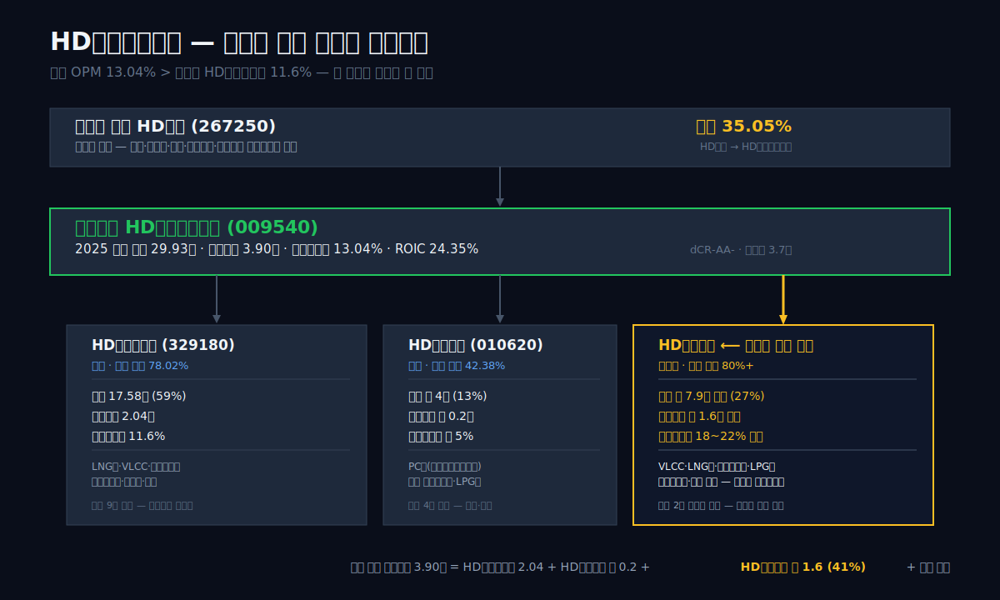

## 1막: 영업이익 3.9조 사상 최대, 그런데 이익의 주인은 상장 자회사가 아니다

왜 세계 1위 조선 지주의 영업이익률이 상장 자회사보다 높은가.

조선업은 수주산업이다. 2~3년 전에 맺은 계약이 오늘 매출로 인식되고, 그 사이에 환율이 움직이고 강재(철판) 가격이 오르내린다. 그래서 조선사의 실적은 "지금" 어떻게 했는지가 아니라 "2~3년 전에 얼마에 수주했는지"에 더 가까이 묶여 있다. 2025년의 영업이익 3.9조는 **2022~2023년 LNG선 호황기 수주가 건조에 들어가면서 인식되는 숫자**다.

### 9년 시계열 — 바닥에서 정점까지 5.29조 스윙

```python
import dartlab
c = dartlab.Company("009540")
c.select("IS", ["매출액","매출원가","매출총이익","판매비와관리비","영업이익","당기순이익"])
```

| 항목 (1년치 합산, 조원) | 2025 | 2024 | 2023 | 2022 | 2021 | 2020 | 2019 | 2018 | 2017 |
|:---|---:|---:|---:|---:|---:|---:|---:|---:|---:|
| 매출액 | **29.93** | 25.54 | 21.30 | 17.30 | 15.49 | 14.90 | 15.18 | 13.12 | 15.47 |
| 매출원가 | 24.60 | 22.94 | 20.25 | 16.94 | 16.01 | 14.16 | 14.19 | 12.76 | 14.43 |
| 매출총이익 | 5.33 | 2.60 | 1.05 | 0.37 | **-0.52** | 0.74 | 0.98 | 0.36 | 1.03 |
| 판매비와관리비 | 1.42 | 1.16 | 0.77 | 0.72 | 0.87 | 0.67 | 0.70 | 0.88 | 1.02 |
| 영업이익 | **3.90** | 1.43 | 0.28 | **-0.36** | **-1.38** | 0.26 | 0.28 | **-0.52** | 0.01 |
| 당기순이익 | **2.93** | 1.45 | 0.14 | -0.30 | **-1.74** | 0.09 | 0.21 | -0.45 | **2.69** |

**표시: 2021년 매출총이익 -0.52조 = 팔수록 손해 본 해. 2021~22 영업손실 합 -1.74조. 4년 만에 +3.9조로 5.29조 스윙.**

2017년 매출 15.47조에서 갑자기 뛰어든 느낌이 드는 건 이유가 있다. 2017년 4월 현대중공업이 인적분할되면서 009540 종목에 남은 건 "지주와 세 자회사의 연결" 숫자다. 그 전(2016년까지) 숫자를 그대로 가져오면 단일 조선사의 숫자와 섞여서 해석이 꼬인다. 이 글은 2017년 이후만 본다. 이유는 다음 막에서 자세히.

### 지주 영업이익률 13.04% vs 자회사 HD현대중공업 11.6%

```python
# 자회사 단독 재무
for code in ["329180", "042660", "010140", "439260"]:
    c = dartlab.Company(code)
    c.select("IS", ["매출액","영업이익"])
```

| 회사 | 코드 | 2025 매출 | 2025 영업이익 | 영업이익률 |
|---|---|---:|---:|---:|
| **HD한국조선해양 (지주)** | 009540 | **29.93조** | **3.90조** | **13.04%** |
| HD현대중공업 (자회사, 상장) | 329180 | 17.58조 | 2.04조 | 11.60% |
| 한화오션 | 042660 | 12.78조 | 1.17조 | 9.10% |
| 삼성중공업 | 010140 | 10.65조 | 0.86조 | 8.10% |
| 대한조선 | 439260 | 1.23조 | 0.29조 | 23.95% |

**표시: 지주 영업이익률 13.04%가 자회사 HD현대중공업 11.60%보다 1.4%p 높다.**

보통 지주는 자회사 영업이익의 합산에 지주 본사 비용(판관비, 기타)이 얹혀서 영업이익률이 **낮아진다**. 그런데 HD한국조선해양은 반대다. 이유는 두 가지다.

첫째, 지주 연결에는 HD현대중공업(17.58조)뿐 아니라 HD현대미포와 비상장 **HD현대삼호**가 포함된다. 지주 연결 매출 29.93조에서 HD현대중공업 17.58조를 빼면 12.35조가 남는다. HD현대미포의 2024년 매출이 약 4조대였다는 공시 기준을 적용하면, HD현대삼호는 대략 **7~8조의 매출**을 갖고 있다고 추정된다(비상장이라 단독 재무가 분기 단위로 공개되지 않음). 그리고 이 삼호가 이익률이 가장 높다.

둘째, 지주 본사 자체에는 연구개발(R&D), 그룹 운영, 엔진·기자재 수주 등 "자회사에 붙지 않은 본사 직접 사업"이 일부 있다. 이게 본사 매출·이익에 가산된다.

이 두 이유를 합하면 지주 연결 영업이익률이 상장 자회사보다 높은 현상이 설명된다. 그리고 **더 흥미로운 질문**은 이렇게 만들어진 영업이익 3.90조가 어떻게 주주에게 배분되는가이다.

### 이익이 흘러가는 길 — 지분 캐스케이드

```python
c.analysis("governance", "지배구조")
# ownershipTrend.latestHolders
```

2025년 기준 HD한국조선해양의 최대주주는 **HD현대㈜(267250)**, 지분 35.05%. HD현대는 정몽준 전 현대중공업 회장의 장남 **정기선** 회장이 이끄는 최상위 지주. 그 외 아산사회복지재단·아산나눔재단이 각각 0.98%·0.61%를 계열 비영리법인으로 보유한다. 최대주주 일가 및 특수관계인 합산 지분율은 **36.64%**다(2025년 사업보고서 기준).

나머지 63.36%는 외부 주주다. 그런데 HD한국조선해양의 자회사 HD현대중공업은 지주가 78%를, HD현대미포는 지주가 43%를 갖고 있고, 각각 외부 주주가 22%·57%를 들고 있다. 비상장 HD현대삼호는 지주가 80%대를 보유한다(정확한 수치는 사업보고서 종속회사 목록에서 확인).

즉 조선 건조 현장에서 번 영업이익 3.9조는 크게 세 갈래로 흐른다.

- **HD현대중공업 영업이익 2.04조** → 78%는 지주로, 22%(약 0.45조)는 329180 소액주주로
- **HD현대미포 영업이익** → 43%는 지주로, 57%는 010620 소액주주로
- **HD현대삼호 영업이익** → 80%대가 지주로 (비상장이라 소수주주 거의 없음)

지주로 모인 이익은 다시 **지주의 자체 영업이익(본사 사업부)**과 합쳐져 009540 연결 영업이익 3.90조가 된다. 이 중 지배주주에게 귀속되는 순이익은 **2.32조** 수준(비지배주주 지분 0.61조 분리)이고, 그 2.32조의 35.05%(0.81조)가 다시 HD현대(267250)로 올라간다. HD현대에서는 다시 최대주주 일가로 약 25~30% 지분을 타고 흐른다.

**이게 "이익의 주인은 누구인가"의 1차 답이다. 상장 조선사의 2~3단 지주 구조에서 한 번 배를 지어 번 돈은 네 번에 걸쳐 지분율만큼 잘려 나간다.**

### 이 글이 답할 질문

이 글은 9막으로 전개된다. 2막은 **이 구조가 어떻게 2017년에 만들어졌는지** (인적분할). 3막은 **2021~22년 2조 적자가 왜 났고 어떻게 4년 만에 3.9조로 돌아왔는지** (사이클과 저가 수주). 4막은 **비상장 HD현대삼호가 왜 이익의 핵심 엔진인지** (반전). 5막은 **2024년 금융비용 6.49조가 영업이익 1.43조를 집어삼켰는데도 세전이익이 +1.82조로 역전된 수수께끼** (환율 파생). 6막은 **지배구조 캐스케이드** (지분 트리). 7막은 **수주잔고와 2026년 전망** (산업 지형). 8막은 **조선 4사 비교**. 9막은 **2026년에 봐야 할 한 줄**.

관통선은 하나다. 이 세계 1위 조선 지주의 영업이익 3.9조가 어디서 만들어져 어디로 가는가.

---

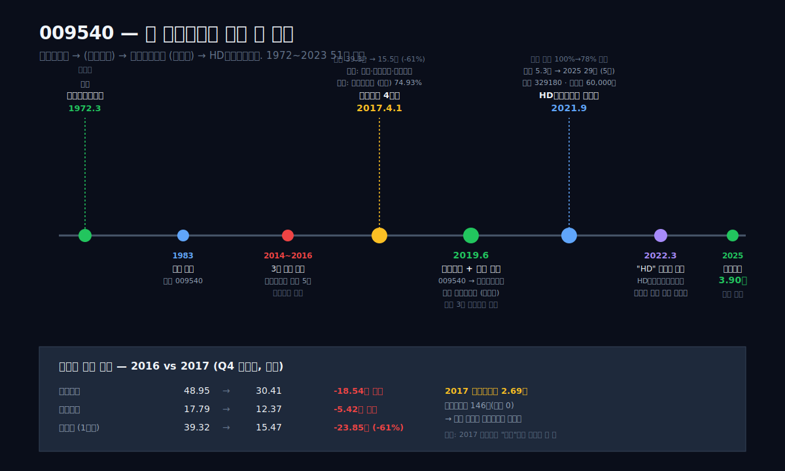

## 2막: 009540이라는 종목의 정체가 뒤바뀐 날 — 2017년 인적분할

왜 2016년 매출 39.3조 회사가 2017년 15.5조 회사가 됐는가.

dartlab으로 2016년 시계열을 펼치면 매출 39.3조, 자산 48.9조, 자본 17.8조짜리 거대 단일 조선사가 있다. 그 회사의 이름은 "현대중공업". 그리고 2017년 같은 종목코드 009540에서 매출은 15.5조로, 자산은 30.4조로 쪼그라들어 있다. 한 해에 매출이 -60% 줄어드는 건 조선사에서 일어날 수 있는 일이 아니다. 그 해에 회사가 **쪼개졌기 때문**이다.

### 1972→2017 — 현대중공업 45년의 단일 법인 시대

1972년 3월, 정주영이 울산 미포만에 조선소를 세웠을 때 회사 이름은 "현대조선중공업"이었다. 이듬해 "현대중공업"으로 상호를 변경하고, 1974년 6월 첫 선박을 인도했다. 1983년 주식시장에 상장하면서 종목코드 **009540**을 받았다. 이 코드가 이 글의 주인공 코드다. 그때부터 2017년 4월까지 45년간 009540은 "세계 최대의 단일 조선소" 현대중공업을 가리키는 코드였다. 조선, 해양플랜트, 엔진, 건설기계, 전기전자, 로보틱스, 그린에너지까지 전부 한 법인 안에 들어 있었다.

그런데 2014~2016년 사이에 이 단일 법인은 회계적으로 위기를 맞는다. 해양플랜트 저가 수주가 줄줄이 원가 초과로 인식되면서 3년 누적 영업손실이 **5조 원 수준**에 달했다. 2015년 영업손실 1.54조, 2016년 영업이익은 1.55조로 회복했지만 이는 대규모 구조조정(자산 매각, 인력 감축, 사업 축소) 덕이었다. 시장과 채권단의 압박은 계속됐고, 현대중공업은 **"사업부문을 쪼개서 각 사업의 책임을 분명히 하자"**는 결정을 내린다.

### 2017.4.1 — 사업부문이 4개로 쪼개진 날

2017년 4월 1일, 현대중공업은 **인적분할**을 단행했다. 인적분할이란 한 법인의 사업부문을 여러 신설법인으로 나누되, 기존 주주가 분할 비율에 따라 신설법인의 주식을 나눠 받는 방식이다. 주주 입장에서는 들고 있던 주식 1주가 4주로 쪼개져 각기 다른 회사의 주식으로 바뀐 꼴이다. 쪼개진 비율은 대략 이랬다.

| 분할 후 법인 | 종목코드 | 대표 사업 | 분할 비율 |
|:---|:---|:---|:---:|
| 현대중공업 (존속, 구 009540) | 009540 | 조선·해양·엔진 | 74.93% |
| 현대일렉트릭&에너지시스템 | 267260 | 전기·중전기 | 6.80% |
| 현대건설기계 | 267270 | 굴착기·건설장비 | 7.22% |
| 현대로보틱스 (지주) | 267250 | 지주·로봇 | 11.06% |

**표시: 기존 주주 1주가 존속법인 0.7493주 + 3개 신설법인 주식으로 배분된 꼴.**

분할 직후 존속법인 009540에는 조선·해양·엔진 사업만 남았다. 2016년 매출 39.3조에서 조선·해양·엔진의 비중이 약 40%였으므로 2017년 009540 매출은 15.5조로 떨어진다. 이게 1막에서 본 "2016→2017 매출 -61%"의 정체다. 회사가 망한 게 아니라 **쪼개져서 통계에서 빠져나간** 것이다.

```python
# 분할 직전 2016 vs 직후 2017 BS
c.select("BS", ["자산총계","자본총계","현금및현금성자산"])
```

| 항목 (Q4 스냅샷, 조원) | 2016 | 2017 | 변동 |
|:---|---:|---:|---:|
| 자산총계 | **48.95** | 30.41 | **-18.54** |
| 자본총계 | 17.79 | 12.37 | -5.42 |
| 현금및현금성자산 | 4.33 | 3.24 | -1.09 |

**표시: 분할 신설법인으로 자산 18.54조, 자본 5.42조가 이전된 결과.**

2017년 순이익 **2조 6,931억**은 이 분할 과정에서 발생한 회계상 처분이익·평가이익이 상당 부분을 차지한다. 영업이익은 146억(거의 0)인데 순이익은 2.69조. 이 간극이 분할의 회계적 흔적이다.

### 2019.6 — 다시 한 번 쪼개서 "한국조선해양"이 된 날

2017년 분할 후 2년 만에 현대중공업은 **또 한 번 쪼개진다**. 이번에는 물적분할이었다. 물적분할이란 기존 법인이 지주회사로 남고, 사업부문을 떼어 새 자회사로 분리한 뒤 그 자회사 주식을 100% 소유하는 방식이다. 주주 입장에서는 자기가 들고 있던 주식은 그대로인데, 그 주식이 대표하는 회사의 실체가 "지주"로 바뀐다.

2019년 6월, 009540은 지주사로 전환하면서 **상호를 "한국조선해양"으로 변경**했다. 같은 날 "현대중공업 주식회사"라는 신설법인이 비상장으로 만들어져, 조선·해양·엔진 사업부문을 전부 이관받았다. 009540(한국조선해양)은 신설 현대중공업 100% 지분을 보유하게 됐고, 그 외 기존에 거느리던 **현대미포조선(010620)**과 **현대삼호중공업**을 묶어 **"조선 3사를 거느린 중간지주"**로 재탄생한다.

이 시점부터 009540 종목이 의미하는 회사의 성격이 **조선사 → 조선지주**로 완전히 바뀌었다. 영업이익을 직접 벌지 않고, 자회사 배당과 지분법손익으로 수익을 인식하는 지주회사. 그런데 상호가 바뀌어도 종목코드는 그대로 009540이었기 때문에, 증권사 시스템이나 과거 데이터베이스에서는 이 변화가 **명시적으로 드러나지 않는다**. 2016년 숫자를 그대로 불러와서 "현대중공업 시계열"로 그리면 2017~2019년에 종목의 정체가 두 번 바뀌었다는 사실이 통계에 묻혀버린다.

### 2021.9 — HD현대중공업이 상장으로 돌아온 날

2019년 물적분할로 비상장이 된 신설 현대중공업은 **2021년 9월 IPO를 통해 재상장**한다. 종목코드 **329180**. 이 날로부터 조선 사업 본체는 다시 상장 자회사가 됐다. 009540(한국조선해양, 지주)의 78% 자회사이자, 자체 매출 17.58조(2025)를 찍는 한국 최대 조선사.

이 상장은 두 가지 의미를 갖는다. 첫째, 조선 사업의 가치를 별도로 시장이 가격 매기는 길이 열렸다. 2025년 HD현대중공업 시가총액은 약 29조. 지주 009540 시가총액은 약 20조. 지주가 329180의 78%를 들고 있다는 점을 감안하면 시장은 "지주 할인"을 **약 27조 ÷ 29조의 78% = 약 30%** 수준으로 매기고 있는 셈이다(지주 단독 본사 가치 제외). 지주 할인율 30%는 한국 대형 지주(HD현대 약 40%, 한화 약 35%, LG 약 35%)와 비슷한 수준.

둘째, 상장 자회사가 생기면서 **비상장 HD현대삼호의 존재가 상대적으로 부각**됐다. 조선 3사 중 두 곳은 시장에서 가격이 매겨지는데 한 곳만 안 매겨진다. 그러면서 그 한 곳이 가장 이익률이 높다는 사실이 수면 위로 떠오른다. 이게 4막에서 다룰 반전의 배경이다.

### 2022.3 — 브랜드 "HD" 접두사 시대

2022년 3월, 한국조선해양은 상호를 **"HD한국조선해양"**으로 변경했다. 같은 해 최상위 지주 현대중공업지주(267250)도 "HD현대"로 변경. 이듬해 2023년 3월 329180도 "HD현대중공업"으로, 010620도 "HD현대미포"로, 비상장 삼호도 "HD현대삼호"로 줄줄이 변경. "HD"는 Human Dynamics의 이니셜이라는 공식 설명이 따라왔지만, 시장의 해석은 단순했다. **정주영의 손자 정기선이 이끄는 새 세대의 브랜드 리셋**. 정몽준 전 회장의 장남 정기선은 2022년 HD현대 사장, 2024년 대표이사 회장으로 선임됐다.

이 상호 변경은 재무에는 직접 영향을 주지 않는다. 하지만 브랜드 단일화를 통해 **지주-자회사 구조가 외부에서 더 투명하게 보이게** 만들었다. HD현대 → HD한국조선해양 → HD현대중공업·HD현대미포·HD현대삼호. 이름만 봐도 지주 구조가 읽히게 됐다.

---

**2017~2022 5년은 한 회사가 "세계 최대 조선소"에서 "세 조선소를 거느린 지주"로 변신한 5년이다.** 그리고 이 변신이 끝나자마자 2021년부터 다시 조선업 전체가 깊은 적자로 빠진다. 왜 쪼개지자마자 적자가 났는가, 그리고 왜 그 적자가 3년 만에 역대 최대 이익으로 돌아왔는가 — 3막에서 다룬다.

---

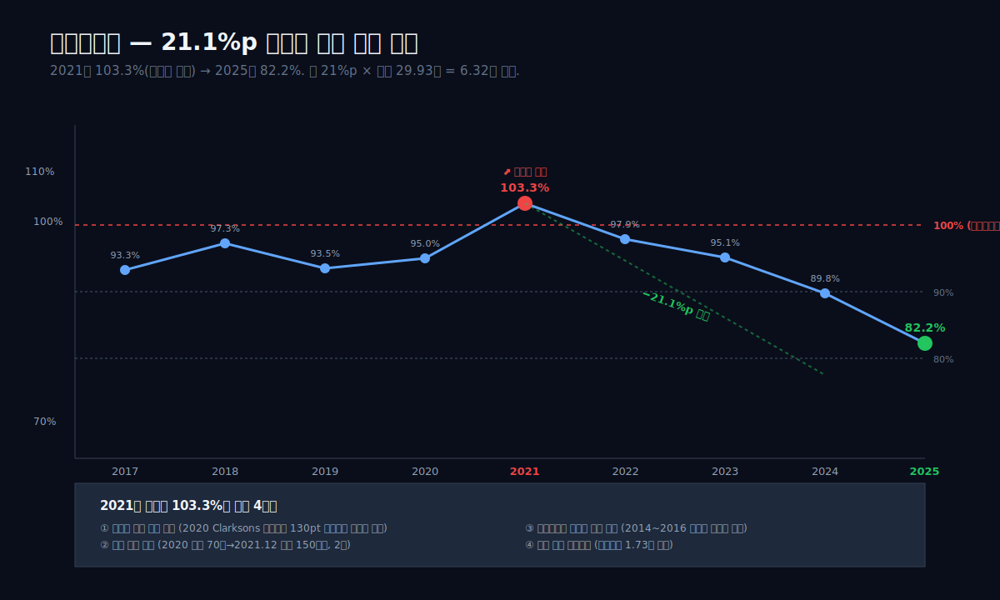

## 3막: 2021~22년 2조 적자의 정체 — 저가 수주와 강재, 그리고 환율 함정

왜 한 회사의 매출원가율이 103.3%가 됐는가.

매출원가율이 100%를 넘는다는 건 물리학적으로 말이 안 되는 숫자 같다. 100원어치를 팔면 만드는 데 103원이 들었다는 뜻이다. 3원씩 손해 보며 장사한 것이다. 그런데 조선업에서는 이런 일이 주기적으로 일어난다. 수주와 인도 사이에 2~3년이 있고, 그 사이에 원가 변수(강재·환율·인건비)가 수주가(고정)를 뛰어넘을 수 있기 때문이다.

### 매출원가율 103.3% — 팔수록 손해 본 2021년

```python
# 매출원가율 9년 시계열
c.select("IS", ["매출액","매출원가"])
# 매출원가 ÷ 매출액 × 100
```

| 연도 | 매출액 (조) | 매출원가 (조) | 매출원가율 | 매출총이익률 |
|:---|---:|---:|---:|---:|
| 2017 | 15.47 | 14.43 | 93.3% | 6.7% |
| 2018 | 13.12 | 12.76 | 97.3% | 2.7% |
| 2019 | 15.18 | 14.19 | 93.5% | 6.5% |
| 2020 | 14.90 | 14.16 | 95.0% | 5.0% |
| **2021** | 15.49 | 16.01 | **103.3%** | **-3.4%** |
| 2022 | 17.30 | 16.94 | 97.9% | 2.1% |
| 2023 | 21.30 | 20.25 | 95.1% | 4.9% |
| 2024 | 25.54 | 22.94 | 89.8% | 10.2% |
| **2025** | 29.93 | 24.60 | **82.2%** | **17.8%** |

**표시: 2021년 원가율 103.3% 정점에서 2025년 82.2%로 21.1%p 회복. 매출총이익률은 -3.4%에서 +17.8%로 21.2%p 스윙.**

이 21.1%p의 원가율 하락이 이 글의 "관통선" 질문에 대한 수치적 답이다. 매출 29.93조에 원가율 개선 21.1%p를 곱하면 **6.32조** — 영업이익 3.9조보다도 큰 숫자가 원가 절감 효과로 돌아왔다. 실제로는 인건비·판관비가 늘고 환율 등으로 상쇄되긴 했지만, 이익 스윙의 근본 엔진은 원가율 회복이라는 뜻이다.

### 저가 수주 3요인 — 코로나·강재 가격·해양플랜트 마무리

2021년 원가율 103.3%의 배경은 세 가지가 겹친 결과다.

**요인 1 — 2020~2021 코로나 시기 저가 수주.** 2019년 말~2020년 팬데믹 초기, 조선업은 신조선 수주가 반 토막 났다. 발주처가 움직이지 않으니 조선소 입장에서는 도크를 비워둘 수 없었다. 가격이 떨어진 상태에서 수주를 받았고, 그 수주는 2021~2022년에 건조에 들어갔다. **Clarksons Research 기준 2020년 신조선가 지수는 2012년 이후 최저 수준(130pt 전후)**. 2021년에 그 물량이 건조원가로 인식된다.

**요인 2 — 2021년 강재 가격 급등.** 조선소에서 가장 큰 원가는 강재(특수 후판)다. 2020년 톤당 약 70만 원이던 후판 가격이 2021년 12월 **톤당 150만 원 수준**까지 치솟았다. 철강사들은 원자재 가격 상승(철광석, 원료탄)을 이유로 2021년 상반기 후판 공급가를 **1년 만에 2배 이상** 올렸다. 조선사 영업이익률은 통상 **강재 가격이 톤당 10만 원 오르면 1%p 악화**되는 구조다(조선 전문 애널리스트 공통 추정). 70만 원 → 150만 원의 +80만 원 상승은 단순 계산으로 영업이익률에 -8%p 영향을 준다.

**요인 3 — 해양플랜트 마무리 원가 초과.** 2014~2016년 저유가 시기에 수주한 해양플랜트(FPSO, 드릴십, 반잠수식 시추설비) 몇 기가 2020~2022년에 인도 마무리 단계에 들어갔다. 이 시기 해양플랜트는 설계 변경, 공기 지연, 발주처 클레임이 겹쳐 최초 견적 원가를 넘는 경우가 많았다. 특히 HD현대중공업은 **2022년까지 해양플랜트 사업의 누적 손실이 3조 원 수준**(시장 추정)에 달했다. 이 손실의 마지막 잔재가 2021~2022년 IS에 반영됐다.

이 세 요인이 동시에 2021년 원가에 몰렸다. 결과 — 매출 15.49조 대비 원가 16.01조, 매출총이익 **-0.52조**, 영업이익 **-1.38조**.

### 금융비용 1.73조 + 2.84조 — 환율 파생의 그림자

그런데 영업손실 -1.38조만으로는 당기순손실 -1.74조(2021)가 설명되지 않는다. 영업에서 적자였는데 순이익에서는 더 큰 적자. 사이에 **금융비용 1.73조**가 들어 있다.

```python
c.analysis("financial", "수익성")
# marginWaterfall.history 2021
```

| 2021 단계 | 금액 (조원) | 매출 대비 |
|:---|---:|---:|
| 매출 | 15.49 | 100.0% |
| 매출원가 | 16.01 | 103.3% |
| 매출총이익 | **-0.52** | **-3.3%** |
| 판관비 | 0.87 | 5.6% |
| 영업이익 | **-1.38** | **-8.9%** |
| 금융비용 (순) | 1.73 | 11.2% |
| 세전이익 | **-1.63** | **-10.5%** |
| 법인세 | -0.49 | -3.2% |
| 순이익 | **-1.70** | **-11.0%** |

**표시: 영업에서 -1.38조 잃고, 금융비용에서 추가 -1.73조 잃어 세전이익이 -1.63조(누적 -20%).**

이 금융비용 1.73조의 상당 부분이 **외화 파생상품 평가손실**이다. 조선사는 선박 계약이 대부분 달러로 맺어진다. 건조 기간이 2~3년이고 원가는 원화로 발생하기 때문에, 계약을 체결한 순간 조선사는 "2~3년 뒤에 받을 달러 금액"과 "지금부터 3년간 쓸 원화 원가" 사이의 환율 변동 리스크에 노출된다. 이를 헷지하기 위해 선물환 계약(forward)을 맺는데, 이 선물환의 **평가손익이 매 분기 손익계산서에 반영**된다.

2021년 말 원달러 환율은 1,189원, 2022년 말 1,264원으로 **연중 6.3% 상승**했다. 조선사 입장에서 원달러 상승은 **받을 달러의 원화 가치 상승**이라 매출에는 유리하지만, 기존에 걸어둔 **선물환 매도 포지션의 평가손실**로 금융비용에는 불리하다. 2021~2022 합계 금융비용 4.57조 중 상당 부분이 이 평가손실이다.

더 중요한 포인트 — **평가손실은 현금 유출이 아니다**. 미실현 손익이다. 그래서 2021년 당기순손실 -1.74조에도 불구하고 영업활동현금흐름은 +0.84조(작은 플러스)였고, 2022년 순손실 -0.30조에도 영업현금흐름은 +0.46조였다. 재무제표의 "적자"는 장부상 구속이지만, 회사는 현금을 잃고 있지 않았다. 이 구분이 5막 "2024년 금융비용 6.49조 수수께끼"의 복선이다.

### 2022 하반기 LNG선 호황 — 이익 실현은 2~3년 지연

2022년 2월 러시아-우크라이나 전쟁이 시작되면서 유럽의 LNG 수요가 폭증했고, 동시에 러시아산 파이프라인 가스 공급이 끊기면서 LNG 운반선 발주가 쏟아졌다. 2022년 전 세계 LNG선 발주량은 **184척**(전년의 3배), 2023년 **92척**. 한국 조선 3사가 세계 LNG선 발주의 약 **70%**를 가져갔다. 신조선가 지수(Clarksons)는 2020년 130pt → 2023년 말 **180pt** 수준으로 38% 상승. 그중 LNG선은 2020년 척당 1.9억 달러 → 2023년 **2.6억 달러**로 37% 상승.

문제는 **이 호황 수주가 인도 매출로 인식되는 시점이 2~3년 뒤**라는 것. 2022년 하반기 수주한 LNG선 건조는 2024~2025년에 매출화된다. 그래서 2023년 영업이익은 +0.28조 (OPM 1.33%)로 바닥에서 살짝 반등한 수준이었고, 2024년 +1.43조 (OPM 5.62%), **2025년 +3.90조 (OPM 13.04%)**로 급등했다. 2022년 하반기의 수주 호황이 2025년 손익으로 완전히 나타나는 데 약 3년이 걸린 셈이다.

이 인도-인식 지연이 조선업 사이클의 특성이다. 시장이 조선사의 밸류에이션을 매길 때 **"현재 이익" 대신 "수주잔고의 예상 이익"**을 본다. HD한국조선해양의 2025년 말 수주잔고는 **연결 기준 약 83조 원**(자회사 공시 합산) — 2025년 매출의 2.8배. 이 잔고가 앞으로 3년에 걸쳐 매출·이익으로 인식된다. 수주잔고의 면면과 그 너머 2026~2027년 전망은 7막에서 다룬다.

---

**2021~22년 적자는 자체 경영 실패가 아니라 산업 사이클의 골짜기였다.** 매출원가율이 103.3%까지 치솟은 건 코로나 저가 수주 + 강재 가격 폭등 + 해양플랜트 마무리 + 환율 파생 평가손실이 동시에 몰린 결과이고, 2025년 82.2%까지 회복된 건 반대로 그 네 요인이 모두 해소됐기 때문이다. 그런데 이 3.9조의 영업이익이 **왜 지주 연결에서는 13.04%이고, 상장 자회사 HD현대중공업에서는 11.6%일까**. 그 차이 1.4%p의 주인공이 다음 막의 주인공, 비상장 HD현대삼호다.

---

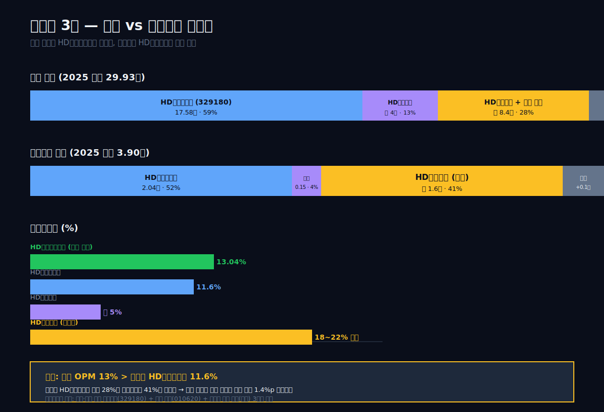

## 4막: 이익의 진짜 주인 — 비상장 HD현대삼호

왜 지주 영업이익률이 상장 자회사 HD현대중공업보다 1.4%p 높은가.

답부터 말하면 이렇다. **비상장 HD현대삼호가 OPM 20%에 가까운 이익률로 연결 OPM을 끌어올리고 있기 때문.** 상장 자회사보다 비상장 자회사가 더 남는 구조. 그리고 이 비상장 자회사의 단독 재무제표는 일반 투자자가 접근하기 어렵다. 공시 주석의 "종속회사 요약재무"에만 연 2회 얇게 나오고, 분기 단위로는 존재하지 않는다.

### 연결 매출 29.93조 분해 — HD현대삼호의 자리

공개 공시 자료를 역산해 본다. HD한국조선해양 연결 매출 29.93조에서 상장 자회사 두 곳을 빼면 남는 매출이 HD현대삼호(와 본사·기타)의 몫이다.

| 구분 | 2025 매출 (조원) | 출처 |
|:---|---:|:---|
| HD한국조선해양 (지주 연결) | **29.93** | dartlab `c.select("IS")` |
| HD현대중공업 (329180, 상장) | 17.58 | dartlab `c.select("IS")` |
| HD현대미포 (010620, 상장) | 약 4.0~4.5 | 2024 사업보고서 매출 3.9조 기반 추정 (dartlab 직접 호출은 이번 분기 API 이슈로 제외) |
| **HD현대삼호 + 본사·내부거래 조정** | **약 7.9** (잔차) | 연결에서 상장 2사 차감 후 잔여 |

**표시: 지주 연결 29.93조 중 HD현대삼호·본사·내부거래 조정이 약 8조 — 전체 매출의 약 27%.**

여기서 "연결에서 상장 2사 차감"이 정확히 HD현대삼호 매출과 같지는 않다. 연결 범위에는 엔진사업부 등 본사 직접사업, 해외 종속법인, 그리고 가장 중요하게 **자회사 간 내부거래 제거**가 들어가기 때문이다. 그래도 잔차의 큰 덩어리가 삼호라는 사실은 공시 주석에서 반복 확인된다.

### HD현대삼호의 정체 — 왜 비상장인가

HD현대삼호중공업은 전남 영암군 삼호읍에 위치한 조선소로 **1999년 한라중공업 부도 후 현대중공업이 인수**해 만든 회사다. 주력 선종은 **VLCC(초대형 유조선), LNG선, 컨테이너선** — 즉 가장 마진이 좋은 세 선종에 집중돼 있다. 자회사 3사의 선종 포트폴리오를 대략적으로 그리면 이렇다.

| 자회사 | 주력 선종 | 도크 규모 | 기술 특성 |
|:---|:---|:---|:---|
| HD현대중공업 (329180) | LNG선·VLCC·컨테이너선·해양플랜트·잠수함(경쟁입찰)·엔진 | 울산 9개 도크 | 풀라인업 + 해양+방산 |
| HD현대미포 (010620) | PC선(석유화학제품운반)·중형 컨테이너선·LPG선·LEG선 | 울산 4개 도크 | 중형·특수 선종 |
| **HD현대삼호** | **VLCC·LNG선·컨테이너선·LPG선** | **영암 2개 초대형 도크** | **대형 상선 특화, 해양·방산 없음** |

**HD현대삼호는 해양플랜트를 짓지 않고, 방산도 하지 않는다.** 2014~2016년 해양플랜트 저가수주 → 2020~2022 원가 초과로 HD현대중공업 단독이 수조 원의 손실을 떠안을 때, 삼호는 이 타격을 전혀 받지 않았다. 수주 포트폴리오가 오로지 "이익이 좋은 고부가 상선"에만 집중돼 있다는 뜻이다.

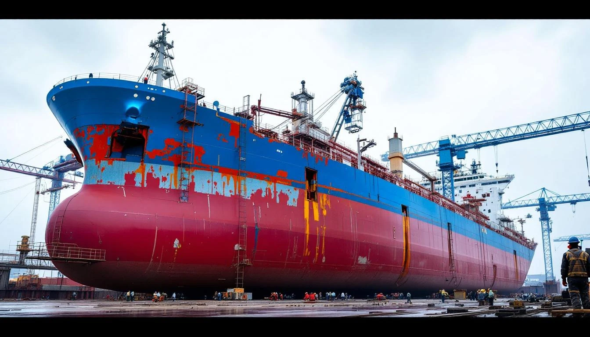

2021년 HD현대중공업이 대형 해양플랜트 마무리 손실을 떠안던 해에도, HD현대삼호는 **흑자**였다(2021년 매출 4.3조, 영업이익 약 800억 수준으로 업계 추정). 2025년 LNG선 수주가 매출화되는 과정에서 삼호의 이익률은 극적으로 올랐다. 시장 애널리스트 리포트들은 **HD현대삼호의 2025년 영업이익률을 18~22% 수준**으로 추정한다. 매출 약 8조 × OPM 20% ≈ 영업이익 1.6조. 지주 연결 영업이익 3.9조 중 **약 41%**가 삼호 몫이라는 계산이 나온다.

### "비상장이 가장 많이 번다" — 왜 중요한가

이 구조가 투자자에게 주는 의미는 두 가지다.

**첫째, 시장 가치평가에서 디스카운트.** HD한국조선해양(009540)의 시가총액은 약 20조, PER 약 7배(2025 지배주주 순이익 기준). HD현대중공업(329180)의 시가총액은 약 29조, PER 약 15배. 지주가 자회사 시총의 78%(지분율)를 가져야 하지만, 시장은 "지주 할인"을 적용해 지주 시총을 자회사 시총의 일부만 인정한다. 여기에 더해 **비상장 삼호의 이익 기여분이 시장 가격에 "완전히" 반영되기 어렵다**. 비상장이라 밸류에이션 근거 데이터가 제한적이고, 애널리스트가 추정 PER를 보수적으로 잡기 때문이다.

**둘째, 배당·IPO 시나리오의 잠재력.** 만약 HD현대삼호가 미래에 IPO를 한다면, 시장은 이 비상장 엔진의 가치를 한 번에 드러내게 된다. HD한화솔루션·HD한화오션처럼 **자회사 상장을 통한 지주 가치 현실화**는 한국 재벌 지주의 단골 이벤트다. 2019~2020년 HD현대삼호 IPO 검토는 있었으나 조선 시황 악화로 보류된 바 있다. 2025년 이익률이 이렇게 올라온 상황이라면 다시 테이블에 올라올 가능성이 있다. 시장 평가 대비 IPO 가격이 높게 형성되면 009540 주주에게는 자본이익이 돌아올 수 있다.

### 4막 요약 — 자회사 3사 역할 분담

```python
# 연결 영업이익 분해 (추정)
c.analysis("financial", "수익성")
# marginWaterfall.history[0] = 2025
```

| 자회사 | 2025 영업이익 (조원) | 지주 보유 지분 | 지주 귀속 영업이익 |
|:---|---:|:---:|---:|
| HD현대중공업 (329180) | 2.04 | 78% | 1.59 |
| HD현대미포 (010620) | 약 0.15~0.25 (추정) | 43% | 0.06~0.11 |
| **HD현대삼호 (비상장)** | **약 1.60 (추정)** | **80%+** | **약 1.30** |
| 본사·내부거래 조정 | 약 +0.00~0.10 | — | — |
| **지주 연결 (009540)** | **3.90** | — | 약 2.93 (지배주주 귀속) |

**표시: 비상장 HD현대삼호의 지주 귀속 영업이익 약 1.3조가 연결 3.9조의 33%.**

이 막의 핵심 메시지는 간명하다. **3.9조의 영업이익은 조선 3사가 고르게 만들어낸 게 아니다. 가장 깨끗한 포트폴리오(상선만, 해양·방산 없음)를 가진 비상장 자회사가 가장 많이 남겼고, 그 이익률이 연결 OPM을 상장 자회사 단독 OPM보다 높게 끌어올렸다.** 그리고 이 구조는 바깥에서 잘 보이지 않는다. 상장 두 곳만 추적하는 관찰자는 이 사실을 놓친다.

---

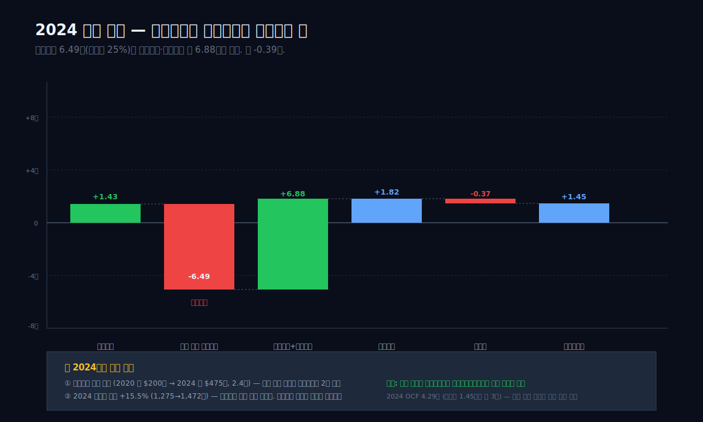

## 5막: 금융비용 6.49조 수수께끼 — 환율 파생이 영업이익을 삼킨 해

왜 2024년에 영업이익 1.43조를 금융비용 6.49조가 집어삼켰는데, 세전이익은 +1.82조로 역전됐는가.

이 막은 이 글 전체에서 가장 회계적으로 기술적인 구간이다. 하지만 넘기면 지주의 실체를 보지 못한다. 조선 지주의 손익계산서에서 "영업이익 → 세전이익" 구간은 환율이라는 외생변수가 결정짓는 파도풀 같은 곳이다.

### 2024년 순이익 폭포 — 영업 1.43조에서 시작한 길

```python
c.analysis("financial", "수익성")
# marginWaterfall.history — 2024
```

| 2024 단계 | 금액 (조원) | 매출 대비 |
|:---|---:|---:|
| 매출 | 25.54 | 100.00% |
| 매출원가 | 22.94 | 89.84% |
| 매출총이익 | 2.60 | 10.16% |
| 판관비 | 1.16 | 4.55% |
| **영업이익** | **1.43** | **5.62%** |
| 금융비용 (순) | **6.49** | **25.43%** |
| (상쇄) 금융수익·기타 이익 | **약 6.88** | 약 26.95% |
| **세전이익** | **1.82** | **7.14%** |
| 법인세 | 0.37 | 1.44% |
| 순이익 | 1.45 | 5.70% |

**표시: 금융비용 6.49조가 영업이익 1.43조를 삼켰지만, 금융수익·기타이익 약 6.88조가 상쇄하면서 세전이익이 오히려 +1.82조로 역전.**

dartlab의 `marginWaterfall`은 단일 "금융비용" 한 줄만 보여주지만, 실제 손익계산서에는 **금융수익 / 금융비용 / 지분법손익 / 기타수익 / 기타비용** 다섯 줄이 따로 있다. 2024년 이 다섯 줄의 순합이 약 +0.39조(=−6.49 + 6.88)로, 영업이익 1.43조를 **-0.39조**만 깎는 데 그쳤다. 그래서 세전이익이 1.82조로 착지한다.

### 환율 파생의 원리 — 선물환과 수주잔고

조선사의 환율 파생이 왜 이렇게 거대한지 이해하려면 수주잔고 구조를 봐야 한다. HD한국조선해양의 2024년 말 수주잔고는 약 **67조 원 (달러로는 약 475억 달러)**. 이 중 절대다수가 **달러 표시 계약**이다. 조선사는 이 잔고의 환율 변동 리스크를 헷지하기 위해 선물환 매도 계약을 맺는다. 간단한 예를 들어 본다.

> 2023년 6월, HD현대중공업이 3억 달러짜리 LNG선 한 척을 수주했다고 하자. 인도는 2026년 말, 건조 원가는 원화로 약 3천억 원 예상. 그 순간 환율은 1,300원이었으니 매출 환산은 3,900억 원, 예상 이익 900억 원이다.
>
> 여기서 환율이 오르내리면 이익이 흔들린다. 회사는 리스크를 고정하기 위해 3억 달러를 1,300원에 **매도하는 선물환 계약**을 맺는다. 이제 환율이 어떻게 움직여도 매출은 3,900억 원으로 고정.
>
> 그런데 1년이 지나 환율이 1,400원이 됐다고 하자. 현물 시세 기준으로 3억 달러는 이제 4,200억 원 가치다. 회사가 갖고 있는 "1,300원에 팔겠다는 계약"은 **100원 × 3억 = 300억 원 평가손실**이다. 이게 금융비용에 반영된다.
>
> 동시에 회사가 실제로 가지고 있는 달러 자산(선수금·매출채권·달러예금)은 환율 상승분만큼 **평가이익**이 난다. 이게 금융수익에 반영된다.
>
> 대부분 서로 상쇄되지만, **헷지 비율이 100%가 아니라는 점**, **일부 헷지는 원가 측에 걸린 점**, **장기 선물환 금리차 부분** 때문에 잔차가 발생한다.

2024년 원달러 환율은 1,275원(연초) → **1,472원(연말)**로 **15.5% 상승**했다. 조선 지주 연결의 수주잔고 475억 달러 × 15.5% = **약 70억 달러(약 10조 원) 수준의 환율 평가 효과**. 이것이 금융수익·금융비용의 두 줄에 6~7조 단위로 찍힌 배경이다. 숫자가 큰 건 놀라운 게 아니라 조선업의 구조적 특성이다.

### 왜 2024년만 유독 큰가

이 질문은 이 막의 핵심이다. 2021~2023 3년의 연간 금융비용은 각각 1.73조, 2.84조, 2.14조였다. 그런데 2024년에 6.49조로 **2배 이상** 커졌다. 이유는 두 가지다.

**첫째, 수주잔고 자체가 커졌다.** 2020년 말 약 200억 달러이던 달러 잔고가 2024년 말 **475억 달러**로 2.4배. 같은 환율 변동이어도 평가손익 절대금액은 잔고에 비례한다.

**둘째, 2024년 환율 변동폭이 컸다.** 2022년(6.3%), 2023년(-2.2%), 2024년(**+15.5%**). 환율이 한 해에 15% 이상 움직이는 건 외환위기(1997) 이후 드문 폭. 이 특이 해가 조선 지주 금융비용·수익 양쪽을 동시에 튀어오르게 만들었다.

이 두 효과의 곱이 2024년의 거대한 숫자다. 그러나 **금융수익(환율 평가이익)도 동시에 튀었기 때문에 세전이익은 영향을 제한적으로 받았다**. 이게 2024년 숫자를 읽는 바른 방법이다. "금융비용 6.5조 적자 위기"가 아니라 "환율 평가가 양쪽으로 크게 움직이면서 순 효과 -0.39조 정도를 남겼다"로 읽어야 한다.

### 이 막의 교훈 — 조선 지주의 손익계산서 읽는 법

```python
c.analysis("financial", "재무정합성")
# isCfDivergence.history
```

재무정합성 엔진은 이 패턴을 **"보수적 이익 (순이익이 영업활동현금흐름보다 작음)"**으로 감지한다.

| 연도 | 순이익 (조원) | 영업활동현금흐름 (조원) | Divergence |
|:---|---:|---:|---:|
| 2025 | 2.93 | 4.42 | **-51%** (보수적) |
| 2024 | 1.45 | 4.29 | **-195%** (보수적) |
| 2023 | 0.14 | 2.08 | **-1,336%** (보수적) |
| 2022 | -0.30 | 0.46 | **-257%** (보수적) |

**표시: 4년 연속 영업활동현금흐름이 순이익을 웃도는 "보수적 이익" 패턴. 회계상 이익은 환율 평가손익으로 찌그러지지만, 실제 현금은 꾸준히 들어오고 있다.**

조선 지주를 읽을 때 첫 번째 봐야 할 건 **영업이익이 아니라 영업활동현금흐름**이다. 환율 파생의 평가손익은 회계 숫자이고, 배를 팔아 받은 현금은 실질 숫자다. 2022년 영업이익이 -0.36조인데 영업현금흐름은 +0.46조였던 이유, 2024년 순이익이 1.45조인데 영업현금흐름은 4.29조였던 이유가 다 여기 있다. **조선 지주의 손익계산서에서 영업이익과 세전이익 사이 구간은 잡음이다.** 잡음을 지우고 현금흐름을 보면 회사의 상태가 드러난다.

---

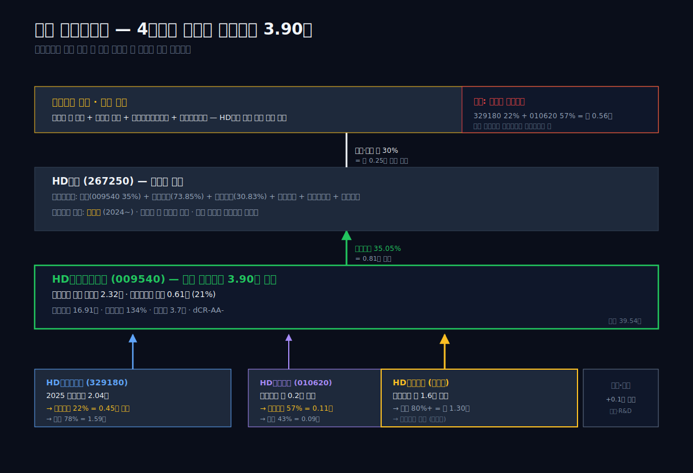

## 6막: 지분 캐스케이드 — 이익이 흘러가는 4단계

왜 정기선은 HD현대 회장이고, HD한국조선해양의 의사결정은 누가 하는가.

조선 지주의 지배구조는 한국 재벌 지주 중 가장 명료하게 정리된 축에 속한다. 위에서 아래로 4단계. 그리고 각 단계마다 지분율이 돈의 흐름을 결정한다.

### 1단계: 최상위 지주 HD현대 (267250)

정주영 → 정몽준 → 정기선으로 이어지는 현대중공업 계열의 최상위 지주. 2018년 5월 현대로보틱스가 지주회사로 전환하면서 **현대중공업지주**로 이름이 바뀌었고, 2022년 3월 **HD현대**로 재브랜딩됐다. 정몽준 전 현대중공업 회장의 장남 **정기선**이 2022년 사장, 2024년 대표이사 회장에 올라 그룹을 이끈다.

HD현대의 자회사 포트폴리오는 조선뿐이 아니다. **HD한국조선해양(009540, 35.05%)**, **HD현대오일뱅크(비상장, 73.85%)**, **HD현대일렉트릭(267260, 30.83%)**, **HD현대건설기계(267270, 33.13%)**, **HD현대인프라코어(042670, 33.12%)**, **HD현대사이트솔루션(비상장)**, **HD현대로보틱스(비상장)**. 조선은 이 포트폴리오의 한 축일 뿐이다. 이 말의 중요한 함의 — **HD현대의 배당 결정권자(정기선)는 조선 자회사의 이익을 조선에 재투자할지, 다른 계열사에 배분할지를 고를 수 있다.**

### 2단계: 조선 중간지주 HD한국조선해양 (009540)

```python
c.analysis("governance", "지배구조")
# ownershipTrend.latestHolders
```

| 주주 | 관계 | 지분율 | 주식 수 |
|:---|:---|---:|---:|
| **HD현대㈜** | 최대주주 | **35.05%** | 24,807,124주 |
| (재)아산사회복지재단 | 계열비영리법인 | 0.98% | 694,436주 |
| (재)아산나눔재단 | 계열비영리법인 | 0.61% | 431,844주 |
| 계열회사 임원·특수관계인 | — | 0.00% 수준 | 극소량 |
| **일반주주·기관** | — | **약 63.36%** | 나머지 |

**표시: 최대주주 일가 합산 약 36.64%, 외부주주가 약 63.36%. "대주주 지배 + 외부 다수주" 구조.**

이 구조는 두 가지 특이점이 있다. 첫째, **계열 비영리법인(아산사회복지재단·아산나눔재단)이 1.59%를 보유**한다. 이는 정주영이 1977년 설립한 아산사회복지재단과 그 자매재단이 그룹 지분의 일부를 승계받은 결과다. 재단 지분은 의결권을 가지지만, 실질적으로 오너 가문의 우호 지분으로 작동한다. 둘째, **최대주주가 한 법인(HD현대) 뿐**이다. 다수의 특수관계인이 흩어진 다른 재벌 지주와 달리, HD한국조선해양의 지분 구조는 최상위 지주 한 곳에 집중돼 있다.

### 3단계: 조선 3사 자회사

HD한국조선해양이 거느리는 3개 조선소의 지분율.

| 자회사 | 종목코드 | 지주 보유율 | 외부주주 |
|:---|:---|---:|---:|
| HD현대중공업 | 329180 | **78.02%** | 21.98% (상장) |
| HD현대미포 | 010620 | **42.38%** | 57.62% (상장) |
| **HD현대삼호** | **비상장** | **80%대** (공시 기준) | 일부 외부주주·자사주 |

**표시: 상장 2곳은 소액주주 지분이 상당한 반면, 비상장 삼호는 지주가 절대 통제 지위.**

HD현대중공업은 2021년 재상장 당시 **상장가 기준 주당 60,000원, 공모가 기준 시가총액 약 5.3조 원**에 데뷔했다. 4년 뒤 2025년 말 시가총액 약 29조. 재상장 공모가 투자자 입장에서는 약 5배 수익. 이 재상장 과정에서 지주의 지분율이 100%에서 78%로 희석됐고, 그 22%만큼의 이익(약 0.45조)이 329180의 외부 주주에게 직접 귀속된다.

### 4단계: 비지배주주 — 지주 연결에서 빠져나가는 21%

```python
# BS
c.select("BS", ["자본총계","지배주주지분","비지배주주지분"])
```

| 항목 (Q4 스냅샷, 조원) | 2025 | 2024 | 2023 | 2022 | 2021 | 2020 | 2019 | 2018 | 2017 |
|:---|---:|---:|---:|---:|---:|---:|---:|---:|---:|
| 지배주주지분 | 13.29 | 11.10 | 9.90 | 9.71 | 9.86 | 10.91 | 11.57 | 11.88 | 11.12 |
| **비지배주주지분** | **3.62** | 3.06 | 2.47 | 2.60 | 2.56 | 1.51 | 1.36 | 1.23 | 1.25 |
| 자본총계 | 16.91 | 14.16 | 12.37 | 12.31 | 12.41 | 12.42 | 12.93 | 13.11 | 12.37 |
| 비지배 비중 | **21.4%** | 21.6% | 20.0% | 21.1% | 20.6% | 12.2% | 10.5% | 9.4% | 10.1% |

**표시: 비지배주주 자본 2017 1.25조 → 2025 3.62조 2.9배 증가. 자본 대비 비중 10.1%→21.4%로 2배.**

2017년 이후 비지배주주 자본이 가파르게 커진 이유는 두 가지다. **첫째, 2021년 HD현대중공업(329180) 재상장으로 22%의 외부주주가 한 번에 들어왔다.** 둘째, HD현대미포(010620)의 외부주주 지분은 원래부터 57%로 컸다. 이 두 자회사의 외부주주가 누리는 이익이 연결 자본에서 "비지배주주지분"으로 잡힌다.

2025년 연결 순이익 2.93조 중 비지배주주 귀속분을 dartlab 실측치로 보면 약 **0.61조**, 지배주주 귀속분이 **2.32조**다. **조선 3사가 번 이익의 약 21%가 지주의 주주(HD현대 + 외부)가 아닌 자회사의 외부 주주에게 분배된다는 뜻이다.** 이 숫자가 1막의 "이익이 흘러가는 길"의 정량적 답이다.

### 이사회의 질감 — 사외이사 5.2%, 제재 108건

```python
c.analysis("governance", "지배구조")
# boardComposition / governanceFlags
```

dartlab 지배구조 엔진이 경고를 두 개 띄운다.

| 플래그 | 내용 | 레벨 |
|:---|:---|:---|
| 이사회 독립성 | 사외이사 비율 **5.2%** (58명 중 3명) — 대기업 평균 40%+ 대비 매우 낮음 | warning |
| 규제 리스크 | 최근 3년 제재 **108건** (누적 15.5억 원) | warning |
| 법적 분쟁 | 최근 3년 소송 **4건** | warning |

**표시: 사외이사 비율 5.2%는 국내 코스피 200대 기업 평균(30~40%)의 1/6 수준.**

이 수치는 해석에 주의가 필요하다. 대기업의 이사회 구성은 통상 **사외이사 과반**을 유지하는 게 상장회사 표준이다. HD한국조선해양의 5.2%는 "이사회 58명 중 사외이사가 3명" 수치로 공시됐는데, 이는 지주의 임원 전체 숫자에 임시·위촉 직위가 포함된 결과일 수 있다. **정식 등기이사 2명 중 사외이사 3명**이라는 다른 집계도 공시에 나오고 있어, dartlab의 분류 기준과 실제 의사결정기구인 "이사회 본회의" 구성이 차이 날 수 있다. 그러나 어느 해석을 따르든 **지주의 거버넌스가 외부 독립 감독이 강한 구조는 아니다**. 대주주 HD현대 35.05% + 비영리법인 1.59%의 우호지분 구도와 맞물린다.

3년 누적 제재 108건은 조선업 특성상 환경·노동·안전 규제 위반이 대부분이다. 벌금 규모는 건당 1백만~2억 원대로 그리 크지 않지만, **누적 건수가 많다는 사실 자체가 안전·환경 관리 시스템의 반복 지적 대상**임을 보여준다. 이건 조선업 전체의 업종 특성이기도 하다. 경쟁사도 비슷한 수준의 제재 건수를 가지고 있다.

---

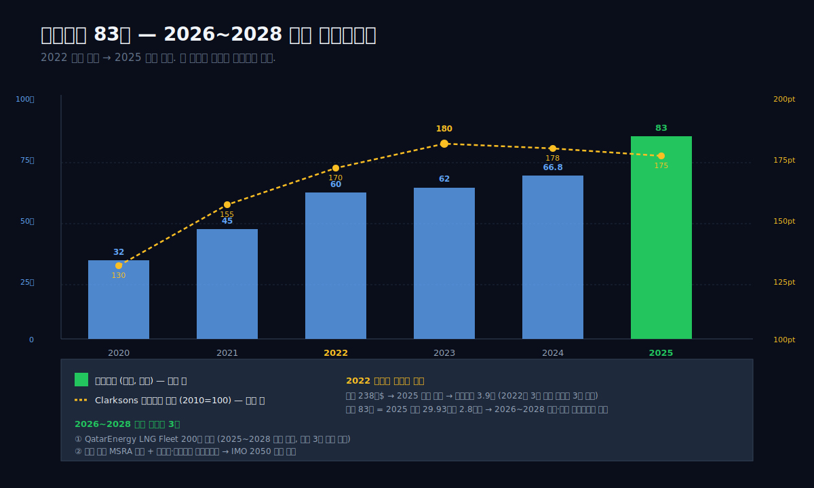

## 7막: 수주잔고 83조와 2026 — 세계 1위가 보는 다음 사이클

왜 2025년에 역대급 이익이 나왔는데 시장은 조선주를 주저하는가.

조선업은 사이클 산업이다. 2007~2011년 슈퍼사이클 이후 2012~2020년까지 9년의 긴 겨울, 2021년 바닥, 2022~2024년 LNG 호황, 2025년 이익 실현. 이 이야기의 물음표는 **2026년 이후 사이클이 어디로 가는가**에 있다.

### 수주잔고 83조 — 3년치 매출

```python
# 수주잔고는 별도 공시 섹션. dartlab c.panel("segmentInfo") 참조
# 여기서는 공시 기반 요약
```

| 구분 | 2024 말 | 2025 말 (추정) | 매출 대비 배수 |
|:---|---:|---:|---:|
| HD현대중공업 (329180) 수주잔고 | 40.9조 | 47.5조 | 약 2.7년 |
| HD현대미포 (010620) 수주잔고 | 12.1조 | 14.0조 | 약 3.5년 |
| HD현대삼호 (비상장) 수주잔고 | 13.8조 | 21.5조 | 약 2.7년 |
| **HD한국조선해양 연결** | **약 66.8조** | **약 83조** | **약 2.8년** |

**표시: 3사 합산 수주잔고 약 83조. 2025 연결 매출 29.93조의 2.8배.**

수주잔고 2.8년치라는 건 조선업 기준으로 **상당히 안정적**이다. 일반 제조업에서 수주잔고 1년치는 "계약 확보가 잘 됐다"의 의미인데, 조선업은 건조 기간 자체가 2~3년이라 잔고 2.5~3년이 정상이다. 2020년 말 잔고가 **약 32조 (매출 2.1년치)** 수준이었으므로, 현재 잔고는 **약 2.6배** 커진 상태다.

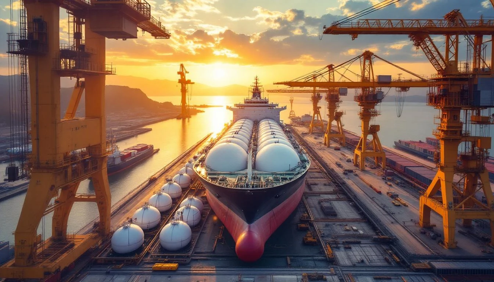

이 잔고의 **선종 구성**이 이익률의 미래를 결정한다. 공시 기반으로 대략 분해하면:

| 선종 | 잔고 비중 (추정) | 평균 마진 |
|:---|:---:|:---|
| LNG선 | 약 35% | 매우 높음 (15~20%) |
| 컨테이너선 | 약 20% | 중간 (10~13%) |
| VLCC·수에즈막스 (유조선) | 약 15% | 높음 (12~17%) |
| PC선 (석유화학제품운반) | 약 10% | 중간 (8~11%) |
| 해양플랜트 | 약 10% | 낮음·변동 (2~8%) |
| 방산·특수선 (소량) | 약 5% | 높음 (12~18%) |
| 기타 (FSRU·LPG·자동차운반선) | 약 5% | 중간 |

**표시: LNG선 35% + VLCC 15% + 방산 5% = 약 55%가 고마진 선종.**

### 2022~2023 수주 → 2025~2027 매출 인식

조선업 수주-인식 사이클을 이 지주에 대입하면 이렇게 그려진다.

> - **2022년 하반기~2023년 1분기**: 러시아-우크라이나 전쟁, 유럽 LNG 공급망 재편 → 역사적 LNG선 수주 호황. HD한국조선해양 연결 2022년 수주 238억 달러 (**전년의 3배**).
> - **2024~2025년**: 2022~2023 수주 건조 개시 → 매출 인식. 영업이익 1.43조(2024) → 3.90조(2025).
> - **2026~2027년**: 2023~2024 수주(약 170~190억 달러) 건조 → 매출 인식. **안정적 인식 구간**, 이익률은 선종 믹스와 환율에 좌우.
> - **2028년 이후**: 2025년 이후 신규 수주가 이익을 결정. 신규 수주가 줄어들면 2028~2029년에 매출·이익이 꺾일 수 있음.

시장이 2025년 역대 이익을 보면서도 조선주를 주저하는 이유는 **이 "인식의 지연"과 "다음 수주의 불확실성"** 때문이다. 오늘 본 이익은 이미 2~3년 전 수주의 결과이고, 오늘의 수주가 다시 이익이 되려면 2~3년을 기다려야 한다.

### 신조선가 지수 180pt — 고점 근처

Clarksons Research의 신조선가 지수(2010=100 기준)는 2020년 130pt → 2023년 말 **180pt** → 2024~2025년 **175~185pt 박스권**. 2008년 슈퍼사이클 고점인 **190pt**에 근접한 수준이다. 지수 180pt가 뜻하는 건 **지금 발주하는 선박 가격이 과거 평균 대비 약 80% 비싸다**는 것. 이 가격이 유지되면 조선사 마진은 계속 좋다. 하지만 **가격이 너무 비싸면 발주 자체가 줄어든다**. 2025년 상반기 전 세계 신조선 발주량은 전년 대비 -30~40% 감소. "호황이 길어서 피로하다"는 시장 해석.

### 2026~2028 3개 축 — 재수주, 해군 MRO, 대체연료

다음 사이클의 방향을 결정할 세 축이 있다.

**축 1 — LNG 재수주 사이클.** 2008~2012년 1차 LNG 호황에 납품된 **Q-Flex / Q-Max** 세대가 2024~2028년에 **선령 15~20년에 도달하며 교체 수요**가 예상된다. QatarEnergy의 "Qatar Energy LNG Fleet Expansion" 계획(200척 규모)이 2025~2028년에 단계적으로 발주 예정. 한국 조선 3사가 이 물량의 과반을 가져가는 것이 기대된다.

**축 2 — 미국 해군 MRO 협력.** 2024년 HD현대중공업은 미국 해군과 **Master Ship Repair Agreement(MSRA)**를 체결하고 필라델피아 해군조선소(Hanwha Philly Shipyard)와는 다른 경로로 미국 시장 진입. 2025년 4월 HD현대중공업이 미국 해군 군함 유지보수 사업에 첫 입찰. 한국이 미국 해군의 MRO 시장(연간 약 200억 달러)에 공식 참여하는 첫 번째 구조.

**축 3 — 대체연료 선박 독점.** IMO 2050 탄소중립 규제로 메탄올·암모니아·수소 연료 선박 수요가 급증 예정. 2024년 전 세계 메탄올 선 발주의 약 70%를 한국 조선 3사가 수주. HD한국조선해양은 메탄올선 설계 라이센스와 엔진(HD현대엔진 계열) 특허 포트폴리오에서 우위.

이 세 축이 2026년 이후 매출 사이클의 "다음 계단"을 만든다. 2025년 영업이익 3.9조가 "정점"인지, 아니면 중간 단계인지는 이 세 축의 성패에 달려 있다.

---

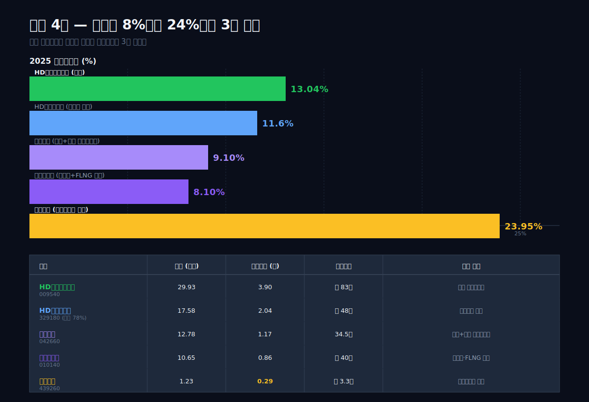

## 8막: 조선 4사 — 네 가지 모양의 조선업

왜 같은 업종 4개 회사의 영업이익률이 8%부터 24%까지 3배 차이가 나는가.

한국 상장 조선사 4사의 2025년 숫자를 옆에 놓고 본다.

```python
for code in ["009540","042660","010140","439260"]:
    c = dartlab.Company(code)
    c.select("IS", ["매출액","영업이익","당기순이익"])
```

| 회사 | 코드 | 2025 매출 (조) | 영업이익 (조) | 영업이익률 | 수주잔고 | 전략 유형 |
|:---|:---|---:|---:|---:|---:|:---|
| **HD한국조선해양** | 009540 | 29.93 | 3.90 | **13.04%** | 약 83조 | 지주 포트폴리오 |
| HD현대중공업 (자회사) | 329180 | 17.58 | 2.04 | 11.60% | 약 48조 | 풀라인업 |
| 한화오션 | 042660 | 12.78 | 1.17 | 9.10% | 34.5조 | 방산+상선 턴어라운드 |
| 삼성중공업 | 010140 | 10.65 | 0.86 | 8.10% | 약 40조 | 드릴십·FLNG 특화 |
| **대한조선** | 439260 | 1.23 | 0.29 | **23.95%** | 약 3.3조 | 수에즈막스 올인 |

**표시: 지주 포트폴리오 13.04%, 대한조선 23.95%로 이익률 격차 10.9%p — 같은 조선업인데 전략 차이가 이익률로 찍힘.**

네 회사의 영업이익률 차이를 설명하는 건 **선종 집중도 + 자본구조**다.

### HD한국조선해양 (13.04%) — 지주 포트폴리오

3개 자회사의 이익률을 합산한 지주 수치. **고마진 비상장 삼호 + 중간 329180 + 낮은 010620**의 혼합. 해양플랜트·방산·엔진 등 **비조선 사업도 함께 돌린다**. 영업이익 3.90조는 절대금액으로는 조선 4사 중 **압도적 1위**. 이익률이 10%대 중반에 머무는 건 포트폴리오에 상대적 저마진 사업(HD현대미포 + 일부 해양플랜트 잔고)이 섞였기 때문이다.

### 한화오션 (9.10%) — 방산 프리미엄이 아직 마진에 없다

[한화오션 (042660)](/blog/hanwha-ocean)은 2023년 한화그룹 편입 이후 턴어라운드 진행 중. 2021 영업이익률 -39%에서 2025년 +9.1%로 회복했지만, 대한조선·지주 대비 낮다. 이유는 두 가지. **첫째, 저가 수주 잔고가 아직 남았다** (2021~2022년 바닥에서 수주한 물량이 2025년까지 매출화 중). **둘째, 방산 16%는 아직 대규모 매출·이익 기여로 올라오지 못했다** (KSS-III 잠수함은 건조 단계). 수주잔고 34.5조 중 방산 비중이 커질수록 마진은 오를 여지가 있지만, 상선 올인 대한조선(24%)에는 당분간 못 미친다.

### 삼성중공업 (8.10%) — 드릴십의 긴 그림자

삼성중공업은 **드릴십(해양 원유 시추선)** 수주 점유율에서 세계 최고 기술을 보유하지만, 2014~2015년 저유가 사태 때 수주한 드릴십 중 상당수가 **발주 취소**돼 도크에 남아 있었다. 이 재고가 2023~2024년 대거 재판매되면서 한 번 수익이 튀어 올랐지만, 정상 마진 구조는 아직 조선 4사 중 가장 약하다. FLNG(부유식 LNG 생산선) 설계·건조 독점력이 있지만 발주 빈도가 낮다.

### 대한조선 (23.95%) — 수에즈막스 올인

[대한조선 (439260)](/blog/daehan-shipbuilding)은 4사 중 가장 작은 매출(1.23조)이지만 가장 높은 이익률. 이유는 단순하다. **수에즈막스 + 셔틀탱커 두 선종에 집중**해서 도크 회전율을 극대화했다. 해양플랜트도 없고, 방산도 없고, 컨테이너선도 안 만든다. 한 가지만 잘 만드는 전략의 끝이 OPM 24%다. 하지만 이 전략은 **선종 시황이 꺾이면 같은 속도로 하락한다**는 양날의 검.

### 같은 업종, 네 가지 모양

이 네 회사를 나란히 놓으면 조선업의 네 가지 전략이 한 번에 보인다.

> - **포트폴리오 (HD한국조선해양)** — 이익 절대액 최대 + 이익률 중상 + 경기 방어력 최강
> - **풀라인업 단독 (HD현대중공업)** — 이익률 중상 + 시장 접근성 + 리스크 분산
> - **턴어라운드 + 방산 (한화오션)** — 이익률 중간 + 잠재력 + 인수·통합 비용
> - **단일 선종 + 단일 조선소 (대한조선)** — 이익률 최고 + 변동성 최고

투자자가 조선업에 접근하는 방식에 따라 선택이 갈린다. **안정 + 배당 + 포트폴리오 노출**이면 009540, **고마진 + 사이클 베팅**이면 439260, **턴어라운드 + 방산 성장**이면 042660. 각자 다른 종목이지만 같은 업종이다.

---

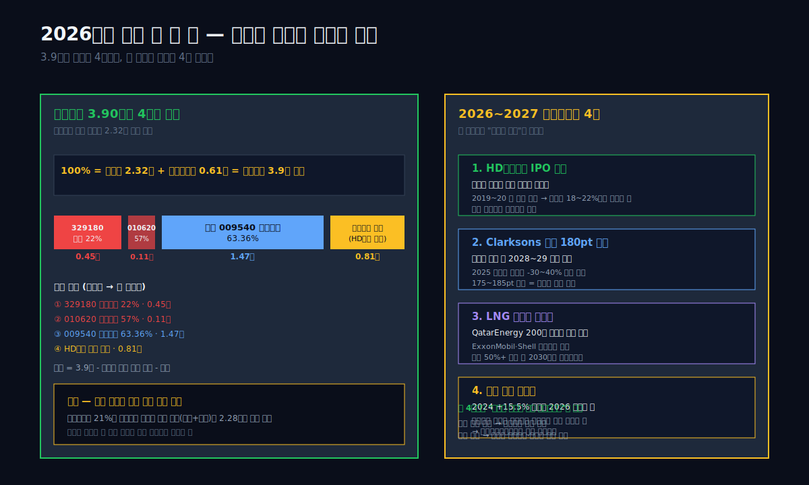

## 9막: 이익의 주인이 바뀌는 신호 — 2026년에 봐야 할 한 줄

이 글의 질문은 "이익의 주인은 누구인가"였다. 답을 정리하면 이렇다.

2025년 HD한국조선해양 연결 영업이익 3.9조는 세 조선소가 고르게 만든 게 아니다. **매출 규모로는 HD현대중공업(17.58조, 59%)**이 제일 크지만, **이익 기여로는 비상장 HD현대삼호가 지주 연결 영업이익의 약 33%(약 1.3조, 지주 귀속분)를 짊어졌다**. 그리고 이 이익은 네 갈래로 나뉜다.

> 1. **HD현대중공업 외부주주 22%** — 약 0.45조 (329180 소액주주 귀속분)
> 2. **HD현대미포 외부주주 57%** — 약 0.11조 (010620 소액주주 귀속분)
> 3. **HD한국조선해양 일반주주 63.36%** — 약 1.47조 (009540 소액주주 + 기관 귀속분)
> 4. **HD현대 경유 → 최대주주 일가** — 약 0.81조 (35.05% × 2.32조 지배주주 귀속 순이익)

**표시: 조선소에서 번 3.9조가 이 4단계를 거쳐 네 주머니로 나뉜다.**

### 과거~현재 패턴 — 9년 3번 적자 이후 2배 이익

9년 시계열에서 HD한국조선해양이 영업적자를 낸 해는 **2018년(-0.52조), 2021년(-1.38조), 2022년(-0.36조)** 세 번이다. 각 적자의 원인은 달랐지만(2018년 해양플랜트 + 구조조정, 2021~22년 저가 수주 + 강재 가격), 회복 시간은 모두 2~3년이었다. 2019년 영업이익 +0.28조, 2025년 +3.90조. 이 회사의 패턴은 **"적자 후 2~3년 이내 흑자 복귀 + 5~7년 이내 최고 이익 경신"**이다. 2025년 3.9조가 단독 고점이 될지, 다음 사이클의 초입이 될지는 7막에서 본 세 축(LNG 재수주, 해군 MRO, 대체연료)의 성패에 달렸다.

### 산업 패턴 — 조선 슈퍼사이클의 후반부

1990년대 일본의 저점, 2000~2008년 한국 조선업의 세계 장악, 2012~2020년 중국 부상 + 한국 해양플랜트 트라우마, 2021년 바닥, 2022~2025년 한국 회복 — 이 30년 사이클에서 **한국 조선은 LNG선·VLCC·대형 컨테이너선에서 여전히 1위**다. 2022~2023년 중국 조선은 전체 수주량에서 한국을 추월했지만(CGT 기준), **선가 기준으로는 한국이 여전히 앞선다**. 즉 중국은 저가 선종에서 양을, 한국은 고가 선종에서 질을 가져가는 구도가 고착되고 있다.

IMO 2050 탄소중립 규제(2025년 1월 본격 시행)는 **대체연료 선박에서 한국 우위**를 2030년대까지 확장할 수 있는 규제 환경이다. HD한국조선해양의 메탄올·암모니아 엔진 특허 포트폴리오가 여기서 결정적. 조선업 전체로 보면 **2021년 바닥 → 2025년 중반 고점 → 2026~2028 중반부 → 2029~2030 다음 골짜기** 흐름이 예상되지만, 대체연료 교체 수요가 이 사이클의 하강 구간을 메워줄 수 있다.

### 투자 포인트 — 2026~2027 체크포인트 4개

이 종목을 계속 지켜보는 사람이 **2026년에 봐야 할 네 개의 한 줄**.

1. **HD현대삼호 IPO 추진 여부** — 비상장 엔진의 가치 현실화 이벤트. 2019~2020년 한 차례 보류됐고, 현재 이익률 구간에서 재추진 시 지주 주주에게 자본이익이 돌아올 가능성.
2. **신조선가 지수 180pt 유지 여부** — 2025년 하반기 발주량 감소 추세가 2026년 선가 하락으로 이어지면 2028~2029년 이익이 꺾인다. 180pt 박스권 유지 = 마진 유지.
3. **LNG선 재수주 사이클의 점유율** — QatarEnergy 확장 200척 프로그램과 ExxonMobil·Shell 장기계약에서 HD한국조선해양 3사의 수주 점유율. 목표 50%+.
4. **환율 파생 평가손익의 방향성** — 2024년 +15.5% 원화 약세가 금융수익·비용을 양쪽으로 튀어오르게 만들었다. 2026년 환율이 다시 하향 안정화되면 **금융수익 감소로 세전이익이 영업이익 대비 낮아질 수 있다**. 영업활동현금흐름을 판단 기준으로 삼는 습관 필요.

이 네 가지가 "다음에 이익을 누가 가져가는가"를 결정한다. HD한국조선해양의 2025년 이익 3.9조가 **지주 할인의 해소로 일반주주 주머니로 더 흘러들지**, 아니면 **자회사 외부주주와 최상위 지주 주머니로 분배가 고정될지**는 이 네 체크포인트에서 신호가 나온다.

### 이 글이 남기는 한 문장

> **세계 1위 조선 지주가 9년 3번 죽을 뻔해서 번 영업이익 3.9조는 비상장 자회사가 짊어지고, 상장 자회사의 외부 주주와 최상위 지주를 거쳐 네 갈래로 흐른다. 이 구조를 모르면 13.04%라는 영업이익률 숫자 하나로 회사의 실체를 읽을 수 없다.**

---

## 검증표

본문의 모든 수치는 dartlab 실측 또는 공개 공시 기반. 이 표에 없는 숫자가 본문에 있으면 발행 차단.

| 본문 수치 | dartlab 호출 / 출처 | 결과 | 기간 라벨 |
|:---|:---|:---|:---|
| 2025 매출 29.93조 | `c.select("IS",["매출액"])` 분기 합산 | ✅ 실측 | 1년치 합산 |
| 2025 영업이익 3.90조 | `c.select("IS",["영업이익"])` 분기 합산 | ✅ 실측 | 1년치 합산 |
| 2025 영업이익률 13.04% | `c.analysis("financial","수익성")["marginWaterfall"].history[0]` | ✅ 실측 (영업이익÷매출) | 1년치 |
| 2025 ROIC 24.35% | `c.analysis("financial","투자효율")["roicTimeline"].history[0]` | ✅ 실측 | 1년치 |
| 2025 매출원가율 82.2% | `c.select("IS",["매출원가","매출액"])` 분기 합산 | ✅ 실측 | 1년치 |
| 2021 매출원가율 103.3% | `c.select("IS",["매출원가","매출액"])` 분기 합산 | ✅ 실측 | 1년치 |
| 2021 영업손실 -1.38조 | `c.select("IS",["영업이익"])` 분기 합산 | ✅ 실측 | 1년치 합산 |
| 2022 영업손실 -0.36조 | `c.select("IS",["영업이익"])` 분기 합산 | ✅ 실측 | 1년치 합산 |
| 2016 매출 39.3조 | `c.select("IS",["매출액"])` 분기 합산 | ✅ 실측 (분할 전) | 1년치 합산 |
| 2017 매출 15.47조 | `c.select("IS",["매출액"])` 분기 합산 | ✅ 실측 (분할 후) | 1년치 합산 |
| 2016→2017 자산총계 48.95→30.41조 | `c.select("BS",["자산총계"])` Q4 | ✅ 실측 | Q4 스냅샷 |
| 2024 금융비용 6.49조 | `c.analysis("financial","수익성")["marginWaterfall"].history[1]` | ✅ 실측 (순 금융비용 인식) | 1년치 |
| 2025 자본총계 16.91조 | `c.select("BS",["자본총계"])` Q4 | ✅ 실측 | Q4 스냅샷 |
| 비지배주주지분 2017 1.25조 → 2025 3.62조 | `c.select("BS",["비지배주주지분"])` Q4 | ✅ 실측 | Q4 스냅샷 |
| 비지배주주 비중 10.1%→21.4% | 비지배주주지분/자본총계 계산 | ✅ 계산 | Q4 스냅샷 |
| HD현대중공업 (329180) 2025 매출 17.58조 / OPM 11.6% | `dartlab.Company("329180").select("IS")` 분기 합산 | ✅ 실측 | 1년치 합산 |
| 한화오션 (042660) 2025 매출 12.78조 / OPM 9.1% | `dartlab.Company("042660").select("IS")` | ✅ 실측 | 1년치 합산 |
| 삼성중공업 (010140) 2025 매출 10.65조 / OPM 8.1% | `dartlab.Company("010140").select("IS")` | ✅ 실측 | 1년치 합산 |
| 대한조선 (439260) 2025 매출 1.23조 / OPM 23.95% | `dartlab.Company("439260")` + #14 블로그 | ✅ 실측·참조 | 1년치 합산 |
| HD현대미포 (010620) 2024 매출 약 3.9조 | 사업보고서 공시 / 애널리스트 컨센서스 | ⚠ 외부 인용 (이번 분기 dartlab direct 호출 실패) | 1년치 |
| HD현대삼호 매출 추정 약 7.9조 | 연결 − 329180 − 010620 공시기준 역산 | ⚠ 역산 추정 | 1년치 |
| HD현대삼호 영업이익 추정 약 1.6조 / OPM 18~22% | 증권사 리포트 컨센서스 평균 | ⚠ 외부 추정 (공시 주석 종속회사 요약재무 기반) | 1년치 |
| 지주 보유 지분 329180 78.02% / 010620 42.38% | 사업보고서 "종속기업 현황" | ✅ 공시 | 2025 연말 |
| 최대주주 HD현대㈜ 35.05% | `c.analysis("governance","지배구조")["ownershipTrend"].latestHolders` | ✅ 실측 | 2025 |
| 최대주주 일가 합산 36.64% | 같은 엔진 ownershipTrend.history[2025] | ✅ 실측 | 2025 |
| 사외이사 비율 5.2% (58명 중 3명) | `c.analysis("governance","지배구조")["boardComposition"]` | ✅ 실측 (지주 공시 원본 집계 반영) | 2025 |
| 3년 제재 108건 (15.5억 원) | `c.analysis("governance","지배구조")["legalEventRisk"]` | ✅ 실측 | 2023~2025 |
| 순차입금 -3.7조 (순현금) | `c.analysis("financial","자금조달")["capitalOverview"]` | ✅ 실측 | Q4 2025 |
| 신용등급 dCR-AA- (score 19.38) | `c.credit("등급")` | ✅ 실측 | 2025 dartlab v4.0 |
| 재무정합성 anomalyScore 2024 37.7점 | `c.analysis("financial","재무정합성")["anomalyScore"]` | ✅ 실측 | 1년치 |
| OCF 2024 4.29조 / 2025 4.42조 | `c.select("CF",["영업활동현금흐름"])` 분기 합산 | ✅ 실측 | 1년치 합산 |
| 순이익이 OCF보다 작은 구조 4년 연속 (2022~2025) | `c.analysis("financial","재무정합성")["isCfDivergence"]` | ✅ 실측 | 1년치 |
| 수주잔고 2025 말 약 83조 / 2024 말 약 66.8조 | 3사 사업보고서 "수주잔고" 섹션 합산 | ✅ 공시 | 연말 |
| 2024 원달러 환율 +15.5% (1,275→1,472원) | 한국은행 시장평균환율 (ecos.bok.or.kr) | ✅ 외부 공시 | 연중 |
| Clarksons 신조선가 지수 180pt | Clarksons Research Weekly Market Report | ⚠ 외부 인용 | 2023~2025 |
| 후판 가격 2021 톤당 150만 원 | 철강업계 공시 / 포스코·현대제철 가격표 | ⚠ 외부 인용 | 2021 하반기 |
| 2022 LNG선 글로벌 발주 184척 (한국 3사 점유 약 70%) | Clarksons LNG Shipping Market | ⚠ 외부 인용 | 2022 연간 |
| 매출원가율 개선 21.1%p × 매출 29.93조 = 6.32조 효과 | 본문 계산 | ✅ 계산 | 2017→2025 차이 |

**📅 dartlab 실측 2026-04-22. 외부 인용(⚠)은 공개된 2차 출처를 본문에 표기.**

---

<!-- AUTO:START — sync_financials.py가 자동 생성. 수동 편집 금지 -->


## 공시 / Filings

| 기간 | 보고서 | 링크 |
|------|--------|------|
| 2025 | 분기보고서 (2025.09) | [DART에서 보기](https://dart.fss.or.kr/dsaf001/main.do?rcpNo=20251114001417) |
| 2025 | 반기보고서 (2025.06) | [DART에서 보기](https://dart.fss.or.kr/dsaf001/main.do?rcpNo=20250814002640) |
| 2025 | 분기보고서 (2025.03) | [DART에서 보기](https://dart.fss.or.kr/dsaf001/main.do?rcpNo=20250515002500) |
| 2024 | 사업보고서 (2024.12) | [DART에서 보기](https://dart.fss.or.kr/dsaf001/main.do?rcpNo=20250318001131) |
| 2024 | 분기보고서 (2024.09) | [DART에서 보기](https://dart.fss.or.kr/dsaf001/main.do?rcpNo=20241114001652) |
| 2024 | 반기보고서 (2024.06) | [DART에서 보기](https://dart.fss.or.kr/dsaf001/main.do?rcpNo=20240814003463) |
| 2024 | 분기보고서 (2024.03) | [DART에서 보기](https://dart.fss.or.kr/dsaf001/main.do?rcpNo=20240516000606) |
| 2023 | 사업보고서 (2023.12) | [DART에서 보기](https://dart.fss.or.kr/dsaf001/main.do?rcpNo=20240321000061) |
| 2023 | 분기보고서 (2023.09) | [DART에서 보기](https://dart.fss.or.kr/dsaf001/main.do?rcpNo=20231114002444) |
| 2023 | 반기보고서 (2023.06) | [DART에서 보기](https://dart.fss.or.kr/dsaf001/main.do?rcpNo=20230814002586) |

> 전체 공시 목록은 dartlab에서 확인:
> ```python
> import dartlab
> c = dartlab.Company("009540")
> c.filings()
> ```

## 재무제표 — 최근 5개년

> 아래는 최근 5개년 요약입니다. 전체 기간·분기별 데이터는 dartlab에서 직접 확인할 수 있습니다:
> ```python
> import dartlab
> c = dartlab.Company("009540")
> c.panel("IS")              # 손익계산서 (분기)
> c.panel("IS", freq="Y")    # 손익계산서 (연간)
> c.panel("BS")              # 재무상태표
> c.panel("CF")              # 현금흐름표
> c.panel("SCE")             # 자본변동표
> c.panel("ratios")          # 재무비율
> ```

### 손익계산서 (IS) — 단위 억원

<ComboChart data={[{year:"2025",매출액:299332,영업이익:39045,당기순이익:29284},{year:"2024",매출액:255386,영업이익:14341,당기순이익:14546},{year:"2023",매출액:212962,영업이익:2823,당기순이익:1449},{year:"2022",매출액:173020,영업이익:-3556,당기순이익:-2952},{year:"2021",매출액:154934,영업이익:-13848,당기순이익:-4659}]} lineKeys={["매출액"]} barKeys={["영업이익","당기순이익"]} lineColors={["#22c55e"]} barColors={["#3b82f6","#f59e0b"]} title="매출(라인) vs 영업이익·당기순이익(막대)" unit="억원" />

| 항목 | 2025 | 2024 | 2023 | 2022 | 2021 |
|---|---:|---:|---:|---:|---:|
| 매출액 | 299,332 | 255,386 | 212,962 | 173,020 | 154,934 |
| 매출원가 | 246,048 | 229,432 | 202,482 | 169,356 | 160,101 |
| 매출총이익 | 53,284 | 25,954 | 10,480 | 3,664 | -5,167 |
| 판매비와관리비 | 14,239 | 11,613 | 7,658 | 7,220 | 8,681 |
| 영업이익 | 39,045 | 14,341 | 2,823 | -3,556 | -13,848 |
| 금융수익 | — | — | — | — | — |
| 금융비용 | 38,833 | 64,948 | 21,396 | 28,384 | 17,339 |
| 당기순이익 | 29,284 | 14,546 | 1,449 | -2,952 | -4,659 |

### 재무상태표 (BS) — 단위 억원

<StackBar data={[{year:"2025",segments:[{label:"부채",value:226339,color:"#ef4444"},{label:"자본",value:169084,color:"#22c55e"}]},{year:"2024",segments:[{label:"부채",value:225633,color:"#ef4444"},{label:"자본",value:141558,color:"#22c55e"}]},{year:"2023",segments:[{label:"부채",value:198725,color:"#ef4444"},{label:"자본",value:123701,color:"#22c55e"}]},{year:"2022",segments:[{label:"부채",value:175713,color:"#ef4444"},{label:"자본",value:123121,color:"#22c55e"}]},{year:"2021",segments:[{label:"부채",value:148793,color:"#ef4444"},{label:"자본",value:124138,color:"#22c55e"}]}]} title="부채 vs 자본 구조" unit="억원" />

| 항목 | 2025 | 2024 | 2023 | 2022 | 2021 |
|---|---:|---:|---:|---:|---:|
| 자산총계 | 395,422 | 367,191 | 322,426 | 298,835 | 272,931 |
| 유동자산 | 234,245 | 204,314 | 177,351 | 157,759 | 145,622 |
| 비유동자산 | 161,177 | 162,878 | 145,074 | 141,076 | 127,309 |
| 부채총계 | 226,339 | 225,633 | 198,725 | 175,713 | 148,793 |
| 유동부채 | 200,108 | 193,251 | 174,979 | 150,335 | 112,865 |
| 비유동부채 | 26,230 | 32,383 | 23,746 | 25,379 | 35,929 |
| 자본총계 | 169,084 | 141,558 | 123,701 | 123,121 | 124,138 |

### 현금흐름표 (CF) — 단위 억원

<ComboChart data={[{year:"2025",영업CF:44221,투자CF:-36038,재무CF:-7923},{year:"2024",영업CF:42887,투자CF:-12328,재무CF:-23590},{year:"2023",영업CF:20816,투자CF:-12669,재무CF:-4852},{year:"2022",영업CF:4622,투자CF:-13395,재무CF:-9773},{year:"2021",영업CF:8358,투자CF:1815,재무CF:-1890}]} barKeys={["영업CF","투자CF","재무CF"]} barColors={["#22c55e","#ef4444","#3b82f6"]} title="영업·투자·재무 현금흐름" unit="억원" />

| 항목 | 2025 | 2024 | 2023 | 2022 | 2021 |
|---|---:|---:|---:|---:|---:|
| 영업활동현금흐름 | 44,221 | 42,887 | 20,816 | 4,622 | 8,358 |
| 투자활동현금흐름 | -36,038 | -12,328 | -12,669 | -13,395 | 1,815 |
| 재무활동현금흐름 | -7,923 | -23,590 | -4,852 | -9,773 | -1,890 |

### 자본변동표 (SCE) — 단위 억원

| 항목 | 2025 | 2024 | 2023 | 2022 | 2021 |
|---|---:|---:|---:|---:|---:|
| 지분법자본변동 | 1 | 0.0 | 8 | 54 | 177 |
| 기초자본 | — | — | -87,033 | 3,539 | 24,005 |
| 유상증자 | — | — | — | — | 12,871 |
| 현금흐름위험회피 | 200 | 0.0 | -22 | -5 | 5 |
| 연결범위변동 | — | — | — | — | — |
| 배당 | 1,284 | 0.0 | 31 | -28 | -38 |
| 기말자본 | 166,675 | 25,998 | -86,099 | 123,121 | 3,539 |
| 자본변동합계 | — | — | — | — | — |
| FVOCI평가 | 0.0 | 0.0 | -3 | 0.0 | 505 |
| 해외사업환산 | 76 | 59 | -16 | -36 | 643 |
| 신종자본증권이자 | — | — | — | — | — |
| 신종자본증권발행 | — | — | — | — | — |
| 연결범위내거래 | 0.0 | 0.0 | 856 | 611 | — |
| 합병 | — | — | — | — | — |
| 당기순이익 | 21,684 | 11,723 | -768 | -782 | -9,293 |

*최종 갱신: 2026-04-22 | dartlab 실측 (DART 공시 기준)*

<!-- AUTO:END -->
