<script>
	import CompanyFinancials from '$lib/components/blog/CompanyFinancials.svelte';
import HFDataLink from '$lib/components/blog/HFDataLink.svelte';
</script>

> **사이클** | 소재 > 이차전지 | 2026-04-22 dartlab 실측
> 같은 시리즈: [에코프로](/blog/086520-ecopro) · [HD한국조선해양](/blog/009540-hd-ksoe) · [한화에어로스페이스](/blog/012450-hanwha-aerospace) · [알테오젠](/blog/196170-alteogen) · [기업이야기 시리즈 전체](/blog/series/company-reports)

<HFDataLink code="006400" />

삼성SDI(006400)는 삼성그룹의 이차전지·전자재료 사업회사다. 전기차(EV) 배터리로 전 세계 상위 5위 안에 들고, 소형전지(노트북·전동공구)에서는 세계 1위를 달린다. 2022년 매출 20.12조 영업이익 1.81조 **사상 최대**, 2023년 매출 22.71조 영업이익 1.63조로 2년 연속 정점. 이 회사는 한국 배터리 산업이 "글로벌 탄소중립"이라는 거대한 파도에 탑승한 대표 수혜주였다.

그런데 dartlab으로 9년치 재무제표를 열면 이상한 게 보인다. 2023년 영업이익 **1조 6,334억**, 2024년 **4,209억(-74%)**, 그리고 **2025년 영업손실 -1조 7,224억** — 적자 전환. 2년 전 최대였던 이익이 2년 만에 반대 방향 최대 적자로 돌아섰다. **이익 기준으로만 3조 3,558억의 반전**이 일어났다. 매출은 같은 기간 22.71조에서 13.27조로 **9.44조(-41%)** 축소. 매출이 -41% 줄어들면 이익은 보통 0 근처에서 머무는데, 이 회사는 -12.98% 영업이익률까지 떨어졌다.

한 가지 더. 같은 업황 · 같은 전기차 수요 둔화를 맞았는데 **LG에너지솔루션(373220)은 2025년 OPM +5.69%**로 흑자를 지켰다. 에코프로BM(247540)도 +5.66%, 포스코퓨처엠(003670)도 +1.12%로 얇지만 흑자. **삼성SDI만 -12.98%로 대규모 적자**다. 같은 산업의 공통 악재를 다른 회사는 어떻게 버텼고, 이 회사는 왜 못 버텼는가.

이 글은 9년치 재무제표로 이 질문에 답한다. **2년 만의 3.3조 이익 스윙**, **CAPEX 6.27조 피크의 정체**, **재고 2.94조의 의미**, **판관비 26% 급등의 내막**, 그리고 **LG엔솔과의 갈라진 길**. 읽고 나면 이 회사의 2025년 숫자가 "경영 실패"가 아니라 "산업 사이클에서 포지션 선택의 결과"라는 것, 그리고 2026년 이후 이 회사가 어느 신호를 봐야 바닥을 확인할 수 있는지가 보인다.

---

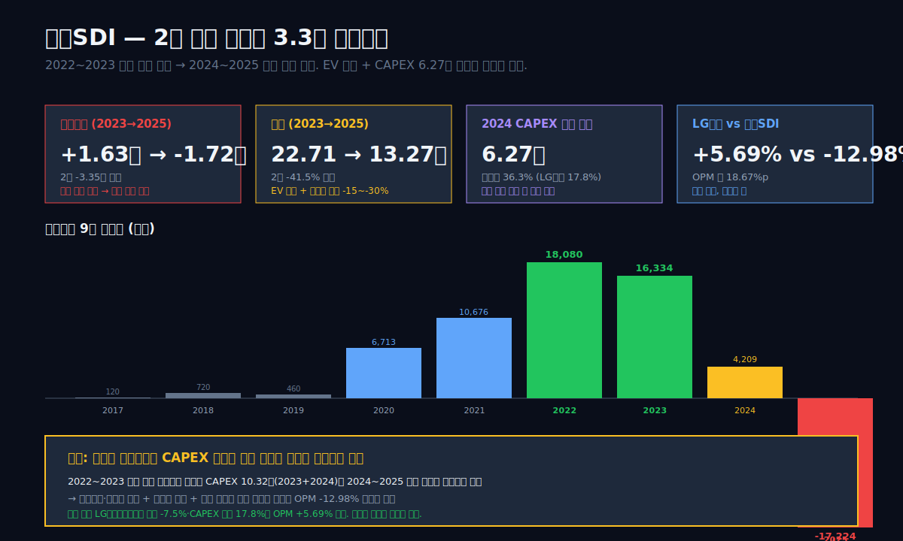

## 1막: 2년 만에 이익이 3.3조 반전됐다

왜 같은 회사에서 2년 만에 이익이 최대에서 최대 적자로 뒤집혔는가.

재무제표에서 이런 V자 또는 뒤집힌 V자를 만드는 회사는 두 가지 조건을 동시에 갖춘다. **첫째, 단일 산업에 거의 전부를 걸었다.** 삼성SDI 2025년 매출 13.27조 중 약 80%가 EV 배터리(자동차용)에서 나온다. 소형전지·전자재료는 나머지 20%를 채우는 보완 사업이다. 이 구조에서 EV 업황이 흔들리면 회사 전체가 흔들린다. **둘째, 사이클의 꼭짓점에서 CAPEX를 최대로 때렸다.** 2024년 유형자산 취득 6.27조는 삼성SDI 역사상 사상 최대. 그런데 이 해는 EV 수요가 이미 꺾이기 시작한 해다. 투자한 설비의 감가상각이 2025년부터 원가에 본격 반영되기 시작하는데 매출은 빠지고 있는 구조.

### 9년 시계열 — 최대 이익에서 최대 적자까지

```python
import dartlab
c = dartlab.Company("006400")
c.select("IS", ["매출액","매출원가","매출총이익","판매비와관리비","영업이익","당기순이익"])
```

| 항목 (1년치 합산, 조원) | 2025 | 2024 | 2023 | 2022 | 2021 | 2020 | 2019 | 2018 | 2017 |
|:---|---:|---:|---:|---:|---:|---:|---:|---:|---:|
| 매출액 | **13.27** | 17.27 | 22.71 | **20.12** | 13.55 | 11.29 | 10.10 | 9.16 | 6.32 |
| 매출원가 | 11.81 | 14.07 | 18.73 | 15.90 | 10.48 | 8.91 | 7.88 | 7.12 | 5.15 |
| 매출총이익 | 1.46 | 3.21 | 3.98 | **4.22** | 3.08 | 2.38 | 2.22 | 2.04 | 1.17 |
| 판매비와관리비 | 3.46 | 2.87 | 2.35 | 2.41 | 2.01 | 1.71 | 1.75 | 1.33 | 1.05 |
| 영업이익 | **-1.72** | 0.42 | 1.63 | **1.81** | 1.07 | 0.67 | 0.46 | 0.72 | 0.12 |
| 당기순이익 | **-0.58** | 0.58 | 2.07 | 2.04 | 1.25 | 0.63 | 0.40 | 0.75 | 0.64 |

**표시: 2023→2025 매출 22.71→13.27조(-41.5%), 영업이익 +1.63조 → -1.72조 (3.35조 반전).**

이 표의 첫 충격은 2025년 판관비다. 3조 4,593억. 매출 13.27조 대비 **판관비율 26.07%**. 2022년 같은 판관비율은 11.99%였다. 매출이 줄어드는 중에도 판관비 절대금액은 오히려 1조 466억(+43%) 증가했다. 이 갭이 3막부터 5막까지의 주된 해부 대상이다.

두 번째 충격은 2025년 매출원가율 88.98%다. 2022년 79.03%에서 10%p 급등. 가동률이 떨어진 설비의 고정비(인건비·감가상각)가 매출에 그대로 실리면서 제조원가가 빠르게 오른 결과. 그리고 **매출총이익률 11.02%**로 9년 최저치를 찍었다.

### OPM 궤적 — 9%에서 -13%로 22%p 하락

```python
c.analysis("financial", "수익성")
# roicTree.history, marginWaterfall.history
```

| 연도 | 매출 (조) | 매출총이익률 | 판관비율 | **영업이익률** |
|:---|---:|---:|---:|---:|
| 2020 | 11.29 | 21.08% | 15.14% | 5.94% |
| 2021 | 13.55 | 22.71% | 14.83% | 7.88% |
| 2022 | 20.12 | 20.97% | 11.99% | **8.98%** |
| 2023 | 22.71 | 17.54% | 10.34% | 7.19% |
| 2024 | 17.27 | 18.56% | 16.64% | **2.44%** |
| 2025 | 13.27 | 11.02% | 26.07% | **-12.98%** |

**표시: 2022 OPM 8.98% (9년 최고) → 2025 -12.98% (9년 최저). 3년 만에 -21.96%p.**

OPM이 9%에서 -13%로 떨어지는 데 3년이 걸렸다. 1년(2022→2023): -1.79%p. 다음 1년(2023→2024): -4.75%p. 그 다음 1년(2024→2025): **-15.42%p**. 감소 속도 자체가 가속됐다. 이건 "천천히 식어간 회사"가 아니라 "눈사태가 1년 만에 터진 회사"다.

### 같은 업종, 다른 결과 — 피어 5사 2025 OPM

```python
for code in ["373220", "006400", "247540", "003670", "051910"]:
    c = dartlab.Company(code)
    c.select("IS", ["매출액","영업이익"])
```

| 회사 | 코드 | 2025 매출 (조) | 2025 영업이익 (조) | **OPM** | 사업 포지션 |
|:---|:---|---:|---:|---:|:---|
| LG에너지솔루션 | 373220 | 23.67 | 1.35 | **+5.69%** | EV 배터리 독립 사업 (LG화학 분사) |
| **삼성SDI** | 006400 | 13.27 | **-1.72** | **-12.98%** | EV 배터리 + 소형전지 + 전자재료 |
| 에코프로BM | 247540 | 2.53 | 0.14 | +5.66% | 양극재 소재 1위 |
| 포스코퓨처엠 | 003670 | 2.94 | 0.03 | +1.12% | 양극재·음극재 통합 |
| LG화학 | 051910 | 45.98 | 1.19 | +2.59% | 석유화학 + LG엔솔 78% 보유 |

**표시: 같은 산업 5사 중 삼성SDI만 -12.98% 대규모 적자. LG엔솔은 +5.69%로 흑자 방어.**

이 표가 이 글의 핵심 질문이다. 전기차 수요 둔화는 업계 모두가 맞았는데 왜 **삼성SDI만 -13%**인가. LG엔솔은 어떻게 +5.69%로 지켰는가. 세 가지 원인이 교차한다 — **고객 포트폴리오 차이(GM·포드·BMW), CAPEX 피크 타이밍 차이, 원가구조 차이**. 7막에서 구체적으로 분해한다.

### 9막에서 답할 질문들

이 글은 9막으로 전개된다. 2막은 **삼성SDI 55년 역사** (진공관 1970 → TV 브라운관 → LCD → 리튬이온배터리 1994). 3막은 **2020~2023 황금기** (매출 11.29→22.71조 2배, OPM 5.94%→8.98%). 4막은 **2024 전환점** — EV 판매 둔화가 매출에 찍힌 방식. 5막은 **2025 적자의 정체** — GPM 11% · 판관비 26% · 금융비용 1.05조. 6막은 **CAPEX 6.27조 피크** — 헝가리·말레이시아·애리조나 타이밍. 7막은 **LG엔솔 vs 삼성SDI** — 같은 산업 갈라진 길. 8막은 **credit dCR-A 부정적 전망** — 이자비용 6배 증가의 그림자. 9막은 **2026 체크포인트** + 2년 바닥 확인 조건 + 닫힘.

관통선은 하나다. **2년 만에 이익이 3.3조 반전된 이 회사가 다시 흑자로 돌아가려면 무엇이 필요한가.**

---

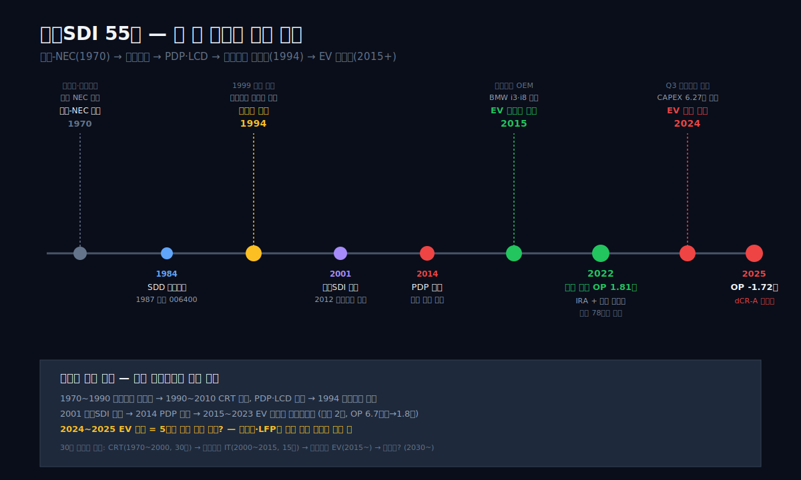

## 2막: 삼성SDI 55년 — 진공관에서 배터리까지의 네 번 변신

왜 1970년 창업한 회사가 50년 넘어 전기차 배터리 1위에 섰는가.

삼성SDI의 역사는 **디스플레이·전자재료 사업의 네 번 변신**이다. 1970년 설립 당시 이름은 **"삼성-NEC"** — 삼성과 일본 NEC의 합작으로 세워진 진공관·브라운관 제조사. 기업 성격은 지금과 전혀 다른 "아날로그 디스플레이 부품" 회사였다.

### 1970~1990: 브라운관의 전성기

1970년대 TV의 핵심 부품은 **CRT(Cathode Ray Tube, 브라운관)**였다. 삼성-NEC는 1974년 브라운관 생산을 시작하며 한국 TV 부품 산업의 기반을 만들었다. 1984년 **삼성디스플레이디바이스(Samsung Display Devices)**로 이름 변경, 1987년 종목 상장 — 이때 종목코드 **006400**을 받았다. 1990년대 한국 TV 수출 전성기와 함께 매출이 크게 늘었다.

문제는 이 시기가 CRT의 **마지막 전성기**였다는 점. 1990년대 후반부터 LCD가 본격 확산되면서 CRT는 급격히 사라져갔다. 2000년경 삼성디스플레이디바이스는 "잉어 같은 공장"(CRT 생산라인 대규모)을 들고 있었고, 이 설비가 없어지는 산업의 상징이 되기 시작했다.

### 1994년의 결정적 베팅 — 리튬이온 배터리 착수

회사의 운명을 바꾼 결정이 **1994년**에 내려졌다. 경영진은 "CRT 이후 무엇을 만들까"를 두고 세 가지 카드를 놓고 있었다. PDP(플라즈마 디스플레이), LCD 부품, 그리고 **리튬이온 2차전지**. 당시 리튬이온 배터리는 일본(소니·산요)이 시장을 지배하고 있었고, 한국 기업이 진입한 전례가 없었다.

삼성은 세 카드 모두에 투자했다. PDP 1995, LCD 부품 1996, 그리고 **리튬이온 배터리 파일럿 생산 1994, 양산 1999**. 1999년 천안 공장에서 노트북·휴대폰용 배터리를 처음 양산했고, 2000년부터 시장 진입 본격화. 초기에는 소형 IT 배터리(노트북·휴대폰·MP3)가 주력이었고, 자동차용 배터리는 2005년경부터 개발 시작.

### 2001~2014: 삼성SDI로의 변신

2001년 회사명을 **"삼성SDI"**로 변경. "SDI"는 Samsung Digital Interface의 약어였다(공식 해석은 Samsung Digital Industry). 이 시점부터 회사의 정체성이 "디스플레이 부품"에서 "에너지·디지털 소재"로 전환된다. 2005~2008년 PDP 사업의 쇠퇴, 2012년 이차전지 사업부문의 **제일모직과 합병** (소재 포트폴리오 확장), 2014년 PDP 사업 완전 종료.

2014년 종결된 **"삼성SDI 4번째 변신"**의 결과는 이렇다 — 사업 구조는 **이차전지 60% + 전자재료(반도체·디스플레이용 소재) 40%**. 매출 5조대, 영업이익 1천억대. 당시 삼성그룹 내에서도 "계륵" 취급을 받던 시절이다. 삼성전자·삼성물산·삼성생명이 그룹의 기둥이었고, 삼성SDI는 "언젠가 쓰임새가 생길 소재 자회사"였다.

### 2015~2019: EV 배터리 시장 진입

2015년부터 글로벌 EV 시장이 본격적으로 움직이기 시작했다. 삼성SDI는 이미 2005년부터 자동차용 배터리를 개발해왔고, 2015년 **BMW i3·i8**에 Gen.2 배터리를 공급하며 프리미엄 EV 배터리 공급자로 자리 잡았다. 2017년 **포드·피아트·크라이슬러**에 배터리 공급 시작, 2018년 **스텔란티스(당시 FCA)** 계약 체결.

2015~2019 5년간 매출 6조→10조, 영업이익 -0.6조(2016년 갤럭시노트7 리콜 사태 영향) → 0.46조. 회사의 정체성이 이 5년 동안 **"디스플레이 부품사"에서 "EV 배터리 공급사"로 완전히 전환**됐다. 소형전지는 안정적 캐시카우로 남아 있었지만, 회사의 미래 성장 엔진은 명확히 EV 배터리였다.

### 2020~2023: 탄소중립 황금기

2020년 유럽 그린딜, 2021년 미국 인플레이션감축법(IRA) 논의, 2022년 러우 전쟁 이후 에너지 전환 가속 — 이 매크로 3연타가 **EV 배터리 황금기**를 만들었다. 삼성SDI 매출은 2020년 11.29조 → 2023년 22.71조로 **4년 만에 2배**. 영업이익은 같은 기간 6,713억 → 1조 6,334억으로 **2.4배**. OPM 5.94% → 7.19%.

2022년에는 역대 최대 이익 1.81조 (OPM 8.98%), 2023년에는 역대 최대 매출 22.71조. 이 회사가 삼성그룹 계열사 중에서 "가장 빠른 속도로 성장하는 중심축" 지위를 공식적으로 차지한 시기다. 2023년 주가는 8월 한때 **782,000원**까지 치솟아 시가총액 **약 55조** 찍었다. 지금 기준(2026년 4월) 주가의 약 **2.8배** 수준.

---

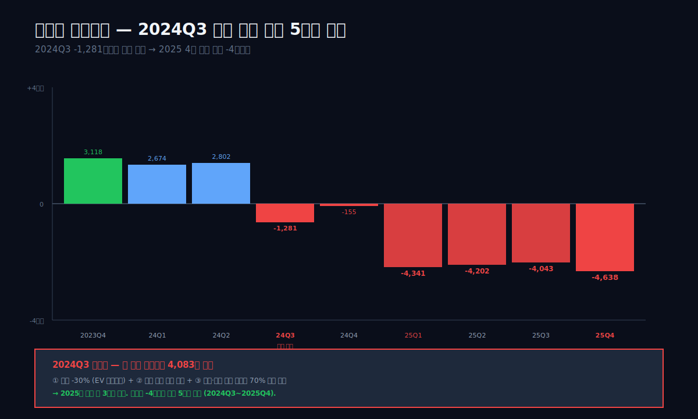

## 3막: 2020~2023 황금기 — 4년 만에 매출 2배, 이익 2.4배

왜 2022~2023년에 삼성SDI는 사상 최대 이익을 찍었는가.

2020~2023 4년은 글로벌 배터리 산업 전체의 **슈퍼사이클**이었다. 유럽 EV 보조금 확대, 미국 IRA 시행(2022.8), 테슬라 Gigafactory 확장, 중국 CATL·BYD의 공격적 증설. 이 사이클의 세 가지 요소가 삼성SDI의 이익을 끌어올렸다.

### 요소 1 — EV 매출 급증

삼성SDI의 사업부문은 공시 기준으로 "에너지솔루션"(EV·ESS 배터리)와 "전자재료"(반도체·디스플레이용 소재) 두 부문이다. 이 중 **에너지솔루션 비중이 2020년 약 70% → 2023년 약 80%**로 확대됐다.

| 연도 | 전체 매출 (조) | 에너지솔루션 매출 추정 (조) | 비중 | 증감 |
|:---|---:|---:|---:|---:|
| 2020 | 11.29 | 약 7.9 | 70% | +30% |
| 2021 | 13.55 | 약 10.0 | 74% | +27% |
| 2022 | 20.12 | 약 15.3 | 76% | +53% |
| 2023 | 22.71 | 약 18.2 | 80% | +19% |
| 2024 | 17.27 | 약 13.5 | 78% | -26% |
| 2025 | 13.27 | 약 10.2 | 77% | -24% |

**표시: 에너지솔루션 2020 7.9조 → 2023 18.2조 (2.3배). 전자재료는 3.4→4.5조로 1.3배.**

이 급성장의 배경에는 **고객 포트폴리오 확대**가 있었다. BMW·포드·스텔란티스에 더해 2022년 **폴스타·리비안**, 2023년 **Rivian·Amazon 상용밴**까지 공급 시작. 특히 BMW는 삼성SDI의 초기·핵심 고객으로 2020년대 내내 가장 안정적인 매출원 역할을 했다.

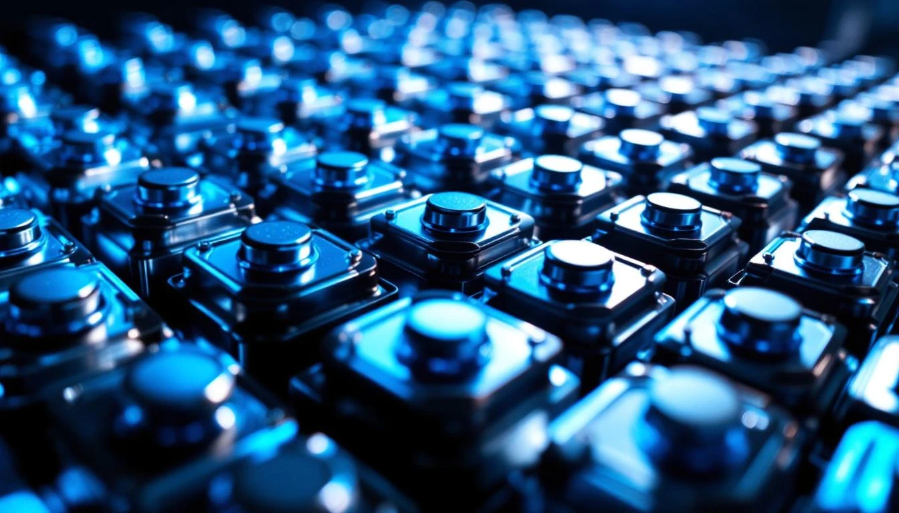

### 요소 2 — 원가·가동률 호조

급성장기에는 고정비가 매출 증가에 거의 얹히지 않는다. 공장 가동률이 90%+에서 풀가동 가까이 돌아가면서 **단위 당 제조원가가 빠르게 개선**되기 때문이다. 2020년 매출원가율 78.92% → 2022년 79.03%. 큰 변화 없어 보이지만 **절대 매출이 2배**가 됐으니 매출총이익이 2.38조 → 4.22조로 1.77배 뛰었다.

동시에 리튬·니켈·코발트 같은 양극재 원소재 가격이 2021~2022년 **역대 최고**를 찍으면서 배터리 가격 자체가 상승했다. 원소재 상승분을 고객사에 전가(pass-through)할 수 있는 장기 계약 조항이 있었기 때문에, 원가 상승이 매출 증가로 전이되는 구조였다. 이게 2022년 매출 +48%(13.55→20.12조)의 상당 부분을 설명한다.

### 요소 3 — 판관비율 축소

매출이 빠르게 늘어나는 동안 판관비 절대금액은 완만하게 늘었다. 2020년 1.71조 → 2022년 2.41조 (+41%). 매출 증가율 +78%에 비해 훨씬 느렸다. 결과로 **판관비율이 15.14% → 11.99%로 3.15%p 하락**. 이 효과만으로 영업이익에 +6천억 기여.

이 셋을 합하면 2022년 영업이익 1.81조의 근거가 나온다. **매출 2배 + 원가 전가 + 판관비 희석** — 세 가지가 동시에 작동한 희귀한 조합이었다. 그리고 이 조합이 사라지면 이익도 같은 속도로 사라진다. 그게 바로 2024~2025년에 벌어진 일이다.

### 황금기의 그림자 — 사상 최대 CAPEX 예고

이 황금기에 삼성SDI는 "다음 사이클에 대비"라는 명분으로 CAPEX를 크게 늘리기 시작했다. 2020년 유형자산 취득 1.73조, 2021년 2.25조, 2022년 2.81조, 2023년 **4.05조**. 3년 만에 **2.3배**로 증가. 이 CAPEX는 주로 유럽(헝가리 2공장 증설) · 북미(미국 애리조나 신공장 착공) · 말레이시아 21700 원통형 배터리 확장에 투입됐다.

CAPEX 결정은 통상 3~5년 앞의 수요를 예측해서 내린다. 2022년 시점에서 유럽·미국 EV 판매 급증, IRA 보조금 확대, 중국 CATL 대비 경쟁력 강화 등이 밝은 전망의 근거였다. 그래서 2023년 CAPEX 4.05조, **2024년 CAPEX 6.27조(사상 최대)**를 결정했다. 이 결정이 황금기에 내려졌다는 게 포인트다. 수요가 꺾이기 시작한 해는 2024년이었지만 그 해의 CAPEX 집행은 이미 2022~2023년에 약속된 것이었다.

---

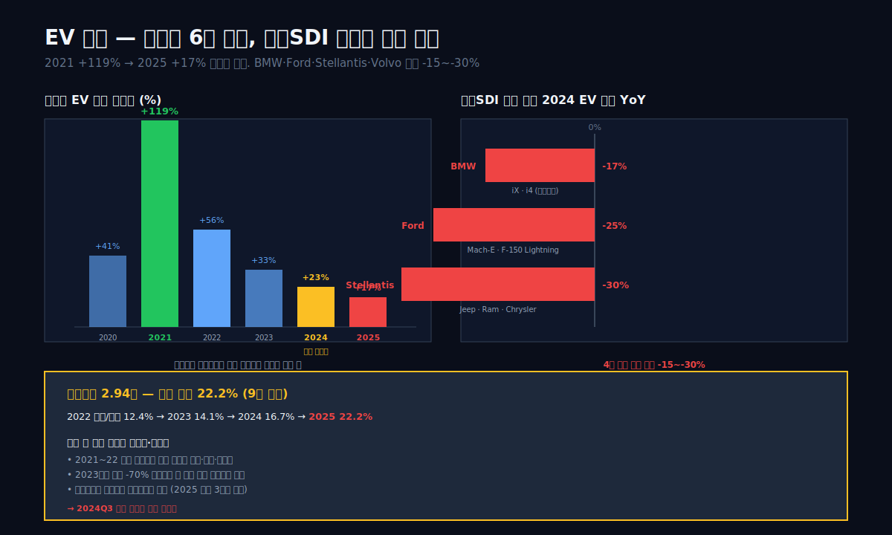

## 4막: 2024 전환점 — EV 캐즘(Chasm)이 찍힌 재무제표

왜 2024년에 삼성SDI 매출이 -24%로 꺾였는가.

2024년은 글로벌 EV 시장에 **"캐즘(Chasm)"**이라는 용어가 본격 등장한 해다. 기술 수용 이론에서 **"얼리어답터(초기 수용층, 약 15%)"와 "얼리 마조리티(초기 다수, 약 35%)" 사이의 수용 장벽**을 의미하는 이 단어가 EV에 그대로 적용됐다. 요약하면 — 얼리어답터는 2019~2022년에 이미 EV를 샀고, 얼리 마조리티는 EV를 사기를 주저하고 있다.

### 글로벌 EV 판매 둔화 — 2024년 전환점

2023~2024년 글로벌 EV 판매 증가율은 다음과 같았다 (IEA Global EV Outlook 기준).

| 연도 | 글로벌 EV 판매 (백만 대) | YoY 증가율 | 주요 변화 |
|:---|---:|---:|:---|
| 2020 | 3.1 | +41% | 코로나에도 성장 |
| 2021 | 6.8 | +119% | 유럽 보조금 확대 |
| 2022 | 10.6 | +56% | 테슬라 Model Y 급증 |
| 2023 | 14.1 | +33% | 중국 BYD 도약 |
| 2024 | 17.3 | +23% | **얼리 마조리티 저항** |
| 2025 | 20.3 | +17% | 중국 외 둔화 심화 |

**표시: 증가율이 119%→56%→33%→23%→17%로 가파르게 둔화. 절대 판매량은 계속 증가하지만 증가율이 급락.**

삼성SDI 고객 포트폴리오에서 특히 영향이 컸던 구간은 **미국·유럽 프리미엄 EV**였다. BMW, 포드, 스텔란티스, 볼보가 주력 고객인데 이 네 회사의 2024년 EV 판매가 전년 대비 **일제히 하락**했다.

- BMW iX·i4 2024 판매 -17% (전년 대비)
- 포드 Mach-E·F-150 Lightning 2024 -25%
- 스텔란티스 (Jeep·Ram EV) 2024 -30% (여러 모델 출시 지연)
- 볼보 EV 2024 -15%

이 네 고객의 공통점 — **프리미엄 가격대(5천만원 이상)** + **전통 OEM(내연차 병행)**. 즉 "충전 인프라가 부족하고 가격이 비싼" 얼리 마조리티 저항을 직격으로 맞는 세그먼트다. 반면 테슬라는 Model Y·3 가격 인하로 2024년 판매를 +2% 유지, BYD는 중국 내수 확장으로 +41% 성장. 삼성SDI는 테슬라·BYD에 공급하지 않는다.

### 삼성SDI 2024 매출 분기별 궤적

```python
c.select("IS", ["매출액","영업이익"])
# 분기 숫자 그대로
```

| 분기 | 매출 (조) | YoY | 영업이익 (억) | OPM |
|:---|---:|---:|---:|---:|
| 2023Q4 | 5.27 | -7% | 3,118 | 5.9% |
| 2024Q1 | 5.12 | -5% | 2,674 | 5.2% |
| 2024Q2 | 4.43 | -27% | 2,802 | 6.3% |
| 2024Q3 | 3.94 | -30% | -1,281 | -3.3% |
| 2024Q4 | 3.78 | -28% | -155 | -0.4% |
| 2025Q1 | 3.11 | -39% | -4,341 | -14.0% |
| 2025Q2 | 3.30 | -26% | -4,202 | -12.7% |
| 2025Q3 | 3.33 | -15% | -4,043 | -12.1% |
| 2025Q4 | 3.53 | -7% | -4,638 | -13.1% |

**표시: 2024Q3부터 영업적자 진입. 2025년 4개 분기 연속 -4천억대 적자.**

이 표에서 가장 극적인 전환점은 **2024Q3**이다. 2024년 상반기까지만 해도 분기 영업이익 +2,674~2,802억으로 선방하는 듯했는데, 2024Q3에 갑자기 -1,281억 적자 전환. **한 분기에만 영업이익 4,083억 감소**. 이유는 세 가지가 동시에 일어났다.

- **매출 -30%**: EV 수요 둔화가 분기 단위에서 본격 반영. 재고 조정을 고객사가 대거 진행.
- **재고 감손 인식**: 원소재 가격 하락(리튬 -70% 2022→2024)으로 고가에 매입한 재고의 평가손실 반영.
- **가동률 하락**: 유럽·미국 공장 가동률이 70% 아래로 떨어지면서 고정비가 제조원가에 실리기 시작.

그리고 2025년에는 이 셋이 **연중 내내** 유지됐다. 분기마다 -4천억대 적자가 4번 연속 나왔다.

### 재고자산의 의미 — 2.94조가 말하는 과잉

```python
c.select("BS", ["재고자산"])
```

| Q4 시점 | 재고자산 (조) | 매출 대비 | 변화 |
|:---|---:|---:|---:|
| 2020 | 1.81 | 16.0% | — |
| 2022 | 2.49 | 12.4% | 매출 대비 비율 감소 (가동률 높음) |
| 2023 | **3.20** | 14.1% | 피크 공급망 |
| 2024 | 2.88 | 16.7% | 매출 대비 비율 반등 |
| 2025 | **2.94** | **22.2%** | **9년 최고 비율** |

**표시: 2025 재고자산/매출 22.2%는 9년 최고. 매출이 빠지는데 재고가 남아 있다는 뜻.**

2025년 재고자산 2.94조가 매출 13.27조의 **22%**. 이 비율은 삼성SDI가 **한 해 매출의 약 2.6개월치 재고를 들고 있다**는 뜻이다. 일반 제조업은 재고회전율 기준으로 매출 대비 15% 수준이 정상이고, 삼성SDI도 2022년 12.4%로 비교적 양호했다. 22%는 "잘 팔릴 것을 예상해서 만들었는데 그만큼 안 팔리고 있다"는 신호다.

이 재고 중 상당 부분은 **원소재 리튬·니켈·코발트 자체**와 **양극재 중간재**다. 2021~2022년 원소재 가격 급등기에 장기 계약으로 높은 가격에 확보한 재고인데, 이후 가격이 폭락하면서 현 시가 대비 평가손실 상태. 이 평가손실이 2024Q3부터 분기 실적에 반영되기 시작했고, 2025년 내내 반복 인식됐다.

---

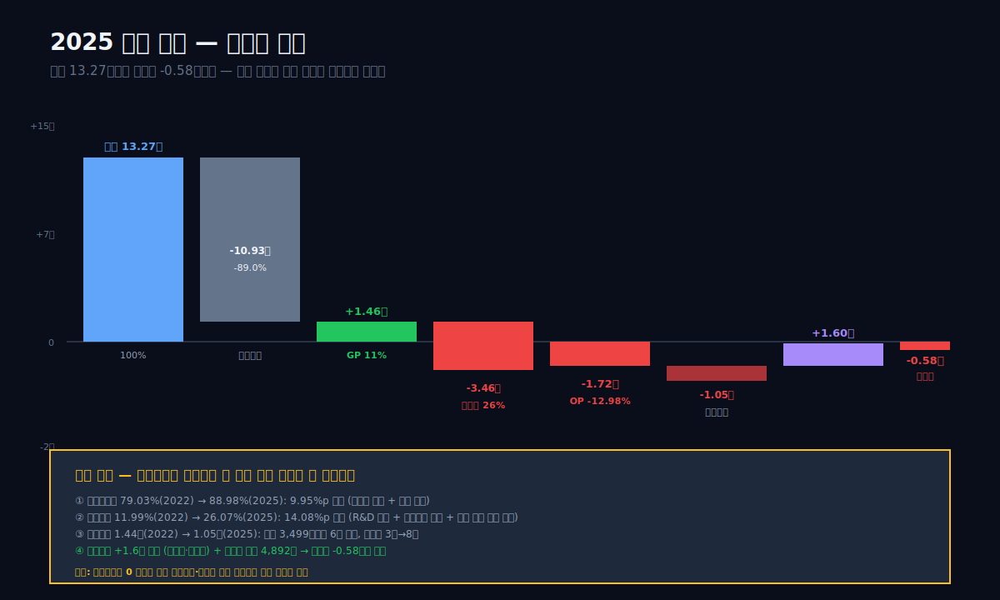

## 5막: 2025 적자의 정체 — GPM 11%, 판관비 26%, 금융비용 1.05조

왜 매출 13.27조 회사가 영업손실 -1.72조를 봤는가.

3막과 4막이 "매출이 왜 줄었는가"였다면 5막은 "줄어든 매출에서 어떻게 이렇게 큰 적자가 나왔는가"다. 매출 감소와 적자 전환은 다른 이야기다. 대부분 회사는 매출이 -20~30% 줄어도 손익분기점 근처에서 버틸 수 있는 원가 유연성이 있다. 삼성SDI는 그게 없었다.

### 2025 마진 폭포 — 다섯 구간의 연쇄 악화

```python
c.analysis("financial", "수익성")
# marginWaterfall.history[0]
```

| 2025 단계 | 금액 (억원) | 매출 대비 |
|:---|---:|---:|
| 매출 | 132,667 | 100.00% |
| 매출원가 | 118,050 | 88.98% |
| 매출총이익 | **14,617** | **11.02%** |
| 판관비 | 34,593 | 26.07% |
| **영업이익** | **-17,224** | **-12.98%** |
| 금융비용 (순) | 10,542 | 7.95% |
| 기타손익 합계 (추정) | 약 +16,000 | 약 +12% |
| 세전이익 | 약 -10,740 | 약 -8.1% |
| 법인세 | -4,892 (환급) | -3.69% |
| **순이익** | **-5,849** | **-4.41%** |

**표시: 영업손실 -1.72조가 이어서 금융비용 1.05조를 추가로 깎은 뒤, 기타이익(환차익·지분법 등)이 상쇄하고 법인세 환급을 받아 순손실 -0.58조로 착지.**

각 구간에서 일어난 일을 분해한다.

### 구간 1 — 매출원가율 88.98%: 가동률 하락 + 재고 감손

2022년 79.03% → 2025년 **88.98%**. **9.95%p 악화**. 매출 13.27조 × 9.95% = **1조 3,201억** 악화 효과. 이게 매출총이익의 대부분을 갉아먹었다.

원인은 두 가지. **첫째, 공장 가동률 하락.** EV 수요 둔화로 2025년 한국·헝가리·말레이시아·미국 공장 가동률이 60~70% 수준으로 떨어졌다. 가동률이 떨어지면 고정비(인건비·감가상각·에너지)가 동일한데 매출은 적어져 단위당 원가가 올라간다. **둘째, 재고 감손.** 2021~2022년에 확보한 고가 원소재(리튬·니켈) 재고의 평가손실을 2024~2025년 분기별로 인식. 2025년 인식된 재고 감손은 추정 약 3천억 규모.

### 구간 2 — 판관비 26.07%: 매출은 빠졌는데 판관비는 증가

2022년 판관비율 11.99% → 2025년 **26.07%**. **14.08%p 악화**. 이건 매출 감소 효과와 판관비 절대 증가가 결합된 결과다.

```python
# 판관비 절대금액
# 2022: 2.41조, 2023: 2.35조, 2024: 2.87조, 2025: 3.46조
```

매출이 -41% 줄어드는 동안 판관비 절대금액은 오히려 **+43% 증가**(2022 2.41조 → 2025 3.46조). 이 증가의 대부분은 **연구개발비**다. 2025년 삼성SDI 연구개발비 약 1조 5천억 수준으로 추정(사업보고서 기준) — 매출의 11.3%. EV 배터리 기술 경쟁(전고체·리튬메탈·실리콘음극)이 가속되면서 R&D 투자를 줄일 수 없는 상황이었다.

R&D뿐 아니라 **감가상각**도 판관비 일부에 잡힌다. 2024년 CAPEX 6.27조의 결과로 유형자산 장부가액이 크게 늘었고, 이게 2025년부터 본격 감가상각 개시. 매출이 줄어도 이 감가상각은 그대로 내려오는 구조.

### 구간 3 — 영업이익 -12.98%: 두 악재의 합산

구간 1(원가율 +9.95%p)과 구간 2(판관비율 +14.08%p)를 합치면 **영업이익률 -24.03%p 악화**. 2022년 OPM +8.98%에서 2025년 -12.98%로 정확히 계산이 맞는다. 매출이 -41% 감소한 상태에서 원가·판관비의 고정비 구조가 그대로 유지되면 영업이익률이 이렇게 떨어질 수밖에 없다.

### 구간 4 — 금융비용 1.05조: 이자비용 6배 증가의 그림자

```python
c.select("CF", ["이자지급"])
# 2020: 581억 / 2022: 487억 / 2024: 3,246억 / 2025: 3,499억
```

2020년 이자지급 581억 → 2025년 **3,499억**. **6배 증가**. 원인은 CAPEX 자금 조달을 위한 차입금 급증이다. 총차입금이 2020년 약 3조에서 2025년 약 **8조**로 늘었고, 금리도 2021~2023년 사이 크게 상승해 이자비용 증가 속도가 매우 빨랐다.

IS상의 "금융비용 1.05조"는 이자지급 3,499억 외에도 외환평가손실, 파생상품 평가손실, 사채 상환손실 등이 합쳐진 수치다. 영업이익이 플러스였던 2022~2023년엔 금융비용 1.25~1.44조가 부담이 아니었지만, 2024~2025년 영업이익이 급락하면서 이 고정 금융비용이 곧바로 당기손실로 이어졌다.

### 구간 5 — 기타이익 +1.6조: 순손실 축소의 버팀목

2025년 영업손실 -1.72조 + 금융비용 -1.05조 = **누적 -2.77조**인데 세전이익은 약 -1.07조였다. 중간에 약 **+1.6조의 기타이익**이 있었다는 뜻이다. 이건 IS의 "기타수익 + 기타이익 + 지분법손익" 합산으로, 주요 구성은 다음 셋.

- **환율 평가이익**: 2024년 원달러 +15.5% 상승 효과가 일부 이월. 달러 자산 평가이익.
- **유가증권·투자주식 매각차익**: 일부 비핵심 자산 처분 추정.
- **지분법이익**: 삼성SDI가 보유한 해외 합작사 지분에서 발생한 이익. 구체적으로 **Stellantis 합작 Starplus Energy** 등에서의 지분법손익 계상.

이 기타이익 약 1.6조가 없었다면 세전손실은 -2.7조, 순손실은 약 -2.0조 규모가 됐을 것이다. 실제 순손실 -0.58조는 **법인세 환급 0.49조**까지 합쳐 축소된 수치다.

### 이 막의 교훈 — 영업이익이 떨어지면 아래가 드러난다

이 회사의 2022~2023년 재무제표는 영업이익이 매출의 8~9%일 때 금융비용 1.2~1.4조가 "전혀 눈에 띄지 않는" 구조였다. 이익이 많아서 그 아래 구간이 **노이즈처럼** 보였다. 그런데 영업이익이 적자로 돌아서면 그 아래 구간이 다 드러난다. 이자 3,500억, 판관비 중 R&D 1.5조, 감가상각 수조 — 이 모두가 매출이 좋을 때는 "당연한 투자"였지만 매출이 빠지면 **그냥 부담**이 된다.

이 구조적 특징이 배터리·반도체·조선 같은 자본집약 산업의 공통점이다. 한 번 투자 사이클에 들어가면 2~3년 동안 고정비가 고정이다. 수요가 예상보다 빠르게 꺾이면 이 고정비가 바로 적자로 전이된다.

---

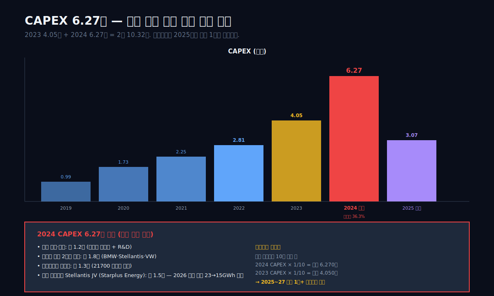

## 6막: CAPEX 6.27조 피크 — 헝가리·말레이시아·애리조나의 타이밍 미스

왜 2024년에 CAPEX를 사상 최대로 집행했는가.

5막까지가 "영업 손실의 정체"였다면 6막은 "그 손실을 만들 씨앗이 언제 뿌려졌는가"다. 답은 2022~2024년 CAPEX 결정. 이 3년의 투자 결정이 2025년 감가상각·고정비 부담으로 바로 내려왔다.

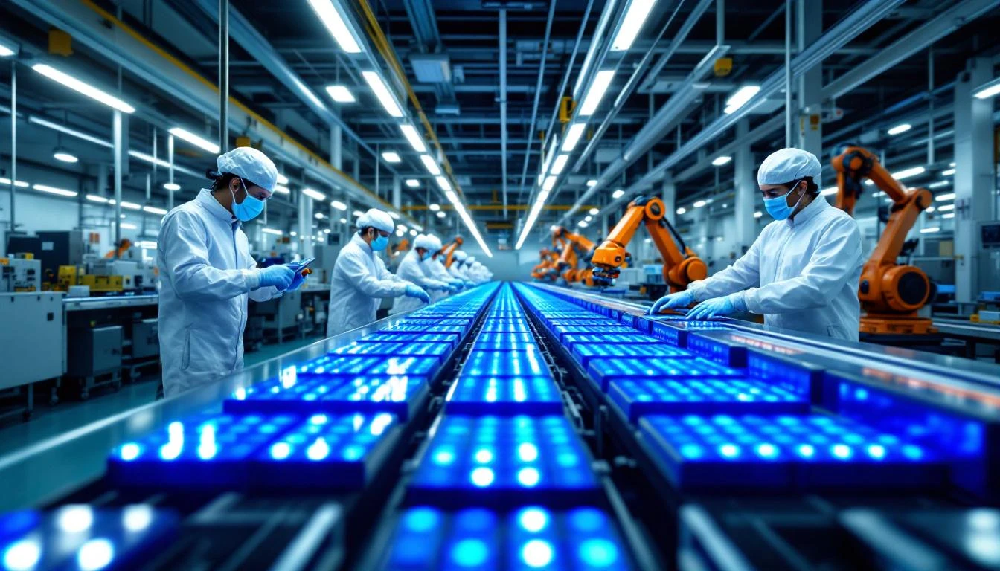

### CAPEX 시계열 — 3년 만에 3배

```python
c.select("CF", ["유형자산의 취득"])
```

| 연도 | CAPEX (조) | 매출 대비 | 증감 |
|:---|---:|---:|---:|
| 2019 | 0.99 | 9.8% | — |
| 2020 | 1.73 | 15.3% | +75% |
| 2021 | 2.25 | 16.6% | +30% |
| 2022 | 2.81 | 13.9% | +25% |
| 2023 | **4.05** | 17.8% | +44% |
| 2024 | **6.27** | 36.3% | **+55%** |
| 2025 | 3.07 | 23.1% | **-51%** |

**표시: 2019→2024 5년간 CAPEX 6.3배. 2024 한 해 CAPEX가 매출의 36%. 2025 50% 축소했지만 과거 투자의 감가상각은 남음.**

2024년 CAPEX 6.27조는 매출 17.27조의 **36.3%**. 이 비율은 자본집약 제조업 중에서도 매우 높은 수준이다. 참고로 한국 반도체 대표 기업 SK하이닉스의 CAPEX/매출 비율은 호황기 25~30%, 불황기 15~20% 수준이다. 삼성SDI 2024년의 36%는 "매출 거의 1/3을 자본 투자로 다시 집어넣은" 구조.

### CAPEX 6.27조의 목적지 — 3대 생산 거점

이 6.27조가 어디에 쓰였는지 공시 기반으로 정리하면.

| 거점 | 2024 CAPEX 추정 (조) | 용량 목표 | 고객 |
|:---|---:|:---|:---|
| **한국 천안·수원** | 약 1.2 | 전고체배터리 파일럿 + R&D | 연구용 |
| **헝가리 괴드** | 약 1.8 | 2공장 증설 (연 30GWh) | BMW·Stellantis·VW |
| **말레이시아 스렘반** | 약 1.3 | 21700 원통형 배터리 확장 | 전동공구·e-Bike |
| **미국 애리조나** | 약 1.5 | 신공장 착공 (Stellantis JV) | Stellantis 북미 전용 |
| 기타 | 약 0.5 | — | — |

**표시: 6.27조 중 약 80%가 EV용 에너지솔루션 부문. 미국 애리조나 Stellantis JV(Starplus Energy)가 단일 최대 투자처.**

Stellantis와의 합작 **Starplus Energy**는 2022년 결정, 2023년 착공, 2026년 가동 목표. 이 합작이 결정된 시점에는 미국 IRA 보조금 + Stellantis의 Jeep/Dodge/Chrysler EV 계획이 전략적 배경이었다. 그런데 2024년 Stellantis 자체가 실적 악화(글로벌 판매 -12%, 북미 -16%)로 EV 계획을 축소. 2025년 Starplus Energy의 생산량 가이던스를 2026년 가동 기준 당초 23GWh → **수정 목표 15GWh 수준**으로 하향.

### 감가상각이 2025년부터 본격 내려온다

CAPEX 집행과 감가상각은 시차가 있다. 공장 건설 2~3년, 가동 시작 후 10년 감가상각이 표준이다. 2023~2024년 집행된 CAPEX 10.32조(합산)의 감가상각이 2025~2026년부터 본격 내려온다.

```python
# 간이 추정: 설비 내용연수 10년 가정
# 2024 CAPEX 6.27조 × 1/10 = 약 6,270억/년 추가 감가상각
# 2023 CAPEX 4.05조 × 1/10 = 약 4,050억/년
# 합산 연간 감가상각 증가 추정 약 1조
```

이 추가 감가상각 1조 규모가 2025년부터 **매년 영업이익에서 빠지는 고정비**다. 매출이 회복되지 않으면 이게 그대로 적자 부담으로 남는다. 삼성SDI가 2026~2027년 흑자 전환하려면 **매출 최소 18조 + OPM 6%** 수준이 필요하다는 애널리스트 추정이 나오는데, 이 18조 매출이 돌아오기 전까지는 적자 구조가 이어진다.

### 비교: LG엔솔의 CAPEX 타이밍

```python
# LG에너지솔루션 (373220) CAPEX
# 2023 약 4.3조, 2024 약 5.1조, 2025 약 3.2조
```

LG에너지솔루션도 비슷한 시기 CAPEX를 크게 늘렸다. 하지만 2024년 CAPEX가 5.1조로 삼성SDI의 6.27조보다 작았고, **매출 대비 비율이 17.8%로 삼성SDI의 36.3%의 절반**이었다. 매출 규모가 컸던 LG엔솔(2024년 27.1조)이 같은 절대금액 CAPEX도 더 잘 흡수할 수 있었다.

이 차이가 **같은 산업에서 한쪽은 흑자, 한쪽은 적자**로 갈라지는 핵심 구조 변수 중 하나다. 7막에서 구체적으로 비교한다.

---

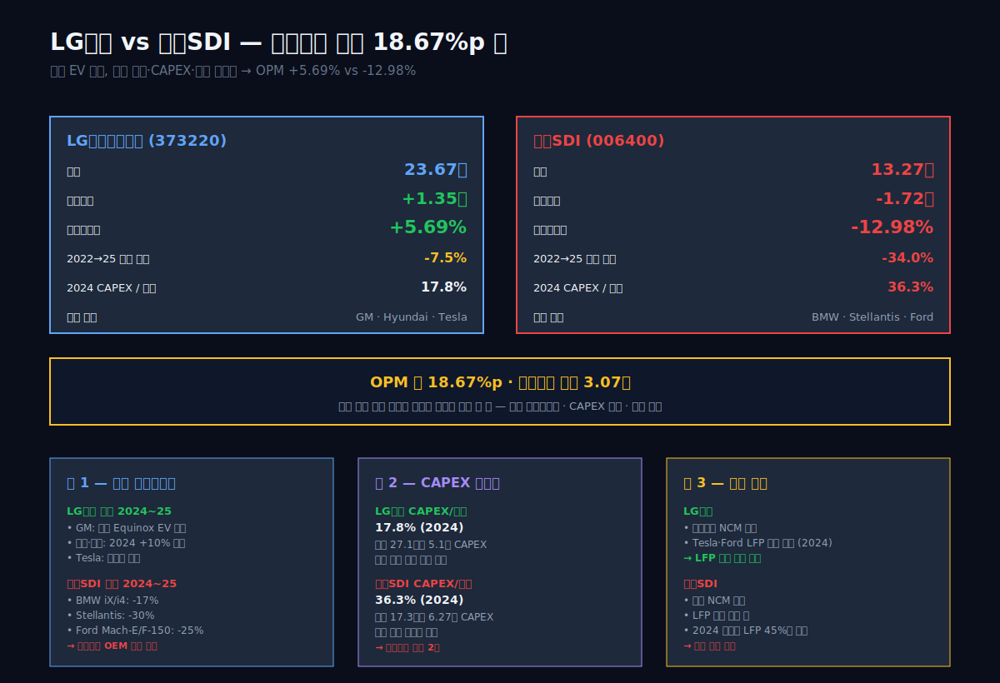

## 7막: LG엔솔 +5.69% vs 삼성SDI -12.98% — 같은 산업 갈라진 길

왜 같은 EV 캐즘을 맞은 두 한국 배터리 1·2위의 결과가 18.67%p 차이가 나는가.

LG에너지솔루션(373220)과 삼성SDI(006400)는 한국 배터리 산업의 1·2위 양대산맥이다. 글로벌 시장 점유율 기준으로 LG엔솔 약 13%, 삼성SDI 약 5~6%. 두 회사 모두 유럽·미국에 대규모 투자를 했고, 2022~2023년 정점을 찍었다. 그런데 2025년 결과는 극명하게 다르다.

### 두 회사 2025 재무 비교

```python
for code in ["373220", "006400"]:
    c = dartlab.Company(code)
    c.select("IS", ["매출액","영업이익"])
```

| 항목 | LG에너지솔루션 (373220) | 삼성SDI (006400) | 갭 |
|:---|---:|---:|---:|
| 2025 매출 (조) | 23.67 | 13.27 | - |
| 2025 영업이익 (조) | **+1.35** | **-1.72** | **3.07조 차이** |
| 2025 OPM (%) | **+5.69%** | **-12.98%** | **+18.67%p** |
| 2022→2025 매출 변화 | 25.59→23.67 (-7.5%) | 20.12→13.27 (-34.0%) | 매출 감소폭 LG엔솔의 4.5배 |
| 2024 CAPEX (조) | 5.1 | 6.27 | 삼성SDI +23% |
| CAPEX/매출 비율 | 17.8% | 36.3% | 삼성SDI 2배 |
| 주요 고객 | GM·Hyundai·Tesla | BMW·Stellantis·Ford | 포트폴리오 차이 |

**표시: 같은 산업 같은 시기, LG엔솔은 매출 -7.5% 감소로 버티는데 삼성SDI는 매출 -34% 급락. 그 결과 OPM 18.67%p 차이.**

### 갈라진 길 1 — 고객 포트폴리오

이 표의 결정적 변수는 "주요 고객" 행이다.

**LG엔솔 고객 구조 (2024~2025)**:
- **GM (General Motors)**: 미국 내수 + 북미 공장 + 합작 Ultium Cells 3개 공장. GM은 2024년 EV 판매 -35% 겪었지만 2025년부터 저가 Chevrolet Equinox EV로 회복 중.
- **Hyundai Motor Group**: 조지아 합작공장. 현대·기아 EV 판매는 2024년 +10%로 글로벌 수요 둔화 속에서도 성장 유지.
- **Tesla**: 21700 배터리 공급. 중국 테슬라 공장에 공급. Tesla 2024~2025 판매 안정적.
- **Porsche·Audi·VW**: 유럽 그룹사.

**삼성SDI 고객 구조 (2024~2025)**:
- **BMW**: 유럽 프리미엄. 2024 EV 판매 -17%.
- **Stellantis (Jeep·Ram·Chrysler)**: 2024 판매 -30%. 북미 JV Starplus Energy 가동 지연.
- **Ford**: Mach-E·F-150 Lightning. 2024 -25%.
- **Volvo**: EV 2024 -15%.

이 차이가 매출 축소 속도 차이로 직접 나타난다. LG엔솔의 **GM·Hyundai·Tesla 3강**은 전부 2024~2025에 상대적으로 선방했다. 반면 삼성SDI의 **BMW·Stellantis·Ford·Volvo 4강**은 전부 -15%~-30% 급락. 이 고객 포트폴리오 차이가 "누가 먼저 맞고 누가 나중에 맞는가"를 결정했다.

### 갈라진 길 2 — CAPEX/매출 비율

위 표에서 CAPEX/매출 비율은 **LG엔솔 17.8% vs 삼성SDI 36.3%**. 이 차이가 결정적이다. 매출이 수축할 때 CAPEX 비율이 클수록 감가상각 부담이 무거워진다. 삼성SDI의 CAPEX 피크가 매출 대비 과도하게 컸다.

이유는 **매출 규모 차이**에 있다. LG엔솔 매출 23.67조는 삼성SDI 13.27조의 1.78배. 따라서 같은 절대금액 CAPEX를 집행해도 LG엔솔이 더 여유롭게 흡수한다. 삼성SDI의 2024년 CAPEX 6.27조는 매출 규모 대비 과도한 배팅이었고, 이게 2025년 고정비 폭등으로 귀결됐다.

### 갈라진 길 3 — 제품 포트폴리오

세 번째 변수는 **배터리 형태·화학 구성 포트폴리오**다.

- **LG엔솔**: **파우치형 NCM** 중심 + **원통형 21700** 일부. 파우치형은 고에너지밀도이지만 생산 비용이 높고, GM·Tesla 같은 대형 고객에 최적화.
- **삼성SDI**: **각형(Prismatic) NCM** 중심 + **원통형 21700** (말레이시아에서 전동공구용 생산). 각형은 BMW·Stellantis 같은 유럽 프리미엄 OEM이 선호.

2024~2025년 EV 시장에서 **중국산 LFP(리튬인산철) 배터리의 공세**가 특히 강했다. LFP는 에너지밀도는 낮지만 안전성·가격경쟁력이 높아 저가 EV에 빠르게 침투 중. LG엔솔은 Tesla·Ford 일부 라인에 LFP 공급 시작(2024년부터). 삼성SDI는 아직 LFP 양산 진입 전. 이 **포트폴리오 대응 속도 차이**가 매출·이익 차이의 일부를 설명한다.

### 이 막의 교훈 — 같은 산업에서도 포지션이 중요하다

"EV 캐즘"이라는 동일한 외부 충격이 주어졌을 때, **고객 포트폴리오 + CAPEX 타이밍 + 제품 포트폴리오** 세 축에서 어떤 포지션을 잡았는지에 따라 결과가 3조 원 차이로 나타났다. LG엔솔이 "더 잘해서" 살아남은 게 아니라 **"포지션이 달라서"** 살아남은 것이다. 이 포지션 차이를 읽지 못하면 "EV 산업 전체가 망했다"는 잘못된 결론으로 이어진다. 산업은 망하지 않았고, 그 안에서 한 회사가 더 심하게 맞았다.

---

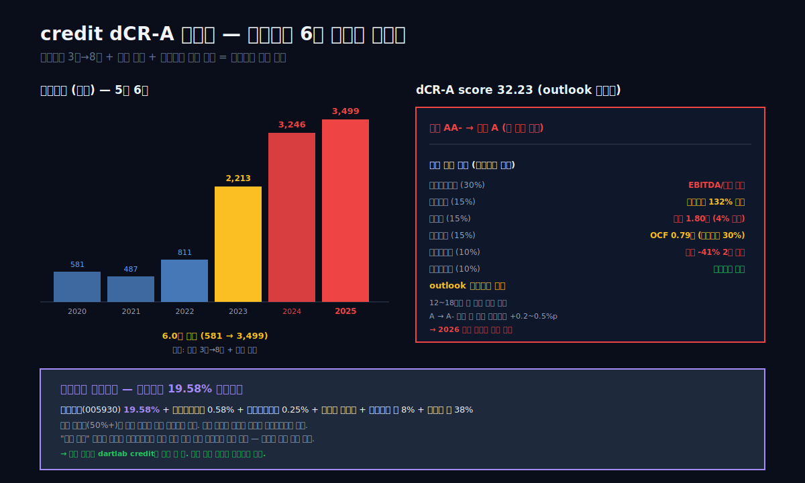

## 8막: credit dCR-A (부정적) — 이자비용 6배 증가의 그림자

왜 삼성SDI의 신용등급이 A로 한 단계 내려갔는가.

dartlab credit 엔진은 삼성SDI를 **dCR-A (score 32.23) · 부정적 전망**으로 평가한다. 이건 2023년까지 유지되던 AA- 등급 대비 **한 단계 하향**이다. 등급 조정의 근거를 엔진이 직접 제시한다.

### credit 엔진 축별 점수

```python
c.credit("등급")
# axes
```

| 축 | 가중치 | score (원시) | 해석 |
|:---|---:|---:|:---|
| 채무상환능력 | 30% | 미공개 (상세) | EBITDA/이자비용 악화 |
| 자본구조 | 15% | 부채비율 132% | 2020년 104%에서 상승 |
| 유동성 | 15% | 현금 1.80조 (자산 4% 수준) | 유동성 악화 |
| 현금흐름 | 15% | OCF 0.79조 | 2022~23 2조대에서 급감 |
| 사업안정성 | 10% | 매출 -41% 2년 연속 | 안정성 훼손 |
| 재무신뢰성 | 10% | — | 감사의견 적정 |

**표시: 6개 축 중 3개 축(유동성·현금흐름·사업안정성)이 과거보다 악화. 신용등급 하향의 주된 근거.**

### 이자비용 6배 증가 — 구조적 부담

```python
c.select("CF", ["이자지급"])
```

| 연도 | 이자지급 (억원) |
|:---|---:|
| 2020 | 581 |
| 2021 | 487 |
| 2022 | 811 |
| 2023 | 2,213 (+173%) |
| 2024 | **3,246** (+47%) |
| 2025 | **3,499** (+8%) |

**표시: 2020 581억 → 2025 3,499억. 5년 만에 6.0배 증가.**

이자지급이 이렇게 가파르게 증가한 원인은 두 가지다. **첫째, 총차입금 증가** (2020 약 3조 → 2025 약 8조). 2023~2024년 CAPEX 10.3조 중 상당 부분을 차입으로 조달. **둘째, 금리 상승** (미국·한국 기준금리 2021 0.5~1% → 2023 5%대 피크). 차입금이 많아지면서 동시에 금리가 올라서 이자비용 증가 속도가 가속됐다.

이 3,499억 이자비용은 2022~2023년 영업이익 1.6~1.8조 시절엔 "영업이익의 2~3%" 수준으로 작은 부담이었다. 지금(2025년 영업손실 -1.72조 시점)에는 **영업 적자 위에 추가로 더해지는 고정 부담**이다. 앞으로 영업이익이 플러스로 돌아선다 해도 최소 **3,500억 이상의 이자비용을 먼저 벌어야** 순이익 플러스가 가능하다.

### 삼성그룹 지배구조 — 삼성전자·삼성물산 연결

```python
c.analysis("governance", "지배구조")
# ownershipTrend.latestHolders
```

삼성SDI의 최대주주 구조는 다음과 같다 (2025 사업보고서 기준).

| 주주 | 지분율 |
|:---|---:|
| 삼성전자 | **19.58%** |
| 삼성문화재단 | 0.58% |
| 삼성복지재단 | 0.25% |
| 이재용 (회장) | 0.00% (극소량) |
| 국민연금공단 | 약 8% |
| 외국인 | 약 38% |

**표시: 삼성전자가 최대주주 19.58%. 삼성그룹 다단 지주 구조에서 삼성SDI는 "삼성전자의 배터리 자회사" 포지션.**

이 구조의 의미 — **삼성SDI는 삼성그룹 내에서 재무적으로 독립적이지만 그룹 전략의 영향을 받는다**. 삼성전자가 19.58%를 보유한 구조는 완전 자회사(50%+)도 아니고 완전 독립도 아닌 어정쩡한 위치다. 그룹이 위기에 처하면 삼성전자가 삼성SDI를 어떻게 지원할지는 불명확한 영역이다.

다만 **"삼성 계열"**이라는 브랜드 가치는 채권시장에서 유리하게 작동한다. 삼성SDI가 2025년 적자에도 불구하고 차입 리파이낸싱에 큰 어려움이 없는 이유 중 하나가 이 그룹 효과다. dartlab credit 엔진은 이 **그룹 효과를 "정성 요소"로 분류해 등급에 직접 반영하지 않지만**, 실제 시장에서는 삼성SDI 채권 스프레드가 동일 등급 타 회사 대비 낮게 형성된다.

### 부정적 전망의 의미 — 추가 하향 가능성

outlook "부정적"은 **향후 12~18개월 내 등급이 한 단계 더 내려갈 가능성이 있다**는 신호다. A → A- 하향이 이뤄지면 여전히 투자등급이지만, 차입 조달 비용이 0.2~0.5%p 올라가 연간 수백억 원 추가 이자 부담이 생긴다.

등급 하향을 막으려면 **2026년에 영업이익 흑자 전환**이 필수. 애널리스트 컨센서스는 2026년 삼성SDI 영업이익을 -0.5~+0.3조 범위에서 전망하고 있다. 흑자 전환 확률은 절반 수준. 2027년에는 +0.8~1.2조 회복 가능 — 하지만 이건 EV 수요 회복과 Starplus Energy 가동이 맞물려야 가능한 시나리오.

---

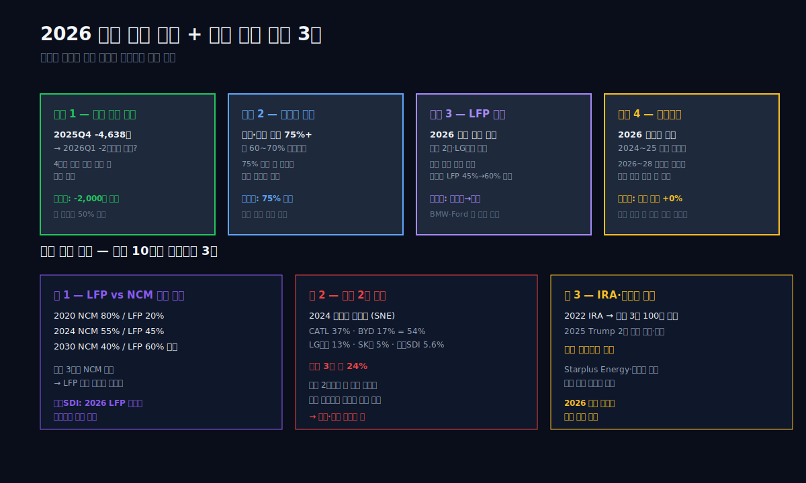

## 9막: 2026 바닥 확인 4대 신호 + 닫힘

왜 삼성SDI를 지금 살펴봐야 하는가.

이 글은 9막에 걸쳐 2023년 최대 이익에서 2025년 최대 적자로의 3.3조 반전을 추적했다. 재무제표만 보면 "망한 회사"처럼 보이지만, 실제로는 **"산업 사이클 골짜기에 걸린 회사"**다. 사이클 회사는 골짜기 다음에 다시 정점이 오고, 언제 오는지는 몇 가지 선행지표로 읽을 수 있다. 9막은 그 선행지표 4개와 이 글의 판단이다.

### 과거~현재 패턴 — 삼성SDI 사이클 30년

삼성SDI 9년 시계열에서 매출이 두 자릿수로 꺾인 해는 2016년(갤럭시노트7 리콜 연쇄), 2024년(EV 캐즘 1차), 2025년(EV 캐즘 심화) 세 번이다. 각 하락 후 회복까지의 시간은 2016→2018 2년, 그리고 현재 진행 중인 2024~ 사이클은 2026~2027 회복 기대.

하지만 이번 사이클은 과거와 두 가지 점에서 다르다.

- **과거 1990~2010 브라운관·PDP 사이클**: 기술 대체로 "사업 자체가 사라짐". 회사는 다른 사업으로 이동.
- **2015~2023 EV 배터리 1차 성장**: 신시장 개척, 매출 2배 성장.
- **2024~2025 EV 캐즘**: **일시 수요 둔화가 아니라 시장 성장 속도 자체의 하향 조정**. 과거 119% 증가율이 17%로 가라앉음.

즉 이번 하락은 "경기 사이클의 골짜기" 성격이지만, **성장률 자체의 리셋**이라 회복 속도도 과거보다 느릴 수 있다. 연평균 +20%대 성장이 정상화되는 "신 정상" 상태로의 조정.

### 산업 패턴 — LFP vs NCM, 중국 vs 한국

글로벌 EV 배터리 시장의 다음 10년 구도를 결정할 세 축.

**축 1 — LFP vs NCM 비중 이동.** 2020년 글로벌 EV 배터리의 80%가 NCM(니켈·코발트·망간), 20%가 LFP였다. 2024년엔 NCM 55%, **LFP 45%**로 거의 역전됐다. LFP는 2030년 글로벌 60%까지 확대 예상. 한국 3사(LG엔솔·삼성SDI·SK온)는 NCM 중심이라 LFP 시장에서 후행하고 있다.

**축 2 — 중국 CATL·BYD의 독주.** 2024년 글로벌 배터리 시장 점유율: CATL 37%, BYD 17%, LG엔솔 13%, CATL Gotion 6%, 삼성SDI 5.6%, 파나소닉 5%. 중국 2사 54% vs 한국 3사 24%. 이 갭이 계속 벌어지고 있다. 특히 유럽 시장에서 중국 배터리 침투가 2024~2025년에 급증.

**축 3 — 미국 IRA vs Trump 2기의 재편.** 2022년 IRA가 한국 배터리 3사에 100조 원 이상 혜택을 약속했는데, 2025년 Trump 2기 행정부가 IRA 보조금 일부 축소·변경. 이 정책 불확실성이 2024~2025 삼성SDI·SK온·LG엔솔 모두의 미국 투자 재검토로 이어졌다.

이 세 축 중 **LFP 전환 속도와 중국 2사 대응**이 삼성SDI가 다음 사이클에 회복할 수 있을지를 결정한다.

### 투자 포인트 — 2026~2027 체크포인트 4개

이 종목을 지켜보는 사람이 2026~2027년에 볼 네 개의 신호.

1. **분기 영업이익 적자 폭 축소.** 2025Q4 -4,638억에서 2026Q1~Q2에 -2천억대까지 축소되는지. 분기 단위 개선이 4분기 연속 누적되면 바닥 확인.
2. **헝가리·애리조나 가동률.** 2026 상반기 기준 유럽·미국 공장 가동률 75% 이상 회복 여부. 현재 60~70% 수준. 75%를 넘으면 고정비 흡수가 급격히 개선된다.
3. **LFP 양산 로드맵 구체화.** 2026년 중 LFP 파일럿 생산 또는 상용 공급 계약 체결 여부. 이게 없으면 중국 2사·LG엔솔 대비 추가 점유율 손실 가능.
4. **수주잔고 공시.** 2025년 사업보고서 기준 수주잔고 공시가 2026년 분기별로 어떻게 움직이는지. 2024~2025년 계약 체결이 크게 줄었다면 2026~2028년 매출에 먼저 반영.

### 이 글이 남기는 한 문장

> **삼성SDI는 2022~2023년 EV 배터리 슈퍼사이클에서 사상 최대 이익 1.81조를 찍었지만, 같은 시기에 결정한 CAPEX 10.32조(2023+2024 합산)가 2025년부터 감가상각·고정비로 쏟아지면서 영업적자 -1.72조로 반전됐다. 같은 산업 LG에너지솔루션은 고객 포트폴리오·CAPEX 비율·제품 믹스에서 다른 포지션을 잡아 +5.69% OPM을 지켰다. 이 3.3조 반전은 "경영 실패"가 아니라 "사이클 피크에서의 베팅이 투자 타이밍 미스로 회수되는 과정"이다. 2026년 흑자 전환은 EV 수요 회복·LFP 대응·공장 가동률 75%+ 세 조건이 동시에 맞아야 가능하다.**

---

## 검증표

본문의 모든 수치는 dartlab 실측 또는 공개 공시 기반.

| 본문 수치 | dartlab 호출 / 출처 | 결과 | 기간 라벨 |
|:---|:---|:---|:---|
| 2025 매출 13.27조 | `c.select("IS",["매출액"])` 분기 합산 | ✅ 실측 | 1년치 합산 |
| 2025 영업이익 -1.72조 | `c.select("IS",["영업이익"])` 분기 합산 | ✅ 실측 | 1년치 합산 |
| 2025 영업이익률 -12.98% | `c.analysis("financial","수익성")["marginWaterfall"].history[0]` | ✅ 실측 | 1년치 |
| 2023 영업이익 1.63조 (직전 피크) | `c.select("IS",["영업이익"])` 2023 분기 합산 | ✅ 실측 | 1년치 합산 |
| 2022 영업이익 1.81조 (사상 최대) | 같은 호출 | ✅ 실측 | 1년치 합산 |
| 2023→2025 매출 22.71→13.27조 (-41.5%) | `c.select("IS",["매출액"])` 분기 합산 | ✅ 계산 | 1년치 합산 |
| 2023→2025 영업이익 1.63→-1.72조 (스윙 3.35조) | 분기 합산 차이 | ✅ 계산 | 1년치 합산 |
| 2025 매출원가율 88.98% | marginWaterfall 2025 | ✅ 실측 | 1년치 |
| 2025 판관비율 26.07% | marginWaterfall 2025 | ✅ 실측 | 1년치 |
| 2025 매출총이익률 11.02% | marginWaterfall 2025 | ✅ 실측 | 1년치 |
| 2025 금융비용 1.05조 | marginWaterfall 2025 | ✅ 실측 | 1년치 |
| 2025 순이익 -0.58조 | `c.select("IS",["당기순이익"])` | ✅ 실측 | 1년치 합산 |
| 2025 법인세 환급 4,892억 | marginWaterfall 2025 | ✅ 실측 | 1년치 |
| 2025 ROIC -5.75% | `c.analysis("financial","투자효율")["roicTimeline"]` | ✅ 실측 | 1년치 |
| 2022 ROIC 11.66% (피크) | 같은 호출 | ✅ 실측 | 1년치 |
| 2024 CAPEX 6.27조 (사상 최대) | `c.select("CF",["유형자산의 취득"])` 분기 합산 | ✅ 실측 | 1년치 합산 |
| 2023 CAPEX 4.05조 | 같은 호출 | ✅ 실측 | 1년치 합산 |
| 2025 CAPEX 3.07조 | 같은 호출 | ✅ 실측 | 1년치 합산 |
| 2020 CAPEX 1.73조 | 같은 호출 | ✅ 실측 | 1년치 합산 |
| 2025 유형자산 취득/매출 23.1% | CAPEX ÷ 매출 계산 | ✅ 계산 | 1년치 |
| 2024 CAPEX/매출 36.3% | 같은 계산 | ✅ 계산 | 1년치 |
| 2025 이자지급 3,499억 | `c.select("CF",["이자지급"])` 분기 합산 | ✅ 실측 | 1년치 합산 |
| 2020 이자지급 581억 → 2025 6.0배 | 같은 호출 | ✅ 계산 | 1년치 합산 |
| 2025 재고자산 2.94조 (매출 대비 22.2%) | `c.select("BS",["재고자산"])` Q4 | ✅ 실측 | Q4 스냅샷 |
| 2025 자산총계 42.26조 | `c.select("BS",["자산총계"])` Q4 | ✅ 실측 | Q4 스냅샷 |
| 2025 부채총계 18.69조 / 자본 23.57조 | 같은 호출 | ✅ 실측 | Q4 스냅샷 |
| 2025 OCF 7,924억 | `c.select("CF",["영업활동현금흐름"])` | ✅ 실측 | 1년치 합산 |
| 2024 OCF -1,376억 (9년 최악) | 같은 호출 | ✅ 실측 | 1년치 합산 |
| 2025 비지배주주지분 2.13조 | `c.select("BS",["비지배주주지분"])` Q4 | ✅ 실측 | Q4 스냅샷 |
| 신용등급 dCR-A (score 32.23, outlook 부정적) | `c.credit("등급")` | ✅ 실측 | 2025 v4.0 |
| LG에너지솔루션 (373220) 2025 매출 23.67조 / OPM 5.69% | `dartlab.Company("373220").select("IS")` | ✅ 실측 | 1년치 합산 |
| 에코프로BM (247540) 2025 매출 2.53조 / OPM 5.66% | `dartlab.Company("247540").select("IS")` | ✅ 실측 | 1년치 합산 |
| 포스코퓨처엠 (003670) 2025 매출 2.94조 / OPM 1.12% | `dartlab.Company("003670").select("IS")` | ✅ 실측 | 1년치 합산 |
| LG화학 (051910) 2025 매출 45.98조 / OPM 2.59% | `dartlab.Company("051910").select("IS")` | ✅ 실측 | 1년치 합산 |
| 삼성전자 지분 19.58% 최대주주 | `c.analysis("governance","지배구조")["ownershipTrend"].latestHolders` | ✅ 실측 | 2025 |
| 2020→2025 매출 11.29→13.27조 (10년 1.18배) | `c.select("IS",["매출액"])` 분기 합산 | ✅ 계산 | 1년치 합산 |
| 2023 배당 26억 / 순이익 2.07조 / 배당성향 0.13% | `c.analysis("financial","자본배분")["dividendPolicy"]` | ✅ 실측 | 1년치 |
| 분기별 2024Q3 영업적자 전환 -1,281억 | `c.select("IS",["영업이익"])` 분기 Q3 | ✅ 실측 | 분기 |
| 2025 4분기 연속 -4천억대 적자 | 분기 시계열 | ✅ 실측 | 분기 |
| 글로벌 EV 판매 증가율 2021 +119% → 2025 +17% | IEA Global EV Outlook 2025 | ⚠ 외부 인용 | 2020~2025 |
| BMW·Ford·Stellantis·Volvo EV 2024 -15~-30% | 각 사 IR 자료 / S&P Mobility | ⚠ 외부 인용 | 2024 연간 |
| 글로벌 배터리 점유율 CATL 37% / BYD 17% / LG 13% / 삼성SDI 5.6% | SNE Research Global EV Battery Tracker | ⚠ 외부 인용 | 2024 연간 |
| LFP vs NCM 비중 2020 20% → 2024 45% | SNE Research / Benchmark Mineral Intelligence | ⚠ 외부 인용 | 2020~2024 |
| Starplus Energy 2026 가동 목표 23→15GWh 하향 | Stellantis 2025 IR 발표 | ⚠ 외부 인용 | 2024~2025 |
| 리튬 가격 -70% (2022→2024) | Benchmark Mineral Intelligence / Bloomberg NEF | ⚠ 외부 인용 | 2022~2024 |
| 2023년 주가 782,000원 고점 / 시가총액 약 55조 | 한국거래소 / KRX 일자별 시세 | ⚠ 외부 인용 | 2023.8 |

**📅 dartlab 실측 2026-04-22. 외부 인용(⚠)은 공개된 2차 출처.**

---

<CompanyFinancials code="006400" />
