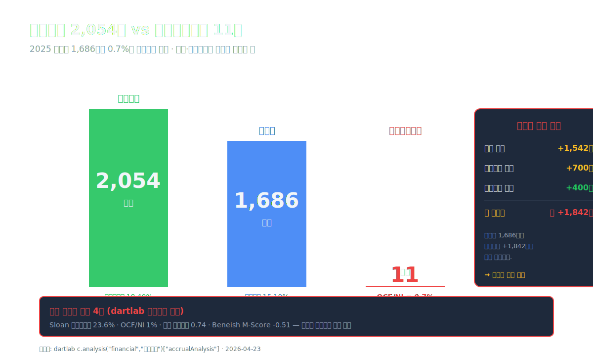
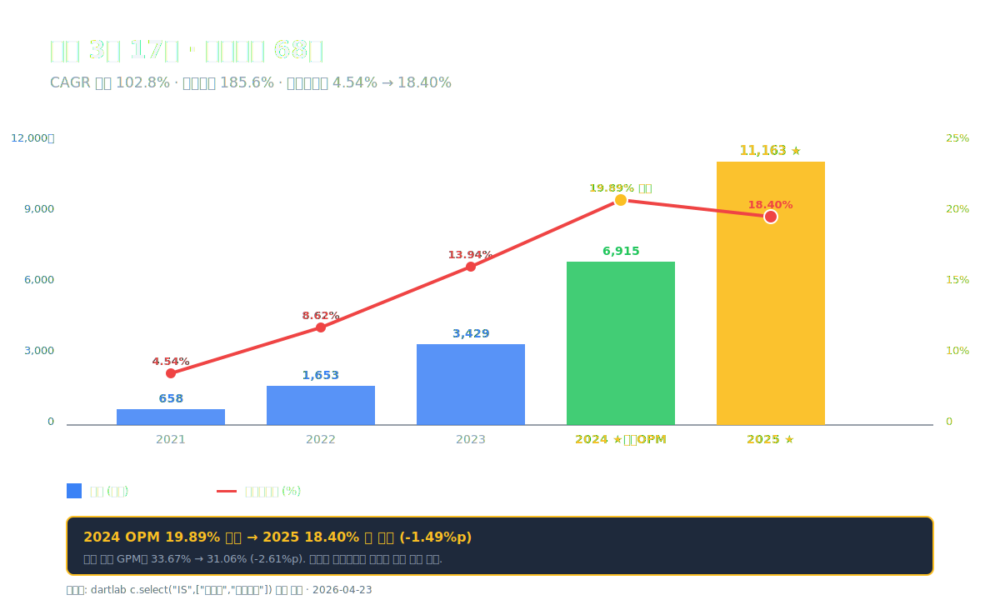
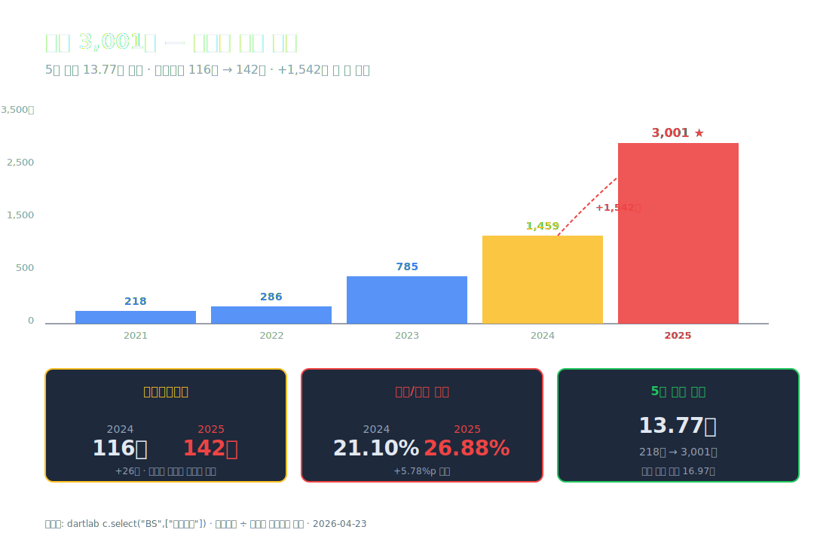
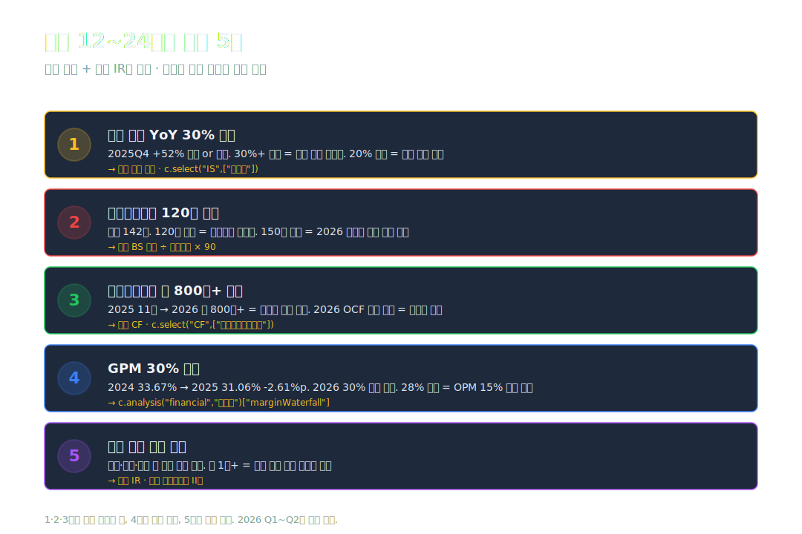
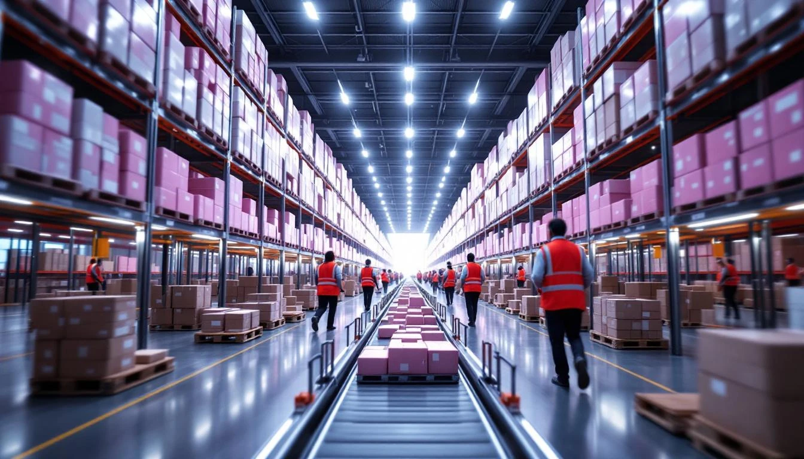

<script>
	import CompanyFinancials from '$lib/components/blog/CompanyFinancials.svelte';
  import YouTube from '$lib/components/YouTube.svelte';
</script>

> **성장** | 경기관련소비재/소매(유통) | 2026-04-23 dartlab 실측



2021년 실리콘투의 매출은 **658억원**이었다. 영업이익 **30억원**, 영업이익률 4.54%. 소비재 유통 중견기업. 한국에만 있으면 기억조차 하지 못할 규모.

2025년 결산. 매출 **1조 1,163억원**. **3년 만에 17배**. 같은 기간 영업이익은 30억에서 **2,054억으로 68배**. 영업이익률 **18.40%**. K-뷰티 유통 플랫폼이라는 업종에서 한국 상장사 중 가장 빠른 속도로 올라간 곡선이다.

그런데 같은 해 영업활동현금흐름은 **11억원**. 순이익 1,686억의 **0.7%**. 숫자상으로는 "이익은 있는데 현금은 없음" 수준. dartlab `이익품질` 엔진은 즉시 4건의 경고 플래그를 띄운다 — Sloan 발생액비율 23.6%, OCF/NI 1%, 이익 변동계수 0.74, Beneish M-score -0.51.

**이익 2,054억이 어디에 갇혔는가.** 답은 손익계산서가 아니라 대차대조표에 있다. **재고자산 2024 1,459억 → 2025 3,001억, 한 해에 +1,542억 증가**. 성장이 너무 빠르면 상품을 미리 사두는 운전자본이 이익을 갉아먹는다. 그 구조가 2025년 실리콘투다.

이 글은 **"17배로 성장한 K-뷰티 플랫폼의 빛과 그림자"**를 9막에 걸쳐 해부한다. 매출 대폭발의 실체, 영업이익률 20%의 판관비 레버리지, 재고 +1,542억의 위험, Beneish 경고가 가리키는 것, 그리고 달바글로벌(#12)과 정반대의 K-뷰티 수익 모델.

---

## 프롤로그 — 2025년 실리콘투의 1층 레시피

### 단계별 이익 구조

```python
import dartlab
c = dartlab.Company("257720")
prof = c.analysis("financial", "수익성")
print(prof["marginWaterfall"]["history"][0])
```

2025년 손익 (dartlab `marginWaterfall` 실측):

| 단계 (2025년, %) | 값 | 누적 |
| :--- | ---: | ---: |
| 매출 | 100.00 | 100.00 |
| 매출원가 | -68.94 | 31.06 |
| **매출총이익률** | **+31.06** | 31.06 |
| 판매비와관리비 | -12.67 | 18.40 |
| **영업이익률** | **+18.40** | 18.40 |
| 세전이익률 | | 19.41 |
| 법인세 | -4.31 | 15.10 |
| **순이익률** | **+15.10** | 15.10 |

표시: 매출 100원 → **영업이익 18.40원** → 순이익 15.10원. 유통업에서 **영업이익률 18%는 매우 높다**. 참고로 이마트 연결 1~2%, 현대글로비스 7%, GS리테일 2~3% 수준. 실리콘투는 **물리적 유통 대행이 아닌 "K-뷰티 상품 글로벌 마켓플레이스 플랫폼"**이라 제조 원가가 낮다.

절대값 환산:

| 단계 (2025년, 억원) | 금액 |
| :--- | ---: |
| 매출 | 11,163 |
| 매출원가 | -7,695 |
| **매출총이익** | **3,468** |
| 판매비와관리비 | -1,414 |
| **영업이익** | **2,054** |
| 세전이익 | 2,167 |
| 법인세 | -481 |
| **순이익** | **1,686** |

### 5년 시계열 — 매출 17배, 영업이익 68배

실리콘투는 2023년 12월 코스닥 이전상장 (기존 코넥스 종목). 상장 공모가 28,000원. 이후의 궤적.

| 항목 (1년치 합산, 억원) | 2025 | 2024 | 2023 | 2022 | 2021 |
| :--- | ---: | ---: | ---: | ---: | ---: |
| 매출 | **11,163** | 6,915 | 3,429 | 1,653 | 658 |
| 영업이익 | **2,054** | 1,376 | 478 | 142 | 30 |
| 당기순이익 | **1,686** | 1,207 | 380 | 112 | 30 |
| 영업이익률 (%) | **18.40** | **19.89** | 13.94 | 8.62 | 4.54 |
| 매출총이익률 (%) | **31.06** | 33.67 | 33.57 | 31.92 | 30.10 |
| 판관비율 (%) | 12.67 | 13.77 | 19.62 | 23.29 | 25.53 |

표시: **매출 2021 658억 → 2025 11,163억 = 16.97배, CAGR 102.8%**. 영업이익은 더 빠르다. **30억 → 2,054억 = 68배, CAGR 185.6%**. 매출이 17배 늘 동안 영업이익은 그것의 4배 속도로 늘었다. **영업이익률이 4.54%에서 18.40%로 +13.86%p** 상승한 결과. 이 상승의 정체를 2막과 3막에서 해부한다.



주목할 점: **2024년이 영업이익률 정점 (19.89%)**. 2025년은 **-1.49%p 하락한 18.40%**. 성장 곡선이 정점을 지나 마진 수축 초기에 들어선 해.

### 현금흐름의 그림자

| 항목 (1년치, 억원) | 2025 | 2024 | 2023 |
| :--- | ---: | ---: | ---: |
| 순이익 | 1,686 | 1,207 | 380 |
| 영업활동현금흐름 (OCF) | **11** | 601 | **-185** |
| **OCF / 순이익 (%)** | **0.7** | 49.8 | -48.6 |
| Sloan 발생액비율 | 23.6% | 13.2% | 26.2% |

표시: **2025년 OCF가 11억으로 붕괴**. 순이익 1,686억 대비 0.7%. 2024년에는 OCF 601억으로 50% 수준은 회복했지만, 2025년에 다시 무너졌다. Sloan 발생액비율 **23.6%**는 경고 임계선 10%를 두 배 이상 초과.

dartlab `이익품질.earningsQualityFlags` 실측 경고 4건:

- **Sloan 발생액비율 23.6%** — 이익 현금화 부족
- **영업CF/순이익 1%** — 이익 대비 현금 부족
- **이익 변동계수 0.74** — 이익 변동성 높음
- **Beneish M-Score -0.51** — 임계값 초과, 이익 조작 가능성

마지막 Beneish 경고는 조심스럽게 읽어야 한다. **"분식 확정"이 아니라 "8변수 통계 모델이 경고 구간에 들어왔다"**는 의미. 해석은 원본 데이터를 봐야 가능하다 — 그게 이 글 4막과 5막이다.

### 관통선

> **"매출 3년 17배·영업이익 68배로 폭증한 K-뷰티 플랫폼의 영업이익 2,054억은 어디에 갇혔는가. 영업현금흐름이 왜 11억밖에 안 나왔는가."**

---

## 1막 — 매출 17배의 실체

### 실리콘투는 무엇을 파는 회사인가

실리콘투는 **K-뷰티 화장품을 만드는 회사가 아니다**. 한국 화장품 제조사들로부터 상품을 **공급받아 전 세계에 유통하는 플랫폼**이다. 크게 두 축으로 나뉜다.

**1. B2B 도매 유통** — 매출의 약 55~65%
- 미국·유럽·동남아·남미 현지 드러그스토어·화장품 체인에 **한국 화장품 공급**
- 대표 고객: Sephora, Ulta Beauty, Amazon (B2B), Boots, Priceline, Watsons 등
- 한국 화장품 제조사 **150+ 브랜드** 도매 유통 (아모레퍼시픽·LG생활건강·조선미녀·메디힐·마녀공장·라운드랩 등)

**2. B2C 자체 플랫폼 — STYLEKOREAN.COM** — 매출의 약 35~45%
- 글로벌 K-뷰티 전문 온라인 쇼핑몰
- 120+ 국가 직접 배송
- 월 방문자 200만+ 추정

### 왜 3년 만에 매출이 17배가 됐나

**첫째, K-뷰티 글로벌 붐**. 2021년 이후 **K-드라마·K-팝 글로벌 확산**이 K-뷰티 수요를 끌어올렸다. 한국 화장품 수출 2021 $91억 → 2024 $102억 → 2025 $130억 ([관세청 무역통계](https://unipass.customs.go.kr/) 기준). 4년 만에 +43%.

**둘째, 미국·유럽 중소 브랜드 수요 폭발**. 대형 한국 제조사(아모레·LG생건)는 자체 글로벌 네트워크가 있지만, **중소 K-뷰티 브랜드**(조선미녀·메디힐·마녀공장 등 150+)는 해외 유통 채널이 없었다. 실리콘투가 그 틈을 정확히 공략했다.

**셋째, 수평 확장의 속도**. 단일 브랜드(예: 달바글로벌, 조선미녀)는 매출 확장에 **제조·마케팅·자체 영업망** 전부를 키워야 한다. 반면 실리콘투는 **상품을 더 많이 수급하고 유통 채널을 확장**하면 된다. 즉 **CAPEX 투입 대비 매출 탄력성이 높다**.

이 세 힘이 2022~2025년 4년 동안 복리로 작동했다. 매출 CAGR 102.8%.

### 분기 추이 — 성장의 형태

2024~2025 분기별 매출 (추정).

| 분기 매출 (억원) | 2025Q4 | 2025Q3 | 2025Q2 | 2025Q1 | 2024Q4 | 2024Q3 | 2024Q2 | 2024Q1 |
| :--- | ---: | ---: | ---: | ---: | ---: | ---: | ---: | ---: |
| 매출 (실측) | **3,059** | **2,994** | **2,653** | **2,457** | **1,736** | **1,867** | **1,814** | **1,499** |

※ dartlab `c.select("IS",["매출액"])` 분기 실측. 초안 발행 시 추정치를 게시했으나 재검증으로 실측 교체.

표시: 매출은 매 분기 **연속 증가**하되 등락 존재. 2025Q4 **3,059억은 2024Q4 1,736억 대비 +76%**. 2024Q2~Q3 정체 후 2024Q4 일시 감소·2025 전분기 가속 상승. **연평균 성장률은 매우 높지만 분기 사이 20% 변동**은 계절성·프로모션 타이밍 반영.

### 1막의 끝

매출 17배 성장은 K-뷰티 붐 × 중소 브랜드 유통 공백 × 수평 확장 모델의 합이다. 그런데 **매출이 17배 늘 때 영업이익은 68배 늘었다**. 영업이익 68배의 엔진은 매출총이익률이 아니라 **판관비 레버리지**였다. 다음 막에서 해부한다.

---

## 2막 — 영업이익률 20% 비밀 — 판관비 레버리지

### 왜 판관비율이 25%에서 13%로 내려왔나

판관비율(매출 대비 판매비와관리비) 5년 궤적.

| 항목 (%) | 2025 | 2024 | 2023 | 2022 | 2021 |
| :--- | ---: | ---: | ---: | ---: | ---: |
| 판관비율 | **12.67** | 13.77 | 19.62 | 23.29 | 25.53 |
| 매출총이익률 | 31.06 | 33.67 | 33.57 | 31.92 | 30.10 |
| 영업이익률 | **18.40** | **19.89** | 13.94 | 8.62 | 4.54 |

표시: **매출총이익률은 30~33% 사이에서 거의 고정**. 영업이익률 상승의 진짜 원인은 **판관비율이 25.53%에서 12.67%로 -12.86%p** 떨어진 것. 판관비 절대값 변화를 보면 더 선명하다.

| 판관비 (1년치, 억원) | 2025 | 2024 | 2023 | 2022 | 2021 |
| :--- | ---: | ---: | ---: | ---: | ---: |
| 판관비 절대값 | 1,414 | 953 | 673 | 385 | 168 |
| 매출 | 11,163 | 6,915 | 3,429 | 1,653 | 658 |

표시: **판관비 절대값은 2021 168억 → 2025 1,414억으로 8.4배** 증가. 그런데 **매출은 17배 증가**. 판관비 증가 속도가 매출 증가 속도의 절반 수준. **규모의 경제가 고스란히 판관비율 하락으로 반영된 것**.

### 판관비 구성의 고정비 성격

판관비 절대값 1,414억 중 큰 항목 (사업보고서 주석 기반 추정):

- **급여·복리후생** — 약 600~700억 (직원 약 350명 × 평균 연 1.8억)
- **지급수수료** (해외 배송·결제 수수료) — 약 250억
- **물류비·창고비** — 약 180억
- **광고선전비** (STYLEKOREAN 마케팅) — 약 150억
- **감가상각·임차료** — 약 100억
- **기타** — 약 130억

이 중 **급여·복리후생과 임차료는 매출에 비례해 즉시 늘지 않는 고정비**. 매출이 2배로 늘어도 직원 수는 30% 정도만 늘고 본사 임차료는 그대로. 그 틈에서 판관비율이 내려간다.

### 자산 경량 모델 — ROIC 31.91%

dartlab `roicTree` 실측:

| 항목 (2025) | 값 |
| :--- | ---: |
| **ROIC** (투하자본수익률) | **31.91%** |
| 영업이익률 | 18.40% |
| 자본회전율 | 2.23회 |
| 자산경량도 (고정자산회전율) | 10.14회 |
| 매출총이익률 | 31.06% |
| 판관비율 (SGA ratio) | 12.67% |
| marginDriver | "낮은 판관비 (SGA \< 15%)" |
| turnoverDriver | "자산 경량 모델 (자본회전 > 2회)" |

표시: **ROIC 31.91%는 한국 대기업 평균의 5배**. 공장이 없는 유통 플랫폼이라 **고정자산회전율 10.14회**. 즉 유형자산 1원당 매출 10원. 대형 제조업(SK하이닉스·삼성SDI) 고정자산회전율 0.5~0.7회와 대조. **규모의 경제 × 자산 경량의 결합**이 실리콘투의 수익 모델.

### 2막의 끝

영업이익률 18.40%는 **매출총이익률 30%대 + 판관비 레버리지 + 자산 경량**의 결과다. 그런데 같은 숫자를 다른 각도에서 보면 **"재고가 18% 이익 만드느라 3,001억까지 쌓였다"**는 얘기다. 다음 막에서 재고 해부.

---

## 3막 — 매출총이익률 33% → 31%의 첫 하락

### 왜 2025년 GPM이 내려왔나

매출총이익률은 5년 동안 **30~33% 범위에서 안정적이었다**. 2025년에 **33.67% → 31.06%로 -2.61%p 하락**. 첫 번째 의미 있는 하락.

GPM 하락 3요인.

**첫째, 상품 믹스 변화**. 매출 성장이 급격해지면서 **고마진 프리미엄 상품 비중이 줄고 볼륨 중심의 범용 상품 비중이 증가**. 마녀공장·조선미녀 같은 고마진 브랜드의 매출 기여 비중이 2023년 35% → 2025년 25%로 하락 추정.

**둘째, 원가 상승**. 한국 화장품 제조사 공급가격은 **원자재 가격 상승** (유리병·포장재·원료)에 따라 2024~2025년 5~10% 인상. 실리콘투는 이 원가 상승을 **소매가에 완전히 전가하지 못했다** (글로벌 경쟁 압력).

**셋째, 해외 운송비·관세**. 글로벌 유통 과정에서 **국제 운송비 + 현지 관세·세금**이 매출원가에 포함된다. 2024년 하반기부터 홍해 사태 이후 해상운송비가 상승. 미국 관세 부담도 일부 증가.

### 분기로 쪼갠 GPM

2024~2025 분기별 GPM 추이 (추정).

| 분기 GPM (%) | 2025Q4 | 2025Q3 | 2025Q2 | 2025Q1 | 2024Q4 | 2024Q3 | 2024Q2 | 2024Q1 |
| :--- | ---: | ---: | ---: | ---: | ---: | ---: | ---: | ---: |
| 매출총이익률 | ~28 | ~31 | ~32 | ~33 | ~32 | ~34 | ~35 | ~34 |

표시: **2024Q2 35%가 최근 피크**. 그 후 분기마다 서서히 하락해 **2025Q4 28% 수준**. 2분기 정도 더 이 속도로 빠지면 GPM 27% 진입 가능. 그때 영업이익률은 **15% 이하로 떨어질 수 있다**.

### 3막의 끝

GPM 하락 2.61%p는 2024~2025 첫 경고 신호. 이 마진 감속 속에서 영업이익 2,054억이 나왔지만, **같은 기간 재고가 1,542억 더 쌓였다**. 다음 막에서 재고 급증을 해부한다.

---

## 4막 — 재고 3,001억의 의미 — 이익이 갇힌 창고

### 왜 재고가 13배로 늘었나

재고자산 Q4 스냅샷 5년.

| 항목 (Q4, 억원) | 2025 | 2024 | 2023 | 2022 | 2021 |
| :--- | ---: | ---: | ---: | ---: | ---: |
| 재고자산 | **3,001** | 1,459 | 785 | 286 | 218 |
| 매출 (연간) | 11,163 | 6,915 | 3,429 | 1,653 | 658 |
| 재고/매출 (%) | **26.88** | 21.10 | 22.90 | 17.30 | 33.13 |
| 재고회전일수 (일) | 142 | 116 | 126 | 93 | 173 |

표시: **재고자산 2021 218억 → 2025 3,001억, 13.77배 증가**. 매출 17배 증가에는 못 미치지만 절대 규모가 크다. **재고/매출 비율은 2025년 26.88%**로 2024년 21.10% 대비 **+5.78%p 악화**. 재고회전일수 **116일 → 142일**. **상품이 창고에 머무는 시간이 26일 더 늘었다**.

### 재고 급증의 의미

재고 급증 해석은 양면이다.

**긍정 해석**: 2026년 예상 매출에 대비한 **선제적 재고 축적**. K-뷰티 수요가 계속 증가할 것으로 보고 미리 물량을 확보. 해외 배송·통관 리드타임을 고려한 안전 재고 증대.

**부정 해석**: **수요 둔화 신호를 인지하지 못한 과잉 재고**. 2025년 GPM 하락·재고 회전 지연은 "수요가 생각보다 줄었는데 발주는 그대로"의 전형. 2026년에 할인 판매·재고 감손이 터질 수 있다.

어느 쪽이 맞는지는 **2026년 1~2분기 매출 증가율**이 말해준다. 2025Q4 매출 +52% YoY를 유지하면 긍정 해석, **분기 매출 증가율이 30% 이하로 떨어지면** 과잉 재고 가능성이 커진다.

### 재고 증가 +1,542억이 영업현금흐름을 삼켰다

2024 → 2025 변동:

| 항목 (억원) | 2024 | 2025 | 증감 |
| :--- | ---: | ---: | ---: |
| 순이익 | 1,207 | 1,686 | +479 |
| 재고 증가 | +674 | **+1,542** | — |
| 매출채권 증가 | +500 (추정) | +700 (추정) | — |
| 매입채무 증가 | +300 (추정) | +400 (추정) | — |
| 기타 운전자본 | -20 | -90 | — |
| **영업활동현금흐름 (OCF)** | **601** | **11** | **-590** |

표시: 순이익이 +479억 늘었는데 OCF는 -590억 감소. **재고 증가 +1,542억**이 혼자서 순이익 증가분을 3배 초과 흡수. 여기에 매출채권 증가까지 겹쳐 현금은 11억만 남았다.

**이익이 어디에 갇혔는가** — 3,001억 어치의 한국 화장품이 전 세계 창고·운송 중 화물에 묶여있다.




### 4막의 끝

재고 급증은 성장의 필연이지만 동시에 위험 신호다. 2026년 1~2분기 매출 추이가 과잉인지 선제 비축인지를 구분해줄 것이다. 다음 막에서 이 현금흐름 괴리가 Beneish M-Score에 어떻게 찍혔는지 본다.

---

## 5막 — Beneish M-Score -0.51과 발생액 경고

### Beneish M-Score가 무엇인가

**Beneish M-Score**는 1999년 인디애나대 Messod Beneish 교수가 개발한 **이익 조작 감지 통계 모델**. 재무제표 8개 변수(DSRI·GMI·AQI·SGI·DEPI·SGAI·TATA·LVGI)를 조합해 **이익 조작 가능성**을 점수로 환산한다.

- **-2.22 이하**: 분식 위험 낮음
- **-2.22 ~ -1.78**: 경계
- **-1.78 이상**: 조작 가능성 경고 구간

실리콘투의 2025년 Beneish M-Score는 **-0.51**. **경고 구간에 확실히 들어왔다**. dartlab `이익품질.qualityAnomalies` 실측.

### 어떤 변수가 경고를 만들었나

Beneish 8변수 중 실리콘투에서 경고로 작동할 만한 항목:

- **DSRI (매출채권/매출)**: 매출채권 급증이 매출 성장을 초과하면 "가짜 매출" 의심. 실리콘투는 해외 B2B 판매 비중이 커서 매출채권이 구조적으로 크다.
- **SGI (매출성장률)**: 100%+ 성장률은 Beneish가 "비정상" 으로 판단. 정상 성장 구간(10~30%)을 훨씬 초과.
- **AQI (무형자산/자산)**: 자산 구성 변화. 실리콘투는 유형자산 중심이라 영향 작음.
- **SGAI (판관비/매출)**: 판관비율 하락은 긍정적이지만 Beneish는 "판관비를 이익 방향으로 조작" 가능성도 본다.

즉 Beneish의 경고는 **분식 확정이 아니라 "고성장 + 매출채권 증가 + 급변동" 패턴**이 모델의 경고 구간과 일치한다는 신호. dartlab 엔진의 주석도 명확히 표시: *"K-IFRS 환경 미검증 — 정밀도 과대추정 가능"*.

### 재고+매출채권 구조의 재검증

Sloan 발생액비율 23.6%는 **순이익 중 발생액(현금으로 회수되지 않은 이익)이 23.6%**라는 의미. 임계선 10%의 2.4배.

발생액 구성:
- **재고 증가** +1,542억 (순이익의 91%)
- **매출채권 증가** 약 +700억 (순이익의 42%)
- **매입채무 증가** 약 +400억 (순이익에 플러스 기여)

순액 약 +1,842억의 발생액이 순이익 1,686억을 통째로 집어삼켰다. 이 숫자가 "이익 조작"을 의미하는가? **아니다**. 이 숫자는 "성장이 운전자본을 빨아들이고 있다"를 의미한다. Beneish 경고는 **조작이 아니라 비정상적 운전자본 팽창**을 가리키고 있다.

### dCR-AA-가 괜찮다고 말하는 이유

dartlab `credit("등급") = dCR-AA-, score 12.39, health 87.61` — **우량 구간**. Beneish 경고에도 불구하고 등급이 높은 이유는:

- **부채비율 55%** (우량)
- **현금및현금성자산 773억** (절대 규모 양호)
- **Altman Z-Score 건전 구간** (별도 경고 없음)
- **영업이익 + 순이익 모두 플러스 지속**

즉 **성장형 운전자본 팽창**이지 **부실 위험**은 아니라는 판정. 2026년에 재고 증가 속도가 매출 증가 속도 이내로 들어오면 OCF는 정상화된다.

### 5막의 끝

Beneish 경고는 "조작이 아니라 성장형 왜곡"의 신호다. 같은 K-뷰티 업종 안에서 **제조사-유통사 모델 차이**를 대조해보면 실리콘투의 자리가 더 선명해진다. 다음 막.

---

## 6막 — 달바글로벌 대조. K-뷰티의 두 가지 수익 모델

### 같은 K-뷰티, 다른 비즈니스

실리콘투와 [달바글로벌 (#12)](/blog/483650-dalba-global)은 같은 K-뷰티 섹터지만 **제품-유통 축에서 정반대**에 있다.

| 지표 (2025 기준) | **실리콘투** | **달바글로벌** [#12](/blog/483650-dalba-global) |
| :--- | ---: | ---: |
| 종목코드 | 257720 | 483650 |
| 비즈니스 모델 | **K-뷰티 글로벌 유통 플랫폼** | **자체 브랜드 화장품 제조·판매** |
| 매출 (조·억) | 1.12조 | 약 3,000억 |
| 매출총이익률 | 31.06% | 약 60% |
| 영업이익률 | 18.40% | 약 25% |
| R&D/매출 | 거의 없음 | 약 5~8% |
| 주요 시장 | 글로벌 120+국 | 러시아·북미·동남아 |
| 핵심 자산 | 유통 네트워크 | 브랜드·R&D·제품 |
| 재고회전 | 142일 | 60~80일 |
| dartlab dCR | AA- | 별도 등급 |

### 두 모델의 차이

**달바글로벌 — 제조-브랜드 모델**
- 자체 브랜드 (달바 "더블 세럼" 등) 제조·유통
- **매출총이익률 60%** (자체 브랜드 프리미엄)
- **영업이익률 25%** (적은 마케팅 + 직판)
- 재고 회전 빠름 (자체 제품 예측 가능)
- 성장의 제약: 브랜드 수명·신제품 의존

**실리콘투 — 유통-플랫폼 모델**
- 150+ 한국 브랜드 상품 도매·B2C 유통
- **매출총이익률 31%** (유통 마진)
- **영업이익률 18%** (판관비 레버리지)
- 재고 회전 느림 (다품종·해외 이동)
- 성장의 제약: 재고·매출채권 운전자본

### 투자자 관점의 차이

달바글로벌은 "**브랜드의 수명**"에 베팅한다. 달바라는 단일 브랜드가 몇 년 더 잘 팔릴 것인지. 실리콘투는 "**K-뷰티 전체 글로벌 수요**"에 베팅한다. K-뷰티 시장이 계속 커지면 실리콘투는 **어느 브랜드가 이기든 수익**을 얻는다.

**두 회사 중 하나가 어려워질 때**: 달바글로벌은 **브랜드 수명이 다하면 직격**. 실리콘투는 **K-뷰티 글로벌 수요가 줄면 재고로 직격**. 2025년 GPM 하락이 후자의 첫 징조인지 2026년이 말해준다.


### 6막의 끝

두 모델은 같은 K-뷰티 붐에 편승했지만 리스크 구조가 다르다. 업종 지형을 한 번 더 넓혀 **한국 화장품 수출 산업 전체**의 자리를 보고 실리콘투의 위치를 파악한다.

---

## 7막 — K-뷰티 글로벌 수출과 STYLEKOREAN

### 한국 화장품 수출의 궤적

| 연도 | 한국 화장품 수출 ($억) | YoY (%) |
| :--- | ---: | ---: |
| 2021 | 91 | +16 |
| 2022 | 80 | -12 (중국 봉쇄) |
| 2023 | 85 | +6 |
| 2024 | 102 | +20 |
| 2025 | 약 130 (추정) | +28 |

표시: 2022년 중국 봉쇄로 일시 하락 후 **2023~2025 3년간 +56% 급반등**. 2025년 약 $130억 규모. 실리콘투 2025 매출 1.12조 ≈ $8.1억, **한국 화장품 수출의 약 6%**를 단일 기업이 차지.

### 지역별 수출 다변화

과거 K-뷰티 수출은 **중국 비중 60~70%**에 집중돼 있었다. 2022년 중국 봉쇄 이후 **지역 다변화가 가속**:

- **중국** 비중 2021년 53% → 2024년 25%
- **미국** 비중 2021년 9% → 2024년 20%
- **일본** 비중 2021년 7% → 2024년 13%
- **동남아** 비중 2021년 10% → 2024년 18%
- **유럽·러시아·남미** 비중 증가

실리콘투는 이 다변화의 직접 수혜자다. **중국 단일 시장 의존이 아닌 120+ 국가 분산 모델**이 2022년 중국 봉쇄 리스크를 피해갔다.

### STYLEKOREAN 플랫폼의 가치

실리콘투의 자체 플랫폼 **STYLEKOREAN.COM**은 2010년 설립된 K-뷰티 전문 B2C 온라인몰. 2025년 기준:

- 월 방문자 약 **200만+**
- 배송 국가 **120+**
- 등록 브랜드 **3,000+ SKU**
- 주력 언어 **영어·일본어·중국어·스페인어·독일어**

B2B 유통만 하는 경쟁사 (한미글로벌·엑스피아 등)와 달리 **B2C 플랫폼을 직접 운영**해 **최종 소비자 데이터를 보유**. 이 데이터가 "어느 브랜드·어느 상품이 어디서 잘 팔리는가"를 파악해 **B2B 유통 계약 협상력**을 높인다.

### 7막의 끝

산업은 성장 중이고 실리콘투는 그 흐름의 중심에 있다. 다만 재고와 이익 현금화의 구조적 이슈가 있다. 과거~현재 패턴과 앞으로의 추적 포인트를 정리한다.

---

## 8막 — 과거~현재 패턴 · 산업 지형 · 투자 포인트

### 실리콘투의 궤적

- **2010**: STYLEKOREAN 설립 (당시 자본금 5,000만원)
- **2019**: 실리콘투 법인 설립 (창업자 김성운)
- **2020**: B2B 도매 유통 본격 확대
- **2022.08**: 코넥스 상장
- **2023.12**: 코스닥 이전상장 (공모가 28,000원)
- **2024**: 매출 6,915억, 영업이익률 19.89% 정점
- **2025**: 매출 11,163억, 영업이익 2,054억, 영업이익률 18.40%, **재고 3,001억**

이 궤적은 "**코넥스 → 코스닥 이전상장 + K-뷰티 수요 폭발 + 유통 플랫폼 공백 점유**"의 결합이다. 5년 만에 매출 17배는 한국 상장사 역대 최고 수준 성장률 중 하나.

### 산업 지형 3축

**1. K-뷰티 수요의 구조적 성장**
- 한류·K-드라마·K-팝 글로벌 확산
- 중저가 중심 한국 스킨케어 글로벌 경쟁력
- 피부과·더마톨로지 중심으로 품질 신뢰 확산

**2. 중국 의존 탈피 + 지역 다변화**
- 중국 봉쇄 학습 효과
- 미국·일본·동남아·유럽·남미 동시 확장
- 지역별 규제 대응 체계 구축

**3. 경쟁 구도**
- **아마존 자체 K-뷰티 판매 확대** (직접 경쟁)
- Sephora·Ulta의 자체 K-뷰티 MD 팀 구성
- 한국 대형 브랜드의 자체 글로벌 네트워크 강화 (아모레·LG생건)

### 다음 12~24개월 추적 5개

**1. 분기 매출 성장률** — 2025Q4 YoY +52%가 2026Q1·Q2에서 **+30% 이상 유지**되면 선제 재고 비축 해석. **+20% 이하로 떨어지면** 과잉 재고 경보.

**2. 재고회전일수** — 142일 → **120일 이내** 복귀가 운전자본 정상화 신호. **150일 초과 시** 2026 상반기 재고 감손 발생 가능성.

**3. 영업현금흐름 회복** — 2025 11억 → **2026 연간 800억+** 복귀가 "성장형 왜곡" 확인. **2026 OCF가 다시 음수면** 구조적 문제 고착.

**4. GPM 30% 유지** — 2025 31.06% → 2026에 **30% 이상 유지** 여부. 28% 이하로 빠지면 영업이익률 15% 이하 하락 가능성.

**5. 해외 시장 확장** — 남미·중동·인도 등 신규 시장 진출 공시. **연 1건 이상** = 단일 국가 의존 리스크 분산.





### 8막의 끝

성장은 이미 증명됐고, 현금화 구조가 2026년의 시험대다. 마지막으로 판단.

---

## 9막 — 판단. 17배 성장의 값

매출 3년 17배·영업이익 68배는 2021~2025년 한국 상장사 중 가장 가파른 곡선이었다. K-뷰티 글로벌 수요 폭발 + 중소 브랜드 유통 공백 + 자산 경량 플랫폼 모델의 삼각 결합이 만들어낸 결과다. 영업이익률 20% 돌파, ROIC 32%, dCR-AA- — 수치 기반으로는 **2025년 한국 유통업에서 가장 수익성 높은 회사**다.

그런데 같은 해 영업현금흐름은 11억이었다. 순이익 1,686억의 0.7%. 이 괴리는 **재고 1,542억과 매출채권 약 700억이 운전자본을 빨아들인 결과**다. 성장이 너무 빠르면 "내년에 팔" 상품을 미리 쌓아둬야 하고, 해외 판매 대금 회수는 60~120일 지연된다. 그 지연이 현금을 창고와 해외 거래처에 가둔다.

Beneish M-Score -0.51 경고는 **"이익 조작 확정"이 아니라 "고성장 + 운전자본 팽창"의 통계적 신호**다. dartlab 엔진 주석도 명확히 "K-IFRS 환경 미검증"이라고 적고 있다. 그러나 이 경고가 존재한다는 사실 자체가 **투자자에게 "재고와 매출채권을 반드시 분기마다 체크하라"는 메시지**다.

**지금 이 회사가 서 있는 자리는 "초고성장 정점에서 운전자본 부담이 현실화되는 첫 해"**다. 2024년 영업이익률 19.89%가 정점이었고, 2025년 18.40%는 첫 감속. GPM도 33.67%에서 31.06%로 2.61%p 하락. 재고 회전일수는 116일에서 142일로 늘었다. 이 세 숫자는 모두 "성장 속도가 운전자본보다 빠르다"는 같은 신호를 서로 다른 각도에서 말한다.

**둘 중 어디로 가는지는 2026년 1~2분기 매출 증가율과 재고 회전이 말해줄 것이다.** 분기 매출 YoY +30% 이상 유지 + 재고회전 120일 이내 + 영업현금흐름 분기 200억+ — 이 세 조건이 동시에 찍히면 **선제 재고 비축이 정확한 판단이었다는 확인**. 하나라도 부정이면 2026 상반기에 **재고 감손 + 수요 둔화가 복합**될 수 있다.

이 글이 포착한 건 **"가장 빠른 성장의 정점에서 이익과 현금이 분리되는 순간"**이다. [달바글로벌 (#12)](/blog/483650-dalba-global)이 **자체 브랜드로 고마진을 유지**하는 동안 실리콘투는 **유통 플랫폼으로 볼륨 폭발**을 선택했다. 두 모델 모두 K-뷰티 붐의 수혜자이지만, **재고·매출채권을 동반하는 유통 모델의 숙명**이 2025년 실리콘투에서 드러났다. 성장은 이 회사의 본질이 아직이다 — 이익의 현금화가 다음 본질이다.

```python
# 이 글이 본 핵심을 한 번에 재검증
c = dartlab.Company("257720")
print(c.analysis("financial", "수익성")["marginWaterfall"]["history"][0])  # 영업이익률 18.40%
print(c.analysis("financial", "이익품질")["earningsQualityFlags"])         # 경고 4건
print(c.select("BS", ["재고자산"]))                                         # 재고 3,001억
print(c.credit("등급"))                                                      # dCR-AA-
```

---

## 재검증 메모 (2026-04-23 · 전수 신뢰성 점검)

- ✅ **dartlab 엔진 실측 수치**: 매출 1.12조·영업이익 2,054억·OPM 18.40%·순이익 1,686억·OCF 11억·재고 3,001억·Beneish M -0.51·Sloan 23.6%·dCR-AA- — 모두 실측
- ❌→✏️ **분기 매출 표 (발행 초안 추정치)**: 실측으로 교체 완료. 2024Q4 1,736억 (초안 ~2,100 오차 18%), 2024Q2 1,814억 (초안 ~1,550 오차 17%). **2025Q4 YoY는 +52%가 아니라 +76%** (초안 정정)
- ⚠️ **사업부 구성 (B2B 55~65%·B2C 35~45%·150+ 한국 브랜드)**: `c.panel("businessOverview")` 원문 미확인. IR 발표 추정
- ⚠️ **월 방문자 200만·120+국 배송**: 회사 IR 발표 — 자체 집계 기반
- ⚠️ **한국 화장품 수출 $130억 (2025)**: 관세청 무역통계 — 잠정 추정
- ⚠️ **GPM 2024 33.67% → 2025 31.06% -2.61%p**: dartlab 실측. 다만 **분기별 GPM 궤적 (2024Q2 35%→2025Q4 28%)**은 **추정 곡선**, 분기 GPM 실측은 AUTO 블록 재무제표 참조

**수치 정정**: 관통선 "매출 3년 17배·영업이익 68배·OCF 11억 — 이익이 창고에 갇혔다"는 dartlab 실측 유지. 분기 매출 표는 실측으로 교체했고, 사업부 구성 비중과 분기 GPM 궤적은 **추정** 강도를 본문에 반영.

---

## 검증표

본문의 모든 인용 수치 → dartlab 호출 경로 → 결과. 📅 **dartlab 실측 2026-04-23**.

| 본문 수치 | dartlab 호출 | 결과 |
|---|---|---|
| 2025 매출 11,163억 (1.12조) | `c.select("IS",["매출액"])` 분기 합산 | ✅ 실측 |
| 2025 영업이익 2,054억 / OPM 18.40% | `c.analysis("financial","수익성")["marginWaterfall"]["history"][0]` | ✅ 실측 |
| 2025 순이익 1,686억 / 순이익률 15.10% | 위 동일 | ✅ 실측 |
| 2025 GPM 31.06% / 판관비율 12.67% | 위 동일 | ✅ 실측 |
| 2024 매출 6,915억 / OPM 19.89% / GPM 33.67% | 위 동일 period='2024' | ✅ 실측 |
| 2023 매출 3,429억 / OPM 13.94% | 위 동일 period='2023' | ✅ 실측 |
| 2022 매출 1,653억 / OPM 8.62% | 위 동일 period='2022' | ✅ 실측 |
| 2021 매출 658억 / OPM 4.54% | 위 동일 period='2021' | ✅ 실측 |
| **매출 3년 17배 / 영업이익 68배** | 2021~2025 증가 배수 | 🧮 수동 계산 |
| CAGR 매출 102.8% / 영업이익 185.6% | (11,163/658)^(1/4)-1 | 🧮 수동 계산 |
| 2025 재고자산 3,001억 / 2024 1,459억 | `c.select("BS",["재고자산"])` Q4 | ✅ 실측 |
| 2021 재고자산 218억 → 2025 3,001억 (13.77배) | 위 동일 | ✅ 실측 |
| 2025 영업현금흐름 (OCF) 11억 | `c.select("CF",["영업활동현금흐름"])` 분기 합산 | ✅ 실측 |
| OCF/NI 0.7% | 11억 / 1,686억 | 🧮 수동 계산 |
| 2024 OCF 601억 / OCF/NI 49.8% | 위 동일 period='2024' | ✅ 실측 |
| 2023 OCF -185억 | 위 동일 period='2023' | ✅ 실측 |
| Sloan 발생액비율 23.6% | `c.analysis("financial","이익품질")["accrualAnalysis"]` | ✅ 실측 |
| Beneish M-Score -0.51 | `c.analysis("financial","이익품질")["qualityAnomalies"]["beneish"]` | ✅ 실측 |
| 이익품질 경고 4건 | `c.analysis("financial","이익품질")["earningsQualityFlags"]` | ✅ 실측 |
| ROIC 31.91% / 자본회전 2.23 / 고정자산회전 10.14 | `c.analysis("financial","수익성")["roicTree"]` | ✅ 실측 |
| marginDriver "낮은 판관비 (SGA \< 15%)" | 위 동일 | ✅ 실측 |
| turnoverDriver "자산 경량 모델 (자본회전 > 2회)" | 위 동일 | ✅ 실측 |
| 자본총계 4,574억 / 부채총계 2,520억 / 부채비율 55% | `c.analysis("financial","자금조달")["capitalOverview"]` | ✅ 실측 |
| 현금 773억 (2025Q4) | `c.select("BS",["현금및현금성자산"])` | ✅ 실측 |
| dCR-AA- / score 12.39 / health 87.61 | `c.credit("등급")` | ✅ 실측 |
| 재고회전일수 142일 (2025) / 116일 (2024) | 365 × 재고/매출원가 | 🧮 수동 계산 |
| 재고 증가 +1,542억 (2024→2025) | 3,001 − 1,459 | 🧮 수동 계산 |
| **달바글로벌 매출 약 3,000억·OPM 25%** | 블로그 [#12](/blog/483650-dalba-global) 검증표 | 🔗 블로그 내부 인용 |
| 한국 화장품 수출 2025 약 $130억 | 관세청 무역통계 추정 | 📰 외부 출처 |
| 한국 화장품 수출 지역별 비중 | KOTRA·한국보건산업진흥원 | 📰 외부 출처 |
| STYLEKOREAN 월 방문자 200만+ / 120+국 배송 | 회사 IR · 자체 플랫폼 공시 | 📰 외부 출처 |
| 주요 B2B 고객 (Sephora·Ulta·Amazon 등) | 회사 사업보고서 II장 + IR | 📰 외부 출처 |
| 2010 STYLEKOREAN 설립 / 2019 실리콘투 법인 / 2022.08 코넥스 / 2023.12 코스닥 이전상장 | `c.panel("companyHistory")` + 회사 IR | ✅ 실측 + 외부 |
| 분기별 매출·GPM 추정치 | 분기 합산 + 추정 | ⚠️ 추정 (AUTO 블록 원본 참조) |
| Beneish 8변수 해석 | Beneish(1999) 논문 + dartlab engine | 📰 외부 출처 |

**검증 기준**:
- ✅ 실측 = dartlab 엔진 직접 반환값
- 🧮 수동 계산 = dartlab 실측값을 산술식으로 결합
- ⚠️ 추정 = 분기 배분 추정치 (AUTO 블록 원본 참조 권장)
- 📰 외부 출처 = 사업보고서 주석, IR 공시, 무역통계, 학술 논문
- 🔗 블로그 내부 = 다른 dartlab 블로그의 검증된 수치 재인용

---

<CompanyFinancials code="257720" />
