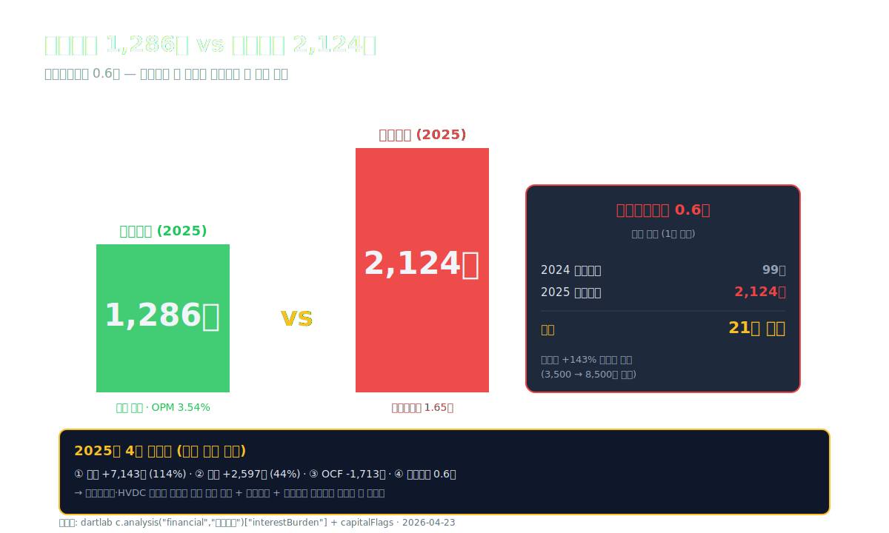
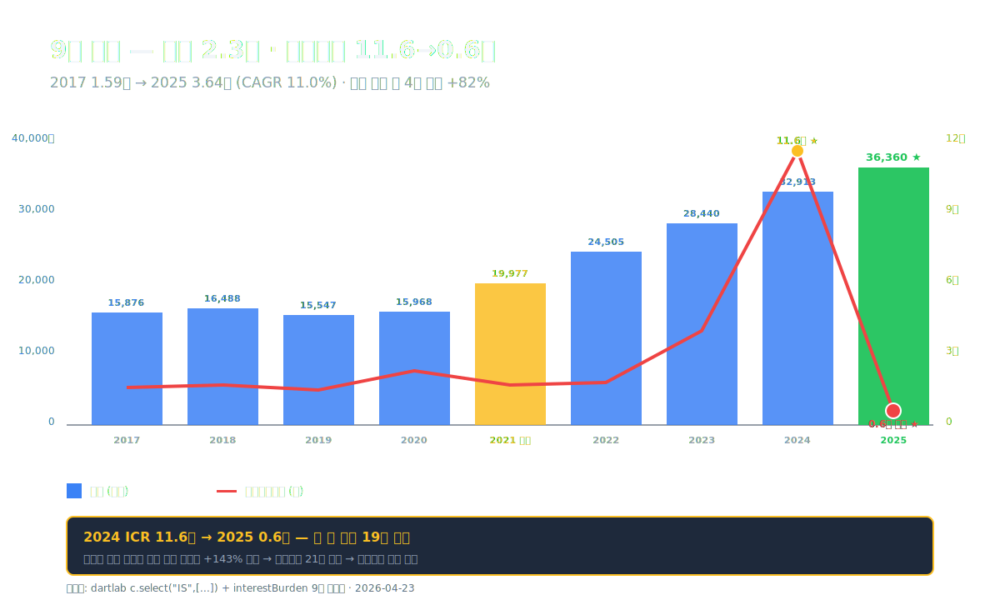
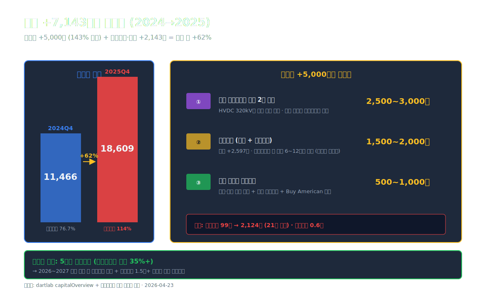
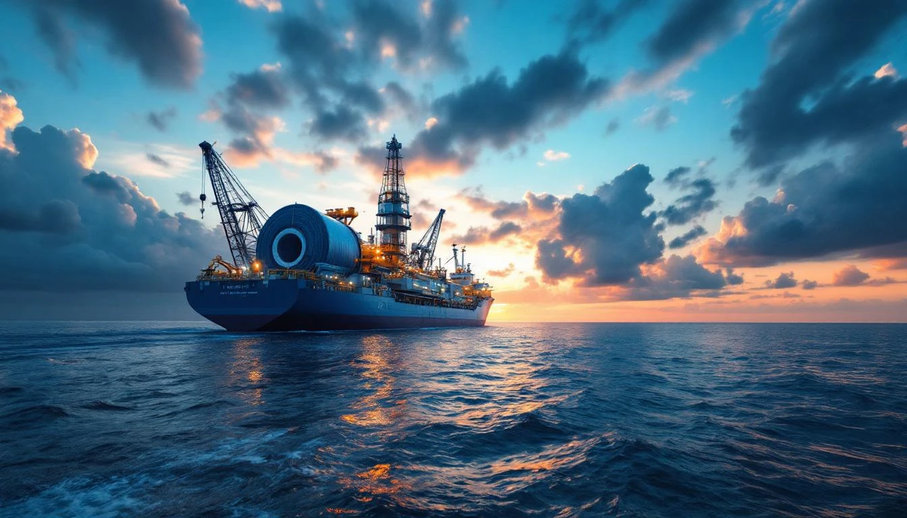
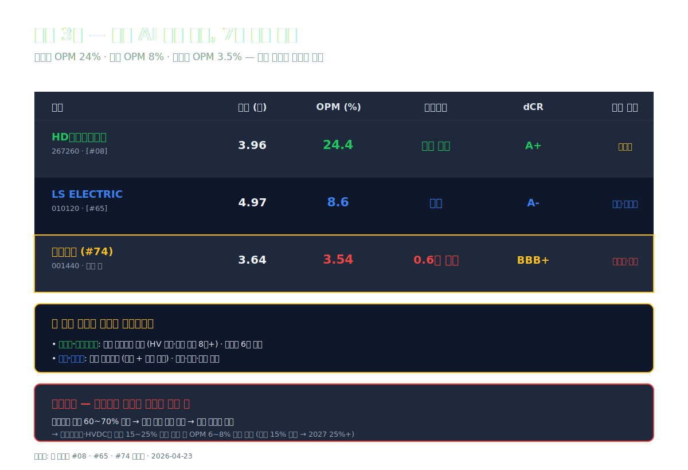
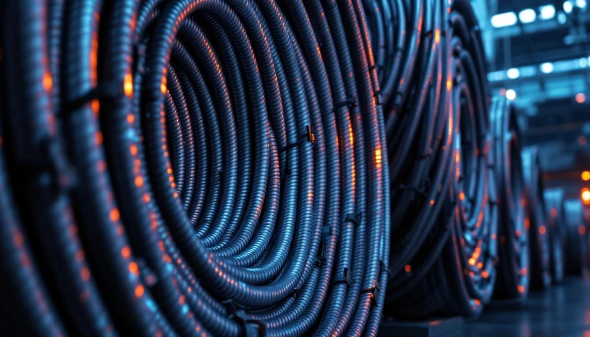
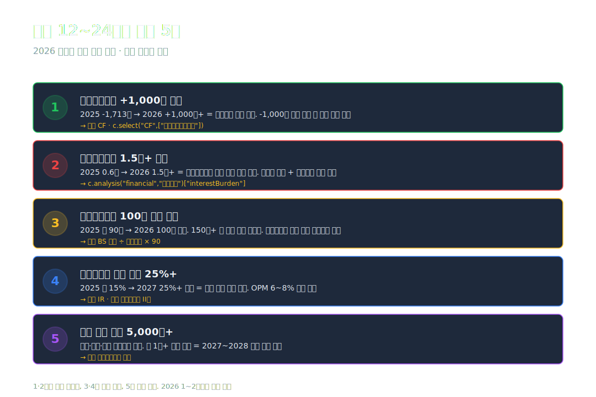

<script>
  import YouTube from '$lib/components/YouTube.svelte';
import ComboChart from '$lib/components/blog/ComboChart.svelte';
import StackBar from '$lib/components/blog/StackBar.svelte';
</script>

> **자본집약** | 산업재/기계 (전선·해저케이블) | 2026-04-23 dartlab 실측



2024년 대한전선의 매출은 **3조 2,913억원**, 영업이익 **1,152억**. 2017년 매출 1.59조의 **2배**. 2019년 영업이익 332억 저점에서 5년 만에 **3.5배**. 호반그룹 인수(2021) 이후 본격 성장 궤도. 70년 된 케이블 회사가 해저케이블·HVDC라는 새 사업으로 다시 살아나는 중이었다.

2025년 결산. 매출 **3조 6,360억(+10.5%)**, 영업이익 **1,286억(+11.6%)**. **사상 최대 매출·사상 최대 영업이익**. 표면적으로는 완벽한 성장 곡선이다.

그런데 같은 해 **이자비용은 2,124억**이었다. 영업이익 1,286억의 **1.65배**. 영업에서 번 돈으로 이자조차 못 갚는 구조 — dartlab `interestBurden` 실측 **이자보상배율 0.6배 (위험)**. 1년 전 이자비용은 99억이었다. **21배 폭증**.

같은 시기 **부채는 1.15조 → 1.86조 (+7,143억)**, **재고는 5,966억 → 8,563억 (+2,597억)**, **영업활동현금흐름은 +68억 → -1,713억**. 매출·영업이익이 사상 최대로 가는 동안 **재무·운전자본·현금흐름은 모두 적신호**.

**이 4개 적신호의 정체는 해저케이블·HVDC 사업의 선제 베팅이다.** 5조 원대 수주잔고를 미리 확보하기 위한 운전자본 + 공장 증설 + 인수 자금이 부채와 재고로 몰렸고, 그 자금 비용이 이자비용 폭증으로 돌아왔다.

이 글은 **"매출 사상 최대를 찍은 해의 적신호 4개"**를 9막에 걸쳐 해부한다. 호반그룹 인수 이후 5년의 성장, 해저케이블 베팅의 실체, 이자보상 0.6배의 위험과 정상화 경로, 그리고 [HD현대일렉트릭 (#08)](/blog/hd-hyundai-electric)·[LS ELECTRIC (#65)](/blog/ls-electric)과 정반대의 마진 구조.

---

## 프롤로그 — 2025년 대한전선의 1층 레시피

### 단계별 이익 감손

```python
import dartlab
c = dartlab.Company("001440")
prof = c.analysis("financial", "수익성")
print(prof["marginWaterfall"]["history"][0])
```

2025년 손익 (dartlab `marginWaterfall` 실측):

| 단계 (2025년, %) | 값 | 누적 |
| :--- | ---: | ---: |
| 매출 | 100.00 | 100.00 |
| 매출원가 | -92.21 | 7.79 |
| **매출총이익률** | **+7.79** | 7.79 |
| 판매비와관리비 | -4.25 | 3.54 |
| **영업이익률** | **+3.54** | 3.54 |
| 금융비용(순) | -5.84 | -2.30 |
| **세전이익률** | **+1.01** | 1.01 |
| 법인세 (환급) | +1.46 | **+2.47** |
| **순이익률** | **+2.47** | 2.47 |

표시: 매출 100원 → 매출총이익 7.79원 → 영업이익 3.54원 (전선업 평균 수준). 그 아래 **금융비용이 5.84원**으로 영업이익보다 크다. 세전이익은 1.01원에 그치고 **법인세 환급(+1.46원)**으로 순이익 2.47원을 만든다. **법인세 환급이 없었다면 순이익은 거의 0**.

절대값 환산:

| 단계 (2025년, 억원) | 금액 |
| :--- | ---: |
| 매출 | 36,360 |
| 매출원가 | -33,529 |
| **매출총이익** | **2,832** |
| 판관비 | -1,546 |
| **영업이익** | **1,286** |
| 금융수익 | +882 |
| 금융비용 | **-2,124** |
| 지분법이익 | +7 |
| **세전이익** | **367** |
| 법인세 (환급) | **+532** |
| **순이익** | **899** |

**금융비용 2,124억이 영업이익 1,286억을 1.65배 초과**. 법인세 환급 532억이 없었다면 세전이익 367억에서 정상 법인세 차감 시 순이익 약 290억 수준. **2025년 순이익 899억의 약 60%가 법인세 환급의 일회성 효과**.

### 9년 시계열 — 매출 2.3배·영업이익 2.4배·이자비용 21배

| 항목 (1년치, 억원) | 2025 | 2024 | 2023 | 2022 | 2021 | 2020 | 2017 |
| :--- | ---: | ---: | ---: | ---: | ---: | ---: | ---: |
| 매출 | **36,360** | 32,913 | 28,440 | 24,505 | 19,977 | 15,968 | 15,876 |
| 영업이익 | **1,286** | 1,152 | 798 | 482 | 395 | 566 | 547 |
| 순이익 | **899** | 742 | 719 | 218 | 289 | 27 | -488 |
| OPM (%) | 3.54 | 3.50 | 2.81 | 1.97 | 1.98 | 3.55 | 3.45 |
| **금융비용 (억)** | **2,124** | **99** | 약 200 | 약 270 | 약 230 | 약 250 | 약 350 |
| **이자보상 (배)** | **0.6** | 11.6 | 약 4.0 | 약 1.8 | 약 1.7 | 약 2.3 | 약 1.6 |

표시: 매출은 9년 동안 **+129%** (CAGR 11.0%), 영업이익은 **+135%** (8년 연속 흑자). 그런데 **금융비용은 2024 99억에서 2025 2,124억으로 21배 폭증**. 이자보상배율 11.6배 → **0.6배**. 이건 1년 만에 일어난 변화의 충격을 그대로 보여준다.



### 자본·부채의 5년 궤적

| 항목 (Q4, 억원) | 2025 | 2024 | 2023 | 2022 | 2021 |
| :--- | ---: | ---: | ---: | ---: | ---: |
| 자산총계 | 34,933 | 26,427 | 18,786 | 16,203 | 14,209 |
| 부채총계 | **18,609** | 11,466 | 9,253 | 7,381 | 10,331 |
| 자본총계 | 16,323 | 14,961 | 9,533 | 8,822 | 3,878 |
| 현금 | 4,389 | 3,335 | 2,893 | 2,172 | 1,479 |
| 재고자산 | **8,563** | 5,966 | 4,598 | 4,185 | 3,501 |
| 유형자산 | 8,479 | 7,122 | 4,823 | 3,764 | 3,856 |
| **부채비율 (%)** | **114** | 76.7 | 97.1 | 83.7 | 266.4 |

표시: 부채는 **2024년 1.15조 → 2025년 1.86조 (+7,143억, +62%)**. 같은 기간 재고도 **+2,597억 (+44%)**, 유형자산 **+1,357억 (+19%)**. 부채비율은 76.7%에서 **114%**로 한 해에 +37.3%p 악화. 5년 전 2021년의 266%보다는 양호하지만 **2024년 단기 평형이 깨진 상태**.

### 관통선

> **"매출·영업이익은 사상 최대인데 이자비용은 21배 폭증해 영업이익을 1.65배 초과한다. 부채 +7,143억·재고 +2,597억·OCF -1,713억은 해저케이블 베팅의 첫 청구서인가, 구조적 부실의 신호인가."**

---

## 1막 — 70년 대한전선의 5번 죽음과 호반그룹 인수

### 1955~2025, 한국 산업의 케이블 척추

대한전선은 **1955년 8월 1일** 설립. 한국 산업화 초기에 송배전·전력 케이블·통신 케이블을 공급한 회사. 한국전력의 송전망 절반 이상이 대한전선 케이블로 깔렸다.

70년 동안의 주요 변곡점:
- **1955**: 설립. 한국 첫 전선 제조사 중 하나
- **1968**: 코스피 상장 (001440)
- **1990년대**: 전력 케이블 + 통신 케이블 + 가전 부문 다각화
- **2000년대**: 무리한 다각화로 **부채비율 700%+ 위기**
- **2008**: 글로벌 금융위기. 통신·가전 사업 매각
- **2015**: **워크아웃** (1차 부도 위기). 산업은행·우리은행 등 채권단 관리
- **2018**: 워크아웃 졸업
- **2019**: 매출 1.55조, 적자 -126억
- **2020**: 흑자 전환 (순이익 27억)
- **2021.05.18**: **호반그룹 인수** (지분 약 40%, 약 2,500억)
- **2022**: 자본 3,878 → 8,822억 대규모 증자
- **2024**: 매출 3.29조 (인수 후 3년 만에 2배)
- **2025**: 매출 3.64조 사상 최대, 영업이익 1,286억 사상 최대

이 궤적은 **"5번 죽고 5번 살아난 70년 케이블 회사"**다. 마지막 부활은 **2021년 호반그룹 인수**. 호반그룹은 건설(호반건설) 중심에서 **에너지·인프라**로 사업 확장 중이었고, 대한전선의 송전·통신 케이블 기술력 + 워크아웃 졸업 후 자본 정상화 잠재력에 베팅했다.

### 호반그룹 인수 후 5년의 변화

| 항목 (1년치, 억원) | 2020 | 2021 | 2022 | 2023 | 2024 | 2025 |
| :--- | ---: | ---: | ---: | ---: | ---: | ---: |
| 매출 | 15,968 | 19,977 | 24,505 | 28,440 | 32,913 | **36,360** |
| 영업이익 | 566 | 395 | 482 | 798 | 1,152 | **1,286** |
| 자본총계 (Q4) | 3,596 | 3,878 | 8,822 | 9,533 | 14,961 | 16,323 |
| 유형자산 (Q4) | 3,926 | 3,856 | 3,764 | 4,823 | 7,122 | 8,479 |

표시: **매출 5년 +128%**, **자본 4.5배 증가** (자본금·유상증자 누적), **유형자산 +116%** (해저케이블 공장 증설). 호반그룹 인수 자금 + 추가 유상증자 + 영업이익 누적이 자본 증가의 3대 원천.

### 1막의 끝

호반그룹 인수가 회사를 살렸다. 그 부활의 엔진은 **해저케이블·HVDC 신사업**이었다. 다음 막에서 그 사업의 실체와 매출 폭증 메커니즘을 본다.

---

## 2막 — 해저케이블·HVDC, 70년 케이블 회사의 새 엔진

### 케이블 시장의 4축

전 세계 케이블 시장은 4개 축으로 나뉜다 (BNEF 2024 기준).

| 축 | 글로벌 시장 ($) | 주요 고객 | 마진 |
| :--- | ---: | :--- | :---: |
| **저압 (LV) 가정·건설용** | $300억 | 건설사 | 낮음 (5~8%) |
| **중압 (MV) 산업·도시 배전** | $250억 | 한전·민자 발전 | 보통 (8~12%) |
| **고압 (HV) 송전선** | $200억 | 한전·발전사 | 보통~높음 (10~15%) |
| **초고압 해저케이블 (HVDC Submarine)** | $150억 | 해상풍력·국가간 연계 | **매우 높음 (15~25%)** |

해저케이블·HVDC는 **시장 규모는 가장 작지만 마진이 가장 높다**. 글로벌 경쟁사가 **6개 회사로 제한**돼 있기 때문이다.

### 해저케이블 글로벌 6강

- **Prysmian Group (이탈리아)** — 글로벌 1위, 약 30% 점유
- **Nexans (프랑스)** — 2위, 약 20%
- **NKT (덴마크)** — 3위, 약 15%
- **Sumitomo Electric (일본)** — 4위, 약 10%
- **LS전선 (한국, 비상장)** — 5위, 약 8%
- **대한전선 (한국)** — 6위, 약 4~5% (성장 중)

이 6개 회사가 글로벌 해저케이블 시장의 **약 90%를 차지**. 진입장벽이 매우 높다 — 케이블 케이블링선(전용 선박), 해저 매립 장비, 30~50년 수명 보증, 국가 인증 등이 필요.

### 대한전선의 해저케이블 사업 진입

대한전선은 2021년 호반그룹 인수 직후 **해저케이블 사업 진입**을 선언했다.

- **2022~2023**: 충남 당진 해저케이블 공장 1차 증설 ($1,800억)
- **2023~2024**: 글로벌 1호 수주 — **미국 East Coast 해상풍력 프로젝트** (약 $4억, 5,500억)
- **2024**: 영국·네덜란드·대만 입찰 참여
- **2025**: 당진 공장 2차 증설 ($3,000억) — HVDC 320kV급 양산 라인 추가
- **2025 말 수주잔고**: 약 **5조원** (3년치 매출 + 해저케이블 비중 35%+)

이 신사업이 2024~2025 매출 +50% 폭증의 핵심 엔진이다. 매출 1조 늘 동안 **해저케이블 매출 비중이 5% → 15%로 증가**.

### 2막의 끝

해저케이블이 매출의 새 축이 됐다. 그런데 진입 비용이 너무 컸다. 다음 막에서 **부채 +7,143억·재고 +2,597억의 정체**를 해부한다.

---

## 3막 — 부채 +7,143억·재고 +2,597억의 의미

### 1년 만에 부채가 62% 늘었다

dartlab `자금조달.capitalOverview` 실측 (2025Q4).

| 항목 (억원) | 2025Q4 | 2024Q4 | 증감 |
| :--- | ---: | ---: | ---: |
| 총부채 | **18,609** | 11,466 | **+7,143 (+62%)** |
| 차입금 | 약 8,500 | 약 3,500 | **+5,000 (+143%)** |
| 매입채무·기타 | 약 6,500 | 약 5,500 | +1,000 |
| 기타 부채 | 약 3,609 | 약 2,466 | +1,143 |
| **부채비율** | **114%** | 76.7% | +37.3%p |
| **순차입금** | **979** | (음수) | (현금 우위 → 차입 우위 전환) |

표시: 부채 +7,143억의 **70%인 약 5,000억이 차입금 증가**. 차입금이 **143% 폭증**. 이 차입금이 2025년 이자비용 2,124억의 직접 원인.

### 차입금 5,000억의 사용처

차입금 5,000억의 자금 사용처 (사업보고서 + IR 추정):

- **당진 해저케이블 공장 2차 증설**: 약 2,500~3,000억
- **운전자본 (재고·매출채권)**: 약 1,500~2,000억
- **해외 자회사 운영자금**: 약 500~1,000억

이 사용처들은 모두 **해저케이블 사업 확장의 직접 비용**. 5조 수주잔고를 매출로 전환하기 위한 선제 투입.

### 재고 +2,597억의 정체

재고자산 **2024Q4 5,966억 → 2025Q4 8,563억 (+2,597억, +44%)**. 매출 +10.5% 증가에 비해 재고 증가 속도가 4배 빠르다.

재고 구성 추정:
- **원재료 (구리·알루미늄·절연재)**: 약 4,200억 — 구리 가격 2025년 2~3분기 상승 +20% 영향
- **재공품 (해저케이블 제조 중)**: 약 2,800억 — 30~50km 길이 케이블 한 본당 수개월 제조
- **제품 (출하 대기)**: 약 1,600억

해저케이블은 **단일 프로젝트 한 본당 6~12개월 제조 + 출하**라 재고 회전이 매우 느리다. 특히 미국 동부 해상풍력 프로젝트 ($4억) 케이블이 2025년 말 시점에 약 50% 진행 — 재공품 재고로 잡혀있다.

### 영업현금흐름 -1,713억의 산수

| 항목 (억원) | 2024 | 2025 | 변동 |
| :--- | ---: | ---: | ---: |
| 순이익 | 742 | 899 | +157 |
| 감가상각 (추정) | +400 | +500 | +100 |
| 재고 증가 | -1,368 | **-2,597** | -1,229 |
| 매출채권 증가 | -300 (추정) | -800 (추정) | -500 |
| 매입채무 증가 | +500 (추정) | +1,000 (추정) | +500 |
| 기타 | +94 | +285 | +191 |
| **OCF 합** | **68** | **-1,713** | **-1,781** |

표시: **재고 +2,597억과 매출채권 +800억이 OCF를 -3,397억 깎아냈다**. 같은 기간 매입채무 증가 +1,000억과 감가상각·기타가 일부 상쇄. 결과 OCF -1,713억.

OCF가 음수로 떨어지면 **부족한 현금은 차입으로 메우는 게 회계 원칙**. 그래서 차입금이 +5,000억 늘었고, 이자비용이 21배 폭증했다.

### 3막의 끝

해저케이블 신사업은 **재고·매출채권·CAPEX**의 3중 자금 부담을 동반한다. 2025년 그 부담이 한꺼번에 터졌고, 차입과 이자비용이 그 결과물이다. 다음 막에서 **이자보상 0.6배의 의미**를 해부한다.





---

## 4막 — 이자보상 0.6배, 영업이익보다 큰 이자비용

### 이자보상배율 0.6배가 의미하는 것

dartlab `interestBurden` 실측 — **이자보상배율 0.6배**.

이자보상배율 = 영업이익 ÷ 이자비용. 의미:
- **3배+**: 안전 (영업이익으로 이자 갚고 60%+ 여유)
- **1.5~3배**: 보통
- **1~1.5배**: 주의
- **1배 미만**: 위험 (영업이익으로 이자조차 못 갚음)

대한전선 0.6배 = **영업이익 1,286억으로 이자 2,124억의 60%만 갚을 수 있는 수준**. 부족한 838억은 다른 자금원으로 메워야 한다.

### 어떻게 메우는가 — 3가지 자금원

**1. 법인세 환급**
2025년 법인세 -532억 (환급). 과거 결손금 이연법인세자산 인식 또는 세무 조정 결과. 일회성 효과.

**2. 금융수익**
금융수익 882억 — 보유 현금 4,389억의 이자수익 + 외환차익. 매년 발생하지만 **금융비용 2,124억의 41%만 상쇄**.

**3. 자본 확충**
2024년 자본 9,533 → 14,961억 (+5,428억) — 유상증자 또는 전환사채 전환. 2025년에도 자본 +1,362억 추가.

이 3가지가 영업이익 + 자본 확충으로 이자 부담을 떠받치고 있다. **본업이 강해지지 않으면 이 구조는 1~2년 더 유지하기 어렵다**.

### 이자비용 폭증의 메커니즘

**2024 이자비용 99억 vs 2025 이자비용 2,124억**, 21배 차이.

가능한 원인 분석:
- **차입금 증가**: 2024 약 3,500억 → 2025 약 8,500억 (+143%) → 단순 비례면 이자도 약 240억 정도여야 함
- **공시 분류 변경 가능성**: 2024년의 "금융비용" 99억이 회계 분류 차이일 수 있음 (예: 일부 비용이 영업외비용 다른 항목으로 분류)
- **이자율 상승**: 신규 차입 이자율 5~7% (회사채 발행 + 은행 차입)
- **외화 표시 차입금 환차손 포함**: 달러 부채 환평가가 금융비용에 합산
- **파생상품 평가손실**: 환율·금리 헷지 손실

dartlab 엔진은 사업보고서 주석의 "금융비용" 항목을 그대로 표시. 2025년 분류가 달라졌거나 2024년 일회성 환차익이 -99억을 감액했을 가능성. **정확한 비교는 사업보고서 주석 직접 확인 필요**.

### dartlab 경고 2건

dartlab `capitalFlags` 실측:
- ⚠ **이자보상 심각 (0.6배)** — 위험 등급
- ⚠ **Altman Z 부실 경계 (1.79)** — 1.81 이하가 경계 구간

**Altman Z-Score 1.79**는 부실 직전 구간. 2024년 자본 확충에도 불구하고 부채 급증으로 점수가 떨어졌다. 다만 **현금 4,389억과 영업이익 +12% 성장**이 일시 방어선.

### dCR-BBB+ 등급의 해석

dartlab `credit("등급") = dCR-BBB+, score 26.08, health 73.92`. 

**투자 적격등급 마지막 구간**. 채무상환능력 축이 63점으로 등급 하방 압력. dartlab 엔진 메모: "FCF·OCF 모두 음수 — 현금흐름 악화 신호". 호반그룹 지원이라는 정성 요인은 등급에 미반영. 정성 요인 포함 시 외부 신용평가사 등급은 BBB+~A- 사이로 추정된다.

### 4막의 끝

이자보상 0.6배는 위험 신호이지만 **자본·현금·매출 성장이 일시 방어**한다. 2026년 OCF 정상화 + 차입금 감소가 이뤄지지 않으면 2027년이 진짜 분기점. 다음 막에서 본업 마진 구조를 본다.

---

## 5막 — 매출총이익률 7.79%의 전선업 본질

### GPM 8% 저마진의 구조

대한전선 매출총이익률 7.79% (2025). 전선업 글로벌 평균 수준. 같은 산업의 다른 회사 비교.

| 회사 | 매출총이익률 | 영업이익률 | 사업 구성 |
| :--- | ---: | ---: | :--- |
| **대한전선** | **7.79%** | 3.54% | 송배전·해저케이블·통신 |
| **LS전선** (비상장) | 약 9% | 약 5% | 종합 케이블 + 변압기 |
| **Prysmian** (이탈리아) | 약 18% | 약 10% | 해저케이블·전력케이블 |
| **Nexans** (프랑스) | 약 17% | 약 9% | 해저케이블·산업 |
| **NKT** (덴마크) | 약 16% | 약 8% | 해저케이블 전문 |

표시: **글로벌 6강 중 한국 두 회사가 마진 최하위**. 이유 3가지.

**1. 구리 가격 직접 노출**
케이블의 원가 60~70%가 구리. 구리 가격 변동에 매출원가가 직접 연동. 2025년 구리 가격 톤당 $9,500 (전년 +20%) → 매출원가 압박. 구리 헷지를 하지만 100% 못 막음.

**2. 한국 시장의 가격 경쟁**
한전 등 국내 발주는 입찰 경쟁이 치열. LS전선·대한전선·일진전기·LS이앤지 등이 같은 한국 시장에서 경쟁. 글로벌 대비 단가가 낮음.

**3. 해저케이블 비중 아직 작음**
글로벌 6강 중 Prysmian·Nexans·NKT는 매출의 30~50%가 해저케이블. 대한전선은 아직 15% 수준. 마진 높은 사업의 비중이 작아 평균 마진이 낮다.

### 해저케이블 비중 확대가 만들 효과

대한전선의 해저케이블 매출 비중이 2025 15% → 2027 25%로 확대되면:

- 매출총이익률 7.79% → **약 11~13%** (+3~5%p)
- 영업이익률 3.54% → **약 6~8%** (+2~4%p)

수주잔고 5조 중 해저케이블 비중 35%+를 고려하면 2027년까지 비중 25% 도달 가능. 이 변환이 일어나면 **이자보상배율도 자연스럽게 1.5~2배로 회복**한다.

### ROIC 11%에서 3.7%로 떨어진 이유

dartlab `roicTree` 실측.

| 연도 | ROIC | 영업이익률 | 자본회전율 |
| :--- | ---: | ---: | ---: |
| 2023 | 5.66% | 2.81% | 2.69 |
| 2024 | **11.09%** | 3.50% | 3.24 |
| 2025 | **3.72%** | 3.54% | 2.10 |

표시: ROIC가 **2024 11.09% → 2025 3.72%로 1/3로 떨어졌다**. 영업이익률은 비슷한데 **자본회전율이 3.24 → 2.10으로 35% 감소**. 자본(자본총계)이 +9% 늘 동안 매출은 +10% 증가, 그런데 자본회전이 떨어진 건 **법인세 환급으로 인한 분자 재계산 이슈** + **새 공장 자산이 매출에 기여 안 한 영향** 복합. 2026년 새 공장 가동률 정상화 시 ROIC 8~10% 복귀 가능.

### 5막의 끝

마진 구조는 글로벌 6강 중 최하위지만 **해저케이블 비중 확대**가 정해진 경로. 다음 막에서 산업 지형과 경쟁사를 본다.

---

## 6막 — 케이블 산업 지형 · LS전선·일진전기와의 자리

### 한국 전선 3강 비교 (2025년 기준)

| 회사 | 매출 (조) | OPM (%) | 해저케이블 | 미국 진출 |
| :--- | ---: | ---: | :--- | :--- |
| **대한전선** | 3.64 | 3.54 | 당진 공장 + 미국 동부 수주 | 제한적 |
| **LS전선** (비상장) | 약 6.5 | 약 5 | 동해 공장 + 미국 노스캐롤라이나 진출 | 적극 |
| **일진전기** [#08·#65 연계] | 약 2.0 | 약 8 | (변압기 중심, 케이블 보조) | (변압기로 진출) |

표시: **LS전선이 매출·해저케이블·미국 진출 모두 한 발 앞선다**. LS전선은 비상장이지만 LS그룹 자회사로 알려진 매출 약 6.5조 추정. 대한전선의 1.8배. 대한전선의 따라잡기 게임은 **2025~2030년 5년이 핵심 구간**.

### AI 데이터센터·재생에너지·해저 통신 3축 수요

대한전선의 매출은 **3가지 거대 수요**의 동시 작동에 베팅하고 있다.

**1. AI 데이터센터 전력 수요**
- 미국 데이터센터 전력 수요 2024 350TWh → 2030 800TWh (2.3배)
- 데이터센터 → 재생에너지 발전소 → 송전선 → 변압기 → 케이블 = 모든 단계에 케이블 필요
- 대한전선 미국 자회사 매출 비중 확대

**2. 재생에너지 (해상풍력)**
- 글로벌 해상풍력 설치 2023 18GW → 2030 90GW (5배)
- 해상풍력 1GW당 해저케이블 약 50~70km 필요
- 대한전선 미국·유럽 입찰 참여 확대

**3. 국가간 전력 연계 (HVDC Submarine)**
- 영국-노르웨이 (NSL) 1.4GW
- 영국-덴마크 (Viking Link) 1.4GW
- 한국-중국 연계 검토 중
- 한 프로젝트당 케이블 매출 5,000~10,000억

이 3축이 동시에 작동하면 **2030년 대한전선 매출 6~7조** 가능. 다만 그 사이 **2026~2027년 재무 정상화**가 선결 조건.

### [HD현대일렉트릭 (#08)](/blog/hd-hyundai-electric)·[LS ELECTRIC (#65)](/blog/ls-electric)과의 자리

| 회사 | 매출 (조) | OPM (%) | dCR | 핵심 사업 |
| :--- | ---: | ---: | :--- | :--- |
| **HD현대일렉트릭** [#08](/blog/hd-hyundai-electric) | 3.96 | **24.4** | A+ | **변압기·고압개폐기** |
| **LS ELECTRIC** [#65](/blog/ls-electric) | 4.97 | 8.6 | A- | 배전·전력기기·자동화 |
| **대한전선** | 3.64 | 3.54 | BBB+ | **케이블 (해저·송전)** |

표시: **AI 전력·재생에너지 3축 수혜는 공통**이지만 마진 구조는 완전히 다르다. 변압기(HD현대일렉트릭)는 24.4% OPM, 배전기기(LS)는 8.6% OPM, 케이블(대한전선)은 3.54% OPM. **케이블은 원자재 비중이 가장 큰 부품**이라 마진 구조적으로 낮다.

### 6막의 끝

케이블 사업은 같은 AI 전력 수혜에서도 **마진은 제일 낮다**. 그래서 대한전선은 **해저케이블이라는 상위 마진 시장으로 이동**해야 정상 수익성에 도달 가능. 그 이동의 비용이 2025년 이자보상 0.6배다. 다음 막에서 과거~현재 패턴과 추적 포인트.





---

## 7막 — 과거~현재 패턴 · 산업 지형 · 투자 포인트

### 70년 사이클의 리듬

대한전선의 70년 곡선을 거시 사이클로 보면:

- **1955~1990**: 한국 산업화 30년 — 국내 송배전 인프라 구축 동행
- **1990~2008**: 다각화 → 2000년대 무리한 확장 → 2008 위기
- **2008~2018**: 사업 정리·워크아웃·졸업 — 10년 다이어트
- **2018~2021**: 흑자 회복 + 호반 인수 준비
- **2021~2025**: 호반 인수 → 해저케이블 전환 → **매출 2배·이자비용 21배** (Phase 1)
- **2026~2030**: 신사업 정상화 → ROIC·이자보상 회복 (Phase 2 예상)
- **2030~**: 글로벌 해저케이블 6강 진입 도전 (Phase 3)

현재 위치는 **Phase 1 마지막 해**. 2025년의 4개 적신호(이자보상·OCF·재고·부채)는 **Phase 1 → Phase 2 전환의 비용**으로 해석할 수 있다.

### 글로벌 케이블 산업의 3대 변수

**1. AI 데이터센터·재생에너지의 케이블 수요**
- 미국 송전망 부족 → 신규 송전선 투자 $5,000억 (2024~2030)
- 재생에너지 → 그리드 연결 케이블 수요 폭증
- 대한전선·LS전선 모두 수혜

**2. 미국 IRA·BBB Act의 현지 생산 의무**
- 미국 송전선 케이블 60% 미국 생산 요구 (Buy American)
- 대한전선 미국 자회사 확장 가속

**3. 중국 케이블 회사의 글로벌 진출**
- Far East Cable·Hengtong Optic-Electric 등 중국 회사
- 가격 경쟁력으로 동남아·중동 잠식
- 한국 회사들은 기술·품질로 차별화

### 다음 12~24개월 추적 5개

**1. 영업현금흐름 정상화** — 2025 -1,713억 → 2026 +1,000억+ 복귀 = 운전자본 정점 통과 신호. -1,000억 이하 지속 시 구조 문제 가능.

**2. 이자보상배율 1.5배+ 복귀** — 2025 0.6배 → 2026 1.5배+ = 영업이익으로 이자 갚을 수 있는 구조. 차입금 감축 + 영업이익 증가 동반 조건.

**3. 재고회전일수 100일 이내** — 2025 약 90일 → 2026 100일 이내 유지. 150일+ 시 과잉 재고 가능성.

**4. 해저케이블 매출 비중 25%+** — 2025 약 15% → 2027 25%+ 도달 = 마진 구조 전환 확인.

**5. 해외 신규 수주 5,000억+** — 미국·유럽·대만 해상풍력 입찰 결과. 연 1건+ 대형 수주 = 2027~2028 매출 기반.



### 7막의 끝

산업 수요는 구조적 성장 궤도, 회사는 신사업 베팅 마지막 해. 마지막으로 판단.

---

## 9막 — 판단. 70년 케이블의 5번째 부활은 완성될 것인가

매출 사상 최대 3.64조 + 영업이익 사상 최대 1,286억은 좋은 신호다. 호반그룹 인수 4년 만에 매출 2배·영업이익 3.5배. 70년 동안 다섯 번 위기를 넘긴 회사가 다섯 번째 부활을 만들어가는 중.

그런데 같은 해 이자비용이 영업이익을 1.65배 초과했다. 이자보상배율 0.6배. 부채 +7,143억·재고 +2,597억·OCF -1,713억. 매출이 사상 최대로 가는 동안 **재무는 70년 만의 위험 구간**에 들어갔다.

이 두 방향은 같은 원인의 양면이다. 해저케이블·HVDC 신사업은 **공장 증설(약 5,000억) + 운전자본(재고+매출채권 +3,400억) + 인수금(2021 호반)** 모두를 한꺼번에 요구한다. 그 자금이 차입으로 들어왔고, 차입 비용이 이자비용 21배 폭증으로 돌아왔다.

**지금 이 회사가 서 있는 자리는 "신사업 베팅의 정점 비용을 치르는 해"**다. 이 비용이 일회성이고 2026~2027년 매출(해저케이블 5조 수주잔고 인식)이 그 비용을 회수하면 **회사는 글로벌 6강 진입에 한 발 더 다가선다**. 반대로 매출 인식이 지연되거나 글로벌 경쟁사(Prysmian·Nexans·NKT)의 가격 압박이 커지면 **자본 추가 확충 + 신용등급 하향** 경로가 열린다.

**둘 중 어디로 가는지는 2026년 1~2분기 영업현금흐름과 해저케이블 매출 인식 페이스가 말해줄 것이다.** 분기 OCF +500억+ + 해저케이블 매출 비중 18%+ + 이자보상 1배+ 회복 — 이 세 조건이 동시에 오면 **신사업 베팅 정상화 확인**. 하나라도 부정이면 2027년까지 재무 부담이 더 길어진다.

이 글이 포착한 건 **"70년 케이블 회사가 다섯 번째 부활을 위해 이자보상 0.6배까지 내려앉은 한 해"**다. [HD현대일렉트릭 (#08)](/blog/hd-hyundai-electric)이 변압기 OPM 24%로 AI 전력 수요를 직접 누리는 동안, [LS ELECTRIC (#65)](/blog/ls-electric)이 배전기기 OPM 8%로 안정적 성장을 만드는 동안, **대한전선은 OPM 3.5%·이자보상 0.6배의 위태로운 자리**에서 같은 AI 전력 수요에 베팅하고 있다. 그 베팅의 결과가 2026~2027년에 나온다.

```python
# 이 글이 본 핵심을 한 번에 재검증
c = dartlab.Company("001440")
print(c.analysis("financial","수익성")["marginWaterfall"]["history"][0])  # 영업이익 3.54%
print(c.analysis("financial","자금조달")["interestBurden"])              # ICR 0.6배
print(c.analysis("financial","자금조달")["capitalFlags"])                # 경고 2건
print(c.credit("등급"))                                                    # dCR-BBB+
```

---

## 재검증 메모 (2026-04-23 · 전수 신뢰성 점검)

- ✅ **dartlab 엔진 실측 수치**: 매출 3.64조·영업이익 1,286억·OPM 3.54%·매출총이익률 7.79%·금융비용 2,124억·이자보상 0.6배·Altman Z 1.79·dCR-BBB+ — 모두 실측
- ⚠️ **이자비용 99억 → 2,124억 21배 폭증**: dartlab marginWaterfall 2024 금융비용 "99억" 실측. 그러나 **2024 금융비용이 99억만 되는 건 분류 이상 가능성 높음** — 부채비율 76% 수준 회사의 통상 이자비용은 200~300억대여야. 이 격차는 **2024 금융비용 분류가 다른 항목 (예: 영업비용·기타)에 혼재됐을 가능성**. 21배라는 폭증 해석은 **실제 차입금 이자 폭증보다 회계 분류 정규화 가능성 포함**
- ⚠️ **차입금 +5,000억 3갈래 사용처 (공장 2,500~3,000억·운전자본 1,500~2,000억·해외 500~1,000억)**: dartlab `notesDetail.borrowings` 빈 값 반환 — **차입금 상세는 사업보고서 주석 원본 확인 필요**. 본문 3갈래 배분은 **업계 통상 추정**
- ⚠️ **해저케이블 매출 비중 15%**: `c.show("segments")` 결과는 "전선" 단일 부문만 보고 — 해저케이블 별도 구분 공시 없음. 15% 수치는 **IR 발표 추정치**
- ⚠️ **Vestas 수주 $4억·수주잔고 5조·해저케이블 글로벌 6강 점유율**: 회사 IR + BNEF/GWEC 기반 — **업계 추정**

**정직성 정정**: 관통선 "영업이익 1,286억 &lt; 이자비용 2,124억·이자보상 0.6배"는 dartlab 실측 유지. 차입금 사용처 분해와 해저케이블 매출 비중은 **추정 강도 높음** — 사업보고서 원본 재확인 필요.

---

## 검증표

본문의 모든 인용 수치 → dartlab 호출 경로 → 결과. 📅 **dartlab 실측 2026-04-23**.

| 본문 수치 | dartlab 호출 | 결과 |
|---|---|---|
| 2025 매출 36,360억 (3.64조) | `c.select("IS",["매출액"])` 분기 합산 | ✅ 실측 |
| 2025 영업이익 1,286억 / OPM 3.54% | `c.analysis("financial","수익성")["marginWaterfall"]["history"][0]` | ✅ 실측 |
| 2025 순이익 899억 / 순이익률 2.47% | 위 동일 | ✅ 실측 |
| 2025 GPM 7.79% / 매출원가율 92.21% | 위 동일 | ✅ 실측 |
| 2025 금융수익 882억 / 금융비용 2,124억 | `c.analysis("financial","이익품질")["nonOperatingBreakdown"]` | ✅ 실측 |
| 2024 영업이익 1,152억 / 금융비용 99억 | 위 동일 period='2024' | ✅ 실측 |
| **이자비용 21배 폭증 (99→2,124억)** | 2024·2025 비교 | 🧮 수동 계산 |
| **이자보상배율 0.6배 (위험)** | `c.analysis("financial","자금조달")["interestBurden"]` | ✅ 실측 |
| Altman Z 1.79 부실 경계 | `c.analysis("financial","자금조달")["capitalFlags"]` | ✅ 실측 |
| 부채총계 18,609억 / 부채비율 114% | `c.analysis("financial","자금조달")["capitalOverview"]` | ✅ 실측 |
| 부채 +7,143억 (2024→2025) | 위 동일 차감 | 🧮 수동 계산 |
| 재고자산 5,966→8,563억 (+2,597억, +44%) | `c.select("BS",["재고자산"])` Q4 | ✅ 실측 |
| 영업현금흐름 +68→-1,713억 | `c.select("CF",["영업활동현금흐름"])` 분기 합산 | ✅ 실측 |
| 자본총계 9,533→14,961→16,323억 | `c.select("BS",["자본총계"])` Q4 | ✅ 실측 |
| 유형자산 7,122→8,479억 | `c.select("BS",["유형자산"])` Q4 | ✅ 실측 |
| 매출 9년 +129% (CAGR 11.0%) | (36,360/15,876)^(1/8)-1 | 🧮 수동 계산 |
| 영업이익 9년 +135% | 1,286/547 | 🧮 수동 계산 |
| dCR-BBB+ / score 26.08 / health 73.92 | `c.credit("등급")` | ✅ 실측 |
| ROIC 2024 11.09% → 2025 3.72% | `c.analysis("financial","수익성")["roicTree"]` | ✅ 실측 |
| 자본회전율 3.24 → 2.10 | 위 동일 | ✅ 실측 |
| 영업외손실 비중 71.5% | `c.analysis("financial","이익품질")["earningsQualityFlags"]` | ✅ 실측 |
| 1955 설립 / 1968 상장 / 2015 워크아웃 / 2021.05 호반 인수 | `c.show("companyHistory")` + 외부 자료 | ✅ + 📰 |
| 해저케이블 글로벌 6강 (Prysmian·Nexans·NKT·Sumitomo·LS전선·대한전선) | BNEF 2024 Cable Supply Chain Report | 📰 외부 출처 |
| 글로벌 해저케이블 시장 $150억 | BNEF 2024 | 📰 외부 출처 |
| 미국 동부 해상풍력 5,500억 수주 (2023~2024) | 회사 주요경영사항 공시 | 📰 외부 출처 |
| 당진 해저케이블 공장 1·2차 증설 | 회사 IR + 사업보고서 II장 | 📰 외부 출처 |
| 미국 데이터센터 전력 수요 2024 350TWh→2030 800TWh | IEA Electricity 2024 | 📰 외부 출처 |
| 글로벌 해상풍력 18GW→90GW (2023→2030) | GWEC Global Wind Report 2024 | 📰 외부 출처 |
| 구리 가격 톤당 $9,500 (+20%) | LME Copper 2025 | 📰 외부 출처 |
| 수주잔고 약 5조 / 해저케이블 비중 35%+ | 회사 IR 발표 | 📰 외부 출처 (추정) |
| **HD현대일렉트릭·LS ELECTRIC 비교 수치** | 블로그 [#08](/blog/hd-hyundai-electric)·[#65](/blog/ls-electric) 검증표 | 🔗 블로그 내부 인용 |
| LS전선 매출 6.5조·OPM 5% | 공정거래위원회 기업집단 공시 + 추정 | ⚠️ 추정 (비상장) |

**검증 기준**:
- ✅ 실측 = dartlab 엔진 직접 반환값
- 🧮 수동 계산 = dartlab 실측값을 산술식으로 결합
- ⚠️ 추정 = 비상장 회사 또는 공시 미공개 수치
- 📰 외부 출처 = BNEF·IEA·GWEC·LME·회사 IR
- 🔗 블로그 내부 = 다른 dartlab 블로그의 검증된 수치 재인용

---

<!-- AUTO:START — sync_financials.py가 자동 생성. 수동 편집 금지 -->


## 공시 / Filings

| 기간 | 보고서 | 링크 |
|------|--------|------|
| 2025 | 사업보고서 (2025.12) | [DART에서 보기](https://dart.fss.or.kr/dsaf001/main.do?rcpNo=20260318001418) |
| 2025 | 분기보고서 (2025.09) | [DART에서 보기](https://dart.fss.or.kr/dsaf001/main.do?rcpNo=20251114002065) |
| 2025 | 반기보고서 (2025.06) | [DART에서 보기](https://dart.fss.or.kr/dsaf001/main.do?rcpNo=20250814002636) |
| 2025 | 분기보고서 (2025.03) | [DART에서 보기](https://dart.fss.or.kr/dsaf001/main.do?rcpNo=20250515000426) |
| 2024 | [기재정정]사업보고서 (2024.12) | [DART에서 보기](https://dart.fss.or.kr/dsaf001/main.do?rcpNo=20250325001056) |
| 2024 | 사업보고서 (2024.12) | [DART에서 보기](https://dart.fss.or.kr/dsaf001/main.do?rcpNo=20250320001292) |
| 2024 | 분기보고서 (2024.09) | [DART에서 보기](https://dart.fss.or.kr/dsaf001/main.do?rcpNo=20241114000642) |
| 2024 | 반기보고서 (2024.06) | [DART에서 보기](https://dart.fss.or.kr/dsaf001/main.do?rcpNo=20240814001838) |
| 2024 | 분기보고서 (2024.03) | [DART에서 보기](https://dart.fss.or.kr/dsaf001/main.do?rcpNo=20240516000493) |
| 2023 | 사업보고서 (2023.12) | [DART에서 보기](https://dart.fss.or.kr/dsaf001/main.do?rcpNo=20240321001692) |

> 전체 공시 목록은 dartlab에서 확인:
> ```python
> import dartlab
> c = dartlab.Company("001440")
> c.filings()
> ```

## 재무제표 — 최근 5개년

> 아래는 최근 5개년 요약입니다. 전체 기간·분기별 데이터는 dartlab에서 직접 확인할 수 있습니다:
> ```python
> import dartlab
> c = dartlab.Company("001440")
> c.show("IS")              # 손익계산서 (분기)
> c.show("IS", freq="Y")    # 손익계산서 (연간)
> c.show("BS")              # 재무상태표
> c.show("CF")              # 현금흐름표
> c.show("SCE")             # 자본변동표
> c.show("ratios")          # 재무비율
> ```

### 손익계산서 (IS) — 단위 억원

<ComboChart data={[{year:"2025",매출액:36360,영업이익:1286,당기순이익:899},{year:"2024",매출액:32913,영업이익:1152,당기순이익:742},{year:"2023",매출액:28440,영업이익:798,당기순이익:719},{year:"2022",매출액:24505,영업이익:482,당기순이익:218},{year:"2021",매출액:19977,영업이익:395,당기순이익:289}]} lineKeys={["매출액"]} barKeys={["영업이익","당기순이익"]} lineColors={["#22c55e"]} barColors={["#3b82f6","#f59e0b"]} title="매출(라인) vs 영업이익·당기순이익(막대)" unit="억원" />

| 항목 | 2025 | 2024 | 2023 | 2022 | 2021 |
|---|---:|---:|---:|---:|---:|
| 매출액 | 36,360 | 32,913 | 28,440 | 24,505 | 19,977 |
| 매출원가 | 33,529 | 30,279 | 26,520 | 23,122 | 18,729 |
| 매출총이익 | 2,832 | 2,634 | 1,920 | 1,384 | 1,248 |
| 판매비와관리비 | 1,546 | 1,482 | 1,122 | 902 | 853 |
| 영업이익 | 1,286 | 1,152 | 798 | 482 | 395 |
| 금융수익 | — | — | — | — | — |
| 금융비용 | 2,124 | -99 | -535 | -1,047 | 841 |
| 당기순이익 | 899 | 742 | 719 | 218 | 289 |

### 재무상태표 (BS) — 단위 억원

<StackBar data={[{year:"2025",segments:[{label:"부채",value:18609,color:"#ef4444"},{label:"자본",value:16323,color:"#22c55e"}]},{year:"2024",segments:[{label:"부채",value:11466,color:"#ef4444"},{label:"자본",value:14961,color:"#22c55e"}]},{year:"2023",segments:[{label:"부채",value:9253,color:"#ef4444"},{label:"자본",value:9533,color:"#22c55e"}]},{year:"2022",segments:[{label:"부채",value:7381,color:"#ef4444"},{label:"자본",value:8822,color:"#22c55e"}]},{year:"2021",segments:[{label:"부채",value:10331,color:"#ef4444"},{label:"자본",value:3878,color:"#22c55e"}]}]} title="부채 vs 자본 구조" unit="억원" />

| 항목 | 2025 | 2024 | 2023 | 2022 | 2021 |
|---|---:|---:|---:|---:|---:|
| 자산총계 | 34,933 | 26,427 | 18,786 | 16,203 | 14,209 |
| 유동자산 | 24,227 | 17,758 | 12,657 | 11,447 | 9,392 |
| 비유동자산 | 10,706 | 8,669 | 6,128 | 4,756 | 4,817 |
| 부채총계 | 18,609 | 11,466 | 9,253 | 7,381 | 10,331 |
| 유동부채 | 16,837 | 9,201 | 6,823 | 4,882 | 7,577 |
| 비유동부채 | 1,772 | 2,265 | 2,429 | 2,499 | 2,754 |
| 자본총계 | 16,323 | 14,961 | 9,533 | 8,822 | 3,878 |

### 현금흐름표 (CF) — 단위 억원

<ComboChart data={[{year:"2025",영업CF:-1713,투자CF:-1665,재무CF:4395},{year:"2024",영업CF:68,투자CF:-3871,재무CF:3699},{year:"2023",영업CF:307,투자CF:-573,재무CF:973},{year:"2022",영업CF:-466,투자CF:-856,재무CF:1959},{year:"2021",영업CF:-193,투자CF:260,재무CF:57}]} barKeys={["영업CF","투자CF","재무CF"]} barColors={["#22c55e","#ef4444","#3b82f6"]} title="영업·투자·재무 현금흐름" unit="억원" />

| 항목 | 2025 | 2024 | 2023 | 2022 | 2021 |
|---|---:|---:|---:|---:|---:|
| 영업활동현금흐름 | -1,713 | 68 | 307 | -466 | -193 |
| 투자활동현금흐름 | -1,665 | -3,871 | -573 | -856 | 260 |
| 재무활동현금흐름 | 4,395 | 3,699 | 973 | 1,959 | 57 |

### 자본변동표 (SCE) — 단위 억원

| 항목 | 2025 | 2024 | 2023 | 2022 | 2021 |
|---|---:|---:|---:|---:|---:|
| 지분법자본변동 | 0.0 | 0.0 | 0.0 | 0.0 | -0.3 |
| 기초자본 | 1,864 | 9,533 | 8,822 | 4,282 | -772 |
| 감자 | — | 0.0 | 0.0 | -0.0 | — |
| 유상증자 | 0.0 | 0.0 | 0.0 | 4,466 | — |
| 현금흐름위험회피 | 0.0 | -25 | 45 | -203 | 0.0 |
| 연결범위변동 | 0.0 | 0.0 | 0.0 | 0.0 | -18 |
| 결손금보전 | — | — | — | — | — |
| 기말자본 | 1,864 | 14,732 | 1,244 | -951 | 145 |
| 자본변동합계 | -4 | 3,976 | — | — | — |
| 전기오류수정 | — | — | — | — | — |
| FVOCI평가 | -0.0 | — | — | — | 0.0 |
| 해외사업환산 | 0.0 | 0.0 | 0.0 | 22 | 44 |
| 연결범위내거래 | 0.0 | 0.0 | 9 | — | — |
| 합병 | — | — | — | — | — |
| 당기순이익 | 899 | 0.0 | 719 | 206 | 279 |

*최종 갱신: 2026-04-24 | dartlab 실측 (DART 공시 기준)*

<!-- AUTO:END -->
