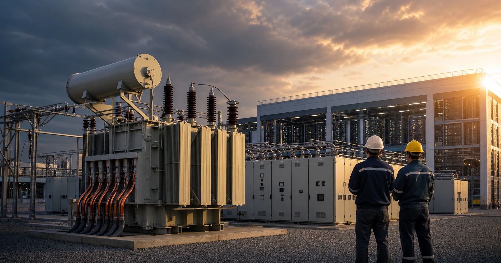

<script>
import ComboChart from '$lib/components/blog/ComboChart.svelte';
</script>



매출 1위가 이익 1위가 아니다. 2025년 효성중공업은 전력기기 4사 비교 안에서 매출 5.97조원으로 가장 컸고, LS ELECTRIC도 4.97조원을 벌었다. HD현대일렉트릭은 4.08조원으로 둘보다 작다. 그런데 영업이익은 HD현대일렉트릭이 9,953억원으로 가장 크다. 영업이익률은 24.4%다. LS ELECTRIC은 8.6%, 일진전기는 7.4%다. 같은 AI 전력 슈퍼사이클 안에서 이익률이 3배 이상 갈라진다.

이 숫자는 "AI 전력 테마"라는 말이 너무 넓다는 증거다. GPU가 전기를 쓰는 것은 맞다. 데이터센터가 전력 계통에 붙어야 하는 것도 맞다. [NVIDIA H100 사양표](https://www.nvidia.com/en-us/data-center/h100/)는 H100 SXM의 최대 열설계전력을 최대 700W로 제시하고, [IEA Energy and AI](https://www.iea.org/reports/energy-and-ai/energy-demand-from-ai)는 2024년 데이터센터 전력 사용량을 약 415TWh, 글로벌 전력 소비의 약 1.5%로 본다. 같은 IEA의 [Key Questions on Energy and AI](https://www.iea.org/reports/key-questions-on-energy-and-ai/executive-summary)는 데이터센터 전력 사용량이 2025년 485TWh에서 2030년 950TWh로 거의 두 배가 된다고 설명한다. 그러나 이 거대한 수요가 주주에게 남기는 초과이익은 변압기, 배전반, 전선, 권선 중 어디가 병목을 쥐었는지에 따라 달라진다.

그래서 이 글의 질문은 하나다. **왜 같은 AI 전력 수요를 받는데 어떤 회사는 20%대 영업이익률을 만들고, 어떤 회사는 7~9%에 머무는가.** 답은 "AI 수요가 강하다"가 아니라 "그 수요의 병목이 어느 제품과 어느 기업의 손익계산서에 꽂혔는가"다. 전력은 모두에게 필요하지만, 가장 비싸게 팔리는 것은 전기 자체가 아니라 전기가 지나가야 하는 좁은 문이다.


## 같은 수요, 다른 손익계산서

2025년 전력기기 4사의 핵심 숫자를 한 줄로 압축하면 이렇게 된다.

| 기업 | 2025년 매출 | 2025년 영업이익 | 매출총이익률 | 영업이익률 | 부채비율 | 영업현금흐름 |
|---|---:|---:|---:|---:|---:|---:|
| HD현대일렉트릭 | 4.08조원 | 9,953억원 | 34.1% | 24.4% | 134.6% | 9,596억원 |
| 효성중공업 | 5.97조원 | 7,470억원 | 21.0% | 12.5% | 190.3% | 4,930억원 |
| LS ELECTRIC | 4.97조원 | 4,264억원 | 21.2% | 8.6% | 131.5% | 2,999억원 |
| 일진전기 | 2.04조원 | 1,512억원 | 13.7% | 7.4% | 159.2% | 869억원 |

매출 순위와 영업이익 순위가 다르다. 매출은 효성중공업, LS ELECTRIC, HD현대일렉트릭, 일진전기 순서다. 영업이익은 HD현대일렉트릭, 효성중공업, LS ELECTRIC, 일진전기 순서다. 여기서 첫 번째 반전이 나온다. 전력기기라는 같은 산업 이름 아래에 있지만 실제로는 제품의 병목 위치, 원가 구조, 수주 가격, 고객군, 사업 믹스가 다르다.

전력기기 테마를 한 바구니로 보면 네 회사는 모두 좋아 보인다. 데이터센터가 늘고, 송전망이 바뀌고, 재생에너지 접속이 늘고, 노후 전력망 교체가 필요하기 때문이다. 그러나 손익계산서는 더 냉정하다. 같은 고객 예산 안에서도 초고압 변압기 공급 슬롯은 더 희소하고, 배전·자동화 장비는 더 넓은 경쟁장 안에 있으며, 전선·권선은 원재료 가격과 운전자본의 압력을 더 많이 받는다.

그래서 이 표는 단순 비교표가 아니다. "AI 전력 수요"라는 한 문장이 네 개의 손익계산서에 들어가면 네 가지 언어로 번역된다는 장면이다. HD현대일렉트릭의 언어는 가격결정력이다. 효성중공업의 언어는 큰 매출과 재무 레버리지다. LS ELECTRIC의 언어는 넓은 포트폴리오다. 일진전기의 언어는 빠른 성장과 낮은 매출총이익률이다.

<ComboChart
  title="전력기기 4사 영업이익률 추이 (%)"
  unit="%"
  lineKeys={["HD현대일렉트릭", "효성중공업", "LS ELECTRIC", "일진전기"]}
  lineColors={["#ea4647", "#f59e0b", "#3b82f6", "#22c55e"]}
  barKeys={[]}
  data={[
    { year: "2019", "HD현대일렉트릭": -8.8, "효성중공업": 3.4, "LS ELECTRIC": 7.2, "일진전기": 1.7 },
    { year: "2020", "HD현대일렉트릭": 4.0, "효성중공업": 1.5, "LS ELECTRIC": 5.6, "일진전기": 1.9 },
    { year: "2021", "HD현대일렉트릭": 0.5, "효성중공업": 3.9, "LS ELECTRIC": 5.8, "일진전기": 2.2 },
    { year: "2022", "HD현대일렉트릭": 6.3, "효성중공업": 4.6, "LS ELECTRIC": 5.6, "일진전기": 2.7 },
    { year: "2023", "HD현대일렉트릭": 11.7, "효성중공업": 6.0, "LS ELECTRIC": 7.7, "일진전기": 4.9 },
    { year: "2024", "HD현대일렉트릭": 20.1, "효성중공업": 7.4, "LS ELECTRIC": 8.6, "일진전기": 5.1 },
    { year: "2025", "HD현대일렉트릭": 24.4, "효성중공업": 12.5, "LS ELECTRIC": 8.6, "일진전기": 7.4 }
  ]}
/>

차트에서 가장 중요한 선은 빨간색이다. HD현대일렉트릭은 2019년 영업이익률 -8.8%에서 2025년 24.4%로 올라왔다. 개선 폭은 33.2%p다. 같은 기간 효성중공업은 3.4%에서 12.5%로 9.1%p, LS ELECTRIC은 7.2%에서 8.6%로 1.4%p, 일진전기는 1.7%에서 7.4%로 5.7%p 개선됐다.

이 차이는 "업황이 좋아졌다"보다 더 구체적인 설명을 요구한다. 업황만 좋아졌다면 네 선이 비슷한 각도로 올라가야 한다. 실제로는 한 선만 거의 다른 업종처럼 움직였다. 2019년 적자를 냈던 HD현대일렉트릭은 2025년에 네 회사 중 가장 높은 영업이익률을 냈고, 2019년에 이미 7.2% 영업이익률을 냈던 LS ELECTRIC은 2025년에도 8.6%에 머물렀다. 출발점이 낮았던 회사가 가장 멀리 갔고, 출발점이 안정적이던 회사는 가장 덜 변했다.

따라서 이 글은 "누가 AI 수혜주인가"를 묻지 않는다. 그 질문은 너무 쉽고, 그래서 투자 판단에는 약하다. 더 중요한 질문은 "같은 수요가 들어왔을 때 어느 제품군에서 가격이 올라가고, 어느 회사의 매출총이익률이 먼저 움직이는가"다. 이 질문으로 들어가야 4사의 차이가 보인다.

```python
import dartlab

codes = {
    "HD현대일렉트릭": "267260",
    "LS ELECTRIC": "010120",
    "효성중공업": "298040",
    "일진전기": "103590",
}

for name, code in codes.items():
    c = dartlab.Company(code)
    is_table = c.select(
        "IS",
        ["sales", "gross_profit", "operating_profit", "net_profit"],
        freq="Y",
    )
    print(name, is_table.tail(1))
```

위 코드로 글의 손익계산서 원천 항목을 재현할 수 있다. 이 글에서는 금액 단위를 조원·억원으로 변환하고, 매출총이익률은 매출총이익을 매출로 나누고, 영업이익률은 영업이익을 매출로 나눴다. 환산 과정에서 소수점 둘째 자리 이하를 반올림했기 때문에 표의 숫자는 원천 데이터와 1억원 단위에서 차이가 날 수 있다.

## 3배 차이는 매출이 아니라 매출총이익에서 시작된다

마진 격차를 판가와 원가의 문제로 보면 답이 빨라진다. 영업이익률은 판관비의 영향을 받지만, 네 회사의 차이는 이미 매출총이익률에서 크게 벌어진다. 2025년 HD현대일렉트릭의 매출총이익률은 34.1%다. 효성중공업은 21.0%, LS ELECTRIC은 21.2%, 일진전기는 13.7%다. 영업이익률 차이가 판매관리비만으로 만들어졌다면 매출총이익률은 비슷해야 한다. 실제로는 아니다.


HD현대일렉트릭의 2019년 매출총이익률은 8.7%였다. 2025년에는 34.1%다. 같은 회사가 같은 업종 안에서 25%p 넘게 개선됐다. 이는 단순 비용 절감으로 설명하기 어렵다. 전력 변압기, 특히 초고압 변압기의 공급 부족이 수주 단가와 납품 조건을 바꿨고, 고정비 레버리지가 붙으면서 영업이익률까지 동시에 올라간 결과로 보는 편이 자연스럽다.

반면 LS ELECTRIC은 2019년에도 매출총이익률이 19.4%, 2025년에도 21.2%다. 매출은 2.35조원에서 4.97조원으로 112% 늘었지만 매출총이익률은 1.8%p 개선에 그쳤다. 이 숫자는 LS ELECTRIC이 나쁜 회사라는 뜻이 아니다. 제품과 고객이 더 넓고, 자동화·배전·전력 인프라가 섞인 사업에서는 매출 성장이 곧바로 초고압 변압기식 가격결정력으로 번지기 어렵다는 뜻이다.

효성중공업은 둘 사이에 있다. 2019년 매출총이익률 10.4%, 2025년 21.0%로 개선 폭이 크다. 다만 연결 기준에는 중공업 외 사업과 재무 구조가 함께 들어온다. 영업이익률은 12.5%로 올라왔지만, HD현대일렉트릭처럼 20%대 중반으로 뛰지는 않았다.

일진전기는 성장률만 보면 가장 공격적이다. 2019년 매출 6,683억원에서 2025년 2.04조원으로 206% 늘었다. 그러나 2025년 매출총이익률은 13.7%, 영업이익률은 7.4%다. 전선·전력기기 부품 쪽의 성장성은 분명하지만, 제품의 병목 권력이 초고압 변압기 완제품만큼 크지는 않다.

두 번째 반전은 여기 있다. 전력기기 슈퍼사이클은 매출을 먼저 키우지만, 주가가 오래 인정하는 것은 매출총이익률이다. 매출총이익률은 고객이 얼마를 더 내고도 그 제품을 사야 하는지를 보여준다. 원재료와 인건비와 물류비를 제하고도 남는 돈이 늘었다면, 단순히 물건을 더 많이 판 것이 아니라 더 좋은 조건으로 팔았다는 뜻이다.

HD현대일렉트릭의 숫자는 이 지점에서 독특하다. 2019년에는 매출 1.77조원에 영업손실을 냈다. 2025년에는 매출 4.08조원에 영업이익 9,953억원이다. 매출은 130% 늘었는데, 영업이익률은 -8.8%에서 24.4%로 바뀌었다. 적자가 흑자로 바뀐 정도가 아니라, 같은 제조업 안에서 "가격을 받는 회사"로 재분류된 것이다.

LS ELECTRIC은 반대로 안정적인 회사의 장단점을 동시에 보여준다. 2019년에도 돈을 벌었고, 2025년에도 돈을 벌었다. 그러나 손익 구조의 기울기는 완만하다. 매출이 두 배 가까이 커지는 동안 영업이익률은 7.2%에서 8.6%로 올라갔다. 안정성은 있지만 폭발성은 제한된다. 그래서 같은 전력 테마라도 HD현대일렉트릭의 이익률을 LS ELECTRIC에 그대로 붙이면 숫자가 과장된다.

효성중공업은 재무 레버리지가 붙은 중간 해석이 필요하다. 매출 5.97조원은 크고, 영업이익률 12.5%도 좋아졌다. 그러나 부채비율 190.3%가 동시에 보인다. 업황이 좋을 때는 부채가 설비와 수주를 떠받치는 힘처럼 보인다. 업황이 꺾이면 같은 부채가 현금흐름의 압박으로 돌아온다. 효성중공업의 핵심은 "얼마나 벌었는가"만이 아니라 "그 이익으로 얼마나 빨리 재무 부담을 낮추는가"다.

일진전기는 성장의 속도와 이익의 질을 분리해서 봐야 한다. 매출 증가율 206%는 네 회사 중 가장 높다. 그런데 매출총이익률은 13.7%다. 이 숫자는 하위 공급망의 현실을 보여준다. 수요가 폭증하면 납품 물량은 늘 수 있다. 하지만 원재료 가격과 고객 협상력이 같이 움직이면 매출총이익률은 완만하게만 올라간다. 그래서 일진전기는 "수요가 있다"만으로 충분하지 않고, "그 수요에서 얼마를 남기는가"를 계속 확인해야 한다.

## HD현대일렉트릭은 병목의 중심에 있다

전력 슈퍼사이클에서 가장 강한 숫자를 만든 회사는 HD현대일렉트릭이다. 핵심은 매출 규모가 아니라 제품 위치다. 초고압 변압기는 대규모 데이터센터, 송전망, 재생에너지 연계, 노후 전력망 교체에서 모두 필요하다. 그런데 생산능력은 빠르게 늘기 어렵다. 공장 증설, 시험 설비, 품질 인증, 납품 레퍼런스가 모두 필요하기 때문이다.

이 구조에서는 수요 증가가 단순 물량 증가로 끝나지 않는다. 고객은 납기를 원하고, 공급자는 제한된 슬롯을 가진다. 슬롯이 제한되면 가격이 올라가고, 가격이 올라가면 매출총이익률이 먼저 움직인다. HD현대일렉트릭의 2025년 매출총이익률 34.1%는 그 결과다. 2024년에도 이미 매출총이익률 31.4%, 영업이익률 20.1%였다. 2025년은 일회성 점프라기보다 전년의 구조적 개선이 더 강해진 해다.

여기서 중요한 단어는 "슬롯"이다. 변압기는 앱처럼 복제되지 않는다. 설비, 시험, 인증, 숙련 인력, 납품 레퍼런스가 필요하다. 고객 입장에서는 데이터센터나 송전망 프로젝트 전체가 변압기 한 품목 때문에 밀릴 수 있다. 공급자 입장에서는 제한된 생산능력을 누구에게, 어떤 가격으로 배정할지 결정할 수 있다. 이 순간 제조업의 성격이 바뀐다. 물량을 채우는 회사가 아니라 시간을 파는 회사가 된다.

2019년의 HD현대일렉트릭은 이 권력을 갖고 있지 않았다. 매출총이익률 8.7%, 영업이익률 -8.8%였다. 제품은 있었지만, 가격은 없었다. 2025년에는 매출총이익률 34.1%, 영업이익률 24.4%다. 같은 설비가 다른 가격을 받기 시작했다. 이 변화는 재무제표에서 가장 강한 장면이다. 제품 설명서가 아니라 손익계산서가 "병목"을 증명한다.

<ComboChart
  title="2025년 매출과 영업이익 비교"
  unit="조원"
  barKeys={["매출", "영업이익"]}
  barColors={["#3b82f6", "#ea4647"]}
  lineKeys={[]}
  dualAxis={false}
  data={[
    { year: "HD현대일렉트릭", "매출": 4.08, "영업이익": 1.00 },
    { year: "효성중공업", "매출": 5.97, "영업이익": 0.75 },
    { year: "LS ELECTRIC", "매출": 4.97, "영업이익": 0.43 },
    { year: "일진전기", "매출": 2.04, "영업이익": 0.15 }
  ]}
/>

이 차트는 매출만 보면 보이지 않는 것을 보여준다. 효성중공업과 LS ELECTRIC의 매출 막대가 크지만, 영업이익 막대는 HD현대일렉트릭이 가장 높다. 전력기기 업종을 볼 때 "누가 전력 수요를 받는가"만 보면 부족하다. "누가 병목 제품을 더 높은 가격으로 팔 수 있는가"를 봐야 한다.

[HD현대일렉트릭 단독 분석](/blog/267260-hd-hyundai-electric)에서는 이 회사를 변압기 슈퍼사이클의 가장 직접적인 수혜자로 다뤘다. [AI 전력 인프라 관점의 HD현대일렉트릭 분석](/blog/267260-hd-hyundai-electric-ai-power)까지 함께 보면 이 글의 결론이 더 분명해진다. 전력 수요 테마의 핵심은 전기가 아니라 전기를 물리적으로 운반하고 변환하는 장비다.

다만 HD현대일렉트릭도 무조건 좋은 숫자만 남은 것은 아니다. 24%대 영업이익률은 이미 매우 높은 정상성 가정을 요구한다. 이 숫자가 유지되려면 신규 수주 단가가 기존 수주보다 크게 낮아지지 않아야 하고, 납품 지연이나 원재료 부담이 매출총이익률을 깎지 않아야 하며, 증설된 공급이 한꺼번에 시장에 들어오지 않아야 한다. 그래서 이 회사는 "좋은 회사인가"보다 "2025년의 가격결정력이 몇 년짜리인가"가 핵심 질문이다.

HD현대일렉트릭을 볼 때 가장 먼저 꺾이면 안 되는 숫자는 매출이 아니다. 매출은 수주 잔고가 매출로 인식되는 동안 어느 정도 따라올 수 있다. 먼저 볼 것은 매출총이익률이다. 34.1%가 30%대 초반에서 버티는지, 20%대로 내려오는지에 따라 시장의 해석이 바뀐다. 가격결정력이 남아 있으면 매출총이익률이 버틴다. 단순 물량 산업으로 돌아가면 매출총이익률부터 내려온다.

## LS ELECTRIC은 좋은 수요를 받지만 사업 믹스가 넓다

LS ELECTRIC은 전력기기와 자동화에서 강한 회사다. 매출 4.97조원은 HD현대일렉트릭보다 크다. 다만 2025년 영업이익률은 8.6%다. 왜 매출이 큰데 마진이 낮을까. 이유는 단순하다. LS ELECTRIC의 매출은 초고압 변압기 병목 하나에 집중되어 있지 않다. 전력 인프라, 배전, 자동화, 기기, 시스템 성격의 사업이 섞여 있다.

사업 믹스가 넓으면 장점이 있다. 경기나 특정 제품 사이클 하나에 덜 흔들릴 수 있고, 고객 접점도 넓다. 그러나 단점도 있다. 한 제품군에서 가격결정력이 폭발해도 연결 영업이익률 전체를 끌어올리는 속도는 느리다. LS ELECTRIC의 2025년 매출총이익률은 21.2%다. 나쁘지 않다. 그러나 HD현대일렉트릭의 34.1%와는 12.9%p 차이가 난다.

LS ELECTRIC을 전력 슈퍼사이클에서 제외할 필요는 없다. 오히려 [LS ELECTRIC 분석](/blog/010120-ls-electric)은 배전·자동화·전력 인프라가 AI 데이터센터와 제조 설비 증설을 함께 받을 수 있다는 점을 보여준다. 다만 주가나 밸류에이션을 평가할 때는 "전력 테마"라는 말 하나로 HD현대일렉트릭과 같은 영업이익률을 적용하면 안 된다. LS ELECTRIC은 넓은 산업재 플랫폼이고, HD현대일렉트릭은 더 좁고 더 강한 병목 제품에 가까운 구조다.

LS ELECTRIC의 강점은 한 고객, 한 제품, 한 사이클에 덜 갇힌다는 점이다. 공장 자동화, 배전, 전력 인프라는 제조업 투자와 데이터센터 투자와 전력망 투자에 동시에 걸린다. 전력 사용량이 늘어나는 사회에서는 이 넓은 접점이 장점이다. 문제는 넓은 접점이 곧 높은 마진을 뜻하지 않는다는 것이다.

이 회사의 숫자는 안정적인 산업재 플랫폼의 숫자에 가깝다. 2019년부터 2025년까지 영업이익률은 5~9%대 범위 안에서 움직였다. 2025년의 8.6%는 나쁜 숫자가 아니지만, 초고압 변압기 병목이 만든 24.4%와는 다른 종류의 숫자다. LS ELECTRIC을 강하게 보려면 "HD현대일렉트릭처럼 변할 것"이 아니라 "넓은 수요가 오래 이어질 것"이라는 논리가 필요하다.

그래서 LS ELECTRIC의 추적 포인트도 다르다. HD현대일렉트릭은 매출총이익률이 먼저다. LS ELECTRIC은 포트폴리오 안에서 고마진 전력 인프라 비중이 얼마나 커지는지가 먼저다. 매출이 커져도 저마진 장비와 프로젝트가 같이 늘면 연결 영업이익률은 움직이지 않는다. 반대로 데이터센터·전력망향 고마진 비중이 올라가면 8%대 영업이익률이 10%대 초반으로 갈 수 있다. 이 차이를 보지 않으면 LS ELECTRIC은 항상 "매출은 큰데 왜 덜 남나"라는 질문에 갇힌다.

## 효성중공업은 큰 매출과 높은 부채가 같이 보인다

효성중공업은 2025년 매출 5.97조원으로 네 회사 중 가장 크다. 영업이익도 7,470억원으로 강하다. 영업이익률 12.5%는 LS ELECTRIC과 일진전기보다 높고, 전년 7.4%에서 크게 개선됐다. 숫자만 보면 HD현대일렉트릭 다음으로 전력기기 슈퍼사이클을 가장 잘 받은 회사다.

그러나 효성중공업을 볼 때는 연결 재무 구조를 같이 봐야 한다. 2025년 부채비율은 190.3%다. 네 회사 중 가장 높다. 전력기기 사이클이 계속 강하면 영업레버리지가 재무 부담을 덮을 수 있다. 반대로 납기 지연, 원가 상승, 수주 둔화가 나타나면 높은 부채비율은 이익 변동성을 더 크게 만든다.

이 지점에서 효성중공업은 HD현대일렉트릭과 다르다. 둘 다 변압기와 전력 인프라 수혜를 받지만, 투자자가 봐야 할 첫 질문이 다르다. HD현대일렉트릭은 "24%대 영업이익률이 얼마나 오래 유지되는가"가 핵심이다. 효성중공업은 "중공업 수익성 개선이 연결 재무 부담을 얼마나 빠르게 낮추는가"가 핵심이다.

전력기기 외 인프라 수요까지 넓게 보려면 [한화엔진 조선 기자재 사이클](/blog/082740-hanwha-engine)처럼 산업재 사이클에서 수주, 납기, 원가, 재무 레버리지를 함께 보는 접근이 필요하다. 수요가 좋은 산업에서도 재무 레버리지는 방향성이 바뀌는 순간 평가를 바꾼다.

효성중공업의 매력은 "크다"는 데 있다. 매출 5.97조원은 네 회사 중 가장 크고, 영업이익 7,470억원도 충분히 크다. 2024년 영업이익률 7.4%에서 2025년 12.5%로 올라온 변화도 작지 않다. 이 회사는 전력기기 슈퍼사이클을 숫자로 증명했다. 다만 숫자가 커질수록 연결 재무제표 안의 다른 사업과 부채 구조도 같이 커져 보인다.

영업현금흐름을 보면 이 차이가 더 분명하다. 2025년 효성중공업의 영업이익은 7,470억원이고 영업현금흐름은 4,930억원이다. 이익의 상당 부분이 현금으로 들어왔지만, HD현대일렉트릭처럼 거의 영업이익에 가까운 현금흐름은 아니다. 성장과 프로젝트형 사업이 섞이면 매출채권, 재고, 선급·선수 구조가 현금흐름을 흔든다. 그래서 효성중공업은 손익계산서만 보면 강하고, 현금흐름표까지 보면 확인할 것이 남는다.

부채비율 190.3%도 같은 이유로 중요하다. 전력기기 사이클이 계속 좋으면 이 부채는 공격적 성장의 흔적으로 읽힌다. 수주가 매출로 바뀌고 영업현금흐름이 따라오면 재무 부담은 빠르게 낮아질 수 있다. 하지만 사이클이 정상화되면 해석은 바뀐다. 같은 부채가 이자비용, 운전자본, 설비투자 부담으로 돌아온다. 효성중공업은 "전력기기 수혜주"인 동시에 "수혜를 재무구조 개선으로 바꿔야 하는 회사"다.

## 일진전기는 성장률이 가장 높지만 가격결정권은 다르다

일진전기는 2019년 매출 6,683억원에서 2025년 2.04조원까지 커졌다. 성장률만 보면 206%다. 네 회사 중 가장 높다. 영업이익도 114억원에서 1,512억원으로 크게 늘었다. 그러나 2025년 영업이익률은 7.4%다. 성장은 빠르지만 마진 구조는 아직 낮다.

이 숫자는 부품·전선·권선 계열 사업의 성격을 보여준다. 수요가 강하면 물량이 늘고 매출은 빠르게 커진다. 그러나 원재료 가격과 경쟁 구조의 영향을 크게 받으면 매출총이익률은 제한된다. 2025년 일진전기의 매출총이익률은 13.7%다. HD현대일렉트릭의 34.1%와는 20.4%p 차이가 난다.

그래서 일진전기는 "전력기기 슈퍼사이클에서 가장 많이 올랐다"가 아니라 "전력기기 슈퍼사이클의 하위 공급망이 얼마나 이익률을 올릴 수 있는가"로 봐야 한다. [대한전선 분석](/blog/001440-taihan-cable)처럼 전선·케이블 쪽은 수요의 양과 원재료 가격, 수주 마진, 운전자본이 함께 움직인다. 일진전기의 투자 판단도 같은 틀에서 출발해야 한다.

일진전기의 숫자는 세 번째 오해를 깨뜨린다. 성장률이 가장 높은 회사가 반드시 가장 좋은 이익 구조를 가진 것은 아니다. 2019년부터 2025년까지 매출 증가율은 206%다. 네 회사 중 가장 빠르다. 그러나 2025년 영업이익률은 7.4%다. 빠르게 커지는 시장에서 더 많이 납품하는 것과, 그 납품에서 높은 초과이익을 남기는 것은 다른 문제다.

전선·권선·부품 성격의 사업은 원재료와 운전자본을 피하기 어렵다. 구리 같은 원재료 가격이 오르면 매출액은 커질 수 있다. 그러나 그 가격 상승분을 모두 마진으로 가져갈 수 있는지는 별개의 문제다. 고객과의 단가 조정, 재고 보유 기간, 매출채권 회수 기간이 모두 손익과 현금흐름을 갈라놓는다. 2025년 일진전기의 영업이익은 1,512억원이지만 영업현금흐름은 869억원이다. 성장 기업에서 흔한 장면이지만, 바로 그래서 현금흐름을 같이 봐야 한다.

일진전기를 강하게 보려면 두 가지가 동시에 필요하다. 첫째, 전력기기 하위 공급망의 수요가 계속 커져야 한다. 둘째, 그 수요가 매출총이익률 개선으로 이어져야 한다. 매출이 2조원에서 더 커져도 매출총이익률이 13%대에 머물면 영업이익률의 천장은 낮다. 반대로 매출총이익률이 15~17%대로 올라가기 시작하면 이야기는 달라진다. 그때는 하위 공급망이 단순 물량 산업에서 가격을 조금씩 받는 산업으로 바뀌고 있다는 신호다.

## 제품 구조가 손익 구조를 만든다

전력기기를 하나의 테마로 묶으면 쉬워 보인다. 하지만 손익계산서는 제품 구조를 그대로 드러낸다.


초고압 변압기는 프로젝트당 금액이 크고, 납품 리드타임이 길고, 인증 장벽이 높다. 공급자가 제한되어 있으면 가격결정력이 생긴다. 배전반과 전력기기는 수요가 넓고 반복적이지만 경쟁 강도와 제품 범위가 넓다. 전선·권선 계열은 성장률이 크더라도 원재료와 공정비, 고객 협상력의 영향을 많이 받는다. 이 차이가 매출총이익률 차이로 나타난다.

2025년 매출총이익률을 다시 보면 명확하다.

| 기업 | 2019년 매출총이익률 | 2025년 매출총이익률 | 변화 |
|---|---:|---:|---:|
| HD현대일렉트릭 | 8.7% | 34.1% | +25.4%p |
| 효성중공업 | 10.4% | 21.0% | +10.6%p |
| LS ELECTRIC | 19.4% | 21.2% | +1.8%p |
| 일진전기 | 9.4% | 13.7% | +4.3%p |

이 표가 이 글의 핵심이다. 같은 AI 데이터센터 전력 수요가 들어와도, 그 수요가 초고압 변압기 병목에 걸리면 HD현대일렉트릭의 매출총이익률이 크게 움직인다. 수요가 넓은 전력 인프라와 자동화 포트폴리오에 퍼지면 LS ELECTRIC의 매출은 커지지만 마진 개선은 완만하다. 중공업과 전선은 중간 혹은 하위 공급망의 위치에 따라 개선 폭이 달라진다.

제품 구조는 회계 언어로 다시 쓰면 매출총이익률 구조다. 초고압 변압기는 납기가 길고, 프로젝트의 실패 비용이 크며, 고객이 검증된 공급자를 원한다. 이 경우 공급자가 제한되면 판가가 먼저 움직인다. 반대로 배전·자동화 장비는 고객과 제품이 넓고, 패키지와 프로젝트가 섞인다. 수요는 넓지만 가격결정력이 연결 전체에 번지는 데 시간이 걸린다. 전선·권선은 더 아래에 있다. 물량은 크게 늘 수 있지만 원재료와 고객 협상력이 이익률을 누른다.

네 회사의 손익계산서는 이 계단을 그대로 보여준다. 가장 위쪽 병목에 가까운 HD현대일렉트릭은 매출총이익률 34.1%다. 중간에 있는 효성중공업과 LS ELECTRIC은 21%대다. 더 원재료 민감도가 큰 일진전기는 13.7%다. 한 문장으로는 모두 "전력기기"지만, 실제 경제적 권력은 이 순서대로 다르다.

이 구분이 중요한 이유는 사이클의 끝에서 드러난다. 수요가 아주 강할 때는 하위 공급망도 같이 오른다. 그러나 수요가 둔화되면 먼저 확인해야 할 것은 매출총이익률의 방어력이다. 병목 제품은 가격을 더 오래 지킬 가능성이 있고, 원재료 민감 제품은 가격 조정이 더 빨리 올 수 있다. 그래서 같은 슈퍼사이클 안에서도 정상화 국면의 충격은 회사마다 다르다.

## 슈퍼사이클의 강도는 매출 성장률보다 이익률 변화로 봐야 한다

매출 성장률만 보면 일진전기가 가장 강하고, 효성중공업도 크다. 하지만 주식시장이 실제로 프리미엄을 붙이는 곳은 보통 이익률이 동시에 올라가는 곳이다. 매출이 커져도 매출총이익률이 낮으면 원가와 운전자본이 같이 커진다. 반대로 같은 매출 증가라도 매출총이익률이 크게 올라가면 영업이익이 더 빠르게 늘어난다.


2019년부터 2025년까지 매출 변화와 영업이익률 변화를 같이 보면 다음과 같다.

| 기업 | 2019년 매출 | 2025년 매출 | 매출 증가율 | 2019년 영업이익률 | 2025년 영업이익률 | 변화 |
|---|---:|---:|---:|---:|---:|---:|
| HD현대일렉트릭 | 1.77조원 | 4.08조원 | +130% | -8.8% | 24.4% | +33.2%p |
| LS ELECTRIC | 2.35조원 | 4.97조원 | +112% | 7.2% | 8.6% | +1.4%p |
| 효성중공업 | 3.78조원 | 5.97조원 | +58% | 3.4% | 12.5% | +9.1%p |
| 일진전기 | 0.67조원 | 2.04조원 | +206% | 1.7% | 7.4% | +5.7%p |

HD현대일렉트릭은 매출 증가율만으로는 1등이 아니다. 그러나 영업이익률 변화가 압도적이다. 2019년 적자였던 회사가 2025년 24.4% 영업이익률을 냈다는 것은 업황만 좋아진 것이 아니라 사업 구조가 재평가될 만큼 가격과 물량이 같이 바뀌었다는 뜻이다.

LS ELECTRIC은 매출이 112% 늘었지만 영업이익률은 1.4%p 개선에 그쳤다. 이는 실망이 아니라 분류의 문제다. LS ELECTRIC은 전력기기 테마 속에서도 더 넓은 전기·자동화 플랫폼이다. 이 회사의 장점은 수요의 범위와 안정성이고, 단점은 특정 병목 제품의 초과이익이 연결 전체를 흔들 정도로 크지 않다는 점이다.

효성중공업은 2025년에 영업이익률이 한 단계 올라섰다. 이 구간에서는 업황의 수혜가 분명하다. 다만 부채비율과 연결 사업의 혼합 효과 때문에 HD현대일렉트릭만큼 단순한 변압기 순수 플레이로 보기 어렵다.

일진전기는 매출 성장률이 매우 높다. 그러나 매출총이익률이 낮으면 고성장은 운전자본 부담과 함께 온다. 2025년 영업현금흐름 869억원은 영업이익 1,512억원보다 작다. 성장이 계속될수록 재고, 매출채권, 원재료 조달을 같이 확인해야 한다.

여기서 네 번째 반전이 나온다. "매출이 빨리 늘었다"는 말은 항상 좋은 말이 아니다. 매출이 빨리 늘 때 매출총이익률도 같이 올라가면 좋은 성장이다. 매출이 빨리 늘지만 매출총이익률이 낮고 현금흐름이 따라오지 않으면, 그 성장은 운전자본을 먹는다. 전력기기 슈퍼사이클은 양쪽을 모두 만든다. 그래서 매출 성장률만으로 순위를 매기면 일진전기가 가장 강해 보이고, 이익률 변화로 순위를 매기면 HD현대일렉트릭이 압도적으로 강해 보인다.

투자자가 실제로 봐야 할 것은 "성장의 번역률"이다. 같은 1조원 매출 증가가 영업이익으로 얼마나 번역되는가. HD현대일렉트릭은 2019년부터 2025년까지 매출이 2.31조원 늘었고, 영업이익률은 33.2%p 개선됐다. LS ELECTRIC은 매출이 2.62조원 늘었지만 영업이익률 개선은 1.4%p다. 효성중공업은 매출이 2.19조원 늘고 영업이익률이 9.1%p 개선됐다. 일진전기는 매출이 1.38조원 늘고 영업이익률이 5.7%p 개선됐다. 이 표는 전력기기 테마의 진짜 순위를 다시 쓰게 만든다.

그래서 4사를 같은 배수로 비교하면 위험하다. 매출 성장률이 높은 회사에는 성장 프리미엄이 붙을 수 있고, 영업이익률이 높은 회사에는 질 프리미엄이 붙을 수 있다. 두 프리미엄은 다르다. 성장 프리미엄은 수요가 둔화되면 빨리 빠질 수 있고, 질 프리미엄은 매출총이익률이 꺾일 때 깨진다. 전력기기 4사 비교의 핵심은 누가 더 올랐는지가 아니라 어떤 프리미엄을 받고 있는지다.

## 좋은 수주와 좋은 마진은 다르다

전력기기 4사를 한 번에 볼 때 필요한 질문은 다섯 개다. 모두 수주와 관련되어 있지만, 핵심은 수주 금액 자체가 아니다. 좋은 수주는 매출로 바뀌어야 하고, 매출은 매출총이익으로 바뀌어야 하며, 매출총이익은 현금으로 바뀌어야 한다. 이 연결이 끊기면 "수주잔고가 좋다"는 말은 강한 결론이 되지 못한다.

첫째, **수주 잔고가 매출로 바뀌는 속도**다. 전력기기는 주문을 받았다고 바로 매출이 되지 않는다. 납품 리드타임이 길다. 수주 잔고가 충분해도 매출 인식이 밀리면 이익이 늦어진다. 반대로 높은 단가로 받은 수주가 매출로 인식되는 구간에서는 매출총이익률이 더 올라갈 수 있다.

수주 잔고가 커질수록 투자자는 미래 매출을 먼저 상상한다. 그러나 제조업에서는 잔고가 매출이 되는 과정에서 원재료, 납기, 품질, 환율, 고객 변경 요청이 모두 끼어든다. 특히 전력기기는 프로젝트 기간이 길다. 수주 당시의 원가 가정과 납품 시점의 원가가 다를 수 있다. 그래서 "수주가 많다"와 "마진이 좋다"는 다른 문장이다.

둘째, **신규 수주 단가가 기존 수주 단가보다 높은가**다. 2025년 숫자가 좋은 이유가 과거 저가 수주의 종료와 고가 수주의 인식 때문이라면, 다음 사이클의 핵심은 신규 수주 단가다. 납기 부족이 완화되고 경쟁사가 증설하면 신규 수주 단가는 둔화될 수 있다.

이 질문은 HD현대일렉트릭에서 특히 중요하다. 2025년의 34.1% 매출총이익률이 과거 고가 수주가 매출로 잡힌 결과라면, 다음에는 신규 수주 단가가 그 수준을 지켜야 한다. 신규 수주 단가가 낮아지기 시작하면 매출은 계속 늘어도 매출총이익률은 먼저 꺾일 수 있다. 전력기기 사이클의 정상화는 매출 감소보다 마진 둔화로 먼저 나타날 가능성이 있다.

셋째, **증설이 어느 속도로 들어오는가**다. 공급 부족은 가격결정력을 만든다. 하지만 증설은 그 가격결정력을 낮출 수 있다. 초고압 변압기는 증설 시간이 길지만, 시간이 길다는 말은 영원히 부족하다는 뜻이 아니다. 2027~2028년 이후 납기와 신규 수주 마진은 반드시 따로 봐야 한다.

공급 부족은 모든 사이클의 축복이지만, 동시에 자기 파괴적이다. 가격이 좋아지면 기존 업체는 증설하고, 신규 업체는 진입을 검토하고, 고객은 공급처를 다변화한다. 초고압 변압기는 진입 장벽이 높아 이 과정이 느리다. 하지만 느리다는 말은 없다는 말이 아니다. 증설이 실제 납품 능력으로 바뀌는 시점에는 수주 단가와 납기가 함께 바뀔 수 있다.

넷째, **부채와 운전자본이 이익을 흡수하는가**다. 효성중공업과 일진전기는 이 질문이 특히 중요하다. 매출이 늘면 매출채권과 재고도 늘 수 있다. 손익계산서가 좋아도 현금흐름이 따라오지 않으면 주가는 어느 순간 이익보다 현금을 먼저 보기 시작한다.

2025년 숫자는 네 회사의 현금 전환 차이를 보여준다. HD현대일렉트릭은 영업이익 9,953억원에 영업현금흐름 9,596억원이다. 이익이 거의 현금으로 바뀌었다. 효성중공업은 7,470억원 영업이익에 4,930억원 영업현금흐름, LS ELECTRIC은 4,264억원 영업이익에 2,999억원 영업현금흐름, 일진전기는 1,512억원 영업이익에 869억원 영업현금흐름이다. 모두 현금흐름이 양수라는 점은 좋다. 그러나 이익과 현금의 간격은 회사별 운전자본 부담을 보여준다.

다섯째, **전력 수요의 최종 고객이 실제 투자를 집행하는가**다. IEA는 데이터센터 전력 수요가 늘어난다고 보지만, 동시에 병목과 자금 조달 민감도도 언급한다. AI 데이터센터 투자는 빅테크의 자본지출, 전력 인허가, 지역 계통 접속, 전력구매계약과 연결된다. [GE Vernova 분석](/blog/GEV-ge-vernova)처럼 글로벌 전력 인프라 기업을 같이 보면 한국 전력기기 업체의 수요가 더 큰 전력망 투자 사이클 안에 있다는 점을 확인할 수 있다.

데이터센터 수요도 회계적으로는 단계가 있다. 빅테크가 GPU를 주문하는 것과, 데이터센터 부지를 확보하는 것과, 전력 계통 접속 승인을 받는 것과, 변압기·배전 설비를 발주하는 것은 모두 다른 단계다. IEA의 장기 전망이 맞더라도 특정 연도의 발주는 전력 인허가와 자본지출 일정에 막힐 수 있다. 전력기기 업체의 숫자는 결국 이 단계들이 실제 발주와 매출로 내려오는 속도에 의해 결정된다.

따라서 좋은 수주의 정의는 네 가지를 동시에 만족해야 한다. 첫째, 단가가 높아야 한다. 둘째, 납품 가능성이 높아야 한다. 셋째, 원가 변동을 흡수할 수 있어야 한다. 넷째, 현금 회수가 따라와야 한다. 이 네 조건 중 하나가 빠지면 수주는 매출이 되더라도 이익의 질은 낮아질 수 있다. 전력기기 4사를 비교할 때 수주 잔고 숫자 하나로 끝내면 안 되는 이유다.

## 2026년에 봐야 할 숫자

2026년 이후 이 테마를 따라갈 때 가장 먼저 볼 숫자는 주가가 아니라 영업이익률이다. 전력기기 테마가 유지되려면 매출 성장보다 이익률 유지가 더 중요하다. 특히 HD현대일렉트릭의 24%대 영업이익률은 시장이 이미 높은 품질로 평가하는 숫자다. 이 숫자가 20%대 초반에서 버티면 테마는 계속 강하다. 15%대로 내려오면 정상화 논쟁이 시작된다.

두 번째는 매출총이익률이다. 매출총이익률이 꺾이면 가격결정력이 약해진 것이다. 판관비 절감으로 영업이익률을 방어할 수 있는 기간은 제한적이다. 전력기기 슈퍼사이클의 핵심은 고가 수주가 매출로 인식되며 매출총이익률을 올리는 구간이다.

세 번째는 영업현금흐름이다. 2025년 HD현대일렉트릭은 영업이익 9,953억원에 영업현금흐름 9,596억원으로 이익과 현금이 거의 같이 움직였다. 효성중공업은 영업이익 7,470억원, 영업현금흐름 4,930억원이다. LS ELECTRIC은 영업이익 4,264억원, 영업현금흐름 2,999억원이다. 일진전기는 영업이익 1,512억원, 영업현금흐름 869억원이다. 성장기에 현금흐름이 이익보다 작을 수는 있지만, 그 차이가 계속 커지면 운전자본 부담으로 해석해야 한다.

네 번째는 부채비율이다. 2025년 기준 HD현대일렉트릭 134.6%, LS ELECTRIC 131.5%, 효성중공업 190.3%, 일진전기 159.2%다. 업황이 강할 때는 높은 부채가 수익성을 확대하는 레버리지처럼 보인다. 업황이 약해지면 같은 숫자가 리스크로 바뀐다.

다섯 번째는 데이터센터 전력 수요의 실제 집행률이다. AI 수요 자체가 장기적으로 크다는 것과, 특정 연도에 변압기·배전반 주문이 예상대로 발주된다는 것은 다르다. [SK하이닉스 HBM 분석](/blog/000660-skhynix-kospi-driver), [삼성전자 랠리 분석](/blog/005930-samsung-rally)처럼 AI 반도체 공급망의 숫자와 전력 인프라 숫자를 같이 보면 데이터센터 투자 사이클의 속도를 더 잘 읽을 수 있다.

이 이야기가 깨지는 조건도 같은 다섯 숫자로 정리된다. 첫째, HD현대일렉트릭의 영업이익률이 20%대 초반을 지키지 못하고 15%대로 내려오면 병목 프리미엄이 약해졌다는 신호다. 둘째, 매출총이익률이 먼저 꺾이면 가격결정력 둔화다. 셋째, 영업현금흐름이 영업이익보다 계속 크게 작아지면 운전자본 부담이 커졌다는 뜻이다. 넷째, 효성중공업과 일진전기의 부채비율이 내려오지 않으면 호황 이익이 재무구조 개선으로 번역되지 않은 것이다. 다섯째, 데이터센터와 전력망 발주가 실제 매출로 내려오는 속도가 늦어지면 2025년의 높은 기대가 먼저 흔들린다.

특히 HD현대일렉트릭은 좋은 숫자일수록 검증이 더 엄격해야 한다. 24.4% 영업이익률은 "강하다"에서 끝낼 숫자가 아니다. 이 숫자가 정상 이익인지, 고가 수주 인식 구간의 정점인지, 공급 부족이 만든 일시적 초과이익인지 계속 분해해야 한다. 좋은 산업일수록 정상화 국면은 더 헷갈린다. 매출은 아직 늘고 있는데 매출총이익률이 먼저 낮아질 수 있기 때문이다.

LS ELECTRIC은 반대로 8.6% 영업이익률이 실망인지 안정인지 구분해야 한다. 이 회사가 10%대 영업이익률로 올라가려면 단순 매출 증가가 아니라 포트폴리오 안의 고마진 전력 인프라 비중이 올라가야 한다. 매출이 5조원을 넘어도 영업이익률이 8%대에 머문다면 시장은 이 회사를 "전력 병목주"가 아니라 "넓은 전기 산업재"로 평가할 가능성이 높다.

효성중공업은 영업이익률보다 현금과 부채의 속도가 중요해진다. 12.5% 영업이익률이 이어져도 영업현금흐름이 충분히 따라오지 않거나 부채비율이 내려오지 않으면 재무 레버리지 부담이 남는다. 일진전기는 매출총이익률이 13%대에서 벗어나는지가 핵심이다. 매출 성장률만 높고 매출총이익률이 낮으면 하위 공급망의 물량 성장에 머문다.

```python
import dartlab

for name, code in codes.items():
    c = dartlab.Company(code)
    bs = c.select(
        "BS",
        [
            "total_assets",
            "total_liabilities",
            "total_stockholders_equity",
            "liabilities",
            "stockholders_equity",
        ],
        freq="Y",
    )
    cf = c.select("CF", ["operating_cashflow", "investing_cashflow"], freq="Y")
    print(name)
    print(bs.tail(1))
    print(cf.tail(1))
```

부채비율은 회사별 표준 계정명이 조금 다르다. HD현대일렉트릭·효성중공업·일진전기는 `total_liabilities / total_stockholders_equity`, LS ELECTRIC은 `liabilities / stockholders_equity` 기준으로 계산했다. 영업현금흐름은 현금흐름표의 `operating_cashflow`를 사용했다.

## 결론 — 전력기기 테마의 승자는 제품 병목이 정한다

전력기기 4사는 모두 같은 거대한 배경을 가진다. AI 데이터센터는 전기를 더 많이 쓰고, 전력망은 더 많은 변압기와 배전 설비를 필요로 한다. 하지만 주식은 배경만으로 움직이지 않는다. 결국 손익계산서가 이익의 질을 보여준다.

HD현대일렉트릭은 초고압 변압기 병목을 가장 직접적으로 수익화했다. 2025년 매출 4.08조원, 영업이익 9,953억원, 영업이익률 24.4%는 네 회사 중 가장 강한 이익 구조다. 효성중공업은 매출 5.97조원과 영업이익률 12.5%로 좋아졌지만, 부채와 연결 믹스를 같이 봐야 한다. LS ELECTRIC은 매출 4.97조원으로 크지만 영업이익률 8.6%로 넓은 사업 믹스의 특성이 드러난다. 일진전기는 매출 성장률이 높지만 영업이익률 7.4%와 낮은 매출총이익률을 함께 봐야 한다.

이 글의 결론은 특정 회사 하나를 고르는 식의 단순 순위가 아니다. 전력기기 4사는 서로 다른 질문을 요구한다. HD현대일렉트릭은 "병목 프리미엄이 얼마나 오래 가는가"가 질문이다. LS ELECTRIC은 "넓은 포트폴리오 안에서 고마진 전력 인프라 비중이 얼마나 커지는가"가 질문이다. 효성중공업은 "큰 이익이 부채와 현금흐름을 얼마나 빠르게 개선하는가"가 질문이다. 일진전기는 "빠른 매출 성장이 매출총이익률 개선으로 번역되는가"가 질문이다.

이 질문들이 다른 이유는 모두 같은 테마를 사는 것처럼 보이지만 실제로는 다른 경제적 권력을 사고 있기 때문이다. HD현대일렉트릭은 제한된 변압기 생산 슬롯의 권력을 판다. LS ELECTRIC은 전기·자동화 인프라의 넓은 접점을 판다. 효성중공업은 대형 중공업 프로젝트의 수익성 개선과 재무 레버리지의 변화를 판다. 일진전기는 하위 공급망의 빠른 성장과 원재료 민감도를 함께 판다. 같은 전력기기라도 주주가 실제로 사는 것은 서로 다르다.

따라서 이 테마의 핵심 문장은 이렇게 정리된다.

**AI 전력 슈퍼사이클은 네 회사를 모두 키우지만, 초과이익은 병목 제품을 가진 회사에 더 크게 남는다.**

전력 수요가 계속 강하다면 네 회사 모두 매출은 성장할 수 있다. 그러나 장기 수익률을 가르는 것은 매출 성장률이 아니라 매출총이익률과 영업현금흐름이다. 전력기기 주식을 비교할 때는 테마 이름보다 제품 위치를 먼저 봐야 한다. 같은 전기를 팔아도, 가장 비싼 것은 전기가 아니라 전기를 지나가게 만드는 병목이다.

다음 공시에서 확인할 첫 줄도 정해졌다. 매출보다 먼저 매출총이익률을 본다. 영업이익보다 먼저 영업현금흐름을 본다. 수주 잔고보다 먼저 신규 수주 단가와 납기 변화를 본다. 그리고 전력기기라는 테마 이름보다 각 회사가 병목의 어느 위치에 서 있는지 본다. 이 순서를 지키면 "AI 전력"이라는 큰 말에 가려진 4개의 다른 손익계산서가 보인다.


## 검증표

이 글에서 사용한 주요 수치와 출처를 한 표로 묶었다. 금액은 연결 기준 연간 실적이며, 조원·억원 단위로 반올림했다.

| 항목 | 수치 | 기준 | 출처 |
|---|---:|---|---|
| 데이터센터 전력 사용량 | 약 415TWh, 글로벌 전력 소비 약 1.5% | 2024년 | [IEA Energy and AI](https://www.iea.org/reports/energy-and-ai/energy-demand-from-ai) |
| 데이터센터 전력 사용량 전망 | 485TWh → 950TWh | 2025년 → 2030년 | [IEA Key Questions on Energy and AI](https://www.iea.org/reports/key-questions-on-energy-and-ai/executive-summary) |
| H100 SXM 최대 열설계전력 | 최대 700W | H100 제품 사양 | [NVIDIA H100](https://www.nvidia.com/en-us/data-center/h100/) |
| HD현대일렉트릭 매출 | 4.08조원 | 2025년 연결 | DART 2025 사업보고서, `sales` |
| HD현대일렉트릭 영업이익 | 9,953억원 | 2025년 연결 | DART 2025 사업보고서, `operating_profit` |
| HD현대일렉트릭 매출총이익률 | 34.1% | 2025년 연결 | DART 2025 사업보고서, `gross_profit / sales` |
| HD현대일렉트릭 영업이익률 | 24.4% | 2025년 연결 | DART 2025 사업보고서, `operating_profit / sales` |
| HD현대일렉트릭 영업현금흐름 | 9,596억원 | 2025년 연결 | DART 2025 사업보고서, `operating_cashflow` |
| HD현대일렉트릭 2019→2025 영업이익률 변화 | -8.8% → 24.4%, +33.2%p | 연결 연간 | DART 2019·2025 사업보고서, `operating_profit / sales` |
| LS ELECTRIC 매출 | 4.97조원 | 2025년 연결 | DART 2025 사업보고서, `sales` |
| LS ELECTRIC 영업이익 | 4,264억원 | 2025년 연결 | DART 2025 사업보고서, `operating_profit` |
| LS ELECTRIC 매출총이익률 | 21.2% | 2025년 연결 | DART 2025 사업보고서, `gross_profit / sales` |
| LS ELECTRIC 영업이익률 | 8.6% | 2025년 연결 | DART 2025 사업보고서, `operating_profit / sales` |
| LS ELECTRIC 영업현금흐름 | 2,999억원 | 2025년 연결 | DART 2025 사업보고서, `operating_cashflow` |
| LS ELECTRIC 2019→2025 영업이익률 변화 | 7.2% → 8.6%, +1.4%p | 연결 연간 | DART 2019·2025 사업보고서, `operating_profit / sales` |
| 효성중공업 매출 | 5.97조원 | 2025년 연결 | DART 2025 사업보고서, `sales` |
| 효성중공업 영업이익 | 7,470억원 | 2025년 연결 | DART 2025 사업보고서, `operating_profit` |
| 효성중공업 매출총이익률 | 21.0% | 2025년 연결 | DART 2025 사업보고서, `gross_profit / sales` |
| 효성중공업 영업이익률 | 12.5% | 2025년 연결 | DART 2025 사업보고서, `operating_profit / sales` |
| 효성중공업 영업현금흐름 | 4,930억원 | 2025년 연결 | DART 2025 사업보고서, `operating_cashflow` |
| 효성중공업 2019→2025 영업이익률 변화 | 3.4% → 12.5%, +9.1%p | 연결 연간 | DART 2019·2025 사업보고서, `operating_profit / sales` |
| 일진전기 매출 | 2.04조원 | 2025년 연결 | DART 2025 사업보고서, `sales` |
| 일진전기 영업이익 | 1,512억원 | 2025년 연결 | DART 2025 사업보고서, `operating_profit` |
| 일진전기 매출총이익률 | 13.7% | 2025년 연결 | DART 2025 사업보고서, `gross_profit / sales` |
| 일진전기 영업이익률 | 7.4% | 2025년 연결 | DART 2025 사업보고서, `operating_profit / sales` |
| 일진전기 영업현금흐름 | 869억원 | 2025년 연결 | DART 2025 사업보고서, `operating_cashflow` |
| 일진전기 2019→2025 영업이익률 변화 | 1.7% → 7.4%, +5.7%p | 연결 연간 | DART 2019·2025 사업보고서, `operating_profit / sales` |
| HD현대일렉트릭 부채비율 | 134.6% | 2025년 연결 | DART 2025 사업보고서, `total_liabilities / total_stockholders_equity` |
| LS ELECTRIC 부채비율 | 131.5% | 2025년 연결 | DART 2025 사업보고서, `liabilities / stockholders_equity` |
| 효성중공업 부채비율 | 190.3% | 2025년 연결 | DART 2025 사업보고서, `total_liabilities / total_stockholders_equity` |
| 일진전기 부채비율 | 159.2% | 2025년 연결 | DART 2025 사업보고서, `total_liabilities / total_stockholders_equity` |

```python
import dartlab

for code in ["267260", "010120", "298040", "103590"]:
    c = dartlab.Company(code)
    filings = c.filings()
    print(code, filings.head(5)[["report_nm", "rcept_no"]])
```

## 공시 / Filings

각 회사의 2025년 사업보고서와 2026년 1분기보고서를 함께 연결한다. 이 글의 표는 2025년 사업보고서 기반이며, 2026년 이후 추적에는 1분기보고서와 반기보고서를 이어서 확인해야 한다.

| 기업 | 2025년 사업보고서 | 2026년 1분기보고서 |
|---|---|---|
| HD현대일렉트릭 | [DART 2025 사업보고서](https://dart.fss.or.kr/dsaf001/main.do?rcpNo=20260316000940) | [DART 2026 1분기보고서](https://dart.fss.or.kr/dsaf001/main.do?rcpNo=20260515002315) |
| LS ELECTRIC | [DART 2025 사업보고서](https://dart.fss.or.kr/dsaf001/main.do?rcpNo=20260318001243) | [DART 2026 1분기보고서](https://dart.fss.or.kr/dsaf001/main.do?rcpNo=20260514000847) |
| 효성중공업 | [DART 2025 사업보고서](https://dart.fss.or.kr/dsaf001/main.do?rcpNo=20260323001004) | [DART 2026 1분기보고서](https://dart.fss.or.kr/dsaf001/main.do?rcpNo=20260514001390) |
| 일진전기 | [DART 2025 사업보고서](https://dart.fss.or.kr/dsaf001/main.do?rcpNo=20260311004216) | [DART 2026 1분기보고서](https://dart.fss.or.kr/dsaf001/main.do?rcpNo=20260515001458) |

## 재무제표 — 4사 핵심 연간 표

아래 표는 2019년부터 2025년까지 연결 기준 매출과 영업이익률을 한 번에 비교한 것이다. 사이클 기업은 한 해의 절대 이익보다 몇 년에 걸친 마진 방향이 더 중요하다.

| 연도 | HD현대일렉트릭 매출 | HD현대일렉트릭 영업이익률 | LS ELECTRIC 매출 | LS ELECTRIC 영업이익률 | 효성중공업 매출 | 효성중공업 영업이익률 | 일진전기 매출 | 일진전기 영업이익률 |
|---|---:|---:|---:|---:|---:|---:|---:|---:|
| 2019 | 1.77조원 | -8.8% | 2.35조원 | 7.2% | 3.78조원 | 3.4% | 0.67조원 | 1.7% |
| 2020 | 1.81조원 | 4.0% | 2.40조원 | 5.6% | 2.98조원 | 1.5% | 0.71조원 | 1.9% |
| 2021 | 1.81조원 | 0.5% | 2.67조원 | 5.8% | 3.10조원 | 3.9% | 0.93조원 | 2.2% |
| 2022 | 2.10조원 | 6.3% | 3.38조원 | 5.6% | 5.22조원 | 4.6% | 1.16조원 | 2.7% |
| 2023 | 2.70조원 | 11.7% | 4.23조원 | 7.7% | 4.30조원 | 6.0% | 1.25조원 | 4.9% |
| 2024 | 3.32조원 | 20.1% | 4.55조원 | 8.6% | 4.90조원 | 7.4% | 1.58조원 | 5.1% |
| 2025 | 4.08조원 | 24.4% | 4.97조원 | 8.6% | 5.97조원 | 12.5% | 2.04조원 | 7.4% |

마지막으로, 이 글은 특정 종목의 매수·매도 판단을 대신하지 않는다. 전력기기 슈퍼사이클은 강한 테마지만, 강한 테마일수록 숫자를 더 차갑게 봐야 한다. 전력 수요가 커지는 것과 주주가 얻는 초과이익은 같은 말이 아니다. 그 사이를 연결하는 것은 제품 병목, 가격결정력, 현금흐름이다.
